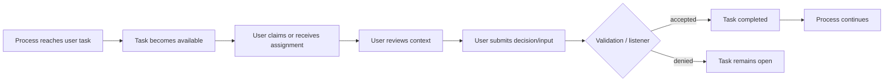
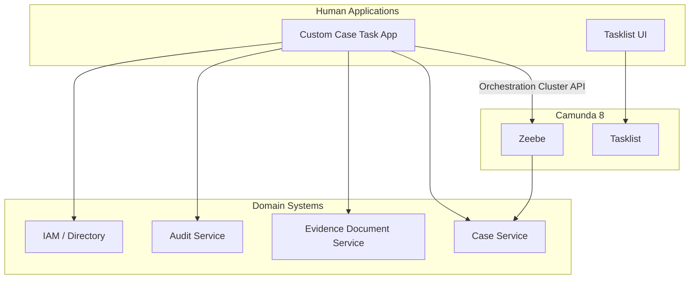
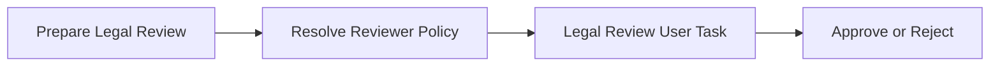
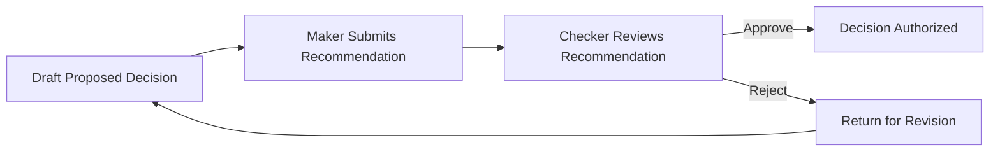
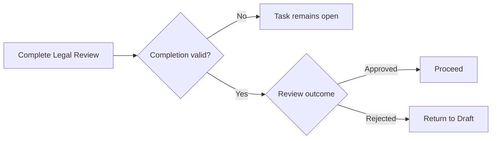
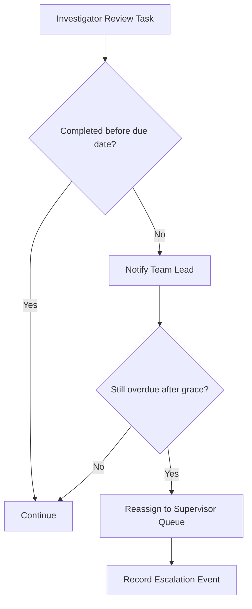
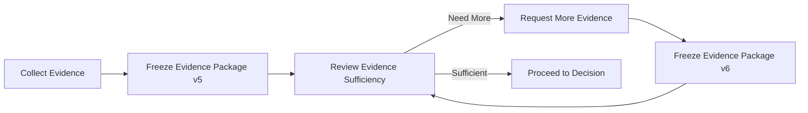
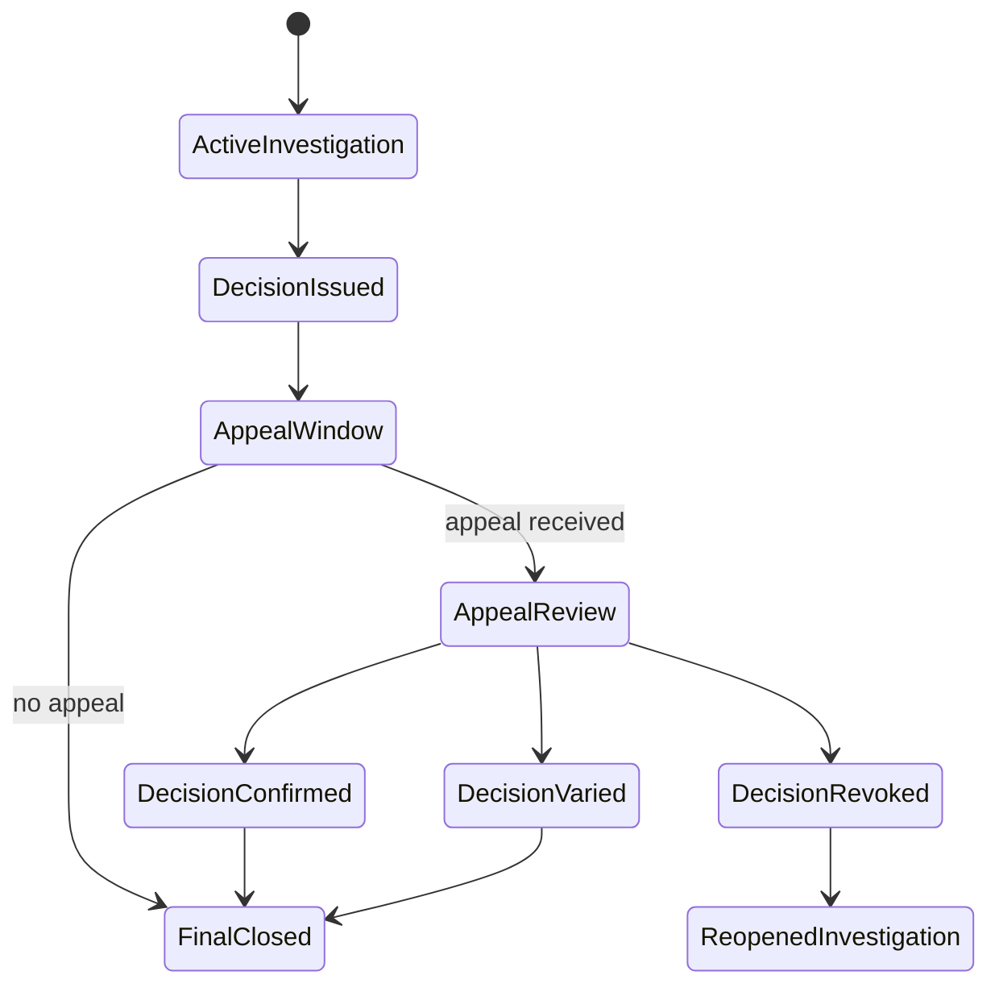
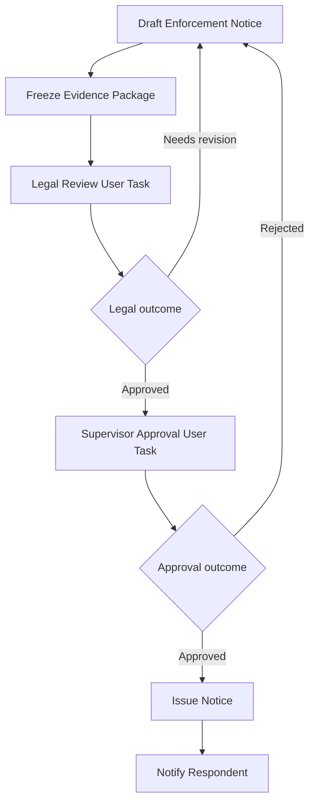

# Part 025 — Human-in-the-Loop Regulatory Workflows

Human workflow is where BPMN becomes legally and operationally serious.

A service task may call a system. A timer may enforce a deadline. A message may correlate an external event. But a user task often represents something more consequential:

- a person reviewed evidence;
- a person accepted accountability;
- a person approved a decision;
- a person rejected a submission;
- a person escalated a case;
- a person overrode an automated recommendation;
- a person certified that a regulatory action is defensible.

In low-stakes demos, a user task is treated as a to-do item.

In serious regulatory systems, a user task is a **controlled human decision boundary**.

That difference changes the architecture.

---

## 1. Kaufman Deconstruction

The skill is not “draw user tasks”.

The skill is **designing human decision checkpoints that are assignable, auditable, secure, reversible where appropriate, observable, and legally defensible**.

Break it down into subskills:

1. Distinguish human work from system work.
2. Model decision checkpoints explicitly.
3. Define task ownership and assignment rules.
4. Separate visibility from eligibility.
5. Design maker-checker and four-eyes approval.
6. Capture evidence and decision rationale.
7. Enforce validation before completion.
8. Model escalation and delegation.
9. Preserve audit trail without bloating process variables.
10. Keep Tasklist/custom UI concerns out of business process ownership.

For the first 20 hours, practice with one recurring scenario:

> A regulatory case goes through triage, investigation, evidence review, proposed decision, legal review, supervisory approval, notification, appeal window, and closure.

Every user task should answer:

- Who may see it?
- Who may claim it?
- Who may complete it?
- What evidence is required?
- What outcome does it produce?
- What happens if it is late?
- What happens if the person is unavailable?
- What audit record proves the work happened?

---

## 2. Core Mental Model

A user task is not just UI.

A user task is a **wait state** in the orchestration where the process pauses until a human interaction completes.



The workflow engine should not know every UI detail. But it must know the **business transition** that human completion represents.

Bad model:

```text
User Task: Do Work
Output: status = "done"
```

Better model:

```text
User Task: Review Evidence Sufficiency
Output:
  evidenceReview.outcome = SUFFICIENT | INSUFFICIENT | NEEDS_MORE_INFO
  evidenceReview.reviewer = authenticated user
  evidenceReview.reviewedAt = timestamp
  evidenceReview.rationale = structured reason
  evidenceReview.evidenceBundleVersion = immutable reference
```

The first model records activity.

The second model records a defensible decision.

---

## 3. Human Task Design Invariants

Use these invariants before adding any user task to a production model.

### 3.1 Every User Task Must Have a Business Outcome

A task called `Review Case` is usually too vague.

Prefer:

- `Classify Complaint`
- `Validate Evidence Sufficiency`
- `Approve Proposed Sanction`
- `Review Legal Basis`
- `Authorize Enforcement Notice`
- `Confirm Remediation Acceptance`

The task name should reveal the transition it controls.

### 3.2 The Completion Payload Must Be Explicit

A regulatory task should not complete with arbitrary form variables.

Define a task-specific contract:

```json
{
  "legalReview": {
    "outcome": "APPROVED",
    "reviewerUserId": "u-12345",
    "reviewedAt": "2026-06-28T10:15:30+07:00",
    "rationaleCode": "LEGAL_BASIS_SUFFICIENT",
    "comment": "Legal basis aligns with section 14 and evidence bundle v7.",
    "evidenceBundleRef": "doc-bundle-2026-CASE-991-v7"
  }
}
```

Do not let a generic form write random top-level variables into the process.

Use a named object per task outcome.

### 3.3 Authorization Is Not the Same as Assignment

Assignment answers:

> Who is responsible for this task?

Authorization answers:

> Who is allowed to read, claim, update, or complete this task?

Eligibility answers:

> Who should be considered a valid performer based on business rules?

These are related, but not identical.

Do not encode all three as a single string called `candidateGroup` and call it done.

### 3.4 Human Completion Must Be Idempotent at the Application Boundary

A user may double-click.

A browser may retry.

A task completion endpoint may timeout while the engine is still processing blocking listeners.

The task app should treat completion as a command with a stable command id:

```json
{
  "taskKey": "2251799813686261",
  "commandId": "complete-CASE-991-LEGAL-REVIEW-v3",
  "completedBy": "legal.officer.17",
  "payloadHash": "sha256:..."
}
```

Store the command attempt in your application boundary if completion has high consequence.

### 3.5 Audit Belongs to the Domain, Not Only to Tasklist

Tasklist can show task history, but regulatory audit often requires a domain-level audit event:

```text
LEGAL_REVIEW_APPROVED
CASE_ID = CASE-991
REVIEWER = legal.officer.17
EVIDENCE_BUNDLE_VERSION = 7
RATIONAL_CODE = LEGAL_BASIS_SUFFICIENT
PROCESS_INSTANCE_KEY = ...
USER_TASK_KEY = ...
TIMESTAMP = ...
```

The process audit trail and the domain audit trail should be correlatable.

They should not be the same thing.

---

## 4. User Task, Tasklist, and Custom Task Apps

Camunda Tasklist is a ready-to-use application for human workflows. It is useful when you need fast business task execution with standard task list behavior.

A custom task app is useful when the task requires:

- deep domain UI;
- complex evidence review;
- advanced document annotation;
- specialized authorization UX;
- custom inbox behavior;
- domain-specific validation;
- embedded case context;
- strict audit capture;
- bulk actions;
- cross-case workspace.

A mature architecture often uses both.



Tasklist should not become your case management system.

Your custom case application should not become an invisible workflow engine.

Camunda owns orchestration state. The domain app owns rich domain interaction.

---

## 5. Assignment Model

A user task can carry assignment metadata such as assignee, candidate users, candidate groups, due date, follow-up date, priority, and custom headers.

Treat assignment as a policy decision.

### 5.1 Static Assignment

Useful for stable operational roles.

```text
candidateGroups = ["case-triage-officer"]
```

Good for simple intake queues.

Weak for dynamic regulatory work where assignment depends on jurisdiction, product class, conflict of interest, seniority, or workload.

### 5.2 Expression-Based Assignment

Example:

```text
candidateGroups = =caseContext.jurisdiction + "-legal-reviewers"
```

This keeps routing in BPMN visible, but it can become fragile if group naming is not governed.

### 5.3 Domain-Resolved Assignment

Pattern:

1. BPMN reaches `Determine Legal Reviewer` service task.
2. Worker calls assignment policy service.
3. Worker writes explicit assignment metadata.
4. User task uses the resolved assignment.



This is better when routing policy is complex.

### 5.4 Dynamic Reassignment

Reassignment is not just UI convenience.

It can affect audit and accountability.

Capture:

- previous assignee;
- new assignee;
- reassigned by;
- reason;
- timestamp;
- whether SLA changed;
- whether conflict check was re-run.

---

## 6. Authorization Model and Task Visibility

Task visibility is security-sensitive.

In Camunda 8 modern Tasklist V2, do not assume candidate groups alone enforce visibility the way older task access restrictions did. Treat candidate users and candidate groups as task properties, and configure authorization deliberately.

Recommended design layers:

| Layer | Question | Example |
|---|---|---|
| IAM | Who is this user? | OIDC subject, groups, roles |
| Camunda component access | Can user access Tasklist? | `ACCESS` to Tasklist component |
| Process-level permission | Can user broadly access this process definition's tasks? | task manager/admin role |
| User-task authorization | Can regular task worker access tasks matching assignee/candidate property? | property-based authorization |
| Domain policy | Is this user allowed to act on this case? | conflict, jurisdiction, team, delegation |

The last layer is important.

Camunda can enforce orchestration permissions. Your domain may still need policy checks such as:

- user cannot approve their own recommendation;
- user cannot review a case where they have conflict of interest;
- junior officer cannot approve high-severity sanction;
- external reviewer can only see redacted evidence;
- supervisor can override only with reason code.

Do not collapse all regulatory authorization into BPMN candidate groups.

---

## 7. Maker-Checker Pattern

Maker-checker is a foundational regulatory workflow pattern.

One person prepares a decision. Another independently approves or rejects it.



### 7.1 Minimum Invariants

- Maker and checker must not be the same person.
- Checker must see the exact package the maker submitted.
- Maker cannot alter the package after checker review begins without restarting review.
- Checker decision must include outcome and rationale.
- Rejection should preserve the rejected package for audit.

### 7.2 Process Variable Shape

```json
{
  "proposedDecision": {
    "version": 4,
    "preparedBy": "officer.11",
    "preparedAt": "2026-06-28T09:30:00+07:00",
    "sanctionType": "ADMINISTRATIVE_FINE",
    "amount": 50000000,
    "evidenceBundleRef": "bundle-CASE-991-v4",
    "rationaleRef": "rationale-CASE-991-v4"
  },
  "approval": {
    "approvedBy": "supervisor.3",
    "approvedAt": "2026-06-28T11:00:00+07:00",
    "outcome": "APPROVED",
    "rationaleCode": "PROPORTIONATE_AND_EVIDENCE_SUPPORTED"
  }
}
```

Use immutable references for large rationale and evidence documents.

### 7.3 Listener Enforcement

A `completing` user task listener can deny completion if maker and checker are the same.

```java
final JobHandler fourEyesCompletionGuard = (jobClient, job) -> {
    var vars = job.getVariablesAsMap();
    var maker = getNested(vars, "proposedDecision.preparedBy");
    var checker = job.getUserTask().getAssignee();

    boolean samePerson = checker != null && checker.equals(maker);

    jobClient
        .newCompleteCommand(job)
        .withResult(r -> r.forUserTask().deny(samePerson))
        .send();
};
```

Keep this listener fast.

If the rule needs complex domain policy, call a dedicated policy service with timeout, circuit breaker, and clear failure behavior.

---

## 8. Four-Eyes vs Dual Control vs Committee Approval

These patterns are similar but not identical.

### 8.1 Four-Eyes

Exactly one preparer and one independent reviewer.

Use for:

- proposed sanction approval;
- evidence sufficiency review;
- legal basis check.

### 8.2 Dual Control

Two independent approvals are required, often with no hierarchy.

Use for:

- high-risk enforcement action;
- license suspension;
- irreversible external notification.

### 8.3 Committee Approval

A group deliberates and records a collective decision.

Use for:

- policy-sensitive cases;
- precedent-setting decisions;
- cross-agency action.

Model committee approval as its own process episode if it has agenda, quorum, minutes, votes, abstentions, and formal decision artifacts.

---

## 9. Task Completion Validation

Validation can live in multiple places.

| Validation Type | Best Location |
|---|---|
| Required form field | Camunda Form / frontend validation |
| Shape/schema validation | Task app boundary |
| Domain rule | Domain service or user task listener |
| Authorization rule | IAM + Camunda auth + domain policy |
| Cross-task invariant | Domain service or completing listener |
| Post-completion routing | BPMN gateway / DMN |

Do not put every rule in the form.

A malicious or broken client can bypass frontend validation.

Do not put every rule in BPMN either.

Some rules belong to the domain model and should be tested outside the process engine.

### 9.1 Validation Failure Semantics

There are three different outcomes:

1. **Reject user input before calling Camunda**.
2. **Deny task lifecycle transition via listener**.
3. **Complete task and route to rejection path**.

They mean different things.

Use deny when the completion command is invalid and should not become business history.

Use BPMN rejection path when the human made a valid business decision to reject.

Example:



Do not model invalid form submission as a business rejection.

---

## 10. User Task Listeners as Control Points

User task listeners let you run logic around task lifecycle events such as creating, assigning, updating, completing, and canceling.

They are implemented with job workers and block the lifecycle transition until completed.

That makes them powerful and dangerous.

### 10.1 Good Uses

- Validate completion payload.
- Enforce maker-checker rule.
- Correct assignee based on policy.
- Set due date or priority dynamically.
- Notify assignee on creation.
- Record domain audit event for task lifecycle transition.

### 10.2 Bad Uses

- Long-running document generation.
- Calling many unstable external systems.
- Replacing service tasks.
- Writing large process variables.
- Throwing BPMN business errors.
- Doing hidden routing logic outside BPMN.

### 10.3 Listener Reliability Rule

Because listeners block lifecycle transitions, a broken listener can freeze human work.

Every listener should have:

- bounded timeout;
- retry classification;
- observable logs;
- metrics by listener type;
- incident runbook;
- fallback path or manual repair procedure;
- no heavy synchronous dependency unless necessary.

---

## 11. Escalation Ladder Pattern

A regulatory task usually has a due date and an escalation path.



Design escalation as a business event, not a background surprise.

Capture:

- escalated task;
- previous assignee;
- escalation level;
- reason;
- SLA breach duration;
- notification recipient;
- reassignment result.

### 11.1 Boundary Timer vs Separate Watchdog

Use boundary timer when escalation is tightly bound to one task.

Use watchdog process when:

- SLA applies across multiple tasks;
- deadlines can be paused/resumed;
- escalation policy is shared across processes;
- the case may have many simultaneous obligations;
- operations need a central SLA dashboard.

---

## 12. Delegation and Reassignment

Delegation is not the same as reassignment.

| Concept | Meaning |
|---|---|
| Reassignment | Responsibility moves from A to B |
| Delegation | A remains accountable but B performs work |
| Escalation | Responsibility or visibility moves upward due to risk/time |
| Substitution | B acts because A is unavailable |

If accountability matters, model it explicitly.

Example variable:

```json
{
  "taskAccountability": {
    "owner": "supervisor.3",
    "delegate": "officer.19",
    "mode": "DELEGATED_REVIEW",
    "delegatedAt": "2026-06-28T13:00:00+07:00",
    "reason": "SUBJECT_MATTER_EXPERTISE"
  }
}
```

Do not hide accountability changes in comments.

---

## 13. Evidence Package Pattern

Human decisions should operate on a stable evidence package.

The package should be immutable for the duration of review.



A review should say:

> I reviewed package version 5 and concluded it was insufficient.

Not:

> I reviewed whatever evidence happened to be in the database at some point.

### 13.1 Process Variable Contract

```json
{
  "evidenceReview": {
    "packageRef": "evidence-package-CASE-991-v5",
    "packageHash": "sha256:...",
    "outcome": "INSUFFICIENT",
    "missingItems": ["BANK_STATEMENT", "LICENSE_HISTORY"],
    "reviewer": "investigator.4",
    "reviewedAt": "2026-06-28T14:00:00+07:00"
  }
}
```

The package itself belongs in a document/evidence service.

The process keeps references and decision outputs.

---

## 14. Appeals, Reopenings, and Human Workflow

Appeals and reopenings are not just loops.

They often change the legal status of the case.

Model them as named episodes:

- `Receive Appeal`
- `Assess Appeal Admissibility`
- `Review Appeal Merits`
- `Confirm, Vary, or Revoke Decision`
- `Notify Appeal Outcome`

Do not simply draw a line from closure back to investigation without recording why the case reopened.



BPMN can orchestrate the episodes.

A domain state machine should define the legal lifecycle.

---

## 15. Human Task Observability

Production human workflow needs metrics.

Minimum metrics:

- open tasks by task type;
- overdue tasks by severity;
- task age distribution;
- assignment latency;
- claim-to-completion duration;
- completion outcome distribution;
- reassignment count;
- listener failure count;
- denied completion count;
- SLA breach count;
- tasks blocked by incidents.

Do not rely only on process instance visibility.

Human operations need queue-level views.

### 15.1 Operational Dashboard Questions

A good dashboard answers:

- Which queues are overloaded?
- Which cases are blocked by human work?
- Which officers have overdue tasks?
- Which task types frequently get rejected?
- Which listeners are causing completion delays?
- Which cases are approaching statutory deadline?
- Which supervisors are holding approvals too long?

---

## 16. Modeling Example: Enforcement Notice Approval



### 16.1 Explicit Contracts

`Legal Review` writes:

```json
{
  "legalReview": {
    "outcome": "APPROVED",
    "reviewer": "legal.12",
    "legalBasisRefs": ["REG-14", "REG-22"],
    "rationaleRef": "legal-rationale-CASE-991-v2",
    "reviewedEvidencePackage": "evidence-package-CASE-991-v7"
  }
}
```

`Supervisor Approval` writes:

```json
{
  "supervisorApproval": {
    "outcome": "APPROVED",
    "approvedBy": "supervisor.3",
    "approvedAt": "2026-06-28T15:00:00+07:00",
    "approvalScope": "ISSUE_NOTICE",
    "conditions": []
  }
}
```

The process gateway should route on these explicit outcomes.

---

## 17. Anti-Patterns

### 17.1 User Task as Generic Inbox Item

Symptom:

```text
Task: Handle Case
```

Problem:

No clear outcome, weak audit, unclear SLA, hard operations.

Fix:

Split by decision boundary.

### 17.2 Candidate Group as Security Model

Symptom:

```text
candidateGroups = legal
```

Problem:

You assume task visibility, eligibility, and authorization are all solved.

Fix:

Use proper Tasklist/Orchestration Cluster authorization plus domain policy enforcement.

### 17.3 Form as Domain Model

Symptom:

Form fields directly become long-lived case state.

Problem:

Schema drift, weak validation, variable pollution.

Fix:

Map form submission into explicit task outcome object.

### 17.4 Human Decision Hidden in Comment

Symptom:

```json
{
  "comment": "looks ok"
}
```

Problem:

Cannot route, audit, report, or defend.

Fix:

Use structured outcome + rationale code + optional comment.

### 17.5 Listener as Secret Workflow

Symptom:

Completing listener calls five systems, changes assignment, sends notification, evaluates policy, and updates documents.

Problem:

Critical workflow is invisible and fragile.

Fix:

Keep listener to validation/correction. Put business sequence in BPMN/service tasks.

### 17.6 Same Person Approval

Symptom:

Maker completes checker task.

Problem:

Control failure.

Fix:

Enforce four-eyes in domain policy and completing listener.

### 17.7 Mutable Evidence During Review

Symptom:

Reviewer sees evidence that changes while reviewing.

Problem:

Decision cannot be defended later.

Fix:

Freeze evidence package and record package reference/hash.

---

## 18. Production Checklist

Before shipping a human workflow, verify:

- [ ] Every user task has a clear business outcome.
- [ ] Task names are decision-specific.
- [ ] Assignment policy is documented.
- [ ] Authorization model is configured and tested.
- [ ] Maker-checker/four-eyes rules are enforced where required.
- [ ] Completion payload has a typed contract.
- [ ] Invalid submission is separated from valid rejection.
- [ ] User task listeners are fast, observable, and have runbooks.
- [ ] Evidence is referenced immutably.
- [ ] Domain audit events can be correlated to user task keys.
- [ ] SLA and escalation behavior is explicit.
- [ ] Reassignment/delegation is auditable.
- [ ] Task metrics exist for operations.
- [ ] Custom task app retries are idempotent.
- [ ] Security review includes Tasklist and API access.

---

## 19. Exercises

### Exercise 1 — Split a Vague Human Workflow

Given:

```text
Task: Review Case
```

Split it into at least five defensible tasks with explicit outcomes.

Suggested answer:

- `Classify Complaint`
- `Validate Evidence Sufficiency`
- `Recommend Enforcement Action`
- `Review Legal Basis`
- `Approve Enforcement Notice`

### Exercise 2 — Define a Completion Contract

For `Approve Enforcement Notice`, define:

- required fields;
- optional fields;
- rationale codes;
- rejection outcomes;
- immutable references;
- audit event payload.

### Exercise 3 — Enforce Four-Eyes

Design a listener or domain policy check that prevents the maker from approving their own recommendation.

Include:

- happy path;
- denial behavior;
- error behavior;
- audit event;
- test cases.

### Exercise 4 — Design Escalation

For a legal review task due in three business days, define:

- first warning;
- escalation trigger;
- reassignment rule;
- SLA breach audit event;
- process path after escalation.

---

## 20. Key Takeaways

Human-in-the-loop orchestration is not about adding manual steps.

It is about controlling when human judgment changes the state of a business process.

In Camunda 8 Zeebe, high-quality human workflow design requires:

- explicit decision outcomes;
- clear task assignment;
- deliberate authorization;
- structured completion contracts;
- fast and reliable task listeners;
- immutable evidence references;
- auditable accountability;
- modeled escalation;
- separation between Tasklist, custom task apps, domain systems, and orchestration.

The best human workflows are not the ones with the most user tasks.

They are the ones where every human task represents a necessary, observable, defensible transition.

---

## References

- Camunda 8 Docs — User tasks: https://docs.camunda.io/docs/components/modeler/bpmn/user-tasks/
- Camunda 8 Docs — Tasklist introduction: https://docs.camunda.io/docs/components/tasklist/introduction-to-tasklist/
- Camunda 8 Docs — User task authorization: https://docs.camunda.io/docs/components/tasklist/user-task-authorization/
- Camunda 8 Docs — Orchestration Cluster authorization: https://docs.camunda.io/docs/components/concepts/access-control/authorizations/
- Camunda 8 Docs — User task listeners: https://docs.camunda.io/docs/components/concepts/user-task-listeners/
- Camunda 8 Docs — Complete user task API: https://docs.camunda.io/docs/apis-tools/orchestration-cluster-api-rest/specifications/complete-user-task/
