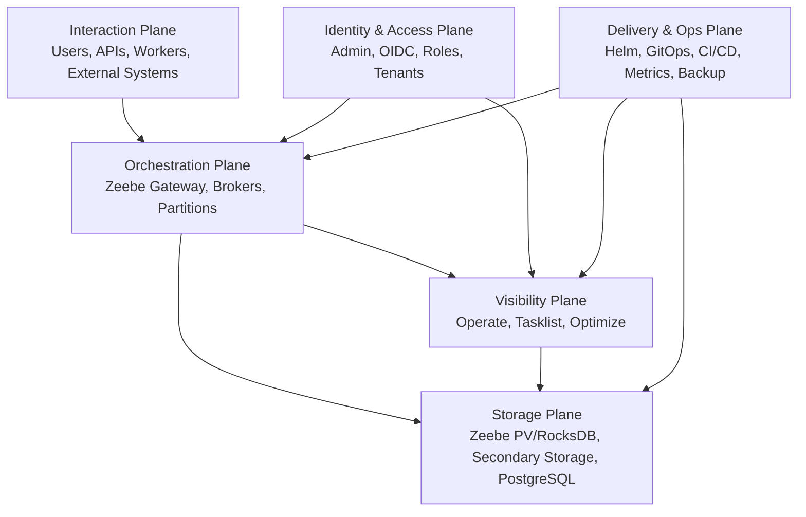
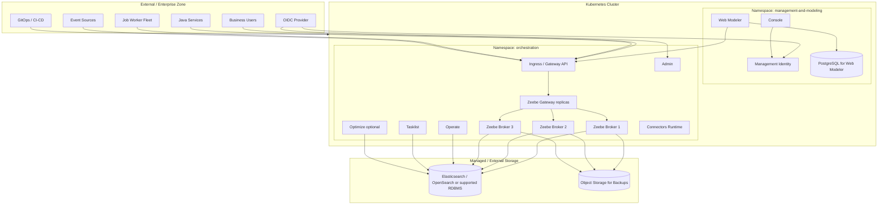
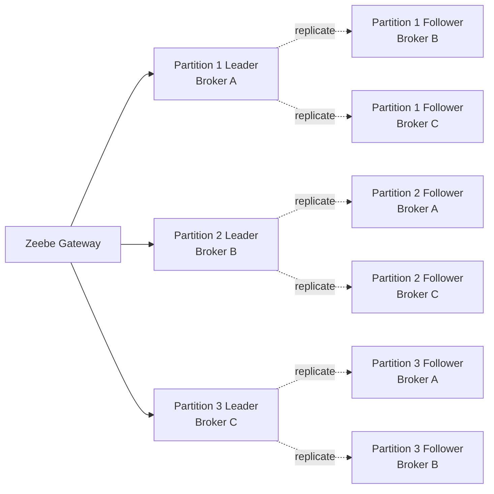
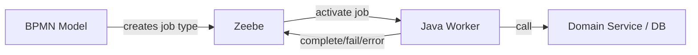
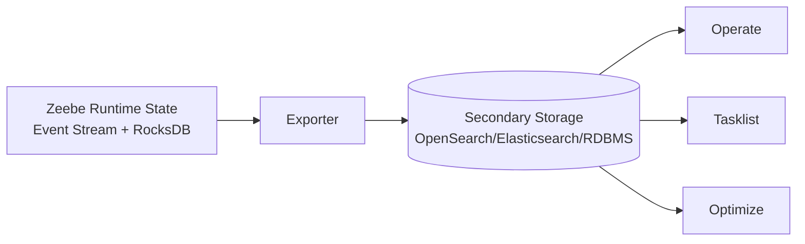
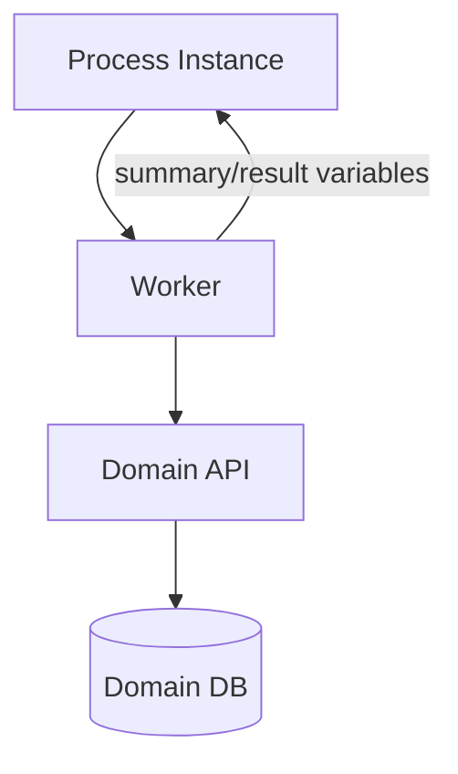
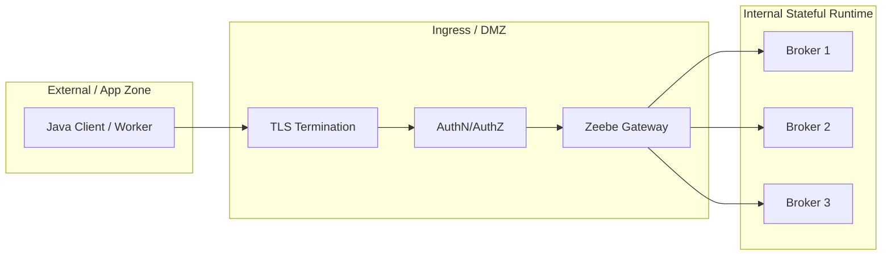
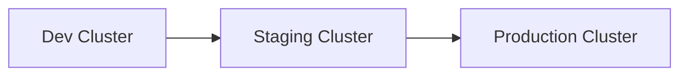
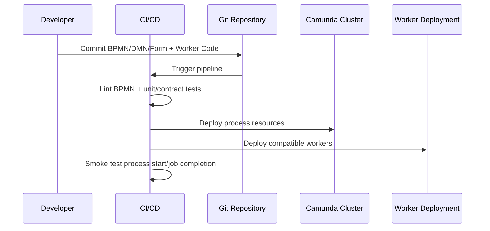
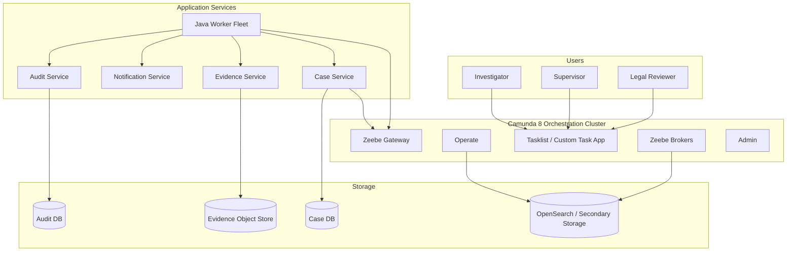

# Part 027 — Production Topology and Deployment

> Target bagian ini: mampu mendesain topology produksi Camunda 8/Zeebe yang masuk akal untuk enterprise system, bukan hanya menjalankan `docker compose` atau Helm quick install.

Di Camunda 7, production thinking sering berpusat pada application server, relational database, dan embedded/process-engine transaction. Di Camunda 8, pusat gravitasinya berpindah ke **remote orchestration runtime** yang terdiri dari Zeebe broker/gateway, API layer, secondary storage, identity, UI operasional, worker applications, dan deployment pipeline.

Kesalahan framing yang paling sering muncul:

> "Kita deploy Camunda 8 seperti service Spring Boot biasa."

Itu terlalu dangkal. Camunda 8 adalah **workflow orchestration platform**, bukan sekadar library. Topology-nya harus memperhitungkan stateful broker, partition, replication, persistent volume, ingress gRPC/HTTP, identity provider, secondary storage, worker fleet, observability, upgrade path, backup, dan boundary antar-environment.

---

## 1. Kaufman Lens: Pecah Skill Menjadi Sub-Skill Produksi

Mengikuti pendekatan Josh Kaufman, jangan belajar production deployment sebagai satu gumpalan besar. Pecah menjadi sub-skill kecil yang bisa dilatih dan divalidasi.

| Sub-skill | Pertanyaan inti | Output yang harus bisa dibuat |
|---|---|---|
| Platform boundary | Apa yang dimiliki Camunda, apa yang dimiliki aplikasi Java? | Architecture context diagram |
| Runtime topology | Di mana Zeebe broker, gateway, Operate, Tasklist, Admin berjalan? | Deployment topology diagram |
| State management | State mana yang authoritative, mana yang derived/read model? | Storage responsibility map |
| Network/API | Endpoint mana untuk client, worker, UI, admin, internal traffic? | Ingress/API routing design |
| Worker placement | Worker berjalan di cluster yang sama atau eksternal? | Worker deployment model |
| HA/fault tolerance | Komponen mana harus replicated, stateful, stateless, zone-aware? | Availability design |
| Environment promotion | Bagaimana BPMN, DMN, workers, configs dipromosikan? | Release pipeline design |
| Security | Bagaimana OIDC, secrets, TLS, service credentials, least privilege? | Access model |
| Operability | Bagaimana detect incident, stuck worker, backpressure, broker issue? | Runbook + dashboards |

**Practice objective 20 jam:** setelah bagian ini, kamu seharusnya bisa menggambar production topology Camunda 8 untuk satu domain enterprise, menjelaskan trade-off SaaS vs Self-Managed, dan membuat checklist deployment yang bisa direview oleh platform/security/SRE team.

---

## 2. Mental Model: Camunda 8 Production = 6 Plane

Untuk production architecture, jangan mulai dari pod/container. Mulai dari **plane**.



### 2.1 Interaction Plane

Tempat semua aktor eksternal berinteraksi:

- Java/Spring Boot services yang start process instance.
- Job workers yang activate/complete/fail jobs.
- UI internal yang menyelesaikan human tasks.
- External event sources yang publish message.
- Admin/operator yang membuka Operate/Tasklist/Admin.

### 2.2 Orchestration Plane

Tempat execution authority berada:

- Zeebe Gateway menerima command/API request.
- Zeebe Broker menyimpan dan memproses workflow state.
- Partition membagi stream/state untuk scalability.
- Replication menjaga fault tolerance.

### 2.3 Visibility Plane

Tempat manusia dan sistem observability melihat runtime:

- Operate untuk process instance, incidents, operational inspection.
- Tasklist atau custom task app untuk human task interaction.
- Optimize untuk process intelligence dan bottleneck analysis.

### 2.4 Identity & Access Plane

Tempat authentication dan authorization dikontrol:

- Admin pada Orchestration Cluster.
- Management Identity untuk komponen management/modeling tertentu.
- OIDC provider seperti Keycloak, Entra ID, Okta, atau IdP organisasi.
- Service credentials untuk workers dan process applications.

### 2.5 Storage Plane

Minimal ada tiga kategori storage:

1. **Primary runtime state**: Zeebe broker state/event stream dan RocksDB/snapshots.
2. **Secondary/read storage**: Elasticsearch/OpenSearch atau RDBMS untuk visibility/query components.
3. **Application/domain storage**: database milik layanan bisnis, bukan milik Camunda.

### 2.6 Delivery & Ops Plane

Mencakup:

- Helm chart.
- Kubernetes namespaces.
- GitOps/CI/CD.
- Secrets management.
- Backup/restore.
- Metrics/logging/tracing.
- Upgrade procedure.

---

## 3. SaaS vs Self-Managed: Keputusan Arsitektural, Bukan Preferensi Tool

Camunda 8 dapat digunakan sebagai SaaS atau Self-Managed. Pemilihan ini bukan sekadar "lebih mudah mana", tetapi soal control boundary.

### 3.1 SaaS Cocok Jika

- Tim ingin fokus pada process application, bukan operasi cluster.
- Compliance mengizinkan workflow runtime berada di managed cloud service.
- Kebutuhan custom infrastructure rendah.
- Team belum memiliki kapasitas SRE/Kubernetes untuk stateful distributed system.
- Time-to-market lebih penting daripada control penuh.

### 3.2 Self-Managed Cocok Jika

- Data residency, network isolation, atau regulatory requirement mengharuskan runtime berada di environment sendiri.
- Organisasi butuh kontrol penuh atas Kubernetes, storage, ingress, identity, backup, dan observability.
- Platform engineering maturity cukup tinggi.
- Integrasi internal sangat ketat dengan network/private services.
- Ada requirement high-control deployment, private cloud, atau strict audit.

### 3.3 Decision Matrix

| Faktor | SaaS | Self-Managed |
|---|---:|---:|
| Operational burden | Rendah | Tinggi |
| Infrastructure control | Terbatas | Penuh |
| Time-to-first-value | Cepat | Lebih lambat |
| Kubernetes expertise needed | Rendah | Tinggi |
| Custom network/security topology | Terbatas | Kuat |
| Backup/DR ownership | Largely provider-managed | Organisasi sendiri |
| Fit untuk strict internal data plane | Tergantung policy | Lebih kuat |
| Cost visibility | Subscription/service usage | Infrastruktur + operasi + license |

### 3.4 Invariant

> Pilih Self-Managed hanya jika organisasi siap mengoperasikan stateful distributed orchestration platform. Jika tidak, kompleksitasnya akan muncul sebagai incident produksi, bukan sebagai diagram arsitektur.

---

## 4. Reference Topology: Enterprise Self-Managed Baseline

Topology produksi paling sehat biasanya memisahkan **management/modeling** dari **orchestration runtime**.



### 4.1 Boundary Penting

- **Zeebe Broker** adalah stateful runtime; jangan perlakukan seperti stateless web app.
- **Zeebe Gateway** dapat diskalakan sebagai routing/contact point, tetapi scaling gateway tidak otomatis menaikkan processing capacity broker.
- **Operate/Tasklist** membaca dari visibility/read model, bukan sumber kebenaran utama execution state.
- **Workers** adalah aplikasi bisnis; seharusnya punya lifecycle deployment sendiri.
- **Secondary storage** penting untuk visibility/query, tapi bukan domain database dan bukan pengganti Zeebe runtime state.

---

## 5. Kubernetes dan Helm Baseline

Untuk Self-Managed production, baseline modern adalah Kubernetes + Helm. Ini bukan karena Kubernetes selalu mudah, tetapi karena Camunda 8 terdiri dari beberapa komponen yang membutuhkan scheduling, persistent volume, scaling, secret management, service discovery, dan rolling operation.

### 5.1 Namespace Strategy

Minimal:

```bash
kubectl create namespace management-and-modeling
kubectl create namespace orchestration
```

Gunakan namespace untuk memisahkan:

| Namespace | Isi | Reasoning |
|---|---|---|
| `management-and-modeling` | Console, Web Modeler, Management Identity | Tooling/platform management, bukan runtime execution core |
| `orchestration` | Orchestration Cluster, Zeebe, Operate, Tasklist, Admin, Connectors, Optimize | Runtime execution dan operational visibility |

Untuk enterprise besar, bisa ada namespace/cluster tambahan:

- `camunda-dev-orchestration`
- `camunda-stg-orchestration`
- `camunda-prod-orchestration`
- `camunda-prod-regulatory-orchestration`
- `camunda-prod-payment-orchestration`

Tetapi jangan terlalu cepat membuat banyak cluster. Fragmentasi cluster meningkatkan operational burden.

### 5.2 Values Files sebagai Architecture Contract

Jangan edit values file secara ad-hoc. Treat Helm values sebagai **platform contract**.

Contoh struktur repository:

```text
platform-camunda8/
  environments/
    dev/
      orchestration-values.yaml
      management-values.yaml
    staging/
      orchestration-values.yaml
      management-values.yaml
    prod/
      orchestration-values.yaml
      management-values.yaml
  modules/
    ingress/
    identity/
    zeebe/
    secondary-storage/
    observability/
  runbooks/
    backup.md
    scaling.md
    incident-resolution.md
    upgrade.md
```

Invariant:

> Tidak boleh ada konfigurasi production yang hanya diketahui lewat klik UI atau shell history. Semua harus reproducible dari Git + secrets manager.

---

## 6. Zeebe Broker and Gateway Topology

### 6.1 Gateway

Zeebe Gateway adalah contact point untuk client. Worker, Java service, dan event publisher tidak perlu tahu partition leader. Gateway menerjemahkan request dan meneruskannya ke broker/partition yang tepat.

Gateway cocok untuk diskalakan ketika:

- Banyak client connection.
- Banyak API request dari worker/application.
- Network ingress menjadi bottleneck.
- Butuh HA/load balancing untuk client-facing entry point.

Tetapi gateway bukan tempat workflow dieksekusi. Jika bottleneck ada pada broker partition, menambah gateway tidak menyelesaikan masalah inti.

### 6.2 Broker

Zeebe broker adalah distributed workflow engine yang:

- Memproses command.
- Menulis event stream.
- Menjaga state active process instance.
- Mengelola jobs, timers, messages, incidents.
- Mengekspor records ke secondary storage/exporters.

Broker harus diperlakukan sebagai **stateful workload** dengan persistent volume, resource planning, dan zone-aware placement.

### 6.3 Partition

Partition adalah unit logical sharding. Setiap partition adalah append-only event stream. Processing dilakukan oleh leader partition; follower mereplikasi data untuk fault tolerance.



### 6.4 Replication Factor

Untuk fault tolerance, gunakan odd replication factor. Replication factor genap biasanya tidak memberi benefit availability yang sebanding dengan overhead-nya.

Contoh mental model:

| Brokers | Partitions | Replication Factor | Interpretasi |
|---:|---:|---:|---|
| 1 | 1 | 1 | Dev/local only |
| 3 | 3 | 3 | Common small production baseline |
| 5 | 5+ | 3 | Lebih banyak processing distribution, tetap RF 3 |
| 5 | 5+ | 5 | Higher fault tolerance, higher replication cost |

Jangan copy angka tanpa load model. Partition count, broker count, worker throughput, message volume, timer volume, incident volume, dan exporter throughput harus dilihat bersama.

---

## 7. Worker Placement: In-Cluster vs External

Job workers adalah aplikasi bisnis. Mereka bisa berjalan di Kubernetes cluster yang sama atau di luar cluster.

### 7.1 Workers in Same Kubernetes Cluster

Cocok jika:

- Worker mengakses internal services via Kubernetes service discovery.
- Network latency rendah penting.
- Platform team mengelola deployment workers dan Camunda bersama.
- Security policy mengizinkan worker berada di namespace aplikasi.

Kelebihan:

- Easier service discovery.
- Easier observability integration.
- Consistent deployment model.
- Easier secrets injection.

Risiko:

- Resource contention dengan Camunda runtime.
- Blast radius jika worker buruk menghabiskan CPU/memory/network.
- Namespace/resource quota harus jelas.

### 7.2 Workers Outside Cluster

Cocok jika:

- Worker berada di existing application platform.
- Camunda cluster harus strictly isolated.
- Worker butuh akses ke systems yang tidak tersedia dari Camunda Kubernetes network.
- Multi-language workers tersebar di beberapa platform.

Kelebihan:

- Decoupled application lifecycle.
- Blast radius lebih mudah dipisahkan.
- Cocok untuk brownfield architecture.

Risiko:

- Network path lebih kompleks.
- gRPC/REST ingress harus aman dan observable.
- Latency dan timeout perlu diperhitungkan.
- Credential distribution lebih luas.

### 7.3 Recommended Boundary

> Camunda runtime bukan tempat business logic. Business logic hidup di workers/services. Runtime mengorkestrasi, workers mengeksekusi side effect.



---

## 8. Storage Topology

### 8.1 Primary Runtime Storage

Zeebe broker menyimpan runtime state dan event log pada persistent storage. Ini adalah execution source of truth untuk workflow state.

Konsekuensi:

- PVC deletion bisa berarti kehilangan process definitions/instances jika tidak ada backup yang valid.
- StorageClass reclaim policy penting.
- Disk latency mempengaruhi processing latency.
- Backup/restore harus diuji, bukan hanya dikonfigurasi.

### 8.2 Secondary Storage

Secondary storage dipakai untuk visibility/query components seperti Operate, Tasklist, Optimize, dan exported records.

Pilihan umum:

- Elasticsearch/OpenSearch.
- Supported RDBMS untuk subset komponen/konfigurasi terbaru.

Mental model:



Hal yang tidak boleh salah:

> Secondary storage bukan domain database, bukan canonical process runtime, dan bukan tempat aplikasi bisnis bergantung untuk transactional decision.

### 8.3 Application Domain Storage

Domain services tetap memiliki database sendiri:



Camunda variables sebaiknya menyimpan:

- ID referensi.
- Snapshot keputusan penting.
- Status ringkas.
- Metadata audit yang relevan.

Bukan:

- Seluruh aggregate domain.
- Binary file.
- Large nested payload.
- Sensitive data tanpa kebutuhan workflow.

---

## 9. Ingress and API Exposure

### 9.1 API Paths

Camunda 8 dapat mengekspos REST dan gRPC. Dalam topology modern, pikirkan ingress sebagai security boundary.

| Traffic | Contoh caller | Exposure |
|---|---|---|
| UI traffic | Users/operators | HTTPS via Ingress |
| REST API | Java services, admin tools | Internal or restricted external HTTPS |
| gRPC API | Workers/clients using gRPC | Dedicated gRPC ingress, if needed |
| Internal broker traffic | Brokers/gateway | Cluster-internal only |
| Secondary storage | Camunda components | Private/internal only |

### 9.2 DMZ Pattern

Zeebe Gateway dapat menjadi contact point yang melindungi broker dari direct external access.



### 9.3 Production Rules

- Jangan expose broker langsung ke public internet.
- Gunakan TLS untuk ingress.
- Gunakan OIDC/service credentials sesuai environment.
- Segmentasi network untuk secondary storage.
- Pisahkan endpoint human UI dan machine API bila security policy menuntut.
- Dokumentasikan client origin: service mana boleh deploy process, start process, publish message, activate job.

---

## 10. Environment Strategy

### 10.1 Minimal Environment



Minimal sehat:

| Environment | Tujuan | Karakter |
|---|---|---|
| Dev | Developer feedback | Smaller, fast reset acceptable |
| Staging | Pre-prod verification | Similar topology, smaller capacity |
| Prod | Real workload | HA, backup, monitoring, strict change control |

### 10.2 Jangan Samakan Dev dengan Production

Dev boleh memakai:

- Lower replication.
- Smaller broker count.
- Simplified ingress.
- Disposable data.

Production harus memiliki:

- HA-aware deployment.
- Backup/restore tested.
- OIDC integration.
- TLS.
- Resource requests/limits.
- Operational dashboards.
- Runbooks.
- Upgrade process.

### 10.3 Environment Promotion

BPMN/DMN/forms dan workers harus dipromosikan bersama dengan compatibility discipline.



Release invariant:

> Jangan deploy BPMN yang menghasilkan job type baru sebelum worker kompatibel tersedia, kecuali model memang dirancang menunggu sampai worker hadir.

---

## 11. Deployment Unit: BPMN, Worker, Config, and Permission

Satu perubahan business process biasanya menyentuh beberapa artifact:

| Artifact | Contoh | Failure jika tidak sinkron |
|---|---|---|
| BPMN | service task `assess-case-risk` | Job dibuat tapi worker tidak ada |
| DMN | `risk-classification` | Gateway path salah |
| Form | evidence review form | User task tidak bisa complete dengan data benar |
| Worker code | Java worker implementation | Job fail atau output contract berubah |
| Config | timeout, retry, endpoint | Incident atau latency spike |
| Permission | user/role/task visibility | Task tidak terlihat atau unauthorized |
| Monitoring | alert/rules/dashboard | Failure tidak terdeteksi |

### 11.1 Safe Deployment Order

Umumnya:

1. Deploy backward-compatible worker terlebih dahulu.
2. Deploy BPMN/DMN/forms baru.
3. Run smoke tests.
4. Observe jobs/incidents/messages/timers.
5. Remove old worker support setelah tidak ada process instance lama yang membutuhkannya.

### 11.2 Versioned Worker Pattern

```text
Job type v1: assess-case-risk
Job type v2: assess-case-risk-v2
```

Gunakan versioned job type jika:

- Input/output contract berubah incompatible.
- Semantics berubah material.
- Business audit membutuhkan clear trace.

Jangan version job type untuk perubahan internal yang backward-compatible.

---

## 12. Multi-Orchestration Cluster Strategy

Camunda 8 mendukung beberapa orchestration cluster. Tetapi jangan jadikan ini default untuk semua domain.

### 12.1 Kapan Perlu Cluster Terpisah

- Strong regulatory isolation.
- Different data residency boundary.
- Different availability class.
- Different tenant/security model.
- Workload sangat besar dan membutuhkan isolation.
- Different release cadence yang tidak kompatibel.

### 12.2 Kapan Jangan

- Hanya karena beda team.
- Hanya karena beda process definition.
- Hanya karena ingin “rapi”.
- Hanya karena belum ada governance naming.

Cluster proliferation menyebabkan:

- More upgrades.
- More backups.
- More dashboards.
- More credentials.
- More network policies.
- More operational incidents.

### 12.3 Better First Step

Sebelum cluster split, coba:

- Tenant separation.
- Naming convention.
- Authorization boundary.
- Worker namespace separation.
- Process ownership registry.
- Resource quota.

---

## 13. Production Deployment Checklist

### 13.1 Platform Readiness

- [ ] Kubernetes cluster ready with tested persistent volumes.
- [ ] Helm chart version pinned.
- [ ] Separate values files per environment.
- [ ] Production namespaces created and owned.
- [ ] Resource requests/limits configured.
- [ ] Node pools / zone placement reviewed.
- [ ] Pod disruption behavior reviewed.
- [ ] Backup object storage configured.
- [ ] Restore procedure tested.

### 13.2 Zeebe Runtime

- [ ] Broker count chosen from load/HA model.
- [ ] Partition count chosen before production scale.
- [ ] Replication factor chosen deliberately.
- [ ] Persistent volume class reviewed.
- [ ] Disk latency monitored.
- [ ] Gateway replicas sized for client traffic.
- [ ] gRPC/REST ingress secured.
- [ ] Internal broker traffic not exposed publicly.

### 13.3 Secondary Storage

- [ ] OpenSearch/Elasticsearch/RDBMS choice documented.
- [ ] Managed production service preferred where possible.
- [ ] Retention policy defined.
- [ ] Snapshot/backup configured.
- [ ] Capacity planning includes Operate/Tasklist/Optimize usage.

### 13.4 Security

- [ ] OIDC provider integrated.
- [ ] TLS configured for ingress.
- [ ] Secrets stored outside Git.
- [ ] Service credentials rotated.
- [ ] Least privilege for workers/process apps.
- [ ] Admin access restricted.
- [ ] Audit access reviewed.

### 13.5 Application Integration

- [ ] Workers have idempotency strategy.
- [ ] Workers have timeout/retry/backoff policy.
- [ ] Job types documented.
- [ ] BPMN/worker contract tests exist.
- [ ] Smoke test deploys process and completes at least one happy-path instance.
- [ ] Failure path tested: fail job, BPMN error, incident.

### 13.6 Observability

- [ ] Zeebe metrics scraped.
- [ ] Backpressure alert configured.
- [ ] Incident alert configured.
- [ ] Worker failure rate alert configured.
- [ ] Exporter/secondary storage health monitored.
- [ ] Operate access available to support team.
- [ ] Runbook links attached to alerts.

---

## 14. Common Deployment Anti-Patterns

### 14.1 Docker Compose in Production

Docker Compose is fine for local learning and demos. It is not a production HA strategy.

Symptoms:

- No real HA.
- Manual recovery.
- Weak secret management.
- Weak backup story.
- No zone-aware scheduling.

### 14.2 Stateless Thinking for Brokers

Treating brokers as horizontally replaceable stateless pods leads to data-loss risk.

Correct mental model:

> Brokers are stateful distributed event processors. Their data plane deserves the same seriousness as a database cluster.

### 14.3 Worker and Runtime in Same Failure Domain Without Quotas

If worker fleet can starve broker CPU/network, orchestration runtime becomes hostage to application bugs.

Mitigation:

- Namespace separation.
- Resource quotas.
- Horizontal scaling policy.
- Circuit breakers.
- Worker concurrency limits.

### 14.4 Secondary Storage as Source of Truth

Operate/Tasklist/Optimize visibility is not the same as authoritative execution state.

Bad usage:

- Business service queries Operate index to decide domain command.
- Compliance report depends on unstable internal read model without export contract.
- Application uses secondary storage as process API.

### 14.5 Unversioned Process + Worker Breaking Change

A process model deployed today may create jobs tomorrow for old process instances. Worker compatibility must outlive deployment moment.

### 14.6 Exposing Everything Through One Public Ingress

Human UI, REST API, gRPC workers, admin, and internal services have different risk profiles. A single broad ingress increases attack surface.

### 14.7 No Backup Drill

A backup that has never been restored is a theory.

---

## 15. Example: Regulatory Enforcement Platform Topology

Scenario:

- Cases are long-running.
- Human approvals are legally significant.
- Documents/evidence must be retained.
- Escalation deadlines are strict.
- Workers integrate with registry, sanctions, notification, document, and audit services.

Recommended topology:



Key design choices:

- Case DB remains domain source of truth.
- Camunda orchestrates lifecycle and waits.
- Evidence binary stored outside Camunda variables.
- Worker fleet is independently deployable.
- Human decisions captured via task completion + audit service.
- Operate used for operational support, not domain query.

---

## 16. Production Topology Review Questions

Before approving a Camunda 8 deployment, ask:

1. What is the authoritative source for process execution state?
2. What is the authoritative source for domain state?
3. Which traffic enters via REST, gRPC, or UI?
4. Are brokers directly exposed? If yes, why?
5. What happens if one broker pod dies?
6. What happens if secondary storage is slow?
7. What happens if all workers for one job type are down?
8. What happens if a new BPMN version creates job type unknown to current workers?
9. How do we restore after PVC deletion or cluster loss?
10. How do we prove who approved a human task?
11. How do we roll back worker code while process instances are active?
12. Are secrets and identity configuration reproducible?
13. Does staging resemble production enough to catch topology failures?
14. Which dashboards prove runtime health?
15. Which runbook owns incident resolution?

---

## 17. Minimal Production Blueprint

A defensible baseline:

```text
Camunda 8 Self-Managed Production Baseline

Kubernetes:
  - Dedicated production cluster or dedicated node pools
  - Namespace separation: orchestration, management/modeling
  - TLS ingress
  - OIDC integration
  - Secret manager integration

Zeebe:
  - Multiple brokers
  - Standalone gateway replicas
  - Persistent volumes with reviewed reclaim policy
  - Partition/replication plan
  - Backup configured and tested

Storage:
  - Managed PostgreSQL for Web Modeler if used
  - Managed OpenSearch/Elasticsearch or supported RDBMS secondary storage
  - Backup/snapshot policy

Workers:
  - Separate deployment lifecycle
  - Idempotency strategy
  - Contract tests
  - Resource quotas
  - Observability

Operations:
  - Metrics + logs + alerts
  - Operate support access
  - Scaling runbook
  - Upgrade runbook
  - DR runbook
```

---

## 18. Summary

Production Camunda 8 deployment is not "installing a workflow engine". It is building a small orchestration platform.

Core invariants:

- Zeebe broker is stateful and must be treated like critical data infrastructure.
- Gateway is a contact/router layer, not execution capacity by itself.
- Secondary storage enables visibility; it is not the execution source of truth.
- Workers are application services and must be independently deployable, observable, and idempotent.
- Kubernetes + Helm gives a production baseline, but only if storage, identity, ingress, backup, resource planning, and runbooks are real.
- Production readiness is proven by failure drills, not by successful installation.

In the next part, we move from topology to **scaling, performance, and backpressure**: what actually scales in Zeebe, what does not, how partitions and workers affect throughput, and how to reason about bottlenecks without cargo-cult tuning.

---

## References

- Camunda Docs — Kubernetes deployment overview: https://docs.camunda.io/docs/self-managed/reference-architecture/kubernetes/
- Camunda Docs — Camunda 8 reference architectures: https://docs.camunda.io/docs/self-managed/reference-architecture/
- Camunda Docs — Install Camunda for production with Helm: https://docs.camunda.io/docs/self-managed/deployment/helm/install/production/
- Camunda Docs — Zeebe Gateway overview: https://docs.camunda.io/docs/self-managed/components/orchestration-cluster/zeebe/zeebe-gateway/overview/
- Camunda Docs — Zeebe partitions: https://docs.camunda.io/docs/components/zeebe/technical-concepts/partitions/
