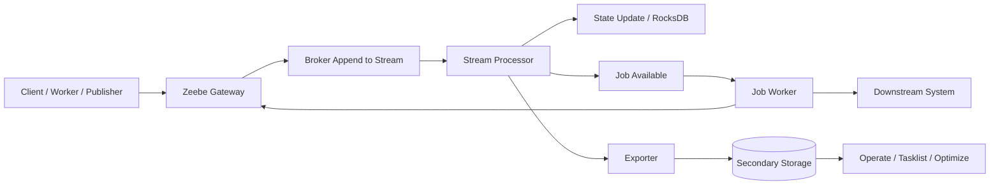
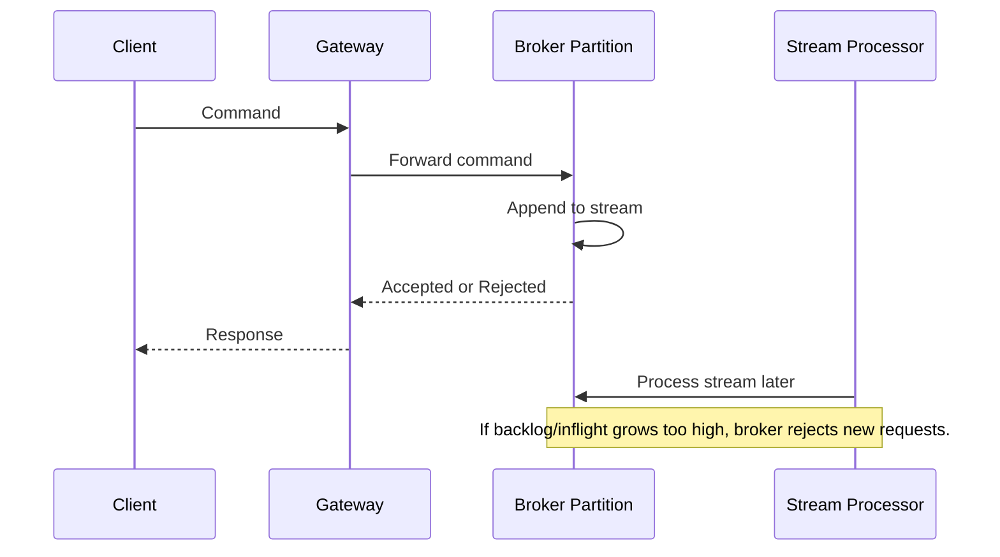
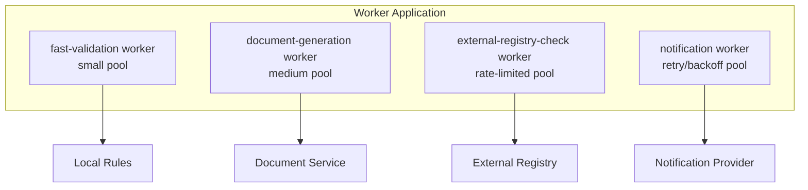
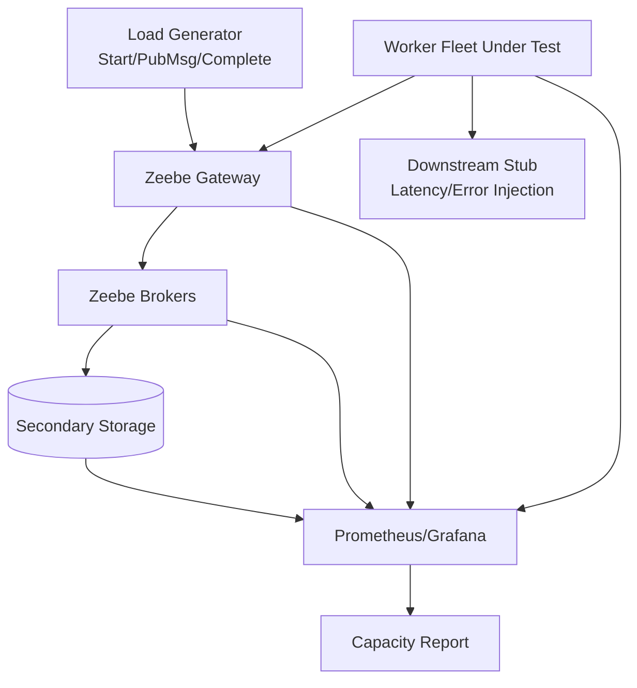

# Part 028 — Scaling, Performance, and Backpressure

> Target bagian ini: mampu mendiagnosis bottleneck Camunda 8/Zeebe secara struktural: apakah masalah ada di gateway, broker partition, disk, exporter, secondary storage, worker fleet, downstream service, message publisher, timer volume, atau client retry behavior.

Performance tuning Camunda 8 tidak bisa dilakukan dengan satu knob. Ini distributed orchestration system. Throughput dan latency muncul dari interaksi beberapa subsystem:

- Gateway menerima dan merutekan request.
- Broker menulis command ke stream.
- Stream processor memproses command menjadi event/rejection.
- Partition leader menanggung processing aktif.
- Replication menjaga fault tolerance.
- Exporter mengirim record ke secondary storage.
- Workers mengambil job dan menjalankan side effect.
- Downstream systems memberi latency dan failure.
- Clients melakukan retry, polling, dan message publishing.

Kesalahan umum:

> "Tambah pod Camunda saja biar cepat."

Itu belum tentu benar. Menambah gateway tidak mempercepat partition yang bottleneck. Menambah worker tidak membantu jika downstream service lambat. Menambah broker tidak otomatis menaikkan kapasitas jika partition count tidak mendukung distribusi workload. Menambah partition tidak boleh sembarangan karena partition count tidak bisa diturunkan.

---

## 1. Kaufman Lens: Latihan Performance sebagai Feedback Loop

Belajar performance harus berbasis feedback loop cepat:

1. Buat hypothesis.
2. Jalankan load test terkontrol.
3. Ukur bottleneck.
4. Ubah satu variabel.
5. Bandingkan hasil.
6. Simpan tuning decision sebagai runbook.

Skill kecil yang harus dikuasai:

| Sub-skill | Pertanyaan inti | Bukti mastery |
|---|---|---|
| Bottleneck mapping | Komponen mana yang benar-benar lambat? | Bottleneck diagram |
| Partition reasoning | Workload tersebar ke partition mana? | Partition/load explanation |
| Worker tuning | Berapa concurrency aman? | Worker capacity model |
| Backpressure handling | Apa yang harus dilakukan client saat request ditolak? | Retry/backoff policy |
| Load testing | Apakah test mewakili workload nyata? | Load scenario matrix |
| Metrics interpretation | Metrik mana menunjukkan root cause? | Dashboard + alert rule |
| Capacity planning | Berapa headroom sebelum peak? | Sizing model |

---

## 2. Performance Mental Model

Gunakan model pipeline:



Latency bisa muncul di setiap edge:

| Stage | Bottleneck contoh |
|---|---|
| Client → Gateway | Network, TLS, ingress, connection pool |
| Gateway → Broker | Gateway saturation, topology routing, broker overload |
| Append stream | Disk latency, partition backlog |
| Stream processor | CPU, state size, timer/message/job volume |
| RocksDB/state | Memory, disk IO, snapshots |
| Job activation | Worker capacity, maxJobsActive, polling pattern |
| Worker execution | Downstream latency, thread pool, blocking IO |
| Job completion | Client retry storm, gateway/backpressure |
| Exporter | Secondary storage slow, exporter lag |
| UI/query | Operate/Tasklist index/storage pressure |

---

## 3. What Actually Scales in Zeebe

### 3.1 Gateways Scale Client Entry Capacity

Gateway replicas help when:

- Many client connections.
- High request volume before broker bottleneck.
- Need HA for ingress/API point.
- Need separate network exposure from brokers.

Gateway replicas do **not** solve:

- Slow partition processing.
- Insufficient broker disk IO.
- Slow workers.
- Slow downstream systems.
- Exporter lag.

### 3.2 Brokers Scale Runtime Capacity With Partitions

Brokers execute work by leading partitions. More brokers only help if work can be distributed across partitions and if leaders are balanced.

Important nuance:

- A broker can lead zero, one, or multiple partitions.
- Followers replicate but do not actively process events unless failover elects them leader.
- Partition distribution matters more than pod count alone.

### 3.3 Partitions Scale Processing Parallelism

Partition count determines how many logical event streams can be processed in parallel. More partitions can increase parallelism, but also increase:

- Operational complexity.
- Memory/storage footprint.
- Export volume.
- Monitoring surface.
- Redistribution complexity.

Critical invariant:

> Partition count can be increased, but not decreased. Treat initial partition count as an architectural decision, not a runtime tweak.

### 3.4 Workers Scale Business Execution Capacity

Workers are often the easiest and safest scaling axis because they are stateless or semi-stateless application services.

But worker scaling only helps if:

- There are enough jobs available.
- Zeebe can activate jobs fast enough.
- Downstream systems can handle additional load.
- Worker code is idempotent.
- Worker thread pool/concurrency is configured correctly.

### 3.5 Secondary Storage Scales Visibility, Not Execution

Operate/Tasklist/Optimize depend on exported data. Slow secondary storage may hurt visibility and exporter progress, but it is not the same as worker business throughput.

However, export backlog can become operationally important because it affects observability, retention, and in some cases cluster health/headroom.

---

## 4. Bottleneck Taxonomy

### 4.1 Gateway Bottleneck

Symptoms:

- High gateway CPU/network.
- Increased client request latency.
- Connection saturation.
- Broker metrics not saturated.
- Adding gateway replicas improves throughput.

Actions:

- Add gateway replicas.
- Tune ingress/LB.
- Reuse client connections.
- Separate REST/gRPC traffic if needed.
- Avoid noisy clients.

### 4.2 Broker Partition Bottleneck

Symptoms:

- Backpressure increases.
- Stream processor latency increases.
- One or a few partition leaders hotter than others.
- Disk IO or CPU high on leader brokers.
- Client retries increase.

Actions:

- Identify hot partition.
- Reduce command rate.
- Tune clients and workers.
- Review partition count.
- Review disk performance.
- Review timer/message/job design.

### 4.3 Worker Bottleneck

Symptoms:

- Jobs remain available/activated too long.
- Worker latency high.
- Job timeouts increase.
- Retry/failure events increase.
- Downstream service latency high.

Actions:

- Increase worker instances if downstream can handle it.
- Increase concurrency carefully.
- Split job type by workload class.
- Reduce fetched variables.
- Tune timeout.
- Add idempotency and circuit breaker.

### 4.4 Downstream Bottleneck

Symptoms:

- Worker threads blocked on HTTP/database calls.
- Worker CPU low but latency high.
- Downstream error rate increases when worker count increases.
- Job retries create traffic amplification.

Actions:

- Protect downstream with rate limits.
- Use bulkhead/thread pools.
- Apply exponential backoff.
- Reduce concurrency.
- Move slow side effect to asynchronous pattern.
- Use domain-level idempotency.

### 4.5 Secondary Storage Bottleneck

Symptoms:

- Operate/Tasklist lagging behind runtime.
- Exporter-related latency/lag grows.
- Query UI slow.
- OpenSearch/Elasticsearch/RDBMS CPU/disk high.

Actions:

- Scale secondary storage.
- Review retention/index settings.
- Reduce unnecessary variable payload.
- Avoid massive variables.
- Separate operational visibility from analytical export.

### 4.6 Client Retry Storm

Symptoms:

- Backpressure causes clients to retry aggressively.
- Retry rate overwhelms gateway/broker.
- More failures cause more traffic.
- System does not recover until clients are throttled.

Actions:

- Exponential backoff with jitter.
- Respect retryable vs non-retryable errors.
- Circuit breaker on publishers/workers.
- Limit concurrent start/publish/complete commands.
- Apply queue-based smoothing upstream.

---

## 5. Backpressure Mental Model

Backpressure is Zeebe protecting itself.

When a broker receives requests faster than it can process them with acceptable latency, it may reject new requests instead of allowing unbounded backlog growth. This is good. It prevents a slow system from turning into a dead system.



### 5.1 What Backpressure Is Not

Backpressure is not:

- A random error.
- Proof that Camunda is broken.
- Something to ignore with infinite retries.
- Something solved only by bigger pods.

Backpressure is signal:

> The system is telling clients: slow down, or you will make recovery worse.

### 5.2 Client Behavior Under Backpressure

Correct behavior:

- Retry only retryable failures.
- Use exponential backoff.
- Add jitter.
- Cap maximum retry duration.
- Reduce local concurrency when repeated backpressure appears.
- Surface metrics.

Bad behavior:

- Immediate retry loop.
- Infinite retry with no jitter.
- Spawning more workers when broker is already rejecting.
- Treating all errors as business failures.
- Logging only stack traces without labels/tags.

### 5.3 Java Client Pattern

Pseudo-code pattern:

```java
public final class ZeebeCommandExecutor {

    private final CamundaClient client;
    private final RetryPolicy retryPolicy;

    public ZeebeCommandExecutor(CamundaClient client, RetryPolicy retryPolicy) {
        this.client = client;
        this.retryPolicy = retryPolicy;
    }

    public void startCaseProcess(String caseId, Map<String, Object> variables) {
        retryPolicy.execute("start-case-process", () ->
            client
                .newCreateInstanceCommand()
                .bpmnProcessId("regulatory-case-lifecycle")
                .latestVersion()
                .variables(variables)
                .send()
                .join()
        );
    }
}
```

The important part is not the exact class shape. The invariant is:

> Every command path that can hit broker/gateway overload must have explicit retry/backoff semantics and metrics.

---

## 6. Worker Scaling Model

### 6.1 Throughput Formula

A simplified worker throughput model:

```text
worker_throughput_per_second ≈ concurrent_jobs / average_job_duration_seconds
```

Example:

```text
10 concurrent jobs / 0.5 second avg duration = 20 jobs/sec
10 concurrent jobs / 5.0 second avg duration = 2 jobs/sec
```

But this formula ignores downstream capacity. Real formula:

```text
safe_worker_throughput = min(
  zeebe_job_activation_capacity,
  worker_thread_capacity,
  downstream_service_capacity,
  database_capacity,
  network_capacity,
  idempotency_store_capacity
)
```

### 6.2 Worker Parameters

Typical tuning variables:

| Parameter | Effect | Risk if too high | Risk if too low |
|---|---|---|---|
| `maxJobsActive` | Number of activated jobs worker may hold | Job timeout, memory pressure, downstream overload | Underutilization |
| Worker thread/concurrency | Parallel job execution | Resource exhaustion, duplicate side effect risk | Low throughput |
| Job timeout | Time worker has before job times out | Long lock on stuck job | Duplicate execution if too short |
| Poll interval / long polling | Activation behavior | Excessive request traffic | Slow reaction |
| `fetchVariables` | Variable payload fetched | Large payload overhead | Missing data |
| Retry count | Zeebe retry opportunities | Retry storm if failure is permanent | Incident too early |
| Retry backoff | Delay before retry | Slow recovery if too high | Hammering failing dependency |

### 6.3 Safe Worker Scaling Steps

1. Measure average and p95 job duration.
2. Identify downstream limits.
3. Set conservative concurrency.
4. Load test one job type.
5. Observe job failures, timeouts, incidents.
6. Increase concurrency gradually.
7. Stop when downstream latency or Zeebe backpressure increases.
8. Record safe operating envelope.

### 6.4 Worker Bulkhead Pattern

Do not run all job types in one shared unconstrained worker pool.



Reasoning:

- Different job types have different latency.
- Different downstream systems have different capacity.
- One slow dependency should not starve all worker execution.

---

## 7. Partition Strategy and Hotspot Thinking

### 7.1 New Process Instances

Creating new process instances can distribute workload across partitions. But once an instance lives on a partition, commands for that instance must go to the same partition.

Implication:

- A small number of huge process instances can create uneven load.
- Long-running high-activity instances can become hot spots.
- Process modeling affects partition pressure.

### 7.2 Hot Partition Scenarios

Examples:

| Scenario | Why it can become hot |
|---|---|
| One giant parent process coordinating thousands of children | High command/event concentration |
| Massive multi-instance activity in one process instance | Many jobs/events tied to same execution context |
| Timer-heavy process version | Timer activation volume accumulates |
| Message correlation storm | High publish/correlation command rate |
| Worker retry storm | Repeated fail/complete commands |
| Large variable updates | State/write overhead increases |

### 7.3 Mitigation Patterns

| Problem | Better pattern |
|---|---|
| Giant orchestration instance | Split into child processes with clear aggregation |
| Huge multi-instance batch | Chunking + batch controller |
| Timer explosion | External scheduler or coarser watchdog process |
| Message storm | Event router + rate limit + idempotency |
| Retry storm | Backoff + circuit breaker + incident threshold |
| Large variables | Store references, not payloads |

---

## 8. Broker Resource Planning

Broker resource consumption is driven by:

- Active process instance count.
- Event rate.
- Timer/message/job volume.
- Variable size and update frequency.
- Number of partitions led by a broker.
- Replication factor.
- Exporter throughput.
- Snapshot behavior.
- Disk latency and throughput.

### 8.1 CPU

CPU pressure comes from:

- Stream processing.
- Command validation.
- State transitions.
- Exporting.
- Serialization/deserialization.
- Replication overhead.

### 8.2 Memory

Memory pressure comes from:

- JVM heap.
- RocksDB/native memory.
- Caches.
- Buffers.
- Partition state.
- Large variables.

Camunda 8.9 introduced/recommends per-broker/fraction-style RocksDB memory allocation direction to reduce unexpected OOM risk and simplify capacity planning. The exact settings should be validated per deployment profile.

### 8.3 Disk

Disk matters because Zeebe writes to durable log/state. Slow disk can surface as:

- Increased processing latency.
- More backpressure.
- Slow snapshots.
- Slow recovery.
- Broker instability under sustained load.

Disk sizing is not just capacity in GB. It includes:

- IOPS.
- Throughput.
- Latency.
- Durability.
- Reclaim policy.
- Snapshot/backup integration.

---

## 9. Load Testing Methodology

### 9.1 Do Not Benchmark Only Happy Path

A realistic Camunda 8 load test includes:

- Process start rate.
- Job completion rate.
- Message publish rate.
- Timer volume.
- User task creation/completion.
- BPMN error path.
- Technical retry path.
- Incident path.
- Variable size distribution.
- Worker/downstream latency.
- Secondary storage query load.

### 9.2 Load Scenario Matrix

| Scenario | Purpose | Measure |
|---|---|---|
| Baseline happy path | Normal throughput | Instance/sec, job/sec, latency |
| Worker outage | Job backlog behavior | Job queue, incidents, recovery time |
| Downstream slow | Retry/backoff behavior | Worker latency, retries, downstream error |
| Message burst | Correlation pressure | Publish latency, unmatched messages |
| Timer burst | Timer processing | Timer activation delay |
| Large variable | Payload impact | Broker CPU/memory, export lag |
| Secondary storage slow | Visibility lag | Exporter lag, Operate/Tasklist delay |
| Backpressure injection | Client resilience | Retry behavior, recovery time |

### 9.3 Load Test Harness Architecture



### 9.4 What to Keep Constant

When tuning, change one variable at a time:

- Broker resource.
- Partition count.
- Gateway replicas.
- Worker concurrency.
- Worker count.
- Variable size.
- Message rate.
- Downstream latency.

If you change everything at once, you do not learn; you only produce a new accident.

---

## 10. Metrics That Matter

### 10.1 Runtime Metrics

Watch:

- Job created/activated/completed/failed/timed out/canceled.
- Element activated/completed/terminated.
- Incident created/resolved/pending.
- Stream processor latency.
- Dropped request count due to backpressure.
- Backpressure request limit/inflight behavior.
- Partition health.

### 10.2 Worker Metrics

Every worker job type should emit:

```text
worker_jobs_started_total{jobType="..."}
worker_jobs_completed_total{jobType="..."}
worker_jobs_failed_total{jobType="...", failureClass="..."}
worker_jobs_bpmn_error_total{jobType="...", errorCode="..."}
worker_job_duration_seconds{jobType="..."}
worker_downstream_duration_seconds{jobType="...", downstream="..."}
worker_idempotency_duplicate_total{jobType="..."}
worker_active_jobs{jobType="..."}
```

### 10.3 Client Metrics

For command clients:

```text
camunda_command_requests_total{command="startProcess"}
camunda_command_failures_total{command="publishMessage", errorClass="backpressure"}
camunda_command_retry_total{command="completeJob"}
camunda_command_duration_seconds{command="failJob"}
```

### 10.4 Dashboard Layout

A good dashboard has layers:

1. **System health**: brokers, gateways, partitions, storage.
2. **Throughput**: process instances, jobs, messages.
3. **Latency**: stream processor, worker, command, downstream.
4. **Failures**: incidents, failed jobs, BPMN errors, technical errors.
5. **Backpressure**: rejected/dropped requests, retry rate.
6. **Visibility**: export lag, secondary storage health, Operate/Tasklist latency.

---

## 11. Capacity Planning Model

### 11.1 Define Workload Units

Do not say "we need 1,000 cases per day" only. Break it down:

```text
1 case =
  1 process instance start
  8 service tasks
  3 user tasks
  2 message correlations
  4 timers
  1 DMN decision
  12 variable updates
  2 document references
  1 possible escalation path
```

Then estimate:

```text
10,000 cases/day =
  10,000 process starts/day
  80,000 service task jobs/day
  30,000 user tasks/day
  20,000 message correlations/day
  40,000 timers/day
  120,000 variable updates/day
```

Peak matters more than average:

```text
Average per second = daily volume / 86,400
Peak per second = average * peak multiplier
```

If all traffic arrives between 09:00 and 11:00, daily average is misleading.

### 11.2 Estimate Worker Capacity

For each job type:

```text
required_concurrency = peak_jobs_per_second * p95_job_duration_seconds * safety_factor
```

Example:

```text
peak = 50 jobs/sec
p95 duration = 0.8 sec
safety factor = 2
required concurrency = 50 * 0.8 * 2 = 80 concurrent jobs
```

But this is only acceptable if downstream can handle 50 jobs/sec.

### 11.3 Estimate Headroom

Production target:

- Normal peak under 60-70% safe capacity.
- Alert before sustained saturation.
- Degrade gracefully before backpressure storms.
- Throttle upstream before broker protection becomes primary control.

---

## 12. Tuning Playbooks

### 12.1 High Backpressure

Ask:

1. Is backpressure across all partitions or only one?
2. Did command rate spike?
3. Did worker completion/failure rate spike?
4. Did stream processor latency increase?
5. Did disk latency increase?
6. Did secondary storage/exporter lag increase?
7. Did clients start retrying aggressively?

Actions:

- Reduce upstream rate.
- Add client backoff/jitter.
- Temporarily lower worker concurrency if completions/failures amplify traffic.
- Check broker disk/CPU.
- Check hot partition.
- Avoid blind scaling before root cause.

### 12.2 Jobs Timing Out

Ask:

1. Is job timeout shorter than p99 worker duration?
2. Is worker over-activating jobs?
3. Is downstream slow?
4. Are workers crashing after activation?
5. Are jobs activated but not completed because of thread pool starvation?

Actions:

- Lower `maxJobsActive`.
- Increase timeout only if semantics allow.
- Add worker health checks.
- Separate job types into different pools.
- Add idempotency before increasing timeout/concurrency.

### 12.3 Operate/Tasklist Lag

Ask:

1. Is runtime healthy but UI delayed?
2. Is secondary storage slow?
3. Are exporters lagging?
4. Are variables too large?
5. Is retention/indexing overloaded?

Actions:

- Scale secondary storage.
- Reduce variable payload.
- Review retention.
- Separate analytics from operational visibility.
- Do not query visibility store as transactional source.

### 12.4 Slow Process Completion

Ask:

1. Which task dominates duration?
2. Are waits intentional human/timer waits?
3. Are workers slow?
4. Is gateway/broker latency high?
5. Is downstream slow?
6. Are retries hiding failure?

Actions:

- Build process path duration metrics.
- Add business milestones.
- Split slow side effects.
- Model asynchronous wait explicitly.
- Improve worker/downstream capacity.

---

## 13. Java Worker Performance Design

### 13.1 Avoid Blocking Everything on Common Pool

Bad:

```java
@JobWorker(type = "external-registry-check")
public Map<String, Object> handle(JobClient client, ActivatedJob job) {
    var result = slowExternalRegistry.call(job.getVariablesAsMap());
    return Map.of("registryStatus", result.status());
}
```

Why bad:

- No timeout shown.
- No failure taxonomy.
- No idempotency.
- No rate limit.
- No metrics.
- No bulkhead.

Better shape:

```java
@JobWorker(type = "external-registry-check", autoComplete = false)
public void handle(JobClient client, ActivatedJob job) {
    var context = RegistryCheckCommand.from(job);

    registryCheckExecutor.execute(context, outcome -> {
        switch (outcome.kind()) {
            case SUCCESS -> client.newCompleteCommand(job.getKey())
                .variables(Map.of(
                    "registryCheck", outcome.snapshot(),
                    "registryCheckedAt", outcome.checkedAt().toString()
                ))
                .send();

            case BUSINESS_BLOCKED -> client.newThrowErrorCommand(job.getKey())
                .errorCode("REGISTRY_BLOCKED")
                .errorMessage(outcome.reason())
                .send();

            case TECHNICAL_RETRYABLE -> client.newFailCommand(job.getKey())
                .retries(outcome.remainingRetries())
                .retryBackoff(outcome.backoff())
                .errorMessage(outcome.message())
                .send();
        }
    });
}
```

This is not about copying exact code. The shape matters:

- Explicit outcome classification.
- Manual completion for controlled side effects.
- Timeout/backoff policy.
- Minimal output variables.
- Worker-owned execution policy.

### 13.2 Fetch Only Needed Variables

Large variable payload hurts:

- Serialization.
- Network transfer.
- Worker memory.
- Export size.
- Logs/debugging.

Use explicit variable fetch strategy.

Bad:

```java
@JobWorker(type = "send-notice")
public Map<String, Object> handle(ActivatedJob job) {
    Map<String, Object> all = job.getVariablesAsMap();
    // Uses only caseId and noticeTemplateId.
}
```

Better:

```java
@JobWorker(type = "send-notice", fetchVariables = {"caseId", "noticeTemplateId", "recipientId"})
public Map<String, Object> handle(SendNoticeInput input) {
    // Minimal contract.
}
```

---

## 14. Process Model Performance Anti-Patterns

### 14.1 One Process Does Everything

A single giant BPMN instance coordinating every detail creates hot spots, operational confusion, and versioning pain.

Better:

- Parent process for lifecycle.
- Child processes for bounded episodes.
- Domain services for state.
- Messages for cross-boundary events.

### 14.2 Timers as High-Cardinality Scheduler

Thousands/millions of fine-grained timers may be a scheduling problem, not a workflow problem.

Better:

- Coarser process timers.
- External scheduler for high-cardinality reminders.
- Batch watchdog pattern.
- Domain due-date query + process message.

### 14.3 Large Variables

Process variable is not document store, case database, or event archive.

Better:

- Store IDs/references.
- Store decision snapshots only when needed.
- Store binary documents outside Camunda.
- Use domain/audit stores.

### 14.4 Retry as Infinite Recovery

Retries are useful for transient failures. They are harmful for permanent errors.

Better:

- Classify failure.
- Use BPMN error for business path.
- Use retry/backoff for transient technical failure.
- Create incident when human/operator action is required.

### 14.5 Worker Scaling Without Downstream Contract

Adding worker replicas can overload downstream services and increase process failure.

Better:

- Rate limit per downstream.
- Use bulkheads.
- Coordinate capacity with owning team.
- Emit downstream metrics.

---

## 15. Regulatory Enforcement Capacity Example

Assume workload:

```text
20,000 enforcement cases/day
Peak multiplier: 8x average
Each case:
  - 1 start command
  - 10 service task jobs
  - 4 user tasks
  - 3 message correlations
  - 6 timers
  - average variable update: small
  - p95 worker duration: varies by job type
```

Approximate daily command/event drivers:

```text
process starts: 20,000/day
service jobs: 200,000/day
user tasks: 80,000/day
messages: 60,000/day
timers: 120,000/day
```

But peak window:

```text
Assume 60% of daily load occurs in 4 business hours.
service jobs peak average during window:
  200,000 * 0.60 / 14,400 sec ≈ 8.3 jobs/sec
Peak multiplier inside window maybe 3x:
  ≈ 25 jobs/sec
```

Worker sizing per job type:

| Job type | Peak jobs/sec | p95 duration | Safety factor | Required concurrency |
|---|---:|---:|---:|---:|
| validate-case | 10 | 0.1s | 2 | 2 |
| registry-check | 8 | 1.5s | 2 | 24 |
| generate-notice | 4 | 3.0s | 2 | 24 |
| send-notification | 20 | 0.5s | 2 | 20 |

This table is not final sizing. It is the start of a conversation with platform, SRE, and downstream owners.

---

## 16. Performance Review Checklist

### 16.1 Before Load Test

- [ ] Workload model documented.
- [ ] BPMN version pinned.
- [ ] Worker version pinned.
- [ ] Variable payload distribution defined.
- [ ] Downstream latency model defined.
- [ ] Metrics dashboard ready.
- [ ] Backpressure alert ready.
- [ ] Incident alert ready.
- [ ] Test data reset plan ready.

### 16.2 During Load Test

- [ ] Measure process starts/sec.
- [ ] Measure job created/activated/completed/failed/sec.
- [ ] Measure worker p50/p95/p99 duration.
- [ ] Measure stream processor latency.
- [ ] Measure backpressure/dropped request count.
- [ ] Measure broker CPU/memory/disk.
- [ ] Measure secondary storage latency/lag.
- [ ] Measure downstream latency/error.
- [ ] Watch incident creation.

### 16.3 After Load Test

- [ ] Identify first bottleneck.
- [ ] Record maximum safe throughput.
- [ ] Record degradation behavior.
- [ ] Validate recovery after overload.
- [ ] Update worker concurrency defaults.
- [ ] Update retry/backoff policy.
- [ ] Update capacity plan.
- [ ] Update runbook.

---

## 17. Top 1% Mental Models

### 17.1 Scale the Bottleneck, Not the Diagram

Do not scale what is visible. Scale what is limiting throughput.

### 17.2 Backpressure Is a Contract

Backpressure is not only a server mechanism. It is a client contract. Clients that ignore it become part of the outage.

### 17.3 Workflow Performance Is Often Domain Performance

If a process is slow because legal review takes three days, broker tuning is irrelevant. Separate technical latency from business wait time.

### 17.4 Variables Are Performance-Sensitive

Data modeling is performance engineering. Large process variables hurt runtime, workers, export, and visibility.

### 17.5 Worker Throughput Without Idempotency Is Dangerous

The faster a non-idempotent worker retries, the faster it can corrupt external state.

### 17.6 Partition Count Is Architecture

Because partition count cannot simply be lowered, treat it as a deliberate scaling and operations decision.

### 17.7 Visibility Lag Is Not Always Execution Lag

Operate/Tasklist delay can come from secondary storage/exporter path while Zeebe runtime continues processing.

---

## 18. Summary

Scaling Camunda 8/Zeebe requires distributed-systems reasoning:

- Gateway scales client entry/routing, not partition processing.
- Broker/partition design affects execution capacity.
- Partition count increases parallelism but is not freely reversible.
- Workers scale business execution, but downstream systems set hard limits.
- Backpressure protects brokers from unbounded backlog.
- Correct client retry/backoff is part of production safety.
- Secondary storage affects visibility/query path and must be sized separately.
- Load testing must include failure, timers, messages, workers, downstream latency, and visibility lag.

A strong engineer does not ask, "How many pods should I run?" first.

They ask:

> Which path is saturated, what invariant is being violated, and which scaling axis actually reduces that pressure without increasing risk elsewhere?

Next, we move to **Part 029 — Observability, Operate, and Debugging**, where we turn these metrics and signals into practical debugging workflows, dashboards, incident triage, and operational runbooks.

---

## References

- Camunda Docs — Backpressure: https://docs.camunda.io/docs/self-managed/components/orchestration-cluster/zeebe/operations/backpressure/
- Camunda Docs — Cluster scaling: https://docs.camunda.io/docs/self-managed/components/orchestration-cluster/zeebe/operations/cluster-scaling/
- Camunda Docs — Zeebe partitions: https://docs.camunda.io/docs/components/zeebe/technical-concepts/partitions/
- Camunda Docs — Zeebe Gateway overview: https://docs.camunda.io/docs/self-managed/components/orchestration-cluster/zeebe/zeebe-gateway/overview/
- Camunda Docs — Camunda component metrics: https://docs.camunda.io/docs/self-managed/operational-guides/monitoring/metrics/
- Camunda Docs — Camunda 8.9 release notes, RocksDB memory allocation: https://docs.camunda.io/docs/reference/announcements-release-notes/890/890-release-notes/
