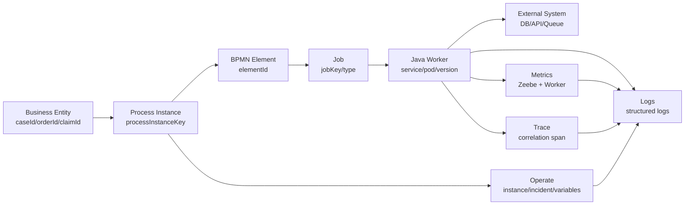
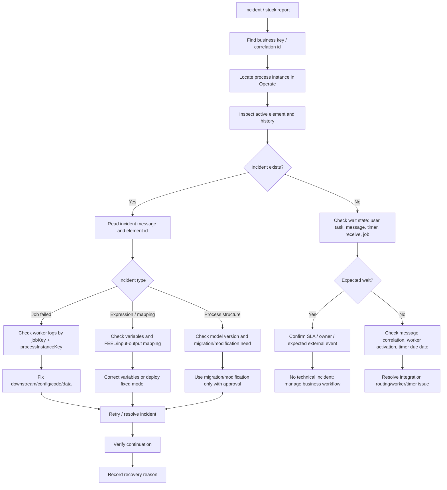
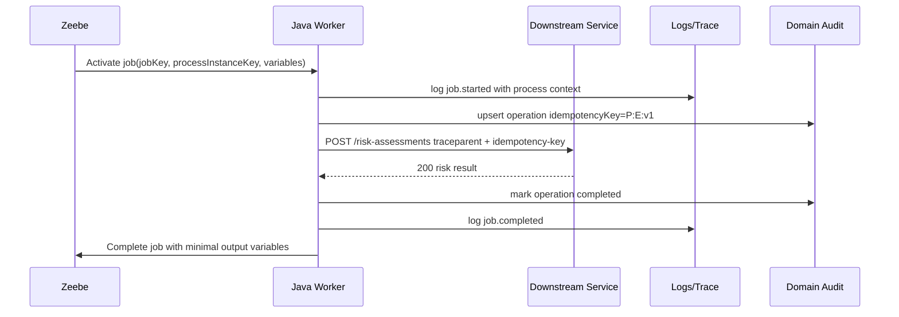

------
title: Learn Java BPMN with Camunda 8 Zeebe - Part 029
description: Observability, Operate, incident diagnosis, worker telemetry, and production debugging for Camunda 8 Zeebe process applications.
series: learn-java-bpmn-camunda8-zeebe
seriesTitle: Learn Java BPMN with Camunda 8 Zeebe
order: 29
partTitle: Observability, Operate, and Debugging
tags:
- java
- camunda
- camunda-8
- zeebe
- bpmn
- operate
- observability
- debugging
- incidents
- production
date: 2026-06-28
---

# Part 029 — Observability, Operate, and Debugging

## 1. Tujuan Part Ini

Setelah bagian ini, kamu harus mampu:

1. membaca kondisi process instance dari perspektif runtime, worker, dan business lifecycle;
2. membedakan problem BPMN model, variable contract, worker failure, infrastructure bottleneck, dan downstream outage;
3. menggunakan Operate sebagai control room, bukan sekadar dashboard;
4. membangun telemetry worker Java yang bisa menjawab "apa yang terjadi, di instance mana, pada business entity apa, dan kenapa stuck";
5. membuat runbook incident yang defensible untuk production regulatory workflow.

Camunda 8 memberi visibility lewat beberapa lapisan. Zeebe menjalankan proses. Operate membantu monitoring dan troubleshooting process instance. Worker Java menjalankan side effect. Infrastruktur menjalankan cluster dan dependency. Observability yang matang menghubungkan semua lapisan itu.

---

## 2. Mental Model: Observability Is a Process Graph, Not a Log Search

Kesalahan umum engineer saat debugging Camunda 8 adalah mencari satu log line yang menjawab semuanya. Pada Zeebe, eksekusi proses adalah gabungan dari:

- BPMN element lifecycle;
- records di partition stream;
- variables yang berubah antar step;
- jobs yang diaktifkan worker;
- external side effects;
- incident atau rejection;
- exported/read-model data yang terlihat di Operate;
- logs dan metrics dari worker serta cluster.

Jadi pertanyaan debugging yang benar bukan:

> "Log error-nya apa?"

Melainkan:

> "Process instance ini berhenti di element apa, dengan variable contract apa, job apa, worker mana, downstream call apa, dan recovery action apa yang aman?"

Diagram mentalnya:



Top 1% debugging berarti kamu mampu berpindah antar representasi:

| Representasi | Pertanyaan yang Dijawab |
|---|---|
| BPMN diagram | "Secara business, instance ini sedang di fase apa?" |
| Operate instance history | "Element apa yang aktif/completed/failed?" |
| Variables | "Apakah data contract sesuai ekspektasi model?" |
| Incident | "Apa alasan engine tidak bisa melanjutkan?" |
| Job metadata | "Worker type mana yang bertanggung jawab?" |
| Worker logs | "Apa yang dilakukan code untuk job ini?" |
| Metrics | "Apakah ini isolated failure atau systemic failure?" |
| Trace | "Call eksternal mana yang lambat/gagal?" |
| Audit log/business event | "Keputusan recovery bisa dipertanggungjawabkan?" |

---

## 3. Operate as Runtime Control Room

Operate adalah tool untuk monitoring dan troubleshooting process instance yang berjalan di Zeebe. Di production, Operate harus diperlakukan sebagai operational console dengan guardrail, bukan sekadar UI untuk developer.

Operate berguna untuk:

- melihat process definitions dan process instances;
- memeriksa instance history;
- melihat variables yang attached ke instance;
- memahami active, completed, dan incident state;
- memperbaiki variable tertentu dalam konteks incident;
- resolve incident setelah underlying issue diperbaiki;
- retry atau cancel process instances;
- melakukan batch retry/cancel ketika banyak instance terdampak;
- melakukan process instance modification untuk recovery tertentu.

Namun Operate bukan pengganti:

- domain audit log;
- long-term analytics dashboard;
- worker service monitoring;
- incident management system;
- customer support case view;
- regulatory evidence repository.

Rule of thumb:

> Operate menjawab "apa yang engine lihat"; domain observability menjawab "apa arti keadaan ini bagi bisnis."

---

## 4. Runtime Debugging Flow

Gunakan flow berikut saat process instance stuck atau business user melaporkan case tidak bergerak.



Do not start by pressing retry. Retry without diagnosis converts a visible failure into repeated noise.

---

## 5. Instance Inspection Checklist

Saat membuka process instance di Operate, baca dengan urutan ini.

### 5.1 Process Definition and Version

Catat:

- BPMN process id;
- process definition key;
- version atau version tag;
- tenant jika multi-tenant;
- deployment date;
- apakah instance berjalan di model lama atau model baru.

Pertanyaan penting:

- Apakah bug sudah diperbaiki di process version baru, tetapi instance masih berjalan di version lama?
- Apakah instance perlu migration, modification, atau cukup retry?
- Apakah process definition yang dilihat sama dengan yang dipakai production worker?

### 5.2 Active Element

Catat:

- element id;
- element name;
- element type;
- apakah ini user task, service task, message catch, timer, gateway, subprocess, atau call activity;
- parent scope jika berada di subprocess atau multi-instance body.

Element id harus stabil dan meaningful. Nama task boleh berubah, tetapi element id sebaiknya diperlakukan sebagai operational identifier.

Bad:

```xml
<bpmn:serviceTask id="Activity_1a2b3c" name="Do Something" />
```

Better:

```xml
<bpmn:serviceTask id="svc-assess-violation-risk" name="Assess Violation Risk" />
```

### 5.3 Variables

Periksa variables dengan lens contract:

- apakah variable yang dibutuhkan ada?
- apakah tipe data sesuai?
- apakah value berasal dari form/user/worker/message/DMN?
- apakah output mapping task sebelumnya menulis data yang benar?
- apakah ada variable shadowing karena local scope?
- apakah payload terlalu besar?
- apakah data sensitif muncul tanpa masking policy?

Contoh incident umum:

```text
Expected to evaluate condition 'riskScore >= 70' successfully,
but failed because: Cannot compare values of different types.
```

Ini bukan "Zeebe error". Ini contract error antara data producer dan BPMN expression.

### 5.4 History

Baca history untuk menjawab:

- task mana yang terakhir completed?
- apakah ada task yang repeated karena retry?
- apakah branch gateway yang diambil masuk akal?
- apakah message/timer event terjadi?
- apakah subprocess/call activity pernah aktif?
- apakah cancellation boundary event memotong path?

Jangan hanya melihat active element. Root cause sering berada 3–5 element sebelumnya.

---

## 6. Incident Diagnosis Taxonomy

Incident adalah sinyal bahwa engine tidak bisa melanjutkan execution. Taxonomy berikut membantu menentukan owner.

| Category | Signal | Likely Owner | Typical Recovery |
|---|---|---|---|
| Worker technical failure | job retries exhausted | service team | fix dependency/code/config, increase retries, resolve |
| Variable contract failure | FEEL/input-output mapping failed | model + producer team | correct variable/model, resolve |
| BPMN business error not modeled | worker failed instead of throwing BPMN error | process designer + service team | model boundary error, redeploy |
| Missing correlation | message catch waiting forever | integration/event team | publish correct message or fix router |
| Timer surprise | timer created too early/late by model design | process designer | correct timer expression/model |
| User task stuck | no assignee/authorization/escalation | workflow owner | reassign/escalate |
| Model version bug | instance on defective process version | platform/process owner | migrate/modify with approval |
| Infra bottleneck | broad latency/backpressure/exporter lag | platform team | scale/fix infra |

A mature platform avoids generic "Camunda incident" ownership. Every incident type should map to a service owner and runbook.

---

## 7. Resolving Incidents Safely

Incident resolution has three separate actions that people often confuse:

1. fix the cause;
2. make the instance executable again;
3. mark/trigger continuation.

For job-related incidents, typical recovery may require:

- updating invalid variables;
- increasing remaining job retries;
- resolving the incident;
- ensuring the worker can activate and complete the job.

For process-expression incidents, typical recovery may require:

- setting a corrected variable at the right scope;
- resolving the incident;
- verifying the gateway/input mapping can now evaluate.

Dangerous shortcut:

```text
Update variable until process moves.
```

Better discipline:

```text
1. Identify the violated contract.
2. Record old value, new value, reason, approver if needed.
3. Apply smallest safe correction.
4. Resolve incident.
5. Verify next state.
6. Backport fix to model/worker/form/message producer.
```

For regulated systems, manual variable update must be treated as controlled operational intervention.

Minimum audit fields:

| Field | Meaning |
|---|---|
| incidentKey | Zeebe incident identity |
| processInstanceKey | affected instance |
| businessEntityId | domain object |
| variableName | changed variable |
| previousValueHash | avoid leaking sensitive value |
| newValueHash | avoid leaking sensitive value |
| reasonCode | why correction was needed |
| operator | who changed |
| approver | optional, required for high-risk case |
| timestamp | when |
| followUpFix | model/code/data fix reference |

---

## 8. Batch Operations: Powerful but Dangerous

Operate supports batch retry/cancel patterns for many instances. This is useful when a downstream outage caused many job incidents and the service is now healthy.

But batch operation requires blast-radius thinking.

Before batch retry:

- confirm root cause fixed;
- confirm worker version deployed;
- confirm downstream service capacity;
- sample a few instances manually;
- verify no invalid variable contract remains;
- choose narrow selection criteria;
- monitor retry wave.

Before batch cancel:

- confirm cancellation is business-valid;
- understand compensation requirements;
- notify downstream/support teams;
- capture reason code;
- ensure no active human task/action is silently abandoned.

Batch retry can create a thundering herd against downstream systems. Use worker concurrency and rate limits as circuit breakers.

---

## 9. Debugging Wait States

Not every "stuck" process is broken. Camunda process instances often wait intentionally.

### 9.1 User Task Wait

Expected if:

- task has an assignee/candidate policy;
- task appears in Tasklist/custom task app;
- SLA timer is still within allowed window;
- escalation boundary exists if deadline passes.

Suspicious if:

- no user can see task;
- assignment expression produced invalid user/group;
- custom task app failed to index/sync task;
- lifecycle listener blocks assignment/completion;
- cancellation boundary was expected but not triggered.

### 9.2 Message Catch Wait

Expected if:

- external event has not happened;
- message TTL/correlation strategy is intentional;
- correlation key matches business entity.

Suspicious if:

- message was published before subscription existed and TTL was zero/too short;
- correlation key type/string mismatch;
- message name changed across model versions;
- event router published to wrong cluster/tenant;
- duplicate message ID suppressed unexpected duplicate.

### 9.3 Timer Wait

Expected if:

- timer due date/duration/cycle is correct;
- timezone convention is explicit;
- test data created future due date.

Suspicious if:

- FEEL expression produced wrong duration;
- timer modeled as scheduler for massive population;
- SLA field changed after timer subscription creation but process did not recreate timer;
- clock assumptions differ between business and runtime.

### 9.4 Service Task Wait

Expected if:

- job is available but worker concurrency is saturated briefly;
- worker is intentionally paused;
- job timeout has not elapsed.

Suspicious if:

- no worker exists for job type;
- job type typo;
- worker fetchVariables excludes required data;
- worker continually times out before completing;
- backpressure or gateway connectivity issue prevents activation.

---

## 10. Worker Observability Contract

A Java worker must emit telemetry with process context. Without this, process debugging degenerates into distributed archaeology.

Every worker log event should include:

| Field | Example |
|---|---|
| processInstanceKey | `2251799813686381` |
| processDefinitionKey | `2251799813685249` |
| elementId | `svc-assess-violation-risk` |
| jobKey | `2251799813686402` |
| jobType | `assess-violation-risk.v1` |
| workerName | `case-risk-worker` |
| workerVersion | `1.14.2` |
| businessKey | `CASE-2026-000391` |
| tenantId | `public` / tenant code |
| idempotencyKey | deterministic side-effect key |
| attempt | logical attempt/retry if available |
| downstreamSystem | `risk-scoring-api` |
| outcome | `completed`, `failed`, `bpmn_error`, `timeout` |

Example structured log:

```json
{
  "event": "camunda.job.completed",
  "processInstanceKey": "2251799813686381",
  "elementId": "svc-assess-violation-risk",
  "jobKey": "2251799813686402",
  "jobType": "assess-violation-risk.v1",
  "workerName": "case-risk-worker",
  "workerVersion": "1.14.2",
  "caseId": "CASE-2026-000391",
  "idempotencyKey": "CASE-2026-000391:assess-violation-risk:v3",
  "durationMs": 418,
  "outcome": "completed"
}
```

Do not log raw variables blindly. Variables may contain PII, evidence references, claim details, legal notes, or confidential regulatory data.

---

## 11. Metrics That Actually Matter

### 11.1 Zeebe / Cluster Metrics

Monitor:

- broker health;
- gateway request rate/error rate;
- partition leadership;
- command processing latency;
- exporter lag;
- stream processor latency;
- backpressure signals;
- disk usage;
- snapshot/export health;
- incidents count by process/element;
- active instances by process;
- job activation/completion/failure rate.

### 11.2 Worker Metrics

Monitor per worker:

- activated jobs count;
- completed jobs count;
- failed jobs count;
- BPMN errors thrown;
- retries exhausted;
- job handling latency;
- job timeout count;
- downstream latency;
- downstream error rate;
- concurrency saturation;
- in-flight jobs;
- activation empty rate;
- duplicate idempotency hits;
- circuit breaker state.

### 11.3 Business Metrics

Monitor process outcome:

- cases created;
- cases closed;
- average time per phase;
- SLA breach count;
- escalation count;
- appeal count;
- manual override count;
- incident per 1,000 instances;
- human task aging;
- repeated rework loops;
- compensation count.

Business metrics should not be derived only from worker logs. Prefer domain events or audited lifecycle projections.

---

## 12. Trace Propagation Pattern

Camunda 8 does not magically know your HTTP trace. You must propagate context deliberately.

Recommended pattern:

1. choose a stable business correlation id;
2. include processInstanceKey and jobKey in worker telemetry;
3. propagate traceparent to downstream calls;
4. include idempotency key in downstream command headers;
5. store external operation id in output variables only when useful for orchestration;
6. store full side-effect details in domain audit/operation log.



Trace context should not replace business correlation. Technical trace id often changes per request. Business key stays meaningful across days or months.

---

## 13. Debugging Common Production Scenarios

### Scenario A — Worker Deployment Broke Many Instances

Symptoms:

- incidents spike on one job type;
- error message similar across many instances;
- worker logs show same exception;
- affected process/element concentrated.

Response:

1. stop or roll back bad worker version;
2. identify affected job type and process versions;
3. deploy fix;
4. manually retry sample instances;
5. batch retry only after sample success;
6. add regression test for variable contract or downstream response.

### Scenario B — Gateway/Connectivity Issue

Symptoms:

- workers cannot activate jobs;
- client commands timeout;
- no new progress for many process types;
- infrastructure logs show network/TLS/auth failures.

Response:

1. check gateway health;
2. check auth/client credentials;
3. check service discovery and ingress rules;
4. check whether issue affects REST, gRPC, or both;
5. avoid changing BPMN/variables;
6. resume workers gradually after connectivity restored.

### Scenario C — Message Published but Process Still Waiting

Symptoms:

- event router logs publish success;
- process instance still waits at message catch;
- no incident.

Likely root causes:

- wrong message name;
- wrong correlation key;
- wrong tenant/cluster;
- message arrived before subscription and TTL was insufficient;
- model version changed message name/key expression;
- correlation key type mismatch.

Response:

1. verify exact message name and key expression in deployed model;
2. verify event payload and route;
3. republish only if event semantics allow;
4. use message id/idempotency to avoid duplicate side effects;
5. add contract test between event router and BPMN.

### Scenario D — Timer Did Not Fire When Business Expected

Symptoms:

- process waits at timer;
- business SLA says deadline passed;
- no incident.

Likely root causes:

- due date is later than expected;
- timer expression uses business date from stale variable;
- timezone conversion error;
- timer subscription created before variable correction;
- timer is cycle-based and not modeled as deadline.

Response:

1. inspect variable used by timer expression;
2. inspect timer creation semantics;
3. confirm UTC/timezone convention;
4. use modification only with explicit approval;
5. improve SLA observability outside the process instance.

### Scenario E — Incident Caused by Gateway FEEL Condition

Symptoms:

- process stuck at exclusive gateway;
- incident message references condition evaluation;
- no worker error.

Response:

1. identify variable and condition;
2. check producer of variable;
3. correct variable if safe;
4. resolve incident;
5. add FEEL/unit/path test;
6. harden input mapping or DMN output.

---

## 14. Process Instance Modification and Migration: Last Resort Tools

Operate may support modifying active process instances or migrating instances to another process version. These features are powerful but should not become normal business tooling.

Use when:

- model defect prevents continuation;
- incident cannot be fixed by variable correction alone;
- instance must be moved to fixed version;
- a path must be skipped/repeated under controlled recovery;
- business approves intervention.

Avoid when:

- user simply wants to bypass approval;
- worker is temporarily down;
- event has not arrived yet;
- data contract bug should be fixed in producer;
- manual action would violate audit policy.

Production rule:

> Modification changes execution history. It must have a reason, approver, ticket, and postmortem.

---

## 15. Incident Review Template

Use this for post-incident review.

```md
# Camunda Incident Review

## Summary
- Date/time:
- Process:
- Process version:
- Element:
- Incident type:
- Business impact:

## Detection
- How detected:
- Time to detect:
- Alert involved:

## Root Cause
- BPMN model:
- Worker:
- Variable contract:
- Downstream:
- Infrastructure:
- Human/process:

## Recovery
- Manual variable changes:
- Retry/resolution action:
- Batch operation:
- Migration/modification:
- Validation evidence:

## Prevention
- Test added:
- Monitor/alert added:
- Contract changed:
- Runbook updated:
- Owner:
```

---

## 16. Anti-Patterns

### 16.1 Operate as Business Back Office

If business users rely on Operate to understand cases, your task application/domain read model is missing.

Operate is for operational runtime support. Business users need curated domain screens.

### 16.2 Logging Everything

Logging full variables feels helpful until you leak PII, evidence, legal text, credentials, or confidential regulatory data.

Log identifiers and hashes. Store sensitive domain data in governed systems.

### 16.3 Retry First, Understand Later

Retrying without diagnosis hides root cause and may duplicate side effects.

Retries are safe only if workers and downstream calls are idempotent.

### 16.4 No Stable Element IDs

Generated BPMN ids make incidents unreadable. Stable ids turn process incidents into actionable operational data.

### 16.5 No Worker Version in Telemetry

If logs do not show worker version, rollback analysis becomes guesswork.

### 16.6 Treating Incident Count as Only Technical Metric

Incident count is also a process quality metric. Spikes can mean bad release, weak data contract, overloaded dependency, or poor modeling.

---

## 17. Practice: Build a Debuggable Process Application

Create a process:

```text
Case intake -> Validate evidence -> Assess risk -> Human review -> Issue decision
```

Inject these failures:

1. missing variable in gateway;
2. worker throws technical exception until retries exhausted;
3. message correlation key mismatch;
4. user task unassigned;
5. downstream API times out after side effect;
6. timer due date wrong by timezone;
7. defective model version needing migration/modification discussion.

For each failure, produce:

- Operate screenshot or equivalent notes;
- incident/key/element id;
- worker log excerpt with correlation fields;
- root cause;
- safe recovery action;
- prevention test;
- runbook update.

Success criterion:

> Another engineer can resolve the next occurrence without reading your source code.

---

## 18. Production Readiness Checklist

Before a process goes live:

- every service task has stable element id and meaningful job type;
- every worker emits structured logs with processInstanceKey/jobKey/business key;
- every worker has metrics for activation/completion/failure/latency;
- every technical failure maps to retry/backoff/incident policy;
- every business exception maps to BPMN error or modeled path;
- every message catch has documented name, key, TTL, and publisher;
- every timer has timezone and SLA semantics documented;
- every user task has assignment/authorization/escalation rule;
- every manual recovery action has audit policy;
- every incident category has owner;
- every high-volume batch retry has blast-radius guardrail;
- every process has dashboard for incidents, active instances, SLA, and stuck states.

---

## 19. Key Takeaways

1. Operate shows what Zeebe sees; it does not replace domain observability.
2. Debugging starts from process instance + active element + variables + incident, not from random logs.
3. Worker telemetry must include process context or it is operationally weak.
4. Incident resolution is a controlled intervention, not a casual button click.
5. Batch operations require blast-radius analysis.
6. Process instance modification/migration is powerful and must be governed.
7. Top-tier Camunda teams build runbooks, not just BPMN diagrams.

---

## References

- Camunda 8 Docs — Introduction to Operate: `https://docs.camunda.io/docs/components/operate/operate-introduction/`
- Camunda 8 Docs — Getting familiar with Operate: `https://docs.camunda.io/docs/components/operate/userguide/basic-operate-navigation/`
- Camunda 8 Docs — Incidents: `https://docs.camunda.io/docs/components/concepts/incidents/`
- Camunda 8 Docs — Initiate a batch operation: `https://docs.camunda.io/docs/components/operate/userguide/selections-operations/`
- Camunda 8 Docs — Camunda components metrics: `https://docs.camunda.io/docs/self-managed/operational-guides/monitoring/metrics/`
