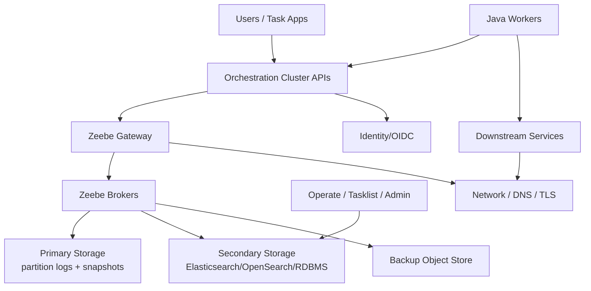
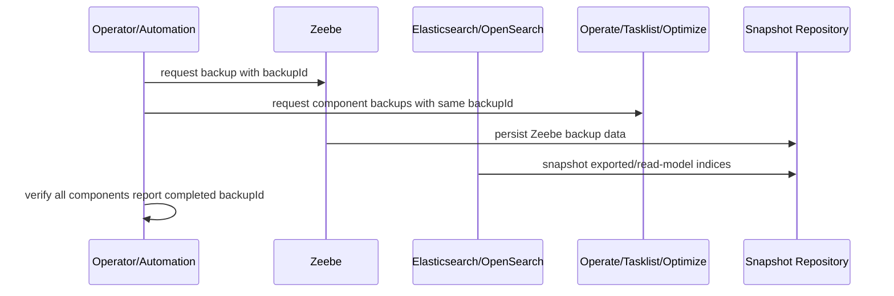
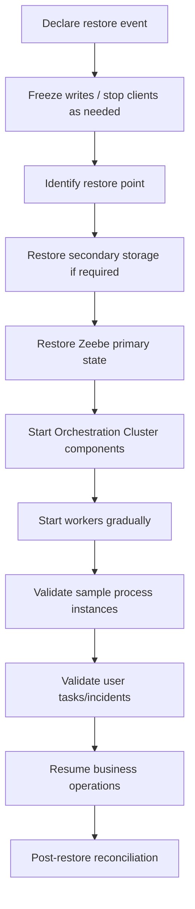
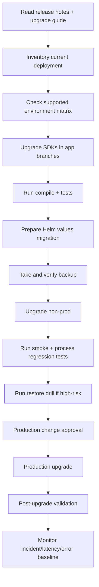

------
title: Learn Java BPMN with Camunda 8 Zeebe - Part 030
description: Resilience, failure domains, backup/restore, disaster recovery, and upgrade strategy for production Camunda 8 Zeebe platforms.
series: learn-java-bpmn-camunda8-zeebe
seriesTitle: Learn Java BPMN with Camunda 8 Zeebe
order: 30
partTitle: Resilience, Disaster Recovery, and Upgrades
tags:
- java
- camunda
- camunda-8
- zeebe
- bpmn
- resilience
- disaster-recovery
- backup
- restore
- upgrade
- production
date: 2026-06-28
---

# Part 030 — Resilience, Disaster Recovery, and Upgrades

## 1. Tujuan Part Ini

Setelah bagian ini, kamu harus mampu:

1. memetakan failure domain pada Camunda 8 production platform;
2. membedakan high availability, backup, restore, disaster recovery, dan business continuity;
3. merancang recovery strategy untuk Zeebe, secondary storage, worker, dan downstream dependency;
4. menyiapkan upgrade playbook yang aman untuk Camunda 8 Self-Managed;
5. menghindari trap deprecation, skipped minor upgrade, inconsistent backup, dan untested restore.

Camunda 8 production bukan hanya soal "cluster running". Sebuah platform dianggap production-ready jika bisa:

- tetap melayani saat satu komponen gagal;
- berhenti dengan aman saat dependency rusak;
- dipulihkan dari backup yang valid;
- di-upgrade tanpa kehilangan kendali;
- menjelaskan impact ke business stakeholder.

---

## 2. Vocabulary: Jangan Campur Istilah

| Term | Meaning | Common Mistake |
|---|---|---|
| Availability | sistem tetap dapat menerima/menjalankan workload | dianggap sama dengan backup |
| Resilience | sistem mampu menyerap failure dan pulih | hanya diuji lewat happy path |
| Backup | salinan state pada titik waktu tertentu | backup dibuat tapi tidak pernah diuji restore |
| Restore | proses mengembalikan state dari backup | dianggap otomatis tanpa runbook |
| Disaster Recovery | prosedur pemulihan setelah data loss/site loss/major outage | hanya dokumen, tidak dilatih |
| RPO | toleransi kehilangan data | tidak disepakati dengan bisnis |
| RTO | target waktu pemulihan | tidak diuji |
| Business Continuity | bagaimana operasi bisnis berlanjut saat platform terganggu | tidak ada fallback manual |

Top 1% engineer tidak hanya bertanya "apakah cluster HA?" tetapi:

> "Failure apa yang masih bisa kita tolerate, data apa yang bisa hilang, berapa lama business bisa menunggu, dan siapa yang boleh menjalankan recovery?"

---

## 3. Failure Domains in Camunda 8



Failure domains:

| Domain | Example Failure | Primary Impact |
|---|---|---|
| Worker | pod crash, bad release, auth failure | service tasks stop progressing |
| Gateway/API | ingress/TLS/auth/network issue | clients/workers cannot send commands |
| Broker | pod/node/disk issue | partition processing degraded |
| Partition | hot partition, leader instability | subset of instances affected |
| Primary storage | disk full/corruption | execution risk |
| Secondary storage | Elasticsearch/OpenSearch/RDBMS down | Operate/Tasklist/search visibility degraded |
| Identity/OIDC | token issuance/validation fails | users/clients cannot access |
| Downstream service | API/DB unavailable | worker incidents/retries |
| Backup store | object store inaccessible | backup/restore readiness degraded |
| DNS/TLS/network | service discovery broken | cross-component communication fails |

Resilience design means every domain has detection, isolation, and recovery action.

---

## 4. Primary vs Secondary Storage

Camunda 8 separates execution data from operational/analytical/read-model data.

### 4.1 Primary Storage

Primary storage is the execution backbone:

- process definitions;
- active execution state;
- partition logs;
- snapshots;
- job state;
- runtime data needed by Zeebe to continue processing.

If primary state is lost, process execution is at risk.

### 4.2 Secondary Storage

Secondary storage supports visibility and query-heavy features:

- Operate views;
- Tasklist views;
- search APIs;
- process monitoring;
- task management;
- analytics/read models.

Secondary storage failure does not always mean Zeebe execution immediately stops, but operational visibility and task handling can be impaired. Treat it as production-impacting even when process execution still moves.

### 4.3 Design Implication

Do not design business state recovery by scraping Operate or secondary storage.

Your source-of-truth strategy should be explicit:

| Data | Source of Truth |
|---|---|
| process execution state | Zeebe primary state |
| business entity state | domain database |
| human task runtime state | Orchestration Cluster/Tasklist read model |
| audit decision history | domain audit/evidence system |
| process analytics | Optimize/secondary analytics |
| side-effect operation state | worker operation log/outbox |

---

## 5. High Availability vs Disaster Recovery

High availability handles local failure. Disaster recovery handles serious loss.

### 5.1 HA Examples

- one worker pod crashes;
- one broker pod restarts;
- one node is drained;
- one gateway replica is unavailable;
- transient downstream outage causes retries.

HA is about keeping service within normal operation bounds.

### 5.2 DR Examples

- cluster data corruption;
- region outage;
- accidental deletion of resources;
- storage loss;
- failed upgrade requiring rollback/restore;
- secondary storage unrecoverable from live state;
- catastrophic operator error.

DR is about restoring service from known-good state.

Rule:

> HA reduces probability of outage. DR reduces duration and impact when outage still happens.

---

## 6. Worker Failure Strategy

Worker failure is the most common "Camunda outage" that is not actually a Camunda cluster outage.

### 6.1 Expected Worker Failures

- code bug;
- bad config;
- expired credential;
- downstream timeout;
- schema mismatch;
- deployment missing worker for job type;
- worker concurrency too low;
- job timeout too short;
- idempotency bug causing duplicate side effects.

### 6.2 Resilience Pattern

Every worker should have:

- readiness/liveness probes;
- structured logs;
- metrics;
- bounded concurrency;
- downstream timeout;
- circuit breaker for fragile dependency;
- retry classification;
- idempotency key;
- operation log;
- graceful shutdown behavior;
- version tag in logs;
- alert on incident rate per job type.

### 6.3 Worker Shutdown

On pod termination:

1. stop accepting new work if framework supports graceful shutdown;
2. allow in-flight jobs to complete within termination grace period;
3. avoid long blocking operations exceeding job timeout;
4. rely on job timeout/retry for jobs not completed;
5. ensure side effects are idempotent.

Never assume "worker crashed before complete" means side effect did not happen. The external system may have committed before the worker crashed.

---

## 7. Downstream Dependency Failure

Zeebe can orchestrate retries, but it cannot make a broken external system safe.

Classify downstream failures:

| Failure | Example | Worker Action |
|---|---|---|
| transient | HTTP 503, timeout | fail job with retry/backoff |
| business rejection | applicant ineligible | throw BPMN error or modeled result |
| permanent technical | invalid config, schema mismatch | fail, exhaust, incident |
| unknown outcome | timeout after POST | check operation log/idempotency before retry |
| rate limited | HTTP 429 | fail with longer backoff / circuit break |
| unauthorized | 401/403 | incident; credential/config owner |

A retry strategy without idempotency is a duplicate side-effect generator.

---

## 8. Backup Strategy

Backup strategy depends on storage path and Camunda version/deployment mode. Always verify current Camunda docs before implementation because backup mechanisms evolve across minor versions.

### 8.1 Elasticsearch / OpenSearch Path

When using Elasticsearch/OpenSearch as secondary storage:

- backup covers Zeebe, Operate, Tasklist, and Optimize;
- components must be coordinated using the same backup ID;
- mismatched backup IDs can produce inconsistent restore points;
- snapshots must be created in configured snapshot repositories;
- backup process should be automated and monitored.

Simplified shape:



### 8.2 RDBMS Secondary Storage Path

For newer Orchestration Cluster deployments using RDBMS as secondary storage, backup capabilities differ:

- Zeebe and RDBMS backups can be decoupled;
- scheduled backups and point-in-time restore may be available;
- Optimize may still need independent Elasticsearch/OpenSearch backup;
- Identity and Optimize coverage differs from core Orchestration Cluster path;
- restore alignment is handled differently from shared backup ID model.

The important point is not "RDBMS is better" or "Elasticsearch is better". The important point is:

> Know exactly which components your backup path covers, which it excludes, and how consistency is achieved.

---

## 9. Backup Validation

A backup that has never been restored is not a reliable backup.

Minimum validation:

| Check | Purpose |
|---|---|
| backup completion status | ensure all components finished |
| backup ID/timestamp consistency | avoid mixed restore point |
| snapshot repository health | ensure data really exists |
| restore drill in non-prod | prove procedure works |
| process instance sample verification | confirm runtime/read-model state |
| user task sample verification | confirm task visibility |
| incident sample verification | confirm operational state |
| worker reconnection test | confirm app can resume |
| RPO/RTO measurement | compare reality vs target |

Backup should be monitored like a production workload:

- last successful backup age;
- backup duration;
- backup failure count;
- repository capacity;
- restore drill freshness;
- restore drill result.

---

## 10. Restore Strategy

A restore is not a single command. It is an orchestrated operational event.

High-level restore phases:



Restore runbook must answer:

- who can declare restore;
- who approves data loss within RPO;
- how to stop workers safely;
- which backup ID/timestamp is used;
- how to restore each storage component;
- how to verify cluster state;
- how to verify business state;
- how to reconcile side effects that occurred after backup point;
- how to communicate to stakeholders.

### 10.1 Side-Effect Reconciliation

After restore, Zeebe state may go back in time, but external systems may not. This is the hardest part.

Example:

```text
T1: process calls payment/refund/notification
T2: worker completes job
T3: backup occurs? maybe before/after side effect record
T4: outage
T5: restore to earlier point
```

Questions:

- Did external side effect happen?
- Does restored process think it happened?
- Will worker execute it again?
- Is downstream idempotent?
- Is there operation log to reconcile?
- Should process be manually adjusted?

This is why Part 018 emphasized idempotency and operation logs. DR without idempotency is unsafe.

---

## 11. Disaster Recovery Design for Regulatory Workflows

Regulatory systems have additional constraints:

- case decisions must remain explainable;
- evidence references must not be lost silently;
- deadline/SLA impact must be documented;
- manual fallback may be required;
- post-restore corrections need authorization;
- audit chain must survive recovery.

Recommended DR model:

| Concern | Design |
|---|---|
| case source of truth | domain case database with own backup |
| process execution | Zeebe backup/restore |
| evidence files | object store with versioning/retention |
| task assignments | recover from Tasklist/secondary storage or domain projection |
| decision audit | append-only audit log |
| external notifications | idempotent notification ledger |
| manual recovery | approved intervention workflow |
| post-restore reconciliation | explicit reconciliation process |

Never rely on a single BPMN instance as the only record of a regulatory decision.

---

## 12. Upgrade Strategy

Camunda 8 upgrades are not just image tag bumps. They affect:

- Helm chart values;
- Orchestration Cluster configuration;
- APIs and SDKs;
- client libraries;
- Spring Boot integration;
- supported databases/search engines;
- user task model;
- testing libraries;
- deployment topology;
- container images;
- exporters and secondary storage;
- authentication/authorization behavior.

### 12.1 Minor Upgrade Rule

For Self-Managed, upgrade one minor version at a time. Do not skip minor versions. Use latest available patch before and after the minor upgrade.

Bad:

```text
8.6.x -> 8.9.x
```

Better:

```text
8.6.latest -> 8.7.latest -> 8.8.latest -> 8.9.latest
```

Skipping minors increases chance of missing required migration step.

### 12.2 Upgrade Pipeline



### 12.3 Application Upgrade Checklist

For Java applications:

- migrate away from deprecated `ZeebeClient` to Camunda Java Client where applicable;
- migrate from Spring Zeebe SDK to Camunda Spring Boot Starter where applicable;
- migrate from Zeebe Process Test to Camunda Process Test where applicable;
- avoid deprecated V1 component APIs;
- migrate job-based user tasks to Camunda user tasks where applicable;
- regenerate OpenAPI clients when using generated clients;
- re-run BPMN path tests;
- re-run worker contract tests;
- re-run user task/forms tests;
- verify auth and client credentials.

### 12.4 Platform Upgrade Checklist

For Self-Managed platform:

- read release notes;
- read Helm upgrade guide;
- verify Kubernetes/Helm compatibility;
- verify database/search engine compatibility;
- check whether configuration properties changed;
- check unified configuration migration;
- verify external Elasticsearch/OpenSearch or RDBMS settings;
- verify ingress/TLS/OIDC settings;
- verify custom exporters/interceptors;
- verify backup compatibility;
- verify retention/data purge settings;
- update dashboards and alerts if metric names changed;
- update runbooks.

---

## 13. Deprecation Management

Deprecation is not "later problem". In platform engineering, deprecation is scheduled risk.

Maintain a deprecation register:

| Item | Current Use | Migration Target | Deadline | Owner | Status |
|---|---|---|---|---|---|
| Zeebe Java Client | worker apps | Camunda Java Client | before removal | platform/app teams | planned |
| Spring Zeebe SDK | Spring workers | Camunda Spring Boot Starter | before removal | app teams | in progress |
| Zeebe Process Test | BPMN tests | Camunda Process Test | before removal | QA/platform | planned |
| Job-based user tasks | human tasks | Camunda user tasks | before removal | workflow teams | assess |
| V1 component APIs | custom tooling | Orchestration Cluster API | before removal | platform tooling | planned |

For every deprecated item:

1. find usage;
2. create migration branch/template;
3. migrate one reference service first;
4. update internal starter/golden path;
5. enforce via build checks;
6. remove legacy dependency.

---

## 14. Rollback vs Restore

A rollback and a restore are different.

| Situation | Action |
|---|---|
| bad worker release, no data corruption | rollback worker image |
| bad BPMN version but no started instances affected | deploy corrected model |
| bad BPMN version with active affected instances | migrate/modify instances with approval |
| bad platform config causing startup failure | rollback Helm/config if compatible |
| platform upgrade changed persistent state | follow official rollback/restore guidance |
| data corruption/loss | restore from backup |
| external side effects wrong | compensate/reconcile, not just restore Camunda |

Do not promise "we can rollback" unless you know whether persistent state changed.

---

## 15. Recovery Patterns by Failure

### 15.1 Worker Outage

Detection:

- job backlog grows;
- no job completions;
- incidents after retries exhausted;
- worker pods unhealthy.

Recovery:

1. restore worker deployment;
2. verify worker activates jobs;
3. sample retry incidents;
4. batch retry cautiously;
5. monitor downstream capacity.

### 15.2 Downstream API Outage

Detection:

- worker failure spike;
- HTTP 5xx/timeouts;
- incidents on specific job type.

Recovery:

1. confirm downstream health;
2. throttle worker if needed;
3. retry after dependency recovery;
4. verify idempotency for unknown outcomes.

### 15.3 Secondary Storage Degraded

Detection:

- Operate/Tasklist slow/unavailable;
- search/read-model lag;
- exporter lag;
- user tasks not visible promptly.

Recovery:

1. protect Zeebe execution;
2. check secondary storage cluster;
3. check disk/index health;
4. check exporter/indexer;
5. communicate visibility/task impact;
6. avoid blind manual process changes.

### 15.4 Broker/Partition Issue

Detection:

- partition leadership instability;
- broker health failure;
- processing latency spike;
- subset of instances affected.

Recovery:

1. inspect broker logs and Kubernetes events;
2. check disk/network/node;
3. avoid unnecessary worker restarts if broker is root cause;
4. follow Camunda operational guidance;
5. escalate before destructive action.

### 15.5 Failed Upgrade

Detection:

- components fail startup;
- config property errors;
- API incompatibility;
- workers fail auth/API calls;
- Operate/Tasklist unhealthy.

Recovery:

1. stop further rollout;
2. identify changed component;
3. use backup/rollback plan;
4. verify persistence compatibility;
5. restore only if rollback cannot safely recover;
6. document missed pre-check.

---

## 16. Upgrade Testing Matrix

Before production upgrade, run:

| Test | Purpose |
|---|---|
| deploy process | API/deployment compatibility |
| start process | runtime command compatibility |
| service task completion | worker compatibility |
| BPMN error path | error semantics |
| job failure/retry | incident path |
| user task claim/complete | Tasklist/user task compatibility |
| message correlation | event integration |
| timer path | scheduled execution |
| DMN evaluation | decision compatibility |
| forms submission | user input contract |
| process test suite | regression |
| dashboard metrics | observability |
| backup creation | DR readiness |
| restore drill | actual recoverability |

Use representative process models, not toy examples only.

---

## 17. Change Windows and Blast Radius

Not all Camunda changes are equal.

| Change | Risk | Suggested Guardrail |
|---|---|---|
| worker bug fix | low-medium | canary worker deployment |
| new BPMN version | medium | versioned rollout, start new instances only |
| BPMN migration | high | sample migration, approval |
| Helm chart upgrade | high | non-prod rehearsal, backup |
| database/search engine upgrade | high | vendor compatibility check |
| identity/OIDC change | high | auth smoke tests |
| backup config change | high | restore drill |
| partition count change | very high | architectural review |

Production upgrade should have explicit freeze/abort criteria.

Example abort criteria:

- incident rate > baseline threshold;
- workers cannot activate jobs;
- user tasks not visible;
- gateway API errors sustained;
- broker unhealthy;
- exporter lag grows beyond threshold;
- auth failure for clients/users;
- rollback/restore preconditions not met.

---

## 18. DR Drill Scenario

Run this exercise quarterly or before major upgrade.

### Scenario

A worker release caused duplicate notifications and many incidents. During remediation, secondary storage becomes unavailable. You must restore platform visibility and safely continue cases.

Expected artifacts:

1. incident timeline;
2. affected process instance list;
3. side-effect reconciliation report;
4. backup chosen or decision not to restore;
5. worker rollback evidence;
6. batch retry plan;
7. business communication;
8. postmortem action items.

Success criterion:

> Team can explain why it did or did not restore Camunda, how duplicate side effects were prevented, and how case lifecycle correctness was preserved.

---

## 19. Anti-Patterns

### 19.1 "We Have Kubernetes, So We Have DR"

Kubernetes restarts pods. It does not guarantee data consistency, backup validity, restore ability, or side-effect reconciliation.

### 19.2 Backup Without Restore Drill

A green backup job is not enough. You need proof that restore works.

### 19.3 Skipping Minor Versions

Skipping minor versions skips migration knowledge. Camunda upgrade guides are designed around minor-by-minor progression.

### 19.4 Treating Secondary Storage as Disposable

Secondary storage supports Operate/Tasklist visibility and task management. Losing it can be business-critical even if Zeebe still executes.

### 19.5 Retrying All Incidents After Outage

Batch retry can overload downstream services. Recover gradually.

### 19.6 No Domain Operation Log

Without an operation log, DR cannot distinguish "side effect happened but Zeebe forgot" from "side effect never happened".

### 19.7 Upgrade Without App SDK Migration

Platform upgrade can succeed while Java applications fail due to deprecated APIs or incompatible client libraries.

### 19.8 No Business RPO/RTO Agreement

Technical recovery targets are meaningless unless business agrees on acceptable data loss and downtime.

---

## 20. Production Runbook Skeleton

```md
# Camunda 8 DR / Upgrade Runbook

## Contacts
- Incident commander:
- Platform owner:
- App owners:
- Business owner:
- Security/OIDC owner:
- Database/search owner:

## Current Version
- Camunda:
- Helm chart:
- Java client:
- Spring starter:
- Kubernetes:
- Secondary storage:
- Identity provider:

## Backup
- Backup mode:
- Last successful backup:
- Restore drill date:
- RPO:
- RTO:

## Recovery Procedures
- Worker outage:
- Downstream outage:
- Broker issue:
- Secondary storage issue:
- Identity issue:
- Failed upgrade:
- Full restore:

## Validation
- Start process:
- Complete worker task:
- Complete user task:
- Resolve incident:
- Publish message:
- Timer smoke:
- Operate visibility:
- Tasklist visibility:

## Communication
- Internal engineering:
- Business operations:
- Customer/regulatory stakeholder:
- Postmortem owner:
```

---

## 21. Key Takeaways

1. HA, backup, restore, DR, and business continuity are different disciplines.
2. Zeebe primary state and secondary operational storage have different recovery semantics.
3. Backup must be validated through restore drills.
4. DR is unsafe without side-effect idempotency and operation logs.
5. Camunda upgrades require platform, application, SDK, API, and process-model planning.
6. Do not skip minor versions in Self-Managed upgrades.
7. Deprecation should be managed as a tracked engineering risk.
8. Recovery actions in regulatory workflows must be auditable and approved.

---

## References

- Camunda 8 Docs — Backup and restore: `https://docs.camunda.io/docs/self-managed/operational-guides/backup-restore/backup-and-restore/`
- Camunda 8 Docs — Zeebe backup management API: `https://docs.camunda.io/docs/self-managed/operational-guides/backup-restore/zeebe-backup-and-restore/`
- Camunda 8 Docs — Upgrade Self-Managed with Helm: `https://docs.camunda.io/docs/self-managed/upgrade/`
- Camunda 8 Docs — Upgrade 8.7 to 8.8 using Helm: `https://docs.camunda.io/docs/8.8/self-managed/upgrade/helm/870-to-880/`
- Camunda 8 Docs — APIs & Tools migration guide to 8.9: `https://docs.camunda.io/docs/apis-tools/migration-manuals/migrate-to-89/`
- Camunda 8 Docs — 8.8 Release notes: `https://docs.camunda.io/docs/reference/announcements-release-notes/880/880-release-notes/`
