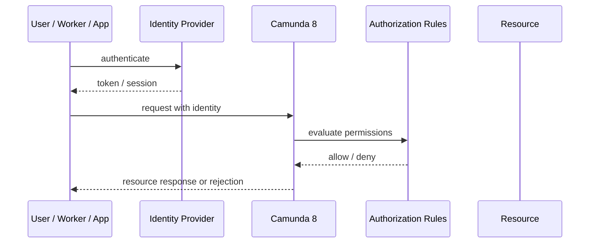
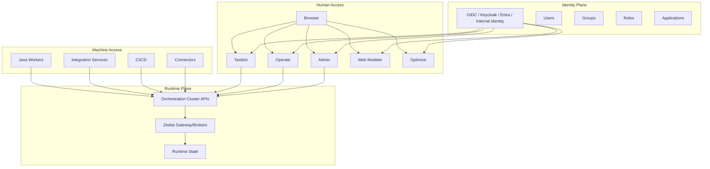
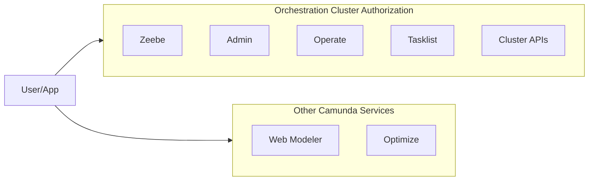
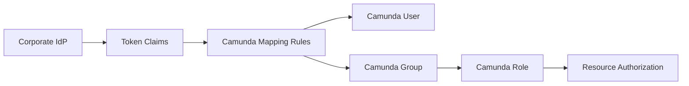
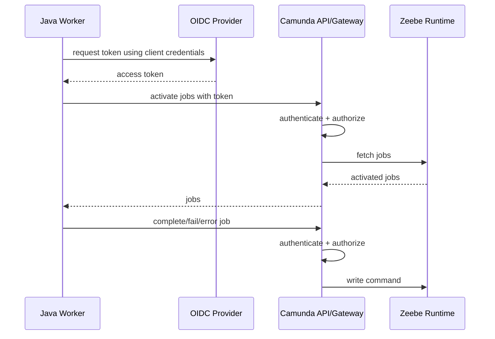
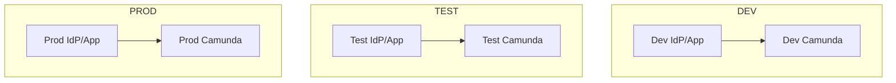
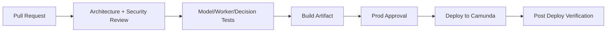
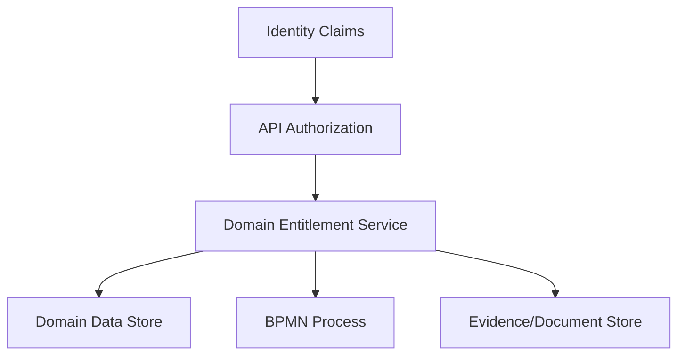
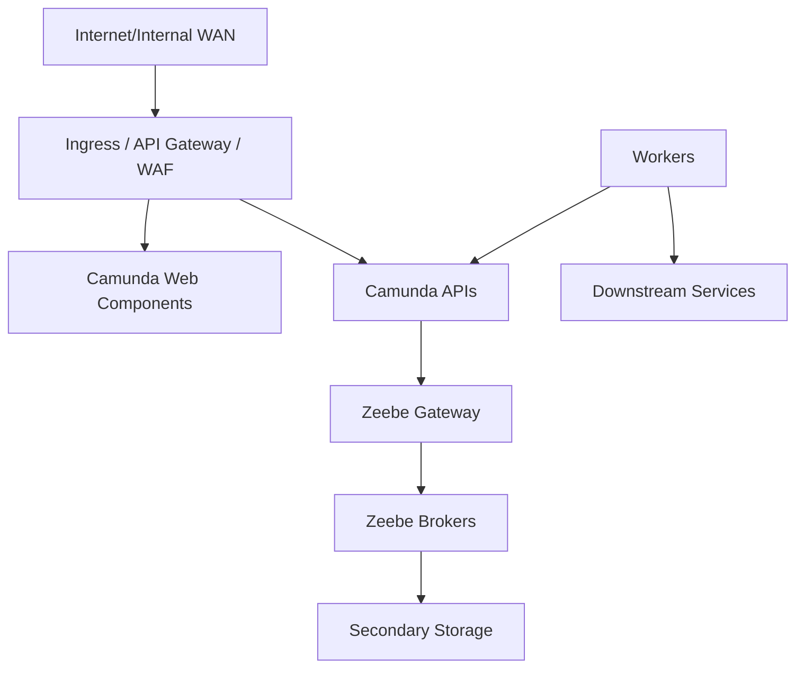
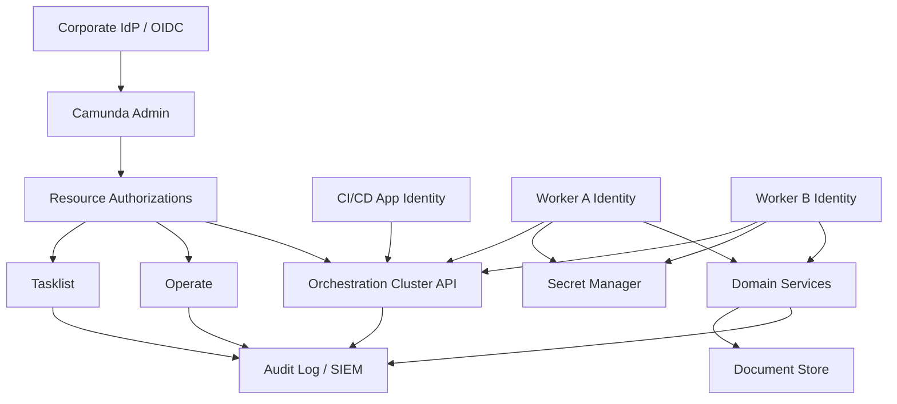

------
title: Learn Java BPMN with Camunda 8 Zeebe - Part 031
description: Security, Identity, authentication, authorization, OAuth/OIDC, RBAC, least privilege, secret management, and access-control architecture for production Camunda 8 Zeebe platforms.
series: learn-java-bpmn-camunda8-zeebe
seriesTitle: Learn Java BPMN with Camunda 8 Zeebe
order: 31
partTitle: Security, Identity, and Access Control
tags:
- java
- camunda
- camunda-8
- zeebe
- bpmn
- security
- identity
- oauth2
- oidc
- rbac
- access-control
- production
date: 2026-06-28
---

# Part 031 — Security, Identity, and Access Control

## 1. Tujuan Part Ini

Setelah bagian ini, kamu harus mampu:

1. membedakan **authentication**, **authorization**, **identity management**, dan **resource ownership** dalam Camunda 8;
2. merancang access-control model untuk users, groups, roles, applications, workers, dan platform operators;
3. memahami boundary antara Orchestration Cluster authorization, Management Identity, Web Modeler, Optimize, dan external IdP;
4. mengamankan Java workers, API clients, secrets, network ingress, dan environment promotion;
5. membuat security design yang defensible untuk workflow enterprise/regulatory.

Camunda 8 security bukan sekadar menyalakan login. Ia adalah kombinasi dari:

- siapa caller-nya;
- aplikasi mana yang memanggil;
- resource apa yang boleh diakses;
- permission apa yang diizinkan;
- data apa yang boleh terlihat;
- operasi apa yang perlu audit trail;
- rahasia apa yang boleh dipakai worker;
- lingkungan mana yang boleh diubah.

Dalam sistem regulatory, security failure sering lebih berbahaya daripada engine failure. Engine failure biasanya terlihat sebagai incident. Security failure bisa diam-diam membuat orang yang salah melihat evidence, mengubah variable, menyelesaikan task, atau menjalankan proses enforcement tanpa otorisasi.

---

## 2. Mental Model: AuthN, AuthZ, Identity, and Policy

Jangan campur empat layer ini.

| Layer | Pertanyaan | Contoh |
|---|---|---|
| Authentication | Siapa kamu? | user login via OIDC, application token, client credentials |
| Authorization | Kamu boleh melakukan apa? | read process instance, complete user task, deploy process |
| Identity management | Siapa saja user/group/app yang dikenal? | users, groups, roles, applications, mappings |
| Policy/governance | Mengapa permission itu benar? | segregation of duties, least privilege, environment ownership |

Flow-nya:



Authentication tanpa authorization hanya membuktikan caller dikenal. Authorization tanpa governance hanya membuat permission matrix yang sulit dipertanggungjawabkan.

Top 1% engineer tidak bertanya:

> "Bagaimana supaya user bisa login?"

Mereka bertanya:

> "Actor mana yang boleh melakukan action apa terhadap resource mana, dalam environment mana, melalui channel mana, dengan audit trail apa, dan bagaimana kita membuktikan bahwa policy tersebut benar?"

---

## 3. Camunda 8 Security Surface

Camunda 8 terdiri dari beberapa surface keamanan.



Security review harus menilai semua path:

1. human login ke web components;
2. machine-to-machine token dari worker/API client;
3. CI/CD deploy BPMN/DMN/Form;
4. operator access ke Operate/Admin;
5. identity provider integration;
6. secrets used by connectors;
7. network exposure untuk REST/gRPC;
8. observability data yang mungkin membawa PII/evidence.

---

## 4. Orchestration Cluster Authorization Boundary

Camunda 8 Orchestration Cluster authorization berlaku untuk:

- Zeebe;
- Admin;
- Operate;
- Tasklist;
- Orchestration Cluster APIs.

Namun, boundary ini tidak otomatis mencakup semua Camunda services seperti Web Modeler atau Optimize. Artinya access-control architecture tidak boleh diasumsikan seragam di semua komponen.



Konsekuensi desain:

- jangan membuat policy review hanya berdasarkan Tasklist;
- jangan menganggap Web Modeler permission sama dengan runtime permission;
- jangan menganggap user yang bisa model juga boleh deploy ke production;
- jangan menganggap operator yang bisa melihat incident boleh mengubah variable;
- jangan menganggap worker credential boleh melakukan semua command.

---

## 5. Actor Model: Siapa Saja yang Perlu Diatur?

Minimal actor taxonomy:

| Actor | Typical Need | Risk |
|---|---|---|
| Process participant | melihat dan menyelesaikan task miliknya | task leakage, unauthorized completion |
| Supervisor | melihat workload tim, reassign, escalate | overbroad visibility |
| Process owner | melihat health process, incident trend | accidental runtime mutation |
| Operator/SRE | troubleshoot incidents, retry/cancel, inspect state | too much business data access |
| Developer | deploy/test model di non-prod | production mutation |
| CI/CD application | deploy BPMN/DMN/Form | compromised pipeline deploys malicious model |
| Java worker | activate/complete/fail jobs | lateral movement, process tampering |
| Integration service | publish messages/start process | unauthorized process triggering |
| Auditor | read-only evidence/process history | excessive operational permission |
| Admin | manage identity/access | privilege escalation |

Actor yang tidak didefinisikan akan menjadi permission leakage.

---

## 6. Permission Design: From Role Names to Capabilities

Role name tidak cukup. Role harus diterjemahkan menjadi capability.

Bad role design:

```text
ROLE_CAMUNDA_USER
ROLE_CAMUNDA_ADMIN
ROLE_PROCESS_TEAM
ROLE_PROD_ACCESS
```

Better capability-oriented model:

```text
case-intake-submitter
case-investigator
case-reviewer
case-supervisor
case-auditor-readonly
process-operator-nonprod
process-operator-prod-limited
process-deployer-dev
process-deployer-prod-cicd
worker-case-intake-runtime
worker-notification-runtime
```

Kenapa capability-based?

- mudah diaudit;
- mudah di-review saat organisasi berubah;
- mudah di-map ke resource;
- mengurangi privilege yang tidak perlu;
- lebih jelas saat incident security terjadi.

---

## 7. Least Privilege Matrix

Contoh awal matrix untuk regulatory enforcement platform:

| Capability | Start Process | View Instance | Complete Task | Modify Variable | Retry Incident | Deploy Model | Manage Auth |
|---|---:|---:|---:|---:|---:|---:|---:|
| Public intake app | yes, specific start API | no | no | no | no | no | no |
| Investigator | no | own/team cases | assigned tasks | no | no | no | no |
| Reviewer | no | reviewed cases | review tasks | no | no | no | no |
| Supervisor | no | team cases | reassign/escalate | limited/no | no | no | no |
| Auditor | no | read-only | no | no | no | no | no |
| Operator | no | diagnostic view | no | controlled | controlled | no | no |
| CI/CD | no | no | no | no | no | yes | no |
| Runtime worker | no | no | no | job completion only | fail job only | no | no |
| Security admin | no | no | no | no | no | no | yes |

Important invariant:

> Production access must be justified by operational need, not developer convenience.

---

## 8. Identity Provider Integration

Camunda 8 can be connected to an external identity provider through OIDC. In enterprise environments, this is usually non-negotiable because:

- user lifecycle must follow corporate HR/IAM process;
- group membership must be centrally controlled;
- MFA/conditional access is owned by IdP;
- user offboarding must revoke workflow access;
- audit logs need stable identity claims.

Typical mapping:



Design rules:

1. prefer group-based access over individual exceptions;
2. keep claims stable and documented;
3. do not encode business object access only in free-form names;
4. separate workforce identity from application identity;
5. test login and API token flows before production rollout;
6. ensure logout/session behavior matches organization policy;
7. document emergency break-glass access.

---

## 9. Human Users vs Machine Applications

Human users and machine applications have different risk profiles.

| Dimension | Human User | Machine Application |
|---|---|---|
| Credential | browser session/token | client secret/certificate/workload identity |
| Rotation | password/MFA/session policy | secret rotation/key rollover |
| Scope | task and UI operations | API commands |
| Risk | data leakage, unauthorized task action | mass automation, process mutation |
| Audit | user identity | app identity + service identity |
| Owner | business/IAM | platform/application team |

Do not reuse human credentials for workers.

Do not give a worker a generic "admin" application credential.

A Java worker should have credentials aligned with its runtime responsibility, for example:

```text
application: worker-case-validation-prod
allowed operation: activate/complete/fail jobs for specific process resource/job types
owner: case-platform-team
secret rotation: 90 days or workload identity managed
break-glass: disabled
```

---

## 10. Java Worker Security Model

A worker is not just code. It is an authenticated process actor.



Worker security checklist:

- one credential per bounded worker responsibility;
- no shared credential across unrelated domains;
- no hardcoded secrets;
- no secrets in BPMN variables;
- use secret manager or workload identity;
- rotate credentials;
- restrict network egress where possible;
- validate input variables before side effects;
- redact sensitive data in logs;
- emit actor identity in telemetry;
- fail closed if auth/token acquisition fails.

### 10.1 Bad Worker Credential Design

```text
CAMUNDA_CLIENT_ID=prod-admin
CAMUNDA_CLIENT_SECRET=...
```

This is dangerous because any compromised worker can potentially operate beyond its domain.

### 10.2 Better Worker Credential Design

```text
CAMUNDA_CLIENT_ID=case-validation-worker-prod
CAMUNDA_CLIENT_SECRET=${secret-manager-ref}
CAMUNDA_SCOPE=case-validation-runtime
```

Even when the exact authorization mechanism varies between SaaS/Self-Managed/version/configuration, the design principle remains:

> machine identities should be narrow, owned, rotated, observable, and revocable.

---

## 11. Environment Separation

Never let non-production identity bleed into production.



Environment rules:

- separate client IDs/secrets per environment;
- separate groups/roles per environment;
- separate CI/CD deploy credentials;
- no production secrets in developer laptops;
- no shared admin user across environments;
- production deploy only via controlled pipeline;
- production model change requires approval;
- emergency access must be time-bound and audited.

---

## 12. CI/CD Security for BPMN, DMN, Forms, and Connectors

Deployment capability is security-sensitive. A BPMN model can:

- start new side effects;
- change task assignment;
- bypass approval;
- alter SLA timer behavior;
- call different workers/connectors;
- change variable mappings;
- expose data through forms;
- trigger messages or compensation differently.

Therefore model deployment must be treated like application deployment.



CI/CD controls:

- validate BPMN/DMN/Form resources;
- run process path tests;
- run authorization regression tests for task visibility;
- require review for user task assignment changes;
- require review for connector/worker type changes;
- require review for escalation/deadline changes;
- restrict deployment token to deploy-only operations;
- log deployment actor, commit SHA, artifact digest, and version tag;
- prevent manual production deploy outside emergency process.

---

## 13. Authorization Is Not Business Entitlement

Camunda authorization answers:

> "Can this actor access this Camunda resource/action?"

Business entitlement answers:

> "Should this person be allowed to act on this case/entity at this lifecycle state?"

They overlap but are not identical.

Example:

- Camunda authorization may allow a reviewer to complete review tasks for a process definition.
- Business entitlement must still ensure that reviewer is assigned to this case, belongs to the right jurisdiction, is not the maker, and has no conflict of interest.

Where to enforce?

| Rule Type | Best Place |
|---|---|
| UI visibility | task app / Tasklist authorization |
| process resource access | Camunda authorization |
| case ownership | domain service |
| jurisdiction/tenant boundary | domain service + identity claims |
| maker-checker rule | process model + completion validator/listener/domain service |
| evidence access | document/evidence service |
| final legal authority | domain policy service / DMN + audit |

Anti-pattern:

> Relying only on Tasklist visibility as business authorization.

A malicious or buggy integration could call APIs directly. Business-critical rules must be enforced at durable service boundaries too.

---

## 14. Multi-Tenancy and Jurisdiction Boundary

In regulatory systems, “tenant” may mean:

- legal organization;
- country/region;
- agency;
- business unit;
- enforcement jurisdiction;
- customer.

Before using any tenant/resource model, define:

1. what data must be isolated;
2. what users can cross boundaries;
3. how cases move between jurisdictions;
4. who can audit cross-boundary access;
5. what happens when identity claims change mid-case.

Suggested design invariant:

> A process instance should not be the only place where tenant/jurisdiction isolation is enforced.

Use layered enforcement:



---

## 15. Secrets Management

Secrets appear in many places:

- Camunda client secret;
- OIDC client secret;
- connector secrets;
- downstream API tokens;
- database credentials;
- message broker credentials;
- encryption keys;
- webhook shared secrets.

Rules:

1. never store secrets in BPMN variables;
2. never log secrets through worker exception;
3. never place secrets in custom headers if they appear in model repository;
4. prefer secret references over raw values;
5. rotate secrets and test rotation;
6. keep secret ownership explicit;
7. separate deploy-time secret from runtime secret;
8. design failure mode when secret retrieval fails.

Bad connector pattern:

```text
customHeader.apiKey = "live-prod-key"
```

Better pattern:

```text
customHeader.secretRef = "secret://case-platform/prod/notification-api"
```

The worker/connector runtime resolves the secret reference from an approved secret store.

---

## 16. Network Security

Camunda security is incomplete without network controls.

Key surfaces:

- REST API endpoint;
- gRPC endpoint, if used;
- web components;
- broker/gateway internal traffic;
- Elasticsearch/OpenSearch/RDBMS;
- OIDC provider;
- worker-to-downstream service calls;
- connector runtime egress.

Network design:



Hardening questions:

- Are APIs publicly reachable or private?
- Is TLS terminated correctly?
- Are internal broker ports exposed accidentally?
- Can workers reach only required endpoints?
- Can connectors call arbitrary URLs?
- Are admin endpoints IP-restricted?
- Is secondary storage accessible only from required components?
- Are audit logs exported to tamper-resistant storage?

---

## 17. Sensitive Data and Observability

Operate, Tasklist, logs, metrics, traces, and error messages can expose sensitive data.

Sensitive data classes:

- PII;
- legal evidence;
- financial data;
- credentials;
- internal investigation notes;
- risk scores;
- identity documents;
- whistleblower reports;
- confidential enforcement action.

Rules:

- keep process variables minimal;
- store evidence in document service, not process variable;
- pass references, not payloads;
- redact logs;
- avoid dumping full job variables in exception logs;
- review trace attributes;
- apply retention policy;
- restrict Operate access;
- separate diagnostic visibility from business visibility.

Bad worker log:

```java
log.error("Failed job variables={}", job.getVariables());
```

Better log:

```java
log.error("Failed job key={}, processInstanceKey={}, errorClass={}, reasonCode={}",
    job.getKey(),
    job.getProcessInstanceKey(),
    ex.getClass().getSimpleName(),
    reasonCode);
```

---

## 18. Authorization Testing

Security must be tested like business logic.

Test categories:

| Test | Purpose |
|---|---|
| login test | user can authenticate through configured IdP |
| token test | machine app can obtain token |
| permission allow test | correct actor can perform expected action |
| permission deny test | wrong actor cannot perform action |
| task visibility test | user sees only appropriate tasks |
| completion test | user cannot complete unauthorized task |
| deploy test | only CI/CD can deploy to prod |
| incident operation test | operator permission is limited |
| variable access test | sensitive variable visibility is controlled |
| offboarding test | removed user loses access |

Example test matrix:

| Actor | Scenario | Expected |
|---|---|---|
| investigator A | open assigned case task | allowed |
| investigator B | open investigator A task | denied |
| maker | approve own submission | denied |
| reviewer | approve maker submission | allowed |
| developer | deploy to prod manually | denied |
| CI/CD app | deploy signed artifact | allowed |
| worker A | complete worker B job type | denied/unsupported by design |
| auditor | update variable | denied |

---

## 19. Security Review Checklist for BPMN Models

Every production BPMN model should answer:

1. Who can start this process?
2. Which user tasks expose sensitive data?
3. Who can complete each user task?
4. Is task assignment deterministic or dynamic?
5. Are maker-checker constraints modeled?
6. Are escalation paths authorized?
7. Can operators alter variables safely?
8. Do variables contain PII/evidence/secrets?
9. Do service tasks call high-risk downstream systems?
10. Are custom headers free from secrets?
11. Are connector destinations allowlisted?
12. Are message names/correlation keys protected from spoofing?
13. Are deploy credentials limited?
14. Is there an audit trail for privileged operations?
15. Is there a break-glass procedure?

---

## 20. Common Anti-Patterns

### 20.1 One Admin Credential for Everything

Symptom:

- all workers use same credential;
- CI/CD uses admin credential;
- developers know production secret.

Impact:

- no accountability;
- impossible blast-radius control;
- difficult incident response.

Fix:

- separate machine identities;
- narrow permissions;
- rotate secrets;
- document ownership.

### 20.2 Security by UI Visibility

Symptom:

- task app hides buttons;
- API still allows action;
- domain service trusts frontend.

Fix:

- enforce business entitlement server-side;
- test deny paths;
- treat UI as convenience, not authority.

### 20.3 Secrets in Process Variables

Symptom:

```json
{
  "apiToken": "...",
  "dbPassword": "..."
}
```

Impact:

- secrets visible in Operate/logs/exporters/backups;
- incident debugging leaks credentials.

Fix:

- store secret references only;
- resolve secrets in worker/connector runtime.

### 20.4 Overprivileged Operators

Symptom:

- production operators can freely update variables, cancel instances, and retry jobs without governance.

Fix:

- define operational authority;
- add runbooks;
- require approval for sensitive mutation;
- log privileged actions.

### 20.5 Undocumented IdP Claim Mapping

Symptom:

- access depends on opaque claim names;
- IdP team changes group claim and workflow access breaks.

Fix:

- document claim contract;
- test mapping;
- monitor login/authorization failures.

---

## 21. Production Security Blueprint

A defensible blueprint:



Design goals:

- users authenticate through central IdP;
- roles/groups map to resource permissions;
- apps use machine credentials;
- secrets live outside BPMN/process variables;
- domain services enforce business entitlement;
- audit trail spans Camunda and domain systems;
- privileged operation has runbook and review.

---

## 22. Kaufman Drill: 90-Minute Security Architecture Review

Use this drill on one real process model.

### Minute 0–15: Actor Inventory

List:

- who starts the process;
- who completes each task;
- who operates incidents;
- which workers call which systems;
- who deploys models.

### Minute 15–35: Data Classification

Mark every variable:

- public;
- internal;
- confidential;
- PII;
- evidence;
- secret;
- derived risk score.

Remove anything that should be a reference instead of a variable.

### Minute 35–55: Authorization Matrix

Create allow/deny table by actor/action/resource.

Do not skip deny cases.

### Minute 55–75: Failure and Abuse Cases

Ask:

- what if worker credential leaks?
- what if reviewer tries to approve own submission?
- what if operator changes final decision variable?
- what if IdP group mapping breaks?
- what if CI/CD token is compromised?

### Minute 75–90: Controls

Define:

- technical control;
- process control;
- monitoring control;
- audit control;
- emergency procedure.

---

## 23. Summary

Security in Camunda 8 must be designed as an architecture, not as a login screen.

Core rules:

1. authentication proves identity; authorization limits action;
2. Camunda authorization boundary is not identical across every Camunda service;
3. human and machine identities must be separated;
4. worker credentials must be narrow, owned, rotated, and observable;
5. BPMN deployment is privileged production change;
6. process variables must not become a dumping ground for sensitive data;
7. business entitlement must be enforced outside UI visibility;
8. security must be tested and audited.

In regulatory systems, defensibility means you can explain not only **what happened**, but also **who was allowed to make it happen**, **why they were allowed**, and **where the evidence is recorded**.

---

## References

- Camunda 8 Docs — Identity and access management: https://docs.camunda.io/docs/components/concepts/access-control/access-control-overview/
- Camunda 8 Docs — Orchestration Cluster authorization: https://docs.camunda.io/docs/components/concepts/access-control/authorizations/
- Camunda 8 Docs — Orchestration Cluster API authentication: https://docs.camunda.io/docs/apis-tools/orchestration-cluster-api-rest/orchestration-cluster-api-rest-authentication/
- Camunda 8 Docs — Users: https://docs.camunda.io/docs/components/admin/user/
- Camunda 8 Docs — Manage users, groups, roles, and applications: https://docs.camunda.io/docs/self-managed/components/management-identity/application-user-group-role-management/identity-application-user-group-role-management-overview/
- Camunda 8 Docs — Helm authentication and authorization configuration: https://docs.camunda.io/docs/self-managed/deployment/helm/configure/authentication-and-authorization/
