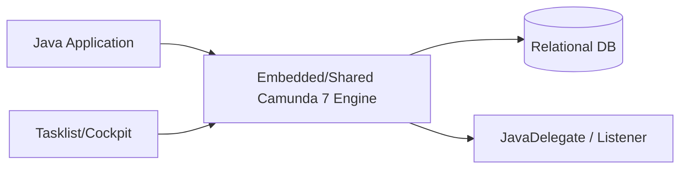
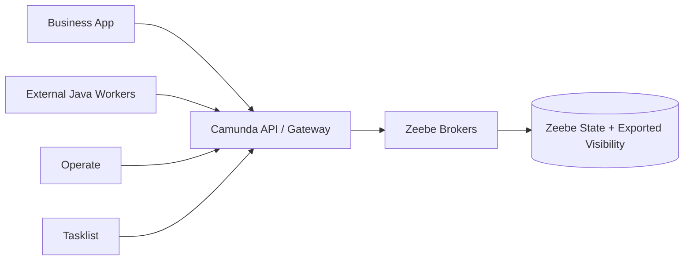
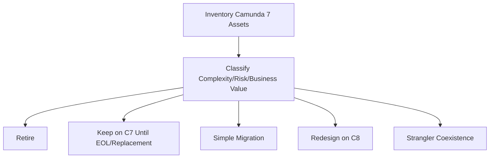
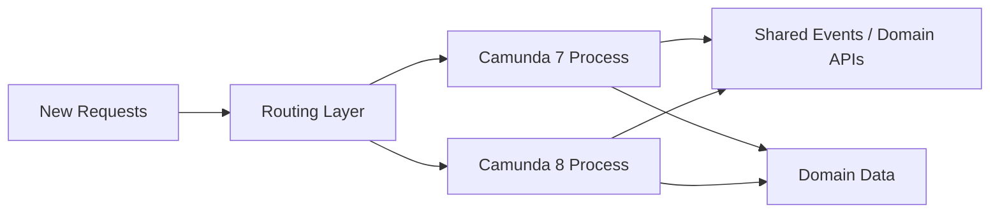
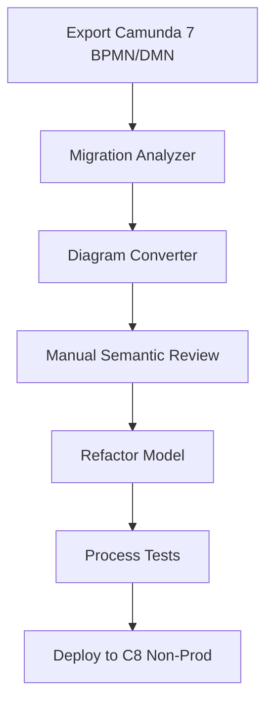
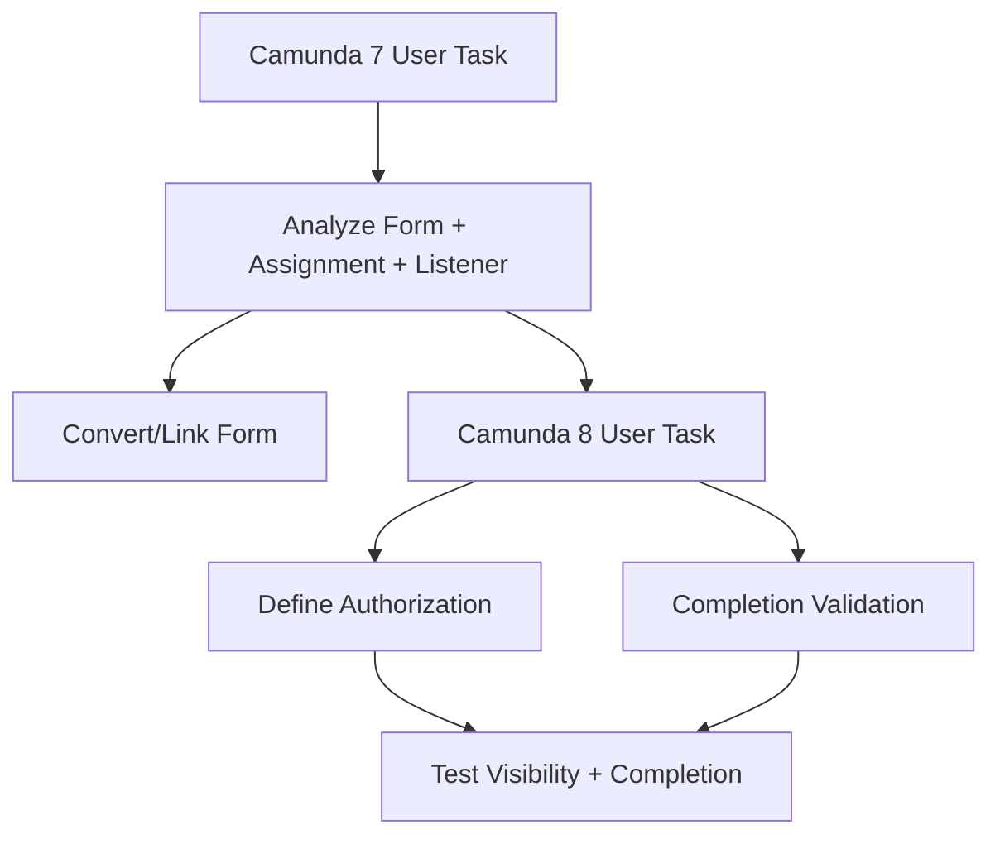
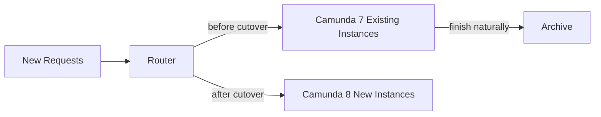
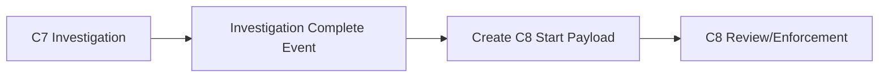
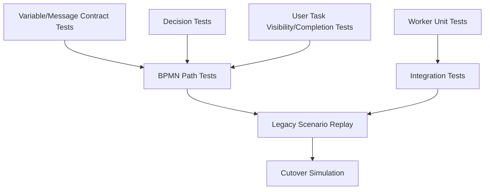
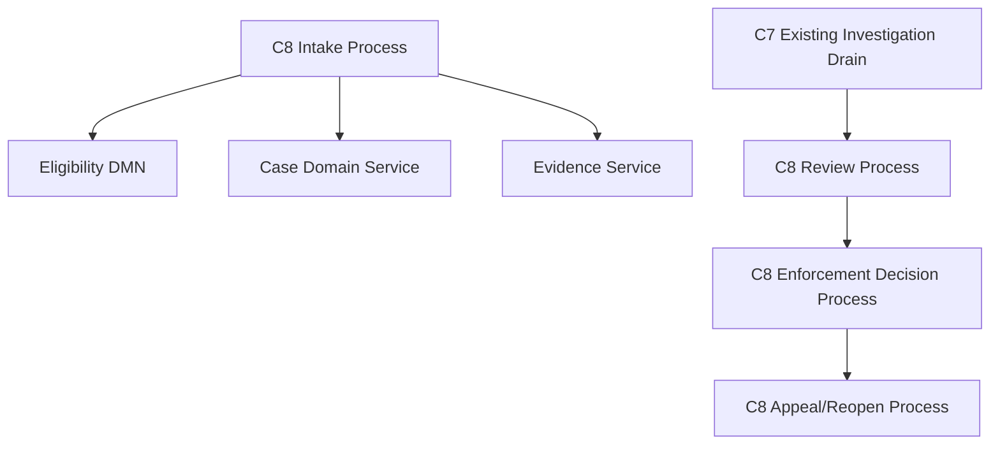

------
title: Learn Java BPMN with Camunda 8 Zeebe - Part 032
description: Migration strategy from Camunda 7 to Camunda 8 Zeebe, including assessment, BPMN conversion, JavaDelegate to job worker redesign, external task migration, user task migration, data/runtime migration, coexistence, and strangler rollout.
series: learn-java-bpmn-camunda8-zeebe
seriesTitle: Learn Java BPMN with Camunda 8 Zeebe
order: 32
partTitle: Camunda 7 to Camunda 8 Migration Strategy
tags:
- java
- camunda
- camunda-7
- camunda-8
- zeebe
- bpmn
- migration
- modernization
- architecture
- job-worker
- production
date: 2026-06-28
---

# Part 032 — Camunda 7 to Camunda 8 Migration Strategy

## 1. Tujuan Part Ini

Setelah bagian ini, kamu harus mampu:

1. menilai apakah sebuah Camunda 7 solution cocok dimigrasikan, di-strangle, atau di-redesign;
2. membuat inventory BPMN/DMN/Form/JavaDelegate/listener/external task/custom API usage;
3. mengubah pola Camunda 7 embedded-engine thinking menjadi Camunda 8 remote-orchestration thinking;
4. merancang migrasi JavaDelegate, external task workers, user tasks, forms, variables, tests, dan running instances;
5. membuat migration roadmap yang aman, bertahap, observable, dan defensible.

Migration rule paling penting:

> Camunda 8 bukan drop-in replacement untuk Camunda 7.

Ini bukan sekadar mengganti dependency Maven. Camunda 8/Zeebe punya arsitektur runtime, execution model, client API, transaction boundary, job model, user task model, dan operational model yang berbeda.

Kalau migrasi dilakukan sebagai "porting cepat", hasilnya biasanya:

- BPMN terlihat berhasil dikonversi tetapi semantics berubah;
- JavaDelegate dipindah menjadi worker tetapi side effect tidak idempotent;
- variable contract tetap seperti Camunda 7 database-local state;
- authorization dan user task visibility berubah diam-diam;
- running instance migration dianggap otomatis;
- test suite hijau tetapi production behavior berbeda.

Top 1% engineer memperlakukan migrasi sebagai **architecture modernization program**, bukan file conversion exercise.

---

## 2. Migration Mental Model

Camunda 7 typical model:



Camunda 8 typical model:



Core shift:

| Camunda 7 | Camunda 8 |
|---|---|
| embedded/shared engine | remote orchestration cluster |
| JavaDelegate in engine transaction | external job worker |
| database-centric engine state | event stream/stateful broker |
| engine API often used directly | Camunda API/client boundary |
| synchronous delegate assumptions | asynchronous job execution |
| internal API hacks possible | runtime boundary is stricter |
| service code near engine | service code outside cluster |
| transaction rollback mindset | retry/idempotency/incident mindset |

---

## 3. Migration Is a Portfolio Problem

Do not migrate process-by-process blindly. First classify the portfolio.



Portfolio classification dimensions:

| Dimension | Low Risk | High Risk |
|---|---|---|
| BPMN support | simple service/user/gateway/timer | custom extensions, unsupported constructs |
| Java coupling | clean delegate boundary | internal engine API, execution listener hacks |
| Transactions | read-only/simple side effect | multi-resource local transaction assumptions |
| Human workflow | simple task completion | custom tasklist, complex auth, form logic |
| Runtime instances | short-lived | years-long cases, open legal obligations |
| Data model | small variable contracts | large serialized Java objects/PII blobs |
| Integrations | external task already | embedded delegate and shared DB mutation |
| Tests | good path tests | manual testing only |
| Business criticality | non-critical | enforcement/payment/legal decision |

Migration program starts by reducing uncertainty.

---

## 4. Migration Paths

### 4.1 Retire

Some processes should not be migrated.

Use this when:

- process is obsolete;
- volume is near zero;
- business capability is replaced;
- legal retention can be handled via archive;
- current complexity is accidental.

Best migration is deletion.

### 4.2 Keep Temporarily

Use this when:

- process is stable;
- migration risk exceeds short-term value;
- running instances are near completion;
- team capacity is low;
- replacement system is planned.

But do not call this "no decision". It needs:

- support window;
- security patch plan;
- retirement date;
- ownership;
- monitoring.

### 4.3 Simple Migration

Use this when:

- BPMN is simple;
- delegates are clean;
- no internal engine API usage;
- user tasks are straightforward;
- tests exist;
- no long-running critical instances.

### 4.4 Redesign

Use this when:

- process has grown into a case-management monster;
- business semantics are unclear;
- Camunda 7 implementation depends on hidden transaction behavior;
- JavaDelegate contains business policy;
- user task authorization is custom and undocumented;
- old BPMN no longer reflects real process.

### 4.5 Strangler Coexistence

Use this when:

- migration must be incremental;
- some capabilities can move first;
- Camunda 7 and 8 must coexist;
- event/API boundary can route between old and new.



---

## 5. Inventory Checklist

Before converting anything, collect:

### 5.1 BPMN/DMN/Form Assets

- process definitions;
- subprocess/call activity references;
- signal/message/timer/error/escalation/compensation events;
- execution/task listeners;
- boundary events;
- async before/after usage;
- multi-instance usage;
- candidate groups/users;
- form keys/embedded forms/external forms;
- DMN tables;
- expression languages;
- custom extension elements;
- model version history.

### 5.2 Java Assets

- JavaDelegate classes;
- ActivityBehavior/custom behavior;
- ExecutionListener/TaskListener;
- external task workers;
- process application classes;
- usage of RuntimeService/TaskService/HistoryService/RepositoryService;
- transaction boundaries;
- direct database access;
- Spring bean dependencies;
- serialization/deserialization classes;
- tests.

### 5.3 Runtime Assets

- active process instances;
- incidents;
- jobs/timers;
- open user tasks;
- historic data;
- variable payloads;
- business keys;
- correlation keys;
- audit/legal retention requirements.

### 5.4 Operational Assets

- Cockpit/Operate equivalent needs;
- Tasklist/custom task app;
- monitoring dashboards;
- runbooks;
- alerts;
- backup/restore;
- security roles;
- deployment pipelines;
- incident handling procedures.

---

## 6. BPMN Conversion Strategy

Camunda 7 BPMN XML is not identical to Camunda 8 BPMN XML. Conversion tools can help, but conversion is not semantic proof.

Recommended flow:



Review every converted model for:

- service task implementation;
- message correlation semantics;
- error codes;
- timer semantics;
- user task implementation type;
- listener behavior;
- variable mappings;
- unsupported constructs;
- transaction assumptions;
- task assignment;
- form references;
- process versioning.

Bad migration question:

> "Did the diagram converter produce BPMN?"

Good migration question:

> "Does the converted BPMN preserve the intended business and failure semantics under Camunda 8 execution?"

---

## 7. JavaDelegate to Job Worker Migration

A Camunda 7 JavaDelegate often looks like this:

```java
@Component
public class ValidateCaseDelegate implements JavaDelegate {
    @Override
    public void execute(DelegateExecution execution) {
        var caseId = (String) execution.getVariable("caseId");
        var result = validationService.validate(caseId);
        execution.setVariable("validationResult", result);
    }
}
```

Camunda 8 style:

```java
@Component
public class ValidateCaseWorker {

    private final ValidationService validationService;

    public ValidateCaseWorker(ValidationService validationService) {
        this.validationService = validationService;
    }

    @JobWorker(type = "case.validate")
    public Map<String, Object> validate(final ActivatedJob job) {
        var variables = job.getVariablesAsMap();
        var caseId = (String) variables.get("caseId");

        var result = validationService.validate(caseId);

        return Map.of(
            "validation", Map.of(
                "status", result.status(),
                "reasonCode", result.reasonCode()
            )
        );
    }
}
```

But this mechanical conversion is insufficient.

You must redesign:

| Concern | Camunda 7 Delegate | Camunda 8 Worker |
|---|---|---|
| Invocation | engine calls code inside runtime | worker polls/activates job |
| Transaction | often same transaction/context | separate command lifecycle |
| Failure | exception may rollback engine transaction | fail job / BPMN error / incident |
| Variables | direct execution access | explicit JSON contract |
| Retry | job/execution semantics differ | retry count/backoff/incident |
| Side effect | often inside same Java app | external idempotency required |
| Dependency | Spring beans near engine | service adapter outside orchestration cluster |

### 7.1 Delegate Classification

Before migrating a delegate, classify it:

| Delegate Type | Migration Approach |
|---|---|
| pure calculation | worker or FEEL/DMN if business rule |
| domain command | worker with idempotency key |
| external API call | worker/connector with retry taxonomy |
| database mutation | move to domain service, worker calls service |
| business decision | DMN or explicit policy service |
| variable mapping glue | BPMN input/output mapping or worker DTO |
| engine API manipulation | redesign; do not port blindly |
| task assignment listener | user task listener/domain assignment service |

### 7.2 Delegate Smell Checklist

Smells requiring redesign:

- `execution.getProcessEngineServices()`;
- direct `RuntimeService` mutation from delegate;
- process instance queries inside delegate;
- custom transaction synchronization;
- shared DB writes with engine transaction assumption;
- serialized Java object variables;
- hidden business rule in Java;
- task assignment side effects;
- async before/after tuning used as correctness mechanism.

---

## 8. External Task to Job Worker Migration

Camunda 7 external task workers are conceptually closer to Camunda 8 job workers.

Mapping:

| Camunda 7 External Task | Camunda 8 Job Worker |
|---|---|
| topic | job type |
| fetch and lock | activate jobs |
| complete | complete job |
| handle failure | fail job |
| BPMN error | throw error |
| lock duration | timeout |
| retries | retries |
| worker ID | worker identity/name |

This is usually the easiest path, but still not automatic.

Review:

- topic naming to job type naming;
- variable fetch strategy;
- timeout duration;
- retry policy;
- error code mapping;
- duplicate execution behavior;
- idempotency keys;
- authentication;
- observability.

---

## 9. User Task Migration

User task migration is often underestimated.

Camunda 7 user task patterns may include:

- embedded forms;
- generated forms;
- external forms;
- task listeners;
- assignment expressions;
- candidate users/groups;
- custom Tasklist plugins;
- direct TaskService API calls;
- task query authorization behavior;
- custom identity provider integration.

Camunda 8 user task migration must consider:

- Camunda user task implementation type;
- linked forms;
- Tasklist behavior;
- Tasklist V1 vs V2 differences if relevant;
- authorization model;
- completion variable contract;
- user task listeners;
- custom task app integration;
- business entitlement outside UI.

Migration pattern:



Do not assume that "same candidate group" means same runtime access semantics.

---

## 10. Variable and Data Migration

Camunda 7 processes often accumulate variables like:

- serialized Java objects;
- large JSON payloads;
- form data blobs;
- domain entity snapshots;
- temporary calculation state;
- credentials or tokens;
- audit text;
- historical comments.

Camunda 8 migration is the opportunity to create a cleaner contract.

Variable migration rules:

1. remove variables that are only implementation artifacts;
2. replace large domain payloads with IDs/references;
3. convert serialized Java objects to JSON-safe contracts;
4. classify PII/evidence and move to domain/document store;
5. version variable schemas;
6. document process input/output contract;
7. test old-to-new transformation;
8. avoid making Camunda 8 variable store your domain database.

Example transformation:

Bad legacy variable:

```json
{
  "caseObject": {
    "id": "C-1001",
    "applicant": { "name": "...", "idDocument": "base64..." },
    "allEvidence": [ ... ],
    "internalNotes": [ ... ],
    "workflowTempFlags": { ... }
  }
}
```

Better Camunda 8 process variables:

```json
{
  "caseId": "C-1001",
  "jurisdiction": "ID-JKT",
  "riskBand": "HIGH",
  "evidencePackageRef": "docpkg://case/C-1001/v3",
  "decisionSnapshotRef": "decision://screening/C-1001/2026-06-28T10:15:00Z"
}
```

---

## 11. Runtime Instance Migration

Running instances are the hardest part.

Options:

| Option | Description | Use When |
|---|---|---|
| drain | stop starting new C7 instances, let old finish | short-lived processes |
| migrate runtime | use tooling/controlled migration for selected instances | supported constructs and strong need |
| handover milestone | complete C7 to stable point, start C8 continuation | long-running cases with clear boundary |
| coexist | C7 old instances and C8 new instances run side-by-side | risk-controlled incremental migration |
| manual remediation | close/recreate exceptional instances with approval | low volume/high complexity |

Decision factors:

- number of active instances;
- average remaining lifetime;
- legal/audit obligations;
- open user task count;
- incident count;
- unsupported BPMN constructs;
- variable complexity;
- correlation/message state;
- business tolerance for manual transition.

### 11.1 Drain Pattern



Drain is boring and often safest.

### 11.2 Milestone Handover Pattern

Use when a long-running case has stable business milestones.

Example:

- Camunda 7 handles intake and investigation already in progress.
- At "investigation complete" milestone, new review/enforcement stage starts in Camunda 8.



This avoids pretending that every token position can be perfectly mapped.

---

## 12. History and Audit Migration

Do not confuse runtime migration with history migration.

Questions:

1. Do auditors need old history inside Camunda 8 UI?
2. Is archive/read-only access to Camunda 7 history sufficient?
3. Is a separate audit warehouse better?
4. Are variable values legally required or should they be redacted?
5. What is the retention period?
6. Can migrated history be distinguished from natively produced Camunda 8 history?

Best practice for defensibility:

- preserve original Camunda 7 audit data read-only;
- record migration event with mapping metadata;
- avoid rewriting history as if it originally happened in Camunda 8;
- keep process definition versions and migration scripts archived;
- document limitations.

---

## 13. API and Integration Migration

Camunda 7 applications may use:

- RuntimeService;
- TaskService;
- RepositoryService;
- HistoryService;
- ManagementService;
- REST API;
- custom queries;
- embedded engine access;
- Cockpit plugins;
- Tasklist plugins.

Camunda 8 integration should be designed around:

- Camunda Java Client;
- Orchestration Cluster REST API;
- job workers;
- messages;
- process instance start commands;
- Operate/Tasklist/Admin APIs where appropriate;
- domain APIs for business data.

Migration mapping example:

| Camunda 7 Usage | Camunda 8 Direction |
|---|---|
| start process by key | start process instance API/client |
| correlate message | publish message with name + correlation key |
| JavaDelegate | job worker |
| external task worker | job worker |
| TaskService.complete | Tasklist/custom task completion API |
| RuntimeService.setVariable | avoid direct mutation; use process path/domain service |
| HistoryService query | Operate/exported data/audit warehouse |
| Cockpit incident retry | Operate/API incident operation |
| process engine plugin | redesign as platform extension/exporter/service |

---

## 14. Testing Migration

Migration without tests is archaeology with optimism.

Testing layers:



Test cases to port:

- happy path;
- every gateway branch;
- every BPMN error;
- technical retry exhaustion;
- incident creation;
- timer boundary;
- message correlation before/after waiting state;
- user task assignment;
- user task completion validation;
- compensation path;
- cancellation path;
- duplicate worker execution;
- downstream timeout;
- migration data transform.

Create a scenario catalog from production history:

| Scenario ID | Legacy Instance Pattern | C8 Expected Result |
|---|---|---|
| S001 | simple intake approved | same lifecycle outcome |
| S002 | validation failed then corrected | BPMN error/rework path |
| S003 | reviewer rejected | rejection closure |
| S004 | SLA escalated | escalation task created |
| S005 | worker timeout duplicate | idempotent completion |
| S006 | appeal reopened case | new lifecycle episode |

---

## 15. Cutover Strategy

Cutover should be explicit.

### 15.1 Big Bang

Only acceptable for:

- small systems;
- low volume;
- clean test coverage;
- no critical running instances;
- strong rollback plan.

### 15.2 Phased by Process

Move one process family at a time.

Good when processes are loosely coupled.

### 15.3 Phased by Capability

Move intake first, then review, then enforcement, etc.

Good when lifecycle has stable boundaries.

### 15.4 Phased by Cohort

Move by jurisdiction/customer/team.

Good when operational adoption differs across groups.

### 15.5 Dual Run / Shadow

Run Camunda 8 in shadow mode for selected scenarios.

Useful for validating decisions, metrics, and observability, but be careful with side effects. Shadow mode should not call real downstream systems unless explicitly designed.

---

## 16. Rollback Strategy

Rollback is not always possible once external side effects occur.

Define rollback by layer:

| Layer | Rollback Option |
|---|---|
| model deployment | deploy previous version for new instances |
| worker release | rollback worker deployment |
| routing | route new cases back to C7 |
| active C8 instances | migrate/modify/cancel only with governance |
| side effects | compensate/reconcile, not simple rollback |
| data transformation | restore from backup or apply reverse transform if safe |

Important:

> Do not claim rollback unless you have tested it with side effects, open tasks, incidents, and in-flight messages.

---

## 17. Migration Governance

Create a migration control board or architecture review process.

Required artifacts:

- asset inventory;
- migration classification;
- BPMN gap report;
- code conversion report;
- variable contract document;
- integration mapping;
- security model;
- test matrix;
- cutover plan;
- rollback/compensation plan;
- operations runbook;
- business sign-off;
- audit/legal retention decision.

Definition of done for one migrated process:

1. BPMN/DMN/Form converted and reviewed;
2. workers implemented with idempotency;
3. all contracts documented;
4. security matrix approved;
5. tests cover key paths/failures;
6. observability dashboard exists;
7. runbook exists;
8. cutover rehearsed;
9. production owner assigned;
10. legacy decommission plan defined.

---

## 18. Regulatory Enforcement Migration Example

Legacy Camunda 7 process:

```text
Complaint Intake -> Eligibility Check -> Investigation -> Supervisor Review -> Enforcement Decision -> Appeal Window
```

Findings:

- `EligibilityCheckDelegate` contains hidden policy;
- `InvestigationDelegate` writes directly to case DB and sets many variables;
- user task assignment is custom TaskListener;
- form stores evidence metadata in variables;
- appeal window has long timer;
- many active instances are in investigation for months.

Migration design:

| Component | Decision |
|---|---|
| Intake | move to Camunda 8 first for new complaints |
| Eligibility policy | convert to DMN + policy service review |
| Investigation | redesign as case lifecycle episode, not one giant process path |
| Evidence | move to document/evidence service references |
| Supervisor review | Camunda user task + maker-checker validation |
| Appeal window | timer + event-based reopening process |
| Active C7 investigations | drain until investigation complete, then handover to C8 review |
| History | keep C7 audit read-only, add migration bridge records |

Target architecture:



This migration does not try to map every legacy token into an identical C8 token. It maps business lifecycle responsibility.

---

## 19. Common Anti-Patterns

### 19.1 Diagram Converter as Migration Strategy

Symptom:

- BPMN XML converted;
- no semantic review;
- no failure-path test.

Fix:

- use converter as analysis aid;
- run model review and process tests.

### 19.2 JavaDelegate Wrapper Worker

Symptom:

```java
@JobWorker(type = "legacy.delegate")
public void run(ActivatedJob job) {
    oldJavaDelegate.execute(fakeDelegateExecution(job));
}
```

Impact:

- imports Camunda 7 assumptions;
- hides variables;
- makes failure semantics unclear;
- blocks proper idempotency design.

Fix:

- classify delegate;
- extract domain logic;
- create explicit worker contract.

### 19.3 Migrating Engine Database Thinking

Symptom:

- worker expects same transaction as process progression;
- variable mutation used as database update;
- rollback expected after downstream call.

Fix:

- move state to domain services;
- use idempotency and compensation.

### 19.4 One-Time Big Bang with Long-Running Instances

Symptom:

- thousands of active instances;
- no milestone handover;
- no rollback;
- business told migration is "technical".

Fix:

- use drain/coexistence/handover;
- involve business owners.

### 19.5 Ignoring Task Authorization Changes

Symptom:

- user can see/complete tasks differently after migration;
- candidate group assumptions not revalidated.

Fix:

- test visibility/completion per actor;
- enforce business entitlement server-side.

### 19.6 Preserving Bad Variable Shape

Symptom:

- old serialized objects become huge JSON blobs;
- process variable still stores full case data.

Fix:

- define variable schema;
- use references;
- classify sensitive data.

---

## 20. Migration Roadmap Template

### Phase 1 — Discovery

- inventory assets;
- classify processes;
- analyze BPMN support;
- identify internal API usage;
- map active instances;
- estimate complexity.

### Phase 2 — Target Architecture

- define Camunda 8 topology;
- define worker architecture;
- define identity/access model;
- define variable/data contract;
- define observability standard;
- define deployment pipeline.

### Phase 3 — Pilot

- choose low-risk but representative process;
- convert model;
- migrate workers;
- implement tests;
- deploy to non-prod;
- execute cutover simulation.

### Phase 4 — Migration Factory

- create repeatable templates;
- automate conversion checks;
- standardize worker libraries;
- standardize DMN/Form patterns;
- create dashboards/runbooks;
- train teams.

### Phase 5 — Controlled Rollout

- migrate by process/capability/cohort;
- monitor incidents and latency;
- compare business outcomes;
- adjust patterns;
- freeze risky legacy changes.

### Phase 6 — Legacy Decommission

- stop new C7 starts;
- drain/migrate remaining instances;
- archive history;
- revoke credentials;
- remove infrastructure;
- close audit documentation.

---

## 21. Kaufman Drill: 2-Hour Migration Assessment

Use this on one real Camunda 7 process.

### Minute 0–20: Asset Collection

Collect BPMN, DMN, Java classes, forms, tests, active instance counts, incident history.

### Minute 20–45: Complexity Scoring

Score 1–5:

- BPMN complexity;
- code coupling;
- transaction risk;
- user task complexity;
- data/variable risk;
- runtime instance risk;
- business criticality.

### Minute 45–70: Migration Path Decision

Choose:

- retire;
- keep temporarily;
- simple migrate;
- redesign;
- strangler coexistence.

Write why.

### Minute 70–100: Contract Extraction

Define:

- process input contract;
- job types;
- messages;
- user task completion payload;
- domain service API;
- error taxonomy.

### Minute 100–120: Risk Register

Create top 10 risks with controls.

Example:

| Risk | Control |
|---|---|
| delegate uses engine internals | redesign worker boundary |
| active instances cannot map cleanly | milestone handover |
| user task visibility changes | actor-based auth tests |
| large variables expose PII | reference-based variable model |
| side effects duplicate on retry | idempotency operation log |

---

## 22. Summary

Camunda 7 to Camunda 8 migration is a modernization exercise.

Core principles:

1. treat Camunda 8 as a different runtime architecture;
2. classify portfolio before migrating;
3. use tooling to accelerate analysis, not to replace thinking;
4. convert BPMN semantics, not just XML;
5. extract JavaDelegate logic into explicit workers/domain services;
6. redesign variables into stable JSON contracts/references;
7. validate user task authorization and completion behavior;
8. handle running instances through drain, handover, coexistence, or controlled migration;
9. test failure paths, not just happy paths;
10. make cutover, rollback, audit, and decommission explicit.

The best migration outcome is not "Camunda 7 running on Camunda 8".

The best outcome is a cleaner, more observable, more secure, more scalable orchestration architecture that preserves business intent while removing legacy coupling.

---

## References

- Camunda 8 Docs — Camunda 7 to Camunda 8 migration guide: https://docs.camunda.io/docs/guides/migrating-from-camunda-7/
- Camunda 8 Docs — Migration journey: https://docs.camunda.io/docs/guides/migrating-from-camunda-7/migration-journey/
- Camunda 8 Docs — Migration tooling: https://docs.camunda.io/docs/guides/migrating-from-camunda-7/migration-tooling/
- Camunda 8 Docs — Code conversion: https://docs.camunda.io/docs/guides/migrating-from-camunda-7/migration-tooling/code-conversion/
- Camunda 8 Docs — Data migrator limitations: https://docs.camunda.io/docs/guides/migrating-from-camunda-7/migration-tooling/data-migrator/limitations/
- Camunda 8 Docs — Migrate to Camunda user tasks: https://docs.camunda.io/docs/apis-tools/migration-manuals/migrate-to-camunda-user-tasks/
- Camunda 8 Docs — Process instance migration: https://docs.camunda.io/docs/components/concepts/process-instance-migration/
