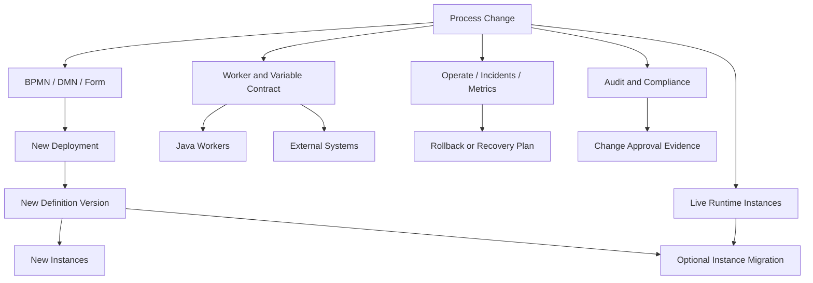
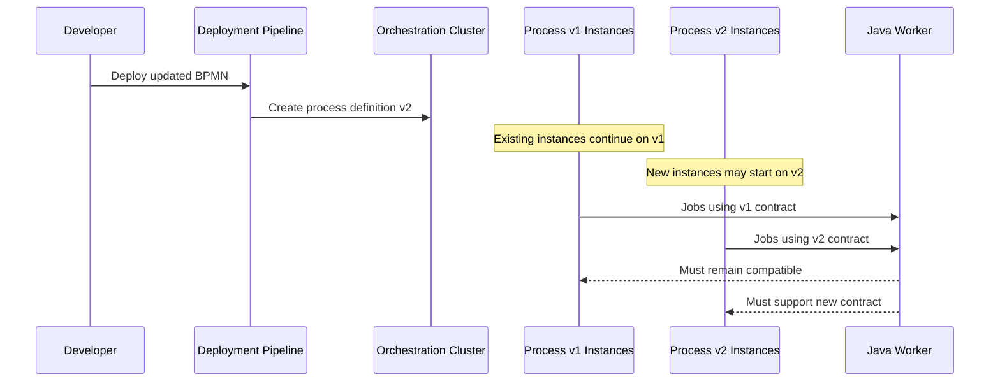
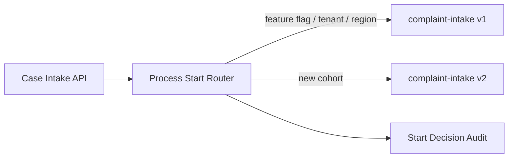
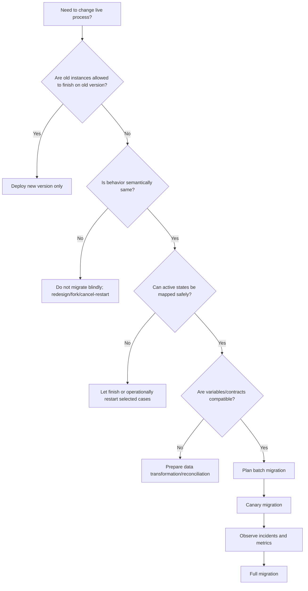
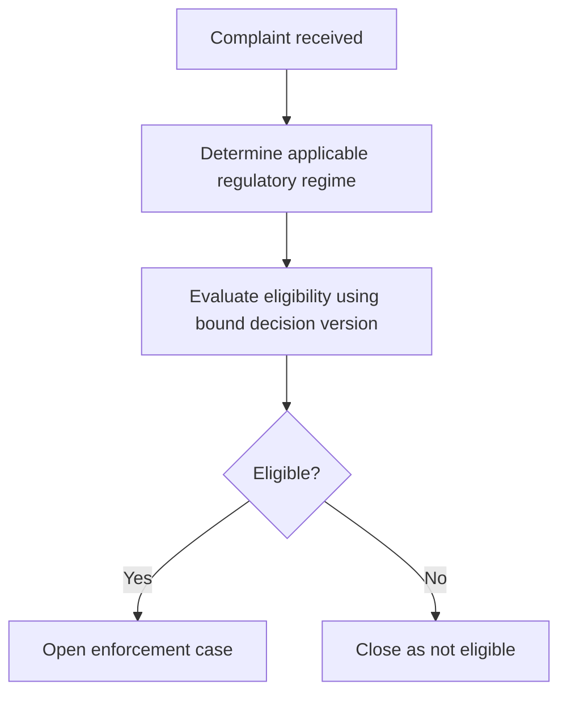

------
title: Learn Java BPMN with Camunda 8 Zeebe - Part 033
description: Process governance, BPMN/DMN/form versioning, process instance migration, deployment discipline, review checklists, and production change-control strategy for Camunda 8 Zeebe systems.
series: learn-java-bpmn-camunda8-zeebe
seriesTitle: Learn Java BPMN with Camunda 8 Zeebe
order: 33
partTitle: Process Governance and Versioning
tags:
- java
- camunda
- camunda-8
- zeebe
- bpmn
- governance
- versioning
- migration
- process-application
- production
- architecture
date: 2026-06-28
---

# Part 033 — Process Governance and Versioning

## 1. Tujuan Part Ini

Setelah bagian ini, kamu harus mampu:

1. memperlakukan BPMN, DMN, form, dan worker contract sebagai **production API**, bukan diagram lepas;
2. memahami versi process definition, version tag, Web Modeler version, process application version, dan runtime process instance version;
3. merancang change-control untuk process model yang sedang punya live instances;
4. memilih strategi version binding untuk call activity, decision, dan form;
5. membuat review checklist untuk BPMN production changes;
6. membedakan deploy baru, migrate instance, cancel/restart, dan redesign;
7. membangun governance yang cukup ketat tanpa mematikan delivery speed.

Top 1% engineer tidak hanya bisa menggambar BPMN. Ia bisa menjawab:

> “Apa yang terjadi pada 12.000 process instance aktif ketika model ini berubah?”

Itu pertanyaan governance, bukan modeling.

---

## 2. Mental Model: BPMN Is an Executable Contract

Dalam Camunda 8, process model bukan dokumentasi pasif. BPMN adalah artifact executable yang:

- menciptakan runtime process instance;
- menentukan wait state;
- membuat job untuk worker;
- menentukan message/timer/error/compensation semantics;
- membaca dan menulis variables;
- memanggil DMN, forms, call activity, connectors, atau subprocess;
- menghasilkan incident, audit event, dan operational load.

Karena itu, perubahan BPMN punya risiko seperti perubahan API, database schema, atau event contract.

Mental model yang benar:



Governance harus menghubungkan semua layer itu. Kalau governance hanya bertanya “BPMN valid atau tidak?”, ia terlalu dangkal.

---

## 3. Vocabulary yang Tidak Boleh Tertukar

Camunda 8 punya beberapa konsep versi yang sering dicampur.

| Konsep | Makna | Siapa yang mengontrol | Risiko jika disalahpahami |
|---|---|---|---|
| BPMN process ID | ID executable process di BPMN XML | modeler/team | deploy ke process ID yang sama membuat versi baru |
| Process definition key | key internal runtime untuk deployed definition | Camunda | jangan dipakai sebagai business identity |
| Process definition version | angka versi yang diberikan saat deployment process ID yang sama berubah | Camunda | instance lama tetap berjalan pada versi asalnya |
| Version tag | label user-defined untuk versi business/release | team/platform | salah tag membuat traceability release kacau |
| Web Modeler version | snapshot/file/project version di Web Modeler | modeling workflow | bukan sama dengan runtime definition version |
| Process application version | package/version dari process application | team/platform | perlu dikaitkan ke CI/CD dan release notes |
| Worker application version | versi Java service yang menjalankan job | engineering team | harus kompatibel dengan BPMN yang masih aktif |
| Resource binding | cara BPMN memilih versi called process/decision/form | modeler/team | latest binding bisa memutus live process secara tidak sengaja |

Rule sederhana:

> Runtime version adalah urusan eksekusi. Version tag adalah urusan manusia dan release. Process application version adalah urusan packaging/governance. Worker version adalah urusan compatibility.

---

## 4. Default Versioning Behavior

Ketika kamu deploy process definition dengan process ID yang sama dan isi model berubah, Camunda mendaftarkan deployment sebagai versi baru. Secara default:

- process instance yang sudah berjalan tetap memakai versi process definition tempat mereka dimulai;
- process instance baru biasanya dimulai dari versi terbaru jika kamu start by BPMN process ID tanpa menentukan versi tertentu;
- versi lama tetap relevan selama masih ada instance aktif;
- worker harus tetap mampu melayani job yang dihasilkan oleh versi lama sampai instance lama selesai, dimigrasi, atau dihentikan.

Konsekuensinya besar:



Ini alasan worker contract harus backward-compatible. Kalau worker hanya mendukung versi BPMN terbaru, live instances dari versi lama bisa gagal.

---

## 5. Governance Invariants

Governance yang baik dimulai dari invariants, bukan dari dokumen approval panjang.

### Invariant 1 — Tidak Ada Production Deploy Tanpa Traceability

Setiap process definition yang masuk production harus bisa ditelusuri ke:

- repository commit;
- pull request atau change request;
- reviewer;
- release version;
- process application version;
- worker application version yang kompatibel;
- test evidence;
- migration decision;
- rollback/recovery note.

Kalau production model tidak bisa ditelusuri, kamu tidak punya governance; kamu hanya punya deployment history.

### Invariant 2 — BPMN Review Adalah Code Review

BPMN harus direview seperti source code karena ia adalah source code visual.

Review harus memeriksa:

- business semantics;
- runtime semantics;
- variable contract;
- job worker contract;
- message correlation;
- timer/SLA impact;
- error/incident path;
- user task authorization;
- version binding;
- observability;
- migration impact.

### Invariant 3 — Stable Technical IDs

Jangan mengandalkan auto-generated IDs untuk element yang penting secara teknis.

Elemen yang biasanya butuh stable ID:

- service task;
- user task;
- boundary event;
- message event;
- timer event;
- call activity;
- business rule task;
- subprocess;
- gateway penting;
- compensation handler;
- elements yang menjadi target migration mapping;
- elements yang dipakai test assertion.

Nama business boleh berubah untuk readability. Technical ID harus stabil kecuali memang ada semantic breaking change.

### Invariant 4 — Running Instances Are First-Class Citizens

Jangan hanya bertanya “model baru benar?”

Tanyakan juga:

- instance lama masih aktif berapa banyak?
- mereka sedang di element apa?
- apakah worker baru masih kompatibel?
- apakah variable schema lama masih valid?
- apakah process instance migration dibutuhkan?
- apakah decision/form binding berubah?
- apakah cancellation/restart lebih aman daripada migration?

### Invariant 5 — Every Breaking Change Has a Migration or Retirement Plan

Breaking change tanpa rencana adalah production defect yang belum terjadi.

Contoh breaking change:

- menghapus active element;
- mengganti job type;
- mengganti required variable;
- mengganti correlation key;
- mengganti error code;
- mengganti form binding;
- mengganti DMN output shape;
- mengganti called process binding;
- mengubah compensation path;
- mengubah task authorization assumption.

---

## 6. Naming Governance

Naming bukan cosmetic. Naming menentukan readability, testability, dan auditability.

### 6.1 BPMN Element Name

Gunakan perspektif business.

| Element | Good | Bad |
|---|---|---|
| Service task | Validate complaint eligibility | Call validation service |
| User task | Review evidence package | User approval |
| Gateway | Is enforcement action required? | Decision 1 |
| Timer event | Enforcement response deadline reached | Wait 7 days |
| Message event | Response received from regulated party | Kafka message |

Business name harus membuat stakeholder non-engineer bisa memahami model.

### 6.2 Technical ID

Gunakan stable technical ID yang eksplisit.

```xml
<bpmn:serviceTask id="Task_ValidateComplaintEligibility" name="Validate complaint eligibility">
  <bpmn:extensionElements>
    <zeebe:taskDefinition type="complaint.validate-eligibility.v1" />
  </bpmn:extensionElements>
</bpmn:serviceTask>
```

Prinsip:

- ID boleh teknis, name harus business-readable;
- ID jangan mengandung auto-generated noise;
- ID jangan berubah untuk rename visual;
- ID bisa mengandung domain term, bukan implementation detail;
- job type adalah integration contract, bukan nama method Java.

### 6.3 File Name dan Process ID

Untuk production repository, align:

```text
complaint-intake.bpmn
process id: complaint-intake
process application: regulatory-enforcement
package path: processes/complaint-intake.bpmn
```

Ini memudahkan:

- code search;
- test generation;
- CI validation;
- release notes;
- ownership mapping;
- operational debugging.

---

## 7. Versioning Strategy

Tidak semua perubahan memerlukan strategi yang sama.

### 7.1 Latest Version Strategy

Pola:

- deploy process ID yang sama;
- new instances memakai versi terbaru;
- old instances tetap versi lama;
- worker kompatibel untuk dua versi atau lebih.

Cocok untuk:

- additive change;
- bug fix non-breaking;
- label/readability update;
- non-breaking worker output addition;
- tambahan optional path.

Risiko:

- tim lupa bahwa instance lama masih hidup;
- worker baru tidak kompatibel;
- observability bercampur antara versi;
- change tampak aman karena deployment sukses, tetapi runtime lama rusak nanti.

### 7.2 Version Tag Strategy

Gunakan version tag untuk menghubungkan model dengan release business.

Contoh:

```text
process: complaint-intake
process definition version: 17
version tag: 2026.06-reg-enforcement-r2
worker release: complaint-workers:2.14.0
schema version: complaint-case-schema:5
```

Version tag berguna untuk:

- audit;
- release note;
- rollback analysis;
- support case;
- linking to change request;
- selecting specific resource version where supported.

### 7.3 Process ID Fork Strategy

Kadang lebih aman membuat process ID baru.

Contoh:

```text
complaint-intake-v1
complaint-intake-v2
```

Cocok jika:

- lifecycle berubah fundamental;
- domain object berubah;
- regulatory regime berubah;
- live migration terlalu berisiko;
- process lama harus tetap berjalan lama;
- reporting harus memisahkan lineage.

Trade-off:

- lebih eksplisit;
- lebih mudah dioperasikan untuk big redesign;
- tetapi lebih banyak duplication dan routing logic.

Gunakan fork jika perubahan bukan lagi “versi baru dari hal yang sama”, melainkan “produk proses yang berbeda”.

### 7.4 Blue-Green Process Routing

Start process tidak langsung ke BPMN process ID hardcoded di banyak service. Buat routing layer.



Router bisa berdasarkan:

- tenant;
- region;
- product line;
- case type;
- filing date;
- regulatory regime;
- feature flag;
- manual override.

Anti-pattern: setiap service langsung memanggil `newCreateInstanceCommand().bpmnProcessId("...")` tanpa policy layer.

---

## 8. Resource Binding Strategy

Camunda 8 memungkinkan resource binding untuk linked resources seperti:

- call activity ke process lain;
- business rule task ke DMN decision;
- user task ke form.

Binding menentukan versi resource yang dipakai.

### 8.1 Latest Binding

Makna: pakai versi terbaru saat runtime membutuhkan resource.

Cocok untuk:

- non-critical dev/testing;
- form/decision yang memang selalu boleh update ke latest;
- resource yang backward-compatible ketat.

Risiko:

- instance lama bisa tiba-tiba memakai decision/form baru;
- sulit explain audit jika behavior berubah di tengah instance;
- tidak cocok untuk regulated decision yang harus frozen berdasarkan filing date.

### 8.2 Deployment Binding

Makna: resource yang dipakai adalah resource yang dideploy bersama process definition.

Cocok untuk:

- release bundle;
- process application;
- high governance production;
- form/decision yang harus konsisten dengan process version.

Ini sering menjadi default terbaik untuk process application yang ingin deterministic release behavior.

### 8.3 Fixed Version / Version Tag Binding

Makna: pilih resource version tertentu.

Cocok untuk:

- regulatory rule effective date;
- decision package yang disertifikasi;
- process yang harus memakai form/decision tertentu;
- gradual rollout.

Trade-off:

- lebih eksplisit;
- lebih aman untuk audit;
- tetapi membutuhkan governance untuk update binding.

### 8.4 Binding Decision Matrix

| Resource | Default aman | Kapan latest boleh | Kapan fixed/tag wajib |
|---|---|---|---|
| Call activity | deployment atau versionTag | dev-only, backward-compatible subprocess | lifecycle critical, regulated subprocess |
| DMN decision | deployment atau versionTag | low-risk operational thresholds | legally relevant decision |
| Form | deployment atau versionTag | UI-only cosmetic form | evidence intake, signature, approval form |

Rule production:

> Kalau output resource memengaruhi hak, kewajiban, enforcement, money movement, or audit evidence, jangan pakai latest tanpa explicit risk acceptance.

---

## 9. Change Taxonomy

Sebelum deploy, klasifikasikan perubahan.

### 9.1 Class A — Cosmetic / Readability Change

Contoh:

- rename label tanpa mengubah ID;
- layout diagram;
- documentation annotation;
- lane label clarification.

Risiko rendah, tetapi tetap perlu review jika diagram dipakai untuk audit.

Checklist:

- no technical ID change;
- no job type change;
- no expression change;
- no mapping change;
- no binding change.

### 9.2 Class B — Additive Non-Breaking Change

Contoh:

- optional variable baru;
- optional user task path;
- tambahan non-required DMN output;
- tambahan logging header;
- tambahan boundary event untuk handled failure.

Checklist:

- old instances aman;
- old worker output masih valid;
- new worker support optional field;
- tests cover both old and new path.

### 9.3 Class C — Behavioral Change

Contoh:

- gateway condition berubah;
- timer duration berubah;
- escalation path berubah;
- DMN rule berubah;
- retry policy berubah;
- user task assignment berubah.

Checklist:

- business approval;
- test evidence;
- effective date;
- version tag;
- audit note;
- reporting impact.

### 9.4 Class D — Contract-Breaking Change

Contoh:

- job type berubah;
- required variable berubah;
- output structure berubah;
- message correlation key berubah;
- error code berubah;
- form field requiredness berubah.

Checklist:

- worker compatibility plan;
- schema version plan;
- migration/retirement plan;
- incident rollback plan;
- data reconciliation plan.

### 9.5 Class E — Runtime Topology Change

Contoh:

- process decomposition berubah;
- call activity introduced/removed;
- parent-child lifecycle changed;
- fan-out strategy changed;
- compensation model changed.

Checklist:

- architecture review;
- load test;
- observability plan;
- failure mode review;
- migration simulation.

---

## 10. Process Instance Migration

Process instance migration memungkinkan instance aktif dipindahkan dari satu process definition version ke version lain dengan mapping elemen tertentu. Namun ini bukan tombol ajaib.

Migration aman jika:

- current active state bisa dipetakan secara jelas;
- variable contract kompatibel;
- downstream worker kompatibel;
- timer/message/error boundary semantics tidak berubah secara membahayakan;
- audit story jelas;
- ada dry-run atau batch kecil;
- ada rollback/recovery plan.

Migration berisiko jika:

- active element dihapus;
- subprocess boundary berubah;
- compensation semantics berubah;
- multi-instance structure berubah;
- process lama dan baru punya makna business berbeda;
- old variables tidak cukup untuk path baru;
- old instances berada di banyak state yang berbeda.

### 10.1 Migration Decision Tree



### 10.2 Migration Runbook

Minimum runbook:

1. Identify source process ID and version.
2. Count active instances by active element.
3. Identify target process version.
4. Define element mapping.
5. Validate variable compatibility.
6. Validate worker compatibility.
7. Validate form/decision/called process binding.
8. Migrate small canary batch.
9. Monitor incidents, stuck states, task visibility, and worker failures.
10. Migrate remaining batches.
11. Record evidence and outcome.

### 10.3 Migration Is Not a Substitute for Versioning

Kalau setiap deployment butuh migrate semua instance, kemungkinan model kamu terlalu volatile atau lifecycle process terlalu panjang untuk single process definition strategy.

Pertimbangkan:

- bounded episode model;
- process fork;
- router;
- case state externalization;
- shorter process lifecycle;
- explicit migration windows.

---

## 11. Process Application Governance

Process application adalah unit yang menggabungkan artifact yang harus dirilis bersama.

Biasanya berisi:

```text
process-application/
  bpmn/
    complaint-intake.bpmn
    enforcement-action.bpmn
  dmn/
    complaint-eligibility.dmn
    penalty-classification.dmn
  forms/
    evidence-review.form
    enforcement-approval.form
  tests/
    complaint-intake-paths.test.java
    penalty-classification.test.java
  metadata/
    owners.yaml
    release-notes.md
    risk-classification.yaml
```

Governance yang baik memperlakukan package ini sebagai release unit.

### 11.1 Ownership Metadata

Contoh:

```yaml
processApplication: regulatory-enforcement
ownerTeam: enforcement-platform
businessOwner: enforcement-operations
technicalOwner: platform-orchestration
riskClass: high
regulatedDecision: true
requiresSecurityReview: true
requiresMigrationReview: true
supportedWorkerApplications:
  - complaint-workers
  - notification-workers
  - evidence-workers
```

Metadata ini dipakai CI/CD, documentation, dan operational routing.

### 11.2 Release Metadata

Contoh:

```yaml
release: 2026.06.28-r3
versionTag: enforcement-2026.06-r3
changes:
  - Added appeal review path after enforcement notice
  - Updated penalty classification decision table
breakingChanges:
  - none
migrationDecision: old instances continue on previous version
rollbackPlan: stop starting new instances on r3 via process router
approvals:
  - legal-policy
  - enforcement-ops
  - platform-engineering
```

Jangan simpan release knowledge hanya di chat atau meeting notes.

---

## 12. CI/CD Validation Pipeline

Pipeline minimal untuk process application:


Validation examples:

- no unnamed BPMN elements;
- stable IDs present for technical elements;
- all service task job types mapped to registered workers;
- no forbidden `latest` binding for high-risk resources;
- all message catch events have documented correlation key;
- all timers have owner and SLA rationale;
- all user tasks have assignment/authorization story;
- all DMN outputs have schema tests;
- all variable mappings validated;
- no large payload variables;
- no secrets in variables;
- no unsupported BPMN elements;
- required tags present;
- migration decision recorded.

### 12.1 Example Static Check Rules

```yaml
rules:
  bpmn:
    requireElementNames: true
    requireStableTechnicalIds: true
    forbidGeneratedIdsForTechnicalElements: true
    requireJobTypeVersionSuffix: true
    requireMessageCorrelationDocumentation: true
    requireTimerRationale: true
  bindings:
    highRiskResourcesMustNotUseLatest: true
  variables:
    forbidSecrets: true
    maxVariablePayloadKb: 128
  governance:
    requireOwnerMetadata: true
    requireMigrationDecision: true
    requireVersionTag: true
```

Ini bukan birokrasi. Ini automated risk reduction.

---

## 13. BPMN Review Checklist

Gunakan checklist ini untuk setiap PR process model.

### 13.1 Business Semantics

- Apakah model menjelaskan lifecycle business, bukan detail teknis berlebihan?
- Apakah gateway berbentuk pertanyaan yang jelas?
- Apakah event name menjelaskan state business?
- Apakah exception path penting dimodelkan?
- Apakah happy path tidak terlalu disesaki error minor?

### 13.2 Runtime Semantics

- Apa wait states utama?
- Apa yang terjadi jika worker down?
- Apa yang terjadi jika message datang lebih awal?
- Apa yang terjadi jika timer trigger saat task masih aktif?
- Apa yang terjadi jika user task tidak pernah diselesaikan?
- Apa cancellation behavior?
- Apa retry dan incident behavior?

### 13.3 Contract Semantics

- Service task job type apa?
- Variable input wajib apa?
- Variable output apa?
- Error code apa yang bisa dilempar?
- Apakah schema backward-compatible?
- Apakah worker baru kompatibel dengan process lama?

### 13.4 Data and Security

- Apakah variable hanya menyimpan data yang diperlukan?
- Apakah sensitive data diminimalkan?
- Apakah document disimpan sebagai reference?
- Apakah user task visibility benar?
- Apakah operator boleh update variable ini?
- Apakah audit evidence cukup?

### 13.5 Versioning

- Apakah ini deploy baru, fork, atau migration?
- Apakah resource binding benar?
- Apakah version tag ditentukan?
- Apakah old instances aman?
- Apakah Operate migration dibutuhkan?
- Apakah release notes menjelaskan behavior change?

---

## 14. Compatibility Rules for Java Workers

Worker compatibility adalah bagian process governance.

### 14.1 Safe Additive Input

BPMN baru mengirim optional field:

```json
{
  "caseId": "CASE-123",
  "riskScore": 0.82,
  "reviewPolicyVersion": "2026.06"
}
```

Worker lama yang tidak tahu `reviewPolicyVersion` harus tetap aman jika field itu optional.

### 14.2 Unsafe Required Input

BPMN baru mengharuskan:

```json
{
  "caseId": "CASE-123",
  "enforcementBasis": "STATUTE_45A"
}
```

Jika worker lama tidak bisa memproses tanpa `enforcementBasis`, ini breaking change.

Strategi:

- deploy worker yang support old+new terlebih dahulu;
- deploy BPMN baru setelah worker ready;
- monitor jobs dari both versions;
- baru remove old logic setelah old instances selesai.

### 14.3 Job Type Versioning

Gunakan job type versioning jika contract benar-benar berubah.

```text
complaint.validate-eligibility.v1
complaint.validate-eligibility.v2
```

Jangan version job type untuk setiap deploy kecil. Version hanya ketika contract berubah secara meaningful.

### 14.4 Error Code Compatibility

Error code adalah process contract.

Contoh:

```text
COMPLAINT_NOT_ELIGIBLE
EVIDENCE_INSUFFICIENT
MANUAL_REVIEW_REQUIRED
REGULATED_PARTY_UNREACHABLE
```

Jangan rename error code tanpa BPMN migration. Worker boleh throw error code lama selama old process version masih aktif.

---

## 15. Effective-Date Governance for Regulatory Systems

Regulatory workflows sering punya aturan berdasarkan tanggal efektif.

Contoh:

- complaints received before July 1 use old eligibility rule;
- complaints received on/after July 1 use new rule;
- appeals follow rule version at original decision date;
- enforcement action template depends on jurisdiction effective date.

Jangan mengandalkan “latest DMN” untuk kasus seperti ini.

Gunakan explicit rule version:

```json
{
  "caseId": "CASE-2026-001",
  "filingDate": "2026-06-28",
  "regimeVersion": "REG-2026-H1",
  "eligibilityDecisionVersion": "eligibility-2026.06"
}
```

Modeling pattern:



Key idea:

> Effective date is business data. Do not hide it inside deployment order.

---

## 16. Process Governance Board: Lightweight but Real

Untuk high-risk process, buat governance board yang kecil tapi accountable.

Minimal roles:

| Role | Responsibility |
|---|---|
| Process owner | business correctness and policy intent |
| Technical owner | BPMN runtime semantics and worker compatibility |
| Platform owner | deployment, observability, security, operational risk |
| Data owner | variable/schema/evidence handling |
| Compliance/audit reviewer | defensibility and traceability |
| SRE/on-call representative | runbook and operational support |

Tidak semua change perlu meeting. Banyak bisa automated approval jika low-risk.

Risk-based governance:

| Risk class | Example | Required control |
|---|---|---|
| Low | label/layout change | automated checks + peer review |
| Medium | new optional path | peer review + tests |
| High | SLA/error/decision change | business + technical approval |
| Critical | enforcement decision/compensation/security change | formal review + migration/runbook |

---

## 17. Operability Governance

Setiap process model harus bisa dioperasikan.

Pertanyaan operability:

- Apa incident yang mungkin muncul?
- Siapa owner incident?
- Variable mana yang boleh diedit operator?
- Kapan operator boleh retry job?
- Kapan operator harus cancel instance?
- Apa message yang boleh dipublish ulang?
- Apa timer yang boleh dimodifikasi lewat process modification?
- Apa reconciliation query untuk side-effect unknown?

### 17.1 Runbook Metadata

Contoh:

```yaml
processId: complaint-intake
incidentOwner: enforcement-platform-oncall
businessEscalation: enforcement-ops-lead
safeRetryJobTypes:
  - complaint.fetch-profile.v1
  - notification.send-email.v1
unsafeRetryJobTypes:
  - enforcement.issue-penalty.v1
manualVariableUpdateAllowed:
  - reviewerAssignee
  - escalationReason
manualVariableUpdateForbidden:
  - penaltyAmount
  - eligibilityDecision
  - documentHash
```

Runbook harus dekat dengan process artifact, bukan tersebar di wiki lama.

---

## 18. Anti-Patterns

### 18.1 “Just Deploy Latest”

Gejala:

- semua model deploy ke latest;
- tidak ada migration decision;
- worker langsung remove old logic;
- old instances tiba-tiba incident.

Fix:

- track active versions;
- enforce compatibility window;
- require migration/retirement decision.

### 18.2 Latest Binding for Regulated Decisions

Gejala:

- DMN updated;
- old case evaluates new rule;
- audit tidak bisa menjelaskan why decision changed.

Fix:

- use deployment/versionTag binding;
- store applicable rule version;
- document effective date.

### 18.3 BPMN as Screenshot Artifact

Gejala:

- BPMN dibuat di Modeler tapi tidak direview seperti code;
- XML tidak masuk repository;
- production deploy dari laptop;
- tidak ada traceability.

Fix:

- store BPMN/DMN/forms in repo;
- deploy via CI/CD;
- require review and validation.

### 18.4 Changing Technical IDs for Cosmetic Reasons

Gejala:

- test break;
- migration mapping sulit;
- Operate history kurang jelas;
- monitoring dashboard rusak.

Fix:

- separate name and technical ID;
- preserve technical IDs unless semantic change.

### 18.5 One Worker Version Only

Gejala:

- worker hanya support latest BPMN;
- old process instances fail on required variables;
- incidents muncul days/weeks after deploy.

Fix:

- backward compatibility window;
- contract tests against old process versions;
- safe deprecation plan.

### 18.6 Governance by Meeting Only

Gejala:

- banyak approval meeting;
- sedikit automated checks;
- review tergantung siapa yang hadir;
- kesalahan basic tetap lolos.

Fix:

- encode rules in CI;
- use risk-based workflow;
- meeting hanya untuk high-risk judgment.

---

## 19. Production Change Template

Gunakan template ini untuk pull request atau change request.

```md
# Process Change Request

## Scope
- Process application:
- BPMN/DMN/Form changed:
- Worker applications affected:

## Change Class
- [ ] Cosmetic
- [ ] Additive non-breaking
- [ ] Behavioral
- [ ] Contract-breaking
- [ ] Runtime topology change

## Business Intent
Explain why the change exists.

## Runtime Impact
- Existing instances:
- New instances:
- Active wait states affected:
- Timers/messages/errors affected:

## Contract Impact
- Job types changed:
- Variables changed:
- Error codes changed:
- Message correlation changed:
- Forms/DMN/call activity binding changed:

## Migration Decision
- [ ] No migration; old instances continue
- [ ] Migrate selected instances
- [ ] Cancel/restart selected instances
- [ ] Fork process ID

## Test Evidence
- Worker tests:
- Process path tests:
- DMN/form tests:
- Migration test:

## Rollback / Recovery
- How to stop new starts:
- How to handle already-started instances:
- Safe retry/cancel notes:

## Approvals
- Business owner:
- Technical owner:
- Platform owner:
- Compliance/audit if required:
```

---

## 20. Practice Drill

Ambil salah satu BPMN dari seri ini atau project internalmu.

Lakukan:

1. Beri stable technical ID untuk semua technical elements.
2. Buat file `owners.yaml`.
3. Buat release metadata.
4. Klasifikasikan semua possible changes ke Class A–E.
5. Tentukan binding strategy untuk call activity, DMN, dan forms.
6. Buat migration decision template.
7. Buat worker compatibility matrix.
8. Buat PR review checklist.
9. Buat runbook incident minimal.
10. Simulasikan satu breaking change dan tulis migration plan.

Target hasil:

```text
You can explain exactly what happens to old instances, new instances, workers, forms, decisions, messages, timers, audit trail, and operators after a process model change.
```

---

## 21. Ringkasan

Process governance di Camunda 8 adalah disiplin mengelola executable workflow sebagai production contract.

Prinsip terpenting:

- BPMN adalah code visual;
- process definition version bukan Web Modeler version;
- instance lama tetap penting;
- worker harus backward-compatible;
- resource binding harus intentional;
- process migration perlu runbook;
- stable technical IDs adalah investasi operasional;
- governance harus risk-based dan automated sebanyak mungkin;
- regulated workflows membutuhkan effective-date dan decision-version traceability.

Kalau governance benar, perubahan process menjadi aman, cepat, dan bisa diaudit.

Kalau governance lemah, Camunda berubah menjadi mesin chaos visual: diagram bagus, runtime rapuh.

---

## References

- Camunda Docs — Versioning process definitions: https://docs.camunda.io/docs/components/best-practices/operations/versioning-process-definitions/
- Camunda Docs — Process instance migration concept: https://docs.camunda.io/docs/components/concepts/process-instance-migration/
- Camunda Docs — Migrate process instances in Operate: https://docs.camunda.io/docs/components/operate/userguide/process-instance-migration/
- Camunda Docs — Choosing the resource binding type: https://docs.camunda.io/docs/components/best-practices/modeling/choosing-the-resource-binding-type/
- Camunda Docs — Process application versioning: https://docs.camunda.io/docs/components/modeler/web-modeler/process-applications/process-application-versioning/
- Camunda Docs — Validate and deploy your process application: https://docs.camunda.io/docs/components/modeler/web-modeler/process-applications/deploy-process-application/
- Camunda Docs — Naming BPMN elements: https://docs.camunda.io/docs/components/best-practices/modeling/naming-bpmn-elements/
- Camunda Docs — Naming technically relevant IDs: https://docs.camunda.io/docs/components/best-practices/modeling/naming-technically-relevant-ids/
- Camunda Docs — Creating readable process models: https://docs.camunda.io/docs/components/best-practices/modeling/creating-readable-process-models/
