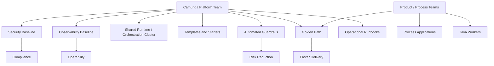
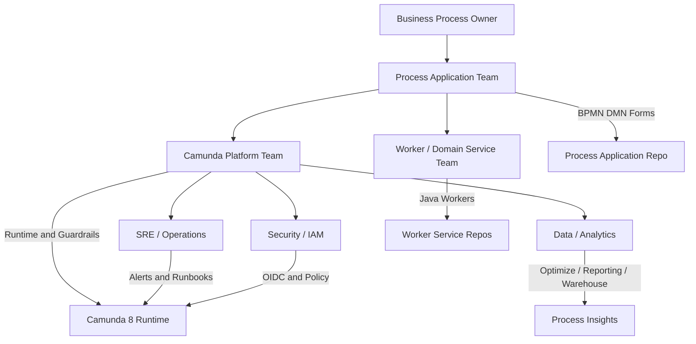
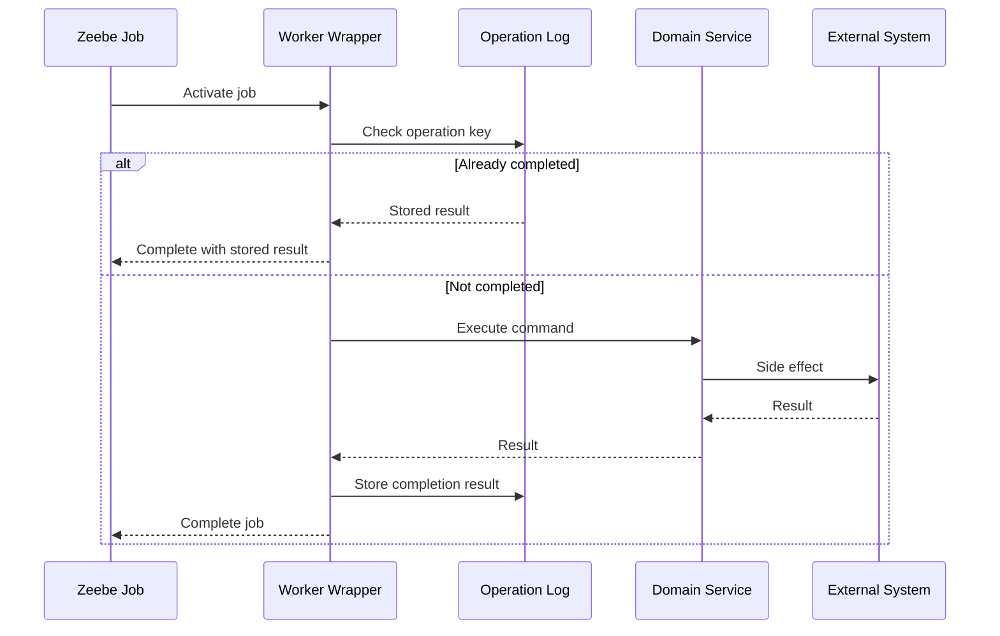
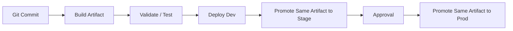
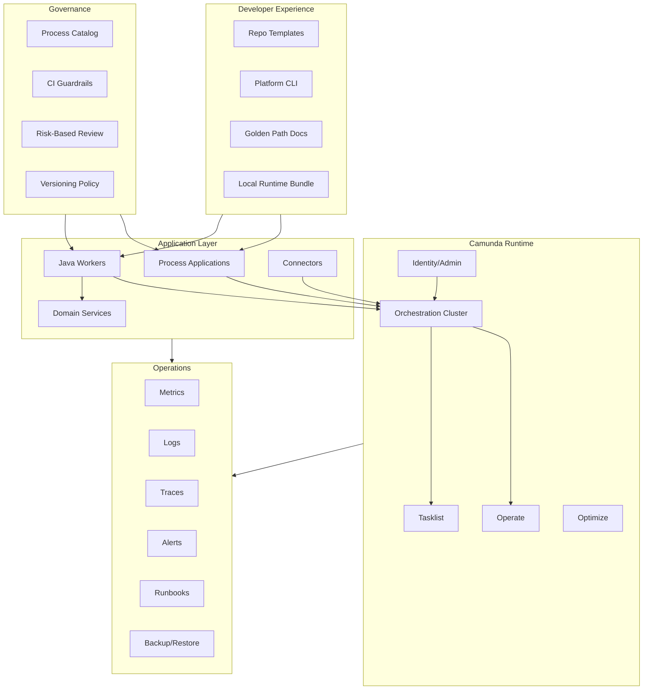

------
title: Learn Java BPMN with Camunda 8 Zeebe - Part 034
description: Platform engineering blueprint for Camunda 8 Zeebe, including internal golden paths, worker templates, shared libraries, guardrails, observability, security, CI/CD, and operating model.
series: learn-java-bpmn-camunda8-zeebe
seriesTitle: Learn Java BPMN with Camunda 8 Zeebe
order: 34
partTitle: Platform Engineering for Camunda 8
tags:
- java
- camunda
- camunda-8
- zeebe
- bpmn
- platform-engineering
- internal-platform
- golden-path
- kubernetes
- sre
- production
date: 2026-06-28
---

# Part 034 — Platform Engineering for Camunda 8

## 1. Tujuan Part Ini

Setelah bagian ini, kamu harus mampu:

1. mendesain Camunda 8 sebagai **internal platform product**, bukan hanya dependency project;
2. membuat golden path untuk teams yang membangun process applications dan Java workers;
3. menentukan boundary antara platform team, process team, worker team, SRE, security, dan business owner;
4. membuat template repository, shared libraries, CI/CD guardrails, observability starter, dan runbook baseline;
5. mengurangi variasi liar tanpa membunuh autonomy team;
6. membuat platform yang scalable secara organisasi, bukan hanya scalable secara teknis.

Camunda 8 di satu team bisa berjalan dengan dokumentasi dan disiplin manual. Camunda 8 di 20 team membutuhkan platform engineering.

---

## 2. Mental Model: Camunda as an Internal Product

Platform engineering bukan membuat semua keputusan untuk semua team. Platform engineering menyediakan jalan paling mudah untuk melakukan hal yang benar.



Core idea:

> Platform team owns the paved road. Product teams own the journey.

---

## 3. Platform Scope

Camunda platform scope harus jelas. Kalau tidak, platform team akan menjadi bottleneck atau support desk permanen.

### 3.1 What Platform Team Owns

Biasanya platform team owns:

- Camunda 8 runtime provisioning;
- SaaS cluster governance atau Self-Managed Helm/Kubernetes deployment;
- environment strategy;
- identity/OIDC integration;
- client credential provisioning;
- network ingress/egress pattern;
- backup/restore and DR coordination;
- observability baseline;
- CI/CD templates;
- worker starter library;
- BPMN/DMN/form lint rules;
- process application golden path;
- shared runbooks;
- upgrade strategy;
- security guardrails;
- platform documentation.

### 3.2 What Product/Process Teams Own

Product teams own:

- business process correctness;
- BPMN/DMN/form content;
- worker business logic;
- variable contract;
- process-specific incidents;
- process-specific runbook details;
- release notes;
- business approvals;
- domain-specific testing;
- SLAs and operational escalation.

### 3.3 What SRE/Ops Owns

SRE/Ops owns or co-owns:

- platform SLOs;
- alert routing;
- capacity planning;
- incident response process;
- on-call workflows;
- backup validation;
- DR drills;
- upgrade windows;
- production readiness review.

### 3.4 What Security Owns

Security owns or co-owns:

- IdP/OIDC standards;
- secret management;
- least privilege policy;
- network policy;
- audit requirements;
- vulnerability management;
- access review;
- compliance controls.

---

## 4. Reference Operating Model

A mature Camunda internal platform usually has layered ownership.



Avoid unclear ownership like:

- platform team owns all BPMN;
- product team owns cluster upgrades;
- SRE owns business incidents;
- security reviews every variable manually;
- every team invents its own worker framework.

---

## 5. Golden Path Definition

Golden path adalah documented, automated, supported way untuk membuat process application.

Golden path harus menjawab:

1. Bagaimana membuat process application baru?
2. Bagaimana membuat Java worker baru?
3. Bagaimana deploy ke dev/stage/prod?
4. Bagaimana mendapat credentials?
5. Bagaimana menguji BPMN/DMN/form?
6. Bagaimana melihat logs/metrics/traces?
7. Bagaimana handle incident?
8. Bagaimana melakukan versioning?
9. Bagaimana mengajukan production change?
10. Bagaimana request exception dari guardrail?

Golden path bukan sekadar wiki. Ia harus embodied di:

- repository template;
- starter dependencies;
- CI/CD pipeline;
- generated config;
- CLI commands;
- sample code;
- dashboards;
- runbooks;
- automatic checks.

---

## 6. Standard Repository Layout

Platform team sebaiknya menyediakan reference layout.

### 6.1 Process Application Repository

```text
regulatory-enforcement-processes/
  README.md
  catalog.yaml
  owners.yaml
  risk-classification.yaml
  bpmn/
    complaint-intake.bpmn
    enforcement-action.bpmn
    appeal-review.bpmn
  dmn/
    complaint-eligibility.dmn
    penalty-classification.dmn
  forms/
    evidence-review.form
    enforcement-approval.form
  schemas/
    complaint-case.schema.json
    enforcement-action.schema.json
  tests/
    process-paths/
    decisions/
    forms/
    migration/
  docs/
    runbook.md
    release-notes.md
    model-review.md
  ci/
    lint-rules.yaml
    deployment.yaml
```

### 6.2 Worker Service Repository

```text
complaint-workers/
  README.md
  build.gradle.kts
  src/main/java/com/acme/enforcement/worker/
    ComplaintValidateEligibilityWorker.java
    ComplaintFetchProfileWorker.java
    EnforcementIssueNoticeWorker.java
  src/main/java/com/acme/enforcement/contract/
    ValidateEligibilityRequest.java
    ValidateEligibilityResult.java
    WorkerErrorCodes.java
  src/main/java/com/acme/enforcement/idempotency/
    OperationLog.java
  src/test/java/
    unit/
    contract/
    integration/
  config/
    application-local.yaml
    application-dev.yaml
    application-prod.yaml
  dashboards/
  runbooks/
```

### 6.3 Why Separate Process Repo and Worker Repo?

Ada dua pola valid.

| Pattern | Kapan cocok | Trade-off |
|---|---|---|
| Same repo | small team, tightly coupled worker/process | easier local changes, harder cross-team reuse |
| Separate repos | platform/multi-team, many workers | better ownership, requires contract discipline |

Untuk enterprise/regulatory systems, sering lebih baik:

- process application repo owns BPMN/DMN/forms;
- domain service repo owns worker logic;
- shared contract package atau schema repo owns data contract;
- release coordination dilakukan via compatibility matrix.

---

## 7. Worker Starter Architecture

Jangan biarkan tiap team menulis boilerplate worker sendiri.

Platform starter harus menyediakan:

- Camunda client configuration;
- authentication configuration;
- typed variable mapping;
- idempotency wrapper;
- retry/failure mapping;
- BPMN error helper;
- structured logging;
- metrics;
- trace context propagation;
- correlation ID conventions;
- safe completion/failure utilities;
- test harness;
- local dev profile;
- production defaults.

### 7.1 Worker Handler Shape

Contoh contract-oriented worker style:

```java
@Component
public class ValidateEligibilityWorker {

    private final EligibilityService eligibilityService;
    private final WorkerResultMapper resultMapper;

    public ValidateEligibilityWorker(
            EligibilityService eligibilityService,
            WorkerResultMapper resultMapper) {
        this.eligibilityService = eligibilityService;
        this.resultMapper = resultMapper;
    }

    @JobWorker(
        type = "complaint.validate-eligibility.v1",
        fetchVariables = {"caseId", "complaintType", "filingDate", "jurisdiction"}
    )
    public Map<String, Object> handle(ValidateEligibilityRequest request) {
        EligibilityDecision decision = eligibilityService.evaluate(request);
        return resultMapper.toVariables(decision);
    }
}
```

Platform library should standardize:

- validation before business call;
- known business error mapping;
- technical retry mapping;
- idempotency key derivation;
- log context;
- metrics tags;
- variable output shape.

### 7.2 Idempotency Wrapper

Do not make idempotency optional for side-effect workers.



Golden path should make this easy.

---

## 8. Shared Libraries: What to Centralize and What Not To

Shared libraries can help or harm.

### 8.1 Good Shared Library Candidates

Centralize:

- client configuration;
- auth token handling;
- logging/tracing context;
- metrics tags;
- worker error mapping conventions;
- idempotency abstraction;
- testing utilities;
- BPMN/DMN constants generation;
- JSON schema validation;
- common health checks;
- local dev test containers or fixtures.

### 8.2 Bad Shared Library Candidates

Avoid centralizing:

- domain business logic;
- process-specific variable models across unrelated domains;
- all workers into one mega-framework;
- hardcoded process IDs from every team;
- policy rules that should live in DMN or domain service;
- giant “CamundaUtil” class.

Rule:

> Platform libraries should standardize cross-cutting behavior, not absorb domain ownership.

---

## 9. Environment Strategy

Common environment model:

| Environment | Purpose | Characteristics |
|---|---|---|
| local | developer feedback | lightweight runtime, fake downstreams |
| dev | team integration | frequent deploy, relaxed data |
| test/qa | functional validation | stable integration data |
| stage/pre-prod | production-like validation | prod-like config, restricted deploy |
| prod | live business execution | strict access, traceability, backup, SLOs |

### 9.1 Local Developer Experience

Local dev must be frictionless.

Minimum commands:

```bash
make camunda-up
make deploy-processes
make run-workers
make test-process
make camunda-down
```

Local dev should include:

- local Camunda runtime or shared dev cluster;
- mock downstream services;
- sample process instances;
- seed variables;
- dashboards or logs;
- reset command;
- known troubleshooting doc.

If local dev takes one day to set up, teams will bypass the platform.

### 9.2 Environment Promotion

Promotion should not mean “export from Modeler and upload manually”.

Recommended flow:



Same artifact should move through environments. Avoid rebuilding BPMN package differently for prod.

---

## 10. CI/CD Platform Guardrails

Guardrails must catch predictable errors before production.

### 10.1 Process Artifact Checks

Checks:

- BPMN parse valid;
- no unsupported BPMN elements;
- all service tasks have job type;
- all job types follow naming convention;
- all message events document correlation key;
- all timers have rationale metadata;
- all user tasks have assignment metadata;
- high-risk forms/decisions do not use unsafe latest binding;
- all executable elements have stable technical IDs;
- no secrets in sample variables;
- payload size check for example/test variables;
- all DMN tables have tests;
- all forms have schema validation tests.

### 10.2 Worker Checks

Checks:

- all declared job types are registered;
- all worker handlers define fetched variables intentionally;
- side-effect workers use idempotency wrapper;
- business errors map to known BPMN error codes;
- technical errors map to fail job with retry/backoff;
- logs include processInstanceKey/jobKey/jobType/correlationId;
- metrics include jobType and outcome;
- no broad catch-and-complete;
- no raw secrets logged;
- no huge variables completed.

### 10.3 Deployment Checks

Checks:

- version tag present;
- owner metadata present;
- migration decision present;
- compatibility matrix updated;
- production deploy from approved branch/tag;
- credentials are environment-scoped;
- post-deploy smoke test passes;
- alerts are configured;
- runbook link exists.

---

## 11. Observability Starter

Every team should get default dashboards without building from scratch.

### 11.1 Process Dashboard

Baseline panels:

- started instances by process ID/version;
- completed instances;
- active instances;
- incidents by process ID/version/element ID;
- average duration by major lifecycle stage;
- stuck wait states;
- timer backlog;
- message correlation failures;
- user task aging;
- migration counts.

### 11.2 Worker Dashboard

Baseline panels:

- activated jobs by job type;
- completed jobs;
- failed jobs;
- BPMN errors thrown;
- retry count distribution;
- timeout count;
- latency per job type;
- external dependency latency;
- idempotency replay count;
- unknown outcome count;
- worker pod health.

### 11.3 Alert Examples

Good alerts:

- incident rate above threshold for high-risk process;
- job activation latency high for critical job type;
- worker failure rate spike;
- user task SLA breached;
- message correlation failure spike;
- broker/backpressure sustained;
- Elasticsearch/OpenSearch/RDBMS secondary storage unhealthy;
- partition processing lag grows;
- backup failed;
- prod deploy smoke test failed.

Bad alerts:

- every single incident pages platform SRE;
- every failed job pages immediately even when retrying;
- alert without owner;
- alert without runbook;
- alert that fires constantly and teaches teams to ignore it.

---

## 12. Security Golden Path

Security must be defaulted, not bolted on.

### 12.1 Human Access

Standardize:

- group mapping from IdP;
- role names;
- task access model;
- operator permissions;
- environment-specific access;
- break-glass access;
- periodic access review;
- audit trail for production actions.

### 12.2 Machine Access

Standardize:

- one application/client per worker service/environment;
- least privilege scopes/permissions;
- no shared client secrets across teams;
- short-lived credentials where possible;
- secret rotation;
- secret storage via managed secret manager;
- no credentials in repository or process variables.

### 12.3 Network and Egress

Standardize:

- allowed outbound destinations for workers;
- ingress exposure for APIs;
- TLS requirements;
- namespace network policies;
- mTLS/service mesh if organization standard;
- deny-by-default for high-risk environments.

---

## 13. Process Catalog

At scale, you need a catalog.

Catalog fields:

```yaml
processId: complaint-intake
processName: Complaint Intake
ownerTeam: enforcement-platform
businessOwner: enforcement-operations
riskClass: high
runtime: camunda8-prod-asean
repository: regulatory-enforcement-processes
workerServices:
  - complaint-workers
  - evidence-workers
  - notification-workers
criticalJobTypes:
  - complaint.validate-eligibility.v1
  - evidence.verify-integrity.v1
messageNames:
  - RegulatedPartyResponseReceived
  - EvidenceUploaded
sla:
  maxIntakeDuration: P5D
runbook: docs/runbook.md
dashboards:
  process: grafana/process/complaint-intake
  worker: grafana/worker/complaint-workers
dataClassification: confidential
```

Catalog enables:

- ownership lookup;
- incident routing;
- security review;
- migration planning;
- upgrade impact analysis;
- process portfolio management.

---

## 14. Platform APIs and Self-Service

Internal platform should expose self-service flows.

Examples:

- create new process application;
- create worker service from template;
- request dev credentials;
- request prod credentials;
- register job type owner;
- register process owner;
- deploy to dev;
- request production promotion;
- generate dashboard;
- generate runbook skeleton;
- request exception to guardrail.

Do not make every request a ticket if it can be automated safely.

### 14.1 Example CLI

```bash
camunda-platform init process-app regulatory-enforcement
camunda-platform init worker complaint-workers --job-type complaint.validate-eligibility.v1
camunda-platform validate
camunda-platform deploy dev
camunda-platform promote stage --version-tag enforcement-2026.06-r3
camunda-platform request-prod --change-risk high
camunda-platform catalog publish
```

The CLI can be thin. The value is consistency.

---

## 15. Multi-Tenancy and Domain Boundaries

Do not solve all isolation needs with one mechanism.

Isolation dimensions:

| Dimension | Option |
|---|---|
| runtime isolation | separate cluster / shared cluster |
| namespace isolation | Kubernetes namespace |
| auth isolation | separate IdP apps / groups / roles |
| data isolation | tenant ID / separate storage / encryption boundary |
| operational isolation | separate on-call / dashboards / alerts |
| deployment isolation | separate pipelines / approvals |
| process isolation | process ID prefix / catalog ownership |

Decision factors:

- data sensitivity;
- regulatory boundary;
- tenant blast radius;
- expected load;
- team autonomy;
- upgrade coordination;
- cost;
- support model.

High-risk tenant/domain may deserve stronger isolation than normal internal workflows.

---

## 16. Upgrade Platform Discipline

Camunda platform upgrades affect:

- Orchestration Cluster runtime;
- APIs;
- Java client/starter;
- worker services;
- Operate/Tasklist behavior;
- authentication/authorization behavior;
- Helm chart values;
- secondary storage;
- exporters/connectors;
- testing libraries.

Platform team should maintain an upgrade playbook:

1. Track release notes.
2. Identify deprecations/removals.
3. Test platform runtime in non-prod.
4. Test representative process applications.
5. Test Java client/starter compatibility.
6. Test worker behavior.
7. Test Operate/Tasklist critical workflows.
8. Validate backup/restore.
9. Run performance smoke tests.
10. Communicate cutover and compatibility window.

### 16.1 Deprecation Registry

Maintain registry:

```yaml
deprecations:
  - item: Zeebe Java Client
    replacement: Camunda Java Client
    affectedServices:
      - complaint-workers
      - notification-workers
    targetRemovalRelease: 8.10
    migrationOwner: platform-engineering
    status: in-progress
  - item: Zeebe Process Test
    replacement: Camunda Process Test
    affectedRepos:
      - regulatory-enforcement-processes
    status: planned
```

This prevents upgrade surprise.

---

## 17. Production Readiness Review

Before a team goes live, require production readiness.

### 17.1 Process Readiness

- BPMN reviewed;
- DMN tested;
- forms validated;
- version binding checked;
- message correlation documented;
- timer/SLA owner defined;
- error/incident path modeled;
- migration decision documented;
- process catalog entry published.

### 17.2 Worker Readiness

- typed contracts;
- idempotency for side effects;
- retry/backoff policy;
- business error mapping;
- structured logs;
- metrics;
- tracing;
- health checks;
- dependency timeouts;
- load test;
- contract tests.

### 17.3 Operational Readiness

- dashboards;
- alerts;
- runbooks;
- owner rotation;
- escalation path;
- support hours;
- backup/restore if self-managed relevant;
- DR implications;
- incident simulation.

### 17.4 Security Readiness

- IdP groups;
- role mapping;
- machine credentials;
- secret rotation;
- least privilege;
- data classification;
- sensitive variable review;
- audit requirements;
- access review schedule.

---

## 18. Platform SLOs

Platform needs explicit SLOs.

Examples:

| SLO | Example target |
|---|---|
| Process start API availability | 99.9% monthly |
| Job activation latency | p95 under defined threshold for critical job types |
| Incident detection latency | critical incident visible within N minutes |
| Tasklist availability | 99.5% business hours |
| Backup success | daily successful backup, validated restore monthly |
| Deployment lead time | dev deploy under N minutes |
| Worker template adoption | 90% of new workers use starter |

Be careful: business process SLO and platform SLO are not the same.

Example:

- platform SLO: Zeebe can activate jobs;
- worker SLO: worker processes jobs within target latency;
- business SLO: complaint intake completes within five business days.

All three need owners.

---

## 19. Capability Maturity Model

Use this to assess your Camunda platform.

| Level | Description | Symptoms |
|---|---|---|
| 0 — Ad hoc | each team experiments | manual deploy, unknown owners |
| 1 — Project | one production process works | custom scripts, tribal knowledge |
| 2 — Standardized | templates and conventions exist | consistent repos, basic CI |
| 3 — Guardrailed | automated checks and golden path | safe self-service, dashboards |
| 4 — Platform product | multi-team adoption with SLOs | catalog, runbooks, support model |
| 5 — Adaptive | governance, learning loop, continuous improvement | risk-based controls, upgrade discipline, strong metrics |

Top 1% target is Level 4+.

---

## 20. Anti-Patterns

### 20.1 Platform as Ticket Queue

Gejala:

- every deploy needs manual platform intervention;
- teams wait days for credentials;
- platform team becomes bottleneck.

Fix:

- automate safe paths;
- self-service dev/stage;
- production approval only where risk justifies it.

### 20.2 Everyone Builds Their Own Worker Framework

Gejala:

- inconsistent retry mapping;
- inconsistent logging;
- no idempotency standard;
- impossible support.

Fix:

- provide starter;
- enforce minimum telemetry;
- allow extension, not reinvention.

### 20.3 One Giant Shared Worker Service

Gejala:

- all job types in one service;
- every process change redeploys same artifact;
- ownership unclear;
- failure blast radius huge.

Fix:

- split by domain capability;
- keep shared platform code small;
- use job type ownership catalog.

### 20.4 Platform Owns Business Process Semantics

Gejala:

- platform team becomes BPMN approval bottleneck;
- business correctness delegated to infrastructure team;
- changes slow and context weak.

Fix:

- product teams own semantics;
- platform owns guardrails and runtime;
- governance board for high-risk changes only.

### 20.5 Dashboard Afterthought

Gejala:

- process goes live without dashboard;
- incidents discovered by user complaints;
- no job latency metrics.

Fix:

- dashboard generated by template;
- production readiness blocks go-live without observability.

### 20.6 Security by Convention

Gejala:

- shared client credentials;
- all workers admin-level;
- production access never reviewed;
- secrets in config files.

Fix:

- least privilege machine identity;
- environment-scoped clients;
- managed secrets;
- access review automation.

---

## 21. Reference Platform Blueprint



---

## 22. First 90 Days Platform Roadmap

### Days 1–15 — Baseline

Deliver:

- identify target runtime model: SaaS or Self-Managed;
- define owner model;
- create process catalog schema;
- create naming conventions;
- create worker starter skeleton;
- create minimum BPMN review checklist.

### Days 16–30 — Golden Path MVP

Deliver:

- process application repo template;
- worker service repo template;
- local dev guide;
- basic CI checks;
- dev deployment pipeline;
- starter dashboard;
- basic incident runbook.

### Days 31–60 — Production Guardrails

Deliver:

- stage/prod promotion pipeline;
- version tag and migration decision required;
- identity/client credential workflow;
- secret management integration;
- process/worker dashboards;
- alert routing;
- production readiness checklist.

### Days 61–90 — Scale and Harden

Deliver:

- process catalog UI or searchable registry;
- advanced static checks;
- idempotency wrapper;
- contract testing harness;
- upgrade/deprecation registry;
- DR/backup runbook;
- first platform SLOs;
- training material for product teams.

---

## 23. Practice Drill

Design your own internal Camunda platform blueprint.

Produce:

1. platform ownership matrix;
2. process application repo template;
3. worker starter architecture;
4. CI/CD guardrail list;
5. process catalog schema;
6. dashboard baseline;
7. security baseline;
8. production readiness checklist;
9. first 90 days roadmap;
10. anti-pattern list customized for your organization.

Target output:

```text
A product team can create, test, deploy, observe, and operate a Camunda 8 process application without inventing infrastructure, security, retry, observability, or governance patterns from scratch.
```

---

## 24. Ringkasan

Platform engineering untuk Camunda 8 adalah tentang mengubah process orchestration dari isolated project menjadi reliable organizational capability.

Prinsip utama:

- Camunda platform adalah internal product;
- golden path harus lebih mudah daripada bypass;
- product teams own business semantics;
- platform owns runtime, guardrails, starter, and paved road;
- worker patterns harus distandardisasi;
- observability harus default;
- security harus environment-scoped dan least privilege;
- process catalog adalah operational necessity;
- governance harus automated dan risk-based;
- upgrade discipline harus proactive.

Tanpa platform engineering, Camunda 8 adoption sering menjadi kumpulan process island.

Dengan platform engineering yang benar, Camunda 8 menjadi orchestration backbone yang scalable secara teknis, operasional, dan organisasi.

---

## References

- Camunda Docs — Deploy and manage Camunda Self-Managed: https://docs.camunda.io/docs/self-managed/deployment/
- Camunda Docs — Install Camunda for production with Helm: https://docs.camunda.io/docs/self-managed/deployment/helm/install/production/
- Camunda Docs — Camunda 8 Self-Managed overview: https://docs.camunda.io/docs/self-managed/about-self-managed/
- Camunda Docs — Orchestration Cluster: https://docs.camunda.io/docs/components/orchestration-cluster/
- Camunda Docs — Access control authorizations: https://docs.camunda.io/docs/components/concepts/access-control/authorizations/
- Camunda Docs — Process application deployment: https://docs.camunda.io/docs/components/modeler/web-modeler/process-applications/deploy-process-application/
- Camunda Docs — Process application versioning: https://docs.camunda.io/docs/components/modeler/web-modeler/process-applications/process-application-versioning/
- Camunda Docs — Writing good workers: https://docs.camunda.io/docs/components/best-practices/development/writing-good-workers/
- Camunda Docs — Backup and restore: https://docs.camunda.io/docs/self-managed/operational-guides/backup-restore/backup-and-restore/
