------
title: Learn Java BPMN with Camunda 8 Zeebe - Part 035
description: Final mastery part for Camunda 8 Zeebe, covering production pattern catalog, anti-pattern catalog, readiness checklist, architecture review checklist, and a capstone regulatory enforcement lifecycle platform.
series: learn-java-bpmn-camunda8-zeebe
seriesTitle: Learn Java BPMN with Camunda 8 Zeebe
order: 35
partTitle: Patterns, Anti-Patterns, and Capstone System
tags:
- java
- camunda
- camunda-8
- zeebe
- bpmn
- patterns
- anti-patterns
- capstone
- regulatory-workflow
- production-architecture
- orchestration
- platform-engineering
date: 2026-06-28
---

# Part 035 — Patterns, Anti-Patterns, and Capstone System

## 1. Tujuan Part Ini

Ini adalah bagian terakhir dari seri **Learn Java BPMN with Camunda 8 Zeebe**.

Setelah bagian ini, kamu harus mampu:

1. membaca sebuah process architecture dan mengidentifikasi apakah ia sehat, rapuh, over-engineered, atau under-specified;
2. memilih pattern Camunda 8 yang tepat untuk orchestration, worker, message, timer, user task, decision, compensation, dan platform governance;
3. mengenali anti-pattern produksi sebelum menjadi incident besar;
4. membuat checklist production readiness untuk process application;
5. membuat architecture review checklist untuk Camunda 8;
6. mendesain capstone system: **regulatory enforcement lifecycle platform** dengan BPMN, Java workers, user tasks, DMN, messaging, evidence handling, observability, security, dan migration governance;
7. mengukur mastery kamu sendiri dengan rubric yang objektif.

Part ini bukan daftar template. Part ini adalah **synthesis layer**.

Kalau Part 001-034 adalah skill tree, Part 035 adalah cara berpikir ketika kamu masuk ke real project yang penuh constraint, legacy, pressure, audit, SLA, integration failure, dan stakeholder ambiguity.

---

## 2. Final Mental Model

Camunda 8 Zeebe bukan sekadar BPMN engine.

Di sistem produksi, Camunda 8 adalah **distributed orchestration control plane** untuk lifecycle yang melibatkan:

- manusia;
- service;
- event;
- rule;
- dokumen;
- deadline;
- audit;
- exception;
- compensation;
- governance;
- platform operation.

Model paling ringkasnya:

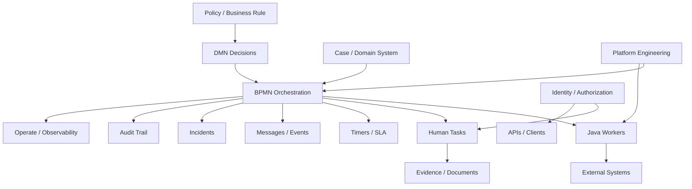

Top 1% engineer tidak hanya bertanya:

> “Bagaimana cara membuat BPMN ini jalan?”

Tetapi:

> “Siapa pemilik lifecycle ini, state mana yang authoritative, apa failure model-nya, apa retry policy-nya, apa audit boundary-nya, apa operational runbook-nya, dan bagaimana model ini berubah tanpa merusak instance yang sedang berjalan?”

---

## 3. Kaufman Closing Loop: From Practice to Fluency

Josh Kaufman menekankan bahwa belajar efektif membutuhkan deconstruction, fast feedback, deliberate practice, dan removal of barriers.

Untuk Camunda 8, fluency berarti kamu tidak hanya hafal API atau BPMN symbol. Kamu bisa berpikir dalam empat layer secara bersamaan.

### 3.1 Layer 1: Business Lifecycle

Pertanyaan utama:

- Apa outcome bisnis/regulatory yang harus dicapai?
- Apa state yang legally meaningful?
- Apa yang harus bisa diaudit?
- Apa yang boleh otomatis dan apa yang harus manusia approve?
- Apa deadline dan escalation yang mengubah risiko?

### 3.2 Layer 2: BPMN Execution

Pertanyaan utama:

- Di mana wait state?
- Di mana token bisa parallel?
- Di mana cancellation mungkin terjadi?
- Di mana message bisa datang lebih awal/lebih lambat?
- Di mana incident bisa terjadi?
- Apakah BPMN ini executable contract atau diagram dokumentasi?

### 3.3 Layer 3: Java Integration

Pertanyaan utama:

- Job type apa contract-nya?
- Worker membaca variable apa saja?
- Worker menulis variable apa saja?
- Side effect apa yang dilakukan?
- Apakah side effect idempotent?
- Apakah retry aman?
- Bagaimana unknown outcome ditangani?

### 3.4 Layer 4: Operation and Governance

Pertanyaan utama:

- Bagaimana model ini di-deploy?
- Bagaimana versi lama dan versi baru hidup berdampingan?
- Bagaimana incident diinvestigasi?
- Bagaimana instance dimigrasikan?
- Bagaimana access control diuji?
- Bagaimana bukti audit diekstrak?

Kalau salah satu layer kosong, sistem akan terlihat “jalan” saat demo tetapi rapuh di produksi.

---

## 4. Pattern Catalog

Bagian ini mengumpulkan pattern yang paling penting untuk Camunda 8 Zeebe. Pattern di sini tidak dimaksudkan sebagai recipe mekanis. Gunakan sebagai decision tool.

---

## 5. Pattern: Thin Worker, Explicit Contract

### Problem

Service task sering berubah menjadi tempat semua logic bisnis, mapping, retry, decision, audit, dan integration dicampur.

### Force

Worker perlu menjalankan logic, tetapi tidak boleh mengambil alih ownership workflow. BPMN harus tetap menjelaskan lifecycle, DMN harus menjelaskan rule, dan domain service harus tetap menjadi authoritative business capability.

### Solution

Desain worker sebagai adapter tipis:

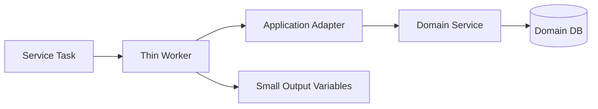

Worker bertanggung jawab untuk:

- membaca variable yang dibutuhkan saja;
- memvalidasi input contract;
- memanggil domain/API eksternal;
- menerjemahkan technical failure menjadi retry/fail;
- menerjemahkan known business outcome menjadi BPMN error/result variable;
- menulis output minimal.

Worker tidak bertanggung jawab untuk:

- menyimpan domain state utama;
- mengimplementasikan decision policy kompleks;
- menyembunyikan lifecycle decision yang seharusnya terlihat di BPMN;
- mengirim ulang semua input variable sebagai output;
- menjadi mini workflow engine.

### Java Shape

```java
@JobWorker(type = "enforcement.check-entity-risk.v1", fetchVariables = {
    "caseId", "entityId", "riskContext"
})
public RiskCheckResult handleRiskCheck(RiskCheckCommand command) {
    RiskDecision decision = riskService.check(command.caseId(), command.entityId(), command.riskContext());

    return new RiskCheckResult(
        decision.score(),
        decision.level(),
        decision.decisionId()
    );
}
```

### Invariants

- Job type is a public contract.
- Input variables are explicit.
- Output variables are minimal.
- Domain state stays in domain system.
- Retry is safe or intentionally blocked.

### When to Use

Use this for most service tasks.

### When Not to Use

If the integration step is pure low-code configuration with no Java-specific policy, a connector may be better. If the step is a complex domain operation, put the complexity in a domain service, not directly in the worker.

---

## 6. Pattern: Idempotent Side-Effect Worker

### Problem

Zeebe workers operate in a distributed system. A worker may perform a side effect and crash before completing the job. The job can be retried and the side effect can happen again.

### Solution

Every worker with external side effects must have an idempotency strategy.

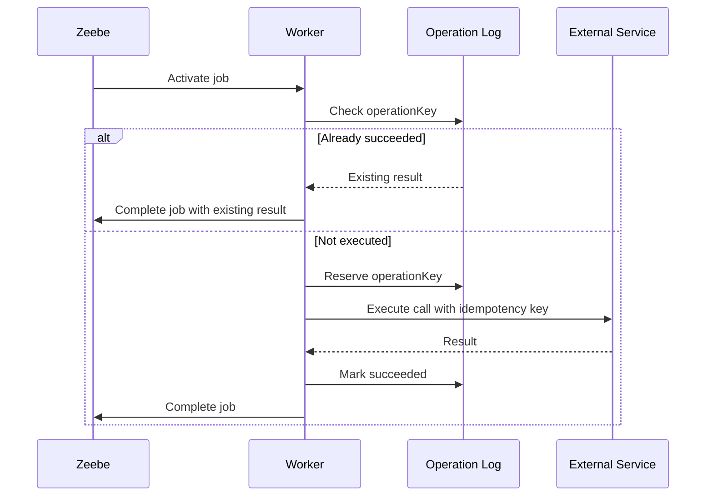

### Operation Key Formula

A robust operation key should be stable and business meaningful:

```text
operationKey = processInstanceKey + ':' + elementId + ':' + businessAction + ':' + businessEntityId
```

For externally visible business operations, prefer a business key:

```text
operationKey = caseId + ':' + actionCode + ':' + targetEntityId + ':' + actionVersion
```

### Invariants

- The same operation key must not produce two inconsistent external side effects.
- Unknown outcome must be recoverable.
- Completion to Zeebe must not be treated as the only source of truth for side-effect success.
- Retrying the worker must be safe.

### Anti-Pattern Prevented

- duplicate payment;
- duplicate notification;
- duplicate regulatory notice;
- duplicate case assignment;
- duplicate external task creation;
- duplicate sanction publication.

---

## 7. Pattern: Business Error Boundary

### Problem

Teams often encode all errors as job failure. The process then creates incidents for things that are valid business outcomes.

Example:

- entity not eligible;
- document rejected;
- approval denied;
- risk too high;
- case already closed;
- duplicate complaint.

These are not technical incidents. They are modeled outcomes.

### Solution

Use BPMN error for known business outcomes that need process-level handling.

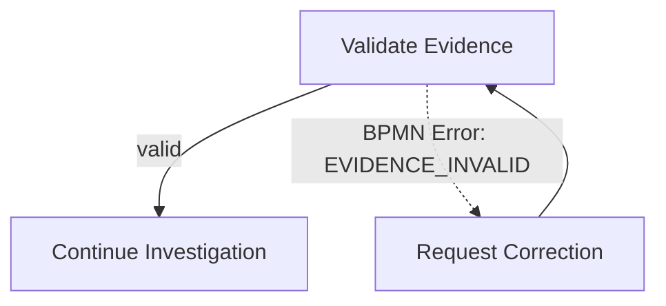

Worker behavior:

```java
try {
    ValidationResult result = evidenceService.validate(command.evidenceId());

    if (!result.valid()) {
        throw new BpmnError("EVIDENCE_INVALID", result.reason());
    }

    return Map.of("evidenceValidationId", result.validationId());
} catch (ExternalSystemUnavailable e) {
    throw e; // technical failure; let retry/failure path handle it
}
```

### Invariants

- BPMN error code is part of contract.
- BPMN error represents modeled process path.
- Technical failures remain retryable/incidental.
- The process model shows meaningful business alternatives.

---

## 8. Pattern: Message Router with Correlation Ledger

### Problem

External events rarely arrive in perfect order. Messages can arrive before the process reaches the catch event, after cancellation, duplicated, or with incomplete correlation data.

### Solution

Create a message router layer that validates, deduplicates, enriches, and publishes messages to Camunda.

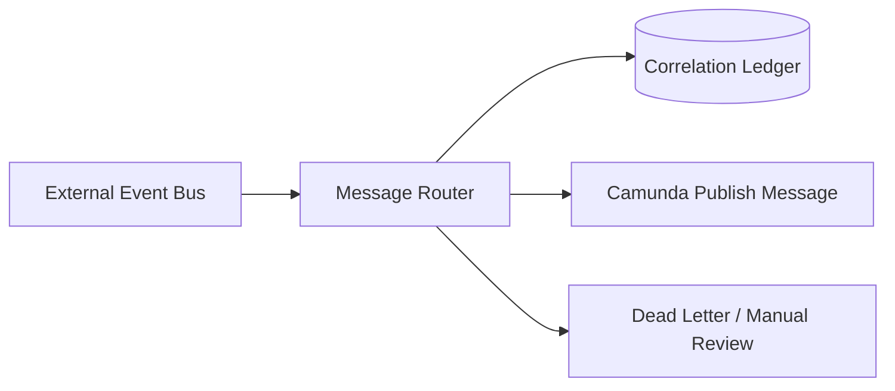

The router owns:

- event schema validation;
- idempotency by event id/message id;
- correlation key lookup;
- stale event policy;
- invalid event quarantine;
- observability.

Camunda owns:

- process wait state;
- message catch behavior;
- process continuation.

### Correlation Contract

```json
{
  "messageName": "EvidenceReceived",
  "correlationKey": "case:CASE-2026-001:submission:SUB-991",
  "messageId": "event-78f4e8c9",
  "ttl": "PT24H",
  "variables": {
    "evidenceId": "EVD-123",
    "receivedAt": "2026-06-28T09:00:00+07:00"
  }
}
```

### Invariants

- Message name and correlation key are explicit.
- Message ID is stable for deduplication.
- TTL is selected based on business timing, not arbitrary default.
- Invalid events do not silently disappear.

---

## 9. Pattern: SLA Watchdog Process

### Problem

Large lifecycle processes become unreadable if every SLA, warning, escalation, and deadline is embedded directly in the main process.

### Solution

Separate primary lifecycle from monitoring lifecycle.

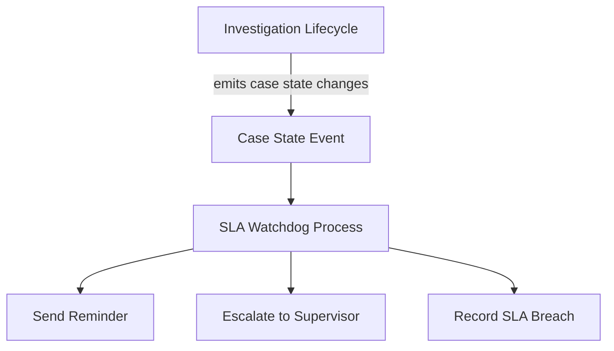

### Use When

- many SLA rules exist;
- SLA policy changes often;
- monitoring must continue across lifecycle episodes;
- escalation has its own workflow;
- stakeholders want SLA dashboards.

### Avoid When

- there is only one simple timeout;
- the timer is local to one activity;
- separation would hide business semantics.

### Invariants

- Main process owns case progression.
- Watchdog owns deadline observation.
- Deadline decisions are auditable.
- Duplicate escalations are prevented by idempotency key.

---

## 10. Pattern: Decision Snapshot

### Problem

DMN rules evolve. A case decision made in January must remain explainable in December, even if rules have changed.

### Solution

Store decision output plus decision identity/version metadata in the domain audit store.

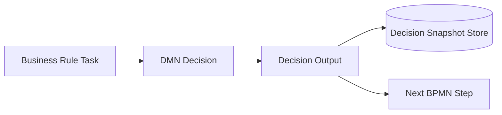

Snapshot fields:

```json
{
  "caseId": "CASE-2026-001",
  "decisionName": "EnforcementPriorityDecision",
  "decisionVersionTag": "2026-Q3-policy",
  "inputHash": "sha256:...",
  "output": {
    "priority": "HIGH",
    "reasonCode": "REPEAT_VIOLATION"
  },
  "evaluatedAt": "2026-06-28T09:30:00+07:00"
}
```

### Invariants

- Decision output is not enough; store decision identity.
- Input snapshot or input hash must be available.
- Effective policy date matters in regulatory workflows.
- Worker code must not silently reimplement policy.

---

## 11. Pattern: Bounded Case Episode

### Problem

Regulatory cases can last months or years. A single immortal BPMN instance accumulates too many states, timers, subprocesses, variable mutations, and versioning problems.

### Solution

Model bounded episodes as separate process instances.

Examples:

- complaint intake;
- preliminary assessment;
- investigation;
- enforcement decision;
- notice issuance;
- appeal;
- monitoring;
- closure;
- reopening.

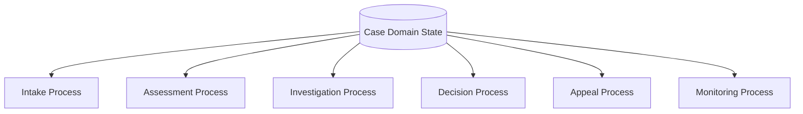

The domain case record connects episodes.

### Invariants

- Domain case state is authoritative.
- BPMN instance owns one executable episode.
- Episode output updates domain case state.
- Reopening starts a new episode instead of reviving old execution arbitrarily.

---

## 12. Pattern: Human Decision Checkpoint

### Problem

Human tasks often become vague “review” steps. The task form does not make clear what decision is being made, what evidence is required, and what happens next.

### Solution

Model human tasks as explicit decision checkpoints.

A human task should have:

- decision name;
- allowed outcomes;
- required evidence;
- reviewer role;
- assignment policy;
- escalation rule;
- completion validation;
- audit statement.

Example task outcomes:

```text
APPROVE_PROCEED
REQUEST_MORE_EVIDENCE
REJECT_CASE
ESCALATE_TO_PANEL
```

Process shape:

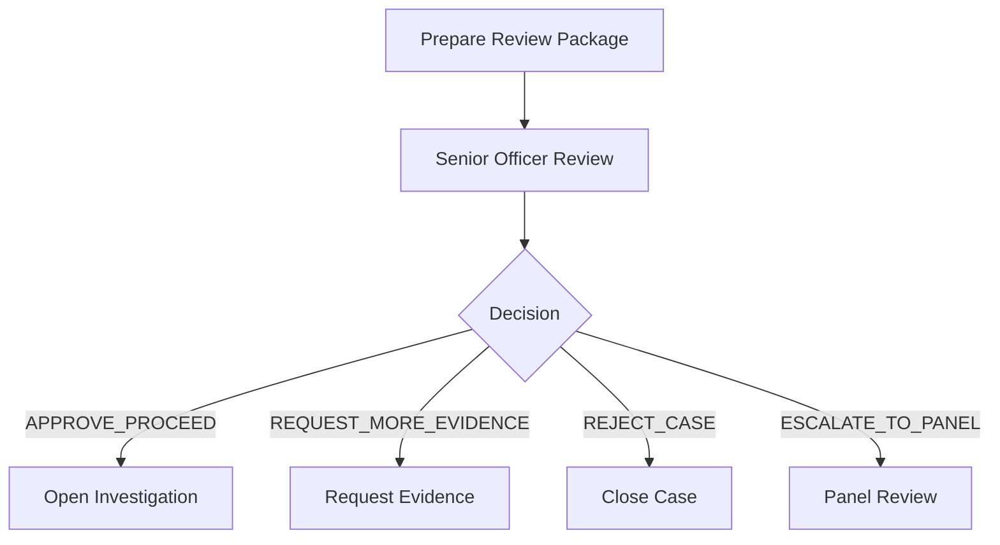

### Invariants

- Human task output is typed and finite.
- Every outcome has a modeled path.
- Completion validation rejects incomplete or invalid decisions.
- Reviewer identity and rationale are captured.

---

## 13. Pattern: Process Application Boundary

### Problem

Teams deploy random BPMN files, Java workers, DMN decisions, and forms without a single versioned application boundary.

### Solution

Treat related process artifacts as a process application.

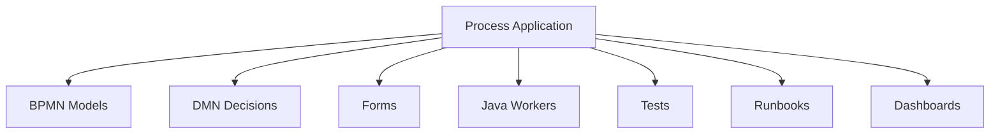

### Invariants

- Artifacts are versioned together when they change together.
- CI validates BPMN/DMN/form/worker contracts.
- Deployment has rollback/roll-forward strategy.
- Ownership is clear.

---

## 14. Pattern: Migration by Strangler, Not Big Bang

### Problem

Large Camunda 7 systems cannot be safely migrated by direct conversion alone.

### Solution

Migrate by lifecycle slice.

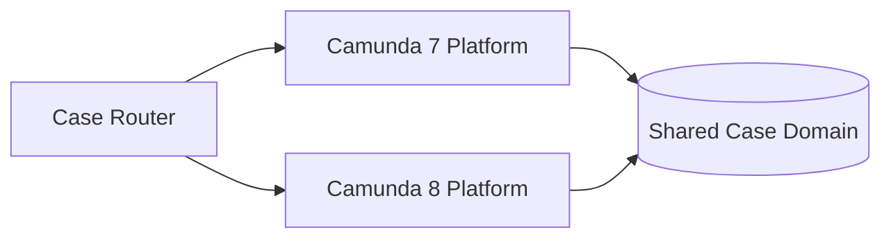

Candidates for early migration:

- new case types;
- isolated subprocesses;
- external-task-heavy flows;
- processes with clear JavaDelegate boundaries;
- flows with low number of active long-running instances.

Avoid early migration for:

- heavily customized engine internals;
- embedded transaction-heavy flows;
- obscure listeners/execution hacks;
- long-running processes with complex active instance migration needs;
- forms/tasks tightly coupled to legacy custom tasklist.

### Invariants

- Camunda 7 and Camunda 8 do not share runtime instance state.
- Domain case state mediates coexistence.
- Integration contracts are versioned.
- Cutover is observable and reversible at routing level.

---

## 15. Anti-Pattern Catalog

A strong engineer recognizes failure shapes early. The following anti-patterns are the recurring ones in Camunda 8 programs.

---

## 16. Anti-Pattern: Camunda 8 as Camunda 7 Remote Edition

### Symptom

The team tries to recreate:

- JavaDelegate semantics;
- same transaction boundary;
- embedded engine assumptions;
- direct database/history queries;
- local synchronous mental model;
- execution listeners everywhere.

### Why It Fails

Camunda 8 is remote, distributed, event-sourced orchestration. Job workers are external clients. The engine is not inside your application transaction.

### Better Design

- Re-think process boundaries.
- Convert JavaDelegate to explicit job worker contract.
- Move domain state to domain services.
- Use BPMN for lifecycle, not embedded code hooks.
- Use Operate/API for operational visibility, not direct DB dependency.

---

## 17. Anti-Pattern: Process Variable as Database

### Symptom

Process variables contain huge nested domain objects:

```json
{
  "case": {
    "parties": [...],
    "documents": [...],
    "fullHistory": [...],
    "auditLog": [...],
    "riskModel": {...}
  }
}
```

### Why It Fails

- large payload transfer;
- poor schema evolution;
- sensitive data exposure;
- accidental overwrites;
- difficult debugging;
- slow job activation/completion;
- unclear authoritative state.

### Better Design

Store references and process-relevant snapshots:

```json
{
  "caseId": "CASE-2026-001",
  "currentStage": "INVESTIGATION",
  "riskLevel": "HIGH",
  "evidencePackageId": "EP-778",
  "assignedUnit": "ENFORCEMENT_NORTH"
}
```

Domain data belongs in domain systems.

---

## 18. Anti-Pattern: God Process

### Symptom

One BPMN model contains every possible scenario:

- intake;
- investigation;
- document review;
- hearing;
- appeal;
- monitoring;
- enforcement;
- closure;
- reopening;
- reporting;
- SLA management;
- notification;
- audit extraction.

### Why It Fails

- unreadable diagram;
- unsafe changes;
- hard migration;
- hard ownership;
- too many active states;
- difficult testing;
- versioning nightmare.

### Better Design

Decompose into bounded lifecycle episodes connected through domain case state and events.

---

## 19. Anti-Pattern: God Worker

### Symptom

A worker method does:

- validates input;
- calls three services;
- applies business decision;
- writes database;
- publishes events;
- sends email;
- computes next path;
- updates many process variables.

### Why It Fails

- hidden workflow;
- retry unsafe;
- hard testing;
- unclear ownership;
- impossible audit;
- BPMN becomes decorative.

### Better Design

Split into:

- BPMN for lifecycle;
- DMN for rule;
- worker for adapter;
- domain service for business operation;
- event/message for asynchronous boundary.

---

## 20. Anti-Pattern: Incident as Business Path

### Symptom

Expected business situations intentionally create incidents:

- missing document;
- rejected application;
- ineligible entity;
- invalid submission;
- approval denied.

### Why It Fails

Incidents are operational problems blocking execution. They require operator intervention and retry/resolution. They are not normal business branching.

### Better Design

Use:

- BPMN error;
- gateway condition;
- user task correction;
- modeled rejection path;
- business rule task decision.

---

## 21. Anti-Pattern: Retry Without Idempotency

### Symptom

Workers call external systems and rely on Zeebe retries without checking duplicate side effects.

### Why It Fails

A retry can repeat the side effect. Timeout does not prove failure. Crash after side effect but before complete can duplicate the operation.

### Better Design

- operation log;
- idempotency key;
- downstream duplicate protection;
- reconciliation worker;
- unknown outcome state;
- explicit manual review path for unrecoverable uncertainty.

---

## 22. Anti-Pattern: Message Correlation by Hope

### Symptom

External system publishes events with weak correlation data:

```json
{
  "caseNumber": "maybe-CASE-001",
  "type": "update",
  "payload": {...}
}
```

No stable message name, no message ID, no clear TTL, no dedupe ledger.

### Why It Fails

- duplicate messages;
- stale messages;
- wrong process instance;
- event arrives before wait state;
- silent non-correlation;
- impossible forensic tracing.

### Better Design

Define message contract explicitly:

- message name;
- correlation key;
- message ID;
- TTL;
- schema version;
- event source;
- causation/correlation IDs;
- invalid-event handling.

---

## 23. Anti-Pattern: Forms as Domain Model

### Symptom

The form schema becomes the domain entity definition. Backend systems accept raw form output without validation or normalization.

### Why It Fails

- UI changes break domain contract;
- domain invariants move to browser/client;
- incomplete validation;
- audit ambiguity;
- backward compatibility problems.

### Better Design

Forms are interaction contracts. Domain services own business validation and persistence.

---

## 24. Anti-Pattern: No Process Version Strategy

### Symptom

Teams deploy BPMN changes with no rule for active instances.

Questions are unanswered:

- Do old instances continue on old version?
- Do we migrate them?
- Which changes are safe?
- What happens to called processes?
- What version of DMN/form is used?

### Why It Fails

The issue only appears after production has long-running instances.

### Better Design

Use version governance:

- change taxonomy;
- deployment approval;
- version tags;
- migration plan;
- compatibility testing;
- effective-date policy;
- runbook for active instance migration.

---

## 25. Anti-Pattern: Task Assignment Equals Authorization

### Symptom

The system assumes that assigning a task to a user or group is sufficient access control.

### Why It Fails

Assignment and authorization are different concerns. Task visibility, API access, custom task apps, and domain data access need explicit security design.

### Better Design

- define human role model;
- configure Camunda authorization;
- enforce domain authorization in task backend/custom UI;
- audit task access and completion;
- test negative access cases.

---

## 26. Anti-Pattern: Platform as Shared Cluster Only

### Symptom

The organization says it has a Camunda platform because it has a shared cluster.

No golden path exists for:

- worker starter;
- observability;
- security baseline;
- CI validation;
- process review;
- incident runbook;
- versioning;
- migration;
- team ownership.

### Why It Fails

A cluster is infrastructure. A platform is a product that makes correct usage easy.

### Better Design

Provide:

- templates;
- shared libraries;
- paved-road deployment;
- automated guardrails;
- dashboards;
- runbooks;
- support model;
- architecture review framework.

---

## 27. Production Readiness Checklist

Use this checklist before putting a Camunda 8 process application into production.

### 27.1 Process Model

- [ ] Every BPMN model has a clear business owner.
- [ ] Every technical ID is stable and reviewed.
- [ ] Every service task has explicit job type.
- [ ] Every call activity has binding/version strategy.
- [ ] Every message event has message name, correlation key, TTL, and message ID strategy.
- [ ] Every timer has business rationale.
- [ ] Every user task has explicit outcome contract.
- [ ] Every gateway has deterministic condition semantics.
- [ ] Every business error path is modeled.
- [ ] Technical failures do not masquerade as business paths.
- [ ] Boundary events are intentional and tested.
- [ ] Cancellation semantics are understood.

### 27.2 Worker Contract

- [ ] Worker job type is versioned or explicitly stable.
- [ ] Worker input variables are explicit.
- [ ] Worker output variables are minimal.
- [ ] Worker has idempotency strategy if it performs side effects.
- [ ] Worker distinguishes business error from technical failure.
- [ ] Worker retry policy is intentional.
- [ ] Worker logs correlation IDs.
- [ ] Worker exposes metrics.
- [ ] Worker has unit tests and contract tests.
- [ ] Worker does not write raw full input back to process instance.

### 27.3 Data and Variables

- [ ] Process variables are lightweight.
- [ ] Domain state is not stored primarily in process variables.
- [ ] Sensitive data is minimized.
- [ ] Large documents are referenced, not embedded.
- [ ] Variable schema is versioned or backward compatible.
- [ ] Variable writes are scoped and intentional.
- [ ] FEEL expressions are tested.
- [ ] DMN outputs are typed and documented.

### 27.4 Human Workflow

- [ ] User task roles are defined.
- [ ] Assignment and authorization are separately designed.
- [ ] Completion validation exists.
- [ ] Task outcomes are finite and modeled.
- [ ] Evidence requirements are explicit.
- [ ] Delegation/reassignment is governed.
- [ ] SLA/escalation is tested.
- [ ] Task audit captures actor, decision, rationale, timestamp, and evidence reference.

### 27.5 Operations

- [ ] Operate runbook exists.
- [ ] Incident taxonomy exists.
- [ ] Retry/cancel/migration permissions are controlled.
- [ ] Dashboards exist for active instances, incidents, job latency, worker failures, message failures, and SLA breaches.
- [ ] Alert thresholds are defined.
- [ ] Batch retry procedure is documented.
- [ ] Process instance modification policy exists.
- [ ] Backup/restore or SaaS resilience model is understood.
- [ ] Upgrade path is planned.

### 27.6 Security

- [ ] Human access model is mapped.
- [ ] Machine client credentials are least privilege.
- [ ] Secrets are not stored in BPMN variables.
- [ ] Environment credentials are separated.
- [ ] Audit events are protected.
- [ ] Custom task applications enforce domain-level authorization.
- [ ] Negative security tests exist.

### 27.7 Governance

- [ ] Process application ownership is clear.
- [ ] CI validates BPMN/DMN/form artifacts.
- [ ] Architecture review is required for high-risk flows.
- [ ] Versioning policy is documented.
- [ ] Active-instance migration policy is documented.
- [ ] Decommission policy exists.
- [ ] Regulatory effective-date rule is defined.

---

## 28. Architecture Review Checklist

Use these questions in architecture review.

### 28.1 Lifecycle Fit

- Is BPMN the right tool for this lifecycle?
- Is the process long-running, stateful, and cross-boundary enough to justify orchestration?
- Which system owns the domain entity state?
- Which process states are legally/business meaningful?
- What are the terminal states?
- What are the reopening rules?

### 28.2 Boundary Fit

- What does Camunda own?
- What does the domain service own?
- What does the UI own?
- What does the event bus own?
- What does the document/evidence store own?
- What does the audit store own?

### 28.3 Failure Fit

- What can fail?
- Is each failure technical, business, operational, or security-related?
- What is retryable?
- What is compensatable?
- What requires human resolution?
- What creates incident?
- What should never create incident?

### 28.4 Scale Fit

- How many instances per day?
- How many active long-running instances?
- How many timers?
- How many messages?
- What is job throughput?
- What is expected worker latency?
- What happens when downstream is unavailable for 1 hour, 1 day, 1 week?

### 28.5 Compliance Fit

- Can every decision be explained?
- Can every human action be traced?
- Can every document reference be resolved?
- Are decision versions captured?
- Are policy effective dates represented?
- Is sensitive data minimized?
- Can audit evidence be exported without reverse engineering logs?

---

## 29. Capstone: Regulatory Enforcement Lifecycle Platform

Now we design a capstone system.

The goal is not to build a toy demo. The goal is to design a plausible enterprise-grade platform for regulatory enforcement lifecycle management.

### 29.1 Business Context

A regulator receives complaints, reports, or automated signals. Each signal may lead to case intake, assessment, investigation, enforcement decision, notice, appeal, monitoring, closure, or reopening.

The system must support:

- multi-entity cases;
- evidence collection;
- risk scoring;
- human review;
- maker-checker approval;
- statutory deadlines;
- enforcement notices;
- appeal handling;
- cross-case impact;
- auditability;
- operational visibility;
- controlled migration from legacy systems.

### 29.2 High-Level Architecture

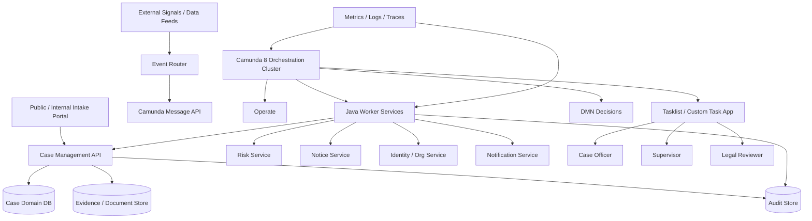

### 29.3 Core Domains

| Domain | Owns | Does Not Own |
|---|---|---|
| Camunda | lifecycle execution, wait states, timers, orchestration visibility | authoritative case database |
| Case Management API | case entity, status, assignments, domain invariants | BPMN token execution |
| Evidence Store | document metadata, storage, retention, access | process routing |
| Risk Service | risk model and scoring | workflow path ownership |
| DMN | transparent decision rules | side effects |
| Worker Services | integration adapters | long-running state |
| Task App | human interaction | domain authorization bypass |
| Audit Store | immutable business audit | live workflow state |

### 29.4 Main Lifecycle Episodes

Instead of one giant process, use bounded episodes.

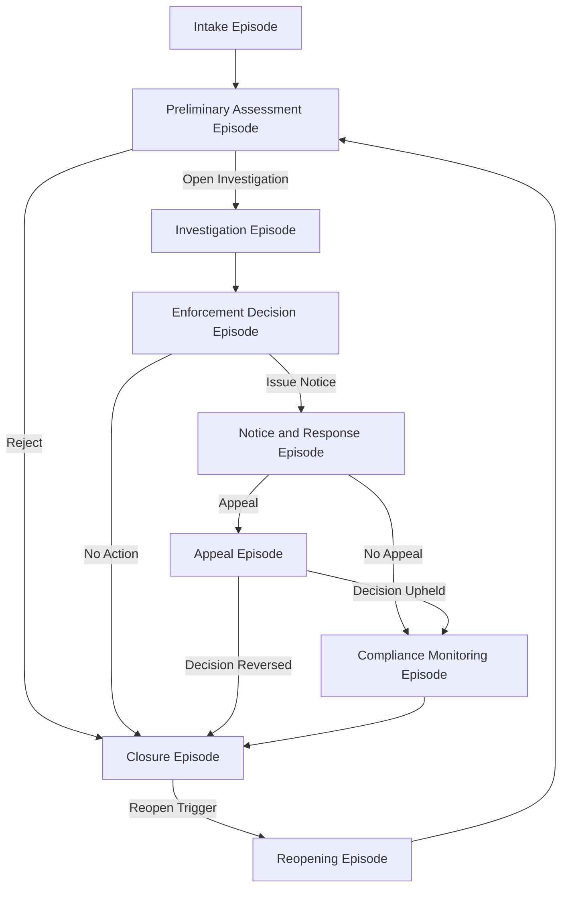

### 29.5 Episode 1: Intake Process

Responsibilities:

- create case record;
- capture complainant/source;
- validate minimum information;
- deduplicate possible existing cases;
- request missing evidence;
- route to assessment.

BPMN sketch:

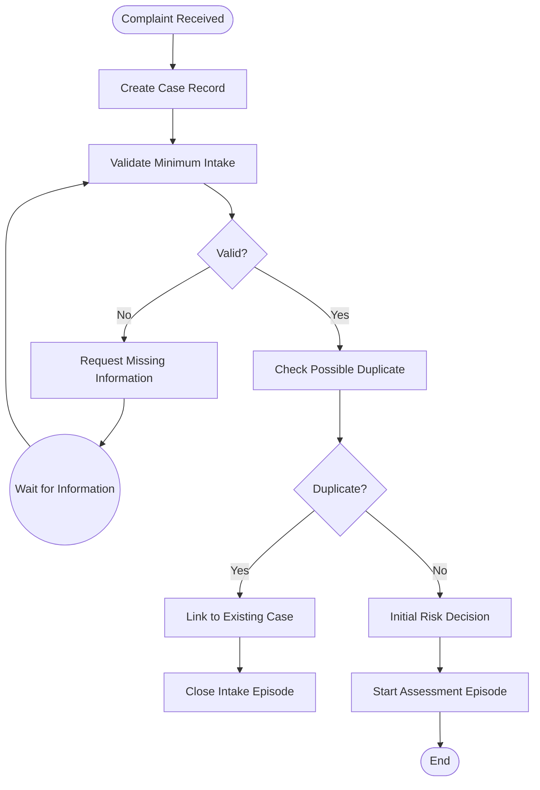

Important design points:

- `Create Case Record` must be idempotent.
- `Wait for Information` should use message correlation with stable intake id.
- Duplicate detection result should be explainable.
- Intake should not perform full investigation.

### 29.6 Episode 2: Preliminary Assessment

Responsibilities:

- classify case type;
- evaluate jurisdiction;
- run initial risk DMN;
- assign officer/team;
- make triage decision.

Decision output:

```json
{
  "jurisdiction": "IN_SCOPE",
  "priority": "HIGH",
  "recommendedPath": "OPEN_INVESTIGATION",
  "reasonCodes": ["PUBLIC_HARM", "REPEAT_ENTITY"]
}
```

BPMN sketch:

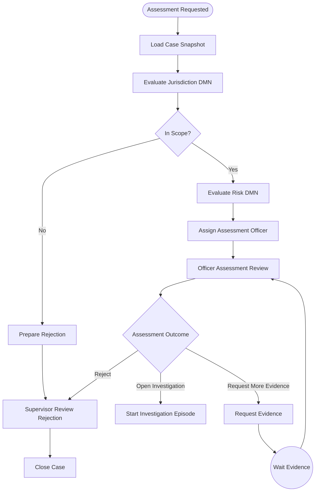

### 29.7 Episode 3: Investigation

Responsibilities:

- plan investigation;
- collect evidence;
- request external data;
- schedule interviews/hearings;
- evaluate findings;
- produce recommendation.

Key pattern: investigation is a long-running human-and-system process. Use user tasks for decisions, workers for integrations, and messages for external evidence arrival.

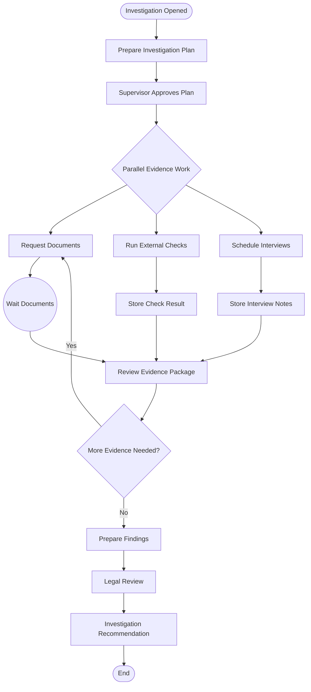

### 29.8 Episode 4: Enforcement Decision

Responsibilities:

- evaluate findings;
- run decision policy;
- require maker-checker approval;
- issue enforcement recommendation;
- optionally escalate to panel.

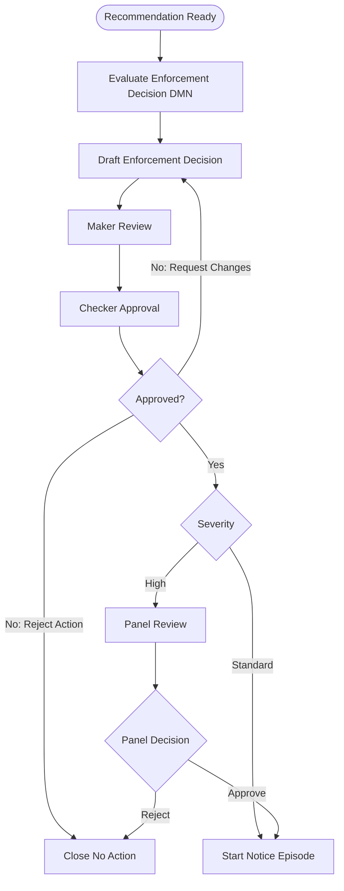

Important invariants:

- maker and checker cannot be same actor;
- decision rationale is required;
- decision snapshot is stored;
- high severity cases require panel review;
- all changes produce audit events.

### 29.9 Episode 5: Notice and Response

Responsibilities:

- generate notice;
- serve notice;
- wait for response/appeal period;
- process response;
- transition to appeal, monitoring, or closure.

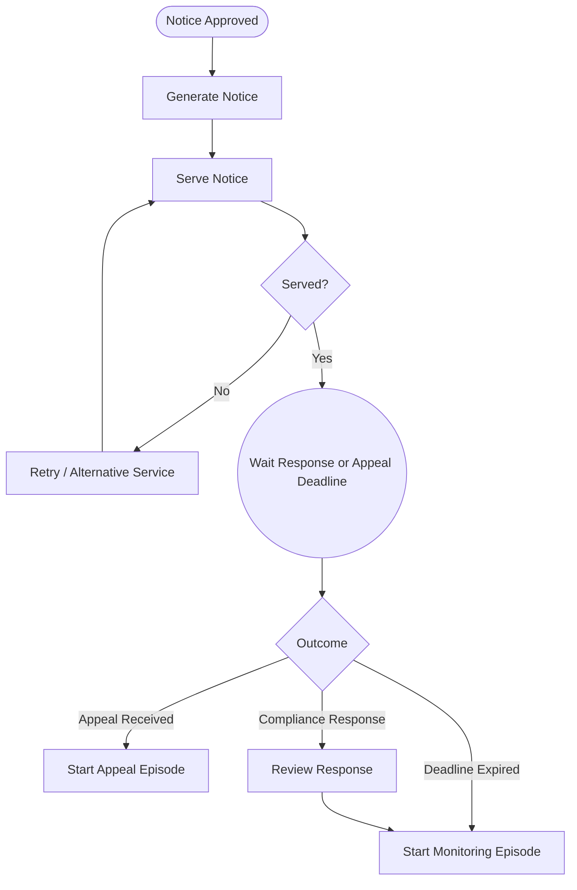

### 29.10 Episode 6: Appeal

Responsibilities:

- receive appeal;
- validate appeal eligibility;
- assign independent reviewer;
- schedule hearing if needed;
- issue appeal decision;
- update enforcement outcome.

Key constraints:

- independent reviewer must not be original decision maker;
- appeal deadline is statutory;
- appeal decision must reference original decision snapshot;
- appeal may suspend enforcement actions depending on policy.

### 29.11 Episode 7: Compliance Monitoring

Responsibilities:

- monitor obligations;
- track deadlines;
- receive compliance evidence;
- escalate breach;
- close when obligations are satisfied.

This is a good candidate for an SLA watchdog plus monitoring episode.

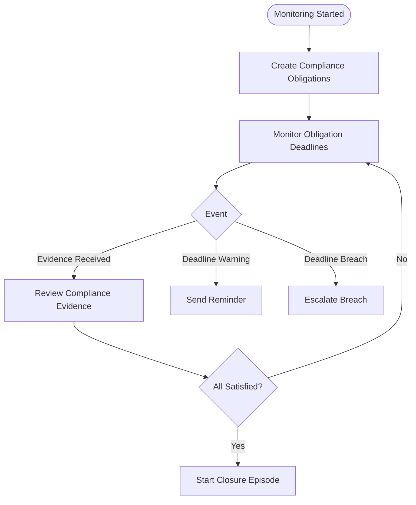

---

## 30. Capstone Worker Architecture

### 30.1 Worker Services

| Worker Service | Job Types | Notes |
|---|---|---|
| Case Worker | create-case, update-case-stage, assign-case | Must be idempotent |
| Evidence Worker | validate-evidence, create-evidence-package | Document references only |
| Risk Worker | calculate-risk, enrich-risk-context | DMN may consume output |
| Notice Worker | generate-notice, serve-notice | Strong idempotency required |
| Notification Worker | send-reminder, send-deadline-warning | Duplicate-safe |
| Audit Worker | record-decision, record-action | Append-only semantics |
| Migration Worker | sync-legacy-case, link-legacy-instance | Used during transition |

### 30.2 Job Type Naming

Recommended:

```text
enforcement.case.create.v1
enforcement.case.update-stage.v1
enforcement.evidence.validate.v1
enforcement.notice.generate.v1
enforcement.notice.serve.v1
enforcement.audit.record-decision.v1
```

Avoid:

```text
serviceTask1
handleCase
callApi
doStuff
caseWorker
```

### 30.3 Worker Input Contract Example

```json
{
  "caseId": "CASE-2026-001",
  "noticeType": "ENFORCEMENT_WARNING",
  "decisionSnapshotId": "DEC-778",
  "recipientEntityId": "ENT-123",
  "dueDate": "2026-07-28"
}
```

### 30.4 Worker Output Contract Example

```json
{
  "noticeId": "NOTICE-991",
  "noticeStatus": "GENERATED"
}
```

Not:

```json
{
  "case": { "... huge case object ...": true },
  "allEvidence": ["..."],
  "auditHistory": ["..."]
}
```

---

## 31. Capstone Failure Model

### 31.1 Failure Taxonomy

| Failure | Type | Handling |
|---|---|---|
| Risk service unavailable | technical transient | retry with backoff |
| Evidence document missing | business/process | request correction or BPMN error |
| Notice generation template missing | operational config | incident |
| Entity not in jurisdiction | business | modeled rejection path |
| Duplicate complaint | business/data | link to existing case |
| Downstream timeout after side effect | unknown outcome | reconciliation state |
| Unauthorized task completion | security | reject and audit |
| DMN expression error | model defect | incident + model fix |
| Worker bug | technical defect | incident + redeploy + retry |

### 31.2 Unknown Outcome Pattern

For irreversible or externally visible operations, timeout must not be interpreted as failure.

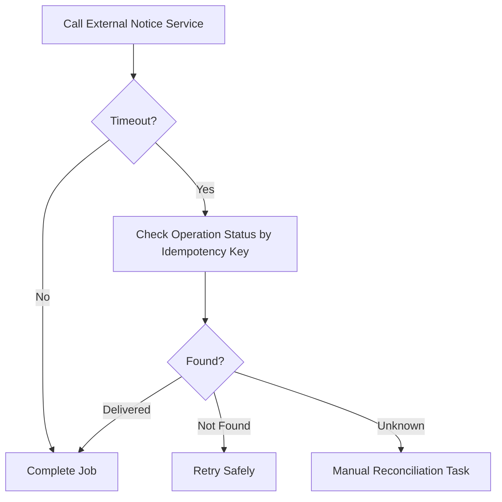

---

## 32. Capstone Testing Strategy

### 32.1 Test Pyramid

```mermaid
graph TD
    E2E[Small Number of End-to-End Scenario Tests]
    Process[Process Path and Contract Tests]
    Integration[Worker Integration Tests]
    Unit[Worker Unit Tests / DMN Unit Tests / FEEL Tests]

    E2E --> Process
    Process --> Integration
    Integration --> Unit
```

### 32.2 Required Test Cases

For intake:

- valid complaint creates case;
- invalid complaint requests correction;
- duplicate complaint links existing case;
- missing evidence waits for message;
- evidence message correlation works;
- message duplicate does not duplicate case update.

For assessment:

- out-of-jurisdiction closes through rejection review;
- high risk opens investigation;
- missing evidence loops correctly;
- supervisor rejects rejection and returns to review.

For investigation:

- evidence fan-out/fan-in completes;
- external service outage creates retry then success;
- legal review requests rework;
- cancellation terminates active tasks correctly.

For enforcement decision:

- maker-checker cannot be same actor;
- high severity requires panel;
- decision snapshot stored;
- rejected action closes no-action path.

For monitoring:

- deadline warning fires;
- breach escalation fires once;
- compliance evidence completes obligation;
- all obligations satisfied closes monitoring.

### 32.3 Non-Functional Tests

- worker duplicate execution;
- process version upgrade;
- incident resolution;
- batch retry;
- active instance migration;
- message storm;
- timer-heavy monitoring;
- authorization denial;
- evidence access control;
- audit export.

---

## 33. Capstone Observability Model

### 33.1 Process-Level Metrics

Track:

- active cases by stage;
- process instances started/completed/canceled;
- incident count by process/job type;
- average time per stage;
- SLA warning count;
- SLA breach count;
- appeal rate;
- reopening rate;
- manual correction rate.

### 33.2 Worker-Level Metrics

Track:

- job activation count;
- job completion count;
- job failure count;
- BPMN error count;
- latency by job type;
- downstream latency;
- retry count;
- duplicate operation detection;
- idempotency replay count;
- unknown outcome count.

### 33.3 Audit-Level Metrics

Track:

- human decisions by role;
- decision override count;
- maker-checker violations rejected;
- evidence package completeness;
- policy version distribution;
- manual migration actions;
- incident resolution time.

### 33.4 Trace Correlation

Every worker log should include:

```text
caseId
processInstanceKey
elementId
jobType
jobKey
operationKey
correlationId
causationId
```

Without these fields, production debugging becomes guesswork.

---

## 34. Capstone Runbook

### 34.1 Incident: Worker Fails Due to Downstream Outage

Steps:

1. Confirm incident/job type in Operate.
2. Check worker logs by job type and process instance key.
3. Confirm downstream service status.
4. If outage ongoing, do not mass retry.
5. Restore downstream.
6. Verify idempotency/reconciliation safety.
7. Batch retry affected instances.
8. Monitor recurrence.
9. Record incident postmortem if SLA breached.

### 34.2 Incident: Invalid Variable Causes Gateway Failure

Steps:

1. Identify variable and expression.
2. Confirm scope of affected instances.
3. Fix model if expression is defective.
4. For affected instances, update variable only if semantically correct.
5. Retry incident.
6. Add regression test.
7. Add CI validation if possible.

### 34.3 Incident: Message Not Correlated

Steps:

1. Confirm message was received by event router.
2. Check message name and correlation key.
3. Check TTL and publish time.
4. Check whether process instance was waiting.
5. Check duplicate/idempotency ledger.
6. If event is valid but early/late, apply business-specific remediation.
7. Add event contract test.

### 34.4 Incident: Human Task Completed Incorrectly

Steps:

1. Identify actor, task, output, timestamp.
2. Check authorization and assignment.
3. Check completion validation.
4. Determine whether process instance modification is required.
5. Record corrective audit event.
6. Fix form/task listener/domain validation if needed.

---

## 35. Final Mastery Rubric

Use this rubric to evaluate yourself honestly.

### 35.1 Level 1 — Can Run Demo

You can:

- draw simple BPMN;
- create service task;
- write job worker;
- start process instance;
- complete user task;
- inspect Operate.

This is useful but not production mastery.

### 35.2 Level 2 — Can Build Feature

You can:

- implement workers cleanly;
- model errors;
- publish messages;
- use timers;
- write tests;
- deploy Spring Boot worker;
- handle basic incidents.

You are productive on a team.

### 35.3 Level 3 — Can Own Process Application

You can:

- define process boundaries;
- manage variables and contracts;
- design idempotency;
- version BPMN/DMN/forms;
- operate incidents;
- review process changes;
- design human workflow;
- coordinate with domain services.

You can own a production process application.

### 35.4 Level 4 — Can Architect Platform

You can:

- design Camunda runtime topology;
- define golden paths;
- create shared worker libraries;
- set observability standards;
- design security and access control;
- create governance model;
- lead migration strategy;
- support many teams.

You can act as platform/architecture lead.

### 35.5 Level 5 — Can Handle Regulated Enterprise Complexity

You can:

- model long-running cases;
- design cross-entity impact;
- create audit-defensible workflows;
- reason about compensation and irreversible actions;
- design legal/regulatory decision checkpoints;
- manage process versioning under active instances;
- conduct post-incident architecture review;
- explain design trade-offs to engineers, compliance, operations, and business stakeholders.

This is the level this series aims for.

---

## 36. Practical Final Exercise

Build a small but serious version of the capstone.

### 36.1 Minimum Implementation

Implement these artifacts:

1. `intake.bpmn`
2. `assessment.bpmn`
3. `enforcement-priority.dmn`
4. `intake-review.form`
5. Java worker service with:
   - `enforcement.case.create.v1`
   - `enforcement.evidence.validate.v1`
   - `enforcement.audit.record-decision.v1`
6. message router simulation for `EvidenceReceived`
7. process tests for happy path, invalid evidence, duplicate event, and high-risk escalation
8. Operate incident runbook
9. architecture decision record

### 36.2 Stretch Implementation

Add:

- maker-checker enforcement decision;
- SLA watchdog process;
- appeal episode;
- idempotency operation log;
- task completion validation;
- process instance migration scenario;
- dashboard mock;
- security negative tests.

### 36.3 Success Criteria

You are done when:

- the BPMN model can be explained to a business owner;
- the worker contracts can be reviewed by an engineer;
- the failure paths can be executed in tests;
- the incident runbook can be followed by operations;
- the audit trail can explain why a decision happened;
- the system can tolerate duplicate worker execution;
- process variables are small and intentional;
- changing a DMN rule does not destroy historical explainability.

---

## 37. Final Engineering Heuristics

Use these when under pressure.

### Heuristic 1: Model the Lifecycle, Not the Code

If the BPMN looks like Java code translated into boxes, it is probably wrong.

### Heuristic 2: Keep Domain State Out of the Engine

Camunda should know enough to route work, not everything needed to rebuild the business database.

### Heuristic 3: Business Alternatives Belong in BPMN/DMN

If a business stakeholder cares about the path, it probably deserves to be visible.

### Heuristic 4: Retry Requires Idempotency

No exception.

### Heuristic 5: A Human Task Is a Decision Boundary

If the task output is free-form chaos, the process is not controlled.

### Heuristic 6: A Timer Is a Business Commitment

Do not sprinkle timers casually. Every timer should have owner, meaning, and operational effect.

### Heuristic 7: Every Message Needs a Contract

Message name, correlation key, message ID, TTL, schema, and failure handling.

### Heuristic 8: Migration Is Product Work

Migration changes user experience, operation, audit, data, integration, and support. Treat it as product + architecture, not script execution.

### Heuristic 9: Observability Is Part of the Model

If operators cannot tell why an instance is stuck, the design is incomplete.

### Heuristic 10: Governance Should Be Automated Where Possible

Manual standards decay. CI guardrails, templates, tests, and dashboards scale better.

---

## 38. Closing Summary

Camunda 8 Zeebe mastery is the ability to design **executable business lifecycles** in a distributed system.

The strongest mental model is this:

- BPMN controls lifecycle;
- DMN controls explicit decisions;
- Java workers integrate capabilities;
- domain services own business state;
- messages connect asynchronous reality;
- timers represent commitments;
- user tasks represent accountable human decisions;
- Operate and observability make runtime explainable;
- governance makes change safe;
- platform engineering makes correct usage scalable across teams.

If you internalize that, you are no longer just “using Camunda”.

You are designing an orchestration platform that can survive production, audits, organizational growth, migration, and real-world failure.

---

## 39. References

- Camunda 8 Best Practices Overview: https://docs.camunda.io/docs/components/best-practices/best-practices-overview/
- Writing Good Workers: https://docs.camunda.io/docs/components/best-practices/development/writing-good-workers/
- Service Integration Patterns with BPMN: https://docs.camunda.io/docs/components/best-practices/development/service-integration-patterns/
- Handling Data in Processes: https://docs.camunda.io/docs/components/best-practices/development/handling-data-in-processes/
- Dealing with Problems and Exceptions: https://docs.camunda.io/docs/components/best-practices/development/dealing-with-problems-and-exceptions/
- Job Workers: https://docs.camunda.io/docs/components/concepts/job-workers/
- Messages: https://docs.camunda.io/docs/components/concepts/messages/
- Incidents: https://docs.camunda.io/docs/components/concepts/incidents/
- Operate Introduction: https://docs.camunda.io/docs/components/operate/operate-introduction/
- Process Instance Migration: https://docs.camunda.io/docs/components/concepts/process-instance-migration/
