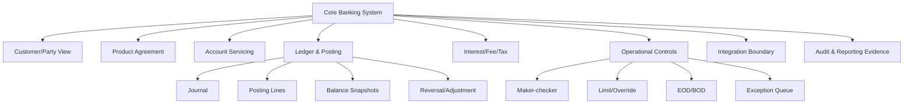
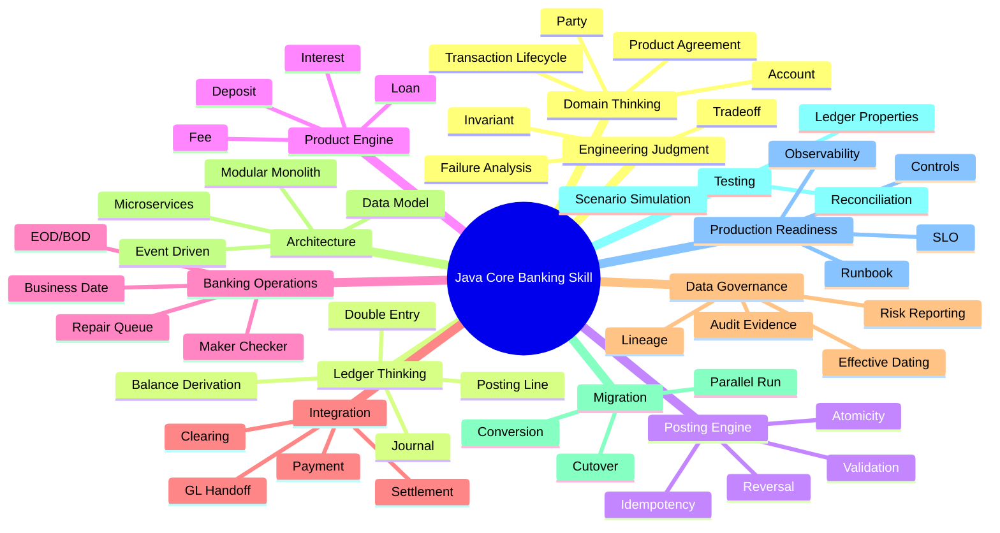
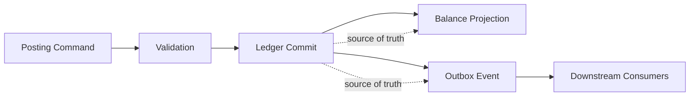
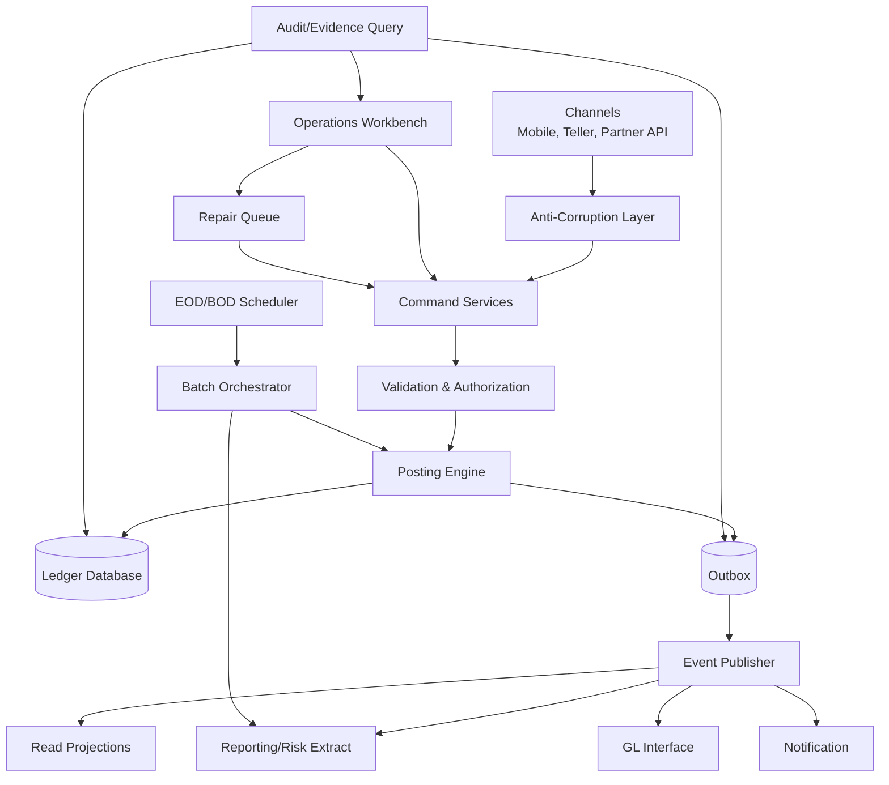
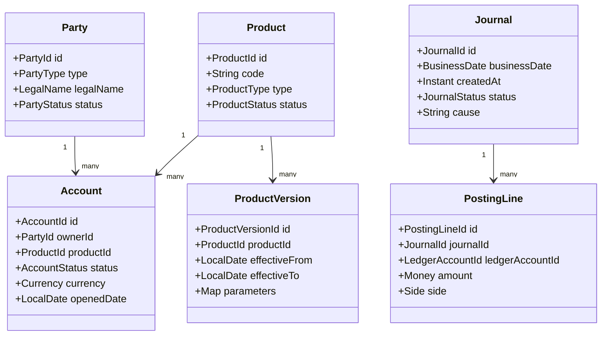

# Part 001 — Kaufman Skill Map and Domain Boundary

Core banking bukan sekadar aplikasi Java yang menyimpan `Account` dan `Transaction`.
Core banking adalah **system of record untuk nilai finansial, kontrak produk, hak nasabah, kewajiban bank, kontrol operasional, dan bukti audit**.

Tujuan part ini adalah membangun peta belajar yang presisi: apa yang harus dikuasai, apa yang tidak perlu diulang dari seri sebelumnya, bagaimana melatihnya, dan bagaimana menilai apakah pemahaman kita sudah layak untuk engineering level yang tinggi.

Kita memakai pendekatan dari *The First 20 Hours*: pecah skill besar menjadi sub-skill kecil, pelajari secukupnya untuk bisa mengoreksi diri, hilangkan hambatan praktik, lalu lakukan latihan terarah pada sub-skill paling bernilai.

> Outcome utama Part 001: kamu punya **learning operating system** untuk seri core banking ini.

---

## 1. Apa yang Sebenarnya Dipelajari?

Pertanyaan yang buruk:

> “Bagaimana membuat aplikasi core banking dengan Java?”

Pertanyaan yang lebih tepat:

> “Bagaimana mendesain sistem yang menjaga kebenaran saldo, transaksi, produk, audit trail, dan operasi bank ketika terjadi retry, reversal, backdated transaction, EOD failure, integrasi settlement, perubahan produk, migrasi data, dan tekanan compliance?”

Core banking punya karakteristik berbeda dari aplikasi bisnis biasa:

| Karakteristik | Implikasi Engineering |
|---|---|
| Uang adalah state yang harus bisa dipertanggungjawabkan | Setiap perubahan harus memiliki sebab, bukti, dan accounting impact |
| Balance bukan sekadar field numerik | Balance adalah hasil dari ledger, posting, hold, value date, dan settlement state |
| Banyak proses bersifat korektif, bukan mutatif | Salah transaksi tidak boleh “di-edit diam-diam”; harus reversal/adjustment |
| Operasi bank punya business date | “Hari bisnis” bisa berbeda dari jam sistem |
| Produk finansial berubah dari waktu ke waktu | Parameter harus versioned dan effective-dated |
| Banyak integrasi tidak sinkron | Payment, clearing, settlement, fraud, AML, GL, report, dan data warehouse punya lifecycle sendiri |
| Audit dan evidence sama pentingnya dengan fitur | Sistem harus dapat menjelaskan keputusan, bukan hanya menghasilkan output |

Dalam seri ini, kita tidak mengejar “template project”. Kita mengejar **keluwesan berpikir** untuk merancang core banking yang benar secara domain, operasional, dan teknis.

---

## 2. Definisi Kerja: Core Banking System

Dalam konteks seri ini:

> Core banking system adalah sistem utama bank yang mencatat dan mengelola hubungan finansial antara bank dan nasabah melalui account, product agreement, ledger posting, balance, transaction lifecycle, operational controls, dan regulatory evidence.

Definisi ini sengaja lebih luas dari “sistem rekening”. Core banking mencakup beberapa lapisan:



Mental model awal:

1. **Customer/Party** menjawab “siapa pihak yang berhubungan dengan bank?”
2. **Product Agreement** menjawab “kontrak finansial apa yang berlaku?”
3. **Account** menjawab “wadah pencatatan hak/kewajiban finansial mana yang aktif?”
4. **Ledger** menjawab “perubahan nilai apa yang sah dan seimbang?”
5. **Posting Engine** menjawab “bagaimana intent bisnis berubah menjadi accounting entries?”
6. **Operations** menjawab “bagaimana exception dikendalikan, disetujui, dan dibuktikan?”
7. **Reporting/Evidence** menjawab “bagaimana angka ini bisa dijelaskan kepada audit, risk, regulator, dan internal control?”

---

## 3. Apa yang Bukan Core Banking?

Banyak sistem terlihat seperti core banking karena berhubungan dengan uang, tetapi tidak semuanya core.

| Sistem | Bukan Core Karena | Tetap Berinteraksi Dengan Core Melalui |
|---|---|---|
| Mobile banking | Channel untuk instruksi nasabah | Command API, inquiry API, notification event |
| Internet banking | Channel dan UX | Transfer request, balance inquiry, statement inquiry |
| Payment gateway | Routing dan konektivitas payment | Payment instruction, status callback, settlement file |
| Card management | Card lifecycle dan authorization network | Hold, debit posting, settlement posting, reversal |
| Loan origination | Akuisisi dan underwriting | Loan booking, disbursement instruction |
| CRM | Relationship dan marketing | Customer reference, consent, segmentation |
| AML/fraud system | Detection dan investigation | Screening result, hold/release, case reference |
| Data warehouse | Analytical/read/reporting platform | Extract, stream, lineage, reconciliation |
| General ledger | Enterprise accounting book | GL handoff dari subledger core banking |

Prinsip boundary:

> Core banking harus menjadi sumber kebenaran untuk account, ledger, posting, dan product agreement yang sudah booked. Tetapi core banking tidak harus menjadi tempat semua keputusan channel, fraud, campaign, atau analytics hidup.

Boundary yang buruk menyebabkan dua masalah ekstrem:

1. **Core terlalu gemuk** — semua logic channel, campaign, fraud, dan reporting masuk ke core; perubahan menjadi lambat dan berisiko.
2. **Core terlalu tipis** — ledger truth tercecer ke banyak microservice; reconciliation menjadi mimpi buruk.

Boundary yang baik membuat core banking menjadi **domain kernel**: kecil dibanding seluruh platform bank, tetapi sangat kuat pada kebenaran finansial.

---

## 4. Skill Decomposition ala Kaufman

Skill besar “Java Core Banking System” kita pecah menjadi 12 sub-skill.



Setiap sub-skill akan dilatih dengan pertanyaan yang bisa membongkar pemahaman:

| Sub-skill | Pertanyaan Penguji |
|---|---|
| Domain thinking | Apakah kamu bisa menjelaskan perbedaan account, customer, product, agreement, dan ledger? |
| Ledger thinking | Apakah semua posting selalu balance? Di mana invariant itu ditegakkan? |
| Posting engine | Apa yang terjadi jika request yang sama dikirim 3 kali karena timeout? |
| Product engine | Bagaimana bunga berubah jika rate table berubah efektif besok? |
| Operations | Apakah EOD bisa restart setelah gagal di tengah jalan? |
| Integration | Apa bedanya accepted, posted, cleared, settled, dan reconciled? |
| Data governance | Dari mana angka laporan berasal dan bisa ditelusuri ke transaksi mana? |
| Architecture | Bounded context mana yang boleh sinkron dan mana yang harus asinkron? |
| Migration | Bagaimana membuktikan opening balance hasil migrasi benar? |
| Testing | Apakah test menyerang invariant, bukan hanya happy path? |
| Production readiness | Apa evidence bahwa sistem aman untuk go-live? |
| Judgment | Kapan konsistensi lebih penting daripada throughput? |

---

## 5. Target Performa Setelah 20 Jam Pertama

Kaufman tidak mengatakan 20 jam membuat kita menjadi ahli dunia. Targetnya adalah melewati fase “tidak mengerti apa yang tidak dimengerti” menuju cukup kompeten untuk berlatih dengan feedback.

Untuk seri ini, target 20 jam pertama adalah:

> Mampu mendesain mini core banking ledger/posting model yang balance, idempotent, auditable, dan bisa menangani reversal serta EOD sederhana.

Bukan target 20 jam pertama:

- membangun full CBS produksi;
- membuat semua produk deposito dan loan lengkap;
- compliance seluruh negara;
- payment rails penuh;
- HA/DR enterprise-grade;
- integrasi regulator aktual.

Target konkret:

| Jam | Fokus | Output |
|---:|---|---|
| 1–2 | Domain map | Glossary dan bounded context awal |
| 3–4 | Ledger model | Journal, posting batch, posting line, account balance |
| 5–6 | Posting command | Internal transfer dengan debit/credit balanced |
| 7–8 | Idempotency | Duplicate request tidak double-posting |
| 9–10 | Reversal | Reversal membuat posting baru, bukan edit posting lama |
| 11–12 | Balance projection | Ledger balance dan available balance bisa dijelaskan |
| 13–14 | Product parameter | Simple savings product dengan fee/interest parameter |
| 15–16 | EOD mini-run | Accrual/fee batch restartable |
| 17–18 | Reconciliation | Internal report cocok dengan ledger snapshot |
| 19–20 | Design review | ADR, invariant list, test suite, runbook mini |

---

## 6. Learning Backlog Seri

Agar belajar efisien, setiap part harus menghasilkan artifact, bukan hanya pemahaman pasif.

| Artifact | Tujuan |
|---|---|
| Domain glossary | Mengurangi ambiguity bahasa bisnis |
| State machine | Memastikan lifecycle eksplisit |
| Ledger schema | Memaksa kebenaran accounting direpresentasikan |
| Posting pipeline | Memisahkan validation, authorization, posting, event publication |
| Invariant catalog | Menentukan hal yang tidak boleh dilanggar |
| Failure matrix | Melihat retry, timeout, partial failure, dan duplicate |
| Test scenario pack | Melatih correctness lewat skenario domain |
| ADR | Melatih trade-off architecture |
| Runbook | Menghubungkan design dengan operasi |
| Evidence pack | Menghubungkan sistem dengan audit/regulatory defensibility |

---

## 7. Core Banking Vocabulary Awal

Vocabulary yang salah menyebabkan design yang salah. Ini glossary awal yang akan diperluas sepanjang seri.

| Istilah | Definisi Kerja |
|---|---|
| Party | Pihak legal/persona yang berhubungan dengan bank: individu, organisasi, merchant, bank lain |
| Customer | Party yang memiliki relasi layanan dengan bank |
| Account | Wadah pencatatan posisi finansial untuk produk tertentu |
| Product | Template layanan finansial yang ditawarkan bank |
| Agreement | Kontrak product yang berlaku untuk customer/account tertentu |
| Ledger | Catatan authoritative atas perubahan nilai finansial |
| Journal | Grup accounting entries untuk satu kejadian bisnis |
| Posting line | Debit/credit line yang memengaruhi ledger account |
| Transaction command | Instruksi/intensi melakukan aksi bisnis |
| Accounting event | Kejadian bisnis yang memiliki dampak akuntansi |
| Balance | Posisi finansial yang diturunkan dari ledger dan aturan availability |
| Hold/block | Pembatasan penggunaan dana tanpa selalu mengubah ledger balance |
| Value date | Tanggal efektif nilai finansial dihitung |
| Posting date | Tanggal transaksi dibukukan ke ledger |
| Business date | Tanggal operasional bank yang sedang aktif |
| Reversal | Posting korektif yang membalik dampak transaksi sebelumnya |
| Adjustment | Posting korektif tambahan untuk memperbaiki posisi |
| Settlement | Penyelesaian kewajiban antar pihak/antar bank |
| Reconciliation | Pembandingan dua sumber catatan untuk menemukan perbedaan |
| Suspense account | Account sementara untuk item yang belum bisa diklasifikasikan final |
| EOD | End-of-day processing untuk menutup business date |
| BOD | Beginning-of-day processing untuk membuka business date berikutnya |

---

## 8. Skill Boundary: Tidak Mengulang Seri Sebelumnya

Seri ini menganggap kamu sudah memahami:

- Java 8–25 modern language features;
- DSA;
- Java design patterns;
- concurrency correctness;
- SQL/JDBC, transaction management, connection pooling;
- persistence dan MyBatis;
- REST/JAX-RS/Jersey;
- messaging/event streaming;
- security, cryptography, platform hardening;
- error handling, reliability, observability.

Karena itu, topik-topik tersebut hanya muncul saat ada nilai domain core banking.

Contoh:

| Topik Lama | Tidak Diulang | Dipakai Ulang Dalam Seri Ini Untuk |
|---|---|---|
| Locking/concurrency | Detail `synchronized`, `Lock`, executor | Account-level serialization, hot account, posting contention |
| SQL transaction | Dasar ACID | Atomic ledger commit dan idempotency barrier |
| Security | Hashing, TLS, JWT umum | PII boundary, audit integrity, PCI-aware integration |
| Observability | Log/metric/trace umum | Business telemetry: posting lag, EOD stage, recon break |
| Messaging | Kafka basics | Outbox event setelah commit ledger |
| Error handling | Exception taxonomy umum | Repair queue, rejection reason, business failure classification |

---

## 9. Core Banking Design Heuristics

Heuristic bukan hukum mutlak, tetapi membantu mengambil keputusan cepat.

### 9.1 Ledger Truth First

Jika ada konflik antara cache, projection, notification event, atau downstream report dengan ledger, ledger menang.



Projection boleh rusak dan direbuild. Ledger tidak boleh sembarangan dimutasi.

### 9.2 Correction Over Mutation

Dalam sistem auditable, memperbaiki tidak sama dengan menghapus jejak.

Buruk:

```sql
UPDATE transaction SET amount = 90000 WHERE id = 'TX-123';
```

Lebih baik:

```txt
Original Posting: TX-123 debit 100000 / credit 100000
Correction:       TX-124 reversal of TX-123
New Posting:      TX-125 debit 90000 / credit 90000
```

Koreksi menciptakan event baru yang menjelaskan perubahan.

### 9.3 Business Date Is a Domain Concept

`LocalDate.now()` bukan business date bank.

Bank bisa berada dalam kondisi:

- system date: 2026-06-28;
- active business date: 2026-06-27;
- branch cut-off sudah lewat;
- EOD sebagian gagal;
- back office masih melakukan repair untuk business date sebelumnya.

Maka business date harus dimodelkan eksplisit.

### 9.4 Idempotency Is a Financial Safety Control

Idempotency bukan sekadar teknik API. Dalam core banking, idempotency adalah kontrol agar retry tidak menciptakan uang palsu atau debit ganda.

Contoh buruk:

```java
@PostMapping("/transfer")
public TransferResponse transfer(@RequestBody TransferRequest request) {
    postingService.post(request);
    return ok();
}
```

Masalah: jika client timeout setelah posting sukses, retry bisa posting ulang.

Lebih benar:

```java
@PostMapping("/transfer")
public TransferResponse transfer(
        @RequestHeader("Idempotency-Key") String idempotencyKey,
        @RequestBody TransferRequest request
) {
    return transferCommandService.handle(idempotencyKey, request);
}
```

Tetapi idempotency key saja tidak cukup. Sistem harus tahu:

- siapa caller-nya;
- command fingerprint-nya;
- status command sebelumnya;
- apakah hasil sebelumnya bisa dikembalikan;
- apakah retry membawa payload berbeda untuk key yang sama.

### 9.5 Every Number Needs a Lineage

Saldo, bunga, fee, tax, overdue, dan laporan regulator harus bisa dijelaskan.

Pertanyaan lineage:

- angka berasal dari tabel/event mana?
- parameter produk versi berapa yang dipakai?
- business date mana?
- batch run mana?
- posting mana yang membentuk angka tersebut?
- siapa menyetujui override?
- apakah ada reversal/adjustment?

---

## 10. Minimal Reference Architecture untuk Belajar

Kita akan memakai reference architecture mental seperti ini:



Komponen ini bukan rekomendasi final untuk semua bank. Ini model belajar yang cukup kaya untuk membahas trade-off.

---

## 11. Practice Project: Mini Core Banking Kernel

Selama seri ini, kita bisa membangun mini-kernel sebagai latihan konseptual. Scope-nya kecil tapi invariant-nya serius.

### 11.1 Bounded Scope

Fitur:

- create customer;
- open savings account;
- internal transfer;
- cash deposit;
- cash withdrawal;
- hold/release funds;
- reverse transaction;
- daily interest accrual sederhana;
- monthly fee sederhana;
- EOD run sederhana;
- balance inquiry;
- account statement;
- internal reconciliation report.

Tidak termasuk pada fase awal:

- loan lengkap;
- multi-currency kompleks;
- card network penuh;
- ISO 20022 message implementation penuh;
- AML/fraud engine;
- regulatory filing aktual;
- distributed multi-region active-active.

### 11.2 Core Entities



---

## 12. Invariant Catalog Awal

Invariant adalah aturan yang harus selalu benar. Banyak bug core banking terjadi karena invariant tidak ditulis eksplisit.

| Invariant | Makna | Contoh Test |
|---|---|---|
| Journal must balance | Total debit = total credit untuk currency yang sama | Random transfer selalu menghasilkan balanced journal |
| Posting is immutable | Posting line tidak di-update setelah committed | Attempt update harus ditolak |
| Reversal references original | Reversal harus menunjuk transaksi asal | Reversal tanpa original reference ditolak |
| No double posting for same command | Retry command tidak membuat journal baru | Kirim command sama 3x, journal tetap 1 |
| Account status gates transaction | Closed/frozen account tidak boleh menerima transaksi tertentu | Withdrawal dari closed account ditolak |
| Business date explicit | Posting tidak boleh memakai system date secara implisit | Test active business date berbeda dari today |
| Product parameter versioned | Calculation harus pakai versi yang effective pada tanggal relevan | Rate change tidak mengubah accrual masa lalu |
| Every manual override has reason | Override harus punya actor, authority, reason | Override tanpa reason ditolak |
| Balance projection rebuildable | Balance snapshot bisa dihitung ulang dari ledger | Rebuild menghasilkan saldo sama |
| Audit trail queryable | Setiap perubahan penting bisa dilacak | Siapa/apa/kapan/kenapa tersedia |

---

## 13. Anti-Goal: Core Banking yang Terlihat Modern tapi Salah

Tidak semua architecture modern cocok untuk core banking.

### 13.1 Anti-pattern: Balance as Mutable Field Only

```java
account.setBalance(account.getBalance().subtract(amount));
accountRepository.save(account);
```

Ini mungkin cukup untuk demo. Tetapi untuk core banking, pendekatan ini gagal menjawab:

- dari transaksi mana saldo terbentuk?
- apakah debit/credit balance?
- bagaimana reversal dilakukan?
- bagaimana audit membuktikan perubahan?
- bagaimana rebuild jika saldo corrupt?

Balance sebaiknya diperlakukan sebagai **projection** dari ledger, bukan satu-satunya kebenaran.

### 13.2 Anti-pattern: Microservice Per Entity

Contoh buruk:

```txt
Customer Service
Account Service
Balance Service
Transaction Service
Posting Service
Fee Service
Audit Service
```

Jika boundary hanya berdasarkan noun/entity, transaction consistency bisa pecah. Boundary harus berdasarkan **business capability dan invariant ownership**, bukan nama tabel.

### 13.3 Anti-pattern: Event = Truth Tanpa Accounting Discipline

Event sourcing tidak otomatis membuat sistem benar. Jika event tidak membawa accounting semantics, lineage, idempotency, dan balancing rule, maka event hanya log teknis.

Event yang lemah:

```json
{
  "eventType": "MoneyTransferred",
  "from": "A",
  "to": "B",
  "amount": 100000
}
```

Event yang lebih kuat harus bisa dikaitkan ke journal/posting:

```json
{
  "eventType": "JournalPosted",
  "journalId": "JRN-20260628-00001",
  "businessDate": "2026-06-28",
  "sourceCommandId": "CMD-abc",
  "postingLines": [
    { "ledgerAccountId": "CUSTOMER-A", "side": "DEBIT", "amount": "100000.00", "currency": "IDR" },
    { "ledgerAccountId": "CUSTOMER-B", "side": "CREDIT", "amount": "100000.00", "currency": "IDR" }
  ]
}
```

---

## 14. Engineering Rubric: Level Pemahaman

Gunakan rubric ini untuk menilai diri selama seri.

| Level | Ciri |
|---|---|
| 1 — Surface | Bisa membuat CRUD account dan transaction |
| 2 — Mechanic | Paham debit/credit, posting, balance, dan reversal |
| 3 — Correctness | Bisa menjaga invariant saat retry, duplicate, failure, dan concurrency |
| 4 — Operational | Bisa mendesain EOD, repair, reconciliation, audit evidence |
| 5 — Architectural | Bisa memilih boundary, data model, integration pattern, dan migration strategy |
| 6 — Institutional | Bisa menjelaskan sistem kepada risk, audit, regulator, product, ops, dan engineering |

Target seri ini adalah membawa kamu minimal ke level 5, dan memberi fondasi menuju level 6.

---

## 15. Diagnostic Questions

Sebelum lanjut, coba jawab secara tertulis:

1. Apa perbedaan `transaction`, `journal`, dan `posting line`?
2. Mengapa balance tidak boleh hanya dianggap field di tabel `account`?
3. Apa perbedaan `posting date`, `value date`, dan `business date`?
4. Bagaimana sistem harus merespons duplicate transfer request?
5. Mengapa reversal lebih baik daripada update/delete transaksi lama?
6. Apa tanda boundary core banking terlalu besar?
7. Apa tanda boundary core banking terlalu kecil?
8. Mengapa EOD harus restartable?
9. Bagaimana membuktikan angka laporan berasal dari ledger?
10. Kapan event-driven architecture berbahaya untuk core banking?

Jawabanmu tidak harus sempurna sekarang. Tetapi pertanyaan ini akan menjadi “kompas” selama seri.

---

## 16. Exercise: Tulis One-Page Core Banking Charter

Buat dokumen satu halaman:

```md
# Mini Core Banking Kernel Charter

## Mission
Sistem ini menjaga ...

## Source of Truth
Ledger adalah ...

## Core Invariants
1. ...
2. ...
3. ...

## Out of Scope
1. ...
2. ...
3. ...

## Failure Philosophy
Jika terjadi retry/timeout/partial failure, sistem harus ...

## Audit Philosophy
Setiap perubahan penting harus bisa menjawab ...
```

Tujuannya bukan dokumentasi formal. Tujuannya memaksa kamu menulis batas dan invariant sebelum menulis kode.

---

## 17. Sumber Acuan Awal

Sumber-sumber berikut dipakai sebagai orientasi standar dan domain boundary, bukan sebagai satu-satunya definisi sistem core banking:

- Josh Kaufman / *The First 20 Hours* learning method: deconstruct skill, learn enough to self-correct, remove practice barriers, practice deliberately.
- ISO 20022: universal financial industry message scheme dan message definition catalogue.
- PCI DSS: baseline technical and operational requirements to protect payment account data.
- BCBS 239: principles for effective risk data aggregation and risk reporting.
- FFIEC Architecture, Infrastructure, and Operations booklet: technology architecture, infrastructure, and operations expectations for financial institutions.
- BIAN: industry architecture reference for banking capabilities.
- OpenTelemetry: observability framework for traces, metrics, logs, and baggage.

---

## 18. Ringkasan Part 001

Part ini menetapkan bahwa core banking adalah domain dengan invariant keras:

- uang harus balanced;
- posting harus auditable;
- retry tidak boleh double-post;
- koreksi harus meninggalkan jejak;
- business date harus eksplisit;
- product parameter harus versioned;
- setiap angka penting harus punya lineage;
- boundary core harus menjaga ledger truth tanpa menjadi dumping ground semua logic bank.

Skill yang akan kita bangun bukan hanya “membuat sistem”, tetapi **menalar sistem**: menemukan invariant, failure mode, boundary, evidence, dan trade-off.

Di part berikutnya, kita akan memperdalam mental model core banking sebagai gabungan dari empat sistem: **ledger system, product system, risk/control system, dan operational evidence system**.
