# Part 002 — Core Banking as Ledger, Product, Risk, and Control System

Core banking sering disalahpahami sebagai “database rekening”. Itu terlalu sempit.

Core banking yang benar harus dilihat sebagai gabungan dari empat sistem:

1. **Ledger system** — menjaga kebenaran pencatatan nilai finansial.
2. **Product system** — menerapkan kontrak produk yang berlaku pada account.
3. **Risk/control system** — mencegah aksi yang tidak sah, tidak cukup dana, melampaui limit, atau tidak sesuai kebijakan.
4. **Operational evidence system** — memberi bukti lengkap untuk audit, rekonsiliasi, customer dispute, regulator, dan investigasi internal.

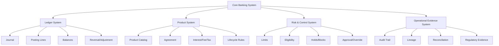

Part ini membangun mental model itu secara struktural.

---

## 1. Mengapa Core Banking Harus Dilihat sebagai Empat Sistem?

Misalnya ada instruksi:

> Nasabah A transfer IDR 1.000.000 ke Nasabah B.

Aplikasi biasa mungkin melihat ini sebagai:

```txt
A.balance -= 1_000_000
B.balance += 1_000_000
```

Core banking melihat lebih banyak:

| Perspektif | Pertanyaan |
|---|---|
| Ledger | Debit/credit apa yang terjadi? Apakah journal balance? |
| Product | Apakah jenis account mengizinkan transfer? Ada fee? Ada limit? |
| Risk/control | Apakah dana available? Account frozen? Perlu approval? Ada fraud/AML hold? |
| Evidence | Siapa melakukan? Dari channel mana? Kapan? Idempotency key apa? Jika dispute, bukti apa? |

Jika satu perspektif hilang, sistem menjadi rapuh.

Contoh:

- Ledger benar tapi evidence lemah → sulit audit dan dispute.
- Product flexible tapi control lemah → produk bisa dikonfigurasi salah dan menghasilkan kerugian.
- Control ketat tapi ledger tidak immutable → fraud internal sulit dideteksi.
- Event-driven cepat tapi posting tidak atomic → balance bisa divergen.

---

## 2. Ledger System: Sumber Kebenaran Nilai Finansial

Ledger system bertanggung jawab untuk mencatat perubahan nilai secara akuntabel.

Dalam core banking, ledger bukan sekadar tabel transaksi. Ledger harus menjawab:

- kejadian bisnis apa yang terjadi?
- account mana yang terdampak?
- nilai debit/credit apa yang diposting?
- currency apa?
- business date apa?
- apakah posting balance?
- apakah posting final, pending, reversed, atau adjusted?
- dari command atau batch mana posting berasal?
- siapa/apa yang mengotorisasi?

### 2.1 Ledger Data Model Minimal

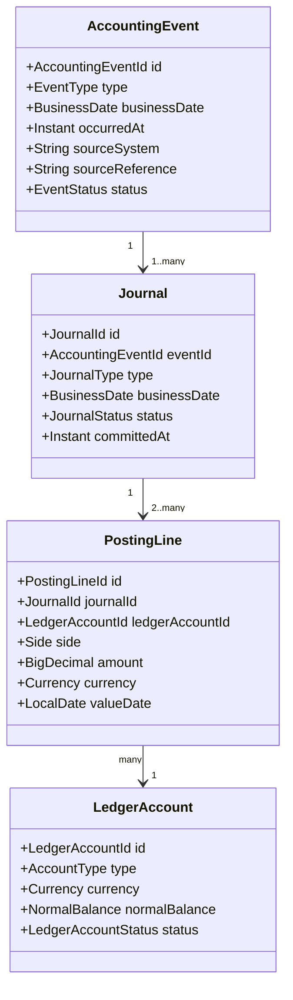

### 2.2 Journal Harus Balance

Invariant utama:

> Untuk setiap journal committed, total debit harus sama dengan total credit per currency dan per accounting book yang relevan.

Contoh internal transfer antar account nasabah:

| Line | Ledger Account | Side | Amount | Currency |
|---:|---|---|---:|---|
| 1 | Customer A Deposit Liability | Debit | 1.000.000 | IDR |
| 2 | Customer B Deposit Liability | Credit | 1.000.000 | IDR |

Kenapa deposit liability?

Dari perspektif bank, dana nasabah adalah kewajiban bank. Saat A mengirim uang keluar, kewajiban bank kepada A berkurang. Saat B menerima uang, kewajiban bank kepada B bertambah.

### 2.3 Balance Adalah Derivative State

Balance bisa disimpan untuk performa, tetapi secara konseptual harus bisa dijelaskan dari ledger.

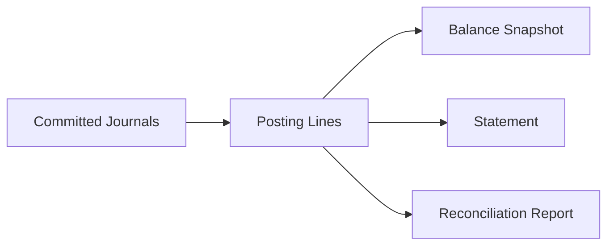

Implikasinya:

- balance snapshot boleh di-rebuild;
- statement harus bisa merujuk posting;
- reconciliation harus punya sumber posting yang jelas;
- dispute harus bisa menunjuk transaction lineage.

### 2.4 Ledger System Tidak Boleh Tahu Semua Hal

Ledger tidak harus tahu UI, campaign, UX wording, atau detail device. Tetapi ledger harus menyimpan reference yang cukup untuk audit.

Minimal metadata:

```java
public record PostingMetadata(
        String sourceSystem,
        String sourceChannel,
        String sourceReference,
        String commandId,
        String idempotencyKey,
        String actorId,
        String approvalId,
        String reasonCode
) {}
```

Perhatikan: metadata bukan pengganti domain model. Metadata hanya membantu traceability.

---

## 3. Product System: Kontrak Finansial yang Terparameterisasi

Produk bank bukan hanya label seperti `SAVINGS` atau `LOAN`.

Produk adalah kumpulan aturan:

- siapa eligible;
- account lifecycle apa yang berlaku;
- transaksi apa yang diizinkan;
- limit apa yang berlaku;
- bunga/fee/tax bagaimana dihitung;
- kapan maturity;
- bagaimana penalti;
- apakah overdraft diizinkan;
- apakah statement cycle bulanan;
- apakah dormancy berlaku;
- bagaimana closure dilakukan.

### 3.1 Product vs Product Version vs Agreement

Tiga hal ini harus dipisahkan:

| Konsep | Makna |
|---|---|
| Product | Template produk, misalnya `TABUNGAN-REGULER` |
| Product Version | Parameter produk pada periode efektif tertentu |
| Agreement | Kontrak spesifik antara bank dan nasabah/account |

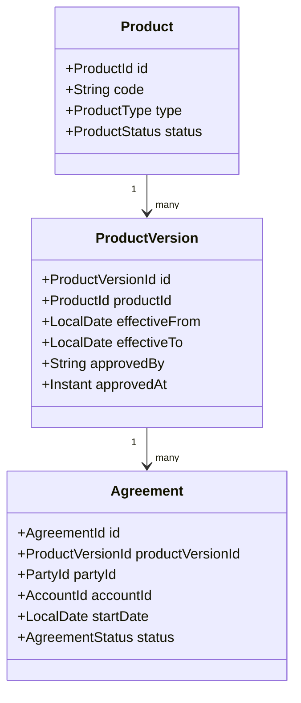

Mengapa perlu `ProductVersion`?

Karena aturan produk bisa berubah. Misalnya:

- mulai 2026-07-01 biaya admin berubah;
- rate tier berubah;
- minimum balance berubah;
- penalty term deposit berubah.

Jika sistem hanya menyimpan parameter terbaru, calculation masa lalu bisa berubah saat di-recompute. Itu berbahaya untuk audit dan customer dispute.

### 3.2 Parameter Bukan Sekadar Config Map

`Map<String, Object>` fleksibel, tetapi berbahaya jika dipakai sebagai model utama.

Buruk:

```java
Map<String, Object> parameters = product.getParameters();
BigDecimal rate = (BigDecimal) parameters.get("rate");
```

Masalah:

- tidak type-safe;
- sulit validasi;
- sulit versioning;
- sulit explainability;
- sulit impact analysis;
- rawan salah key;
- susah approval granular.

Lebih baik: gunakan typed parameter object per capability.

```java
public record SavingsInterestPolicy(
        DayCountConvention dayCountConvention,
        InterestCalculationMethod calculationMethod,
        List<RateTier> tiers,
        RoundingPolicy roundingPolicy,
        LocalDate effectiveFrom
) {}

public record MonthlyFeePolicy(
        Money feeAmount,
        MinimumBalanceRule waiverRule,
        LocalDate effectiveFrom
) {}
```

Product engine harus configurable, tetapi **bukan untyped chaos**.

---

## 4. Risk & Control System: Menentukan Apa yang Boleh Terjadi

Dalam core banking, tidak semua instruksi valid boleh langsung diposting.

Contoh transfer dapat ditolak atau ditahan karena:

- insufficient available balance;
- account frozen;
- account dormant;
- transaction amount melebihi limit;
- channel tidak diizinkan;
- business date closed;
- product tidak mengizinkan jenis transaksi;
- AML/fraud screening meminta hold;
- maker-checker belum approved;
- account membutuhkan signature rule;
- debit account dan credit account berbeda currency tanpa FX instruction.

### 4.1 Validation vs Authorization vs Control

Ketiganya berbeda.

| Layer | Pertanyaan | Contoh |
|---|---|---|
| Validation | Apakah command well-formed? | Amount positif, currency valid |
| Authorization | Apakah actor boleh meminta aksi? | Teller boleh debit account ini? |
| Control | Apakah aksi boleh terjadi menurut state dan policy bank? | Account frozen? Limit terlampaui? Perlu approval? |

Pipeline mental:

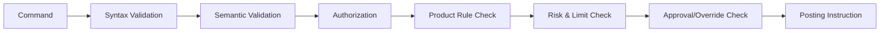

### 4.2 Control Tidak Selalu Reject

Beberapa control menghasilkan status antara:

| Control Result | Makna |
|---|---|
| `ACCEPTED` | Boleh lanjut posting |
| `REJECTED` | Tidak boleh diproses |
| `PENDING_APPROVAL` | Butuh maker-checker/four-eyes |
| `PENDING_SCREENING` | Menunggu fraud/AML/sanctions |
| `PENDING_REPAIR` | Data/instruction perlu diperbaiki operational user |
| `HELD` | Dana/instruksi ditahan sampai release |

State ini penting karena core banking bukan hanya request-response synchronous. Banyak operasi punya lifecycle.

### 4.3 Hold/Block sebagai Control

Hold adalah pembatasan dana. Hold bisa berasal dari:

- ATM/card authorization;
- legal hold;
- fraud investigation;
- loan collateral lien;
- cheque clearing period;
- operational dispute;
- account closure process.

Model sederhana:

```java
public record FundsHold(
        HoldId id,
        AccountId accountId,
        Money amount,
        HoldReason reason,
        HoldStatus status,
        LocalDate effectiveFrom,
        LocalDate expiresOn,
        String sourceReference
) {}
```

Available balance bukan selalu ledger balance.

```txt
availableBalance = ledgerBalance - activeHolds - minimumRequiredBalance + overdraftLimit
```

Formula aktual bisa lebih kompleks, tetapi mental modelnya: **ledger balance** dan **spendable balance** berbeda.

---

## 5. Operational Evidence System: Sistem Harus Bisa Menjelaskan Dirinya

Core banking harus bisa menjawab pertanyaan seperti:

- Mengapa transfer ini ditolak?
- Siapa yang melakukan override?
- Produk versi mana yang menghitung fee ini?
- Kenapa saldo statement berbeda dari saldo available?
- Apakah transaksi ini sudah settled?
- Apakah ada reversal?
- Di EOD stage mana batch gagal?
- Item rekonsiliasi mana yang belum matched?
- Apakah laporan risiko lengkap dan tepat waktu?

### 5.1 Evidence Bukan Log Biasa

Log aplikasi membantu debugging. Evidence membantu pembuktian.

| Log Teknis | Evidence Domain |
|---|---|
| Stack trace | Rejection reason |
| Request latency | Command lifecycle |
| SQL timeout | Posting commit status |
| Service error | Repair case dan owner |
| Trace id | Correlation ke journal, actor, approval, business date |

Core banking butuh keduanya.

### 5.2 Evidence Model Minimal

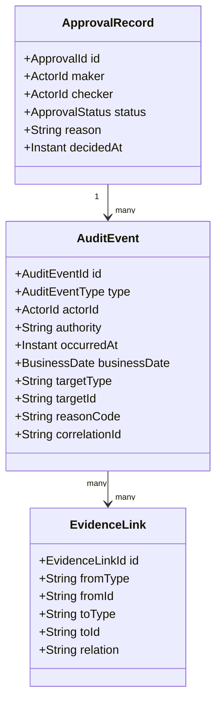

Evidence harus queryable berdasarkan:

- account;
- transaction;
- customer;
- business date;
- actor;
- source channel;
- batch run;
- approval id;
- journal id;
- external reference.

---

## 6. Core Banking sebagai State Machine Network

Banyak engineer membuat satu status field dan selesai. Core banking membutuhkan banyak lifecycle yang saling terkait.

### 6.1 Account Lifecycle

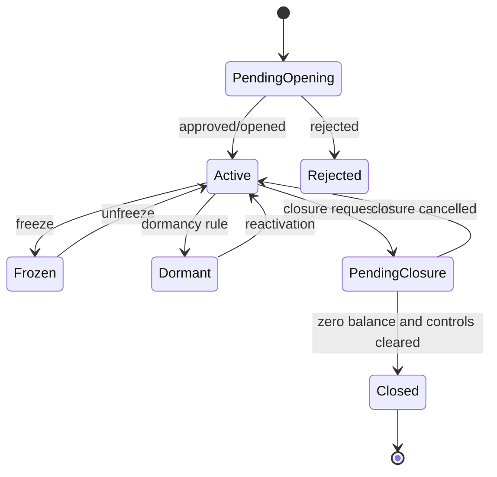

### 6.2 Transaction Lifecycle

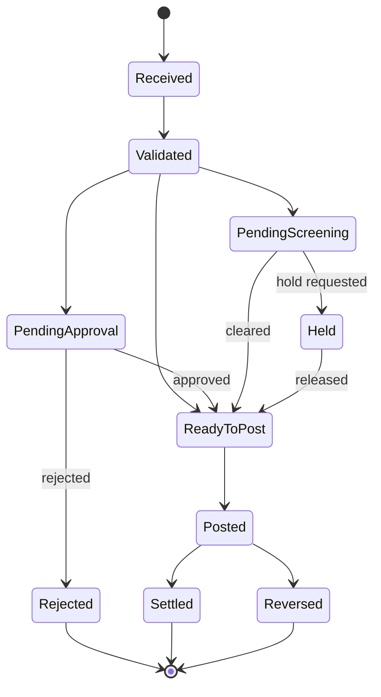

### 6.3 EOD Lifecycle

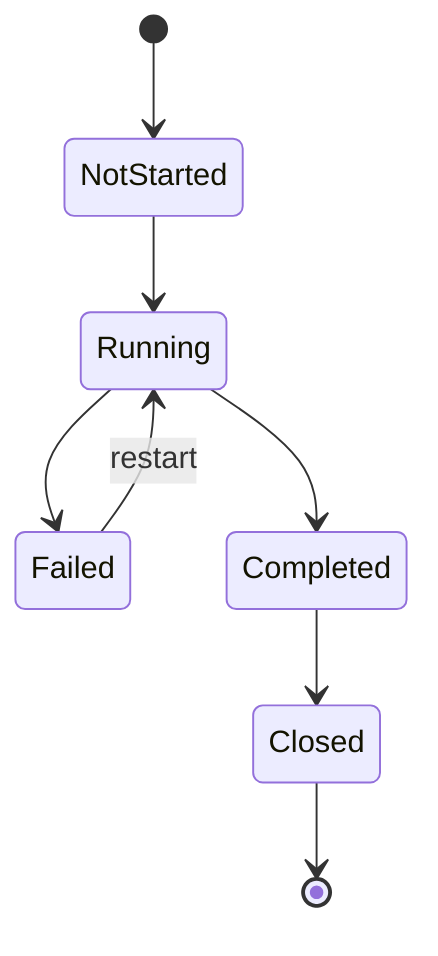

Key insight:

> Core banking bukan satu state machine besar. Core banking adalah network of state machines yang harus berkoordinasi tanpa melanggar ledger truth.

---

## 7. Business Date, Value Date, Posting Date

Salah satu sumber bug serius adalah mencampur tanggal.

| Tanggal | Makna |
|---|---|
| System date/time | Waktu aktual server menjalankan proses |
| Business date | Tanggal operasional bank yang sedang diproses |
| Posting date | Tanggal journal dibukukan |
| Value date | Tanggal efektif nilai finansial untuk interest/settlement |
| Transaction date | Tanggal instruksi/kejadian diterima |
| Settlement date | Tanggal penyelesaian antar pihak |

Contoh:

```txt
System time      : 2026-06-28T01:30:00+07:00
Business date    : 2026-06-27
Transaction date : 2026-06-28
Posting date     : 2026-06-27
Value date       : 2026-06-27
Settlement date  : 2026-06-30
```

Ini mungkin terjadi saat transaksi diproses setelah tengah malam tetapi masih dalam business date sebelumnya karena EOD belum selesai.

Prinsip Java:

```java
public interface BusinessCalendar {
    BusinessDate currentBusinessDate(BranchId branchId);
    boolean isOpenForPosting(BranchId branchId, BusinessDate date);
    BusinessDate nextBusinessDate(BranchId branchId, BusinessDate date);
}
```

Jangan menyebar `LocalDate.now()` di domain core banking.

---

## 8. Core Banking Command Model

Core banking lebih aman jika semua perubahan state dimulai dari command eksplisit.

Contoh command:

```java
public sealed interface BankingCommand permits
        OpenAccountCommand,
        InternalTransferCommand,
        PlaceHoldCommand,
        ReleaseHoldCommand,
        ReverseTransactionCommand,
        RunEndOfDayCommand {

    CommandId commandId();
    IdempotencyKey idempotencyKey();
    Actor actor();
    SourceContext source();
    Instant receivedAt();
}
```

Transfer command:

```java
public record InternalTransferCommand(
        CommandId commandId,
        IdempotencyKey idempotencyKey,
        Actor actor,
        SourceContext source,
        Instant receivedAt,
        AccountId debitAccountId,
        AccountId creditAccountId,
        Money amount,
        String narrative
) implements BankingCommand {}
```

Command bukan posting. Command adalah intensi. Posting adalah hasil setelah validation, authorization, product rule, dan control.

---

## 9. Posting Instruction sebagai Boundary Antara Domain dan Ledger

Salah satu pattern penting:

```txt
Command -> Domain Decision -> Posting Instruction -> Ledger Journal
```

Kenapa tidak langsung command ke journal?

Karena domain decision perlu menjelaskan:

- apakah ada fee;
- apakah ada tax;
- apakah ada hold release;
- apakah butuh suspense account;
- apakah settlement leg dibuat sekarang atau nanti;
- apakah reversal mengacu original transaction;
- apakah GL mapping membutuhkan control account.

Model sederhana:

```java
public record PostingInstruction(
        InstructionId id,
        CommandId sourceCommandId,
        BusinessDate businessDate,
        List<PostingInstructionLine> lines,
        PostingNarrative narrative,
        PostingMetadata metadata
) {
    public PostingInstruction {
        if (lines == null || lines.size() < 2) {
            throw new IllegalArgumentException("Posting instruction must have at least two lines");
        }
    }
}

public record PostingInstructionLine(
        LedgerAccountId ledgerAccountId,
        Side side,
        Money amount,
        LocalDate valueDate
) {}
```

Posting engine kemudian bertugas memastikan instruction valid dan balance sebelum commit.

---

## 10. Internal Transfer End-to-End

Mari lihat internal transfer sebagai flow.

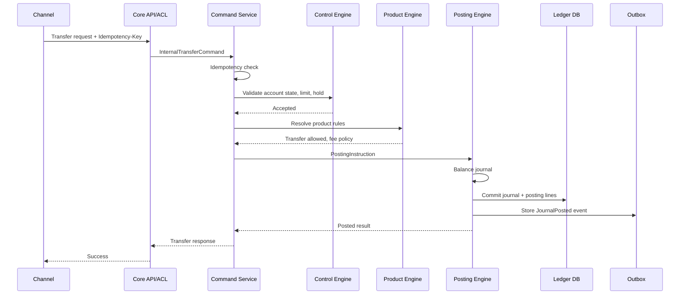

Failure points:

| Step | Failure | Correct Response |
|---|---|---|
| Before idempotency record | Network failure | Client can retry safely |
| After idempotency record, before posting | Retry returns pending/in-progress or resumes |
| After ledger commit, before response | Retry returns original posted result |
| After ledger commit, before event publish | Outbox publishes later |
| During validation | Reject with stable reason |
| During approval | Move to pending approval |

---

## 11. Transaction Status Taxonomy

Jangan memakai status terlalu sedikit.

Buruk:

```txt
SUCCESS / FAILED
```

Lebih realistis:

| Status | Makna |
|---|---|
| `RECEIVED` | Command diterima |
| `VALIDATED` | Struktur dan semantic dasar valid |
| `PENDING_APPROVAL` | Menunggu approval |
| `PENDING_SCREENING` | Menunggu screening eksternal/internal |
| `READY_TO_POST` | Siap dibukukan |
| `POSTING` | Sedang dalam proses commit ledger |
| `POSTED` | Journal committed |
| `SETTLEMENT_PENDING` | Menunggu settlement eksternal |
| `SETTLED` | Settlement selesai |
| `REJECTED` | Ditolak sebelum posting |
| `REVERSED` | Dampak posting dibalik |
| `REPAIR_REQUIRED` | Butuh intervensi operasional |
| `UNKNOWN` | Status eksternal tidak bisa dipastikan, perlu recon |

`UNKNOWN` penting. Dalam distributed system, ada kondisi di mana sistem tidak boleh berpura-pura tahu.

---

## 12. Risk of “Exactly Once” Thinking

Dalam core banking, banyak tim ingin “exactly once processing”. Secara praktis, kita mendesain dengan:

- at-least-once delivery;
- idempotent command handling;
- atomic persistence boundary;
- outbox for event publication;
- reconciliation for external uncertainty;
- repair queue for ambiguous cases.

Mental model:

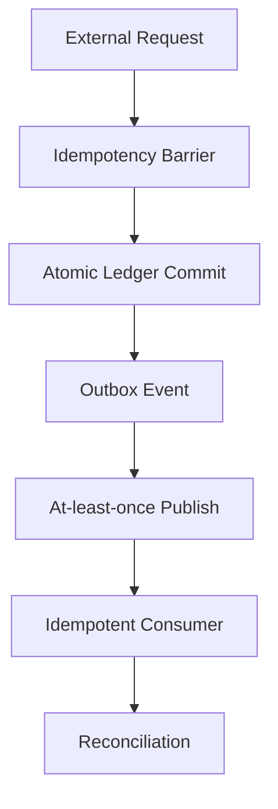

Jangan bergantung pada janji “message hanya terkirim sekali” sebagai kontrol utama uang. Kontrol utama adalah ledger commit dan idempotency.

---

## 13. Auditability by Design

Auditability bukan fitur tambahan. Ia harus dibangun ke command, domain decision, posting, approval, dan operations.

Checklist auditability:

| Area | Pertanyaan |
|---|---|
| Actor | Siapa atau sistem apa yang memulai aksi? |
| Authority | Dengan wewenang apa aksi dilakukan? |
| Intent | Apa command awalnya? |
| Decision | Rule apa yang membuat aksi diterima/ditolak? |
| Product | Parameter versi mana yang dipakai? |
| Posting | Journal dan posting line mana yang dibuat? |
| Time | System time, business date, value date mana? |
| Approval | Siapa maker/checker? |
| Exception | Jika override, apa reason code? |
| Lineage | Bagaimana output bisa ditelusuri ke input? |

Domain object yang auditable:

```java
public record DecisionTrace(
        CommandId commandId,
        List<RuleEvaluation> ruleEvaluations,
        List<ApprovalReference> approvals,
        ProductVersionId productVersionId,
        BusinessDate businessDate
) {}

public record RuleEvaluation(
        String ruleCode,
        RuleResult result,
        String reason,
        Map<String, String> evidence
) {}
```

Hati-hati: evidence tidak boleh membocorkan data sensitif secara sembarangan. Auditability harus selaras dengan privacy dan retention policy.

---

## 14. Data Domains dalam Core Banking

Core banking minimal memiliki beberapa data domain:

| Domain | Owned by Core? | Catatan |
|---|---:|---|
| Account | Ya | Core harus authoritative |
| Ledger journal/posting | Ya | Core harus authoritative |
| Product agreement | Ya | Untuk produk booked di core |
| Customer master | Tergantung | Bisa owned by CRM/MDM, core menyimpan reference/snapshot penting |
| Product catalog | Ya/bersama | Perlu governance ketat |
| FX rate | Biasanya reference | Core memakai effective rate snapshot untuk posting |
| Branch/calendar | Biasanya reference | Core butuh business calendar stable |
| AML/fraud decision | Tidak penuh | Core menyimpan decision reference dan hold state |
| GL chart of accounts | Biasanya Finance/GL | Core menyimpan mapping relevan |
| Regulatory report | Biasanya reporting/risk | Core menyediakan lineage/extract |

Prinsip:

> Core banking boleh mengonsumsi reference data, tetapi harus menyimpan snapshot atau version reference yang cukup untuk menjelaskan keputusan masa lalu.

---

## 15. Java Package Boundary Awal

Salah satu struktur awal yang masuk akal:

```txt
com.bank.core
  party
  account
  product
  agreement
  command
  ledger
  posting
  balance
  hold
  interest
  fee
  calendar
  approval
  audit
  reconciliation
  eod
  integration
    gl
    payment
    fraud
    reporting
```

Tetapi package bukan boundary sejati. Boundary sejati adalah ownership invariant.

Contoh:

- `ledger` memiliki invariant journal balance dan immutability.
- `posting` memiliki pipeline validasi instruction ke journal.
- `product` memiliki parameter versioning dan effective dating.
- `account` memiliki account lifecycle dan allowed operation.
- `eod` memiliki restartability dan business date transition.
- `audit` memiliki evidence capture dan queryability.

---

## 16. Service Boundary: Application vs Domain vs Infrastructure

Gunakan layering yang jelas:

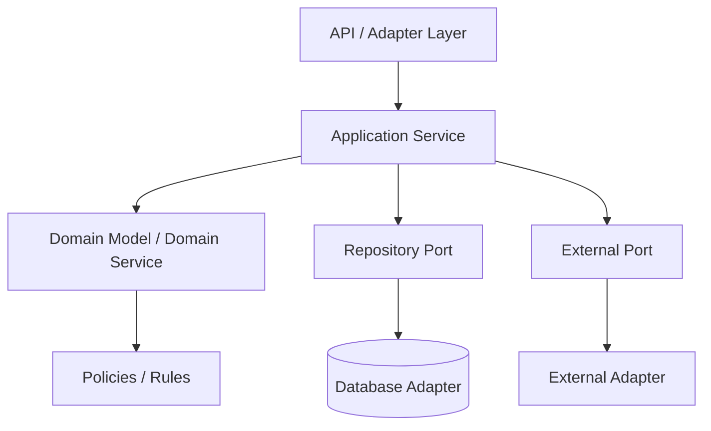

### 16.1 Application Service

Bertugas orkestrasi use case:

- idempotency;
- load aggregate/reference data;
- panggil domain service;
- simpan journal;
- tulis outbox;
- kembalikan response.

### 16.2 Domain Service

Bertugas membuat keputusan domain:

- apakah account bisa didebit;
- apakah product mengizinkan transaksi;
- apakah posting instruction benar;
- apakah hold memengaruhi available balance;
- bagaimana reversal dibentuk.

### 16.3 Infrastructure

Bertugas detail teknis:

- database;
- message broker;
- HTTP client;
- scheduler;
- external file transfer;
- secret management;
- telemetry exporter.

Jangan biarkan infrastructure menentukan kebenaran domain.

---

## 17. Example: Internal Transfer Skeleton

Contoh ringkas, bukan production-ready:

```java
public final class InternalTransferApplicationService {
    private final IdempotencyService idempotencyService;
    private final AccountRepository accountRepository;
    private final ProductRuleService productRuleService;
    private final ControlService controlService;
    private final PostingEngine postingEngine;
    private final BusinessCalendar businessCalendar;

    public TransferResult handle(InternalTransferCommand command) {
        return idempotencyService.execute(command.idempotencyKey(), command.fingerprint(), () -> {
            BusinessDate businessDate = businessCalendar.currentBusinessDate(command.source().branchId());

            Account debit = accountRepository.get(command.debitAccountId());
            Account credit = accountRepository.get(command.creditAccountId());

            controlService.assertDebitAllowed(debit, command.amount(), command.actor(), businessDate);
            controlService.assertCreditAllowed(credit, command.amount(), command.actor(), businessDate);
            productRuleService.assertTransferAllowed(debit, credit, command.amount(), businessDate);

            PostingInstruction instruction = PostingInstructionFactory.internalTransfer(
                    command,
                    debit.ledgerAccountId(),
                    credit.ledgerAccountId(),
                    businessDate
            );

            PostedJournal journal = postingEngine.post(instruction);
            return TransferResult.posted(command.commandId(), journal.journalId());
        });
    }
}
```

Hal yang sengaja terlihat:

- business date eksplisit;
- idempotency membungkus use case;
- account state diperiksa;
- product rule diperiksa;
- posting instruction dipisah dari command;
- ledger commit dilakukan oleh posting engine.

Hal yang belum ditampilkan:

- locking/concurrency;
- database transaction boundary;
- outbox;
- maker-checker;
- fee/tax;
- available balance calculation;
- error taxonomy;
- observability;
- test.

Topik itu akan muncul di part berikutnya saat relevan.

---

## 18. Control Plane vs Data Plane

Dalam core banking, berguna membedakan:

| Plane | Isi |
|---|---|
| Data plane | Posting transaksi, balance inquiry, payment status, account servicing |
| Control plane | Product configuration, approval matrix, limit setup, branch calendar, EOD control, repair queue |

Control plane salah bisa merusak data plane.

Contoh:

- product rate salah effective date → interest salah massal;
- approval matrix salah → transaksi besar lolos tanpa checker;
- business calendar salah → EOD salah tanggal;
- GL mapping salah → laporan finance salah;
- fee configuration salah → nasabah salah charge.

Karena itu control plane perlu:

- maker-checker;
- versioning;
- simulation;
- impact analysis;
- effective dating;
- rollback strategy;
- audit trail.

---

## 19. External Standards sebagai Constraint, Bukan Desain Siap Pakai

Standar seperti ISO 20022, PCI DSS, BCBS 239, FFIEC AIO, NIST CSF, dan OpenTelemetry membantu memberi constraint dan vocabulary.

Tetapi standar bukan pengganti domain design.

Contoh:

- ISO 20022 membantu struktur pesan finansial; ia tidak otomatis menentukan internal ledger model.
- PCI DSS memberi baseline perlindungan payment account data; ia tidak berarti semua card data harus masuk core.
- BCBS 239 menekankan risk data aggregation/reporting; ia tidak mendesain schema ledger kamu.
- FFIEC AIO memberi ekspektasi architecture/infrastructure/operations; ia bukan blueprint aplikasi Java.
- OpenTelemetry memberi mekanisme telemetry; ia bukan business evidence model.

Mental model:

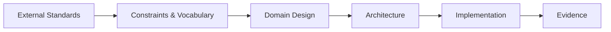

Top engineer tidak sekadar “mengikuti standar”. Ia menerjemahkan standar menjadi constraint operasional dan desain yang bisa dibuktikan.

---

## 20. Failure Thinking: Core Banking Tidak Boleh Optimistis Berlebihan

Setiap flow harus dianalisis dengan failure mode.

Contoh internal transfer:

| Failure Mode | Risiko | Mitigasi Desain |
|---|---|---|
| Client retry setelah timeout | Double debit | Idempotency key + command fingerprint |
| Service crash setelah ledger commit | Response hilang | Idempotency result recovery |
| Event publish gagal | Downstream tidak tahu transaksi | Transactional outbox |
| Balance projection gagal update | Inquiry salah | Rebuildable projection + lag metric |
| EOD gagal di tengah | Business date ambigu | Stage checkpoint + restartability |
| External settlement unknown | Salah status payment | Reconciliation + unknown state |
| Product config salah | Salah fee/bunga massal | Maker-checker + simulation + effective dating |
| Manual override tanpa reason | Audit failure | Mandatory reason + authority capture |

Core banking design harus cenderung konservatif. Ketika tidak tahu status eksternal, jangan mengarang sukses/gagal. Catat unknown, reconcile, dan repair.

---

## 21. Architectural Consequence: Strong Consistency Core, Eventual Consistency Edge

Pola umum yang sehat:

```txt
Strong consistency inside ledger/posting boundary.
Eventual consistency for downstream projections and integrations.
```

Contoh:

| Area | Konsistensi yang Dibutuhkan |
|---|---|
| Journal + posting line commit | Strong consistency |
| Idempotency record + command result | Strong consistency dengan command processing |
| Balance snapshot | Strong atau carefully synchronized projection |
| Notification | Eventual consistency |
| Data warehouse | Eventual consistency |
| Fraud async decision | Depends on transaction type |
| GL extract | Batch/reconciled consistency |
| Statement generation | Consistent as of business date/cutoff |

Jangan menyebar ledger truth ke banyak service yang commit sendiri-sendiri tanpa reconciliation discipline.

---

## 22. Design Smell Catalog

Gunakan smell ini saat review design core banking.

| Smell | Kenapa Berbahaya |
|---|---|
| `balance` di-update langsung tanpa journal | Tidak ada lineage |
| Delete/update transaksi lama | Audit trail rusak |
| `SUCCESS/FAILED` sebagai satu-satunya status | Tidak cukup untuk lifecycle nyata |
| Product parameter untyped | Sulit governance dan audit |
| Tidak ada business date | EOD/backdating kacau |
| Tidak ada idempotency | Retry bisa merusak uang |
| Event published sebelum commit ledger | Downstream melihat transaksi yang belum sah |
| Core menyimpan semua data card mentah | PCI scope melebar |
| Semua integrasi sinkron | Latency dan availability rapuh |
| Semua dibuat microservice | Consistency dan recon complexity naik |
| Tidak ada repair queue | Operasi manual terjadi di luar sistem |
| Audit hanya log teknis | Tidak cukup untuk dispute/compliance |

---

## 23. Exercise: Design Review Mini Transfer

Ambil flow internal transfer dan jawab:

1. Apa command-nya?
2. Apa idempotency key-nya?
3. Apa fingerprint command-nya?
4. Account state apa yang harus diperiksa?
5. Product rule apa yang relevan?
6. Control apa yang bisa menahan transfer?
7. Posting lines apa yang terbentuk?
8. Balance mana yang berubah?
9. Event apa yang dipublish?
10. Evidence apa yang harus disimpan?
11. Failure mode apa yang paling berbahaya?
12. Bagaimana reversal dilakukan?

Jawaban yang baik tidak harus panjang, tetapi harus eksplisit.

---

## 24. Mini ADR: Ledger as Source of Truth

Gunakan template ini:

```md
# ADR: Ledger as Source of Truth

## Context
Core banking harus menjaga saldo, transaksi, statement, reconciliation, dan audit evidence.

## Decision
Committed ledger journal dan posting lines menjadi sumber kebenaran utama untuk perubahan nilai finansial.
Balance snapshot adalah projection yang dapat di-rebuild.

## Consequences
- Semua transaksi finansial harus menghasilkan balanced journal.
- Koreksi dilakukan lewat reversal/adjustment.
- Balance inquiry membaca projection, tetapi projection harus bisa ditelusuri ke ledger.
- Downstream event diterbitkan setelah ledger commit.

## Risks
- Query ledger mentah bisa mahal.
- Projection lag harus dimonitor.
- Rebuild membutuhkan strategi performa dan cutoff.

## Controls
- Journal balancing constraint.
- Immutable posting lines.
- Idempotency barrier.
- Reconciliation job.
- Audit query by journal/account/business date.
```

ADR seperti ini membuat design decision bisa dipahami dan diaudit.

---

## 25. Ringkasan Part 002

Core banking harus dipahami sebagai gabungan empat sistem:

1. **Ledger system** menjaga kebenaran nilai finansial melalui journal, posting line, balance, reversal, dan adjustment.
2. **Product system** menerapkan kontrak finansial melalui product version, agreement, interest, fee, tax, dan lifecycle rules.
3. **Risk/control system** menentukan apakah instruksi boleh terjadi, harus ditolak, ditahan, disetujui, atau dikirim ke repair.
4. **Operational evidence system** memastikan sistem bisa menjelaskan keputusan, angka, dan perubahan kepada audit, operasi, risk, regulator, dan customer dispute.

Kunci mental model:

- command bukan posting;
- posting bukan sekadar update balance;
- balance bukan satu-satunya truth;
- event bukan otomatis truth;
- log bukan otomatis evidence;
- product config bukan sekadar key-value;
- business date bukan system date;
- consistency harus paling kuat di boundary ledger/posting.

Part berikutnya akan masuk ke domain map: **Party, Account, Product, Agreement**, dan bagaimana keempatnya membentuk struktur dasar core banking.
