# Part 003 — Banking Domain Map: Party, Account, Product, Agreement

Core banking system sering gagal bukan karena Java-nya buruk, melainkan karena domain model-nya salah sejak awal.

Kesalahan paling umum adalah menganggap bank hanya punya tabel `customer`, `account`, dan `transaction`. Itu terlalu dangkal. Di sistem nyata, “customer” bukan selalu satu orang, “account” bukan ledger itu sendiri, “product” bukan sekadar enum, dan “agreement” bukan dokumen pasif. Keempat konsep ini membentuk tulang punggung core banking.

Part ini membangun peta domain minimal yang cukup kuat untuk menalar desain core banking modern.

Kita tidak akan mengulang DDD umum, Java records, entity mapping, SQL, atau persistence pattern yang sudah dibahas di seri lain. Fokus kita adalah **struktur domain banking** dan **konsekuensi engineering-nya**.

---

## 1. Target Pembelajaran

Setelah menyelesaikan part ini, kamu harus bisa:

1. Membedakan `Party`, `Customer`, `Account`, `Product`, dan `Agreement` secara presisi.
2. Menjelaskan kenapa account bukan satu-satunya pusat domain core banking.
3. Mendesain aggregate boundary untuk banking domain tanpa mencampur KYC, product config, account lifecycle, dan ledger posting.
4. Membuat model relasi multi-party, joint account, corporate customer, nominee, authorized signer, dan servicing mandate.
5. Menghindari anti-pattern seperti `CustomerAccountEntity` raksasa, mutable product terms, dan hardcoded product rules.
6. Menyiapkan fondasi untuk ledger/posting engine di part berikutnya.

---

## 2. Prinsip Kaufman untuk Part Ini

Dalam kerangka *The First 20 Hours*, kita pecah skill “membangun core banking” menjadi sub-skill yang lebih kecil. Untuk part ini, sub-skill-nya adalah:

| Sub-skill | Bentuk latihan |
|---|---|
| Domain vocabulary | Bisa mendefinisikan istilah tanpa ambigu |
| Boundary recognition | Bisa memisahkan Party, Product, Agreement, Account, Ledger |
| Lifecycle reasoning | Bisa menggambar state transition |
| Relationship modeling | Bisa memodelkan ownership, signatory, beneficiary, mandate |
| Failure reasoning | Bisa melihat dampak domain model yang salah terhadap audit, ledger, dan operasi |

Tujuan 20 jam pertama bukan menghafal semua istilah banking. Tujuannya adalah membangun *mental compression*: ketika melihat requirement seperti “rekening giro korporat dengan dua approver, limit harian, fee waiver 3 bulan, dan joint authorization”, kamu langsung tahu domain object mana yang terlibat.

---

## 3. Mental Model Utama

Core banking bukan sekadar sistem rekening. Core banking adalah sistem yang mengikat empat hal:

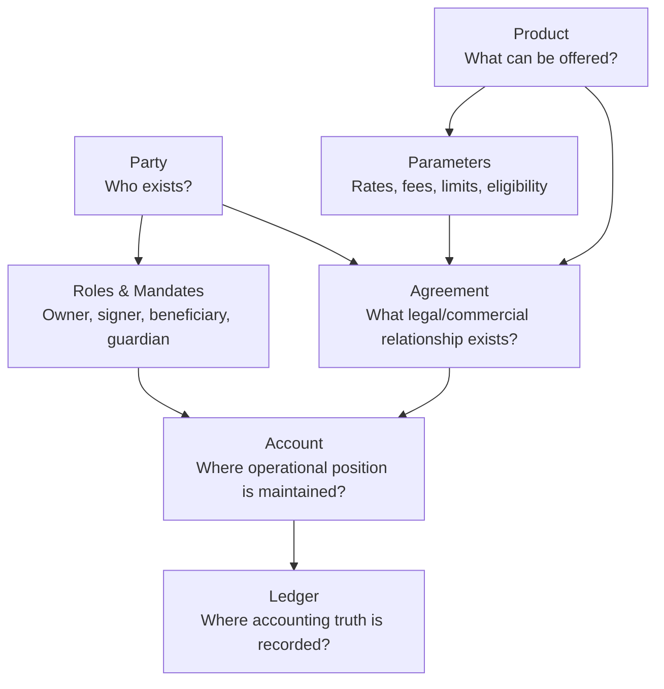

Sederhananya:

| Concept | Pertanyaan yang dijawab |
|---|---|
| Party | Siapa entitasnya? |
| Product | Apa yang bank tawarkan? |
| Agreement | Apa kontrak yang disepakati? |
| Account | Di mana posisi operasional dikelola? |
| Ledger | Di mana kebenaran akuntansi dicatat? |

Kesalahan desain biasanya muncul ketika salah satu konsep ini dilebur ke konsep lain.

Contoh buruk:

```java
class CustomerAccount {
    String customerName;
    String productCode;
    BigDecimal balance;
    BigDecimal interestRate;
    boolean canWithdraw;
    boolean kycApproved;
    boolean dormant;
    boolean blocked;
}
```

Model seperti ini terlihat praktis di awal, tetapi akan runtuh saat muncul:

- joint account;
- corporate authorized signer;
- perubahan product term;
- KYC re-screening;
- dormant account;
- backdated product rate;
- audit trail;
- migration;
- reconciliation;
- regulator query.

---

## 4. Party: Entitas yang Memiliki Identitas dan Peran

`Party` adalah entitas yang dapat memiliki hubungan dengan bank. Party bisa berupa:

- individual;
- legal entity/company;
- government entity;
- financial institution;
- branch/internal unit;
- trustee;
- guardian;
- nominee;
- merchant;
- correspondent bank.

Yang penting: **Party bukan selalu customer**.

Customer adalah role. Party adalah entitas dasar.

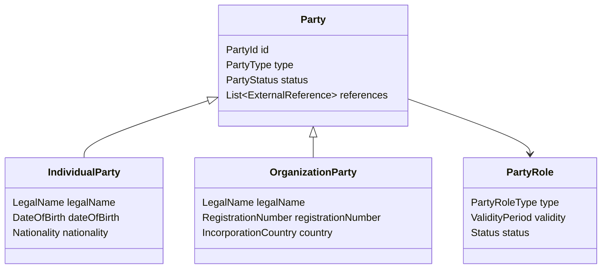

### 4.1 Party Role

Role mengubah arti party dalam konteks tertentu.

| Role | Arti |
|---|---|
| Customer | Pihak yang menerima layanan bank |
| Account owner | Pihak yang memiliki hak atas account |
| Authorized signer | Pihak yang dapat menginstruksikan transaksi |
| Beneficiary | Pihak penerima manfaat |
| Guarantor | Pihak penjamin pinjaman |
| Guardian | Pihak yang bertindak untuk minor/incapacitated party |
| Power of attorney | Pihak yang diberi kuasa |
| Correspondent bank | Pihak bank lain dalam relasi settlement |

Di core banking matang, relasi ini tidak boleh disimpan sebagai kolom boolean seperti `isOwner`, `isSigner`, `isBeneficiary` di tabel customer. Relasi harus punya konteks, validity, authority, dan audit trail.

### 4.2 Party Relationship

Hubungan antar-party penting untuk corporate banking dan risk.

Contoh:

- individual adalah director dari company;
- company adalah subsidiary dari holding company;
- individual adalah guardian untuk minor;
- person A dan person B adalah joint account holder;
- company memberi mandate ke treasury officer.

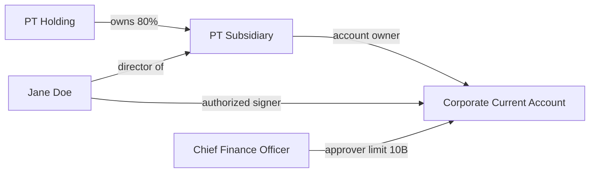

### 4.3 Party Data Tidak Boleh Terlalu Mudah Diubah

Party memiliki data yang berubah dan data yang seharusnya historis.

| Data | Sifat |
|---|---|
| Party ID internal | Immutable |
| Legal name | Mutable with history |
| Address | Mutable with history |
| KYC status | State-based, auditable |
| Risk rating | Versioned/effective dated |
| Tax residency | Effective dated |
| Customer segment | Mutable, often derived |

Jika legal name berubah, transaksi historis tidak boleh tiba-tiba “berubah makna”. Sistem harus bisa menjawab: “Pada tanggal transaksi ini, nama legal yang berlaku apa?”

---

## 5. Product: Template Komersial dan Operasional

`Product` adalah definisi layanan finansial yang bisa ditawarkan bank.

Contoh:

- Savings Account Gold;
- Current Account Corporate;
- Term Deposit 6 Months;
- Mortgage Loan Fixed 5 Years;
- SME Working Capital Loan;
- Payroll Account;
- Student Savings Account.

Product bukan sekadar kode.

Product membawa:

- eligibility rule;
- currency support;
- interest rule;
- fee rule;
- limit rule;
- tax behavior;
- posting rule;
- GL mapping;
- statement rule;
- lifecycle rule;
- allowed servicing operation;
- effective date/version.

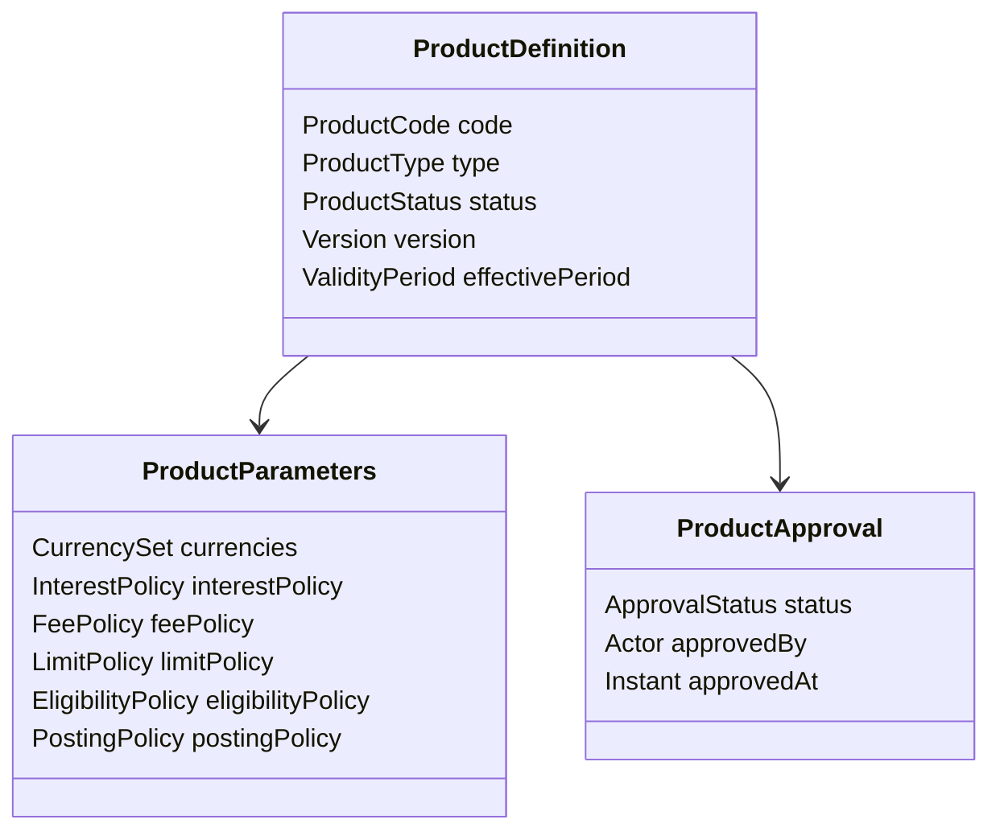

### 5.1 Product Definition vs Product Instance

Ini perbedaan kritikal.

| Concept | Contoh | Sifat |
|---|---|---|
| Product definition | Savings Gold v3 | Template |
| Product parameter version | Interest 2.5%, fee 10k, effective Jan 2026 | Versioned config |
| Product agreement | Customer A membuka Savings Gold pada 2026-02-01 | Contractual instance |
| Account | Account number 1234567890 | Operational container |

Product definition boleh berubah untuk penjualan baru, tapi tidak otomatis mengubah terms nasabah lama kecuali agreement mengizinkan.

### 5.2 Effective Dating

Product config hampir selalu butuh effective dating.

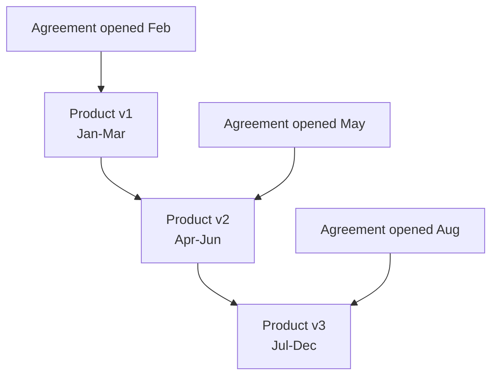

Tanpa effective dating, sistem akan salah menghitung fee/interest historis.

### 5.3 Product Governance

Product tidak boleh diedit langsung di production tanpa governance.

Minimum lifecycle:

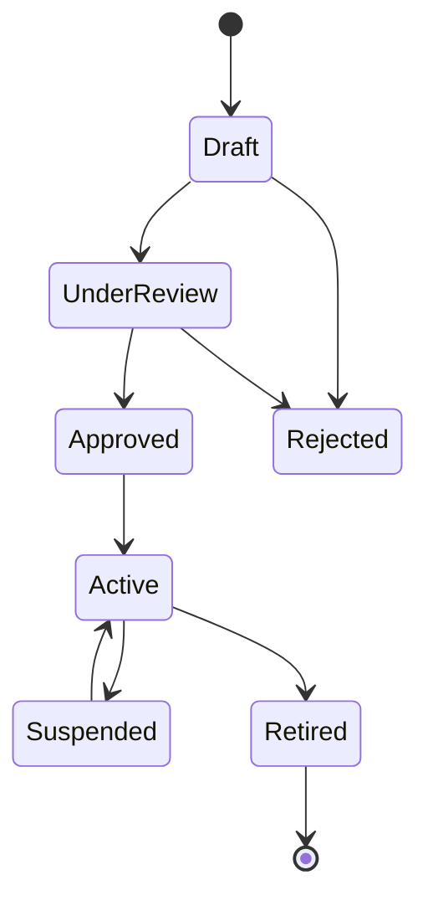

Engineering implication:

- semua perubahan parameter harus versioned;
- aktivasi harus punya effective date;
- perubahan harus bisa disimulasikan;
- approval harus menyimpan actor dan reason;
- runtime engine harus membaca version yang benar berdasarkan business date/value date.

---

## 6. Agreement: Kontrak yang Mengikat Party dan Product

`Agreement` adalah hubungan kontraktual antara bank dan party untuk suatu product.

Agreement menjawab:

- siapa pihak yang menyetujui;
- product apa yang dipakai;
- versi terms mana yang berlaku;
- kapan mulai berlaku;
- apa limit/fee/rate khusus;
- siapa yang boleh mengoperasikan;
- apa status kontraknya;
- bagaimana perubahan terms dilakukan.

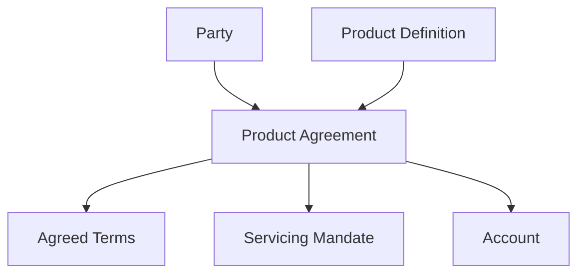

### 6.1 Agreement Bukan Account

Satu agreement bisa menghasilkan satu atau beberapa account.

Contoh:

- loan agreement menghasilkan loan account + repayment account;
- cash management agreement menghasilkan beberapa virtual account;
- corporate current account agreement memiliki master account + sub-account;
- credit facility agreement menghasilkan utilization account dan fee account.

Sebaliknya, account tertentu bisa terkait dengan beberapa agreement servicing.

### 6.2 Agreement Terms

Terms harus diperlakukan sebagai snapshot kontraktual, bukan pointer sembrono ke current product config.

```java
public record AgreementTerms(
        ProductCode productCode,
        ProductVersion productVersion,
        Currency currency,
        InterestPolicySnapshot interestPolicy,
        FeePolicySnapshot feePolicy,
        LimitPolicySnapshot limitPolicy,
        LocalDate effectiveDate
) {}
```

Kenapa snapshot penting?

Karena ketika Product Gold v3 berubah menjadi v4, account nasabah yang dibuka pada v3 belum tentu ikut berubah. Jika sistem hanya menyimpan `product_code = GOLD`, maka historical calculation menjadi ambigu.

### 6.3 Agreement Lifecycle

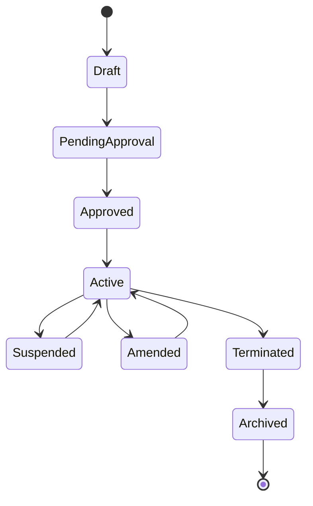

Status agreement berbeda dari status account.

Contoh:

- agreement active, account blocked karena fraud review;
- agreement suspended, account masih menerima interest posting;
- agreement terminated, account masih punya closing settlement;
- account closed, agreement masih disimpan untuk retention/audit.

---

## 7. Account: Operational Position Container

`Account` adalah container operasional untuk menyimpan posisi, instruksi, dan lifecycle finansial.

Account bukan hanya nomor rekening.

Account membawa:

- account number;
- account type;
- currency;
- owning agreement;
- status;
- operational restrictions;
- balance view;
- ledger link;
- servicing rule;
- statement preference;
- branch/booking unit;
- tax/reporting attributes.

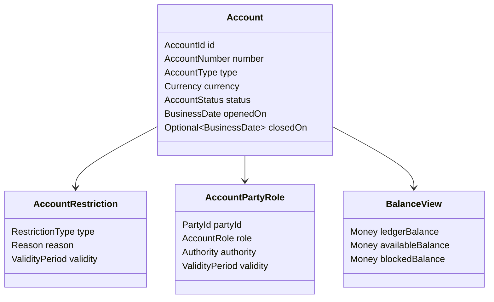

### 7.1 Account Number Bukan Primary Identity

Account number adalah business identifier, bukan selalu primary key teknis.

Recommended:

| Identifier | Fungsi |
|---|---|
| `AccountId` | Immutable internal ID |
| `AccountNumber` | External/business identifier |
| `IBAN` atau local equivalent | Payment routing identifier jika berlaku |
| `LedgerAccountId` | Link ke ledger/subledger |
| `AgreementId` | Link ke product agreement |

Kenapa penting?

- account number bisa punya format legacy;
- nomor rekening bisa di-mask;
- migration bisa membawa nomor lama;
- account bisa punya alternate identifier;
- internal ID harus stabil untuk referential integrity.

### 7.2 Account Role

Account bisa punya banyak party dengan role berbeda.

| Role | Hak umum |
|---|---|
| Primary owner | Hak utama atas account |
| Joint owner | Hak kepemilikan bersama |
| Authorized signer | Boleh memberi instruksi sesuai mandate |
| Viewer | Boleh melihat statement/balance |
| Beneficiary | Penerima manfaat tertentu |
| Guarantor | Terkait kewajiban tertentu |

Jangan hardcode `customer_id` tunggal di account jika domain banking kamu harus mendukung joint/corporate.

### 7.3 Account Lifecycle

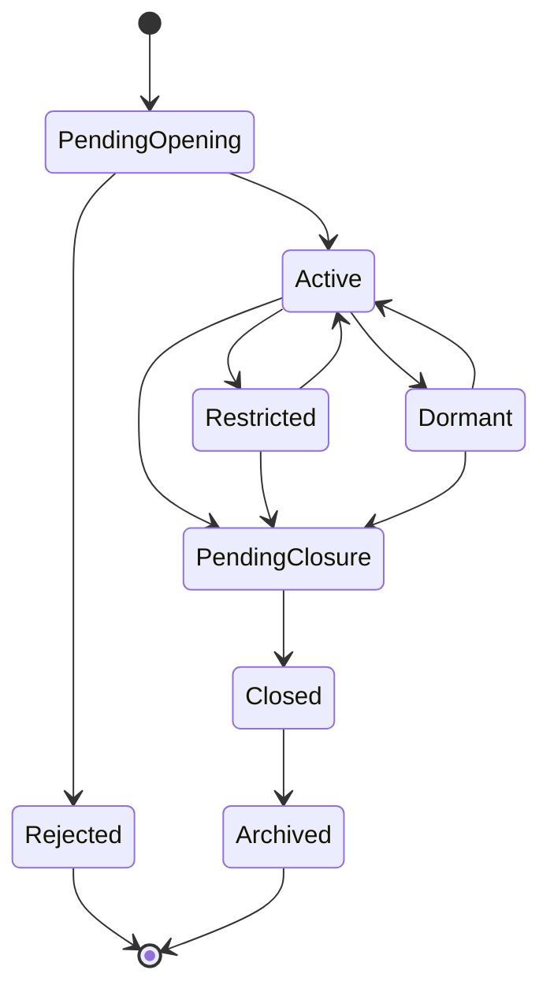

Status account harus memengaruhi allowed operations.

| Status | Deposit | Withdrawal | Interest | Statement | Closure |
|---|---:|---:|---:|---:|---:|
| PendingOpening | No | No | No | No | No |
| Active | Yes | Yes | Yes | Yes | Yes |
| Restricted | Depends | Depends | Depends | Yes | Depends |
| Dormant | Usually no customer debit | Depends | Depends | Yes | Yes |
| PendingClosure | No new customer tx | Limited | Final only | Yes | Yes |
| Closed | No | No | No | Historical only | No |

---

## 8. Ledger: Accounting Truth, Not Just Balance Column

Part ini belum masuk detail ledger, tetapi domain map tidak lengkap tanpa membedakan account operasional dan ledger.

Account adalah “wajah operasional”. Ledger adalah “kebenaran akuntansi”.

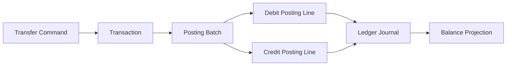

Kesalahan fatal: menyimpan balance sebagai angka yang langsung di-update tanpa journal yang bisa diaudit.

Minimal model:

```java
public record PostingLine(
        PostingLineId id,
        LedgerAccountId ledgerAccountId,
        DebitCredit debitCredit,
        Money amount,
        String narrative,
        Map<String, String> attributes
) {}

public record PostingBatch(
        PostingBatchId id,
        TransactionId transactionId,
        BusinessDate businessDate,
        LocalDate valueDate,
        List<PostingLine> lines
) {
    public void validateBalanced() {
        // detail validation akan dibahas di Part 005-008
    }
}
```

---

## 9. Relationship Cardinality yang Benar

Peta relasi sederhana:

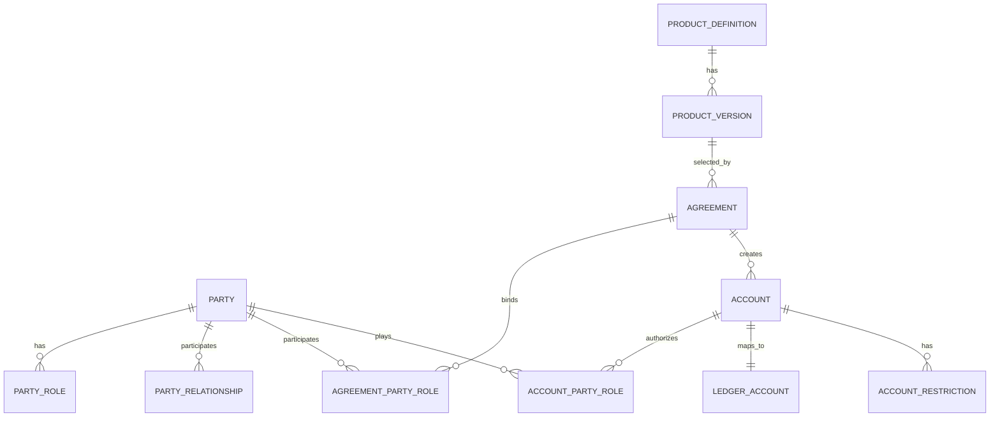

Interpretasi:

- Party bisa punya banyak role.
- Product punya versi.
- Agreement mengikat party ke product version.
- Agreement bisa menciptakan account.
- Account punya party role operasional.
- Account dipetakan ke ledger account.
- Account restriction adalah entitas domain, bukan sekadar flag.

---

## 10. Boundary: Mana yang Milik Core, Mana yang Bukan?

Core banking harus punya batas jelas. Tidak semua hal yang terlihat “banking” harus masuk core.

| Capability | Biasanya di core? | Catatan |
|---|---:|---|
| Account lifecycle | Yes | Bagian inti core |
| Balance/ledger | Yes | Sumber kebenaran finansial |
| Product terms | Yes/Shared | Core butuh snapshot terms untuk posting |
| Customer onboarding | Often no | Biasanya CRM/KYC/origination, core menerima approved party/customer |
| KYC screening | Usually no | Core menyimpan status yang relevan, bukan seluruh engine |
| Fraud scoring | Usually no | Core memanggil/merespons decision point |
| Mobile banking UI | No | Channel |
| Payment rail adapter | Usually no | Adapter/clearing integration, core menyimpan lifecycle dan posting |
| GL system | Often external | Core subledger melakukan handoff ke GL |
| Data warehouse | No | Downstream projection/reporting |

Boundary yang buruk menghasilkan core yang terlalu besar, sulit diaudit, dan sulit diubah.

---

## 11. Java Domain Modeling Baseline

Gunakan type yang eksplisit untuk mengurangi domain ambiguity.

```java
public record PartyId(UUID value) {
    public PartyId {
        Objects.requireNonNull(value, "value");
    }
}

public record AccountId(UUID value) {
    public AccountId {
        Objects.requireNonNull(value, "value");
    }
}

public record ProductCode(String value) {
    public ProductCode {
        if (value == null || value.isBlank()) {
            throw new IllegalArgumentException("product code is required");
        }
    }
}

public record BusinessDate(LocalDate value) {
    public BusinessDate {
        Objects.requireNonNull(value, "value");
    }
}
```

Jangan terlalu cepat memakai `String` untuk semua identifier. Di domain banking, type eksplisit membantu mencegah bug seperti mengirim `customerId` ke method yang mengharapkan `accountId`.

### 11.1 Party Aggregate

```java
public final class Party {
    private final PartyId id;
    private PartyStatus status;
    private final PartyType type;
    private final List<PartyRoleAssignment> roles;
    private final List<PartyReference> references;

    public Party(PartyId id, PartyType type) {
        this.id = Objects.requireNonNull(id);
        this.type = Objects.requireNonNull(type);
        this.status = PartyStatus.PENDING_VERIFICATION;
        this.roles = new ArrayList<>();
        this.references = new ArrayList<>();
    }

    public void activate(Actor actor, BusinessDate businessDate) {
        if (status != PartyStatus.VERIFIED) {
            throw new DomainRuleViolation("Only verified party can be activated");
        }
        this.status = PartyStatus.ACTIVE;
        // emit PartyActivated domain event
    }

    public void assignRole(PartyRole role, ValidityPeriod validity) {
        if (!status.allowsNewRole()) {
            throw new DomainRuleViolation("Party status does not allow new role assignment");
        }
        roles.add(new PartyRoleAssignment(role, validity));
    }
}
```

### 11.2 Product Version Snapshot

```java
public record ProductVersionSnapshot(
        ProductCode productCode,
        int version,
        ProductType type,
        ValidityPeriod effectivePeriod,
        InterestPolicySnapshot interestPolicy,
        FeePolicySnapshot feePolicy,
        LimitPolicySnapshot limitPolicy,
        PostingPolicySnapshot postingPolicy
) {}
```

Snapshot tidak harus berarti duplikasi brutal seluruh config. Maksudnya: agreement harus bisa merekonstruksi terms yang berlaku saat kontrak dibuat atau saat periode tertentu berlaku.

### 11.3 Agreement Aggregate

```java
public final class ProductAgreement {
    private final AgreementId id;
    private final ProductVersionSnapshot productTerms;
    private AgreementStatus status;
    private final List<AgreementPartyRole> parties;
    private final List<AgreementAmendment> amendments;

    public ProductAgreement(
            AgreementId id,
            ProductVersionSnapshot productTerms,
            List<AgreementPartyRole> parties
    ) {
        this.id = Objects.requireNonNull(id);
        this.productTerms = Objects.requireNonNull(productTerms);
        this.parties = List.copyOf(parties);
        this.status = AgreementStatus.DRAFT;
        this.amendments = new ArrayList<>();
    }

    public void activate(Actor actor, BusinessDate businessDate) {
        if (status != AgreementStatus.APPROVED) {
            throw new DomainRuleViolation("Agreement must be approved before activation");
        }
        if (parties.stream().noneMatch(AgreementPartyRole::isPrimaryObligorOrOwner)) {
            throw new DomainRuleViolation("Agreement requires at least one owner/obligor");
        }
        this.status = AgreementStatus.ACTIVE;
    }
}
```

### 11.4 Account Aggregate

```java
public final class Account {
    private final AccountId id;
    private final AccountNumber number;
    private final AgreementId agreementId;
    private final Currency currency;
    private AccountStatus status;
    private final List<AccountPartyRole> partyRoles;
    private final List<AccountRestriction> restrictions;

    public boolean canAccept(Operation operation, BusinessDate businessDate) {
        if (!status.allows(operation)) {
            return false;
        }
        return restrictions.stream().noneMatch(r -> r.blocks(operation, businessDate));
    }

    public void addRestriction(AccountRestriction restriction) {
        if (status == AccountStatus.CLOSED) {
            throw new DomainRuleViolation("Closed account cannot receive new operational restriction");
        }
        restrictions.add(restriction);
    }
}
```

---

## 12. Canonical Commands

Domain map akan terasa nyata ketika diterjemahkan menjadi command.

### 12.1 Open Account

```java
public record OpenAccountCommand(
        CommandId commandId,
        PartyId requestedBy,
        ProductCode productCode,
        ProductVersion selectedProductVersion,
        Currency currency,
        List<AccountPartyInstruction> parties,
        BusinessDate requestedBusinessDate,
        String sourceChannel,
        IdempotencyKey idempotencyKey
) {}
```

Command ini tidak langsung berarti posting uang. Ia menciptakan agreement/account setelah validasi eligibility, approval, dan setup.

### 12.2 Amend Agreement

```java
public record AmendAgreementCommand(
        CommandId commandId,
        AgreementId agreementId,
        AmendmentType amendmentType,
        Map<String, String> requestedChanges,
        BusinessDate effectiveDate,
        String reason,
        Actor requestedBy
) {}
```

Amendment harus effective-dated dan auditable.

### 12.3 Restrict Account

```java
public record RestrictAccountCommand(
        CommandId commandId,
        AccountId accountId,
        RestrictionType restrictionType,
        String reasonCode,
        BusinessDate effectiveFrom,
        Optional<BusinessDate> effectiveTo,
        Actor requestedBy
) {}
```

Restriction bukan sekadar `account.blocked = true`. Restriction punya jenis, reason, actor, validity, dan operational effect.

---

## 13. Anti-Pattern Domain Map

### 13.1 `customer_id` Tunggal di Account

Buruk:

```sql
account(id, customer_id, product_code, balance)
```

Masalah:

- tidak mendukung joint account;
- tidak mendukung corporate authorized signer;
- tidak bisa menyimpan role validity;
- tidak bisa memisahkan owner, viewer, beneficiary, guardian;
- sulit audit authority saat transaksi historis.

Lebih baik:

```sql
account(id, account_number, agreement_id, currency, status)
account_party_role(account_id, party_id, role, authority, valid_from, valid_to)
```

### 13.2 Product Rule Hardcoded di Java Branch

Buruk:

```java
if (productCode.equals("SAVINGS_GOLD")) {
    fee = new BigDecimal("10000");
}
```

Masalah:

- tidak auditable;
- tidak versioned;
- sulit approval;
- tidak bisa effective dating;
- regression risk tinggi.

Lebih baik: rule/parameter version yang disetujui dan dibaca berdasarkan business date.

### 13.3 Agreement Selalu Pointer ke Current Product

Buruk:

```java
agreement.productCode = "SAVINGS_GOLD";
```

Masalah:

- perubahan product mengubah makna agreement lama;
- interest/fee historis tidak bisa dijelaskan;
- regulator/auditor sulit menerima hasil rekalkulasi.

Lebih baik: agreement menyimpan selected version/snapshot terms.

### 13.4 Account Balance Tanpa Journal

Buruk:

```sql
update account set balance = balance - 100000 where id = ?;
```

Masalah:

- tidak ada accounting event;
- tidak ada debit/credit pair;
- sulit reversal;
- sulit reconciliation;
- tidak defensible.

Lebih baik: posting journal append-only + balance projection.

---

## 14. Domain Review Checklist

Gunakan checklist ini saat mereview model core banking.

### Party

- Apakah customer dimodelkan sebagai role, bukan identitas tunggal?
- Apakah party bisa individual dan organization?
- Apakah party relationship punya validity?
- Apakah KYC/risk status historis bisa dijelaskan?
- Apakah external references terpisah dari internal ID?

### Product

- Apakah product memiliki version/effective date?
- Apakah perubahan product harus melalui approval?
- Apakah product rules tidak hardcoded?
- Apakah product config bisa disimulasikan sebelum aktif?
- Apakah agreement lama tetap bisa dijelaskan setelah product berubah?

### Agreement

- Apakah agreement menyimpan terms yang berlaku?
- Apakah party role dalam agreement eksplisit?
- Apakah amendment punya effective date dan reason?
- Apakah status agreement berbeda dari status account?

### Account

- Apakah account mendukung multi-party role?
- Apakah account status memengaruhi allowed operation?
- Apakah restriction dimodelkan sebagai domain entity?
- Apakah balance bukan satu-satunya sumber kebenaran?
- Apakah account punya link ke ledger?

---

## 15. Latihan Praktik

### Latihan 1 — Joint Savings Account

Modelkan requirement berikut:

> Dua individu membuka joint savings account. Keduanya owner. Withdrawal di atas 100 juta butuh approval kedua pihak. Salah satu pihak hanya ingin menerima e-statement, pihak lain menerima e-statement dan paper statement.

Jawab:

1. Party apa saja yang dibuat?
2. Agreement role apa saja?
3. Account party role apa saja?
4. Mandate apa yang dibutuhkan?
5. Data mana yang tidak boleh diletakkan di tabel account langsung?

### Latihan 2 — Corporate Current Account

Requirement:

> PT Alpha membuka current account. Direktur Keuangan boleh membuat instruksi sampai 1 miliar. Treasury Manager boleh membuat instruksi sampai 100 juta. Dua approver dibutuhkan untuk transaksi di atas 1 miliar.

Jawab:

1. Party individual dan organization apa saja?
2. Relationship apa yang perlu disimpan?
3. Account role apa yang muncul?
4. Approval rule sebaiknya berada di mana?
5. Bagaimana audit menjelaskan authority pada tanggal transaksi historis?

### Latihan 3 — Product Change

Requirement:

> Bank menaikkan monthly fee Savings Gold dari 10.000 menjadi 15.000 efektif 1 Juli 2026. Nasabah lama tetap 10.000 sampai 31 Desember 2026.

Jawab:

1. Product version apa yang dibuat?
2. Agreement mana yang terkena?
3. Bagaimana fee engine memilih fee yang benar?
4. Apa yang terjadi jika hanya menyimpan `product_code`?

---

## 16. Self-Correction Questions

Kamu sudah memahami part ini jika bisa menjawab tanpa melihat catatan:

1. Kenapa `Party` tidak sama dengan `Customer`?
2. Kenapa `Agreement` tidak sama dengan `Account`?
3. Kenapa `Product` harus versioned?
4. Kenapa account number bukan primary key ideal?
5. Kenapa joint/corporate account merusak model `account.customer_id`?
6. Kenapa restriction bukan boolean flag?
7. Kenapa balance harus berasal dari ledger/posting journal?
8. Apa dampak product config tanpa effective date terhadap audit?
9. Apa perbedaan agreement lifecycle dan account lifecycle?
10. Bagaimana core banking menjawab “aturan apa yang berlaku pada tanggal transaksi ini?”

---

## 17. Ringkasan

Domain map core banking yang sehat memisahkan:

- `Party`: siapa entitasnya;
- `Role`: dalam kapasitas apa party bertindak;
- `Product`: apa layanan finansial yang ditawarkan;
- `Product Version`: konfigurasi yang berlaku pada periode tertentu;
- `Agreement`: kontrak party dengan bank;
- `Account`: container operasional posisi;
- `Ledger`: kebenaran akuntansi.

Pemisahan ini bukan akademik. Ia menentukan apakah sistem bisa mendukung joint account, corporate mandate, product versioning, audit, reconciliation, migration, dan regulatory inquiry.

Part berikutnya akan membahas invariant dan failure thinking: aturan apa yang tidak boleh dilanggar bahkan ketika sistem retry, timeout, crash, salah konfigurasi, atau menerima transaksi backdated.

---

## References

- BIAN Service Landscape v13.0, terutama area Party Reference, Relationship Management, Product Management, Accounts, Loans and Deposits, Clearing and Settlement, Accounting Services, Regulatory Compliance, dan Operational Risk.
- ISO 20022 official message definitions, sebagai acuan interoperabilitas pesan finansial lintas payment, cash management, securities, cards, dan trade services.
- BCBS 239, *Principles for effective risk data aggregation and risk reporting*, sebagai konteks data lineage, completeness, accuracy, timeliness, dan adaptability.
- FFIEC IT Examination Handbook: Architecture, Infrastructure, and Operations, sebagai konteks governance, resilience, operations, dan control pada institusi finansial.
