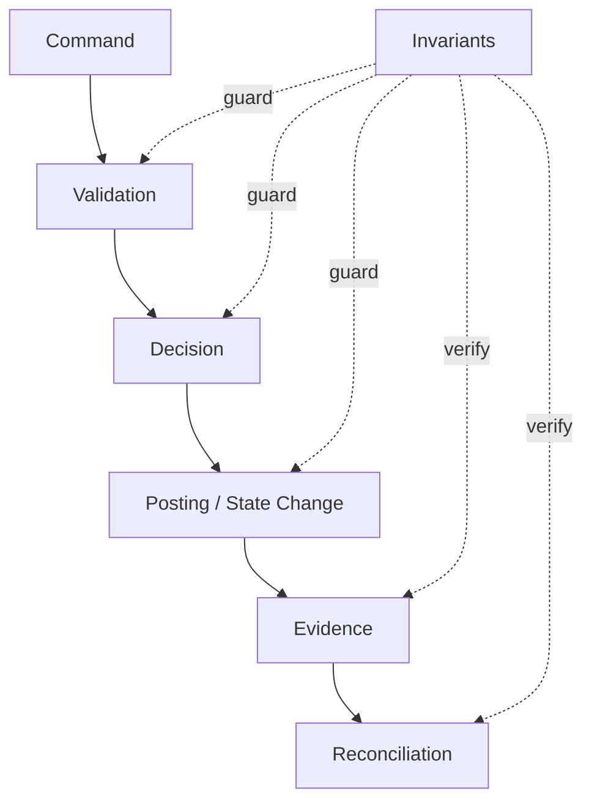
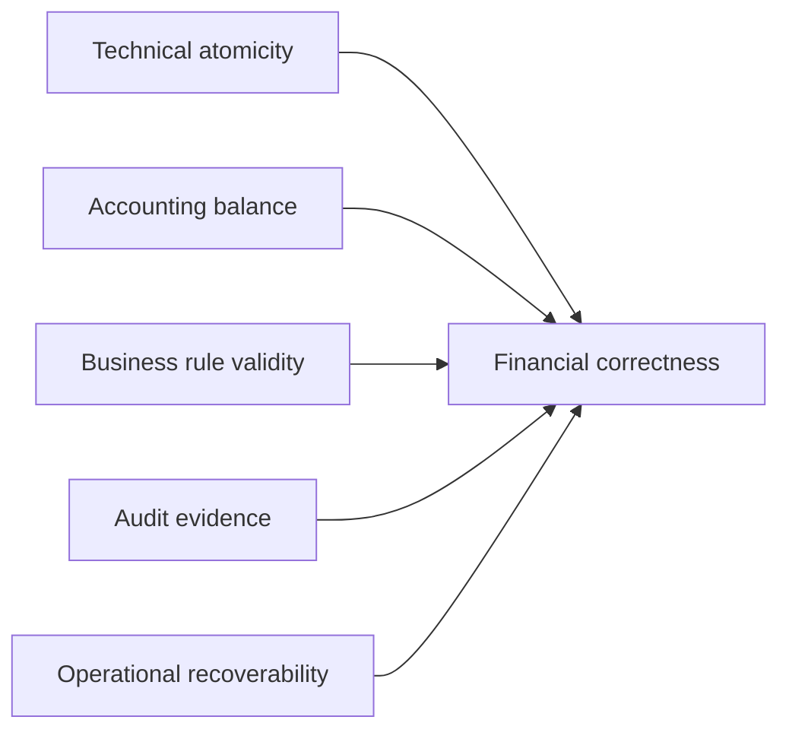
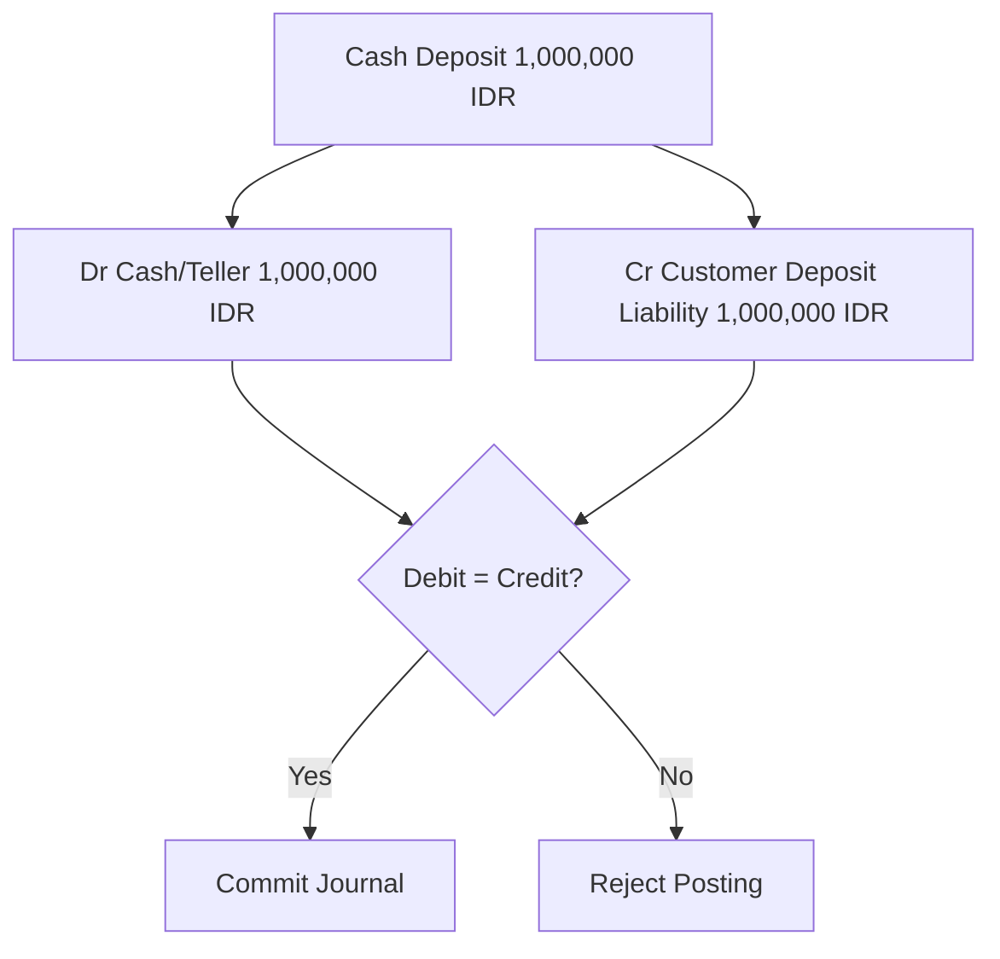
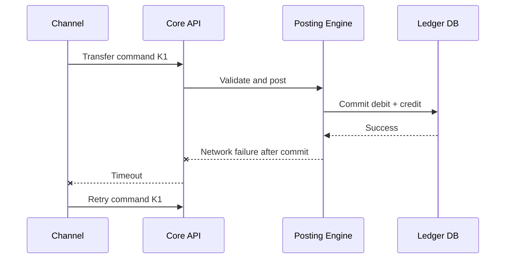
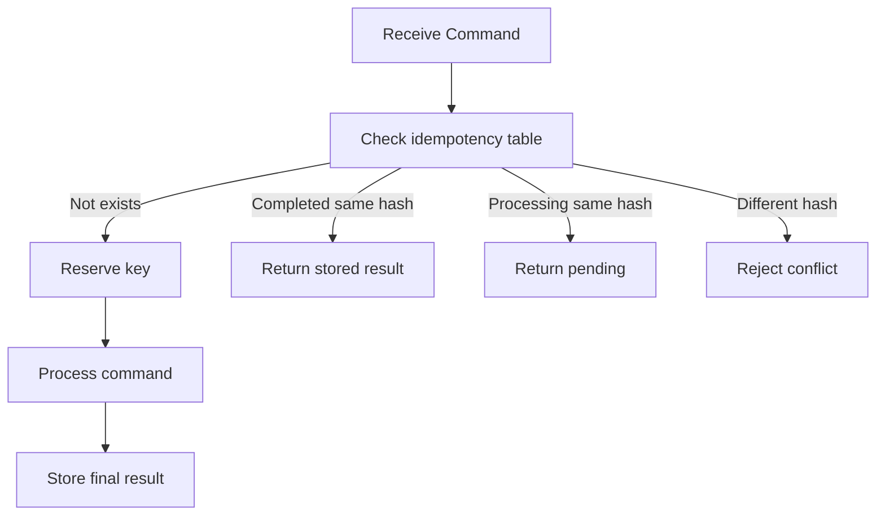
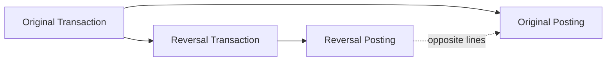
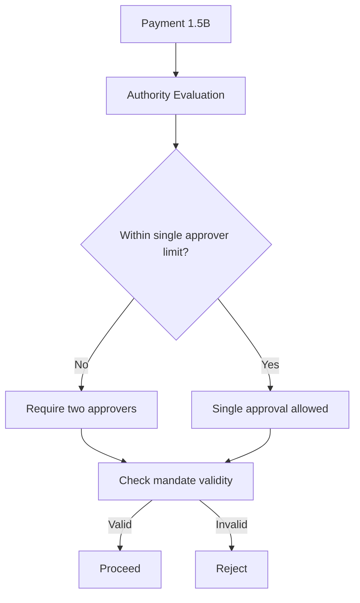
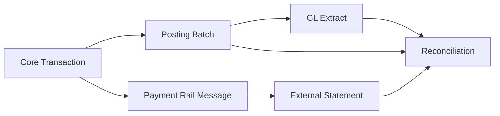
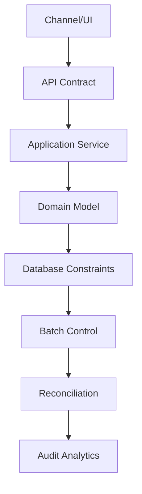
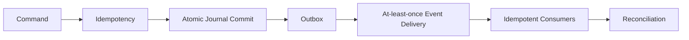

# Part 004 — Core Banking Invariants & Failure Thinking

Core banking system bukan terutama sistem yang “memproses transaksi”. Core banking system adalah sistem yang **menjaga invariant finansial** di bawah tekanan retry, timeout, concurrency, konfigurasi salah, human error, batch failure, migration, dan integrasi eksternal yang tidak selalu deterministik.

Engineer top-tier tidak hanya bertanya:

> Bagaimana cara transfer uang?

Ia bertanya:

> Apa yang tidak boleh salah ketika transfer di-retry, timeout setelah debit, response hilang, ledger berhasil tetapi event gagal, tanggal bisnis berubah, account diblokir, atau operator melakukan koreksi manual tiga hari kemudian?

Part ini membangun cara berpikir tersebut.

---

## 1. Target Pembelajaran

Setelah menyelesaikan part ini, kamu harus bisa:

1. Mendefinisikan invariant core banking yang harus selalu benar.
2. Membedakan technical correctness dan financial correctness.
3. Melihat transaksi sebagai perubahan state yang harus defensible, bukan sekadar update row.
4. Mendesain guard untuk duplicate, retry, partial failure, race condition, dan backdated operation.
5. Menentukan invariant mana yang harus enforced di Java domain layer, database, workflow, batch control, reconciliation, atau audit analytics.
6. Membaca requirement banking sebagai kumpulan failure mode.

---

## 2. Prinsip Kaufman untuk Part Ini

Skill yang didekonstruksi di sini adalah **failure reasoning**.

Untuk menjadi cepat mahir, kita pakai empat latihan:

| Latihan | Tujuan |
|---|---|
| Name the invariant | Menamai aturan yang tidak boleh dilanggar |
| Attack the invariant | Membayangkan skenario yang bisa melanggarnya |
| Place the guard | Menentukan layer perlindungan |
| Produce evidence | Menentukan bukti bahwa invariant tetap benar |

Ini lebih efektif daripada membaca daftar pattern. Core banking butuh kemampuan mengajukan pertanyaan buruk: “Bagaimana kalau ini terjadi dua kali?”, “Bagaimana kalau tanggalnya mundur?”, “Bagaimana kalau posting sukses tapi response gagal?”, “Bagaimana kalau product config berubah setelah transaksi historis?”

---

## 3. Mental Model: Core Banking adalah Invariant Machine



Setiap command harus melewati empat pertanyaan:

1. **Boleh tidak?** — authorization, status, product rule, mandate.
2. **Benar tidak?** — amount, currency, balance, value date, reference data.
3. **Aman tidak?** — duplicate, replay, concurrency, partial failure.
4. **Bisa dibuktikan tidak?** — journal, audit trail, correlation, evidence.

Jika salah satu tidak bisa dijawab, sistem belum layak disebut core banking.

---

## 4. Taxonomy Invariant Core Banking

Invariant adalah aturan yang harus selalu benar di semua state yang committed.

| Category | Contoh invariant |
|---|---|
| Accounting invariant | Posting batch harus balance per currency |
| Money invariant | Money tidak boleh floating point; currency harus eksplisit |
| Account invariant | Closed account tidak menerima customer debit/credit baru |
| Balance invariant | Available balance tidak boleh melebihi ledger balance + allowed overdraft - holds |
| Product invariant | Terms yang dipakai harus sesuai product version/effective date |
| Agreement invariant | Account operation harus berada dalam agreement yang aktif/valid |
| Authorization invariant | Actor hanya boleh melakukan operasi sesuai role/mandate/limit |
| Idempotency invariant | Command yang sama tidak menghasilkan efek finansial ganda |
| Causality invariant | Reversal harus menunjuk transaksi asli yang valid |
| Temporal invariant | Posting date, value date, dan business date harus konsisten dengan policy |
| Audit invariant | Mutasi finansial harus punya actor/source/reason/correlation |
| Reconciliation invariant | Ledger, subledger, GL extract, dan external statement harus bisa dicocokkan |
| Data lineage invariant | Angka laporan harus bisa ditelusuri ke source transaction |

---

## 5. Technical Correctness vs Financial Correctness

Kode bisa technically correct tapi financially wrong.

Contoh:

```java
@Transactional
public void transfer(Account from, Account to, BigDecimal amount) {
    from.debit(amount);
    to.credit(amount);
    accountRepository.save(from);
    accountRepository.save(to);
}
```

Secara teknis, ini terlihat atomic. Tapi secara core banking, banyak hal belum jelas:

- Apakah amount punya currency?
- Apakah debit/credit menghasilkan journal?
- Apakah debit/credit balance per currency?
- Apakah transfer duplicate bisa terjadi?
- Apakah account status mengizinkan operasi?
- Apakah actor punya mandate?
- Apakah value date valid?
- Apakah reversal bisa dilakukan?
- Apakah GL mapping tersedia?
- Apakah audit trail lengkap?

Core banking correctness adalah gabungan:



---

## 6. Accounting Invariant: Posting Harus Balance

Invariant paling dasar:

> Setiap accounting event harus menghasilkan posting lines yang total debit dan credit-nya balance per currency.



Java shape:

```java
public record Money(BigDecimal amount, Currency currency) {
    public Money {
        Objects.requireNonNull(amount, "amount");
        Objects.requireNonNull(currency, "currency");
        if (amount.scale() > currency.getDefaultFractionDigits()) {
            throw new IllegalArgumentException("Amount scale exceeds currency minor unit");
        }
    }
}

public enum DebitCredit {
    DEBIT, CREDIT
}

public record PostingLine(
        LedgerAccountId accountId,
        DebitCredit side,
        Money money
) {}
```

Balance validator:

```java
public final class PostingBatchInvariant {

    public void requireBalanced(List<PostingLine> lines) {
        Map<Currency, BigDecimal> netByCurrency = new HashMap<>();

        for (PostingLine line : lines) {
            BigDecimal signed = line.side() == DebitCredit.DEBIT
                    ? line.money().amount()
                    : line.money().amount().negate();

            netByCurrency.merge(line.money().currency(), signed, BigDecimal::add);
        }

        List<Currency> unbalanced = netByCurrency.entrySet().stream()
                .filter(e -> e.getValue().compareTo(BigDecimal.ZERO) != 0)
                .map(Map.Entry::getKey)
                .toList();

        if (!unbalanced.isEmpty()) {
            throw new DomainInvariantViolation("Posting batch is not balanced: " + unbalanced);
        }
    }
}
```

Catatan penting: implementasi nyata harus memperhatikan rounding policy, currency minor unit, GL account type, dan multi-currency accounting. Namun invariant awalnya tetap: tidak boleh commit posting yang tidak balance.

---

## 7. Money Invariant: Jangan Pakai Floating Point

Money bukan `double`.

Buruk:

```java
double balance = 1000000.10;
double fee = 0.10;
balance -= fee;
```

Lebih baik:

```java
public record MoneyAmount(BigDecimal value) {
    public MoneyAmount {
        Objects.requireNonNull(value);
    }
}
```

Namun `BigDecimal` saja tidak cukup. Money harus membawa currency dan scale policy.

Invariant:

1. Amount harus decimal exact.
2. Currency harus eksplisit.
3. Scale harus sesuai currency/product policy.
4. Rounding harus eksplisit.
5. Operasi antar-currency tidak boleh implicit.

```java
public Money add(Money other) {
    if (!currency.equals(other.currency)) {
        throw new DomainInvariantViolation("Cannot add money with different currencies");
    }
    return new Money(amount.add(other.amount), currency);
}
```

---

## 8. Idempotency Invariant: Retry Tidak Boleh Menggandakan Uang

Dalam banking, retry itu normal. Client timeout bukan berarti core gagal.

Failure scenario:



Jika retry menghasilkan posting kedua, sistem menciptakan uang movement ganda.

Invariant:

> Command dengan business identity yang sama harus menghasilkan satu financial effect.

Idempotency key harus disimpan bersama hasil command.

```java
public record IdempotencyKey(String value) {
    public IdempotencyKey {
        if (value == null || value.isBlank()) {
            throw new IllegalArgumentException("idempotency key is required");
        }
    }
}

public record CommandFingerprint(
        String sourceSystem,
        IdempotencyKey idempotencyKey,
        String canonicalPayloadHash
) {}
```

Recommended behavior:

| Case | Response |
|---|---|
| Same key, same payload, completed | Return original result |
| Same key, same payload, still processing | Return processing/pending |
| Same key, different payload | Reject as idempotency conflict |
| No key for financial command | Reject or assign controlled internal key |

Pseudo-flow:



---

## 9. Causality Invariant: Reversal Harus Punya Transaksi Asal

Reversal bukan transaksi bebas.

Invariant:

> Reversal harus menunjuk original transaction yang eligible untuk reversal, dan tidak boleh melebihi efek yang boleh dibalik.

Buruk:

```java
postDebit(account, amount, "manual reversal");
```

Lebih baik:

```java
public record ReverseTransactionCommand(
        CommandId commandId,
        TransactionId originalTransactionId,
        ReversalReason reason,
        Actor actor,
        BusinessDate businessDate,
        IdempotencyKey idempotencyKey
) {}
```

Reversal guard:

```java
public void validateReversal(Transaction original) {
    if (!original.status().isPosted()) {
        throw new DomainRuleViolation("Only posted transaction can be reversed");
    }
    if (original.isAlreadyFullyReversed()) {
        throw new DomainRuleViolation("Transaction already fully reversed");
    }
    if (!original.allowsReversal()) {
        throw new DomainRuleViolation("Transaction type does not allow reversal");
    }
}
```

Causality graph:



Tanpa causality, audit tidak bisa membedakan koreksi valid dari transaksi manual yang menyamarkan fraud.

---

## 10. Temporal Invariant: Business Date, Posting Date, Value Date

Core banking biasanya punya lebih dari satu konsep tanggal.

| Date | Arti |
|---|---|
| System time | Waktu teknis server menerima/menjalankan proses |
| Business date | Tanggal operasional bank saat transaksi diproses |
| Posting date | Tanggal transaksi dicatat di ledger/subledger |
| Value date | Tanggal nilai ekonomis mulai berlaku |
| Effective date | Tanggal aturan/kontrak/config mulai berlaku |
| Settlement date | Tanggal settlement eksternal terjadi |

Invariant:

> Tanggal harus eksplisit dan policy-driven. Jangan mencampur `LocalDate.now()` dengan business date.

Buruk:

```java
LocalDate postingDate = LocalDate.now();
```

Lebih baik:

```java
public interface BusinessCalendar {
    BusinessDate currentBusinessDate(BookingUnit bookingUnit);
    boolean isOpen(BusinessDate date, BookingUnit bookingUnit);
    BusinessDate nextBusinessDateAfter(BusinessDate date, BookingUnit bookingUnit);
}
```

Temporal failure scenario:

- transaksi diterima Jumat 23:59;
- sistem teknis sudah Sabtu 00:00 karena timezone;
- business date bank masih Jumat karena EOD belum selesai;
- value date diminta Senin;
- product rate berubah efektif Sabtu;
- fee engine harus tahu tanggal mana yang dipakai untuk aturan mana.

Ini tidak bisa diselesaikan dengan `now()`.

---

## 11. Lifecycle Invariant: Status Membatasi Operasi

Account status harus membatasi operation.

Invariant:

> Tidak semua command valid untuk semua status.

Contoh matrix:

| Account Status | Customer Credit | Customer Debit | Interest Accrual | Fee Posting | Closure |
|---|---:|---:|---:|---:|---:|
| PendingOpening | No | No | No | No | No |
| Active | Yes | Yes | Yes | Yes | Yes |
| Restricted | Depends | Depends | Depends | Depends | Depends |
| Dormant | Limited | Usually no | Depends | Depends | Yes |
| PendingClosure | Limited | Limited | Final only | Final only | Yes |
| Closed | No | No | No | No | No |

Java style:

```java
public enum AccountStatus {
    PENDING_OPENING,
    ACTIVE,
    RESTRICTED,
    DORMANT,
    PENDING_CLOSURE,
    CLOSED;

    public boolean allows(Operation operation) {
        return switch (this) {
            case PENDING_OPENING, CLOSED -> false;
            case ACTIVE -> true;
            case DORMANT -> operation.isDormancyAllowed();
            case RESTRICTED -> operation.requiresRestrictionEvaluation();
            case PENDING_CLOSURE -> operation.isClosureRelated();
        };
    }
}
```

Jangan menyebar status check dalam `if` random di banyak service. Buat policy yang bisa diuji.

---

## 12. Authorization Invariant: Actor, Mandate, Limit

Dalam core banking, “user authenticated” belum tentu “boleh melakukan operasi”.

Invariant:

> Actor harus memiliki authority yang valid pada saat operasi, untuk account/agreement/party/context/amount yang spesifik.

Contoh corporate account:



Authority bukan sekadar role global seperti `ROLE_TELLER`.

Authority dipengaruhi:

- account;
- party relationship;
- mandate;
- limit;
- operation type;
- amount;
- currency;
- branch/booking unit;
- time validity;
- maker-checker segregation.

---

## 13. Product/Agreement Invariant

Product rule tidak boleh dibaca secara ambigu.

Invariant:

> Setiap financial calculation harus bisa menjelaskan product terms/agreement terms yang dipakai.

Contoh failure:

- monthly fee berubah 1 Juli;
- nasabah lama grandfathered sampai 31 Desember;
- batch fee run pada 5 Juli menghitung semua account dengan fee baru;
- customer complaint muncul;
- auditor bertanya kenapa fee berubah.

Jika agreement tidak menyimpan applicable terms, sulit membuktikan angka.

Guard:

```java
public interface AgreementTermsResolver {
    AgreementTerms resolveFor(
            AgreementId agreementId,
            BusinessDate businessDate,
            OperationType operationType
    );
}
```

---

## 14. Balance Invariant: Ledger, Available, Hold, Overdraft

Balance bukan satu angka.

| Balance type | Arti |
|---|---|
| Ledger balance | Posisi berdasarkan posted journal |
| Available balance | Jumlah yang boleh dipakai customer |
| Collected balance | Dana yang sudah cleared/collected |
| Blocked/hold amount | Dana yang ditahan |
| Overdraft limit | Limit negatif yang diizinkan |
| Uncleared amount | Dana masuk belum final |

Invariant sederhana:

```txt
available = ledger + allowedOverdraft - holds - unclearedRestrictions +/- productSpecificAdjustments
```

Tapi formula nyata bergantung produk.

Contoh available balance policy:

```java
public interface AvailableBalancePolicy {
    Money calculate(Account account, LedgerBalance ledgerBalance, List<Hold> holds, BusinessDate date);
}
```

Failure scenario:

1. Card authorization membuat hold 500.000.
2. Customer transfer keluar 800.000.
3. Ledger balance 1.000.000.
4. Jika sistem hanya cek ledger balance, transfer diizinkan.
5. Saat capture card masuk, account overdraft tidak sah.

---

## 15. Reconciliation Invariant

Core banking tidak hidup sendiri. Ia harus bisa dicocokkan dengan GL, payment rail, statement, partner, dan data warehouse.

Invariant:

> Setiap financial movement harus punya reconciliation identity dan lifecycle yang dapat dilacak.

Minimal fields:

- transaction id;
- posting batch id;
- external reference;
- source system;
- channel;
- settlement reference;
- GL batch id;
- business date;
- value date;
- amount/currency;
- status;
- reversal/correction link.



Reconciliation bukan afterthought. Kalau ID dan lifecycle tidak didesain dari awal, operasi akan bergantung pada spreadsheet manual.

---

## 16. Audit Invariant: Financial Mutation Harus Punya Evidence

Invariant:

> Setiap perubahan finansial atau operationally significant harus menjelaskan actor, authority, source, reason, waktu, dan dampak.

Audit event minimal:

```java
public record AuditEnvelope(
        AuditEventId id,
        Instant occurredAt,
        BusinessDate businessDate,
        Actor actor,
        String sourceSystem,
        String sourceChannel,
        String correlationId,
        String reasonCode,
        Map<String, String> evidence
) {}
```

Untuk core banking, audit log bukan `logger.info`. Audit adalah domain evidence.

Bedakan:

| Log | Audit Evidence |
|---|---|
| Untuk engineer/debugging | Untuk business/regulator/forensics |
| Bisa verbose/noisy | Harus bermakna dan tahan lama |
| Bisa berubah format | Harus stabil dan queryable |
| Tidak selalu complete | Harus menjelaskan keputusan penting |

---

## 17. Where to Enforce Invariants

Tidak semua invariant harus ditempatkan di satu layer.



| Invariant | Layer utama | Layer tambahan |
|---|---|---|
| Required command fields | API contract | Application validation |
| Money currency/scale | Domain value object | DB constraint |
| Posting balance | Domain posting engine | DB transaction guard, reconciliation |
| Idempotency | Application service | Unique DB constraint |
| Account status operation | Domain policy | Workflow/UI hints |
| Duplicate external reference | Application service | Unique DB constraint |
| GL mapping exists | Domain/config validation | EOD control |
| Product effective dating | Product config governance | Runtime resolver |
| Audit completeness | Application/domain event | Audit analytics |
| Reconciliation completeness | Batch/recon engine | Ops dashboard |

Rule of thumb:

> Invariant yang melindungi uang harus memiliki lebih dari satu guard.

Contoh idempotency:

- application checks idempotency key;
- database has unique constraint;
- posting journal has natural business reference;
- reconciliation can detect duplicate financial effect.

---

## 18. Failure Scenario Library

### 18.1 Duplicate Transfer Because Timeout

**Scenario**: channel timeout setelah core commit.

Invariant yang diserang:

- idempotency;
- money conservation;
- audit causality.

Guard:

- idempotency key;
- command fingerprint;
- stored result;
- posting natural reference unique constraint.

### 18.2 Concurrent Withdrawal on Same Account

**Scenario**: dua debit besar diproses bersamaan.

Invariant yang diserang:

- available balance;
- account-level serialization;
- overdraft limit.

Guard:

- account-level lock/serialization;
- optimistic version;
- balance check inside same transaction as posting;
- deterministic retry.

### 18.3 Product Rate Changed During Batch

**Scenario**: interest batch berjalan saat rate config berubah.

Invariant yang diserang:

- agreement terms;
- effective dating;
- batch repeatability.

Guard:

- batch parameter snapshot;
- business date lock;
- approved effective date;
- run manifest.

### 18.4 Backdated Transaction After EOD

**Scenario**: operator input value date kemarin setelah EOD selesai.

Invariant yang diserang:

- temporal consistency;
- interest accrual;
- GL reporting;
- statement.

Guard:

- backdated policy;
- approval;
- adjustment posting;
- impacted period recalculation;
- audit reason.

### 18.5 Ledger Posted, Event Publish Failed

**Scenario**: journal commit berhasil, downstream notification gagal.

Invariant yang diserang:

- downstream consistency;
- event completeness;
- reconciliation.

Guard:

- transactional outbox;
- event replay;
- projection rebuild;
- event publication monitor.

### 18.6 Manual Repair Without Causality

**Scenario**: operator membuat manual posting untuk memperbaiki selisih.

Invariant yang diserang:

- causality;
- audit trail;
- fraud control.

Guard:

- repair case ID;
- maker-checker;
- original transaction link;
- reason code;
- evidence attachment;
- supervisor approval.

---

## 19. Invariant-First Design Template

Sebelum membangun feature, isi template ini.

```md
## Feature
Internal transfer between own accounts.

## Financial effect
Debit source deposit liability, credit target deposit liability.

## Invariants
- Command must be idempotent.
- Source and target account must be active.
- Source and target currency must match unless FX flow is used.
- Actor must have authority on source account.
- Available balance must be sufficient.
- Posting batch must balance.
- Audit evidence must include actor/source/reason/correlation.

## Failure modes
- Duplicate retry.
- Timeout after commit.
- Source account blocked after validation before posting.
- Concurrent debit changes balance.
- Target account closed during processing.
- Event publish failed.

## Guards
- Idempotency table with payload hash.
- Account lock or optimistic version.
- Status validation inside transaction.
- Posting batch invariant.
- Transactional outbox.
- Audit envelope.

## Evidence
- Command record.
- Posting batch.
- Journal lines.
- Account balance snapshot/projection.
- Audit event.
- Outbox event.
```

Gunakan template ini untuk semua fitur finansial.

---

## 20. Java Pattern: Invariant as First-Class Policy

Jangan taruh semua rule dalam satu service besar.

```java
public interface Invariant<T> {
    void check(T target) throws DomainInvariantViolation;
}
```

Posting invariant:

```java
public final class BalancedPostingInvariant implements Invariant<PostingBatch> {
    @Override
    public void check(PostingBatch batch) {
        // validate debit/credit per currency
    }
}
```

Account operation invariant:

```java
public final class AccountOperationAllowedInvariant implements Invariant<AccountOperationContext> {
    @Override
    public void check(AccountOperationContext ctx) {
        if (!ctx.account().canAccept(ctx.operation(), ctx.businessDate())) {
            throw new DomainInvariantViolation("Account does not allow operation");
        }
    }
}
```

Composition:

```java
public final class InvariantSuite<T> {
    private final List<Invariant<T>> invariants;

    public void checkAll(T target) {
        for (Invariant<T> invariant : invariants) {
            invariant.check(target);
        }
    }
}
```

Pattern ini membuat invariant:

- eksplisit;
- testable;
- reusable;
- mudah direview;
- bisa dipetakan ke requirement/regulatory control.

---

## 21. Property-Based Thinking untuk Ledger

Kita akan bahas testing lebih dalam di Part 034, tetapi invariant harus mulai dipikirkan dari sekarang.

Contoh property:

1. Untuk setiap posting batch valid, total debit = total credit per currency.
2. Reversal dari transaksi posted menghasilkan net effect nol terhadap transaksi original.
3. Retry command idempotent tidak menambah jumlah journal line finansial.
4. Closed account tidak pernah memiliki customer-initiated posting baru setelah closure date.
5. Backdated posting selalu menghasilkan audit reason dan impacted period marker.

Pseudo-test:

```java
@Property
void balancedBatchAlwaysHasZeroNetEffect(@ForAll("validPostingBatches") PostingBatch batch) {
    assertThat(batch.netByCurrency()).allSatisfy((currency, net) ->
            assertThat(net).isEqualByComparingTo(BigDecimal.ZERO)
    );
}
```

Property-based testing membantu menemukan skenario yang tidak terpikir saat menulis example-based test biasa.

---

## 22. Operational Evidence

Invariant yang tidak bisa dibuktikan akan menjadi masalah saat incident.

Untuk setiap transaksi finansial, minimal evidence pack:

```txt
Command ID
Idempotency key
Canonical payload hash
Actor
Source system/channel
Business date
Value date
Transaction ID
Posting batch ID
Posting line IDs
Original/reversal link if any
Account IDs
Ledger account IDs
Product/agreement terms version
Authorization decision
Risk/fraud decision if applicable
Audit event ID
Outbox event ID
GL extract batch if already handed off
```

Jika evidence ini tersebar tanpa correlation, incident response akan lambat dan mahal.

---

## 23. Anti-Pattern: “Nanti Direconcile”

Kalimat berbahaya:

> Kalau ada selisih, nanti reconciliation yang tangkap.

Reconciliation adalah detector dan control, bukan pengganti correctness.

Desain buruk:

- posting tidak balance tapi dibiarkan;
- duplicate mungkin terjadi tapi dianggap nanti ketahuan;
- manual repair bebas tanpa original transaction link;
- GL extract bisa berbeda dari ledger tanpa hard stop.

Desain baik:

- invariant mencegah kesalahan sebelum commit;
- reconciliation mendeteksi error yang lolos karena integrasi/manual/batch/external mismatch;
- repair selalu causal, approved, dan auditable.

---

## 24. Anti-Pattern: “Exactly Once” Sebagai Iman

Dalam distributed system, exactly-once sering menjadi ilusi jika dilihat end-to-end.

Untuk core banking, pendekatan yang lebih defensible:

- command idempotent;
- posting atomic;
- journal append-only;
- outbox reliable;
- consumer idempotent;
- reconciliation detects gaps;
- audit explains decisions.



Jangan menjual “exactly once” sebagai jaminan tunggal. Jual invariant + idempotency + reconciliation + evidence.

---

## 25. Review Checklist

Gunakan checklist ini untuk setiap design review core banking.

### Financial Correctness

- Apakah financial effect ditulis sebagai debit/credit lines?
- Apakah posting balance per currency?
- Apakah amount/currency/rounding eksplisit?
- Apakah GL mapping tersedia sebelum posting?

### Idempotency & Retry

- Apakah command punya idempotency key?
- Apakah payload hash dibandingkan?
- Apakah retry mengembalikan result yang sama?
- Apakah duplicate external reference dicegah?

### Lifecycle & Authorization

- Apakah account/agreement/product status divalidasi?
- Apakah actor authority/mandate valid pada business date?
- Apakah maker-checker dibutuhkan untuk override/manual action?

### Temporal Correctness

- Apakah business date eksplisit?
- Apakah value date policy jelas?
- Apakah backdated operation punya approval dan impacted-period handling?
- Apakah product terms resolved berdasarkan effective date?

### Audit & Evidence

- Apakah audit event bukan sekadar application log?
- Apakah mutation punya actor/source/reason/correlation?
- Apakah reversal punya original transaction link?
- Apakah angka laporan bisa ditelusuri ke journal?

### Recoverability

- Apakah partial failure setelah commit ditangani?
- Apakah event publish memakai outbox/retry?
- Apakah batch bisa restart tanpa double-posting?
- Apakah reconciliation bisa mendeteksi gap?

---

## 26. Latihan Praktik

### Latihan 1 — Timeout Transfer

Requirement:

> Mobile banking mengirim transfer internal. Core berhasil commit, tetapi response timeout. Mobile retry dengan payload sama.

Jawab:

1. Invariant apa yang harus dijaga?
2. Data apa yang disimpan sebelum processing?
3. Apa response untuk retry?
4. Apa yang terjadi jika payload sama key berbeda?
5. Apa yang terjadi jika key sama payload berbeda?

### Latihan 2 — Concurrent Debit

Requirement:

> Account punya ledger balance 1 juta dan hold 300 ribu. Dua withdrawal 600 ribu masuk hampir bersamaan.

Jawab:

1. Available balance berapa?
2. Apakah dua-duanya boleh sukses?
3. Guard apa yang dibutuhkan?
4. Di layer mana guard ditempatkan?
5. Evidence apa yang harus tersedia jika salah satu ditolak?

### Latihan 3 — Backdated Fee Correction

Requirement:

> Fee tanggal 25 salah karena product config salah. Kesalahan ditemukan tanggal 28 setelah EOD.

Jawab:

1. Apakah boleh update posting tanggal 25 langsung?
2. Apakah perlu reversal atau adjustment?
3. Tanggal apa saja yang harus dicatat?
4. Report/GL mana yang terdampak?
5. Evidence apa yang dibutuhkan?

---

## 27. Self-Correction Questions

Kamu memahami part ini jika bisa menjawab:

1. Apa bedanya technical atomicity dan financial correctness?
2. Kenapa posting harus balance per currency?
3. Kenapa idempotency key harus dikombinasikan dengan payload hash?
4. Kenapa reversal harus causal?
5. Kenapa `LocalDate.now()` berbahaya di core banking?
6. Kenapa account status check harus domain policy, bukan if tersebar?
7. Kenapa audit evidence berbeda dari log aplikasi?
8. Kenapa reconciliation bukan pengganti invariant?
9. Kenapa exactly-once end-to-end sering misleading?
10. Di mana sebaiknya invariant ditempatkan: Java, database, workflow, batch, atau recon?

---

## 28. Ringkasan

Core banking harus dipikirkan sebagai mesin penjaga invariant.

Invariant paling penting:

- money harus exact dan currency-aware;
- posting harus balance;
- command harus idempotent;
- reversal harus causal;
- account/agreement/product lifecycle harus dihormati;
- actor harus authorized;
- business date/value date harus eksplisit;
- financial mutation harus punya audit evidence;
- ledger harus bisa direconcile;
- angka laporan harus punya lineage.

Part berikutnya akan mulai masuk ke fondasi ledger: money, double-entry accounting model, journal, posting line, account type, dan bagaimana engineer Java harus menalar debit/credit tanpa menjadi accountant penuh.

---

## References

- BCBS 239, *Principles for effective risk data aggregation and risk reporting*, sebagai konteks completeness, accuracy, timeliness, adaptability, dan lineage.
- FFIEC IT Examination Handbook: Architecture, Infrastructure, and Operations, sebagai konteks governance, availability, resilience, operations, change, dan control.
- ISO 20022 official message definitions, sebagai konteks canonical financial messaging dan lifecycle traceability pada integrasi payment/cash management.
- OpenTelemetry documentation, sebagai konteks telemetry modern untuk correlation, traces, metrics, dan logs; audit evidence tetap harus dipisahkan dari observability log.
