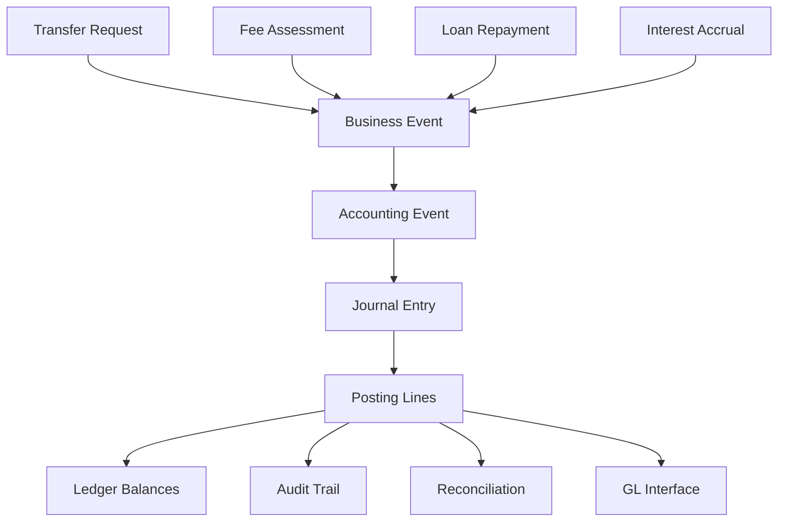
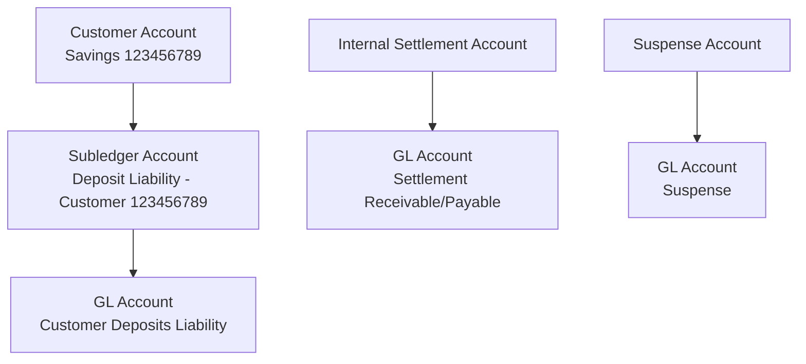
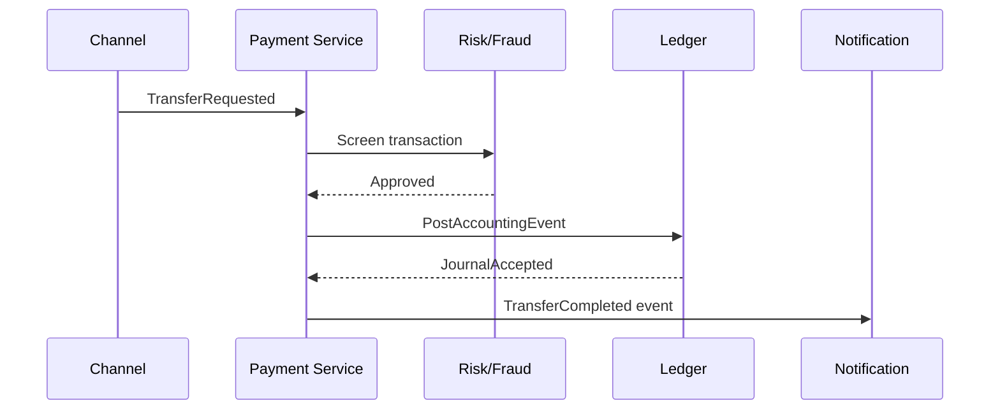
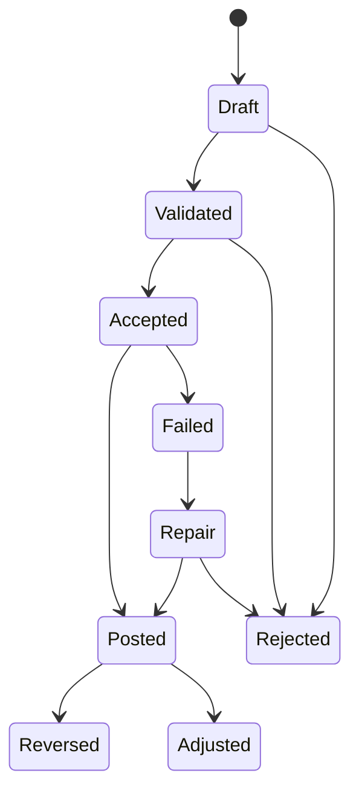
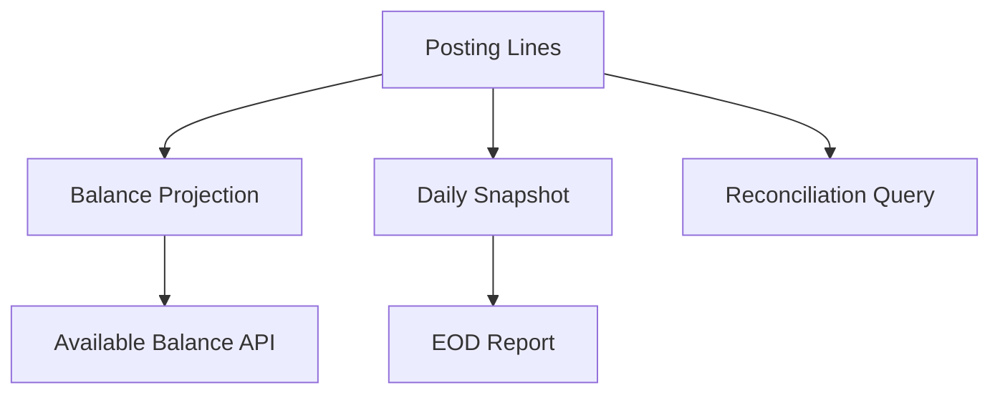
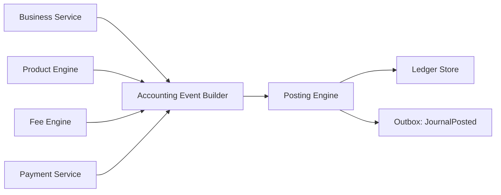

# Part 005 — Money, Ledger, and Double-Entry Accounting Model

> Target: memahami fondasi ledger untuk engineer. Fokus: debit/credit, asset/liability/income/expense/equity, journal, posting line, balancing rule, dan accounting event.

Core banking yang benar bukan pertama-tama soal REST API, Kafka, SQL, atau microservice. Intinya adalah **sistem pencatatan nilai**. Setiap fitur — transfer, cash deposit, loan repayment, fee, interest accrual, tax withholding, reversal, settlement — akhirnya harus menjawab satu pertanyaan:

> Apakah nilai yang berpindah sudah dicatat lengkap, seimbang, dapat diaudit, dan dapat dijelaskan ulang beberapa tahun kemudian?

Pada bagian ini kita membangun fondasi ledger. Kita tidak akan mengulang Java basic, SQL transaction, concurrency, observability, atau error-handling umum. Kita akan fokus ke domain mechanics yang membuat core banking berbeda dari sistem enterprise biasa.

---

## 1. Kaufman Deconstruction untuk Ledger Skill

Dalam gaya *The First 20 Hours*, skill besar “menguasai core banking ledger” harus dipecah menjadi sub-skill kecil yang bisa dilatih dan dikoreksi.

| Sub-skill | Pertanyaan self-correction |
|---|---|
| Memahami money representation | Apakah amount selalu punya currency, scale, rounding policy, dan precision yang benar? |
| Memahami debit/credit | Apakah saya tahu sisi mana yang bertambah untuk asset, liability, income, expense, dan equity? |
| Memodelkan journal entry | Apakah setiap accounting event menghasilkan posting lines yang balance? |
| Membedakan account vs ledger account | Apakah customer account tidak saya campur dengan chart-of-account GL account? |
| Menjaga ledger invariant | Apakah total debit = total credit untuk setiap journal? |
| Mendesain reversal | Apakah koreksi dilakukan dengan entry baru, bukan mengubah sejarah? |
| Menjelaskan balance | Apakah balance berasal dari posting, bukan angka magic yang diedit langsung? |

Latihan terbaik untuk part ini adalah membuat mini-ledger engine yang hanya punya tiga operasi:

1. create journal entry,
2. validate balanced posting,
3. derive account balance from postings.

Kalau tiga hal ini belum benar, jangan masuk ke interest engine, loan schedule, settlement, atau EOD.

---

## 2. Mental Model: Ledger adalah Mesin Kebenaran Finansial

Ledger bukan sekadar tabel transaksi. Ledger adalah **canonical record of financial truth**.



Contoh business event:

```txt
Customer A transfers IDR 100,000 to Customer B.
```

Accounting event-nya bukan sekadar “transfer successful”. Ia harus menghasilkan entry yang menjelaskan:

```txt
Debit  Customer A deposit liability account   IDR 100,000
Credit Customer B deposit liability account   IDR 100,000
```

Namun di accounting bank, interpretasi debit/credit berbeda dari intuisi user. Bagi customer, saldo A turun. Bagi bank, dana simpanan customer adalah **liability**. Ketika liability turun, sisi debit bertambah terhadap account liability tersebut. Ketika liability naik, sisi credit bertambah.

---

## 3. Core Distinction: Customer Account vs Ledger Account vs GL Account

Kesalahan umum engineer adalah menganggap “account” cuma satu jenis. Dalam core banking, minimal ada tiga konsep yang harus dipisahkan.

| Konsep | Makna | Contoh |
|---|---|---|
| Customer account | Rekening yang dilihat nasabah | Savings `123-456-789` |
| Internal ledger account | Ledger node operasional untuk posting | Settlement clearing account, suspense account |
| GL account / chart of account | Account akuntansi untuk laporan keuangan | Customer Deposits Liability, Fee Income, Cash in Vault |

Satu customer account bisa dipetakan ke satu atau lebih ledger dimensions. Banyak customer accounts bisa roll up ke satu GL account.



**Rule:** customer account adalah produk dan kontrak. Ledger account adalah tempat mencatat nilai. GL account adalah klasifikasi pelaporan keuangan.

Ketiganya boleh terhubung, tetapi tidak boleh dilebur menjadi satu model besar tanpa batas.

---

## 4. Accounting Elements yang Perlu Dipahami Engineer

Standar akuntansi mendefinisikan elemen financial statement seperti asset, liability, equity, income, dan expenses. Untuk engineer, elemen-elemen ini penting karena menentukan **normal balance** dan bagaimana debit/credit memengaruhi saldo.

| Element | Makna sederhana dalam bank | Normal side | Bertambah dengan | Berkurang dengan |
|---|---|---:|---:|---:|
| Asset | Sesuatu yang bank miliki atau klaim | Debit | Debit | Credit |
| Liability | Kewajiban bank kepada pihak lain | Credit | Credit | Debit |
| Equity | Hak residual pemilik | Credit | Credit | Debit |
| Income | Pendapatan bank | Credit | Credit | Debit |
| Expense | Beban bank | Debit | Debit | Credit |

Contoh:

- Cash in vault adalah asset bank.
- Loan principal outstanding adalah asset bank karena nasabah berutang kepada bank.
- Deposit nasabah adalah liability bank karena bank berutang kepada nasabah.
- Fee income adalah income.
- Interest expense untuk deposito adalah expense.

Kesalahan mental model yang sering terjadi:

> “Saldo rekening nasabah naik berarti debit.”

Tidak selalu. Untuk deposit account, saldo nasabah naik berarti liability bank naik, sehingga posting-nya credit ke deposit liability account.

---

## 5. Debit dan Credit: Jangan Diartikan sebagai Plus dan Minus

Debit dan credit bukan sinonim plus/minus. Keduanya adalah **sisi pencatatan**.

Cara aman menalar:

1. Tentukan jenis account: asset, liability, income, expense, equity.
2. Tentukan apakah account tersebut bertambah atau berkurang.
3. Gunakan normal side.

Contoh deposit tunai IDR 1,000,000:

| Line | Account | Type | Side | Amount | Reason |
|---:|---|---|---|---:|---|
| 1 | Cash in Vault | Asset | Debit | 1,000,000 | Asset bank naik |
| 2 | Customer Deposit | Liability | Credit | 1,000,000 | Liability bank ke nasabah naik |

Contoh penarikan tunai IDR 500,000:

| Line | Account | Type | Side | Amount | Reason |
|---:|---|---|---|---:|---|
| 1 | Customer Deposit | Liability | Debit | 500,000 | Liability bank turun |
| 2 | Cash in Vault | Asset | Credit | 500,000 | Asset kas turun |

Contoh fee bulanan IDR 10,000 dari rekening tabungan:

| Line | Account | Type | Side | Amount | Reason |
|---:|---|---|---|---:|---|
| 1 | Customer Deposit | Liability | Debit | 10,000 | Bank mengurangi kewajiban ke nasabah |
| 2 | Fee Income | Income | Credit | 10,000 | Pendapatan bank naik |

---

## 6. Money Representation: Amount Bukan `double`

Dalam core banking, `double` atau `float` tidak boleh menjadi representasi uang karena floating-point binary dapat menghasilkan rounding yang tidak cocok untuk nilai finansial.

Gunakan mental model:

```txt
Money = currency + amount minor unit / decimal amount + scale policy + rounding policy
```

Ada dua pendekatan umum.

### 6.1 Minor Unit Long

```java
public record Money(
    String currency,
    long minorUnits
) {
    public Money {
        if (currency == null || currency.length() != 3) {
            throw new IllegalArgumentException("currency must be ISO-4217 alpha code");
        }
    }
}
```

Contoh:

```txt
IDR 10,000 -> minorUnits = 10000 if currency has 0 minor decimals
USD 10.25 -> minorUnits = 1025 if currency has 2 minor decimals
BHD 10.250 -> minorUnits = 10250 if currency has 3 minor decimals
```

Kelebihan:

- cepat,
- mudah dibandingkan,
- cocok untuk posting ledger,
- menghindari floating-point problem.

Kekurangan:

- butuh metadata minor unit per currency,
- interest accrual kadang butuh intermediate precision lebih tinggi,
- beberapa currency/product punya aturan rounding khusus.

### 6.2 BigDecimal dengan Money Policy

```java
import java.math.BigDecimal;
import java.math.RoundingMode;

public record Money(
    String currency,
    BigDecimal amount
) {
    public Money {
        if (currency == null || currency.length() != 3) {
            throw new IllegalArgumentException("currency must be ISO-4217 alpha code");
        }
        if (amount == null) {
            throw new IllegalArgumentException("amount is required");
        }
        amount = amount.stripTrailingZeros();
    }

    public Money add(Money other) {
        requireSameCurrency(other);
        return new Money(currency, amount.add(other.amount));
    }

    public Money subtract(Money other) {
        requireSameCurrency(other);
        return new Money(currency, amount.subtract(other.amount));
    }

    public Money round(int scale, RoundingMode mode) {
        return new Money(currency, amount.setScale(scale, mode));
    }

    private void requireSameCurrency(Money other) {
        if (!currency.equals(other.currency)) {
            throw new IllegalArgumentException("currency mismatch: " + currency + " vs " + other.currency);
        }
    }
}
```

Kelebihan:

- cocok untuk interest, tax, fee, FX intermediate calculation,
- eksplisit terhadap scale,
- mudah dibaca.

Kekurangan:

- harus disiplin pada scale/rounding,
- equality bisa tricky bila tidak dinormalisasi,
- performa lebih rendah dari long minor unit untuk volume ekstrem.

### 6.3 Rule Praktis

Untuk core banking ledger:

- Posting final sebaiknya sudah dalam precision final currency/product.
- Perhitungan intermediate boleh memakai precision lebih tinggi.
- Rounding harus dilakukan pada boundary yang disepakati, bukan sembarang di tengah pipeline.
- Currency tidak boleh hilang dari amount.
- Tidak boleh menjumlahkan amount beda currency tanpa FX event eksplisit.

---

## 7. Currency, Scale, dan ISO 4217

Currency bukan string dekoratif. Currency menentukan:

- minor unit,
- settlement rule,
- rounding rule,
- GL mapping,
- product eligibility,
- regulatory reporting dimension,
- FX conversion boundary.

ISO 4217 menyediakan kode mata uang dan hubungan terhadap minor unit. Namun sistem bank tetap perlu menyimpan **effective-dated currency metadata** karena aturan produk, payment network, atau regulator lokal bisa punya deviasi operasional.

Contoh model:

```java
public record CurrencyDefinition(
    String code,
    int standardMinorUnit,
    boolean active,
    String countryCode
) {}

public record CurrencyPolicy(
    String currency,
    int postingScale,
    int calculationScale,
    RoundingMode postingRoundingMode,
    RoundingMode taxRoundingMode
) {}
```

Jangan hardcode:

```java
// Bad
amount.setScale(2, RoundingMode.HALF_UP);
```

Lebih baik:

```java
Money postedAmount = calculationResult.round(
    currencyPolicy.postingScale(),
    currencyPolicy.postingRoundingMode()
);
```

Untuk Indonesia misalnya, IDR secara operasional biasanya tidak memiliki sen dalam transaksi ritel modern, tetapi sistem tetap harus berhati-hati karena integrasi, pajak, akrual, atau laporan bisa menggunakan presisi intermediate.

---

## 8. Journal Entry: Unit Atomik Accounting

**Journal entry** adalah satu paket posting lines yang berasal dari satu accounting event dan harus balance.

Minimal field:

```txt
journal_id
business_event_id
transaction_reference
business_date
posting_date
value_date
currency
status
created_at
created_by
source_system
correlation_id
```

Posting line minimal:

```txt
posting_line_id
journal_id
line_no
ledger_account_id
customer_account_id nullable
side debit/credit
amount
currency
account_type
product_code nullable
branch_code
cost_center nullable
narrative
```

Kenapa journal entry harus menjadi unit atomik?

Karena setengah jurnal adalah kebohongan finansial.

Kalau transfer internal IDR 100,000 hanya mencatat debit dari account A tetapi gagal mencatat credit ke account B, sistem sudah melanggar money conservation. Karena itu semua posting line dalam satu journal harus commit atau rollback bersama.

---

## 9. Balanced Journal Invariant

Invariant paling penting:

```txt
For every journal entry and currency:
SUM(debit amount) == SUM(credit amount)
```

Jika journal multi-currency, balancing harus ditangani per currency atau melalui FX position account yang eksplisit. Jangan “balance” IDR debit dengan USD credit tanpa FX event.

```java
public enum PostingSide {
    DEBIT,
    CREDIT
}

public enum AccountType {
    ASSET,
    LIABILITY,
    EQUITY,
    INCOME,
    EXPENSE
}

public record PostingLine(
    String ledgerAccountId,
    AccountType accountType,
    PostingSide side,
    Money amount,
    String narrative
) {
    public PostingLine {
        if (amount.amount().signum() <= 0) {
            throw new IllegalArgumentException("posting amount must be positive");
        }
    }
}

public record JournalEntry(
    String journalId,
    String accountingEventId,
    String businessDate,
    List<PostingLine> lines
) {
    public JournalEntry {
        if (lines == null || lines.size() < 2) {
            throw new IllegalArgumentException("journal must have at least two lines");
        }
        validateBalancedByCurrency(lines);
    }

    private static void validateBalancedByCurrency(List<PostingLine> lines) {
        Map<String, BigDecimal> debit = new HashMap<>();
        Map<String, BigDecimal> credit = new HashMap<>();

        for (PostingLine line : lines) {
            String currency = line.amount().currency();
            BigDecimal amount = line.amount().amount();

            if (line.side() == PostingSide.DEBIT) {
                debit.merge(currency, amount, BigDecimal::add);
            } else {
                credit.merge(currency, amount, BigDecimal::add);
            }
        }

        Set<String> currencies = new HashSet<>();
        currencies.addAll(debit.keySet());
        currencies.addAll(credit.keySet());

        for (String currency : currencies) {
            BigDecimal d = debit.getOrDefault(currency, BigDecimal.ZERO);
            BigDecimal c = credit.getOrDefault(currency, BigDecimal.ZERO);
            if (d.compareTo(c) != 0) {
                throw new IllegalArgumentException(
                    "unbalanced journal for " + currency + ": debit=" + d + ", credit=" + c
                );
            }
        }
    }
}
```

Catatan desain:

- Posting amount selalu positif.
- Side menentukan debit/credit.
- Jangan simpan amount negatif untuk membedakan debit/credit.
- Jika perlu signed balance, turunkan dari side + account type.

---

## 10. Sign Convention: Posting Line vs Balance View

Posting line sebaiknya tidak menggunakan amount negatif. Namun balance view sering butuh signed amount.

Formula umum:

```txt
Asset:     debit +, credit -
Expense:   debit +, credit -
Liability: credit +, debit -
Equity:    credit +, debit -
Income:    credit +, debit -
```

```java
public final class BalanceMath {
    private BalanceMath() {}

    public static BigDecimal signedImpact(PostingLine line) {
        boolean debitNormal = switch (line.accountType()) {
            case ASSET, EXPENSE -> true;
            case LIABILITY, EQUITY, INCOME -> false;
        };

        boolean increasesBalance =
            (debitNormal && line.side() == PostingSide.DEBIT) ||
            (!debitNormal && line.side() == PostingSide.CREDIT);

        BigDecimal amount = line.amount().amount();
        return increasesBalance ? amount : amount.negate();
    }
}
```

Dengan pendekatan ini, posting tetap bersih, sedangkan balance calculation eksplisit.

---

## 11. Accounting Event vs Business Event

Business event menjelaskan kejadian bisnis. Accounting event menjelaskan dampak finansialnya.

| Business event | Accounting event |
|---|---|
| Customer transfers money | Move deposit liability from sender to receiver |
| Monthly fee assessed | Reduce deposit liability and recognize fee income |
| Interest accrued | Recognize interest expense and interest payable/accrued liability |
| Loan disbursed | Create loan asset and reduce cash/settlement asset or create payable |
| Loan repayment | Reduce cash/deposit liability and reduce loan principal/interest receivable |

Jangan semua business event langsung jadi posting. Beberapa business event hanya memicu validation, reservation, atau case workflow.

Contoh:

- `TransferRequested` belum tentu accounting event.
- `TransferAuthorized` mungkin menciptakan hold/reservation.
- `TransferPosted` menciptakan journal.
- `TransferSettled` mungkin menciptakan settlement journal.



---

## 12. Example: Internal Transfer Between Two Deposit Accounts

Misal Alice transfer IDR 100,000 ke Bob. Keduanya adalah deposit liabilities bank.

| Line | Ledger account | Account type | Side | Amount | Meaning |
|---:|---|---|---|---:|---|
| 1 | Alice Deposit Liability | Liability | Debit | 100,000 | Bank mengurangi kewajiban ke Alice |
| 2 | Bob Deposit Liability | Liability | Credit | 100,000 | Bank menambah kewajiban ke Bob |

Journal balance:

```txt
Debit IDR 100,000 == Credit IDR 100,000
```

Customer perspective:

```txt
Alice available balance decreases
Bob available balance increases
```

Bank accounting perspective:

```txt
Liability to Alice decreases
Liability to Bob increases
Total bank liability unchanged
```

Important insight:

> Transfer internal antar rekening deposit tidak menciptakan atau menghancurkan uang bank. Ia hanya memindahkan liability dari satu customer account ke customer account lain.

---

## 13. Example: Cash Deposit

Customer deposit cash IDR 1,000,000.

| Line | Ledger account | Account type | Side | Amount | Meaning |
|---:|---|---|---|---:|---|
| 1 | Cash in Vault | Asset | Debit | 1,000,000 | Asset kas bank naik |
| 2 | Customer Deposit Liability | Liability | Credit | 1,000,000 | Kewajiban bank ke customer naik |

Ini menaikkan balance sheet kedua sisi:

```txt
Assets +1,000,000
Liabilities +1,000,000
```

---

## 14. Example: Fee Assessment

Monthly account maintenance fee IDR 10,000.

| Line | Ledger account | Account type | Side | Amount | Meaning |
|---:|---|---|---|---:|---|
| 1 | Customer Deposit Liability | Liability | Debit | 10,000 | Kewajiban bank ke customer turun |
| 2 | Maintenance Fee Income | Income | Credit | 10,000 | Pendapatan bank naik |

Dari perspektif customer, saldo turun. Dari perspektif bank, liability turun dan income naik.

---

## 15. Example: Interest Accrual on Savings Deposit

Bank berutang bunga kepada nasabah. Misal interest accrued IDR 2,000.

| Line | Ledger account | Account type | Side | Amount | Meaning |
|---:|---|---|---|---:|---|
| 1 | Interest Expense | Expense | Debit | 2,000 | Beban bunga naik |
| 2 | Accrued Interest Payable | Liability | Credit | 2,000 | Kewajiban bunga ke customer naik |

Saat kapitalisasi bunga ke rekening customer:

| Line | Ledger account | Account type | Side | Amount | Meaning |
|---:|---|---|---|---:|---|
| 1 | Accrued Interest Payable | Liability | Debit | 2,000 | Kewajiban akrual ditutup |
| 2 | Customer Deposit Liability | Liability | Credit | 2,000 | Saldo deposit customer naik |

Interest accrual dan capitalization sengaja dipisah karena timing, reporting, tax, dan reversal-nya berbeda.

---

## 16. Example: Loan Disbursement

Bank memberikan loan IDR 10,000,000 dan mencairkan ke deposit account customer.

| Line | Ledger account | Account type | Side | Amount | Meaning |
|---:|---|---|---|---:|---|
| 1 | Loan Principal Outstanding | Asset | Debit | 10,000,000 | Customer berutang kepada bank; asset bank naik |
| 2 | Customer Deposit Liability | Liability | Credit | 10,000,000 | Dana tersedia di rekening customer; liability bank naik |

Dari perspektif bank:

```txt
Asset naik karena loan receivable.
Liability naik karena deposit customer bertambah.
```

Ini salah satu alasan core banking butuh accounting model yang benar. “Mencairkan loan” bukan hanya menambahkan saldo customer.

---

## 17. Ledger Posting Lifecycle

Posting tidak boleh langsung dianggap final hanya karena API return `200 OK`. Biasanya ada lifecycle.



Makna status:

| Status | Makna |
|---|---|
| Draft | Intent diterima tetapi belum tervalidasi lengkap |
| Validated | Business/accounting rule lolos |
| Accepted | Sistem menerima untuk posting |
| Posted | Journal masuk ledger atomik |
| Rejected | Tidak boleh diposting |
| Failed | Gagal teknis/operasional setelah accepted |
| Repair | Butuh intervensi atau rerun terkendali |
| Reversed | Ada journal pembalik |
| Adjusted | Ada journal koreksi tambahan |

Rule penting:

- `Posted` tidak diedit.
- `Reversed` tidak berarti row lama dihapus.
- `Adjusted` harus punya linkage ke original event.
- `Failed` harus jelas apakah belum menyentuh ledger atau sudah partial. Idealnya ledger tidak pernah partial.

---

## 18. Ledger Schema Minimal

Ini bukan desain SQL final, tetapi model mental.

```txt
ledger_journal
- journal_id
- accounting_event_id
- business_event_id
- idempotency_key
- business_date
- posting_date
- value_date
- source_system
- status
- created_at
- created_by
- reversed_by_journal_id nullable

ledger_posting_line
- posting_line_id
- journal_id
- line_no
- ledger_account_id
- customer_account_id nullable
- gl_account_code
- account_type
- side
- currency
- amount
- branch_code
- product_code nullable
- cost_center nullable
- narrative
```

Constraint penting:

```txt
unique(idempotency_key)
unique(journal_id, line_no)
check(amount > 0)
check(side in ('DEBIT', 'CREDIT'))
check(account_type in ('ASSET', 'LIABILITY', 'EQUITY', 'INCOME', 'EXPENSE'))
```

Balanced journal biasanya tidak cukup dijamin oleh single-row database constraint. Ia perlu:

1. validation di application layer,
2. transactional insert,
3. optional deferred constraint / database procedure,
4. reconciliation query,
5. operational alert kalau ada anomaly.

---

## 19. Idempotency di Ledger

Ledger harus tahan retry. Payment network, teller UI, mobile app, batch job, dan repair worker bisa mengirim ulang command.

Idempotency untuk ledger bukan cuma “request id”. Ia harus mewakili **business identity**.

Contoh idempotency key:

```txt
source_system + source_transaction_id + accounting_event_type + event_sequence
```

Contoh:

```txt
MOBILE:TRX-20260628-0001:TRANSFER_POSTING:1
```

Rule:

- Jika key sama dan payload sama, return result lama.
- Jika key sama tetapi payload berbeda, reject sebagai idempotency conflict.
- Jangan membuat journal baru untuk retry yang sama.
- Jangan menggunakan timestamp random sebagai idempotency key.

```java
public record IdempotencyKey(
    String sourceSystem,
    String sourceTransactionId,
    String accountingEventType,
    int sequence
) {
    @Override
    public String toString() {
        return sourceSystem + ":" + sourceTransactionId + ":" + accountingEventType + ":" + sequence;
    }
}
```

---

## 20. Value Date, Posting Date, Business Date

Core banking sering punya beberapa tanggal. Jangan jadikan satu field `createdAt` untuk semua.

| Date | Makna | Contoh |
|---|---|---|
| Transaction date | Kapan event terjadi di channel/source | Customer submit transfer jam 23:59 |
| Posting date | Kapan ledger entry dicatat di sistem | Entry masuk ledger tanggal 29 |
| Business date | Tanggal operasional bank | EOD masih di tanggal 28 |
| Value date | Tanggal nilai finansial berlaku | Backdated deposit berlaku tanggal 27 |
| Settlement date | Kapan settlement antar lembaga terjadi | Clearing settle tanggal 30 |

Kesalahan umum:

```txt
Use created_at for everything.
```

Akibatnya:

- interest salah,
- EOD salah,
- reconciliation sulit,
- laporan regulator tidak explainable,
- backdated adjustment kacau.

Model:

```java
public record LedgerDates(
    LocalDate transactionDate,
    LocalDate postingDate,
    LocalDate businessDate,
    LocalDate valueDate,
    Optional<LocalDate> settlementDate
) {}
```

---

## 21. Multi-Currency Ledger

Multi-currency bukan hanya menambahkan field `currency`.

Prinsip:

1. Posting balance per currency.
2. FX conversion harus menjadi accounting event eksplisit.
3. Exchange rate harus versioned dan traceable.
4. Rounding gain/loss harus diposting ke account yang benar.
5. Revaluation adalah proses accounting tersendiri.

Contoh customer membeli USD 100 dari rekening IDR dengan rate 16,000.

Simplified accounting:

| Line | Account | Currency | Side | Amount |
|---:|---|---|---|---:|
| 1 | Customer IDR Deposit Liability | IDR | Debit | 1,600,000 |
| 2 | FX Position IDR | IDR | Credit | 1,600,000 |
| 3 | FX Position USD | USD | Debit | 100 |
| 4 | Customer USD Deposit Liability | USD | Credit | 100 |

IDR lines balance dengan IDR. USD lines balance dengan USD. FX position accounts menjembatani exposure.

Anti-pattern:

```txt
Debit IDR 1,600,000 == Credit USD 100 because converted value same.
```

Itu bukan balanced journal per currency.

---

## 22. Derived Balance: Jangan Edit Balance Langsung

Balance harus diturunkan dari ledger postings atau dari snapshot yang bisa direkonsiliasi dengan posting.



Ada dua pendekatan:

### 22.1 On-the-fly calculation

Kelebihan:

- sederhana,
- selalu sesuai posting,
- cocok untuk volume kecil.

Kekurangan:

- lambat untuk high-volume account,
- sulit untuk API realtime.

### 22.2 Snapshot / materialized balance

Kelebihan:

- cepat,
- cocok untuk online banking,
- bisa menyimpan opening/closing balance per business date.

Kekurangan:

- harus dijaga konsistensinya,
- butuh reconciliation,
- rawan kalau snapshot diupdate tanpa posting.

Rule:

> Balance table boleh menjadi cache/projection, bukan sumber kebenaran yang bisa diedit manual.

---

## 23. Posting Engine Boundary

Posting engine tidak boleh menjadi monster yang melakukan semua hal.

Posting engine sebaiknya bertanggung jawab untuk:

- menerima accounting event,
- resolve ledger accounts,
- validate posting rules,
- validate balanced journal,
- enforce idempotency,
- atomically persist journal and posting lines,
- emit immutable posting result.

Posting engine sebaiknya tidak bertanggung jawab untuk:

- fraud scoring detail,
- UI workflow,
- campaign marketing,
- pricing simulation kompleks,
- customer onboarding,
- external payment orchestration penuh.



---

## 24. Posting Template vs Hardcoded Posting

Hardcoded posting di service cepat di awal tetapi sulit dikontrol.

Bad:

```java
if (type == TRANSFER) {
    debit(senderDepositAccount);
    credit(receiverDepositAccount);
}
```

Lebih baik gunakan posting template yang versioned:

```txt
Template: INTERNAL_TRANSFER_DEPOSIT_TO_DEPOSIT
Version: 2026-01
Lines:
1. DEBIT  sender.deposit_liability amount=transaction.amount
2. CREDIT receiver.deposit_liability amount=transaction.amount
```

Namun jangan terlalu dinamis sampai rule accounting menjadi script liar tanpa governance.

Prinsip:

- Template boleh configurable.
- Versioning wajib.
- Approval wajib.
- Effective date wajib.
- Simulation wajib.
- Audit trail perubahan wajib.
- Production posting harus mereferensikan template version.

---

## 25. Ledger Invariants Checklist

Sebelum journal diterima:

- [ ] journal punya minimal dua posting lines,
- [ ] semua amount positif,
- [ ] setiap line punya currency,
- [ ] debit total sama dengan credit total per currency,
- [ ] ledger account aktif,
- [ ] customer account status mengizinkan transaksi,
- [ ] GL mapping valid,
- [ ] product/branch/cost center dimension valid,
- [ ] business date terbuka,
- [ ] value date diizinkan,
- [ ] idempotency key belum pernah dipakai untuk payload berbeda,
- [ ] posting template version masih efektif,
- [ ] actor/source/correlation lengkap,
- [ ] reversal link valid jika reversal,
- [ ] tidak ada mutation ke posted journal lama.

---

## 26. Anti-Patterns Ledger

### 26.1 Balance-only system

Sistem hanya menyimpan saldo akhir tanpa posting detail.

Dampak:

- tidak bisa audit,
- tidak bisa reconcile,
- tidak bisa explain balance,
- reversal sulit,
- migration risk tinggi.

### 26.2 Negative amount as debit/credit shortcut

Menyimpan amount negatif untuk debit dan positif untuk credit tanpa side/account type.

Dampak:

- accounting semantics hilang,
- GL mapping rentan salah,
- reporting membingungkan.

### 26.3 One transaction row for transfer

Transfer hanya disimpan sebagai satu row `from_account`, `to_account`, `amount`.

Dampak:

- tidak bisa represent fee/tax/settlement/suspense multi-line,
- tidak bisa GL handoff lengkap,
- sulit ekspansi ke loan/payment/FX.

### 26.4 Update posted transaction

Mengedit row transaksi lama untuk koreksi.

Dampak:

- audit trail rusak,
- non-repudiation lemah,
- reconciliation historis berubah.

### 26.5 Mixing customer perspective and bank accounting perspective

Menyamakan “saldo customer naik” dengan debit.

Dampak:

- deposit dan loan posting mudah terbalik,
- fee/interest accounting salah,
- laporan keuangan tidak konsisten.

---

## 27. Java Implementation Skeleton

```java
public interface PostingEngine {
    PostingResult post(AccountingEvent event);
}

public record AccountingEvent(
    String eventId,
    String eventType,
    IdempotencyKey idempotencyKey,
    LedgerDates dates,
    String sourceSystem,
    String actorId,
    List<PostingInstruction> instructions
) {}

public record PostingInstruction(
    String ledgerAccountId,
    AccountType accountType,
    PostingSide side,
    Money amount,
    Map<String, String> dimensions,
    String narrative
) {}

public record PostingResult(
    String journalId,
    String accountingEventId,
    PostingStatus status
) {}

public enum PostingStatus {
    POSTED,
    DUPLICATE_ACCEPTED,
    REJECTED
}
```

Implementation flow:

```java
public final class DefaultPostingEngine implements PostingEngine {
    private final IdempotencyRepository idempotencyRepository;
    private final LedgerAccountRepository ledgerAccountRepository;
    private final JournalRepository journalRepository;
    private final Outbox outbox;

    public DefaultPostingEngine(
        IdempotencyRepository idempotencyRepository,
        LedgerAccountRepository ledgerAccountRepository,
        JournalRepository journalRepository,
        Outbox outbox
    ) {
        this.idempotencyRepository = idempotencyRepository;
        this.ledgerAccountRepository = ledgerAccountRepository;
        this.journalRepository = journalRepository;
        this.outbox = outbox;
    }

    @Override
    public PostingResult post(AccountingEvent event) {
        IdempotencyDecision decision = idempotencyRepository.check(event.idempotencyKey(), event);
        if (decision instanceof IdempotencyDecision.AlreadyProcessed alreadyProcessed) {
            return alreadyProcessed.result();
        }
        if (decision instanceof IdempotencyDecision.Conflict) {
            return new PostingResult(null, event.eventId(), PostingStatus.REJECTED);
        }

        List<PostingLine> lines = event.instructions().stream()
            .map(this::toPostingLine)
            .toList();

        JournalEntry journal = new JournalEntry(
            UUID.randomUUID().toString(),
            event.eventId(),
            event.dates().businessDate().toString(),
            lines
        );

        journalRepository.saveAtomically(journal);
        PostingResult result = new PostingResult(journal.journalId(), event.eventId(), PostingStatus.POSTED);
        idempotencyRepository.markProcessed(event.idempotencyKey(), event, result);
        outbox.publish("JournalPosted", journal.journalId());
        return result;
    }

    private PostingLine toPostingLine(PostingInstruction instruction) {
        ledgerAccountRepository.requireActive(instruction.ledgerAccountId());
        return new PostingLine(
            instruction.ledgerAccountId(),
            instruction.accountType(),
            instruction.side(),
            instruction.amount(),
            instruction.narrative()
        );
    }
}
```

Catatan:

- Ini skeleton konseptual.
- Dalam production, idempotency check, journal save, balance projection, dan outbox perlu transaction boundary yang jelas.
- Jangan emit event eksternal sebelum journal commit.
- Jangan mark idempotency success sebelum journal benar-benar persisted.

---

## 28. Review Questions

Gunakan pertanyaan ini untuk self-correction:

1. Untuk deposit account, saldo customer naik berarti debit atau credit bagi bank?
2. Mengapa amount posting sebaiknya selalu positif?
3. Apa bedanya business event dan accounting event?
4. Mengapa transfer internal deposit-to-deposit tidak mengubah total liability bank?
5. Mengapa journal harus balance per currency?
6. Apa risiko menyimpan hanya `from_account`, `to_account`, dan `amount`?
7. Kapan value date berbeda dari posting date?
8. Mengapa reversal harus entry baru?
9. Apa bedanya customer account dan GL account?
10. Bagaimana idempotency key yang buruk bisa membuat double posting?

---

## 29. Deliberate Practice

Bangun mini-ledger dengan fitur berikut:

1. Define ledger accounts:
   - Cash in Vault: Asset
   - Alice Deposit: Liability
   - Bob Deposit: Liability
   - Fee Income: Income
   - Interest Expense: Expense
   - Accrued Interest Payable: Liability
2. Implement `JournalEntry` yang menolak unbalanced posting.
3. Implement balance derivation dari posting lines.
4. Implement cash deposit.
5. Implement cash withdrawal.
6. Implement internal transfer.
7. Implement fee assessment.
8. Implement reversal by generating opposite lines.
9. Implement idempotency key check.
10. Buat property test: total debit = total credit untuk semua accepted journals.

Expected learning outcome:

> Anda tidak hanya tahu bahwa core banking memakai double-entry. Anda bisa memodelkan journal, posting line, balance derivation, reversal, dan idempotency dengan mental model yang benar.

---

## 30. Summary

Ledger adalah pusat kebenaran finansial core banking. Pola utamanya:

```txt
Business Event -> Accounting Event -> Journal Entry -> Posting Lines -> Balance/GL/Recon/Audit
```

Invariant utama:

```txt
For every journal and currency: total debit == total credit.
```

Engineer top-tier tidak hanya membuat transfer API “berhasil”. Ia bisa menjelaskan:

- account mana yang didebit,
- account mana yang dikredit,
- account type-nya apa,
- kenapa journal balance,
- bagaimana reversal dilakukan,
- bagaimana balance diturunkan,
- bagaimana retry tidak membuat double posting,
- bagaimana auditor bisa merekonstruksi kejadian.

Ini fondasi sebelum masuk ke account lifecycle, balance types, product engine, EOD, reconciliation, dan settlement.

---

## References

- IFRS Foundation — Conceptual Framework for Financial Reporting: assets, liabilities, equity, income, expenses.
- ISO — ISO 4217 Currency Codes: currency code and minor unit metadata.
- Basel Committee on Banking Supervision — BCBS 239: principles for risk data aggregation and reporting.
- BIAN Service Landscape: banking capability decomposition and service-domain thinking.
