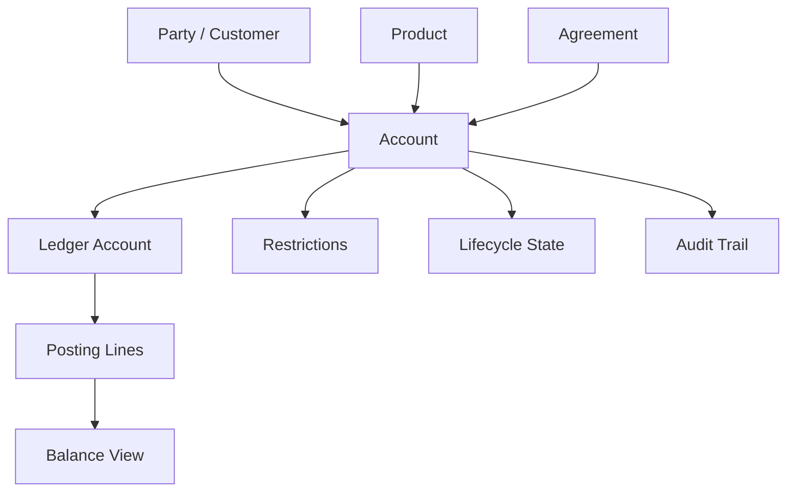
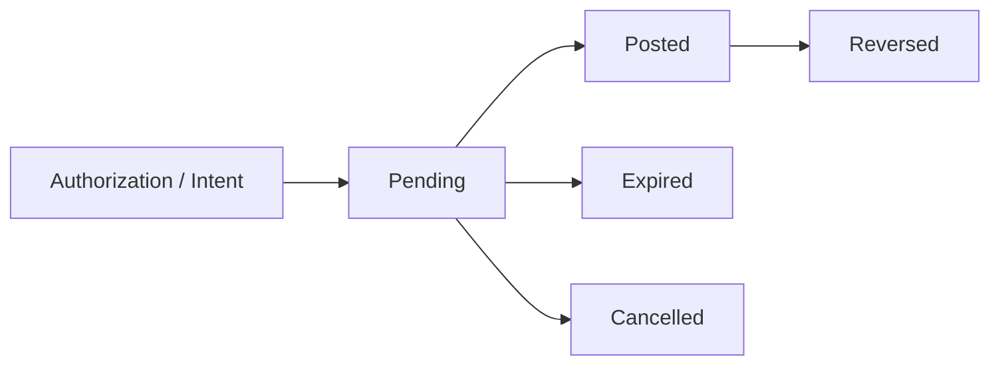
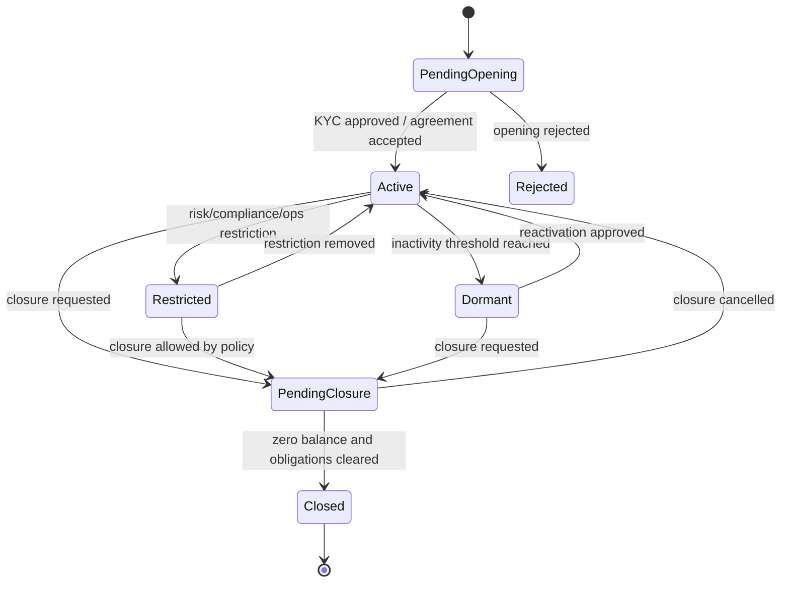
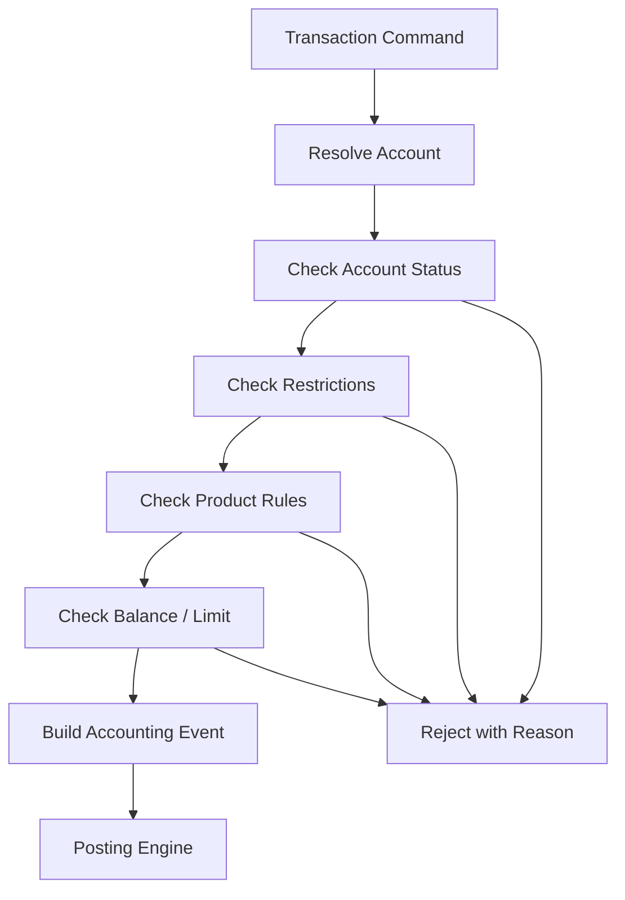
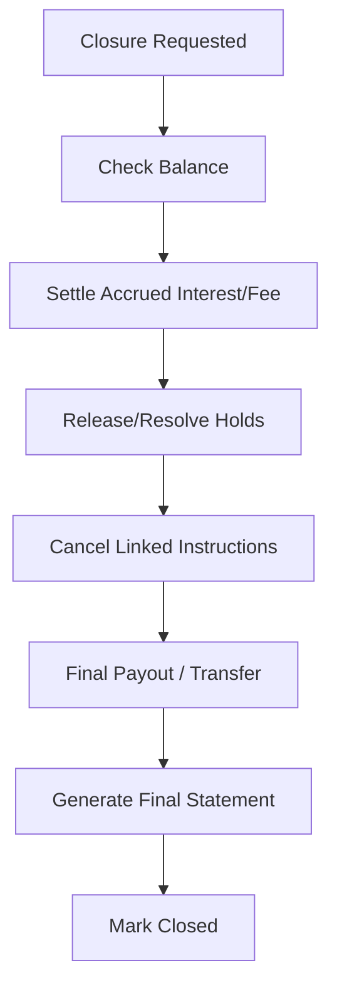
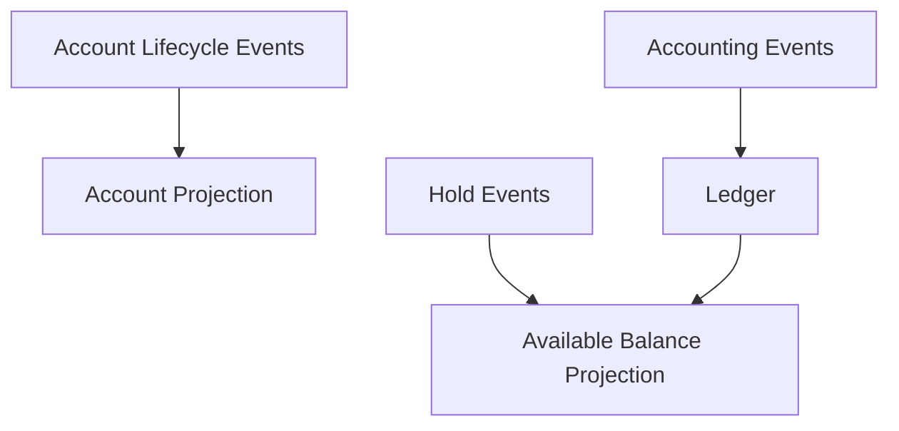
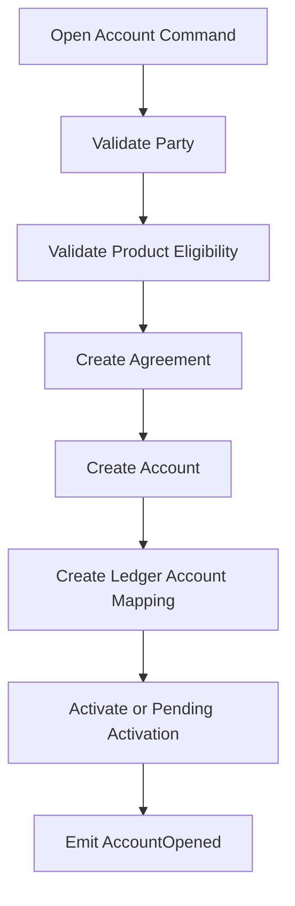
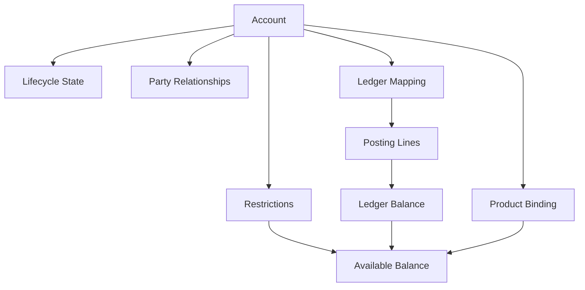

# Part 006 — Account Model, Balance Types, and Account Lifecycle

> Target: mendesain account aggregate yang benar. Fokus: ledger balance, available balance, collected balance, blocked balance, overdraft, dormant account, closed account, dan state transition.

Pada Part 005 kita membangun fondasi ledger: money, journal, posting line, debit/credit, dan balanced journal. Sekarang kita naik satu layer ke domain yang dilihat nasabah dan operator: **account**.

Di core banking, account bukan sekadar row dengan `account_number` dan `balance`. Account adalah kontrak operasional yang menghubungkan:

- party/customer,
- product,
- agreement,
- ledger,
- balance view,
- restrictions,
- lifecycle state,
- operational controls,
- audit trail.

Kesalahan paling mahal dalam account model biasanya bukan syntax Java. Kesalahannya adalah model mental: menganggap “saldo” hanya satu angka dan “rekening” hanya punya status aktif/nonaktif.

---

## 1. Kaufman Deconstruction untuk Account Skill

Sub-skill yang harus dikuasai:

| Sub-skill | Pertanyaan self-correction |
|---|---|
| Account identity | Apakah account number, account id, dan ledger account id saya pisahkan? |
| Balance taxonomy | Apakah saya bisa menjelaskan ledger, available, collected, blocked, overdraft, dan pending balance? |
| Lifecycle state | Apakah semua transisi account eksplisit dan tervalidasi? |
| Restrictions | Apakah freeze, debit block, credit block, lien, dan dormancy tidak dicampur jadi satu boolean? |
| Posting eligibility | Apakah setiap transaction type mengecek state dan restriction yang relevan? |
| Balance derivation | Apakah balance berasal dari ledger/projection yang bisa direkonsiliasi? |
| Auditability | Apakah perubahan limit/status/restriction punya actor, reason, approval, dan timestamp? |

Tujuan setelah part ini:

> Anda bisa mendesain account aggregate yang tidak hanya menyimpan saldo, tetapi menjaga lifecycle, balance semantics, restrictions, posting eligibility, dan audit evidence.

---

## 2. Account Bukan Ledger, tetapi Terhubung ke Ledger

Account adalah domain object produk/kontrak. Ledger adalah pencatatan accounting.



Contoh:

```txt
Customer Account:
- account_id: ACC-001
- account_number: 1234567890
- product_code: SAVINGS_REGULAR
- owner_party_id: P-001
- status: ACTIVE

Ledger Account:
- ledger_account_id: LEDGER-CUST-ACC-001
- account_type: LIABILITY
- gl_account_code: CUSTOMER_DEPOSITS_LIABILITY
```

Kenapa dipisahkan?

Karena account bisa berubah status, produk, owner, restriction, dan limit; sedangkan ledger postings adalah catatan nilai yang immutable. Memisahkan keduanya membuat sistem lebih mudah diaudit dan lebih aman saat produk berevolusi.

---

## 3. Account Identity: Jangan Campur Semua ID

Minimal identity yang perlu dipisahkan:

| Identity | Dipakai untuk | Boleh berubah? |
|---|---|---|
| `accountId` | Internal immutable identifier | Tidak |
| `accountNumber` | Nomor rekening eksternal/customer-facing | Idealnya tidak, tapi bisa ada renumbering/masking scenario |
| `ledgerAccountId` | Node ledger/subledger | Tidak untuk historical posting |
| `agreementId` | Kontrak hukum/produk | Bisa diganti melalui lifecycle tertentu |
| `partyId` | Pemilik/relasi customer | Bisa berubah melalui ownership maintenance yang diaudit |
| `productCode` | Product template | Bisa migration/upgrade dengan effective date |

Anti-pattern:

```java
String accountNumber; // used as primary key everywhere
```

Kenapa buruk?

- account number bisa punya format channel-specific,
- bisa perlu masking/tokenization,
- bisa conflict saat migration,
- sulit melakukan account renumbering,
- historical posting sebaiknya mereferensikan immutable id.

Model lebih aman:

```java
public record AccountId(String value) {}
public record AccountNumber(String value) {}
public record LedgerAccountId(String value) {}
public record PartyId(String value) {}
public record ProductCode(String value) {}
```

---

## 4. Core Account Aggregate

Account aggregate jangan terlalu gemuk. Ia harus menyimpan state yang menentukan apakah transaksi boleh dilakukan, bukan menghitung semua hal sendiri.

```java
public final class Account {
    private final AccountId accountId;
    private final AccountNumber accountNumber;
    private final PartyId ownerPartyId;
    private final ProductCode productCode;
    private final LedgerAccountId ledgerAccountId;
    private AccountStatus status;
    private AccountRestrictions restrictions;
    private AccountLimits limits;
    private AccountDates dates;
    private long version;

    public Account(
        AccountId accountId,
        AccountNumber accountNumber,
        PartyId ownerPartyId,
        ProductCode productCode,
        LedgerAccountId ledgerAccountId,
        AccountStatus status,
        AccountRestrictions restrictions,
        AccountLimits limits,
        AccountDates dates,
        long version
    ) {
        this.accountId = accountId;
        this.accountNumber = accountNumber;
        this.ownerPartyId = ownerPartyId;
        this.productCode = productCode;
        this.ledgerAccountId = ledgerAccountId;
        this.status = status;
        this.restrictions = restrictions;
        this.limits = limits;
        this.dates = dates;
        this.version = version;
    }

    public void assertCanDebit(Money amount, BalanceView balanceView) {
        status.assertDebitAllowed();
        restrictions.assertDebitAllowed();
        limits.assertDebitWithinLimit(amount, balanceView);
    }

    public void assertCanCredit(Money amount) {
        status.assertCreditAllowed();
        restrictions.assertCreditAllowed();
    }

    public void freeze(RestrictionReason reason, Actor actor) {
        restrictions = restrictions.withFullFreeze(reason, actor);
        version++;
    }

    public void close(Actor actor, ClosureReason reason, BalanceView balanceView) {
        if (!balanceView.isZero()) {
            throw new IllegalStateException("account must have zero balance before closure");
        }
        status = AccountStatus.CLOSED;
        version++;
    }
}
```

Catatan:

- Account memvalidasi eligibility.
- Posting tetap dilakukan oleh posting engine.
- BalanceView adalah projection yang digunakan untuk keputusan, bukan sumber mutasi sembarang.
- Perubahan restriction/status harus diaudit.

---

## 5. Balance Taxonomy: “Saldo” Bukan Satu Angka

Dalam core banking, “saldo” bisa berarti banyak hal.

| Balance type | Makna | Dipakai untuk |
|---|---|---|
| Ledger/book/current balance | Saldo dari posted ledger entries | laporan, statement, audit |
| Available balance | Dana yang bisa digunakan sekarang | transfer, withdrawal, debit authorization |
| Collected balance | Dana yang sudah cleared/collected | interest, availability, risk |
| Blocked/held amount | Dana yang ditahan | card hold, lien, court order, fraud review |
| Pending debit | Debit yang sudah diterima tapi belum final posted | payment processing, authorization |
| Pending credit | Credit yang diharapkan tetapi belum final | incoming transfer pending |
| Overdraft limit | Batas tambahan yang diizinkan | current account, corporate account |
| Minimum balance | Saldo minimum produk | fee/eligibility |
| Accrued interest | Interest yang sudah dihitung tetapi belum dikapitalisasi | accrual/reporting |
| Uncleared funds | Dana belum settle/clear | check deposit, external payment |

Formula sederhana untuk deposit account:

```txt
available_balance = ledger_balance
                  - active_holds
                  - pending_debits
                  - minimum_required_balance
                  + allowed_overdraft
```

Namun formula final tergantung produk, currency, regulator, channel, dan transaction type.

---

## 6. Balance View Model

```java
public record BalanceView(
    AccountId accountId,
    String currency,
    Money ledgerBalance,
    Money availableBalance,
    Money collectedBalance,
    Money blockedAmount,
    Money pendingDebitAmount,
    Money pendingCreditAmount,
    Money overdraftLimit,
    LocalDate businessDate,
    Instant calculatedAt,
    long ledgerSequence
) {
    public boolean isZero() {
        return ledgerBalance.amount().compareTo(BigDecimal.ZERO) == 0;
    }

    public boolean hasAvailableAtLeast(Money amount) {
        requireSameCurrency(amount);
        return availableBalance.amount().compareTo(amount.amount()) >= 0;
    }

    private void requireSameCurrency(Money amount) {
        if (!currency.equals(amount.currency())) {
            throw new IllegalArgumentException("currency mismatch");
        }
    }
}
```

Poin penting:

- `ledgerSequence` membantu memastikan balance view berasal dari posting sampai sequence tertentu.
- `calculatedAt` membantu observability dan debugging stale projection.
- `businessDate` membantu EOD/reporting.
- Jangan campur `availableBalance` dengan `ledgerBalance`.

---

## 7. Ledger Balance vs Available Balance

Misal saldo ledger IDR 1,000,000. Ada hold card authorization IDR 300,000. Ada minimum balance IDR 50,000.

```txt
ledger_balance    = 1,000,000
active_holds      =   300,000
minimum_balance   =    50,000
available_balance =   650,000
```

Jika customer melihat saldo di mobile banking, UI bisa menampilkan:

```txt
Current balance:   IDR 1,000,000
Available balance: IDR   650,000
```

Jika sistem hanya punya satu field `balance`, salah satu akan terjadi:

- customer bisa menarik dana yang seharusnya blocked,
- customer mengira uang hilang,
- reconciliation card/payment gagal,
- complaint sulit dijelaskan.

---

## 8. Hold, Block, Lien, dan Freeze: Jangan Jadi Satu Boolean

Restriction punya banyak jenis.

| Restriction | Scope | Debit? | Credit? | Contoh |
|---|---|---:|---:|---|
| Debit block | Account | Tidak | Ya | rekening sedang review fraud |
| Credit block | Account | Ya | Tidak | account tidak boleh menerima dana |
| Full freeze | Account | Tidak | Tidak | court order, compliance freeze |
| Amount hold | Amount | Tergantung sisa available | Ya | card authorization hold |
| Lien | Amount atau full | Mengurangi available | Ya | collateral, legal hold |
| Dormant restriction | Account | Biasanya tidak | Tergantung policy | dormant account |
| Product restriction | Product/rule | Tergantung | Tergantung | account type tidak support transfer |

Model:

```java
public record AccountRestrictions(
    boolean debitBlocked,
    boolean creditBlocked,
    boolean fullyFrozen,
    List<AmountHold> amountHolds,
    List<Lien> liens,
    List<RestrictionRecord> records
) {
    public void assertDebitAllowed() {
        if (fullyFrozen) {
            throw new IllegalStateException("account is fully frozen");
        }
        if (debitBlocked) {
            throw new IllegalStateException("account is debit blocked");
        }
    }

    public void assertCreditAllowed() {
        if (fullyFrozen) {
            throw new IllegalStateException("account is fully frozen");
        }
        if (creditBlocked) {
            throw new IllegalStateException("account is credit blocked");
        }
    }
}

public record AmountHold(
    String holdId,
    Money amount,
    HoldType type,
    Instant createdAt,
    Optional<Instant> expiresAt,
    String reason,
    String sourceReference
) {}
```

Rule:

- Restriction harus punya reason.
- Restriction harus punya actor/source.
- Restriction harus punya effective time.
- Pelepasan restriction juga harus diaudit.
- Hold expiry harus deterministik dan dapat diproses ulang.

---

## 9. Pending vs Posted

Pending transaction tidak sama dengan posted transaction.



Contoh card authorization:

1. Customer transaksi di merchant IDR 200,000.
2. Core/card boundary membuat hold IDR 200,000.
3. Available balance turun.
4. Ledger balance belum tentu berubah jika belum captured/settled.
5. Saat settlement datang, hold dilepas dan posting final dibuat.

Jika sistem langsung mem-post ledger pada authorization sementara settlement belum final, reversal/partial capture/tips/foreign exchange bisa menjadi rumit. Namun jika sistem tidak menahan available balance, customer bisa overspend.

Karena itu hold/reservation adalah konsep terpisah dari posting final.

---

## 10. Account Lifecycle State Machine

Account lifecycle harus eksplisit.



Minimal states:

| State | Meaning | Debit | Credit | Notes |
|---|---|---:|---:|---|
| PendingOpening | Account dibuat tetapi belum aktif | Tidak | Tidak | menunggu KYC/approval/funding |
| Active | Normal operations | Ya | Ya | sesuai product rule |
| Restricted | Ada restriction aktif | Tergantung | Tergantung | lihat restriction detail |
| Dormant | Inactive berdasarkan policy | Biasanya tidak | policy-dependent | reactivation perlu control |
| PendingClosure | Proses penutupan | Terbatas | Terbatas | pastikan zero/settlement selesai |
| Closed | Account ditutup | Tidak | Tidak | hanya boleh historical query |
| Rejected | Opening gagal | Tidak | Tidak | tidak boleh posting |

Jangan cukup pakai:

```java
boolean active;
```

Karena “not active” bisa berarti pending, dormant, restricted, closed, rejected, atau blocked. Masing-masing punya aturan yang berbeda.

---

## 11. Transaction Eligibility Matrix

Setiap transaction type harus punya rule terhadap account state dan restriction.

| Transaction | Active | Restricted | Dormant | PendingClosure | Closed |
|---|---:|---:|---:|---:|---:|
| Cash deposit | Allowed | Depends credit block | Usually controlled | Usually no | No |
| Cash withdrawal | Allowed | Depends debit block | No until reactivated | No | No |
| Internal transfer debit | Allowed | Depends debit block | No | No | No |
| Internal transfer credit | Allowed | Depends credit block | Depends policy | No | No |
| Interest accrual | Allowed | Usually allowed | Usually allowed | Depends | No new accrual after closure |
| Fee assessment | Allowed | Depends | Depends product/regulation | Depends | No |
| Reversal | Allowed | Special path | Special path | Special path | Special path with control |
| Closure payout | Allowed | Controlled | Controlled | Allowed | No |

Critical nuance:

> Reversal dan correction sering membutuhkan special path. Kalau account sudah restricted atau closed, sistem tetap mungkin harus mengizinkan correction yang tidak sama dengan transaksi normal.

Contoh:

- Salah posting fee pada account yang sekarang closed.
- Reversal harus bisa membuat accounting correction melalui controlled operational process.
- Ini tidak berarti account boleh dipakai normal lagi.

---

## 12. Posting Eligibility Flow



Reject reason harus spesifik:

```txt
ACCOUNT_CLOSED
ACCOUNT_DORMANT_REACTIVATION_REQUIRED
DEBIT_BLOCKED
CREDIT_BLOCKED
INSUFFICIENT_AVAILABLE_BALANCE
AMOUNT_HELD
PRODUCT_DOES_NOT_ALLOW_TRANSACTION_TYPE
BUSINESS_DATE_CLOSED
```

Jangan return generic:

```txt
TRANSACTION_FAILED
```

Dalam bank, reject reason adalah bagian dari evidence dan customer-service explainability.

---

## 13. Account Limits dan Overdraft

Overdraft bukan negative balance bug. Overdraft adalah product feature yang harus eksplisit.

```java
public record AccountLimits(
    Money dailyDebitLimit,
    Money singleTransactionLimit,
    Money overdraftLimit,
    Money minimumRequiredBalance
) {
    public void assertDebitWithinLimit(Money amount, BalanceView balanceView) {
        if (!balanceView.hasAvailableAtLeast(amount)) {
            throw new IllegalStateException("insufficient available balance");
        }
    }
}
```

Namun formula available balance untuk overdraft account mungkin:

```txt
available = ledger_balance - holds - pending_debits - minimum_balance + overdraft_limit
```

Jika ledger balance IDR 100,000 dan overdraft limit IDR 500,000, available bisa IDR 600,000. Tapi jika product tidak mengizinkan overdraft, available tidak boleh menjadi negatif.

Rule:

- Overdraft limit harus effective-dated.
- Perubahan limit harus maker-checker untuk konteks tertentu.
- Overdraft usage harus bisa dipantau.
- Interest/fee atas overdraft adalah product engine concern.
- Limit tidak boleh hardcoded di channel.

---

## 14. Account Closure

Closure bukan `status = CLOSED`.

Closure harus memastikan:

- ledger balance zero atau diselesaikan melalui payout/write-off,
- active holds dilepas atau diselesaikan,
- pending transactions selesai/expired/cancelled,
- accrued interest/fee dihitung,
- tax/withholding selesai,
- card/payment instrument linked dinonaktifkan,
- standing instruction/direct debit dihentikan,
- statement/final advice dibuat,
- closure reason dan actor diaudit.



Anti-pattern:

```sql
update account set status = 'CLOSED' where account_number = ?;
```

Dampak:

- ada pending debit masuk setelah closure,
- interest accrual masih jalan,
- statement tidak final,
- reconciliation muncul break,
- complaint tidak bisa dijawab.

---

## 15. Dormancy dan Reactivation

Dormant account biasanya muncul karena tidak ada aktivitas customer dalam periode tertentu. Dormancy bukan sekadar status teknis; ia punya konsekuensi operasional dan regulatory/local-policy.

Model minimal:

```java
public record DormancyPolicy(
    ProductCode productCode,
    Period inactivityPeriod,
    boolean allowCreditWhileDormant,
    boolean allowSystemAccrualWhileDormant,
    boolean requireReactivationApproval
) {}
```

Dormancy detection:

```txt
last_customer_initiated_activity_date + inactivity_period <= business_date
```

Jangan gunakan semua posting sebagai activity. Interest accrual, fee, dan system adjustment bisa membuat account terlihat aktif padahal tidak ada aktivitas customer.

Perlu bedakan:

| Activity type | Menghentikan dormancy? |
|---|---:|
| Customer cash deposit | Ya |
| Customer withdrawal | Ya |
| Customer transfer | Ya |
| Interest accrual | Biasanya tidak |
| Fee posting | Biasanya tidak |
| System correction | Biasanya tidak |

Reactivation harus punya:

- actor,
- reason,
- evidence,
- approval jika diwajibkan,
- timestamp,
- channel/source.

---

## 16. Account Statement dan Balance Explanation

Account statement bukan laporan kosmetik. Ia adalah customer-facing explanation dari ledger.

Statement line biasanya berasal dari posting/journal, tetapi disajikan dari perspektif customer.

Untuk deposit account:

| Accounting side | Customer statement effect |
|---|---:|
| Credit liability | Balance increases |
| Debit liability | Balance decreases |

Untuk loan account:

| Accounting side | Customer loan balance effect |
|---|---:|
| Debit loan asset | Outstanding principal increases |
| Credit loan asset | Outstanding principal decreases |

Karena itu statement generation harus tahu account type dan product perspective.

```java
public enum CustomerBalanceEffect {
    INCREASE,
    DECREASE
}

public CustomerBalanceEffect toCustomerEffect(AccountType accountType, PostingSide side) {
    return switch (accountType) {
        case LIABILITY -> side == PostingSide.CREDIT
            ? CustomerBalanceEffect.INCREASE
            : CustomerBalanceEffect.DECREASE;
        case ASSET -> side == PostingSide.DEBIT
            ? CustomerBalanceEffect.INCREASE
            : CustomerBalanceEffect.DECREASE;
        default -> throw new IllegalArgumentException("not a customer-facing account type");
    };
}
```

---

## 17. Balance Projection Consistency

Balance projection harus bisa direkonsiliasi dengan posting lines.

Projection model:

```txt
account_balance_projection
- account_id
- currency
- ledger_balance
- available_balance
- collected_balance
- blocked_amount
- pending_debit_amount
- pending_credit_amount
- business_date
- last_journal_sequence
- updated_at
```

Invariant:

```txt
projection.ledger_balance == derived balance from posting lines up to last_journal_sequence
```

Jika tidak cocok, sistem harus menandai anomaly, bukan diam-diam overwrite.

Rebuild strategy:

1. Ambil opening snapshot yang sudah certified.
2. Replay posting lines setelah snapshot sequence.
3. Recompute balance projection.
4. Compare dengan current projection.
5. Jika mismatch, create recon break.

---

## 18. Account-Level Serialization

Walaupun seri concurrency sudah selesai, account model butuh satu prinsip domain:

> Semua mutasi yang memengaruhi available balance account yang sama harus memiliki ordering yang deterministik.

Contoh race:

```txt
Ledger balance = IDR 100,000
Transfer A debit = IDR 80,000
Transfer B debit = IDR 80,000
```

Jika dua command membaca available balance yang sama secara paralel, keduanya bisa lolos. Hasilnya overdraft tidak sengaja.

Solusi domain-level:

- account-level lock,
- optimistic version check,
- serialized command queue per account,
- reservation/hold before posting,
- database constraint/projection update atomic.

Yang penting: jangan hanya mengandalkan “service stateless” jika keputusan balance membutuhkan current state.

---

## 19. Account Event Model

Account lifecycle menghasilkan domain events yang berbeda dari accounting events.

| Event | Jenis | Apakah posting ledger? |
|---|---|---:|
| AccountOpened | Account lifecycle | Tidak selalu |
| AccountActivated | Account lifecycle | Tidak |
| AccountRestricted | Control event | Tidak |
| HoldPlaced | Reservation/control | Tidak selalu |
| HoldReleased | Reservation/control | Tidak selalu |
| AccountDormantMarked | Lifecycle/control | Tidak |
| AccountReactivated | Lifecycle/control | Tidak |
| AccountClosureRequested | Lifecycle | Tidak |
| AccountClosed | Lifecycle | Tidak, kecuali closure payout/fee sudah diposting |
| JournalPosted | Accounting event result | Ya |

Jangan campur semua menjadi `TransactionEvent`.



---

## 20. Restrictions as Evidence

Setiap restriction harus bisa menjawab:

```txt
Who placed it?
When?
From which channel/system?
Under what authority?
For what reason?
What scope?
What amount?
When does it expire?
Who removed it?
Why was it removed?
```

Model:

```java
public record RestrictionRecord(
    String restrictionId,
    RestrictionType type,
    RestrictionScope scope,
    Optional<Money> amount,
    String reasonCode,
    String narrative,
    Actor placedBy,
    Instant placedAt,
    Optional<Actor> removedBy,
    Optional<Instant> removedAt,
    Optional<String> removalReason
) {}

public enum RestrictionType {
    DEBIT_BLOCK,
    CREDIT_BLOCK,
    FULL_FREEZE,
    AMOUNT_HOLD,
    LIEN,
    DORMANCY_BLOCK
}
```

If it affects customer money, it needs evidence.

---

## 21. Account Opening

Account opening flow:



Important points:

- Account opening may not post ledger yet.
- Initial deposit is separate accounting event.
- Product eligibility should be evaluated against product version.
- Agreement and account should reference effective terms.
- Ledger account mapping must exist before monetary posting.

Anti-pattern:

```txt
Opening account automatically creates fake zero transaction.
```

Zero transaction sering menjadi noise. Kalau dibutuhkan untuk audit/statement, gunakan explicit lifecycle event, bukan fake financial posting.

---

## 22. Account Number Generation

Account number generation harus mempertimbangkan:

- uniqueness,
- check digit,
- branch/product prefix jika diperlukan,
- privacy/masking,
- migration compatibility,
- not exposing internal sequence predictably if risk-sensitive,
- formatting across channels.

Jangan menjadikan account number sebagai source of truth untuk routing internal jika ada immutable account id.

```java
public interface AccountNumberGenerator {
    AccountNumber next(ProductCode productCode, BranchCode branchCode);
}
```

Check digit membantu mendeteksi typo, tapi bukan security mechanism.

---

## 23. Joint Account dan Relationship Complexity

Account tidak selalu punya satu owner sederhana.

Relasi umum:

| Relationship | Meaning |
|---|---|
| Primary owner | Pemilik utama |
| Joint owner | Pemilik bersama |
| Authorized signer | Boleh melakukan transaksi tertentu |
| Guardian | Bertindak untuk minor/dependent |
| Corporate representative | Bertindak atas nama perusahaan |
| Beneficial owner | Relevan untuk compliance/KYC |

Model:

```java
public record AccountPartyRelationship(
    AccountId accountId,
    PartyId partyId,
    AccountPartyRole role,
    LocalDate effectiveFrom,
    Optional<LocalDate> effectiveTo,
    AuthorizationProfile authorizationProfile
) {}

public enum AccountPartyRole {
    PRIMARY_OWNER,
    JOINT_OWNER,
    AUTHORIZED_SIGNER,
    GUARDIAN,
    CORPORATE_REPRESENTATIVE,
    BENEFICIAL_OWNER
}
```

Posting eligibility bisa tergantung actor authority, bukan hanya account status.

Contoh:

- Authorized signer boleh transfer sampai limit tertentu.
- Joint account butuh single-sign atau dual-sign sesuai mandate.
- Corporate account bisa butuh approval matrix.

---

## 24. Account Product Binding

Account dibuat berdasarkan product version. Jangan hanya simpan product code tanpa version/effective terms.

```java
public record AccountProductBinding(
    AccountId accountId,
    ProductCode productCode,
    String productVersion,
    LocalDate effectiveFrom,
    Optional<LocalDate> effectiveTo
) {}
```

Kenapa penting?

- Fee berubah mulai bulan depan.
- Minimum balance berubah.
- Dormancy policy berubah.
- Interest calculation berubah.
- Account lama mungkin grandfathered.

Tanpa versioning, Anda tidak bisa menjelaskan kenapa dua account dengan product code sama diperlakukan berbeda.

---

## 25. Account Statement Period and Opening/Closing Balance

Untuk statement period:

```txt
opening_balance + credits - debits = closing_balance
```

Namun credits/debits dari statement perspective harus disesuaikan dengan account type.

Statement period model:

```java
public record StatementPeriod(
    AccountId accountId,
    LocalDate fromInclusive,
    LocalDate toInclusive,
    Money openingBalance,
    Money totalCredits,
    Money totalDebits,
    Money closingBalance,
    List<StatementLine> lines
) {}
```

Invariant:

```txt
opening + customer_credits - customer_debits == closing
```

Ini berbeda dari journal invariant:

```txt
total accounting debit == total accounting credit
```

Keduanya benar di perspektif yang berbeda.

---

## 26. Handling Closed Account Corrections

Real system harus menangani koreksi setelah account closed.

Contoh:

- Fee salah charge sebelum account closed.
- Interest kurang bayar.
- External return datang terlambat.
- Settlement adjustment masuk setelah closure.

Pilihan desain:

1. Reopen account under controlled process.
2. Post correction to suspense/settlement account and create case.
3. Create payable/receivable outside original customer account.
4. Use special closed-account correction flow.

Jangan diam-diam mengubah status closed menjadi active tanpa evidence.

Decision table:

| Scenario | Recommended handling |
|---|---|
| Customer owed small refund | Create payable/refund case |
| Bank owed amount after closure | Create receivable/recovery case |
| Regulatory correction requires account statement update | Controlled reopen or historical correction process |
| Late external settlement return | Suspense + investigation + controlled posting |

---

## 27. Account Data Model Minimal

```txt
account
- account_id
- account_number
- owner_party_id
- product_code
- product_version
- ledger_account_id
- status
- branch_code
- currency
- opened_date
- activated_date
- closed_date nullable
- closure_reason nullable
- version
- created_at
- updated_at

account_restriction
- restriction_id
- account_id
- type
- scope
- amount nullable
- currency nullable
- reason_code
- narrative
- placed_by
- placed_at
- removed_by nullable
- removed_at nullable
- removal_reason nullable

account_balance_projection
- account_id
- currency
- ledger_balance
- available_balance
- collected_balance
- blocked_amount
- pending_debit_amount
- pending_credit_amount
- overdraft_limit
- business_date
- last_journal_sequence
- updated_at

account_party_relationship
- account_id
- party_id
- role
- authorization_profile_id
- effective_from
- effective_to nullable
```

Jangan anggap ini final schema. Ini domain checklist.

---

## 28. Account Invariants Checklist

Account identity:

- [ ] `accountId` immutable.
- [ ] `accountNumber` unique within required namespace.
- [ ] `ledgerAccountId` exists before financial posting.
- [ ] product binding references product version.

Lifecycle:

- [ ] closed account cannot receive normal debit/credit.
- [ ] pending opening cannot transact.
- [ ] dormant account needs reactivation for customer-initiated debit.
- [ ] closure requires zero or controlled settlement.
- [ ] status transition requires reason and actor.

Balance:

- [ ] available balance never confused with ledger balance.
- [ ] holds reduce available balance.
- [ ] overdraft is explicit product feature.
- [ ] balance projection can be rebuilt from ledger.
- [ ] stale projection detectable via sequence/timestamp.

Restrictions:

- [ ] debit block and credit block are separate.
- [ ] amount holds have expiry/source/reference.
- [ ] restriction placement/removal audited.
- [ ] special correction path exists for restricted/closed account.

Operations:

- [ ] reject reasons are specific.
- [ ] statement can explain balance movement.
- [ ] account event and accounting event are separate.
- [ ] migration preserves account identity and ledger mapping.

---

## 29. Anti-Patterns Account Model

### 29.1 Single `balance` field

Problem:

```txt
balance = 1000000
```

Tidak jelas apakah ini ledger, available, collected, or projected.

### 29.2 `isActive` boolean

Problem:

```java
boolean isActive;
```

Tidak bisa membedakan dormant, frozen, pending, restricted, closed.

### 29.3 Account number as primary key everywhere

Problem:

- migration sulit,
- masking sulit,
- renumbering sulit,
- external reference bocor ke internal architecture.

### 29.4 Editing balance manually

Problem:

- ledger tidak cocok,
- reconciliation break,
- audit lemah.

Correct approach:

```txt
Correction must be posted as journal entry.
```

### 29.5 Restriction as free-text note

Problem:

```txt
note = "blocked by ops"
```

Tidak bisa dieksekusi secara deterministik. Restriction harus structured.

---

## 30. Baeldung-Style Implementation Example: Debit Validation

```java
public final class DebitAuthorizationService {
    private final AccountRepository accountRepository;
    private final BalanceQuery balanceQuery;
    private final ProductRuleService productRuleService;

    public DebitAuthorizationService(
        AccountRepository accountRepository,
        BalanceQuery balanceQuery,
        ProductRuleService productRuleService
    ) {
        this.accountRepository = accountRepository;
        this.balanceQuery = balanceQuery;
        this.productRuleService = productRuleService;
    }

    public DebitAuthorization authorize(DebitCommand command) {
        Account account = accountRepository.get(command.accountId());
        BalanceView balance = balanceQuery.currentBalance(command.accountId(), command.currency());

        try {
            account.assertCanDebit(command.amount(), balance);
            productRuleService.assertTransactionAllowed(
                account.productCode(),
                TransactionType.DEBIT_TRANSFER,
                command.amount()
            );
            return DebitAuthorization.approved(command.commandId());
        } catch (IllegalStateException ex) {
            return DebitAuthorization.rejected(
                command.commandId(),
                RejectReason.from(ex)
            );
        }
    }
}
```

This service does not post ledger. It only authorizes debit eligibility. Posting happens after accounting event construction.

Separation:

```txt
DebitAuthorizationService -> decides whether debit can proceed
AccountingEventBuilder    -> builds debit/credit lines
PostingEngine             -> atomically posts journal
```

---

## 31. Testing Strategy

Test account model dengan scenario, bukan hanya getter/setter.

### 31.1 State transition tests

```txt
PendingOpening cannot debit.
Active can debit if no restriction and sufficient available.
Dormant cannot customer-debit before reactivation.
Closed cannot normal credit.
PendingClosure cannot new debit except closure payout.
```

### 31.2 Balance tests

```txt
ledger=1,000,000 hold=300,000 min=50,000 -> available=650,000
ledger=100,000 overdraft=500,000 -> available=600,000 if overdraft enabled
same scenario -> available=100,000 if overdraft disabled
```

### 31.3 Restriction tests

```txt
Debit block rejects debit but allows credit.
Credit block rejects credit but allows debit.
Full freeze rejects both.
Amount hold reduces available.
Expired hold no longer reduces available after controlled expiry process.
```

### 31.4 Correction tests

```txt
Closed account rejects normal transfer.
Closed account allows controlled reversal path with approval.
Restricted account allows system correction when policy permits.
```

---

## 32. Deliberate Practice

Extend mini-ledger dari Part 005:

1. Buat `Account` dengan status `PENDING_OPENING`, `ACTIVE`, `DORMANT`, `RESTRICTED`, `PENDING_CLOSURE`, `CLOSED`.
2. Implement `BalanceView` dengan ledger, available, blocked, pending debit, overdraft.
3. Implement debit authorization.
4. Implement credit authorization.
5. Implement amount hold placement and release.
6. Implement account closure validation.
7. Implement dormancy detection based on last customer activity.
8. Implement reject reason yang spesifik.
9. Buat test matrix untuk transaction eligibility.
10. Buat function `explainAvailableBalance(accountId)` yang menjelaskan komponen available balance.

Expected output:

```txt
Available Balance Explanation
Account: 1234567890
Currency: IDR
Ledger Balance:      1,000,000
Active Holds:         -300,000
Pending Debits:              0
Minimum Balance:       -50,000
Overdraft Limit:             0
Available Balance:     650,000
```

Jika Anda bisa membuat explanation seperti itu dari model sendiri, Anda mulai berpikir seperti engineer core banking, bukan hanya CRUD engineer.

---

## 33. Summary

Account model yang benar harus memisahkan:

```txt
Account identity
Account lifecycle
Account restrictions
Account balance views
Ledger postings
Product rules
Party relationships
Operational evidence
```

Core rule:

> Account tidak boleh menjadi satu row besar dengan satu status dan satu balance. Account adalah lifecycle-bearing domain object yang mengontrol eligibility dan menjembatani customer/product dengan ledger.

Mental model akhir:



Jika Part 005 menjawab “bagaimana nilai dicatat”, Part 006 menjawab “rekening mana yang boleh terkena transaksi, saldo apa yang boleh digunakan, dan state apa yang membuat transaksi sah atau tidak sah”.

---

## References

- ISO — ISO 4217 Currency Codes: currency code and minor unit metadata.
- Basel Committee on Banking Supervision — BCBS 239: accuracy, completeness, timeliness, and data lineage principles relevant to balance/reporting evidence.
- Oracle FLEXCUBE Universal Banking documentation: examples of account class/account maintenance concepts in commercial core banking systems.
- BIAN Service Landscape: account, product, customer, and operational capability decomposition.
