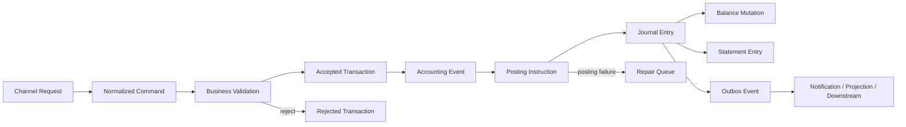
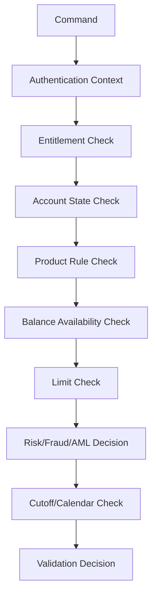
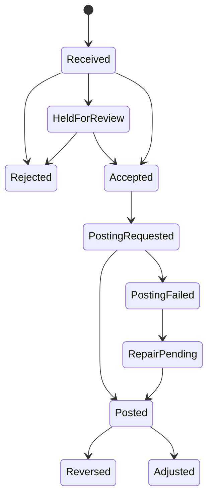
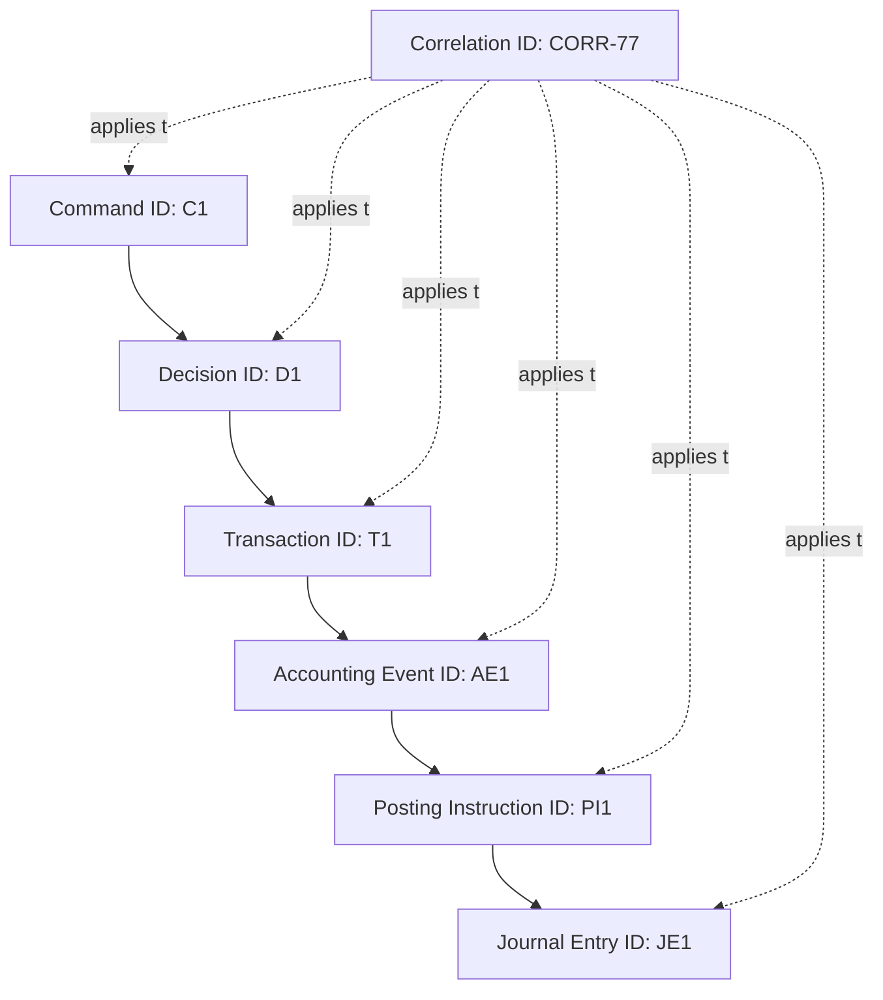
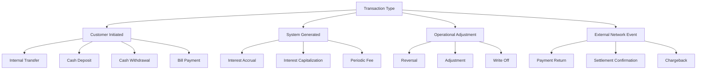
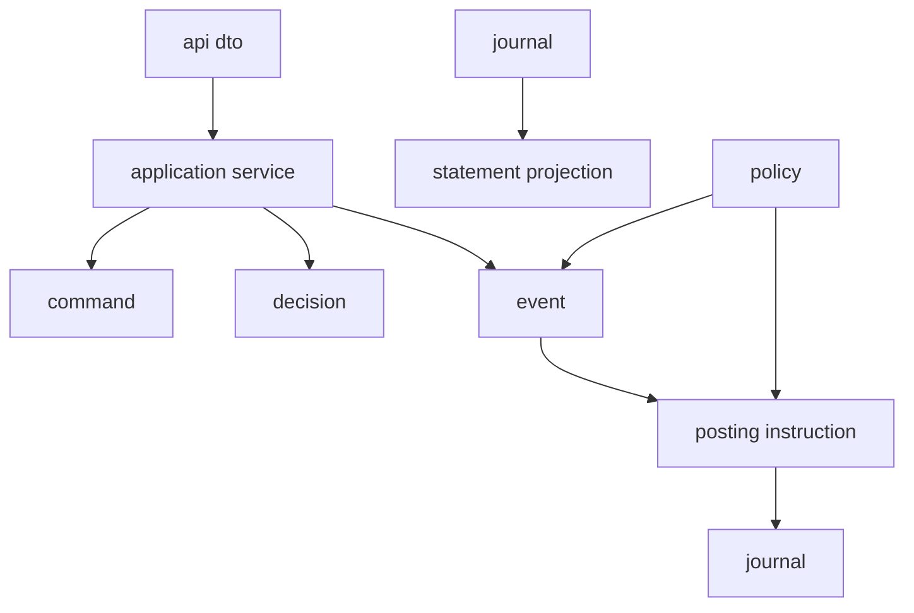
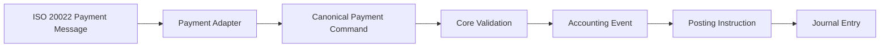

# Part 007 — Transaction Canonical Model: Command, Event, Posting

Core banking engineers often fail not because they cannot write Java code, but because they collapse multiple banking concepts into one overloaded object named `Transaction`.

In a banking core, `Transaction` can mean at least six different things:

1. A customer intent, such as “transfer 100 USD from account A to account B”.
2. A channel request, such as a mobile banking JSON request.
3. A validated business command.
4. An accounting event, such as “internal funds transfer accepted”.
5. A posting batch that mutates ledger balances.
6. A historical record shown on a statement.

A top-tier engineer separates these concepts. The system becomes easier to reason about, test, audit, replay, reconcile, and evolve.

This part builds the canonical transaction model used throughout the rest of the series.

---

## 1. Kaufman Framing: What We Are Deconstructing

Josh Kaufman's learning model starts by breaking a skill into smaller sub-skills and practicing the most valuable ones first. For core banking transaction design, the critical sub-skill is this:

> Given any banking operation, identify whether the object in front of you is an external request, internal command, business event, posting instruction, posting result, statement entry, or reconciliation artifact.

That one skill prevents many expensive design mistakes.

### 1.1 What You Should Be Able to Do After This Part

After this part, you should be able to:

- explain why `Transaction` is an ambiguous word;
- separate command, event, posting instruction, and posting result;
- model transaction lifecycle without mutating historical truth;
- design Java types that make invalid states harder to represent;
- design transaction IDs, causality IDs, correlation IDs, and idempotency keys;
- distinguish business status from technical processing status;
- decide what should and should not be exposed to channels;
- prepare the mental model required for Part 008: posting engine design.

---

## 2. The Core Mistake: One Object for Everything

A weak design often starts like this:

```java
public class Transaction {
    private String id;
    private String fromAccount;
    private String toAccount;
    private BigDecimal amount;
    private String status;
    private Date createdAt;
    private String type;
}
```

This looks harmless, but it hides severe ambiguity.

What does `status` mean?

- Request received?
- Validation passed?
- Debit posted?
- Credit posted?
- Settlement completed?
- Customer notified?
- Statement visible?
- Reconciled?
- Reversed?

What does `createdAt` mean?

- Channel request time?
- Command acceptance time?
- Ledger posting time?
- Business effective time?
- Settlement timestamp?

What does `id` mean?

- Channel request ID?
- Internal transaction ID?
- Posting batch ID?
- Journal entry ID?
- External payment reference?
- Correlation ID?

A core banking system cannot tolerate this ambiguity. Every field must have a specific meaning.

---

## 3. Canonical Transaction Pipeline

A robust banking transaction pipeline separates intent, decision, accounting, and evidence.



This pipeline is not merely a code structure. It is a truth-preserving model.

| Stage | Meaning | Can be retried? | Mutates ledger? | Exposed to customer? |
|---|---:|---:|---:|---:|
| Channel request | External input shape | Yes | No | Usually no |
| Command | Internal intent | Yes, with idempotency | No | Not directly |
| Validation result | Business decision | Recomputable with care | No | Sometimes |
| Accepted transaction | Bank accepted intent | No, should be stable | No | Yes |
| Accounting event | Business fact requiring accounting | No, append-only | No | Usually no |
| Posting instruction | Ledger mutation plan | Yes, idempotent | Not yet | No |
| Journal entry | Immutable accounting record | No | Yes | Indirectly |
| Statement entry | Customer-facing representation | Derived | No | Yes |
| Outbox event | Integration signal | Yes | No | No |

The key discipline: **do not expose the ledger's internal mutation mechanics as the public API contract.**

---

## 4. Concept 1: Channel Request

A channel request is the shape submitted by a system outside the core domain.

Examples:

- mobile banking transfer request;
- teller cash deposit request;
- ATM withdrawal authorization;
- batch payroll file item;
- partner API request;
- standing instruction execution;
- loan repayment from payment gateway;
- clearing return message.

A channel request is not trusted. It is only input.

### 4.1 Channel Request Characteristics

A channel request may contain:

- channel-specific identifiers;
- authentication context;
- device metadata;
- request timestamp;
- customer-provided narrative;
- external reference;
- optional idempotency key;
- raw amount/currency fields;
- beneficiary details;
- risk-screening metadata.

It should not contain:

- internal ledger account IDs unless the channel is explicitly trusted;
- GL account IDs;
- posting line definitions;
- accounting classification chosen by the channel;
- internal balance mutation instructions;
- privileged override flags without authority context.

### 4.2 Example: Raw Channel DTO

```java
public record TransferRequestDto(
    String requestId,
    String channel,
    String debtorAccountNumber,
    String creditorAccountNumber,
    String amount,
    String currency,
    String customerNarrative,
    String clientIdempotencyKey
) {}
```

This DTO is not the domain command. It is a transport object.

Avoid putting domain invariants here. DTO validation only checks syntactic validity:

- required fields;
- field length;
- parseable amount;
- allowed enum value;
- valid date format.

Business validation happens later.

---

## 5. Concept 2: Normalized Command

A command is an internal intent after transport normalization.

It answers:

> What does an authorized actor want the core to attempt?

A command is not yet a fact. It can still be rejected.

### 5.1 Command Properties

A command should contain:

- command ID;
- command type;
- actor context;
- source channel;
- normalized account references;
- money object;
- requested execution date;
- customer narrative;
- idempotency key;
- correlation ID;
- causation ID;
- authority/entitlement context;
- command creation timestamp.

It should not contain:

- final transaction status;
- journal entry ID;
- balance after posting;
- GL mapping result;
- statement sequence number;
- downstream settlement status.

### 5.2 Command Example

```java
public sealed interface BankingCommand
    permits InternalTransferCommand, CashDepositCommand, CashWithdrawalCommand {

    CommandId commandId();
    ActorContext actor();
    SourceChannel sourceChannel();
    CorrelationId correlationId();
    IdempotencyKey idempotencyKey();
    Instant receivedAt();
}

public record InternalTransferCommand(
    CommandId commandId,
    ActorContext actor,
    SourceChannel sourceChannel,
    CorrelationId correlationId,
    IdempotencyKey idempotencyKey,
    AccountId debtorAccountId,
    AccountId creditorAccountId,
    Money amount,
    LocalDate requestedExecutionDate,
    Narrative narrative,
    Instant receivedAt
) implements BankingCommand {}
```

Notice that the command does not contain debit/credit posting lines. The command says what the business wants. Posting lines are derived later by the accounting policy.

---

## 6. Concept 3: Validation Result

Validation answers:

> May the bank accept this command under current business rules, authority, product configuration, risk controls, and account state?

Validation is not a single `if` statement. It is a pipeline of domain gates.



### 6.1 Validation Categories

| Category | Example | Failure Type |
|---|---|---|
| Syntax | amount cannot be parsed | Reject before command |
| Identity | customer not authenticated | Security rejection |
| Authority | user cannot operate this account | Business rejection |
| Account state | account is closed | Business rejection |
| Product rule | transfer not allowed for product | Business rejection |
| Funds | insufficient available balance | Business rejection |
| Limit | daily transfer limit exceeded | Business rejection |
| Risk | suspicious transaction hold | Pending/manual review |
| Calendar | requested date is holiday | Reschedule/reject |
| Technical | dependency timeout | Retry/unknown/repair |

A top-tier design does not flatten all failures into `FAILED`.

### 6.2 Validation Result Example

```java
public sealed interface CommandDecision
    permits CommandAccepted, CommandRejected, CommandHeldForReview, CommandDeferred {

    CommandId commandId();
    DecisionId decisionId();
    Instant decidedAt();
}

public record CommandAccepted(
    CommandId commandId,
    DecisionId decisionId,
    AcceptedTransactionId transactionId,
    Instant decidedAt
) implements CommandDecision {}

public record CommandRejected(
    CommandId commandId,
    DecisionId decisionId,
    RejectionReason reason,
    Instant decidedAt
) implements CommandDecision {}

public record CommandHeldForReview(
    CommandId commandId,
    DecisionId decisionId,
    CaseId caseId,
    HoldReason reason,
    Instant decidedAt
) implements CommandDecision {}
```

This prevents a dangerous ambiguity: a transaction can be rejected, held, deferred, or accepted. These are not the same.

---

## 7. Concept 4: Accepted Transaction

An accepted transaction is a business-level fact:

> The bank accepted this intent for execution under a specific transaction identity.

This does not always mean the ledger has already been posted. For some flows, acceptance and posting are synchronous. For others, acceptance creates a pending transaction that posts later.

### 7.1 Accepted Transaction vs Posted Transaction

| Case | Accepted? | Posted? | Example |
|---|---:|---:|---|
| Internal instant transfer | Yes | Usually immediately | Own-account transfer |
| Scheduled payment | Yes | Later | Future-dated transfer |
| External payment | Yes | Debit may post before settlement | ACH/clearing payment |
| Card authorization | Yes | Hold posted, final settlement later | POS transaction |
| Loan repayment | Yes | Posting after allocation calculation | Loan servicing |
| Batch payroll | Item-level accepted | Posted in batch window | Salary file |

Do not assume `accepted == posted == settled == completed`.

### 7.2 Accepted Transaction State



This state machine is intentionally business-oriented. It does not include low-level thread, queue, or database transaction states.

### 7.3 Java Model

```java
public record AcceptedTransaction(
    AcceptedTransactionId id,
    CommandId commandId,
    TransactionType type,
    TransactionStatus status,
    AccountId primaryAccountId,
    Money amount,
    LocalDate businessDate,
    LocalDate valueDate,
    LocalDate postingDate,
    SourceChannel sourceChannel,
    ActorContext acceptedBy,
    CorrelationId correlationId,
    Instant acceptedAt
) {}
```

Important distinction:

- `businessDate`: operational date used by the bank;
- `valueDate`: date from which financial value applies;
- `postingDate`: date ledger entry is posted;
- `acceptedAt`: actual timestamp when command was accepted.

A real core banking system often needs all four.

---

## 8. Concept 5: Accounting Event

An accounting event is a business fact that requires ledger impact.

Examples:

- internal transfer accepted;
- cash deposit confirmed;
- cash withdrawal authorized;
- monthly fee assessed;
- daily interest accrued;
- interest capitalized;
- loan repayment allocated;
- term deposit matured;
- payment returned;
- transaction reversed.

Accounting event is not the same as domain event sent to Kafka. It is a financial fact that the ledger must represent.

### 8.1 Accounting Event Example

```java
public sealed interface AccountingEvent
    permits InternalTransferAccepted, FeeAssessed, InterestAccrued, LoanRepaymentAllocated {

    AccountingEventId eventId();
    AcceptedTransactionId transactionId();
    LocalDate businessDate();
    LocalDate valueDate();
    CorrelationId correlationId();
    Instant occurredAt();
}

public record InternalTransferAccepted(
    AccountingEventId eventId,
    AcceptedTransactionId transactionId,
    AccountId debtorAccountId,
    AccountId creditorAccountId,
    Money amount,
    LocalDate businessDate,
    LocalDate valueDate,
    CorrelationId correlationId,
    Instant occurredAt
) implements AccountingEvent {}
```

### 8.2 Why This Layer Matters

Without accounting events, systems often derive posting lines directly from API requests. That is dangerous.

Bad flow:

```txt
API Request -> Posting Lines -> Ledger
```

Better flow:

```txt
API Request -> Command -> Decision -> Accounting Event -> Posting Instructions -> Ledger
```

The accounting event creates a stable bridge between product/business logic and ledger mutation.

---

## 9. Concept 6: Posting Instruction

A posting instruction is the ledger mutation plan derived from an accounting event.

It answers:

> Which accounts should be debited and credited, by how much, in which currency, under which accounting rule, and with what metadata?

Posting instruction is not yet the journal entry. It can still fail ledger-level validation.

### 9.1 Posting Instruction Example

```java
public record PostingInstruction(
    PostingInstructionId id,
    AccountingEventId accountingEventId,
    PostingRuleId postingRuleId,
    List<PostingLineInstruction> lines,
    LocalDate businessDate,
    LocalDate valueDate,
    IdempotencyKey idempotencyKey,
    CorrelationId correlationId
) {}

public record PostingLineInstruction(
    LedgerAccountId ledgerAccountId,
    DebitCredit direction,
    Money amount,
    PostingLineRole role,
    String narrative
) {}
```

For a simple internal transfer:

| Line | Account | Direction | Amount | Role |
|---:|---|---|---:|---|
| 1 | Customer A deposit liability | Debit | 100.00 | customer debit |
| 2 | Customer B deposit liability | Credit | 100.00 | customer credit |

For a fee:

| Line | Account | Direction | Amount | Role |
|---:|---|---|---:|---|
| 1 | Customer deposit liability | Debit | 10.00 | fee collection |
| 2 | Fee income GL | Credit | 10.00 | income recognition |

The command does not know this mapping. The accounting policy does.

---

## 10. Concept 7: Journal Entry

A journal entry is the immutable ledger record produced after posting.

It answers:

> What was actually recorded in the ledger?

Journal entries should be append-only. Corrections are new journal entries, not updates to old financial truth.

### 10.1 Journal Entry Model

```java
public record JournalEntry(
    JournalEntryId id,
    PostingInstructionId instructionId,
    AccountingEventId accountingEventId,
    AcceptedTransactionId transactionId,
    List<JournalLine> lines,
    LocalDate businessDate,
    LocalDate valueDate,
    LocalDate postingDate,
    Instant postedAt,
    PostedBy postedBy,
    CorrelationId correlationId
) {}

public record JournalLine(
    JournalLineId id,
    LedgerAccountId accountId,
    DebitCredit direction,
    Money amount,
    BalanceImpact balanceImpact,
    int sequence
) {}
```

### 10.2 Journal Entry Invariants

Every journal entry must satisfy:

```txt
sum(debits) == sum(credits)
```

For each currency, unless explicit FX accounting rules are used:

```txt
sum(debits by currency) == sum(credits by currency)
```

Every line must have:

- journal entry ID;
- line sequence;
- account ID;
- debit/credit direction;
- amount;
- currency;
- business date;
- posting timestamp;
- source event reference;
- correlation reference.

A journal line without causality is an audit liability.

---

## 11. Concept 8: Statement Entry

A statement entry is a customer-facing representation of ledger impact.

It is derived from the journal, but it is not identical to the journal.

### 11.1 Journal vs Statement

| Concern | Journal Entry | Statement Entry |
|---|---|---|
| Audience | Internal accounting/audit | Customer/user |
| Completeness | All debit/credit lines | Usually account-specific |
| Mutability | Append-only | May be regenerated or corrected via statement rules |
| Language | Accounting | Customer narrative |
| Granularity | Multi-line | Often one line per customer impact |
| Includes GL lines | Yes | No |
| Includes internal suspense movement | Yes | Usually no |

A transfer can have one journal entry with two lines, but two customer statement entries: one debit statement for account A and one credit statement for account B.

### 11.2 Statement Entry Example

```java
public record StatementEntry(
    StatementEntryId id,
    AccountId accountId,
    JournalEntryId journalEntryId,
    JournalLineId journalLineId,
    LocalDate valueDate,
    LocalDate postingDate,
    Money amount,
    DebitCredit direction,
    String customerNarrative,
    StatementVisibility visibility,
    int sequenceNumber
) {}
```

Do not let channels infer accounting truth only from statement entries. Statement entries are views, not the ledger of record.

---

## 12. Identifier Taxonomy

A serious core system has multiple identifiers. This is not overengineering; it is operational survival.

| Identifier | Purpose | Generated by | Stable? | Example Use |
|---|---|---|---:|---|
| Request ID | Transport request tracking | Channel/API gateway | Per request | API logs |
| Idempotency key | Duplicate suppression | Client or core | Per business attempt | Safe retry |
| Command ID | Internal command identity | Core | Yes | Validation trace |
| Decision ID | Acceptance/rejection decision | Core | Yes | Audit evidence |
| Transaction ID | Business transaction identity | Core | Yes | Customer service |
| Accounting Event ID | Financial fact identity | Core | Yes | Posting derivation |
| Posting Instruction ID | Ledger mutation plan | Core | Yes | Posting engine retry |
| Journal Entry ID | Posted ledger record | Ledger | Immutable | Accounting audit |
| External Reference | External rail/system reference | External system | Varies | Payment reconciliation |
| Correlation ID | Cross-system trace | Ingress or core | Per flow | Observability |
| Causation ID | Parent event/command | Core | Per causal edge | Replay/debug |

### 12.1 Correlation vs Causation

Correlation groups related activity.

Causation links a child action to the parent action that caused it.



In incident analysis, correlation tells you “these records belong to the same journey”. Causation tells you “this record was produced because of that record”.

---

## 13. Transaction Status Is Not One Dimension

One of the most common design failures is a single transaction status enum like this:

```java
public enum Status {
    PENDING, SUCCESS, FAILED
}
```

This is too poor for banking.

A transaction may have separate statuses for:

- business acceptance;
- fraud/AML screening;
- posting;
- settlement;
- notification;
- statement visibility;
- reconciliation;
- reversal/correction;
- case/repair lifecycle.

### 13.1 Status Dimensions

```java
public record TransactionStatusView(
    AcceptanceStatus acceptance,
    RiskStatus risk,
    PostingStatus posting,
    SettlementStatus settlement,
    StatementStatus statement,
    ReconciliationStatus reconciliation,
    CorrectionStatus correction
) {}
```

Example:

```txt
acceptance       = ACCEPTED
risk             = CLEARED
posting          = POSTED
settlement       = PENDING_SETTLEMENT
statement        = VISIBLE
reconciliation   = UNMATCHED
correction       = NONE
```

This means the customer may see the debit, but operations still need to reconcile settlement.

### 13.2 Business Status vs Technical Status

| Status Type | Question | Example |
|---|---|---|
| Business status | What is the business state? | Accepted, rejected, posted, reversed |
| Technical status | What happened in processing infrastructure? | queued, retrying, timeout, dead-lettered |
| Operational status | What must humans do? | repair pending, approval required |
| External status | What did external network say? | acknowledged, returned, settled |

Do not expose technical retries as customer-facing transaction states.

---

## 14. Temporal Model

Core banking systems are temporal systems. Time is not one field.

| Time Field | Meaning |
|---|---|
| `receivedAt` | when the request reached the core/API boundary |
| `acceptedAt` | when business decision accepted it |
| `occurredAt` | when business event occurred |
| `postedAt` | when ledger journal was committed |
| `businessDate` | bank's operational date |
| `valueDate` | financial effective date |
| `postingDate` | ledger posting date |
| `settlementDate` | date external settlement completes |
| `createdAt` | technical record creation timestamp; often not enough |

### 14.1 Example: Backdated Deposit

A cash deposit is processed on Monday but value-dated to Friday due to branch operational rules.

```txt
receivedAt     = 2026-06-29T09:15:00Z
acceptedAt     = 2026-06-29T09:15:01Z
postedAt       = 2026-06-29T09:15:02Z
businessDate   = 2026-06-29
postingDate    = 2026-06-29
valueDate      = 2026-06-26
```

If you only store `createdAt`, you cannot explain interest impact, statement display, or operational reporting correctly.

---

## 15. Transaction Types: Do Not Overfit

A transaction type taxonomy must support accounting, operations, statements, risk, and analytics.

A poor taxonomy:

```txt
TRANSFER
PAYMENT
FEE
```

A better taxonomy is hierarchical.



### 15.1 Good Transaction Type Attributes

A transaction type should define:

- category;
- initiator type;
- posting policy;
- statement visibility rule;
- reversal eligibility;
- settlement requirement;
- approval requirement;
- risk screening requirement;
- reporting classification;
- allowed account/product types.

Do not put all of these into `switch` statements scattered across services. They belong in product/accounting policy configuration with controlled governance.

---

## 16. Canonical Internal Transfer Example

Now we combine the concepts.

### 16.1 Request

```json
{
  "requestId": "REQ-20260628-001",
  "channel": "MOBILE",
  "debtorAccountNumber": "100000001",
  "creditorAccountNumber": "200000001",
  "amount": "100.00",
  "currency": "USD",
  "customerNarrative": "Rent",
  "clientIdempotencyKey": "mobile-abc-123"
}
```

### 16.2 Normalized Command

```java
var command = new InternalTransferCommand(
    CommandId.newId(),
    actorContext,
    SourceChannel.MOBILE,
    correlationId,
    new IdempotencyKey("MOBILE", "mobile-abc-123"),
    debtorAccountId,
    creditorAccountId,
    Money.of("USD", "100.00"),
    LocalDate.of(2026, 6, 28),
    Narrative.customerProvided("Rent"),
    Instant.now()
);
```

### 16.3 Decision

```txt
Decision: ACCEPTED
Reason: accounts active, customer authorized, funds available, limits satisfied, risk cleared
Transaction ID: T-9001
```

### 16.4 Accounting Event

```txt
InternalTransferAccepted
- eventId: AE-7001
- transactionId: T-9001
- debtor: A-100
- creditor: A-200
- amount: USD 100.00
- businessDate: 2026-06-28
- valueDate: 2026-06-28
```

### 16.5 Posting Instruction

```txt
PostingInstruction PI-8001
- debit customer deposit liability A-100 USD 100.00
- credit customer deposit liability A-200 USD 100.00
```

### 16.6 Journal Entry

```txt
JournalEntry JE-6001
Line 1: DR A-100 USD 100.00
Line 2: CR A-200 USD 100.00
Balanced: yes
```

### 16.7 Statement Entries

```txt
Statement S-1 for A-100: debit USD 100.00, narrative "Transfer to account 200000001 - Rent"
Statement S-2 for A-200: credit USD 100.00, narrative "Transfer from account 100000001 - Rent"
```

Same business flow. Different artifacts. Different responsibilities.

---

## 17. Java Package Design

A good package structure reflects conceptual separation.

```txt
com.example.corebanking.transaction
  api
    TransferRequestDto.java
    TransferResponseDto.java
  command
    BankingCommand.java
    InternalTransferCommand.java
    CommandId.java
  decision
    CommandDecision.java
    CommandAccepted.java
    CommandRejected.java
  event
    AccountingEvent.java
    InternalTransferAccepted.java
  posting
    PostingInstruction.java
    PostingLineInstruction.java
  journal
    JournalEntry.java
    JournalLine.java
  statement
    StatementEntry.java
  policy
    TransactionPolicy.java
    PostingPolicy.java
  application
    TransferApplicationService.java
  infrastructure
    TransactionRepository.java
    IdempotencyRepository.java
```

The key point is not the exact package names. The point is dependency direction.



Do not let API DTOs leak into ledger code.

---

## 18. Application Service Flow

```java
public final class TransferApplicationService {

    private final IdempotencyService idempotencyService;
    private final CommandNormalizer normalizer;
    private final CommandValidator validator;
    private final AccountingEventFactory accountingEventFactory;
    private final PostingInstructionFactory postingInstructionFactory;
    private final PostingGateway postingGateway;

    public TransferResult transfer(TransferRequestDto request) {
        return idempotencyService.execute(
            IdempotencyKey.from(request.channel(), request.clientIdempotencyKey()),
            () -> executeTransfer(request)
        );
    }

    private TransferResult executeTransfer(TransferRequestDto request) {
        InternalTransferCommand command = normalizer.toCommand(request);

        CommandDecision decision = validator.decide(command);

        if (decision instanceof CommandRejected rejected) {
            return TransferResult.rejected(rejected.reason());
        }

        if (decision instanceof CommandHeldForReview held) {
            return TransferResult.held(held.caseId());
        }

        CommandAccepted accepted = (CommandAccepted) decision;

        AccountingEvent event = accountingEventFactory.from(accepted, command);
        PostingInstruction instruction = postingInstructionFactory.from(event);
        JournalEntry journalEntry = postingGateway.post(instruction);

        return TransferResult.posted(accepted.transactionId(), journalEntry.id());
    }
}
```

This code is simplified, but the conceptual separation is the important part.

The application service orchestrates. It does not own accounting rules. It does not directly mutate balances. It does not expose journal internals to the channel.

---

## 19. API Response Design

A customer-facing API should return business outcome, not internal ledger details.

### 19.1 Example Response

```json
{
  "transactionId": "T-9001",
  "status": "POSTED",
  "amount": {
    "currency": "USD",
    "value": "100.00"
  },
  "businessDate": "2026-06-28",
  "valueDate": "2026-06-28",
  "message": "Transfer completed"
}
```

Avoid exposing:

```json
{
  "journalEntryId": "JE-6001",
  "debitLedgerAccount": "210001001",
  "creditLedgerAccount": "210001002",
  "glMappingRule": "DEP_TRF_001"
}
```

Those belong to internal evidence, not channel contract.

---

## 20. Transaction Canonical Model and ISO 20022

ISO 20022 provides a universal financial industry message scheme and a business model used to derive common financial message concepts. A core banking canonical model should not blindly copy ISO 20022 message XML/JSON into internal domain objects. Instead:

- use ISO 20022 to inform external message mapping;
- maintain an internal canonical model optimized for ledger truth;
- preserve external references for reconciliation;
- keep transformation logic at boundaries;
- avoid letting external message schemas dictate internal aggregate design.

Example boundary:



The adapter is allowed to understand message families and external schema versions. The ledger core should not become a message parser.

---

## 21. Anti-Patterns

### 21.1 The Universal Transaction Table

One huge table with hundreds of nullable columns:

```txt
transaction_id
from_account
to_account
card_number
loan_id
interest_rate
fee_code
settlement_reference
reversal_reference
cash_drawer_id
atm_terminal_id
...
```

Why it fails:

- unclear invariants;
- many invalid field combinations;
- hard migration;
- poor audit semantics;
- impossible domain ownership;
- overloaded status;
- fragile reporting.

Better: shared canonical identifiers plus type-specific detail tables/events.

### 21.2 Posting Directly from Channel Request

```txt
Mobile Request -> debit account -> credit account
```

Why it fails:

- no stable decision record;
- no policy boundary;
- poor audit trail;
- duplicate handling becomes ad hoc;
- reversal cannot explain original causality.

### 21.3 Status Soup

```txt
PENDING, SUCCESS, FAILED, CANCELLED, DONE, ERROR, REVERSED, SETTLED, TIMEOUT
```

Why it fails:

- mixes technical and business states;
- cannot answer customer support questions;
- cannot drive operations reliably;
- creates contradictory states.

### 21.4 Event Confusion

Using the same event for:

- domain state change;
- accounting fact;
- Kafka notification;
- audit log;
- customer notification;
- analytics.

Better: different event types with explicit purpose and mapping.

---

## 22. Self-Correction Checklist

Use this checklist when reviewing a transaction model.

### 22.1 Naming

- Does `Transaction` mean one thing or many?
- Are command, event, instruction, journal, and statement separated?
- Are IDs named by purpose?
- Are dates named by business meaning?

### 22.2 Lifecycle

- Can a transaction be accepted but not posted?
- Can it be posted but not settled?
- Can it be visible but not reconciled?
- Can it be held for review without becoming failed?
- Can it be corrected without mutating history?

### 22.3 Audit

- Can you trace from journal line back to command?
- Can you trace from customer statement back to journal line?
- Can you explain who authorized the action?
- Can you explain what rule produced the posting lines?
- Can you reproduce the decision inputs?

### 22.4 Retry

- Is idempotency defined at business attempt level?
- Can the posting instruction be retried safely?
- Are duplicate requests distinguishable from legitimate repeated transactions?
- Are unknown outcomes recoverable?

### 22.5 Boundary

- Do external schemas leak into domain aggregates?
- Do channels know ledger internals?
- Does the core preserve external references for reconciliation?
- Is transformation isolated in adapters?

---

## 23. Practice: Classify the Artifact

For each object, classify it as request, command, decision, accounting event, posting instruction, journal entry, statement entry, or integration event.

| Artifact | Classification |
|---|---|
| Mobile app sends transfer form | Request |
| Core says account is closed | Decision/rejection |
| Bank accepts scheduled transfer for tomorrow | Accepted transaction |
| Tomorrow's scheduler triggers execution | Command or system-generated command |
| Transfer accepted requires debit and credit | Accounting event |
| Debit account A and credit account B | Posting instruction |
| Ledger records balanced lines | Journal entry |
| Customer sees debit in statement | Statement entry |
| Notification service receives “transfer posted” | Integration event |
| Clearing network returns payment | External event mapped to command/event |

---

## 24. Summary

A robust core banking transaction model separates:

```txt
Request -> Command -> Decision -> Accepted Transaction -> Accounting Event -> Posting Instruction -> Journal Entry -> Statement Entry -> Integration Event
```

Each artifact has a different purpose.

The key mental models:

- a request is not a command;
- a command is not a fact;
- an accepted transaction is not always posted;
- an accounting event is not a Kafka event;
- a posting instruction is not a journal entry;
- a journal entry is not a statement entry;
- a customer status is not a technical processing status;
- one timestamp is not enough;
- one ID is not enough;
- correction must preserve causality.

In Part 008, we will go deeper into the posting engine itself: validation, idempotency, atomicity, locking, duplicate suppression, journal commit, and unknown outcome recovery.

---

## References

- ISO 20022, “ISO 20022 Message Definitions”, https://www.iso20022.org/iso-20022-message-definitions
- ISO 20022, “Business Model”, https://www.iso20022.org/iso20022-repository/business-model
- ISO 20022, “Business Application Header”, https://www.iso20022.org/catalogue-messages/additional-content-messages/business-application-header-bah
- BIAN, “Service Landscape”, https://bian.org/servicelandscape-13-0-0/
- Stripe Docs, “Idempotent requests”, https://docs.stripe.com/api/idempotent_requests
