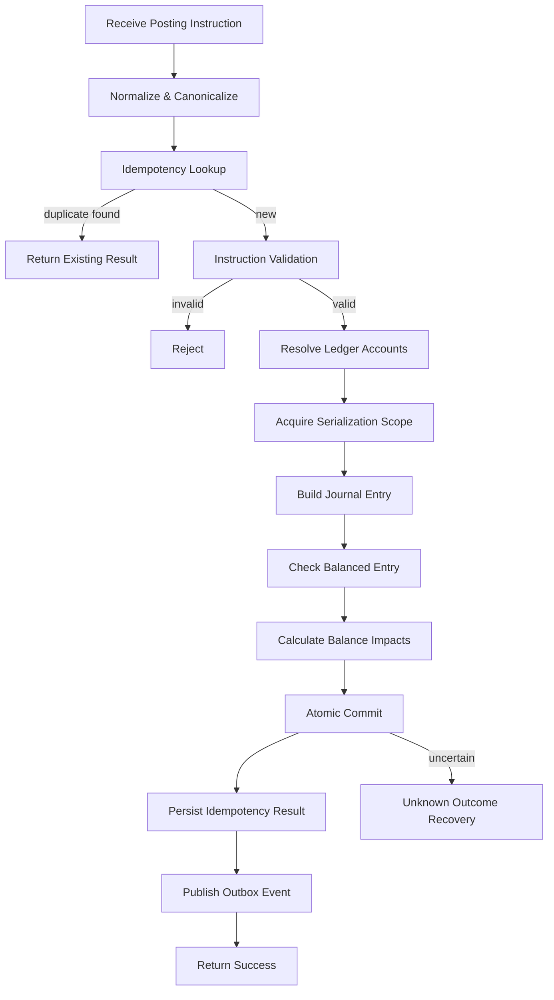
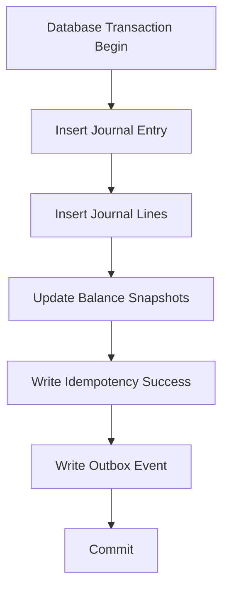
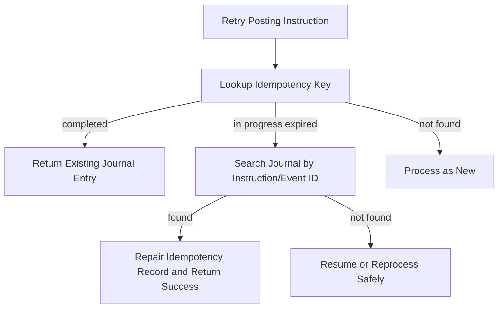
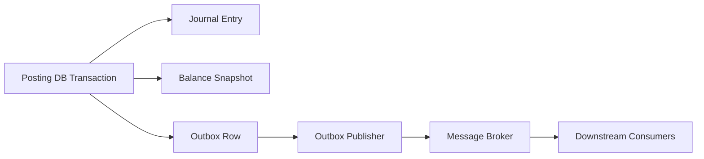
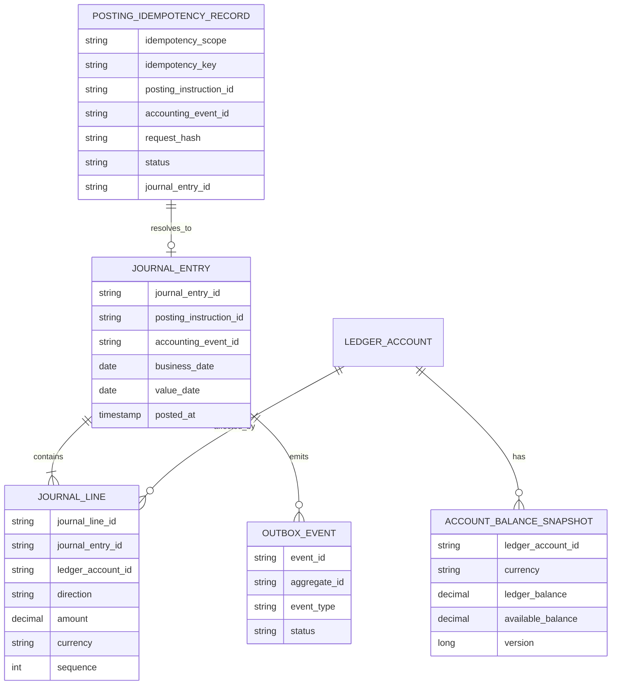

# Part 008 — Posting Engine Design: Validation, Idempotency, and Atomicity

The posting engine is the heart of a core banking system.

It is the component that turns approved financial intent into immutable ledger truth. If it is wrong, every downstream system becomes unreliable: account balances, statements, GL handoff, reconciliation, customer service, regulatory extracts, interest calculation, fee assessment, and risk reporting.

A posting engine is not just “insert transaction row and update balance”. It is a controlled ledger mutation mechanism.

This part focuses on three pillars:

1. **Validation** — only valid posting instructions may reach the ledger.
2. **Idempotency** — safe retry must not create duplicate money movement.
3. **Atomicity** — journal entry and balance impact must commit as one indivisible unit.

---

## 1. Kaufman Framing: The One Sub-Skill to Drill

The fastest way to improve as a core banking engineer is to practice this question repeatedly:

> If this request is retried, duplicated, partially processed, timed out, reversed, replayed, or backdated, can the ledger still explain exactly what happened?

Everything in the posting engine exists to answer that question.

### 1.1 What You Should Be Able to Do After This Part

After this part, you should be able to:

- design a posting engine boundary;
- define posting instruction invariants;
- distinguish command idempotency from posting idempotency;
- prevent duplicate journal entries;
- apply account-level serialization safely;
- commit journal entries and balance snapshots atomically;
- handle unknown outcomes after timeout/crash;
- design replay and repair flows;
- review a posting engine for correctness risks.

---

## 2. Posting Engine Responsibility

A posting engine answers one question:

> Given a valid posting instruction, can we produce exactly one immutable, balanced journal entry and the corresponding balance impacts?

It should not own every business rule in the bank.

### 2.1 It Should Own

- posting instruction validation;
- duplicate detection for posting instructions;
- balanced journal enforcement;
- ledger account existence/state validation;
- currency consistency validation;
- account-level ordering/serialization;
- atomic journal write;
- balance impact calculation;
- audit metadata capture;
- posting result publication;
- safe retry behavior;
- repair/unknown outcome support.

### 2.2 It Should Not Own

- customer authentication;
- channel-specific DTO parsing;
- AML/fraud decisioning;
- product eligibility rules;
- marketing campaign rules;
- UI statement wording;
- external clearing protocol parsing;
- loan amortization calculation, except where posting policy requires allocation output.

Those concerns feed posting instructions. They should not be hidden inside the posting engine.

---

## 3. Posting Engine Input and Output

### 3.1 Input: Posting Instruction

```java
public record PostingInstruction(
    PostingInstructionId id,
    AccountingEventId accountingEventId,
    PostingRuleId postingRuleId,
    List<PostingLineInstruction> lines,
    LocalDate businessDate,
    LocalDate valueDate,
    IdempotencyKey idempotencyKey,
    CorrelationId correlationId,
    Instant createdAt
) {}

public record PostingLineInstruction(
    LedgerAccountId ledgerAccountId,
    DebitCredit direction,
    Money amount,
    PostingLineRole role,
    String narrative
) {}
```

### 3.2 Output: Posting Result

```java
public sealed interface PostingResult
    permits PostingSucceeded, PostingRejected, PostingDuplicate, PostingUnknown {}
{
    PostingInstructionId instructionId();
}

public record PostingSucceeded(
    PostingInstructionId instructionId,
    JournalEntryId journalEntryId,
    LocalDate businessDate,
    Instant postedAt
) implements PostingResult {}

public record PostingRejected(
    PostingInstructionId instructionId,
    PostingRejectionReason reason
) implements PostingResult {}

public record PostingDuplicate(
    PostingInstructionId instructionId,
    JournalEntryId existingJournalEntryId
) implements PostingResult {}

public record PostingUnknown(
    PostingInstructionId instructionId,
    String recoveryHint
) implements PostingResult {}
```

The existence of `PostingUnknown` is important. In distributed systems, a timeout does not prove failure. The commit may have succeeded but the caller did not receive the response.

---

## 4. Posting Pipeline



A real implementation may combine some steps, but the conceptual order should remain explicit.

---

## 5. Posting Instruction Invariants

A posting instruction must satisfy minimum invariants before it reaches the journal commit step.

### 5.1 Structural Invariants

- instruction ID is present;
- accounting event ID is present;
- idempotency key is present;
- business date is present;
- value date is present;
- line count is at least two for ordinary double-entry movements;
- every line has account ID, direction, amount, currency, and role;
- amount is positive;
- no line has zero amount unless explicitly supported for metadata-only events;
- no duplicate line identity within the same instruction.

### 5.2 Accounting Invariants

- sum of debit equals sum of credit;
- currency balance is respected;
- posting rule is compatible with transaction type;
- debit/credit direction is compatible with account type and product policy;
- GL mapping is resolved;
- suspense usage is explicit and explainable;
- tax/fee lines are present when required.

### 5.3 Temporal Invariants

- business date is open or explicitly allowed for adjustment;
- value date is allowed for product/account;
- posting period is not closed, unless prior-period adjustment process is used;
- holiday/cutoff behavior has already been resolved;
- backdated transaction requires reason and authority.

### 5.4 Operational Invariants

- actor/source/correlation metadata is present;
- override reason is present when override is used;
- approval reference is present when required;
- repair reference is present for manual correction;
- original transaction reference is present for reversal.

---

## 6. Validation Pipeline Design

Validation should be composable and auditable.

```java
public interface PostingValidator {
    ValidationResult validate(PostingInstruction instruction, PostingContext context);
}

public record ValidationResult(
    boolean accepted,
    List<PostingViolation> violations
) {
    public static ValidationResult accepted() {
        return new ValidationResult(true, List.of());
    }

    public static ValidationResult rejected(List<PostingViolation> violations) {
        return new ValidationResult(false, List.copyOf(violations));
    }
}
```

### 6.1 Validator Chain

```java
public final class CompositePostingValidator implements PostingValidator {

    private final List<PostingValidator> validators;

    public CompositePostingValidator(List<PostingValidator> validators) {
        this.validators = List.copyOf(validators);
    }

    @Override
    public ValidationResult validate(PostingInstruction instruction, PostingContext context) {
        List<PostingViolation> violations = new ArrayList<>();

        for (PostingValidator validator : validators) {
            ValidationResult result = validator.validate(instruction, context);
            violations.addAll(result.violations());
        }

        return violations.isEmpty()
            ? ValidationResult.accepted()
            : ValidationResult.rejected(violations);
    }
}
```

### 6.2 Fail-Fast vs Collect-All

| Strategy | Use When | Trade-off |
|---|---|---|
| Fail-fast | security, corrupt input, missing account | cheaper, simpler, less diagnostic |
| Collect-all | batch validation, repair workflow | better operator feedback, more expensive |

For online posting, fail-fast may be appropriate. For batch/EOD posting, collect-all is often better because operators need a full break list.

---

## 7. Idempotency: The Most Misunderstood Requirement

Idempotency means:

> Repeating the same operation with the same idempotency identity must produce the same business result, not duplicate ledger impact.

It does not mean every similar request should be collapsed.

### 7.1 Command Idempotency vs Posting Idempotency

| Layer | Idempotency Meaning | Example Key |
|---|---|---|
| API/channel | same client request retry | channel + client idempotency key |
| Command | same internal intent | command ID or normalized business attempt key |
| Accounting event | same accepted financial fact | accounting event ID |
| Posting instruction | same ledger mutation plan | posting instruction ID + event ID |
| External payment | same network message/rail reference | external instruction ID |

Do not use one universal key for everything.

### 7.2 Good Idempotency Key Requirements

A posting idempotency key should be:

- deterministic for the same financial fact;
- unique for distinct business attempts;
- scoped by source/system/type;
- stored durably;
- checked before ledger mutation;
- associated with final result;
- protected from sensitive data leakage;
- resistant to accidental reuse.

Stripe's public API documentation is a useful general reference for idempotent request handling: idempotency keys allow clients to safely retry requests, and keys should not contain sensitive data. In banking core, the durability and audit requirement is usually stricter than ordinary public API idempotency.

---

## 8. Idempotency Store Design

### 8.1 Table Shape

```sql
CREATE TABLE posting_idempotency_record (
    idempotency_scope      VARCHAR(64)  NOT NULL,
    idempotency_key        VARCHAR(255) NOT NULL,
    posting_instruction_id VARCHAR(64)  NOT NULL,
    accounting_event_id    VARCHAR(64)  NOT NULL,
    request_hash           VARCHAR(128) NOT NULL,
    status                 VARCHAR(32)  NOT NULL,
    journal_entry_id       VARCHAR(64),
    rejection_code         VARCHAR(64),
    created_at             TIMESTAMP    NOT NULL,
    completed_at           TIMESTAMP,
    PRIMARY KEY (idempotency_scope, idempotency_key)
);
```

### 8.2 Request Hash

The request hash prevents accidental key reuse with different payload.

```java
public record IdempotencyFingerprint(
    String scope,
    String key,
    String canonicalPayloadHash
) {}
```

If the same key arrives with a different hash, return a conflict, not the previous result.

```txt
same key + same hash     -> return stored result
same key + different hash -> reject as idempotency conflict
new key                  -> process
```

### 8.3 Canonicalization

Hashing raw JSON is fragile because field order, whitespace, and formatting can change.

Better:

1. Normalize into internal posting instruction.
2. Sort lines deterministically when order does not matter.
3. Serialize canonical representation.
4. Hash canonical representation.

Be careful: if line order is meaningful for audit sequence, preserve order and hash it.

---

## 9. Atomicity: What Must Commit Together

At minimum, a successful posting must atomically commit:

- journal entry header;
- journal lines;
- balance mutations or balance snapshots;
- idempotency result;
- audit metadata;
- outbox event for downstream publication, if using transactional outbox.



If the journal commits without balance update, balances are wrong.

If balance updates commit without journal lines, audit is broken.

If journal commits without idempotency result, retry may duplicate posting.

If event publishes outside commit without outbox, downstream may see phantom or missing events.

---

## 10. Database Transaction Boundary

A common design:

```java
@Transactional
public PostingResult post(PostingInstruction instruction) {
    IdempotencyDecision idempotency = idempotencyService.checkOrStart(instruction);

    if (idempotency instanceof AlreadyCompleted completed) {
        return completed.toPostingResult();
    }

    validationService.validateOrThrow(instruction);

    SerializationScope scope = serializationScopeResolver.resolve(instruction);
    lockManager.acquire(scope);

    JournalEntry journalEntry = journalBuilder.build(instruction);
    balanceService.apply(journalEntry);
    journalRepository.save(journalEntry);
    idempotencyService.complete(instruction.idempotencyKey(), journalEntry.id());
    outboxRepository.save(PostingCompletedEvent.from(journalEntry));

    return new PostingSucceeded(instruction.id(), journalEntry.id(), journalEntry.businessDate(), journalEntry.postedAt());
}
```

This is conceptual. In real code, you must carefully decide whether you insert idempotency “in progress” before or inside the transaction. The strict requirement is: no committed journal entry should be left without a durable way to identify it during retry/recovery.

---

## 11. Journal-First vs Balance-First

A ledger system should treat the journal as the primary record. Balance is a derived or maintained projection.

### 11.1 Journal-First Principle

```txt
Journal is truth.
Balance is consequence.
Statement is view.
Report is aggregation.
```

This does not mean balance is recalculated from scratch for every query. In production, balance snapshots are maintained for performance. But correctness must be explainable from journal lines.

### 11.2 Balance Snapshot Table

```sql
CREATE TABLE account_balance_snapshot (
    ledger_account_id VARCHAR(64) NOT NULL,
    currency          CHAR(3)     NOT NULL,
    ledger_balance    DECIMAL(19, 4) NOT NULL,
    available_balance DECIMAL(19, 4) NOT NULL,
    version           BIGINT NOT NULL,
    updated_at        TIMESTAMP NOT NULL,
    PRIMARY KEY (ledger_account_id, currency)
);
```

The `version` supports optimistic concurrency if used. Some systems use pessimistic locks or partitioned serial processing instead.

---

## 12. Account-Level Serialization

Two postings affecting the same account must not produce inconsistent balances.

Example race:

```txt
Initial available balance = 100
Transaction A debits 80
Transaction B debits 80
```

Without serialization, both may read 100 and both may succeed, producing an unintended overdraft.

### 12.1 Serialization Scope

A posting engine must determine the accounts that need ordered mutation.

```java
public record SerializationScope(
    List<LedgerAccountId> lockedAccounts
) {}
```

For a transfer, lock both debtor and creditor balance rows.

To avoid deadlocks, acquire locks in deterministic order.

```java
public SerializationScope resolve(PostingInstruction instruction) {
    List<LedgerAccountId> accounts = instruction.lines().stream()
        .map(PostingLineInstruction::ledgerAccountId)
        .distinct()
        .sorted(Comparator.comparing(LedgerAccountId::value))
        .toList();

    return new SerializationScope(accounts);
}
```

### 12.2 Locking Options

| Strategy | How It Works | Pros | Risks |
|---|---|---|---|
| Pessimistic DB row lock | `SELECT ... FOR UPDATE` | simple correctness | contention, deadlock risk |
| Optimistic version | compare-and-set balance version | good for low conflict | retry storms under hot accounts |
| Account actor/queue | one worker per account/partition | strong ordering | operational complexity |
| Ledger partitioning | partition by account/currency | scalable | cross-partition transfer complexity |
| Stored procedure | database owns atomic mutation | high consistency | harder domain testing/versioning |

For a core banking ledger, correctness dominates elegance.

---

## 13. Deadlock Avoidance

Deadlocks often appear in transfer posting because transactions lock accounts in different order.

Bad:

```txt
Transfer 1 locks A then B
Transfer 2 locks B then A
```

Better:

```txt
Always lock accounts by sorted ledger_account_id
```

### 13.1 Rule

```txt
Every posting that touches multiple accounts must acquire account locks in a globally deterministic order.
```

This rule should be enforced in one place, not left to developers.

---

## 14. Building the Journal Entry

Journal building should be deterministic.

```java
public final class JournalBuilder {

    public JournalEntry build(PostingInstruction instruction, PostingContext context) {
        List<JournalLine> lines = new ArrayList<>();
        int sequence = 1;

        for (PostingLineInstruction line : instruction.lines()) {
            lines.add(new JournalLine(
                JournalLineId.newId(),
                line.ledgerAccountId(),
                line.direction(),
                line.amount(),
                BalanceImpact.from(line.direction(), line.amount()),
                sequence++
            ));
        }

        JournalEntry entry = new JournalEntry(
            JournalEntryId.newId(),
            instruction.id(),
            instruction.accountingEventId(),
            context.transactionId(),
            List.copyOf(lines),
            instruction.businessDate(),
            instruction.valueDate(),
            context.postingDate(),
            context.clock().instant(),
            context.postedBy(),
            instruction.correlationId()
        );

        assertBalanced(entry);
        return entry;
    }

    private void assertBalanced(JournalEntry entry) {
        Money debitTotal = entry.debitTotal();
        Money creditTotal = entry.creditTotal();

        if (!debitTotal.equals(creditTotal)) {
            throw new UnbalancedJournalEntryException(entry.id(), debitTotal, creditTotal);
        }
    }
}
```

In real multi-currency posting, you need per-currency balancing and explicit FX gain/loss or settlement lines.

---

## 15. Balance Impact Calculation

Balance behavior depends on account type.

For a customer deposit account, which is a liability of the bank:

- credit increases balance;
- debit decreases balance.

For an asset account, such as a loan receivable:

- debit increases balance;
- credit decreases balance.

### 15.1 Account Normal Balance

```java
public enum AccountClass {
    ASSET(DebitCredit.DEBIT),
    LIABILITY(DebitCredit.CREDIT),
    EQUITY(DebitCredit.CREDIT),
    INCOME(DebitCredit.CREDIT),
    EXPENSE(DebitCredit.DEBIT);

    private final DebitCredit normalBalance;

    AccountClass(DebitCredit normalBalance) {
        this.normalBalance = normalBalance;
    }

    public BigDecimal signedImpact(DebitCredit direction, BigDecimal amount) {
        return direction == normalBalance ? amount : amount.negate();
    }
}
```

### 15.2 Example

| Account Class | Direction | Balance Impact |
|---|---|---:|
| Liability deposit account | Credit | + |
| Liability deposit account | Debit | - |
| Asset loan account | Debit | + |
| Asset loan account | Credit | - |
| Income account | Credit | + |
| Expense account | Debit | + |

This logic must be centralized. If every service calculates debit/credit impact differently, the ledger will drift.

---

## 16. Available Balance Is Not Ledger Balance

Posting a journal entry updates ledger balance. Available balance may also consider holds, liens, float, overdraft, uncleared funds, and product rules.

```txt
available balance = ledger balance - holds - liens - uncleared debit impact + overdraft allowance + product-specific adjustments
```

A posting engine may update ledger balance directly, but available balance often requires a policy layer.

### 16.1 Debit Validation

A debit posting should check available funds where applicable.

But not all debits require the same rule:

| Debit Type | Available Funds Check? | Notes |
|---|---:|---|
| Customer transfer debit | Yes | usually strict |
| Fee debit | Maybe | may create overdraft depending policy |
| Loan repayment debit from deposit | Yes | source account rule |
| Interest capitalization | No | generated accounting event |
| Reversal debit | Depends | must preserve correction semantics |
| GL adjustment | Different | internal control process |

Do not hardcode “all debits require available balance”. That breaks fees, corrections, internal GL, and product-specific behavior.

---

## 17. Unknown Outcome Recovery

A caller posts an instruction. The database commits. The network times out before the caller receives success.

From caller perspective:

```txt
timeout
```

From ledger perspective:

```txt
journal committed
```

If the caller retries and the system posts again, money moves twice.

### 17.1 Recovery Rule

```txt
On retry, always check durable idempotency and journal records before attempting another ledger mutation.
```

### 17.2 Recovery Flow



### 17.3 Durable Natural Keys

You should have unique constraints beyond idempotency table.

Examples:

```sql
ALTER TABLE journal_entry
ADD CONSTRAINT uq_journal_posting_instruction
UNIQUE (posting_instruction_id);

ALTER TABLE journal_entry
ADD CONSTRAINT uq_journal_accounting_event
UNIQUE (accounting_event_id);
```

The exact constraints depend on whether an accounting event may produce multiple journal entries. But the principle remains: duplicate ledger mutation should be structurally difficult.

---

## 18. Posting Rejection vs Posting Failure

A posting rejection is a valid business/ledger decision.

A posting failure is a technical inability to determine or complete the decision.

| Result | Meaning | Retry? | Example |
|---|---|---:|---|
| Rejected | instruction invalid | No, unless input changes | unbalanced lines |
| Failed technically | infrastructure failed before decision | Yes | DB unavailable |
| Unknown | outcome uncertain | Recover first | timeout after commit attempt |
| Duplicate | already processed | Return previous result | same idempotency key |
| Repair pending | needs operator | Controlled retry | stuck in-progress record |

Do not represent all of these as `FAILED`.

---

## 19. Repair Queue Integration

A posting engine should not silently discard ambiguous cases.

Repair cases should include:

- instruction ID;
- accounting event ID;
- idempotency key;
- request hash;
- last known status;
- journal lookup result;
- exception stack or failure code;
- affected accounts;
- business date;
- value date;
- correlation ID;
- recommended action;
- operator decision fields.

```java
public record PostingRepairCase(
    CaseId caseId,
    PostingInstructionId instructionId,
    AccountingEventId accountingEventId,
    IdempotencyKey idempotencyKey,
    RepairReason reason,
    RepairStatus status,
    List<LedgerAccountId> affectedAccounts,
    LocalDate businessDate,
    CorrelationId correlationId,
    Instant openedAt
) {}
```

Repair is not an afterthought. It is part of the core operational model.

---

## 20. Outbox Event After Posting

Downstream systems need to know about posted entries:

- statement projection;
- notification;
- GL extract;
- data warehouse;
- reconciliation;
- risk analytics;
- operational dashboards.

But publishing directly to a broker inside the posting method is dangerous if it is not atomic with the database commit.

### 20.1 Transactional Outbox

```sql
CREATE TABLE outbox_event (
    event_id        VARCHAR(64) PRIMARY KEY,
    aggregate_type  VARCHAR(64) NOT NULL,
    aggregate_id    VARCHAR(64) NOT NULL,
    event_type      VARCHAR(128) NOT NULL,
    payload         JSONB NOT NULL,
    status          VARCHAR(32) NOT NULL,
    created_at      TIMESTAMP NOT NULL,
    published_at    TIMESTAMP
);
```

The posting transaction writes the journal and outbox row together. A separate publisher sends the event after commit.



Downstream consumers must still be idempotent. Outbox reduces missing/phantom events, but it does not eliminate duplicate delivery.

---

## 21. API Contract of the Posting Engine

The posting engine should have a narrow contract.

```java
public interface PostingEngine {
    PostingResult post(PostingInstruction instruction);
}
```

Avoid contracts like:

```java
void updateBalance(Account from, Account to, BigDecimal amount);
```

That hides accounting structure and makes extension painful.

### 21.1 Better Result Semantics

```java
public sealed interface PostingResult {
    boolean terminal();
    boolean ledgerMutated();
    boolean retryable();
}
```

Example:

| Result | Terminal | Ledger Mutated | Retryable |
|---|---:|---:|---:|
| Succeeded | Yes | Yes | No |
| Duplicate | Yes | Yes | No |
| Rejected | Yes | No | No |
| TechnicalFailureBeforeCommit | No | No | Yes |
| Unknown | No | Unknown | Recover first |
| RepairPending | No | Unknown/No | Operator-driven |

---

## 22. Posting Engine Database Schema Sketch

A simplified relational schema:



This is not the full banking schema. It is the minimal skeleton needed to reason about posting correctness.

---

## 23. Testing the Posting Engine

Posting engine tests should attack invariants, not just happy paths.

### 23.1 Unit Tests

- rejects unbalanced instruction;
- rejects negative amount;
- rejects missing account;
- rejects closed ledger account;
- rejects unsupported currency;
- derives correct debit/credit balance impact;
- produces deterministic journal lines;
- returns duplicate result for same idempotency key;
- rejects same key with different payload hash.

### 23.2 Integration Tests

- journal and balance commit atomically;
- rollback leaves no partial journal;
- retry after timeout returns existing journal;
- concurrent debits cannot overdraw account;
- lock order prevents deadlock under transfer storm;
- outbox row exists after successful posting;
- duplicate outbox publish is safe for consumer.

### 23.3 Property Tests

For generated posting instructions:

```txt
For every accepted posting instruction:
  total debit == total credit
  all amounts > 0
  all journal lines reference existing accounts
  balance delta equals signed sum of journal lines
  retry does not change total balance twice
```

Property tests are extremely valuable for ledger code because the invariant is clearer than individual examples.

---

## 24. Example: Concurrent Debit Test Sketch

```java
@Test
void concurrentDebitsMustNotBothSucceedWhenFundsInsufficient() throws Exception {
    AccountId accountId = fixture.createDepositAccountWithBalance("USD", "100.00");

    PostingInstruction debit80a = fixture.customerDebit(accountId, "USD", "80.00", "A");
    PostingInstruction debit80b = fixture.customerDebit(accountId, "USD", "80.00", "B");

    ExecutorService executor = Executors.newFixedThreadPool(2);

    Future<PostingResult> resultA = executor.submit(() -> postingEngine.post(debit80a));
    Future<PostingResult> resultB = executor.submit(() -> postingEngine.post(debit80b));

    List<PostingResult> results = List.of(resultA.get(), resultB.get());

    long successCount = results.stream().filter(r -> r instanceof PostingSucceeded).count();
    long rejectionCount = results.stream().filter(r -> r instanceof PostingRejected).count();

    assertEquals(1, successCount);
    assertEquals(1, rejectionCount);

    Money finalBalance = balanceRepository.findLedgerBalance(accountId, CurrencyCode.USD);
    assertEquals(Money.of("USD", "20.00"), finalBalance);
}
```

This test is more valuable than a hundred tests that only verify one transfer succeeded.

---

## 25. Observability for Posting

This series already has a dedicated observability track, so we only define posting-specific signals.

### 25.1 Metrics

- posting requests total;
- posting success total;
- posting rejection total by reason;
- posting duplicate total;
- posting unknown outcome total;
- posting latency;
- lock wait time;
- deadlock retry count;
- hot account contention;
- repair case count;
- outbox lag;
- journal-balance mismatch count.

### 25.2 Logs

Every posting log should include:

- correlation ID;
- posting instruction ID;
- accounting event ID;
- journal entry ID if known;
- business date;
- affected account IDs, carefully protected if sensitive;
- result class;
- rejection/failure reason.

### 25.3 Traces

Trace spans should separate:

- idempotency lookup;
- validation;
- account lock acquisition;
- journal build;
- balance update;
- idempotency completion;
- outbox write.

The goal is not just performance debugging. It is operational explainability.

---

## 26. Security and Privacy Boundaries

Posting metadata must be enough for audit, but not reckless.

Avoid storing sensitive customer data in:

- idempotency keys;
- correlation IDs;
- raw log lines;
- outbox headers;
- exception messages;
- metrics labels.

Good:

```txt
idempotency_scope = MOBILE_TRANSFER
idempotency_key = 8f5b7f4c-... opaque UUID
```

Bad:

```txt
idempotency_key = john.doe@example.com-transfer-1000-to-123456789
```

This aligns with general API idempotency guidance: avoid sensitive data in idempotency keys. In banking, the same discipline should extend to logs, metrics, traces, and operational case metadata.

---

## 27. Common Anti-Patterns

### 27.1 Insert Transaction Then Update Balance Later

```txt
insert transaction row
commit
update balance
commit
```

If the process crashes between commits, the ledger is split-brain.

### 27.2 Update Balance Without Journal

```txt
account.balance = account.balance - amount
```

This destroys auditability. You can no longer explain why the balance changed.

### 27.3 Idempotency Only in Memory

An in-memory idempotency map fails on restart, redeploy, horizontal scaling, and disaster recovery.

Posting idempotency must be durable.

### 27.4 Retrying Unknown Outcome as New

Timeout is not failure. Retrying as new may duplicate money movement.

### 27.5 One Lock Per API Request

Locking by request ID does not protect account balance. Lock the resource whose invariant can be violated: usually ledger account or account balance row.

### 27.6 Publishing Event Before Commit

If the event is published and the database rolls back, downstream observes a transaction that does not exist.

### 27.7 Treating Duplicate as Error

A duplicate retry with the same payload and idempotency key is often a success retrieval, not an error. The caller wants the original outcome.

---

## 28. Posting Engine Review Rubric

Use this as a design review checklist.

### 28.1 Correctness

- Is every journal entry balanced?
- Is balance mutation derived from journal lines?
- Are balance and journal committed atomically?
- Are duplicate postings structurally prevented?
- Can a timeout after commit be recovered?
- Are multi-account locks acquired deterministically?

### 28.2 Domain Clarity

- Does the engine accept posting instructions, not API requests?
- Are accounting events separated from integration events?
- Are rejection reasons explicit?
- Are temporal fields business-specific?
- Is posting policy separate from channel logic?

### 28.3 Operations

- Are unknown outcomes visible?
- Is there a repair queue?
- Can operators search by instruction ID, event ID, journal ID, and correlation ID?
- Can the system explain failed/rejected postings?
- Is outbox lag monitored?

### 28.4 Audit

- Can every journal line trace back to accounting event and command?
- Are manual overrides recorded with actor and reason?
- Are reversals linked to original postings?
- Are corrections append-only?
- Is evidence retained according to policy?

### 28.5 Scale

- Are hot accounts identified?
- Is lock wait time measured?
- Are batch postings restartable?
- Can read projections scale without weakening ledger correctness?
- Does partitioning preserve money movement invariants?

---

## 29. Practice: Design a Posting Decision Table

For each scenario, decide posting result.

| Scenario | Expected Result | Reason |
|---|---|---|
| Same idempotency key, same payload, already posted | Duplicate/success retrieval | safe retry |
| Same idempotency key, different payload | Rejected conflict | key reuse risk |
| Unbalanced debit/credit lines | Posting rejected | accounting invariant violation |
| DB unavailable before journal insert | Technical failure | retryable |
| Timeout after commit | Unknown then recover | outcome uncertain |
| Closed ledger account | Posting rejected | invalid account state |
| Two concurrent debits exceed funds | one success, one rejection | account-level serialization |
| Outbox publish fails after commit | posting remains success | publisher retries outbox |
| Balance row updated but journal insert failed | impossible if atomic | design must prevent |
| Reversal of non-existent journal entry | rejected | missing original reference |

---

## 30. Minimal Reference Algorithm

```txt
function post(instruction):
  fingerprint = canonicalize_and_hash(instruction)

  begin transaction

    existing = find_idempotency(scope, key)

    if existing.completed and existing.hash == fingerprint:
      return existing.result

    if existing.completed and existing.hash != fingerprint:
      return idempotency_conflict

    if not existing:
      insert_idempotency_in_progress(scope, key, fingerprint)

    validate_instruction(instruction)
    accounts = resolve_affected_accounts(instruction)
    lock_accounts_in_deterministic_order(accounts)
    journal = build_balanced_journal(instruction)
    apply_balance_impacts(journal)
    insert_journal(journal)
    mark_idempotency_completed(scope, key, journal.id)
    insert_outbox_event(journal_posted)

  commit transaction

  return success(journal.id)
```

Real systems must handle exceptions around the transaction boundary and reconcile in-progress records. But this algorithm captures the backbone.

---

## 31. Summary

A posting engine is a ledger mutation control system.

The core principles:

- accept posting instructions, not raw channel requests;
- validate before mutation;
- enforce double-entry balance;
- treat journal as truth;
- update balance as an atomic consequence of journal;
- use durable idempotency;
- distinguish duplicate, rejected, failed, and unknown;
- serialize by affected ledger account;
- acquire locks deterministically;
- recover unknown outcomes before retrying;
- publish downstream events through an outbox;
- make repair and audit first-class.

If Part 007 gave us the vocabulary, Part 008 gives us the safety mechanism.

In Part 009, we will go into reversal, adjustment, correction, and backdated transactions: the parts of core banking that separate toy ledgers from real banking systems.

---

## References

- ISO 20022, “Business Model”, https://www.iso20022.org/iso20022-repository/business-model
- ISO 20022, “ISO 20022 Message Definitions”, https://www.iso20022.org/iso-20022-message-definitions
- Stripe Docs, “Idempotent requests”, https://docs.stripe.com/api/idempotent_requests
- Stripe Engineering, “Designing robust and predictable APIs with idempotency”, https://stripe.com/blog/idempotency
- OpenTelemetry, “Documentation”, https://opentelemetry.io/docs/
