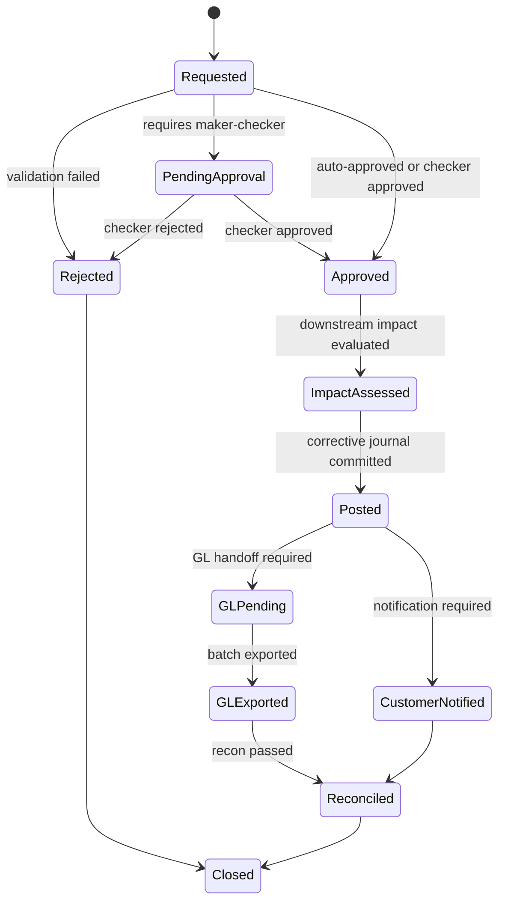
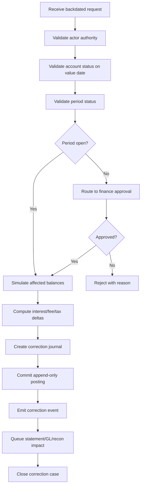
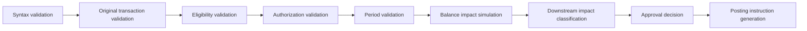
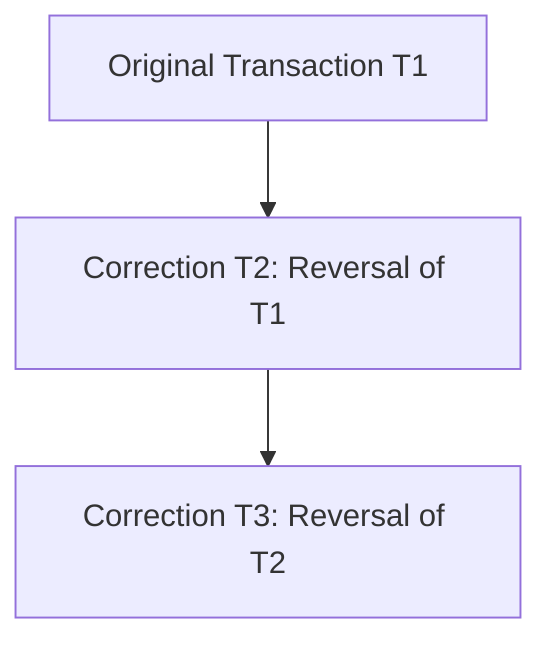

# Part 009 — Reversal, Adjustment, Correction, and Backdated Transaction

> Core question: when something wrong has already affected customer balance, ledger, statement, downstream events, reports, or operational evidence, how do we fix it without destroying truth?

A mature banking system does not treat correction as a database update. It treats correction as a **new controlled financial fact** linked to the original financial fact.

This part is one of the highest-leverage parts of the series because many banking failures are not caused by a missing `try/catch`, but by weak correction semantics:

- a posted transaction is edited in place;
- a duplicate posting is deleted from the table;
- a reversal changes only customer balance but not GL impact;
- a backdated correction recalculates reports silently;
- a repair operator can “fix” production without an evidence trail;
- a payment return is modeled as a technical rollback even though settlement has already happened.

In core banking, historical records are not just implementation details. They are operational evidence.

---

## 1. Kaufman Skill Slice

Using Josh Kaufman's learning method, this part decomposes the correction domain into concrete sub-skills.

| Sub-skill | What you must be able to do |
|---|---|
| Distinguish correction types | Know when to use reversal, adjustment, refund, return, chargeback, amendment, or compensating entry. |
| Preserve auditability | Never erase a posted fact; link every corrective action to cause, approver, actor, and evidence. |
| Preserve accounting integrity | Ensure correction entries are balanced, idempotent, and mapped to GL. |
| Handle time correctly | Separate posting date, value date, event time, accounting period, and business date. |
| Assess downstream impact | Know which statements, reports, interest accruals, fees, notifications, and projections are affected. |
| Design repair workflow | Model maker-checker, reason code, queue state, SLA, and closure reason. |

The target capability is not memorizing names. The target capability is this:

> Given a wrong transaction scenario, you can decide the correct correction pattern, explain why other patterns are unsafe, design the ledger entries, define the audit metadata, and specify the operational controls.

---

## 2. Core Mental Model: History Is Evidence, Correction Is New Evidence

A weak system thinks:

```txt
wrong row -> update row -> now row is right
```

A banking-grade system thinks:

```txt
original fact -> corrective fact -> linked evidence chain -> explainable final position
```

The practical rule:

> Posted financial history should be append-corrected, not overwritten.

This is not only an accounting preference. It is a reliability, audit, reconciliation, and customer-trust requirement.

A posted transaction may already have caused:

- ledger balance changes;
- available balance changes;
- customer statement entries;
- accounting journal entries;
- GL batch handoff;
- fees or interest calculations;
- payment messages;
- fraud/AML signals;
- customer notifications;
- regulatory extract records;
- downstream events to data warehouse, CRM, risk, or finance systems.

When you mutate the original transaction, you break the ability to explain what happened.

---

## 3. Terminology That Must Not Be Confused

Correction vocabulary is often used loosely. In a core banking system, the differences matter.

| Term | Meaning | Typical use |
|---|---|---|
| Reversal | A new transaction that negates the accounting effect of a previous transaction. | Wrong debit/credit, duplicate posting, failed downstream after financial impact. |
| Adjustment | A new transaction that changes financial position by a delta without necessarily mirroring the original transaction. | Interest correction, fee waiver, tax correction, rounding difference. |
| Amendment | A non-financial or contract-level change to attributes or terms. | Fix narration, update maturity instruction, amend product parameter if permitted. |
| Cancellation | Stop a transaction before it becomes financially posted or externally committed. | Pending payment before cutoff, unapproved teller instruction. |
| Refund | Return money to customer after a valid charge or purchase flow. | Fee refund, merchant refund, service reversal with customer-facing semantics. |
| Return | Payment rail sends back a transaction after clearing/settlement lifecycle. | ACH/clearing return, rejected beneficiary account, insufficient funds return. |
| Chargeback | Dispute-driven reversal/claim process, commonly card-related. | Customer dispute, card scheme dispute lifecycle. |
| Write-off | Recognize that an asset is no longer expected to be recovered. | Loan loss, fees receivable write-off. |
| Backdated transaction | Transaction whose effective/value date is earlier than the current business/posting date. | Late instruction, migration correction, operational repair, interest adjustment. |

The danger is treating all of these as `reverseTransaction(originalId)`.

A payment return is not always a reversal. A refund is not always a reversal. A backdated adjustment is not necessarily a mutation of old balances. A cancellation is only possible before a committed financial effect exists.

---

## 4. Temporal Vocabulary: The Most Common Source of Bugs

Core banking needs multiple time dimensions.

| Time concept | Meaning | Example |
|---|---|---|
| Event time | When the external/business event actually occurred. | Customer initiated transfer at 10:03. |
| Received time | When the core system received the instruction. | Mobile channel sent command at 10:04. |
| Decision time | When validation/authorization accepted or rejected it. | Posting engine accepted at 10:04:01. |
| Posting date | Business date on which the ledger records the transaction. | Bank business date 2026-06-28. |
| Value date | Date from which value/interest/economic effect applies. | Deposit valued from 2026-06-27. |
| Accounting period | Financial period used for GL/reporting. | June 2026 open period. |
| Settlement date | Date funds settle over external rail/correspondent. | Interbank settlement on T+1. |
| Statement date | Date shown on statement or customer-facing history. | Customer statement includes line on 2026-06-28. |

A single transaction may have several correct dates at once. Collapsing all of them into `created_at` is a design smell.

---

## 5. Decision Matrix: Which Correction Pattern Should Be Used?

Use this as a first-pass triage table.

| Scenario | Correct pattern | Why |
|---|---|---|
| Pending transaction not yet posted | Cancel | No financial fact exists yet. |
| Duplicate posted transaction | Reverse duplicate | The duplicate already affected balances and evidence. |
| Wrong amount posted same business day | Full reversal + repost, or controlled adjustment | Full reversal is easier to explain; adjustment may be allowed if policy permits. |
| Wrong narration only, no financial impact | Amendment with audit trail | No ledger impact should be created. |
| Fee charged correctly but customer gets goodwill refund | Refund/fee waiver transaction | The original fee was valid; the later refund is a new business decision. |
| External payment returned by clearing system | Return transaction | It follows payment rail lifecycle, not technical rollback. |
| Payment failed before external submission but internal debit posted | Reversal | Internal financial effect exists; reverse it. |
| Interest was under-accrued for prior days | Interest adjustment with value-date evidence | Need current correction linked to prior economic period. |
| Closed accounting period error | Prior-period adjustment / controlled finance workflow | Do not silently rewrite closed period data. |
| Migration opening balance wrong | Migration correction entry with migration evidence | Preserve original load and correction lineage. |

The top 1% habit: do not ask “how do I reverse this?” first. Ask:

1. Has a financial fact been committed?
2. Has the effect left the core boundary?
3. Has it reached GL, statement, settlement, customer notification, or reporting?
4. Is the affected accounting period open or closed?
5. Is the intended fix symmetric, delta-based, or lifecycle-based?
6. What evidence must be preserved?

---

## 6. Correction State Machine

A correction should be a workflow, not an ad-hoc update.



Important: `Posted` is not always the end. For banking operations, the correction is fully closed only after required reconciliation, GL handoff, customer treatment, and evidence capture are complete.

---

## 7. Canonical Correction Domain Model

A clean design separates original transaction, correction request, correction decision, and resulting posting.

```java
public enum CorrectionType {
    CANCELLATION,
    FULL_REVERSAL,
    PARTIAL_REVERSAL,
    DELTA_ADJUSTMENT,
    NARRATIVE_AMENDMENT,
    REFUND,
    PAYMENT_RETURN,
    PRIOR_PERIOD_ADJUSTMENT,
    MIGRATION_CORRECTION
}

public enum CorrectionReasonCode {
    DUPLICATE_POSTING,
    WRONG_AMOUNT,
    WRONG_ACCOUNT,
    WRONG_VALUE_DATE,
    FEE_WAIVER,
    CUSTOMER_DISPUTE,
    CLEARING_RETURN,
    MIGRATION_DEFECT,
    OPERATIONAL_ERROR,
    REGULATORY_REMEDIATION
}

public record CorrectionRequest(
        String correctionRequestId,
        String originalTransactionId,
        CorrectionType type,
        CorrectionReasonCode reasonCode,
        String requestedBy,
        String sourceChannel,
        String businessJustification,
        LocalDate requestedBusinessDate,
        Optional<LocalDate> requestedValueDate,
        Optional<Money> requestedAmount,
        Map<String, String> evidenceReferences,
        String idempotencyKey
) {}
```

Notice what is not here: direct balance mutation.

A correction request is an instruction. It becomes financial only after validation, approval, and posting.

---

## 8. Original Transaction Linkage

Every corrective financial transaction should link to the original transaction.

Recommended fields:

| Field | Purpose |
|---|---|
| `original_transaction_id` | Direct link to the transaction being corrected. |
| `correction_group_id` | Groups reversal and repost entries into one correction case. |
| `correction_type` | Machine-readable correction semantics. |
| `reason_code` | Controlled vocabulary for reporting and analytics. |
| `reason_description` | Human-readable explanation. |
| `requested_by` | Maker / operator / system actor. |
| `approved_by` | Checker / supervisor / automated policy decision. |
| `approval_policy_id` | Which approval rule allowed the correction. |
| `evidence_uri` | Link to case, document, ticket, statement, or external message. |
| `impact_assessment_id` | Link to downstream impact review. |
| `business_date` | Business date of the correction posting. |
| `value_date` | Economic effective date if different. |

This is how a future auditor can answer:

> Why does the customer's final balance differ from the first statement entry?

---

## 9. Ledger Pattern: Full Reversal

Assume an internal transfer was posted incorrectly from account A to account B.

Original posting from A to B, modeled from bank liability perspective:

| Line | Debit | Credit |
|---|---:|---:|
| Customer Deposit Liability - A | 100 |  |
| Customer Deposit Liability - B |  | 100 |

This reduced the bank's liability to A and increased its liability to B.

Full reversal:

| Line | Debit | Credit |
|---|---:|---:|
| Customer Deposit Liability - B | 100 |  |
| Customer Deposit Liability - A |  | 100 |

Now the accounting effect is neutralized, while both facts remain visible.

Then, if the intended transfer was A to C, post a new correct transaction:

| Line | Debit | Credit |
|---|---:|---:|
| Customer Deposit Liability - A | 100 |  |
| Customer Deposit Liability - C |  | 100 |

The final ledger is explainable:

```txt
T1  wrong A -> B
T2  reversal of T1
T3  correct A -> C
```

This is more defensible than editing T1 from B to C.

---

## 10. Ledger Pattern: Delta Adjustment

A delta adjustment is useful when the original transaction is conceptually valid, but the final amount needs a correction.

Example: interest credited was 9.95 but should have been 10.00.

Original interest credit:

| Line | Debit | Credit |
|---|---:|---:|
| Interest Expense | 9.95 |  |
| Customer Deposit Liability |  | 9.95 |

Adjustment:

| Line | Debit | Credit |
|---|---:|---:|
| Interest Expense | 0.05 |  |
| Customer Deposit Liability |  | 0.05 |

This avoids reversing and reposting a large batch when a controlled delta is sufficient.

But use delta adjustment carefully. It is harder to reason about if abused because the reader must reconstruct original + deltas.

Policy suggestion:

- Use **full reversal + repost** for wrong account, wrong direction, duplicate, or wrong transaction type.
- Use **delta adjustment** for interest, fee, tax, rounding, or batch-calculated correction where the original business event remains valid.

---

## 11. Backdated Transaction: What It Really Means

A backdated transaction does not mean “insert a row in the past.”

It means:

> Post a new controlled fact today whose economic/value-date effect relates to a prior date.

This distinction is critical.

Bad approach:

```sql
UPDATE transaction
SET created_at = '2026-06-20'
WHERE id = 'T999';
```

Better approach:

```txt
business_date = 2026-06-28
posting_timestamp = 2026-06-28T16:33:14
value_date = 2026-06-20
reason = LATE_CORRECTION
period_status = OPEN or APPROVED_PRIOR_PERIOD
```

The correction is posted now, but it may trigger recalculation of economic effects from the value date.

---

## 12. Backdating Impact Surface

Before approving a backdated transaction, assess impact.

| Area | Question |
|---|---|
| Balance timeline | Does historical available/ledger balance need restatement or explanation? |
| Interest | Does interest accrual need recalculation from the value date? |
| Fees | Would minimum balance fee, overdraft fee, or maintenance fee change? |
| Statement | Has a statement already been issued? If yes, amendment or next-cycle correction? |
| GL | Is the accounting period open or closed? |
| Tax | Does tax withholding or tax reporting change? |
| Regulatory reporting | Has the date/amount already been included in regulatory extract? |
| Customer notification | Should customer be told? In what wording? |
| Reconciliation | Does external recon need update or break closure? |
| Downstream events | Which projections must receive correction events? |

Backdating is a controlled operation, not merely a date field.

---

## 13. Backdated Posting Algorithm

A defensible backdated posting workflow:



The key step is simulation before posting. A backdated entry may be financially valid but operationally unacceptable without impact disclosure.

---

## 14. Backdated Balance Timeline

There are two common models.

### Model A: Immutable Historical Statements + Current Correction

You do not rewrite old customer-visible statements. You show a current correction entry with value-date explanation.

Best when:

- statements have already been issued;
- period is closed;
- customer communication needs clarity;
- audit defensibility is more important than making the past screen “look clean.”

### Model B: Recomputed Effective Balance Timeline

You keep historical transaction facts append-only, but projections can show effective balance as of historical value date.

Best when:

- account-level interest depends on value dates;
- statement is not yet issued;
- operational calendar still allows same-cycle correction;
- projections are explicitly rebuildable.

Avoid mixing both silently. Define what each screen/report means:

- `posted_balance_as_of_business_date`
- `effective_balance_as_of_value_date`
- `statement_balance_as_issued`
- `recomputed_balance_for_interest`

---

## 15. Idempotency for Correction Requests

Correction requests are often retried by repair tools, workflow engines, or operations users.

A correction command needs idempotency.

Recommended idempotency scope:

```txt
correction_type + original_transaction_id + reason_code + requested_amount + requested_value_date + source_case_id
```

Do not use only `original_transaction_id`, because one original transaction may legitimately have multiple corrections over time.

Example:

```java
public record CorrectionIdempotencyFingerprint(
        CorrectionType correctionType,
        String originalTransactionId,
        CorrectionReasonCode reasonCode,
        Optional<Money> amount,
        Optional<LocalDate> valueDate,
        String sourceCaseId
) {
    public String canonicalHash() {
        return Hashing.sha256()
                .hashString(toCanonicalString(), StandardCharsets.UTF_8)
                .toString();
    }
}
```

The idempotency record should store:

- request hash;
- resulting correction transaction id;
- response status;
- failure state if outcome is unknown;
- created and expiry timestamp if policy allows expiry.

For banking corrections, expiry must be conservative. A duplicate correction after several days may still be dangerous.

---

## 16. Correction Validation Pipeline

A correction should pass layered validation.



### Validation Questions

| Layer | Examples |
|---|---|
| Syntax | Is amount positive? Is currency valid? Is reason code allowed? |
| Original transaction | Does original exist? Is it posted? Is it already fully reversed? |
| Eligibility | Is this transaction type reversible? Has settlement occurred? |
| Authorization | Can this actor request this correction? Is maker-checker required? |
| Period | Is posting date open? Is value date in closed period? |
| Balance | Would adjustment breach constraints or limits? |
| Downstream | Does correction require GL, statement, tax, recon, or customer notification? |
| Approval | Does amount/age/type require supervisor, finance, risk, or compliance approval? |

---

## 17. Reversal Eligibility Is Not Universal

Do not put a generic `reverse()` method on every transaction type without policy.

Example rules:

| Transaction type | Reversible? | Notes |
|---|---|---|
| Internal transfer | Usually yes | If both accounts are internal and no external settlement. |
| Cash withdrawal | Yes with cash/teller control | Needs cash drawer impact. |
| Fee charge | Usually yes/refundable | May require fee income reversal or refund treatment. |
| Interest accrual | Usually via adjustment | Batch interest may require delta. |
| External payment submitted to clearing | Not technical reversal | Use cancellation, return, recall, or refund depending lifecycle. |
| Loan repayment | Conditional | May affect schedule, overdue bucket, interest, and collateral. |
| Tax withholding | Highly controlled | May require tax/reporting workflow. |
| Closed account transaction | Controlled only | May require reopening or suspense workflow. |

Top engineer thinking: reversibility is a product + accounting + operations + rail lifecycle question, not just a coding question.

---

## 18. Reversal of a Reversal

Sometimes an operator reverses the wrong transaction. Then someone asks to reverse the reversal.

A system must support it, but with clarity.

```txt
T1 = original transaction
T2 = reversal of T1
T3 = reversal of T2
```

Net effect:

- T1 effect is restored;
- history remains visible;
- T3 must reference T2, not pretend T2 never happened.

The correction graph should prevent cycles and ambiguity.



Validation rule:

```txt
A correction may target a previous correction, but the correction graph must be acyclic and explainable.
```

---

## 19. Partial Reversal

Partial reversal is dangerous when used casually.

Example: reverse 30 out of a 100 fee.

This could be modeled as:

1. partial reversal of original fee; or
2. refund/waiver adjustment of 30.

The difference matters:

| Pattern | Meaning |
|---|---|
| Partial reversal | Part of original transaction is considered invalid. |
| Refund/waiver | Original transaction was valid, but bank grants money back. |

For customer complaints, the second may be more accurate. For wrong amount, the first may be more accurate.

Design implication: do not let operators choose “partial reversal” simply because it is convenient. Force a reason code and business semantics.

---

## 20. Repair Queue Integration

Correction requests often originate from an exception queue.

Example failure:

```txt
External payment submitted.
Internal debit posted.
Clearing gateway times out.
Outcome unknown.
```

Bad repair pattern:

```txt
Operator sees timeout -> reverses debit immediately
```

Better pattern:

1. classify unknown outcome;
2. query clearing/settlement status;
3. if external payment accepted, do not reverse as failed;
4. if external payment rejected, reverse or return according to lifecycle;
5. if still unknown, put in suspense/repair with SLA.

Repair queues should encode business state, not just error message text.

---

## 21. Correction Events for Downstream Systems

Downstream systems need correction semantics, not just new balance.

Example event:

```json
{
  "eventType": "TransactionCorrected",
  "correctionTransactionId": "TXN-20260628-0091",
  "originalTransactionId": "TXN-20260627-1120",
  "correctionType": "FULL_REVERSAL",
  "reasonCode": "WRONG_ACCOUNT",
  "businessDate": "2026-06-28",
  "valueDate": "2026-06-27",
  "amount": { "currency": "IDR", "minorUnits": 1000000 },
  "requiresStatementUpdate": true,
  "requiresGLAdjustment": true,
  "sourceCaseId": "CASE-44812"
}
```

Downstream consumers can then decide:

- rebuild projection;
- amend statement;
- generate notification;
- reopen reconciliation item;
- create GL adjustment batch;
- enrich risk/reporting lineage.

Do not emit only `BalanceUpdated`.

---

## 22. Statement Treatment

Customer statement handling is a product and regulatory-sensitive decision.

Typical options:

| Situation | Statement treatment |
|---|---|
| Same-day correction before statement generation | Show original + reversal or only net? Depends disclosure policy. |
| Statement already issued | Show correction in next statement with reference. |
| Fee refund | Show refund/waiver as separate customer-understandable line. |
| Backdated value date | Show posting date and value date if relevant. |
| Wrong account exposure | May require customer communication and privacy review. |

From an engineering view, statement entries should not be generated by blindly dumping ledger lines. They need customer-facing semantics.

---

## 23. Accounting Period Control

A correction that affects a closed accounting period is a finance control issue.

Rules usually include:

- cannot post directly into closed period without privileged approval;
- prior-period adjustment must be classified;
- GL must receive correct period metadata;
- reporting impact must be assessed;
- the original closed-period report may remain as issued, with correction reflected in later period depending policy;
- evidence must show who approved period impact.

Minimal fields:

```txt
posting_business_date
value_date
accounting_period
period_status_at_request
period_override_approval_id
prior_period_adjustment_flag
finance_case_id
```

---

## 24. Java Service Design

A correction service should not directly call a generic ledger mutation method. It should produce a posting instruction.

```java
public final class CorrectionApplicationService {

    private final TransactionRepository transactionRepository;
    private final CorrectionPolicy correctionPolicy;
    private final ImpactAssessmentService impactAssessmentService;
    private final ApprovalService approvalService;
    private final PostingInstructionFactory postingInstructionFactory;
    private final PostingEngine postingEngine;

    public CorrectionResult requestCorrection(CorrectionRequest request) {
        var original = transactionRepository.getPosted(request.originalTransactionId());

        var policyDecision = correctionPolicy.evaluate(request, original);
        if (policyDecision.rejected()) {
            return CorrectionResult.rejected(policyDecision.reason());
        }

        var impact = impactAssessmentService.assess(request, original);
        var approval = approvalService.decide(request, original, impact);

        if (approval.requiresManualApproval()) {
            return CorrectionResult.pendingApproval(approval.approvalCaseId());
        }

        var instruction = postingInstructionFactory.forCorrection(
                request,
                original,
                impact,
                approval
        );

        var posted = postingEngine.post(instruction);
        return CorrectionResult.posted(posted.transactionId());
    }
}
```

The application service orchestrates. It does not compute accounting rules inline.

---

## 25. Policy Object Example

```java
public interface CorrectionPolicy {
    CorrectionPolicyDecision evaluate(CorrectionRequest request, PostedTransaction original);
}

public final class DefaultCorrectionPolicy implements CorrectionPolicy {
    @Override
    public CorrectionPolicyDecision evaluate(CorrectionRequest request, PostedTransaction original) {
        if (original.isFullyReversed()) {
            return CorrectionPolicyDecision.reject("Original transaction already fully reversed");
        }

        if (original.type().isExternalPayment() && original.settlementState().isSettled()) {
            return CorrectionPolicyDecision.reject(
                    "Settled external payment requires payment return/recall workflow"
            );
        }

        if (request.type() == CorrectionType.PRIOR_PERIOD_ADJUSTMENT
                && !request.evidenceReferences().containsKey("financeApproval")) {
            return CorrectionPolicyDecision.manualApproval("Finance approval required");
        }

        return CorrectionPolicyDecision.accept();
    }
}
```

Notice the rejection is business-specific. This is not a technical exception.

---

## 26. Database Shape

A simplified schema:

```sql
CREATE TABLE correction_case (
    correction_case_id       VARCHAR(64) PRIMARY KEY,
    original_transaction_id  VARCHAR(64) NOT NULL,
    correction_type          VARCHAR(40) NOT NULL,
    reason_code              VARCHAR(60) NOT NULL,
    status                   VARCHAR(40) NOT NULL,
    requested_by             VARCHAR(120) NOT NULL,
    approved_by              VARCHAR(120),
    business_justification   TEXT NOT NULL,
    requested_business_date  DATE NOT NULL,
    requested_value_date     DATE,
    source_channel           VARCHAR(60) NOT NULL,
    source_case_id           VARCHAR(64),
    idempotency_hash         VARCHAR(128) NOT NULL UNIQUE,
    created_at               TIMESTAMP NOT NULL,
    updated_at               TIMESTAMP NOT NULL
);

CREATE TABLE transaction_correction_link (
    correction_case_id       VARCHAR(64) NOT NULL,
    original_transaction_id  VARCHAR(64) NOT NULL,
    correction_transaction_id VARCHAR(64) NOT NULL,
    relationship_type        VARCHAR(40) NOT NULL,
    PRIMARY KEY (correction_case_id, correction_transaction_id)
);
```

Do not overload the original transaction row with every correction field. A correction is a case/workflow plus one or more financial outputs.

---

## 27. Anti-Patterns

### Anti-pattern 1: Update Posted Transaction

```sql
UPDATE journal_line SET amount = 0 WHERE transaction_id = ?;
```

Why bad:

- destroys audit trail;
- breaks GL reconciliation;
- invalidates statements;
- causes downstream mismatch;
- makes incident reconstruction impossible.

### Anti-pattern 2: Reversal Without Original Link

A reversal that does not reference the original is just another transaction. It is not explainable.

### Anti-pattern 3: Correction Without Reason Code

Free-text reason is useful, but not enough. Controlled reason codes support reporting, root-cause analysis, operational risk, and recurring defect detection.

### Anti-pattern 4: Generic Reversal for External Payments

External payment rails have their own lifecycle. After submission or settlement, correction may need cancellation, recall, return, refund, or dispute workflow.

### Anti-pattern 5: Silent Backdating

Backdating without impact assessment can corrupt interest, fees, statement, GL, and regulatory extracts.

---

## 28. Production Checklist

Before allowing correction in production, verify:

- [ ] Posted records are append-only.
- [ ] Reversal creates balanced journal entries.
- [ ] Correction links to original transaction.
- [ ] Correction has reason code and evidence.
- [ ] Idempotency protects duplicate repair submissions.
- [ ] Backdated postings are impact-assessed.
- [ ] Closed-period correction requires approval.
- [ ] GL handoff receives correction semantics.
- [ ] Statement treatment is defined.
- [ ] Reconciliation can match original/reversal/repost group.
- [ ] Operations can search by original transaction, correction case, and reason code.
- [ ] Downstream events distinguish reversal, adjustment, refund, and return.
- [ ] Metrics track correction volume and reason distribution.

---

## 29. Observability Signals Specific to Corrections

Do not only count errors. Count correction behavior.

| Metric | Why it matters |
|---|---|
| `correction_requests_total{type,reason}` | Detect operational defect patterns. |
| `correction_rejected_total{reason}` | Reveal bad repair attempts or policy friction. |
| `correction_approval_latency` | SLA for operations and customer impact. |
| `backdated_correction_total{days_back}` | Detect risky historical changes. |
| `prior_period_adjustment_total` | Finance control signal. |
| `duplicate_posting_reversal_total` | Idempotency/control defect signal. |
| `correction_reconciliation_break_total` | Shows whether corrections cause recon instability. |

Useful logs should include:

```txt
correction_case_id
original_transaction_id
correction_transaction_id
correction_type
reason_code
requested_by
approved_by
business_date
value_date
source_case_id
```

---

## 30. Practice: Evaluate These Scenarios

For each scenario, decide correction type, ledger effect, approval requirement, and downstream impact.

### Scenario A

A teller posted cash deposit to account 123 instead of account 132. Same business day. Statement not generated.

Expected thinking:

- reverse wrong account credit;
- post correct account credit;
- link both in correction case;
- require teller supervisor approval;
- cash drawer should remain unchanged if original cash receipt was valid.

### Scenario B

Monthly maintenance fee was charged correctly, but relationship manager approves goodwill refund.

Expected thinking:

- do not mark original fee invalid;
- post refund/waiver transaction;
- reason code `GOODWILL_FEE_REFUND` or similar;
- possible income reversal or refund accounting depending policy.

### Scenario C

Interest batch missed one day due to rate table defect.

Expected thinking:

- calculate delta interest;
- post interest adjustment with affected value date;
- link to batch defect case;
- assess tax and statement impact;
- root-cause the rate table governance defect.

### Scenario D

External payment was debited from customer, sent to clearing, then clearing returned it next day.

Expected thinking:

- model as payment return, not technical rollback;
- post return according to rail response;
- preserve original payment and return message evidence;
- update payment lifecycle status.

---

## 31. Top 1% Engineer Rubric

You understand this part when you can answer these without hand-waving:

1. Why is deleting a duplicate posted transaction unsafe?
2. When is full reversal better than delta adjustment?
3. Why is payment return different from reversal?
4. What is the difference between posting date and value date?
5. What happens if a backdated transaction affects an already issued statement?
6. How do you make correction requests idempotent?
7. How do you prevent reversal cycles from becoming incomprehensible?
8. What metadata is required for audit evidence?
9. How does closed accounting period status change correction workflow?
10. What event should downstream systems receive after a correction?

---

## 32. Key Takeaways

- Posted financial history should be append-corrected, not overwritten.
- Correction type is a business/accounting decision, not merely a technical operation.
- Reversal, adjustment, refund, return, chargeback, cancellation, and amendment are different concepts.
- Backdated transaction means controlled value-date effect, not rewriting time.
- Correction must preserve original linkage, reason, actor, approval, evidence, and impact assessment.
- External payment correction must respect rail lifecycle.
- A correction is not complete until ledger, GL, statement, reconciliation, and downstream impacts are handled.

---

## Reference Anchors

- IFRS Conceptual Framework for Financial Reporting — elements of financial statements and accounting concepts.
- ISO 20022 Message Definitions — financial message definitions and lifecycle-related payment messages.
- Basel Committee BCBS 239 — risk data aggregation, lineage, completeness, accuracy, timeliness, and reporting governance.
- FFIEC Architecture, Infrastructure, and Operations booklet — operational controls and technology governance context for financial institutions.
