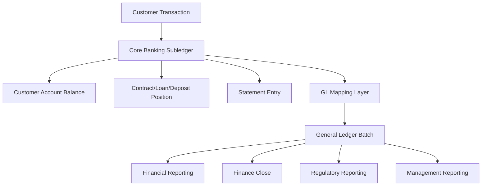
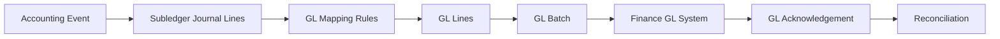
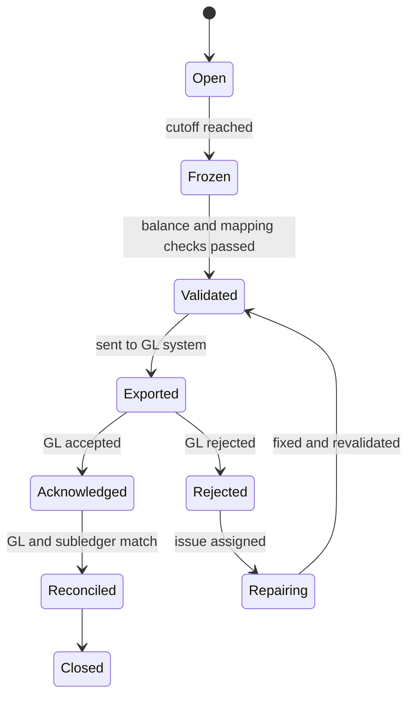
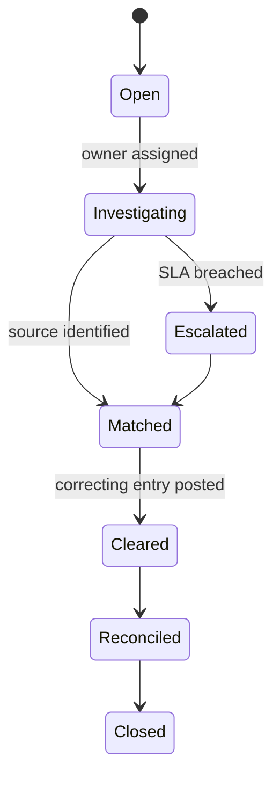
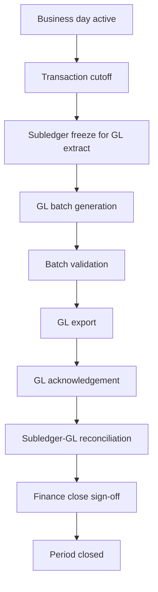
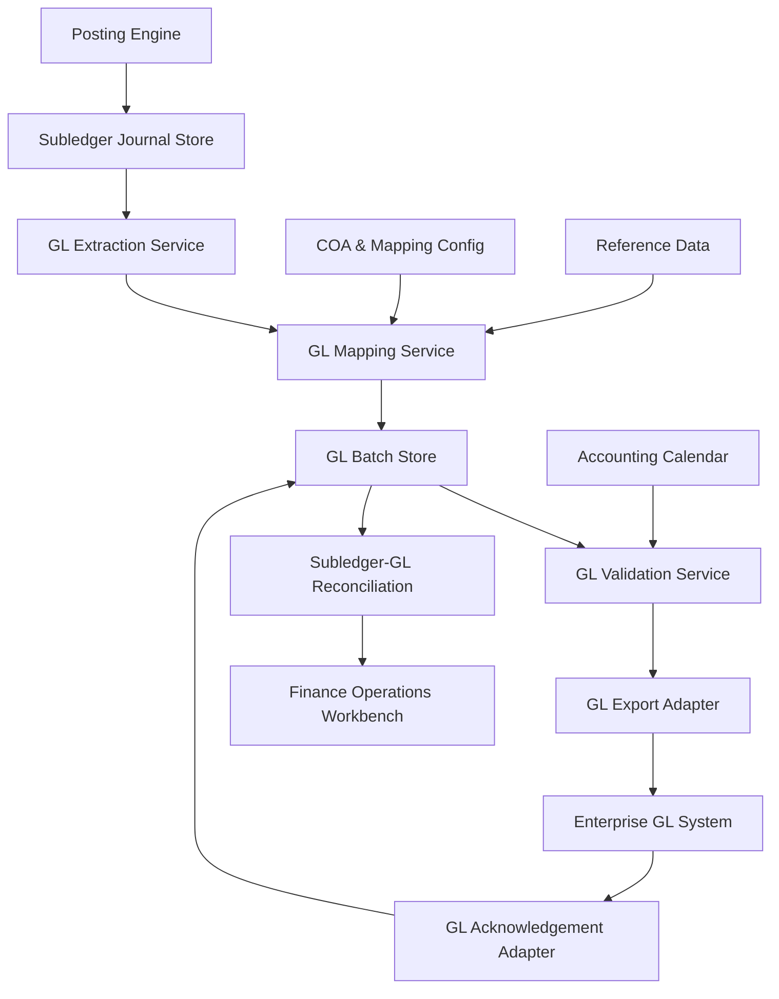

# Part 010 — Subledger, General Ledger, and Chart of Accounts Interface

> Core question: how does a core banking ledger that tracks millions of customer-level balances safely feed the bank's financial books without losing traceability?

A core banking system is usually a **subledger**. It records detailed financial activity at customer/account/contract level. The **general ledger** records aggregated accounting impact for financial reporting, finance operations, and enterprise accounting.

A top engineer must understand both layers.

If you only understand customer balance, you will miss accounting control.
If you only understand GL, you will miss customer-level causality.
A real core banking platform must connect both without breaking either.

---

## 1. Kaufman Skill Slice

This part decomposes the skill into practical sub-skills.

| Sub-skill | What you must be able to do |
|---|---|
| Separate subledger and GL | Know what belongs in account-level ledger vs enterprise accounting ledger. |
| Design chart mapping | Map product/transaction/currency/branch dimensions to GL accounts. |
| Preserve traceability | Link GL batch lines back to subledger journal lines. |
| Handle suspense and clearing | Know when money is temporarily unmatched, pending, or externally settling. |
| Design GL interface | Build export, acknowledgement, retry, reconciliation, and period controls. |
| Validate accounting balance | Ensure every subledger batch and GL batch is balanced by currency/entity/period. |

The target skill:

> Given a transaction type, you can identify its customer-level ledger lines, GL mapping, accounting dimensions, batch handoff, reconciliation controls, and failure behavior.

---

## 2. Mental Model: Subledger Explains Customers, GL Explains the Institution



The subledger answers:

- What happened to account 123?
- Which transaction changed available balance?
- What is the loan principal outstanding?
- Which statement entries explain the customer balance?
- Which original event caused this posting?

The GL answers:

- What are total customer deposit liabilities?
- What is interest income/expense for the period?
- What assets/liabilities/income/expense should appear in financial reports?
- Did the accounting batch for branch/currency/product balance?
- Are suspense accounts cleared?

---

## 3. Core Accounting Categories

A chart of accounts normally maps postings into accounting categories such as:

| Category | Meaning in banking examples |
|---|---|
| Asset | Cash, settlement receivable, loan principal receivable, nostro balance. |
| Liability | Customer deposits, accrued interest payable, unsettled customer credits. |
| Income | Fee income, loan interest income, penalty income. |
| Expense | Deposit interest expense, card scheme fees, operational charges. |
| Equity | Capital and retained earnings; usually not directly handled by retail core transaction flows. |

A customer deposit account is usually a **liability** of the bank: the bank owes money to the customer.

That is why a deposit credit to customer does not simply mean “increase asset.” It often increases the bank's liability.

---

## 4. Subledger vs General Ledger

| Concern | Subledger | General Ledger |
|---|---|---|
| Granularity | Customer/account/contract/transaction line | Aggregated accounting account/dimension/period |
| Primary user | Core operations, customer service, product operations | Finance, accounting, reporting, treasury |
| Query style | Account history, balance, statement, transaction trace | Trial balance, income statement, balance sheet, close reports |
| Mutability | Append-corrected, high traceability | Period-controlled, finance-governed |
| Volume | Very high | Lower, aggregated or batch-level |
| Time sensitivity | Real-time or near-real-time | Real-time, near-real-time, or EOD depending bank architecture |
| Reconciliation | Must reconcile to GL and external systems | Must reconcile to subledger, bank statements, and financial reports |

A common architecture mistake is trying to make one table serve both purposes.

---

## 5. The Role of Chart of Accounts

The chart of accounts is the controlled catalog of GL accounts.

Example simplified COA:

| GL account | Name | Type |
|---|---|---|
| 100100 | Cash on Hand | Asset |
| 110200 | Settlement Receivable | Asset |
| 120000 | Customer Loan Principal | Asset |
| 200100 | Customer Savings Deposits | Liability |
| 200200 | Customer Current Deposits | Liability |
| 210100 | Accrued Interest Payable | Liability |
| 400100 | Loan Interest Income | Income |
| 410100 | Fee Income | Income |
| 500100 | Deposit Interest Expense | Expense |
| 999000 | Suspense Account | Control/Suspense |

A core banking platform should not hard-code these numbers in transaction code. It should map accounting events to GL accounts through governed configuration.

---

## 6. GL Dimensions

Modern GL handoff usually includes dimensions, not just account number.

Common dimensions:

| Dimension | Example |
|---|---|
| Legal entity | Bank subsidiary or branch entity. |
| Branch / cost center | Branch 001, digital banking, treasury. |
| Product | Savings, current account, term deposit, mortgage, SME loan. |
| Currency | IDR, USD, EUR. |
| Customer segment | Retail, SME, corporate. |
| Channel | Teller, mobile, batch, API partner. |
| Transaction code | Cash deposit, internal transfer, fee charge, interest accrual. |
| Tax code | Withholding tax, VAT/GST where applicable. |
| Project/campaign | Promotional fee waiver, migration batch. |

The mapping key is often multi-dimensional:

```txt
transaction_code + product_code + currency + branch + customer_segment + accounting_event_type
```

Do not make `transaction_code -> gl_account` the only mapping. It will fail as products and accounting treatments diverge.

---

## 7. GL Mapping Layer

The GL mapping layer translates subledger posting lines into accounting lines.



Example mapping rule:

```yaml
transactionCode: CASH_DEPOSIT
productType: SAVINGS
currency: IDR
branch: '*'
entries:
  - side: DEBIT
    source: CASH_ON_HAND
    glAccount: '100100'
  - side: CREDIT
    source: CUSTOMER_DEPOSIT_LIABILITY
    glAccount: '200100'
```

For a cash deposit, customer balance increases, and bank cash asset also increases.

Subledger view:

| Line | Debit | Credit |
|---|---:|---:|
| Cash on Hand | 1,000,000 |  |
| Customer Deposit Liability |  | 1,000,000 |

Customer-facing view:

```txt
Account credited +1,000,000 IDR
```

Accounting view:

```txt
Asset cash increased; liability to customer increased.
```

Both are true. They are just different lenses.

---

## 8. Control Accounts

A control account is a GL account whose balance should reconcile to a detailed subledger balance.

Examples:

| Control account | Should reconcile to |
|---|---|
| Customer Savings Deposits | Sum of all savings account ledger balances. |
| Customer Current Deposits | Sum of all current account ledger balances. |
| Loan Principal Receivable | Sum of all loan principal outstanding. |
| Accrued Interest Payable | Sum of deposit interest accrued but not paid. |
| Accrued Interest Receivable | Sum of loan interest accrued but not paid. |

Reconciliation rule:

```txt
GL control account balance == sum(subledger balances in mapped population)
```

Differences indicate:

- missing GL batch;
- duplicate GL batch;
- incorrect mapping;
- manual GL entry without subledger source;
- subledger correction not exported;
- timing difference;
- currency/branch/product dimension mismatch.

---

## 9. Suspense, Clearing, and Settlement Accounts

Not all money can be immediately matched to final customer or external position.

### Suspense Account

A suspense account temporarily holds amounts that cannot yet be classified or matched.

Examples:

- incoming payment with invalid account number;
- migration difference pending investigation;
- unmatched reconciliation item;
- operational correction awaiting evidence.

Rules:

- suspense must be aged;
- owner must be assigned;
- reason must be classified;
- clearing must be traceable;
- long-aged suspense should escalate.

### Clearing Account

A clearing account holds temporary amounts between lifecycle stages.

Example:

```txt
Customer debit accepted today.
External settlement completes tomorrow.
```

The bank may use clearing/settlement accounts to represent pending external movement.

### Settlement Account

A settlement account reflects actual or expected settlement with payment rail, correspondent, central bank, or counterparty.

Do not hide settlement complexity inside customer account balance alone.

---

## 10. Example: Internal Transfer GL Impact

Transfer from customer A savings to customer B savings within same bank and same product.

Subledger:

| Line | Debit | Credit |
|---|---:|---:|
| Customer Deposit Liability - A | 100 |  |
| Customer Deposit Liability - B |  | 100 |

GL impact may net to zero if both map to the same GL control account, currency, branch, and product.

But if dimensions differ, GL may need lines:

| GL account | Branch | Debit | Credit |
|---|---|---:|---:|
| Customer Savings Deposits | Branch A | 100 |  |
| Customer Savings Deposits | Branch B |  | 100 |

The total institution liability is unchanged, but branch-level liability moved.

This is why GL mapping cannot be only account-number based. Dimensions matter.

---

## 11. Example: Fee Charge

Monthly account maintenance fee charged to a savings account.

Customer-facing:

```txt
Fee debit -10,000 IDR
```

Accounting view from bank perspective:

| Line | Debit | Credit |
|---|---:|---:|
| Customer Deposit Liability | 10,000 |  |
| Fee Income |  | 10,000 |

The bank reduces liability to customer and recognizes income.

If fee is later refunded as goodwill:

| Line | Debit | Credit |
|---|---:|---:|
| Fee Income / Fee Refund Expense | 10,000 |  |
| Customer Deposit Liability |  | 10,000 |

Whether to debit income directly or use a refund/contra-income account depends on accounting policy. The system should support configuration, not hard-code a single accounting treatment.

---

## 12. Example: Deposit Interest Accrual and Capitalization

Daily accrual before payment:

| Line | Debit | Credit |
|---|---:|---:|
| Deposit Interest Expense | 500 |  |
| Accrued Interest Payable |  | 500 |

Capitalization/payment to customer account:

| Line | Debit | Credit |
|---|---:|---:|
| Accrued Interest Payable | 500 |  |
| Customer Deposit Liability |  | 500 |

This separates recognition of expense from payment/credit to customer. That separation matters for period reporting.

---

## 13. Example: Loan Repayment

A loan repayment from customer deposit account may have multiple allocation buckets.

Payment amount: 1,000

Allocation:

- principal: 700
- interest: 250
- penalty fee: 50

Accounting example:

| Line | Debit | Credit |
|---|---:|---:|
| Customer Deposit Liability | 1,000 |  |
| Loan Principal Receivable |  | 700 |
| Loan Interest Income / Interest Receivable |  | 250 |
| Penalty Fee Income |  | 50 |

The customer sees one repayment. Accounting sees multiple financial impacts.

---

## 14. GL Batch Lifecycle

A GL interface is not simply `send(file.csv)`.



Batch states should be explicit.

Important fields:

| Field | Purpose |
|---|---|
| `gl_batch_id` | Core-side batch identity. |
| `business_date` | Bank business date. |
| `accounting_period` | Financial reporting period. |
| `legal_entity` | Entity whose books are affected. |
| `currency` | Currency of batch. |
| `source_system` | Core banking module/source. |
| `status` | Open, validated, exported, acknowledged, rejected, reconciled. |
| `export_sequence` | Supports idempotent file/API handoff. |
| `control_total_debit` | Batch validation. |
| `control_total_credit` | Batch validation. |
| `line_count` | Completeness validation. |

---

## 15. GL Interface Invariants

A GL batch must satisfy strict invariants.

| Invariant | Explanation |
|---|---|
| Balanced by currency | Debit equals credit for each currency. |
| Balanced by legal entity | Entity-level books must balance. |
| Valid COA | Every GL account exists and is active for posting date. |
| Valid dimensions | Branch/product/cost center/currency mapping is valid. |
| Period open | Accounting period accepts posting or override is approved. |
| Traceable source | Every GL line traces back to subledger source or approved manual source. |
| Idempotent export | Retry cannot duplicate GL posting. |
| Reconciled acknowledgement | Core knows whether GL accepted, rejected, or outcome is unknown. |

---

## 16. GL Line Traceability

Each GL line should be traceable.

```java
public record GLLine(
        String glLineId,
        String glBatchId,
        String glAccount,
        AccountingSide side,
        Money amount,
        LocalDate businessDate,
        YearMonth accountingPeriod,
        String legalEntity,
        String branch,
        String productCode,
        String transactionCode,
        String sourceJournalLineId,
        String sourceTransactionId,
        Optional<String> correctionCaseId
) {}
```

For aggregated GL lines, one GL line may represent many source journal lines. In that case, keep an aggregation bridge table.

```sql
CREATE TABLE gl_line_source_bridge (
    gl_line_id          VARCHAR(64) NOT NULL,
    source_journal_line_id VARCHAR(64) NOT NULL,
    source_transaction_id  VARCHAR(64) NOT NULL,
    amount_minor_units     BIGINT NOT NULL,
    currency               CHAR(3) NOT NULL,
    PRIMARY KEY (gl_line_id, source_journal_line_id)
);
```

Without this bridge, aggregated GL is faster but less explainable.

---

## 17. GL Mapping Rule Model

A simplified Java model:

```java
public record GLMappingRule(
        String ruleId,
        String transactionCode,
        String productCode,
        String accountingEventType,
        Optional<String> branchPattern,
        Optional<String> currencyPattern,
        LocalDate effectiveFrom,
        Optional<LocalDate> effectiveTo,
        List<GLMappingEntry> entries,
        String approvalStatus,
        String version
) {}

public record GLMappingEntry(
        AccountingSide side,
        String sourceRole,
        String glAccount,
        Map<String, String> dimensionExpressions
) {}
```

Example `sourceRole` values:

- `CUSTOMER_DEPOSIT_LIABILITY`
- `CASH_ON_HAND`
- `FEE_INCOME`
- `INTEREST_EXPENSE`
- `LOAN_PRINCIPAL_RECEIVABLE`
- `ACCRUED_INTEREST_PAYABLE`
- `SUSPENSE`
- `SETTLEMENT_RECEIVABLE`

The posting engine should produce semantic roles. The GL mapper resolves roles to chart accounts.

---

## 18. Effective-Dated Mapping

GL mappings change over time.

Do not update a mapping rule in place and make old transactions appear to have used new mapping.

Use effective dating and versioning:

```txt
rule_id = FEE_SAVINGS_IDR
version = 3
effective_from = 2026-07-01
effective_to = null
approved_by = finance-controller-01
```

Each posted transaction should retain the mapping version used, or the mapping should be reproducible from posting date and effective dating.

Recommended field on GL line:

```txt
gl_mapping_rule_id
gl_mapping_rule_version
```

---

## 19. Mapping Governance

GL mapping configuration is financial control data.

It should have:

- maker-checker approval;
- effective date;
- version history;
- simulation before activation;
- restricted access;
- environment promotion controls;
- rollback plan;
- regression test pack;
- finance sign-off.

A wrong GL mapping can make customer balances correct but financial statements wrong.

---

## 20. Batch vs Real-Time GL Handoff

There are two common patterns.

### EOD Batch Handoff

Subledger posts during business day. GL extract runs at EOD.

Benefits:

- simpler finance close control;
- easier batch validation;
- lower GL integration volume;
- operational repair before export.

Costs:

- GL not real-time;
- intraday finance view delayed;
- EOD batch failure can block close.

### Near Real-Time Handoff

Each financial event or small batch flows to GL quickly.

Benefits:

- more current finance view;
- smaller batches;
- faster detection of mapping issues.

Costs:

- idempotency and acknowledgement complexity;
- harder correction/reversal coordination;
- more integration load;
- finance period controls must be enforced continuously.

A mature architecture may combine them: near-real-time operational GL projection plus official EOD finance close batch.

---

## 21. Idempotency in GL Export

If the core sends a GL batch and the network times out, the core may not know whether GL received it.

Never solve this by sending a fresh batch with a new identity.

Use stable export identity:

```txt
gl_batch_id + export_sequence + content_hash
```

GL-side or interface-side should reject duplicates or return the same acknowledgement for the same batch identity.

Core-side states:

| State | Meaning |
|---|---|
| `EXPORTED` | Sent, awaiting acknowledgement. |
| `ACKNOWLEDGED` | GL accepted. |
| `REJECTED` | GL rejected with reason. |
| `UNKNOWN_OUTCOME` | Timeout or technical ambiguity. |
| `RECONCILED` | GL accepted and control totals match. |

Unknown outcome is not the same as failed.

---

## 22. Reconciliation Between Subledger and GL

Core-to-GL reconciliation has multiple levels.

| Level | Reconciliation question |
|---|---|
| Batch control | Did debit total equal credit total? Did line count match? |
| Export acknowledgement | Did GL accept the batch id and content hash? |
| Account balance | Does GL control account equal subledger aggregate? |
| Dimension balance | Does branch/product/currency dimension match subledger? |
| Source trace | Can every GL line be traced to source journal lines? |
| Correction trace | Are reversals/adjustments exported and grouped correctly? |

Example reconciliation query:

```sql
SELECT
    product_code,
    currency,
    SUM(CASE WHEN side = 'CREDIT' THEN amount_minor_units ELSE -amount_minor_units END) AS subledger_liability
FROM subledger_journal_line
WHERE business_date <= :businessDate
  AND ledger_role = 'CUSTOMER_DEPOSIT_LIABILITY'
GROUP BY product_code, currency;
```

Compare to GL balances for mapped control accounts.

---

## 23. Handling GL Rejection

A GL rejection is operationally serious.

Common reasons:

- invalid GL account;
- inactive cost center;
- closed accounting period;
- unbalanced batch;
- invalid currency/account combination;
- duplicate batch id;
- content hash mismatch;
- missing required dimension.

Do not let support operators patch files manually without system evidence.

Correct workflow:

1. mark batch `REJECTED`;
2. capture GL rejection code/message;
3. classify root cause;
4. if mapping issue, fix mapping through governed process;
5. regenerate or repair batch with versioned evidence;
6. re-export idempotently;
7. reconcile;
8. close with reason.

---

## 24. Manual GL Entries and Subledger Integrity

Finance teams sometimes post manual GL entries.

Danger:

```txt
GL control account adjusted manually, but subledger remains unchanged.
```

This creates permanent reconciliation breaks unless managed.

Rules:

- manual entries to control accounts should be restricted;
- if allowed, they must reference approved recon/correction case;
- subledger impact must be assessed;
- long-term difference must not be hidden;
- manual GL entry should not be used to “fix” customer balances.

Control account discipline is essential.

---

## 25. Suspense Account Lifecycle

Suspense should be visible and controlled.



Fields:

| Field | Purpose |
|---|---|
| `suspense_item_id` | Unique suspense case. |
| `source_transaction_id` | Link to originating event if known. |
| `amount` | Suspense amount. |
| `currency` | Currency. |
| `reason_code` | Why suspense was used. |
| `owner_team` | Responsible team. |
| `age_days` | Operational risk indicator. |
| `clearing_transaction_id` | Transaction that cleared suspense. |
| `evidence_reference` | Investigation evidence. |

A suspense account without aging and ownership becomes a graveyard for unresolved defects.

---

## 26. Period Close and GL Cutoff

Core banking must respect finance close.

Typical flow:



After cutoff, late postings require defined treatment:

- next business date posting;
- backdated value date with current posting date;
- finance-approved prior-period adjustment;
- operational rejection.

The system must not let business services bypass period state.

---

## 27. Multi-Currency Considerations

GL batches must balance by currency. Currency conversion introduces more lines.

Example: customer buys USD using IDR.

Possible lines:

| Line | Currency | Debit | Credit |
|---|---|---:|---:|
| Customer IDR Deposit Liability | IDR | 15,500,000 |  |
| FX Settlement / Cash IDR | IDR |  | 15,500,000 |
| FX Settlement / Cash USD | USD | 1,000 |  |
| Customer USD Deposit Liability | USD |  | 1,000 |
| FX Gain/Loss | IDR | delta | delta |

Exact treatment depends on policy, rates, and accounting rules. The architecture implication is stable:

- amount currency must be explicit;
- exchange rate source must be captured;
- rate timestamp/effective date must be captured;
- gain/loss treatment must be configured;
- reconciliation must handle currency-specific totals.

---

## 28. Java Boundary Design

A good architecture separates posting, mapping, and export.

```java
public interface SubledgerJournalRepository {
    List<JournalLine> findUnexportedLines(LocalDate businessDate);
}

public interface GLMapper {
    List<GLLine> map(JournalEntry journalEntry, GLMappingContext context);
}

public interface GLBatchRepository {
    GLBatch save(GLBatch batch);
    Optional<GLBatch> findByBusinessDateAndSequence(LocalDate businessDate, int sequence);
}

public interface GLExporter {
    GLExportResult export(GLBatch batch);
}

public interface GLReconciliationService {
    ReconciliationResult reconcile(GLBatch batch);
}
```

Do not let `PostingEngine` know the external GL file format. The posting engine should produce accounting events and journal lines. The GL interface handles mapping/export.

---

## 29. Reference Architecture



Key separation:

- posting engine creates immutable accounting facts;
- mapping service translates facts to enterprise COA;
- export adapter handles protocol/file/API;
- reconciliation service validates acceptance and totals;
- finance workbench handles rejected batches and breaks.

---

## 30. Testing Strategy

GL interface testing must go beyond unit tests.

| Test type | Purpose |
|---|---|
| Mapping unit test | Given transaction/product/currency, correct GL account/dimensions. |
| Balance property test | Generated GL batch always debits = credits by currency/entity. |
| Effective-date test | Old transactions use old mapping; new transactions use new mapping. |
| Re-export idempotency test | Retried export does not duplicate GL posting. |
| Rejection workflow test | Invalid account rejection creates repair case. |
| Reconciliation test | Subledger aggregate equals GL control account. |
| Correction test | Reversal/adjustment exports correct GL lines. |
| Period close test | Closed period blocks unauthorized posting. |

Property-based test example:

```txt
For any generated set of balanced subledger journal entries,
when mapped to GL,
then total debit equals total credit per legal entity and currency.
```

---

## 31. Common Anti-Patterns

### Anti-pattern 1: Hard-Coded GL Accounts in Java Code

Bad:

```java
if (transactionCode.equals("FEE")) {
    credit("410100");
}
```

Why bad:

- finance cannot govern changes;
- deployment required for accounting config;
- historical mapping becomes unclear;
- product variants break logic.

### Anti-pattern 2: Aggregated GL Without Source Trace

Aggregation is fine. Untraceable aggregation is not.

### Anti-pattern 3: Suspense Without Owner

Suspense without aging, owner, and reason code becomes hidden loss/error inventory.

### Anti-pattern 4: GL Rejection Treated as Technical Retry Only

Some GL rejections are business/configuration defects. Retrying blindly repeats failure.

### Anti-pattern 5: One Balance Field Feeds Everything

Customer balance, subledger control total, GL balance, and statement balance have different semantics.

### Anti-pattern 6: Manual GL Fix for Subledger Problem

This hides the customer-level defect and creates reconciliation debt.

---

## 32. Operational Metrics

Track GL interface health.

| Metric | Meaning |
|---|---|
| `gl_batch_generated_total{business_date}` | Batch generation volume. |
| `gl_batch_rejected_total{reason}` | Mapping/config/period quality. |
| `gl_export_unknown_outcome_total` | Integration uncertainty. |
| `gl_reconciliation_break_total{account,currency}` | Control account mismatch. |
| `suspense_balance{currency,reason}` | Unresolved operational amount. |
| `suspense_age_days_bucket` | Aging risk. |
| `manual_control_account_entry_total` | Governance risk. |
| `mapping_rule_change_total{product}` | Finance config change activity. |

These metrics are not just technical observability. They are financial operations signals.

---

## 33. Practical Design Review Questions

When reviewing a core banking GL interface, ask:

1. Can every GL line be traced to source journal lines?
2. Are batches balanced by currency and legal entity?
3. Can we replay/export idempotently after timeout?
4. What happens if GL rejects a batch after EOD cutoff?
5. Who owns suspense items and how are they aged?
6. Can finance change mapping without code deployment, but with approval?
7. Are mapping rules effective-dated and versioned?
8. Are manual GL entries to control accounts restricted?
9. Can reversal and adjustment transactions be grouped in GL?
10. Can subledger aggregate be reconciled to GL control account daily?

---

## 34. Mini Case Study

### Problem

A bank launches a new premium savings product. The product uses a different GL liability account and a different fee income account from normal savings.

### Weak design

The system maps all `SAVINGS` transactions to the same GL account.

Result:

- customer balances are correct;
- financial reporting misclassifies premium product balances;
- finance finds mismatch at month-end;
- manual GL adjustment is posted;
- subledger and GL now require recurring explanation.

### Strong design

The system maps by:

```txt
transaction_code + product_code + product_version + branch + currency + effective_date
```

The product launch includes:

- new GL mapping rule;
- finance approval;
- simulation using sample transactions;
- effective date;
- post-launch reconciliation report;
- rollback/disable plan;
- monitoring for unmapped transaction code.

Result:

- customer balance is correct;
- GL classification is correct;
- audit can explain when and why mapping changed.

---

## 35. Practice: Build a GL Mapping Table

Create mapping for these transaction types:

1. Cash deposit to savings.
2. Cash withdrawal from current account.
3. Monthly maintenance fee.
4. Fee refund.
5. Deposit interest accrual.
6. Deposit interest capitalization.
7. Internal transfer same branch.
8. Internal transfer cross branch.
9. Loan disbursement.
10. Loan repayment split into principal and interest.

For each, define:

- transaction code;
- accounting event type;
- debit role;
- credit role;
- GL account;
- required dimensions;
- whether it affects customer statement;
- whether it can be reversed;
- reconciliation control account.

---

## 36. Top 1% Engineer Rubric

You understand this part when you can answer:

1. Why is customer deposit a liability for the bank?
2. Why might an internal transfer create no net GL movement but still require dimension-level GL lines?
3. Why should COA mapping be effective-dated?
4. What is a control account?
5. Why is suspense dangerous without aging?
6. What is the difference between GL rejection and export timeout?
7. Why should source bridge tables exist for aggregated GL lines?
8. How do you prevent duplicate GL batches after retry?
9. Why should posting engine not know GL file format?
10. How do you reconcile subledger to GL daily?

---

## 37. Key Takeaways

- Core banking subledger explains customer-level financial truth.
- General ledger explains institution-level accounting truth.
- Chart of accounts mapping must be governed, versioned, and effective-dated.
- Control accounts reconcile GL to subledger aggregates.
- Suspense and clearing accounts are operational tools, not dumping grounds.
- GL export must be balanced, idempotent, acknowledged, and reconcilable.
- Aggregation is acceptable only when traceability is preserved.
- Manual GL entries to control accounts must be tightly controlled.
- A strong GL interface is a financial control system, not just integration plumbing.

---

## Reference Anchors

- IFRS Conceptual Framework for Financial Reporting — assets, liabilities, equity, income, expenses, and financial statement concepts.
- BCBS 239 — data aggregation, lineage, completeness, accuracy, timeliness, and adaptability expectations for bank risk data.
- ISO 20022 Message Definitions — financial message definitions and integration vocabulary for payment/account reporting domains.
- FFIEC Architecture, Infrastructure, and Operations booklet — governance, operational control, infrastructure, and technology risk context for financial institutions.
