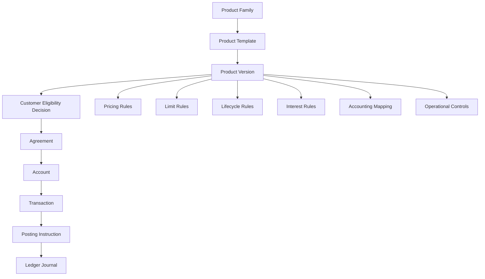
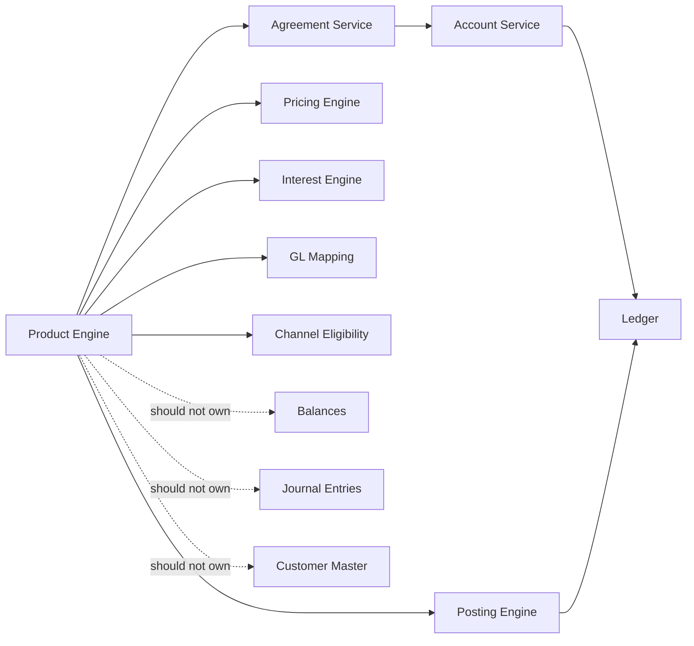
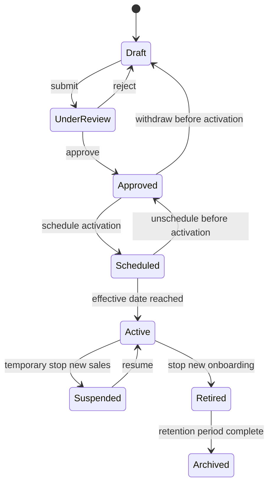
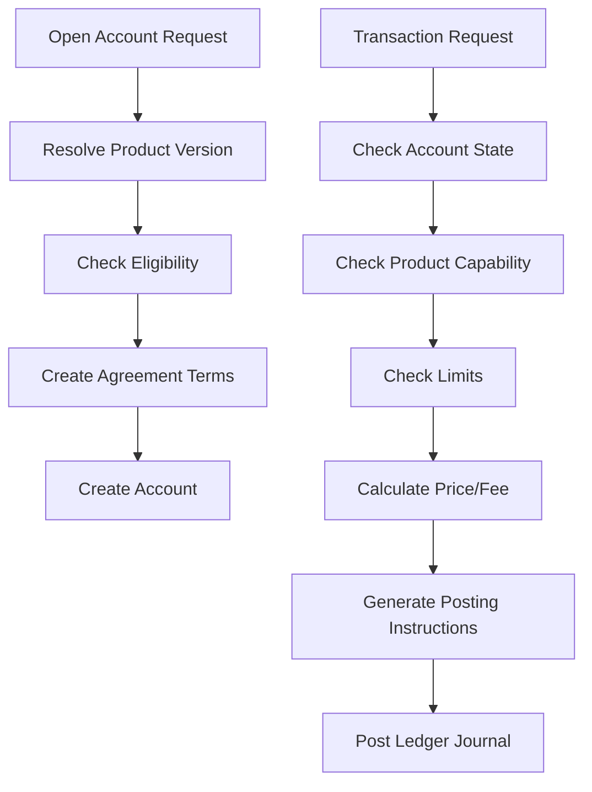
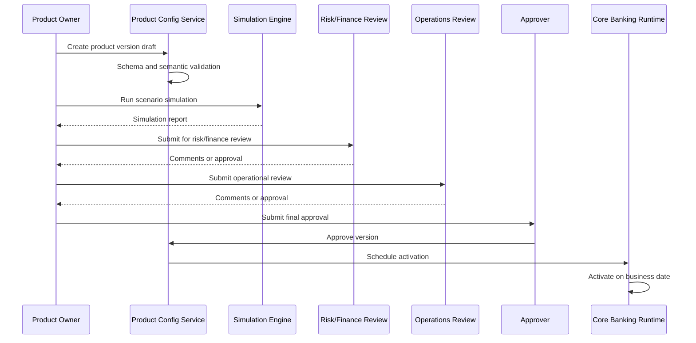
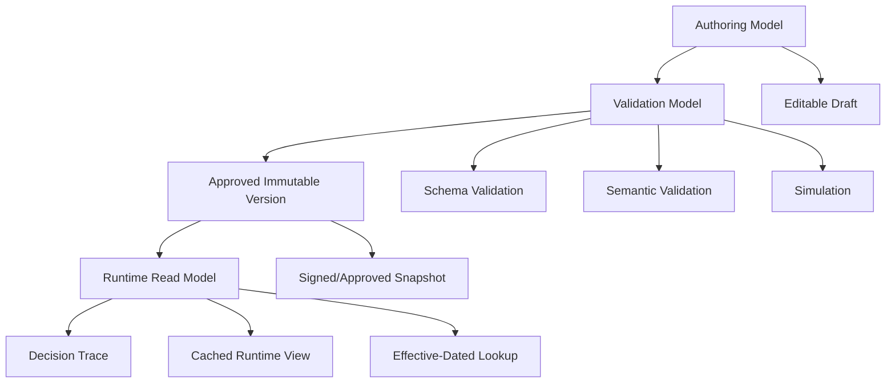
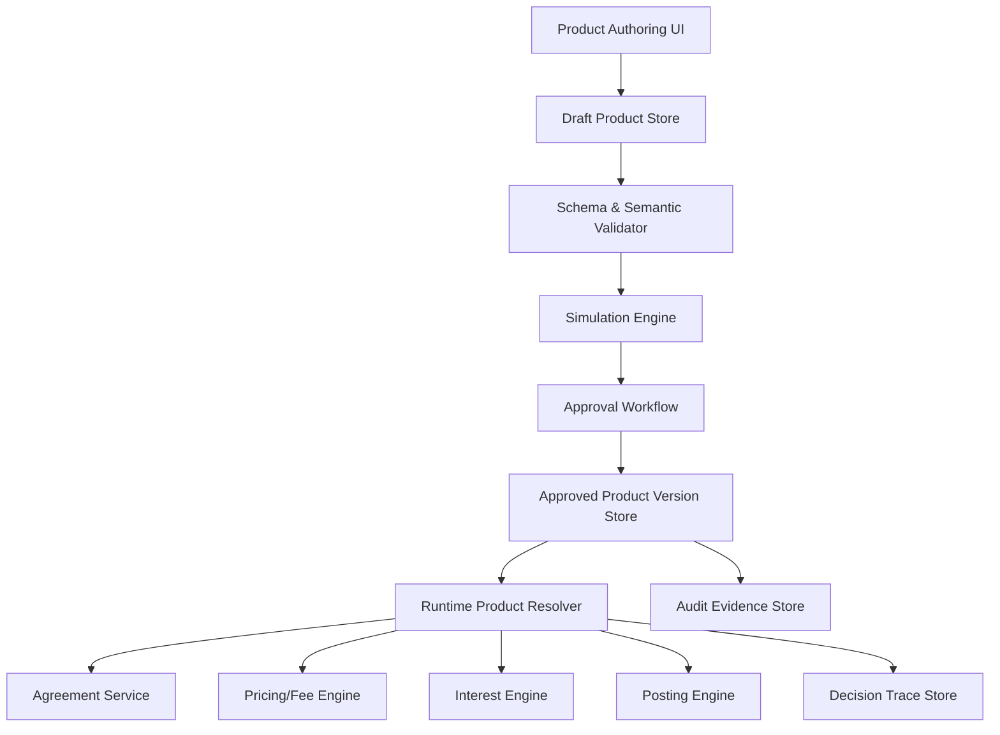

# Part 011 — Product Catalog, Parameterization, and Configuration Governance

Core banking product management is not a UI screen for maintaining product names.
It is the mechanism that determines which financial contracts may be opened, which behaviors are allowed, which prices apply, which accounting entries are generated, which limits are enforced, and which operational controls are required.

A weak product engine creates one of the most dangerous long-term failure modes in banking systems: **business change becomes code change, code change becomes production risk, and production risk becomes manual exception handling**.

A strong product engine does the opposite:

1. Product behavior is explicit.
2. Product changes are versioned.
3. Existing customer agreements are not accidentally mutated.
4. Pricing, eligibility, limits, and accounting mappings are testable before activation.
5. Every configuration has owner, approval, effective date, lineage, and rollback strategy.

This part focuses on product configuration as an engineering system.
It does not repeat Java enum modeling, persistence, security, or workflow basics from previous series.
Here we use them only where they directly affect banking product correctness.

---

## 1. Kaufman Skill Deconstruction

Using Josh Kaufman's skill acquisition model, the skill is decomposed into practical sub-skills that produce real engineering judgment quickly.

### 1.1 Target Performance

After this part, you should be able to review or design a banking product engine and answer these questions:

- What exactly is a product in the system?
- Which product properties are configuration, and which are code?
- What is frozen into the customer agreement at onboarding time?
- What can change for future customers only?
- What can change for existing accounts?
- How are product versions activated, tested, approved, and retired?
- How does a product definition drive ledger postings?
- How do we prevent configuration from becoming a hidden programming language with no safety?

### 1.2 Sub-Skills

| Sub-skill | Why it matters |
|---|---|
| Product boundary modeling | Prevents product catalog from becoming marketing CMS or ledger engine |
| Effective-dated versioning | Prevents retroactive mutation of financial contracts |
| Parameter typing | Prevents invalid runtime configuration and ambiguous money/rate values |
| Eligibility modeling | Controls who can open or maintain a product |
| Lifecycle governance | Ensures product change is approved, tested, activated, retired |
| Accounting mapping | Connects product behavior to GL/subledger impact |
| Simulation | Catches pricing/posting mistakes before production |
| Configuration observability | Makes product decisions explainable in audit and incident review |

### 1.3 Practice Loop

For every product rule, practice asking:

> Is this a product property, an agreement term, an account state, a transaction validation rule, a pricing rule, or an accounting mapping?

Most product-engine failures come from putting the right rule in the wrong place.

---

## 2. Product Is a Contract Factory, Not Just a Catalog

In banking, a product is best understood as a **controlled template for creating financial agreements**.

A savings product, current account product, term deposit product, or loan product does not itself hold money.
It defines the allowed characteristics of the agreements/accounts created under it.



The product definition is upstream of financial behavior.
That means product configuration mistakes are not cosmetic; they can create incorrect interest, wrong fees, wrong GL postings, invalid limits, regulatory reporting errors, and mass customer remediation.

### 2.1 Product vs Agreement vs Account

| Concept | Meaning | Example |
|---|---|---|
| Product | Bank-defined offering template | `Premium Savings v3` |
| Product Version | Immutable approved version of the template | `Premium Savings v3 effective 2026-07-01` |
| Agreement | Customer-specific contract created from product version | `Customer A agreed to Premium Savings v3` |
| Account | Operational ledger container under the agreement | `Account 1234567890` |
| Product Parameter | Rule or value controlled by product governance | minimum balance, monthly fee, rate tier |
| Agreement Term | Customer-specific frozen or negotiated term | preferential rate, fee waiver, overdraft limit |
| Account State | Operational condition of an account | active, dormant, restricted, closed |

A common modeling error is treating account as product.
For example, putting `minimumMonthlyBalance` directly on an account row without knowing whether it came from product default, customer-specific agreement, campaign override, or manual exception.
That destroys explainability.

---

## 3. Product Boundaries

A product engine should not own everything.
It should define product behavior and provide product decisions to downstream systems.

### 3.1 What Product Catalog Owns

A banking product catalog normally owns:

- product family and category;
- product version;
- eligibility criteria;
- allowed account lifecycle;
- allowed transaction types;
- balance constraints;
- pricing parameters;
- interest parameters;
- fee parameters;
- limit parameters;
- GL/accounting mapping references;
- required documents or onboarding requirements;
- operational control requirements;
- reporting classification;
- effective dates;
- status and approval metadata.

### 3.2 What Product Catalog Should Not Own

It should not own:

- actual customer balance;
- journal entries;
- runtime payment state;
- customer master record;
- fraud case investigation;
- sanctions decision outcome;
- GL ledger itself;
- statement rendering implementation;
- ad-hoc production overrides;
- manual database patching.

The product engine may provide rules consumed by these domains, but it should not become their database.



---

## 4. Product Versioning Is a Banking Safety Requirement

Product configuration must be versioned because banking contracts live for a long time.
A customer opened an account under a specific set of terms.
If the bank changes the product tomorrow, the system must know whether that change applies to:

1. only new accounts;
2. existing accounts after notification period;
3. existing accounts immediately;
4. only accounts in certain branches/segments;
5. only agreements with explicit consent;
6. no existing accounts at all.

Without versioning, a product change silently rewrites history.

### 4.1 Versioning Rule

A safe baseline rule:

> A product version is immutable after activation. Changes create a new version or a controlled migration event.

This is stricter than many teams initially want, but it prevents catastrophic ambiguity.

### 4.2 Product Status Model



### 4.3 Meaning of Each Status

| Status | Meaning | Allowed operations |
|---|---|---|
| Draft | Work in progress | edit, validate, simulate |
| UnderReview | Waiting approval | view, comment, reject, approve |
| Approved | Approved but not active | schedule, withdraw |
| Scheduled | Activation planned | unschedule, view activation plan |
| Active | Used for new agreements | open accounts, quote, simulate |
| Suspended | Temporarily unavailable for new sales | service existing accounts |
| Retired | No longer sold | service existing accounts, migrate |
| Archived | Historical reference only | audit retrieval |

### 4.4 Version Identity

Do not rely only on a numeric product code.
Use explicit version identity.

```java
public record ProductVersionId(
        String productCode,
        int majorVersion,
        int minorVersion
) {}
```

Example:

```txt
SAV-PREMIUM / 3.0
SAV-PREMIUM / 3.1
CUR-BUSINESS / 2.4
TD-12M-FIXED / 5.0
```

A minor version may represent non-contractual metadata change.
A major version may represent financial/contractual behavior change.
But the distinction must be governed by bank policy, not developer preference.

---

## 5. Effective Dating

A banking product is not simply valid or invalid.
It is valid for a business time interval.

Common time dimensions:

| Time dimension | Meaning |
|---|---|
| Created time | When the configuration record was created |
| Approved time | When it passed governance |
| Activation time | When it becomes usable |
| Business effective date | Business date from which it applies |
| Expiry date | Last date for new use |
| Agreement effective date | Date the customer agreement starts |
| Migration effective date | Date existing accounts move to new terms |

### 5.1 Effective-Dated Product Version

```java
public record EffectivePeriod(
        LocalDate validFrom,
        LocalDate validToExclusive
) {
    public boolean contains(LocalDate businessDate) {
        return !businessDate.isBefore(validFrom)
                && businessDate.isBefore(validToExclusive);
    }
}

public record ProductVersion(
        ProductVersionId id,
        ProductStatus status,
        EffectivePeriod salesPeriod,
        EffectivePeriod servicingPeriod,
        ProductDefinition definition,
        ApprovalMetadata approval
) {}
```

### 5.2 Business Date vs System Time

Do not confuse system time with business date.
Product activation may depend on business date, especially when EOD/BOD controls are used.

Example:

- System time: `2026-07-01T00:10:00+07:00`
- Bank business date still: `2026-06-30`
- Product version effective from business date: `2026-07-01`
- Result: product should not be used until business date advances.

This is why product lookup should usually receive business context.

```java
public record ProductResolutionContext(
        LocalDate businessDate,
        String branchCode,
        String channel,
        String customerSegment,
        Currency currency
) {}
```

---

## 6. Product Parameter Taxonomy

Good product engines classify parameters.
Bad product engines put everything into a generic key-value table.

### 6.1 Parameter Categories

| Category | Examples | Consumer |
|---|---|---|
| Identity | product code, family, display name | all domains |
| Eligibility | age, residency, customer type, KYC level | onboarding/channel |
| Account lifecycle | allowed states, closure rules | account service |
| Transaction capability | allowed debit/credit types | transaction validation |
| Balance rule | minimum balance, overdraft allowed | account/posting service |
| Limit rule | per transaction, daily, monthly limits | transaction limit service |
| Interest rule | rate type, tier, accrual basis | interest engine |
| Fee rule | monthly fee, event fee, waiver | fee engine |
| Tax rule | withholding, tax category | tax engine/reporting |
| Accounting mapping | GL mapping keys, control account | posting/GL interface |
| Statement/reporting | statement cycle, product reporting class | reporting service |
| Operational control | maker-checker requirement, exception routing | operations workflow |

### 6.2 Strong Typing Over Generic Configuration

A generic table like this looks flexible:

```txt
product_code | key                 | value
SAV01        | minimum_balance     | 100000
SAV01        | monthly_fee         | 5000
SAV01        | interest_rate       | 0.025
```

But it hides important semantics:

- Is `100000` IDR, cents, minor units, or decimal?
- Is `0.025` annual rate, monthly rate, percentage, or decimal fraction?
- Is it effective for existing accounts?
- Who approved it?
- What rounding mode applies?
- Is it compatible with current agreements?
- What GL account does the fee post to?

Prefer typed parameter objects.

```java
public record MoneyParameter(
        String name,
        Currency currency,
        long minorUnits,
        ParameterApplicability applicability
) {}

public record RateParameter(
        String name,
        BigDecimal annualRate,
        RateBasis basis,
        RoundingPolicy rounding
) {}

public record LimitParameter(
        String name,
        MoneyAmount amount,
        LimitWindow window,
        LimitScope scope
) {}
```

The rule is not “never use key-value storage”.
The rule is:

> Generic storage is acceptable only behind a typed domain model, validation layer, and governance lifecycle.

---

## 7. Product Definition Model

A useful high-level Java model:

```java
public record ProductDefinition(
        ProductIdentity identity,
        EligibilityPolicy eligibility,
        AccountLifecyclePolicy lifecyclePolicy,
        TransactionCapabilityPolicy transactionCapabilities,
        BalancePolicy balancePolicy,
        LimitPolicy limitPolicy,
        InterestPolicy interestPolicy,
        FeePolicy feePolicy,
        TaxPolicy taxPolicy,
        AccountingPolicy accountingPolicy,
        StatementPolicy statementPolicy,
        OperationalControlPolicy operationalControlPolicy
) {}
```

The point is not to copy this exact model.
The point is to avoid the anti-pattern where all product logic is scattered across service methods.

### 7.1 Product Identity

```java
public record ProductIdentity(
        String productCode,
        String productName,
        ProductFamily family,
        ProductCategory category,
        Set<Currency> supportedCurrencies,
        Set<String> supportedCountries
) {}
```

### 7.2 Eligibility Policy

```java
public record EligibilityPolicy(
        Set<CustomerType> allowedCustomerTypes,
        Set<String> allowedSegments,
        Set<String> allowedResidencyCountries,
        KycLevel minimumKycLevel,
        AgeRange allowedAgeRange
) {}
```

Eligibility is not only onboarding.
Some eligibility rules affect ongoing servicing.
For example, a customer may become non-resident or lose required status.
The system must know whether that triggers account restriction, migration, closure review, or no action.

### 7.3 Transaction Capability Policy

```java
public record TransactionCapabilityPolicy(
        Set<TransactionType> allowedDebits,
        Set<TransactionType> allowedCredits,
        Set<Channel> allowedChannels,
        boolean allowsStandingInstruction,
        boolean allowsExternalDebit,
        boolean allowsCashWithdrawal
) {}
```

This policy should answer questions like:

- Can this account receive salary credit?
- Can it be debited by external payment instruction?
- Can it be used for ATM withdrawal?
- Can it be used as settlement account?
- Can it accept backdated postings?
- Can it be debited when dormant?

### 7.4 Accounting Policy

```java
public record AccountingPolicy(
        String liabilityControlAccountCode,
        String interestExpenseAccountCode,
        String feeIncomeAccountCode,
        String taxPayableAccountCode,
        String suspenseAccountCode,
        Set<AccountingEventMapping> eventMappings
) {}
```

Accounting mapping is a first-class product concern because different products may map financial events differently.
For example:

- savings interest expense;
- current account maintenance fee income;
- term deposit principal liability;
- withholding tax payable;
- early withdrawal penalty income.

---

## 8. Eligibility, Pricing, Limits, and Accounting Are Separate Decisions

A robust product engine separates decisions that are often confused.



| Decision | Example question | Owner |
|---|---|---|
| Eligibility | May this customer open this product? | onboarding/product |
| Capability | May this product perform this transaction type? | product/account |
| Limit | Is this amount allowed now? | limit service |
| Pricing | What fee/rate applies? | pricing/interest/fee engine |
| Accounting | Which accounts are posted? | posting/GL mapping |
| Operational control | Does this require approval? | workflow/control policy |

Do not implement these as a single method named `validateProduct()`.
That becomes untestable and unexplainable.

---

## 9. Product Resolution Algorithm

When a transaction or onboarding request arrives, the system needs to resolve applicable product behavior deterministically.

A typical resolution flow:

1. Identify product code or account.
2. Determine business date.
3. Determine customer segment and branch/channel context if relevant.
4. Fetch product version active for the business date and sales/servicing context.
5. Fetch customer agreement terms.
6. Apply agreement-specific overrides.
7. Apply campaign/waiver/exception if approved and effective.
8. Return resolved product behavior with decision trace.

```java
public record ResolvedProductBehavior(
        ProductVersionId productVersionId,
        AgreementId agreementId,
        EligibilityDecision eligibility,
        TransactionCapabilityPolicy capabilityPolicy,
        BalancePolicy balancePolicy,
        LimitPolicy limitPolicy,
        InterestPolicy interestPolicy,
        FeePolicy feePolicy,
        AccountingPolicy accountingPolicy,
        List<DecisionTraceEntry> trace
) {}
```

### 9.1 Decision Trace

Decision trace is not optional in mature banking systems.
When a customer complains about a fee or a regulator asks why a transaction was rejected, the system must explain the answer.

```java
public record DecisionTraceEntry(
        String decisionPoint,
        String inputSummary,
        String ruleReference,
        String outcome,
        ProductVersionId productVersionId,
        Instant evaluatedAt
) {}
```

Example trace:

```txt
decisionPoint=MONTHLY_MAINTENANCE_FEE
ruleReference=SAV-PREMIUM/3.0/FEE/MONTHLY_MAINTENANCE
inputSummary=avgMonthlyBalance=IDR 8,000,000; waiverThreshold=IDR 10,000,000
outcome=feeApplied=IDR 15,000
```

---

## 10. Configuration Governance Workflow

Product configuration changes should follow a controlled lifecycle.



### 10.1 Governance Metadata

Every product version should carry governance metadata.

```java
public record ApprovalMetadata(
        String createdBy,
        Instant createdAt,
        String submittedBy,
        Instant submittedAt,
        String approvedBy,
        Instant approvedAt,
        String approvalReference,
        String changeReason,
        String riskAssessmentReference,
        String simulationReportReference
) {}
```

### 10.2 Maker-Checker Requirements

At minimum:

- maker cannot approve own change;
- finance/accounting review required for accounting mapping changes;
- compliance review required for eligibility or regulatory classification changes;
- risk review required for limits, overdraft, or exposure-related changes;
- operations review required for new exception flow or EOD impact;
- activation must be scheduled, not instantly applied by editing database rows.

---

## 11. Simulation Before Activation

A product version should not be activated only because validation passes.
It must be simulated against representative scenarios.

### 11.1 Simulation Scenarios

| Scenario type | Example |
|---|---|
| Onboarding | open account for eligible/ineligible customers |
| Transaction | deposit, withdrawal, internal transfer, external payment |
| Pricing | monthly fee, waiver, event fee |
| Interest | daily accrual, rate tier, capitalization |
| Limit | daily limit, transaction limit, channel limit |
| Lifecycle | dormancy, restriction, closure |
| Accounting | generated GL mappings for each accounting event |
| EOD | fee run, accrual run, statement cycle |
| Regression | compare previous product version vs new version |

### 11.2 Simulation Output

A useful simulation report contains:

- product version tested;
- scenario pack version;
- input data;
- expected result;
- actual result;
- generated ledger entries;
- generated fees/interest;
- rejected transactions and reasons;
- changed behavior vs previous version;
- approval evidence.

This report becomes part of operational evidence.

---

## 12. Product Change Compatibility

Every product change should be classified by compatibility.

| Change type | Example | Risk |
|---|---|---|
| Cosmetic | description text | low |
| Sales-only | stop new onboarding | medium |
| Pricing forward-only | new fee for new accounts | medium/high |
| Existing-account pricing | fee change for existing accounts | high |
| Accounting mapping | GL account change | high |
| Lifecycle behavior | closure/dormancy rule change | high |
| Transaction capability | allow external debit | high |
| Interest formula | compounding or basis change | very high |
| Migration | move accounts to new product version | very high |

A good product governance system forces the maker to declare compatibility and requires approvals based on risk.

### 12.1 Existing Agreement Impact

Before activation, the system should produce an impact assessment:

```txt
Product: SAV-PREMIUM
Change: monthly maintenance fee from IDR 10,000 to IDR 15,000
Applies to: new accounts only
Existing agreements affected: 0
GL mapping changed: no
Statement wording changed: yes
Customer notice required: no for existing customers
Simulation pack: PASSED
```

For existing-account changes:

```txt
Existing agreements affected: 482,391
Estimated monthly customer charge increase: IDR 2,411,955,000
Waiver population affected: 71,020
Regulatory/customer notification required: yes
Migration event required: yes
Rollback path: future-dated reversal of configuration migration, not ledger rollback
```

---

## 13. Rule Engine vs Code vs Decision Table

Not all product rules should be externalized.
Externalizing everything often creates a fragile pseudo-programming platform.

### 13.1 Options

| Approach | Good for | Weakness |
|---|---|---|
| Java code | complex invariant, high-risk deterministic behavior | slower business change |
| Typed configuration | rates, limits, fees, thresholds | needs schema/version governance |
| Decision table | eligibility, simple matrix rules | hard for complex temporal behavior |
| DSL | product-specific rules with controlled expressiveness | expensive to design and govern |
| General rule engine | broad business rules | can become opaque and hard to test |

### 13.2 Practical Guideline

Use Java code for core invariants:

- double-entry balancing;
- account state transition validity;
- posting atomicity;
- idempotency;
- audit event generation;
- money arithmetic;
- effective-date resolution.

Use typed configuration for business parameters:

- fee amount;
- interest rate;
- minimum balance;
- allowed currencies;
- channel limit;
- product availability;
- GL mapping references.

Use decision tables for controlled eligibility:

- segment-based eligibility;
- country/residency rules;
- customer type matrix;
- branch/channel availability.

Avoid general rule engines for ledger invariants.
A product manager should not be able to accidentally configure an unbalanced journal.

---

## 14. Product Configuration Storage Pattern

A production-grade product system often uses a layered model:



### 14.1 Draft vs Runtime Model

Draft model supports authoring.
Runtime model supports fast deterministic decisions.
Do not let runtime depend on partially edited drafts.

```java
public interface ProductRepository {
    Optional<ProductVersion> findActiveForSales(
            String productCode,
            ProductResolutionContext context
    );

    Optional<ProductVersion> findForServicing(
            ProductVersionId productVersionId,
            LocalDate businessDate
    );
}
```

### 14.2 Immutable Snapshot

When a product version is approved, store the exact approved snapshot.
Do not reconstruct historical configuration by joining current lookup tables.

Why?
Because reference data changes.
If a historical product version points to current rows, the past changes when reference data changes.

---

## 15. Product Caching and Consistency

Product lookup is frequent and latency-sensitive.
Caching is normal.
But stale product cache can cause incorrect onboarding, fee calculation, or posting.

### 15.1 Cache Safety Rules

- cache only active immutable versions;
- never cache editable drafts for runtime;
- include product version ID in cache key;
- invalidate by version activation event;
- keep activation tied to business date;
- persist decision trace with version ID;
- design fallback if cache is unavailable;
- never silently fall back to old version after activation failure.

### 15.2 Runtime Cache Key

```java
public record ProductCacheKey(
        String productCode,
        LocalDate businessDate,
        String branchCode,
        String channel,
        String customerSegment,
        Currency currency,
        ProductUseCase useCase
) {}
```

The cache key must include dimensions that affect the decision.
Otherwise, one customer segment may receive another segment's product behavior.

---

## 16. Accounting Mapping as Product Governance

Accounting mapping is often underestimated.
A product can be functionally correct for customers but financially wrong for the bank if postings map to the wrong GL account.

Example deposit monthly fee:

```txt
Debit: Customer Deposit Liability / Customer Account
Credit: Fee Income / Monthly Maintenance Fee
```

Example interest credit:

```txt
Debit: Interest Expense
Credit: Customer Deposit Liability / Customer Account
```

The product engine should not post the journal itself, but it should provide mapping references used by the posting engine.

### 16.1 Mapping Change Control

Accounting mapping changes require strict review because they affect financial reporting.

Recommended controls:

- finance owner approval;
- effective date;
- simulation across all accounting event types;
- reconciliation report after activation;
- no direct modification of historical journal entries;
- clear migration approach for in-flight events.

---

## 17. Product Engine Anti-Patterns

### 17.1 Product as Java Enum

```java
enum ProductType {
    SAVINGS,
    CURRENT,
    TERM_DEPOSIT
}
```

This is acceptable as a broad category, but not as product definition.
Real products vary by pricing, eligibility, currency, rate tiers, limits, statement cycle, accounting mapping, and regulatory classification.

### 17.2 Mutable Product Row

One row, edited in place:

```txt
PRODUCT_CODE = SAV01
MONTHLY_FEE = 15000
```

If yesterday it was `10000`, the system loses the ability to explain why last month charged `10000` and this month charges `15000`.

### 17.3 Branch-Specific If Statements

```java
if (branch.equals("JKT01") && product.equals("SAV01")) {
    fee = Money.idr(0);
}
```

This destroys governance.
Branch exceptions should be explicit approved configuration or agreement terms.

### 17.4 Configuration Without Simulation

A UI allows product owner to change rate tiers, but there is no scenario simulation.
This is dangerous because validation only proves the data shape is valid, not that financial behavior is correct.

### 17.5 Product Change Without Customer Agreement Impact

If product change affects existing customers but the system cannot produce affected account population, the change process is not production-ready.

### 17.6 Rule Engine Owns Ledger Logic

If a configurable rule can generate arbitrary debit/credit lines, then unbalanced or unauthorized accounting becomes possible.
Ledger invariants must remain in code-level controlled components.

---

## 18. Product Readiness Checklist

Before a product version goes live:

- [ ] Product version is immutable after approval.
- [ ] Sales and servicing effective dates are defined.
- [ ] Supported currencies are valid and minor units are known.
- [ ] Eligibility rules are tested.
- [ ] Transaction capabilities are explicit.
- [ ] Limits are defined by amount, scope, and window.
- [ ] Interest policy is either disabled or fully configured.
- [ ] Fee policy is either disabled or fully configured.
- [ ] Accounting mappings exist for all product event types.
- [ ] Statement/reporting classification is defined.
- [ ] Operational controls are defined.
- [ ] Simulation pack passes.
- [ ] Regression against previous version is reviewed.
- [ ] Existing agreement impact is calculated.
- [ ] Required approvals are captured.
- [ ] Activation is scheduled by business date.
- [ ] Rollback or remediation plan exists.
- [ ] Decision trace is available at runtime.

---

## 19. Minimal Product Engine Reference Architecture



Key separation:

- authoring is not runtime;
- draft is not approved;
- approved is not necessarily active;
- active is effective-date controlled;
- runtime decisions are traceable.

---

## 20. Practice Exercise

Design a product version for a premium savings account.

Requirements:

- currency: IDR;
- customer type: individual only;
- minimum age: 17;
- monthly fee: IDR 15,000;
- monthly fee waived if average monthly balance >= IDR 10,000,000;
- daily withdrawal limit: IDR 25,000,000;
- external debit allowed only after KYC level 2;
- interest rate tier:
  - below IDR 5,000,000: 0%;
  - IDR 5,000,000 to IDR 50,000,000: 1.0% annual;
  - above IDR 50,000,000: 1.5% annual;
- GL mappings required for deposit liability, interest expense, fee income, tax payable.

Produce:

1. product definition;
2. version identity;
3. effective dates;
4. eligibility policy;
5. fee policy;
6. interest policy;
7. limit policy;
8. accounting policy;
9. simulation scenarios;
10. approval requirements.

### Self-Correction Questions

- Which fields must be frozen into agreement terms?
- Which fields can change for new accounts only?
- Which fields require finance approval?
- Which fields require compliance review?
- What happens if fee waiver threshold changes?
- How do you prove which version caused a specific fee?

---

## 21. Part Summary

Product engine design is about controlled change.

A top-tier engineer does not ask only:

> “Can business configure this?”

They ask:

> “Can business configure this safely, with versioning, approval, simulation, accounting correctness, agreement impact analysis, and audit evidence?”

The core model is:

```txt
Product Version -> Agreement Terms -> Account Behavior -> Transaction Validation -> Posting Instruction -> Ledger Journal
```

Once this chain is explicit, product change becomes manageable.
Once it is implicit, every product change becomes a production incident waiting to happen.

---

## 22. References

- BIAN Service Landscape, Product Directory and Product Management capabilities.
- Basel Committee on Banking Supervision, BCBS 239: Principles for effective risk data aggregation and risk reporting.
- ISO 4217 currency code and minor unit metadata.
- FFIEC Architecture, Infrastructure, and Operations booklet for controlled IT operations in financial institutions.
