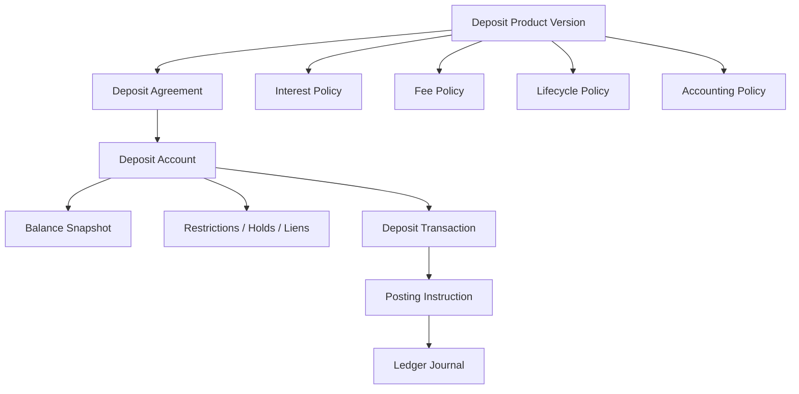
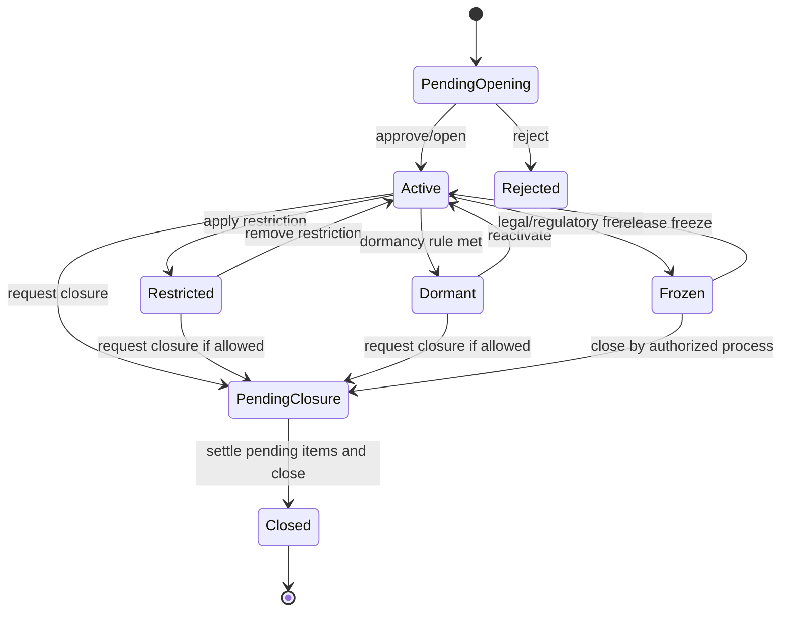
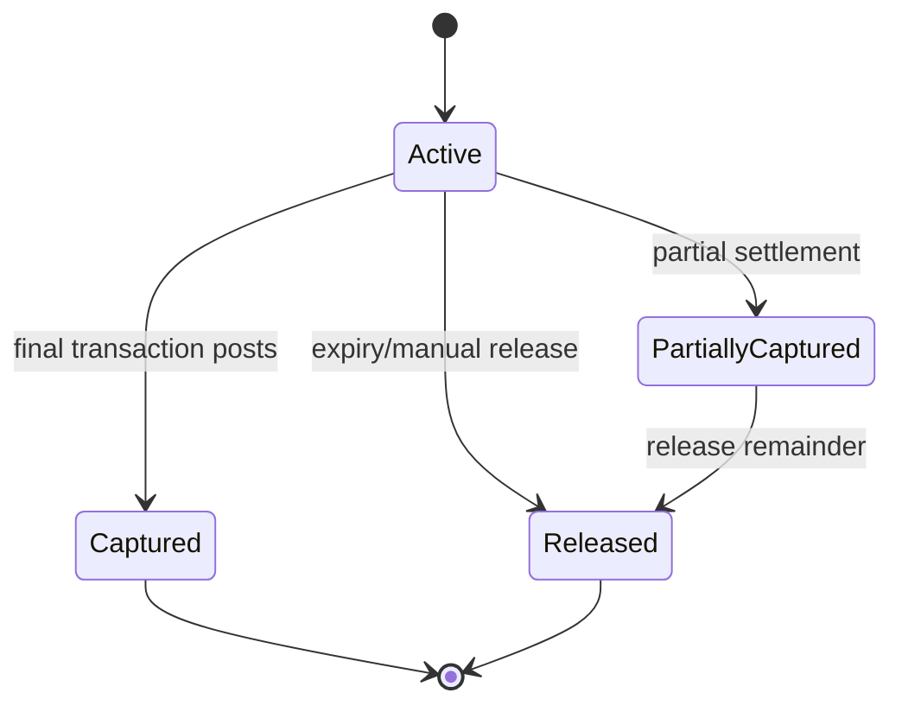
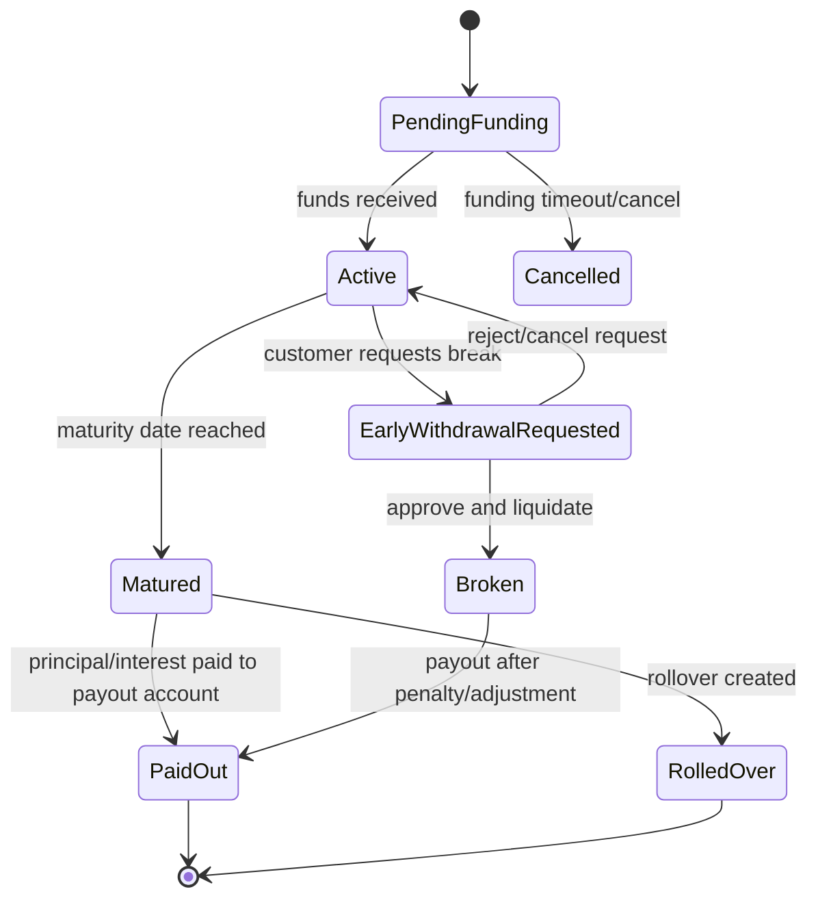
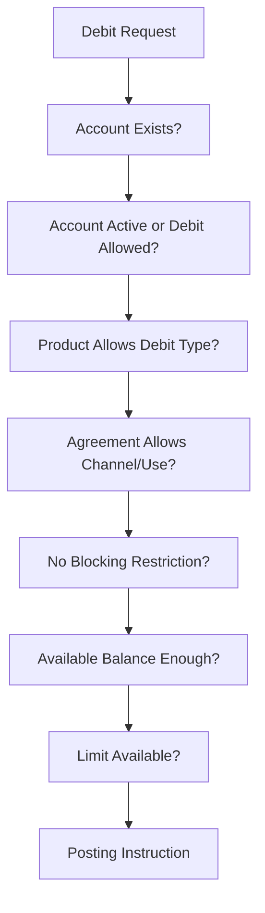
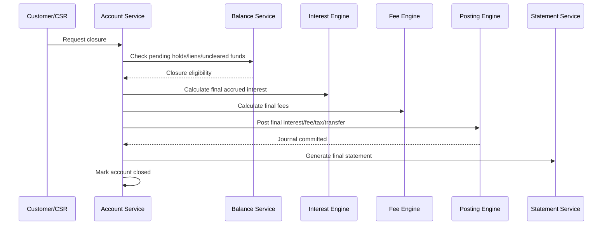

# Part 012 — Deposit Products: Savings, Current, and Term Deposit

Deposit products look simple from the outside: customer puts money in, customer takes money out, bank may pay interest, bank may charge fees.

From a core banking perspective, they are not simple.
A deposit account is a long-lived financial relationship with ledger impact, product rules, operational restrictions, regulatory reporting classifications, interest accrual, tax treatment, lifecycle controls, payment integration, channel behavior, and audit requirements.

This part focuses on the domain-engineering model of deposit products:

- savings accounts;
- current/checking accounts;
- term deposits/time deposits/fixed deposits;
- balance semantics;
- holds, liens, restrictions;
- deposit lifecycle;
- maturity behavior;
- posting scenarios;
- operational edge cases.

Interest calculation and fee/pricing engines are covered deeper in Part 014 and Part 015.
Here we focus on how deposit products should be structured so those engines can work correctly.

---

## 1. Kaufman Skill Deconstruction

### 1.1 Target Performance

After this part, you should be able to:

- explain why deposit accounts are liabilities for the bank;
- model savings, current, and term deposit products without mixing them into one generic account table;
- distinguish product terms, agreement terms, account state, and ledger balance;
- design deposit lifecycle transitions;
- reason about available balance vs ledger balance;
- model holds, liens, restrictions, dormancy, closure, and maturity;
- produce posting scenarios for common deposit operations;
- identify edge cases that cause real production incidents.

### 1.2 Deposit Product Sub-Skills

| Sub-skill | Why it matters |
|---|---|
| Liability mental model | Prevents wrong debit/credit reasoning |
| Balance taxonomy | Prevents incorrect customer availability decisions |
| Lifecycle modeling | Prevents invalid operations on restricted/dormant/closed accounts |
| Term deposit modeling | Prevents maturity, rollover, and early withdrawal errors |
| Hold/lien modeling | Prevents money from being spent when it is operationally blocked |
| Posting scenario design | Ensures product behavior reaches ledger correctly |
| Edge-case analysis | Prevents failures around backdating, closure, pending items, and EOD |

---

## 2. Deposit as Bank Liability

A customer deposit is not an asset of the bank from the customer's perspective.
In the bank's books, the deposit is generally a liability: the bank owes money to the customer.

This matters because engineers often reason about balance direction incorrectly.

When a customer deposits cash:

```txt
Debit: Cash / Settlement Asset
Credit: Customer Deposit Liability
```

When a customer withdraws cash:

```txt
Debit: Customer Deposit Liability
Credit: Cash / Settlement Asset
```

The customer balance increases when the bank's liability to the customer increases.
The customer balance decreases when the bank's liability to the customer decreases.

### 2.1 Customer View vs Bank Accounting View

| Event | Customer view | Bank accounting view |
|---|---|---|
| Cash deposit | balance increases | liability increases |
| Cash withdrawal | balance decreases | liability decreases |
| Interest credit | balance increases | interest expense increases, liability increases |
| Monthly fee | balance decreases | liability decreases, fee income increases |
| Tax withholding | net customer credit decreases | tax payable increases |

This is why a core banking engineer must be comfortable translating customer-facing operations into accounting events.

---

## 3. Deposit Product Families

Deposit products are not all the same.

| Product family | Primary purpose | Typical behavior |
|---|---|---|
| Savings account | Store funds, earn interest, basic transactions | interest-bearing, limited fees, retail-focused |
| Current/checking account | Frequent transactional use | high transaction volume, cheque/payment features, lower/no interest |
| Term deposit | Funds locked for fixed tenor | fixed maturity, fixed/defined rate, early withdrawal rules |

### 3.1 Savings Account

A savings account usually emphasizes:

- customer deposits;
- withdrawals;
- internal transfers;
- interest accrual/crediting;
- balance thresholds;
- monthly service fees or waivers;
- ATM/debit access depending on bank/channel;
- dormancy handling;
- customer statement cycle.

### 3.2 Current Account

A current account usually emphasizes:

- high transaction volume;
- business or individual payments;
- cheque/debit instruments where applicable;
- overdraft facility where permitted;
- cash management features;
- fees per transaction or monthly package;
- statement and reconciliation needs;
- external payment connectivity.

### 3.3 Term Deposit

A term deposit usually emphasizes:

- principal placement;
- tenor;
- maturity date;
- interest rate lock or defined rate basis;
- maturity instruction;
- rollover behavior;
- premature withdrawal penalty;
- payout account;
- certificate or deposit contract evidence.

---

## 4. Deposit Domain Model

A useful model separates product, agreement, account, and ledger.



### 4.1 Java Aggregate Sketch

```java
public record DepositAgreement(
        AgreementId agreementId,
        ProductVersionId productVersionId,
        PartyId primaryOwner,
        Set<PartyRole> partyRoles,
        LocalDate startDate,
        AgreementStatus status,
        DepositTerms terms
) {}

public record DepositAccount(
        AccountId accountId,
        AgreementId agreementId,
        Currency currency,
        DepositAccountType type,
        DepositAccountStatus status,
        LocalDate openedOn,
        Optional<LocalDate> closedOn,
        AccountRestrictionSet restrictions
) {}
```

### 4.2 Deposit Terms

```java
public sealed interface DepositTerms
        permits SavingsTerms, CurrentAccountTerms, TermDepositTerms {
}

public record SavingsTerms(
        InterestPolicySnapshot interestPolicy,
        FeePolicySnapshot feePolicy,
        BalancePolicySnapshot balancePolicy,
        StatementPolicySnapshot statementPolicy
) implements DepositTerms {}

public record CurrentAccountTerms(
        FeePolicySnapshot feePolicy,
        BalancePolicySnapshot balancePolicy,
        Optional<OverdraftFacilityTerms> overdraftFacility,
        StatementPolicySnapshot statementPolicy
) implements DepositTerms {}

public record TermDepositTerms(
        MoneyAmount principal,
        LocalDate placementDate,
        LocalDate maturityDate,
        InterestPolicySnapshot interestPolicy,
        MaturityInstruction maturityInstruction,
        EarlyWithdrawalPolicySnapshot earlyWithdrawalPolicy,
        AccountId payoutAccountId
) implements DepositTerms {}
```

The key point: term deposit terms are structurally different from savings terms.
Do not force all deposits into a flat table with nullable columns like `maturity_date`, `overdraft_limit`, `withdrawal_penalty`, `statement_cycle`, and `interest_tier_code` without domain clarity.

---

## 5. Balance Semantics for Deposit Accounts

Deposit balance is not one number.
A mature core banking system tracks several balance concepts.

| Balance | Meaning |
|---|---|
| Ledger balance | Balance after posted journal entries |
| Available balance | Amount customer can use now |
| Collected balance | Funds considered cleared/usable for specific purposes |
| Uncleared balance | Deposits not yet cleared or final |
| Hold amount | Amount reserved for pending operation |
| Lien amount | Amount legally/operationally blocked |
| Minimum required balance | Balance threshold required by product/agreement |
| Overdraft available | Approved negative availability for current account |

### 5.1 Available Balance Formula

A simplified formula:

```txt
available = ledgerBalance
          - activeHolds
          - activeLiens
          - unclearedUnavailableFunds
          - minimumRequiredBalanceIfEnforced
          + availableOverdraftLimit
```

This formula is product-specific and policy-specific.
Some banks allow spending below minimum balance but charge a fee.
Some enforce hard block.
Some treat uncleared funds differently by channel and transaction type.

### 5.2 Balance Object

```java
public record DepositBalanceView(
        AccountId accountId,
        MoneyAmount ledgerBalance,
        MoneyAmount availableBalance,
        MoneyAmount collectedBalance,
        MoneyAmount totalHolds,
        MoneyAmount totalLiens,
        MoneyAmount unclearedBalance,
        Instant calculatedAt,
        LocalDate businessDate
) {}
```

### 5.3 Dangerous Shortcut

Do not use ledger balance as available balance.

That shortcut breaks when there are:

- card authorization holds;
- cheque deposits pending clearing;
- legal liens;
- standing instructions reserved for EOD;
- pending outgoing payments;
- minimum balance enforcement;
- account restrictions;
- overdraft limits;
- partial settlement flows.

---

## 6. Deposit Account Lifecycle

### 6.1 Generic Deposit Account State Machine



### 6.2 State Meaning

| State | Meaning | Typical allowed operations |
|---|---|---|
| PendingOpening | Approved flow not completed | validate, fund, reject |
| Active | Normal servicing | debit, credit, hold, interest, fee |
| Restricted | Some operation blocked | limited debit/credit depending reason |
| Dormant | No customer activity for defined period | controlled reactivation/closure |
| Frozen | Legal/regulatory block | usually no customer debit |
| PendingClosure | Closing in progress | settle pending items, final fee/interest |
| Closed | Account ended | no new postings except controlled correction |

### 6.3 Status Is Not a String

The state should carry reason and authority.

```java
public record AccountRestriction(
        RestrictionType type,
        RestrictionReason reason,
        String authorityReference,
        Instant appliedAt,
        String appliedBy,
        Optional<Instant> expiresAt
) {}
```

A `FROZEN` state without reason and authority is not defensible.

---

## 7. Holds, Liens, Earmarks, and Restrictions

Many systems confuse these concepts.

| Concept | Meaning | Example |
|---|---|---|
| Hold | Temporary reservation for expected settlement | card authorization hold |
| Lien | Legal or contractual block against funds | court order, loan collateral |
| Earmark | Business reservation for specific purpose | standing instruction reserve |
| Restriction | Operation-level limitation | no debit, no credit, no closure |
| Freeze | Strong restriction, often legal/regulatory | sanctions/legal freeze |

### 7.1 Hold Lifecycle



### 7.2 Hold Model

```java
public record FundsHold(
        HoldId holdId,
        AccountId accountId,
        MoneyAmount amount,
        HoldReason reason,
        String sourceReference,
        Instant createdAt,
        Instant expiresAt,
        HoldStatus status
) {}
```

Important invariant:

> A hold changes availability, not ledger balance.

Ledger balance changes only when an accounting event is posted.

---

## 8. Savings Account Model

Savings accounts are the most common deposit product but still contain many subtle rules.

### 8.1 Typical Savings Features

| Feature | Engineering implication |
|---|---|
| Interest-bearing | needs accrual basis, rate tier, crediting cycle |
| Minimum balance | affects fee, availability, or eligibility |
| Monthly fee waiver | needs average/min balance computation |
| ATM/channel access | affects transaction capability and limit checks |
| Dormancy rule | needs last customer-initiated activity tracking |
| Statement cycle | needs periodic statement generation |
| Tax withholding | affects net interest credit and reporting |

### 8.2 Savings Product Definition Sketch

```java
public record SavingsProductDefinition(
        ProductVersionId productVersionId,
        Set<Currency> currencies,
        EligibilityPolicy eligibility,
        BalancePolicy balancePolicy,
        InterestPolicy interestPolicy,
        FeePolicy feePolicy,
        TransactionCapabilityPolicy transactionCapabilityPolicy,
        DormancyPolicy dormancyPolicy,
        StatementPolicy statementPolicy,
        AccountingPolicy accountingPolicy
) {}
```

### 8.3 Savings Posting Scenarios

#### Customer Deposit

```txt
Debit: Cash / Settlement / Internal Transfer Source
Credit: Customer Deposit Liability
```

#### Customer Withdrawal

```txt
Debit: Customer Deposit Liability
Credit: Cash / Settlement / Internal Transfer Destination
```

#### Interest Credit

```txt
Debit: Interest Expense
Credit: Customer Deposit Liability
```

#### Monthly Maintenance Fee

```txt
Debit: Customer Deposit Liability
Credit: Fee Income
```

#### Tax Withholding on Interest

```txt
Debit: Customer Deposit Liability or Interest Payable
Credit: Tax Payable
```

Actual posting design depends on bank accounting policy, but the engineering model must make the accounting event explicit.

---

## 9. Current Account Model

Current accounts are transaction-heavy.
They may support features that savings accounts do not.

### 9.1 Typical Current Account Features

| Feature | Engineering implication |
|---|---|
| High transaction volume | availability, locking, throughput strategy |
| External debits/payments | payment integration and return handling |
| Cheque/debit instruments | clearing lifecycle and uncleared funds |
| Overdraft facility | credit exposure and limit management |
| Business customer usage | signatory rules and approval matrix |
| Fee package | monthly fee, transaction fee, bundled allowance |
| Statement/reconciliation | richer statement and export capability |

### 9.2 Overdraft Is Not Negative Balance Free-for-All

If current account supports overdraft, the overdraft facility must be modeled explicitly.

```java
public record OverdraftFacilityTerms(
        MoneyAmount approvedLimit,
        BigDecimal interestRate,
        LocalDate effectiveFrom,
        Optional<LocalDate> expiresOn,
        OverdraftStatus status
) {}
```

Available balance may include approved overdraft:

```txt
available = ledgerBalance - holds - liens + approvedAvailableOverdraft
```

But overdraft usage may trigger:

- overdraft interest;
- utilization fee;
- credit risk reporting;
- limit review;
- customer notification;
- delinquency workflow if unauthorized or unpaid.

Do not treat overdraft as just allowing balance below zero.

### 9.3 Current Account Posting Examples

#### Outgoing Payment

```txt
Debit: Customer Deposit Liability
Credit: Clearing / Settlement Account
```

#### Incoming Payment

```txt
Debit: Clearing / Settlement Account
Credit: Customer Deposit Liability
```

#### Transaction Fee

```txt
Debit: Customer Deposit Liability
Credit: Fee Income
```

#### Overdraft Interest Charge

```txt
Debit: Customer Deposit Liability
Credit: Interest Income
```

This differs from deposit interest credit, where the bank pays interest expense to the customer.

---

## 10. Term Deposit Model

Term deposits are not normal transaction accounts.
They represent funds placed for a fixed or defined period with maturity behavior.

### 10.1 Term Deposit Core Fields

```java
public record TermDepositAccount(
        AccountId accountId,
        AgreementId agreementId,
        MoneyAmount principal,
        LocalDate placementDate,
        LocalDate maturityDate,
        TermDepositStatus status,
        InterestPolicySnapshot interestPolicy,
        MaturityInstruction maturityInstruction,
        AccountId payoutAccountId
) {}
```

### 10.2 Term Deposit State Machine



### 10.3 Maturity Instruction

```java
public sealed interface MaturityInstruction
        permits PayPrincipalAndInterest, RollPrincipalOnly, RollPrincipalAndInterest {}

public record PayPrincipalAndInterest(AccountId payoutAccountId)
        implements MaturityInstruction {}

public record RollPrincipalOnly(
        String targetProductCode,
        AccountId interestPayoutAccountId
) implements MaturityInstruction {}

public record RollPrincipalAndInterest(String targetProductCode)
        implements MaturityInstruction {}
```

### 10.4 Term Deposit Posting Scenarios

#### Placement

If funds move from a customer's savings account into term deposit:

```txt
Debit: Customer Savings Deposit Liability
Credit: Customer Term Deposit Liability
```

This is a reclassification of liability, not money leaving the bank.

#### Interest Accrual

Depending on accounting policy:

```txt
Debit: Interest Expense
Credit: Accrued Interest Payable
```

#### Maturity Payout

```txt
Debit: Customer Term Deposit Liability
Debit: Accrued Interest Payable
Credit: Customer Savings Deposit Liability / Payout Account
```

#### Early Withdrawal Penalty

```txt
Debit: Customer Term Deposit Liability / Interest Payable
Credit: Penalty Fee Income or Reduced Interest Expense
```

The exact accounting treatment depends on policy, but the system must represent the event explicitly.

---

## 11. Product Terms vs Agreement Terms for Deposits

A deposit product defines defaults.
A deposit agreement captures what applies to a specific customer.

| Field | Product term? | Agreement term? | Notes |
|---|---:|---:|---|
| product family | yes | reference | agreement points to version |
| supported currency | yes | yes | chosen currency is agreement/account-specific |
| standard fee | yes | maybe | agreement may include waiver |
| interest rate tier | yes | maybe | preferential rate may be agreement-specific |
| term deposit principal | no | yes | customer-specific |
| maturity date | no | yes | derived from placement date and tenor |
| payout account | no | yes | customer-specific |
| overdraft limit | product allows | yes | approved per customer/account |
| dormancy rule | yes | usually inherited | may depend on jurisdiction/policy |
| GL mapping | yes | rarely | generally product-controlled |

Rule:

> Product says what is allowed. Agreement says what was accepted. Account says what is currently operationally true. Ledger says what financially happened.

---

## 12. Deposit Transaction Validation

A debit from a deposit account should not be accepted simply because balance is enough.
Validation should combine account state, product capability, agreement terms, restrictions, holds, limits, and channel context.



### 12.1 Debit Validation Result

```java
public sealed interface DebitValidationResult
        permits DebitAccepted, DebitRejected {}

public record DebitAccepted(
        AccountId accountId,
        MoneyAmount amount,
        List<DecisionTraceEntry> trace
) implements DebitValidationResult {}

public record DebitRejected(
        AccountId accountId,
        RejectionCode code,
        String explanation,
        List<DecisionTraceEntry> trace
) implements DebitValidationResult {}
```

Reject reason should be precise:

- `ACCOUNT_CLOSED`;
- `ACCOUNT_DORMANT`;
- `DEBIT_BLOCKED_BY_LEGAL_FREEZE`;
- `INSUFFICIENT_AVAILABLE_BALANCE`;
- `DAILY_LIMIT_EXCEEDED`;
- `PRODUCT_DOES_NOT_ALLOW_EXTERNAL_DEBIT`;
- `CHANNEL_NOT_ALLOWED`;
- `UNCLEARED_FUNDS_NOT_AVAILABLE`.

Precise rejection reason improves repair, customer service, audit, and analytics.

---

## 13. Deposit Account Closure

Closing a deposit account is not deleting a row.

Before closure, the system must handle:

- pending holds;
- pending card settlements;
- outstanding fees;
- accrued interest;
- tax withholding;
- uncleared funds;
- linked standing instructions;
- linked overdraft facility;
- liens/freezes;
- account statements;
- final balance transfer;
- regulatory retention.

### 13.1 Closure Flow



### 13.2 Closure Invariants

- Closed account cannot accept normal customer debit/credit.
- Closure must be traceable to request/authority.
- Final balance must be zero or explicitly handled.
- Pending items must be settled, cancelled, or migrated.
- Historical account identity must remain queryable.
- Corrections after closure require controlled process.

---

## 14. Dormancy

Dormancy rules vary by jurisdiction and bank policy, but the engineering pattern is stable.
A dormant account is an account with no qualifying customer-initiated activity for a defined period.

### 14.1 Dormancy Inputs

- last customer-initiated debit/credit;
- last customer authentication or contact event if recognized by policy;
- product type;
- account status;
- jurisdiction;
- customer classification;
- balance threshold;
- notification history.

### 14.2 Dormancy Effects

A dormant account may:

- block debit transactions;
- continue accepting credits;
- stop card/channel access;
- require reactivation workflow;
- require customer notification;
- affect statement cycle;
- eventually require unclaimed property/escheatment handling depending on jurisdiction.

### 14.3 Dormancy Model

```java
public record DormancyPolicy(
        Period inactivityPeriod,
        Set<ActivityType> qualifyingActivities,
        DormancyAction actionOnDormant,
        ReactivationPolicy reactivationPolicy
) {}
```

Do not hard-code dormancy as “no transactions for 12 months”.
That definition is rarely universal.

---

## 15. Statement and Narrative Semantics

A deposit transaction is not only ledger movement.
It also appears on customer statements.

Statement entries need:

- transaction date;
- value date;
- posting date;
- narrative;
- debit/credit indicator from customer perspective;
- running balance if required;
- reference number;
- channel/source;
- reversal/correction linkage.

### 15.1 Statement Entry Sketch

```java
public record StatementEntry(
        AccountId accountId,
        JournalId journalId,
        LocalDate transactionDate,
        LocalDate valueDate,
        LocalDate postingDate,
        CustomerDebitCreditIndicator indicator,
        MoneyAmount amount,
        MoneyAmount runningBalance,
        String narrative,
        String reference
) {}
```

Customer debit/credit indicator is not always the same as accounting debit/credit.
Be explicit.

---

## 16. Deposit Product Edge Cases

### 16.1 Backdated Deposit

A backdated credit may affect:

- historical balance;
- interest accrual;
- statement period;
- fees based on average balance;
- tax calculation;
- EOD reports;
- reconciliation.

It cannot be handled as a normal current-day deposit unless policy says so.

### 16.2 Closing Account with Pending Card Hold

If an account has an active authorization hold, closure may be blocked or require controlled release/settlement process.
Ledger balance may look sufficient, but available balance is not final.

### 16.3 Term Deposit Maturity on Holiday

If maturity date falls on holiday, product policy must define:

- mature on calendar date;
- pay on next business day;
- accrue extra interest until payout;
- use previous business day;
- handle customer statement date.

This must be product policy, not developer guesswork.

### 16.4 Interest Rate Change Mid-Period

Savings interest may need split-period accrual.
Term deposit fixed rate may not change for existing agreements.
The agreement term decides.

### 16.5 Legal Freeze with Incoming Credit

Some freezes block debits only.
Some block all movement.
Some allow incoming credits but prevent outgoing debits.
The restriction must encode allowed operations.

### 16.6 Negative Balance in Savings Account

Savings products usually should not go negative, but fees, reversals, corrections, chargebacks, and tax postings can create exceptional negative balances.
The system needs policy:

- reject fee if insufficient funds;
- allow negative due to bank charges;
- route to exception queue;
- create receivable;
- auto-recover on next credit.

---

## 17. Deposit Operational Telemetry

This is not general observability repetition.
For deposit products, useful business telemetry includes:

| Metric | Why it matters |
|---|---|
| rejected debit count by reason | detects product/limit/restriction problems |
| closure blocked by pending item | improves operations queue |
| dormant accounts by product | operational and regulatory planning |
| term deposits maturing next N days | liquidity and operational readiness |
| early withdrawal requests | product/rate sensitivity insight |
| fee waiver count | pricing effectiveness |
| accounts with negative available balance | risk/exception control |
| holds expired vs captured | payment/card integration quality |

A top-tier system exposes business correctness signals, not only CPU and HTTP latency.

---

## 18. Deposit Product Anti-Patterns

### 18.1 One Generic Deposit Account Type

A single account table with dozens of nullable columns may look pragmatic, but it hides domain rules.
Savings, current, and term deposits have different lifecycles and constraints.

### 18.2 Available Balance Equals Ledger Balance

This causes overspending when holds, uncleared funds, liens, or pending debits exist.

### 18.3 Term Deposit as Savings Account with Maturity Date

Term deposit has placement, maturity instruction, early withdrawal policy, and payout behavior.
A maturity date column is not enough.

### 18.4 Account Closure as Status Update Only

Closure requires final financial settlement and pending item resolution.

### 18.5 Dormancy as Cron Job Flag

Dormancy is a lifecycle and control concept.
It requires policy, notification, reactivation, and audit trail.

### 18.6 Restrictions Without Authority

A restriction without reason, source, and authority reference is not defensible.

---

## 19. Deposit Product Readiness Checklist

For each deposit product:

- [ ] Product family is clear: savings, current, or term deposit.
- [ ] Product version is immutable after activation.
- [ ] Agreement terms are distinct from product defaults.
- [ ] Account lifecycle states are defined.
- [ ] Debit/credit capability is explicit.
- [ ] Balance formula is defined.
- [ ] Hold/lien/restriction effects are defined.
- [ ] Interest interaction is defined.
- [ ] Fee interaction is defined.
- [ ] Tax interaction is defined if applicable.
- [ ] GL mappings exist for each accounting event.
- [ ] Statement narrative rules exist.
- [ ] Dormancy policy exists.
- [ ] Closure flow is defined.
- [ ] Term deposit maturity behavior is defined if applicable.
- [ ] Early withdrawal behavior is defined if applicable.
- [ ] Edge cases are covered by tests.

---

## 20. Practice Exercise

Model three deposit products:

1. retail savings account;
2. business current account with optional overdraft;
3. 12-month fixed term deposit.

For each product, define:

- product version;
- eligibility;
- account lifecycle;
- allowed debit/credit types;
- balance policy;
- interest policy summary;
- fee policy summary;
- restrictions;
- GL mapping events;
- statement behavior;
- closure behavior;
- operational edge cases.

### Self-Correction Questions

- Which product can go negative?
- Which product allows external debit?
- Which product accrues interest daily?
- Which product has maturity instruction?
- Which balance should the channel show?
- Which balance should posting validation use?
- What happens if account is frozen?
- Can interest be credited to a dormant account?
- Can a term deposit be partially withdrawn?
- What happens if maturity date is a holiday?

---

## 21. Part Summary

Deposit products are long-lived financial agreements backed by liability accounting.

A good model separates:

```txt
Product Version -> Agreement Terms -> Account State -> Balance View -> Transaction Validation -> Posting -> Statement
```

Savings accounts, current accounts, and term deposits share some concepts, but they are not the same product wearing different labels.
A top-tier core banking engineer models their differences explicitly, especially around lifecycle, availability, maturity, restrictions, and ledger impact.

The next parts will build on this by moving from deposits into loans, then interest, fees, and pricing.

---

## 22. References

- IFRS Conceptual Framework for Financial Reporting for financial statement element concepts such as asset, liability, income, and expense.
- ISO 4217 currency codes and minor-unit relationships.
- BIAN Service Landscape for banking capability decomposition.
- BCBS 239 for data aggregation, lineage, accuracy, completeness, and reporting control expectations.
