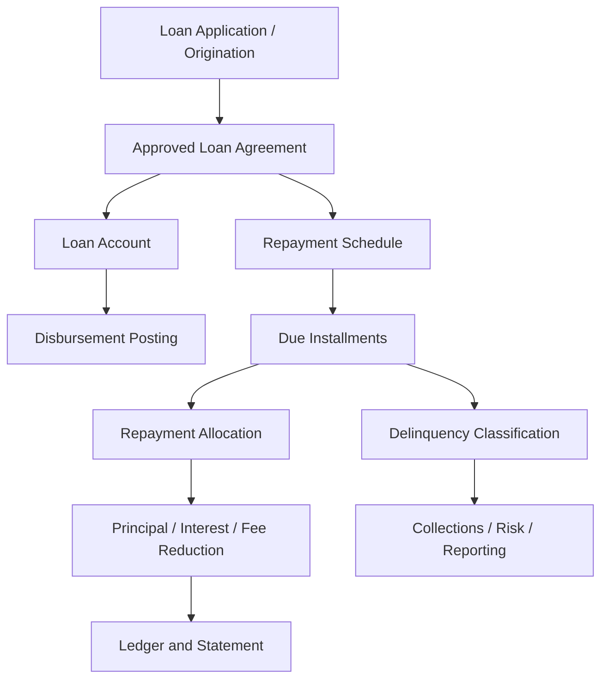
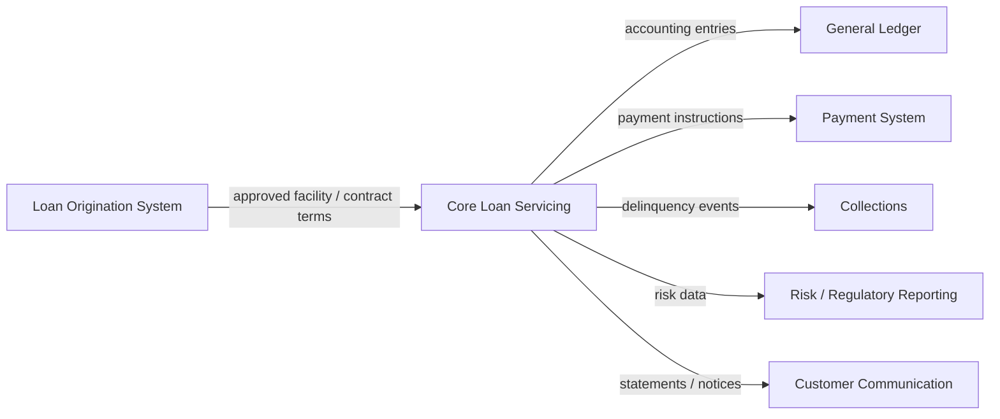
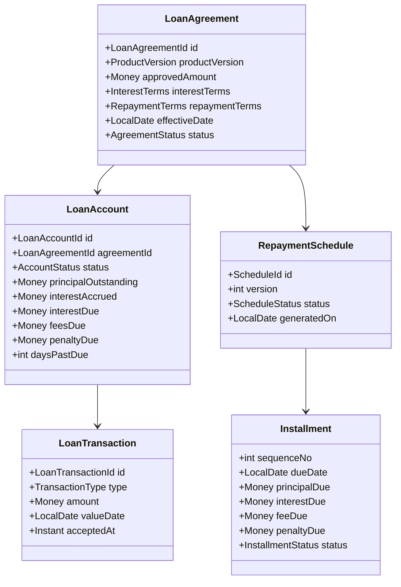
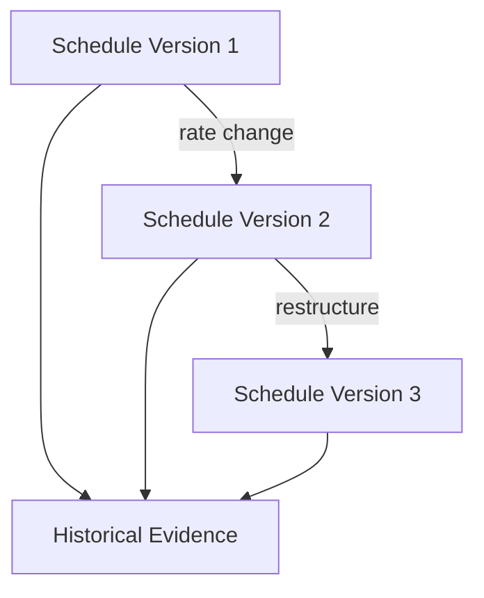
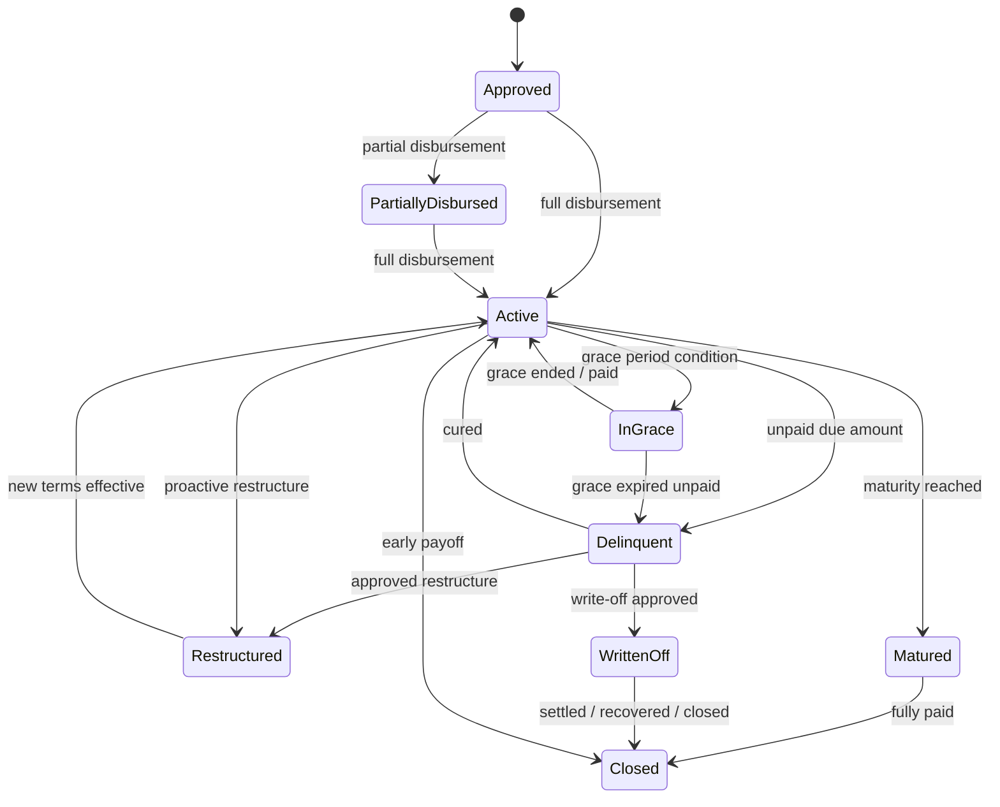
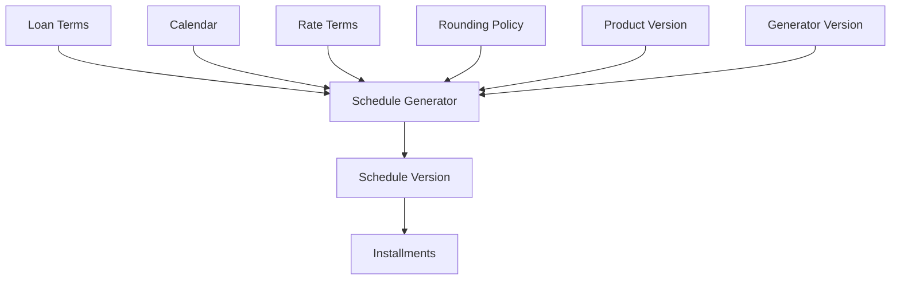
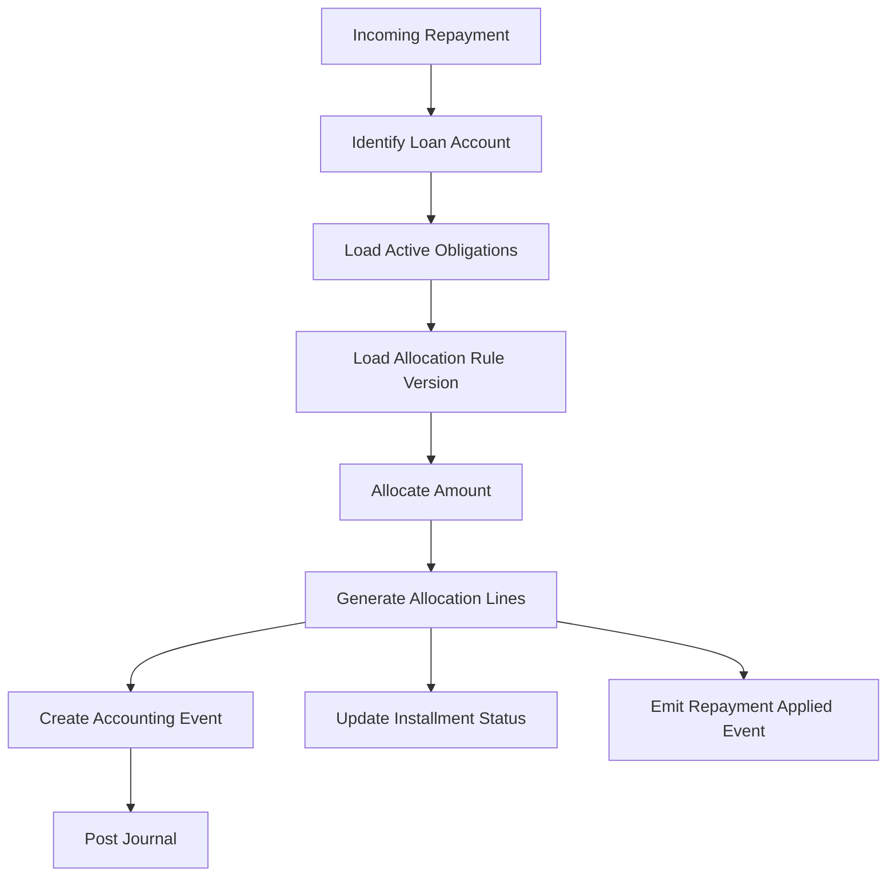
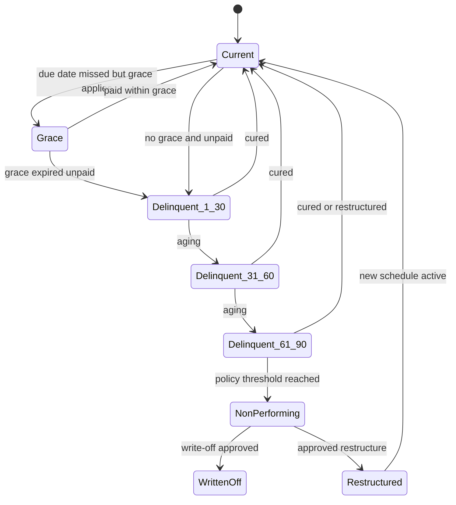

# Part 013 — Loan Products: Amortization, Schedules, Delinquency, and Repayment

Loan servicing is one of the most dangerous parts of a core banking system because it looks deceptively simple: disburse money, collect installments, calculate interest, and close the loan.

That mental model is too weak.

A production loan engine is closer to a **contract execution system** connected to a **ledger**, a **schedule generator**, a **repayment allocator**, a **delinquency classifier**, a **customer communication engine**, and a **regulatory evidence machine**.

If deposit products are mostly about safeguarding customer liabilities, loan products are about managing bank assets over time while preserving contractual, accounting, risk, and operational truth.

The goal of this part is not to memorize loan formulas. The goal is to build a mental model that lets you reason about loan behavior under change: partial payments, backdated payments, rate changes, holidays, restructuring, missed payments, write-off, refunds, and migration.

---

## 1. Kaufman Frame: What Skill Are We Acquiring?

Following Josh Kaufman's learning approach, we deconstruct the broad skill "build loan products in Java core banking" into smaller sub-skills:

1. Model a loan as a contract plus account plus ledger position.
2. Generate deterministic repayment schedules.
3. Separate contractual schedule from actual repayment history.
4. Allocate repayments using a versioned waterfall.
5. Classify delinquency using explainable date and amount rules.
6. Produce accounting events that keep the ledger balanced.
7. Handle operational edge cases without mutating history.
8. Design Java components that are deterministic, testable, and auditable.

The 20-hour target is not mastery of every national lending regulation. The target is this:

> Given a loan product definition, you can design the domain model, state machine, posting events, repayment allocation rules, and failure handling strategy well enough that a senior banking engineer, auditor, or risk analyst can challenge it and you can defend your decisions.

---

## 2. The Core Mental Model

A loan is not just an account with a negative balance.

A loan is a **financial agreement** where the bank provides value now and expects repayment later according to contractual terms. In accounting terms, a performing loan is usually an asset of the bank. Customer deposit balances are usually liabilities of the bank.



The core must distinguish:

| Concept | Meaning | Mutable? | Why it matters |
|---|---|---:|---|
| Loan agreement | Legal/economic contract | Versioned, not casually mutable | Source of terms |
| Loan account | Servicing account in core banking | State changes by events | Runtime state |
| Repayment schedule | Expected future obligations | Versioned/regenerated by controlled events | Basis for due amount and DPD |
| Ledger journal | Accounting truth | Append-only | Financial evidence |
| Repayment history | Actual cash received | Append-only/corrected by reversal | Customer and audit evidence |
| Delinquency status | Risk/servicing classification | Derived or evented with evidence | Collections and reporting |

The mistake is collapsing these into one mutable `loan` row.

A mature system keeps the contract, expected schedule, actual payments, accounting postings, and derived risk status separate but linked.

---

## 3. Loan Core Boundary

A core banking loan module is usually not responsible for the full lending lifecycle.



A practical boundary:

| Capability | Usually Core? | Notes |
|---|---:|---|
| Application capture | No | Origination/CRM domain |
| Credit decisioning | Usually no | Risk/underwriting domain |
| Contract activation | Yes | Core must understand terms accepted for servicing |
| Disbursement | Yes | Creates asset and cash movement |
| Schedule generation | Yes | Needed for due computation |
| Repayment allocation | Yes | Directly impacts balances |
| Accrual | Yes | Accounting/risk critical |
| Delinquency classification | Yes, often shared | Core provides source values; collections adds workflow |
| Restructuring execution | Yes | Alters schedule and accounting state |
| Write-off | Yes | Accounting event |
| Collections strategy | Usually no | Case/workflow domain |

Design rule:

> Origination may decide whether a loan should exist. Core must decide how an existing loan behaves financially.

---

## 4. Product Families

Loan products differ by repayment structure, rate behavior, collateral, and drawdown mechanics.

### 4.1 Amortizing Loan

A standard installment loan where principal is gradually repaid over scheduled installments.

Examples:

- personal loan
- auto loan
- mortgage
- SME term loan

Typical properties:

- fixed tenor
- fixed or floating rate
- monthly installments
- schedule generated at disbursement
- repayment allocation waterfall

### 4.2 Equal Installment Loan

Each installment is approximately equal, but the interest/principal split changes over time.

Early installments contain more interest. Later installments contain more principal.

This is common for mortgages and many consumer loans.

### 4.3 Equal Principal Loan

The principal component is equal each period; interest declines as outstanding principal declines.

Installment amount is not constant.

### 4.4 Interest-Only Loan

The borrower pays interest periodically and repays principal at maturity or through separate events.

Useful for certain corporate loans, bridge financing, and specific credit structures.

### 4.5 Bullet Loan

Principal and sometimes interest are paid at maturity.

Engineering risk: delinquency appears late unless accrual, covenants, and due-date monitoring are strong.

### 4.6 Revolving Credit / Line of Credit

Borrower can draw, repay, and redraw within a limit.

This is not a simple amortizing schedule. The core model needs:

- facility limit
- utilization
- available credit
- drawdown events
- repayment events
- interest on utilized balance
- possible commitment fee on unused limit

### 4.7 Overdraft

Operationally close to a deposit account with allowed negative available balance, but economically it behaves like credit.

The boundary between deposit overdraft and loan account must be explicit because accounting, interest, fees, collections, and regulatory reporting differ.

---

## 5. Canonical Loan Domain Model

A minimal but expressive loan servicing model:



Important modelling rule:

> The schedule describes expected obligations. Ledger postings describe what financially happened. Do not use the schedule as ledger truth.

---

## 6. Agreement vs Account vs Schedule

### 6.1 Loan Agreement

The agreement defines terms:

- approved principal
- rate type
- rate value or reference rate rule
- margin/spread
- tenor
- repayment frequency
- amortization method
- grace period
- fee rules
- penalty rules
- prepayment rules
- maturity date
- collateral reference
- product version

Agreement changes should be controlled.

Bad design:

```java
loan.setInterestRate(newRate);
loan.setInstallmentAmount(newAmount);
loanRepository.save(loan);
```

Better design:

```java
LoanModificationCommand command = new LoanModificationCommand(
    loanAccountId,
    ModificationType.RATE_CHANGE,
    effectiveDate,
    requestedBy,
    approvalReference,
    reason
);

LoanModificationResult result = loanModificationService.apply(command);
```

The change produces:

- agreement amendment event
- new schedule version if needed
- accounting event if financial impact exists
- audit evidence
- customer notice if applicable

### 6.2 Loan Account

The account stores servicing state:

- principal outstanding
- accrued interest
- due interest
- due fees
- due penalties
- next due date
- delinquency status
- restriction/hold state
- non-accrual flag if applicable
- maturity status

This state must be derivable from events or reconcileable against events.

### 6.3 Schedule

The schedule stores expected future obligations.

Do not overwrite old schedules casually. Use versioning.



A schedule version needs:

- version number
- generation reason
- generator version
- input terms hash
- effective date
- superseded schedule id
- approval reference if manually triggered

Without this, you cannot explain why installment number 17 changed.

---

## 7. Loan State Machine

A loan lifecycle should be explicit.



State transitions must be caused by commands or scheduled processes.

Examples:

| Transition | Cause | Evidence required |
|---|---|---|
| Approved → Active | Disbursement posted | disbursement transaction, GL journal |
| Active → Delinquent | Due not paid after grace | schedule, business date, unpaid amount |
| Delinquent → Active | Arrears fully paid | repayment allocation result |
| Active → Restructured | Approved restructuring | approval, new terms, schedule version |
| Delinquent → WrittenOff | Write-off approval | loss recognition, approval matrix |
| Active → Closed | Payoff posted | zero outstanding, closure journal |

State must not be derived from a random combination of nullable columns.

---

## 8. Schedule Generation

A repayment schedule is deterministic output from versioned inputs.



Inputs include:

- principal amount
- disbursement date
- first due date
- maturity date or tenor
- payment frequency
- interest rate
- day-count convention
- amortization method
- currency precision
- rounding policy
- holiday adjustment rule
- grace period rule
- fee rule

Schedule generation must be pure or nearly pure:

```java
public interface LoanScheduleGenerator {
    RepaymentSchedule generate(LoanScheduleRequest request);
}
```

The generator should not directly mutate accounts or write ledger journals. It should return a schedule candidate that can be persisted through a controlled application service.

---

## 9. Amortization Methods

### 9.1 Equal Principal

Principal portion is fixed:

```txt
principal_per_period = original_principal / number_of_periods
interest_for_period = outstanding_principal * periodic_rate
installment = principal_per_period + interest_for_period
```

Pros:

- easy to explain
- principal declines predictably
- lower total interest than equal installment in many cases

Cons:

- early installments are higher
- customer affordability may be lower

### 9.2 Equal Installment

Installment amount is approximately constant.

For a simple fixed-rate periodic model:

```txt
installment = P * r / (1 - (1 + r)^-n)
```

Where:

- `P` = principal
- `r` = periodic interest rate
- `n` = number of periods

Production warning:

This formula is only the start. Real systems must handle:

- irregular first period
- holidays
- non-monthly frequencies
- leap years
- day-count conventions
- currency rounding
- rate changes
- partial disbursement
- grace periods
- residual amount in final installment

### 9.3 Interest-Only

Periodic installments contain interest only. Principal is due at maturity or separate repayment dates.

Risk:

- outstanding principal remains high
- payment shock at maturity
- delinquency needs strong maturity monitoring

### 9.4 Bullet

Principal is paid once at maturity. Interest may be paid periodically or also at maturity.

Engineering warning:

A bullet loan cannot be monitored only by installment schedule. You need maturity monitoring and accrual correctness.

### 9.5 Flat Rate

Interest is computed on original principal, not reducing outstanding principal.

This may be used in some products/markets, but it is frequently misunderstood by customers and regulators. If supported, the contract, disclosures, and effective yield reporting must be explicit.

---

## 10. Rounding and Residual Strategy

Loan schedules often produce fractional minor units.

Example:

```txt
principal = 10,000.00
periods = 3
principal_per_period = 3,333.333333...
```

You cannot post fractional cents if the currency minor unit is 2 decimal places.

Common strategies:

| Strategy | Behavior | Risk |
|---|---|---|
| Round each installment | Simple | residual drift |
| Adjust final installment | Common | final installment differs |
| Distribute residual | Smoother | harder to explain |
| Maintain high-precision internal accrual, round at posting | Better for interest | needs reconciliation |

The invariant:

> Sum of scheduled principal must equal disbursed principal after rounding policy is applied.

Java value object example:

```java
public record Money(String currency, BigDecimal amount) {
    public Money {
        Objects.requireNonNull(currency, "currency");
        Objects.requireNonNull(amount, "amount");
    }

    public Money rounded(CurrencyScale scale, RoundingMode mode) {
        return new Money(currency, amount.setScale(scale.minorUnits(currency), mode));
    }

    public Money plus(Money other) {
        requireSameCurrency(other);
        return new Money(currency, amount.add(other.amount));
    }

    public Money minus(Money other) {
        requireSameCurrency(other);
        return new Money(currency, amount.subtract(other.amount));
    }

    private void requireSameCurrency(Money other) {
        if (!currency.equals(other.currency())) {
            throw new IllegalArgumentException("Currency mismatch: " + currency + " vs " + other.currency());
        }
    }
}
```

Do not use `double` for money.

---

## 11. Schedule Versioning

Schedule versioning is essential because real loans change.

Causes of schedule version change:

- rate change
- restructuring
- partial prepayment
- deferment
- moratorium
- grace period extension
- holiday calendar correction
- product correction
- migration correction

A schedule version should not erase the old version.

```java
public record ScheduleVersion(
    ScheduleId scheduleId,
    LoanAccountId loanAccountId,
    int version,
    ScheduleGenerationReason reason,
    LocalDate effectiveFrom,
    String generatorVersion,
    String inputHash,
    Optional<ScheduleId> supersedes
) {}
```

A useful invariant:

```txt
Only one active schedule version may apply to a loan account for a given business date.
```

---

## 12. Due Amount Is Not Outstanding Amount

A common beginner mistake is to treat outstanding balance as due amount.

They are different.

| Concept | Meaning |
|---|---|
| Principal outstanding | Principal still owed overall |
| Accrued interest | Interest earned but not yet due/posted |
| Interest due | Interest currently payable by borrower |
| Installment due | Amount expected by due date |
| Arrears | Past due unpaid amount |
| Payoff amount | Amount required to close loan as of a date |

A borrower may owe `100,000` principal outstanding, but only `2,500` due this month.

A payoff quote may include:

- outstanding principal
- accrued interest to payoff date
- due fees
- penalties
- prepayment fee
- taxes
- settlement adjustments

Payoff calculation should be a separate service, not a side-effect of normal repayment.

---

## 13. Repayment Allocation

Repayment allocation answers:

> When money arrives, which obligations are reduced first?

Common waterfall:

1. taxes
2. fees
3. penalty interest
4. overdue interest
5. current interest
6. overdue principal
7. current principal
8. future principal or unapplied credit

But the exact order is product-, contract-, and jurisdiction-specific.

Therefore, the allocation waterfall must be:

- versioned
- explainable
- testable
- product-controlled
- override-controlled if manual exceptions exist



Example model:

```java
public record AllocationLine(
    ObligationType obligationType,
    InstallmentId installmentId,
    Money allocatedAmount,
    int priority,
    String ruleCode
) {}

public interface RepaymentAllocator {
    RepaymentAllocation allocate(RepaymentAllocationRequest request);
}
```

Allocation should return a detailed result, not just mutate balances.

```java
public record RepaymentAllocation(
    LoanAccountId loanAccountId,
    LoanTransactionId transactionId,
    Money receivedAmount,
    List<AllocationLine> lines,
    Money unappliedAmount,
    AllocationRuleVersion ruleVersion
) {
    public Money allocatedTotal() {
        return lines.stream()
            .map(AllocationLine::allocatedAmount)
            .reduce(new Money(receivedAmount.currency(), BigDecimal.ZERO), Money::plus);
    }
}
```

Invariant:

```txt
received_amount = sum(allocation_lines) + unapplied_amount
```

---

## 14. Accounting Events for Loan Servicing

Loan servicing should produce accounting events. Exact debit/credit depends on bank chart of accounts, but the event taxonomy is stable.

| Business event | Typical financial meaning |
|---|---|
| Loan disbursement | Bank creates loan asset and pays customer/merchant |
| Interest accrual | Bank recognizes interest receivable/income according to policy |
| Interest due | Accrued interest becomes payable by borrower |
| Repayment received | Cash increases; receivable/principal decreases |
| Fee charged | Fee receivable/income recognized |
| Penalty charged | Penalty receivable/income recognized according to policy |
| Write-off | Loan asset reduced against allowance/loss account |
| Recovery after write-off | Cash received after write-off recognized appropriately |
| Restructure | Existing terms replaced; may require accounting remeasurement |

Example disbursement journal concept:

```txt
Debit  Loan Principal Receivable      10,000.00
Credit Customer Deposit / Cash        10,000.00
```

Example repayment journal concept:

```txt
Debit  Customer Deposit / Cash         1,000.00
Credit Interest Receivable               200.00
Credit Loan Principal Receivable         800.00
```

Do not hardcode GL accounts in loan code. Use product/accounting mapping.

---

## 15. Delinquency and Days Past Due

Delinquency is not a vague label. It must be calculated from due obligations, business date, payment history, grace rules, and product terms.

Core terms:

| Term | Meaning |
|---|---|
| Due date | Date an installment is expected |
| Grace period | Allowed delay before penalty/classification changes |
| Past due amount | Unpaid amount whose due date passed |
| Days past due | Number of days obligation remains unpaid after due/grace logic |
| Delinquency bucket | Classification range, such as 1-30, 31-60, 61-90 |
| Cure | Return to current status after arrears are resolved |

Basic DPD model:

```txt
DPD = business_date - earliest_unpaid_due_date
```

But production systems must answer:

- Does grace period reduce DPD or only suppress penalties?
- Is DPD based on principal, interest, fee, or total installment?
- Does partial payment move earliest unpaid date?
- Does restructuring reset DPD?
- Does moratorium pause DPD?
- Does non-business day affect due date?
- Is DPD calculated before or after EOD?

These are policy decisions, not technical guesses.

---

## 16. Delinquency State Machine



Delinquency transitions should be evidence-producing events.

Example:

```java
public record DelinquencyClassification(
    LoanAccountId loanAccountId,
    LocalDate businessDate,
    int daysPastDue,
    DelinquencyBucket bucket,
    Money pastDueAmount,
    LocalDate earliestUnpaidDueDate,
    String policyVersion
) {}
```

---

## 17. Repayment Scenarios

### 17.1 Full On-Time Payment

Expected behavior:

- installment marked paid
- interest/principal allocated according to waterfall
- due balances reduced
- statement entry created
- no delinquency event

### 17.2 Partial Payment

Expected behavior:

- allocation applies to priority obligations
- installment may remain partially paid
- arrears may remain
- DPD may continue from earliest unpaid due date

### 17.3 Early Payment

Potential behaviors:

- hold as unapplied credit
- apply to future installments
- reduce principal immediately
- trigger schedule recalculation
- shorten tenor
- reduce installment amount

This must be product-configured.

### 17.4 Prepayment

Prepayment may:

- reduce principal
- incur prepayment fee
- regenerate schedule
- require customer instruction: reduce tenor or reduce installment

Never assume prepayment means the same thing across products.

### 17.5 Backdated Payment

Backdated payment is dangerous.

It may affect:

- interest accrual
- penalty charged
- delinquency status
- customer statement
- GL period
- regulatory reporting

Rule of thumb:

> Backdated value date may affect economic calculation, but posting must still preserve actual processing date and audit evidence.

### 17.6 Overpayment

Overpayment may become:

- unapplied credit
- principal prepayment
- refund payable
- suspense item

Do not silently discard or force-post overpayment.

---

## 18. Restructuring and Rescheduling

Restructuring changes the economics or timing of the loan.

Examples:

- tenor extension
- rate reduction
- installment reduction
- principal moratorium
- interest capitalization
- arrears capitalization
- payment holiday
- debt forgiveness

Engineering requirements:

- approval workflow
- old schedule preserved
- new schedule version created
- accounting impact evaluated
- delinquency impact explicit
- customer notice generated if required
- risk/reporting flag updated

Bad design:

```sql
UPDATE loan_installment
SET due_date = due_date + INTERVAL '3 months'
WHERE loan_id = ?;
```

Better design:

```txt
LoanRestructureApproved
  -> AgreementAmended
  -> ScheduleVersionGenerated
  -> AccountingImpactAssessed
  -> LoanRestructureActivated
```

---

## 19. Java Application Service Design

A robust repayment application service shape:

```java
public final class ApplyLoanRepaymentService {
    private final LoanAccountRepository loanAccounts;
    private final RepaymentAllocator allocator;
    private final AccountingEventFactory accountingEvents;
    private final PostingGateway postingGateway;
    private final IdempotencyRepository idempotency;

    public RepaymentResult apply(ApplyLoanRepaymentCommand command) {
        return idempotency.execute(command.idempotencyKey(), command.requestHash(), () -> {
            LoanAccount account = loanAccounts.getForUpdate(command.loanAccountId());

            account.assertCanAcceptRepayment(command.valueDate());

            RepaymentAllocation allocation = allocator.allocate(
                RepaymentAllocationRequest.from(account, command)
            );

            AccountingEvent event = accountingEvents.repaymentApplied(account, allocation);

            PostingResult posting = postingGateway.post(event);

            account.applyRepayment(allocation, posting.journalId());
            loanAccounts.save(account);

            return RepaymentResult.accepted(command.loanAccountId(), posting.journalId(), allocation);
        });
    }
}
```

Notes:

- `getForUpdate` or equivalent serialization is needed for high-contention accounts.
- Idempotency wraps the whole operation.
- Posting should be atomic with state mutation or coordinated by a strong local transaction boundary.
- The result contains allocation details for audit and user communication.

---

## 20. Repository and Consistency Boundary

The natural consistency boundary for most loan servicing commands is the loan account plus its due obligations and ledger posting request.

Potential boundary:

```txt
Single database transaction:
- idempotency record
- loan account state
- repayment allocation records
- journal entry
- journal lines
- outbox event
```

Avoid this anti-pattern:

```txt
1. update loan balance
2. call ledger service over network
3. send Kafka event
4. update installment status
```

If step 2 or 3 fails, you are in an unknown state.

Better options:

- local modular monolith transaction for core ledger and loan servicing
- transactional outbox for integration events
- explicit pending state plus recovery process if external posting is unavoidable

---

## 21. Common Tables

A simplified relational shape:

```sql
CREATE TABLE loan_account (
    id UUID PRIMARY KEY,
    agreement_id UUID NOT NULL,
    status VARCHAR(40) NOT NULL,
    currency CHAR(3) NOT NULL,
    principal_outstanding NUMERIC(19, 4) NOT NULL,
    interest_accrued NUMERIC(19, 4) NOT NULL,
    interest_due NUMERIC(19, 4) NOT NULL,
    fees_due NUMERIC(19, 4) NOT NULL,
    penalty_due NUMERIC(19, 4) NOT NULL,
    days_past_due INTEGER NOT NULL,
    active_schedule_id UUID,
    version BIGINT NOT NULL
);

CREATE TABLE repayment_schedule (
    id UUID PRIMARY KEY,
    loan_account_id UUID NOT NULL,
    version_no INTEGER NOT NULL,
    status VARCHAR(40) NOT NULL,
    generated_on DATE NOT NULL,
    effective_from DATE NOT NULL,
    generation_reason VARCHAR(80) NOT NULL,
    generator_version VARCHAR(80) NOT NULL,
    input_hash VARCHAR(128) NOT NULL
);

CREATE TABLE loan_installment (
    id UUID PRIMARY KEY,
    schedule_id UUID NOT NULL,
    sequence_no INTEGER NOT NULL,
    due_date DATE NOT NULL,
    principal_due NUMERIC(19, 4) NOT NULL,
    interest_due NUMERIC(19, 4) NOT NULL,
    fee_due NUMERIC(19, 4) NOT NULL,
    penalty_due NUMERIC(19, 4) NOT NULL,
    principal_paid NUMERIC(19, 4) NOT NULL,
    interest_paid NUMERIC(19, 4) NOT NULL,
    fee_paid NUMERIC(19, 4) NOT NULL,
    penalty_paid NUMERIC(19, 4) NOT NULL,
    status VARCHAR(40) NOT NULL
);
```

Real schemas need more controls, indexes, constraints, audit columns, and partitioning.

---

## 22. Critical Invariants

### 22.1 Principal Conservation

```txt
principal_disbursed
- principal_repaid
- principal_written_off
- principal_forgiven
= principal_outstanding
```

### 22.2 Schedule Principal Conservation

```txt
sum(active_schedule.principal_due)
= principal_expected_to_be_repaid_by_schedule
```

Depending on prepayment/restructure, this may equal current principal outstanding or original disbursed principal for the schedule version.

### 22.3 Allocation Conservation

```txt
repayment_received = allocated_to_obligations + unapplied_amount
```

### 22.4 Installment Paid Bound

```txt
paid_component <= due_component
```

Unless the model explicitly allows advance payment against future obligations.

### 22.5 Ledger Balance

Every accounting event must produce balanced journal lines.

```txt
sum(debits) = sum(credits)
```

### 22.6 DPD Explainability

```txt
days_past_due must be explainable from earliest unpaid due obligation and policy version
```

---

## 23. Failure Modes

| Failure | Consequence | Prevention |
|---|---|---|
| Schedule overwritten | Cannot explain historical installment | version schedules |
| Repayment applied twice | Balance understated | idempotency + unique business key |
| Interest rounded inconsistently | reconciliation break | centralized rounding policy |
| Partial payment closes installment incorrectly | wrong DPD | component-level paid amounts |
| Backdated payment mutates closed period | GL/reporting issue | posting date/value date separation |
| Rate change retroactive without evidence | customer dispute | amendment event + approval |
| Prepayment does not regenerate schedule | wrong future due amount | product-configured prepayment behavior |
| Delinquency derived differently by systems | risk/reporting mismatch | canonical delinquency policy output |
| Write-off deletes loan | evidence loss | write-off event, not deletion |

---

## 24. Testing Strategy

### 24.1 Deterministic Schedule Tests

For the same input, generator must return the same schedule.

```java
@Test
void scheduleGenerationIsDeterministic() {
    LoanScheduleRequest request = sampleRequest();

    RepaymentSchedule first = generator.generate(request);
    RepaymentSchedule second = generator.generate(request);

    assertThat(second.installments()).isEqualTo(first.installments());
}
```

### 24.2 Principal Sum Property

```java
@Test
void scheduledPrincipalEqualsDisbursedPrincipal() {
    RepaymentSchedule schedule = generator.generate(sampleRequest());

    Money totalPrincipal = schedule.installments().stream()
        .map(Installment::principalDue)
        .reduce(Money.zero("IDR"), Money::plus);

    assertThat(totalPrincipal).isEqualTo(sampleRequest().principal());
}
```

### 24.3 Repayment Allocation Conservation

```java
@Test
void allocationConservesReceivedAmount() {
    RepaymentAllocation allocation = allocator.allocate(sampleAllocationRequest());

    Money allocated = allocation.allocatedTotal().plus(allocation.unappliedAmount());

    assertThat(allocated).isEqualTo(allocation.receivedAmount());
}
```

### 24.4 DPD Regression Tests

Create fixtures for:

- full payment before due date
- partial payment after due date
- payment during grace
- payment after grace
- backdated payment
- restructuring
- moratorium
- holiday-adjusted due date

---

## 25. Operational Observability

Loan telemetry should be business-aware.

Useful metrics:

| Metric | Meaning |
|---|---|
| loan_repayment_apply_success_total | successful repayments |
| loan_repayment_apply_rejected_total | rejected repayments by reason |
| loan_schedule_generation_total | schedule generation by reason |
| loan_repayment_unapplied_amount_total | money in unapplied state |
| loan_delinquency_bucket_count | accounts per bucket |
| loan_interest_accrual_difference_amount | expected vs actual accrual delta |
| loan_posting_reversal_total | correction volume |
| loan_writeoff_amount_total | write-off amount |

Useful traces:

- repayment command accepted
- idempotency resolved
- account loaded/locked
- allocation computed
- accounting event generated
- journal posted
- outbox event written

Logs should include correlation IDs, loan account ID, transaction ID, product version, allocation rule version, and policy version. Avoid logging sensitive personal data.

---

## 26. Anti-Patterns

### 26.1 Loan as One Mutable Row

A single `loan` table with mutable columns for amount, rate, status, next due date, and outstanding is not enough.

It cannot explain history.

### 26.2 Recalculate Everything on Read

Recalculating schedule, accrued interest, due amount, and delinquency dynamically on every read sounds elegant but usually fails under audit and performance pressure.

Better: deterministic engines plus persisted evidence and controlled recalculation.

### 26.3 Hardcoded Repayment Waterfall

Repayment allocation differs by product and policy. Hardcoding creates hidden regulatory and customer-impact risk.

### 26.4 Treating DPD as Manual Status

DPD must be computed from obligations and policy. Manual overrides may exist, but they must be explicit exceptions with evidence.

### 26.5 Updating GL Separately From Loan State

Loan state and accounting journal must not diverge. If they are in separate systems, design recovery and reconciliation as first-class capabilities.

---

## 27. Mini Project: Build a Loan Servicing Slice

Implement a small Java module that supports:

1. Create approved loan agreement.
2. Disburse loan.
3. Generate equal-principal schedule.
4. Apply repayment.
5. Allocate repayment to interest then principal.
6. Compute days past due.
7. Generate balanced journal entries.
8. Reverse a repayment.
9. Regenerate schedule after prepayment.
10. Export an audit explanation for a loan account.

Constraints:

- Use `BigDecimal`, not `double`.
- Use immutable value objects.
- Use schedule versioning.
- Use append-only transaction history.
- Make all test fixtures deterministic.

Success criterion:

> For any loan account, you can explain current principal outstanding, due amount, paid amount, delinquency status, and accounting entries from persisted events and schedule versions.

---

## 28. Review Checklist

Before approving a loan servicing design, ask:

- Can old schedules be reconstructed?
- Can current outstanding be reconciled to disbursement, repayment, write-off, and adjustment events?
- Is repayment allocation versioned?
- Can partial payments be represented correctly?
- Are value date and posting date separate?
- Can backdated payments be handled without mutating history?
- Can DPD be explained from due obligations?
- Are restructuring and rescheduling controlled events?
- Is the GL impact explicit for every loan event?
- Can the system produce customer-facing and auditor-facing explanations?

---

## 29. Key Takeaways

- A loan is a contract execution system, not just a negative balance.
- Schedule, ledger, repayment history, and delinquency state are different models.
- Schedule generation must be deterministic and versioned.
- Repayment allocation must be explicit, versioned, and explainable.
- Delinquency must be calculated from obligations and policy, not guessed.
- Backdated payments, partial payments, prepayments, and restructuring are normal production scenarios.
- Accounting events are first-class outputs of loan servicing.
- The best Java design is not the most abstract; it is the one that preserves financial truth under change.

---

## 30. References

- IFRS Foundation — IFRS 9 Financial Instruments and effective interest method context.
- Basel Committee on Banking Supervision — Sound Credit Risk Assessment and Valuation for Loans.
- ISO 4217 — Currency codes and minor-unit metadata.
- BIAN Service Landscape — Product Management, Loans, Deposits, Accounting, and Servicing capabilities.
- Prior series dependencies: Java Persistence, SQL/JDBC, Error/Reliability/Observability, Security/Hardening, Messaging/Event Streaming.

