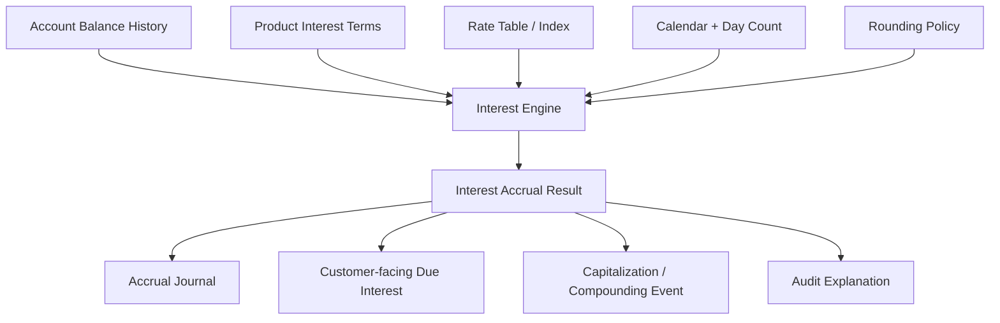
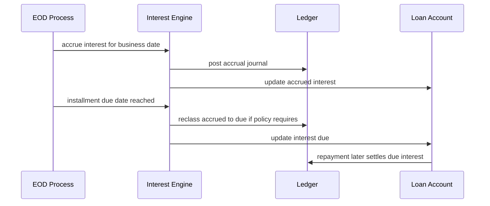
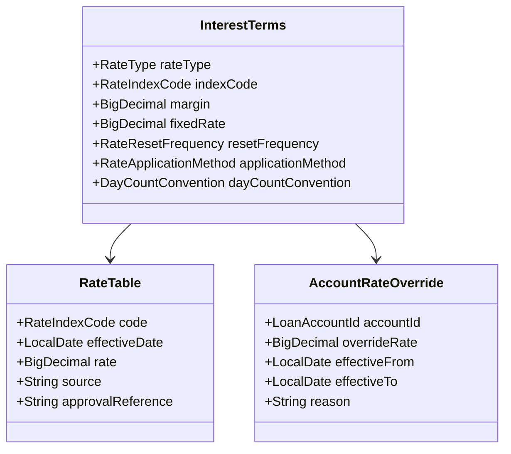
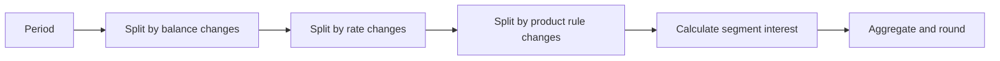
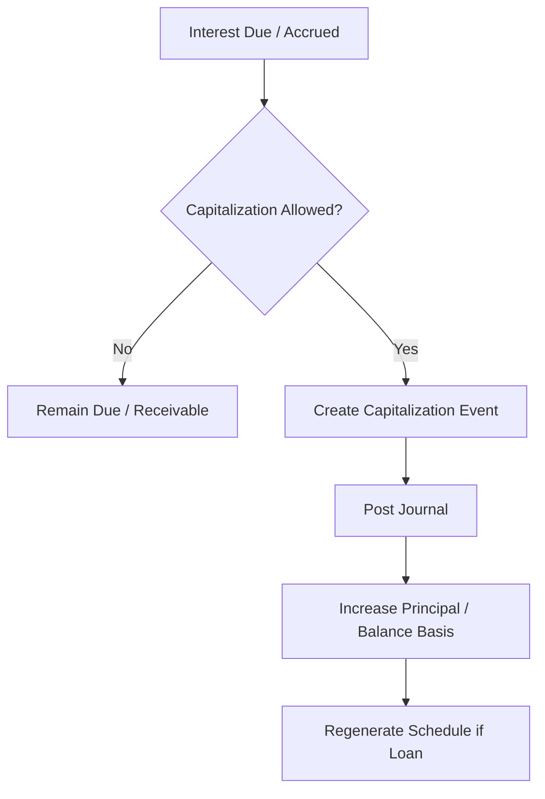
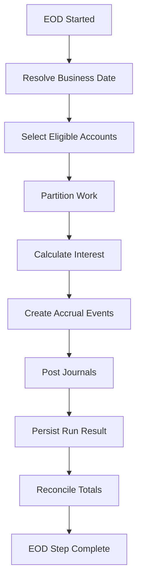
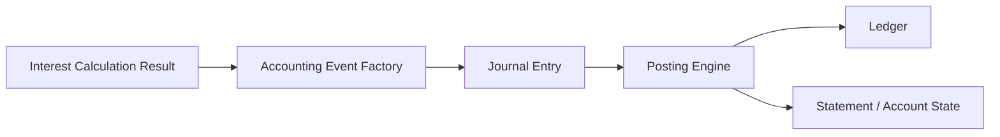
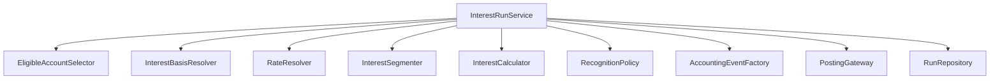

# Part 014 — Interest Engine: Accrual, Capitalization, and Compounding

Interest is where many core banking systems reveal whether they are truly financial systems or merely CRUD applications with balances.

A weak model says:

> interest = balance × rate × days / 365

A production model asks:

- Which balance?
- Which rate version?
- Which day-count convention?
- Which calendar?
- Which period?
- Which product rule?
- Which rounding policy?
- Is this accrual, due posting, capitalization, compounding, tax withholding, or income recognition?
- What happens if the transaction is backdated?
- Can this calculation be rerun safely?
- Can an auditor reproduce it two years later?

This part builds a robust mental model and Java design for interest engines in core banking.

---

## 1. Kaufman Frame: The Sub-Skill

The sub-skill is not "know interest formulas".

The sub-skill is:

> Given a product definition, account history, business date, and rate table, design an interest engine that computes, persists, posts, explains, reverses, and reconciles interest without breaking ledger truth.

We deconstruct it into:

1. Interest concept taxonomy.
2. Balance basis selection.
3. Rate model and effective dating.
4. Day-count convention and accrual periods.
5. Rounding and residual strategy.
6. Accrual vs due vs capitalization vs compounding.
7. Accounting event generation.
8. Idempotent EOD/BOD execution.
9. Retroactive correction and replay strategy.
10. Tests that detect financial drift.

---

## 2. Interest Engine Mental Model

Interest is a **time-based transformation** of a financial position into an obligation or income/expense event.



The engine must separate calculation from posting.

| Layer | Responsibility |
|---|---|
| Calculation | Determine interest amount and explanation |
| Decision | Decide whether to accrue, post due, capitalize, waive, reverse, or suppress |
| Accounting | Produce balanced journal entries |
| Persistence | Store results, run metadata, policy version, and audit trace |
| Operations | Rerun, repair, reconcile, and explain |

---

## 3. Interest Taxonomy

### 3.1 Accrued Interest

Interest earned or incurred over time but not necessarily due or paid yet.

For loans:

- bank earns interest income
- borrower owes interest
- system may maintain interest receivable

For deposits:

- bank incurs interest expense
- customer earns interest
- system may maintain interest payable

### 3.2 Due Interest

Interest that has become payable according to schedule or product terms.

A loan can have accrued interest that is not yet due.

### 3.3 Capitalized Interest

Interest added to principal.

Example:

```txt
principal_outstanding = principal_outstanding + unpaid_interest_capitalized
interest_due = interest_due - unpaid_interest_capitalized
```

This must be explicitly allowed by product, contract, and regulation.

### 3.4 Compounded Interest

Interest on interest.

Compounding can happen when previously accrued or credited interest becomes part of the balance base for future interest calculation.

Do not treat capitalization and compounding as synonyms. They often overlap but are not the same modelling concept.

### 3.5 Penalty Interest

Additional interest due to overdue obligations.

Must be modelled separately from normal interest because:

- accounting treatment may differ
- waiver rules may differ
- customer disclosure differs
- regulatory reporting may differ

### 3.6 Suspended Interest / Non-Accrual Interest

For impaired or non-performing loans, a bank may stop recognizing interest income in the same way as performing loans, depending on accounting and regulatory policy.

The system needs a state/policy hook for this. Do not hide it inside a rate formula.

---

## 4. Accrual Is Not Posting Is Not Payment

These four events are often confused:

| Event | Meaning |
|---|---|
| Accrue | Recognize interest for elapsed time |
| Post due | Move accrued interest into payable/receivable due bucket |
| Capitalize | Add interest into principal/base |
| Pay | Settle using cash/deposit/payment |

Example loan timeline:



A payment should not recompute all historical interest casually. It should settle obligations already computed, with controlled recalculation if value-date rules require it.

---

## 5. Balance Basis

Interest calculation starts with the balance basis.

Examples:

| Basis | Meaning | Common use |
|---|---|---|
| End-of-day balance | Balance after all postings for day | deposits, loans |
| Beginning-of-day balance | Balance before daily postings | some legacy products |
| Average daily balance | Average of daily balances in period | savings/current accounts |
| Minimum monthly balance | Minimum balance over period | some deposits |
| Principal outstanding | Loan principal only | loan interest |
| Utilized amount | Drawn amount in credit facility | revolving credit |
| Available balance | Usually not for interest | customer availability, not accounting yield |
| Collected balance | Excludes uncleared funds | deposit interest in some banks |

The balance basis must be product-configured and auditable.

Bad design:

```java
BigDecimal interest = account.getBalance().multiply(rate);
```

Better design:

```java
InterestBasis basis = basisResolver.resolve(account, productTerms, period);
InterestCalculationResult result = interestCalculator.calculate(basis, rate, convention, roundingPolicy);
```

---

## 6. Rate Model

Interest rates are not just one number.



Common rate types:

| Rate type | Meaning |
|---|---|
| Fixed | Same rate unless contract amended |
| Variable/administered | Bank-controlled rate table |
| Floating/indexed | Reference rate plus spread |
| Tiered | Different rates by balance bands |
| Step-up/step-down | Rate changes by time or milestone |
| Promotional | Temporary special rate |
| Penalty | Applied when overdue/default condition exists |

The rate used for any calculation must be explainable:

```txt
account_id + product_version + rate_index + effective_date + margin + override + approval_reference
```

---

## 7. Effective Dating

Interest engines are temporal systems.

Rate, product, balance, calendar, tax, and account state all change over time.

A correct calculation is a composition of effective-dated facts.

```txt
interest_period: 2026-03-01 to 2026-03-31
rate segments:
  2026-03-01 to 2026-03-15 = 5.00%
  2026-03-16 to 2026-03-31 = 5.25%
```

The engine must split the period into segments when facts change.



Do not apply month-end rate to the whole month unless the product explicitly says so.

---

## 8. Day-Count Conventions

A day-count convention defines how days are counted and annualized.

Common examples:

| Convention | Simplified intuition |
|---|---|
| Actual/360 | actual days divided by 360 |
| Actual/365 | actual days divided by 365 |
| Actual/Actual | actual days divided according to actual year length or convention variant |
| 30/360 | months treated as 30 days and year as 360 days |

Formula shape:

```txt
interest = principal × annual_rate × day_count_fraction
```

But `day_count_fraction` is convention-specific.

Example for Actual/365:

```txt
days = actual number of days in period
fraction = days / 365
```

Example for Actual/360:

```txt
days = actual number of days in period
fraction = days / 360
```

Production warning:

`Actual/Actual` and `30/360` have variants. The contract/product definition must specify the exact convention, not just a vague label.

Java shape:

```java
public interface DayCountConvention {
    BigDecimal yearFraction(LocalDate startInclusive, LocalDate endExclusive);
}

public final class Actual365Fixed implements DayCountConvention {
    @Override
    public BigDecimal yearFraction(LocalDate startInclusive, LocalDate endExclusive) {
        long days = ChronoUnit.DAYS.between(startInclusive, endExclusive);
        return BigDecimal.valueOf(days)
            .divide(BigDecimal.valueOf(365), 16, RoundingMode.HALF_EVEN);
    }
}
```

Keep the calculation precision higher than currency posting precision.

---

## 9. Accrual Periods

Interest can be accrued daily, monthly, on schedule dates, or on demand.

Common patterns:

| Pattern | Behavior |
|---|---|
| Daily accrual | EOD accrues one business day/calendar day |
| Monthly accrual | Accrues for a month at EOM |
| Schedule-date accrual | Accrues according to installment dates |
| Real-time accrual | Calculates up-to-now for payoff/quote |
| Lazy accrual | Calculates when account is touched |

For banking core, daily EOD accrual plus on-demand quote calculation is common.

But never confuse a quote with posted accounting truth.

```txt
posted_accrual = persisted accounting result
quote_accrual = estimated amount for decision/customer quote
```

---

## 10. Deposit Interest

Deposit interest usually creates expense for the bank and benefit for the customer.

Example conceptual event:

```txt
Debit  Interest Expense
Credit Interest Payable to Customer
```

When credited to customer account:

```txt
Debit  Interest Payable to Customer
Credit Customer Deposit Liability
```

Deposit product complexities:

- minimum balance requirements
- tiered rates
- promotional rates
- withholding tax
- dormant account suppression
- account closure accrual
- interest forfeiture for early term deposit withdrawal
- capitalization into deposit balance

---

## 11. Loan Interest

Loan interest usually creates income/receivable for the bank.

Example conceptual accrual:

```txt
Debit  Interest Receivable
Credit Interest Income
```

When borrower pays:

```txt
Debit  Cash / Customer Deposit
Credit Interest Receivable
```

Loan complexities:

- principal basis changes after repayment/disbursement
- rate resets
- delinquency/penalty interest
- non-accrual treatment
- capitalization during moratorium
- payoff quote calculation
- prepayment effect on future interest

---

## 12. Capitalization

Capitalization adds interest to principal or account balance.

Deposit example:

```txt
interest credited to savings balance
```

Loan example:

```txt
unpaid interest during moratorium becomes principal
```

Capitalization must answer:

- Which interest components are eligible?
- When does capitalization happen?
- Is approval required?
- Does it affect future interest basis?
- Does it regenerate schedule?
- What journal entries are required?
- How is customer notice generated?

Capitalization is not a silent field update.



---

## 13. Compounding

Compounding means interest is calculated on a base that includes prior interest.

Compounding dimensions:

| Dimension | Examples |
|---|---|
| Frequency | daily, monthly, quarterly, maturity |
| Base inclusion | principal only, principal plus capitalized interest, average balance |
| Rounding | per period, at capitalization, at posting |
| Eligibility | active accounts only, minimum balance, performing loans only |

Example:

```txt
Day 1 base = 1,000.00
Interest credited = 0.10
Day 2 base = 1,000.10 if daily compounding applies
```

Without explicit compounding policy, two systems can produce different results while both appear mathematically reasonable.

---

## 14. Tiered Interest

Tiered rates can be applied in different ways.

### 14.1 Whole-Balance Tier

If balance falls into tier, one rate applies to whole balance.

```txt
balance = 15,000
rate = tier rate for 10,000-20,000
```

### 14.2 Marginal / Band Tier

Different portions of balance receive different rates.

```txt
0 - 10,000      -> 1.00%
10,000 - 20,000 -> 1.50%
```

For balance `15,000`, first `10,000` gets 1.00%, next `5,000` gets 1.50%.

Product configuration must specify which method applies.

---

## 15. Tax Withholding

Some deposit interest requires withholding tax.

Conceptual flow:

```txt
gross_interest = calculated interest
tax = gross_interest × tax_rate
net_interest = gross_interest - tax
```

Posting concept:

```txt
Debit  Interest Expense              gross_interest
Credit Customer Deposit Liability    net_interest
Credit Tax Payable                   tax
```

Tax rules are jurisdiction-specific. The core engine should support tax calculation as a policy component, not hardcode one country's rule into interest math.

---

## 16. Rounding Policy

Interest engines need multiple precision levels:

| Precision | Use |
|---|---|
| Calculation precision | internal formula, high scale |
| Accrual storage precision | may be higher than currency minor unit |
| Posting precision | currency minor unit |
| Display precision | customer statement/reporting |

Rounding choices:

- `HALF_UP`
- `HALF_EVEN`
- floor/truncate
- product-specific rule
- jurisdiction-specific rule

Do not spread rounding decisions across code.

```java
public record RoundingPolicy(
    int calculationScale,
    int postingScale,
    RoundingMode calculationMode,
    RoundingMode postingMode
) {}
```

Potential invariant:

```txt
posted_interest + rounding_residual = calculated_interest
```

If residuals are material, track and reconcile them.

---

## 17. Interest Calculation Result

The result must be explainable.

```java
public record InterestCalculationResult(
    AccountId accountId,
    LocalDate periodStartInclusive,
    LocalDate periodEndExclusive,
    Money balanceBasis,
    BigDecimal annualRate,
    BigDecimal dayCountFraction,
    Money rawInterest,
    Money roundedInterest,
    String dayCountConvention,
    String rateSource,
    String productVersion,
    String policyVersion,
    List<InterestSegmentExplanation> segments
) {}

public record InterestSegmentExplanation(
    LocalDate startInclusive,
    LocalDate endExclusive,
    Money segmentBalance,
    BigDecimal segmentRate,
    BigDecimal segmentFraction,
    Money segmentInterest,
    String reason
) {}
```

A strong result object supports:

- customer explanation
- audit reconstruction
- dispute handling
- regression testing
- reconciliation

---

## 18. Segment-Based Calculation

When rates or balances change during a period, split into segments.

Example:

```txt
Interest period: 2026-01-01 to 2026-02-01
Balance:
  2026-01-01 to 2026-01-10: 10,000
  2026-01-10 to 2026-02-01: 8,000
Rate:
  2026-01-01 to 2026-01-20: 5.00%
  2026-01-20 to 2026-02-01: 5.50%
```

Segments become:

```txt
2026-01-01 to 2026-01-10: balance 10,000, rate 5.00%
2026-01-10 to 2026-01-20: balance  8,000, rate 5.00%
2026-01-20 to 2026-02-01: balance  8,000, rate 5.50%
```

Engine shape:

```java
public final class SegmentInterestCalculator {
    public InterestCalculationResult calculate(InterestCalculationRequest request) {
        List<InterestSegment> segments = segmenter.segment(request);

        List<InterestSegmentExplanation> explanations = segments.stream()
            .map(segment -> calculateSegment(segment, request))
            .toList();

        Money raw = explanations.stream()
            .map(InterestSegmentExplanation::segmentInterest)
            .reduce(Money.zero(request.currency()), Money::plus);

        Money rounded = rounding.roundForPosting(raw, request.roundingPolicy());

        return resultFrom(request, raw, rounded, explanations);
    }
}
```

---

## 19. EOD Interest Accrual Process

Daily accrual is often part of EOD.



Run design requirements:

- resumable
- idempotent per account/date/product
- partitionable
- observable
- reconcileable
- auditable
- safe to rerun

Idempotency key example:

```txt
interest_accrual:{account_id}:{business_date}:{policy_version}:{run_type}
```

A rerun must not double-accrue interest.

---

## 20. Idempotency and Rerun Safety

Interest runs fail. Databases restart. Nodes die. Batch partitions partially complete.

The engine needs a run ledger.

```sql
CREATE TABLE interest_run (
    id UUID PRIMARY KEY,
    business_date DATE NOT NULL,
    run_type VARCHAR(40) NOT NULL,
    status VARCHAR(40) NOT NULL,
    started_at TIMESTAMP NOT NULL,
    completed_at TIMESTAMP,
    policy_version VARCHAR(80) NOT NULL
);

CREATE TABLE interest_run_item (
    id UUID PRIMARY KEY,
    run_id UUID NOT NULL,
    account_id UUID NOT NULL,
    business_date DATE NOT NULL,
    status VARCHAR(40) NOT NULL,
    idempotency_key VARCHAR(200) NOT NULL UNIQUE,
    calculated_amount NUMERIC(19, 8),
    posted_amount NUMERIC(19, 4),
    journal_id UUID,
    failure_reason TEXT
);
```

Statuses:

- pending
- calculating
- calculated
- posting
- posted
- skipped
- failed
- reversed

Each account/date should be independently recoverable.

---

## 21. Accounting Integration

Interest calculation is not enough. Accounting event generation is required.



Example interface:

```java
public interface InterestAccountingEventFactory {
    AccountingEvent accrualEvent(InterestCalculationResult result);
    AccountingEvent capitalizationEvent(InterestCapitalizationCommand command);
    AccountingEvent reversalEvent(InterestAccrualRecord original, ReversalReason reason);
}
```

Do not let the calculator decide GL accounts. It should provide financial facts. Accounting mapping translates facts into journal lines.

---

## 22. Corrections and Retroactive Changes

Retroactive changes are common:

- backdated deposit/withdrawal
- rate table correction
- account status correction
- holiday calendar correction
- wrong product parameter
- migration issue

Two broad strategies:

### 22.1 Reversal and Re-accrual

Reverse wrong accrual and post correct accrual.

Pros:

- clear audit trail
- ledger remains append-only

Cons:

- many journal lines
- closed-period restrictions may apply

### 22.2 Delta Adjustment

Calculate difference and post adjustment.

Pros:

- fewer postings
- practical for large historical corrections

Cons:

- requires strong explanation
- harder to trace if poorly designed

Preferred model:

```txt
original calculation preserved
correction reason preserved
new calculation explanation preserved
delta/reversal journal linked to original
```

---

## 23. Non-Accrual and Suspended Interest

Some delinquent or impaired loans may require special interest handling.

System design should support policy decisions such as:

- continue contractual interest but suspend income recognition
- stop accrual for accounting but track memo interest
- accrue penalty separately
- reverse previously recognized income
- recognize income only on cash basis

Do not encode this as:

```java
if (loan.daysPastDue() > 90) return Money.zero();
```

Better:

```java
InterestRecognitionPolicy policy = recognitionPolicyResolver.resolve(account, businessDate);
InterestDecision decision = policy.decide(calculationResult, account);
```

The decision can produce:

- normal accrual
- suspended accrual
- memo-only accrual
- reversal
- cash-basis recognition

---

## 24. Payoff Quote Interest

Payoff quote requires interest up to payoff date.

Important distinction:

| Concept | Meaning |
|---|---|
| Posted accrual | Ledger-recognized interest to last accrual date |
| Quote accrual | Estimated/provisional interest to requested payoff date |
| Payoff amount | Principal + interest + fees + penalties + adjustments |

A quote must be:

- timestamped
- valid until a specific date/time
- based on clearly identified assumptions
- not confused with final posted settlement

Quote example:

```java
public record PayoffQuote(
    LoanAccountId loanAccountId,
    LocalDate payoffDate,
    Money principalOutstanding,
    Money postedInterestDue,
    Money accruedInterestToPayoffDate,
    Money feesDue,
    Money penaltiesDue,
    Money totalPayoffAmount,
    Instant generatedAt,
    Instant validUntil,
    String quotePolicyVersion
) {}
```

---

## 25. Java Component Architecture

A clean interest engine splits responsibilities.



Component responsibilities:

| Component | Responsibility |
|---|---|
| EligibleAccountSelector | chooses accounts for run |
| BasisResolver | builds balance basis |
| RateResolver | resolves effective rate segments |
| Segmenter | splits period by changes |
| Calculator | pure math |
| RecognitionPolicy | decides accounting treatment |
| AccountingEventFactory | creates journal facts |
| PostingGateway | posts balanced journal |
| RunRepository | idempotency and recovery |

This structure keeps business policy visible and testable.

---

## 26. Example Calculation Service

```java
public final class InterestCalculationService {
    private final InterestBasisResolver basisResolver;
    private final RateResolver rateResolver;
    private final InterestSegmenter segmenter;
    private final DayCountConventionRegistry dayCounts;
    private final InterestRounding rounding;

    public InterestCalculationResult calculate(InterestCalculationCommand command) {
        InterestBasis basis = basisResolver.resolve(command.accountId(), command.period());
        List<RateSegment> rates = rateResolver.resolve(command.accountId(), command.period());

        List<InterestSegment> segments = segmenter.segment(basis, rates, command.period());

        DayCountConvention convention = dayCounts.get(command.dayCountConventionCode());

        List<InterestSegmentExplanation> explanations = new ArrayList<>();

        for (InterestSegment segment : segments) {
            BigDecimal fraction = convention.yearFraction(segment.start(), segment.end());
            Money rawInterest = segment.balance()
                .multiply(segment.annualRate())
                .multiply(fraction);

            explanations.add(new InterestSegmentExplanation(
                segment.start(),
                segment.end(),
                segment.balance(),
                segment.annualRate(),
                fraction,
                rawInterest,
                segment.reason()
            ));
        }

        Money raw = explanations.stream()
            .map(InterestSegmentExplanation::segmentInterest)
            .reduce(Money.zero(command.currency()), Money::plus);

        Money rounded = rounding.roundForPosting(raw, command.roundingPolicy());

        return InterestCalculationResult.from(command, raw, rounded, explanations);
    }
}
```

The calculator does not know about repositories, Kafka, HTTP, GL accounts, or EOD orchestration.

---

## 27. Testing Interest Engines

### 27.1 Golden Master Tests

Use known product examples approved by finance/risk users.

```java
@Test
void fixedRateActual365LoanAccrualMatchesApprovedExample() {
    InterestCalculationResult result = calculator.calculate(approvedFixture());

    assertThat(result.roundedInterest()).isEqualTo(money("IDR", "13698.63"));
}
```

### 27.2 Segment Split Tests

```java
@Test
void periodIsSplitWhenRateChanges() {
    InterestCalculationResult result = calculator.calculate(rateChangeFixture());

    assertThat(result.segments()).hasSize(2);
    assertThat(result.segments().get(0).endExclusive()).isEqualTo(LocalDate.parse("2026-03-16"));
}
```

### 27.3 Rerun Idempotency Tests

```java
@Test
void rerunningSameBusinessDateDoesNotDoublePost() {
    runService.runDailyAccrual(businessDate);
    runService.runDailyAccrual(businessDate);

    assertThat(journalRepository.findByBusinessDate(businessDate))
        .hasSize(expectedAccountCount);
}
```

### 27.4 Property Tests

Useful properties:

- zero balance produces zero interest
- zero rate produces zero interest
- positive balance and positive rate produce non-negative interest
- sum of segment interest equals period raw interest
- rerun does not change result for same immutable inputs
- reversing an accrual plus re-accruing creates explainable net delta

---

## 28. Reconciliation

Interest reconciliation compares multiple views:

| View | Example |
|---|---|
| Calculation result | raw and rounded interest by account |
| Ledger journal | posted debit/credit totals |
| Account state | accrued/due/payable fields |
| GL extract | totals by GL account |
| Customer statement | visible interest entries |
| Regulatory/risk report | aggregates by product/status |

Daily reconciliation checks:

```txt
sum(interest_run_item.posted_amount)
= sum(journal_lines for interest accrual event)
= delta(account.interest_accrued)
```

Differences should create breaks, not silent warnings.

---

## 29. Observability

Metrics:

| Metric | Purpose |
|---|---|
| interest_run_duration_seconds | EOD timing |
| interest_run_item_success_total | account-level success count |
| interest_run_item_failed_total | failures by reason |
| interest_accrual_posted_amount | total amount by product/currency |
| interest_rounding_residual_amount | rounding drift |
| interest_reversal_total | correction volume |
| interest_rate_resolution_failed_total | missing/bad rate data |
| interest_non_accrual_account_count | policy-sensitive population |

Trace spans:

- select eligible accounts
- resolve basis
- resolve rate
- segment period
- calculate interest
- apply recognition policy
- create journal
- post journal
- persist run item

Log fields:

- run id
- business date
- account id
- product version
- policy version
- rate source
- day-count convention
- journal id
- correlation id

---

## 30. Anti-Patterns

### 30.1 Interest Formula Scattered Across Services

If five services calculate interest independently, reconciliation will eventually fail.

Use a canonical engine or shared audited calculation module.

### 30.2 Rounding Too Early

Rounding each tiny segment to currency precision can create material drift.

Calculate with high precision, then round according to policy.

### 30.3 Missing Rate Version

If you only store `rate = 5%`, you cannot explain whether it came from product default, override, branch campaign, or corrected rate table.

### 30.4 Recompute Historical Interest Without Evidence

Historical recalculation must create correction evidence. It should not silently replace previous numbers.

### 30.5 Treating EOD as a Script

Interest EOD is a financial control process. It needs run metadata, idempotency, recovery, reconciliation, and approval when corrections are required.

### 30.6 Using Available Balance as Interest Basis by Accident

Available balance is affected by holds and authorization logic. Interest basis must be product-defined.

---

## 31. Implementation Checklist

Before approving an interest engine design:

- Is balance basis explicit and product-configured?
- Are rates effective-dated and source-tracked?
- Are day-count conventions exact, not vague labels?
- Are calculation precision and posting precision separate?
- Is rounding centralized?
- Can calculation be explained by segments?
- Is EOD accrual idempotent per account/date?
- Are correction/reversal flows supported?
- Does capitalization create accounting events?
- Can payoff quote interest be distinguished from posted interest?
- Is non-accrual/suspended interest policy pluggable?
- Are run results reconcileable to ledger and account state?

---

## 32. Mini Project: Interest Engine Slice

Build a Java module that supports:

1. Fixed-rate Actual/365 interest calculation.
2. Rate change inside a period.
3. Daily accrual run for loan accounts.
4. Deposit interest crediting with tax withholding placeholder.
5. Rounding policy configuration.
6. Idempotent run item table.
7. Reversal and delta adjustment.
8. Explanation object for every result.
9. Reconciliation report by product and currency.

Success criterion:

> Given account history and product/rate terms, the module can reproduce every posted interest amount and explain the balance, rate, day-count, rounding, and policy inputs used.

---

## 33. Key Takeaways

- Interest is not a formula; it is a financial event engine.
- Accrual, due posting, capitalization, compounding, and payment are different events.
- Balance basis, rate source, day-count convention, and rounding policy must be explicit.
- Effective dating forces segment-based calculation.
- Interest EOD must be idempotent, recoverable, and reconcileable.
- Corrections must preserve original calculation evidence.
- A top-tier Java design isolates pure calculation from recognition policy, accounting mapping, and operational orchestration.

---

## 34. References

- ISO 4217 — Currency codes and minor-unit metadata.
- ISDA — Interest rate definitions and day-count convention context.
- IFRS Foundation — IFRS 9 financial instruments and effective interest method context.
- Basel Committee on Banking Supervision — Sound credit risk assessment and valuation for loans.
- Prior series dependencies: Java SQL/JDBC, Java Persistence, Java Error/Reliability/Observability, Java Security/Hardening.

