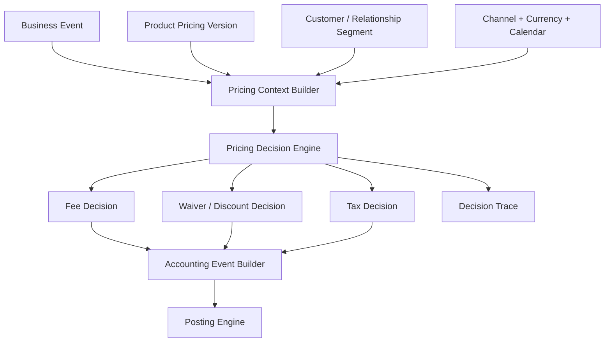
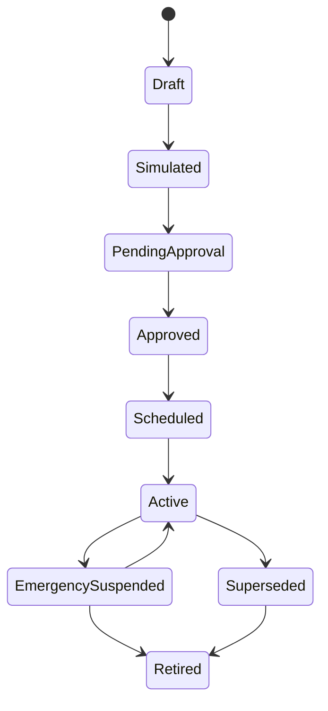
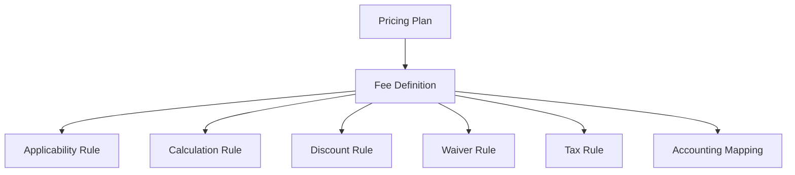
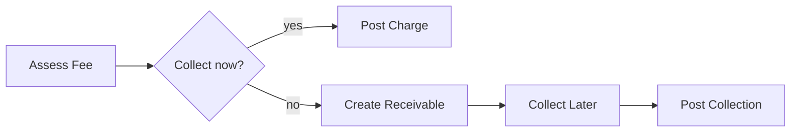
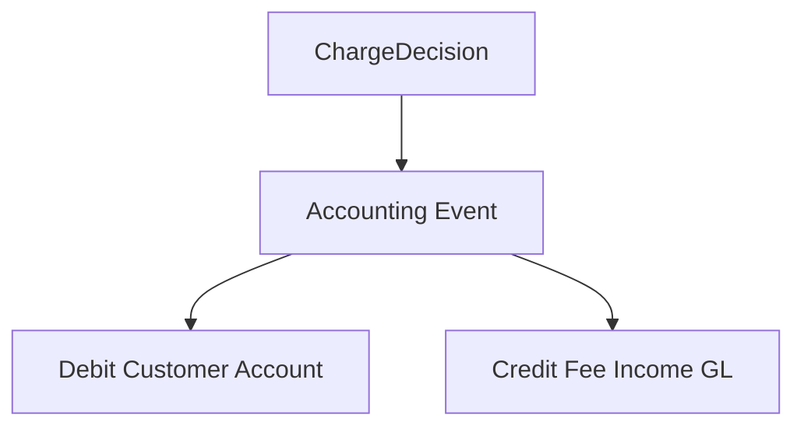
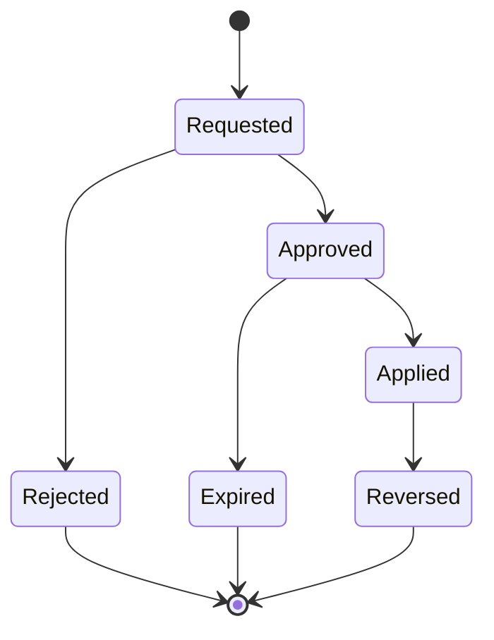
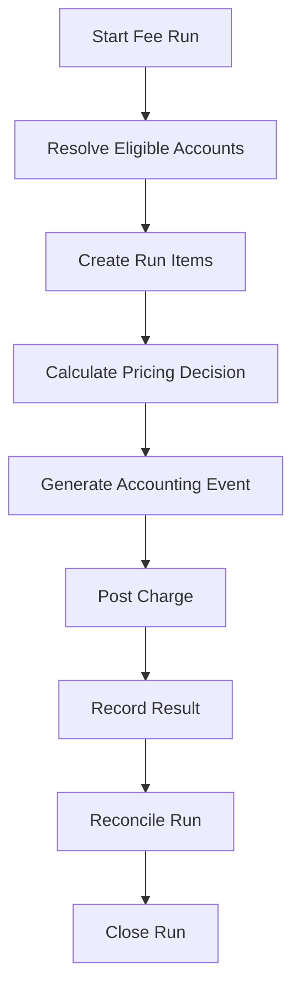
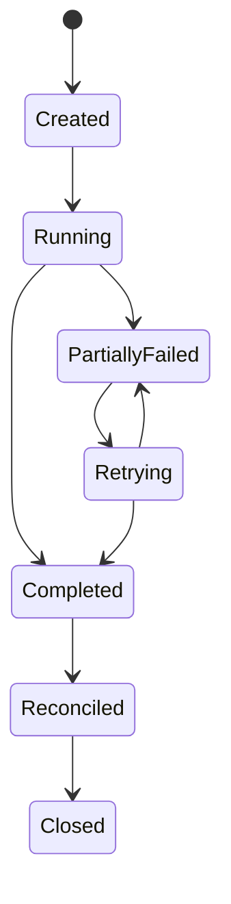
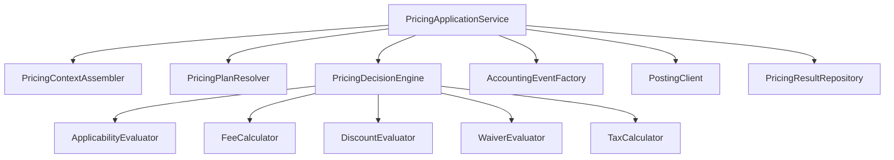
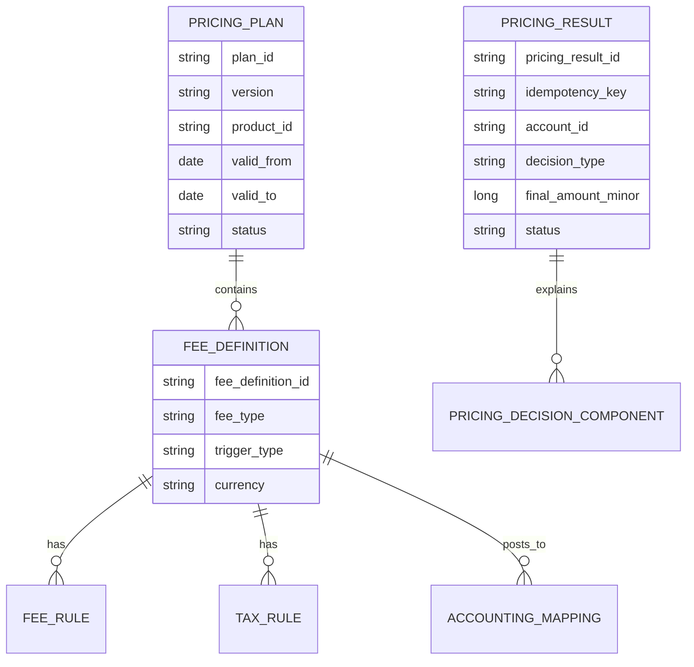

# Part 015 — Fee, Charge, Tax, Waiver, and Pricing Engine

A weak banking system treats fees as small side-effects:

```txt
if transfer_amount > 0 then charge fee = 2500
```

A serious core banking system treats pricing as a controlled financial decision:

- Which product version created the fee?
- Which customer segment or relationship tier applied?
- Which channel, currency, amount band, calendar, and transaction type were used?
- Was the fee assessed, accrued, charged, waived, reversed, refunded, or taxed?
- Which ledger accounts were impacted?
- Is the result reproducible after the pricing table changes?
- Can operations explain why a customer was charged?
- Can audit prove that an employee did not manually bypass pricing rules without approval?

This part builds the mental model and Java architecture for a pricing engine that is configurable, explainable, testable, and ledger-safe.

---

## 1. Kaufman Frame: The Sub-Skill

The sub-skill is not "how to calculate fee".

The sub-skill is:

> Given a product, account, customer context, transaction event, business date, and pricing configuration, design a pricing engine that decides charges, taxes, waivers, refunds, and accounting events without losing auditability or ledger correctness.

Deconstruct it into:

1. Fee/charge/tax/waiver taxonomy.
2. Pricing input model.
3. Product and campaign versioning.
4. Eligibility and exemption rules.
5. Calculation policy.
6. Ledger event mapping.
7. Idempotent charging.
8. Waiver and refund governance.
9. Simulation and customer explanation.
10. Reconciliation and testing.

The learning goal is not to memorize fee types. It is to build a repeatable decision machine for financial charges.

---

## 2. Mental Model: Pricing Is a Decision + Posting Problem

Pricing has two separate responsibilities:

1. **Decision**: should we charge, waive, discount, refund, tax, or defer?
2. **Posting**: how does the decision affect customer balance and bank income/liability/tax accounts?

Do not combine these into one method.



A top-tier design makes the decision reproducible and the posting balanced.

---

## 3. Vocabulary: Fee, Charge, Tax, Waiver, Discount, Refund

Use precise language. Ambiguous terms create accounting bugs.

| Term | Meaning | Typical effect |
|---|---|---|
| Fee | Amount assessed by bank for a service/event/period | Bank income, customer debit |
| Charge | Broader term for amount imposed; can include fee, penalty, tax component | Depends on component |
| Tax | Amount collected/remitted according to jurisdictional rule | Customer debit, tax payable liability |
| Waiver | Decision not to collect a charge that would otherwise apply | No customer debit or separate waived-fee evidence |
| Discount | Reduction from list price before final charge | Lower fee amount |
| Refund | Return of a previously charged amount | Reverse income/customer credit or expense |
| Reversal | Accounting correction that cancels original posting | Opposite journal lines |
| Adjustment | Delta correction that changes net result | Additional journal lines |

Important distinction:

> A waived fee and a refunded fee are not the same event.

A waived fee may never hit customer balance. A refunded fee compensates a prior posting and needs linkage to the original fee.

---

## 4. Pricing Invariants

A pricing engine must preserve these invariants:

### 4.1 Deterministic Decision

Given the same immutable inputs and same configuration version, the pricing result must be identical.

```txt
pricing(input_hash, config_version) -> same decision
```

### 4.2 Explicit Configuration Version

Every fee result must record the configuration version used.

Bad:

```txt
fee_type = TRANSFER_FEE
amount = 2500
```

Better:

```txt
fee_type = TRANSFER_FEE
amount = 2500
pricing_plan_version = RETAIL_TRANSFER_V17
effective_date = 2026-06-01
rule_path = STANDARD_DOMESTIC_TRANSFER > DIGITAL_CHANNEL > BELOW_10M
```

### 4.3 No Silent Manual Override

A manual waiver or exception requires actor, authority, reason, approval, and evidence.

### 4.4 Posting Must Balance

A fee is not complete until it creates balanced accounting instructions.

Example fee debit:

| Line | Account | Debit | Credit |
|---|---:|---:|---:|
| 1 | Customer CASA account | 2,500 | 0 |
| 2 | Fee income GL | 0 | 2,500 |

Tax collection example:

| Line | Account | Debit | Credit |
|---|---:|---:|---:|
| 1 | Customer CASA account | 2,750 | 0 |
| 2 | Fee income GL | 0 | 2,500 |
| 3 | Tax payable GL | 0 | 250 |

### 4.5 Explainability

A customer complaint should be answerable without reading source code.

The system must explain:

- triggering event;
- pricing rule;
- product version;
- customer segment;
- eligibility result;
- amount band;
- tax treatment;
- waiver/discount decision;
- final posting reference.

### 4.6 Idempotent Charging

A retried payment must not create duplicate fee income.

Fee idempotency is usually derived from:

```txt
fee_key = business_event_id + fee_type + pricing_scope + charge_period
```

Never derive it from request timestamp alone.

---

## 5. Fee Taxonomy in Core Banking

### 5.1 Event-Based Fees

Charged because something happened.

Examples:

- transfer fee;
- cash withdrawal fee;
- teller-assisted transaction fee;
- statement print fee;
- cheque book issuance fee;
- card replacement fee;
- loan disbursement fee;
- early repayment fee.

### 5.2 Periodic Fees

Charged on schedule.

Examples:

- monthly account maintenance fee;
- annual account fee;
- safe-deposit fee;
- subscription package fee;
- dormant account fee.

### 5.3 Threshold/Band Fees

Triggered by balance, usage, count, or amount bands.

Examples:

- free first 5 transfers, then charge;
- fee waived when average monthly balance exceeds threshold;
- percentage charge for amount above a band;
- tiered FX service fee.

### 5.4 Penalty Charges

Triggered by breach or exception.

Examples:

- late payment charge;
- insufficient funds charge;
- overdraft utilization charge;
- premature term deposit withdrawal penalty.

Penalty charges require stronger governance because they create customer-impact risk and dispute risk.

### 5.5 Pass-Through Charges

Collected from customer to cover external cost.

Examples:

- clearing network charge;
- correspondent bank charge;
- tax stamp;
- external payment rail fee.

Pass-through charges need explicit source and reconciliation.

---

## 6. Pricing Context Model

A good pricing engine consumes a normalized context, not random service arguments.

```java
public record PricingContext(
    String businessEventId,
    String accountId,
    String customerId,
    String productId,
    String productVersion,
    String channel,
    String transactionType,
    String currency,
    BigDecimal amount,
    LocalDate businessDate,
    LocalDateTime requestTime,
    Map<String, String> attributes
) {}
```

Do not pass entire ORM entities into the pricing engine. Pricing should operate on a stable fact snapshot.

Better:

```java
public record PricingFactSnapshot(
    AccountPricingFacts account,
    CustomerPricingFacts customer,
    ProductPricingFacts product,
    TransactionPricingFacts transaction,
    CalendarPricingFacts calendar
) {}
```

Why snapshot?

Because customer segment, account status, and product version may change later. Historical pricing must remain explainable.

---

## 7. Pricing Decision Model

A pricing decision should be explicit.

```java
public sealed interface PricingDecision
    permits ChargeDecision, WaiveDecision, NoChargeDecision, RejectPricingDecision {}

public record ChargeDecision(
    String decisionId,
    String feeType,
    Money feeAmount,
    List<TaxComponent> taxes,
    List<DiscountComponent> discounts,
    String pricingConfigVersion,
    String rulePath,
    List<DecisionReason> reasons
) implements PricingDecision {}

public record WaiveDecision(
    String decisionId,
    String feeType,
    Money originalAmount,
    String waiverPolicy,
    String reasonCode,
    String pricingConfigVersion,
    List<DecisionReason> reasons
) implements PricingDecision {}
```

A decision is not just `amount`.

It contains the evidence needed to explain and later post or reverse the charge.

---

## 8. Decision Trace

Decision trace is the difference between an explainable financial system and a black box.

Example trace:

```json
{
  "feeType": "DOMESTIC_TRANSFER_FEE",
  "businessEventId": "PAY-20260628-00091",
  "pricingConfigVersion": "RETAIL-CASA-FEE-V12",
  "rulePath": [
    "product=RETAIL_SAVINGS",
    "channel=MOBILE",
    "transferType=DOMESTIC",
    "amountBand=0..10000000",
    "relationshipTier=STANDARD"
  ],
  "baseFee": "2500.00 IDR",
  "discounts": [],
  "taxes": [
    {"type": "VAT", "amount": "275.00 IDR"}
  ],
  "finalCharge": "2775.00 IDR"
}
```

Store this as structured data, not a human-only text string.

---

## 9. Configuration Governance

Pricing configuration is production code in disguise.

It affects customer money, bank income, tax liability, complaints, and regulatory evidence.

### 9.1 Required Governance States



### 9.2 Required Metadata

Every pricing configuration needs:

- unique version ID;
- product scope;
- channel scope;
- currency scope;
- effective start date;
- effective end date;
- maker;
- checker;
- approval reference;
- simulation result;
- deployment timestamp;
- rollback/suspension plan.

### 9.3 Effective Dating

Never use only `is_active = true`.

Use effective windows:

```sql
pricing_plan_id
version
valid_from_business_date
valid_to_business_date
status
approved_by
approved_at
```

The engine should resolve pricing by business date, not by current server time.

---

## 10. Pricing Rule Structure

A simple but robust rule structure:



Separate applicability from calculation.

Bad:

```java
if (account.isDormant() && balance.compareTo(minimum) < 0) {
    return new Money("IDR", new BigDecimal("10000"));
}
```

Better:

```txt
Applicability:
  product = RETAIL_SAVINGS
  account_state = DORMANT
  average_monthly_balance < 100000
Calculation:
  flat_fee = 10000 IDR
Tax:
  none
Accounting:
  debit customer account, credit dormant fee income
```

---

## 11. Calculation Patterns

### 11.1 Flat Fee

```txt
fee = fixed amount
```

Example: IDR 2,500 per domestic transfer.

### 11.2 Percentage Fee

```txt
fee = amount × rate
```

Requires:

- precision policy;
- minimum fee;
- maximum cap;
- rounding mode;
- currency minor-unit handling.

### 11.3 Tiered Fee

```txt
0 - 1,000,000      => 1,000
1,000,001 - 10M   => 2,500
> 10M              => 5,000
```

### 11.4 Progressive Band Fee

Similar to progressive tax:

```txt
first 10M      => 0.1%
next 90M       => 0.05%
above 100M     => 0.02%
```

Make sure the product owner understands whether the rule is tiered or progressive. They are not the same.

### 11.5 Count-Based Fee

Example:

```txt
first 5 withdrawals per month are free
6th and later withdrawals are charged
```

Requires a usage counter with period identity:

```txt
usage_key = account_id + fee_type + period_start + period_end
```

### 11.6 Balance-Based Fee

Example:

```txt
monthly maintenance fee waived if average monthly balance >= threshold
```

Requires a defensible balance basis:

- ledger balance;
- available balance;
- daily closing balance;
- average daily balance;
- minimum balance.

Do not let the implementation choose accidentally.

---

## 12. Fee Assessment vs Fee Collection

Fee assessment and collection may be separate.



Examples:

- Account maintenance fee may be assessed monthly and collected immediately.
- Loan late charge may be assessed as receivable and collected during repayment allocation.
- Failed external payment fee may be assessed only after final failure, not while the payment is pending.

A mature system distinguishes:

| Event | Meaning |
|---|---|
| `FeeAssessed` | Bank determined customer owes a fee |
| `FeeCharged` | Customer account was debited |
| `FeeReceivableCreated` | Receivable was recognized |
| `FeeCollected` | Receivable was paid |
| `FeeWaived` | Fee obligation removed before/after collection depending on policy |
| `FeeRefunded` | Previously collected amount returned |

---

## 13. Accounting Mapping

A pricing decision must map to accounting events.

### 13.1 Immediate Fee Charge



### 13.2 Fee With Tax

```txt
Debit  Customer Account      total charge
Credit Fee Income GL          fee net amount
Credit Tax Payable GL         tax amount
```

### 13.3 Waived Fee

Possible accounting treatments vary by policy.

Common options:

1. No accounting entry, only waiver evidence.
2. Memo entry for waived revenue analytics.
3. Recognize fee then reverse/contra-income.

Do not hard-code this decision. Make it policy-driven.

### 13.4 Refund

Refund should link to original fee.

```txt
Debit  Fee Income / Refund Expense / Contra Income
Credit Customer Account
```

Which GL account is used depends on accounting policy.

---

## 14. Tax Handling

Tax handling is jurisdiction-specific. A core banking platform should not embed assumptions like "all fees have 10% tax".

A generic tax component model:

```java
public record TaxComponent(
    String taxType,
    Money taxableBase,
    BigDecimal rate,
    Money taxAmount,
    String taxRuleVersion,
    String payableGlAccount
) {}
```

Design points:

- tax rule version must be recorded;
- taxable base must be explicit;
- rounding policy must be explicit;
- tax payable GL must be mapped;
- tax exemption must be explainable;
- tax correction must preserve original tax evidence.

Do not mix tax calculation directly into fee calculation if the bank operates across jurisdictions.

---

## 15. Waiver and Discount Governance

Waiver is business-sensitive. It can be legitimate customer care or hidden control failure.

### 15.1 Automatic Waiver

Examples:

- premium customer tier;
- campaign period;
- employee banking package;
- minimum balance met;
- first N transactions free.

### 15.2 Manual Waiver

Manual waiver requires:

- reason code;
- actor;
- approval matrix;
- monetary limit;
- expiry;
- evidence attachment/reference;
- non-self-approval rule;
- audit trail.

### 15.3 Waiver State Machine



### 15.4 Waiver Anti-Abuse Controls

Track:

- waiver amount by employee;
- waiver amount by branch;
- waiver frequency by customer;
- override reason distribution;
- waivers near approval limit;
- repeated refund/waiver after complaint.

A good system makes abuse visible without assuming every waiver is abuse.

---

## 16. Refund, Reversal, and Adjustment

Pricing corrections must follow the ledger correction model from Part 009.

### 16.1 Reversal

Use when original charge should not exist.

```txt
Original: Debit Customer, Credit Fee Income
Reverse:  Debit Fee Income, Credit Customer
```

### 16.2 Refund

Use when original charge was valid at the time, but bank returns money for customer-service/business reason.

```txt
Refund may use refund expense or contra-income depending on policy.
```

### 16.3 Adjustment

Use when original fee amount was wrong.

Example:

```txt
Original charged: 5,000
Correct amount:   2,500
Adjustment:       credit customer 2,500
```

### 16.4 Correction Evidence

Every correction should record:

- original fee ID;
- original posting ID;
- correction type;
- correction reason;
- calculation difference;
- approval reference;
- resulting posting ID.

---

## 17. Idempotency Model

Fee idempotency has two levels.

### 17.1 Business Event Idempotency

For event-based fees:

```txt
idempotency_scope = business_event_id + fee_type
```

Example:

```txt
PAYMENT-123 + DOMESTIC_TRANSFER_FEE
```

### 17.2 Periodic Fee Idempotency

For monthly/annual fees:

```txt
idempotency_scope = account_id + fee_type + fee_period
```

Example:

```txt
ACC-777 + MONTHLY_MAINTENANCE_FEE + 2026-06
```

### 17.3 Pricing Result Idempotency Table

```sql
create table pricing_result (
    pricing_result_id      varchar(64) primary key,
    idempotency_key        varchar(256) not null unique,
    account_id             varchar(64) not null,
    business_event_id      varchar(64),
    fee_type               varchar(64) not null,
    pricing_config_version varchar(64) not null,
    business_date          date not null,
    decision_type          varchar(32) not null,
    final_amount_minor     bigint not null,
    currency               char(3) not null,
    decision_trace_json    text not null,
    posting_batch_id       varchar(64),
    status                 varchar(32) not null,
    created_at             timestamp not null
);
```

The posting engine must also have its own idempotency. Pricing idempotency prevents duplicate decision; posting idempotency prevents duplicate ledger effect.

---

## 18. Recurring Fee EOD/BOD Processing

Recurring fee charging is a batch-control problem.



### 18.1 Run-Level Metadata

```txt
fee_run_id
business_date
fee_period
product_scope
started_by
started_at
status
input_count
success_count
failure_count
total_fee_amount
total_tax_amount
posting_batch_refs
```

### 18.2 Restartability

A failed run must resume safely.

Required states:



Never rerun a fee batch by deleting rows and starting over.

---

## 19. Insufficient Funds and Fee Collection

Charging fees may fail due to insufficient available balance.

Common policies:

1. Reject the original transaction if fee cannot be collected.
2. Allow transaction and create fee receivable.
3. Collect partial fee.
4. Use overdraft facility.
5. Waive fee based on hardship/relationship rule.
6. Retry fee collection later.

Represent policy explicitly:

```java
public enum InsufficientFundsFeePolicy {
    REJECT_ORIGINAL_TRANSACTION,
    CREATE_RECEIVABLE,
    PARTIAL_COLLECTION,
    USE_OVERDRAFT_IF_AVAILABLE,
    WAIVE,
    RETRY_LATER
}
```

Do not let this be hidden in posting exception handling.

---

## 20. Customer Explanation Model

Pricing explanation should be customer-safe but audit-rich.

Customer-facing explanation:

```txt
Domestic transfer fee: IDR 2,500
Tax: IDR 275
Total: IDR 2,775
Reason: Mobile domestic transfer below IDR 10,000,000 on Retail Savings product.
```

Internal explanation:

```txt
pricing_config_version=RETAIL-CASA-FEE-V12
rule_path=TRANSFER > DOMESTIC > MOBILE > STANDARD_TIER > BAND_0_10M
business_event_id=PAY-20260628-00091
waiver_result=not_eligible: relationship_tier=STANDARD
posting_batch_id=PB-991
```

Do not expose internal rule IDs or suspicious markers unnecessarily to customers.

---

## 21. Java Architecture

A clean design splits pure calculation, policy decision, and posting integration.



### 21.1 Application Service

```java
public final class PricingApplicationService {
    private final PricingContextAssembler contextAssembler;
    private final PricingPlanResolver planResolver;
    private final PricingDecisionEngine decisionEngine;
    private final AccountingEventFactory accountingEventFactory;
    private final PostingClient postingClient;
    private final PricingResultRepository resultRepository;

    public PricingResult chargeFor(BusinessEvent event) {
        PricingContext context = contextAssembler.assemble(event);
        PricingPlan plan = planResolver.resolve(context);

        String key = PricingIdempotency.keyFor(event, plan);
        return resultRepository.findByIdempotencyKey(key)
            .orElseGet(() -> calculateAndPost(key, context, plan));
    }

    private PricingResult calculateAndPost(String key, PricingContext context, PricingPlan plan) {
        PricingDecision decision = decisionEngine.decide(context, plan);
        AccountingEvent accountingEvent = accountingEventFactory.from(decision, context);
        PostingResult posting = postingClient.post(accountingEvent);
        return resultRepository.save(PricingResult.from(key, decision, posting));
    }
}
```

This is simplified. In production, the save/post boundary must use a clear transaction/outbox/recovery design.

### 21.2 Pure Calculator

```java
public interface FeeCalculator {
    FeeCalculation calculate(FeeCalculationInput input, CalculationRule rule);
}
```

A calculator should not call repositories, post ledger entries, or read customer records.

### 21.3 Rule Engine Caution

A rule engine may be useful, but avoid outsourcing domain understanding to tooling.

A rule engine does not solve:

- versioning;
- approval;
- idempotency;
- ledger mapping;
- explainability;
- reconciliation;
- correction semantics.

---

## 22. Pricing Storage Model

A pragmatic relational model:



Do not store only final amount. Store enough structure to reproduce and audit the decision.

---

## 23. API Contract

Example API for fee simulation:

```http
POST /internal/pricing/simulations
```

```json
{
  "accountId": "ACC-1001",
  "transactionType": "DOMESTIC_TRANSFER",
  "channel": "MOBILE",
  "amount": {"currency": "IDR", "value": "1000000.00"},
  "businessDate": "2026-06-28"
}
```

Response:

```json
{
  "pricingConfigVersion": "RETAIL-CASA-FEE-V12",
  "decisions": [
    {
      "feeType": "DOMESTIC_TRANSFER_FEE",
      "decision": "CHARGE",
      "feeAmount": {"currency": "IDR", "value": "2500.00"},
      "taxes": [{"type": "VAT", "amount": {"currency": "IDR", "value": "275.00"}}],
      "total": {"currency": "IDR", "value": "2775.00"},
      "rulePath": "TRANSFER/DOMESTIC/MOBILE/STANDARD/BAND_0_10M"
    }
  ]
}
```

Simulation must not post ledger entries.

---

## 24. Integration With Transaction Flow

Fee can be integrated in different ways.

### 24.1 Inline Fee

Original transaction and fee are posted atomically.

Example:

```txt
Transfer amount + fee debit in same posting batch
```

Pros:

- strong consistency;
- simple customer balance explanation;
- no orphan fee.

Cons:

- pricing latency affects transaction latency;
- more complex failure handling.

### 24.2 Deferred Fee

Original transaction posts first, fee later.

Pros:

- lower transaction latency;
- useful for periodic aggregation.

Cons:

- fee may fail later;
- customer may see delayed charge;
- more reconciliation burden.

### 24.3 Hybrid

Simulate/authorize fee inline, collect later.

Useful when external settlement fee is unknown until clearing response.

---

## 25. Reconciliation

Pricing reconciliation compares decision, posting, and ledger.

Required checks:

| Check | Question |
|---|---|
| Decision-to-posting | Did every charge decision create expected posting? |
| Posting-to-ledger | Did posting hit correct accounts? |
| Tax total | Does tax payable equal sum of tax components? |
| Waiver report | Are waived amounts authorized? |
| Refund linkage | Does every refund link to original fee? |
| GL mapping | Are fee income GL totals by product/currency correct? |
| Batch run | Does run total match account-level postings? |

A fee engine without reconciliation is just a billing script.

---

## 26. Observability for Pricing

Do not log sensitive data unnecessarily. But do emit operational signals.

Metrics:

- pricing decisions by fee type;
- waiver count and amount;
- refund count and amount;
- pricing rule resolution failures;
- tax calculation failures;
- posting failures after pricing decision;
- duplicate idempotency hit count;
- EOD fee run duration and failure rate.

Traces:

```txt
transaction_request
  pricing_context_assembly
  pricing_plan_resolution
  pricing_decision
  accounting_event_generation
  posting
```

Logs should include correlation IDs and decision IDs, not full customer PII.

---

## 27. Testing Strategy

### 27.1 Golden Master Pricing Cases

Use a controlled matrix:

| Product | Channel | Amount | Segment | Expected fee |
|---|---|---:|---|---:|
| Retail Savings | Mobile | 1,000,000 | Standard | 2,500 |
| Retail Savings | Mobile | 1,000,000 | Premium | 0 |
| Current Account | Teller | 1,000,000 | Business | 5,000 |

### 27.2 Boundary Tests

Test exact band boundaries:

- amount = threshold - 1 minor unit;
- amount = threshold;
- amount = threshold + 1 minor unit.

### 27.3 Idempotency Tests

Same event must not create two fees.

```java
@Test
void retryingSamePaymentDoesNotChargeFeeTwice() {
    PricingResult first = service.chargeFor(paymentEvent("PAY-1"));
    PricingResult second = service.chargeFor(paymentEvent("PAY-1"));

    assertThat(second.pricingResultId()).isEqualTo(first.pricingResultId());
    assertThat(postingRepository.countByBusinessEvent("PAY-1", "TRANSFER_FEE")).isEqualTo(1);
}
```

### 27.4 Property Tests

Useful properties:

- total charge = fee + taxes - discounts;
- final charge is never negative unless explicitly refund;
- every `ChargeDecision` has accounting mapping;
- every manual waiver has approval evidence;
- every refund links to original fee;
- simulation creates no posting.

---

## 28. Failure Modes

### 28.1 Pricing Decision Succeeds, Posting Fails

Do not mark fee as charged.

Possible state:

```txt
PRICING_DECIDED_POSTING_FAILED
```

This requires repair or retry.

### 28.2 Posting Succeeds, Result Save Fails

This is dangerous. You need unknown-outcome recovery using posting idempotency and reconciliation.

### 28.3 Configuration Activated Wrongly

Need emergency suspension and rollback path. But historical decisions made under the wrong configuration still need correction events, not silent rewrite.

### 28.4 Tax Mapping Missing

Better to reject charge than post unbalanced or unclassified tax.

### 28.5 Rounding Drift

Batch totals may differ if rounding is applied inconsistently per line vs total. Define policy.

---

## 29. Anti-Patterns

### 29.1 Fee Logic Inside Payment Service

This spreads pricing across channels and makes product changes expensive.

### 29.2 `BigDecimal` Without Currency Policy

`BigDecimal` alone does not know minor units, rounding mode, or cash rounding rules.

### 29.3 Configurable Everything

Unbounded configuration becomes an untestable programming language.

Prefer typed parameters and approved rule patterns.

### 29.4 No Decision Trace

A final amount without explanation is not sufficient for banking operations.

### 29.5 Waiver as Boolean Flag

`waived = true` is not evidence. You need who, why, authority, policy, validity, and approval.

### 29.6 Fee Charged by Scheduler Without Idempotency

EOD retry should not double-charge customers.

### 29.7 Pricing Based on Current Customer State

Historical pricing must use the state effective at decision time.

---

## 30. Implementation Checklist

Before approving pricing engine design:

- Are fee, tax, waiver, refund, and reversal modeled separately?
- Is pricing configuration versioned and effective-dated?
- Is activation maker-checker controlled?
- Is every decision explainable by structured trace?
- Is fee idempotency separate from posting idempotency?
- Is tax jurisdiction/policy externalized from generic fee logic?
- Are accounting mappings versioned?
- Can simulation run without posting?
- Can recurring fee batch resume safely?
- Are waivers limited, approved, and monitored?
- Are refunds linked to original charges?
- Is reconciliation available by product, fee type, currency, and GL account?

---

## 31. Mini Project: Pricing Engine Slice

Build a Java module with:

1. Product pricing plan versioning.
2. Flat, percentage, tiered, and count-based fees.
3. Automatic waiver by customer tier.
4. Manual waiver request with approval metadata.
5. Tax component placeholder.
6. Fee simulation API.
7. Charge posting instruction generation.
8. Idempotency per event/fee type.
9. Monthly maintenance fee batch.
10. Reconciliation report.

Success criterion:

> Given a transaction or monthly fee run, the module can calculate, explain, post, reverse, waive, refund, and reconcile every pricing decision without mutating historical evidence.

---

## 32. Key Takeaways

- Pricing is a financial decision engine, not a collection of `if` statements.
- Fee assessment, fee collection, waiver, refund, reversal, and tax are different events.
- Every pricing result must record configuration version and decision trace.
- Manual waivers require governance and abuse visibility.
- Recurring fee batches must be idempotent and restartable.
- Accounting mapping is part of pricing design, not an afterthought.
- A top-tier Java design isolates calculation from decision policy, posting, persistence, and operational control.

---

## 33. References

- ISO 4217 — Currency codes and minor-unit metadata.
- PCI Security Standards Council — PCI DSS context for payment account data protection when pricing touches card/payment boundaries.
- BIAN Service Landscape — Product Directory and banking service-domain decomposition context.
- Basel Committee on Banking Supervision — Operational control and risk data lineage expectations.
- Prior series dependencies: Java SQL/JDBC, Java Persistence, Java Security/Hardening, Java Error/Reliability/Observability, Java Messaging/Event Streaming.
