# Part 016 — Payment Domain Model: Internal Transfer, External Transfer, and Status

A payment is not an API call.

A payment is a lifecycle of intent, validation, authorization, posting, clearing, settlement, notification, return, repair, and reconciliation.

A weak implementation says:

```java
fromAccount.debit(amount);
toAccount.credit(amount);
```

A production banking implementation asks:

- Is this internal or external?
- Is debit final now or only reserved?
- Is the beneficiary account inside the same core?
- Is there a clearing/settlement system involved?
- Does the rail support reject, return, recall, reversal, or cancellation?
- Which status is customer-facing vs operational vs ledger status?
- What happens if the external network times out?
- Can the same request be retried without duplicate debit?
- Can a return be matched to the original payment?
- Is the settlement account reconciled?

This part builds the payment mental model for core banking engineers.

---

## 1. Kaufman Frame: The Sub-Skill

The sub-skill is:

> Given a payment instruction, source account, destination, rail, business date, and ledger model, design a payment lifecycle that preserves money, status truth, idempotency, customer explanation, and settlement reconciliation.

Break it down into:

1. Payment vocabulary.
2. Internal transfer model.
3. External outgoing payment model.
4. External incoming payment model.
5. Payment state machines.
6. Ledger posting patterns.
7. Clearing and settlement concepts.
8. Reject, return, reversal, cancellation, recall.
9. Idempotency and duplicate detection.
10. Repair, reconciliation, and observability.

---

## 2. Core Mental Model

A payment has multiple layers:

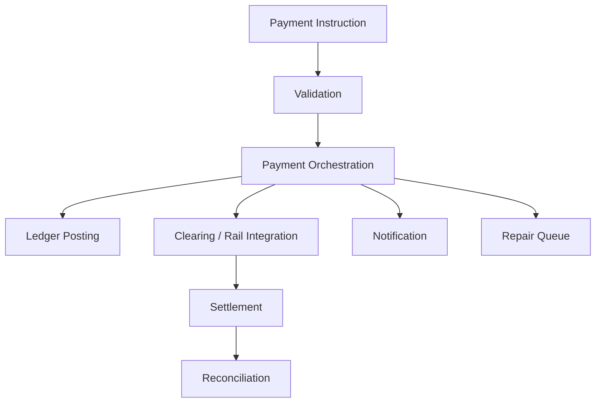

Do not collapse these layers into one status flag.

A payment can be:

- valid from request perspective;
- posted from ledger perspective;
- pending from rail perspective;
- unsettled from cash-position perspective;
- failed from beneficiary perspective;
- repairable from operations perspective.

---

## 3. Payment Types

### 3.1 Internal Transfer

Both debit and credit accounts are inside the same core ledger.

Example:

```txt
Customer A transfers IDR 1,000,000 to Customer B in same bank.
```

Usually can be posted atomically:

```txt
Debit  Customer A account
Credit Customer B account
```

### 3.2 Intra-Bank but Cross-System Transfer

Both parties may be in the same institution, but not necessarily same core instance.

Examples:

- different core platforms after merger;
- separate Islamic/conventional core;
- separate region/branch platform;
- loan repayment from deposit core to loan core.

This may require integration and reconciliation, not simple same-database posting.

### 3.3 External Outgoing Transfer

Source account is internal, beneficiary is outside.

Example:

```txt
Customer sends funds from Bank A to Bank B.
```

Requires clearing/rail integration and settlement accounting.

### 3.4 External Incoming Transfer

Funds arrive from outside and credit internal beneficiary.

Example:

```txt
Bank B receives incoming credit for its customer.
```

Requires message validation, beneficiary resolution, credit posting, and possible return/reject handling.

### 3.5 Book Transfer vs Payment Rail Transfer

A book transfer is a ledger movement within the bank's books.

A payment rail transfer involves external infrastructure, messaging, rules, cutoffs, settlement, and sometimes finality constraints.

---

## 4. Payment Instruction vs Payment Transaction

Separate instruction from transaction.

| Concept | Meaning |
|---|---|
| Payment instruction | Customer/branch/channel intent to move money |
| Payment order | Accepted operational object being processed |
| Ledger transaction | Accounting effect in the core ledger |
| Clearing message | External network message |
| Settlement | Final movement/obligation between financial institutions |
| Statement entry | Customer-visible representation |

A single payment instruction may create multiple ledger transactions.

Example outgoing external payment:

1. Debit customer.
2. Credit outgoing clearing/suspense account.
3. On settlement, move from clearing/suspense to settlement account.
4. On return, reverse/credit customer.

---

## 5. Payment Aggregate

A pragmatic payment aggregate:

```java
public final class PaymentOrder {
    private final String paymentOrderId;
    private final String idempotencyKey;
    private final PaymentType type;
    private final PaymentDirection direction;
    private final Money amount;
    private final PartyRef debtor;
    private final PartyRef creditor;
    private final AccountRef debtorAccount;
    private final AccountRef creditorAccount;
    private PaymentLifecycleStatus lifecycleStatus;
    private LedgerStatus ledgerStatus;
    private RailStatus railStatus;
    private SettlementStatus settlementStatus;
    private final LocalDate businessDate;
    private final List<PaymentEvent> events;
}
```

Avoid a single `status` enum that tries to encode everything.

Use status dimensions.

---

## 6. Status Dimensions

### 6.1 Lifecycle Status

Represents business processing.

```txt
RECEIVED
VALIDATED
ACCEPTED
PROCESSING
COMPLETED
REJECTED
FAILED
CANCELLED
RETURNED
REPAIR_REQUIRED
```

### 6.2 Ledger Status

Represents accounting effect.

```txt
NOT_POSTED
RESERVED
POSTED
REVERSED
PARTIALLY_REVERSED
UNKNOWN
```

### 6.3 Rail Status

Represents external network status.

```txt
NOT_APPLICABLE
MESSAGE_CREATED
SENT
ACKNOWLEDGED
REJECTED_BY_RAIL
ACCEPTED_BY_RAIL
TIMEOUT
RETURN_RECEIVED
```

### 6.4 Settlement Status

Represents interbank settlement.

```txt
NOT_APPLICABLE
PENDING_SETTLEMENT
SETTLED
FAILED_SETTLEMENT
RECONCILED
```

This dimensional model prevents impossible states like:

```txt
status = SUCCESS
```

while settlement is still pending or return is still possible.

---

## 7. Internal Transfer State Machine

Internal transfer is the simplest case, but still requires correctness.

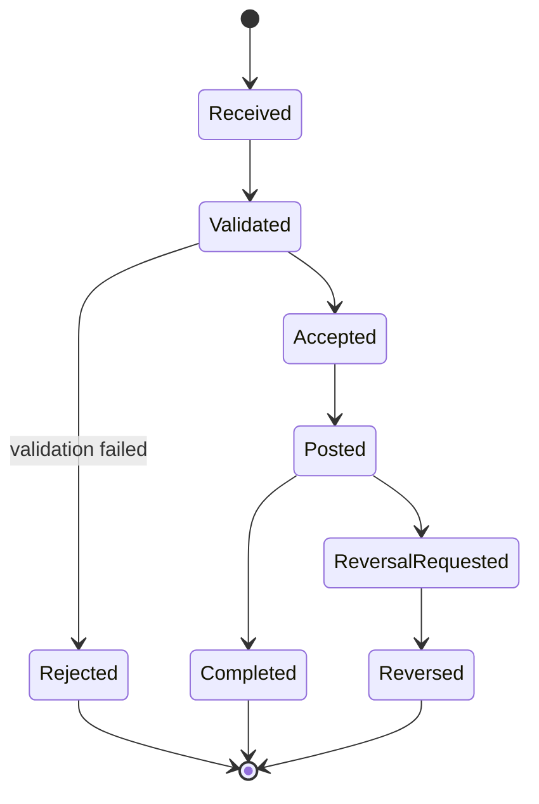

### 7.1 Internal Transfer Posting

```txt
Debit  source customer account
Credit destination customer account
```

If fees are inline:

```txt
Debit  source customer account      transfer amount + fee + tax
Credit destination customer account transfer amount
Credit fee income GL                fee
Credit tax payable GL               tax
```

### 7.2 Atomicity

For same-core internal transfer, debit and credit should be in one balanced posting batch.

Never do:

```java
source.debit(amount);
// crash here
destination.credit(amount);
```

Use the posting engine from Part 008.

---

## 8. External Outgoing Payment Lifecycle

Outgoing payment involves customer ledger and external rail.

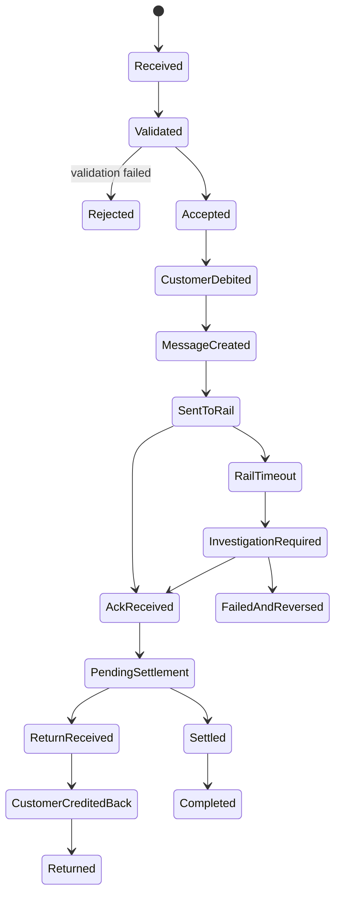

### 8.1 Common Ledger Pattern

At acceptance/debit:

```txt
Debit  Customer Account
Credit Outgoing Payment Clearing Account
```

At settlement:

```txt
Debit  Outgoing Payment Clearing Account
Credit Nostro/Settlement Account
```

If the payment is returned:

```txt
Debit  Outgoing Payment Clearing Account / Return Clearing
Credit Customer Account
```

Exact account names depend on chart-of-accounts design.

---

## 9. External Incoming Payment Lifecycle

Incoming payment begins outside the customer channel.

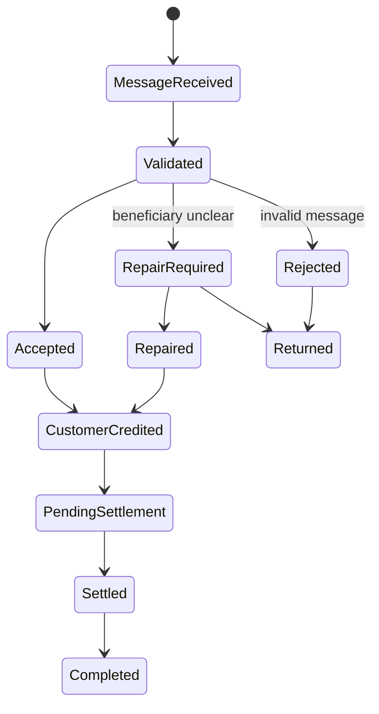

### 9.1 Incoming Credit Posting

Depending on settlement model:

```txt
Debit  Incoming Clearing/Settlement Account
Credit Customer Account
```

If settlement occurs before customer credit, the clearing account must be reconciled.

### 9.2 Beneficiary Resolution

Incoming payment may fail because:

- account number invalid;
- account closed;
- account restricted;
- name mismatch policy;
- currency unsupported;
- compliance hold;
- duplicate message;
- amount invalid.

Do not credit by best guess.

Use repair queue or return flow.

---

## 10. Validation Layers

Payment validation should be layered.

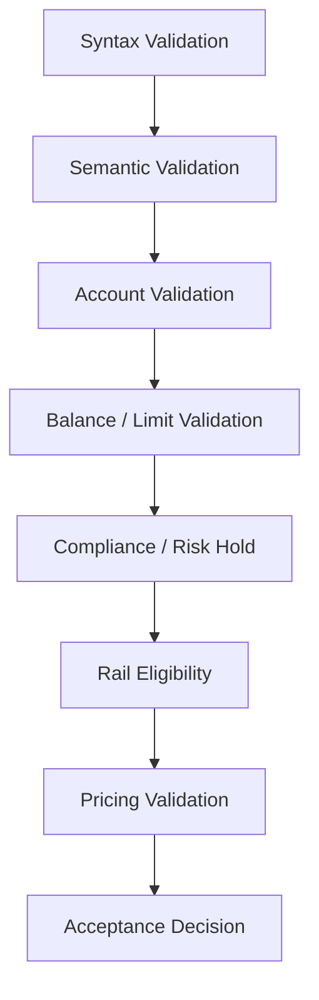

Examples:

| Layer | Example |
|---|---|
| Syntax | amount must be positive |
| Semantic | source and destination cannot be same for certain payment type |
| Account | debtor account must be active/debit-enabled |
| Balance | sufficient available balance including fee |
| Limit | channel daily limit not exceeded |
| Compliance | sanctions/fraud hold result |
| Rail | cutoff not missed, currency supported |
| Pricing | fee can be calculated and collected/receivable policy exists |

Validation result must be structured, not a generic exception string.

---

## 11. Idempotency and Duplicate Detection

Payment duplicate risk is severe.

### 11.1 Request Idempotency

Channel retry should not create duplicate payment.

```txt
idempotency_key = channel_id + client_request_id + debtor_account + amount + beneficiary + business_date
```

Use a request hash to detect key reuse with different payload.

### 11.2 Business Duplicate Detection

Even if idempotency key differs, the payment may be a duplicate.

Signals:

- same debtor;
- same creditor;
- same amount;
- same reference;
- same channel;
- close timestamp;
- same external end-to-end ID.

Duplicate detection may create warning, hold, or reject depending on policy.

### 11.3 External Message Duplicate

External rails often have message identifiers. Store them.

```txt
rail_message_id
end_to_end_id
instruction_id
transaction_id
clearing_system_reference
```

A duplicate incoming message should not credit customer twice.

---

## 12. ISO 20022 Boundary Mental Model

ISO 20022 gives structured financial message definitions. It is extremely useful for interoperability, but your core domain should not blindly become ISO XML objects.

A healthy architecture:

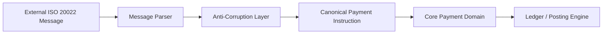

Do not spread `pacs.008` XML structures through your internal domain services.

### 12.1 Common Message Families

At a high level:

| Family | Typical role |
|---|---|
| `pain` | Customer-to-bank payment initiation context |
| `pacs` | Interbank payment clearing/settlement context |
| `camt` | Cash management, statement, notification, reporting context |

The exact message type depends on scheme and market infrastructure.

---

## 13. Settlement and Finality

Settlement is not the same as customer posting.

Customer may see:

```txt
Payment successful
```

while interbank settlement may still be pending depending on rail and scheme.

### 13.1 Settlement Models

Common models:

| Model | Meaning |
|---|---|
| Real-time gross settlement | Each payment settled individually in real time or near real time |
| Deferred net settlement | Payments netted and settled later |
| On-us book transfer | No external settlement; internal ledger movement |
| Correspondent settlement | Settlement through nostro/vostro/correspondent accounts |

### 13.2 Settlement Finality

Finality determines when a transfer is irrevocable under scheme/legal rules.

Your system must not assume all successful messages are final.

Store:

- settlement status;
- settlement date;
- settlement reference;
- finality indicator if provided by rail;
- scheme-specific return/recall window.

---

## 14. Reject, Return, Reversal, Cancellation, Recall

These are not synonyms.

| Term | Typical meaning |
|---|---|
| Reject | Payment not accepted before execution/settlement |
| Return | Payment accepted/processed but sent back later |
| Reversal | Accounting cancellation/correction of posted entry |
| Cancellation | Stop instruction before execution/finality |
| Recall | Request to return funds after execution; may require counterparty action |
| Refund | Customer/business compensation, not necessarily rail-level return |

Model each explicitly.

### 14.1 Return Linkage

A return must link to original payment.

```java
public record PaymentReturn(
    String returnId,
    String originalPaymentOrderId,
    String originalRailReference,
    Money returnedAmount,
    String reasonCode,
    LocalDate returnBusinessDate
) {}
```

Partial returns may exist depending on rail/product rules.

---

## 15. Payment Status Contract

Customer-facing status should be carefully mapped.

| Internal condition | Customer status |
|---|---|
| Validated but not posted | Processing |
| Posted and internal transfer completed | Successful |
| Posted outgoing but settlement pending | Processing or Sent, depending on product promise |
| Rail rejected before debit | Failed |
| Customer debited then returned | Returned/Refunded |
| Unknown rail outcome | Under investigation |
| Compliance hold | Under review |

Do not expose every internal status directly. But do not lie either.

---

## 16. Payment Ledger Patterns

### 16.1 Internal Transfer

```txt
Debit  Debtor Customer Account
Credit Creditor Customer Account
```

### 16.2 External Outgoing: Debit Then Clear

```txt
Debit  Debtor Customer Account
Credit Outgoing Clearing Account
```

Settlement:

```txt
Debit  Outgoing Clearing Account
Credit Settlement/Nostro Account
```

### 16.3 External Incoming: Clear Then Credit

```txt
Debit  Incoming Clearing/Settlement Account
Credit Beneficiary Customer Account
```

### 16.4 Fee Inline

```txt
Debit  Debtor Customer Account
Credit Payment Amount Destination/Clearing
Credit Fee Income
Credit Tax Payable
```

### 16.5 Suspense

Use suspense when the bank has value that cannot yet be applied to final account.

But suspense must have break management and aging. It is not a trash bin.

---

## 17. Holds and Reservations

Some payment flows reserve funds before final posting.

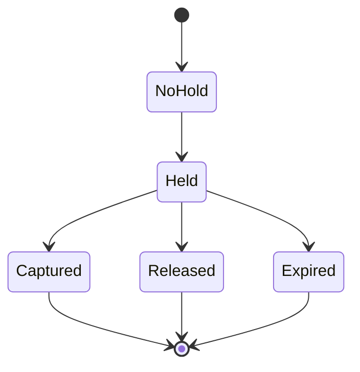

Use holds when:

- authorization happens before capture;
- compliance review is pending;
- rail submission delayed;
- cutoff window is future;
- batch payment awaits approval.

A hold reduces available balance but does not necessarily change ledger balance.

---

## 18. Cutoff, Calendar, and Business Date

External rails have operating windows.

Payment systems need:

- bank business date;
- rail business date;
- cutoff time;
- holiday calendar;
- timezone;
- value date;
- requested execution date;
- settlement date.

Do not use only `LocalDate.now()`.

```java
public record PaymentCalendarDecision(
    LocalDate bankBusinessDate,
    LocalDate requestedExecutionDate,
    LocalDate effectiveExecutionDate,
    LocalDate expectedSettlementDate,
    boolean afterCutoff,
    String calendarVersion
) {}
```

Calendar version matters for audit when holidays are corrected or special closures are declared.

---

## 19. Repair Queue

Payment repair is a first-class operational domain.

Repair reasons:

- beneficiary account invalid;
- name mismatch;
- missing remittance information;
- amount/currency mismatch;
- ambiguous duplicate;
- rail timeout;
- compliance pending;
- settlement mismatch;
- posting unknown outcome.

Repair item model:

```java
public record PaymentRepairItem(
    String repairItemId,
    String paymentOrderId,
    String reasonCode,
    String severity,
    String assignedQueue,
    LocalDateTime createdAt,
    String slaPolicy,
    List<String> allowedActions
) {}
```

Allowed actions must be constrained. Operators should not be able to arbitrarily mutate payment data.

---

## 20. Payment Orchestration Styles

### 20.1 Synchronous Internal Transfer

Good for simple same-core transfer.

```txt
validate -> post -> return success
```

### 20.2 Asynchronous External Payment

Better for rail interaction.

```txt
accept -> debit/reserve -> send message -> await ack/settlement -> complete/reject/return
```

### 20.3 Saga-Like Flow

Useful when multiple systems participate.

But avoid pretending saga is the same as atomic money movement. Ledger invariants must remain local and explicit.

---

## 21. Outbox and Inbox Patterns

For outgoing rail messages:

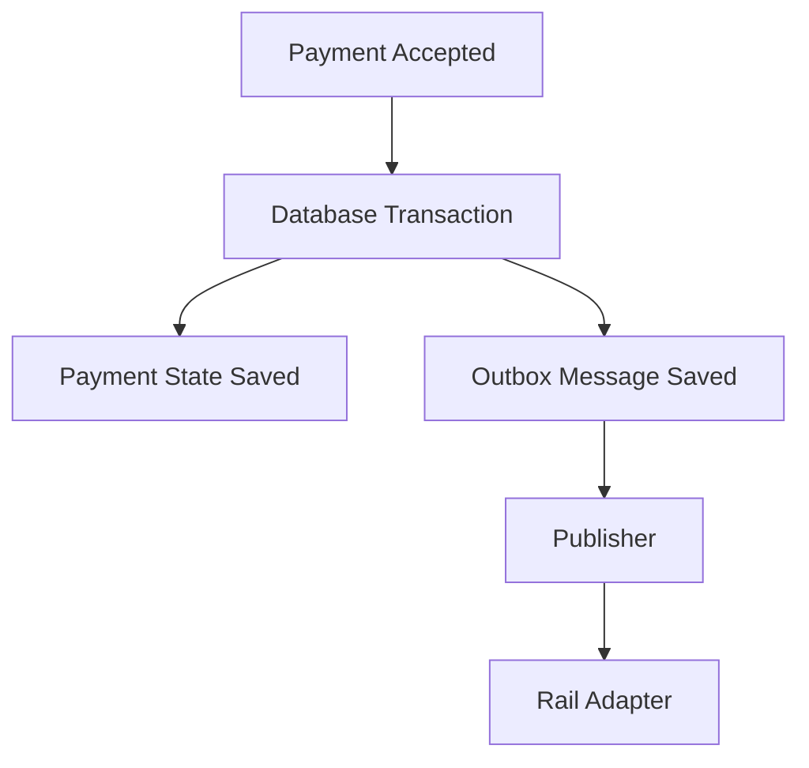

For incoming rail messages:

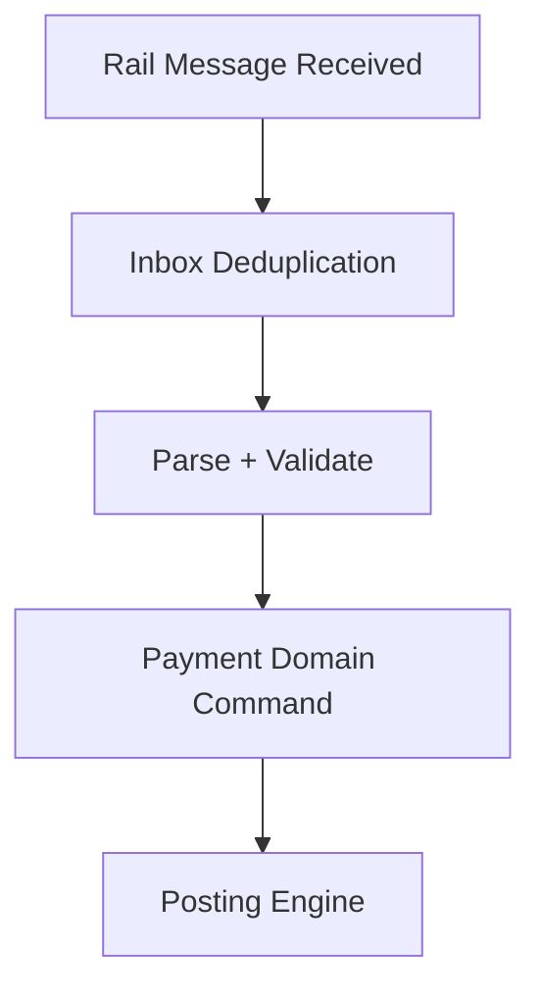

Outbox protects against "state changed but message not sent".

Inbox protects against duplicate external delivery.

---

## 22. Java Domain Types

Use strong types for payment semantics.

```java
public record PaymentOrderId(String value) {}
public record RailReference(String value) {}
public record EndToEndId(String value) {}
public record PaymentAmount(String currency, BigDecimal value) {}

public enum PaymentType {
    INTERNAL_TRANSFER,
    OUTGOING_EXTERNAL_TRANSFER,
    INCOMING_EXTERNAL_TRANSFER,
    LOAN_REPAYMENT,
    FEE_PAYMENT
}

public enum PaymentDirection {
    INCOMING,
    OUTGOING,
    INTERNAL
}
```

Use `Money` from previous parts with currency/minor-unit discipline.

---

## 23. Payment Application Service

Simplified structure:

```java
public final class PaymentApplicationService {
    private final PaymentRepository paymentRepository;
    private final PaymentValidator validator;
    private final PricingClient pricingClient;
    private final PostingClient postingClient;
    private final RailGateway railGateway;
    private final Outbox outbox;

    public PaymentAccepted accept(PaymentInstruction instruction) {
        String idempotencyKey = instruction.idempotencyKey();

        return paymentRepository.findAcceptedByIdempotencyKey(idempotencyKey)
            .map(PaymentAccepted::from)
            .orElseGet(() -> acceptNew(instruction));
    }

    private PaymentAccepted acceptNew(PaymentInstruction instruction) {
        ValidationResult validation = validator.validate(instruction);
        if (validation.isRejected()) {
            return PaymentAccepted.rejected(validation.reasons());
        }

        PaymentOrder order = PaymentOrder.accept(instruction, validation);
        PricingResult pricing = pricingClient.price(order);
        PostingResult posting = postingClient.post(order.toAccountingEvent(pricing));

        order.markCustomerDebited(posting.postingBatchId());
        paymentRepository.save(order);

        if (order.requiresRailSubmission()) {
            outbox.enqueue(RailSubmissionRequested.from(order));
        }

        return PaymentAccepted.from(order);
    }
}
```

In production, wrap state save + outbox atomically, and design unknown-outcome recovery for posting calls.

---

## 24. External Rail Adapter Boundary

Rail adapter should translate between internal model and rail-specific messages.

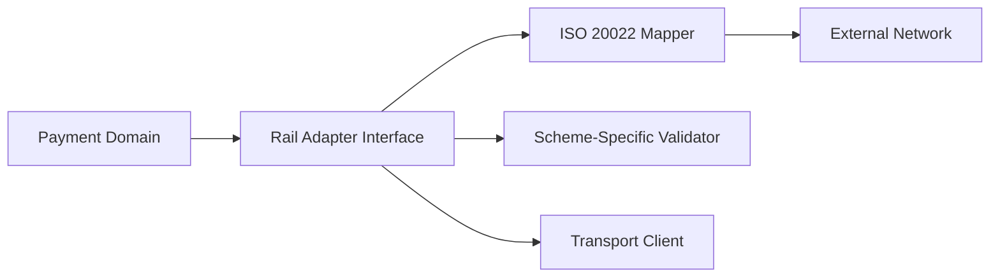

Do not let transport concerns leak into core payment domain.

Rail adapter responsibilities:

- message creation;
- scheme validation;
- signing/encryption if required by rail integration;
- transport retry;
- acknowledgement parsing;
- response normalization;
- message archive.

Core payment responsibilities:

- payment lifecycle;
- ledger effect;
- status truth;
- customer explanation;
- repair/reconciliation.

---

## 25. Unknown Outcome Handling

The worst payment status is not failed. It is unknown.

Examples:

- debit posted but HTTP response lost;
- message sent but ack lost;
- ack received but state save failed;
- settlement file partially processed;
- incoming message credited but response failed.

Unknown outcome requires investigation, not blind retry.

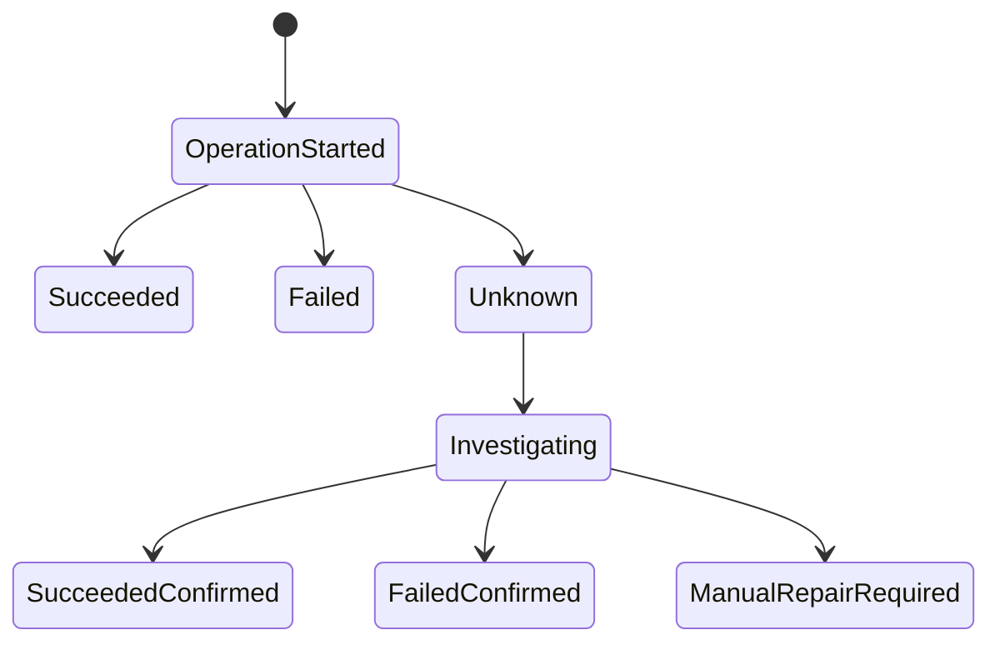

Recovery should use idempotent lookup:

- posting batch ID;
- rail reference;
- message ID;
- idempotency key;
- settlement reference.

---

## 26. Reconciliation

Payment reconciliation connects payment order, ledger, rail, and settlement.

### 26.1 Outgoing Reconciliation

Check:

- every sent payment has ledger debit;
- every ledger debit has payment order;
- every rail accepted payment appears in settlement report;
- clearing account net balance matches unsettled payments;
- returned payments are credited back;
- fees are posted once.

### 26.2 Incoming Reconciliation

Check:

- every incoming message is deduplicated;
- every accepted incoming credit posts to customer or suspense;
- suspense items are aged and assigned;
- every return references original incoming message;
- settlement report matches clearing entries.

### 26.3 Break Lifecycle

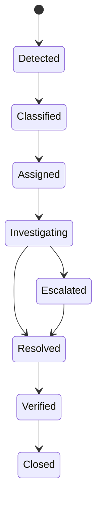

---

## 27. Observability

Payment observability must be business-aware.

Metrics:

- payment count by type/status/rail;
- validation rejection reason count;
- duplicate detection hits;
- rail timeout rate;
- average time in pending settlement;
- repair queue age;
- return rate;
- clearing account unreconciled balance;
- unknown outcome count;
- idempotency conflict count.

Trace shape:

```txt
payment_acceptance
  validation
  pricing
  posting
  outbox_enqueue
  rail_submission
  acknowledgement_processing
  settlement_update
```

High-cardinality fields like full account number should not be used as metric labels.

---

## 28. Testing Strategy

### 28.1 Internal Transfer Tests

- debit and credit are atomic;
- insufficient funds rejects without partial posting;
- duplicate request returns original result;
- reversal links to original transfer;
- statement entries are produced for both accounts.

### 28.2 External Outgoing Tests

- debit customer and credit clearing on acceptance;
- rail timeout creates investigation state, not duplicate debit;
- rail reject before settlement reverses appropriately;
- return credits customer once;
- settlement clears outgoing clearing account;
- duplicate ack does not complete twice.

### 28.3 Incoming Tests

- duplicate external message is ignored/idempotently acknowledged;
- invalid beneficiary routes to repair or return;
- account restriction prevents automatic credit;
- suspense item ages and reconciles;
- return links to original message.

### 28.4 Property Tests

Properties:

- every completed internal transfer has balanced journal;
- every outgoing payment customer debit has a matching clearing credit;
- every returned payment links to an original payment;
- no payment can be both `COMPLETED` and `REJECTED`;
- customer-facing success is not emitted before required ledger condition;
- duplicate incoming message never increases customer balance twice.

---

## 29. Anti-Patterns

### 29.1 One `status` Column for Everything

`SUCCESS`, `FAILED`, `PENDING` are insufficient for real payment operations.

Use dimensional status.

### 29.2 Direct Debit/Credit in Payment Service

Payment service should create accounting events and use posting engine.

### 29.3 Treating External Ack as Settlement

Acknowledgement does not always mean final settlement.

### 29.4 Ignoring Unknown Outcome

Blind retry after timeout can duplicate payment. Blind failure can hide successful external execution.

### 29.5 No Repair Queue

Manual database fixes will appear if the application has no operational repair model.

### 29.6 Mapping ISO Messages Directly to Domain Aggregates

External standards should be translated through an anti-corruption layer.

### 29.7 Suspense Without Aging

Suspense accounts must be actively managed and reconciled.

---

## 30. Implementation Checklist

Before approving a payment design:

- Are instruction, order, ledger transaction, rail message, and settlement separated?
- Is internal transfer atomic through posting engine?
- Are external payment states dimensioned?
- Is idempotency enforced for requests and external messages?
- Are duplicate detection and idempotency separated?
- Are reject, return, reversal, cancellation, recall, and refund modeled separately?
- Are clearing/suspense/settlement accounts explicit?
- Is ISO 20022 mapping isolated behind an anti-corruption layer?
- Is unknown outcome recovery designed?
- Does repair queue constrain operator actions?
- Can reconciliation prove ledger vs rail vs settlement consistency?
- Are customer-facing statuses honest but not overexposed?

---

## 31. Mini Project: Payment Engine Slice

Build a Java module supporting:

1. Internal transfer with atomic posting event.
2. Outgoing external payment with clearing account.
3. Incoming external payment with duplicate message handling.
4. Payment status dimensions.
5. Fee integration from Part 015.
6. Outbox for rail submission.
7. Inbox for incoming messages.
8. Return flow linked to original payment.
9. Repair queue for invalid beneficiary and unknown outcome.
10. Reconciliation report for clearing account.

Success criterion:

> Given retries, duplicate messages, rail timeouts, returns, and settlement reports, the module never loses money, never double-credits, never silently mutates history, and can explain every payment status from customer, ledger, rail, and settlement perspectives.

---

## 32. Key Takeaways

- Payment is a lifecycle, not an API call.
- Internal transfers and external transfers have fundamentally different risk models.
- Payment status should be dimensional: lifecycle, ledger, rail, settlement.
- Acknowledgement, posting, settlement, and finality are different concepts.
- Reject, return, reversal, cancellation, recall, and refund are not interchangeable.
- Idempotency prevents retry duplication; duplicate detection catches suspicious new requests.
- Repair and reconciliation are part of the core payment domain.
- A top-tier Java design isolates rail-specific messages from internal payment and ledger models.

---

## 33. References

- ISO 20022 — Message definitions and payment/cash-management message catalogue.
- BIS CPMI-IOSCO — Principles for Financial Market Infrastructures, including payment, clearing, settlement, and settlement-finality context.
- PCI Security Standards Council — PCI DSS context when payment flows touch payment account/card data boundaries.
- BIAN Service Landscape — Payments, clearing, settlement, current account, and accounting service-domain decomposition context.
- Prior series dependencies: Java Messaging/Event Streaming, Java Error/Reliability/Observability, Java Security/Hardening, Java SQL/JDBC, Java Persistence.
