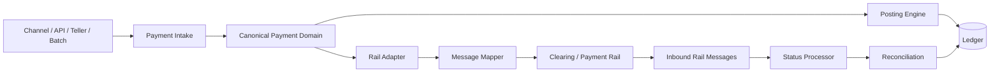
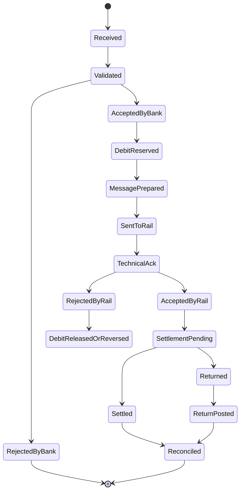
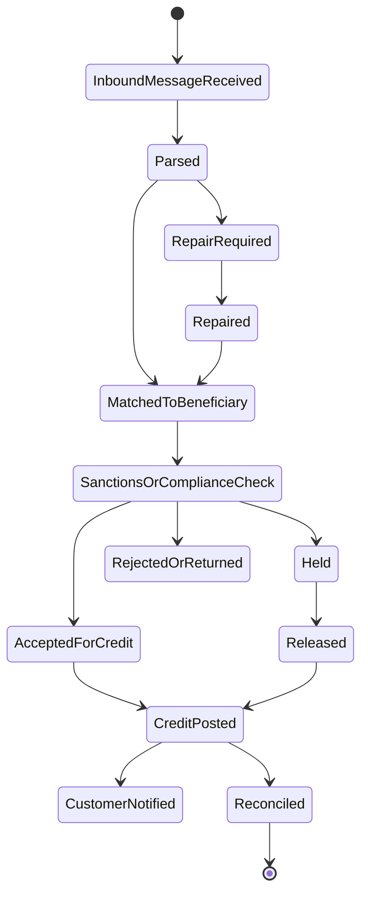
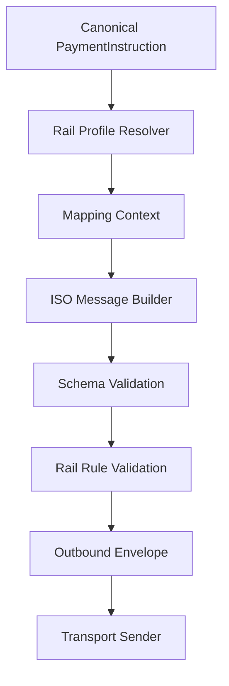
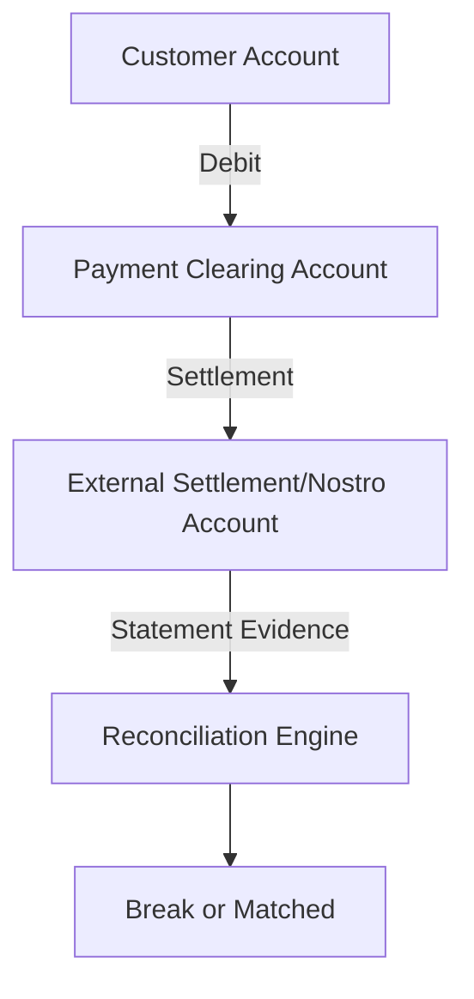
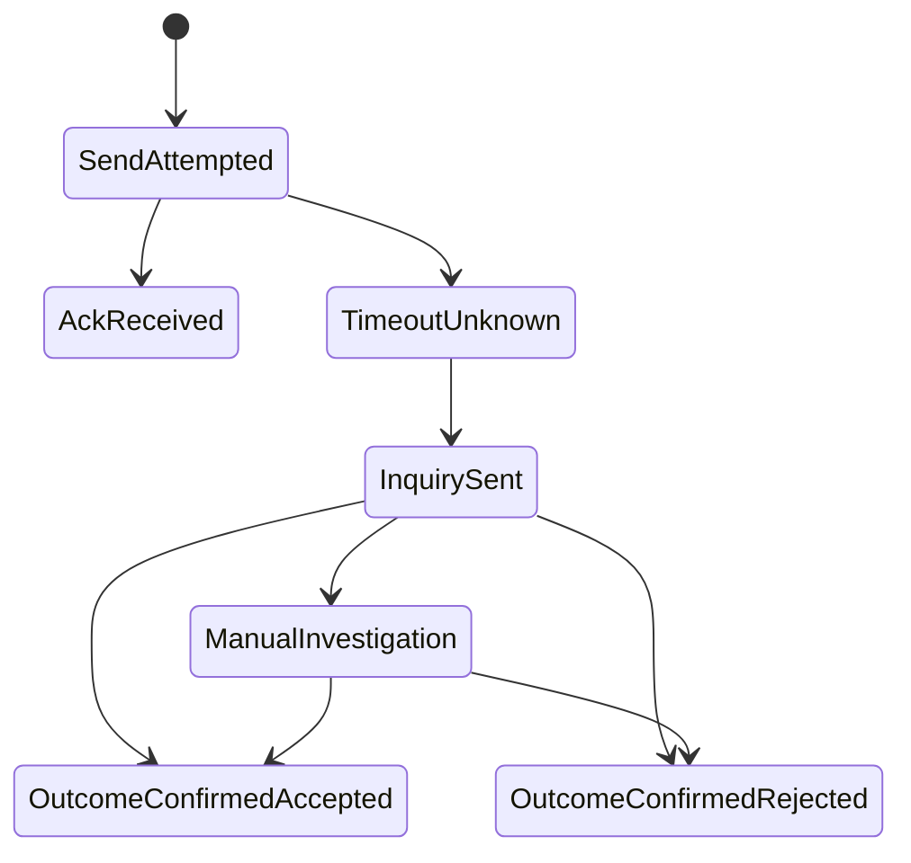
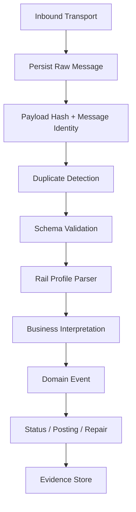
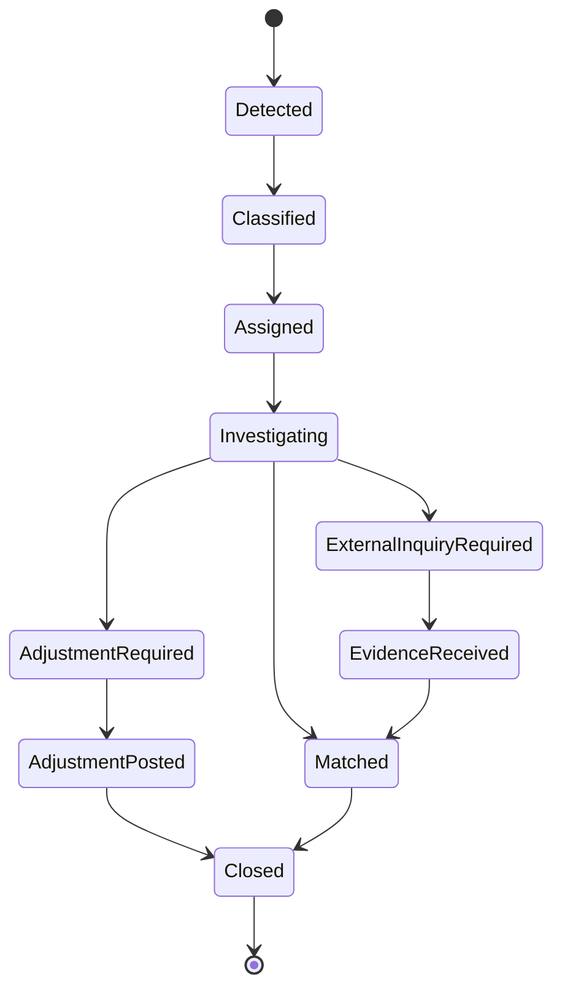

# Part 017 — Clearing, Settlement, ISO 20022, and Message Mapping

A payment instruction is not the same thing as settlement.

A message sent to a clearing system is not the same thing as money moving in the bank's book.

An ISO 20022 message is not the same thing as your internal domain model.

This distinction matters because a weak system says:

```java
sendIsoMessage(payment);
payment.markCompleted();
```

A mature core banking system asks:

- What has actually happened: validation, acceptance, clearing, settlement, or book posting?
- Is the debit final, reserved, pending, or reversible?
- Which ledger account represents settlement exposure?
- Has the external rail acknowledged receipt, accepted for processing, settled, rejected, or returned?
- Which status is customer-facing, which is operational, and which is accounting truth?
- Can a return be matched to the original payment without heuristic string matching?
- Can the bank reconcile internal postings, clearing reports, settlement statements, and GL extracts?
- Can operations explain every discrepancy with evidence?

This part builds the mental model for clearing, settlement, ISO 20022 mapping, and rail integration from a Java core banking perspective.

---

## 1. Kaufman Frame: The Sub-Skill

The sub-skill is:

> Given a canonical payment, design a rail integration that can transform messages, preserve ledger truth, track clearing and settlement lifecycle, handle acknowledgements/rejects/returns, and reconcile the bank's books against external evidence.

Break it down into:

1. Clearing vs settlement.
2. Payment rail boundaries.
3. Canonical internal model.
4. ISO 20022 message family awareness.
5. Message mapping rules.
6. Status mapping rules.
7. Settlement accounting.
8. Return/reject/recall handling.
9. Reconciliation and break management.
10. Operational controls.

The goal is not to memorize every ISO 20022 field.

The goal is to know where ISO 20022 belongs in architecture and how to prevent external-message structure from corrupting your internal ledger model.

---

## 2. Clearing vs Settlement

In everyday speech, people say "payment completed" too casually.

In a banking system, that phrase hides several distinct facts.

| Term | Meaning | Engineering implication |
|---|---|---|
| Instruction | A party asks the bank to move value | Validate, authorize, deduplicate |
| Acceptance | The bank accepts the instruction for processing | Create durable lifecycle record |
| Posting | The bank records accounting impact in its internal books | Journal entry and balance mutation |
| Clearing | Payment details are exchanged and validated between institutions or infrastructure | External message lifecycle |
| Settlement | Final discharge of financial obligation, often through settlement accounts | Settlement ledger and reconciliation |
| Confirmation | Evidence that external party/rail accepted, rejected, returned, or settled | Status update and operational action |

A payment can be posted internally before external settlement. It can also be accepted externally before final settlement. It can be visible to a customer before the bank has received final external evidence.

A top engineer does not collapse these states into a single boolean.

### 2.1 The Dangerous Boolean

Avoid this:

```java
class Payment {
    boolean completed;
}
```

Prefer explicit state dimensions:

```java
enum PaymentInstructionStatus {
    RECEIVED,
    VALIDATED,
    ACCEPTED,
    REJECTED,
    CANCELLED
}

enum LedgerStatus {
    NOT_POSTED,
    RESERVED,
    POSTED,
    REVERSED,
    RETURN_POSTED
}

enum ClearingStatus {
    NOT_SENT,
    SENT,
    TECHNICAL_ACKNOWLEDGED,
    ACCEPTED_BY_RAIL,
    REJECTED_BY_RAIL,
    RETURNED_BY_COUNTERPARTY,
    RECALLED
}

enum SettlementStatus {
    NOT_APPLICABLE,
    PENDING,
    SETTLED,
    FAILED,
    RECONCILED
}
```

These statuses are not arbitrary complexity. They represent different sources of truth.

- Instruction status is controlled by the bank's intake system.
- Ledger status is controlled by the posting engine.
- Clearing status is controlled by rail messages.
- Settlement status is controlled by settlement evidence and reconciliation.

---

## 3. Payment Rail Boundary

A rail is an external mechanism for moving payment instructions and settlement obligations. It could be a domestic real-time payment system, ACH-style batch network, RTGS, card network, correspondent banking flow, or internal clearing arrangement.

A core banking system should not be shaped directly by a rail. It should integrate through a boundary.



The rail adapter exists to absorb external variation.

It handles:

- message format;
- rail-specific validation;
- transport protocol;
- acknowledgement semantics;
- retry rules;
- cut-off windows;
- return codes;
- settlement reports;
- scheme-specific identifiers;
- message version migration.

The canonical payment domain handles:

- customer intent;
- debit/credit parties;
- amount and currency;
- product and account constraints;
- ledger effects;
- operational state;
- evidence;
- reconciliation identity.

Do not let a `pacs.008` XML object become your aggregate root.

---

## 4. ISO 20022 as a Boundary Standard

ISO 20022 is a universal financial industry message scheme. Its catalogue provides message definitions used across payment, securities, trade services, cards, and foreign exchange domains. In payment integration, engineers commonly encounter message families such as:

| Family | Common usage area | Example engineering interpretation |
|---|---|---|
| `pain` | Customer-to-bank payment initiation | Customer or corporate instruction boundary |
| `pacs` | FI-to-FI payment clearing and settlement | Interbank payment movement |
| `camt` | Cash management, account reports, statements, notifications | Statement, status, reconciliation evidence |
| `admi` | Administration | Technical/admin messages |

The important rule:

> ISO 20022 is a message model, not your internal ledger model.

### 4.1 Why Not Use ISO Objects Everywhere?

Because external messages optimize for interoperability between parties. Internal core banking optimizes for domain invariants, auditability, posting correctness, product rules, and operational control.

If your internal domain is directly modeled as ISO XML classes, you inherit problems:

- external naming leaks into core business language;
- message version changes become domain model changes;
- ledger events become coupled to wire format;
- tests become XML-fixture heavy;
- operations cannot reason from business semantics;
- multiple rails with different profiles cause conditional chaos.

Use ISO at the edge. Use canonical domain inside.

---

## 5. Canonical Payment Model

A canonical payment model is the internal representation of a payment lifecycle independent of channel and rail.

It should answer:

- Who initiated the payment?
- Which account or party is debited?
- Which beneficiary receives value?
- What amount, currency, value date, and purpose are requested?
- What rail should process it?
- What ledger event does it create?
- What external references are assigned?
- What evidence has been received?
- What reconciliation keys connect internal and external views?

Example Java shape:

```java
public record PaymentInstruction(
        PaymentInstructionId id,
        IdempotencyKey idempotencyKey,
        Channel channel,
        PartyId debtorPartyId,
        AccountId debtorAccountId,
        Beneficiary beneficiary,
        Money instructedAmount,
        CurrencyUnit settlementCurrency,
        LocalDate requestedExecutionDate,
        PaymentRail rail,
        PaymentPurpose purpose,
        RemittanceInformation remittance,
        Instant receivedAt
) {}

public record PaymentLifecycle(
        PaymentInstructionId instructionId,
        PaymentInstructionStatus instructionStatus,
        LedgerStatus ledgerStatus,
        ClearingStatus clearingStatus,
        SettlementStatus settlementStatus,
        List<PaymentEvidence> evidence
) {}

public record RailReference(
        PaymentRail rail,
        String instructionReference,
        String endToEndId,
        String transactionId,
        String messageId,
        String clearingSystemReference
) {}
```

### 5.1 Canonical Model Design Rule

A canonical model should be stable across:

- XML schema versions;
- domestic rail variants;
- future ISO profile changes;
- internal channel differences;
- old and new integration protocols;
- batch vs real-time flow;
- migration from one clearing vendor to another.

When the canonical model changes, it should be because the bank's domain understanding changed, not because a message schema renamed a field.

---

## 6. Identifier Strategy

Payment integration fails when identifiers are weak.

A robust payment system uses multiple identifiers with distinct meanings.

| Identifier | Owner | Purpose |
|---|---|---|
| `payment_instruction_id` | Core banking/payment domain | Internal lifecycle identity |
| `idempotency_key` | Client/channel + bank contract | Duplicate prevention at intake |
| `end_to_end_id` | Initiating party or payment chain | Business-level trace across participants |
| `message_id` | Message sender | Individual message instance identity |
| `transaction_id` | Rail or bank | Transaction-level rail tracking |
| `clearing_system_reference` | Clearing system | External clearing evidence |
| `journal_entry_id` | Ledger | Accounting truth |
| `settlement_batch_id` | Settlement processor | Settlement grouping |
| `reconciliation_id` | Recon engine | Matching internal and external records |

Do not use a single UUID for everything.

Different identifiers answer different audit questions.

### 6.1 Identifier Anti-Pattern

```java
record Payment(String id, String externalId, String status) {}
```

This looks simple but becomes unmaintainable.

When an operations analyst asks why a customer was debited but the clearing system returned the payment, you need to trace:

- customer request;
- internal accepted instruction;
- debit journal entry;
- outbound message;
- acknowledgement;
- rail rejection;
- return posting;
- customer notification;
- reconciliation break closure.

A single `externalId` cannot carry that lineage.

---

## 7. Outgoing Payment Lifecycle

A typical outgoing external payment can be represented like this:



This state machine is only illustrative. Real rails differ.

The main lesson is that external payment lifecycle is not one state.

### 7.1 Pending Debit vs Final Debit

For outgoing payment, the bank may:

1. reserve funds first;
2. post debit immediately and hold settlement exposure;
3. post only after rail acceptance;
4. use a suspense/clearing account;
5. post differently depending on product, rail, and legal finality.

The correct model depends on local regulation, rail rules, customer terms, bank accounting policy, and product behavior.

The system must make the choice explicit.

---

## 8. Incoming Payment Lifecycle

Incoming payments have different risks.



Incoming payments commonly require:

- beneficiary account matching;
- account status validation;
- compliance screening;
- return reason decision;
- repair queue;
- settlement account reconciliation;
- customer notification;
- statement entry generation.

A core banking system should not automatically credit every inbound message without control points.

---

## 9. Message Mapping: Canonical to ISO 20022

Mapping should be explicit and tested.

Do not hide important mapping logic in a generic XML serializer.



A mapping context should include:

- rail profile;
- message version;
- initiating bank identifiers;
- clearing system member IDs;
- debtor/creditor agent details;
- purpose code mapping;
- local regulatory fields;
- remittance formatting rules;
- character set rules;
- cut-off and settlement date rules;
- maximum length constraints;
- external code set versions.

### 9.1 Example Mapper Interface

```java
public interface PaymentMessageMapper<C, M> {
    M toOutboundMessage(C canonical, MappingContext context);

    InboundPaymentEvent fromInboundMessage(M message, MappingContext context);

    List<MappingViolation> validate(C canonical, MappingContext context);
}
```

For production systems, you will usually need rail-specific implementations:

```java
public final class DomesticRtgsPacs008Mapper
        implements PaymentMessageMapper<OutgoingCreditTransfer, Pacs008Document> {

    @Override
    public Pacs008Document toOutboundMessage(
            OutgoingCreditTransfer payment,
            MappingContext context
    ) {
        // Build explicit groups and transaction information.
        // Do not let transport DTOs mutate domain objects.
        // Do not default missing regulatory fields silently.
        throw new UnsupportedOperationException("Example only");
    }

    @Override
    public InboundPaymentEvent fromInboundMessage(
            Pacs008Document message,
            MappingContext context
    ) {
        throw new UnsupportedOperationException("Example only");
    }

    @Override
    public List<MappingViolation> validate(
            OutgoingCreditTransfer payment,
            MappingContext context
    ) {
        return List.of();
    }
}
```

### 9.2 Mapping Should Produce Evidence

Every outbound message should persist:

- canonical payment ID;
- message type;
- message version;
- mapping profile;
- generated message ID;
- creation timestamp;
- hash of payload;
- validation result;
- sender/receiver identity;
- transport attempt identity;
- acknowledgement correlation key.

This is operational evidence.

Without it, the bank cannot reliably answer whether the payment was never sent, sent but not acknowledged, acknowledged but rejected, or accepted but not settled.

---

## 10. Status Mapping

External statuses should not be copied directly into internal statuses.

Instead, external messages should be interpreted into internal lifecycle events.

```java
sealed interface PaymentRailEvent permits
        RailTechnicalAcknowledged,
        RailRejected,
        RailAccepted,
        RailSettlementConfirmed,
        RailReturned,
        RailRecallRequested {

    PaymentInstructionId paymentInstructionId();
    RailReference railReference();
    Instant observedAt();
}
```

Then apply event handling:

```java
public final class PaymentStatusService {

    public PaymentLifecycle apply(PaymentLifecycle lifecycle, PaymentRailEvent event) {
        return switch (event) {
            case RailTechnicalAcknowledged ack -> lifecycle.withClearingStatus(
                    ClearingStatus.TECHNICAL_ACKNOWLEDGED
            );
            case RailRejected rejected -> lifecycle.withClearingStatus(
                    ClearingStatus.REJECTED_BY_RAIL
            );
            case RailAccepted accepted -> lifecycle.withClearingStatus(
                    ClearingStatus.ACCEPTED_BY_RAIL
            );
            case RailSettlementConfirmed settled -> lifecycle.withSettlementStatus(
                    SettlementStatus.SETTLED
            );
            case RailReturned returned -> lifecycle.withClearingStatus(
                    ClearingStatus.RETURNED_BY_COUNTERPARTY
            );
            case RailRecallRequested recall -> lifecycle.withClearingStatus(
                    ClearingStatus.RECALLED
            );
        };
    }
}
```

### 10.1 Mapping Table Example

| External observation | Internal event | Typical action |
|---|---|---|
| Technical ACK | `RailTechnicalAcknowledged` | Mark message delivered, keep business status pending |
| Technical NACK | `RailRejected` with technical reason | Repair or regenerate message; do not assume customer payment failed until policy says so |
| Business accepted | `RailAccepted` | Continue settlement wait; customer status may become processing/accepted |
| Business reject | `RailRejected` with business reason | Reverse/release funds, notify, create evidence |
| Settlement confirmation | `RailSettlementConfirmed` | Mark settlement complete, reconcile settlement account |
| Return | `RailReturned` | Match original, post return, update customer statement |
| Recall request | `RailRecallRequested` | Enter operational decision workflow |

The mapping table must be rail-profile specific.

---

## 11. Settlement Accounting

Settlement accounting is where payment integration meets ledger truth.

A simplified outgoing payment may use a settlement clearing account:



Example journal flow:

| Moment | Debit | Credit | Meaning |
|---|---:|---:|---|
| Accept outgoing payment | Customer deposit liability | Payment clearing liability/control account | Customer funds removed or reserved based on bank policy |
| Settlement with external system | Payment clearing account | Nostro/settlement account | External settlement obligation discharged |
| Return received | Payment clearing/return account | Customer deposit liability | Customer restored when payment returned |

Actual accounting depends on chart of accounts, product type, bank policy, legal finality, rail design, and jurisdiction.

The engineering rule is simple:

> Do not mark financial completion unless ledger state and settlement evidence have a defensible relationship.

---

## 12. Reject vs Return vs Reversal vs Recall

These terms are often confused.

| Term | Usual meaning | Engineering consequence |
|---|---|---|
| Reject | Payment not accepted for processing by bank/rail/counterparty | May release reservation or reverse debit |
| Return | Payment accepted earlier but sent back later | Must match original and post return accounting |
| Reversal | Correction of a previously posted entry | Append compensating journal, do not mutate original |
| Recall | Request to retrieve or cancel a payment already sent/processed | Operational workflow; may require counterparty action |
| Cancellation | Stop instruction before a point of no return | Must respect cut-off/finality rules |

A mature core banking system models these separately.

### 12.1 Return Matching

Return processing needs strong matching keys:

- original payment instruction ID;
- end-to-end ID;
- original message ID;
- original transaction ID;
- amount and currency;
- debtor/creditor account identifiers;
- return reason code;
- settlement date;
- rail reference.

When matching is ambiguous, create a repair case. Do not auto-credit or auto-reverse based on fuzzy matching.

---

## 13. Acknowledgement and Unknown Outcome

Payment systems must handle unknown outcomes.

Examples:

- outbound message sent, network timeout before ACK;
- ACK received but status update delayed;
- duplicate ACK received;
- status report references unknown message ID;
- settlement report contains item not in internal records;
- bank retried transport and rail received duplicate;
- rail accepted payment but callback failed;
- inbound return arrives after original account closure.

Unknown outcome should become a first-class operational state, not an exception stack trace.



### 13.1 Transport Retry Rule

Transport retry should be based on message identity and rail idempotency rules, not just HTTP retry.

A retry can mean:

- resend same message with same message ID;
- send inquiry instead of duplicate payment;
- create a new technical envelope with same business reference;
- wait for reconciliation report;
- escalate to operations.

Do not invent a universal retry policy.

---

## 14. Cut-Off, Value Date, Settlement Date

Payment systems are temporal systems.

Important dates:

| Date | Meaning |
|---|---|
| Request date | When customer initiated instruction |
| Execution date | When bank intends to process instruction |
| Value date | Date used for value/interest/accounting effect depending on product/policy |
| Clearing date | Date message enters clearing process |
| Settlement date | Date external settlement is expected or confirmed |
| Business date | Bank operational date |
| Posting date | Date ledger entry is posted |

The system must not conflate them.

### 14.1 Cut-Off Decision

```java
public record CutoffDecision(
        boolean canProcessToday,
        LocalDate executionDate,
        LocalDate expectedSettlementDate,
        String reason
) {}

public interface RailCalendarService {
    CutoffDecision decide(
            PaymentRail rail,
            Instant receivedAt,
            LocalDate requestedExecutionDate,
            CurrencyUnit currency
    );
}
```

Cut-off rules should be versioned and auditable because they influence customer promise, settlement exposure, and operational workload.

---

## 15. Inbound Message Processing Architecture

Inbound rail processing must be deterministic, idempotent, and observable.



Principles:

1. Persist raw inbound evidence before complex processing.
2. Detect duplicates before creating business effects.
3. Separate schema parsing from business interpretation.
4. Convert external messages into domain events.
5. Make repair explicit.
6. Preserve correlation keys.
7. Make replay possible.

### 15.1 Inbound Inbox Table

A common pattern is an inbound inbox table:

```sql
CREATE TABLE payment_inbound_message (
    inbound_message_id      UUID PRIMARY KEY,
    rail                    VARCHAR(64) NOT NULL,
    message_type            VARCHAR(64) NOT NULL,
    message_version         VARCHAR(32) NOT NULL,
    external_message_id     VARCHAR(128),
    payload_hash            CHAR(64) NOT NULL,
    received_at             TIMESTAMP NOT NULL,
    processing_status       VARCHAR(32) NOT NULL,
    correlation_key         VARCHAR(128),
    raw_payload_location    VARCHAR(512) NOT NULL,
    error_code              VARCHAR(128),
    error_detail            TEXT,
    UNIQUE (rail, external_message_id, payload_hash)
);
```

This is not a generic messaging tutorial. In payment systems, the inbox is an evidence and idempotency control.

---

## 16. Outbound Message Processing Architecture

Outbound messages need durable send attempts.

```sql
CREATE TABLE payment_outbound_message (
    outbound_message_id     UUID PRIMARY KEY,
    payment_instruction_id  UUID NOT NULL,
    rail                    VARCHAR(64) NOT NULL,
    message_type            VARCHAR(64) NOT NULL,
    message_version         VARCHAR(32) NOT NULL,
    external_message_id     VARCHAR(128) NOT NULL,
    payload_hash            CHAR(64) NOT NULL,
    send_status             VARCHAR(32) NOT NULL,
    created_at              TIMESTAMP NOT NULL,
    sent_at                 TIMESTAMP,
    ack_received_at         TIMESTAMP,
    last_attempt_at         TIMESTAMP,
    attempt_count           INTEGER NOT NULL,
    UNIQUE (rail, external_message_id)
);
```

The outbound table should tell operations:

- what was generated;
- when it was generated;
- what payload hash was sent;
- whether it passed validation;
- whether it was transmitted;
- whether it was acknowledged;
- how many attempts were made;
- which payment instruction it belongs to.

---

## 17. Reconciliation Model

Clearing and settlement integration is incomplete without reconciliation.

Reconciliation compares independent views of the same financial reality.

| Internal source | External source | Question |
|---|---|---|
| Payment instruction table | Rail status report | Did every sent item get a status? |
| Ledger journal | Settlement statement | Did expected settlement occur? |
| Clearing account | External clearing report | Are clearing balances zero or explained? |
| Customer statement | Payment lifecycle | Was customer told the correct story? |
| GL extract | Subledger balances | Does accounting interface balance? |

### 17.1 Matching Dimensions

A reconciliation rule may match on:

- rail;
- settlement date;
- amount;
- currency;
- direction;
- message ID;
- end-to-end ID;
- transaction ID;
- settlement account;
- counterparty bank;
- batch ID;
- return reference;
- value date.

### 17.2 Break Lifecycle



A break should have:

- owner;
- severity;
- financial amount;
- age;
- suspected root cause;
- evidence links;
- required action;
- closure reason;
- approval when financial adjustment is required.

---

## 18. Java Package Boundary

A useful package structure:

```txt
com.bank.core.payment
├── domain
│   ├── PaymentInstruction.java
│   ├── PaymentLifecycle.java
│   ├── PaymentRailEvent.java
│   └── PaymentStatusPolicy.java
├── posting
│   ├── PaymentPostingService.java
│   └── SettlementAccountingPolicy.java
├── rail
│   ├── RailAdapter.java
│   ├── RailProfile.java
│   ├── MappingContext.java
│   └── RailTransport.java
├── rail.iso20022
│   ├── IsoMessageMapper.java
│   ├── Pacs008Mapper.java
│   ├── CamtStatusMapper.java
│   └── IsoValidationService.java
├── inbox
│   ├── InboundMessageRegistry.java
│   └── InboundMessageProcessor.java
├── outbox
│   ├── OutboundMessageRegistry.java
│   └── OutboundMessageDispatcher.java
└── reconciliation
    ├── PaymentReconciliationService.java
    └── SettlementBreak.java
```

The important separation:

- `domain` must not depend on XML generated classes;
- `posting` must depend on ledger contracts, not transport contracts;
- `rail.iso20022` is an adapter;
- `inbox/outbox` preserve message evidence;
- `reconciliation` can inspect both internal and external views.

---

## 19. Validation Layers

Payment validation is layered.

| Layer | Example |
|---|---|
| Syntax validation | XML/schema/required field format |
| Rail profile validation | rail-specific mandatory fields, member IDs, supported characters |
| Bank policy validation | product eligibility, limit, cutoff, channel allowance |
| Account validation | status, restriction, available balance, currency |
| Compliance validation | sanctions/fraud/AML decision point |
| Ledger validation | balanced posting, account existence, idempotency |
| Settlement validation | supported settlement route/account |

Do not mix these into one giant `validatePayment()` method.

A good design returns structured violations:

```java
public record PaymentValidationViolation(
        String code,
        String field,
        String message,
        ValidationLayer layer,
        boolean repairable
) {}
```

Operations needs to know whether a failure is customer-correctable, bank-repairable, rail-profile misconfiguration, or system defect.

---

## 20. Message Versioning

Message schemas change. Rail usage guidelines change. Internal canonical models change. Your architecture must isolate these timelines.

Version separately:

1. canonical payment contract;
2. rail profile;
3. ISO message version;
4. validation rule set;
5. mapping rule set;
6. settlement accounting policy;
7. reconciliation matching rule.

Example:

```java
public record MappingContext(
        PaymentRail rail,
        String railProfileVersion,
        String isoMessageVersion,
        String mappingRuleVersion,
        LocalDate effectiveDate,
        BankParticipantIdentity sender,
        BankParticipantIdentity receiver
) {}
```

Persist these versions with each generated message.

Otherwise, six months later, nobody can explain why the same payment type mapped differently before and after a cutover.

---

## 21. Repair Queue for Rail Messages

Repair queue is not an exception log.

It is a controlled operational workspace.

Repairable cases include:

- missing beneficiary address required by rail profile;
- invalid member identifier;
- unsupported character in remittance text;
- inbound message references unknown account;
- duplicate message with conflicting payload;
- settlement report item unmatched;
- status report references unknown instruction;
- return message cannot be matched to original payment.

Repair queue entries need:

- case ID;
- payment instruction ID if known;
- rail;
- message reference;
- financial amount;
- customer impact;
- error classification;
- owner;
- SLA;
- allowed actions;
- approval requirement;
- evidence links;
- closure reason.

### 21.1 Allowed Repair Actions

Repair actions should be explicit:

- amend non-financial routing field;
- regenerate outbound message;
- resend same message;
- send inquiry;
- match inbound return to original payment;
- post return;
- create suspense item;
- close as duplicate;
- escalate to payment operations.

Do not allow arbitrary database updates.

---

## 22. Anti-Patterns

### 22.1 ISO Everywhere

Using generated ISO classes throughout business logic couples the core to external schema. Keep them at the adapter boundary.

### 22.2 Completed Means Too Many Things

A single `COMPLETED` status hides ledger, clearing, settlement, notification, and reconciliation truth.

### 22.3 Fire-and-Forget Payment Sending

If a payment message is not durably stored with payload hash and send attempt, operations cannot prove what happened.

### 22.4 Auto-Reversal on Timeout

A timeout is not a rejection. It is unknown outcome. Auto-reversal can create duplicate money if the rail later processes the instruction.

### 22.5 Fuzzy Return Matching

Auto-matching returns on amount and date only can credit the wrong customer or reverse the wrong payment.

### 22.6 No Settlement Account Model

Posting customer debit without modeling clearing/settlement exposure creates accounting blind spots.

### 22.7 No Mapping Version

When mappings change without versioned evidence, historical investigation becomes guesswork.

---

## 23. Testing Strategy

Test mapping and lifecycle separately.

### 23.1 Mapping Tests

- canonical payment to expected ISO fields;
- required rail profile fields;
- length constraints;
- character set restrictions;
- optional field omission;
- invalid field rejection;
- message version differences;
- round-trip parse for inbound status;
- payload hash determinism.

### 23.2 Lifecycle Tests

- technical ACK does not mark settlement complete;
- business reject reverses/releases funds according to policy;
- duplicate ACK does not duplicate status event;
- return posts exactly once;
- timeout enters unknown outcome;
- settlement report reconciles expected items;
- unmatched settlement item creates break;
- repair action produces evidence.

### 23.3 Property Tests

Useful properties:

- no lifecycle transition loses original payment identity;
- no rail event causes duplicate journal posting;
- every customer debit has settlement or open exposure;
- every return posting references original payment or suspense reason;
- every generated outbound message has mapping version and payload hash.

---

## 24. Observability for Payment Integration

Avoid generic metrics only. Payment systems need business telemetry.

Useful metrics:

- outbound messages generated by rail/message type;
- messages pending ACK by age;
- unknown outcome count;
- rejects by rail reason code;
- returns by reason code;
- settlement pending amount by currency;
- reconciliation breaks by age/severity;
- repair queue SLA breaches;
- duplicate inbound messages;
- mapping validation failures by profile version.

Useful traces:

- intake request;
- posting decision;
- outbox message generation;
- transport send;
- ACK processing;
- status update;
- settlement reconciliation;
- customer notification.

Useful log fields:

- payment instruction ID;
- rail;
- message type;
- message ID;
- end-to-end ID;
- transaction ID;
- journal entry ID;
- settlement batch ID;
- reconciliation ID.

---

## 25. Source Anchors

This part uses these public domain anchors:

- ISO 20022 official message definitions and catalogue for financial message families and message-definition governance.
- BIS/CPMI-IOSCO Principles for Financial Market Infrastructures for payment, clearing, and settlement infrastructure context.
- PCI SSC documentation boundary where payment data/card account data intersects payment processing.
- Prior series assumptions: Java concurrency, SQL/JDBC, messaging/event streaming, security, observability, and reliability are not re-taught here.

---

## 26. Practice: Design Review Exercise

You are reviewing an outgoing domestic credit transfer service.

The proposed design:

```java
public void transfer(Request request) {
    debit(request.from(), request.amount());
    String xml = isoMapper.map(request);
    railClient.send(xml);
    markCompleted(request.id());
}
```

Find at least twelve design defects.

Expected concerns:

1. No idempotency boundary.
2. No durable payment instruction lifecycle.
3. No distinction between debit, clearing, and settlement.
4. No outbox message record.
5. No message ID tracking.
6. No payload hash evidence.
7. No ACK handling.
8. No unknown outcome state.
9. No rejection/return model.
10. No settlement accounting.
11. No reconciliation.
12. No repair queue.
13. No cut-off/value-date logic.
14. No mapping validation.
15. No mapping version.
16. No operational evidence.
17. No safe retry semantics.
18. No status dimension separation.

---

## 27. Part Summary

Clearing and settlement integration is not just message transformation.

The core ideas:

- Clearing exchanges and validates payment information.
- Settlement discharges financial obligations.
- ISO 20022 belongs at the integration boundary, not inside ledger domain objects.
- Internal canonical payment model must preserve business meaning independent of rail format.
- Status must be multi-dimensional: instruction, ledger, clearing, settlement, reconciliation.
- Unknown outcome is a first-class state.
- Reject, return, reversal, recall, and cancellation are different.
- Settlement accounting must be explicit.
- Every outbound and inbound message must create evidence.
- Reconciliation is part of the payment design, not an afterthought.

In the next part, we move to **Card, ATM, POS Boundary, and PCI-Aware Core Integration**.
