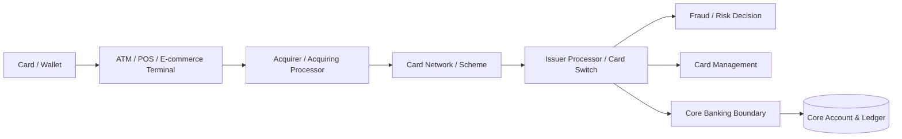
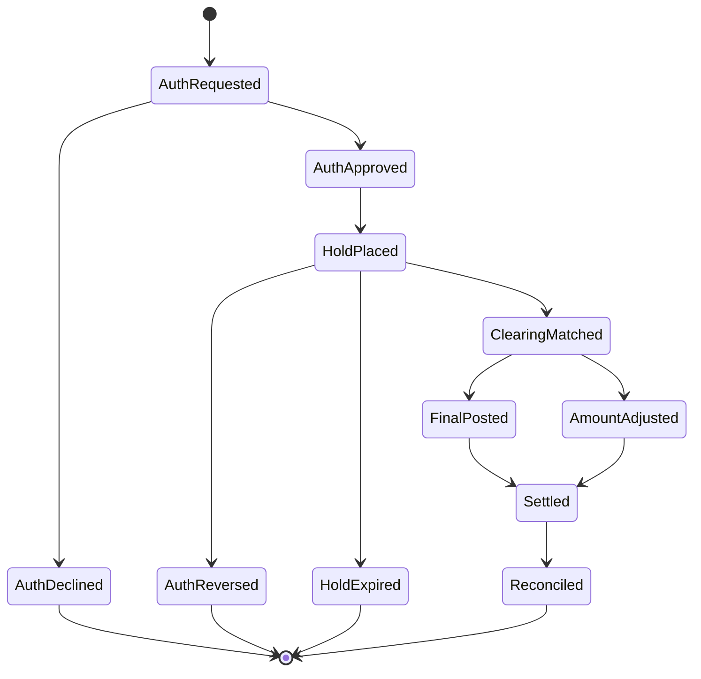
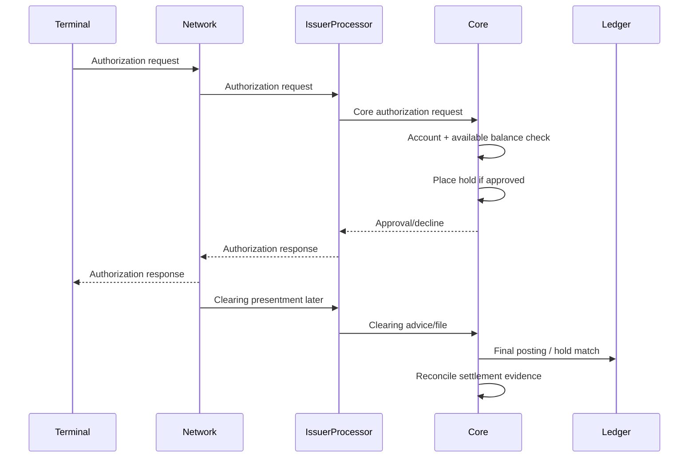
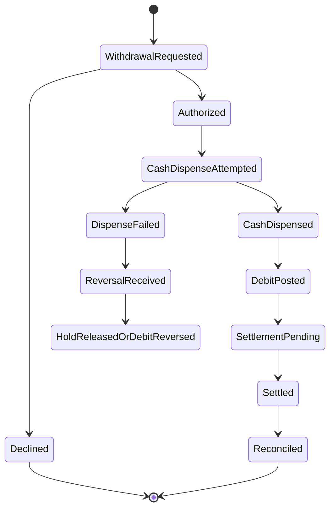
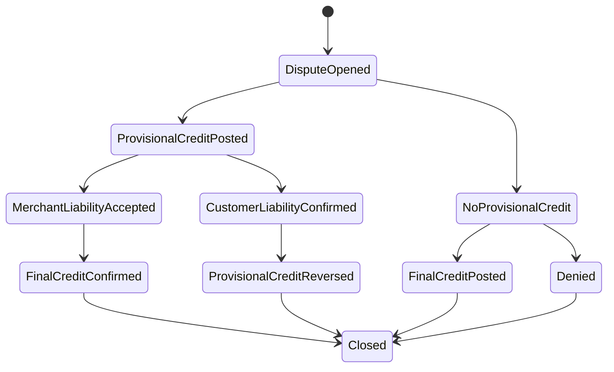

# Part 018 — Card, ATM, POS Boundary, and PCI-Aware Core Integration

Card, ATM, and POS flows are dangerous to model as simple account debits.

A weak implementation says:

```java
account.debit(cardTransaction.amount());
```

A mature banking system asks:

- Is this an authorization, financial posting, reversal, clearing, settlement, fee, or dispute event?
- Does the core need card number data, or only a tokenized/card-account reference?
- Is this transaction online, offline, contact, contactless, ATM, e-commerce, recurring, or fallback?
- Is the amount final or estimated?
- Is there a hold? When does it expire?
- Has clearing arrived? Does it match authorization?
- Is settlement separate from customer account posting?
- Is there a reversal or advice message?
- Which system owns PIN verification, card lifecycle, fraud scoring, and network communication?
- What evidence is needed for audit, operations, and customer dispute?

This part is about the **boundary** between Java core banking and the card/ATM/POS ecosystem.

It is not a guide to implementing card network protocols, PIN cryptography, or payment terminal software. Those are specialized domains with strict scheme, security, and certification requirements.

---

## 1. Kaufman Frame: The Sub-Skill

The sub-skill is:

> Given a card, ATM, or POS event, determine what the core banking system must know, what it must not know, which ledger effect is appropriate, how to preserve PCI-aware boundaries, and how to reconcile authorization, clearing, settlement, and customer balance impact.

Break it down into:

1. Card ecosystem boundary.
2. Core banking responsibility vs card-management responsibility.
3. Authorization hold model.
4. Clearing and settlement model.
5. ATM withdrawal model.
6. POS purchase model.
7. Reversal, expiry, and adjustment handling.
8. PCI-aware data minimization.
9. Dispute/chargeback boundary.
10. Reconciliation and evidence.

---

## 2. Core Banking Is Not the Card Switch

A bank may have many systems in the card transaction path.



Core banking usually owns:

- account existence and status;
- available balance answer;
- hold/reservation impact;
- final ledger posting when appropriate;
- customer statement entries;
- settlement and GL interface impact;
- reconciliation evidence;
- account-level restrictions;
- fees where owned by deposit product/core.

Core banking usually does **not** own:

- PAN storage for transaction switching unless explicitly in certified card domain;
- PIN verification details;
- EMV kernel behavior;
- terminal certification;
- card scheme message protocol details;
- fraud model internals;
- merchant acquiring lifecycle;
- card production/personalization;
- dispute rules engine, unless the bank embeds that capability.

The exact boundary depends on the bank, processor, and jurisdiction. The engineering principle remains:

> The core should receive the minimum card event data needed to make account/ledger decisions.

---

## 3. PCI-Aware Boundary

PCI DSS exists to protect payment account data. For a core banking engineer, the most important architectural principle is not "sprinkle encryption everywhere". It is **scope control**.

Keep sensitive cardholder data out of core banking unless there is a legitimate, governed, certified reason for it to be there.

### 3.1 Minimum Necessary Card Data

Prefer this at the core boundary:

```java
public record CardAccountReference(
        String cardToken,
        AccountId fundingAccountId,
        String productCode,
        String maskedPan,
        CardChannel channel
) {}
```

Avoid this in general core tables:

```java
public record UnsafeCardReference(
        String pan,
        String trackData,
        String pinBlock,
        String cvv
) {}
```

Do not put sensitive authentication data in core banking logs, analytics exports, statement notes, exception messages, or repair queue comments.

### 3.2 PCI-Aware Design Rules

| Rule | Explanation |
|---|---|
| Minimize | Core should not store card data it does not need |
| Tokenize | Use token/card reference for account linkage |
| Mask | Display only safe masked representation where needed |
| Segment | Keep card processing components isolated from general core components |
| Log safely | Never log sensitive authentication data or full card data |
| Evidence carefully | Evidence stores must not become ungoverned card-data dumps |
| Use certified components | HSM, PIN, terminal, and scheme processing belong in certified card domain |
| Control access | Repair and operations screens must respect least privilege |

This part does not provide instructions for bypassing card controls or implementing PIN/key-management internals. Treat those as specialized certified infrastructure concerns.

---

## 4. Authorization Is Not Settlement

A POS or ATM authorization asks the issuer side: "May this transaction proceed?"

A clearing/settlement event later says: "Here is the financial transaction that should be settled and posted or reconciled."

These are related but not identical.



A mature system separates:

- authorization decision;
- funds hold;
- clearing record;
- final posting;
- settlement record;
- reconciliation status;
- dispute lifecycle.

---

## 5. Authorization Hold Model

An authorization hold reserves available balance without necessarily changing ledger balance.

For a deposit account:

```txt
ledger_balance    = posted financial balance
holds             = active card/ATM/payment reservations
available_balance = ledger_balance - active_holds - liens - restrictions + approved_overdraft
```

Example Java model:

```java
public record AuthorizationHold(
        HoldId holdId,
        AccountId accountId,
        CardAuthorizationId authorizationId,
        Money authorizedAmount,
        Money heldAmount,
        MerchantInfo merchant,
        CardChannel channel,
        Instant authorizedAt,
        Instant expiresAt,
        HoldStatus status
) {}

enum HoldStatus {
    ACTIVE,
    PARTIALLY_RELEASED,
    RELEASED,
    EXPIRED,
    MATCHED_TO_CLEARING,
    REVERSED
}
```

A hold should be:

- idempotent;
- linked to authorization evidence;
- expiry-aware;
- releaseable;
- matchable to clearing;
- visible in customer available balance;
- auditable.

### 5.1 Hold Is Not a Journal Entry by Default

Many systems treat a hold as a balance component, not a final accounting posting. That means:

- ledger balance may remain unchanged;
- available balance decreases;
- customer may see pending transaction;
- final posting happens when clearing arrives or when bank policy says so.

However, implementations vary by product, region, and policy. The key is to model the distinction explicitly.

---

## 6. Authorization Decision Contract

The card processor/card switch may ask core banking for an authorization decision.

Core should return an account-level decision, not own the entire card network conversation.

```java
public record CoreAuthorizationRequest(
        CardAuthorizationId authorizationId,
        String cardToken,
        AccountId fundingAccountId,
        Money transactionAmount,
        Money billingAmount,
        MerchantInfo merchant,
        CardChannel channel,
        Instant requestedAt,
        String retrievalReferenceNumber,
        String networkTraceId
) {}

public record CoreAuthorizationDecision(
        CardAuthorizationId authorizationId,
        AuthorizationDecisionCode decisionCode,
        Money approvedAmount,
        String declineReason,
        HoldId holdId,
        Instant decidedAt
) {}

enum AuthorizationDecisionCode {
    APPROVED,
    DECLINED_INSUFFICIENT_FUNDS,
    DECLINED_ACCOUNT_CLOSED,
    DECLINED_ACCOUNT_RESTRICTED,
    DECLINED_LIMIT_EXCEEDED,
    REFER_TO_ISSUER,
    SYSTEM_UNAVAILABLE_POLICY_DECLINE
}
```

### 6.1 Authorization Inputs

Core can decide based on:

- funding account status;
- available balance;
- account restrictions;
- currency support;
- overdraft availability;
- daily limits if owned by core;
- product rules;
- hold duplication;
- customer/account blocks;
- channel restriction flags.

Core should not decide based on data it does not own unless the integration contract explicitly supplies trusted decisions from fraud/card systems.

---

## 7. POS Purchase Flow

Simplified POS flow:



### 7.1 Amount Differences

Final clearing amount may differ from authorization amount.

Examples:

- fuel pre-authorization;
- hospitality deposits;
- tips;
- currency conversion;
- partial shipment;
- incremental authorization;
- reversal or partial reversal.

The hold model must allow:

- exact match;
- partial match;
- over-clear according to policy;
- under-clear with hold release;
- clearing without authorization;
- authorization without clearing until expiry.

### 7.2 Clearing Match Record

```java
public record CardClearingMatch(
        CardClearingId clearingId,
        Optional<HoldId> matchedHoldId,
        Optional<CardAuthorizationId> matchedAuthorizationId,
        MatchConfidence confidence,
        Money clearingAmount,
        Money releasedHoldAmount,
        Money finalPostedAmount,
        String matchingRuleVersion
) {}
```

Do not rely only on amount and date. Use network references, authorization code, retrieval reference, card token, merchant data, amount, currency, and time window according to certified integration contract.

---

## 8. ATM Withdrawal Flow

ATM withdrawal is closer to immediate cash movement, but it still has authorization, dispense, reversal/advice, settlement, and reconciliation concerns.



### 8.1 ATM Failure Cases

ATM is full of awkward operational failures:

- account debited but cash not dispensed;
- cash dispensed but reversal message received late;
- authorization approved but terminal timeout;
- partial dispense;
- duplicate advice;
- settlement file disagreement;
- surcharge fee mismatch;
- foreign ATM currency conversion issue;
- offline fallback processing;
- journal/electronic journal mismatch.

Model ATM exceptions as operational cases, not just failed API calls.

### 8.2 Cash Dispense Evidence

For ATM withdrawal, evidence may come from:

- authorization request/response;
- ATM electronic journal;
- switch logs;
- clearing/settlement file;
- reversal/advice messages;
- cash balancing reports;
- customer dispute case.

The core should retain references, not necessarily raw sensitive card/terminal data.

---

## 9. Card Clearing and Settlement

Card clearing may arrive after authorization. Settlement may happen in aggregate through network/settlement accounts.

Core banking often needs to:

- match clearing records to authorization holds;
- post final customer debit/credit;
- release unused hold amount;
- handle clearing without authorization;
- process charge adjustments;
- generate statement entries;
- update settlement exposure;
- feed GL;
- reconcile against card processor and network settlement reports.

### 9.1 Simplified Accounting Pattern

| Event | Account impact | Meaning |
|---|---|---|
| Authorization approved | Available balance reduced by hold | Customer funds reserved, not necessarily posted |
| Clearing received | Customer account debited and card clearing account credited/debited according to accounting setup | Final customer posting |
| Settlement confirmed | Card clearing/settlement account reconciled against network/nostro | External settlement evidence |
| Authorization reversed | Hold released | No final customer debit |
| Chargeback/provisional credit | Customer credited and dispute receivable/suspense used | Dispute lifecycle accounting |

The exact debit/credit direction depends on account type and chart of accounts. The invariant is that every customer-facing posting must connect to a defensible settlement or dispute position.

---

## 10. Card Reversal and Hold Expiry

Reversal is not the same as expiry.

| Case | Meaning | Action |
|---|---|---|
| Authorization reversal | Network/processor tells issuer authorization should be reversed | Release hold immediately if matched and safe |
| Partial reversal | Only part of held amount should be released | Adjust hold amount |
| Hold expiry | No clearing/reversal arrived before expiry policy | Expire hold and restore available balance |
| Clearing after expiry | Final financial record arrives after hold expired | Post clearing according to policy, may affect available/ledger balance |
| Duplicate reversal | Same reversal received more than once | Idempotent no-op with evidence |

### 10.1 Expiry Job

Hold expiry is a batch/operational process. It must be idempotent.

```java
public interface AuthorizationHoldExpiryService {
    ExpiryResult expireHolds(LocalDate businessDate, int partition);
}

public record ExpiryResult(
        int scanned,
        int expired,
        int skipped,
        List<String> warnings
) {}
```

The expiry job should never delete holds. It changes status and records evidence.

---

## 11. Card Fees

Card transactions can involve many fee types:

- ATM withdrawal fee;
- foreign ATM fee;
- cross-border fee;
- currency conversion fee;
- cash advance fee;
- card replacement fee;
- annual card fee;
- merchant surcharge visibility;
- network fee allocated internally;
- dispute/chargeback fee.

Core banking should only post fees it owns.

If the card processor owns a fee decision, core receives a fee posting instruction with evidence. If the deposit product owns a fee, core's pricing engine may calculate it.

Avoid duplicating fee decisions in both card and core systems.

---

## 12. Currency Conversion Boundary

Card transactions often involve multiple currencies:

- transaction currency;
- billing currency;
- account currency;
- settlement currency;
- fee currency.

A core banking system must know which amount affects the account and which FX/rate source was used.

```java
public record CardTransactionAmount(
        Money transactionAmount,
        Money billingAmount,
        Money settlementAmount,
        Optional<ExchangeRateEvidence> exchangeRateEvidence
) {}
```

Persist rate evidence when customer balance is affected.

Do not recompute historical card FX using today's rate.

---

## 13. Dispute and Chargeback Boundary

Dispute/chargeback is usually not owned entirely by core banking. It may live in card operations, scheme dispute systems, case management, or specialized platforms.

Core banking still needs to support financial effects:

- provisional credit;
- provisional credit reversal;
- final credit;
- chargeback receivable/suspense;
- representment adjustment;
- write-off;
- fee reversal;
- customer statement correction.

### 13.1 Dispute Financial Lifecycle



The core should not treat dispute credit as ordinary deposit. It needs a reason, case ID, source, reversibility flag, and accounting mapping.

---

## 14. Statement Entry Design

Customers do not think in ledger entries. They see statement entries.

For card transactions, statement entry must explain:

- merchant name;
- transaction date;
- posting date;
- amount and currency;
- fee if separate;
- pending vs posted;
- reversal/refund/dispute markers;
- masked card identifier if allowed;
- channel: ATM/POS/e-commerce/contactless;
- foreign amount/rate where required by policy.

Do not put full card data or sensitive authentication data in statement text.

### 14.1 Pending vs Posted Statement

A pending authorization may be shown before final posting.

When clearing arrives:

- pending entry may convert to posted;
- amount may change;
- merchant descriptor may be enriched;
- hold may be released;
- posted transaction gets final statement ID.

Keep customer-facing statement state aligned with internal lifecycle but do not expose every technical rail status.

---

## 15. Core/Card Integration API

A useful integration contract separates authorization, clearing, reversal, and dispute effects.

```java
public interface CardCoreAccountService {

    CoreAuthorizationDecision authorize(CoreAuthorizationRequest request);

    ClearingPostingResult postClearing(CardClearingInstruction instruction);

    HoldReleaseResult reverseAuthorization(CardAuthorizationReversal reversal);

    DisputePostingResult postDisputeFinancialEffect(CardDisputePostingInstruction instruction);
}
```

The contract must be idempotent.

Each request should include:

- event ID;
- card token/reference;
- funding account;
- network reference;
- amount/currency;
- event timestamp;
- source system;
- payload hash or evidence reference;
- duplicate handling key.

### 15.1 Idempotency Table

| Event type | Idempotency key example |
|---|---|
| Authorization | card token + network trace + authorization timestamp + amount |
| Reversal | original authorization ID + reversal reference |
| Clearing | clearing file ID + clearing record sequence + network reference |
| ATM advice | terminal ID + transaction sequence + business date |
| Dispute posting | dispute case ID + financial effect type + version |

Exact keys depend on integration contracts. The principle is that each external financial effect must be applied once.

---

## 16. Fraud and Core Boundary

Fraud systems may approve, decline, challenge, or refer transactions. Core banking should treat fraud decision as an input, not duplicate the entire fraud model.

Possible integration modes:

| Mode | Description |
|---|---|
| Processor-only fraud | Card processor decides before core balance check |
| Core-aware fraud | Fraud receives account/customer signals from core |
| Sequential decision | Fraud decision and core authorization both required |
| Hold-and-review | Authorization or posting enters review queue |

Core must know the final decision relevant to account impact:

- approved;
- declined;
- referred;
- held;
- released;
- blocked.

But it should not store raw fraud feature payloads unnecessarily.

---

## 17. Account Restrictions and Card Events

Core account restrictions should influence authorization and posting.

Examples:

- account closed;
- account dormant;
- debit blocked;
- legal hold;
- deceased marker;
- fraud block;
- product restriction;
- overdraft disabled;
- currency not supported;
- country/channel restriction;
- insufficient available balance.

Represent the decision cleanly:

```java
public record AccountAuthorizationAssessment(
        AccountId accountId,
        boolean debitAllowed,
        Money availableBalance,
        List<AccountRestrictionReason> restrictionReasons,
        Optional<Money> approvedOverdraftAmount
) {}
```

Do not let card systems infer account restrictions from generic error strings.

---

## 18. Reconciliation Model

Card/ATM/POS reconciliation has multiple views.

| Internal source | External source | Reconciliation question |
|---|---|---|
| Authorization holds | Authorization logs | Did every approval create one hold? |
| Holds | Clearing records | Did clearing match or release holds correctly? |
| Customer ledger postings | Processor clearing file | Did every financial record post exactly once? |
| Card settlement account | Network settlement report | Did settlement amount match expected exposure? |
| ATM withdrawals | ATM electronic journal/cash balancing | Did dispensed cash match debits? |
| Dispute postings | Dispute case system | Did provisional/final credits match case decisions? |

### 18.1 Break Types

- authorization without clearing after expiry period;
- clearing without authorization;
- amount mismatch beyond tolerance;
- duplicate clearing record;
- customer posted but settlement missing;
- settlement item with no customer posting;
- ATM debit without cash dispense evidence;
- reversal received after final posting;
- dispute credit without case reference;
- fee posted twice.

Breaks should be case-managed with evidence and allowed actions.

---

## 19. Evidence Store

For each card-related financial effect, retain safe evidence references.

Evidence examples:

- authorization event ID;
- processor reference;
- network trace/reference;
- retrieval reference number where appropriate;
- masked card reference/token;
- merchant descriptor;
- terminal/ATM reference if safe;
- clearing file ID;
- settlement report ID;
- dispute case ID;
- payload hash;
- decision reason code;
- hold ID;
- journal entry ID.

The evidence store should not become a dump of raw cardholder data.

### 19.1 Safe Evidence Model

```java
public record CardEventEvidence(
        String sourceSystem,
        String eventType,
        String eventReference,
        String payloadHash,
        Instant observedAt,
        Map<String, String> safeAttributes
) {}
```

Validate `safeAttributes`. Do not allow arbitrary unfiltered payload fields.

---

## 20. Logging and Repair Queue Safety

A common failure mode is leaking card data through logs or operations screens.

Danger zones:

- request/response logging;
- exception stack traces;
- debug dumps;
- JSON serialization of inbound messages;
- repair queue payload viewer;
- data lake export;
- BI dashboards;
- customer support notes;
- statement enrichment;
- audit evidence attachment.

Design controls:

- structured logging with allowlisted fields;
- redaction at serializer boundary;
- masked card display component;
- payload storage with controlled access;
- no raw payload in exception messages;
- secure evidence viewer with audit trail;
- test cases that assert sensitive fields are redacted.

---

## 21. Java Package Boundary

```txt
com.bank.core.cardboundary
├── api
│   ├── CardCoreAccountService.java
│   ├── CoreAuthorizationRequest.java
│   └── CoreAuthorizationDecision.java
├── authorization
│   ├── AuthorizationHold.java
│   ├── AuthorizationPolicy.java
│   └── HoldExpiryService.java
├── clearing
│   ├── CardClearingInstruction.java
│   ├── CardClearingMatcher.java
│   └── ClearingPostingService.java
├── settlement
│   ├── CardSettlementPosition.java
│   └── CardSettlementReconciliationService.java
├── dispute
│   ├── CardDisputePostingInstruction.java
│   └── DisputeFinancialEffectService.java
├── evidence
│   ├── CardEventEvidence.java
│   └── SafeEvidenceStore.java
└── privacy
    ├── CardDataRedactor.java
    └── CardDataPolicy.java
```

Keep protocol/card-network generated classes outside this package unless this service is explicitly the certified card processing component.

---

## 22. Database Shape

Simplified hold table:

```sql
CREATE TABLE card_authorization_hold (
    hold_id                  UUID PRIMARY KEY,
    authorization_id          VARCHAR(128) NOT NULL,
    account_id                UUID NOT NULL,
    card_token                VARCHAR(128) NOT NULL,
    authorized_amount_minor   BIGINT NOT NULL,
    authorized_currency       CHAR(3) NOT NULL,
    held_amount_minor         BIGINT NOT NULL,
    status                    VARCHAR(32) NOT NULL,
    merchant_descriptor       VARCHAR(256),
    channel                   VARCHAR(32) NOT NULL,
    authorized_at             TIMESTAMP NOT NULL,
    expires_at                TIMESTAMP NOT NULL,
    matched_clearing_id        VARCHAR(128),
    created_at                TIMESTAMP NOT NULL,
    updated_at                TIMESTAMP NOT NULL,
    UNIQUE (authorization_id)
);
```

Simplified clearing table:

```sql
CREATE TABLE card_clearing_event (
    clearing_event_id         UUID PRIMARY KEY,
    source_file_id            VARCHAR(128) NOT NULL,
    source_sequence           BIGINT NOT NULL,
    card_token                VARCHAR(128) NOT NULL,
    account_id                UUID NOT NULL,
    authorization_id          VARCHAR(128),
    network_reference         VARCHAR(128),
    amount_minor              BIGINT NOT NULL,
    currency                  CHAR(3) NOT NULL,
    merchant_descriptor       VARCHAR(256),
    clearing_status           VARCHAR(32) NOT NULL,
    journal_entry_id          UUID,
    payload_hash              CHAR(64) NOT NULL,
    received_at               TIMESTAMP NOT NULL,
    UNIQUE (source_file_id, source_sequence)
);
```

Notice: no full PAN, no track data, no PIN data.

---

## 23. Testing Strategy

### 23.1 Authorization Tests

- approve when available balance is sufficient;
- decline when account closed;
- decline when account debit-blocked;
- approve partial amount if product/policy supports it;
- duplicate authorization returns same decision;
- approval creates exactly one active hold;
- failed hold creation does not return approval;
- fraud block input causes correct decline/refer decision.

### 23.2 Clearing Tests

- exact clearing matches hold and posts final debit;
- lower clearing releases remaining hold;
- higher clearing follows policy;
- clearing without authorization creates repair or posts according to policy;
- duplicate clearing does not double post;
- clearing after hold expiry posts correctly;
- reversal after clearing follows reversal/adjustment policy.

### 23.3 ATM Tests

- authorization approved but dispense failed releases/reverses;
- duplicate reversal is idempotent;
- settlement mismatch creates break;
- surcharge fee posts once;
- cash balancing mismatch creates operational case.

### 23.4 PCI-Safety Tests

- logs do not contain forbidden card fields;
- repair queue displays only masked/tokenized data;
- statement text excludes sensitive authentication data;
- evidence store rejects non-allowlisted raw fields;
- JSON serialization redacts by default;
- exception messages do not include raw payload.

---

## 24. Observability

Card boundary telemetry should be business-aware.

Metrics:

- authorization requests by channel;
- approval/decline rate by reason;
- authorization latency;
- active hold amount by currency;
- expired holds count;
- clearing match rate;
- clearing without authorization count;
- duplicate clearing records;
- ATM reversal rate;
- settlement breaks by age;
- dispute financial postings by type;
- redaction policy violations detected in tests.

Trace dimensions:

- authorization ID;
- card token;
- account ID;
- hold ID;
- clearing event ID;
- journal entry ID;
- settlement report ID;
- dispute case ID.

Logs should be structured and allowlisted. Avoid payload dumps.

---

## 25. Anti-Patterns

### 25.1 Treating Authorization as Final Debit

Authorization approval is not necessarily final accounting. It often creates a hold/reservation.

### 25.2 Letting Card Network DTOs Leak into Core

Generated network/protocol DTOs should stay at boundary adapters. Core needs semantic requests and decisions.

### 25.3 Storing Full Card Data in Core

This expands PCI scope and creates avoidable breach impact.

### 25.4 Clearing Without Idempotency

Duplicate clearing files or records can double-debit customers if not controlled.

### 25.5 Hold Expiry by Deletion

Deleting holds destroys evidence. Expire by state transition.

### 25.6 Fuzzy Clearing Match

Matching only by amount/date/merchant is unsafe. Use network references and controlled rules.

### 25.7 Logging Raw Processor Payloads

Debug convenience can become a data protection incident.

### 25.8 Dispute Credits as Ordinary Deposits

Dispute credits have reversibility, case evidence, and accounting implications.

---

## 26. Design Review Checklist

Before approving a core/card integration design, ask:

1. Does the core store only minimum necessary card data?
2. Are authorization, clearing, settlement, reversal, and dispute separate event types?
3. Are authorization holds explicit and expiry-aware?
4. Can clearing match to authorization with strong keys?
5. Are duplicate external events idempotent?
6. Does final posting create balanced journal entries?
7. Are card fees owned by one system?
8. Is FX/rate evidence retained?
9. Is settlement exposure reconciled?
10. Are ATM dispense failures represented as operational cases?
11. Does the repair queue avoid sensitive card data leakage?
12. Are logs allowlisted and redacted?
13. Can customer statement entries explain pending vs posted?
14. Can dispute financial effects be reversed or finalized correctly?
15. Is there an audit trail from external event to hold/posting/journal/reconciliation?

---

## 27. Practice: Diagnose the Design

Proposed design:

```java
@PostMapping("/card/transactions")
void post(@RequestBody CardTransaction tx) {
    Account account = accountRepository.findByPan(tx.pan());
    account.debit(tx.amount());
    log.info("card tx {}", tx);
    accountRepository.save(account);
}
```

Problems:

1. Finds account by PAN directly in core.
2. Likely stores/processes sensitive card data unnecessarily.
3. Logs raw transaction payload.
4. No tokenization boundary.
5. No authorization vs clearing distinction.
6. No hold model.
7. No idempotency.
8. No external event identity.
9. No duplicate protection.
10. No balanced journal entry.
11. No settlement account.
12. No reversal handling.
13. No clearing match.
14. No ATM/POS channel distinction.
15. No dispute support.
16. No evidence model.
17. No reconciliation.
18. No account restriction decision contract.
19. No safe statement semantics.
20. No operational repair path.

A corrected design would receive a tokenized `CoreAuthorizationRequest`, make an account decision, create an authorization hold if approved, process clearing later with idempotent matching, post final ledger entries, release/adjust holds, reconcile settlement, and store safe evidence.

---

## 28. Source Anchors

This part uses these public domain anchors:

- PCI Security Standards Council PCI DSS documentation for payment account data protection and the need to reduce/control card-data scope.
- EMVCo public materials for the fact that EMV specifications define technical requirements for chip/contactless payment products and terminal interaction.
- ISO 20022 and payment-clearing context from the previous part where card settlement interfaces may interact with bank payment/account reporting boundaries.
- Prior series assumptions: Java security, cryptography, observability, error handling, persistence, and concurrency are not re-taught here.

---

## 29. Part Summary

Card, ATM, and POS integration is a boundary problem.

The core ideas:

- Core banking is not the card switch.
- Authorization is not clearing.
- Clearing is not settlement.
- Hold is not necessarily final ledger posting.
- PAN/track/PIN-sensitive data should not leak into core banking tables, logs, statements, or repair queues.
- Use tokenized references and minimum necessary data.
- Authorization holds must be idempotent, expiry-aware, reversible, and matchable.
- Clearing must post exactly once.
- ATM failures require operational evidence and case handling.
- Dispute financial effects are specialized accounting events.
- Reconciliation across authorization, clearing, settlement, ledger, and external reports is mandatory.

In the next part, we move to **Channel Integration, API Gateway, and Anti-Corruption Layer**.
