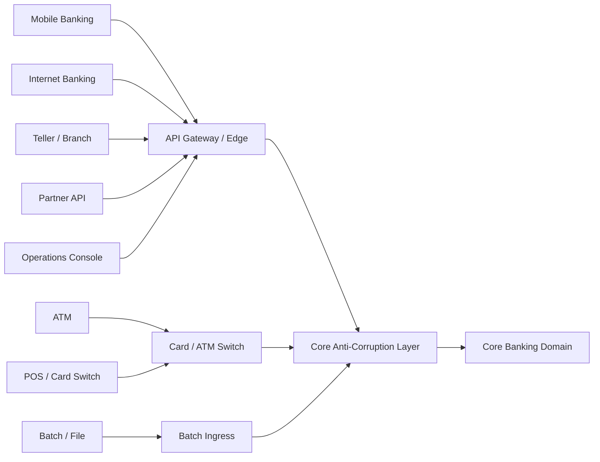
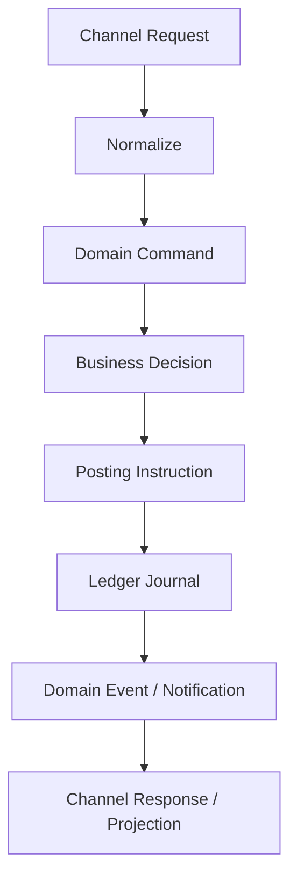
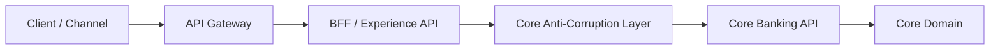
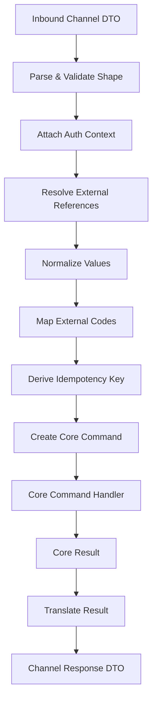
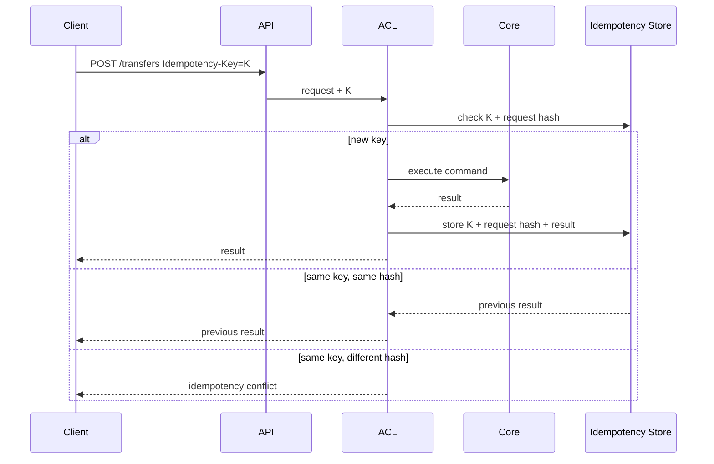
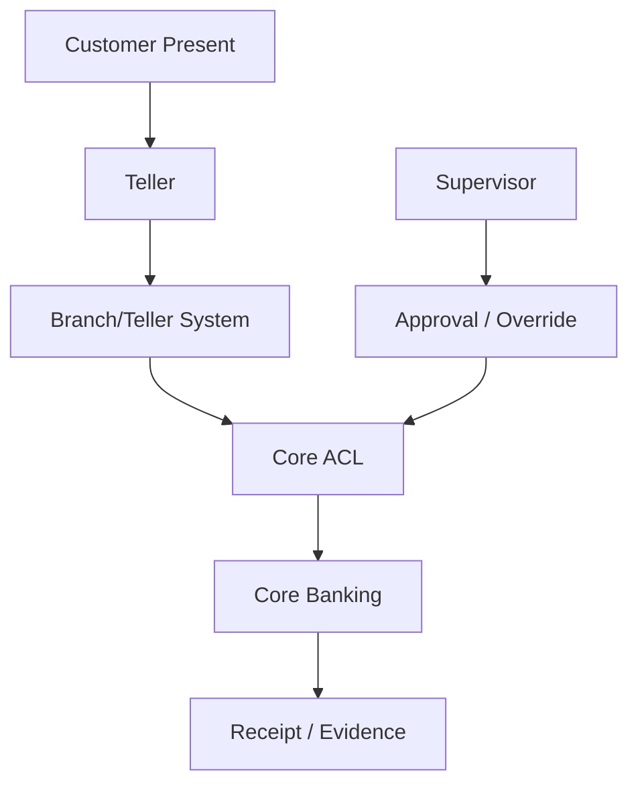
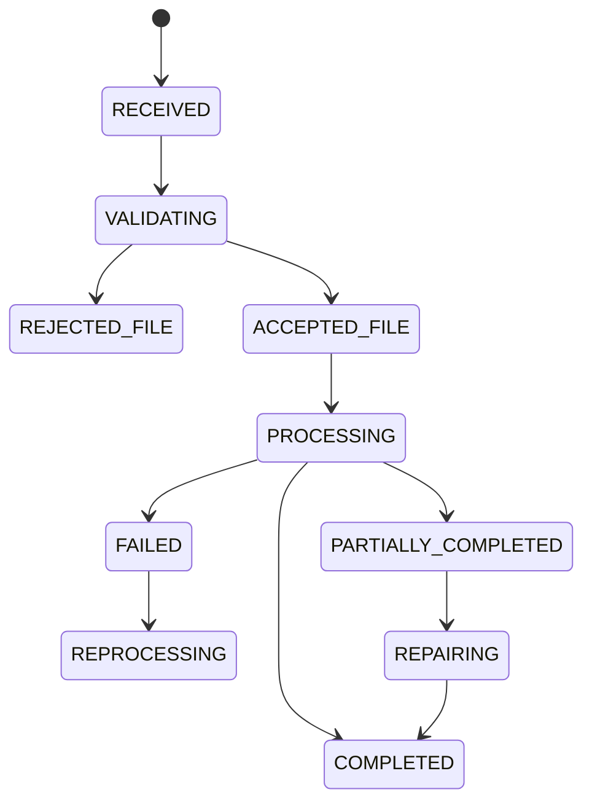
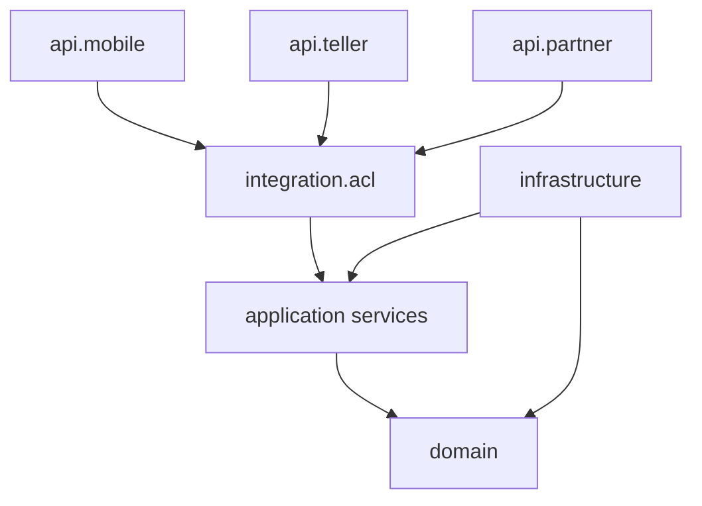
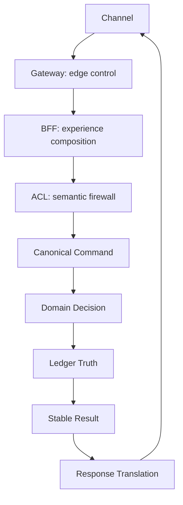

# Part 019 — Channel Integration, API Gateway, and Anti-Corruption Layer

A fragile core banking system treats every channel request as if it were a trusted internal transaction.

A mature core banking system asks:

- Which channel produced this request?
- Is the request an inquiry, command, confirmation, cancellation, repair action, or operational override?
- Which identity is acting: customer, teller, branch officer, partner system, scheduler, or internal operator?
- Which authorization model applies: customer consent, teller role, branch limit, corporate mandate, maker-checker, or system-to-system entitlement?
- Is the request a new business intent, a retry, a duplicate, a status inquiry, or a replay?
- Which fields are channel-specific decoration and which fields are core domain facts?
- What must be normalized before the core sees the command?
- What must never leak from core to channel?
- How will the response be stable across mobile, web, teller, ATM, partner API, and batch channels?

This part is about designing the **boundary** between Java core banking and external/internal channels.

It is not a generic API Gateway tutorial. We already assume you understand REST, HTTP, JSON, authentication, authorization, logging, tracing, and Java web frameworks. Here we focus on banking-specific boundary design.

---

## 1. Kaufman Frame: The Sub-Skill

The sub-skill is:

> Given a channel request, decide how to classify, authenticate, authorize, normalize, validate, deduplicate, route, and translate it into a core banking command without letting channel vocabulary corrupt the core domain model.

Break it down into:

1. Channel taxonomy.
2. Gateway responsibility.
3. Core API responsibility.
4. Anti-corruption layer responsibility.
5. Canonical command model.
6. Idempotency and request identity.
7. Error contract and rejection semantics.
8. Inquiry vs command separation.
9. Teller/branch/ops special cases.
10. Evolution, versioning, and compatibility.

The deliberate-practice goal is not to memorize an API pattern. It is to look at any new channel and know exactly where it belongs.

---

## 2. The Boundary Problem

Core banking is usually touched by many channels:



The mistake is to allow every channel to shape the core model directly.

Examples of corruption:

```java
class Account {
    String mobileAppNickname;
    boolean showInHomeScreen;
    String tellerScreenColor;
    String partnerProductAlias;
}
```

This is not harmless. It creates several failures:

| Failure | Why it is dangerous |
|---|---|
| Channel field leaks into core | Core becomes hard to reuse across channels |
| Channel validation becomes domain validation | Same business rule behaves differently per channel |
| Channel status becomes transaction status | Ledger lifecycle becomes confused with UI lifecycle |
| Channel error text becomes canonical error | Clients parse human text instead of machine-readable reason codes |
| Channel retry becomes duplicate transaction | Customer may be charged or debited twice |
| Channel identity becomes actor identity | Audit trail cannot distinguish app user, device, staff, or service |

Core banking must be protected by an explicit boundary.

---

## 3. Core Principle: Channel Is Not Domain

A channel is a way to express intent.

A domain command is the normalized business intent.

A posting is the ledger effect.

Do not collapse them.



Example:

```json
{
  "screenId": "MOBILE_TRANSFER_V3",
  "fromAccountAlias": "My Savings",
  "toFavoriteId": "fav-8891",
  "amount": "100000.00",
  "currency": "IDR",
  "pinToken": "opaque-token",
  "deviceId": "device-123"
}
```

This is not a core command.

A normalized command looks more like:

```json
{
  "commandId": "cmd_01JY...",
  "idempotencyKey": "mobile:u123:transfer:abc-123",
  "actor": {
    "actorType": "CUSTOMER",
    "partyId": "pty_1001",
    "authenticatedSubject": "sub_abc",
    "channel": "MOBILE"
  },
  "operation": "INTERNAL_TRANSFER",
  "sourceAccountId": "acc_2001",
  "destinationAccountId": "acc_9911",
  "amount": {
    "currency": "IDR",
    "minorUnits": 10000000
  },
  "requestedAt": "2026-06-28T09:10:11+07:00",
  "clientReference": "abc-123",
  "purposeCode": "CUSTOMER_TRANSFER"
}
```

The channel request can be messy. The core command must be stable.

---

## 4. Channel Taxonomy

A core banking boundary must classify channels because different channels have different trust, latency, reversibility, and evidence requirements.

| Channel | Typical actor | Pattern | Risk |
|---|---:|---|---|
| Mobile banking | Customer | synchronous command + async status | duplicate retry, device compromise, social engineering |
| Internet banking | Customer/corporate user | command + approval workflow | corporate mandate, browser/session risk |
| Teller/branch | Staff on behalf of customer | assisted transaction | authority abuse, wrong customer, override misuse |
| ATM | Cardholder/device | authorization + completion/advice | cash dispensed but core outcome unknown |
| POS/card | Cardholder/merchant path | authorization hold + clearing | auth/clearing mismatch, PCI data leakage |
| Partner API | External system | contract-based API | entitlement, rate abuse, semantic mismatch |
| Batch/file | Internal/external processor | bulk command ingestion | partial failure, duplicate file, restartability |
| Operations console | Internal operator | repair/override/correction | high privilege and audit exposure |
| Scheduler/EOD | System actor | batch business process | rerun safety, idempotency, cutoff correctness |

Do not implement channel behavior using `if (channel == ...)` scattered across the core.

Prefer policy objects, adapters, and explicit command metadata.

---

## 5. Gateway, BFF, ACL, and Core: Do Not Mix Them

Many teams confuse four different layers.



### 5.1 API Gateway

The gateway handles edge concerns:

- TLS termination or mutual TLS integration.
- Routing.
- Coarse authentication integration.
- Token validation.
- Rate limiting.
- Request size limits.
- WAF policies.
- Basic request logging.
- Correlation ID propagation.
- Client certificate and partner identity binding.
- Edge-level throttling and quota.

The gateway should not contain ledger rules.

Bad:

```yaml
route: /transfer
preFilter:
  - if amount > availableBalance then reject
```

That looks convenient but is wrong. Balance availability is a core domain decision and may depend on holds, value date, cutoff, overdraft, product rules, restrictions, and account state.

### 5.2 BFF / Experience API

A BFF exists to serve a particular user experience:

- Mobile home screen.
- Account list page.
- Transfer form.
- Teller workspace.
- Corporate approval dashboard.

It may aggregate read models, format labels, hide unavailable actions, and optimize UI payloads.

It should not become the source of banking truth.

### 5.3 Anti-Corruption Layer

The ACL translates between external/channel vocabulary and core vocabulary.

It handles:

- DTO isolation.
- External code mapping.
- Identifier resolution.
- Channel-specific validation that is not core validation.
- Request normalization.
- Error translation.
- Backward compatibility.
- Idempotency key derivation.
- Evidence enrichment.

### 5.4 Core API

The core API receives stable domain commands and queries.

It owns:

- Account state rules.
- Product rules.
- Posting eligibility.
- Funds availability.
- Ledger commit.
- Business rejection reasons.
- Audit event.
- Domain event.

---

## 6. Anti-Corruption Layer Responsibilities

The ACL is not merely a mapper.

It is a **semantic firewall**.



### 6.1 DTO isolation

Never expose internal domain objects as public API payloads.

Bad:

```java
@RestController
class AccountController {
    @GetMapping("/accounts/{id}")
    Account getAccount(@PathVariable String id) {
        return accountRepository.find(id);
    }
}
```

Better:

```java
record AccountSummaryResponse(
        String accountId,
        String displayName,
        String productName,
        MoneyView ledgerBalance,
        MoneyView availableBalance,
        List<String> allowedActions,
        String status
) {}
```

Internal fields such as GL mapping, restriction details, risk marker, legal hold reason, account version, and operational notes should not leak by default.

### 6.2 Identifier resolution

Channels often know aliases, favorites, masked numbers, QR references, proxy IDs, or partner references.

The core should operate on stable internal identifiers.

```java
interface AccountReferenceResolver {
    AccountId resolve(AccountReference reference, ActorContext actorContext);
}

sealed interface AccountReference permits AccountIdRef, AccountNumberRef, AliasRef, PartnerRef {
}

record AccountIdRef(String accountId) implements AccountReference {}
record AccountNumberRef(String accountNumber) implements AccountReference {}
record AliasRef(String alias) implements AccountReference {}
record PartnerRef(String partnerCode, String externalAccountRef) implements AccountReference {}
```

Resolution is not always a simple lookup. It can involve entitlement checks:

- Is the actor allowed to see this account?
- Is the account linked to this customer?
- Is the teller assigned to this branch?
- Is this partner allowed to initiate this operation?
- Has corporate user approval scope been satisfied?

### 6.3 Code mapping

External systems use their own codes.

Examples:

| External field | Core field |
|---|---|
| `txnType = TRF_01` | `operation = INTERNAL_TRANSFER` |
| `channel = MBK` | `channel = MOBILE_BANKING` |
| `acctStatus = 01` | `accountStatus = ACTIVE` |
| `paymentPurpose = 1001` | `purposeCode = SALARY` |

Code mapping must be versioned, tested, and observable.

Do not bury it in string comparisons.

```java
final class ExternalCodeMapper {
    private final Map<ExternalCodeKey, CoreCode> mapping;

    CoreCode map(ExternalCodeKey key) {
        CoreCode code = mapping.get(key);
        if (code == null) {
            throw new UnknownExternalCodeException(key);
        }
        return code;
    }
}
```

### 6.4 Request normalization

Normalize before core validation:

- Trim/normalize text where allowed.
- Convert decimal amount to minor units.
- Validate currency exponent.
- Resolve timezone.
- Attach business date.
- Convert channel timestamp to received timestamp plus client timestamp.
- Convert external references to internal references.
- Convert optional UI flags to explicit command attributes.

The goal is not to make invalid data valid. The goal is to ensure the core receives a stable semantic object.

---

## 7. Canonical Command Envelope

A canonical command envelope should make causality and evidence explicit.

```java
record BankingCommandEnvelope<T>(
        CommandId commandId,
        IdempotencyKey idempotencyKey,
        CorrelationId correlationId,
        CausationId causationId,
        ActorContext actor,
        ChannelContext channel,
        BusinessDate businessDate,
        Instant receivedAt,
        T command
) {}
```

### 7.1 Actor context

```java
record ActorContext(
        ActorType type,
        String subjectId,
        PartyId partyId,
        StaffId staffId,
        ServiceClientId serviceClientId,
        Set<String> entitlements,
        AuthenticationStrength authenticationStrength
) {}
```

Possible actor types:

```java
enum ActorType {
    CUSTOMER,
    CORPORATE_USER,
    STAFF,
    PARTNER_SYSTEM,
    INTERNAL_SYSTEM,
    BATCH_PROCESS,
    REPAIR_OPERATOR
}
```

### 7.2 Channel context

```java
record ChannelContext(
        Channel channel,
        String clientApplication,
        String clientVersion,
        String deviceId,
        String ipAddress,
        String partnerId,
        String branchId,
        String terminalId
) {}
```

Avoid forcing every channel to populate every field. Use typed sub-contexts where necessary.

```java
sealed interface ChannelEvidence permits MobileEvidence, TellerEvidence, PartnerEvidence, BatchEvidence {
}

record MobileEvidence(String deviceId, String appVersion, String riskSessionId) implements ChannelEvidence {}
record TellerEvidence(String branchId, String workstationId, String supervisorId) implements ChannelEvidence {}
record PartnerEvidence(String partnerId, String clientCertificateFingerprint) implements ChannelEvidence {}
record BatchEvidence(String fileId, int lineNumber, String fileHash) implements ChannelEvidence {}
```

---

## 8. Inquiry vs Command

Core banking APIs must distinguish inquiries from commands.

| Type | Example | Ledger effect | Idempotency need |
|---|---|---:|---|
| Inquiry | get account balance | no | low, cache semantics matter |
| Simulation | quote transfer fee | no ledger effect | medium, traceability useful |
| Command | perform transfer | yes/maybe | mandatory |
| Status inquiry | check transfer status | no new effect | correlation/idempotency reference |
| Repair action | release stuck payment | yes/maybe | mandatory + approval |
| Override | allow blocked operation | yes/maybe | mandatory + strong audit |

Do not implement a mutating operation as `GET` because it is easier for a client.

Bad:

```http
GET /api/transfer?from=123&to=456&amount=100000
```

Better:

```http
POST /api/transfers
Idempotency-Key: mobile:u123:20260628:abc123
```

---

## 9. Command API Shape

A good channel-facing transfer API might look like this:

```http
POST /v1/transfers/internal
Idempotency-Key: 01JYWRFJ9SB61KQCNFD44V4H3V
X-Correlation-Id: corr-01JYWRFJ...
Content-Type: application/json
```

```json
{
  "fromAccountRef": {
    "type": "ACCOUNT_ID",
    "value": "acc_1001"
  },
  "toAccountRef": {
    "type": "FAVORITE_ID",
    "value": "fav_8891"
  },
  "amount": {
    "currency": "IDR",
    "value": "100000.00"
  },
  "clientReference": "mobile-submit-881",
  "remark": "Lunch reimbursement"
}
```

The core command after ACL normalization:

```java
record InternalTransferCommand(
        AccountId sourceAccountId,
        AccountId destinationAccountId,
        Money amount,
        TransferPurpose purpose,
        String clientReference,
        String remark
) {}
```

The command handler should not care that `toAccountRef` was a favorite ID.

---

## 10. Response API Shape

A channel response should be stable, not overly internal.

```json
{
  "transactionId": "txn_01JYWRN3...",
  "status": "ACCEPTED",
  "submittedAt": "2026-06-28T09:10:11+07:00",
  "businessDate": "2026-06-28",
  "amount": {
    "currency": "IDR",
    "value": "100000.00"
  },
  "sourceAccount": {
    "accountId": "acc_1001",
    "displayName": "Main Savings"
  },
  "destinationAccount": {
    "accountId": "acc_9911",
    "displayName": "Rina"
  },
  "receipt": {
    "reference": "RCPT-20260628-0001991"
  }
}
```

Do not expose:

- Journal entry ID unless explicitly needed.
- GL account ID.
- Suspense account.
- Internal posting rule ID.
- Internal fraud score.
- Stack trace.
- Database key.
- Lock version.
- Sensitive restriction reason.

---

## 11. Error Contract for Banking APIs

A banking API must distinguish **business rejection** from **technical failure**.

| Category | Example | Retriable? | Customer wording |
|---|---|---:|---|
| Validation error | invalid amount format | no | fix input |
| Business rejection | insufficient available balance | no, unless state changes | explain outcome |
| Authorization rejection | actor cannot access account | no | generic/safe |
| Duplicate request | same idempotency key | return original result | same result |
| Pending/unknown | downstream outcome unknown | status inquiry required | processing |
| Technical failure | database unavailable | maybe | try later/status |

Use a machine-readable error body.

RFC 9457 defines Problem Details for HTTP APIs and obsoletes RFC 7807. In practice, you can extend problem details with bank-specific fields such as `errorCode`, `businessReason`, `correlationId`, and `retryable`, but avoid leaking sensitive data.

Example:

```json
{
  "type": "https://api.bank.example/problems/insufficient-available-balance",
  "title": "Transfer cannot be completed",
  "status": 422,
  "detail": "The source account does not have enough available balance for this transfer.",
  "instance": "/v1/transfers/internal/txn_01JYWRN3",
  "errorCode": "CB-TRANSFER-INSUFFICIENT_AVAILABLE_BALANCE",
  "retryable": false,
  "correlationId": "corr-01JYWRFJ"
}
```

Important: do not let the HTTP status become your business status.

A transfer can return `202 Accepted` and still later become `REJECTED` by a payment rail.

---

## 12. Idempotency at the Channel Boundary

Every mutating command must have an idempotency strategy.



The idempotency record should include:

| Field | Purpose |
|---|---|
| idempotency key | client retry identity |
| request hash | detect key reuse with different payload |
| actor identity | prevent cross-user replay |
| operation type | prevent key reuse across operations |
| first seen timestamp | evidence and retention |
| result reference | return original result |
| expiry policy | storage control |

### 12.1 Idempotency key scope

Bad:

```txt
12345
```

Better:

```txt
mobile:customer-001:internal-transfer:01JYWRFJ9SB61KQCNFD44V4H3V
```

Scope the key to actor + operation + channel, or enforce that in the idempotency store.

### 12.2 Idempotency and unknown outcome

If the system commits the ledger but fails before returning the HTTP response, a client retry must not create another ledger transaction.

The second request must find the previous result.

This is why idempotency must be persisted transactionally near command execution, not kept only in gateway memory.

---

## 13. Partner API Boundary

Partner APIs are dangerous because partner terminology often becomes internal terminology.

Example partner fields:

```json
{
  "wallet_id": "W123",
  "bank_code": "XYZ",
  "account_no": "001009991",
  "operation": "cashout",
  "reference_no": "P-100-200"
}
```

Do not create core operations named after partner verbs unless they are true domain concepts.

`cashout` may map to:

- internal transfer,
- external outgoing transfer,
- merchant settlement debit,
- wallet redemption,
- cardless ATM withdrawal,
- escrow release.

The ACL must map partner intent into core command explicitly.

```java
record PartnerOperationMapping(
        PartnerId partnerId,
        String externalOperation,
        CoreOperation coreOperation,
        ProductConstraint productConstraint,
        AccountingScenario accountingScenario
) {}
```

Partner APIs need strong controls:

- mTLS or equivalent system authentication.
- Signed request or replay protection where required.
- Partner entitlement per operation.
- Per-partner limits.
- Per-partner idempotency namespace.
- Contract versioning.
- Safe error translation.
- Operational dashboard.
- Settlement and reconciliation report.

---

## 14. Teller and Branch Boundary

Teller operations are not just customer operations through a different UI.

They introduce assisted-service semantics:



A teller command should include:

- staff actor,
- represented customer,
- branch,
- terminal/workstation,
- cash drawer where relevant,
- supervisor approval where relevant,
- reason code,
- evidence of customer presence or instruction,
- override reason if any.

Example:

```java
record AssistedTransferCommand(
        StaffId tellerId,
        PartyId representedCustomerId,
        BranchId branchId,
        WorkstationId workstationId,
        AccountId sourceAccountId,
        AccountId destinationAccountId,
        Money amount,
        Optional<ApprovalId> supervisorApprovalId,
        ReasonCode reasonCode
) {}
```

Do not reuse the customer mobile transfer command and merely set `channel = TELLER`.

That loses authority semantics.

---

## 15. Batch/File Boundary

Batch integration has unique failure modes:

- Same file submitted twice.
- Same line appears in different files.
- Partial file accepted.
- File parsed successfully but some records rejected.
- Batch restarted after crash.
- Cutoff crossed during processing.
- File total does not match line total.
- Trailer count does not match parsed count.
- Processing order matters.

Model batch ingestion explicitly.



Each line should become a command with its own idempotency identity.

```java
record BatchLineCommand<T>(
        BatchFileId fileId,
        int lineNumber,
        String lineHash,
        IdempotencyKey idempotencyKey,
        T command
) {}
```

Never treat a batch as one giant transaction unless the business explicitly requires all-or-nothing behavior and the volume permits it.

---

## 16. API Versioning

Core banking APIs must evolve without breaking channels.

### 16.1 Version the contract, not the database

Do not expose database schema as API shape.

```http
GET /v1/accounts/{accountId}
GET /v2/accounts/{accountId}
```

Versioning may be needed when:

- response field meaning changes,
- required field is added,
- status enum changes,
- error code semantics changes,
- monetary rounding policy changes,
- workflow changes from sync to async,
- operation splits into multiple operation types.

Versioning is not needed for every additive internal field.

### 16.2 Compatibility table

Maintain a compatibility matrix:

| Contract version | Channel | Supported until | Notes |
|---|---|---:|---|
| v1 transfer | mobile 4.x | 2026-12-31 | no purpose code |
| v2 transfer | mobile 5.x | active | supports purpose code |
| v3 transfer | partner corporate | pilot | async accepted status |

### 16.3 Consumer-driven contract tests

For every channel, maintain contract tests:

- request shape,
- response shape,
- error shape,
- idempotency behavior,
- status transitions,
- optional/required fields,
- backward compatibility.

---

## 17. Read APIs and Projection Boundary

Not every read should hit the ledger directly.


Typical read models:

- account summary,
- transaction list,
- statement view,
- transfer history,
- available actions,
- customer dashboard,
- teller customer 360,
- corporate approval queue.

The read model must clearly state freshness.

Example response:

```json
{
  "accountId": "acc_1001",
  "availableBalance": {
    "currency": "IDR",
    "value": "2500000.00"
  },
  "asOf": "2026-06-28T09:10:13+07:00",
  "freshness": "REAL_TIME"
}
```

For a high-risk operation, re-check critical state in the command path. Do not trust a cached read projection to authorize a debit.

---

## 18. Available Actions API

A good user experience often wants to know what actions are allowed.

Example:

```http
GET /v1/accounts/{accountId}/available-actions
```

Response:

```json
{
  "accountId": "acc_1001",
  "actions": [
    {
      "type": "INTERNAL_TRANSFER",
      "available": true
    },
    {
      "type": "EXTERNAL_TRANSFER",
      "available": false,
      "reasonCode": "ACCOUNT_REQUIRES_KYC_REFRESH"
    }
  ]
}
```

But this is advisory.

A command must still validate again because the account state can change between read and submit.

---

## 19. Authorization: Edge vs Domain

A gateway can validate tokens, but it cannot fully authorize banking operations.

| Authorization layer | Question |
|---|---|
| Gateway | Is the caller authenticated? Is token valid? Is client allowed to call this route? |
| ACL | Can this actor refer to these external identifiers? |
| Core domain | Is this actor allowed to perform this operation on this account under product/account/business rules? |
| Workflow/control | Does this operation require maker-checker, supervisor approval, or limit approval? |

Example:

A customer may authenticate successfully but still cannot transfer from an account because:

- account is not linked to the customer,
- account requires joint authorization,
- account is blocked,
- transfer exceeds daily limit,
- product does not allow debit,
- KYC refresh is required,
- fraud/AML hold exists,
- business date is closed.

Keep authorization layered.

---

## 20. Safe Observability at the Boundary

Every request should carry correlation.

```http
X-Correlation-Id: corr-01JYWRFJ
Traceparent: 00-...
```

Boundary logs should answer:

- who called,
- which channel,
- which operation,
- which correlation ID,
- which idempotency key hash,
- which command ID,
- accepted/rejected/pending,
- reason code,
- latency,
- downstream dependency status.

Do not log:

- full PAN/card number,
- PIN/token secrets,
- password/OTP,
- full identity document number unless explicitly allowed and masked,
- sensitive free-form customer remark without policy,
- raw request bodies by default.

A safe structured log:

```json
{
  "event": "banking.command.accepted",
  "operation": "INTERNAL_TRANSFER",
  "channel": "MOBILE",
  "actorType": "CUSTOMER",
  "partyIdHash": "sha256:...",
  "commandId": "cmd_01JYWRFJ",
  "transactionId": "txn_01JYWRN3",
  "idempotencyKeyHash": "sha256:...",
  "correlationId": "corr-01JYWRFJ",
  "businessDate": "2026-06-28",
  "latencyMs": 87
}
```

---

## 21. Java Package Structure

A clean Java boundary can look like this:

```txt
com.bank.corebanking
  account
    domain
    application
    infrastructure
  transfer
    domain
    application
    infrastructure
  api
    core
      command
      query
      problem
    mobile
      dto
      mapper
      controller
    teller
      dto
      mapper
      controller
    partner
      dto
      mapper
      controller
  integration
    acl
      AccountReferenceResolver.java
      ExternalCodeMapper.java
      IdempotencyBoundaryService.java
      CommandNormalizer.java
```

The key is dependency direction.



Domain should not depend on mobile DTOs, REST controllers, or partner codes.

---

## 22. Java Example: Transfer Boundary

### 22.1 Channel DTO

```java
package com.bank.corebanking.api.mobile.dto;

public record MobileTransferRequest(
        AccountRefDto fromAccount,
        AccountRefDto toAccount,
        String amount,
        String currency,
        String clientReference,
        String remark
) {}

public record AccountRefDto(
        String type,
        String value
) {}
```

### 22.2 Core command

```java
package com.bank.corebanking.transfer.application;

public record InternalTransferCommand(
        AccountId sourceAccountId,
        AccountId destinationAccountId,
        Money amount,
        String clientReference,
        String remark
) {}
```

### 22.3 Mapper/normalizer

```java
package com.bank.corebanking.integration.acl;

public final class MobileTransferCommandNormalizer {

    private final AccountReferenceResolver accountReferenceResolver;
    private final MoneyParser moneyParser;

    public BankingCommandEnvelope<InternalTransferCommand> normalize(
            MobileTransferRequest request,
            BoundaryRequestContext context
    ) {
        AccountId source = accountReferenceResolver.resolve(
                toReference(request.fromAccount()),
                context.actor()
        );

        AccountId destination = accountReferenceResolver.resolve(
                toReference(request.toAccount()),
                context.actor()
        );

        Money amount = moneyParser.parse(request.currency(), request.amount());

        InternalTransferCommand command = new InternalTransferCommand(
                source,
                destination,
                amount,
                request.clientReference(),
                request.remark()
        );

        return new BankingCommandEnvelope<>(
                CommandId.newId(),
                context.idempotencyKey(),
                context.correlationId(),
                context.causationId(),
                context.actor(),
                context.channel(),
                context.businessDate(),
                context.receivedAt(),
                command
        );
    }

    private AccountReference toReference(AccountRefDto dto) {
        return switch (dto.type()) {
            case "ACCOUNT_ID" -> new AccountIdRef(dto.value());
            case "ALIAS" -> new AliasRef(dto.value());
            case "FAVORITE_ID" -> new FavoriteRef(dto.value());
            default -> throw new InvalidAccountReferenceTypeException(dto.type());
        };
    }
}
```

### 22.4 Controller

```java
@RestController
@RequestMapping("/v1/mobile/transfers")
final class MobileTransferController {

    private final MobileTransferCommandNormalizer normalizer;
    private final InternalTransferUseCase internalTransferUseCase;
    private final ProblemResponseMapper problemResponseMapper;

    @PostMapping("/internal")
    ResponseEntity<?> transfer(
            @RequestHeader("Idempotency-Key") String idempotencyKey,
            @RequestHeader(value = "X-Correlation-Id", required = false) String correlationId,
            @RequestBody MobileTransferRequest request
    ) {
        BoundaryRequestContext context = BoundaryRequestContext.fromHttp(
                idempotencyKey,
                correlationId,
                Channel.MOBILE
        );

        try {
            BankingCommandEnvelope<InternalTransferCommand> command =
                    normalizer.normalize(request, context);

            TransferResult result = internalTransferUseCase.execute(command);
            return ResponseEntity.accepted().body(MobileTransferResponse.from(result));
        } catch (BankingProblem problem) {
            return problemResponseMapper.toResponse(problem);
        }
    }
}
```

The controller stays thin. The normalizer protects the core. The use case owns business execution.

---

## 23. Anti-Patterns

### 23.1 One API to rule them all

```http
POST /api/doTransaction
```

With payload:

```json
{
  "transactionType": "anything",
  "field1": "...",
  "field2": "..."
}
```

This creates an untyped integration swamp.

### 23.2 Channel-specific flags in core

```java
if (channel.equals("MOBILE") && screenVersion.equals("5.2")) {
    waiveFee = true;
}
```

Use product/pricing policy, campaign, or channel policy objects.

### 23.3 API gateway as business engine

The gateway should not decide ledger eligibility.

### 23.4 Leaking internal status

Bad response:

```json
{
  "status": "POSTING_BATCH_LINE_COMMITTED_GL_EXTRACT_PENDING"
}
```

A channel probably needs:

```json
{
  "status": "PROCESSING"
}
```

### 23.5 Business errors as plain text

Bad:

```json
{
  "message": "oops balance not enough"
}
```

Good:

```json
{
  "errorCode": "CB-TRANSFER-INSUFFICIENT_AVAILABLE_BALANCE",
  "retryable": false
}
```

### 23.6 No idempotency for commands

This is unacceptable in banking.

### 23.7 Treating status inquiry as retry

A status inquiry should not re-execute the command.

---

## 24. Design Review Checklist

Use this checklist for every new channel/API.

### Channel classification

- [ ] Which channel is this?
- [ ] Who is the actor?
- [ ] Is the actor acting for self, customer, partner, or system?
- [ ] Is this an inquiry, simulation, command, repair action, or override?

### Boundary design

- [ ] Are channel DTOs isolated from domain objects?
- [ ] Is identifier resolution explicit?
- [ ] Is code mapping versioned and tested?
- [ ] Is command normalization deterministic?
- [ ] Is idempotency mandatory for mutating operations?

### Authorization

- [ ] Is authentication handled at edge?
- [ ] Is entitlement checked at ACL or application layer?
- [ ] Are product/account/domain rules checked in core?
- [ ] Are maker-checker or approval requirements modeled explicitly?

### Error contract

- [ ] Are business rejections distinct from technical failures?
- [ ] Are error codes stable and machine-readable?
- [ ] Is sensitive detail suppressed?
- [ ] Is retryability explicit?

### Observability

- [ ] Is correlation ID propagated?
- [ ] Is idempotency key hashed in logs?
- [ ] Is actor/channel/operation visible?
- [ ] Are sensitive fields masked?

### Evolution

- [ ] Is API versioning strategy clear?
- [ ] Are contract tests in place?
- [ ] Is deprecation policy documented?

---

## 25. Practice: Refactor a Bad Channel API

Given this API:

```http
POST /banking/action
```

```json
{
  "user": "u1",
  "screen": "transfer-screen",
  "action": "send_money",
  "from": "Main Account",
  "to": "Rina",
  "amount": "100k",
  "pin": "123456"
}
```

Refactor it.

Expected direction:

1. Remove PIN from API body; use authentication/authorization token flow.
2. Introduce typed endpoint: `/v1/transfers/internal`.
3. Use structured account references.
4. Use structured money.
5. Require idempotency key.
6. Resolve aliases/favorites in ACL.
7. Normalize into `InternalTransferCommand`.
8. Return stable transaction result.
9. Use machine-readable error response.
10. Do not expose internal posting details.

---

## 26. Mental Model Summary

A channel is a presentation and interaction surface.

The gateway is an edge-control component.

The BFF is an experience component.

The ACL is a semantic firewall.

The core API receives normalized business commands.

The domain decides business truth.

The ledger records financial truth.



If you keep this separation, adding a new channel is mostly integration work.

If you do not, every new channel becomes a new banking system.

---

## 27. References

- BIAN Service Landscape and implementation examples for banking service domain/API separation.
- RFC 9457 — Problem Details for HTTP APIs.
- ISO 20022 message definitions and external code sets for payment boundary mapping.
- OpenTelemetry documentation for trace, metric, and log correlation.
- Enterprise Integration Patterns and transactional boundary patterns for reliable integration.

---

## 28. What Comes Next

Part 020 builds on this boundary and asks a harder question:

> How can a core banking system use events, outbox, streams, projections, and downstream integrations without letting event-driven architecture weaken ledger correctness?
