# Part 020 — Event-Driven Core Banking Without Breaking Ledger Truth

Event-driven architecture is powerful in banking.

It is also dangerous.

A weak implementation says:

```java
kafka.send("account-debited", event);
```

A mature core banking system asks:

- Is this an accounting event, domain event, integration event, notification event, audit event, or telemetry event?
- Has the ledger already committed?
- Is the event derived from immutable financial truth or from a temporary workflow state?
- Can the event be replayed safely?
- Can a consumer process it twice?
- Does ordering matter globally, per account, per transaction, or per aggregate?
- Is the event allowed to drive another posting?
- Is this event a command disguised as an event?
- What happens if the database commit succeeds but event publication fails?
- What happens if event publication succeeds but the consumer fails?
- What is the correction model if the event was wrong?

This part is about using event-driven design in Java core banking **without weakening ledger correctness**.

---

## 1. Kaufman Frame: The Sub-Skill

The sub-skill is:

> Given a banking state change, decide whether to emit an event, what kind of event it is, how it relates to ledger truth, how it is published reliably, and how downstream consumers can process it safely without creating financial inconsistency.

Break it down into:

1. Event taxonomy.
2. Ledger truth vs event notification.
3. Event naming and schema design.
4. Transactional outbox.
5. Ordering and partitioning.
6. Idempotent consumers.
7. Projections and read models.
8. Replay and correction.
9. Event-driven integration boundaries.
10. Anti-patterns and review checklist.

The goal is not to become excited about streams. The goal is to know where streams are safe and where they are not.

---

## 2. Core Principle: Ledger First, Events After

In core banking, the ledger is the financial truth.

Events are evidence, integration signals, or derived notifications.

They are not a substitute for ledger correctness.

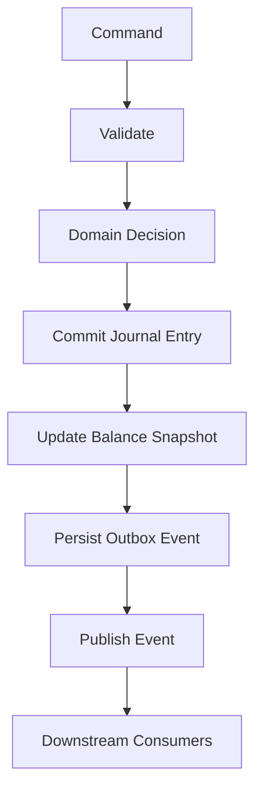

The safest default:

> If an event claims that money moved, it must be derived from a committed ledger transaction.

Do not publish `MoneyTransferred` before the ledger commit and hope the ledger later succeeds.

---

## 3. Event Taxonomy

Not every event means the same thing.

| Event type | Example | Source of truth | Can drive posting? |
|---|---|---|---:|
| Accounting event | `CashDepositAccepted` | domain decision before journal | yes, inside posting pipeline |
| Ledger event | `JournalEntryPosted` | committed journal | usually no; it is fact/evidence |
| Domain event | `AccountBlocked` | domain aggregate | maybe, if modeled explicitly |
| Integration event | `TransferAcceptedForSettlement` | application boundary | downstream only |
| Notification event | `CustomerTransferReceiptReady` | projection/application | no |
| Audit event | `SupervisorOverrideApproved` | control workflow | no direct posting |
| Telemetry event | latency/error metric/log/span | runtime | no |
| Workflow event | `RepairCaseAssigned` | operations workflow | no, unless command is later executed |

The most common failure is using one vague event type for all of these.

Bad:

```json
{
  "eventType": "TRANSACTION_EVENT",
  "status": "SUCCESS",
  "amount": "100000"
}
```

Better:

```json
{
  "eventType": "JournalEntryPosted",
  "eventVersion": 1,
  "journalEntryId": "jrnl_01JYW...",
  "transactionId": "txn_01JYW...",
  "businessDate": "2026-06-28",
  "postedAt": "2026-06-28T09:10:12+07:00"
}
```

---

## 4. Accounting Event vs Ledger Event

This distinction matters.

An **accounting event** expresses a business occurrence that should create accounting impact.

Examples:

- customer deposits cash,
- customer withdraws cash,
- fee charged,
- interest accrued,
- loan repayment received,
- payment returned,
- card clearing received.

A **ledger event** expresses that the journal has been committed.

Examples:

- journal entry posted,
- posting batch committed,
- balance snapshot updated,
- GL extract produced.

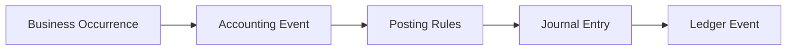

Do not let external consumers publish accounting events directly into your ledger unless they are going through the same validation, authorization, idempotency, and posting controls as commands.

---

## 5. Domain Events Are Not Always Integration Events

Inside the domain model, a domain event may be small and precise:

```java
record AccountBlocked(
        AccountId accountId,
        RestrictionId restrictionId,
        RestrictionReason reason
) implements DomainEvent {}
```

But an external integration event may need a stable public contract:

```json
{
  "eventId": "evt_01JY...",
  "eventType": "AccountRestrictionChanged",
  "eventVersion": 2,
  "occurredAt": "2026-06-28T09:10:12+07:00",
  "accountId": "acc_1001",
  "restrictionStatus": "BLOCKED_FOR_DEBIT",
  "effectiveFrom": "2026-06-28T09:10:12+07:00",
  "reasonCategory": "COMPLIANCE_HOLD"
}
```

The external event may intentionally hide internal detail.

Do not expose:

- internal risk score,
- confidential investigation reason,
- staff note,
- raw regulatory alert,
- internal workflow IDs unless contractually required.

---

## 6. Event Naming

Use past-tense names for facts.

Good:

- `JournalEntryPosted`
- `AccountBlocked`
- `TransferAccepted`
- `PaymentReturned`
- `FeeCharged`
- `InterestAccrued`
- `StatementGenerated`

Suspicious:

- `PostJournalEntry`
- `CreateTransfer`
- `DoPayment`
- `UpdateAccount`

Those are commands disguised as events.

### 6.1 Event naming rule

Ask:

> Has this thing already happened?

If no, it is probably a command.

---

## 7. Event Envelope

Every integration event needs a stable envelope.

```java
public record IntegrationEvent<T>(
        EventId eventId,
        String eventType,
        int eventVersion,
        Instant occurredAt,
        Instant publishedAt,
        CorrelationId correlationId,
        CausationId causationId,
        BusinessDate businessDate,
        SourceSystem sourceSystem,
        T payload
) {}
```

For banking, add financial correlation carefully:

```java
public record BankingEventEnvelope<T>(
        EventId eventId,
        String eventType,
        int eventVersion,
        Instant occurredAt,
        CorrelationId correlationId,
        CausationId causationId,
        BusinessDate businessDate,
        TransactionId transactionId,
        Optional<JournalEntryId> journalEntryId,
        SourceSystem sourceSystem,
        T payload
) {}
```

The envelope supports:

- idempotency,
- tracing,
- replay,
- audit,
- ordering analysis,
- consumer debugging,
- lineage.

---

## 8. Event Payload Design

A stable event payload should be sufficient for consumers but not overloaded.

Example `JournalEntryPosted`:

```json
{
  "eventId": "evt_01JYWRN3",
  "eventType": "JournalEntryPosted",
  "eventVersion": 1,
  "occurredAt": "2026-06-28T09:10:12+07:00",
  "businessDate": "2026-06-28",
  "correlationId": "corr_01JYWRFJ",
  "causationId": "cmd_01JYWRFJ",
  "transactionId": "txn_01JYWRN3",
  "journalEntryId": "jrnl_01JYWRN3",
  "payload": {
    "accountingScenario": "INTERNAL_TRANSFER",
    "currency": "IDR",
    "totalDebitMinorUnits": 10000000,
    "totalCreditMinorUnits": 10000000,
    "postingDate": "2026-06-28",
    "valueDate": "2026-06-28"
  }
}
```

Should it include posting lines?

Depends.

| Consumer need | Event design |
|---|---|
| Notification only | no posting lines |
| Statement projection | include statement-relevant lines or provide query link |
| GL downstream | include accounting extract event, not generic customer event |
| Risk analytics | include normalized features with privacy controls |
| Audit archive | include immutable reference and evidence link |

Do not create one giant event for every consumer.

---

## 9. Transactional Outbox

The classic dual-write problem:

```java
ledgerRepository.save(journalEntry);
kafkaTemplate.send("journal-posted", event);
```

Failure cases:

| DB commit | Kafka publish | Result |
|---:|---:|---|
| fail | fail | no issue, request fails |
| fail | success | event says money moved but ledger did not commit |
| success | fail | ledger moved but downstream never knows |
| success | unknown | retry may duplicate |

The transactional outbox pattern solves the core version of this problem by writing the business state and event record in the same database transaction.

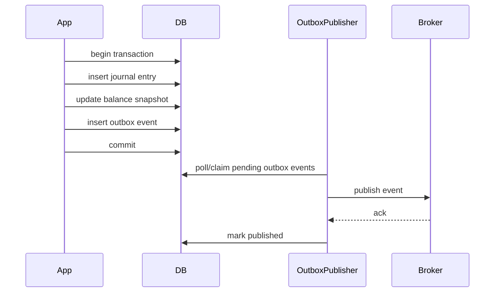

The outbox table is not a queue replacement. It is a reliability bridge.

---

## 10. Outbox Table Design

Example schema:

```sql
CREATE TABLE banking_outbox_event (
    event_id              VARCHAR(64) PRIMARY KEY,
    aggregate_type        VARCHAR(64) NOT NULL,
    aggregate_id          VARCHAR(64) NOT NULL,
    event_type            VARCHAR(128) NOT NULL,
    event_version         INTEGER NOT NULL,
    business_date         DATE NOT NULL,
    correlation_id        VARCHAR(128) NOT NULL,
    causation_id          VARCHAR(128) NOT NULL,
    partition_key         VARCHAR(128) NOT NULL,
    payload_json          JSONB NOT NULL,
    headers_json          JSONB NOT NULL,
    status                VARCHAR(32) NOT NULL,
    available_at          TIMESTAMP WITH TIME ZONE NOT NULL,
    claimed_by            VARCHAR(128),
    claimed_at            TIMESTAMP WITH TIME ZONE,
    published_at          TIMESTAMP WITH TIME ZONE,
    attempt_count         INTEGER NOT NULL DEFAULT 0,
    last_error            TEXT,
    created_at            TIMESTAMP WITH TIME ZONE NOT NULL
);

CREATE INDEX idx_outbox_pending
    ON banking_outbox_event(status, available_at, created_at);

CREATE INDEX idx_outbox_aggregate
    ON banking_outbox_event(aggregate_type, aggregate_id, created_at);
```

### 10.1 Status model

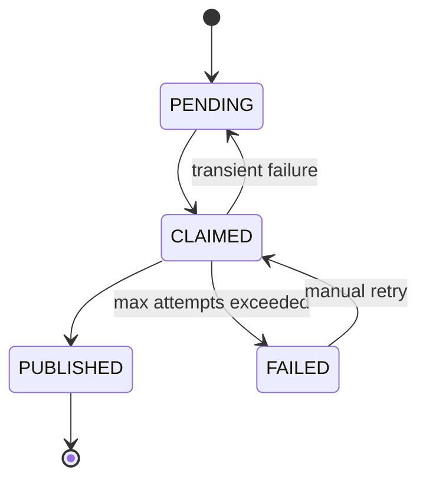

### 10.2 Claiming safely

A publisher should claim rows atomically.

Pseudo-SQL:

```sql
UPDATE banking_outbox_event
SET status = 'CLAIMED',
    claimed_by = :publisherId,
    claimed_at = now(),
    attempt_count = attempt_count + 1
WHERE event_id IN (
    SELECT event_id
    FROM banking_outbox_event
    WHERE status = 'PENDING'
      AND available_at <= now()
    ORDER BY created_at
    LIMIT :batchSize
    FOR UPDATE SKIP LOCKED
)
RETURNING *;
```

Exact SQL differs by database, but the idea is stable:

- avoid two publishers claiming the same row,
- process in batches,
- keep retry metadata,
- make publication observable.

---

## 11. Java Outbox Example

### 11.1 Event record

```java
record OutboxEvent(
        EventId eventId,
        String aggregateType,
        String aggregateId,
        String eventType,
        int eventVersion,
        BusinessDate businessDate,
        CorrelationId correlationId,
        CausationId causationId,
        String partitionKey,
        String payloadJson,
        Map<String, String> headers
) {}
```

### 11.2 Writing outbox inside command transaction

```java
@Transactional
public TransferResult execute(BankingCommandEnvelope<InternalTransferCommand> envelope) {
    PostingDecision decision = transferPolicy.decide(envelope.command(), envelope.actor());

    JournalEntry journalEntry = postingEngine.post(decision.toPostingInstruction());

    TransferAcceptedEvent event = TransferAcceptedEvent.from(journalEntry, envelope);

    outboxRepository.insert(OutboxEventFactory.from(
            event,
            "Account",
            envelope.command().sourceAccountId().value(),
            envelope.command().sourceAccountId().value()
    ));

    auditTrail.record(AuditEvent.transferAccepted(envelope, journalEntry));

    return TransferResult.accepted(journalEntry.transactionId());
}
```

The important part: journal entry and outbox record commit together.

### 11.3 Publisher

```java
final class OutboxPublisher {

    private final OutboxRepository outboxRepository;
    private final EventBroker eventBroker;
    private final String publisherId;

    void publishBatch() {
        List<ClaimedOutboxEvent> events = outboxRepository.claimPending(publisherId, 100);

        for (ClaimedOutboxEvent event : events) {
            try {
                eventBroker.publish(
                        event.topic(),
                        event.partitionKey(),
                        event.payloadJson(),
                        event.headers()
                );
                outboxRepository.markPublished(event.eventId());
            } catch (TransientPublishException ex) {
                outboxRepository.releaseForRetry(event.eventId(), ex.getMessage());
            } catch (PermanentPublishException ex) {
                outboxRepository.markFailed(event.eventId(), ex.getMessage());
            }
        }
    }
}
```

In production, the publisher must handle backpressure, broker errors, schema validation, poison events, metrics, tracing, and graceful shutdown.

---

## 12. Ordering: Know the Scope

Ordering is expensive. Demand the smallest ordering scope that satisfies correctness.

| Ordering scope | Example | Cost |
|---|---|---:|
| Global | every bank event ordered | usually impractical |
| Per account | account statement projection | practical with account partition key |
| Per transaction | payment lifecycle | practical with transaction ID |
| Per customer | customer notification timeline | possible but hot customers can hurt |
| Per product | rate/config change projection | lower volume |
| No ordering | analytics ingestion | easiest |

For account events, partition by account ID.

```java
String partitionKey = journalEntry.primaryAccountId().value();
```

But internal transfer touches two accounts. Which partition key?

Options:

| Option | Benefit | Risk |
|---|---|---|
| source account | source statement ordered | destination statement may need separate event |
| transaction ID | transaction lifecycle ordered | account-level projections need more logic |
| emit per-account statement events | each account ordered | more events and mapping |
| ledger sequence | strong internal order | may create bottleneck if global |

A mature design may emit different events for different consumers:

- `JournalEntryPosted` for ledger evidence,
- `AccountStatementEntryCreated` partitioned by account,
- `TransferLifecycleChanged` partitioned by transaction,
- `CustomerNotificationRequested` partitioned by customer.

---

## 13. Idempotent Consumers

Events are normally at-least-once delivered.

Consumers must tolerate duplicates.

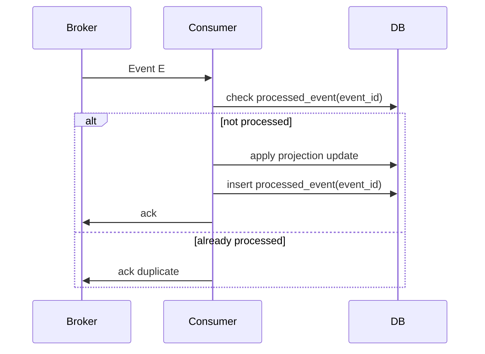

Example table:

```sql
CREATE TABLE processed_event (
    consumer_name VARCHAR(128) NOT NULL,
    event_id VARCHAR(64) NOT NULL,
    processed_at TIMESTAMP WITH TIME ZONE NOT NULL,
    PRIMARY KEY (consumer_name, event_id)
);
```

Example Java:

```java
@Transactional
public void onEvent(IntegrationEvent<AccountStatementEntryCreated> event) {
    if (processedEventRepository.exists("statement-projection", event.eventId())) {
        return;
    }

    statementProjection.apply(event.payload());

    processedEventRepository.insert("statement-projection", event.eventId(), Instant.now());
}
```

Do not rely on broker exactly-once marketing to protect financial correctness. Design consumers as if duplicates can happen.

---

## 14. Projections and Read Models

A projection is a derived read model.

Examples:

- account statement,
- mobile transaction history,
- customer dashboard,
- daily transaction summary,
- branch activity report,
- risk exposure view,
- alerting view,
- reconciliation candidate view.

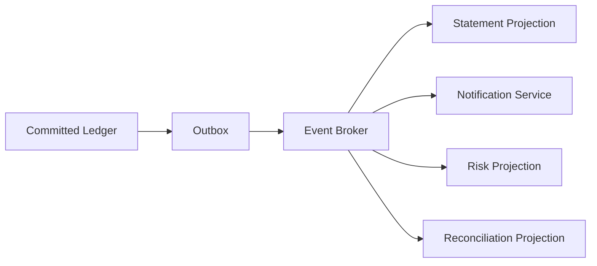

Projection rules:

1. Projection can lag.
2. Projection can be rebuilt.
3. Projection must be idempotent.
4. Projection must track source event offset/ID.
5. Projection is not financial truth unless explicitly certified as such.
6. Command validation must not rely only on stale projection.

### 14.1 Statement projection example

```java
record AccountStatementEntryCreated(
        AccountId accountId,
        TransactionId transactionId,
        JournalEntryId journalEntryId,
        Instant postedAt,
        LocalDate valueDate,
        Money amount,
        DebitCredit direction,
        String narrative,
        Money resultingLedgerBalance
) {}
```

A statement entry can include resulting balance if it is emitted from the posting engine after balance snapshot update.

But beware: if you later correct a backdated transaction, statement ordering and resulting balances become more complex.

---

## 15. Event Replay

Replay means processing old events again.

Replay is useful for:

- rebuilding projections,
- fixing projection bugs,
- testing new consumers,
- backfilling analytics,
- audit reconstruction,
- migration validation.

Replay is dangerous for:

- sending customer notifications again,
- charging fees again,
- posting ledger effects again,
- triggering external payments again,
- filing duplicate regulatory reports.

Classify consumers by replay safety.

| Consumer | Replay safe? | Rule |
|---|---:|---|
| statement projection | yes | rebuild into new table/version |
| analytics store | yes | dedupe by event ID |
| notification sender | no by default | use notification intent with suppression |
| external payment initiator | no | commands must be explicit, not replayed events |
| ledger posting consumer | usually no | avoid event-driven posting unless controlled |
| audit archive | yes | append/dedupe by event ID |

### 15.1 Replay mode flag

If replay is supported, pass explicit mode:

```java
enum ProcessingMode {
    LIVE,
    REPLAY,
    BACKFILL,
    REPAIR
}
```

Notification consumer example:

```java
void onTransferAccepted(IntegrationEvent<TransferAccepted> event, ProcessingMode mode) {
    if (mode != ProcessingMode.LIVE) {
        projectionOnly.apply(event);
        return;
    }

    notificationService.sendReceipt(event.payload());
}
```

---

## 16. Corrections in Event-Driven Systems

Never “delete” a bad financial event from history and pretend it never happened.

If a ledger transaction was wrong, correct it using reversal/adjustment events.

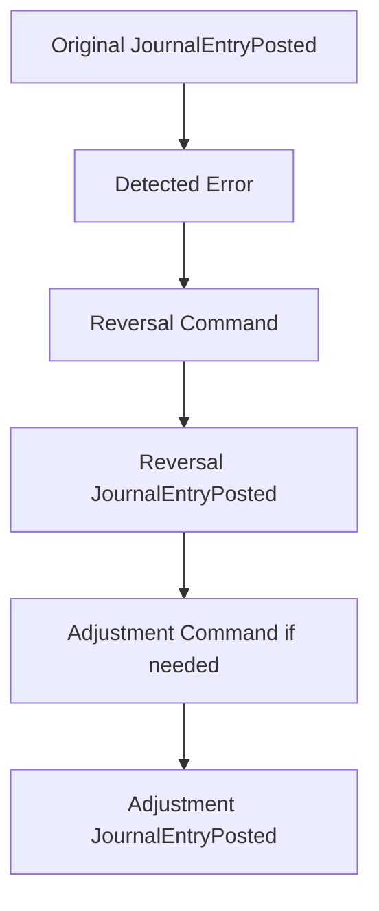

Downstream consumers must understand correction semantics.

Example events:

- `JournalEntryPosted`
- `JournalEntryReversed`
- `AdjustmentJournalEntryPosted`
- `StatementEntryCorrected`

Bad approach:

```sql
UPDATE event_store
SET amount = 90000
WHERE event_id = 'evt_old';
```

This destroys lineage.

---

## 17. Event Store vs Ledger Journal

Do not confuse event sourcing with accounting ledger.

A ledger journal is a financial accounting record.

An event store is an application state reconstruction mechanism.

They can coexist, but they are not the same.

| Aspect | Ledger journal | Event store |
|---|---|---|
| Purpose | financial truth | application state reconstruction |
| Structure | balanced debit/credit lines | domain events |
| Invariant | debits equal credits | aggregate transition validity |
| Consumer | accounting, statement, GL, audit | domain/application |
| Correction | reversal/adjustment | compensating event/versioned evolution |
| Regulation impact | high | depends on domain |

A top-tier engineer does not say “we use Kafka as our ledger” casually.

Kafka, Pulsar, Kinesis, or any broker may carry events. The ledger must still satisfy accounting invariants, retention, reconciliation, and audit requirements.

---

## 18. Event-Driven Posting: Use Extreme Care

Some systems route commands through events:

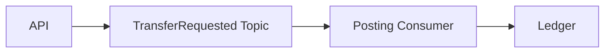

This can work, but it creates hard questions:

- How does the API know whether the command was accepted?
- Where is idempotency enforced?
- How are business rejections returned?
- How is ordering controlled?
- What happens if the command sits in the topic past cutoff?
- How are repair and cancellation handled?
- How do you prevent unauthorized command injection?

For core ledger posting, a synchronous application transaction is often simpler and safer:

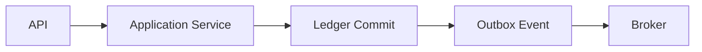

Use event-driven input when business requirements justify it, not because the architecture trend says so.

---

## 19. Saga vs Ledger Atomicity

A saga coordinates multiple local transactions.

A ledger posting must still be internally balanced and atomic.

Example: external transfer.

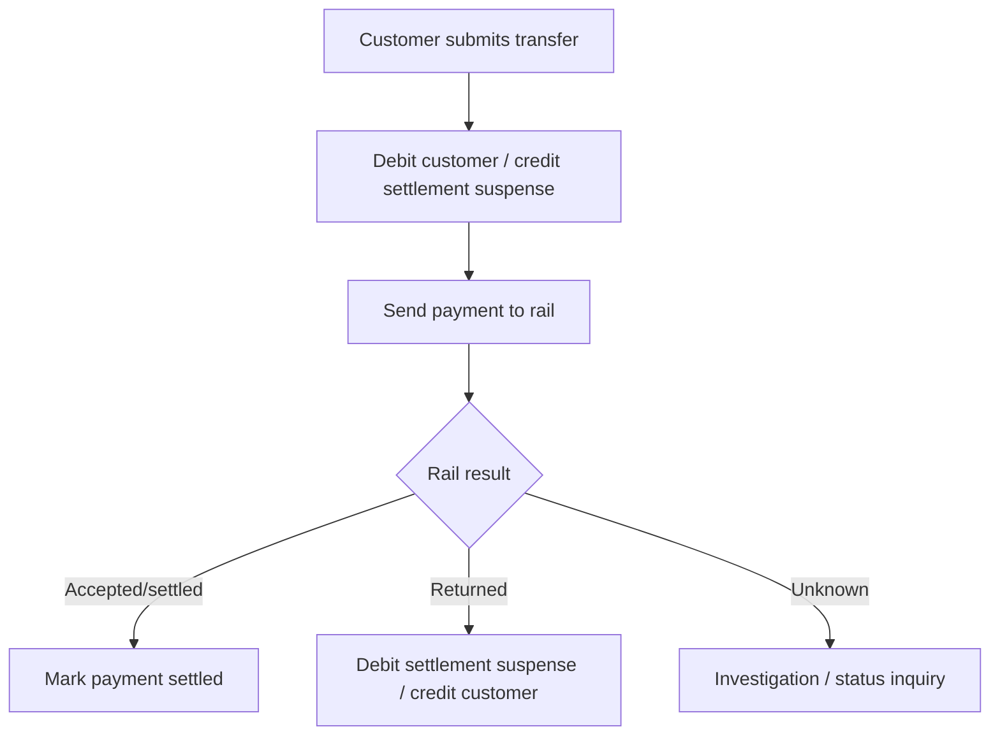

The customer debit is one balanced journal.

The return is another balanced journal.

Do not try to hold one distributed transaction open across the core database, payment gateway, clearing rail, notification system, and GL.

---

## 20. Event Schema Evolution

Events live longer than services.

Schema evolution rules:

- Add optional fields when possible.
- Do not change meaning of existing fields.
- Do not reuse enum values.
- Use explicit event version.
- Keep old consumers alive until migrated.
- Validate schema before publishing.
- Maintain sample events as contract fixtures.
- Document PII/sensitive field classification.

Example:

```java
record AccountStatementEntryCreatedV1(
        String accountId,
        String transactionId,
        String amount,
        String currency
) {}

record AccountStatementEntryCreatedV2(
        String accountId,
        String transactionId,
        long amountMinorUnits,
        String currency,
        String debitCredit,
        String valueDate
) {}
```

Do not silently change `amount` from decimal string to minor units in the same event version.

---

## 21. Topic Design

Avoid both extremes:

- one topic for everything,
- one topic per tiny event.

Topic design should consider:

- consumer ownership,
- retention,
- ordering key,
- sensitivity,
- throughput,
- replay requirements,
- schema evolution,
- operational monitoring.

Possible topic groups:

| Topic | Example events | Partition key |
|---|---|---|
| `core.ledger.journal.v1` | `JournalEntryPosted` | account or journal group |
| `core.account.statement.v1` | `StatementEntryCreated` | account ID |
| `core.transfer.lifecycle.v1` | `TransferAccepted`, `TransferRejected` | transaction ID |
| `core.payment.settlement.v1` | `PaymentSettled`, `PaymentReturned` | payment ID |
| `core.account.lifecycle.v1` | `AccountOpened`, `AccountClosed` | account ID |
| `core.notification.intent.v1` | `ReceiptNotificationRequested` | customer ID |

Separate topics may be required for sensitivity boundaries. A consumer that needs customer notification events should not automatically receive detailed ledger lines.

---

## 22. Event Security and Privacy

Events are data products. Treat them as such.

Apply:

- data classification,
- access control per topic,
- encryption in transit,
- encryption at rest where needed,
- field-level minimization,
- masking/tokenization,
- retention policy,
- consumer registration,
- audit of consumer access,
- deletion/retention handling for non-ledger PII.

Do not publish raw request bodies to event streams.

Bad:

```json
{
  "eventType": "TransferSubmitted",
  "rawRequest": {
    "otp": "123456",
    "deviceFingerprint": "...",
    "fullName": "...",
    "idCardNumber": "..."
  }
}
```

Good:

```json
{
  "eventType": "TransferAccepted",
  "payload": {
    "transactionId": "txn_01JY",
    "sourceAccountId": "acc_1001",
    "destinationAccountRefType": "INTERNAL_ACCOUNT",
    "amountMinorUnits": 10000000,
    "currency": "IDR"
  }
}
```

Even this “good” event may be sensitive. Minimize by consumer need.

---

## 23. Observability for Event Flows

Event-driven systems fail silently unless instrumented.

Track:

- outbox pending count,
- outbox oldest pending age,
- publish success/failure rate,
- publish latency,
- consumer lag,
- consumer failure rate,
- dead-letter count,
- duplicate event count,
- projection staleness,
- schema validation failure,
- poison message count,
- replay mode progress.

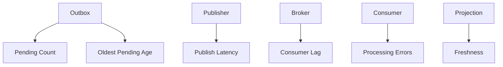

Example metric names:

```txt
core_outbox_pending_events
core_outbox_oldest_pending_age_seconds
core_outbox_publish_failures_total
core_event_consumer_lag_events
core_projection_staleness_seconds
core_event_duplicate_total
core_event_dead_letter_total
```

Traces should connect:

```txt
HTTP request -> command handler -> ledger commit -> outbox insert -> publisher -> broker -> consumer -> projection update
```

OpenTelemetry is useful because it provides vendor-neutral instrumentation concepts for traces, metrics, and logs.

---

## 24. Dead Letter Queues

A DLQ is not a garbage bin.

It is an operational repair queue for events.

Each DLQ item should include:

- event ID,
- event type/version,
- topic/partition/offset,
- consumer name,
- failure reason,
- first failure time,
- last failure time,
- attempt count,
- payload reference,
- classification: transient/permanent/data/schema/permission,
- repair action,
- owner.

DLQ handling state machine:

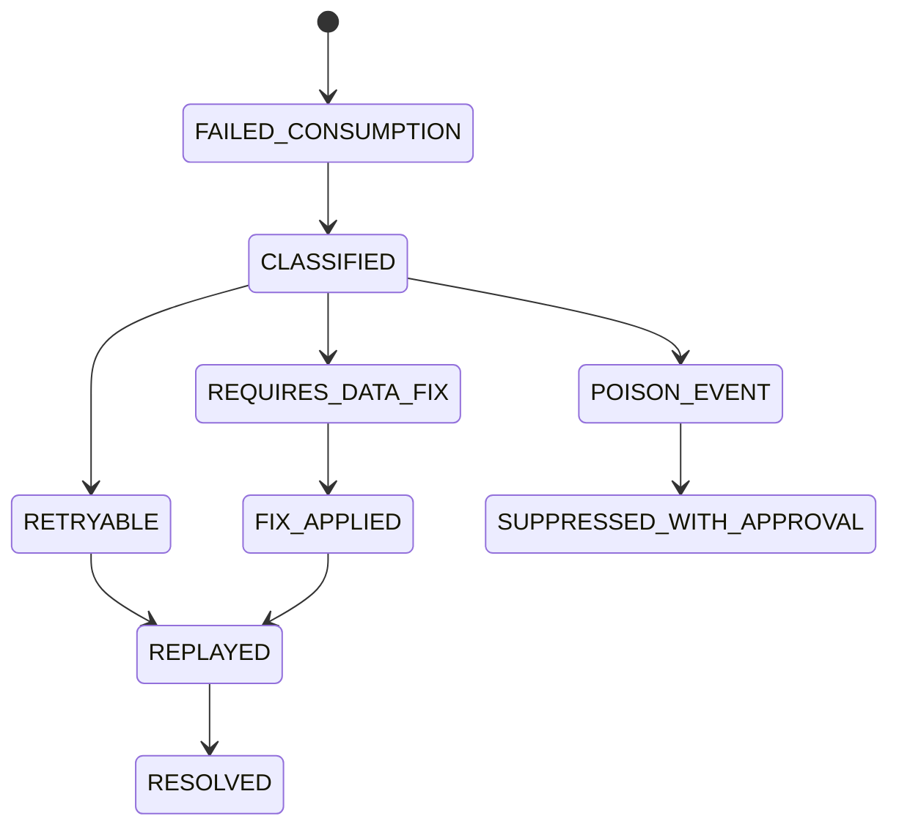

Never let financial-impacting DLQ items sit unowned.

---

## 25. Reconciliation of Event Pipelines

Event pipelines need reconciliation too.

Examples:

| Reconciliation | Question |
|---|---|
| Ledger vs outbox | Does every committed journal have required outbox event? |
| Outbox vs broker | Was every outbox event published? |
| Broker vs consumer | Did consumer process every event? |
| Ledger vs projection | Does statement projection match ledger-derived entries? |
| Payment lifecycle vs ledger | Does each external status have correct accounting impact? |

Example daily control:

```sql
SELECT business_date, COUNT(*)
FROM journal_entry
WHERE event_publication_required = true
GROUP BY business_date;

SELECT business_date, COUNT(*)
FROM banking_outbox_event
WHERE event_type = 'JournalEntryPosted'
GROUP BY business_date;
```

Counts are not enough. You also need exception lists.

---

## 26. Event-Driven Read Side Freshness

A projection is eventually consistent unless proven otherwise.

Expose freshness where it matters.

```json
{
  "accountId": "acc_1001",
  "transactions": [
    {
      "transactionId": "txn_01JY",
      "amount": {
        "currency": "IDR",
        "value": "100000.00"
      }
    }
  ],
  "projection": {
    "asOf": "2026-06-28T09:10:18+07:00",
    "lagSeconds": 3,
    "source": "STATEMENT_PROJECTION"
  }
}
```

For command validation, use authoritative state or revalidate against core.

Do not debit an account based on stale projection balance.

---

## 27. Event-Driven Notifications

A common flow:

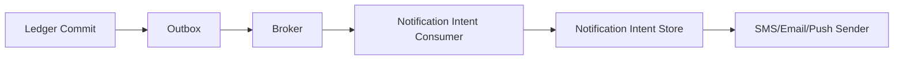

Why create notification intent first?

Because sending an SMS/email/push is an external side effect. You need:

- deduplication,
- preference check,
- suppression during replay,
- retry policy,
- delivery evidence,
- template versioning,
- customer language preference,
- opt-in/opt-out handling where applicable.

Do not send notifications directly inside the ledger transaction.

---

## 28. Event-Driven Fraud/AML Integration

Fraud/AML can consume events, but decision timing matters.

| Pattern | Use case | Risk |
|---|---|---|
| Pre-decision synchronous call | high-risk transfer decision before posting | latency/dependency risk |
| Post-event monitoring | suspicious behavior detection after posting | cannot prevent initial movement |
| Hold-and-release event flow | transaction waits for decision | operational complexity |
| Case generation | investigation workflow | delayed action |

Do not pretend asynchronous event consumption can block a debit that already committed.

If a decision must happen before money moves, it belongs before posting or in a hold/reservation model.

---

## 29. Event-Driven GL Integration

GL integration often consumes ledger-derived extracts.

Do not let GL consumers reconstruct accounting from vague customer events.

Bad:

```json
{
  "eventType": "CustomerDidTransfer",
  "amount": "100000"
}
```

Better:

```json
{
  "eventType": "GLPostingBatchReady",
  "businessDate": "2026-06-28",
  "batchId": "glb_20260628_001",
  "debitTotalMinorUnits": 1000000000,
  "creditTotalMinorUnits": 1000000000,
  "currency": "IDR",
  "lineCount": 1200
}
```

GL handoff is a controlled accounting interface, not a random event subscription.

---

## 30. Event-Driven Architecture Decision Matrix

Use event-driven architecture when:

- downstream consumers need decoupling,
- read models need independent scaling,
- notifications should not block core transactions,
- integration can tolerate eventual consistency,
- replay/backfill is valuable,
- producers and consumers have separate release cycles,
- audit/lineage can be improved through immutable signals.

Avoid or be careful when:

- business decision must be synchronous,
- ledger atomicity is required,
- customer needs immediate definitive response,
- ordering is strict and global,
- consumer side effects are irreversible,
- external system cannot dedupe,
- team lacks operational maturity.

---

## 31. Testing Event-Driven Core Banking

Test more than happy-path publication.

### 31.1 Unit tests

- event payload mapping,
- event version fields,
- sensitive field exclusion,
- partition key selection,
- idempotent consumer logic.

### 31.2 Integration tests

- ledger commit inserts outbox row,
- failed command does not insert event,
- publisher publishes pending event,
- publisher retries transient failure,
- duplicate event does not duplicate projection,
- schema validation fails safely.

### 31.3 Failure tests

| Failure | Expected behavior |
|---|---|
| DB commit fails | no outbox event |
| broker unavailable | outbox remains pending |
| publisher crashes after broker ack before marking published | duplicate possible; consumer dedupes |
| consumer crashes after projection update before ack | duplicate possible; consumer dedupes |
| projection bug discovered | rebuild from events or ledger source |
| poison event | DLQ with owner and repair path |

### 31.4 Property tests

For ledger-derived events:

- every `JournalEntryPosted` event references a real journal,
- journal debits equal credits,
- event currency matches journal currency rules,
- statement projection total equals ledger-derived total for selected account/time window,
- no event contains forbidden sensitive fields.

---

## 32. Java Testing Example

```java
@Test
void committedTransferInsertsOutboxEventInSameTransaction() {
    BankingCommandEnvelope<InternalTransferCommand> command = fixture.validTransferCommand();

    TransferResult result = transferUseCase.execute(command);

    JournalEntry journal = journalRepository.findByTransactionId(result.transactionId()).orElseThrow();
    List<OutboxEvent> events = outboxRepository.findByCausationId(command.commandId().value());

    assertThat(journal.isBalanced()).isTrue();
    assertThat(events).hasSize(1);
    assertThat(events.getFirst().eventType()).isEqualTo("TransferAccepted");
    assertThat(events.getFirst().correlationId()).isEqualTo(command.correlationId());
}
```

```java
@Test
void duplicateEventDoesNotDuplicateStatementEntry() {
    IntegrationEvent<AccountStatementEntryCreated> event = fixture.statementEntryEvent();

    consumer.onEvent(event);
    consumer.onEvent(event);

    List<StatementEntry> entries = statementRepository.findByTransactionId(event.payload().transactionId());
    assertThat(entries).hasSize(1);
}
```

---

## 33. Anti-Patterns

### 33.1 Kafka as the ledger

A broker is not automatically a banking ledger.

It may support immutable ordered logs, but a core ledger also needs accounting semantics, correction semantics, balance snapshots, audit queries, reconciliation, access control, retention, and operational controls.

### 33.2 Event before commit

Publishing before DB commit can create false financial facts.

### 33.3 No outbox

Dual writes will eventually hurt you.

### 33.4 Non-idempotent consumers

If duplicate event processing sends duplicate payment, duplicate notification, duplicate fee, or duplicate projection row, the design is incomplete.

### 33.5 One mega-event

A single event containing every possible field for every possible consumer becomes sensitive, unstable, and unmaintainable.

### 33.6 Commands disguised as events

`CreatePaymentRequested` on a topic might be a valid command message, but do not call it a fact. Treat it with command security and idempotency.

### 33.7 Replay sends real-world side effects

Replay must not re-send SMS, re-initiate payments, re-charge fees, or re-file reports unless explicitly controlled.

### 33.8 Projection as truth

Do not validate debits against stale read models.

---

## 34. Design Review Checklist

### Event classification

- [ ] Is this an accounting event, ledger event, domain event, integration event, audit event, notification event, or telemetry event?
- [ ] Is it a fact or a command?
- [ ] Has the source-of-truth state committed before publication?

### Event contract

- [ ] Does the event have stable name and version?
- [ ] Does it include event ID, correlation ID, causation ID, business date, and occurred time?
- [ ] Is payload minimal but sufficient?
- [ ] Is sensitive data classified and minimized?
- [ ] Is schema evolution documented?

### Reliability

- [ ] Is outbox used for DB + event reliability?
- [ ] Can publisher retry safely?
- [ ] Can consumer process duplicates safely?
- [ ] Is ordering scope explicit?
- [ ] Is DLQ operationally owned?

### Replay and correction

- [ ] Is replay mode explicit?
- [ ] Are side effects suppressed during replay?
- [ ] Are corrections represented as new facts, not mutations?
- [ ] Can projections be rebuilt?

### Observability

- [ ] Are outbox age and pending count monitored?
- [ ] Is consumer lag monitored?
- [ ] Is projection freshness exposed?
- [ ] Are trace/correlation identifiers propagated?
- [ ] Are event failures visible in operations dashboard?

### Banking correctness

- [ ] Does every financial event tie back to committed ledger/journal evidence?
- [ ] Are ledger invariants tested?
- [ ] Are settlement/reconciliation events controlled?
- [ ] Is GL integration based on accounting extracts, not vague customer events?

---

## 35. Practice: Design Events for Internal Transfer

Given internal transfer:

1. Customer submits transfer.
2. Source account debited.
3. Destination account credited.
4. Statement entries visible.
5. Customer receipt sent.
6. Daily GL extract generated.

A reasonable event design:

| Step | Event | Source | Consumer |
|---|---|---|---|
| Command accepted | `TransferAccepted` | application after ledger commit | transfer history, notification intent |
| Journal committed | `JournalEntryPosted` | ledger | audit, reconciliation, GL staging |
| Statement line created | `AccountStatementEntryCreated` | statement projection or ledger event mapper | account statement read model |
| Receipt requested | `TransferReceiptNotificationRequested` | notification intent service | SMS/push/email sender |
| GL batch ready | `GLPostingBatchReady` | EOD/GL service | general ledger interface |

Do not make mobile app consume raw ledger lines if it only needs transfer receipt.

Do not make GL reconstruct debit/credit from mobile transfer events.

---

## 36. Mental Model Summary

Event-driven core banking works when the truth hierarchy is clear.

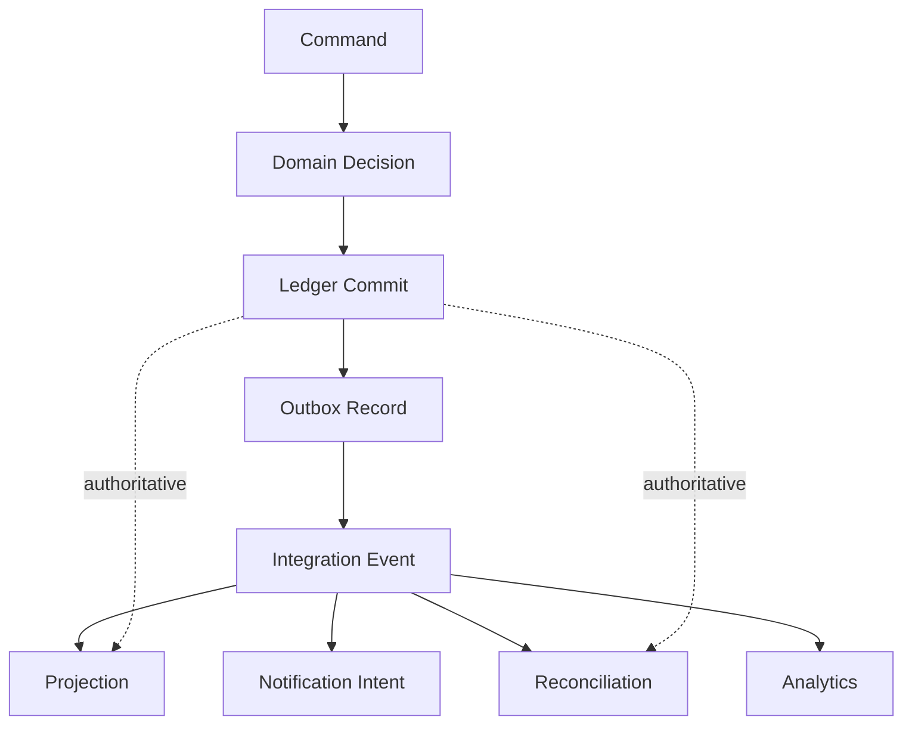

The ledger is authoritative.

The outbox makes publication reliable.

Events make integration scalable.

Consumers must be idempotent.

Projections are rebuildable.

Corrections are new facts.

Replay must not create uncontrolled side effects.

That is how you use event-driven architecture without breaking ledger truth.

---

## 37. References

- Transactional Outbox pattern and related polling/log-tailing publication patterns.
- OpenTelemetry documentation for traces, metrics, logs, and context propagation.
- ISO 20022 message definitions for financial integration boundaries.
- BCBS 239 principles for data lineage, accuracy, completeness, timeliness, and adaptability in banking risk/reporting contexts.
- Enterprise Integration Patterns for messaging reliability and integration semantics.

---

## 38. What Comes Next

Part 021 moves from integration architecture to daily bank operations:

> End-of-Day, Beginning-of-Day, operational calendar, cutoff, accrual run, fee run, GL extract, restartability, rerun safety, and business-date control.
