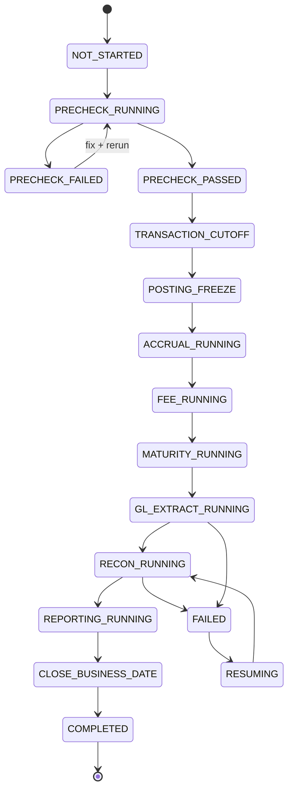
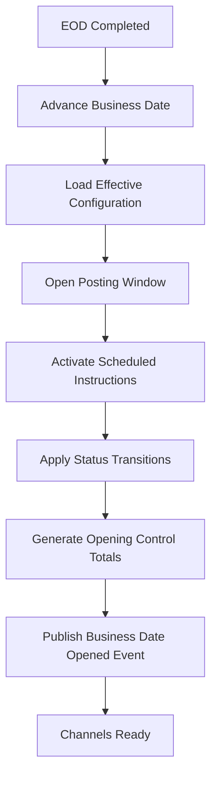
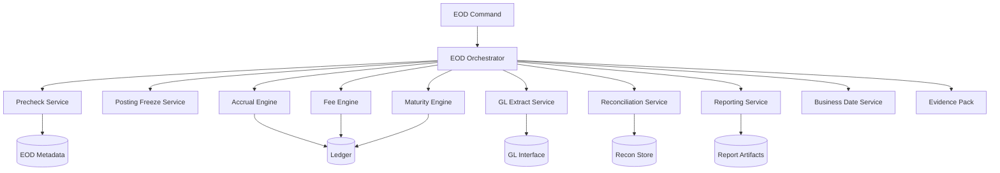

------
title: Learn Java Core Banking System - Part 021
description: End-of-Day, Beginning-of-Day, operational calendar, business date control, batch orchestration, idempotent rerun, restartability, control totals, and production-grade banking operations.
series: learn-java-core-banking-system
seriesTitle: Learn Java Core Banking System
order: 21
partTitle: End-of-Day, Beginning-of-Day, and Operational Calendar
tags:
- java
- core-banking
- eod
- bod
- batch-processing
- ledger
- banking-operations
- reliability
- reconciliation
- audit
- series
date: 2026-06-28
------

# Part 021 — End-of-Day, Beginning-of-Day, and Operational Calendar

> Core banking tidak hanya berjalan berdasarkan jam server. Core banking berjalan berdasarkan **business date**, **operational calendar**, **cutoff**, **ledger closure**, dan **control evidence**.

Part ini membahas **End-of-Day (EOD)** dan **Beginning-of-Day (BOD)** sebagai control system, bukan hanya batch job. Di banking, EOD/BOD adalah mekanisme untuk mengubah kumpulan transaksi harian menjadi posisi resmi: balance, accrual, fee, GL handoff, statement, regulatory extract, dan operational evidence.

Kita tidak akan mengulang detail Java batch, concurrency, observability, SQL, atau error handling yang sudah dipelajari di seri lain. Fokus part ini adalah **domain architecture**: bagaimana Java core banking system harus memodelkan business date, calendar, cutoff, batch lifecycle, restartability, rerun safety, dan operational evidence.

---

## 1. Mengapa EOD/BOD Itu Fundamental?

Banyak engineer melihat EOD sebagai:

> "Job malam untuk menghitung bunga dan generate report."

Itu terlalu dangkal.

Dalam core banking, EOD adalah **ritual formal penutupan posisi operasional**. Setelah EOD selesai, sistem harus bisa menjawab:

1. transaksi apa saja yang masuk ke business date tertentu;
2. balance resmi setiap rekening pada akhir hari;
3. accrual, fee, tax, dan maturity apa yang dihitung;
4. suspense, clearing, settlement, dan GL movement apa yang terjadi;
5. exception apa yang masih terbuka;
6. apakah total subledger cocok dengan GL interface;
7. report dan extract apa yang valid untuk audit/regulator;
8. apakah proses bisa dibuktikan, diulang, dan dijelaskan.

BOD adalah fase pembukaan business date baru. Setelah BOD selesai, sistem harus tahu:

1. business date aktif;
2. cutoff window baru;
3. produk, rate, calendar, dan parameter versi mana yang berlaku;
4. account mana yang berubah status karena maturity/dormancy/restriction;
5. scheduled instruction mana yang eligible dieksekusi;
6. apakah sistem siap menerima transaksi channel.

Mental model paling penting:

```txt
EOD closes truth for one business date.
BOD opens eligibility for the next business date.
```

---

## 2. Business Date vs System Date vs Value Date

Core banking harus membedakan minimal tiga jenis tanggal.

| Tanggal | Makna | Contoh |
|---|---|---|
| `systemDateTime` | Waktu teknis ketika event diproses | `2026-06-28T23:10:03+07:00` |
| `businessDate` | Tanggal operasional bank yang sedang aktif | `2026-06-28` |
| `valueDate` | Tanggal efektif ekonomi/akuntansi transaksi | `2026-06-27` |
| `postingDate` | Tanggal transaksi diposting ke ledger | `2026-06-28` |
| `settlementDate` | Tanggal settlement eksternal/final | `2026-06-30` |

Kesalahan umum adalah memakai `LocalDate.now()` langsung di domain logic. Itu berbahaya.

### 2.1 Anti-pattern: `LocalDate.now()` di domain layer

```java
public void post(TransactionCommand command) {
    LocalDate businessDate = LocalDate.now(); // salah untuk core banking
    // ...
}
```

Masalah:

1. tidak bisa replay;
2. tidak bisa simulasi EOD;
3. tidak bisa deterministic testing;
4. salah saat EOD masih berjalan melewati tengah malam;
5. salah untuk branch dengan calendar berbeda;
6. salah untuk backdated transaction;
7. susah audit.

### 2.2 Pattern: Business Clock

```java
public interface BusinessClock {
    LocalDate currentBusinessDate(BankUnitId bankUnitId);
    ZonedDateTime currentSystemDateTime();
    BusinessWindow currentWindow(BankUnitId bankUnitId);
}
```

Domain service harus menerima business date dari **operational date service**, bukan dari wall-clock.

```java
public final class PostingApplicationService {
    private final BusinessClock businessClock;
    private final PostingEngine postingEngine;

    public PostingResult post(TransferCommand command) {
        BusinessContext context = new BusinessContext(
            businessClock.currentBusinessDate(command.bankUnitId()),
            businessClock.currentSystemDateTime(),
            command.channel(),
            command.correlationId()
        );

        return postingEngine.post(command, context);
    }
}
```

---

## 3. Operational Calendar

Operational calendar bukan hanya daftar hari libur. Ia adalah domain object yang menentukan apakah bank bisa menerima, memproses, men-settle, atau menutup transaksi.

### 3.1 Calendar yang lazim dibutuhkan

| Calendar | Dipakai untuk |
|---|---|
| Bank calendar | business date bank secara umum |
| Branch calendar | cabang dengan hari operasional khusus |
| Currency calendar | settlement mata uang tertentu |
| Product calendar | rule produk seperti maturity dan accrual |
| Clearing calendar | rail payment eksternal |
| Market calendar | rate, treasury, securities, FX |
| Regulatory calendar | reporting deadline |

### 3.2 Calendar bukan boolean sederhana

Jangan hanya punya:

```java
boolean isHoliday(LocalDate date);
```

Lebih baik modelkan keputusan operasional:

```java
public record BusinessDayDecision(
    LocalDate date,
    boolean bankingOpen,
    boolean customerTransactionAllowed,
    boolean internalPostingAllowed,
    boolean clearingAllowed,
    boolean settlementAllowed,
    boolean eodAllowed,
    String reasonCode
) {}
```

Karena hari yang sama bisa:

1. tutup untuk customer transaction;
2. tetap boleh untuk internal accrual;
3. tidak boleh untuk clearing;
4. tetap boleh untuk regulatory reporting;
5. memiliki cutoff lebih awal.

---

## 4. Cutoff Window

Cutoff adalah batas operasional untuk menentukan transaksi masuk business date mana.

Contoh:

```txt
Business date: 2026-06-28
Customer transfer cutoff: 18:00
Teller cutoff: 16:00
Internal posting cutoff: 22:00
EOD starts: 23:00
```

Transaksi pukul 19:00 mungkin masih diterima channel, tetapi dianggap business date berikutnya, atau masuk pending queue.

### 4.1 Model cutoff

```java
public record CutoffPolicy(
    BankUnitId bankUnitId,
    Channel channel,
    TransactionType transactionType,
    LocalTime cutoffTime,
    CutoffBehavior behavior
) {}

public enum CutoffBehavior {
    ACCEPT_CURRENT_BUSINESS_DATE,
    ACCEPT_NEXT_BUSINESS_DATE,
    QUEUE_FOR_NEXT_BUSINESS_DATE,
    REJECT,
    REQUIRE_MANUAL_APPROVAL
}
```

### 4.2 Cutoff decision trace

Setiap keputusan cutoff harus menyimpan trace:

```java
public record CutoffDecision(
    LocalDate requestedBusinessDate,
    LocalDate assignedBusinessDate,
    ZonedDateTime receivedAt,
    Channel channel,
    TransactionType transactionType,
    CutoffBehavior behavior,
    String policyVersion,
    String reasonCode
) {}
```

Ini penting untuk dispute:

> "Saya transfer sebelum jam tutup, kenapa diproses besok?"

Jawaban sistem harus berbasis evidence, bukan asumsi.

---

## 5. EOD sebagai State Machine

EOD harus dimodelkan sebagai state machine eksplisit.



Setiap state harus punya:

1. start time;
2. end time;
3. operator/system actor;
4. input snapshot;
5. output control totals;
6. error summary;
7. retry count;
8. decision trail;
9. approval jika manual override;
10. hash/checksum jika perlu evidence kuat.

---

## 6. EOD Phases

EOD biasanya terdiri dari beberapa fase. Nama bisa berbeda antar bank, tetapi mental modelnya mirip.

### 6.1 Precheck

Precheck memastikan sistem boleh ditutup.

Contoh precheck:

| Check | Pertanyaan |
|---|---|
| Open batch check | Apakah ada batch upload belum selesai? |
| Pending posting check | Apakah ada accepted transaction belum diposting? |
| Unbalanced journal check | Apakah ada journal tidak balance? |
| Repair queue check | Apakah ada repair item blocker? |
| Suspense threshold check | Apakah suspense melebihi toleransi? |
| External file check | Apakah file clearing wajib sudah diterima? |
| GL mapping check | Apakah semua product/account punya mapping GL? |
| Calendar check | Apakah business date valid ditutup? |
| Parameter check | Apakah rate/product config untuk hari ini lengkap? |

Precheck harus membedakan:

1. **hard blocker**: EOD tidak boleh lanjut;
2. **soft warning**: EOD boleh lanjut dengan approval;
3. **informational**: hanya dicatat.

```java
public enum EodCheckSeverity {
    BLOCKER,
    WARNING_REQUIRES_APPROVAL,
    INFO
}

public record EodPrecheckResult(
    String checkCode,
    EodCheckSeverity severity,
    boolean passed,
    long affectedCount,
    BigDecimal affectedAmount,
    String evidenceQueryRef,
    String message
) {}
```

### 6.2 Transaction cutoff

Pada fase cutoff, sistem menentukan batas transaksi untuk business date.

Important invariant:

```txt
No new customer-originated transaction may be assigned to a business date after that date enters cutoff/freeze, unless explicitly allowed by controlled backdated process.
```

### 6.3 Posting freeze

Freeze bukan berarti semua posting berhenti. Biasanya customer-originated posting dihentikan, tetapi internal posting seperti accrual, fee, maturity, tax, GL settlement masih boleh.

Karena itu jangan modelkan freeze sebagai boolean global.

```java
public record PostingPermission(
    LocalDate businessDate,
    PostingSource source,
    TransactionType transactionType,
    boolean allowed,
    String reason
) {}
```

### 6.4 Accrual run

Accrual run menghitung pendapatan/beban bunga yang sudah terjadi secara ekonomi tetapi belum tentu jatuh tempo.

Control totals:

| Total | Makna |
|---|---|
| eligible accounts | jumlah rekening eligible |
| skipped accounts | rekening yang tidak dihitung dan alasannya |
| accrued debit amount | total debit accrual |
| accrued credit amount | total credit accrual |
| generated journal count | jumlah journal accrual |
| rounding adjustment | total rounding adjustment |

### 6.5 Fee run

Fee run menghitung biaya periodik atau event-derived fee yang belum diposting.

Contoh:

1. monthly maintenance fee;
2. minimum balance fee;
3. dormant account fee;
4. overdraft fee;
5. statement fee;
6. penalty fee.

Fee harus idempotent:

```txt
For same account + fee type + fee period + product version, fee posting must be generated at most once unless correction flow is used.
```

### 6.6 Maturity run

Maturity run menangani produk yang jatuh tempo:

1. term deposit maturity;
2. loan installment due;
3. promotional rate expiry;
4. guarantee expiry;
5. blocked amount release;
6. scheduled instruction activation.

### 6.7 GL extract

GL extract menghasilkan interface dari subledger core banking ke general ledger.

Control totals:

1. number of accounting events;
2. number of posting lines;
3. debit total per GL account;
4. credit total per GL account;
5. net movement per GL account;
6. suspense movement;
7. unmatched mapping count.

### 6.8 Reconciliation run

Reconciliation run membandingkan:

1. account balance vs ledger posting;
2. subledger total vs GL interface;
3. clearing file vs internal payment status;
4. settlement account vs external statement;
5. suspense aging;
6. generated reports vs source totals.

Part 022 membahas ini lebih dalam.

### 6.9 Reporting run

Reporting bisa mencakup:

1. customer statement;
2. internal MIS;
3. operational dashboard;
4. regulatory extract;
5. audit pack;
6. risk data feed;
7. downstream warehouse feed.

Reporting tidak boleh mengambil data “setengah matang”. Ia harus mengacu ke **closed business date snapshot**.

### 6.10 Business date closure

Setelah closure:

```txt
Business date is immutable except through controlled correction/backdated process.
```

Closure harus menghasilkan closure certificate:

```java
public record EodClosureCertificate(
    LocalDate businessDate,
    String eodRunId,
    Instant startedAt,
    Instant completedAt,
    EodStatus status,
    List<ControlTotal> controlTotals,
    List<ExceptionSummary> unresolvedExceptions,
    String approvedBy,
    String evidenceHash
) {}
```

---

## 7. BOD Phases

BOD membuka hari baru.



### 7.1 Advance business date

Business date tidak selalu `previous + 1 day`. Jika Sabtu/Minggu/libur, next business date bisa melompat.

```java
public interface OperationalCalendar {
    LocalDate nextBusinessDate(BankUnitId bankUnitId, LocalDate current);
    BusinessDayDecision decisionFor(BankUnitId bankUnitId, LocalDate date);
}
```

### 7.2 Effective configuration loading

Pada BOD, sistem harus menetapkan versi konfigurasi yang berlaku:

1. product parameters;
2. interest rates;
3. fee schedule;
4. tax rates;
5. GL mappings;
6. cutoff windows;
7. branch calendar;
8. limit rules;
9. AML/fraud routing policy;
10. report templates.

Prinsip:

```txt
BOD should pin effective configuration versions for the business date.
```

Jika konfigurasi berubah di tengah hari, sistem harus jelas apakah perubahan berlaku:

1. immediately;
2. next business date;
3. next cycle;
4. next product version;
5. only for new agreements.

### 7.3 Opening control totals

Opening control totals membuktikan bahwa posisi awal business date baru sama dengan posisi akhir business date sebelumnya.

```txt
openingBalance(2026-06-29) == closingBalance(2026-06-28)
```

Kecuali ada controlled opening adjustment.

---

## 8. EOD Job Design di Java

EOD bukan satu method besar.

Anti-pattern:

```java
public void runEod() {
    doPrecheck();
    freeze();
    calculateInterest();
    chargeFees();
    generateGl();
    reconcile();
    closeDate();
}
```

Masalah:

1. tidak restartable;
2. tidak observably staged;
3. tidak punya control totals per step;
4. sulit rerun satu fase;
5. sulit audit;
6. failure handling kacau;
7. tidak bisa parallel secara aman;
8. tidak bisa pause/resume;
9. tidak ada approval gate.

### 8.1 Pattern: EOD Run + Step Execution

```java
public record EodRunId(String value) {}

public record EodRun(
    EodRunId id,
    LocalDate businessDate,
    EodStatus status,
    Instant startedAt,
    Instant completedAt,
    List<EodStepExecution> steps
) {}

public record EodStepExecution(
    String stepCode,
    EodStepStatus status,
    Instant startedAt,
    Instant completedAt,
    int attempt,
    String inputFingerprint,
    String outputFingerprint,
    List<ControlTotal> controlTotals,
    String errorCode
) {}
```

### 8.2 Step contract

```java
public interface EodStep {
    String code();
    EodStepType type();
    EodStepResult execute(EodStepContext context);
}

public record EodStepContext(
    EodRunId runId,
    LocalDate businessDate,
    String stepExecutionId,
    EodRerunMode rerunMode,
    BusinessClock clock,
    OperatorContext operator
) {}
```

### 8.3 Idempotent step design

Setiap step harus bisa menjawab:

1. apakah step belum pernah jalan;
2. apakah step sudah sukses;
3. apakah output masih valid;
4. apakah boleh rerun;
5. apakah rerun harus reverse output sebelumnya;
6. apakah ada partial output;
7. apakah partial output bisa dilanjutkan.

Contoh idempotency key untuk fee EOD:

```txt
FEE_RUN:{businessDate}:{accountId}:{feeType}:{feePeriod}:{productVersion}
```

Contoh idempotency key untuk GL extract:

```txt
GL_EXTRACT:{businessDate}:{ledgerBook}:{glBatchType}:{extractVersion}
```

---

## 9. Restartability vs Rerunability

Dua konsep ini sering dicampur.

| Konsep | Makna |
|---|---|
| Restartability | Melanjutkan proses setelah gagal tanpa mulai dari nol |
| Rerunability | Menjalankan ulang proses untuk menghasilkan output yang konsisten |
| Reversibility | Membatalkan efek proses sebelumnya dengan posting koreksi |
| Rebuildability | Membangun ulang output dari source-of-truth |

### 9.1 Restartable

Jika job gagal di account ke-800.000 dari 1.000.000, sistem tidak boleh selalu ulang dari awal kalau mahal dan berisiko.

Gunakan checkpoint:

```java
public record EodPartitionCheckpoint(
    String stepExecutionId,
    String partitionKey,
    String lastProcessedKey,
    long processedCount,
    BigDecimal processedAmount,
    Instant updatedAt
) {}
```

### 9.2 Rerunnable

Jika output EOD report corrupt, sistem bisa generate ulang dari closed snapshot tanpa mengubah ledger.

```txt
Read-only report generation should be rerunnable.
Posting-producing steps require stronger controls.
```

### 9.3 Reversible

Jika fee salah ter-posting, jangan delete journal. Buat reversal/adjustment.

```txt
Bad EOD posting is corrected by compensating accounting event, not by mutating historical posting lines.
```

---

## 10. Control Totals

Control total adalah alat utama untuk membuktikan bahwa batch tidak kehilangan atau menggandakan data.

### 10.1 Jenis control total

| Control total | Contoh |
|---|---|
| Count total | jumlah account eligible |
| Amount total | total debit/credit |
| Hash total | checksum account ids/output rows |
| Balance total | aggregate balance per product/currency |
| Exception total | jumlah failed/skipped/repaired |
| Reconciliation total | matched/unmatched amount |
| Aging total | suspense by age bucket |

### 10.2 Java model

```java
public record ControlTotal(
    String name,
    ControlTotalType type,
    String dimension,
    BigDecimal amount,
    Long count,
    String currency,
    String hash,
    String sourceQueryRef
) {}
```

### 10.3 Example: accrual control totals

```txt
businessDate=2026-06-28
step=DAILY_INTEREST_ACCRUAL
currency=IDR
eligibleAccounts=1,250,000
processedAccounts=1,249,998
skippedAccounts=2
accrualDebitTotal=3,250,000,000.00
accrualCreditTotal=3,250,000,000.00
roundingAdjustment=12.00
journalCount=1,249,998
```

Jika debit dan credit tidak balance, EOD harus gagal.

---

## 11. Partitioning EOD Workload

EOD sering memproses jutaan rekening. Tapi partitioning harus menjaga invariant.

### 11.1 Partition key yang umum

| Workload | Partition key |
|---|---|
| Interest accrual | account range/product/currency |
| Fee run | product/fee type/account range |
| Statement generation | customer/account range |
| GL extract | ledger book/currency/accounting event range |
| Reconciliation | external file/statement date/account |
| Maturity | maturity date/product |

### 11.2 Jangan partition sembarangan

Jika satu account bisa diproses oleh dua partition secara bersamaan, bisa terjadi double posting.

Invariant:

```txt
A posting-producing EOD step must own a deterministic partition of accounts/events.
No two partitions may produce the same business effect.
```

### 11.3 Work leasing

```java
public record EodWorkLease(
    String leaseId,
    String stepExecutionId,
    String partitionKey,
    String ownedByWorker,
    Instant leasedUntil,
    EodWorkStatus status
) {}
```

Worker harus memperbarui lease. Jika worker mati, lease expire dan partition bisa diambil worker lain dengan idempotency guard.

---

## 12. EOD and Online Transaction Interaction

Core banking modern sering harus 24/7. Tantangannya: EOD tetap perlu control, tetapi customer ingin transaksi kapan saja.

Ada beberapa model.

### 12.1 Hard downtime model

Channel ditutup selama EOD.

Kelebihan:

1. sederhana;
2. invariant mudah;
3. reconciliation lebih mudah.

Kekurangan:

1. buruk untuk digital banking;
2. tidak cocok 24/7 payment;
3. customer impact tinggi.

### 12.2 Queue-during-EOD model

Transaksi diterima tetapi tidak diposting sampai EOD selesai.

Kelebihan:

1. user experience lebih baik;
2. ledger closure aman.

Kekurangan:

1. pending state kompleks;
2. risiko timeout/dispute;
3. channel harus memahami pending.

### 12.3 Dual business date model

Sistem menerima transaksi untuk next business date saat current business date sedang ditutup.

Kelebihan:

1. mendukung operasi lebih panjang;
2. EOD tidak selalu block channel.

Kekurangan:

1. butuh strict business date assignment;
2. reporting lebih kompleks;
3. backdated/correction makin sensitif.

### 12.4 Near-real-time ledger with soft EOD

Ledger selalu online, EOD lebih banyak menghasilkan snapshot/report/control daripada menghentikan posting.

Kelebihan:

1. cocok digital banking;
2. downtime minimal.

Kekurangan:

1. arsitektur lebih sulit;
2. snapshot isolation harus kuat;
3. reconciliation dan GL cut membutuhkan desain matang.

Tidak ada model universal. Pilihan tergantung produk, rail, regulasi, risk appetite, dan legacy constraint.

---

## 13. Business Date Assignment Pattern

Untuk sistem 24/7, business date assignment harus first-class.

```java
public interface BusinessDateAssignmentService {
    BusinessDateAssignment assign(TransactionIngress ingress);
}

public record BusinessDateAssignment(
    LocalDate assignedBusinessDate,
    AssignmentReason reason,
    String cutoffPolicyVersion,
    boolean requiresCustomerDisclosure,
    boolean requiresManualApproval
) {}
```

Contoh:

```txt
ReceivedAt: 2026-06-28T18:30:00+07:00
Channel: MOBILE
Transaction: INTERBANK_TRANSFER
Cutoff: 17:00
Behavior: QUEUE_FOR_NEXT_BUSINESS_DATE
AssignedBusinessDate: 2026-06-29
Reason: AFTER_CUTOFF
```

---

## 14. Operational Evidence

EOD harus meninggalkan evidence. Tanpa evidence, sistem mungkin benar secara teknis tetapi lemah secara operasional.

Evidence minimum:

1. run id;
2. business date;
3. step list;
4. operator/system actor;
5. input fingerprint;
6. output fingerprint;
7. control totals;
8. exception list;
9. approvals/overrides;
10. report artifact references;
11. source query references;
12. config versions;
13. release version;
14. correlation IDs;
15. incident references jika ada.

### 14.1 Evidence pack

```java
public record EodEvidencePack(
    EodRunId runId,
    LocalDate businessDate,
    String applicationVersion,
    String configurationSnapshotId,
    List<EodStepExecution> stepExecutions,
    List<ControlTotal> finalControlTotals,
    List<ApprovalEvidence> approvals,
    List<ArtifactReference> generatedArtifacts,
    String cryptographicDigest
) {}
```

Digest bukan pengganti audit, tetapi membantu mendeteksi perubahan artifact.

---

## 15. EOD Failure Handling

EOD failure harus diklasifikasi.

| Failure | Contoh | Response |
|---|---|---|
| Data quality failure | GL mapping missing | stop, fix config, rerun precheck |
| External dependency failure | clearing file belum datang | wait, manual override, partial close |
| Processing failure | worker crash | resume partition |
| Business invariant failure | unbalanced journal | stop, investigate |
| Reconciliation failure | external total mismatch | create break, maybe block close |
| Reporting failure | report generation error | rerun report, do not mutate ledger |
| Infrastructure failure | DB failover | resume from checkpoint |

### 15.1 Unknown outcome

Unknown outcome adalah kondisi ketika sistem tidak tahu apakah step berhasil atau gagal.

Contoh:

1. worker timeout setelah commit;
2. network failure saat publish event;
3. DB connection dropped setelah server-side commit;
4. file transfer status tidak jelas;
5. external settlement acknowledgement terlambat.

Pattern:

```txt
Never guess. Reconcile state from durable source of truth.
```

Untuk posting-producing step, cek journal/idempotency table. Untuk file transfer, cek file registry dan external acknowledgement.

---

## 16. Partial Close dan Conditional Close

Beberapa bank memakai partial close:

1. close deposit products dulu;
2. loan EOD menyusul;
3. GL extract split per ledger book;
4. branch close per region;
5. currency-specific close.

Ini bisa benar, tetapi harus eksplisit.

```java
public record BusinessDateCloseScope(
    LocalDate businessDate,
    Optional<ProductFamily> productFamily,
    Optional<BranchId> branchId,
    Optional<Currency> currency,
    Optional<LedgerBook> ledgerBook
) {}
```

Danger:

```txt
Partial close without explicit scope creates false confidence.
```

Dashboard harus menampilkan:

```txt
Business Date 2026-06-28:
- Deposits: CLOSED
- Loans: RECON_PENDING
- Payments: WAITING_EXTERNAL_STATEMENT
- GL: PARTIAL_EXTRACTED
- Reports: NOT_READY
```

---

## 17. EOD Database Design Sketch

Schema minimal:

```sql
CREATE TABLE eod_run (
    id                    VARCHAR(64) PRIMARY KEY,
    business_date         DATE NOT NULL,
    scope_type            VARCHAR(50) NOT NULL,
    scope_value           VARCHAR(100),
    status                VARCHAR(40) NOT NULL,
    started_at            TIMESTAMP NOT NULL,
    completed_at          TIMESTAMP NULL,
    application_version   VARCHAR(100) NOT NULL,
    config_snapshot_id    VARCHAR(100) NOT NULL,
    created_by            VARCHAR(100) NOT NULL
);

CREATE TABLE eod_step_execution (
    id                    VARCHAR(64) PRIMARY KEY,
    eod_run_id            VARCHAR(64) NOT NULL,
    step_code             VARCHAR(100) NOT NULL,
    status                VARCHAR(40) NOT NULL,
    attempt               INT NOT NULL,
    started_at            TIMESTAMP NOT NULL,
    completed_at          TIMESTAMP NULL,
    input_fingerprint     VARCHAR(256),
    output_fingerprint    VARCHAR(256),
    error_code            VARCHAR(100),
    error_message         VARCHAR(1000),
    UNIQUE (eod_run_id, step_code, attempt)
);

CREATE TABLE eod_control_total (
    id                    VARCHAR(64) PRIMARY KEY,
    step_execution_id     VARCHAR(64) NOT NULL,
    name                  VARCHAR(100) NOT NULL,
    dimension             VARCHAR(200),
    amount                DECIMAL(38, 8),
    count_value           BIGINT,
    currency              CHAR(3),
    hash_value            VARCHAR(256),
    source_query_ref      VARCHAR(256)
);

CREATE TABLE eod_work_checkpoint (
    id                    VARCHAR(64) PRIMARY KEY,
    step_execution_id     VARCHAR(64) NOT NULL,
    partition_key         VARCHAR(200) NOT NULL,
    last_processed_key    VARCHAR(200),
    processed_count       BIGINT NOT NULL,
    processed_amount      DECIMAL(38, 8),
    status                VARCHAR(40) NOT NULL,
    updated_at            TIMESTAMP NOT NULL,
    UNIQUE(step_execution_id, partition_key)
);
```

---

## 18. EOD Orchestration Architecture



Orchestrator mengatur flow, tetapi business effect tetap di domain service masing-masing.

---

## 19. EOD Observability yang Bernilai Domain

Jangan hanya ukur CPU/memory/job duration. Ukur domain progress.

Metrics penting:

| Metric | Makna |
|---|---|
| `eod_step_duration_seconds` | durasi step |
| `eod_processed_accounts_total` | progress account |
| `eod_generated_journals_total` | journal yang dibuat |
| `eod_skipped_accounts_total` | account dilewati |
| `eod_control_total_amount` | total amount per dimension |
| `eod_recon_breaks_total` | jumlah break |
| `eod_unresolved_exceptions_total` | exception terbuka |
| `eod_rerun_total` | rerun frequency |
| `eod_manual_override_total` | override frequency |
| `eod_sla_breach_total` | breach terhadap operational SLA |

Trace harus menyimpan:

1. eod run id;
2. business date;
3. step code;
4. partition key;
5. account/product/currency dimension bila aman;
6. correlation id;
7. control total reference.

---

## 20. Security dan Segregation of Duties

EOD operation harus punya kontrol akses.

Role umum:

| Role | Hak |
|---|---|
| EOD Operator | start/monitor routine EOD |
| EOD Supervisor | approve warning override |
| Finance Controller | approve GL-related exception |
| System Administrator | restart infrastructure, bukan approve business override |
| Auditor | read evidence only |
| Product Admin | manage configuration, bukan close business date |

Prinsip:

```txt
The person who changes financial configuration should not be the only person who approves EOD using that configuration.
```

---

## 21. EOD Anti-patterns

### 21.1 Giant batch script

Satu script besar yang melakukan semuanya membuat failure tidak bisa dikontrol.

### 21.2 Delete-and-regenerate posting

Menghapus posting EOD untuk rerun merusak audit trail.

### 21.3 Hidden manual SQL

Manual update tanpa evidence adalah operational debt besar.

### 21.4 Calendar hardcoded di code

Hari libur dan cutoff berubah. Calendar harus dikelola sebagai effective-dated reference data.

### 21.5 Report dari live table tanpa snapshot

Report bisa berubah saat query diulang.

### 21.6 EOD success hanya berdasarkan exit code

Exit code sukses tidak cukup. Harus ada control totals dan reconciliation evidence.

### 21.7 Menganggap EOD hanya masalah batch performance

Performance penting, tetapi correctness, restartability, dan evidence lebih penting.

---

## 22. Practical Design Checklist

Sebelum mengklaim EOD design production-ready, jawab ini:

1. Apa sumber business date resmi?
2. Siapa yang boleh advance business date?
3. Apa perbedaan cutoff, freeze, close, dan open?
4. Apakah setiap EOD step idempotent?
5. Step mana yang read-only, posting-producing, file-producing, atau external-effect-producing?
6. Apa idempotency key tiap step?
7. Apa control totals tiap step?
8. Apa hard blocker vs warning?
9. Bagaimana rerun dilakukan?
10. Bagaimana partial failure dipulihkan?
11. Bagaimana unknown outcome diselesaikan?
12. Apakah report memakai closed snapshot?
13. Bagaimana GL extract dibuktikan balance?
14. Bagaimana reconciliation break mempengaruhi closure?
15. Siapa yang approve override?
16. Apakah calendar effective-dated?
17. Apakah product/rate config dipin untuk business date?
18. Apakah opening balance hari baru cocok dengan closing balance hari sebelumnya?
19. Apakah audit bisa melihat evidence pack tanpa query manual?
20. Apakah channel memahami pending/after-cutoff semantics?

---

## 23. Deliberate Practice

### Latihan 1 — Business Date Assignment

Desain fungsi yang menerima:

1. timestamp transaksi;
2. channel;
3. transaction type;
4. branch;
5. cutoff policy;
6. current EOD state.

Output:

1. assigned business date;
2. accept/queue/reject;
3. reason code;
4. customer disclosure flag.

### Latihan 2 — EOD Precheck Matrix

Buat minimal 20 precheck untuk deposit + loan + payment. Klasifikasikan menjadi:

1. blocker;
2. warning requires approval;
3. info.

### Latihan 3 — Idempotent Fee Run

Rancang table dan idempotency key agar monthly maintenance fee tidak bisa ter-posting dua kali untuk account, fee period, dan product version yang sama.

### Latihan 4 — Restartable Accrual

Rancang checkpoint untuk accrual 10 juta account. Jelaskan bagaimana sistem melanjutkan setelah worker crash.

### Latihan 5 — EOD Evidence Pack

Buat struktur evidence pack untuk auditor yang bisa menjawab:

> "Bagaimana kita tahu saldo akhir 2026-06-28 benar?"

---

## 24. Ringkasan Mental Model

EOD/BOD bukan batch administratif. Ia adalah **operational truth boundary**.

Pegang invariant ini:

```txt
A business date is not truly closed until its postings, controls, reconciliations, extracts, reports, and exceptions are explicitly known.
```

Dan:

```txt
A business date is not safely opened until its opening state, effective configuration, calendar, posting windows, and scheduled obligations are explicitly established.
```

Engineer top-tier tidak hanya bertanya:

> "Job EOD jalan berapa lama?"

Ia bertanya:

1. apa yang sedang ditutup;
2. apa yang boleh berubah saat ditutup;
3. apa evidence bahwa proses benar;
4. apa yang terjadi jika gagal di tengah;
5. apa yang bisa di-rerun tanpa efek samping;
6. apa yang harus dikoreksi, bukan dihapus;
7. bagaimana auditor/regulator/operator memahami hasilnya.

---

## 25. Referensi

- FFIEC, *Architecture, Infrastructure, and Operations Booklet*, Information Technology Examination Handbook.
- Basel Committee on Banking Supervision, *BCBS 239: Principles for effective risk data aggregation and risk reporting*.
- CPMI-IOSCO, *Principles for financial market infrastructures*.
- ISO 20022, *Message Definitions: Bank-to-Customer Cash Management*.
- OpenTelemetry, *Observability framework for traces, metrics, and logs*.
