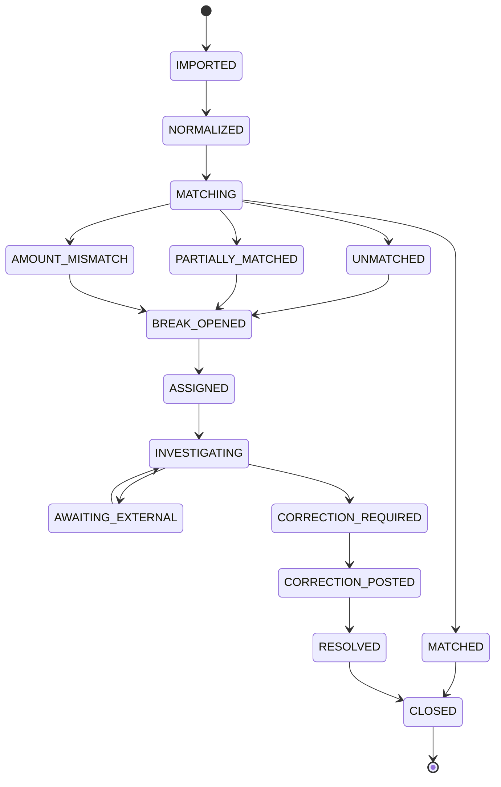
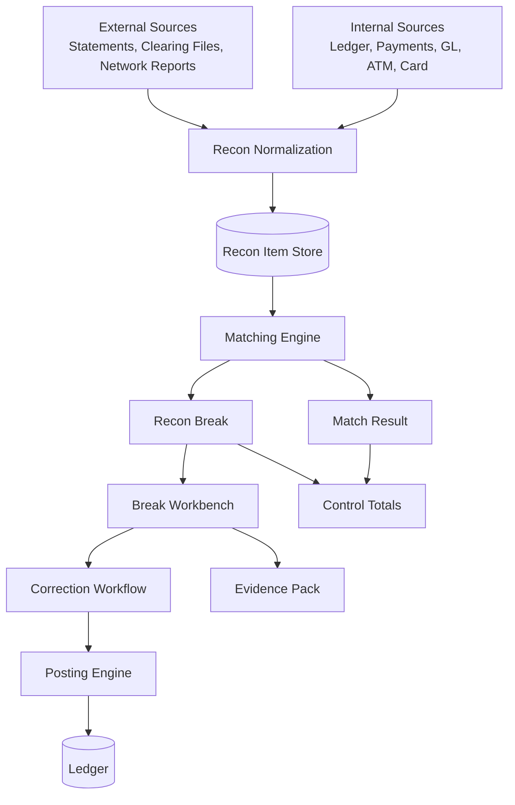
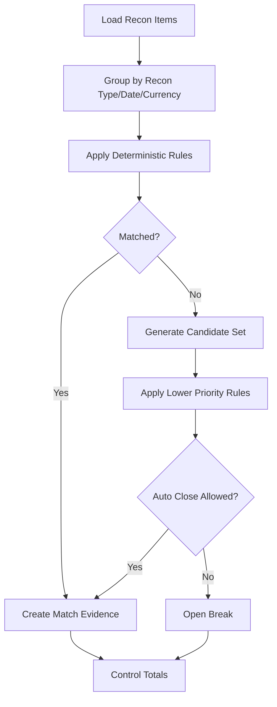
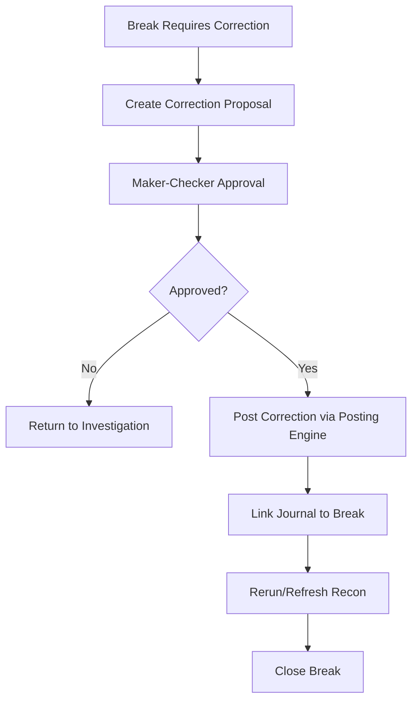

------
title: Learn Java Core Banking System - Part 022
description: Reconciliation in core banking: internal reconciliation, external statements, Nostro/Vostro, suspense account, break management, matching engine, evidence, aging, SLA, and accounting-safe correction.
series: learn-java-core-banking-system
seriesTitle: Learn Java Core Banking System
order: 22
partTitle: Reconciliation: Internal, External, Nostro, Suspense, and Break Management
tags:
- java
- core-banking
- reconciliation
- nostro
- suspense
- settlement
- ledger
- payments
- gl
- operations
- audit
- series
date: 2026-06-28
------

# Part 022 — Reconciliation: Internal, External, Nostro, Suspense, and Break Management

> Reconciliation adalah proses membuktikan bahwa dua representasi kebenaran finansial yang berbeda masih konsisten, atau jika tidak konsisten, perbedaannya diketahui, dimiliki, dijelaskan, dan diselesaikan.

Core banking tidak hidup sendirian. Ia berinteraksi dengan payment rail, card network, ATM switch, GL, treasury, statement eksternal, regulatory reporting, dan data warehouse. Setiap boundary dapat menciptakan perbedaan. Reconciliation adalah mekanisme untuk menemukan dan mengelola perbedaan itu.

Part ini membahas reconciliation sebagai **domain capability**, bukan hanya SQL compare. Kita akan membangun mental model internal/external reconciliation, Nostro/Vostro, suspense account, break lifecycle, matching engine, evidence, aging, SLA, dan Java architecture untuk recon yang aman.

---

## 1. Mengapa Reconciliation Penting?

Sebuah sistem core banking bisa saja:

1. semua API sukses;
2. semua transaction committed;
3. semua event terkirim;
4. semua batch selesai;
5. semua dashboard hijau.

Tetapi tetap salah jika:

1. settlement bank eksternal tidak cocok;
2. GL interface berbeda dengan subledger;
3. satu payment rail mengirim return yang tidak diproses;
4. suspense account menumpuk tanpa owner;
5. customer statement tidak cocok dengan ledger;
6. ATM dispense gagal tetapi account sudah didebit;
7. clearing file berisi transaksi yang tidak ada di internal system.

Reconciliation menjawab:

```txt
What did we think happened?
What did the external/internal counterparty think happened?
Where do they differ?
Who owns the difference?
What is the financial impact?
How will it be corrected?
What evidence proves closure?
```

---

## 2. Reconciliation Bukan Satu Jenis

Ada banyak reconciliation. Jangan desain satu generic recon table tanpa memahami domain.

| Jenis recon | Membandingkan | Tujuan |
|---|---|---|
| Account balance recon | account balance snapshot vs ledger postings | memastikan balance dapat dijelaskan dari journal |
| Subledger-GL recon | core banking subledger vs GL interface | memastikan financial accounting handoff benar |
| Payment rail recon | internal payment status vs clearing/settlement file | memastikan payment lifecycle benar |
| Bank statement recon | internal settlement account vs external bank statement | memastikan cash position eksternal cocok |
| Card settlement recon | authorization/clearing/settlement vs card network file | memastikan card financial impact benar |
| ATM cash recon | ATM switch + cash cassette + account debit | memastikan cash dispense dan debit cocok |
| Suspense recon | suspense balance vs open break items | memastikan suspense bisa dijelaskan |
| Report recon | regulatory/report extract vs source ledger | memastikan report tidak kehilangan data |

Mental model:

```txt
Reconciliation is not one engine. It is one capability with many domain-specific matching policies.
```

---

## 3. Internal vs External Reconciliation

### 3.1 Internal reconciliation

Internal reconciliation membandingkan dua representasi internal.

Contoh:

1. ledger postings vs account balance snapshot;
2. subledger vs GL staging;
3. payment command table vs ledger accounting event;
4. EOD generated statement vs ledger entries;
5. suspense balance vs open break list.

Kelebihan:

1. data format bisa dikontrol;
2. latency lebih rendah;
3. evidence lebih lengkap;
4. matching rule lebih deterministic.

### 3.2 External reconciliation

External reconciliation membandingkan internal record dengan record pihak luar.

Contoh:

1. clearing file;
2. settlement report;
3. Nostro statement;
4. card network settlement file;
5. ATM switch report;
6. correspondent bank statement;
7. ISO 20022 `camt` statement.

Tantangan:

1. format berbeda;
2. waktu terima berbeda;
3. cutover/cutoff berbeda;
4. reference tidak selalu sama;
5. amount bisa net vs gross;
6. fee bisa dipotong eksternal;
7. timezone dan value date berbeda;
8. reversal/return datang belakangan.

---

## 4. Nostro, Vostro, Settlement Account, dan Suspense

### 4.1 Nostro/Vostro secara praktis

Dalam konteks bank:

- **Nostro**: rekening bank kita yang berada di bank lain.
- **Vostro**: rekening bank lain yang berada di bank kita.

Contoh sederhana:

```txt
Bank A menyimpan USD di Bank B.
Dari perspektif Bank A: rekening itu Nostro.
Dari perspektif Bank B: rekening itu Vostro.
```

Core banking perlu memahami Nostro/Vostro karena external settlement sering terjadi melalui rekening koresponden atau settlement account.

### 4.2 Settlement account

Settlement account adalah rekening internal/GL/subledger yang dipakai untuk menampung posisi settlement dengan pihak luar.

Contoh:

```txt
Customer A transfer IDR 1,000,000 ke bank lain.
Core debit Customer A.
Core credit Interbank Clearing Settlement Account.
Saat settlement final, settlement account diselesaikan terhadap external statement/clearing position.
```

### 4.3 Suspense account

Suspense account menampung transaksi yang belum bisa diklasifikasi atau diselesaikan.

Suspense bukan tempat sampah.

Invariant:

```txt
Every suspense movement must map to an open break, exception, or clearing item with owner, reason, aging, and resolution path.
```

Jika suspense balance ada tetapi tidak ada break item yang menjelaskannya, sistem lemah.

---

## 5. Anatomy of a Reconciliation Item

Reconciliation item harus cukup kaya untuk matching dan audit.

```java
public record ReconItem(
    String sourceSystem,
    String sourceRecordId,
    ReconSide side,
    LocalDate businessDate,
    LocalDate valueDate,
    LocalDate settlementDate,
    String currency,
    BigDecimal amount,
    AmountSign sign,
    String accountRef,
    String counterpartyRef,
    String paymentReference,
    String endToEndId,
    String instructionId,
    String transactionType,
    String status,
    Map<String, String> attributes,
    String rawPayloadHash
) {}

public enum ReconSide {
    INTERNAL,
    EXTERNAL
}
```

Field yang sering kritikal:

| Field | Mengapa penting |
|---|---|
| business date | matching berdasarkan operational date |
| value date | matching berdasarkan economic date |
| settlement date | matching settlement statement |
| amount + currency | financial equality |
| sign | debit/credit perspective bisa berbeda |
| account ref | account/settlement account/suspense |
| payment reference | matching dengan payment rail |
| end-to-end id | ISO 20022/payment lifecycle |
| raw payload hash | evidence payload tidak berubah |

---

## 6. Matching Types

### 6.1 Exact one-to-one match

Satu internal item cocok dengan satu external item.

```txt
internal.amount == external.amount
internal.currency == external.currency
internal.endToEndId == external.endToEndId
```

### 6.2 Many-to-one match

Beberapa internal item cocok dengan satu external net settlement item.

Contoh:

```txt
100 outgoing payments netted into one settlement debit.
```

### 6.3 One-to-many match

Satu internal item dipecah menjadi beberapa external item.

Contoh:

```txt
One bulk payment instruction expanded into many clearing entries.
```

### 6.4 Many-to-many match

Kompleks dan harus dibatasi. Butuh rule kuat dan evidence.

### 6.5 Tolerance match

Amount berbeda dalam toleransi tertentu.

Ini berbahaya untuk core banking. Jangan gunakan tolerance tanpa reason code dan approval.

### 6.6 Fuzzy match

Mencocokkan berdasarkan similarity reference/text.

Gunakan hanya untuk candidate suggestion, bukan auto-closure, kecuali rule sangat kuat dan disetujui control owner.

---

## 7. Matching Rule Design

Matching rule harus versioned dan explainable.

```java
public record MatchingRule(
    String ruleId,
    String version,
    ReconType reconType,
    int priority,
    MatchCardinality cardinality,
    List<MatchPredicate> predicates,
    MatchAction action,
    boolean autoCloseAllowed,
    boolean approvalRequired
) {}
```

Contoh rule:

```txt
Rule: INTERBANK_OUTGOING_EXACT
Priority: 10
Cardinality: ONE_TO_ONE
Predicates:
- internal.endToEndId == external.endToEndId
- internal.currency == external.currency
- internal.amount == external.amount
- internal.settlementDate == external.settlementDate
Action: AUTO_MATCH_AND_CLOSE
```

Rule untuk amount mismatch:

```txt
Rule: INTERBANK_OUTGOING_FEE_DIFFERENCE
Priority: 30
Cardinality: ONE_TO_ONE
Predicates:
- internal.endToEndId == external.endToEndId
- internal.currency == external.currency
- external.amount == internal.amount - knownExternalFee
Action: MATCH_WITH_EXCEPTION
AutoClose: false
RequiresApproval: true
```

---

## 8. Reconciliation Lifecycle



Important:

```txt
Matched is not always Closed.
```

Match berarti items cocok. Closed berarti control owner menerima outcome dan evidence cukup.

---

## 9. Break Management

Break adalah perbedaan yang perlu diselesaikan.

```java
public record ReconBreak(
    String breakId,
    ReconType reconType,
    BreakStatus status,
    BreakReason reason,
    BreakSeverity severity,
    LocalDate detectedBusinessDate,
    BigDecimal financialImpact,
    String currency,
    String ownerTeam,
    String assignee,
    Instant slaDueAt,
    List<String> internalItemIds,
    List<String> externalItemIds,
    String narrative
) {}
```

### 9.1 Break reason taxonomy

| Reason | Makna |
|---|---|
| INTERNAL_MISSING | external ada, internal tidak ada |
| EXTERNAL_MISSING | internal ada, external tidak ada |
| AMOUNT_MISMATCH | reference cocok, amount beda |
| DATE_MISMATCH | amount/reference cocok, tanggal beda |
| STATUS_MISMATCH | internal settled, external returned/rejected |
| DUPLICATE_INTERNAL | internal duplicate |
| DUPLICATE_EXTERNAL | external duplicate |
| REFERENCE_MISSING | reference tidak cukup |
| UNMAPPED_ACCOUNT | account/GL mapping tidak dikenal |
| TIMING_DIFFERENCE | expected temporary difference |
| FEE_DIFFERENCE | fee eksternal tidak sama |
| FX_DIFFERENCE | kurs/rate difference |
| MANUAL_REVIEW | rule tidak cukup yakin |

### 9.2 Break severity

| Severity | Contoh |
|---|---|
| Critical | customer impact besar, ledger imbalance, settlement risk |
| High | amount material, overdue, regulatory impact |
| Medium | perlu investigasi tetapi tidak blocking close |
| Low | timing difference kecil within SLA |

---

## 10. Suspense Account as Controlled Temporary State

Suspense account dibutuhkan karena dunia nyata tidak selalu bersih.

Contoh penggunaan suspense:

1. incoming payment tanpa beneficiary account valid;
2. clearing item belum bisa dimapping;
3. unknown deposit;
4. ATM cash difference;
5. external fee difference;
6. settlement difference pending investigation.

### 10.1 Suspense posting pattern

```txt
Incoming external payment cannot be applied to customer.
Debit Nostro/Settlement Receivable
Credit Suspense - Unapplied Incoming Payment
Open recon break with same amount/reference.
```

Setelah resolved:

```txt
Debit Suspense - Unapplied Incoming Payment
Credit Customer Account
Close break with correction evidence.
```

### 10.2 Suspense invariant

```txt
Sum(open suspense break amounts by suspense account) == suspense account balance explainable portion
```

Jika tidak cocok, harus ada internal recon break.

---

## 11. Internal Balance Reconciliation

Internal balance recon memastikan account balance snapshot dapat dijelaskan oleh ledger.

### 11.1 Formula sederhana

```txt
openingBalance
+ sum(credits)
- sum(debits)
= closingBalance
```

Untuk account liability seperti deposit, tanda bisa berbeda tergantung internal convention. Yang penting convention konsisten.

### 11.2 SQL sketch

```sql
SELECT
    account_id,
    currency,
    opening_balance,
    SUM(CASE WHEN dr_cr = 'C' THEN amount ELSE 0 END) AS total_credit,
    SUM(CASE WHEN dr_cr = 'D' THEN amount ELSE 0 END) AS total_debit,
    closing_balance
FROM account_balance_recon_view
WHERE business_date = :business_date
GROUP BY account_id, currency, opening_balance, closing_balance
HAVING opening_balance
     + SUM(CASE WHEN dr_cr = 'C' THEN amount ELSE 0 END)
     - SUM(CASE WHEN dr_cr = 'D' THEN amount ELSE 0 END)
     <> closing_balance;
```

Dalam production, jangan bergantung pada satu query besar tanpa materialized evidence. Simpan output recon run dan control totals.

---

## 12. Subledger to GL Reconciliation

Tujuan:

```txt
Every accounting movement in core banking subledger must be represented in GL interface according to approved mapping.
```

### 12.1 Control level

| Level | Check |
|---|---|
| event level | setiap accounting event masuk GL batch |
| line level | setiap posting line punya GL mapping |
| amount level | debit/credit total cocok |
| account level | movement per GL account cocok |
| currency level | currency total cocok |
| product level | product control account cocok |
| batch level | GL batch accepted by GL system |

### 12.2 Common breaks

1. missing GL mapping;
2. duplicate GL extract;
3. posting after GL extract cutoff;
4. manual GL adjustment not reflected in subledger;
5. suspense not classified;
6. currency rounding difference;
7. incorrect product-to-GL mapping version;
8. failed GL file transfer;
9. GL rejected batch;
10. backdated transaction after GL close.

---

## 13. Payment Rail Reconciliation

Payment recon membandingkan internal payment lifecycle dengan rail/clearing status.

### 13.1 Outgoing payment example

Internal expects:

```txt
Payment P1: DEBITED_CUSTOMER -> SENT_TO_CLEARING -> ACCEPTED -> SETTLED
```

External says:

```txt
Payment P1: RETURNED
```

Break:

```txt
STATUS_MISMATCH: internal settled, external returned.
```

Resolution may require:

1. reverse customer debit;
2. post return fee;
3. update payment status;
4. notify channel;
5. close break.

### 13.2 Incoming payment example

External file contains incoming credit, but internal cannot find beneficiary account.

Resolution:

1. credit suspense;
2. open unapplied incoming break;
3. operations investigate;
4. apply to customer or return to sender;
5. close break.

---

## 14. Bank Statement / CAMT Reconciliation

External account statement reconciliation commonly uses bank statement messages/files. ISO 20022 `camt` messages belong to Bank-to-Customer Cash Management and are used for account reporting/reconciliation contexts.

Important: external statement perspective can invert debit/credit relative to internal ledger.

### 14.1 Statement normalization

```java
public interface ExternalStatementNormalizer {
    List<ReconItem> normalize(RawStatementFile file);
}
```

Normalizer responsibilities:

1. parse file;
2. validate schema/signature if applicable;
3. normalize currency/amount/sign;
4. extract transaction references;
5. map external account to internal settlement account;
6. preserve raw payload hash;
7. produce import control totals.

### 14.2 Import control totals

```txt
fileName=CAMT053_20260628.xml
statementAccount=IDR_NOSTRO_001
statementDate=2026-06-28
openingBalance=10,000,000,000
entryCount=5,221
debitTotal=3,200,000,000
creditTotal=2,950,000,000
closingBalance=9,750,000,000
rawPayloadHash=...
```

---

## 15. Reconciliation Architecture



Architecture principle:

```txt
Reconciliation may propose correction, but financial correction must go through posting engine.
```

Recon engine must not directly mutate balances.

---

## 16. Data Model Sketch

```sql
CREATE TABLE recon_run (
    id                    VARCHAR(64) PRIMARY KEY,
    recon_type            VARCHAR(80) NOT NULL,
    business_date         DATE NOT NULL,
    status                VARCHAR(40) NOT NULL,
    matching_rule_version VARCHAR(100) NOT NULL,
    started_at            TIMESTAMP NOT NULL,
    completed_at          TIMESTAMP NULL,
    created_by            VARCHAR(100) NOT NULL
);

CREATE TABLE recon_item (
    id                    VARCHAR(64) PRIMARY KEY,
    recon_run_id          VARCHAR(64) NOT NULL,
    side                  VARCHAR(20) NOT NULL,
    source_system         VARCHAR(100) NOT NULL,
    source_record_id      VARCHAR(200) NOT NULL,
    business_date         DATE,
    value_date            DATE,
    settlement_date       DATE,
    currency              CHAR(3) NOT NULL,
    amount                DECIMAL(38, 8) NOT NULL,
    amount_sign           VARCHAR(10) NOT NULL,
    account_ref           VARCHAR(200),
    payment_reference     VARCHAR(200),
    end_to_end_id         VARCHAR(200),
    status                VARCHAR(80),
    raw_payload_hash      VARCHAR(256),
    UNIQUE(source_system, source_record_id)
);

CREATE TABLE recon_match (
    id                    VARCHAR(64) PRIMARY KEY,
    recon_run_id          VARCHAR(64) NOT NULL,
    rule_id               VARCHAR(100) NOT NULL,
    rule_version          VARCHAR(100) NOT NULL,
    status                VARCHAR(40) NOT NULL,
    confidence            DECIMAL(10, 6) NOT NULL,
    explanation           VARCHAR(2000),
    created_at            TIMESTAMP NOT NULL
);

CREATE TABLE recon_match_item (
    match_id              VARCHAR(64) NOT NULL,
    recon_item_id         VARCHAR(64) NOT NULL,
    PRIMARY KEY(match_id, recon_item_id)
);

CREATE TABLE recon_break (
    id                    VARCHAR(64) PRIMARY KEY,
    recon_run_id          VARCHAR(64) NOT NULL,
    break_reason          VARCHAR(80) NOT NULL,
    severity              VARCHAR(40) NOT NULL,
    status                VARCHAR(40) NOT NULL,
    currency              CHAR(3),
    financial_impact      DECIMAL(38, 8),
    owner_team            VARCHAR(100),
    assignee              VARCHAR(100),
    detected_at           TIMESTAMP NOT NULL,
    sla_due_at            TIMESTAMP,
    closed_at             TIMESTAMP,
    closure_reason        VARCHAR(200)
);
```

---

## 17. Matching Engine Flow



Rule priority matters. Exact deterministic rules should run before fuzzy/tolerance rules.

---

## 18. Idempotency in Reconciliation

Recon import and matching must be idempotent.

### 18.1 File import idempotency

```txt
STATEMENT_IMPORT:{sourceSystem}:{externalAccount}:{statementDate}:{fileHash}
```

If same file comes again, do not create duplicate recon items.

If same file name but different hash comes, flag as suspicious.

### 18.2 Internal extraction idempotency

```txt
INTERNAL_RECON_EXTRACT:{reconType}:{businessDate}:{sourceSnapshotId}
```

### 18.3 Match idempotency

```txt
MATCH:{reconRunId}:{ruleVersion}:{sortedItemIdsHash}
```

---

## 19. Timing Differences

Not every break means error. Some are expected timing differences.

Examples:

1. internal payment sent today, settlement statement arrives tomorrow;
2. card authorization today, clearing days later;
3. bank statement cutoff differs from internal business date;
4. holiday calendar mismatch;
5. settlement finality delayed.

Timing difference still needs tracking.

```txt
Expected timing difference must age out into real break if not resolved within SLA.
```

Example aging:

| Age | Status |
|---|---|
| 0-1 day | expected timing |
| 2-3 days | warning |
| 4-5 days | investigation required |
| >5 days | escalation |

---

## 20. Correction Flow

Recon resolution can require financial correction, but correction must be controlled.



Never let recon workbench directly update account balance.

Correction proposal should include:

1. break id;
2. reason;
3. proposed accounting event;
4. affected accounts;
5. debit/credit lines;
6. customer impact;
7. GL impact;
8. required approval;
9. supporting evidence;
10. reversal strategy if wrong.

---

## 21. Reconciliation Evidence

Each match/break/closure must be explainable.

### 21.1 Match evidence

```java
public record MatchEvidence(
    String matchId,
    String ruleId,
    String ruleVersion,
    List<String> internalItemIds,
    List<String> externalItemIds,
    MatchCardinality cardinality,
    BigDecimal matchedInternalAmount,
    BigDecimal matchedExternalAmount,
    String explanation,
    Instant createdAt
) {}
```

### 21.2 Break closure evidence

```java
public record BreakClosureEvidence(
    String breakId,
    String closureReason,
    String closedBy,
    Instant closedAt,
    List<String> supportingArtifactRefs,
    List<String> correctionJournalIds,
    String narrative
) {}
```

Good closure narrative:

```txt
External statement entry EXT-9921 was unmatched because beneficiary account was missing in incoming payment payload. Amount IDR 1,000,000 was posted to Suspense-Unapplied-Incoming on 2026-06-28. Operations confirmed correct beneficiary account 1234567890 from sender bank amendment. Correction journal J-77881 moved amount from suspense to customer account on 2026-06-29. Break closed with approval AP-1119.
```

Bad closure narrative:

```txt
Fixed.
```

---

## 22. Reconciliation Control Totals

Recon run must produce control totals.

| Total | Example |
|---|---|
| internal item count | 10,000 |
| external item count | 9,998 |
| internal amount total | 1,250,000,000 |
| external amount total | 1,249,500,000 |
| matched count | 9,950 |
| matched amount | 1,240,000,000 |
| unmatched internal count | 40 |
| unmatched external count | 8 |
| amount mismatch count | 2 |
| break opened count | 50 |
| auto-closed count | 9,950 |
| manually closed count | 0 |
| suspense impact | 500,000 |

---

## 23. SLA and Ownership

Break without owner becomes hidden risk.

Ownership model:

| Break type | Owner |
|---|---|
| missing GL mapping | Finance systems/product config |
| unmatched incoming payment | Payment operations |
| ATM cash difference | ATM operations/cash management |
| card clearing mismatch | Card settlement operations |
| suspense aging | Finance control |
| duplicate debit | Core banking operations + incident team |
| external file missing | Integration operations |

SLA should depend on materiality and customer impact.

```java
public record BreakSlaPolicy(
    ReconType reconType,
    BreakReason reason,
    BreakSeverity severity,
    Duration responseDueIn,
    Duration resolutionDueIn,
    String escalationTeam
) {}
```

---

## 24. Materiality and Thresholds

Not all breaks have same severity. But be careful: small breaks can indicate systemic problem.

Materiality dimensions:

1. amount;
2. count;
3. age;
4. customer impact;
5. regulatory impact;
6. repeated pattern;
7. product/segment sensitivity;
8. suspense account exposure;
9. operational risk.

Example:

```txt
IDR 1,000 mismatch might be low severity.
IDR 1,000 mismatch repeated 100,000 times is critical.
```

---

## 25. Reconciliation and EOD/BOD

Recon integrates with EOD.

```txt
EOD can close only if mandatory reconciliation checks pass or approved exceptions exist.
```

Some recon is same-day blocker:

1. ledger balance recon;
2. subledger debit/credit balance;
3. GL extract control total;
4. critical suspense mismatch.

Some recon is delayed:

1. external settlement statement;
2. card settlement;
3. correspondent bank statement;
4. cross-border payment returns.

Delayed recon should not disappear. It becomes open expected item with SLA.

---

## 26. Reconciliation and BCBS 239 Mindset

Reconciliation supports risk data quality. A bank cannot claim complete, accurate, timely risk data if source ledger, subledger, GL, settlement, and report extracts cannot be reconciled.

Apply these principles practically:

| Principle mindset | Reconciliation implication |
|---|---|
| Accuracy | amounts and statuses must match or breaks must explain mismatch |
| Completeness | every relevant item from both sides must be imported |
| Timeliness | breaks must be detected within operational SLA |
| Adaptability | new recon rules/sources can be added without rewriting core ledger |
| Lineage | report number traces back to recon items and postings |

---

## 27. Reconciliation Anti-patterns

### 27.1 Spreadsheet as system of record

Spreadsheet can help investigation, but it should not be official break store.

### 27.2 Auto-close fuzzy matches without evidence

Fuzzy matching without explainability hides real losses.

### 27.3 Suspense without aging

Suspense without aging becomes a graveyard.

### 27.4 Manual balance update to fix recon

Never fix recon by updating balance. Post correction.

### 27.5 Ignoring sign perspective

Debit/credit sign differs by perspective. Normalize explicitly.

### 27.6 Matching only by amount

Amount-only match is dangerous. Use reference/date/account/currency/status.

### 27.7 No rule versioning

If matching rule changes, old closure must still be explainable by old rule version.

### 27.8 No import control totals

If external file import drops rows, matching result is meaningless.

---

## 28. Java Service Design

### 28.1 Reconciliation application service

```java
public final class ReconciliationApplicationService {
    private final ReconSourceExtractor sourceExtractor;
    private final ReconItemRepository itemRepository;
    private final MatchingEngine matchingEngine;
    private final BreakService breakService;
    private final ReconEvidenceService evidenceService;

    public ReconRunResult run(ReconRunCommand command) {
        ReconRun run = ReconRun.start(command.reconType(), command.businessDate(), command.ruleVersion());

        ReconExtraction extraction = sourceExtractor.extract(command);
        itemRepository.saveAll(run.id(), extraction.items());

        MatchingResult matching = matchingEngine.match(run.id(), command.ruleVersion());
        breakService.openBreaksFor(matching.unmatchedResults());

        evidenceService.record(run.id(), extraction.controlTotals(), matching.controlTotals());

        return ReconRunResult.from(run, matching.summary());
    }
}
```

### 28.2 Matching engine interface

```java
public interface MatchingEngine {
    MatchingResult match(String reconRunId, String ruleVersion);
}

public record MatchingResult(
    List<MatchEvidence> matches,
    List<UnmatchedResult> unmatchedResults,
    List<ControlTotal> controlTotals
) {}
```

### 28.3 Correction proposal

```java
public record CorrectionProposal(
    String proposalId,
    String breakId,
    String reasonCode,
    List<ProposedPostingLine> postingLines,
    BigDecimal financialImpact,
    String currency,
    String narrative,
    ApprovalRequirement approvalRequirement
) {}
```

---

## 29. Matching Example: Internal Transfer Should Not Need External Recon

Internal transfer between two accounts in the same core:

```txt
Debit Account A
Credit Account B
```

Mandatory recon:

1. journal debit = journal credit;
2. Account A balance mutation matches debit line;
3. Account B balance mutation matches credit line;
4. statement entries generated for both accounts;
5. no external settlement needed.

If internal transfer appears in external settlement recon, boundary is likely wrong.

---

## 30. Matching Example: Interbank Outgoing Transfer

### Internal records

```txt
Payment P100
Customer debit: IDR 1,000,000
Settlement credit: IDR 1,000,000
Status: SENT_TO_CLEARING
EndToEndId: E2E-789
SettlementDate: 2026-06-28
```

### External clearing file

```txt
EndToEndId: E2E-789
Amount: IDR 1,000,000
Status: ACCEPTED
SettlementDate: 2026-06-28
```

Outcome:

```txt
Matched. Update payment status to SETTLED if settlement finality criteria met.
```

If external says returned:

```txt
Open STATUS_MISMATCH break.
Correction may reverse customer debit and settlement posting.
```

---

## 31. Matching Example: ATM Dispense Failure

Scenario:

1. customer withdraws IDR 500,000;
2. core debits account;
3. ATM switch reports dispense failure;
4. cash cassette shows no cash dispensed.

Break:

```txt
ATM_DISPENSE_MISMATCH
Internal: customer debited
External/switch/cash: cash not dispensed
```

Resolution:

1. reverse debit;
2. notify customer;
3. close break with ATM switch evidence;
4. include in ATM cash recon.

---

## 32. Testing Reconciliation

Test recon with adversarial scenarios.

### 32.1 Unit-level tests

1. exact match;
2. amount mismatch;
3. sign inversion;
4. missing reference;
5. duplicate external item;
6. duplicate internal item;
7. many-to-one match;
8. timing difference;
9. rule priority;
10. rule version persistence.

### 32.2 Property tests

Useful invariant:

```txt
For all closed matches, sum(internal normalized signed amount) == sum(external normalized signed amount), unless match reason explicitly allows difference and creates approved break/correction.
```

### 32.3 E2E tests

1. import clearing file;
2. normalize items;
3. match exact records;
4. open break for unmatched;
5. propose correction;
6. approve correction;
7. post correction;
8. rerun recon;
9. close break;
10. verify evidence.

---

## 33. Operational Dashboard

A reconciliation dashboard should not just say “98% matched”. It should expose risk.

Required views:

1. match rate by recon type;
2. unmatched amount by currency;
3. break aging;
4. critical breaks;
5. suspense balance vs open breaks;
6. external file missing;
7. repeated break reasons;
8. SLA breach;
9. top owner teams;
10. correction pending approval;
11. GL blocking breaks;
12. customer-impacting breaks.

Example summary:

```txt
Recon Date: 2026-06-28
Type: Interbank Outgoing Settlement
Internal Items: 250,000 / IDR 4.2T
External Items: 249,998 / IDR 4.199T
Matched: 249,950 / IDR 4.198T
Open Breaks: 50 / IDR 2B
Critical: 2
SLA Breach: 0
Suspense Impact: IDR 500M
EOD Blocking: Yes
```

---

## 34. Practical Design Checklist

Sebelum menganggap recon capability matang, jawab:

1. Apa recon type yang mandatory untuk EOD?
2. Apa source of truth untuk masing-masing side?
3. Apakah import external file idempotent?
4. Apakah external file punya control totals?
5. Apakah sign perspective dinormalisasi eksplisit?
6. Apakah matching rule versioned?
7. Apakah fuzzy matching hanya suggestion atau auto-close?
8. Apakah setiap suspense movement punya break owner?
9. Apakah break punya SLA dan severity?
10. Apakah correction lewat posting engine?
11. Apakah closure evidence cukup untuk audit?
12. Apakah timing differences punya aging rule?
13. Apakah GL recon bisa trace dari event ke GL batch?
14. Apakah statement recon bisa trace raw file hash?
15. Apakah duplicate internal/external item terdeteksi?
16. Apakah unmatched amount terlihat per currency/account/product?
17. Apakah correction journal link ke break?
18. Apakah recon dashboard menampilkan risk, bukan hanya match percentage?
19. Apakah old recon tetap explainable setelah rule berubah?
20. Apakah recon data masuk retention policy?

---

## 35. Deliberate Practice

### Latihan 1 — Design Recon Type Catalog

Buat katalog 10 recon type untuk bank retail digital. Untuk tiap recon type, tulis:

1. internal source;
2. external source;
3. frequency;
4. mandatory control totals;
5. blocker atau non-blocker untuk EOD;
6. owner team.

### Latihan 2 — Matching Rule Versioning

Rancang matching rule table dan jelaskan bagaimana match lama tetap bisa diaudit setelah rule berubah.

### Latihan 3 — Suspense Aging

Buat suspense aging policy untuk:

1. incoming unidentified payment;
2. card settlement difference;
3. ATM cash difference;
4. GL mapping suspense.

### Latihan 4 — Correction Proposal

Ambil scenario external returned payment tetapi internal already settled. Rancang correction proposal lengkap dengan posting lines, approval, evidence, dan customer notification.

### Latihan 5 — Recon Dashboard

Desain dashboard untuk Head of Operations. Jangan tampilkan technical logs; tampilkan operational risk.

---

## 36. Ringkasan Mental Model

Reconciliation adalah capability yang menjaga bank dari ilusi kebenaran.

Pegang tiga prinsip:

```txt
1. Every difference must be known.
2. Every known difference must have owner, reason, age, and resolution path.
3. Every financial correction must go through controlled posting, not direct mutation.
```

Core banking engineer yang kuat tidak berhenti di:

> "Transaksi sudah committed."

Ia bertanya:

1. apakah pihak eksternal melihat hal yang sama;
2. apakah GL melihat hal yang sama;
3. apakah statement melihat hal yang sama;
4. apakah suspense bisa dijelaskan;
5. apakah break aging terkendali;
6. apakah correction audit-safe;
7. apakah angka report bisa ditelusuri ke source.

Di banking, correctness bukan hanya property internal. Correctness harus **direkonsiliasi** terhadap dunia luar.

---

## 37. Referensi

- ISO 20022, *Bank-to-Customer Cash Management message definitions*.
- CPMI-IOSCO, *Principles for financial market infrastructures*.
- Basel Committee on Banking Supervision, *BCBS 239: Principles for effective risk data aggregation and risk reporting*.
- FFIEC, *Architecture, Infrastructure, and Operations Booklet*, Information Technology Examination Handbook.
- PCI Security Standards Council, *PCI DSS*.
