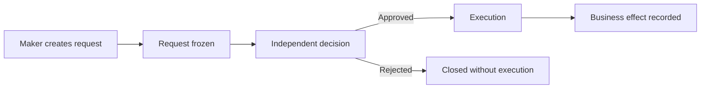
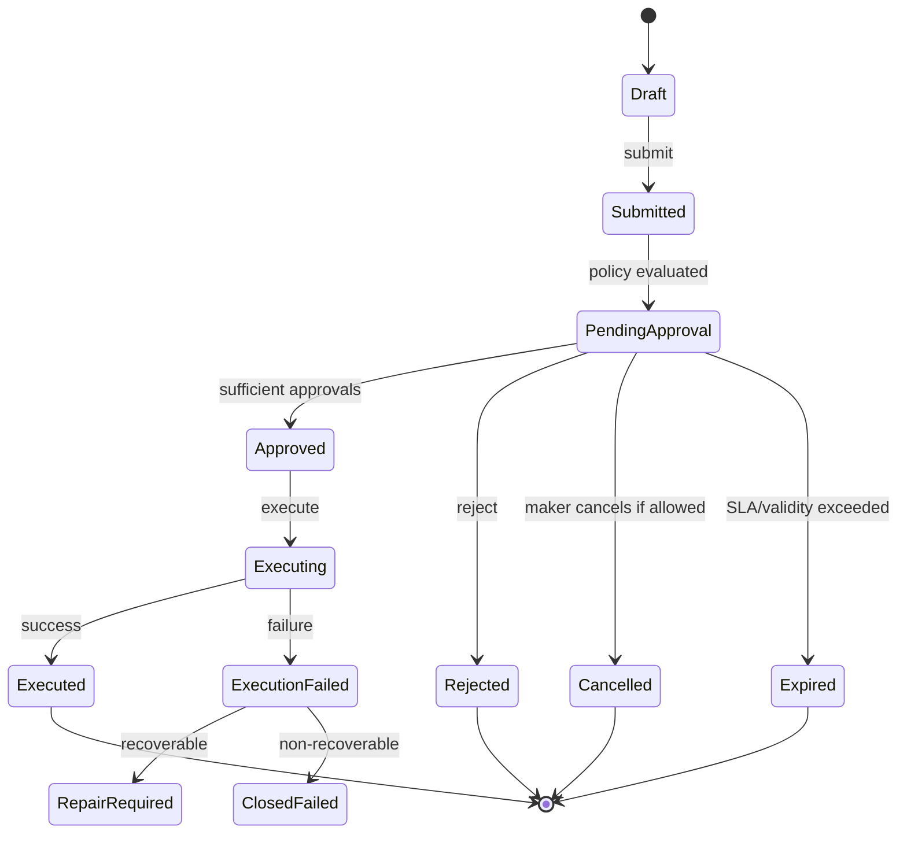
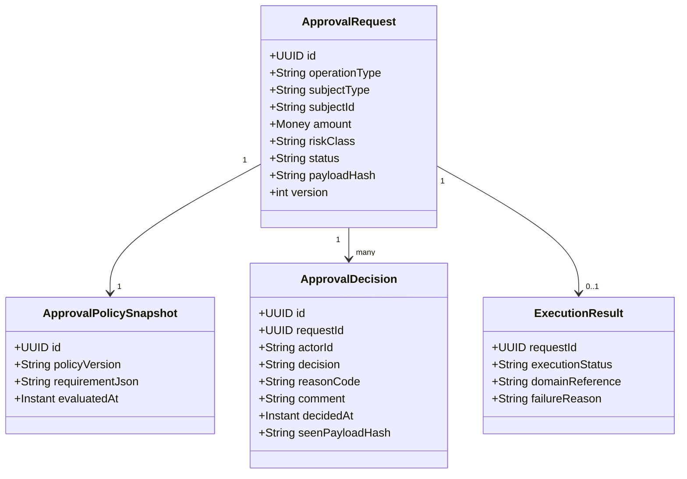
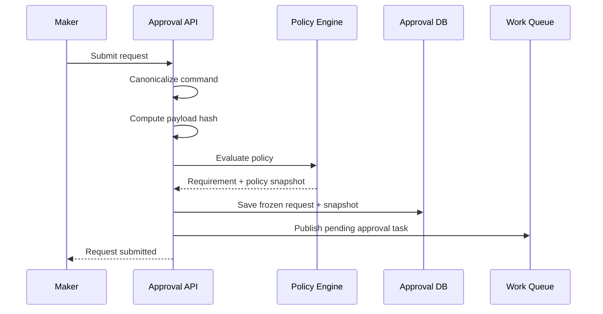
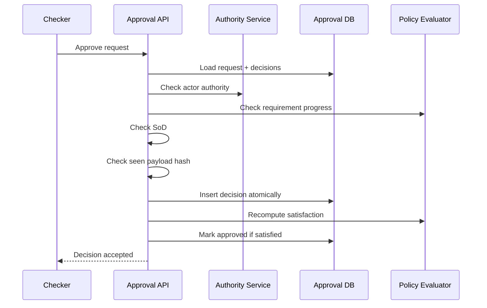
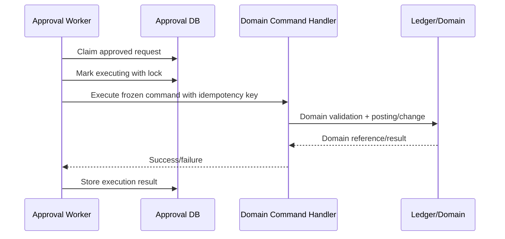

------
title: Learn Java Core Banking System - Part 023
description: Maker-checker, four-eyes approval, segregation of duties, approval matrix, operational controls, override governance, evidence, and Java architecture for banking-grade approval workflows.
series: learn-java-core-banking-system
seriesTitle: Learn Java Core Banking System
order: 23
partTitle: Maker-Checker, Four-Eyes Approval, and Operational Control
tags:
- java
- core-banking
- maker-checker
- four-eyes
- segregation-of-duties
- approval
- operational-control
- audit
- workflow
- banking
- series
date: 2026-06-28
------

# Part 023 — Maker-Checker, Four-Eyes Approval, and Operational Control

> Maker-checker bukan sekadar fitur "submit lalu approve". Dalam core banking, maker-checker adalah mekanisme kontrol untuk mencegah fraud, mengurangi human error, membatasi privilege abuse, dan membuat keputusan operasional dapat dibuktikan.

Banyak engineer membangun approval workflow seperti task management biasa: ada `created`, `approved`, `rejected`. Itu tidak cukup untuk banking.

Di core banking, sebuah approval dapat mengubah uang, limit, product parameter, GL mapping, customer risk status, fee waiver, backdated posting, settlement repair, atau data yang akan masuk regulatory reporting. Maka approval harus punya:

1. **subject** yang jelas: apa yang sedang diminta;
2. **materiality** yang jelas: dampak finansial/risiko;
3. **authority** yang jelas: siapa boleh menyetujui;
4. **independence** yang jelas: approver tidak boleh pihak yang sama/konflik;
5. **evidence** yang jelas: apa yang dilihat approver saat mengambil keputusan;
6. **immutability** yang cukup: request tidak berubah diam-diam setelah disetujui;
7. **execution semantics** yang jelas: kapan efek finansial benar-benar terjadi.

Part ini fokus pada desain maker-checker dan operational control sebagai **domain capability**. Kita tidak akan mengulang BPMN/Camunda, security authorization basic, atau observability basic. Kita akan membahas mental model, invariant, approval matrix, Java architecture, state machine, race condition, evidence, dan failure mode.

---

## 1. Core Problem

Dalam core banking, banyak operasi tidak boleh langsung dieksekusi oleh satu orang walaupun orang itu terautentikasi.

Contoh operasi berisiko:

| Operasi | Risiko |
|---|---|
| Manual account debit/credit | langsung mengubah uang |
| Backdated posting | mengubah posisi historis/reporting |
| Interest rate override | mempengaruhi accrual masa depan |
| Fee waiver besar | income leakage |
| GL mapping change | salah financial statement |
| Product parameter release | mempengaruhi banyak account |
| Dormant account reactivation | fraud risk |
| Customer risk status override | AML/fraud impact |
| Payment repair | salah kirim dana |
| Suspense clearing | menyembunyikan break |
| Loan restructure | credit-risk/reporting impact |

Autentikasi menjawab:

```txt
Who are you?
```

Authorization menjawab:

```txt
Are you allowed to perform this action?
```

Maker-checker menjawab:

```txt
Even if you are allowed to initiate it, should this action require independent review before becoming effective?
```

Itu perbedaan penting.

---

## 2. Mental Model: Request, Decision, Execution

Approval workflow harus dipisahkan menjadi tiga tahap:



Jangan campur `approval` dengan `execution`.

Approval adalah keputusan kontrol. Execution adalah perubahan domain.

Contoh:

```txt
Approve manual debit request != debit account already happened
```

Desain aman:

1. maker menyusun request;
2. request divalidasi dan di-freeze;
3. checker melihat snapshot request;
4. checker approve/reject;
5. executor menjalankan command domain;
6. result dipersist dan diaudit.

Ini memberi ruang untuk:

1. pre-execution validation;
2. approval matrix evaluation;
3. SoD validation;
4. stale request check;
5. limit check;
6. final execution validation;
7. evidence capture.

---

## 3. Maker-Checker Bukan Satu Pola

Ada beberapa variasi kontrol.

| Pola | Makna | Contoh |
|---|---|---|
| Single approval | satu checker cukup | update alamat non-material |
| Dual control | dua pihak harus setuju | manual journal besar |
| Sequential approval | approval harus berurutan | branch manager lalu operations head |
| Parallel approval | beberapa approval bisa paralel | legal + compliance |
| Quorum approval | minimum N dari M approver | emergency operational release |
| Tiered approval | level berdasarkan amount/risk | fee waiver > threshold |
| Maker-checker-executor | maker dan checker berbeda dari executor | sensitive batch release |
| Committee approval | keputusan kolektif | large loan restructure |
| Break-glass approval | emergency dengan post-review | production incident financial repair |

Top engineer tidak bertanya "pakai maker-checker atau tidak?". Pertanyaannya:

```txt
Jenis kontrol apa yang sesuai dengan risiko operasi ini?
```

---

## 4. Domain Vocabulary

Gunakan vocabulary eksplisit. Jangan semua disebut `Task`.

| Istilah | Definisi |
|---|---|
| Approval Request | object yang mewakili permintaan perubahan sensitif |
| Maker | actor yang membuat request |
| Checker | actor yang memberi keputusan approval/rejection |
| Approver | role umum untuk checker; bisa satu atau banyak |
| Approval Policy | aturan yang menentukan approval requirement |
| Approval Matrix | mapping operation + risk + amount + org + role ke requirement |
| Segregation of Duties | aturan pemisahan peran yang konflik |
| Decision Snapshot | data yang dilihat approver saat approve/reject |
| Execution Command | command domain yang dijalankan setelah approved |
| Approval Evidence | record yang membuktikan decision context |
| Override | keputusan sadar untuk melewati rule normal dengan authority tertentu |
| Exception | kasus yang tidak dapat diproses normal dan butuh manual handling |

---

## 5. Apa yang Harus Di-control?

Jangan membangun maker-checker universal untuk semua action. Itu membuat operasi lambat dan orang akan mencari jalan pintas.

Gunakan risk-based classification.

```txt
Control intensity = f(financial impact, reversibility, fraud risk, compliance impact, blast radius, automation confidence)
```

### 5.1 Financial Impact

Semakin besar nominal atau semakin langsung ke ledger, semakin tinggi kontrol.

Contoh:

| Amount | Requirement |
|---:|---|
| <= 100 USD | no approval atau post-monitoring |
| > 100 sampai 10,000 USD | one checker |
| > 10,000 sampai 100,000 USD | branch manager + operations |
| > 100,000 USD | senior operations + risk/compliance |

Angka di atas contoh desain, bukan aturan universal. Bank harus mengikuti policy internal dan regulasi lokal.

### 5.2 Reversibility

Tidak semua kesalahan mudah dibatalkan.

| Operasi | Mudah dibalik? | Kontrol |
|---|---:|---|
| Customer note update | relatif mudah | rendah |
| Fee waiver | sedang | menengah |
| External payment release | sulit | tinggi |
| GL mapping release | berdampak luas | tinggi |
| Write-off | material | tinggi |

### 5.3 Blast Radius

Product parameter change bisa mempengaruhi ribuan account. Satu manual debit hanya satu account tetapi uang langsung berubah. Keduanya berisiko dengan cara berbeda.

| Risiko | Contoh |
|---|---|
| Per-customer | account restriction removal |
| Per-account | manual debit |
| Per-product | rate parameter change |
| Per-book | EOD correction run |
| Per-bank | GL mapping change |

### 5.4 Compliance Impact

Perubahan pada AML status, sanctions override, dormant reactivation, KYC status, dan customer risk rating tidak boleh dianggap sebagai update biasa.

---

## 6. State Machine Approval Request

State machine minimal:



State penting:

| State | Makna |
|---|---|
| Draft | request belum frozen; maker masih bisa edit |
| Submitted | maker menyatakan siap direview |
| PendingApproval | policy sudah dievaluasi dan menunggu decision |
| Approved | requirement terpenuhi, belum tentu executed |
| Executing | efek domain sedang dijalankan |
| Executed | efek domain berhasil tercatat |
| ExecutionFailed | approval ada, tetapi execution gagal |
| RepairRequired | butuh handling operasional |

Anti-pattern:

```txt
APPROVED = DONE
```

Dalam banking, approved belum tentu executed. Execution bisa gagal karena account closed, balance berubah, EOD freeze, duplicate idempotency, atau external rail unavailable.

---

## 7. Invariant Maker-Checker

Approval engine harus menjaga invariant berikut.

### 7.1 Maker Tidak Boleh Menyetujui Request Sendiri

```txt
makerActorId != checkerActorId
```

Tetapi ini tidak cukup.

Actor bisa punya beberapa user ID, delegated access, atau shared account. Maka perlu:

1. unique employee/person identity;
2. access session identity;
3. role identity;
4. organization unit identity;
5. delegation context;
6. device/channel context jika relevan.

### 7.2 Checker Harus Punya Authority pada Saat Decision

Approver authority harus dicek saat decision, bukan hanya saat request dibuat.

```txt
checker.hasAuthority(operation, risk, amount, org, businessDate, decisionTime)
```

### 7.3 Request yang Di-approve Harus Sama dengan Request yang Dilihat

Jika maker mengubah request setelah checker melihatnya, approval tidak sah.

Gunakan `requestHash` atau `payloadVersion`.

```txt
decision.approvedRequestHash == approvalRequest.currentFrozenHash
```

### 7.4 Approval Requirement Harus Berdasarkan Snapshot Policy yang Jelas

Ada dua pilihan:

| Mode | Konsekuensi |
|---|---|
| Policy evaluated at submission | stabil, request tidak berubah karena config baru |
| Policy evaluated at decision/execution | lebih adaptif, tetapi bisa mengejutkan |

Untuk operasi finansial, umumya simpan **policy snapshot** saat submission dan lakukan **safety recheck** saat execution.

### 7.5 Execution Harus Idempotent

Approval retry tidak boleh membuat posting ganda.

```txt
executionIdempotencyKey = approvalRequestId + operationType + frozenPayloadHash
```

### 7.6 Approval Tidak Menghapus Kebutuhan Validasi Domain

Approval bukan bypass correctness.

Checker boleh approve manual debit, tetapi posting engine tetap harus menolak jika account closed, insufficient balance, duplicate, frozen, atau melanggar regulatory hold.

---

## 8. Approval Matrix

Approval matrix adalah policy yang menjawab:

```txt
For this operation, risk, amount, product, org, and customer segment, what approvals are required?
```

Contoh conceptual matrix:

| Operation | Condition | Requirement |
|---|---|---|
| MANUAL_DEBIT | amount <= branchLimit | 1 branch supervisor |
| MANUAL_DEBIT | amount > branchLimit | branch manager + operations manager |
| FEE_WAIVER | customer segment = VIP | relationship manager + product owner |
| RATE_OVERRIDE | loan product | credit officer + risk manager |
| GL_MAPPING_CHANGE | any | finance controller + operations head |
| DORMANT_REACTIVATION | any | branch manager + compliance review |
| PAYMENT_REPAIR | cross-border | operations + compliance |

Approval matrix tidak boleh hanya berupa table UI. Ia adalah policy system.

---

## 9. Approval Requirement Model

Representasikan requirement sebagai data.

```java
public sealed interface ApprovalRequirement
        permits SingleRoleApproval, MultiRoleApproval, QuorumApproval, SequentialApproval {
}

public record SingleRoleApproval(
        String roleCode,
        int minimumCount,
        SegregationRule segregationRule
) implements ApprovalRequirement {
}

public record MultiRoleApproval(
        List<String> requiredRoleCodes,
        SegregationRule segregationRule
) implements ApprovalRequirement {
}

public record QuorumApproval(
        String approverPoolCode,
        int requiredCount,
        SegregationRule segregationRule
) implements ApprovalRequirement {
}

public record SequentialApproval(
        List<ApprovalRequirement> steps
) implements ApprovalRequirement {
}
```

Jangan simpan hanya:

```txt
requiredApproverRole = MANAGER
```

Itu terlalu miskin. Banking membutuhkan kombinasi role, limit, sequence, quorum, SoD, dan escalation.

---

## 10. Segregation of Duties

Segregation of Duties atau SoD adalah kontrol untuk mencegah satu actor menguasai seluruh siklus tindakan berisiko.

Contoh konflik:

| Role/Action A | Tidak boleh digabung dengan |
|---|---|
| Maker manual debit | Checker manual debit untuk request yang sama |
| Product config editor | Product config approver |
| GL mapper | GL mapping approver |
| Payment repair maker | Payment repair final approver |
| Suspense item owner | Suspense write-off approver |
| User access admin | Own access approver |

SoD bukan hanya role. Ia juga bisa berbasis:

1. actor identity;
2. employment identity;
3. branch/organization;
4. reporting line;
5. relationship manager assignment;
6. conflict-of-interest flag;
7. previous action on same request;
8. previous action on related case.

---

## 11. Domain Model

Model konseptual:



`ApprovalRequest` tidak boleh menyimpan object domain secara mutable. Simpan frozen payload atau command envelope.

---

## 12. Canonical Approval Request

Contoh record:

```java
public record ApprovalRequest(
        ApprovalRequestId id,
        OperationType operationType,
        SubjectRef subject,
        ActorRef maker,
        OrganizationRef organization,
        RiskClassification risk,
        Optional<Money> amount,
        CommandEnvelope commandEnvelope,
        PayloadHash payloadHash,
        ApprovalStatus status,
        PolicySnapshot policySnapshot,
        Instant submittedAt,
        BusinessDate businessDate,
        long version
) {
    public boolean isFrozen() {
        return status != ApprovalStatus.DRAFT;
    }
}
```

`commandEnvelope` harus cukup untuk execution, tetapi tidak boleh mengandung data sensitif yang tidak perlu.

---

## 13. Command Envelope

Command envelope memisahkan workflow approval dari domain execution.

```java
public record CommandEnvelope(
        String commandType,
        String commandVersion,
        String canonicalJson,
        String canonicalHash,
        Map<String, String> metadata
) {
}
```

Contoh metadata:

```txt
sourceChannel=TELLER
caseId=CASE-2026-000123
customerId=CUST-001
accountId=ACC-001
businessDate=2026-06-28
reasonCode=MANUAL_ADJUSTMENT
```

Kenapa canonical JSON?

1. approval engine tidak perlu depend ke semua domain class;
2. snapshot bisa disimpan stabil;
3. hash bisa dihitung deterministik;
4. request bisa dieksekusi oleh handler sesuai `commandType`;
5. versioning command lebih eksplisit.

---

## 14. Payload Hash

Payload hash dipakai untuk memastikan approver menyetujui data yang sama.

```java
public interface PayloadHasher {
    PayloadHash hashCanonicalPayload(String canonicalJson);
}
```

Prinsip:

1. canonical serialization deterministic;
2. field order stabil;
3. timezone normalisasi ke UTC untuk timestamp;
4. amount normalisasi ke minor unit/currency;
5. exclude field non-substantive seperti UI expanded section;
6. include reason code, amount, account, value date, fee/tax impact, dan material attributes.

Anti-pattern:

```txt
Hash raw UI JSON body apa adanya.
```

UI JSON bisa berubah karena field order, whitespace, atau field tampilan. Hash harus canonical.

---

## 15. Policy Evaluation Flow



Policy evaluation output harus explainable:

```json
{
  "policyVersion": "approval-policy-2026-06-01",
  "matchedRules": [
    "MANUAL_DEBIT",
    "AMOUNT_GT_10000",
    "BRANCH_OPERATION"
  ],
  "requirements": [
    {
      "type": "ROLE_APPROVAL",
      "role": "BRANCH_MANAGER",
      "count": 1
    },
    {
      "type": "ROLE_APPROVAL",
      "role": "OPERATIONS_MANAGER",
      "count": 1
    }
  ]
}
```

Tanpa explainability, approval matrix menjadi black box.

---

## 16. Decision Flow



Decision harus insert-only. Jangan overwrite decision lama.

---

## 17. Execution Flow



Execution harus menggunakan idempotency key yang stabil:

```txt
approval:{approvalRequestId}:{payloadHash}:{commandType}
```

Jika worker crash setelah domain success tetapi sebelum approval status update, recovery dapat query domain reference by idempotency key.

---

## 18. Final Validation Saat Execution

Approval valid bukan berarti execution pasti valid.

Final validation perlu karena dunia berubah antara submission dan execution:

| Perubahan | Dampak |
|---|---|
| account closed | manual debit tidak boleh dieksekusi |
| account frozen | withdrawal blocked |
| balance berubah | insufficient funds |
| business date berubah | value date mungkin invalid |
| product parameter berubah | fee/interest impact berbeda |
| customer sanctions hit | payment harus hold/reject |
| EOD freeze aktif | posting harus ditunda |

Maka domain handler harus tetap melakukan validation penuh.

Approval engine tidak boleh memiliki bypass seperti:

```java
postingService.forcePostBecauseApproved(command);
```

Lebih aman:

```java
postingService.postApprovedOperationalCommand(command, approvalEvidenceRef);
```

Nama method boleh menunjukkan approval context, tetapi invariant domain tetap dipertahankan.

---

## 19. Approval Evidence

Checker harus melihat informasi yang cukup. Evidence minimal:

| Evidence | Contoh |
|---|---|
| request summary | manual debit 5,000 USD from account X |
| financial impact | debit customer liability, credit income/suspense |
| current state | account active, balance available |
| reason | correction of duplicated fee |
| maker | teller A, branch B |
| supporting documents | case attachment, recon break id |
| policy requirement | branch manager approval required |
| risk flags | dormant account, high-risk customer |
| prior decisions | rejected before by X |
| similar history | last 30-day manual adjustment total |

Approval UI harus menampilkan decision snapshot, bukan data live yang bisa berubah tanpa jejak.

---

## 20. Decision Snapshot

Decision snapshot adalah data yang approver lihat saat approve/reject.

```java
public record DecisionSnapshot(
        ApprovalRequestId requestId,
        PayloadHash payloadHash,
        String renderedSummary,
        Map<String, String> materialFacts,
        List<RiskFlag> riskFlags,
        List<EvidenceRef> supportingEvidence,
        Instant renderedAt
) {
}
```

Contoh material facts:

```txt
accountStatus=ACTIVE
ledgerBalance=12000.00 USD
availableBalance=9000.00 USD
manualDebitAmount=5000.00 USD
reasonCode=DUPLICATE_CREDIT_CORRECTION
caseId=CASE-2026-991
```

Jika material facts berubah sebelum execution, system boleh:

1. tetap execute jika perubahan irrelevant;
2. require re-approval jika material;
3. fail execution dan kirim ke repair.

---

## 21. Authority Model

Authority tidak sama dengan role string.

Authority sebaiknya dihitung dari:

1. actor identity;
2. active session;
3. organization scope;
4. role assignments;
5. delegation;
6. approval limits;
7. temporal validity;
8. product scope;
9. branch scope;
10. risk scope.

Contoh:

```java
public record ApprovalAuthority(
        ActorRef actor,
        Set<String> roleCodes,
        OrganizationScope organizationScope,
        Set<ProductCode> productScope,
        MoneyLimit approvalLimit,
        Instant validFrom,
        Optional<Instant> validUntil
) {
    boolean canApprove(ApprovalRequest request) {
        return organizationScope.covers(request.organization())
                && approvalLimit.covers(request.amount())
                && productScope.contains(request.subject().productCode())
                && roleCodes.stream().anyMatch(request.policySnapshot()::requiresRole);
    }
}
```

Hindari hardcode:

```java
if (user.role().equals("MANAGER")) approve();
```

Banking authority jarang sesederhana itu.

---

## 22. Limit Model

Approval limit perlu memperhitungkan currency, product, operation, dan period aggregation.

| Limit | Makna |
|---|---|
| per transaction limit | max per approval |
| daily approval limit | akumulasi per hari |
| customer exposure limit | total terhadap customer tertentu |
| branch limit | total branch operation |
| product-specific limit | hanya untuk product tertentu |
| exception limit | khusus override/repair |

Contoh:

```java
public record ApprovalLimit(
        OperationType operationType,
        Currency currency,
        BigDecimal maxPerTransaction,
        Optional<BigDecimal> maxDailyAggregate,
        Optional<String> productCode
) {
}
```

Untuk multi-currency, jangan konversi diam-diam tanpa rate snapshot dan policy. Limit evaluation harus dapat dijelaskan.

---

## 23. Multiple Approvals dan Quorum

Jika requirement butuh dua approver, jangan hanya hitung jumlah decision.

Salah:

```sql
select count(*) from approval_decision
where request_id = ? and decision = 'APPROVE';
```

Benar: cocokkan decision dengan requirement.

```txt
Requirement:
- one BRANCH_MANAGER
- one OPERATIONS_MANAGER
- no approver may be maker
- approvers must be distinct persons
```

Maka dua approval dari dua user berbeda tetapi role sama belum cukup.

---

## 24. Rejection dan Resubmission

Rejected request sebaiknya immutable closed. Jika maker ingin memperbaiki, buat request baru yang menaut ke request lama.

```txt
REQ-100 rejected
REQ-101 supersedes REQ-100
```

Kenapa?

1. audit lebih jelas;
2. checker decision tidak melekat ke payload yang berubah;
3. timeline tidak ambigu;
4. metric rejection/resubmission bisa dihitung.

Boleh ada draft sebelum submit yang editable. Setelah submit/freeze, perubahan material harus membuat versi/request baru.

---

## 25. Cancellation

Siapa boleh cancel?

| State | Cancellation policy |
|---|---|
| Draft | maker boleh cancel |
| PendingApproval | maker boleh cancel jika belum ada approval, atau sesuai policy |
| Approved | biasanya tidak boleh cancel; gunakan execution cancel jika belum executed |
| Executing | tidak boleh cancel sembarangan |
| Executed | harus reversal/correction, bukan cancel |

Cancellation harus punya reason.

---

## 26. Expiry dan SLA

Approval request tidak boleh pending selamanya.

Expiry penting karena:

1. account state bisa berubah;
2. rate/fee/product config bisa berubah;
3. regulatory hold bisa muncul;
4. evidence menjadi stale;
5. maker/checker authority bisa berubah;
6. business date bisa berganti.

Contoh policy:

```txt
Manual debit approval expires after 1 business day.
Payment repair approval expires at payment rail cutoff.
Product parameter approval expires before effective date window closes.
Dormant reactivation approval expires after 3 business days.
```

Expired request harus closed atau resubmitted, bukan auto-approved.

---

## 27. Override Governance

Override adalah operasi berbahaya karena mengizinkan pengecualian. Tetapi banking membutuhkan override untuk kasus nyata.

Contoh override:

1. allow backdated posting after cutoff;
2. waive fee beyond normal limit;
3. release blocked payment after compliance clearance;
4. reactivate dormant account;
5. approve settlement repair after SLA.

Override harus memiliki:

1. explicit override type;
2. reason code;
3. approver authority khusus;
4. evidence attachment/reference;
5. expiration;
6. post-event review jika emergency;
7. metric dan reporting.

Anti-pattern:

```txt
isOverride=true
```

Terlalu miskin. Gunakan typed override.

```java
public record OverrideContext(
        OverrideType type,
        ReasonCode reasonCode,
        String justification,
        ActorRef authorizedBy,
        Instant authorizedAt,
        Optional<Instant> expiresAt
) {
}
```

---

## 28. Emergency / Break-Glass

Break-glass adalah mode emergency untuk operasi kritis. Ia bukan jalan pintas permanen.

Rule break-glass:

1. hanya untuk incident/emergency yang terdefinisi;
2. require stronger authentication jika tersedia;
3. semua action dicatat detail;
4. privilege otomatis expire;
5. post-review wajib;
6. exception report dikirim ke risk/compliance/management;
7. tidak boleh menghapus invariant ledger.

Break-glass tetap harus meninggalkan evidence.

---

## 29. Batch Approval

Batch approval berisiko karena satu klik bisa memproses banyak item.

Contoh:

1. approve 10,000 fee waivers;
2. release payment file;
3. approve EOD repair batch;
4. approve product parameter bulk update.

Tambahkan control:

| Control | Tujuan |
|---|---|
| batch summary | total item, amount, risk distribution |
| sample drill-down | approver bisa inspect item |
| batch hash | isi batch tidak berubah |
| per-item validation | item invalid tidak ikut diam-diam |
| partial execution policy | jelas all-or-nothing atau partial |
| control totals | count dan amount sebelum/sesudah |
| maker/checker evidence | siapa approve batch apa |

---

## 30. Approval dan Case Management

Operational approval sering terkait case.

Contoh:

```txt
Recon break -> repair case -> manual posting request -> approval -> posting -> break closure
```

Approval request sebaiknya bisa menaut ke:

1. case id;
2. recon break id;
3. customer complaint id;
4. incident id;
5. GL exception id;
6. payment investigation id.

Dengan begitu audit bisa melihat chain lengkap:

```txt
Why was money moved manually?
```

Jawaban tidak cukup:

```txt
Because manager approved.
```

Jawaban yang benar:

```txt
Because recon break BRK-123 showed external settlement file had duplicate debit; case CASE-456 investigated; maker created adjustment; manager approved after seeing evidence; posting JRN-789 corrected the position.
```

---

## 31. Database Design

Skema konseptual:

```sql
create table approval_request (
    id uuid primary key,
    operation_type varchar(80) not null,
    subject_type varchar(80) not null,
    subject_id varchar(120) not null,
    maker_actor_id varchar(120) not null,
    organization_id varchar(120) not null,
    status varchar(40) not null,
    risk_class varchar(40) not null,
    amount_value numeric(38, 8),
    amount_currency char(3),
    command_type varchar(120) not null,
    command_version varchar(40) not null,
    command_payload jsonb not null,
    payload_hash varchar(128) not null,
    policy_version varchar(80) not null,
    policy_snapshot jsonb not null,
    submitted_at timestamptz not null,
    business_date date not null,
    version bigint not null
);

create table approval_decision (
    id uuid primary key,
    request_id uuid not null references approval_request(id),
    actor_id varchar(120) not null,
    decision varchar(40) not null,
    reason_code varchar(80),
    comment text,
    seen_payload_hash varchar(128) not null,
    authority_snapshot jsonb not null,
    decision_snapshot jsonb not null,
    decided_at timestamptz not null,
    unique (request_id, actor_id, decision)
);

create table approval_execution_result (
    request_id uuid primary key references approval_request(id),
    execution_status varchar(40) not null,
    idempotency_key varchar(200) not null unique,
    domain_reference varchar(200),
    failure_code varchar(120),
    failure_message text,
    executed_at timestamptz
);
```

Catatan:

1. `authority_snapshot` penting karena role actor bisa berubah setelah approve;
2. `decision_snapshot` penting karena data live bisa berubah;
3. `payload_hash` penting untuk freeze;
4. `version` penting untuk optimistic concurrency;
5. execution result dipisahkan supaya approval dan domain effect jelas.

---

## 32. Optimistic Concurrency

Approval request bisa diakses banyak checker.

Gunakan optimistic concurrency:

```sql
update approval_request
set status = ?, version = version + 1
where id = ? and version = ?;
```

Jika update count 0, reload dan recompute status.

Race yang harus dipikirkan:

1. dua checker approve bersamaan;
2. satu checker reject saat checker lain approve;
3. maker cancel saat checker approve;
4. expiry job close request saat approval masuk;
5. execution worker claim request ganda;
6. policy change saat request pending.

---

## 33. Idempotent Decision API

Approver bisa klik dua kali atau browser retry.

Decision endpoint harus idempotent dengan key:

```txt
requestId + actorId + decisionType + seenPayloadHash
```

Jika decision sudah ada dengan payload sama, return hasil sama.

Jika decision conflict, return conflict.

```java
public ApprovalDecisionResult decide(ApproveCommand command) {
    var request = repository.loadForUpdate(command.requestId());

    if (!request.payloadHash().equals(command.seenPayloadHash())) {
        throw new StaleApprovalViewException();
    }

    if (decisionRepository.existsSameDecision(command.idempotencyKey())) {
        return decisionRepository.previousResult(command.idempotencyKey());
    }

    policyGuard.assertCanDecide(command.actor(), request);
    sodGuard.assertNoConflict(command.actor(), request);

    var decision = request.approve(command.actor(), command.reason(), command.snapshot());
    repository.saveDecision(decision);
    repository.updateStatusIfSatisfied(request.id());

    return ApprovalDecisionResult.accepted(decision.id());
}
```

---

## 34. API Design

Contoh endpoint:

```txt
POST /approval-requests
GET  /approval-requests/{id}
POST /approval-requests/{id}/submit
POST /approval-requests/{id}/decisions
POST /approval-requests/{id}/cancel
GET  /approval-work-items?actorId=...
GET  /approval-requests/{id}/evidence
```

Decision request:

```json
{
  "decision": "APPROVE",
  "seenPayloadHash": "sha256:...",
  "reasonCode": "VALIDATED_SUPPORTING_EVIDENCE",
  "comment": "Evidence reviewed against recon break BRK-123",
  "idempotencyKey": "..."
}
```

Response:

```json
{
  "requestId": "...",
  "status": "PENDING_APPROVAL",
  "requirementProgress": [
    {
      "requirement": "BRANCH_MANAGER",
      "satisfied": true
    },
    {
      "requirement": "OPERATIONS_MANAGER",
      "satisfied": false
    }
  ]
}
```

---

## 35. Work Queue Design

Approval inbox bukan hanya list request.

Checker perlu melihat:

1. request assigned to my role;
2. request within my authority limit;
3. request not made by me;
4. request not conflicting with my previous actions;
5. SLA/aging;
6. amount/risk sorting;
7. evidence completeness;
8. business cutoff relevance;
9. delegated tasks;
10. escalated tasks.

Work item query harus mempertimbangkan policy, bukan hanya `role_code`.

---

## 36. Audit Trail untuk Approval

Setiap transition harus audit:

| Event | Evidence |
|---|---|
| DraftCreated | maker, source, subject |
| Submitted | payload hash, policy snapshot |
| DecisionRendered | optional, if capturing view event |
| Approved | actor, authority snapshot, seen hash, reason |
| Rejected | actor, reason, comment |
| Cancelled | actor, reason |
| Expired | job id, rule, time |
| Executing | worker, idempotency key |
| Executed | domain reference, result |
| ExecutionFailed | failure code, repair reference |

Audit trail dibahas lebih dalam di Part 024. Di sini prinsipnya: approval tanpa evidence adalah workflow biasa, bukan control system.

---

## 37. Common Failure Modes

### 37.1 Approval Race

Dua approver approve bersamaan, status salah.

Mitigasi:

1. unique constraints;
2. transaction boundary;
3. recompute requirement satisfaction after insert;
4. optimistic version.

### 37.2 Stale Approval

Checker approve data lama.

Mitigasi:

1. payload hash;
2. decision snapshot;
3. expiry;
4. material change detection.

### 37.3 Role Drift

Actor punya role saat request dibuat tetapi tidak lagi punya role saat approve.

Mitigasi:

1. check authority at decision time;
2. store authority snapshot;
3. periodic access review.

### 37.4 Self Approval via Delegation

Maker memakai delegated authority untuk approve request sendiri.

Mitigasi:

1. SoD berbasis person identity;
2. detect delegation chain;
3. forbid approving own request under any delegated identity.

### 37.5 Approved but Not Executed

Approval status `APPROVED`, tetapi execution gagal dan tidak ada owner.

Mitigasi:

1. explicit `EXECUTION_FAILED` state;
2. repair queue;
3. idempotent recovery;
4. SLA monitoring.

### 37.6 Approval as Bypass

Checker approve lalu domain invariant dilewati.

Mitigasi:

1. final domain validation;
2. no force-post path except formally controlled correction path;
3. ledger invariant tests.

---

## 38. Testing Strategy

Test bukan hanya happy path.

### 38.1 SoD Tests

```txt
Given maker A creates manual debit request
When actor A attempts to approve
Then decision is rejected with SELF_APPROVAL_NOT_ALLOWED
```

### 38.2 Payload Hash Tests

```txt
Given checker loaded request hash H1
And maker materially changes request to hash H2
When checker submits approval for H1
Then approval is rejected as stale
```

### 38.3 Multi-Approval Tests

```txt
Given requirement needs BRANCH_MANAGER and OPS_MANAGER
When two branch managers approve
Then request remains pending
```

### 38.4 Execution Idempotency Tests

```txt
Given approved request executed successfully
When worker retries same execution
Then domain command returns same result and no duplicate posting exists
```

### 38.5 Expiry Tests

```txt
Given payment repair request expires at cutoff
When cutoff passes
Then request becomes expired and cannot be approved
```

---

## 39. Observability dan Control Metrics

Metrics yang berguna:

| Metric | Makna |
|---|---|
| pending approvals by operation | operational backlog |
| approval aging | SLA risk |
| rejection rate by operation | quality issue atau overly strict policy |
| override count | control bypass trend |
| execution failure after approval | stale validation atau unstable domain |
| self-approval attempts | fraud/control signal |
| approval near cutoff | operational pressure |
| manual adjustment amount by branch | anomaly detection |

Jangan hanya ukur latency API. Ukur control health.

---

## 40. Anti-Patterns

| Anti-pattern | Dampak |
|---|---|
| `approved=true` boolean | tidak cukup untuk multi-step control |
| checker boleh edit request | approval tidak lagi independen |
| policy hanya hardcoded role | tidak bisa audit/evolve |
| no payload hash | stale approval mungkin terjadi |
| approval langsung mutate ledger | control dan execution tercampur |
| no execution failure state | approved item hilang dari monitoring |
| no authority snapshot | tidak bisa buktikan actor sah saat approve |
| no SoD beyond user id | delegation/shared identity bisa bypass |
| no expiry | stale request dieksekusi setelah kondisi berubah |
| batch approve tanpa totals | mass error/fraud risk |

---

## 41. Java Package Structure

Contoh modular package:

```txt
com.bank.core.approval
  ├── api
  ├── application
  │   ├── submit
  │   ├── decide
  │   ├── execute
  │   └── expire
  ├── domain
  │   ├── ApprovalRequest.java
  │   ├── ApprovalDecision.java
  │   ├── ApprovalPolicySnapshot.java
  │   ├── ApprovalRequirement.java
  │   └── SegregationRule.java
  ├── policy
  │   ├── ApprovalPolicyEngine.java
  │   ├── ApprovalMatrixRepository.java
  │   └── RequirementEvaluator.java
  ├── authority
  │   ├── ApprovalAuthorityService.java
  │   └── AuthoritySnapshot.java
  ├── execution
  │   ├── ApprovedCommandDispatcher.java
  │   └── DomainCommandHandler.java
  ├── infrastructure
  │   ├── jdbc
  │   ├── outbox
  │   └── audit
  └── testfixtures
```

Keep approval domain cohesive. Jangan letakkan semua logic di BPMN delegate atau controller.

---

## 42. Design Review Checklist

Gunakan checklist ini ketika review desain maker-checker.

```txt
[ ] Apa operation yang dikontrol?
[ ] Apa dampak finansial/risk/compliance-nya?
[ ] Apa approval requirement-nya?
[ ] Bagaimana matrix dievaluasi dan disnapshot?
[ ] Apakah maker bisa approve request sendiri?
[ ] Apakah SoD mempertimbangkan person/delegation, bukan hanya user id?
[ ] Apakah request frozen setelah submit?
[ ] Apakah payload hash deterministic?
[ ] Apakah checker melihat decision snapshot?
[ ] Apakah role/authority dicek saat decision?
[ ] Apakah decision insert-only?
[ ] Apakah execution dipisah dari approval?
[ ] Apakah execution idempotent?
[ ] Apakah final domain validation tetap berjalan?
[ ] Apa yang terjadi jika execution gagal?
[ ] Apakah request bisa expire?
[ ] Apakah override typed dan auditable?
[ ] Apakah batch approval punya control totals?
[ ] Apakah audit evidence cukup untuk regulator/internal audit?
```

---

## 43. Latihan 20 Jam

### Latihan 1 — Manual Debit Approval

Desain approval untuk manual debit:

1. amount threshold;
2. branch scope;
3. SoD;
4. reason code;
5. posting execution;
6. reversal handling;
7. audit evidence.

Output:

1. state machine;
2. approval matrix;
3. DB schema minimal;
4. API contract;
5. test cases.

### Latihan 2 — Product Parameter Release

Desain approval untuk perubahan product parameter:

1. effective date;
2. simulation result;
3. product owner approval;
4. risk approval;
5. blast radius summary;
6. rollback strategy.

### Latihan 3 — Payment Repair Approval

Desain approval untuk payment repair:

1. link ke failed payment;
2. link ke clearing evidence;
3. cutoff;
4. compliance flag;
5. settlement impact;
6. repair execution result.

---

## 44. Ringkasan

Maker-checker adalah control system, bukan CRUD approval.

Engineer top 1% melihat maker-checker sebagai kombinasi dari:

1. operation risk classification;
2. approval policy/matrix;
3. segregation of duties;
4. immutable request snapshot;
5. independent decision;
6. authority snapshot;
7. idempotent execution;
8. final domain validation;
9. exception handling;
10. audit evidence.

Jika sistem bisa menjawab pertanyaan berikut dengan jelas, desainnya mulai matang:

```txt
What was requested?
Who requested it?
Why was it needed?
What was the financial/risk impact?
What policy required approval?
Who approved it and under what authority?
What exactly did the approver see?
Was the maker independent from checker?
When did execution happen?
What domain record proves the effect?
What happens if execution fails?
```

Di Part 024, kita memperdalam sisi evidence: audit trail, lineage, non-repudiation, tamper evidence, retention, dan forensic query.

---

## 45. Referensi

- FFIEC, *Architecture, Infrastructure, and Operations Booklet*, Information Technology Examination Handbook.
- FFIEC, *Information Security Booklet*, Information Technology Examination Handbook.
- NIST, *Cybersecurity Framework 2.0*.
- OWASP, *Logging Cheat Sheet*.
- Basel Committee on Banking Supervision, *BCBS 239: Principles for effective risk data aggregation and risk reporting*.
- PCI Security Standards Council, *PCI DSS*.
