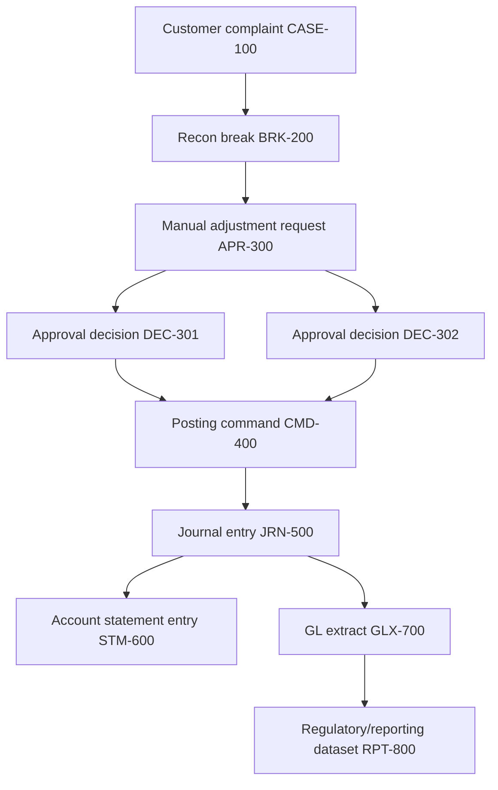
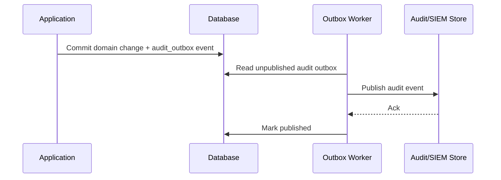
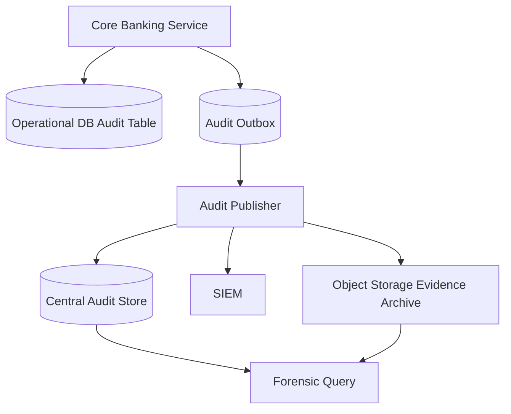
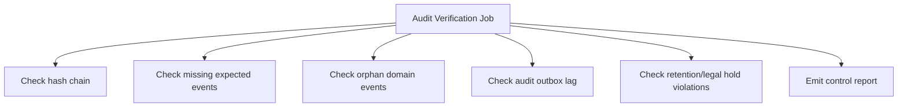

------
title: Learn Java Core Banking System - Part 024
description: Audit trail, evidence, lineage, tamper evidence, non-repudiation limits, forensic query, retention, privacy, and Java architecture for defensible banking systems.
series: learn-java-core-banking-system
seriesTitle: Learn Java Core Banking System
order: 24
partTitle: Audit Trail, Evidence, Lineage, and Non-Repudiation
tags:
- java
- core-banking
- audit-trail
- evidence
- lineage
- non-repudiation
- tamper-evidence
- compliance
- operations
- ledger
- banking
- series
date: 2026-06-28
------

# Part 024 — Audit Trail, Evidence, Lineage, and Non-Repudiation

> Audit trail yang baik bukan hanya kumpulan log. Dalam core banking, audit trail adalah sistem evidence yang mampu menjelaskan keputusan, perubahan, otoritas, dampak finansial, dan lineage angka secara defensible.

Sistem biasa bertanya:

```txt
What happened?
```

Sistem banking harus bisa menjawab:

```txt
What happened, who caused it, under what authority, based on what data, with what business reason, producing which financial records, visible in which reports, and how do we know the evidence was not silently rewritten?
```

Part ini membahas audit trail sebagai first-class architecture. Kita akan membedakan application log, audit event, domain event, ledger journal, evidence record, lineage, dan non-repudiation. Kita juga akan membahas batas klaim non-repudiation: log membantu non-repudiation, tetapi non-repudiation kuat membutuhkan identity, key custody, signing, timestamping, access control, operational audit, dan governance yang benar.

---

## 1. Mengapa Audit Trail dalam Core Banking Berbeda?

Di banyak aplikasi, audit trail adalah fitur pendukung. Di core banking, audit trail adalah bagian dari sistem kontrol.

Tanpa audit trail yang baik:

1. manual posting tidak bisa dijelaskan;
2. reversal terlihat seperti penghapusan;
3. fee waiver tidak punya approval evidence;
4. GL mismatch tidak bisa ditelusuri;
5. regulator tidak bisa memverifikasi angka;
6. fraud investigation lambat;
7. incident tidak bisa direkonstruksi;
8. customer dispute sulit diselesaikan;
9. privileged access abuse tidak terlihat;
10. migration defect sulit dibuktikan.

Audit trail bukan hanya untuk compliance. Ia membantu engineering correctness.

---

## 2. Bedakan Log, Event, Journal, dan Evidence

Jangan semua disebut log.

| Artefak | Tujuan | Contoh |
|---|---|---|
| Application log | debugging dan observability | `Posting completed in 42ms` |
| Security log | mendeteksi security-relevant activity | failed login, privilege change |
| Audit event | bukti actor/action/decision | checker approved manual debit |
| Domain event | fakta domain yang terjadi | account closed, fee charged |
| Ledger journal | financial accounting record | debit liability, credit income |
| Evidence record | snapshot pendukung keputusan | policy snapshot, approval view |
| Lineage record | hubungan source -> transformation -> output | payment file -> posting -> GL extract |

Application log boleh sampling dan rotating. Audit event tidak boleh diperlakukan seperti log sementara.

---

## 3. Audit Trail Minimum

Minimal audit event harus punya:

| Field | Mengapa penting |
|---|---|
| event id | unique evidence identity |
| event type | klasifikasi action |
| actor | siapa melakukan/menyebabkan |
| actor authority | berdasarkan role/permission apa |
| subject | object yang terkena dampak |
| action | aksi spesifik |
| reason | business reason |
| timestamp | kapan terjadi |
| business date | relevansi banking date |
| source channel | teller/mobile/batch/system |
| correlation id | chain across systems |
| causation id | event/command penyebab langsung |
| before/after atau diff | perubahan material |
| evidence hash | integrity check |
| result | success/rejected/failed |

Tetapi minimum bukan cukup untuk semua operasi. Operasi finansial butuh lebih banyak.

---

## 4. Mental Model: Evidence Graph

Pikirkan audit bukan sebagai flat table, tetapi graph.



Pertanyaan audit:

```txt
Why does report RPT-800 contain this amount?
```

Jawaban harus bisa berjalan mundur:

```txt
RPT-800 <- GLX-700 <- JRN-500 <- CMD-400 <- APR-300 <- BRK-200 <- CASE-100
```

Inilah lineage.

---

## 5. Audit Event Taxonomy

Gunakan taxonomy eksplisit.

| Kategori | Event |
|---|---|
| Identity/access | login, MFA failure, role assignment, privilege escalation |
| Customer/party | customer created, KYC updated, risk rating changed |
| Account | account opened, restricted, dormant, reactivated, closed |
| Product/config | product parameter proposed, approved, released |
| Ledger/posting | posting accepted, journal committed, reversal posted |
| Payment | payment submitted, accepted, rejected, returned, settled |
| Approval/control | approval requested, approved, rejected, overridden |
| Reconciliation | break created, matched, assigned, cleared |
| Operations | EOD started, failed, restarted, completed |
| Data/reporting | extract generated, report certified, correction submitted |
| Security | suspicious access, policy violation, export performed |

Taxonomy membantu query, retention, alerting, dan audit review.

---

## 6. Audit Event Schema

Contoh schema konseptual:

```java
public record AuditEvent(
        AuditEventId id,
        AuditEventType type,
        AuditSeverity severity,
        ActorContext actor,
        AuthorityContext authority,
        SubjectRef subject,
        ActionContext action,
        ReasonContext reason,
        BusinessContext business,
        EvidenceContext evidence,
        CorrelationContext correlation,
        IntegrityContext integrity,
        AuditResult result,
        Instant occurredAt,
        Instant recordedAt
) {
}
```

Sub-context:

```java
public record ActorContext(
        String actorId,
        String personId,
        String actorType,
        String sessionId,
        String sourceIp,
        String userAgent,
        String authenticationStrength
) {
}

public record AuthorityContext(
        List<String> roleCodes,
        List<String> permissionCodes,
        String organizationScope,
        String authoritySnapshotHash,
        Optional<String> delegationId
) {
}

public record SubjectRef(
        String subjectType,
        String subjectId,
        Optional<String> customerId,
        Optional<String> accountId,
        Optional<String> productCode
) {
}
```

Audit schema harus fleksibel, tetapi jangan menjadi dumping ground JSON tanpa standar.

---

## 7. Event Time vs Recorded Time

Gunakan dua timestamp:

| Timestamp | Makna |
|---|---|
| occurredAt | kapan event terjadi secara domain/security |
| recordedAt | kapan audit event dicatat |

Untuk batch/import/offline integration, keduanya bisa berbeda.

Contoh:

```txt
External clearing event occurred at 2026-06-28T09:00:00Z
System recorded it at 2026-06-28T09:03:12Z
```

Jangan hanya punya `created_at`.

---

## 8. Business Date vs System Date

Core banking butuh business date.

```txt
postingDate = date journal recorded in core
valueDate = date economic value applies
businessDate = operational banking date
systemTime = technical timestamp
```

Audit event harus menyimpan konteks tanggal yang relevan. Backdated posting tanpa audit business date akan sulit dijelaskan.

---

## 9. Before/After State vs Delta

Untuk perubahan data, simpan before/after atau delta material.

Contoh audit untuk rate override:

```json
{
  "field": "interestRate",
  "before": "7.25",
  "after": "6.75",
  "unit": "PERCENT_PER_YEAR",
  "effectiveDate": "2026-07-01"
}
```

Jangan simpan hanya:

```txt
Updated product configuration
```

Itu tidak menjawab apa yang berubah.

Namun hati-hati dengan PII/secret. Jangan simpan full sensitive data jika tidak perlu. Untuk data sensitif, gunakan masked value atau hash.

---

## 10. Audit Event vs Domain Event

Domain event:

```txt
FeeWaived
```

Audit event:

```txt
User X with authority Y approved fee waiver request Z, seeing payload hash H, reason R, resulting in domain event FeeWaived and journal J.
```

Keduanya bisa saling menaut, tetapi bukan hal yang sama.

Domain event berfokus pada fakta bisnis. Audit event berfokus pada evidence.

---

## 11. Audit Event vs Ledger Journal

Ledger journal adalah bukti finansial, tetapi bukan seluruh audit trail.

Journal menjawab:

```txt
What accounting entry was posted?
```

Audit trail menjawab:

```txt
Why was it posted, by whom, through what process, with what approval and evidence?
```

Manual debit yang hanya punya journal tidak cukup. Ia harus menaut ke request, approval, reason, dan case.

---

## 12. Correlation dan Causation

Gunakan dua id:

| ID | Makna |
|---|---|
| correlationId | satu end-to-end business flow |
| causationId | event/command langsung yang menyebabkan event ini |

Contoh:

```txt
correlationId = payment instruction P-100
causationId = checker approval decision DEC-200
```

Tanpa causation, graph sulit dibangun.

---

## 13. Actor Semantics

Actor tidak selalu manusia.

| Actor type | Contoh |
|---|---|
| HUMAN_USER | teller, operations user |
| SYSTEM | EOD scheduler, interest engine |
| SERVICE | payment worker, reconciliation worker |
| EXTERNAL_PARTY | clearing house, partner API |
| MIGRATION_TOOL | migration batch |

Untuk `SYSTEM`, simpan job id, service identity, deployment version, dan trigger.

Contoh:

```json
{
  "actorType": "SYSTEM",
  "serviceName": "interest-accrual-worker",
  "jobRunId": "EOD-2026-06-28-INT-001",
  "deploymentVersion": "core-banking-2.18.4"
}
```

---

## 14. Authority Snapshot

Saat user melakukan action, role/permission bisa berubah di masa depan. Audit harus menyimpan snapshot authority saat action.

```json
{
  "roles": ["BRANCH_MANAGER"],
  "permissions": ["APPROVE_MANUAL_DEBIT"],
  "limit": "10000.00 USD",
  "organizationScope": "BRANCH-001",
  "evaluatedAt": "2026-06-28T10:00:00Z",
  "policyVersion": "access-policy-2026-06"
}
```

Kalau audit hanya query role saat ini, investigasi masa lalu bisa salah.

---

## 15. Reason Code

Reason harus structured, bukan hanya free text.

```java
public record ReasonContext(
        String reasonCode,
        String reasonCategory,
        String freeText,
        Optional<String> caseId,
        Optional<String> regulatoryBasis
) {
}
```

Free text membantu, tetapi tidak cukup untuk analytics dan control reporting.

Contoh reason code:

| Reason code | Makna |
|---|---|
| CUSTOMER_DISPUTE_RESOLUTION | koreksi karena dispute |
| RECON_BREAK_CLEARING | koreksi reconciliation break |
| DUPLICATE_FEE_CORRECTION | koreksi fee duplikat |
| REGULATORY_HOLD_RELEASE | release atas dasar clearance |
| PRODUCT_CONFIG_RELEASE | perubahan konfigurasi produk |
| OPERATIONAL_ERROR_CORRECTION | kesalahan operasional internal |

---

## 16. Evidence Attachment dan Reference

Audit event tidak harus menyimpan file binary. Simpan reference yang kuat.

```java
public record EvidenceRef(
        String evidenceType,
        String evidenceId,
        String storageLocation,
        String contentHash,
        String classification,
        Instant capturedAt
) {
}
```

Contoh:

1. approval screenshot/rendered summary hash;
2. recon statement file hash;
3. signed customer instruction hash;
4. case document reference;
5. batch file hash;
6. report extract hash.

Jangan simpan PII berlebih di audit table hanya karena mudah.

---

## 17. Tamper Evidence

Audit trail harus minimal tamper-evident.

Ada beberapa level:

| Level | Teknik | Catatan |
|---|---|---|
| Append-only DB table | no update/delete path | basic |
| DB privilege separation | app cannot mutate old events | kuat secara operational |
| Hash per event | detect content change | butuh canonicalization |
| Hash chain | detect reorder/delete | lebih kuat |
| External anchoring | anchor root hash ke store lain | lebih defensible |
| Digital signature | signer identity/key | butuh key governance |
| WORM/object lock | retention enforceable | berguna untuk evidence |

Hash chain sederhana:

```txt
eventHash = sha256(canonicalEventPayload)
chainHash = sha256(previousChainHash + eventHash)
```

Diagram:

```mermaid
flowchart LR
    A[Audit Event 1<br/>hash H1<br/>chain C1] --> B[Audit Event 2<br/>hash H2<br/>chain C2 = hash(C1 + H2)]
    B --> C[Audit Event 3<br/>hash H3<br/>chain C3 = hash(C2 + H3)]
```

Jika event 2 diubah, C2 dan C3 tidak cocok.

---

## 18. Batas Non-Repudiation

Hati-hati mengklaim non-repudiation.

Log biasa tidak otomatis membuktikan seseorang tidak bisa menyangkal. Non-repudiation kuat membutuhkan kombinasi:

1. identity proofing;
2. strong authentication;
3. session integrity;
4. authorization evidence;
5. tamper-evident logging;
6. clock synchronization;
7. cryptographic signing jika relevan;
8. private key custody;
9. secure device/process;
10. operational audit dan governance.

Maka istilah yang lebih aman untuk banyak sistem:

```txt
audit evidence supporting non-repudiation controls
```

Bukan:

```txt
perfect non-repudiation
```

---

## 19. Canonicalization untuk Hash

Jika hash digunakan untuk evidence, canonicalization wajib.

Rules:

1. field ordering deterministic;
2. timestamp format konsisten;
3. numeric scale normal;
4. currency uppercase ISO code;
5. exclude volatile fields;
6. include material fields;
7. normalize Unicode jika perlu;
8. explicit schema version.

Contoh:

```java
public interface AuditCanonicalizer {
    String canonicalize(AuditEvent event);
}

public interface AuditIntegrityService {
    IntegrityContext seal(AuditEvent event, Optional<String> previousChainHash);
}
```

---

## 20. Append-Only Persistence

Audit event sebaiknya append-only.

```sql
create table audit_event (
    id uuid primary key,
    event_type varchar(120) not null,
    severity varchar(40) not null,
    actor_id varchar(120),
    actor_type varchar(40) not null,
    subject_type varchar(120),
    subject_id varchar(200),
    action varchar(120) not null,
    reason_code varchar(120),
    business_date date,
    correlation_id varchar(160),
    causation_id varchar(160),
    occurred_at timestamptz not null,
    recorded_at timestamptz not null,
    payload jsonb not null,
    event_hash varchar(128) not null,
    previous_chain_hash varchar(128),
    chain_hash varchar(128) not null,
    schema_version varchar(40) not null
);
```

Restrict update/delete:

```txt
Application role: INSERT only
Audit reader role: SELECT only
DBA break-glass: monitored and separately logged
```

---

## 21. Update Correction Bukan Update Audit

Jika audit event salah tercatat, jangan update baris lama diam-diam. Tambahkan correction event.

```txt
AUD-100 recorded with wrong subject display name
AUD-101 corrects AUD-100 metadata typo
```

Prinsip sama seperti ledger: correction over mutation.

---

## 22. Audit Outbox

Jangan kirim audit event hanya ke log async tanpa jaminan.

Untuk action penting, audit event harus committed dalam transaction yang sama atau dalam pola outbox yang recoverable.

Pattern:



Jika SIEM down, audit event tidak hilang. Ia tertahan di outbox.

---

## 23. Synchronous vs Asynchronous Audit

| Mode | Cocok untuk | Risiko |
|---|---|---|
| Synchronous insert | critical domain action | tambah latency |
| Transactional outbox | reliable async delivery | perlu worker/retry |
| Best-effort app log | debug telemetry | tidak cukup untuk audit |
| Stream-only audit | high throughput | dual-write/loss risk jika tidak hati-hati |

Untuk core banking financial actions, jangan hanya best-effort log.

---

## 24. Audit Storage Architecture



Operational DB menyimpan evidence lokal. Central audit store memudahkan cross-system investigation. Object storage menyimpan file/evidence besar dengan hash.

---

## 25. Lineage Model

Lineage merekam hubungan antar artefak.

```java
public record LineageLink(
        String fromType,
        String fromId,
        String toType,
        String toId,
        String relationType,
        Instant linkedAt
) {
}
```

Contoh relation:

| Relation | Makna |
|---|---|
| CAUSED_BY | event disebabkan event/command lain |
| DERIVED_FROM | output dihitung dari input |
| APPROVED_BY | request disetujui decision |
| EXECUTED_AS | approval dieksekusi sebagai command |
| POSTED_AS | command menghasilkan journal |
| EXTRACTED_TO | journal masuk extract/report |
| CORRECTS | record mengoreksi record lain |
| SUPERSEDES | versi baru menggantikan versi lama |

Lineage bisa disimpan eksplisit atau direkonstruksi dari correlation/causation. Untuk audit penting, lebih baik simpan eksplisit.

---

## 26. Forensic Query

Desain audit agar bisa menjawab pertanyaan investigasi.

Contoh query:

```txt
Show all manual debits over 10,000 USD approved by branch managers in the last 30 business days.
```

```txt
Show all actions taken by actor X during incident window.
```

```txt
For journal JRN-123, show the originating command, approval request, maker, checker, case, and evidence.
```

```txt
Show all fee waivers for customer CUST-123, grouped by reason and approver.
```

```txt
Show all updates to product parameter P before release version V.
```

Jika audit payload hanya blob tanpa indexed fields, forensic query akan lambat dan mahal. Index material fields.

---

## 27. Audit Query Table vs Search Index

Gunakan dua layer:

| Layer | Tujuan |
|---|---|
| immutable source table | authoritative audit evidence |
| search/index/projection | fast query dan dashboards |

Search index boleh rebuild. Source audit table tidak boleh mudah dimutasi.

---

## 28. Retention

Retention bergantung pada regulasi lokal, policy bank, product, dan jenis record. Jangan hardcode satu angka.

Model retention:

```java
public record RetentionPolicy(
        String recordType,
        String jurisdiction,
        Period minimumRetention,
        Optional<Period> maximumRetention,
        boolean legalHoldSupported,
        String destructionProcedure
) {
}
```

Pertimbangan:

1. customer/account records;
2. transaction records;
3. AML/sanctions records;
4. audit/security logs;
5. consent/privacy records;
6. complaint/dispute evidence;
7. regulatory reports;
8. legal hold.

Retention bukan hanya storage lifecycle. Retention adalah governance.

---

## 29. Privacy dan Data Minimization

Audit trail sering menjadi tempat kebocoran data karena engineer memasukkan full request/response.

Prinsip:

1. simpan material facts, bukan semua data;
2. mask PAN/account/card data jika tidak perlu;
3. hash atau tokenize sensitive identifier jika cukup;
4. jangan log secrets, token, password, CVV, private key;
5. batasi akses audit berdasarkan need-to-know;
6. pisahkan evidence sensitif ke storage dengan kontrol lebih kuat;
7. dukung redaction legal jika diperbolehkan tanpa merusak financial evidence.

Contoh buruk:

```json
{
  "requestBody": "full mobile banking transfer request including auth token and device fingerprint"
}
```

Contoh lebih baik:

```json
{
  "operation": "TRANSFER_SUBMIT",
  "customerId": "CUST-123",
  "fromAccountId": "ACC-001",
  "amount": "100.00 USD",
  "beneficiaryRefHash": "sha256:...",
  "authStrength": "MFA",
  "requestHash": "sha256:..."
}
```

---

## 30. Access Control untuk Audit Data

Audit data sensitif. Jangan semua engineer/operator bisa melihat semuanya.

Access control perlu mempertimbangkan:

1. role;
2. investigation assignment;
3. jurisdiction;
4. customer segment;
5. data classification;
6. break-glass access;
7. approval untuk export;
8. immutable logging of audit access.

Meta-audit:

```txt
Who accessed the audit trail?
What did they search?
What did they export?
Why?
```

Audit store juga harus diaudit.

---

## 31. Audit Export

Audit export berisiko karena data keluar dari kontrol aplikasi.

Control:

1. export approval;
2. watermark;
3. scope limitation;
4. redaction;
5. encryption;
6. recipient tracking;
7. expiry;
8. export hash;
9. export audit event.

---

## 32. Clock Synchronization

Audit timeline bergantung pada clock.

Jika service clock drift, forensic reconstruction sulit.

Praktik:

1. semua service pakai UTC technical timestamp;
2. business date disimpan terpisah;
3. clock sync dimonitor;
4. recordedAt dari trusted server side;
5. jangan percaya client timestamp untuk audit authoritative;
6. external event time disimpan sebagai externalOccurredAt.

---

## 33. Multi-System Evidence

Core banking jarang single system.

Flow pembayaran dapat menyentuh:

1. mobile banking;
2. API gateway;
3. fraud engine;
4. core banking;
5. payment switch;
6. clearing system;
7. GL;
8. notification service.

Gunakan correlation ID end-to-end. Tetapi jangan percaya correlation ID dari client tanpa kontrol. Generate server-side dan propagate.

---

## 34. Audit untuk Maker-Checker

Dari Part 023, approval evidence harus merekam:

1. request payload hash;
2. maker identity;
3. policy snapshot;
4. authority snapshot;
5. checker decision;
6. decision snapshot;
7. SoD evaluation result;
8. reason/comment;
9. execution result;
10. linked domain record.

Contoh audit chain:

```txt
ApprovalRequested -> ApprovalPolicyEvaluated -> ApprovalDecisionRecorded -> ApprovalSatisfied -> ApprovedCommandExecuted -> JournalPosted
```

---

## 35. Audit untuk Ledger Posting

Ledger posting audit harus bisa menjawab:

1. command apa yang menyebabkan posting;
2. apakah posting hasil customer instruction, EOD, fee engine, interest engine, atau manual correction;
3. siapa/apa aktornya;
4. journal id apa yang tercipta;
5. posting lines apa saja;
6. apakah balanced;
7. apakah reversal/correction terkait;
8. apakah masuk GL extract;
9. apakah muncul di statement;
10. apakah direkonsiliasi.

Audit event tidak menggantikan journal. Audit event menautkan journal ke konteks.

---

## 36. Audit untuk Configuration Change

Configuration change sering lebih berbahaya dari transaction tunggal.

Contoh:

1. interest rate table;
2. fee pricing;
3. GL mapping;
4. product eligibility;
5. approval matrix;
6. limit policy;
7. holiday calendar;
8. tax rule.

Audit harus menyimpan:

1. before/after;
2. effective date;
3. version;
4. simulation result;
5. approval;
6. release actor;
7. impacted products/accounts;
8. rollback/supersession link.

---

## 37. Audit untuk EOD/BOD

EOD audit harus berisi:

1. job run id;
2. business date;
3. step started/completed/failed;
4. control totals;
5. processed count/amount;
6. skipped/rejected items;
7. retry/restart marker;
8. generated files/reports hashes;
9. operator overrides;
10. final certification.

Tanpa audit EOD, bank tidak bisa menjelaskan angka harian.

---

## 38. Audit untuk Reconciliation

Reconciliation audit harus berisi:

1. source file/hash;
2. matching rule version;
3. matched/unmatched count;
4. break creation;
5. break assignment;
6. break aging;
7. correction action;
8. closure evidence;
9. suspense impact;
10. sign-off.

Reconciliation yang hanya menutup item tanpa reason/evidence menciptakan risiko operasional.

---

## 39. Audit Failure Handling

Apa yang terjadi jika audit write gagal?

Untuk action material, biasanya pilihan aman:

```txt
If audit cannot be recorded, do not execute the business action.
```

Namun perlu strategi:

| Scenario | Strategy |
|---|---|
| audit table down | fail closed untuk critical action |
| central SIEM down | commit local audit + outbox retry |
| evidence store down | block action jika evidence mandatory |
| search index down | continue, rebuild later |
| hash chain service down | fail critical audit seal atau queue with explicit risk |

Jangan silently drop audit.

---

## 40. Backfill dan Migration Audit

Migration harus punya audit tersendiri.

Audit migration:

1. source system record id;
2. extraction batch id;
3. transformation rule version;
4. target record id;
5. validation result;
6. reconciliation totals;
7. exception list;
8. sign-off;
9. cutover timestamp;
10. rollback/fallback reference.

Setelah migration, angka awal harus bisa ditelusuri ke legacy evidence.

---

## 41. Testing Audit Trail

Test audit bukan optional.

### 41.1 Audit Completeness Test

```txt
Given manual debit command succeeds
Then audit events exist for request, approval, execution, and journal posting
```

### 41.2 Tamper Evidence Test

```txt
Given audit event payload changed manually
Then chain verification fails
```

### 41.3 No Sensitive Data Test

```txt
Given payment request contains token or PAN
Then audit payload does not contain raw token/PAN/CVV
```

### 41.4 Lineage Test

```txt
Given GL extract contains journal J
Then lineage resolves J back to original posting command and approval request
```

### 41.5 Authority Snapshot Test

```txt
Given actor approved request while having role R
And role R is removed later
Then audit still shows actor had role R at decision time
```

---

## 42. Audit Verification Job

Build periodic verification.



Audit integrity harus dimonitor, bukan diasumsikan.

---

## 43. Metrics

| Metric | Makna |
|---|---|
| audit write failure count | critical control risk |
| audit outbox lag | delayed evidence propagation |
| hash chain verification failure | tamper/corruption risk |
| privileged audit access count | sensitive access monitoring |
| export count by actor | data leakage risk |
| missing audit event rate | instrumentation gap |
| orphan journal without audit cause | lineage gap |
| audit search latency | investigation effectiveness |
| evidence storage failure | control weakness |

---

## 44. Anti-Patterns

| Anti-pattern | Dampak |
|---|---|
| treat audit as debug log | evidence hilang/terhapus |
| store full request body | privacy/security leakage |
| no actor authority snapshot | tidak bisa buktikan user sah saat action |
| no reason code | audit tidak actionable |
| mutable audit row | evidence bisa diubah |
| no correlation/causation | timeline sulit direkonstruksi |
| only current state audit | perubahan historis tidak jelas |
| no audit access logging | investigator bisa menyalahgunakan audit data |
| no hash/canonicalization | integrity claim lemah |
| overclaim non-repudiation | defensibility palsu |

---

## 45. Java Package Structure

```txt
com.bank.core.audit
  ├── api
  ├── application
  │   ├── record
  │   ├── query
  │   ├── verify
  │   └── export
  ├── domain
  │   ├── AuditEvent.java
  │   ├── AuditEventType.java
  │   ├── ActorContext.java
  │   ├── AuthorityContext.java
  │   ├── EvidenceContext.java
  │   ├── IntegrityContext.java
  │   └── LineageLink.java
  ├── integrity
  │   ├── AuditCanonicalizer.java
  │   ├── AuditHasher.java
  │   └── HashChainVerifier.java
  ├── retention
  │   ├── RetentionPolicy.java
  │   └── LegalHoldService.java
  ├── infrastructure
  │   ├── jdbc
  │   ├── outbox
  │   ├── objectstorage
  │   └── search
  └── testfixtures
```

---

## 46. Design Review Checklist

```txt
[ ] Apa event taxonomy-nya?
[ ] Apa beda audit event, domain event, ledger journal, dan app log?
[ ] Apakah actor context cukup?
[ ] Apakah authority snapshot disimpan?
[ ] Apakah reason code structured?
[ ] Apakah before/after atau material delta tersedia?
[ ] Apakah timestamp memisahkan occurredAt, recordedAt, businessDate?
[ ] Apakah correlationId dan causationId tersedia?
[ ] Apakah lineage dari report ke source bisa ditelusuri?
[ ] Apakah audit write reliable dan tidak best-effort untuk action kritis?
[ ] Apakah audit event append-only?
[ ] Apakah ada tamper-evidence?
[ ] Apakah hash canonical deterministic?
[ ] Apakah sensitive data tidak bocor ke audit?
[ ] Apakah audit access juga diaudit?
[ ] Apakah retention/legal hold didukung?
[ ] Apakah export diawasi?
[ ] Apakah verification job memeriksa integrity?
[ ] Apakah non-repudiation claim realistis?
```

---

## 47. Latihan 20 Jam

### Latihan 1 — Audit Manual Debit

Rancang audit trail untuk manual debit dari request sampai journal.

Output:

1. audit event taxonomy;
2. schema payload;
3. lineage graph;
4. sensitive data policy;
5. query investigasi.

### Latihan 2 — Audit Product Configuration Release

Rancang audit trail untuk perubahan fee parameter.

Output:

1. before/after diff;
2. approval evidence;
3. simulation result evidence;
4. effective date lineage;
5. rollback/supersession model.

### Latihan 3 — Hash Chain Prototype

Buat prototype Java sederhana:

1. canonicalize audit event;
2. compute event hash;
3. compute chain hash;
4. verify chain;
5. test tamper detection.

---

## 48. Ringkasan

Audit trail banking-grade harus bisa menjawab:

```txt
Who did what?
When did it happen?
Under what authority?
Why was it done?
What data did they see?
What changed?
What financial records resulted?
What reports/extracts used those records?
How can we detect tampering?
How do we avoid leaking sensitive data?
How long must evidence be retained?
Who accessed the evidence later?
```

Engineer top 1% tidak menganggap audit sebagai `log.info`. Mereka mendesain audit sebagai **evidence architecture**.

Prinsip utama:

1. audit event berbeda dari debug log;
2. evidence harus structured dan queryable;
3. lineage harus explicit;
4. audit write untuk action kritis harus reliable;
5. historical authority harus disnapshot;
6. sensitive data harus diminimalkan;
7. tamper evidence harus realistis;
8. non-repudiation jangan overclaim;
9. audit access juga harus diaudit;
10. audit integrity harus diuji dan dimonitor.

Di Part 025, kita masuk ke exception queue, repair workbench, dan case-oriented operations: bagaimana exception diproses tanpa membuat ledger, audit, dan reconciliation rusak.

---

## 49. Referensi

- OWASP, *Logging Cheat Sheet*.
- NIST, *Cybersecurity Framework 2.0*.
- FFIEC, *Architecture, Infrastructure, and Operations Booklet*, Information Technology Examination Handbook.
- FFIEC, *Information Security Booklet*, Information Technology Examination Handbook.
- Basel Committee on Banking Supervision, *BCBS 239: Principles for effective risk data aggregation and risk reporting*.
- PCI Security Standards Council, *PCI DSS*.
- ISO 20022, *Message Definitions*.
