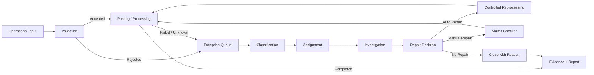
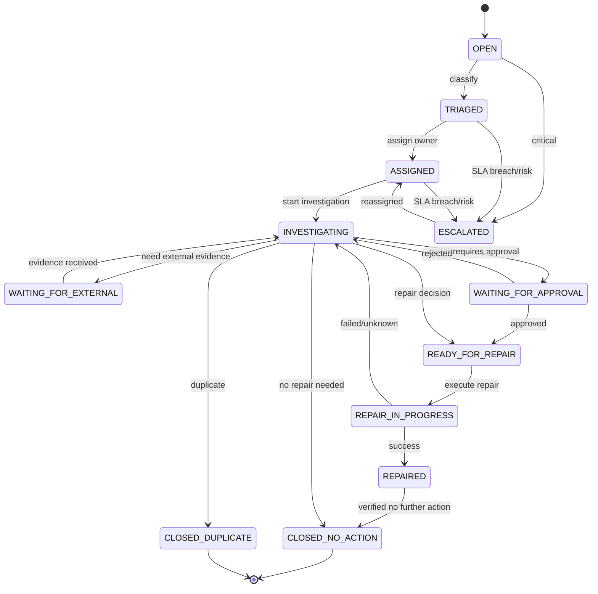
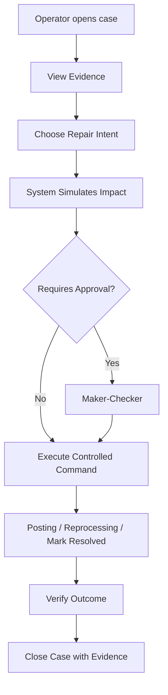
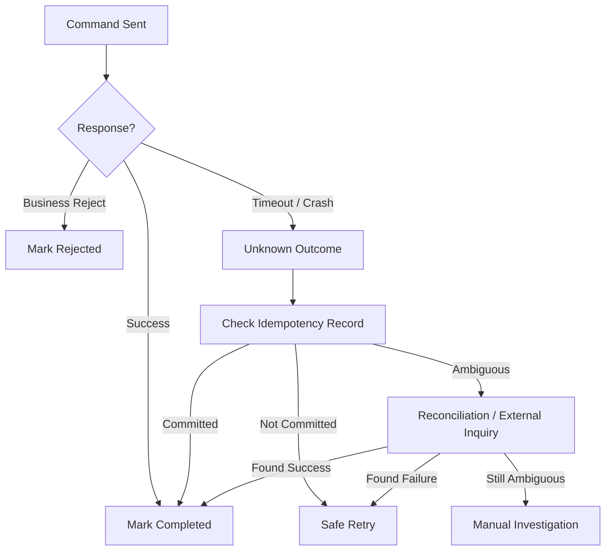
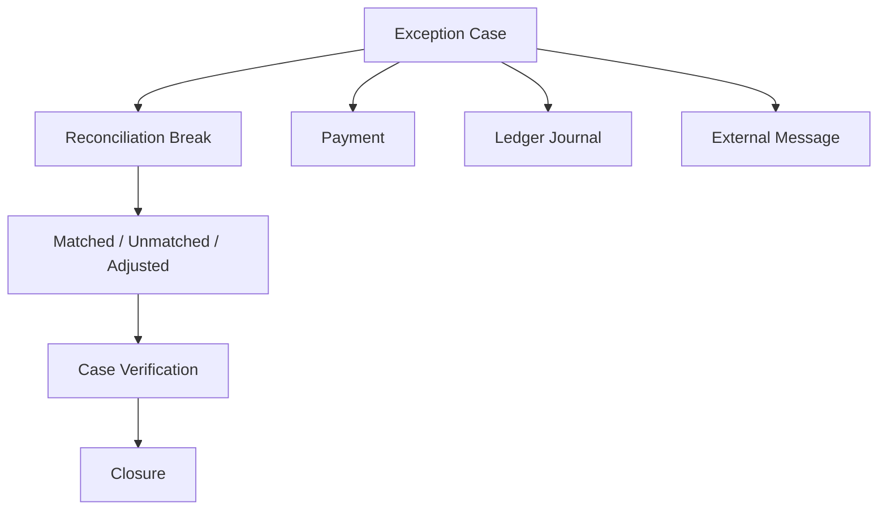
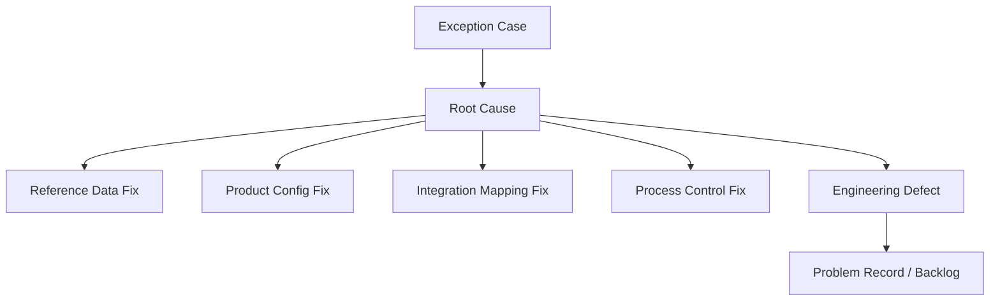

------
title: Learn Java Core Banking System - Part 025
description: Exception queue, repair workbench, manual intervention, SLA, escalation, evidence, ownership, and case-oriented operations for defensible core banking systems.
series: learn-java-core-banking-system
seriesTitle: Learn Java Core Banking System
order: 25
partTitle: Exception Queue, Repair Workbench, and Case-Oriented Operations
tags:
- java
- core-banking
- exception-queue
- repair-workbench
- case-management
- operations
- reconciliation
- controls
- workflow
- audit
- banking
- series
date: 2026-06-28
------

# Part 025 — Exception Queue, Repair Workbench, and Case-Oriented Operations

> Core banking yang matang tidak berpura-pura semua proses akan selalu straight-through. Sistem yang matang menganggap exception sebagai first-class domain: terklasifikasi, dimiliki, punya SLA, bisa diperbaiki, punya evidence, dan tidak merusak ledger truth.

Di aplikasi biasa, error sering dipandang sebagai sesuatu yang harus dihilangkan. Di core banking, sebagian exception memang defect, tetapi sebagian lain adalah hasil normal dari realitas operasional:

1. payment rail mengirim acknowledgement terlambat;
2. incoming file mengandung data yang tidak bisa dipetakan;
3. account sedang blocked tetapi ada payment masuk;
4. posting request lolos validasi channel tetapi gagal business rule di core;
5. GL handoff selesai tetapi acknowledgement dari downstream hilang;
6. EOD job terhenti di tengah batch;
7. settlement amount tidak cocok dengan statement eksternal;
8. checker menolak transaksi manual karena reason tidak cukup;
9. fraud/sanctions engine mengembalikan keputusan `REVIEW`;
10. hasil migration berbeda dari expected opening balance.

Sistem top-tier tidak hanya bertanya:

```txt
How do we avoid errors?
```

Ia bertanya:

```txt
When errors happen, how do we classify them, preserve truth, assign ownership, repair safely, prove what happened, and prevent recurrence?
```

---

## 1. Posisi Part Ini dalam Seri

Part sebelumnya membahas maker-checker dan audit trail. Sekarang kita menyatukan keduanya ke dalam operational workbench.



Exception queue adalah jembatan antara mesin dan operasi manusia. Repair workbench adalah tempat operator memperbaiki masalah tanpa perlu akses langsung ke database atau menjalankan script ad-hoc.

---

## 2. Mental Model: Exception Bukan Sama dengan Error Log

Jangan menyamakan exception queue dengan `application_error_log`.

| Hal | Error Log | Exception Queue |
|---|---|---|
| Tujuan | Debugging teknis | Penyelesaian operasional |
| Pengguna utama | Engineer/SRE | Operations, back office, risk, support |
| Unit kerja | Log line, stack trace | Case/item yang punya lifecycle |
| Ownership | Tidak selalu ada | Wajib ada owner/queue/team |
| SLA | Jarang eksplisit | Wajib eksplisit |
| Audit evidence | Biasanya lemah | Wajib kuat |
| Repair action | Manual/script | Controlled action |
| Business impact | Implisit | Eksplisit |
| Closure | Tidak formal | Reasoned closure |

Error log menjawab:

```txt
What did the code fail to do?
```

Exception case menjawab:

```txt
What business item is blocked, what is its financial/regulatory impact, who owns it, what decision was made, and how was it resolved?
```

---

## 3. Jenis Exception dalam Core Banking

Exception harus diklasifikasi berdasarkan sumber dan dampak, bukan hanya berdasarkan stack trace.

### 3.1 Validation Exception

Terjadi sebelum financial effect dibuat.

Contoh:

1. account tidak ditemukan;
2. currency tidak sesuai;
3. product tidak eligible;
4. amount melebihi limit;
5. business date sudah melewati cutoff;
6. duplicate business key dengan payload berbeda.

Handling:

1. reject deterministik;
2. tidak membuat journal;
3. simpan rejection evidence;
4. tampilkan reason yang bisa dipahami channel/ops;
5. jangan auto-retry kecuali root cause transient.

### 3.2 Processing Exception

Terjadi saat proses sedang mengeksekusi decision yang sudah diterima.

Contoh:

1. database timeout setelah journal insert tetapi sebelum response terkirim;
2. balance snapshot gagal update;
3. event outbox gagal dipublish;
4. EOD batch terhenti setelah sebagian account selesai;
5. external acknowledgement tidak diterima.

Handling:

1. tentukan outcome: success, failed, atau unknown;
2. gunakan idempotency untuk safe retry;
3. gunakan reconciliation untuk outcome yang tidak pasti;
4. tidak boleh membuat posting kedua karena panic retry.

### 3.3 Integration Exception

Terjadi di boundary dengan sistem lain.

Contoh:

1. ISO 20022 message gagal parse;
2. payment rail mengembalikan status yang tidak dikenal;
3. GL downstream menolak batch;
4. sanctions engine timeout;
5. partner API mengirim field mandatory kosong;
6. card processor mengirim reversal setelah hold expired.

Handling:

1. isolasi canonical model dari message eksternal;
2. simpan raw evidence dengan aman;
3. mapping error masuk repair queue;
4. gunakan acknowledgement protocol yang eksplisit;
5. jangan menyimpulkan settlement hanya dari message ambiguous.

### 3.4 Reconciliation Exception

Terjadi ketika dua sumber kebenaran tidak cocok.

Contoh:

1. internal ledger berbeda dengan settlement statement;
2. GL control account tidak cocok dengan subledger;
3. bank statement eksternal berisi transaction yang tidak ditemukan;
4. expected fee posting tidak muncul;
5. EOD control total tidak balance.

Handling:

1. create recon break;
2. assign owner;
3. hitung aging;
4. tentukan financial impact;
5. lakukan investigation;
6. repair dengan posting/reversal/adjustment resmi.

### 3.5 Control Exception

Terjadi karena aturan kontrol tidak terpenuhi.

Contoh:

1. maker dan checker sama;
2. approval limit tidak cukup;
3. override reason kosong;
4. privileged user mencoba action tanpa ticket;
5. emergency access belum ditutup;
6. EOD precheck gagal.

Handling:

1. block action;
2. require approval tambahan;
3. escalate;
4. simpan security/control evidence;
5. tidak boleh bypass melalui database patch.

---

## 4. Exception Case sebagai Aggregate

Dalam domain model, exception case harus punya identity dan lifecycle sendiri.

```java
public record ExceptionCaseId(String value) {}

public enum ExceptionType {
    VALIDATION,
    PROCESSING,
    INTEGRATION,
    RECONCILIATION,
    CONTROL,
    SECURITY,
    MIGRATION,
    UNKNOWN_OUTCOME
}

public enum ExceptionSeverity {
    LOW,
    MEDIUM,
    HIGH,
    CRITICAL
}

public enum ExceptionStatus {
    OPEN,
    TRIAGED,
    ASSIGNED,
    INVESTIGATING,
    WAITING_FOR_EXTERNAL,
    WAITING_FOR_APPROVAL,
    READY_FOR_REPAIR,
    REPAIR_IN_PROGRESS,
    REPAIRED,
    CLOSED_NO_ACTION,
    CLOSED_DUPLICATE,
    ESCALATED,
    CANCELLED
}

public final class ExceptionCase {
    private final ExceptionCaseId id;
    private final ExceptionType type;
    private ExceptionSeverity severity;
    private ExceptionStatus status;
    private final String sourceSystem;
    private final String businessKey;
    private final String correlationId;
    private final String causationId;
    private final LocalDate businessDate;
    private final Instant detectedAt;
    private String ownerTeam;
    private String ownerUserId;
    private String currentReason;
    private int attemptCount;
    private Instant slaDueAt;
    private final List<ExceptionCaseEvent> events = new ArrayList<>();

    public void assignTo(String team, String userId, Actor actor, Instant now) {
        requireStatus(ExceptionStatus.TRIAGED, ExceptionStatus.ASSIGNED, ExceptionStatus.ESCALATED);
        this.ownerTeam = Objects.requireNonNull(team);
        this.ownerUserId = userId;
        this.status = ExceptionStatus.ASSIGNED;
        events.add(ExceptionCaseEvent.assigned(id, team, userId, actor, now));
    }

    public void markReadyForRepair(String reason, Actor actor, Instant now) {
        requireStatus(ExceptionStatus.INVESTIGATING, ExceptionStatus.WAITING_FOR_EXTERNAL);
        if (reason == null || reason.isBlank()) {
            throw new IllegalArgumentException("Repair reason is required");
        }
        this.currentReason = reason;
        this.status = ExceptionStatus.READY_FOR_REPAIR;
        events.add(ExceptionCaseEvent.readyForRepair(id, reason, actor, now));
    }

    private void requireStatus(ExceptionStatus... allowed) {
        if (Arrays.stream(allowed).noneMatch(s -> s == status)) {
            throw new IllegalStateException("Invalid transition from " + status);
        }
    }
}
```

Aggregate ini bukan pengganti workflow engine. Ia adalah domain object yang menjaga invariant case. Workflow engine, BPMN, queue, atau task manager boleh mengorkestrasi, tetapi domain rule tetap eksplisit.

---

## 5. State Machine Exception Case

Exception tanpa state machine akan berubah menjadi daftar tiket yang tidak bisa dikontrol.



State transition harus menghasilkan audit event. Jangan update status diam-diam.

---

## 6. Case Identity dan Deduplication

Exception bisa muncul berkali-kali dari retry, batch rerun, atau event replay. Tanpa deduplication, operations akan melihat ratusan case untuk masalah yang sama.

Gunakan identity bertingkat:

| Identity | Tujuan |
|---|---|
| `exception_case_id` | primary identity case |
| `business_key` | identity domain: payment id, transaction id, batch id |
| `source_system` | asal exception |
| `exception_fingerprint` | dedupe root cause |
| `correlation_id` | trace end-to-end |
| `causation_id` | event/action penyebab langsung |
| `occurrence_id` | kejadian individual |

Contoh fingerprint:

```txt
source=PAYMENT_GATEWAY
businessKey=PAY-20260628-001
exceptionType=INTEGRATION
errorCode=UNKNOWN_RAIL_STATUS
normalizedDetailHash=bd32...91
```

Aturan:

1. fingerprint sama + case masih open = tambah occurrence;
2. fingerprint sama + case closed = boleh reopen atau create linked case;
3. fingerprint beda = create case baru;
4. business key sama tetapi error berbeda = jangan otomatis merge;
5. duplicate harus bisa dibuktikan, bukan hanya feeling operator.

---

## 7. Severity, Priority, dan SLA

Banyak tim mencampur severity dan priority. Dalam banking, bedanya penting.

| Dimensi | Arti | Contoh |
|---|---|---|
| Severity | dampak objektif | customer money at risk, GL imbalance |
| Priority | urutan pengerjaan | high-value customer, regulator deadline |
| SLA | waktu target penyelesaian | 2 jam, same day, T+1 |
| Escalation | jalur naik jika tidak selesai | ops lead, risk, incident commander |

Contoh rule:

```java
public ExceptionSeverity classifySeverity(ExceptionContext ctx) {
    if (ctx.moneyMovementUncertain()) return ExceptionSeverity.CRITICAL;
    if (ctx.affectsLedgerBalance()) return ExceptionSeverity.HIGH;
    if (ctx.affectsCustomerVisibility()) return ExceptionSeverity.MEDIUM;
    return ExceptionSeverity.LOW;
}

public Duration calculateSla(ExceptionType type, ExceptionSeverity severity) {
    return switch (severity) {
        case CRITICAL -> Duration.ofHours(1);
        case HIGH -> Duration.ofHours(4);
        case MEDIUM -> Duration.ofDays(1);
        case LOW -> Duration.ofDays(3);
    };
}
```

Namun SLA bukan sekadar angka. Ia harus mempertimbangkan:

1. business date;
2. cutoff;
3. EOD dependency;
4. settlement window;
5. regulatory reporting deadline;
6. customer impact;
7. financial amount;
8. affected product;
9. repeat occurrence;
10. fraud/security signal.

---

## 8. Repair Workbench: Bukan Admin CRUD

Repair workbench bukan layar untuk edit record.

Repair workbench adalah controlled interface untuk membuat tindakan korektif yang valid secara domain.



Workbench harus menyediakan:

1. read-only evidence panel;
2. timeline kejadian;
3. related ledger entries;
4. related payments/messages;
5. related recon breaks;
6. decision history;
7. safe repair actions;
8. simulation output;
9. approval path;
10. closure reason.

Yang tidak boleh:

1. arbitrary SQL edit;
2. free-form amount mutation;
3. silent status update;
4. changing ledger journal in place;
5. bypass maker-checker;
6. repair tanpa reason;
7. repair tanpa idempotency key;
8. closing high-risk case tanpa verification.

---

## 9. Repair Intent

Operator tidak boleh memilih “edit database”. Ia harus memilih intent yang domain-valid.

| Intent | Makna | Output |
|---|---|---|
| `RETRY_PROCESSING` | retry proses idempotent | command replay |
| `REPAIR_REFERENCE_DATA` | perbaiki mapping/reference data | config change + reprocess |
| `REVERSE_TRANSACTION` | membatalkan efek finansial | reversal journal |
| `ADJUST_BALANCE` | koreksi melalui adjustment resmi | adjustment journal |
| `RECLASSIFY_GL` | ubah mapping/accounting classification | GL reclass posting |
| `RELEASE_HOLD` | melepas hold/lien/block | hold release event |
| `MARK_DUPLICATE` | case duplikat | linked closure |
| `WAIT_EXTERNAL` | butuh bukti eksternal | pending state |
| `ESCALATE_RISK` | perlu risk/compliance decision | escalation event |
| `CLOSE_NO_ACTION` | valid setelah investigasi | closure evidence |

Contoh command:

```java
public sealed interface RepairCommand permits
        RetryProcessing,
        ReverseTransaction,
        CreateAdjustment,
        ReleaseHold,
        CloseNoAction {
    ExceptionCaseId caseId();
    String repairReason();
    String idempotencyKey();
    Actor actor();
}

public record CreateAdjustment(
        ExceptionCaseId caseId,
        AccountId accountId,
        Money amount,
        AdjustmentReason reason,
        String repairReason,
        String idempotencyKey,
        Actor actor
) implements RepairCommand {}
```

---

## 10. Simulation Before Repair

Sebelum repair dieksekusi, sistem harus bisa mensimulasikan dampak.

Untuk financial repair, simulation minimal menjawab:

1. journal apa yang akan dibuat;
2. debit/credit account mana yang terpengaruh;
3. balance before/after;
4. GL account mapping;
5. statement impact;
6. customer-visible impact;
7. tax/fee/interest side effect;
8. business date/posting date/value date;
9. approval requirement;
10. reconciliation impact.

Contoh output simulation:

```json
{
  "caseId": "EXC-20260628-00091",
  "repairIntent": "CREATE_ADJUSTMENT",
  "requiresApproval": true,
  "approvalReason": "Amount exceeds operator repair limit",
  "journalPreview": {
    "balanced": true,
    "lines": [
      { "account": "CUSTOMER_DEPOSIT_123", "direction": "CREDIT", "amount": "100000.00", "currency": "IDR" },
      { "account": "SUSPENSE_REPAIR", "direction": "DEBIT", "amount": "100000.00", "currency": "IDR" }
    ]
  },
  "balanceImpact": {
    "ledgerBalanceAfter": "2500000.00",
    "availableBalanceAfter": "2500000.00"
  }
}
```

Simulation bukan guarantee mutlak, karena state bisa berubah sebelum execution. Karena itu execution tetap harus revalidate.

---

## 11. Controlled Retry dan Unknown Outcome

Retry paling berbahaya adalah retry setelah outcome tidak diketahui.

Contoh:

1. request timeout setelah database commit;
2. payment rail tidak mengirim response;
3. batch job crash setelah sebagian item berhasil;
4. GL handoff sudah diterima tetapi acknowledgement hilang.

Jangan langsung retry command dengan asumsi gagal. Gunakan state `UNKNOWN_OUTCOME`.



Unknown outcome harus diselesaikan melalui evidence, bukan asumsi.

---

## 12. Case-Oriented Operations dan Human Workflow

Dalam bank, banyak proses bukan hanya technical retry. Ada keputusan manusia.

Contoh:

1. apakah payment boleh dilepas setelah sanctions review;
2. apakah fee waiver layak;
3. apakah settlement break boleh ditulis ke suspense;
4. apakah backdated adjustment boleh dilakukan;
5. apakah EOD boleh lanjut meskipun ada warning;
6. apakah customer complaint valid;
7. apakah migration defect harus cutover-blocking.

Case-oriented operations berarti setiap item kerja punya:

1. identity;
2. classification;
3. owner;
4. SLA;
5. evidence;
6. decision;
7. action;
8. verification;
9. closure.

Ini cocok dengan domain regulatory/enforcement-style thinking: bukan hanya “task done”, tetapi “decision defensible”.

---

## 13. Data Model Minimal

Contoh relational schema sederhana:

```sql
CREATE TABLE exception_case (
    id                      VARCHAR(64) PRIMARY KEY,
    type                    VARCHAR(40) NOT NULL,
    severity                VARCHAR(20) NOT NULL,
    status                  VARCHAR(40) NOT NULL,
    source_system           VARCHAR(80) NOT NULL,
    business_key            VARCHAR(160),
    exception_fingerprint   VARCHAR(128) NOT NULL,
    correlation_id          VARCHAR(128),
    causation_id            VARCHAR(128),
    business_date           DATE NOT NULL,
    detected_at             TIMESTAMP NOT NULL,
    owner_team              VARCHAR(80),
    owner_user_id           VARCHAR(80),
    sla_due_at              TIMESTAMP,
    current_reason          VARCHAR(1000),
    occurrence_count        BIGINT NOT NULL DEFAULT 1,
    version                 BIGINT NOT NULL,
    closed_at               TIMESTAMP,
    closure_reason          VARCHAR(1000)
);

CREATE UNIQUE INDEX ux_exception_open_fingerprint
ON exception_case(exception_fingerprint)
WHERE status NOT IN ('REPAIRED', 'CLOSED_NO_ACTION', 'CLOSED_DUPLICATE', 'CANCELLED');

CREATE TABLE exception_occurrence (
    id                  VARCHAR(64) PRIMARY KEY,
    case_id             VARCHAR(64) NOT NULL REFERENCES exception_case(id),
    occurred_at          TIMESTAMP NOT NULL,
    error_code           VARCHAR(80),
    normalized_message   VARCHAR(1000),
    raw_evidence_ref     VARCHAR(256),
    trace_id             VARCHAR(128),
    span_id              VARCHAR(128)
);

CREATE TABLE exception_case_event (
    id                  VARCHAR(64) PRIMARY KEY,
    case_id             VARCHAR(64) NOT NULL REFERENCES exception_case(id),
    event_type           VARCHAR(80) NOT NULL,
    actor_id             VARCHAR(80) NOT NULL,
    actor_role           VARCHAR(80),
    occurred_at          TIMESTAMP NOT NULL,
    reason               VARCHAR(1000),
    payload_hash         VARCHAR(128),
    previous_status      VARCHAR(40),
    next_status          VARCHAR(40)
);
```

Catatan penting:

1. jangan simpan raw sensitive payload sembarangan;
2. `raw_evidence_ref` harus menunjuk ke evidence store yang access-controlled;
3. `version` digunakan untuk optimistic locking;
4. open-fingerprint uniqueness mencegah case explosion;
5. case event adalah audit timeline.

---

## 14. Exception Queue Query Model

Operations butuh query yang berbeda dari engineer.

Contoh filter penting:

1. by status;
2. by severity;
3. by SLA breach;
4. by owner team;
5. by business date;
6. by source system;
7. by product;
8. by amount band;
9. by customer segment;
10. by dependency to EOD;
11. by reconciliation break age;
12. by repeat count.

Contoh read model:

```sql
CREATE VIEW exception_case_worklist AS
SELECT
    c.id,
    c.type,
    c.severity,
    c.status,
    c.source_system,
    c.business_key,
    c.business_date,
    c.owner_team,
    c.owner_user_id,
    c.detected_at,
    c.sla_due_at,
    CASE WHEN c.sla_due_at < CURRENT_TIMESTAMP THEN true ELSE false END AS sla_breached,
    c.occurrence_count,
    c.current_reason
FROM exception_case c
WHERE c.status NOT IN ('REPAIRED', 'CLOSED_NO_ACTION', 'CLOSED_DUPLICATE', 'CANCELLED');
```

Untuk high-volume case, query model boleh diproyeksikan ke search index. Tetapi source-of-truth case lifecycle tetap transactional.

---

## 15. Evidence Pack per Case

Exception case harus punya evidence pack.

Minimal evidence:

| Evidence | Contoh |
|---|---|
| Trigger evidence | message inbound, command request, job id |
| Business context | account, product, amount, currency, business date |
| Technical context | trace id, service version, error code |
| Decision context | rule result, validation result, approval matrix |
| Financial context | journal id, posting batch, balance impact |
| External context | rail status, bank statement, GL acknowledgement |
| Human context | assignee, notes, approval, closure reason |
| Verification | recon result, post-repair check, control total |

Evidence pack harus menjawab:

```txt
Can another qualified person reconstruct the case without asking the original operator?
```

Jika jawabannya tidak, evidence masih lemah.

---

## 16. Notes vs Structured Findings

Operator notes berguna, tetapi tidak cukup.

Buruk:

```txt
Sudah dicek, aman.
```

Lebih baik:

```txt
Finding type: EXTERNAL_ACK_RECEIVED
Source: Clearing portal
Reference: CLR-ACK-20260628-8891
Outcome: Payment accepted at 2026-06-28T10:21:11+07:00
Impact: Safe to mark outgoing payment as accepted; no duplicate debit required.
```

Gunakan structured finding:

```java
public record CaseFinding(
        String id,
        ExceptionCaseId caseId,
        FindingType type,
        String source,
        String externalReference,
        String conclusion,
        String evidenceRef,
        Actor recordedBy,
        Instant recordedAt
) {}
```

Notes boleh ada, tetapi decision tidak boleh bergantung hanya pada free text.

---

## 17. Maker-Checker untuk Repair

Tidak semua repair butuh checker. Tetapi financial-impacting repair hampir selalu butuh kontrol tambahan.

Rule contoh:

| Repair | Checker? | Alasan |
|---|---:|---|
| retry idempotent setelah no-commit verified | Tidak selalu | low risk jika evidence kuat |
| close duplicate case | Kadang | tergantung severity |
| release small expired hold | Kadang | policy-dependent |
| manual debit/credit adjustment | Ya | financial impact |
| backdated posting | Ya | period/reporting impact |
| GL reclassification | Ya | accounting impact |
| EOD override | Ya | operational risk |
| sanctions/fraud release | Ya | compliance risk |

Checker harus melihat:

1. original case;
2. evidence;
3. repair simulation;
4. maker reason;
5. policy that grants authority;
6. expected financial impact;
7. duplicate/retry risk.

---

## 18. Integration dengan Reconciliation

Banyak exception hanya bisa ditutup setelah reconciliation.

Contoh:

1. external transfer timeout;
2. settlement mismatch;
3. ATM dispense uncertain;
4. GL handoff unknown;
5. incoming camt statement contains unmatched item.

Closure rule:

```txt
If financial outcome is externally determined, do not close until external evidence or reconciliation result exists.
```

Relasi model:



Case boleh memicu recon. Recon break boleh memicu case.

---

## 19. Integration dengan Incident Management

Tidak semua exception adalah incident. Tetapi beberapa exception harus dinaikkan menjadi incident.

Escalate menjadi incident jika:

1. banyak case dengan fingerprint sama dalam waktu pendek;
2. ada ledger imbalance;
3. ada customer money movement uncertain;
4. EOD terblokir;
5. payment rail outage berdampak luas;
6. privileged access anomaly;
7. data corruption suspected;
8. regulatory reporting deadline terancam.

Exception workbench harus bisa membuat link ke incident/ticket system. Tetapi jangan pindahkan evidence hanya ke ticketing tool. Core evidence tetap harus berada di sistem yang controlled dan queryable.

---

## 20. Auto-Repair: Kapan Boleh?

Auto-repair boleh jika semua syarat terpenuhi:

1. outcome deterministic;
2. no financial ambiguity;
3. repair idempotent;
4. impact kecil atau non-financial;
5. policy mengizinkan;
6. evidence cukup;
7. monitoring aktif;
8. bisa rollback melalui correction/reversal resmi;
9. control totals diverifikasi;
10. ada audit event.

Contoh auto-repair aman:

1. reprocess event projection yang gagal setelah source ledger confirmed;
2. retry GL notification setelah outbox stuck;
3. re-read external acknowledgement setelah timeout;
4. close duplicate low-risk case dengan exact fingerprint.

Contoh auto-repair berbahaya:

1. membuat debit/credit manual;
2. mengubah value date;
3. melepas sanctions hold;
4. menulis ke suspense tanpa approval;
5. bypass insufficient fund rule;
6. mengubah balance snapshot tanpa journal.

---

## 21. Repair Idempotency

Repair juga harus idempotent.

Contoh:

```java
@Service
public class RepairCommandHandler {
    private final RepairIdempotencyRepository idempotencyRepository;
    private final PostingService postingService;
    private final ExceptionCaseRepository caseRepository;

    @Transactional
    public RepairResult handle(CreateAdjustment command) {
        return idempotencyRepository.find(command.idempotencyKey())
                .map(RepairResult::fromExisting)
                .orElseGet(() -> executeNew(command));
    }

    private RepairResult executeNew(CreateAdjustment command) {
        ExceptionCase c = caseRepository.getForUpdate(command.caseId());
        c.requireReadyForRepair();

        PostingResult result = postingService.postAdjustment(
                command.accountId(),
                command.amount(),
                command.reason(),
                command.idempotencyKey()
        );

        c.markRepaired("Adjustment posted: " + result.journalId(), command.actor(), Instant.now());
        caseRepository.save(c);
        idempotencyRepository.save(command.idempotencyKey(), result);

        return RepairResult.completed(result.journalId());
    }
}
```

Perhatikan bahwa idempotency record dan case update harus berada dalam transaction boundary yang jelas.

---

## 22. Jangan Menggunakan Exception Queue sebagai Tempat Sampah

Anti-pattern umum:

### 22.1 Semua Error Masuk Queue

Akibat:

1. operations kewalahan;
2. critical case tertutup noise;
3. engineer berhenti memperbaiki root cause;
4. SLA tidak berarti.

Solusi:

1. classification gate;
2. dedupe;
3. auto-close untuk known benign cases;
4. technical alert tetap ke observability, bukan ops queue.

### 22.2 Repair by SQL

Akibat:

1. audit trail hilang;
2. ledger tidak balance;
3. downstream tidak tahu;
4. reconciliation makin buruk;
5. defect berulang.

Solusi:

1. controlled repair command;
2. maker-checker;
3. simulation;
4. journal-based correction;
5. privileged script hanya emergency dengan governance ketat.

### 22.3 Closing Without Verification

Akibat:

1. case terlihat selesai tapi uang belum benar;
2. GL mismatch muncul besok;
3. customer dispute muncul belakangan.

Solusi:

1. closure criteria per type;
2. verification checklist;
3. evidence required;
4. post-repair control totals.

### 22.4 Treating Human Notes as Truth

Akibat:

1. tidak queryable;
2. tidak comparable;
3. tidak machine-checkable;
4. sulit audit.

Solusi:

1. structured findings;
2. enum reason;
3. evidence reference;
4. mandatory fields untuk high-risk case.

---

## 23. Metrics untuk Exception Operations

Metrics harus memisahkan volume, risk, dan effectiveness.

| Metric | Makna |
|---|---|
| open case count by severity | risk exposure saat ini |
| SLA breach count | operational backlog |
| mean time to triage | kecepatan klasifikasi |
| mean time to repair | kecepatan penyelesaian |
| repeat fingerprint count | root cause belum selesai |
| auto-repair success rate | kualitas automation |
| reopened case count | closure quality rendah |
| manual financial adjustment count | operational friction/risk |
| suspense aging | financial uncertainty |
| EOD-blocking exception count | operational readiness |

Metric yang buruk:

```txt
Total errors today: 10,000
```

Metric yang berguna:

```txt
Critical unknown-outcome payment cases: 4
Total amount at risk: IDR 2.4B
Oldest case age: 3h 12m
SLA breaches: 1
Settlement window impacted: BI-FAST T+0 batch 14
```

---

## 24. Dashboard Design

Dashboard operations harus menjawab pertanyaan:

1. apa yang harus dikerjakan sekarang;
2. apa yang mengancam EOD;
3. apa yang punya financial/regulatory impact;
4. apa yang perlu escalation;
5. apa yang berulang;
6. apakah repair berhasil;
7. apakah backlog membaik atau memburuk.

Tampilan minimal:

```txt
Critical / High Cases
- Unknown payment outcome: 4 cases, IDR 2.4B
- GL batch rejected: 1 batch, affects EOD
- Suspense break > T+1: 3 cases

SLA
- Breached: 1
- Due next 1h: 7
- Due today: 39

Root Cause Clusters
- UNKNOWN_RAIL_STATUS: 22 occurrences
- GL_MAPPING_MISSING: 8 occurrences
- CUSTOMER_STATUS_STALE: 5 occurrences
```

---

## 25. Testing Exception Queue

Test bukan hanya happy path.

### 25.1 State Machine Test

```java
@Test
void cannotRepairCaseBeforeInvestigation() {
    ExceptionCase c = ExceptionCase.open(validationException());

    assertThrows(IllegalStateException.class, () ->
            c.markReadyForRepair("fix", actor(), Instant.now())
    );
}
```

### 25.2 Deduplication Test

```java
@Test
void repeatedOccurrenceWithSameFingerprintUpdatesExistingOpenCase() {
    ExceptionOccurrence first = occurrence("PAY-1", "UNKNOWN_RAIL_STATUS");
    ExceptionOccurrence second = occurrence("PAY-1", "UNKNOWN_RAIL_STATUS");

    ExceptionCase c1 = service.ingest(first);
    ExceptionCase c2 = service.ingest(second);

    assertEquals(c1.id(), c2.id());
    assertEquals(2, repository.get(c1.id()).occurrenceCount());
}
```

### 25.3 Repair Idempotency Test

```java
@Test
void duplicateRepairCommandDoesNotCreateTwoAdjustments() {
    CreateAdjustment command = validAdjustment("repair-key-001");

    RepairResult first = handler.handle(command);
    RepairResult second = handler.handle(command);

    assertEquals(first.journalId(), second.journalId());
    assertEquals(1, journalRepository.countByIdempotencyKey("repair-key-001"));
}
```

### 25.4 Closure Evidence Test

```java
@Test
void highSeverityCaseCannotCloseWithoutVerificationEvidence() {
    ExceptionCase c = highSeverityCaseReadyToClose();

    assertThrows(MissingEvidenceException.class, () ->
            closureService.close(c.id(), ClosureRequest.noEvidence())
    );
}
```

---

## 26. Security dan Access Control

Repair workbench adalah high-risk surface.

Kontrol minimal:

1. role-based access;
2. attribute-based restriction: branch, product, amount, case type;
3. maker-checker separation;
4. privileged action logging;
5. session re-authentication untuk high-risk repair;
6. no direct database access untuk operator;
7. masking PII;
8. least privilege evidence access;
9. export control;
10. break-glass governance.

Contoh policy:

```txt
User can create adjustment repair if:
- user.role contains OPERATIONS_REPAIR_MAKER
- case.status == READY_FOR_REPAIR
- case.severity != CRITICAL
- amount <= user.repairLimit
- user.branch in account.allowedBranches
- user.id != originalMakerId
```

Authorization decision harus disimpan sebagai evidence, minimal policy version dan evaluated attributes.

---

## 27. Relationship dengan Data Governance

Exception case sering mengungkap masalah data:

1. missing product mapping;
2. stale customer status;
3. invalid reference data;
4. duplicated party identity;
5. currency precision mismatch;
6. holiday calendar error;
7. wrong GL account mapping;
8. incomplete external message mapping.

Jangan hanya memperbaiki item. Catat root cause.



Top-tier system menghubungkan operational exception ke improvement loop.

---

## 28. Mini Project: Build Exception Repair Slice

Bangun vertical slice kecil:

1. ingest exception occurrence;
2. dedupe by fingerprint;
3. create case;
4. triage case;
5. assign owner;
6. attach evidence;
7. simulate repair;
8. require checker for financial adjustment;
9. execute idempotent repair;
10. close with verification.

Domain yang cukup:

```txt
Payment timeout after debit request.
System must determine whether debit happened.
If debit happened, mark payment completed.
If debit did not happen, retry safely.
If ambiguous, keep case open and require external evidence.
```

Acceptance criteria:

1. no duplicate posting under retry;
2. case timeline complete;
3. high-risk repair requires checker;
4. closure impossible without verification;
5. dashboard can show open critical cases;
6. evidence links payment, journal, and external acknowledgement.

---

## 29. Self-Correction Checklist

Gunakan checklist ini saat review desain:

| Pertanyaan | Red Flag |
|---|---|
| Apakah exception punya lifecycle? | hanya tabel error log |
| Apakah owner jelas? | case open tanpa assignee |
| Apakah repair domain-valid? | operator edit field bebas |
| Apakah financial repair membuat journal? | balance diubah langsung |
| Apakah retry idempotent? | retry bisa double debit |
| Apakah unknown outcome diperlakukan khusus? | timeout dianggap gagal |
| Apakah closure punya evidence? | closed karena “sudah dicek” |
| Apakah repeat root cause terlihat? | fingerprint tidak ada |
| Apakah SLA berbasis risk? | semua case punya SLA sama |
| Apakah high-risk repair butuh checker? | maker bisa execute sendiri |

---

## 30. Ringkasan

Exception queue dan repair workbench adalah bagian dari core banking control plane.

Prinsip utama:

1. exception adalah operational case, bukan sekadar log;
2. setiap case harus punya identity, status, owner, SLA, evidence, dan closure reason;
3. repair harus berupa command domain-valid, bukan database edit;
4. financial repair harus melalui posting/reversal/adjustment resmi;
5. unknown outcome harus diselesaikan dengan idempotency + reconciliation + evidence;
6. high-risk repair butuh maker-checker;
7. deduplication mencegah operational noise;
8. structured findings lebih kuat daripada free-text notes;
9. metrics harus menunjukkan risk exposure, bukan hanya error count;
10. exception system harus menghubungkan operasi harian ke root-cause improvement.

Pada part berikutnya kita naik ke level risk data aggregation dan regulatory reporting readiness: bagaimana core banking menghasilkan angka yang complete, accurate, timely, traceable, dan defensible.

---

## References

- FFIEC, *Architecture, Infrastructure, and Operations Booklet*, 2021. https://ithandbook.ffiec.gov/it-booklets/architecture,-infrastructure,-and-operations.aspx
- Federal Reserve SR 21-11, *FFIEC Architecture, Infrastructure, and Operations Booklet*. https://www.federalreserve.gov/supervisionreg/srletters/SR2111.htm
- NIST, *Cybersecurity Framework 2.0*, 2024. https://www.nist.gov/cyberframework
- OWASP, *Logging Cheat Sheet*. https://cheatsheetseries.owasp.org/cheatsheets/Logging_Cheat_Sheet.html
- BIS/CPMI-IOSCO, *Principles for Financial Market Infrastructures*. https://www.bis.org/cpmi/publ/d101a.pdf
