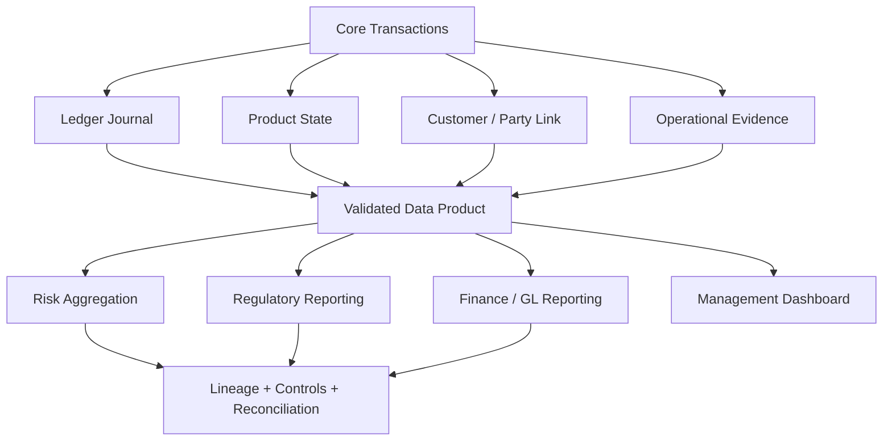
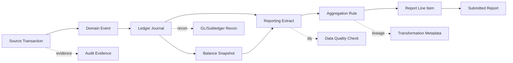
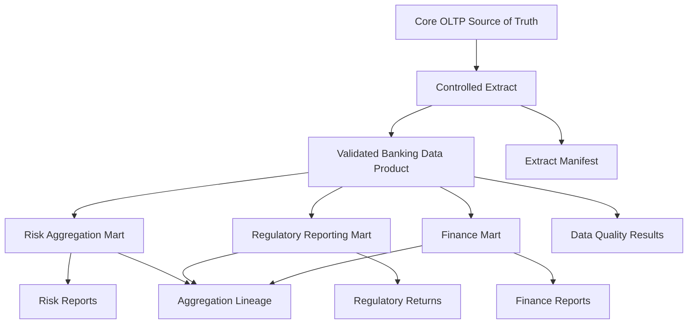
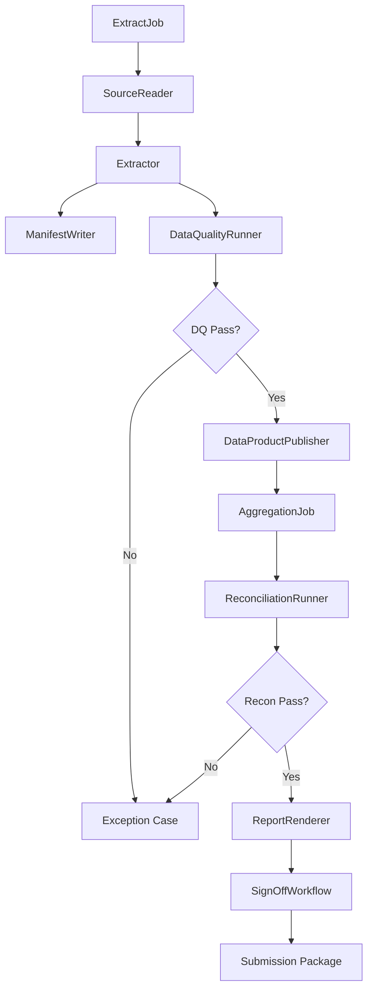
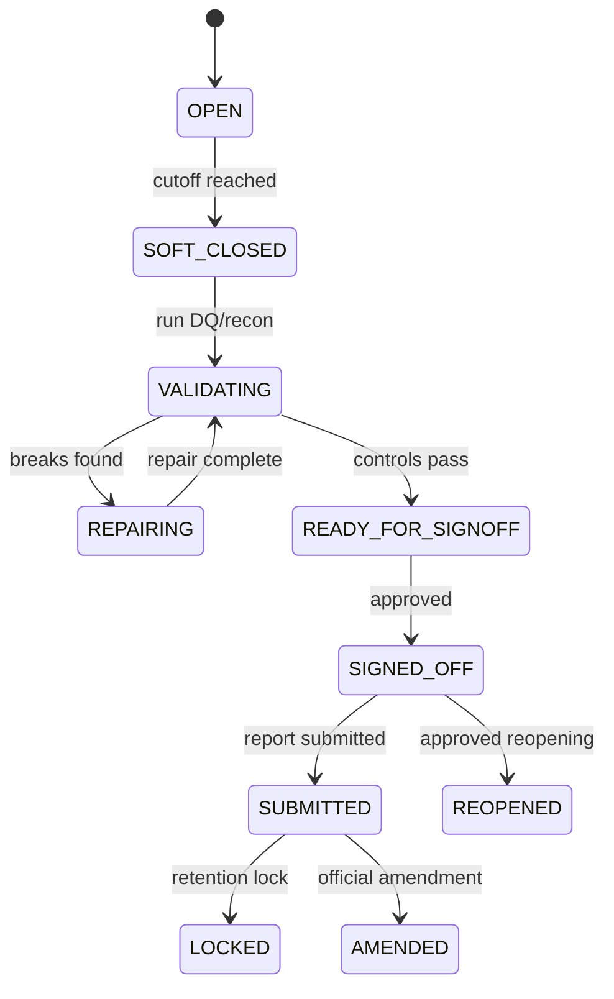
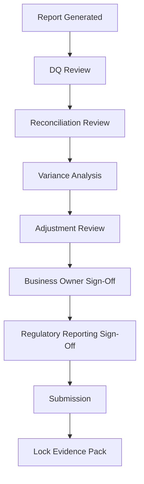

------
title: Learn Java Core Banking System - Part 026
description: Risk data aggregation, BCBS 239 principles, regulatory reporting readiness, lineage, controls, reconciled numbers, and Java architecture for defensible banking data.
series: learn-java-core-banking-system
seriesTitle: Learn Java Core Banking System
order: 26
partTitle: Risk Data Aggregation, BCBS 239, and Regulatory Reporting Readiness
tags:
- java
- core-banking
- bcbs239
- risk-data-aggregation
- regulatory-reporting
- data-lineage
- controls
- compliance
- reporting
- banking
- series
date: 2026-06-28
------

# Part 026 — Risk Data Aggregation, BCBS 239, and Regulatory Reporting Readiness

> Core banking tidak cukup hanya benar saat transaksi terjadi. Ia juga harus mampu menghasilkan angka yang complete, accurate, timely, adaptable, traceable, reconciled, dan dapat dipertanggungjawabkan saat ditanya risk, finance, audit, supervisor, atau regulator.

Banyak engineer melihat reporting sebagai downstream concern. Dalam banking, ini premis yang lemah.

Core banking adalah salah satu sumber utama angka yang masuk ke:

1. liquidity monitoring;
2. credit exposure;
3. deposit concentration;
4. loan delinquency;
5. capital/risk reporting;
6. regulatory returns;
7. management information system;
8. financial statements;
9. audit sampling;
10. supervisory examination.

Jika core banking tidak mendesain lineage dan control sejak awal, downstream reporting akan menjadi kumpulan ETL patch yang sulit diaudit.

---

## 1. Posisi Part Ini dalam Seri

Kita sudah membahas ledger, posting, product engine, EOD, reconciliation, audit, dan exception queue. Sekarang kita membahas bagaimana semua artefak itu menjadi angka risk/reporting yang defensible.



Part ini bukan membahas semua format laporan regulator per negara. Fokusnya adalah capability engineering agar laporan apa pun dapat dibangun dengan dasar yang kuat.

---

## 2. BCBS 239 sebagai Mental Model Engineering

BCBS 239 adalah prinsip Basel Committee tentang effective risk data aggregation dan risk reporting. Walaupun awalnya ditargetkan pada bank sistemik penting, prinsipnya sangat relevan untuk sistem banking mana pun yang ingin angka risk-nya dapat dipercaya.

Dalam kacamata engineer, BCBS 239 bukan hanya dokumen compliance. Ia adalah checklist arsitektur data:

1. governance;
2. data architecture;
3. accuracy;
4. integrity;
5. completeness;
6. timeliness;
7. adaptability;
8. report clarity;
9. report usefulness;
10. frequency;
11. distribution;
12. supervisory review.

Kita akan menerjemahkannya menjadi engineering practices.

---

## 3. Risk Data Aggregation Bukan BI Dashboard

BI dashboard bertanya:

```txt
How many accounts? How much balance? What is the trend?
```

Risk data aggregation bertanya:

```txt
Can the institution aggregate material risk exposures accurately and quickly across legal entity, business line, product, customer segment, geography, currency, time bucket, and stress scenario — and prove where each number came from?
```

Perbedaannya:

| Dimensi | BI Dashboard | Risk Data Aggregation |
|---|---|---|
| Toleransi angka | kadang approximate | harus controlled |
| Lineage | sering opsional | wajib |
| Reconciliation | tidak selalu | wajib |
| Frequency | business-driven | risk/regulatory-driven |
| Governance | analytics team | enterprise control |
| Explainability | chart-level | record-to-report |
| Stress readiness | jarang | penting |
| Data quality | best effort | measured and controlled |

---

## 4. Core Banking Data yang Masuk Risk/Reporting

Contoh data core banking bernilai risk:

| Domain | Data | Contoh Reporting Impact |
|---|---|---|
| Account | balance, status, product, currency | deposit report, liquidity, dormant account |
| Ledger | journal, posting date, value date | financial reporting, GL reconciliation |
| Loan | outstanding principal, interest, DPD | credit risk, NPL, impairment input |
| Deposit | maturity, rate, rollover | liquidity gap, concentration risk |
| Customer/Party | segment, residency, relationship | KYC, concentration, regulatory classification |
| Collateral/Limit | secured amount, exposure | credit risk aggregation |
| Payment | unsettled amount, returns | settlement risk, operational risk |
| Fee/Tax | accrued/charged/waived | revenue reporting, tax reporting |
| Exception | open breaks, suspense aging | operational risk |
| Audit | approvals, overrides, changes | control effectiveness |

Jika data ini hanya tersedia sebagai side effect UI atau log, reporting akan rapuh.

---

## 5. Record-to-Report Mental Model

Regulatory-ready system harus bisa menjelaskan perjalanan angka.



Pertanyaan defensible:

1. angka ini berasal dari transaksi apa;
2. rule mana yang memasukkan transaksi ke bucket ini;
3. versi rule apa yang dipakai;
4. data cut-off kapan;
5. apakah data sudah direkonsiliasi;
6. apakah ada exception yang dikecualikan;
7. apakah ada manual adjustment;
8. siapa menyetujui adjustment;
9. apakah angka bisa direproduksi;
10. apakah angka berubah setelah submission.

---

## 6. Data Architecture: Source, Extract, Product, Report

Jangan langsung query production OLTP untuk semua laporan besar.

Gunakan layer eksplisit:



Layer:

| Layer | Tanggung Jawab |
|---|---|
| OLTP source | transaksi dan state operasional yang benar |
| Controlled extract | snapshot konsisten berdasarkan business date/cutoff |
| Data product | cleaned, typed, versioned, documented, reconciled |
| Aggregation mart | risk/reporting-specific grouping and metrics |
| Report output | submission-ready numbers and metadata |

---

## 7. Extract Manifest

Setiap extract harus punya manifest.

Contoh:

```json
{
  "extractId": "EXT-CORE-ACCOUNT-20260628-EOD",
  "sourceSystem": "CORE_BANKING",
  "businessDate": "2026-06-28",
  "cutoffInstant": "2026-06-28T23:59:59+07:00",
  "sourceSchemaVersion": "account-balance-v12",
  "recordCount": 12004512,
  "totalLedgerBalanceByCurrency": {
    "IDR": "9210000000000.00",
    "USD": "12000000.00"
  },
  "controlHash": "sha256:9f1e...",
  "createdAt": "2026-06-29T00:45:00+07:00",
  "createdByJob": "core-eod-extract-v8.3.1"
}
```

Manifest membantu:

1. completeness check;
2. reproducibility;
3. comparison antar run;
4. audit trail;
5. lineage;
6. rerun safety;
7. downstream contract.

---

## 8. Completeness

Completeness berarti semua data material yang harus masuk memang masuk.

Contoh completeness failure:

1. cabang tertentu tidak masuk extract;
2. loan product baru belum dipetakan;
3. closed account masih harus reportable tetapi terfilter;
4. suspense account tidak masuk exposure report;
5. backdated posting setelah cutoff tidak masuk correction flow;
6. joint account hanya dihitung satu owner secara salah;
7. timezone menyebabkan transaksi akhir hari hilang.

Control:

```sql
-- Control total per currency dari source ledger
SELECT currency, COUNT(*) AS entry_count, SUM(amount_minor) AS total_minor
FROM ledger_entry
WHERE business_date = DATE '2026-06-28'
GROUP BY currency;

-- Control total di extract
SELECT currency, COUNT(*) AS entry_count, SUM(amount_minor) AS total_minor
FROM reporting_ledger_extract
WHERE extract_id = 'EXT-LEDGER-20260628-EOD'
GROUP BY currency;
```

Angka harus cocok berdasarkan rule yang jelas. Jika tidak cocok, harus ada documented exclusion.

---

## 9. Accuracy dan Integrity

Accuracy bukan hanya “query-nya benar”. Accuracy berarti angka merepresentasikan realitas bisnis sesuai definisi.

Contoh:

| Data | Accuracy Rule |
|---|---|
| ledger balance | berasal dari posted journal yang balanced |
| available balance | ledger balance - holds - lien + overdraft limit |
| loan outstanding | principal not yet repaid/write-off adjusted |
| DPD | dihitung dari due schedule dan payment allocation |
| maturity bucket | berdasarkan contractual maturity/effective date |
| customer segment | berdasarkan party classification yang effective pada business date |

Integrity berarti relasi dan constraint tidak rusak:

1. setiap account punya product;
2. setiap posting line punya journal;
3. setiap journal balanced;
4. currency amount tidak campur minor unit;
5. status valid menurut lifecycle;
6. product parameter version ada;
7. reference data effective-date valid;
8. no orphan reporting row.

---

## 10. Timeliness

Timeliness adalah kemampuan menyediakan data sesuai waktu yang dibutuhkan.

Bukan semua data harus real-time. Yang penting adalah kesesuaian dengan kebutuhan risk/reporting.

| Use Case | Timeliness |
|---|---|
| intraday liquidity view | near real-time / frequent batch |
| EOD balance report | after EOD controlled extract |
| regulatory monthly return | period close + validation cycle |
| crisis/stress aggregation | accelerated aggregation |
| fraud operational dashboard | near real-time |
| board risk pack | scheduled with sign-off |

Kesalahan umum:

1. menjanjikan real-time tanpa reconciliation;
2. batch harian tanpa kemampuan stress run;
3. extract terlalu lambat karena query langsung OLTP;
4. report bisa cepat tapi tidak lengkap;
5. “latest” mencampur business date berbeda.

Core system harus menyimpan business date dan cutoff secara eksplisit.

---

## 11. Adaptability

BCBS-style readiness menuntut kemampuan beradaptasi terhadap kebutuhan baru, terutama saat stress.

Adaptability untuk engineer berarti:

1. report dimension mudah ditambah;
2. product baru tidak merusak report lama;
3. mapping rule versioned;
4. reference data effective-dated;
5. aggregation dapat dijalankan ulang;
6. lineage tetap tersedia;
7. report dapat dibuat untuk ad-hoc supervisory request;
8. schema evolution terkendali;
9. backward compatibility jelas;
10. manual spreadsheet patch diminimalkan.

Anti-pattern:

```txt
Regulator minta breakdown baru -> tim export CSV -> edit Excel -> submit manual -> tidak ada lineage.
```

Pattern lebih baik:

```txt
New breakdown -> define versioned dimension mapping -> run controlled aggregation -> validate totals -> produce report output + lineage manifest.
```

---

## 12. Data Lineage: Technical dan Business

Lineage harus menjelaskan transformasi teknis dan makna bisnis.

### 12.1 Technical Lineage

```txt
core.ledger_entry.amount_minor
-> extract.ledger_line.amount_minor
-> reporting.daily_balance.amount_minor
-> risk.deposit_by_currency.total_minor
-> report.LCR_LINE_12.amount
```

### 12.2 Business Lineage

```txt
Customer deposit liability balance as of EOD 2026-06-28
filtered by account.status in ACTIVE,DORMANT
excluding internal bank-owned accounts
mapped by product family = RETAIL_DEPOSIT
aggregated by currency and legal entity
```

Keduanya dibutuhkan. Technical lineage tanpa business definition tidak membantu regulator. Business definition tanpa technical lineage tidak bisa diverifikasi.

---

## 13. Lineage Record Model

Contoh model sederhana:

```java
public record LineageNode(
        String nodeId,
        LineageNodeType type,
        String name,
        String schemaVersion,
        String businessDefinition
) {}

public record LineageEdge(
        String fromNodeId,
        String toNodeId,
        String transformationId,
        String transformationVersion,
        String ruleDescription,
        String codeReference,
        String configHash
) {}

public enum LineageNodeType {
    SOURCE_TABLE,
    EXTRACT,
    DATA_PRODUCT,
    AGGREGATION,
    REPORT_LINE,
    SUBMITTED_REPORT
}
```

Lineage tidak harus langsung memakai platform besar. Mulai dengan metadata yang konsisten.

---

## 14. Regulatory Reporting Readiness

Readiness bukan berarti semua laporan sudah dibuat. Readiness berarti sistem punya capability untuk membuat laporan yang benar.

Checklist:

| Capability | Pertanyaan |
|---|---|
| Source ownership | siapa pemilik data account/loan/customer? |
| Definition governance | definisi balance/exposure/DPD disetujui siapa? |
| Extract reproducibility | bisa rerun report tanggal tertentu? |
| Data quality | rule apa yang memastikan completeness/accuracy? |
| Reconciliation | apakah totals match dengan ledger/GL/source? |
| Lineage | bisa trace report line ke source? |
| Adjustment control | manual adjustment disetujui dan terlihat? |
| Versioning | mapping/report rule versioned? |
| Evidence | submission punya evidence pack? |
| Sign-off | siapa approve final number? |

---

## 15. Report Definition as Code + Configuration

Jangan hardcode report line dalam query acak.

Contoh definisi:

```yaml
report: DEPOSIT_CONCENTRATION
version: 2026.06
businessDate: 2026-06-28
lines:
  - code: DC_001
    name: Retail deposit balance by currency
    source: DAILY_ACCOUNT_BALANCE
    filters:
      productFamily: RETAIL_DEPOSIT
      accountOwnership: CUSTOMER
      status: [ACTIVE, DORMANT]
    groupBy: [legalEntity, currency]
    measure: ledgerBalance
    reconciliation:
      compareTo: GL_CONTROL_ACCOUNT_CUSTOMER_DEPOSIT
      toleranceMinor: 0
```

Rule harus versioned karena definisi laporan bisa berubah.

---

## 16. Java Architecture: Reporting Pipeline

Contoh komponen:



Package design:

```txt
com.bank.core.reporting
├── extract
│   ├── ExtractJob.java
│   ├── ExtractManifest.java
│   └── SourceReader.java
├── quality
│   ├── DataQualityRule.java
│   ├── DataQualityResult.java
│   └── DataQualityRunner.java
├── lineage
│   ├── LineageNode.java
│   ├── LineageEdge.java
│   └── LineageRepository.java
├── aggregation
│   ├── AggregationDefinition.java
│   ├── AggregationEngine.java
│   └── AggregationResult.java
├── reconciliation
│   ├── ReportReconciliationRule.java
│   └── ReconciliationResult.java
└── submission
    ├── ReportPackage.java
    ├── SignOff.java
    └── ReportRenderer.java
```

---

## 17. Data Quality Rules

Data quality rule harus executable dan menghasilkan evidence.

```java
public interface DataQualityRule<T> {
    String id();
    String description();
    DataQualitySeverity severity();
    DataQualityResult evaluate(T dataset, DataQualityContext context);
}

public record DataQualityResult(
        String ruleId,
        boolean passed,
        DataQualitySeverity severity,
        long checkedCount,
        long failedCount,
        String evidenceRef,
        String message
) {}
```

Contoh rule:

```java
public final class JournalBalancedRule implements DataQualityRule<LedgerExtract> {
    @Override
    public String id() {
        return "LEDGER_JOURNAL_BALANCED";
    }

    @Override
    public DataQualityResult evaluate(LedgerExtract extract, DataQualityContext ctx) {
        List<String> failedJournals = extract.journals().stream()
                .filter(j -> !j.isBalanced())
                .map(JournalExtractRow::journalId)
                .toList();

        return new DataQualityResult(
                id(),
                failedJournals.isEmpty(),
                DataQualitySeverity.CRITICAL,
                extract.journals().size(),
                failedJournals.size(),
                ctx.writeEvidence(failedJournals),
                failedJournals.isEmpty()
                        ? "All journals balanced"
                        : "Unbalanced journals found"
        );
    }
}
```

Rule categories:

1. completeness;
2. uniqueness;
3. validity;
4. referential integrity;
5. consistency;
6. reconciliation;
7. timeliness;
8. plausibility;
9. lineage completeness;
10. access/privacy compliance.

---

## 18. Control Totals

Control totals adalah primitive sederhana tetapi sangat kuat.

Contoh controls:

1. row count;
2. sum amount by currency;
3. sum debit/credit by journal;
4. account count by status;
5. loan outstanding by product;
6. suspense balance by aging bucket;
7. extract hash;
8. min/max business date;
9. unmatched reference count;
10. rejected record count.

Control totals harus disimpan:

```sql
CREATE TABLE extract_control_total (
    extract_id       VARCHAR(80) NOT NULL,
    control_name     VARCHAR(120) NOT NULL,
    dimension_key    VARCHAR(300) NOT NULL,
    numeric_value    DECIMAL(38, 6),
    text_value       VARCHAR(500),
    created_at       TIMESTAMP NOT NULL,
    PRIMARY KEY (extract_id, control_name, dimension_key)
);
```

---

## 19. Reconciliation for Reports

Regulatory reporting readiness membutuhkan reconciliation point.

Contoh:

| Report Area | Reconcile To |
|---|---|
| deposit balance | deposit liability GL control account |
| loan outstanding | loan principal subledger + GL control |
| interest income | accrued/earned interest ledger |
| suspense aging | suspense GL/subledger |
| payment unsettled | clearing/settlement accounts |
| fees charged | fee income GL |
| tax withheld | tax payable GL/control report |

Jika report tidak reconcile, jangan tutup dengan “rounding difference” tanpa evidence.

---

## 20. Adjustment dan Override dalam Reporting

Kadang report membutuhkan adjustment. Ini normal, tetapi harus controlled.

Jenis adjustment:

1. mapping correction;
2. late posting adjustment;
3. manual regulatory classification;
4. exclusion dengan reason;
5. consolidation adjustment;
6. currency conversion adjustment;
7. rounding adjustment.

Model:

```java
public record ReportingAdjustment(
        String adjustmentId,
        String reportId,
        String lineCode,
        BigDecimal amount,
        String currency,
        AdjustmentType type,
        String reason,
        String evidenceRef,
        String makerId,
        String checkerId,
        Instant approvedAt
) {}
```

Aturan:

1. adjustment tidak boleh silent;
2. adjustment harus punya reason;
3. high-materiality adjustment harus approved;
4. original number tetap disimpan;
5. adjusted number ditandai;
6. adjustment harus masuk lineage.

---

## 21. Period Close dan Freezing

Reporting butuh cut-off yang jelas.

State machine period close:



Setelah submission, correction tidak boleh overwrite report lama. Buat amendment package.

---

## 22. Reproducibility

Sistem harus bisa menjawab:

```txt
Can we reproduce the report exactly as submitted last month?
```

Untuk itu simpan:

1. source extract id;
2. source schema version;
3. report definition version;
4. reference data versions;
5. transformation code version;
6. parameter snapshot;
7. data quality results;
8. reconciliation results;
9. manual adjustments;
10. rendered report artifact hash.

Jika report hanya hasil query live, reproducibility lemah.

---

## 23. Stress Reporting dan Ad-Hoc Request

Dalam kondisi stress, management/regulator bisa meminta aggregation cepat:

1. top deposit outflows by segment;
2. exposure by sector/geography;
3. loan delinquency by product;
4. maturity gap by currency;
5. unsettled payment exposure;
6. concentration by related parties;
7. branch/region liquidity position;
8. collateral coverage.

Architecture yang baik harus bisa merespons tanpa spreadsheet panic.

Kuncinya:

1. canonical dimensions;
2. effective-dated mappings;
3. reusable aggregation engine;
4. consistent business date;
5. data product yang sudah validated;
6. lineage otomatis;
7. controlled report package.

---

## 24. Privacy dan Minimum Necessary Reporting

Regulatory reporting sering butuh data sensitif. Namun tidak semua downstream consumer boleh melihat PII detail.

Design:

1. use surrogate keys where possible;
2. mask PII in non-production/reporting workbench;
3. separate identifiable and aggregated datasets;
4. enforce purpose-based access;
5. log report export;
6. restrict ad-hoc query;
7. keep evidence access controlled;
8. apply retention policy;
9. avoid raw card/payment sensitive data;
10. produce aggregated views when detail not needed.

Reporting readiness bukan alasan untuk membuat data lake bebas akses.

---

## 25. Failure Modes

### 25.1 Silent Mapping Gap

Produk baru launch tetapi report mapping belum diperbarui.

Dampak:

1. balance tidak masuk report;
2. GL masih balance tetapi regulatory line salah;
3. problem ditemukan setelah submission.

Control:

1. every product must map to reporting category;
2. mapping completeness DQ rule;
3. product release gate includes reporting impact.

### 25.2 Business Date Mixing

Report menggabungkan account balance EOD tanggal 28 dengan customer classification tanggal 29.

Dampak:

1. inconsistent segmentation;
2. non-reproducible report;
3. hard-to-explain variance.

Control:

1. as-of date for all dimensions;
2. effective-dated reference data;
3. extract manifest.

### 25.3 Manual Spreadsheet Adjustment

Adjustment dilakukan di luar system.

Dampak:

1. no lineage;
2. no approval evidence;
3. number cannot be reproduced;
4. operational key-person dependency.

Control:

1. reporting adjustment module;
2. maker-checker;
3. artifact hash;
4. sign-off pack.

### 25.4 Reconciliation Tolerance Abuse

Semua mismatch diberi label “immaterial”.

Dampak:

1. hidden control weakness;
2. growing breaks;
3. audit finding.

Control:

1. tolerance by rule and approved threshold;
2. aging monitor;
3. cumulative difference monitor;
4. mandatory reason.

---

## 26. Regulatory Submission Package

Submission package minimal berisi:

1. report output;
2. report definition version;
3. business date/period;
4. extract manifests;
5. DQ results;
6. reconciliation results;
7. adjustment list;
8. sign-off record;
9. lineage graph snapshot;
10. artifact hash;
11. exception list and waivers;
12. submission timestamp;
13. submitter/approver identity.

Contoh metadata:

```json
{
  "reportPackageId": "RPTPKG-DEP-202606",
  "reportCode": "DEPOSIT_CONCENTRATION",
  "period": "2026-06",
  "definitionVersion": "2026.06",
  "sourceExtracts": [
    "EXT-ACCOUNT-20260630-EOD",
    "EXT-PARTY-20260630-EOD",
    "EXT-LEDGER-20260630-EOD"
  ],
  "dataQualityStatus": "PASSED_WITH_WARNINGS",
  "reconciliationStatus": "PASSED",
  "manualAdjustments": 2,
  "signedOffBy": "risk.head@example.bank",
  "artifactHash": "sha256:91ab..."
}
```

---

## 27. Sign-Off Workflow

Sign-off bukan formalitas.

Role umum:

| Role | Fokus |
|---|---|
| Data owner | source data valid |
| Report owner | definition and interpretation valid |
| Finance/Risk owner | numbers make business sense |
| Compliance/regulatory reporting | submission requirement met |
| Technology owner | extract/process completed correctly |
| Internal control/audit | evidence and control adequate |

Workflow:



---

## 28. Variance Analysis

Report bukan hanya angka final. Variance harus dijelaskan.

Contoh variance questions:

1. mengapa deposit balance turun 8% dari kemarin;
2. mengapa loan delinquency naik 2% month-over-month;
3. mengapa suspense aging bertambah;
4. mengapa produk baru muncul di bucket lain;
5. mengapa GL reconcile difference muncul;
6. mengapa jumlah account dormant berubah besar.

Variance analysis harus menghubungkan angka ke driver:

1. transaction volume;
2. product migration;
3. rate change;
4. campaign;
5. calendar/cutoff;
6. correction batch;
7. data quality issue;
8. external event.

---

## 29. Java Implementation Pattern: Aggregation Engine

Aggregation engine harus pure sejauh mungkin.

```java
public final class AggregationEngine {
    public AggregationResult aggregate(
            AggregationDefinition definition,
            DataSet dataSet,
            AggregationContext context
    ) {
        List<DataRow> eligible = dataSet.rows().stream()
                .filter(row -> definition.filter().matches(row, context))
                .toList();

        Map<GroupKey, BigDecimal> grouped = new HashMap<>();
        for (DataRow row : eligible) {
            GroupKey key = definition.groupBy().keyOf(row, context);
            BigDecimal measure = definition.measure().valueOf(row, context);
            grouped.merge(key, measure, BigDecimal::add);
        }

        return new AggregationResult(
                definition.id(),
                definition.version(),
                grouped,
                context.lineageFor(definition, dataSet)
        );
    }
}
```

Prinsip:

1. input immutable snapshot;
2. definition versioned;
3. deterministic output;
4. no hidden global clock;
5. explicit rounding;
6. explicit currency handling;
7. lineage emitted;
8. DQ before and after aggregation.

---

## 30. Property Tests untuk Reporting

Beberapa invariant dapat diuji dengan property-based thinking.

Contoh invariant:

1. sum by product equals total by currency after grouping;
2. every account maps to exactly one report bucket;
3. excluded records have exclusion reason;
4. adjustment preserves original value;
5. rerun with same input and definition produces same output;
6. report line total reconciles with control account within approved tolerance;
7. no report row has unknown currency;
8. no effective-dated mapping overlaps ambiguously.

Pseudo-test:

```java
@Test
void aggregationIsDeterministicForSameSnapshotAndDefinition() {
    AggregationResult first = engine.aggregate(definition, snapshot, context);
    AggregationResult second = engine.aggregate(definition, snapshot, context);

    assertEquals(first.values(), second.values());
    assertEquals(first.lineageHash(), second.lineageHash());
}
```

---

## 31. Operational Runbook

Reporting runbook minimal:

1. confirm EOD completed;
2. create controlled extract;
3. validate extract manifest;
4. run data quality rules;
5. resolve critical DQ exceptions;
6. publish validated data product;
7. run aggregation;
8. reconcile totals;
9. analyze variances;
10. record adjustments;
11. collect sign-offs;
12. submit report;
13. lock evidence package;
14. archive artifacts;
15. monitor post-submission amendments.

---

## 32. Self-Correction Checklist

| Pertanyaan | Red Flag |
|---|---|
| Apakah report bisa direproduksi? | query live tanpa snapshot |
| Apakah source extract punya manifest? | file CSV tanpa metadata |
| Apakah rule report versioned? | SQL ad-hoc di laptop analyst |
| Apakah completeness diuji? | hanya row count global |
| Apakah mapping product lengkap? | unknown bucket dibiarkan |
| Apakah business date konsisten? | join data dengan tanggal berbeda |
| Apakah reconciliation formal? | “selisih kecil” tanpa reason |
| Apakah adjustment controlled? | angka diedit di spreadsheet |
| Apakah lineage record-to-report tersedia? | hanya nama tabel source |
| Apakah sign-off punya evidence? | approval via chat tanpa artifact |

---

## 33. Mini Project: Reporting Readiness Slice

Bangun slice kecil:

1. source ledger extract untuk satu business date;
2. account balance extract;
3. product mapping table effective-dated;
4. extract manifest;
5. DQ rules: balanced journals, valid currency, product mapping complete;
6. aggregation: deposit balance by product family and currency;
7. reconciliation to GL control total;
8. reporting adjustment with maker-checker;
9. report package metadata;
10. lineage graph export.

Acceptance criteria:

1. rerun deterministic;
2. missing product mapping fails DQ;
3. report cannot submit if critical DQ fails;
4. adjustment requires reason and checker;
5. report package shows extract id, definition version, DQ result, recon result, and artifact hash;
6. one report line can be traced back to source rows.

---

## 34. Ringkasan

Risk data aggregation dan regulatory reporting readiness adalah architecture concern, bukan hanya reporting team concern.

Prinsip utama:

1. core banking harus menghasilkan data yang reportable sejak desain awal;
2. BCBS 239 berguna sebagai mental model engineering untuk governance, accuracy, completeness, timeliness, adaptability, dan distribution;
3. report harus berbasis controlled extract, bukan query live yang tidak reproducible;
4. manifest, control totals, data quality, reconciliation, dan lineage adalah artefak utama;
5. business date, effective date, dan versioning harus eksplisit;
6. manual adjustment harus controlled, approved, dan masuk lineage;
7. report package harus menyimpan evidence lengkap;
8. regulatory readiness berarti mampu menjelaskan angka, bukan hanya menghasilkan angka;
9. stress/ad-hoc request membutuhkan reusable dimensions dan aggregation engine;
10. sistem yang matang mampu menjawab record-to-report.

Pada part berikutnya kita akan membahas data ownership, master data, reference data, dan effective dating: fondasi agar customer, product, branch, calendar, rate, dan mapping tidak menjadi sumber error tersembunyi.

---

## References

- Basel Committee on Banking Supervision, *Principles for effective risk data aggregation and risk reporting (BCBS 239)*, 2013. https://www.bis.org/publ/bcbs239.pdf
- Basel Committee on Banking Supervision, *Implementation of the Principles for effective risk data aggregation and risk reporting*, 2026 newsletter. https://www.bis.org/publ/bcbs_nl36.htm
- European Central Bank Banking Supervision, *Guide on effective risk data aggregation and risk reporting*, 2024. https://www.bankingsupervision.europa.eu/ecb/pub/pdf/ssm.supervisory_guides240503_riskreporting.en.pdf
- FFIEC, *Architecture, Infrastructure, and Operations Booklet*, 2021. https://ithandbook.ffiec.gov/it-booklets/architecture,-infrastructure,-and-operations.aspx
- NIST, *Cybersecurity Framework 2.0*, 2024. https://www.nist.gov/cyberframework
