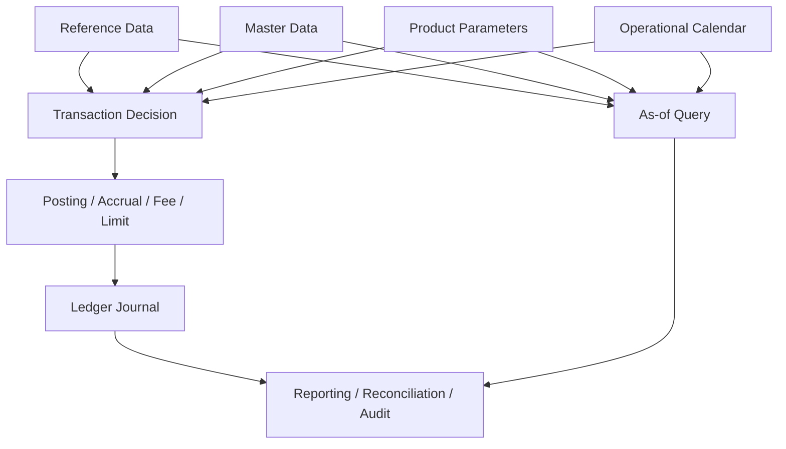
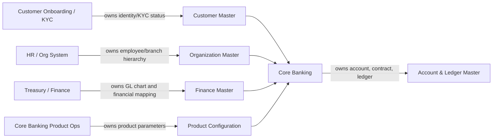
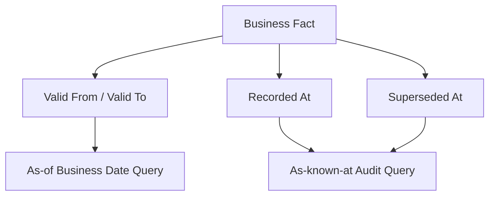
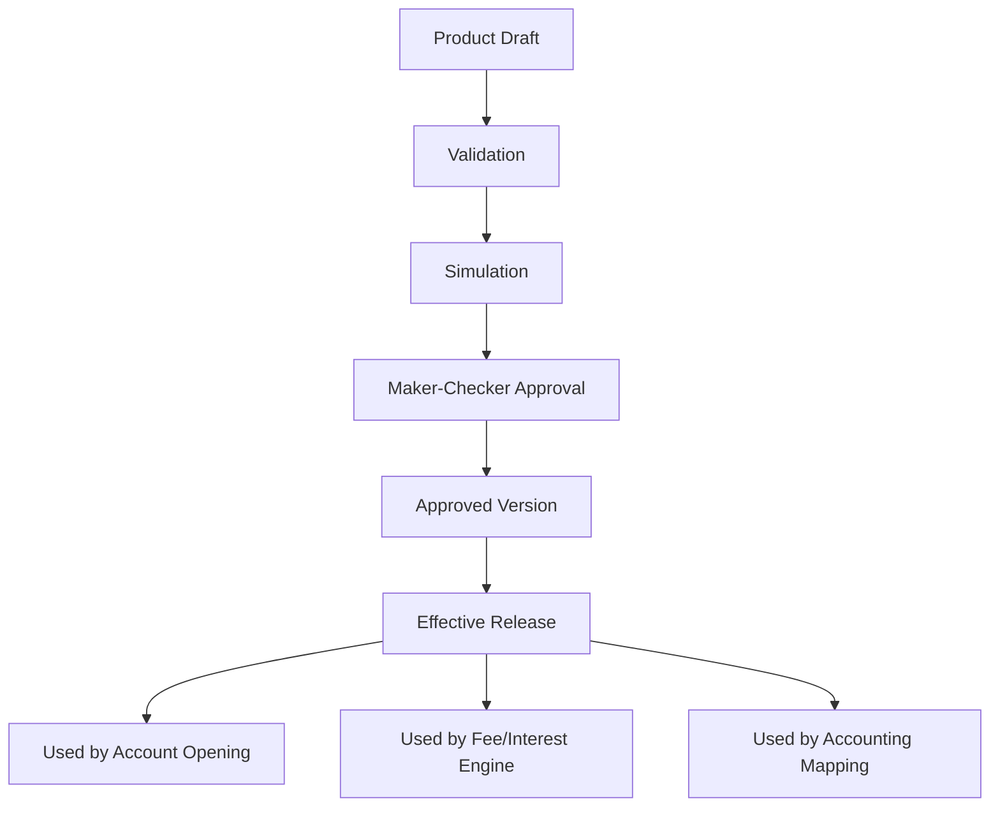
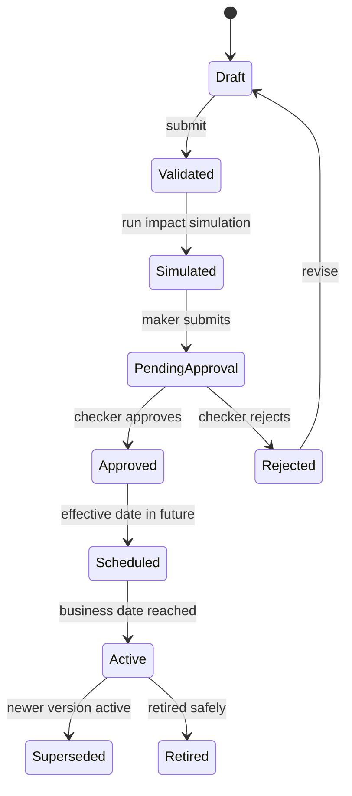
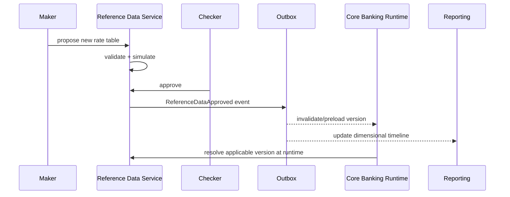

------
title: Learn Java Core Banking System - Part 027
description: Data ownership, master data, reference data, effective dating, as-of correctness, governance, and Java architecture for defensible banking data.
series: learn-java-core-banking-system
seriesTitle: Learn Java Core Banking System
order: 27
partTitle: Data Ownership, Master Data, Reference Data, and Effective Dating
tags:
- java
- core-banking
- data-ownership
- master-data
- reference-data
- effective-dating
- data-governance
- banking
- series
date: 2026-06-28
------

# Part 027 — Data Ownership, Master Data, Reference Data, and Effective Dating

> Core banking yang kuat bukan hanya punya tabel transaksi yang benar. Ia punya batas kepemilikan data yang jelas, reference data yang versioned, master data yang tidak saling menimpa, dan kemampuan menjawab pertanyaan “apa nilai yang benar pada tanggal bisnis tertentu?” secara deterministik.

Banyak bug serius dalam banking bukan berasal dari algoritma rumit, tetapi dari data yang terlihat sederhana:

- currency minor unit salah;
- holiday calendar berubah tapi batch lama tidak reproducible;
- branch merger berlaku tanggal tertentu tetapi laporan historis ikut berubah;
- product parameter diubah tanpa versioning;
- interest rate table ditimpa sehingga accrual lama tidak bisa dijelaskan;
- customer segment berubah sehingga fee waiver historis tampak salah;
- account officer diganti tetapi audit lama kehilangan konteks organisasi saat keputusan dibuat.

Di sistem non-finansial, masalah seperti itu sering dianggap “data quality issue”. Di core banking, ini bisa menjadi **ledger defect, reporting defect, audit defect, atau regulatory finding**.

---

## 1. Posisi Part Ini dalam Seri

Kita sudah membahas ledger, product engine, EOD, reconciliation, control, audit, dan risk reporting. Part ini menjelaskan fondasi data yang membuat semua itu stabil.



Part ini tidak mengulang persistence, SQL, atau caching secara umum. Fokusnya adalah **banking data semantics**: siapa pemilik data, kapan data berlaku, kapan data diketahui sistem, dan bagaimana data digunakan sebagai evidence.

---

## 2. Kaufman Deconstruction

Untuk menguasai data governance core banking, kita pecah skill menjadi sub-skill kecil.

| Sub-skill | Pertanyaan yang harus bisa dijawab |
|---|---|
| Data ownership | Sistem mana yang boleh mengubah data ini? |
| Master data modeling | Apakah ini customer, party, organization, branch, product, atau reference? |
| Reference data modeling | Apakah ini static, slow-changing, effective-dated, atau regulated? |
| Effective dating | Nilai mana yang berlaku pada `businessDate` tertentu? |
| Bitemporal thinking | Kapan fakta berlaku vs kapan sistem mengetahuinya? |
| Snapshot correctness | Apakah historical decision tetap reproducible? |
| Governance | Siapa approve perubahan dan bagaimana rollback/simulation? |
| Java implementation | Bagaimana API, repository, cache, dan validation dibuat aman? |

Target 20 jam pertama bukan menjadi “data governance officer”, melainkan bisa mendesain data foundation yang tidak merusak ledger dan reporting.

---

## 3. Klasifikasi Data dalam Core Banking

Sebelum bicara ownership, klasifikasikan dulu tipe datanya.

| Tipe Data | Contoh | Karakter | Risiko jika salah |
|---|---|---|---|
| Transaction data | journal, posting line, payment instruction | append-only, eventful | uang salah, audit rusak |
| Master data | party, customer, account, branch, organization | identity-bearing | salah owner, salah relationship |
| Reference data | currency, country, holiday, rate type, account status code | shared, often slow-changing | decision salah massal |
| Product configuration | product version, fee, interest, eligibility | effective-dated, approved | pricing/accounting salah |
| Derived data | balance snapshot, risk aggregation, reports | recomputable tapi dikontrol | angka tidak explainable |
| Evidence data | approval, source request, actor, parameter snapshot | immutable or append-only | tidak bisa defend keputusan |
| External identifiers | national ID ref, tax ID ref, payment rail ID, card token | regulated/sensitive | privacy/compliance breach |

Mental model penting:

> Jangan menyimpan data hanya karena “mungkin nanti perlu”. Simpan data karena ada owner, purpose, lifecycle, control, dan retention rule.

---

## 4. Data Ownership: System of Record vs System of Use

Data ownership menjawab pertanyaan: **siapa yang berhak menyatakan nilai resmi suatu data?**

Dalam enterprise banking, banyak sistem memakai data yang sama, tetapi tidak semua sistem boleh menjadi sumber kebenaran.



Core banking biasanya **bukan** pemilik semua data. Ia sering menjadi:

1. owner ledger dan account state;
2. owner product agreement yang sudah booked;
3. consumer customer/party data;
4. consumer branch/organization data;
5. consumer chart of accounts mapping dari finance;
6. publisher balance, transaction, product state, dan accounting events.

### 4.1 Ownership Matrix

| Data | Owner ideal | Core banking role | Update style |
|---|---|---|---|
| Party legal identity | Customer/KYC master | consume reference/snapshot | event/subscription/API |
| Customer segment | CRM/customer master | consume for pricing/eligibility | effective-dated event |
| Account | Core banking | own | transactional command |
| Account balance | Core banking ledger | own | posting engine only |
| Product catalog | Product ops/product factory | consume approved config | versioned release |
| Booked product agreement | Core banking | own | agreement lifecycle |
| Interest rate table | Treasury/product ops | consume approved rate | versioned/effective-dated |
| Currency code/minor unit | ISO/reference data admin | consume | controlled update |
| Holiday calendar | Ops/reference data admin | consume | approved/effective-dated |
| Branch hierarchy | Org master | consume/snapshot | effective-dated event |
| Chart of accounts | Finance/GL | consume mapping | approved mapping release |
| Regulatory report mapping | Finance/risk/reporting | consume/publish extract | controlled release |

Rule praktis:

> Core banking boleh menyimpan salinan data non-owned hanya jika salinan itu dibutuhkan untuk decision, historical reproducibility, or operational continuity.

---

## 5. Master Data vs Reference Data

### 5.1 Master Data

Master data adalah data utama yang merepresentasikan entity penting dalam operasi bank.

Contoh:

- party;
- customer;
- account;
- product;
- branch;
- organization unit;
- employee/user;
- legal entity;
- agreement;
- collateral reference;
- counterparty.

Master data punya identity, lifecycle, relationship, dan biasanya dipakai oleh banyak process.

### 5.2 Reference Data

Reference data adalah data yang menjadi domain vocabulary dan parameter keputusan.

Contoh:

- currency;
- country;
- province/city;
- holiday calendar;
- day-count convention;
- rate type;
- product category;
- fee type;
- tax type;
- account status code;
- payment purpose code;
- ISO 20022 code mapping;
- GL account mapping category.

Reference data sering terlihat “kecil”, tetapi efeknya sistemik. Kesalahan reference data bisa mempengaruhi ribuan transaksi.

---

## 6. Effective Dating: Fondasi Historical Correctness

Effective dating berarti setiap nilai punya periode berlaku.

Contoh:

- interest rate 4.5% berlaku mulai 2026-01-01;
- holiday calendar menambahkan emergency holiday pada 2026-03-12;
- product fee berubah untuk akun baru mulai 2026-07-01;
- branch A merger ke branch B mulai 2026-09-01;
- account officer reassignment berlaku mulai 2026-04-15.

Tanpa effective dating, sistem hanya tahu “nilai sekarang”. Banking butuh “nilai yang berlaku saat keputusan dibuat”.

### 6.1 Valid Time vs Transaction Time

Ada dua dimensi waktu penting:

| Dimensi waktu | Makna | Contoh |
|---|---|---|
| Valid time | kapan fakta berlaku di dunia bisnis | rate berlaku 1 Jan |
| Transaction time | kapan sistem mengetahui/menyimpan fakta | rate diinput 3 Jan |

Jika hanya memakai satu `updated_at`, kita kehilangan kemampuan menjawab:

- apa yang sistem tahu pada 2 Januari?
- apakah accrual 1 Januari memakai rate lama karena rate baru terlambat diinput?
- apakah backdated correction harus memakai rate valid-time atau system-known-time?

### 6.2 Bitemporal Model

Untuk data kritikal, gunakan bitemporal thinking.



Tidak semua data butuh bitemporal storage penuh. Tetapi engineer top-tier tahu kapan perlu:

| Data | Effective-dated | Bitemporal? | Alasannya |
|---|---:|---:|---|
| currency minor unit | yes | maybe | perubahan jarang tapi berdampak luas |
| product fee | yes | yes | audit pricing dan customer dispute |
| interest rate | yes | yes | accrual/repricing reproducibility |
| holiday calendar | yes | yes | EOD/cutoff/retry explanation |
| branch hierarchy | yes | maybe | reporting historis |
| customer phone number | usually no | no | operasional/contact, bukan ledger decision utama |
| customer risk rating | yes | yes | AML/risk decision evidence |
| account status | yes | yes | posting eligibility historis |

---

## 7. Java Domain Model untuk Effective-Dated Reference Data

### 7.1 Value Object untuk Periode Berlaku

```java
import java.time.LocalDate;
import java.util.Objects;

public record EffectivePeriod(LocalDate validFrom, LocalDate validToExclusive) {

    public EffectivePeriod {
        Objects.requireNonNull(validFrom, "validFrom must not be null");
        if (validToExclusive != null && !validToExclusive.isAfter(validFrom)) {
            throw new IllegalArgumentException("validToExclusive must be after validFrom");
        }
    }

    public boolean contains(LocalDate businessDate) {
        Objects.requireNonNull(businessDate, "businessDate must not be null");
        return !businessDate.isBefore(validFrom)
            && (validToExclusive == null || businessDate.isBefore(validToExclusive));
    }

    public boolean overlaps(EffectivePeriod other) {
        LocalDate thisEnd = validToExclusive == null ? LocalDate.MAX : validToExclusive;
        LocalDate otherEnd = other.validToExclusive == null ? LocalDate.MAX : other.validToExclusive;
        return validFrom.isBefore(otherEnd) && other.validFrom.isBefore(thisEnd);
    }
}
```

### 7.2 Reference Data Version

```java
import java.time.Instant;
import java.util.UUID;

public record ReferenceDataVersion<T>(
    UUID versionId,
    String dataSet,
    String code,
    EffectivePeriod effectivePeriod,
    T payload,
    ApprovalStatus approvalStatus,
    Instant recordedAt,
    String recordedBy,
    String changeReason
) {
    public boolean isApplicableOn(LocalDate businessDate) {
        return approvalStatus == ApprovalStatus.APPROVED
            && effectivePeriod.contains(businessDate);
    }
}

enum ApprovalStatus {
    DRAFT,
    PENDING_APPROVAL,
    APPROVED,
    REJECTED,
    RETIRED
}
```

### 7.3 Repository Contract

```java
public interface EffectiveDatedReferenceRepository<T> {

    ReferenceDataVersion<T> findApplicable(
        String dataSet,
        String code,
        LocalDate businessDate
    );

    List<ReferenceDataVersion<T>> findTimeline(
        String dataSet,
        String code
    );

    UUID proposeVersion(ReferenceDataVersion<T> draft);

    void approve(UUID versionId, ApprovalDecision decision);
}
```

Contract ini memaksa caller menyebut `businessDate`. Ini penting. Banyak bug muncul karena API memakai “current config” secara implisit.

---

## 8. As-of Query sebagai Primitive Utama

Core banking butuh query tipe:

```txt
find value applicable for businessDate X
find value known by system at instant Y
find value used by transaction Z
find timeline for code C
```

### 8.1 SQL Sketch

```sql
select *
from reference_data_version
where dataset = :dataset
  and code = :code
  and approval_status = 'APPROVED'
  and valid_from <= :business_date
  and (valid_to_exclusive is null or :business_date < valid_to_exclusive)
order by recorded_at desc
fetch first 1 row only;
```

Untuk data yang harus bitemporal:

```sql
select *
from reference_data_version
where dataset = :dataset
  and code = :code
  and valid_from <= :business_date
  and (valid_to_exclusive is null or :business_date < valid_to_exclusive)
  and recorded_at <= :known_at
  and (superseded_at is null or :known_at < superseded_at)
order by recorded_at desc
fetch first 1 row only;
```

---

## 9. Currency Reference Data

Currency adalah contoh reference data yang tampak kecil tapi sangat penting.

Minimal field:

| Field | Fungsi |
|---|---|
| alphabeticCode | `IDR`, `USD`, `JPY` |
| numericCode | numeric ISO code |
| minorUnit | jumlah decimal minor unit |
| activeFrom/activeTo | effective period |
| displayName | UI/reporting label |
| roundingMode | policy internal jika dibutuhkan |
| cashRoundingRule | jika cash denomination berbeda |
| settlementAllowed | apakah boleh untuk settlement |
| productAllowed | apakah boleh untuk account/product |

Jangan hardcode asumsi “semua currency punya 2 decimal”. ISO 4217 mendefinisikan currency code dan relationship dengan minor unit untuk currency yang memilikinya.

### 9.1 Money Factory dengan Currency Metadata

```java
import java.math.BigDecimal;
import java.math.RoundingMode;

public final class MoneyFactory {
    private final CurrencyReferenceService currencies;

    public MoneyFactory(CurrencyReferenceService currencies) {
        this.currencies = currencies;
    }

    public Money of(String currencyCode, BigDecimal amount, LocalDate businessDate) {
        CurrencyDefinition currency = currencies.find(currencyCode, businessDate);
        BigDecimal normalized = amount.setScale(currency.minorUnit(), RoundingMode.UNNECESSARY);
        return new Money(currencyCode, normalized);
    }
}
```

Rule:

> Amount normalization harus memakai currency definition yang applicable pada business date, bukan asumsi static di code.

---

## 10. Calendar Reference Data

Calendar di core banking bukan sekadar library tanggal.

Ada beberapa calendar:

| Calendar | Digunakan untuk |
|---|---|
| bank operational calendar | EOD/BOD, branch operation |
| currency calendar | settlement/cutoff currency tertentu |
| payment rail calendar | clearing window |
| product calendar | interest accrual/maturity rules |
| local jurisdiction calendar | tax/regulatory deadline |

### 10.1 Business Calendar Service

```java
public interface BusinessCalendarService {

    boolean isBusinessDay(CalendarId calendarId, LocalDate date);

    LocalDate nextBusinessDay(CalendarId calendarId, LocalDate date);

    LocalDate previousBusinessDay(CalendarId calendarId, LocalDate date);

    BusinessDayAdjustmentResult adjust(
        CalendarId calendarId,
        LocalDate date,
        BusinessDayConvention convention
    );
}
```

### 10.2 Anti-pattern Calendar

```java
if (date.getDayOfWeek() == SATURDAY || date.getDayOfWeek() == SUNDAY) {
    return date.plusDays(2);
}
```

Ini buruk karena:

1. holiday bukan hanya weekend;
2. beberapa jurisdiction punya weekend berbeda;
3. emergency holiday bisa diumumkan mendadak;
4. payment rail punya calendar sendiri;
5. historical decision perlu calendar version yang dulu berlaku.

---

## 11. Product Parameter Ownership

Product configuration sangat dekat dengan ledger. Perubahan satu parameter bisa mengubah pricing, accounting, eligibility, maturity, dan customer treatment.



Product parameter harus punya:

- owner;
- version;
- effective period;
- approval state;
- simulation result;
- change reason;
- migration impact;
- backward compatibility rule;
- rollback strategy;
- reference to approval evidence.

### 11.1 Jangan Mutasi Product Lama Tanpa Versioning

Misal fee monthly berubah dari 10.000 ke 12.000.

Buruk:

```sql
update product_fee
set amount = 12000
where product_code = 'SAVINGS_PLUS';
```

Baik:

```txt
SAVINGS_PLUS v1 valid 2025-01-01 to 2026-07-01 fee 10000
SAVINGS_PLUS v2 valid 2026-07-01 to open-ended fee 12000
```

Untuk account existing, perlu rule:

- apakah ikut versi baru?
- hanya akun baru?
- grandfathering?
- perlu customer notification?
- perlu regulatory approval?
- perlu migration event?

---

## 12. Master Data Snapshot vs Live Lookup

Saat transaksi diposting, apakah sistem harus menyimpan snapshot data customer/product/branch?

Jawaban: tergantung apakah data itu mempengaruhi decision dan audit explanation.

| Data | Live lookup cukup? | Snapshot diperlukan? |
|---|---:|---:|
| customer display name untuk UI | yes | no |
| customer risk rating saat payment screening | no | yes |
| product fee version yang dipakai | no | yes |
| branch owner saat account opening | maybe | yes untuk audit/reporting |
| teller display name | no | actor id + authority snapshot |
| currency minor unit | no | reference version id penting |
| GL mapping | no | mapping version id penting |

Rule praktis:

> Jika data mempengaruhi uang, eligibility, risk decision, approval, or reportable classification, simpan reference/version id atau decision snapshot.

---

## 13. Data Lineage untuk Decision

Setiap keputusan penting harus bisa dijelaskan dengan input yang dipakai.

Contoh fee decision:

```json
{
  "decisionId": "fee-decision-20260628-0001",
  "accountId": "ACC-1001",
  "businessDate": "2026-06-28",
  "productVersionId": "SAVINGS-PLUS-v3",
  "customerSegmentVersionId": "SEGMENT-v8",
  "feeRuleVersionId": "MONTHLY-FEE-v12",
  "waiverPolicyVersionId": "WAIVER-v5",
  "computedAmount": "10000.00",
  "currency": "IDR",
  "decisionReason": "MONTHLY_MAINTENANCE_FEE_APPLIED"
}
```

Dengan lineage seperti ini, ketika customer dispute, engineer dapat menjawab:

1. rule apa yang dipakai;
2. parameter mana yang berlaku;
3. account state apa saat itu;
4. apakah waiver eligible;
5. journal mana yang muncul;
6. apakah GL mapping benar.

---

## 14. Reference Data Change Workflow

Reference data kritikal tidak boleh diedit langsung di production table.



### 14.1 Validation Checklist

Sebelum approve reference data:

- tidak ada overlapping effective period;
- tidak ada gap jika data wajib continuous;
- code format valid;
- owner jelas;
- downstream impact diketahui;
- simulation dijalankan;
- rollback/supersede strategy jelas;
- approval actor berbeda dari maker;
- change reason tidak kosong;
- evidence attached.

---

## 15. Cache Strategy untuk Reference Data

Reference data sering dibaca jauh lebih sering daripada ditulis. Cache berguna, tetapi berbahaya jika invalidation buruk.

### 15.1 Cache Key Harus Mengandung Business Date atau Version

Buruk:

```java
cache.get("SAVINGS_PLUS")
```

Baik:

```java
cache.get("product:SAVINGS_PLUS:asOf:2026-06-28")
cache.get("productVersion:SAVINGS_PLUS-v3")
```

### 15.2 Cache Safety Rules

| Rule | Alasan |
|---|---|
| cache immutable object | mencegah accidental mutation |
| include version/effective date in key | mencegah stale decision |
| short TTL untuk operational config | mengurangi impact update |
| event-based invalidation untuk approved release | update lebih cepat |
| fallback ke DB saat cache miss | availability |
| log version used | auditability |

### 15.3 Jangan Cache Draft sebagai Approved

Draft reference data hanya boleh dipakai untuk simulation. Production decision hanya boleh memakai approved effective version.

---

## 16. Data Quality Controls

Data quality bukan dashboard kosmetik. Ia harus menjadi blocking control untuk data yang berdampak ke ledger.

| Dimension | Banking example |
|---|---|
| Completeness | semua account punya product version |
| Accuracy | currency minor unit benar |
| Consistency | GL mapping product cocok dengan account type |
| Timeliness | daily rate tersedia sebelum EOD accrual |
| Uniqueness | tidak ada duplicate active party identity |
| Validity | status code sesuai allowed transition |
| Referential integrity | branch/product/currency reference exists |
| Historical integrity | tidak ada overlap effective period |

### 16.1 Data Quality Gate Example

```java
public final class ReferenceDataQualityGate {

    public ValidationResult validateProductRelease(ProductRelease release) {
        ValidationResult result = new ValidationResult();

        result.requireNoOverlap(release.productVersions());
        result.requireContinuousRequiredParameters(release.requiredParameters());
        result.requireExistingCurrency(release.currencyCodes());
        result.requireExistingGlMappings(release.accountingMappings());
        result.requireSimulationEvidence(release.simulationId());
        result.requireApprovalMatrixSatisfied(release.approvals());

        return result;
    }
}
```

---

## 17. Domain Boundary: Customer Data vs Core Data

Core banking sering tergoda menjadi customer 360 database. Ini buruk.

Core banking perlu data customer yang relevan untuk:

- account ownership;
- signing authority;
- risk/legal eligibility;
- product agreement;
- statement/address requirement;
- operational servicing;
- regulatory classification;
- screening decision reference.

Core banking biasanya tidak perlu menjadi source of truth untuk:

- marketing preference detail;
- full behavioral profile;
- raw KYC document images;
- full CRM interaction history;
- clickstream/mobile analytics;
- external enrichment profile.

Part 028 akan membahas privacy lebih dalam, tetapi di sini prinsipnya sudah jelas:

> Core banking menyimpan minimum data yang dibutuhkan untuk menjalankan kontrak, ledger, control, dan evidence.

---

## 18. Reference Data Publication Pattern

Saat reference data disetujui, sistem lain perlu tahu. Tetapi jangan publish draft atau perubahan belum aktif sebagai fakta operasional.



Event yang berguna:

- `ReferenceDataVersionProposed`;
- `ReferenceDataVersionApproved`;
- `ReferenceDataVersionActivated`;
- `ReferenceDataVersionSuperseded`;
- `ReferenceDataVersionRetired`.

Namun runtime posting tetap harus resolve dari approved store, bukan hanya percaya event cache.

---

## 19. Effective-Dated Relationship

Tidak hanya values yang effective-dated. Relationship juga bisa berubah.

Contoh:

- customer X beneficial owner account Y sejak tanggal tertentu;
- branch A mengelola account B sampai tanggal tertentu;
- company officer punya signing authority limit tertentu;
- product package linked ke fee bundle tertentu;
- employee assigned ke portfolio tertentu.

Model:

```java
public record EffectiveDatedRelationship(
    String relationshipType,
    String sourceEntityType,
    String sourceEntityId,
    String targetEntityType,
    String targetEntityId,
    EffectivePeriod period,
    String relationshipRole,
    String authorityLevel,
    UUID evidenceId
) {}
```

Untuk banking, relationship sering sama pentingnya dengan entity.

---

## 20. Historical Reporting Dimension

Jika branch merger terjadi 2026-09-01, laporan historis bulan Agustus seharusnya memakai branch structure Agustus, kecuali report memang meminta current-organization restatement.

Maka reporting harus membedakan:

| Mode | Arti |
|---|---|
| as-was | tampilkan sesuai struktur yang berlaku saat transaksi terjadi |
| as-is | tampilkan dengan struktur organisasi saat ini |
| as-known-at | tampilkan sesuai data yang diketahui sistem pada waktu tertentu |
| restated | tampilkan ulang dengan mapping baru secara eksplisit |

Jangan membuat satu query yang diam-diam mencampur semuanya.

---

## 21. API Design untuk Data Reference

### 21.1 Request Harus Eksplisit

```http
GET /reference-data/currencies/IDR?businessDate=2026-06-28
GET /products/SAVINGS_PLUS/applicable-version?businessDate=2026-06-28&customerSegment=RETAIL_MASS
GET /business-calendars/ID-CLEARING/adjust?date=2026-06-30&convention=FOLLOWING
```

### 21.2 Response Harus Mengandung Version

```json
{
  "code": "IDR",
  "minorUnit": 2,
  "validFrom": "2025-01-01",
  "validToExclusive": null,
  "versionId": "currency-idr-v2025-01",
  "source": "ISO4217_REFERENCE_ADMIN",
  "approvalStatus": "APPROVED"
}
```

Version id membuat decision traceable.

---

## 22. Operational Failure Modes

| Failure | Gejala | Dampak | Mitigasi |
|---|---|---|---|
| overlapping product version | dua config applicable | fee/interest nondeterministic | unique constraint + validator |
| missing rate | EOD accrual gagal | delayed close | pre-EOD completeness gate |
| stale cache | posting pakai config lama | customer dispute | versioned key + invalidation |
| unauthorized edit | parameter berubah tanpa approval | audit finding | maker-checker + immutable history |
| timezone confusion | effective date aktif salah hari | mass pricing error | business-date explicit |
| branch restatement accidental | laporan historis berubah | reporting defect | report mode explicit |
| reference code reuse | old code meaning berubah | historical corruption | never reuse semantic code |
| hardcoded minor unit | amount rounding salah | ledger defect | currency reference service |

---

## 23. Database Constraints yang Wajib Dipikirkan

Database tidak menggantikan domain logic, tetapi harus membantu menjaga invariant.

Minimal constraints:

- unique active code per dataset/effective period strategy;
- non-null owner, version id, status;
- valid period constraint;
- no overlapping periods melalui exclusion constraint jika DB mendukung;
- foreign key untuk approved version references;
- immutable approved version melalui trigger/policy/application guard;
- audit table append-only;
- checksum/hash untuk payload penting.

Pseudo DDL:

```sql
create table reference_data_version (
    version_id uuid primary key,
    dataset varchar(100) not null,
    code varchar(100) not null,
    valid_from date not null,
    valid_to_exclusive date null,
    approval_status varchar(30) not null,
    payload_json text not null,
    payload_hash varchar(128) not null,
    recorded_at timestamp not null,
    recorded_by varchar(100) not null,
    approved_at timestamp null,
    approved_by varchar(100) null,
    change_reason text not null
);

create index idx_refdata_applicable
on reference_data_version(dataset, code, valid_from, valid_to_exclusive, approval_status);
```

---

## 24. Testing Strategy

### 24.1 Property Tests untuk Effective Period

Yang harus selalu benar:

- tidak ada overlap untuk code yang sama;
- query as-of mengembalikan maksimal satu applicable version;
- gap dilarang untuk dataset continuous;
- draft tidak pernah dipakai production;
- approved version tidak bisa diedit;
- historical transaction tetap resolve ke version yang dipakai.

### 24.2 Scenario Tests

| Scenario | Expected |
|---|---|
| product fee v2 approved untuk future date | transaksi sebelum date pakai v1 |
| rate backdated diinput terlambat | EOD correction flow jelas |
| holiday emergency ditambahkan | affected payment/EOD masuk repair/simulation |
| branch merger | report as-was dan as-is berbeda secara eksplisit |
| duplicate currency code active | approval ditolak |
| cache berisi old version | runtime tetap log version dan invalidasi |

---

## 25. Latihan 20 Jam

### Jam 1–4: Domain Map

Buat data classification matrix untuk sistem core banking imajiner:

- party;
- customer;
- account;
- product;
- branch;
- currency;
- calendar;
- rate table;
- fee table;
- GL mapping;
- risk rating.

Tentukan owner, update mechanism, effective dating, snapshot need, dan privacy classification.

### Jam 5–8: Effective-Dated Repository

Implementasikan:

- `EffectivePeriod`;
- `ReferenceDataVersion<T>`;
- overlap validator;
- as-of query in-memory;
- tests.

### Jam 9–12: Product Version Simulation

Buat product fee version v1/v2, lalu simulasikan 1.000 account existing:

- akun yang ikut perubahan;
- akun grandfathered;
- akun exempted;
- total expected fee delta.

### Jam 13–16: Calendar Service

Buat calendar engine kecil:

- weekend;
- holiday;
- emergency holiday;
- following/preceding convention;
- effective-dated calendar version.

### Jam 17–20: Decision Trace

Buat fee decision trace:

- account id;
- product version;
- customer segment version;
- fee rule version;
- waiver version;
- computed amount;
- journal reference.

Lalu jawab dispute: “kenapa saya dikenakan fee tanggal X?”

---

## 26. Review Checklist

Gunakan checklist ini saat review desain data core banking.

- [ ] Setiap data kritikal punya owner.
- [ ] API tidak memakai “current data” secara implisit untuk keputusan historis.
- [ ] Effective date selalu memakai business date yang jelas.
- [ ] Product, rate, fee, calendar, GL mapping bersifat versioned.
- [ ] Approved configuration immutable.
- [ ] Draft config tidak bisa dipakai runtime production.
- [ ] Decision menyimpan version id/snapshot yang mempengaruhi hasil.
- [ ] Reference data change melewati validation, simulation, approval, activation.
- [ ] Cache key memasukkan version/as-of dimension.
- [ ] Reporting membedakan as-was, as-is, as-known-at, dan restated.
- [ ] Tidak ada hardcoded currency minor unit/calendar/product assumptions.
- [ ] Data non-owned disalin hanya jika ada purpose operasional/audit.

---

## 27. Kesimpulan

Data ownership, master data, reference data, dan effective dating adalah fondasi correctness yang sering tidak terlihat.

Core banking yang matang memiliki prinsip berikut:

1. ledger adalah sumber kebenaran uang;
2. customer master tidak otomatis dimiliki core;
3. product configuration harus versioned dan approved;
4. reference data harus effective-dated jika berdampak ke uang, risk, report, atau audit;
5. setiap keputusan finansial harus menyimpan version/snapshot input yang mempengaruhinya;
6. query historis harus eksplisit: as-of, as-was, as-is, as-known-at, atau restated;
7. configuration change adalah operational risk, bukan CRUD biasa.

Jika Part 026 menjawab “bagaimana angka bisa dipertanggungjawabkan”, Part 027 menjawab “data apa yang membuat angka itu tetap benar sepanjang waktu”.

---

## References

- ISO 4217 — Currency Codes: https://www.iso.org/iso-4217-currency-codes.html
- BCBS 239 — Principles for effective risk data aggregation and risk reporting: https://www.bis.org/publ/bcbs239.pdf
- BIAN Service Landscape: https://bian.org/servicelandscape-13-0-0/views/view_55266.html
- NIST Privacy Framework: https://www.nist.gov/privacy-framework
