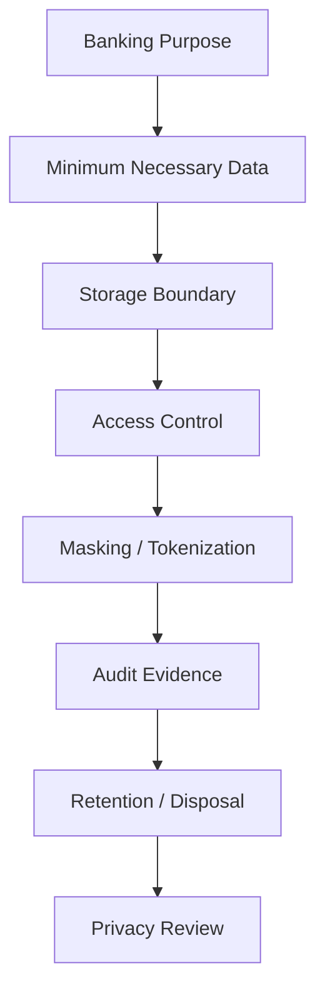
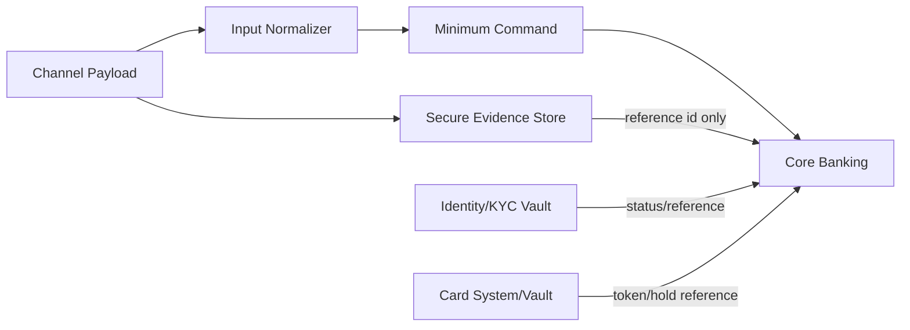
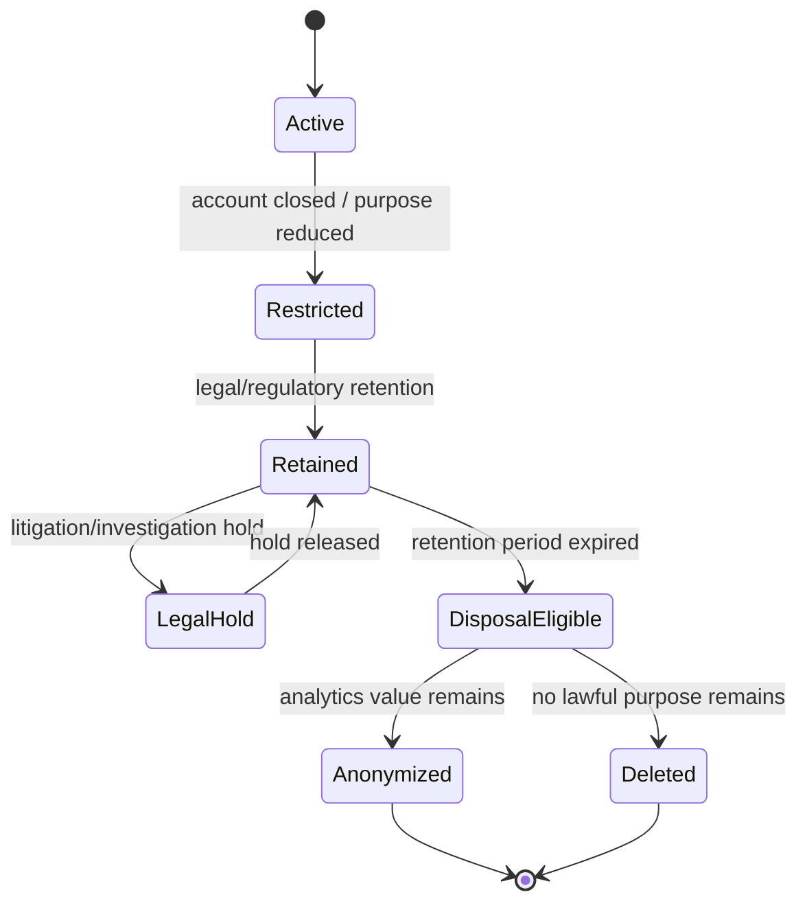
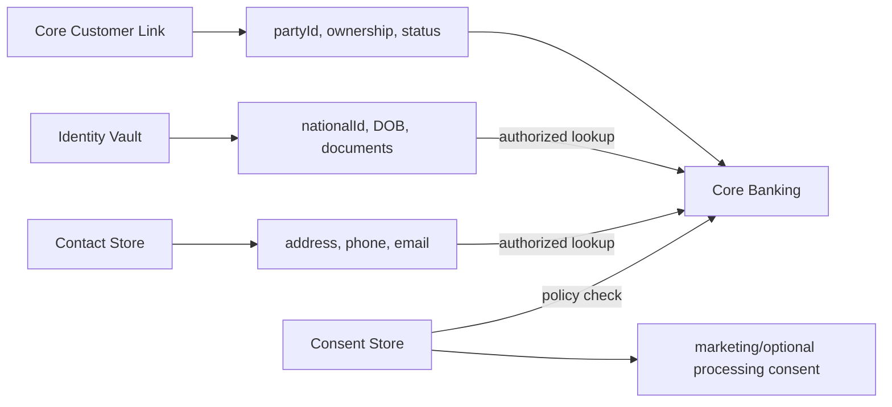
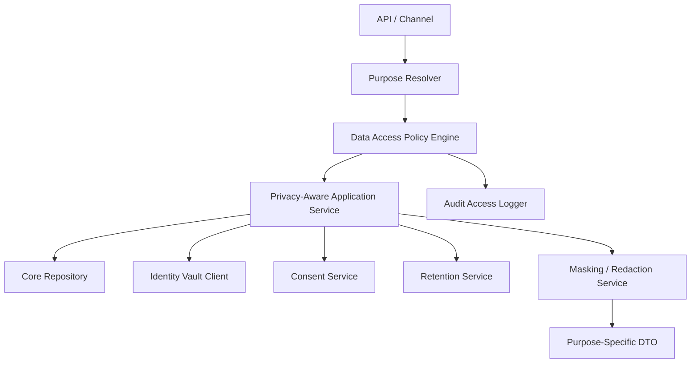

------
title: Learn Java Core Banking System - Part 028
description: Privacy, retention, consent, legal hold, minimum necessary data, masking, access control, and Java architecture for privacy-aware core banking.
series: learn-java-core-banking-system
seriesTitle: Learn Java Core Banking System
order: 28
partTitle: Privacy, Retention, Consent, and Minimum Necessary Banking Data
tags:
- java
- core-banking
- privacy
- retention
- consent
- data-minimization
- pii
- compliance
- banking
- series
date: 2026-06-28
------

# Part 028 — Privacy, Retention, Consent, and Minimum Necessary Banking Data

> Core banking harus menyimpan cukup data untuk menjalankan kontrak finansial, ledger, regulatory obligation, audit, dan dispute handling. Tetapi ia tidak boleh menjadi tempat pembuangan semua data sensitif hanya karena “mungkin nanti perlu”.

Di banking, privacy bukan fitur tambahan. Ia adalah bagian dari desain domain.

Sistem core banking memproses data yang sangat sensitif:

- identity;
- address;
- account ownership;
- balance;
- transaction history;
- loan obligation;
- delinquency status;
- payment beneficiary;
- risk classification;
- tax classification;
- audit actor;
- legal hold;
- regulatory evidence.

Jika desain privacy lemah, dampaknya bukan hanya data breach. Dampaknya bisa berupa customer harm, regulatory penalty, audit finding, reputational damage, dan hambatan modernization karena data sensitif tersebar tanpa ownership.

---

## 1. Posisi Part Ini dalam Seri

Part 027 membahas data ownership dan effective dating. Part ini mempersempit pertanyaan:

> Dari semua data yang bisa disimpan, data mana yang benar-benar perlu ada di core banking, untuk purpose apa, berapa lama, siapa boleh melihat, dan bagaimana ia dihapus/dibatasi ketika tidak lagi diperlukan?



Part ini bukan nasihat hukum. Ia adalah engineering mental model agar sistem Java core banking bisa mendukung privacy obligation secara defensible.

---

## 2. Kaufman Deconstruction

| Sub-skill | Pertanyaan utama |
|---|---|
| Data minimization | Apakah core benar-benar perlu data ini? |
| Purpose modeling | Untuk proses apa data dipakai? |
| Consent semantics | Apakah consent relevan atau basisnya kontrak/legal obligation? |
| Retention design | Kapan data harus disimpan, dibatasi, dihapus, atau diarsipkan? |
| Access control | Siapa boleh melihat data, dalam konteks apa? |
| Masking/tokenization | Data mana yang tidak boleh muncul mentah di UI/log/event? |
| Audit privacy | Bagaimana membuktikan akses dan penggunaan data? |
| Java implementation | Bagaimana DTO, policy engine, repository, dan logs dibuat privacy-aware? |

Targetnya bukan menghafal semua regulasi privacy global. Targetnya adalah membangun sistem yang punya **purpose, boundary, evidence, dan lifecycle**.

---

## 3. Prinsip Minimum Necessary Data

Prinsip praktis:

> Data yang tidak dikumpulkan tidak bisa bocor, tidak perlu dilindungi, tidak perlu dihapus, dan tidak akan menjadi liability di masa depan.

Untuk core banking, data boleh disimpan jika mendukung salah satu purpose berikut:

| Purpose | Contoh data yang mungkin diperlukan |
|---|---|
| Contract execution | party id, account owner, product agreement |
| Ledger operation | account id, transaction amount, counterparty reference |
| Payment processing | beneficiary, bank identifier, payment purpose |
| Regulatory obligation | tax status, risk classification, KYC status reference |
| Fraud/AML integration | screening status, hold decision reference |
| Customer servicing | contact reference, statement preference |
| Dispute handling | transaction evidence, channel request id |
| Audit/control | actor, approval, authority snapshot |
| Legal hold | retention override, case reference |

Data tidak boleh disimpan hanya karena:

- “mungkin analytics butuh”;
- “frontend sudah kirim field itu”;
- “mudah saja simpan semua request JSON”;
- “nanti kalau dispute mungkin berguna” tanpa retention purpose yang jelas;
- “vendor API mengembalikan banyak field”.

---

## 4. Data Classification untuk Core Banking

| Class | Contoh | Storage guidance |
|---|---|---|
| Public/reference | product display name, branch public address | boleh lebih luas, tetap versioned jika berdampak |
| Internal business | product parameter, GL mapping | restricted by function |
| Confidential customer | account number, balance, transaction history | strict access + masking |
| Sensitive identity | national ID, tax ID, date of birth | minimize + token/reference |
| Highly sensitive | biometrics, raw KYC documents, card PAN/CVV | sebaiknya di specialized vault/system, bukan core |
| Regulatory evidence | approval, audit trail, legal hold | immutable, access-controlled, retained by policy |
| Derived analytics | behavioral score, propensity model | jangan masuk core kecuali needed for banking decision |

Core banking sebaiknya menyimpan identifier/reference ke specialized system untuk data sangat sensitif, bukan seluruh payload mentah.

---

## 5. Core Banking Bukan Data Lake

Anti-pattern umum:

```txt
mobile app request JSON -> save raw request in core_transaction.raw_payload
partner API payload -> save full body forever
KYC document -> store binary in core customer table
card payload -> log full authorization request
```

Masalah:

1. data sensitif tersebar;
2. retention sulit;
3. masking tidak konsisten;
4. developer/test environment ikut terpapar;
5. audit scope melebar;
6. breach impact membesar;
7. subject rights sulit dipenuhi;
8. migration lebih berisiko.

Pattern yang lebih sehat:



Core menyimpan minimum command dan reference ke evidence store/vault jika benar-benar perlu.

---

## 6. Consent: Jangan Dipakai sebagai Jawaban Universal

Dalam banking, banyak pemrosesan data tidak berbasis consent murni. Ada contract execution, legal obligation, legitimate operational need, fraud prevention, AML, tax, accounting, dan audit retention.

Consent biasanya lebih cocok untuk:

- marketing preference;
- optional personalization;
- optional data sharing;
- non-essential analytics;
- third-party offer;
- optional communication channel.

Consent kurang tepat sebagai basis utama untuk:

- menyimpan ledger transaction;
- memproses payment instruction;
- memenuhi KYC/AML obligation;
- menyimpan audit trail;
- memenuhi tax/regulatory reporting;
- menjalankan dispute/legal hold.

Mental model:

> Consent adalah salah satu signal dalam policy model, bukan saklar global yang menentukan semua data banking boleh/tidak boleh diproses.

### 6.1 Consent Model

```java
public record ConsentGrant(
    String subjectId,
    String purposeCode,
    String channel,
    ConsentStatus status,
    Instant grantedAt,
    Instant withdrawnAt,
    String evidenceId,
    String policyVersionId
) {}

enum ConsentStatus {
    GRANTED,
    WITHDRAWN,
    EXPIRED,
    NOT_REQUIRED
}
```

Policy check:

```java
public interface DataUsePolicy {
    DataUseDecision canUse(
        ActorContext actor,
        DataSubject subject,
        DataElement dataElement,
        Purpose purpose,
        Instant accessTime
    );
}
```

---

## 7. Purpose Limitation sebagai Domain Primitive

Jangan hanya membuat permission seperti `READ_CUSTOMER`.

Dalam privacy-aware banking, access harus menjawab:

- siapa actor;
- apa role/authority;
- customer/account mana;
- purpose apa;
- data element apa;
- channel apa;
- apakah ada case/ticket;
- apakah ada consent/legal basis;
- apakah access perlu masked;
- apakah access harus direkam sebagai evidence.

### 7.1 Purpose Code Example

| Purpose Code | Description | Typical basis |
|---|---|---|
| ACCOUNT_SERVICING | customer support/account maintenance | contract/operation |
| PAYMENT_EXECUTION | execute payment instruction | contract/payment instruction |
| AML_SCREENING | comply with AML/sanctions process | legal/regulatory obligation |
| DISPUTE_INVESTIGATION | investigate customer dispute | contract/legal interest |
| REGULATORY_REPORTING | produce required report | legal obligation |
| AUDIT_REVIEW | internal/external audit evidence | legal/control obligation |
| MARKETING_OFFER | promotional targeting | consent/preference |
| FRAUD_MONITORING | detect suspicious behavior | legitimate/legal obligation depending jurisdiction |

---

## 8. Minimum DTO Design

### 8.1 Bad DTO

```java
public record AccountOverviewResponse(
    String accountId,
    String accountNumber,
    String customerName,
    String nationalId,
    String dateOfBirth,
    String fullAddress,
    BigDecimal ledgerBalance,
    BigDecimal availableBalance,
    List<TransactionDto> transactions,
    String riskRating,
    String taxId,
    String marketingSegment
) {}
```

Masalah: satu DTO terlalu kaya dan akan dipakai ulang di banyak context. Lama-lama data sensitif bocor ke channel yang tidak perlu.

### 8.2 Purpose-Specific DTO

```java
public record AccountListItemResponse(
    String accountId,
    String maskedAccountNumber,
    String displayName,
    Money availableBalance
) {}

public record TellerAccountServicingView(
    String accountId,
    String maskedAccountNumber,
    String customerDisplayName,
    AccountStatus status,
    Money availableBalance,
    List<RestrictionSummary> restrictions
) {}

public record AuditAccountView(
    String accountId,
    String accountNumber,
    String ownerPartyId,
    List<AuditEventRef> evidenceRefs
) {}
```

DTO harus mencerminkan purpose, bukan sekadar semua field yang tersedia.

---

## 9. Masking, Redaction, Tokenization

| Technique | Fungsi | Contoh |
|---|---|---|
| Masking | tampilkan sebagian | `********1234` |
| Redaction | hilangkan seluruh nilai | `[REDACTED]` |
| Tokenization | ganti dengan surrogate | `tok_abc123` |
| Pseudonymization | pisahkan identity direct dari dataset | analytics customer surrogate |
| Encryption | lindungi data at rest/in transit | DB/field encryption |
| Hashing | matching tanpa nilai mentah, tergantung threat model | tax id lookup hash |

Jangan campur istilah. Masking bukan encryption. Token bukan hash. Pseudonymized data masih bisa menjadi personal data jika bisa direlink.

### 9.1 Masking Service

```java
public final class SensitiveDataMasker {

    public String maskAccountNumber(String accountNumber) {
        if (accountNumber == null || accountNumber.length() < 4) {
            return "****";
        }
        return "****" + accountNumber.substring(accountNumber.length() - 4);
    }

    public String redact() {
        return "[REDACTED]";
    }
}
```

Masking policy tidak boleh tersebar sebagai string manipulation di controller. Jadikan reusable policy component.

---

## 10. Privacy-Aware Logging

Logging sering menjadi sumber kebocoran data.

Forbidden by default:

- full account number;
- national ID;
- tax ID;
- date of birth;
- full address;
- raw card data;
- full payment beneficiary details;
- authentication token;
- raw request/response dari partner;
- complete statement lines untuk debug.

Allowed with care:

- correlation id;
- transaction id;
- account id internal surrogate;
- masked account number;
- status code;
- error category;
- version id;
- amount bucket if needed;
- business date;
- actor id for audit logs, protected.

### 10.1 Structured Log Example

```java
log.info("payment command accepted accountId={} commandId={} businessDate={} status={}",
    accountId,
    commandId,
    businessDate,
    status);
```

Avoid:

```java
log.info("payment request={}", rawRequestJson);
```

---

## 11. Retention Model

Retention menjawab: data disimpan berapa lama dan dalam bentuk apa.

Banking retention kompleks karena banyak obligation:

- accounting records;
- audit trail;
- AML/KYC evidence;
- payment records;
- tax reporting;
- customer complaint/dispute;
- legal hold;
- product agreement;
- operational logs;
- security logs;
- analytics data;
- consent evidence.

### 11.1 Retention State Machine



### 11.2 Retention Policy Object

```java
public record RetentionPolicy(
    String dataCategory,
    String purposeCode,
    Period activeRetention,
    Period regulatoryRetention,
    DisposalAction disposalAction,
    boolean legalHoldOverrides,
    String policyVersionId
) {}

enum DisposalAction {
    DELETE,
    ANONYMIZE,
    RESTRICT_ACCESS,
    ARCHIVE_IMMUTABLE
}
```

---

## 12. Retention vs Audit Immutability

Core banking butuh audit trail. Privacy butuh minimization dan storage limitation. Ini terlihat bertentangan, tetapi bisa dikelola.

Pattern:

1. pisahkan raw sensitive data dari immutable audit metadata;
2. audit event menyimpan reference/token, bukan semua nilai mentah;
3. retention policy menentukan kapan raw payload dihapus;
4. legal/regulatory retention mempertahankan data yang wajib;
5. access ke retained data makin dibatasi;
6. evidence tetap bisa menunjukkan bahwa action terjadi tanpa mengekspos data yang tidak perlu.

Contoh audit event yang sehat:

```json
{
  "eventType": "CUSTOMER_ADDRESS_CHANGED",
  "subjectRef": "party-123",
  "actorId": "user-456",
  "purpose": "ACCOUNT_SERVICING",
  "evidenceRef": "evidence-789",
  "oldValueHash": "sha256:...",
  "newValueHash": "sha256:...",
  "occurredAt": "2026-06-28T10:15:30Z"
}
```

Jangan menyimpan full old/new address di semua audit stream jika tidak perlu.

---

## 13. Legal Hold

Legal hold menghentikan disposal normal karena ada investigasi, litigation, regulator request, atau dispute.

Model minimal:

```java
public record LegalHold(
    String holdId,
    String subjectType,
    String subjectId,
    String reasonCode,
    String caseId,
    Instant effectiveFrom,
    Instant releasedAt,
    String createdBy,
    String approvedBy
) {}
```

Rules:

- legal hold harus lebih kuat dari scheduled deletion;
- legal hold harus punya approval/evidence;
- release legal hold juga controlled;
- data under hold harus restricted, bukan bebas diakses;
- hold scope harus spesifik agar tidak over-retain seluruh customer universe.

---

## 14. Access Control: Role Saja Tidak Cukup

Role-based access control berguna, tetapi sering terlalu kasar.

Core banking butuh kombinasi:

- role;
- authority;
- branch/portfolio ownership;
- purpose;
- relationship to account;
- case assignment;
- data classification;
- consent/legal basis;
- risk context;
- break-glass reason.

### 14.1 Policy Decision

```java
public record DataAccessRequest(
    ActorContext actor,
    String subjectId,
    String resourceType,
    String resourceId,
    Set<DataElement> requestedElements,
    Purpose purpose,
    String caseId,
    Instant requestedAt
) {}

public record DataAccessDecision(
    boolean allowed,
    Map<DataElement, Visibility> visibilityByElement,
    String reasonCode,
    boolean auditRequired
) {}

enum Visibility {
    FULL,
    MASKED,
    REDACTED,
    DENIED
}
```

### 14.2 Element-Level Visibility

| Actor/Purpose | Balance | Full account no | National ID | Transaction list |
|---|---:|---:|---:|---:|
| Mobile customer self-service | full own balance | masked | denied | own transactions |
| Teller servicing assigned branch | full if authorized | masked/full by permission | masked | limited/full by case |
| Marketing | denied | denied | denied | aggregated only |
| AML case investigator | full if case assigned | full if justified | full if justified | full if justified |
| Audit reviewer | controlled full | controlled full | masked unless needed | full sample with evidence |

---

## 15. Privacy in Events and Streams

Event-driven systems memperbesar risiko data leakage karena event mudah dikonsumsi banyak downstream.

Anti-pattern:

```json
{
  "eventType": "AccountOpened",
  "accountNumber": "1234567890",
  "customerName": "Full Name",
  "nationalId": "...",
  "dateOfBirth": "...",
  "fullAddress": "..."
}
```

Better:

```json
{
  "eventType": "AccountOpened",
  "eventId": "evt-123",
  "accountId": "acc-123",
  "partyId": "party-456",
  "productCode": "SAVINGS_PLUS",
  "productVersionId": "v3",
  "businessDate": "2026-06-28",
  "classification": "CONFIDENTIAL_CUSTOMER",
  "schemaVersion": "1.0"
}
```

Downstream yang butuh PII harus fetch melalui authorized API, bukan menerima broadcast PII.

---

## 16. Privacy in Test Data

Test environment sering menjadi titik bocor.

Rules:

- production data tidak boleh dicopy mentah ke dev/test;
- masking/anonymization harus irreversible untuk non-prod;
- synthetic data lebih baik untuk most tests;
- performance tests butuh realistic distribution, bukan real identity;
- test fixtures tidak boleh berisi real customer data;
- logs dari test tidak boleh mengandung PII.

### 16.1 Synthetic Data Bias

Synthetic banking data harus realistis untuk:

- account distribution;
- transaction volume;
- amount distribution;
- delinquency bucket;
- fee/interest cases;
- holiday/cutoff edge;
- joint account relationship;
- corporate signing authority.

Tetapi tidak perlu real customer identity.

---

## 17. Privacy-Aware Repository Pattern

Jangan membuat repository yang selalu return semua field sensitif.

Bad:

```java
CustomerRecord findById(String customerId);
```

Better:

```java
CustomerView findForPurpose(
    String customerId,
    Purpose purpose,
    ActorContext actor,
    DataAccessScope scope
);
```

Atau pisahkan store:



---

## 18. Data Subject Requests and Banking Constraints

Privacy laws may grant rights such as access, correction, restriction, deletion/erasure, portability, or objection depending jurisdiction. Banking systems must support response workflows, but cannot blindly delete ledger/audit records that must be retained for legal, accounting, AML, tax, or dispute reasons.

Engineering design:

- identify all systems holding subject data;
- classify data by purpose and retention obligation;
- distinguish deletable optional data vs mandatory retained data;
- restrict access when deletion is not allowed;
- produce export from controlled sources;
- record decision and reason;
- avoid modifying immutable ledger facts;
- correct wrong personal data through controlled amendment/evidence.

### 18.1 Erasure Decision Sketch

```java
public DisposalDecision evaluateDisposal(DataSubject subject, DataCategory category) {
    if (legalHoldService.hasActiveHold(subject)) {
        return DisposalDecision.retain("ACTIVE_LEGAL_HOLD");
    }
    if (regulatoryRetention.required(subject, category)) {
        return DisposalDecision.restrict("REGULATORY_RETENTION_REQUIRED");
    }
    if (category == DataCategory.OPTIONAL_MARKETING_PROFILE) {
        return DisposalDecision.delete("NO_ACTIVE_PURPOSE");
    }
    return DisposalDecision.review("MANUAL_PRIVACY_REVIEW_REQUIRED");
}
```

---

## 19. Privacy Metrics and Controls

Privacy control harus bisa diukur.

| Metric | Meaning |
|---|---|
| PII fields by service | scope minimization |
| access to sensitive data by purpose | abnormal access detection |
| unmasked field access count | potential risk |
| raw payload retention count | storage hygiene |
| deletion backlog | retention compliance |
| legal hold count/age | operational risk |
| consent withdrawal propagation time | policy responsiveness |
| non-prod data scan findings | test data hygiene |
| privacy policy decision denial rate | excessive access attempts |
| break-glass access events | high-risk access |

---

## 20. Java Architecture Components



Suggested components:

| Component | Responsibility |
|---|---|
| PurposeResolver | derive/validate business purpose |
| DataAccessPolicyEngine | decide allowed/masked/redacted |
| SensitiveDataMasker | consistent masking rules |
| ConsentService | optional processing signal |
| RetentionService | lifecycle/disposal policy |
| LegalHoldService | hold evaluation |
| AccessAuditLogger | immutable access evidence |
| PrivacyClassifier | data element classification |
| SecureEvidenceStore | raw payload/evidence boundary |
| VaultClient | identity/card/document boundary |

---

## 21. Privacy-Aware Controller Example

```java
@RestController
@RequestMapping("/accounts")
public class AccountController {

    private final AccountQueryService accountQueryService;

    @GetMapping("/{accountId}/overview")
    public AccountOverviewResponse getOverview(
        @PathVariable String accountId,
        @RequestHeader("X-Purpose") String purposeCode,
        Principal principal
    ) {
        ActorContext actor = ActorContext.from(principal);
        Purpose purpose = Purpose.of(purposeCode);

        return accountQueryService.getOverview(accountId, actor, purpose);
    }
}
```

Service:

```java
public AccountOverviewResponse getOverview(
    String accountId,
    ActorContext actor,
    Purpose purpose
) {
    DataAccessDecision decision = policyEngine.decide(new DataAccessRequest(
        actor,
        subjectResolver.partyForAccount(accountId),
        "ACCOUNT",
        accountId,
        Set.of(DataElement.ACCOUNT_NUMBER, DataElement.BALANCE),
        purpose,
        actor.caseId(),
        Instant.now()
    ));

    if (!decision.allowed()) {
        throw new AccessDeniedException(decision.reasonCode());
    }

    Account account = accountRepository.findById(accountId);
    accessAuditLogger.record(actor, accountId, purpose, decision);

    return mapper.toOverview(account, decision.visibilityByElement());
}
```

---

## 22. Common Anti-Patterns

| Anti-pattern | Kenapa buruk | Alternatif |
|---|---|---|
| save all request JSON forever | overcollection, retention risk | minimum command + evidence ref |
| one giant customer DTO | data leakage | purpose-specific DTO |
| role-only access | tidak konteks purpose/case | policy-based access |
| PII in domain events | uncontrolled fan-out | surrogate ids + authorized lookup |
| raw production data in test | breach risk | synthetic/masked data |
| consent as global boolean | salah model legal/operational | purpose-specific consent/legal basis |
| audit log contains full PII | immutable privacy liability | hash/ref/masked evidence |
| deletion job ignores legal hold | compliance breach | retention engine + hold check |
| masking in frontend only | API/log still leaks | server-side policy/masking |
| data lake drives core decision | lineage/control weak | governed data product with owner |

---

## 23. Failure Scenarios

### 23.1 Full Account Number Leaks in Logs

Root cause:

- raw DTO logged during exception;
- no sensitive serializer;
- no log scanning.

Controls:

- safe logging wrapper;
- structured logs;
- denylist/allowlist fields;
- automated log scan;
- incident response and rotation if needed.

### 23.2 Marketing Uses Transaction Data Without Purpose

Root cause:

- event stream contains detailed transaction narrative;
- downstream consumer unrestricted;
- purpose not encoded.

Controls:

- event classification;
- consumer entitlement;
- aggregated data product;
- consent/preference check;
- privacy review.

### 23.3 Erasure Request Deletes Audit Evidence

Root cause:

- deletion system not aware of regulatory retention;
- all subject data treated the same.

Controls:

- category-based retention;
- legal/regulatory retention override;
- restrict instead of delete when required;
- evidence of decision.

---

## 24. Testing Strategy

### 24.1 Unit Tests

- masking outputs correct format;
- forbidden fields not included in DTO;
- policy denies access without purpose;
- consent withdrawal blocks optional purpose;
- legal hold blocks disposal;
- retention expiry produces correct action.

### 24.2 Contract Tests

- public/channel API never returns internal PII fields;
- event schema excludes sensitive fields unless explicitly classified;
- log appender redacts sensitive values;
- repository query for purpose returns only allowed fields.

### 24.3 Scenario Tests

| Scenario | Expected |
|---|---|
| teller views assigned account for servicing | allowed with masked identity |
| teller views unrelated account | denied or break-glass required |
| AML investigator assigned case | elevated data allowed, audited |
| marketing campaign requests balance | denied |
| customer withdraws marketing consent | campaign use blocked |
| retention period expired but legal hold active | retained/restricted |
| account closed but regulatory retention active | operational access restricted, disposal denied |

---

## 25. Privacy Review Checklist

- [ ] Every sensitive data element has owner and classification.
- [ ] Every API has explicit purpose and minimum response shape.
- [ ] Core stores references/tokens instead of raw high-risk data where possible.
- [ ] Domain events do not broadcast unnecessary PII.
- [ ] Logs are structured and redacted.
- [ ] Non-prod uses synthetic or irreversibly masked data.
- [ ] Retention policy is category-specific and versioned.
- [ ] Legal hold overrides disposal.
- [ ] Consent is purpose-specific, not global magic.
- [ ] Access decisions are audited.
- [ ] Deletion/restriction decisions are explainable.
- [ ] Audit evidence does not become uncontrolled PII duplication.
- [ ] Data extracts for reporting/analytics are governed, not ad-hoc dumps.

---

## 26. Latihan 20 Jam

### Jam 1–4: Data Inventory

Ambil domain core banking kecil:

- account opening;
- internal transfer;
- payment beneficiary;
- monthly fee;
- dispute case.

Daftar semua data element, lalu klasifikasikan public/internal/confidential/sensitive/highly sensitive.

### Jam 5–8: Purpose-Specific DTO

Buat tiga view:

1. mobile customer view;
2. teller servicing view;
3. audit view.

Pastikan field berbeda sesuai purpose.

### Jam 9–12: Policy Engine Mini

Implementasikan policy sederhana:

- actor role;
- branch ownership;
- purpose;
- case assignment;
- data classification;
- visibility decision: full/masked/redacted/denied.

### Jam 13–16: Retention Engine

Buat retention evaluator:

- active account;
- closed account;
- regulatory retention;
- marketing profile;
- legal hold;
- disposal action.

### Jam 17–20: Event Privacy Review

Desain event `AccountOpened`, `PaymentExecuted`, `LoanDelinquencyChanged`, `CustomerAddressChanged`.

Untuk tiap event, tentukan:

- field minimal;
- classification;
- consumer allowed;
- whether PII is included;
- retention and audit policy.

---

## 27. Kesimpulan

Privacy di core banking bukan “tambahkan masking di UI”. Ia adalah desain menyeluruh:

1. kumpulkan data minimum;
2. simpan data sesuai purpose;
3. pisahkan raw sensitive data dari core jika memungkinkan;
4. akses data berdasarkan actor, purpose, case, dan classification;
5. jangan broadcast PII lewat event/log;
6. retention harus versioned, enforceable, dan legal-hold-aware;
7. consent harus purpose-specific;
8. audit evidence harus cukup kuat tanpa menduplikasi data sensitif secara liar.

Sistem banking yang matang harus bisa menjawab dua pertanyaan sekaligus:

- “Mengapa transaksi/keputusan ini benar secara finansial?”
- “Mengapa penggunaan data pribadi ini perlu, sah, terbatas, dan terkendali?”

Kalau dua pertanyaan itu tidak bisa dijawab, sistem belum siap untuk skala bank nyata.

---

## References

- GDPR Article 5 — Principles relating to processing of personal data: https://gdpr-info.eu/art-5-gdpr/
- NIST Privacy Framework: https://www.nist.gov/privacy-framework
- NIST SP 800-63-4 Privacy / Collection and Data Minimization: https://pages.nist.gov/800-63-4/sp800-63a/privacy/
- PCI DSS Standards overview: https://www.pcisecuritystandards.org/standards/pci-dss/
- OWASP Logging Cheat Sheet: https://cheatsheetseries.owasp.org/cheatsheets/Logging_Cheat_Sheet.html
