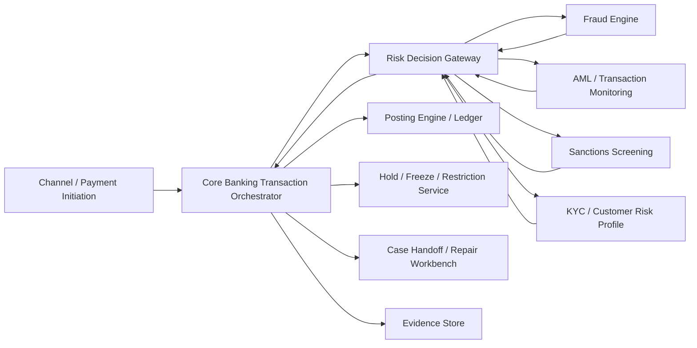
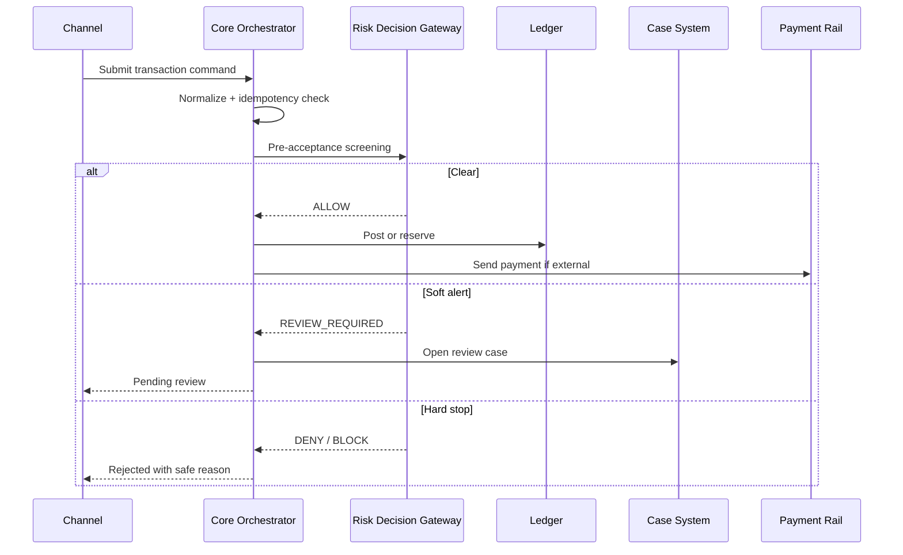
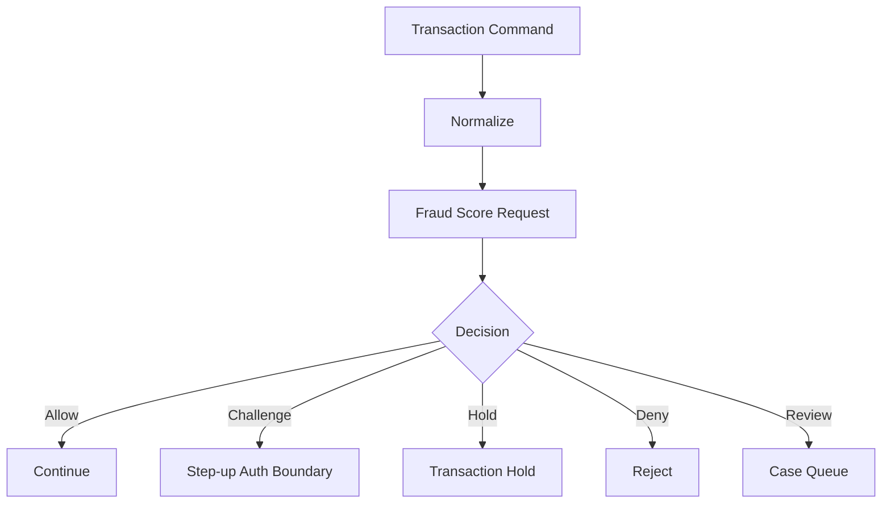
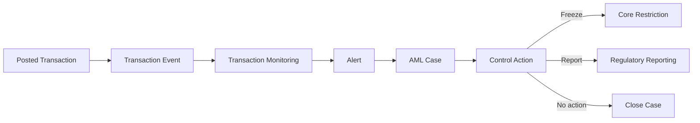
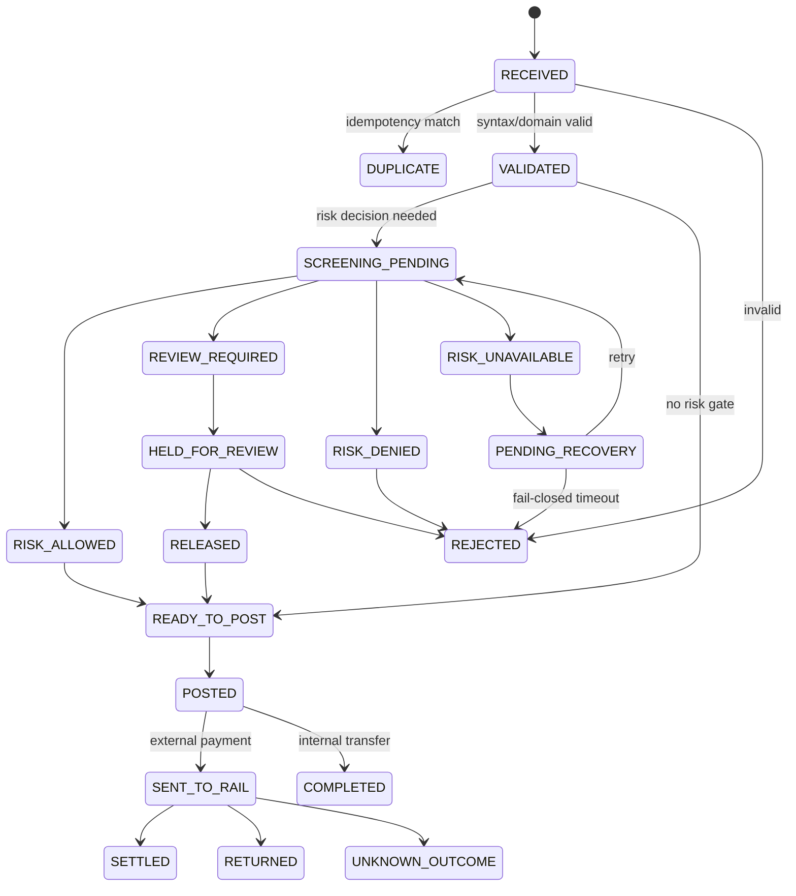
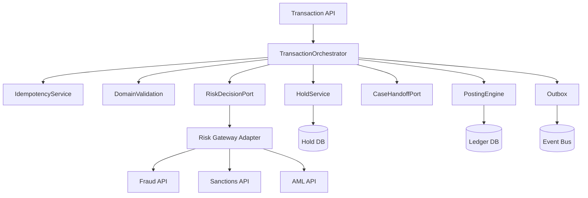

------
title: Learn Java Core Banking System - Part 029
description: Fraud, AML, sanctions, transaction monitoring, screening boundaries, decision points, holds, release/reject flows, case handoff, and evidence design for Java core banking systems.
series: learn-java-core-banking-system
seriesTitle: Learn Java Core Banking System
order: 29
partTitle: Fraud, AML, Sanctions, and Core Banking Decision Points
tags:
- java
- core-banking
- fraud
- aml
- sanctions
- compliance
- risk
- case-management
date: 2026-06-28
---

# Part 029 — Fraud, AML, Sanctions, and Core Banking Decision Points

Core banking should not become a fraud engine, AML engine, sanctions engine, watchlist engine, or investigation case-management suite. But core banking **must expose the right decision points** where those engines can influence money movement safely.

This part is about that boundary.

A top engineer should be able to answer:

- When should a transaction be screened?
- What does the core do while screening is pending?
- What is the difference between `reject`, `return`, `hold`, `block`, `freeze`, `recall`, `release`, and `repair`?
- Which data must be sent to fraud/AML/sanctions systems?
- Which data should never be copied into logs, events, or downstream projections?
- How do we avoid duplicate posting when an external risk decision times out?
- How do we preserve explainability without hardcoding compliance policy into the ledger?
- How do we hand off to case management without losing accounting causality?

The essential mental model:

> Core banking owns financial truth. Risk/compliance engines influence whether, when, and under what control a financial action may proceed. The ledger should record final accounting truth, while decision engines and case systems record risk reasoning and investigation history.

---

## 1. Kaufman Skill Slice

Using Kaufman's learning style, we deconstruct the skill into high-value subskills.

| Subskill | What to learn | Practice output |
|---|---|---|
| Decision point mapping | Where screening/risk decisions enter the transaction lifecycle | Payment state machine with risk gates |
| Boundary design | What core owns vs what fraud/AML/sanctions owns | Context map and API contract |
| Hold semantics | Difference between account freeze, transaction hold, lien, and available-balance reduction | Hold model and release/reject flow |
| Evidence design | What to store to explain a decision without leaking sensitive data | Decision snapshot schema |
| Timeout handling | What to do when the risk engine is unavailable or slow | Unknown-outcome recovery design |
| Case handoff | How exceptions become investigation cases | Case correlation and SLA model |
| Control governance | How manual overrides and releases are approved | Maker-checker release workflow |

The objective is not to become a financial-crime specialist. The objective is to build a core banking platform that can integrate with financial-crime controls without breaking ledger correctness, privacy, operability, or auditability.

---

## 2. Boundary First: Core Banking Is Not the Financial Crime Brain

A common anti-pattern is to embed fraud, AML, sanctions, and compliance policy directly inside the posting engine.

That creates four problems:

1. **Policy volatility leaks into ledger stability.**
   Fraud and sanctions rules change frequently. Ledger invariants should not.
2. **Investigation data contaminates core financial data.**
   Case narratives, investigator notes, adverse media links, and suspicious activity reasoning have different retention and access rules.
3. **False positives become accounting bugs.**
   A screening false positive should create a controlled hold or exception, not corrupt a transaction.
4. **Engineering ownership becomes unclear.**
   Compliance teams own policies; core engineering owns safe execution and evidence.

A better boundary:



Core banking should normally interact with a **Risk Decision Gateway**, not each risk engine directly. The gateway hides policy-engine diversity and returns a normalized decision.

---

## 3. Vocabulary: Similar Words, Different Operational Meaning

Do not use compliance terms loosely. Loose words create bad state machines.

| Term | Meaning in core banking | Accounting effect | Typical owner |
|---|---|---|---|
| Screen | Evaluate party/payment/transaction against rules/watchlists | None yet | Risk/compliance engine |
| Hold | Temporarily reserve or stop a specific transaction/account amount | May reduce available balance, not ledger balance | Core + risk |
| Lien | Legal/operational claim on balance | Reduces available balance | Core operations/legal |
| Freeze | Restrict account activity | Usually no direct ledger movement | Operations/compliance |
| Reject | Stop before acceptance/posting | No ledger movement | Core/risk/channel |
| Return | Reverse/return after accepted by a payment rail | Requires accounting event | Payment operations |
| Recall | Request return/cancellation after sending | Usually pending external action | Payment operations |
| Release | Allow a held transaction/account to proceed | May trigger posting | Authorized operator/system |
| Block | Prevent a party/account/channel/action | No direct ledger movement | Compliance/security |
| Escalate | Move to manual review/case | No ledger movement | Operations/case management |
| Override | Proceed despite warning/soft block | Requires authority evidence | Authorized user |

The key distinction:

> A risk decision is not automatically an accounting event. Accounting happens only when value is actually recognized, reversed, returned, charged, or released into posting.

---

## 4. Decision Point Taxonomy

Fraud/AML/sanctions controls can appear at several points.



### 4.1 Pre-customer onboarding decision

Before opening accounts or products:

- KYC completion
- customer risk rating
- sanctions/name screening
- politically exposed person indicator
- residency/jurisdiction eligibility
- document verification status
- beneficial owner and related-party checks

Core banking should not store the whole KYC file. It should store the **minimum eligibility signal** needed to decide whether an agreement/account can be opened.

Example:

```java
public record CustomerEligibilitySnapshot(
    PartyId partyId,
    EligibilityStatus status,
    RiskBand riskBand,
    Instant assessedAt,
    String assessmentReference,
    Instant expiresAt
) {}
```

Do not store large compliance narratives in the account aggregate. Store references and stable status snapshots.

### 4.2 Account opening decision

At account opening:

- Is the party allowed to hold this product?
- Is the country/jurisdiction permitted?
- Are required KYC checks complete?
- Is there a compliance block?
- Are product-specific risk restrictions met?

The account-opening command should fail before account creation if eligibility is hard-denied. If manual review is needed, create an application/case state, not an active account with unclear restrictions.

### 4.3 Transaction initiation decision

Before a transaction is accepted:

- sanctions party screening
- fraud scoring
- velocity checks
- device/channel risk
- beneficiary risk
- payment route risk
- amount threshold
- unusual behavior signal

At this point core can return:

- accepted
- rejected
- pending review
- pending screening
- duplicate of prior request

### 4.4 Pre-posting decision

Before debit/credit posting:

- sufficient funds
- account state
- restrictions/freeze
- transaction type allowed
- limit check
- fraud/sanctions decision if required

Pre-posting decisions must be deterministic based on committed facts and stable decision snapshots. Do not call an unstable external engine while holding ledger locks longer than necessary.

### 4.5 Post-posting monitoring

Some monitoring is retrospective:

- transaction monitoring patterns
- structuring/smurfing analysis
- mule account detection
- suspicious relationship graph
- cross-account behavior

These should usually produce alerts/cases, not mutate ledger history.

### 4.6 Pre-settlement and post-settlement decision

For external payment:

- pre-send screening
- acknowledgement handling
- settlement confirmation
- post-settlement return/recall
- name/address transparency validation

External payment has more states than internal transfer because another institution or payment rail can reject, return, settle, or delay the instruction.

---

## 5. Risk Decision Contract

A core banking system needs a normalized risk decision contract.

Example command:

```java
public record RiskDecisionRequest(
    String requestId,
    String idempotencyKey,
    DecisionPoint decisionPoint,
    Instant requestedAt,
    BusinessDate businessDate,
    PartyContext originator,
    PartyContext beneficiary,
    AccountContext debitAccount,
    AccountContext creditAccount,
    Money amount,
    TransactionContext transaction,
    ChannelContext channel,
    Map<String, String> references
) {}
```

Example response:

```java
public record RiskDecisionResponse(
    String decisionId,
    String requestId,
    DecisionOutcome outcome,
    DecisionSeverity severity,
    String decisionCode,
    String safeReasonCode,
    boolean manualReviewRequired,
    boolean accountRestrictionRequired,
    Optional<HoldInstruction> holdInstruction,
    Optional<CaseInstruction> caseInstruction,
    Instant decidedAt,
    Instant expiresAt,
    String policyVersion,
    String engineReference
) {}
```

Where:

```java
public enum DecisionOutcome {
    ALLOW,
    ALLOW_WITH_WARNING,
    REVIEW_REQUIRED,
    HOLD,
    DENY,
    BLOCK_ACCOUNT,
    UNAVAILABLE,
    INCONCLUSIVE
}
```

Important design rules:

1. `safeReasonCode` is user-safe and channel-safe.
2. `decisionCode` may be internal but should not reveal sensitive watchlist logic to customers.
3. `policyVersion` must be stored for reproducibility.
4. `decisionId` must be stable and auditable.
5. `expiresAt` prevents stale decisions from being reused indefinitely.
6. `HoldInstruction` must be translated into core-owned hold state, not blindly executed as an external side effect.

---

## 6. Sanctions Screening Boundary

Sanctions screening is not just “name contains similar string”. It is a controlled decision process that often involves:

- watchlist data versions
- fuzzy matching
- aliases
- transliteration
- country/jurisdiction context
- date of birth or registration number
- ownership/control relationships
- payment message party fields
- false positive handling
- alert disposition

Core banking should care about:

- when screening is required
- which fields are sent
- what decision returned
- what status to apply
- how to hold/release/reject
- what evidence reference to store

Core banking should not own:

- watchlist ingestion
- fuzzy matching algorithm tuning
- investigator disposition model
- adverse media analysis
- sanctions policy interpretation

### 6.1 Screening decision outcomes

| Outcome | Core banking behavior |
|---|---|
| No match | Continue normal flow |
| Possible match | Place transaction/account into review/hold state |
| Confirmed match | Deny/block/freeze depending on policy and legal instruction |
| Engine unavailable | Use configured fail-open/fail-closed/pending policy by transaction type |
| Data insufficient | Route to repair/enrichment queue |

### 6.2 Do not reveal sensitive reason externally

Bad response:

```json
{
  "status": "REJECTED",
  "reason": "Beneficiary matched OFAC SDN fuzzy score 93 against list version 2026-06-28"
}
```

Better response:

```json
{
  "status": "PENDING_REVIEW",
  "reasonCode": "COMPLIANCE_REVIEW_REQUIRED",
  "message": "The transaction is under review."
}
```

Internal evidence can retain the decision reference and authorized viewer permissions.

---

## 7. Fraud Boundary

Fraud detection is usually more behavioral and real-time than sanctions screening.

Examples:

- unusual login/device/channel risk
- velocity anomalies
- beneficiary change followed by high-value transfer
- mule-account signals
- impossible geography
- high-risk merchant/category
- new device + new beneficiary + high amount
- repeated failed attempts before success

Core banking must avoid becoming a real-time behavioral analytics platform. Instead, it should expose event and decision points:



### 7.1 Challenge is often outside core

Step-up authentication should usually be handled by identity/channel systems:

- OTP
- passkey
- device confirmation
- call-back
- secure push approval

Core only needs a verified assertion:

```java
public record StepUpAssertion(
    String assertionId,
    PartyId partyId,
    String transactionReference,
    StepUpMethod method,
    Instant completedAt,
    Instant expiresAt,
    String assuranceLevel
) {}
```

Do not let every channel invent its own “fraud approved” flag. Normalize it.

---

## 8. AML and Transaction Monitoring Boundary

AML transaction monitoring is often retrospective, pattern-based, and case-oriented.

It may use:

- customer risk rating
- transaction pattern
- counterparty network
- cash intensity
- cross-border activity
- structuring indicators
- velocity patterns
- occupation/business profile mismatch
- suspicious relationship graph

Core banking should emit high-quality transaction events and expose queryable evidence, but it should not be the AML investigator workspace.

### 8.1 Real-time AML vs post-event monitoring

| Type | Example | Core behavior |
|---|---|---|
| Real-time hard check | Sanctioned beneficiary | Hold/reject before posting/sending |
| Real-time threshold check | High-value transfer requiring review | Pending review / maker-checker |
| Post-event monitoring | Unusual transaction pattern | Emit event, case may be opened later |
| Periodic review | Customer risk refresh | Restriction/eligibility update if required |

### 8.2 AML case is not ledger state

A transaction can be legally posted and still later become part of an AML case. Do not mutate the original transaction into “bad transaction”. Instead:

- link case to transaction references
- preserve original posting facts
- record case outcome separately
- create additional control actions if required



---

## 9. Holds, Freezes, Liens, and Restrictions

This is where many systems fail.

A hold is not a ledger debit. A freeze is not a balance. A lien is not a payment. A restriction is not an accounting event.

### 9.1 Hold model

```java
public record AccountHold(
    HoldId holdId,
    AccountId accountId,
    Money amount,
    HoldType type,
    HoldStatus status,
    String sourceSystem,
    String sourceReference,
    String reasonCode,
    Instant placedAt,
    Instant expiresAt,
    Optional<String> caseReference
) {}
```

Typical status:

```java
public enum HoldStatus {
    ACTIVE,
    RELEASED,
    CONSUMED,
    EXPIRED,
    CANCELLED
}
```

### 9.2 Restriction model

```java
public record AccountRestriction(
    RestrictionId restrictionId,
    AccountId accountId,
    RestrictionType type,
    RestrictionScope scope,
    RestrictionStatus status,
    String reasonCode,
    String authorityReference,
    Instant effectiveFrom,
    Optional<Instant> effectiveTo
) {}
```

Examples:

| Restriction | Meaning |
|---|---|
| Debit blocked | No outgoing debit from account |
| Credit blocked | No incoming credit |
| Full freeze | No debit or credit except authorized exceptions |
| Channel restriction | No mobile/partner channel transaction |
| Product restriction | No specific transaction type |
| Manual review required | Transaction enters review queue |

### 9.3 Available balance formula

For deposit account:

```txt
availableBalance = ledgerBalance
                 + approvedOverdraftLimit
                 - activeHolds
                 - activeLiens
                 - pendingDebitReservations
                 - minimumBalanceRequirement
```

Never implement available balance as a random mutable number that every service updates directly.

---

## 10. Transaction State Machine with Risk Gates

A robust state machine separates acceptance, screening, holding, posting, sending, and settlement.



Notice that `HELD_FOR_REVIEW` comes before posting for flows that must not debit the account yet. But for some card authorization flows, a hold may be placed before final clearing. The state machine depends on transaction type.

---

## 11. Fail-Open vs Fail-Closed vs Pending

When risk engine is unavailable, the worst answer is: “just retry”.

You need policy by transaction type, risk level, amount, customer segment, and channel.

| Strategy | Meaning | Use carefully for |
|---|---|---|
| Fail-closed | Reject/stop if risk decision unavailable | High-risk, sanctions-critical, regulated stop points |
| Fail-open | Continue if decision unavailable | Low-risk, low-value, non-critical flows where availability dominates |
| Fail-pending | Hold/pending until decision available | High-value or ambiguous cases |
| Degraded local rules | Use cached policy/simplified rules | Offline branch/ATM-like constraints |

Core should not hardcode this as `if timeout then approve`. Model it.

```java
public record RiskFallbackPolicy(
    DecisionPoint decisionPoint,
    TransactionType transactionType,
    MoneyThreshold threshold,
    RiskBand customerRiskBand,
    FallbackMode fallbackMode,
    Duration maxPendingDuration,
    String policyVersion
) {}
```

---

## 12. Idempotency and Unknown Outcome

Risk decisions introduce duplicate and timeout hazards.

Scenario:

1. Channel submits payment.
2. Core sends risk request.
3. Risk engine approves.
4. Network timeout occurs before core receives response.
5. Channel retries.
6. Core sends another risk request.
7. Risk engine opens duplicate alerts.
8. Core may place duplicate holds.

Avoid this with:

- stable transaction idempotency key
- stable risk request idempotency key
- decision reference persistence
- timeout recovery job
- duplicate decision handling
- hold uniqueness constraints

Example table uniqueness:

```sql
CREATE UNIQUE INDEX ux_risk_decision_request
ON risk_decision_snapshot(idempotency_key, decision_point);

CREATE UNIQUE INDEX ux_hold_source
ON account_hold(source_system, source_reference, account_id, hold_type)
WHERE status = 'ACTIVE';
```

The core should store an intermediate state before calling risk service:

```java
@Transactional
public ScreeningWork startScreening(TransactionCommand command) {
    Transaction tx = transactionRepository.createOrLoad(command.idempotencyKey());

    if (tx.hasRiskDecision()) {
        return ScreeningWork.alreadyDecided(tx.riskDecisionId());
    }

    RiskDecisionRequest request = riskRequestFactory.create(tx);
    riskRequestRepository.savePending(request);

    return ScreeningWork.toDispatch(request);
}
```

Then dispatch out of transaction using outbox/worker.

---

## 13. Decision Snapshot as Evidence

Do not store only `approved=true`.

A defensible snapshot stores:

- decision id
- decision point
- outcome
- policy version
- engine version or reference
- watchlist/ruleset data version where appropriate
- safe reason code
- decision timestamp
- expiration
- input hash
- case reference if created
- actor/system making manual override
- authority reference

Example:

```java
public record RiskDecisionSnapshot(
    String decisionId,
    String transactionId,
    DecisionPoint decisionPoint,
    DecisionOutcome outcome,
    String safeReasonCode,
    String policyVersion,
    String engineReference,
    String inputPayloadHash,
    Instant decidedAt,
    Instant expiresAt,
    Optional<String> caseReference,
    Optional<String> manualAuthorityReference
) {}
```

This supports audit without copying unnecessary sensitive input payloads into every table.

---

## 14. Case Handoff

A risk decision may create an alert or case.

Case system needs:

- case id
- case type
- related party/account/transaction references
- severity
- SLA
- current owner/team
- evidence references
- decision requested
- allowed actions
- resolution reason
- closure authority

Core needs to know only enough to drive transaction state:

```java
public record CaseInstruction(
    String caseType,
    String severity,
    String queue,
    Duration sla,
    Set<AllowedCoreAction> allowedCoreActions
) {}
```

Allowed actions:

```java
public enum AllowedCoreAction {
    RELEASE_TRANSACTION,
    REJECT_TRANSACTION,
    PLACE_ACCOUNT_RESTRICTION,
    REMOVE_ACCOUNT_RESTRICTION,
    REQUEST_CUSTOMER_INFORMATION,
    ESCALATE_TO_COMPLIANCE,
    NO_CORE_ACTION
}
```

### 14.1 Case outcome should be translated

Case outcome should not directly mutate core state. It should produce a controlled command:

```txt
Compliance case closed as false positive
        ↓
ReleaseTransactionHoldCommand
        ↓
Maker-checker approval if required
        ↓
Core releases hold
        ↓
Transaction resumes or customer notified
```

---

## 15. Manual Review and Override

Manual review is dangerous because it mixes human judgement, operational pressure, and financial impact.

Minimum controls:

- maker-checker for release/reject on high-impact items
- segregation of duties
- authority matrix
- reason code
- case reference
- before/after snapshot
- immutable audit event
- deadline/SLA
- escalation
- privileged action monitoring

Example command:

```java
public record ReleaseHeldTransactionCommand(
    TransactionId transactionId,
    HoldId holdId,
    String caseReference,
    String reasonCode,
    UserId maker,
    Optional<UserId> checker,
    String authorityReference,
    Instant requestedAt
) {}
```

A release is not just status update. It may resume posting. Therefore it must go through the same idempotent posting path as any original transaction.

---

## 16. Sanctions/Fraud/AML Events

A core banking event stream should distinguish:

```txt
TransactionReceived
TransactionScreeningRequested
TransactionScreeningCompleted
TransactionHeldForReview
TransactionReleasedFromReview
TransactionRejectedByRiskDecision
TransactionPosted
TransactionSentToRail
TransactionReturned
AccountRestrictionPlaced
AccountRestrictionRemoved
ComplianceCaseLinked
```

Do not publish sensitive watchlist details to broad downstream topics.

Use event classification:

| Event class | Example | Audience |
|---|---|---|
| Business event | `TransactionHeldForReview` | Operations, channel, customer notification with safe reason |
| Restricted evidence event | `SanctionsPotentialMatchRecorded` | Compliance-only |
| Ledger event | `JournalPosted` | Finance, reporting, reconciliation |
| Control event | `ManualOverrideApproved` | Audit/security/compliance |

---

## 17. Privacy and Minimum Necessary Data

Risk engines may require sensitive fields. But not every downstream system needs them.

Rules:

1. Send only fields needed for decision.
2. Mask or tokenize identifiers where possible.
3. Store raw screening payloads in restricted evidence stores, not ordinary transaction tables.
4. Use safe reason codes for channel responses.
5. Avoid logging names, full addresses, document ids, card data, or watchlist match details.
6. Define retention by data class.
7. Keep audit metadata even when sensitive payload retention expires.

Bad log:

```txt
Risk match: John Example, DOB 1970-01-01, passport P1234567 matched SDN alias X with score 96
```

Better log:

```txt
risk_decision transactionId=TX123 decisionId=RD456 outcome=REVIEW_REQUIRED reasonCode=COMPLIANCE_REVIEW_REQUIRED policyVersion=SAN-2026-06
```

---

## 18. Java Architecture Sketch



Ports:

```java
public interface RiskDecisionPort {
    RiskDecisionResponse decide(RiskDecisionRequest request);
}

public interface CaseHandoffPort {
    CaseReference openCase(CaseOpenRequest request);
}

public interface HoldService {
    AccountHold placeHold(PlaceHoldCommand command);
    AccountHold releaseHold(ReleaseHoldCommand command);
}
```

Application flow:

```java
public TransactionResult process(TransactionCommand command) {
    Transaction tx = idempotency.loadOrCreate(command);

    validation.validate(tx);

    if (riskPolicy.requiresDecision(tx)) {
        RiskDecisionResponse decision = riskDecisionPort.decide(riskRequestFactory.from(tx));
        riskDecisionRecorder.record(tx.id(), decision);

        return switch (decision.outcome()) {
            case ALLOW, ALLOW_WITH_WARNING -> post(tx, decision);
            case HOLD, REVIEW_REQUIRED -> holdAndOpenCase(tx, decision);
            case DENY, BLOCK_ACCOUNT -> reject(tx, decision);
            case UNAVAILABLE, INCONCLUSIVE -> applyFallback(tx, decision);
        };
    }

    return post(tx, null);
}
```

Do not call this method while holding account balance locks if the risk engine can be slow. Split orchestration and posting.

---

## 19. Data Model Sketch

```sql
CREATE TABLE risk_decision_snapshot (
    decision_id             VARCHAR(64) PRIMARY KEY,
    transaction_id          VARCHAR(64) NOT NULL,
    decision_point          VARCHAR(64) NOT NULL,
    outcome                 VARCHAR(64) NOT NULL,
    safe_reason_code        VARCHAR(64) NOT NULL,
    policy_version          VARCHAR(128) NOT NULL,
    engine_reference        VARCHAR(128),
    input_payload_hash      VARCHAR(128) NOT NULL,
    case_reference          VARCHAR(128),
    manual_authority_ref    VARCHAR(128),
    decided_at              TIMESTAMP NOT NULL,
    expires_at              TIMESTAMP,
    created_at              TIMESTAMP NOT NULL,
    UNIQUE(transaction_id, decision_point)
);

CREATE TABLE account_restriction (
    restriction_id          VARCHAR(64) PRIMARY KEY,
    account_id              VARCHAR(64) NOT NULL,
    type                    VARCHAR(64) NOT NULL,
    scope                   VARCHAR(64) NOT NULL,
    status                  VARCHAR(32) NOT NULL,
    reason_code             VARCHAR(64) NOT NULL,
    authority_reference     VARCHAR(128) NOT NULL,
    effective_from          TIMESTAMP NOT NULL,
    effective_to            TIMESTAMP,
    created_at              TIMESTAMP NOT NULL
);

CREATE TABLE account_hold (
    hold_id                 VARCHAR(64) PRIMARY KEY,
    account_id              VARCHAR(64) NOT NULL,
    amount_minor            BIGINT NOT NULL,
    currency                CHAR(3) NOT NULL,
    type                    VARCHAR(64) NOT NULL,
    status                  VARCHAR(32) NOT NULL,
    source_system           VARCHAR(64) NOT NULL,
    source_reference        VARCHAR(128) NOT NULL,
    reason_code             VARCHAR(64) NOT NULL,
    case_reference          VARCHAR(128),
    placed_at               TIMESTAMP NOT NULL,
    expires_at              TIMESTAMP,
    UNIQUE(account_id, type, source_system, source_reference)
);
```

---

## 20. Common Anti-Patterns

| Anti-pattern | Why it fails | Better design |
|---|---|---|
| Hardcoding sanctions rules inside posting engine | Policy changes destabilize ledger | Risk decision gateway + decision snapshot |
| `approved=true` flag only | Not auditable | Store decision id, policy version, input hash, timestamps |
| Calling risk engine inside DB lock | Latency and lock contention | Pre-screen or asynchronous state machine |
| Exposing match details to customer | Compliance/security leakage | Safe reason code |
| Treating hold as debit | Ledger corruption | Separate hold/reservation from journal posting |
| Mutating old transaction after AML alert | Historical truth loss | Link case and create new control actions |
| Duplicate holds on retry | Available balance distortion | Idempotency + unique source reference |
| No fallback policy | Inconsistent behavior during outage | Explicit fail-open/fail-closed/pending policy |
| Compliance case directly updates account table | No control boundary | Case outcome emits authorized core command |
| Logging sensitive match data | Privacy and security risk | Restricted evidence store + safe logs |

---

## 21. Review Checklist

Use this checklist when reviewing fraud/AML/sanctions integration.

### Boundary

- [ ] Is core banking free from watchlist ingestion and matching logic?
- [ ] Is there a normalized risk decision gateway?
- [ ] Are fraud, AML, and sanctions decision points explicit?
- [ ] Are safe reason codes separated from internal decision codes?

### Correctness

- [ ] Are risk decisions idempotent?
- [ ] Can duplicate channel retry create duplicate holds?
- [ ] Can timeout lead to duplicate posting?
- [ ] Are holds separate from ledger postings?
- [ ] Are releases routed through the same safe posting path?

### Controls

- [ ] Are manual releases maker-checker controlled?
- [ ] Are account restrictions effective-dated?
- [ ] Are authority references captured?
- [ ] Is emergency override monitored?

### Evidence

- [ ] Is policy version stored?
- [ ] Is input hash stored?
- [ ] Is case reference linked?
- [ ] Are sensitive match details restricted?
- [ ] Can a transaction be explained months later?

### Operations

- [ ] Is there a pending-review queue?
- [ ] Are SLA and aging tracked?
- [ ] Are failed risk calls recoverable?
- [ ] Is there unknown-outcome reconciliation?
- [ ] Can operators repair insufficient payment data?

---

## 22. Practice Drill

Design the flow for this scenario:

> A customer sends a high-value cross-border payment to a new beneficiary. The sanctions engine returns possible match. Fraud score is medium. The payment rail cutoff is in 20 minutes. The customer retries twice from mobile.

Your design should show:

1. idempotency key
2. initial transaction state
3. sanctions decision snapshot
4. fraud decision snapshot
5. hold/review behavior
6. customer-safe response
7. case creation
8. release/reject flow
9. cutoff handling
10. events emitted
11. ledger effect before and after release

Expected mental model:

- No ledger posting until transaction is allowed, unless your product/rail semantics require a reservation.
- Retry should return same pending-review state.
- Possible match should not expose watchlist details.
- Release must be controlled and auditable.
- If cutoff passes, release may require rescheduling/repricing/new value date depending on payment rules.

---

## 23. Key Takeaways

1. Core banking owns financial truth; risk engines own risk decisioning.
2. Sanctions/fraud/AML outcomes must be translated into explicit core states.
3. Holds, freezes, liens, restrictions, and postings are different concepts.
4. A risk decision must be idempotent, versioned, explainable, and privacy-aware.
5. Manual release/reject is a controlled operation, not a simple status update.
6. Case systems should influence core through authorized commands, not direct table writes.
7. The safest design keeps ledger truth stable while making risk/compliance decisions visible and auditable.

---

## References

- FATF, *The FATF Recommendations*: https://www.fatf-gafi.org/en/publications/Fatfrecommendations/Fatf-recommendations.html
- FATF, *FATF Recommendations topic page*: https://www.fatf-gafi.org/en/topics/fatf-recommendations.html
- OFAC, *Sanctions List Search Tool*: https://ofac.treasury.gov/sanctions-list-search-tool
- OFAC, *Sanctions List Service*: https://ofac.treasury.gov/sanctions-list-service
- Wolfsberg Group, *Payment Transparency Standards*: https://wolfsberg-group.org/news/publication-of-the-updated-wolfsberg-group-payment-transparency-standards
- Wolfsberg Group, *Payment Transparency Roles and Responsibilities*: https://wolfsberg-group.org/news/wolfsberg-guidance-on-payment-transparency-roles-and-responsibilities
- FFIEC, *Architecture, Infrastructure, and Operations booklet announcement*: https://www.ffiec.gov/news/press-releases/2021/pr-06-30
