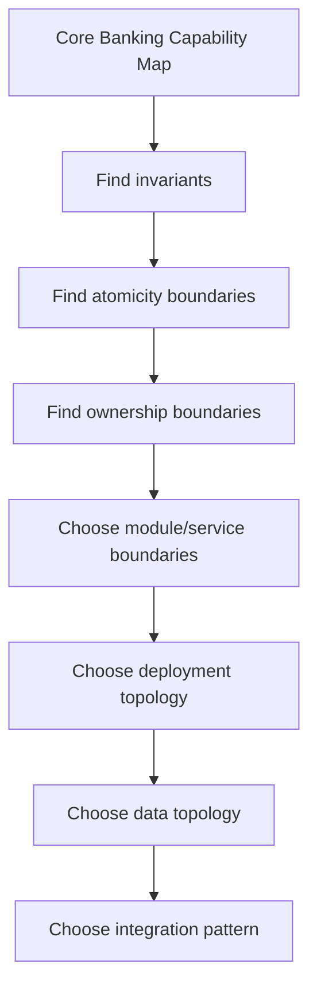
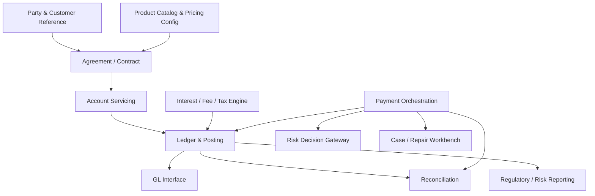
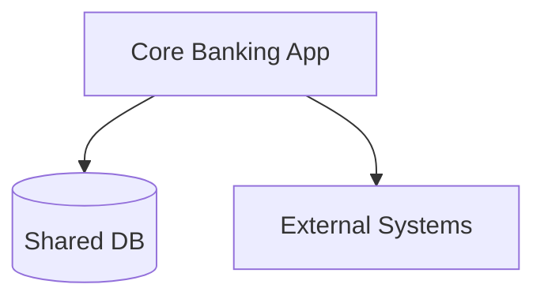
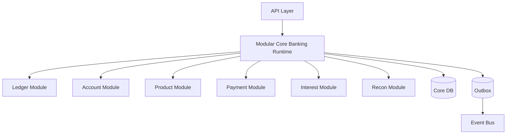
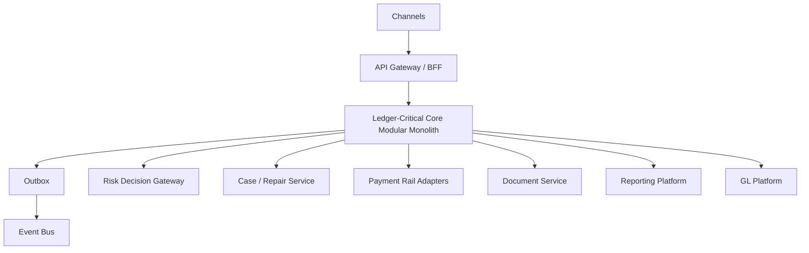
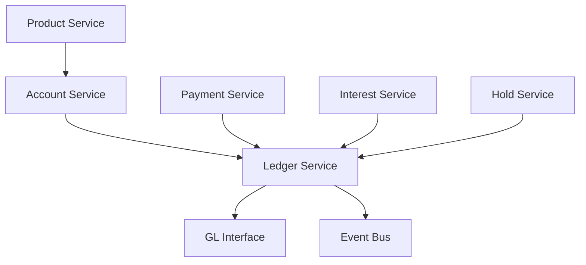
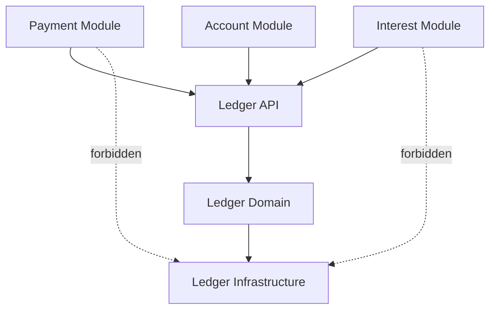
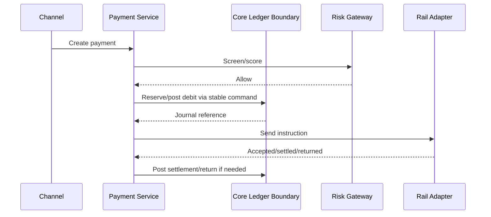
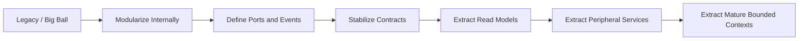
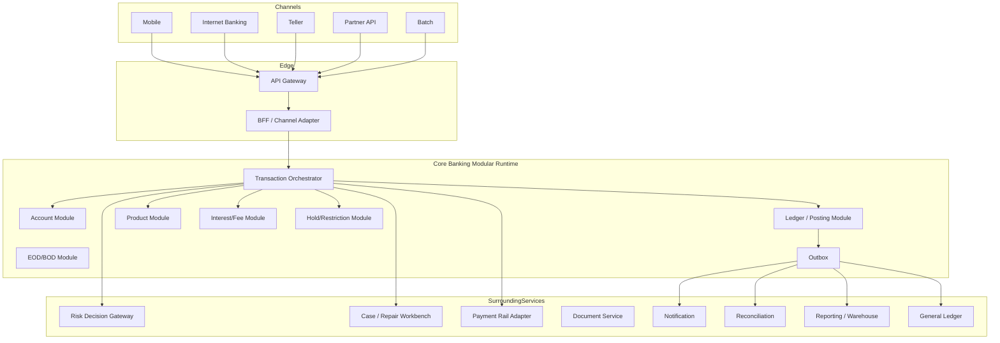

------
title: Learn Java Core Banking System - Part 030
description: Architectural decision framework for modular monolith versus microservices in Java core banking systems, with bounded contexts, ledger consistency, deployment topology, and evolutionary strategy.
series: learn-java-core-banking-system
seriesTitle: Learn Java Core Banking System
order: 30
partTitle: Modular Monolith vs Microservices for Core Banking
tags:
- java
- core-banking
- architecture
- modular-monolith
- microservices
- bounded-context
- ledger
- system-design
date: 2026-06-28
---

# Part 030 — Modular Monolith vs Microservices for Core Banking

In ordinary backend systems, microservices can be an organizational scaling strategy. In core banking, careless microservices can become a **distributed accounting bug generator**.

The architecture question is not:

> Should we use monolith or microservices?

The real question is:

> Which consistency boundaries must never be split, which capabilities can evolve independently, and which deployment topology reduces operational risk while preserving auditability, ledger correctness, and change velocity?

A top engineer does not choose architecture from fashion. A top engineer chooses architecture from invariants.

---

## 1. The Core Banking Architecture Tension

Core banking has conflicting forces:

| Force | What it pushes toward |
|---|---|
| Ledger correctness | Strong consistency, atomic commits, clear ownership |
| Product agility | Configurability, modular rules, independent release cadence |
| Payment integration | Async boundaries, retries, repair queues, external statuses |
| Regulatory audit | Traceability, evidence, reproducibility, controlled change |
| Operational scale | Isolation, capacity planning, observability, fault containment |
| Organizational scale | Team autonomy, clear service ownership |
| Migration reality | Coexistence, anti-corruption layers, strangler patterns |

The architecture must handle all of them without pretending that every boundary can be eventually consistent.

---

## 2. Mental Model: Consistency Boundary First

Do not start with services. Start with **consistency boundaries**.



Examples of strong consistency boundaries:

- a journal entry must balance
- account balance mutation must correspond to committed postings
- a reversal must reference the original transaction
- a hold must not be consumed twice
- an EOD step must not be partially marked complete
- a GL extract must match ledger control totals

If a boundary owns these invariants, splitting it across network calls increases risk.

---

## 3. Definitions

### 3.1 Big ball of mud

A big ball of mud is a deployment unit without meaningful internal boundaries.

Symptoms:

- every package imports every package
- product rules call repositories directly
- posting engine depends on channel DTOs
- audit fields are optional
- transaction status is mutated from everywhere
- no owner for business invariants
- database tables are shared casually

This is not a modular monolith. It is an accidental monolith.

### 3.2 Modular monolith

A modular monolith is one deployable system with strict internal module boundaries.

It can have:

- one build artifact
- one database or database cluster
- package/module boundaries
- internal APIs
- explicit dependency rules
- transaction boundaries inside one process
- one release train, or selective feature flags

The key is **modularity**, not deployment count.

### 3.3 Microservices

Microservices are independently deployable services that own their APIs, data, runtime, and operational lifecycle.

They should have:

- independent deployment
- clear bounded context
- owned data store
- API/event contract
- independent scaling
- fault isolation
- observable behavior
- operational ownership

A service without data ownership and operational ownership is often just a distributed module with more failure modes.

### 3.4 Distributed monolith

A distributed monolith has many services but behaves like one tightly coupled system.

Symptoms:

- every release requires coordinated deployment
- services share database tables
- synchronous call chains are deep
- failure cascades across services
- every service needs every other service to be available
- no service can be tested independently
- “microservices” communicate through table updates

This is worse than a monolith because it has monolith coupling plus distributed-system failure.

---

## 4. Core Banking Bounded Context Map

A sensible high-level map:



Not all bounded contexts need to become microservices on day one.

---

## 5. What Should Usually Stay Together?

For many banks and fintechs, the safest starting point is a **modular monolith around the ledger-critical core**, with externalized but controlled integration boundaries.

Candidates to keep inside one deployable consistency boundary:

| Capability | Why keep close? |
|---|---|
| Posting engine | Needs atomic journal and balance mutation |
| Ledger account model | Strongly tied to posting invariants |
| Balance snapshot/projection writer | Must match committed journal |
| Reversal/correction engine | Needs original transaction/journal references |
| Account holds consumed by posting | Must not double-consume |
| EOD control state for ledger runs | Needs restartable consistency |

This does not mean one giant package. It means strict modules inside one runtime.

Example Java package boundary:

```txt
com.bank.core
  ├── ledger
  │   ├── api
  │   ├── application
  │   ├── domain
  │   └── infrastructure
  ├── account
  │   ├── api
  │   ├── application
  │   ├── domain
  │   └── infrastructure
  ├── posting
  │   ├── api
  │   ├── application
  │   ├── domain
  │   └── infrastructure
  ├── product
  ├── interest
  ├── payment
  ├── reconciliation
  └── sharedkernel
```

Better yet, use Java module boundaries or build-level boundaries where appropriate.

---

## 6. What Can Often Be Separate Earlier?

Some capabilities can be services earlier because they do not own ledger atomicity.

| Capability | Good service candidate? | Reason |
|---|---:|---|
| Customer identity/KYC reference | Yes | Different data lifecycle and privacy boundary |
| Notification | Yes | Eventually consistent, not ledger truth |
| Document management | Yes | Different storage/retention model |
| Fraud scoring | Yes | External policy/ML lifecycle |
| Sanctions screening | Yes | Specialized watchlist/rule lifecycle |
| AML case management | Yes | Investigation workflow, not ledger mutation |
| Regulatory reporting warehouse | Yes | Read-side lineage/reporting workload |
| Channel BFF | Yes | Channel-specific adaptation |
| Payment rail adapter | Often | External protocol complexity and availability boundary |

The core should integrate through ports, events, and controlled commands.

---

## 7. The Ledger-Critical Boundary

The ledger-critical boundary is where these must be atomic:

```txt
validate posting instruction
  -> create journal entry
  -> create posting lines
  -> mutate balance snapshots or derive them safely
  -> mark transaction/posting status
  -> record audit event/outbox event
```

A simplified transaction boundary:

```java
@Transactional
public PostingResult post(PostingCommand command) {
    IdempotencyRecord idem = idempotency.claim(command.idempotencyKey());
    if (idem.isCompleted()) {
        return idem.previousResult();
    }

    PostingBatch batch = validator.validate(command);
    JournalEntry journal = journalFactory.create(batch);
    balanceService.apply(journal);
    journalRepository.save(journal);
    outbox.record(JournalPostedEvent.from(journal));
    idempotency.complete(idem, journal.reference());

    return PostingResult.posted(journal.reference());
}
```

Splitting these steps across services creates hard questions:

- What happens if journal service commits but balance service times out?
- What happens if balance service commits but transaction status update fails?
- What happens if outbox event is published but journal rolls back?
- How do you rerun idempotently?
- Which service owns the truth?

These questions can be solved, but the solution is complex. Do not add that complexity unless there is a strong reason.

---

## 8. Microservices Are Not Forbidden

Microservices can work in core banking when boundaries are mature.

Good reasons to split:

1. **Different consistency model**
   The capability can tolerate eventual consistency.
2. **Different scale profile**
   Payment initiation may scale differently from EOD accrual.
3. **Different data classification**
   KYC documents and ledger postings have different privacy/retention models.
4. **Different ownership**
   A team can own the service end-to-end.
5. **Different release cadence**
   Fraud policy engine changes more frequently than ledger schema.
6. **Different external dependency profile**
   Payment rail adapters may fail independently.
7. **Different runtime requirements**
   Analytics/reporting may need columnar storage, not OLTP.

Bad reasons to split:

- “Microservices are modern.”
- “We want each table to have a service.”
- “Teams want autonomy but share the same database.”
- “We need scalability” without measuring bottlenecks.
- “We want to avoid a monolith” but have no domain model.
- “Kafka will solve consistency.”

---

## 9. Architectural Options

### 9.1 Option A: Big ball of mud



Avoid this except as legacy reality to be modernized.

Pros:

- simple deployment at first
- easy local transaction boundaries
- low initial infrastructure overhead

Cons:

- no modularity
- hard to change safely
- hidden coupling
- weak ownership
- impossible to reason about at scale

### 9.2 Option B: Modular monolith with strict boundaries



Pros:

- strong consistency where needed
- simpler operations
- easier refactoring than distributed services
- clear internal module contracts
- good fit for ledger-critical core

Cons:

- deployment coupling
- requires discipline to preserve boundaries
- team autonomy limited by release process
- scaling is coarser

### 9.3 Option C: Core ledger modular monolith + surrounding services



This is often the best practical architecture.

Pros:

- keeps ledger correctness simple
- separates volatile/external capabilities
- allows surrounding team autonomy
- supports strangler modernization
- avoids distributed ledger transactions

Cons:

- core can still become too large if boundaries are weak
- integration contracts require governance
- event schema/versioning discipline needed

### 9.4 Option D: Full microservices core



This can work only if you are very disciplined about service ownership, data ownership, consistency, and failure handling.

Pros:

- high team autonomy
- independent scaling
- fault isolation if designed well
- independent deployment

Cons:

- distributed consistency complexity
- higher operational burden
- harder local reasoning
- versioning and contract complexity
- test matrix explosion
- high risk of distributed monolith

---

## 10. Decision Matrix

| Question | If yes | If no |
|---|---|---|
| Does the capability mutate ledger truth? | Keep close to ledger boundary | Can be separate service candidate |
| Does it require atomic commit with posting? | Same transaction boundary | Async/event boundary may work |
| Can it tolerate eventual consistency? | Service/event candidate | Keep inside core transaction path |
| Does it have independent data lifecycle? | Service candidate | Module may be enough |
| Does it change frequently by different team? | Service or plugin boundary | Module boundary sufficient |
| Does it need independent scale? | Service candidate | Avoid premature split |
| Is the team operationally ready? | Microservice possible | Prefer modular monolith |
| Is observability mature? | Distributed topology possible | Avoid excessive service split |
| Is contract testing mature? | Service split safer | Keep internal module |

Rule of thumb:

> Start with a modular monolith for ledger-critical capabilities, extract services around stable seams, and split core capabilities only when the consistency and ownership model is proven.

---

## 11. Java Modular Monolith Design

A modular monolith is not one `service` package with 300 classes.

### 11.1 Module rules

Each module should have:

- public API package
- application services
- domain model
- infrastructure adapters
- module-owned repositories
- explicit events
- tests at module boundary
- no direct cross-module repository access

Example:

```txt
ledger
  api
    PostingPort.java
    PostingCommand.java
    PostingResult.java
  application
    PostingApplicationService.java
  domain
    JournalEntry.java
    PostingLine.java
    LedgerAccount.java
    LedgerInvariant.java
  infrastructure
    JpaJournalRepository.java
    LedgerSchema.sql
```

`payment` should call `ledger.api.PostingPort`, not `ledger.infrastructure.JpaJournalRepository`.

### 11.2 Dependency rule



Enforce with:

- package visibility
- build modules
- ArchUnit tests
- code review rules
- dependency scanning
- ADRs for boundary exceptions

Example ArchUnit style:

```java
@AnalyzeClasses(packages = "com.bank.core")
class ArchitectureRulesTest {

    @ArchTest
    static final ArchRule payment_must_not_access_ledger_infrastructure =
        noClasses()
            .that().resideInAPackage("..payment..")
            .should().accessClassesThat()
            .resideInAPackage("..ledger.infrastructure..");
}
```

---

## 12. Data Ownership in Modular Monolith

Even inside one database, avoid casual table ownership.

| Table group | Owner module | Other modules access via |
|---|---|---|
| journal_entry, posting_line | Ledger | Ledger API/read model |
| account, account_state | Account | Account API |
| account_hold | Account/Hold module | Hold API |
| product_version, product_parameter | Product | Product API |
| payment_instruction | Payment | Payment API |
| reconciliation_break | Reconciliation | Recon API |

A modular monolith may use one physical database, but it should still preserve logical ownership.

Bad:

```java
paymentRepository.updateLedgerBalance(accountId, amount);
```

Better:

```java
postingPort.post(PostingCommand.forPayment(paymentId, lines));
```

---

## 13. Transaction Boundary Design

Inside a modular monolith, you can use local ACID transactions. But still be intentional.

### 13.1 Local transaction for ledger-critical commit

```txt
BEGIN
  insert transaction record / idempotency state
  validate accounts and restrictions
  insert journal entry
  insert posting lines
  update balance snapshots
  insert audit event
  insert outbox event
COMMIT
```

### 13.2 Async publication after commit

Use outbox:

```txt
DB transaction commits outbox row
        ↓
Outbox publisher reads committed row
        ↓
Publishes event
        ↓
Marks outbox row published
```

Do not publish to Kafka/RabbitMQ before DB commit.

### 13.3 External calls outside DB lock

Do not do this:

```java
@Transactional
public void processPayment(PaymentCommand cmd) {
    Account account = accountRepository.lock(cmd.debitAccountId());
    RiskDecision decision = riskClient.callExternalRiskEngine(cmd); // bad
    ledger.post(cmd);
}
```

Better:

```txt
1. create transaction command
2. request risk decision asynchronously or before ledger lock
3. persist decision snapshot
4. acquire account lock only for final posting
5. commit ledger mutation quickly
```

---

## 14. Service Extraction Criteria

Before extracting a module into microservice, answer these.

### 14.1 Domain readiness

- Is the bounded context stable?
- Are commands/events explicit?
- Are invariants known?
- Are ownership rules clear?
- Are data dependencies one-way?

### 14.2 Operational readiness

- Does the owning team run it on-call?
- Are SLOs defined?
- Are dashboards and alerts ready?
- Is distributed tracing in place?
- Are runbooks available?
- Is failure injection tested?

### 14.3 Contract readiness

- Are API contracts versioned?
- Are events schema-versioned?
- Are consumers known?
- Are backward compatibility rules explicit?
- Are contract tests automated?

### 14.4 Consistency readiness

- Can the service tolerate eventual consistency?
- Is there a saga/process manager if needed?
- Are compensation rules defined?
- Is idempotency defined at every boundary?
- Are unknown outcomes recoverable?

If you cannot answer these, do not split yet.

---

## 15. Example: Payment as Separate Service, Ledger as Core Module

A common evolution:



This works if:

- payment service owns payment lifecycle
- core owns posting truth
- every call to core is idempotent
- payment service never writes ledger tables
- unknown rail outcome is reconciled
- events are correlated with journal references

---

## 16. Example: Interest Engine Inside vs Outside Core

### Keep inside if:

- interest posting needs direct access to account states
- EOD accrual must be atomic with ledger controls
- product configuration is tightly coupled
- volume is manageable
- team is same as core team

### Split if:

- calculation is heavy and can be precomputed
- posting instruction is the only core mutation
- engine can produce deterministic posting commands
- product/rate configuration ownership is separate
- reconciliation is mature

Split pattern:

```txt
Interest Calculation Service
        ↓ produces
AccrualPostingInstruction
        ↓ submitted to
Core Posting Engine
        ↓ creates
JournalEntry
```

The external service calculates. Core posts.

---

## 17. Example: Product Catalog as Module or Service

Product catalog can be service-like if it owns:

- product versions
- parameter approval
- effective dating
- simulation
- product eligibility rules
- pricing parameter sets

But posting should not fetch product configuration through unstable remote calls during ledger commit.

Use snapshotting:

```java
public record ProductTermsSnapshot(
    String productVersionId,
    Map<String, String> parameters,
    Instant capturedAt,
    String checksum
) {}
```

Account/agreement captures the product version and relevant terms at opening or effective change.

---

## 18. Database Per Service vs Shared Database

Microservice purity says each service owns its database. Core banking reality says consistency matters.

Use this framing:

| Pattern | Good for | Risk |
|---|---|---|
| Shared database with no ownership | Legacy/simple start | Coupling and corruption |
| Shared physical database with schema ownership | Modular monolith | Requires discipline |
| Database per service | True microservices | Distributed consistency complexity |
| Core OLTP + read replicas/projections | Reporting/read models | Projection lag |
| Event-sourced ledger | Audit/replay-heavy systems | Complexity, query design burden |

A modular monolith can use one database but different schemas:

```txt
ledger.journal_entry
ledger.posting_line
account.account
account.hold
product.product_version
payment.payment_instruction
recon.reconciliation_break
```

Enforce access rules in code and database permissions where feasible.

---

## 19. Avoiding the Distributed Monolith

Warning signs:

1. Service A cannot start unless Service B/C/D are up.
2. A single user request synchronously calls 8 services.
3. Services share the same tables.
4. Every change requires multi-team release coordination.
5. Events are used as remote procedure calls.
6. There is no clear owner for customer balance correctness.
7. Retry creates duplicate side effects.
8. Operators cannot answer where a transaction is stuck.
9. Dashboards show HTTP errors but not business state.
10. Local development requires the whole bank to run.

Fixes:

- collapse unstable service splits back into modules
- introduce clear service ownership
- use outbox/inbox and idempotency
- create a transaction journey view
- reduce synchronous call chains
- create stable domain APIs
- separate query projections from command paths

---

## 20. Evolution Path: From Modular Core to Services



Do not jump from A to G unless you enjoy outages.

### Phase 1 — Internal modularity

- package boundaries
- dependency rules
- module APIs
- eliminate direct table access
- isolate posting engine

### Phase 2 — Contract hardening

- canonical commands
- domain events
- idempotency
- versioned schemas
- module integration tests

### Phase 3 — Externalize read-heavy workloads

- ledger projection
- statements
- reporting
- analytics
- regulatory extracts

### Phase 4 — Extract peripheral capabilities

- notifications
- documents
- channel BFF
- risk gateway
- payment rail adapters

### Phase 5 — Extract mature contexts carefully

- product catalog
- payment orchestration
- interest calculation
- reconciliation

Ledger/posting extraction should be last, not first.

---

## 21. Reference Architecture: Pragmatic Java Core Banking



This is not the only architecture. It is a safe default mental model.

---

## 22. Deployment Topology

### 22.1 Core runtime

- horizontally scalable command nodes
- account-level serialization/locking strategy
- transaction idempotency store
- relational OLTP database
- outbox publisher
- batch/EOD worker mode

### 22.2 Surrounding services

- risk decision gateway
- payment adapter workers
- notification consumers
- reporting projection builders
- reconciliation processors

### 22.3 Operational controls

- circuit breakers for external calls
- bulkheads for channel traffic vs batch traffic
- separate worker pools for EOD, payment, outbox
- backpressure and queue depth monitoring
- business metrics: pending review, held amount, posting throughput, failed postings

---

## 23. Architecture Decision Record Template

For every major split, write an ADR.

```md
# ADR: Extract Payment Rail Adapter from Core Runtime

## Status
Accepted

## Context
Payment rail protocol changes frequently and has different availability/failure modes from ledger posting.

## Decision
Extract rail adapter as a separate service. Core remains owner of ledger posting. Payment service submits idempotent posting commands to core.

## Consequences
Positive:
- rail protocol isolated
- independent deployment
- failure containment

Negative:
- more integration contracts
- need unknown-outcome reconciliation
- need idempotent core commands

## Invariants Preserved
- only core posts ledger entries
- all rail callbacks map to payment lifecycle events
- returns/reversals are new accounting events
```

An ADR is not bureaucracy. It is a memory system for future engineers.

---

## 24. Testing Architecture Boundaries

### 24.1 Module boundary tests

Test module APIs, not internals.

```java
@Test
void paymentCannotPostUnbalancedJournal() {
    PostingCommand command = unbalancedPaymentPosting();

    assertThatThrownBy(() -> postingPort.post(command))
        .isInstanceOf(UnbalancedJournalException.class);
}
```

### 24.2 Architecture tests

Use dependency rules.

```java
@ArchTest
static final ArchRule domain_should_not_depend_on_infrastructure =
    noClasses()
        .that().resideInAPackage("..domain..")
        .should().dependOnClassesThat()
        .resideInAPackage("..infrastructure..");
```

### 24.3 Contract tests

If extracted service:

- API provider contract
- consumer contract
- event schema compatibility
- idempotent retry behavior
- failure/timeout behavior

### 24.4 Journey tests

A core banking journey test crosses modules:

```txt
create customer eligibility snapshot
open account
post deposit
place hold
attempt payment
screen risk
release hold
post transfer
emit outbox event
reconcile journal total
```

---

## 25. Observability for Architecture Shape

A system can be logically correct and still operationally blind.

Track:

- service/module latency by business operation
- posting throughput
- account lock wait time
- risk decision latency
- queue depth
- outbox lag
- projection lag
- pending review age
- EOD step duration
- reconciliation breaks
- GL extract mismatch
- duplicate idempotency hits
- unknown outcomes

Use tracing across service boundaries. But for ledger operations, also log business correlation:

```txt
correlationId
causationId
transactionId
journalId
accountId hash/token
businessDate
valueDate
postingDate
idempotencyKey hash
```

Do not rely only on HTTP spans. Banking operations need business traceability.

---

## 26. Common Architecture Anti-Patterns

| Anti-pattern | Why it is dangerous | Better approach |
|---|---|---|
| One service per table | Creates chatty and incoherent system | Service per bounded context/invariant owner |
| Ledger as generic CRUD service | Allows invalid accounting | Posting API with invariant enforcement |
| Shared DB across microservices | Hidden coupling | Owned schemas/data access rules |
| Distributed transaction for every posting | Operational complexity | Keep ledger-critical commit local |
| Kafka as source of truth without ledger model | Event stream lacks accounting guarantees | Ledger journal as truth + events as publication |
| Remote calls inside account lock | Contention and outages | Precompute decisions; short commit path |
| Product config fetched remotely during posting | Non-reproducible decisions | Snapshot product terms |
| Over-extracted early architecture | Slow delivery and failure complexity | Modular monolith first |
| No service ownership | Nobody fixes production | Clear team/runbook/SLO ownership |
| No migration path | Architecture rewrite risk | Incremental extraction/strangler |

---

## 27. Practical Decision Guide

Choose **modular monolith** when:

- the domain is not fully understood yet
- ledger consistency is central
- team count is small/medium
- release coordination is manageable
- operational maturity is still growing
- you need fast refactoring
- data model is still evolving

Choose **microservices around core** when:

- clear peripheral boundaries exist
- external integrations have separate failure modes
- services can own data and operations
- contracts are stable
- teams are independent and mature
- observability and deployment automation are strong

Choose **full microservices core** only when:

- bounded contexts are deeply understood
- consistency rules are explicit
- event/contract governance is mature
- teams own production end-to-end
- distributed failure is well tested
- there is a strong business reason for independent deployment/scaling

---

## 28. Review Checklist

### Domain

- [ ] Are ledger-critical invariants identified?
- [ ] Are bounded contexts explicit?
- [ ] Is ownership clear for account, ledger, payment, product, interest, reconciliation?
- [ ] Are commands/events named in business language?

### Consistency

- [ ] Is journal posting atomic?
- [ ] Are balance snapshots consistent with journal entries?
- [ ] Are holds consumed once?
- [ ] Are reversals linked to originals?
- [ ] Are external calls outside DB lock?

### Modularity

- [ ] Are module APIs explicit?
- [ ] Are infrastructure packages private?
- [ ] Are cross-module repository calls forbidden?
- [ ] Are architecture tests in CI?

### Microservices

- [ ] Does each service own data?
- [ ] Can each service deploy independently?
- [ ] Are contracts versioned?
- [ ] Are retries idempotent?
- [ ] Is eventual consistency acceptable?
- [ ] Is unknown outcome recoverable?

### Operations

- [ ] Are SLOs defined per service/module?
- [ ] Are dashboards business-aware?
- [ ] Are runbooks available?
- [ ] Are failure modes tested?
- [ ] Can operators locate a stuck transaction quickly?

---

## 29. Practice Drill

Given this proposed design:

```txt
Account Service
Ledger Service
Balance Service
Payment Service
Product Service
Interest Service
Hold Service
Risk Service
```

Each service has its own database. A payment flow synchronously calls:

```txt
Payment -> Risk -> Account -> Hold -> Ledger -> Balance -> Product -> Notification
```

Questions:

1. Which invariants are at risk?
2. Where can duplicate side effects happen?
3. What happens if `Ledger` succeeds but `Balance` times out?
4. Who owns available balance?
5. Can `Hold` and `Ledger` disagree?
6. Which services should likely be collapsed into a modular core boundary?
7. Which services can safely remain outside?
8. How would you redesign the flow using outbox and idempotent commands?

Expected answer direction:

- `Ledger`, `Balance`, and hold consumption probably need a stronger consistency boundary.
- `Notification` should be asynchronous.
- `Risk` can be external but decision snapshot must be stored.
- `Product` terms should be snapshotted rather than fetched unpredictably during posting.
- `Payment` may be a service, but it must treat core posting as idempotent command with clear result.

---

## 30. Key Takeaways

1. In core banking, architecture starts from invariants, not deployment fashion.
2. Modular monolith is often the safest shape for ledger-critical capabilities.
3. Microservices are useful around the core when boundaries, ownership, and contracts are mature.
4. A distributed monolith is worse than a monolith because it hides coupling behind network failure.
5. Ledger posting, balance mutation, hold consumption, idempotency, audit, and outbox should usually share a strong consistency boundary.
6. Extract services gradually through stable ports/events, not by table ownership.
7. The best architecture is the one that preserves financial truth while enabling controlled evolution.

---

## References

- FFIEC, *Architecture, Infrastructure, and Operations booklet announcement*: https://www.ffiec.gov/news/press-releases/2021/pr-06-30
- Federal Reserve, *SR 21-11: FFIEC Architecture, Infrastructure, and Operations*: https://www.federalreserve.gov/supervisionreg/srletters/SR2111.htm
- BIAN, *Service Landscape*: https://bian.org/servicelandscape-13-0-0/views/view_55266.html
- Chris Richardson, *Transactional Outbox Pattern*: https://microservices.io/patterns/data/transactional-outbox.html
- OpenTelemetry, *Documentation*: https://opentelemetry.io/docs/
- Martin Fowler, *MonolithFirst*: https://martinfowler.com/bliki/MonolithFirst.html
- Martin Fowler, *Microservice Premium*: https://martinfowler.com/bliki/MicroservicePremium.html
