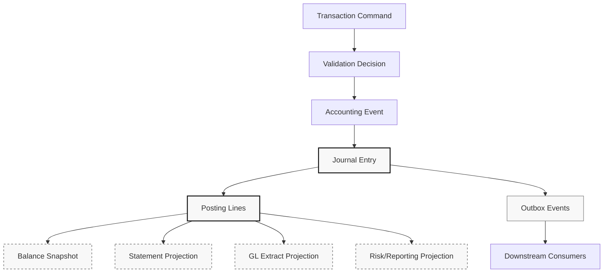
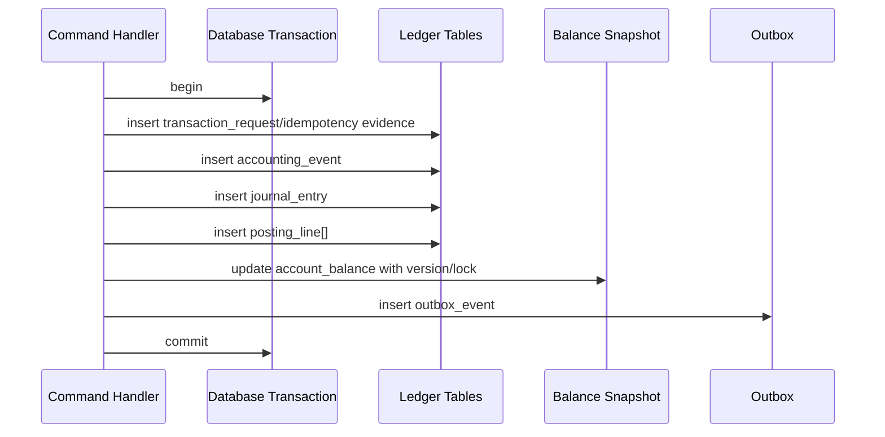
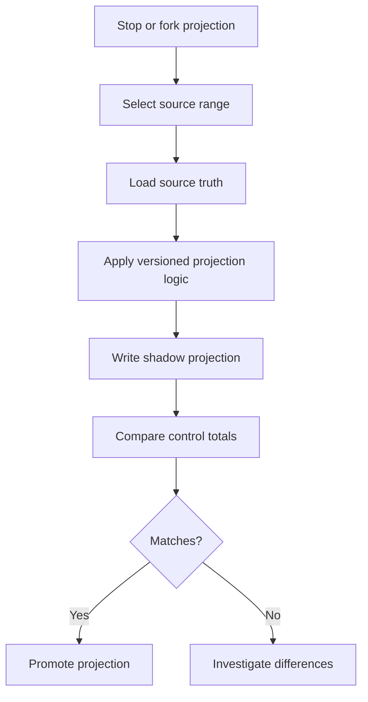

------
title: Learn Java Core Banking System - Part 031
description: Data architecture for core banking ledgers using relational journal tables, append-only events, balance snapshots, projections, schema evolution, replay, and audit-grade lineage.
series: learn-java-core-banking-system
seriesTitle: Learn Java Core Banking System
order: 31
partTitle: Data Architecture: Event Store, Relational Ledger, Snapshot, and Projection
tags:
- java
- core-banking
- ledger
- data-architecture
- event-sourcing
- projection
- relational-database
- audit
- system-design
date: 2026-06-28
---

# Part 031 — Data Architecture: Event Store, Relational Ledger, Snapshot, and Projection

A core banking data architecture is not just a storage decision. It is the mechanism by which the bank proves:

- what happened,
- when it happened,
- why it happened,
- which balances changed,
- which accounting entries were produced,
- which downstream reports were derived,
- and whether the system can reproduce the same answer later.

The engineering mistake is to start with a fashionable pattern:

> Should we use event sourcing, CQRS, Kafka, PostgreSQL, Oracle, snapshots, or a distributed database?

The better question is:

> Which data records are legal/accounting truth, which are derived views, which are integration messages, and which can be rebuilt?

In core banking, **truth records** and **derived records** must never be confused.

---

## 1. Kaufman Skill Target

In this part, the skill to acquire is:

> Given a core banking requirement, design a defensible data architecture that separates journal truth, balance snapshots, projections, audit records, and integration events without losing lineage or correctness.

After this part, you should be able to:

1. Explain why a ledger is usually better modeled as an append-oriented relational journal than as mutable account rows alone.
2. Distinguish accounting events, journal entries, posting lines, balance snapshots, statement entries, audit events, and integration events.
3. Decide when event sourcing is useful and when it becomes unnecessary complexity.
4. Design a transactional write path that inserts journal truth, updates balances, stores idempotency evidence, and emits outbox events atomically.
5. Build projections that are rebuildable and clearly derived from ledger truth.
6. Reason about schema evolution, partitioning, retention, archival, and replay.

---

## 2. Core Mental Model: Truth, Cache, View, Message

A robust core banking data model has four categories.

| Category | Meaning | Can it be rebuilt? | Example |
|---|---|---:|---|
| Truth | Primary financial record | No, except from backup/recovery | Journal entry, posting line |
| Snapshot | Derived but operationally critical state | Yes, from truth | Current balance, accrued interest total |
| Projection | Read-optimized view | Yes | Statement view, account activity screen |
| Message | Communication to other systems | Sometimes, from truth + mapping | Outbox event, ISO 20022 instruction |

The invariant is simple:

> Every financial number shown to a customer, operator, auditor, regulator, or downstream system must be traceable to ledger truth.

A customer-facing balance may be served from a fast projection, but it must be explainable from postings.

---

## 3. The Four-Layer Ledger Data Architecture

A practical architecture looks like this:



Important distinction:

- `journal_entry` and `posting_line` are financial truth.
- `account_balance_snapshot` is operational state derived from postings.
- `statement_entry` is customer-readable projection.
- `gl_extract_line` is accounting interface projection.
- `outbox_event` is a publication mechanism, not ledger truth.

A top engineer can answer this question for every table:

> If this table disappears, can we rebuild it? If yes, from what exact source and under which version of logic?

---

## 4. Canonical Table Roles

A minimal but serious core banking schema usually contains these roles.

| Table role | Purpose | Mutability rule |
|---|---|---|
| `transaction_request` | Incoming intent and idempotency envelope | Append/update status only |
| `accounting_event` | Business event accepted for accounting | Append-only |
| `journal_entry` | Balanced accounting container | Append-only |
| `posting_line` | Debit/credit legs | Append-only |
| `account_balance` | Current operational balance | Updated transactionally |
| `balance_history` | Historical snapshot by business date | Append-only per snapshot event |
| `statement_entry` | Customer-facing transaction view | Append/update enrichment only |
| `outbox_event` | Reliable integration publication | Append/update publish status |
| `audit_event` | Actor/action/evidence trail | Append-only |
| `projection_checkpoint` | Projection rebuild progress | Mutable technical control |

The key is not the exact table names. The key is the **contract** behind each table.

A table with financial truth should not be casually updated. A table with operational state may be updated, but only as a function of immutable truth.

---

## 5. Example Relational Ledger Schema

A simplified relational ledger model:

```sql
create table journal_entry (
    journal_id              uuid primary key,
    transaction_id          uuid not null,
    accounting_event_id     uuid not null,
    business_date           date not null,
    posting_timestamp       timestamptz not null,
    value_date              date not null,
    currency                char(3) not null,
    status                  varchar(32) not null,
    source_channel          varchar(64) not null,
    correlation_id          varchar(128) not null,
    causation_id            varchar(128),
    reversal_of_journal_id  uuid,
    created_at              timestamptz not null default now(),
    constraint journal_status_chk check (status in ('POSTED', 'REVERSED'))
);

create table posting_line (
    posting_line_id     uuid primary key,
    journal_id          uuid not null references journal_entry(journal_id),
    line_no             int not null,
    account_id          uuid not null,
    gl_account_code     varchar(64) not null,
    side                varchar(8) not null,
    amount_minor        bigint not null,
    currency            char(3) not null,
    balance_impact      varchar(32) not null,
    created_at          timestamptz not null default now(),
    constraint posting_side_chk check (side in ('DEBIT', 'CREDIT')),
    constraint amount_positive_chk check (amount_minor > 0),
    constraint posting_line_unique unique (journal_id, line_no)
);

create index posting_line_account_idx
    on posting_line(account_id, created_at, journal_id);

create index posting_line_journal_idx
    on posting_line(journal_id);
```

Why `amount_minor` as integer?

Because money in ledger truth should avoid binary floating-point representation. For currency amounts, a common engineering approach is to store minor units as integer and use currency metadata to interpret scale. In Java domain code, `BigDecimal` can be used for intermediate calculations such as interest allocation, but persisted monetary truth should be normalized and rounded under explicit policy.

---

## 6. Balancing Constraint: Database Alone Is Not Enough

A double-entry journal must balance.

Conceptually:

```txt
sum(debits) == sum(credits)
```

But in a relational database, this invariant spans multiple rows. You may enforce pieces with constraints, but the full invariant is usually enforced in the posting engine transaction.

Example validation:

```java
public final class JournalBalancer {

    public void assertBalanced(List<PostingLineDraft> lines) {
        Map<Currency, Money> debitByCurrency = new HashMap<>();
        Map<Currency, Money> creditByCurrency = new HashMap<>();

        for (PostingLineDraft line : lines) {
            if (line.side() == Side.DEBIT) {
                debitByCurrency.merge(line.money().currency(), line.money(), Money::plus);
            } else {
                creditByCurrency.merge(line.money().currency(), line.money(), Money::plus);
            }
        }

        if (!debitByCurrency.equals(creditByCurrency)) {
            throw new UnbalancedJournalException(debitByCurrency, creditByCurrency);
        }
    }
}
```

A stronger production design also records the balancing proof:

```sql
create table journal_control_total (
    journal_id          uuid primary key references journal_entry(journal_id),
    currency            char(3) not null,
    debit_total_minor   bigint not null,
    credit_total_minor  bigint not null,
    line_count          int not null,
    created_at          timestamptz not null default now(),
    constraint balanced_total_chk check (debit_total_minor = credit_total_minor)
);
```

This table makes audit and reconciliation easier. It is not a substitute for correct posting logic, but it is useful evidence.

---

## 7. Account Balance Snapshot

A balance snapshot is a performance and operational convenience.

```sql
create table account_balance (
    account_id              uuid primary key,
    currency                char(3) not null,
    ledger_balance_minor    bigint not null,
    available_balance_minor bigint not null,
    blocked_balance_minor   bigint not null,
    overdraft_limit_minor   bigint not null,
    last_journal_id         uuid,
    last_posting_timestamp  timestamptz,
    version                 bigint not null,
    updated_at              timestamptz not null
);
```

Critical rule:

> The balance row is not the ledger. It is a cached operational state that must be reproducible from posting lines plus hold/restriction state.

In production, the exact rebuild formula must be documented:

```txt
ledger_balance(account, t)
= opening_balance(account)
+ sum(credits affecting ledger balance up to t)
- sum(debits affecting ledger balance up to t)
```

Available balance may be different:

```txt
available_balance
= ledger_balance
- active_holds
- liens
- minimum_balance_requirement
+ authorized_overdraft_limit
```

Different product types may vary. The formula must be versioned and testable.

---

## 8. Write Path: One Transaction, One Financial Truth

A robust posting write path should commit all financial truth atomically.



The outbox event is committed in the same transaction as the ledger truth. A separate publisher later sends it.

This avoids the dual-write bug:

1. Ledger commit succeeds.
2. Event publish fails.
3. Downstream systems never learn about the posting.

Or the opposite:

1. Event publish succeeds.
2. Ledger commit fails.
3. Downstream systems observe a transaction that does not exist.

The transactional outbox pattern exists precisely to close this gap.

---

## 9. Idempotency Store as Data Architecture

Idempotency is not only API behavior. It is a persistence design.

```sql
create table idempotency_record (
    idempotency_key     varchar(256) primary key,
    request_hash        char(64) not null,
    command_type        varchar(64) not null,
    status              varchar(32) not null,
    result_ref_type     varchar(64),
    result_ref_id       uuid,
    failure_code        varchar(128),
    created_at          timestamptz not null,
    updated_at          timestamptz not null,
    expires_at          timestamptz
);
```

Rules:

- Same key + same request hash returns the same result.
- Same key + different request hash is a client error or fraud signal.
- Unknown outcome is recovered by reading the idempotency record and ledger truth.
- Expiry policy must respect dispute, audit, and operational needs.

Idempotency records are evidence. Do not treat them as disposable cache.

---

## 10. Event Store vs Relational Ledger

Event sourcing says that all changes to application state are stored as a sequence of events and current state can be reconstructed from those events. This is useful, but it is not automatically the best model for financial ledger truth.

A core banking ledger is already event-like: posting lines are append-oriented facts. But not every domain event belongs in the same stream.

| Data type | Good fit for event store? | Notes |
|---|---:|---|
| Account lifecycle events | Yes | Useful for reconstruction and audit |
| Product parameter changes | Yes | Effective-dated configuration history |
| Journal/posting truth | Sometimes | Relational journal may be clearer for accounting queries |
| Balance snapshot | No | Derived state |
| Statement view | No | Projection |
| Integration publication status | No | Outbox/inbox technical state |
| Audit login/access event | Separate event log | Not accounting truth |

The issue is not whether events are good. The issue is **which events are authoritative for which question**.

---

## 11. Anti-Pattern: Kafka as the Ledger

Kafka, Pulsar, or any event-streaming platform can be excellent for integration, fan-out, and downstream projections. But treating an event broker as the primary ledger truth is dangerous unless you have built all accounting-grade controls around it.

Common failure modes:

- retention policy conflicts with audit retention,
- compaction removes information needed for lineage,
- consumer offset becomes mistaken as business acknowledgement,
- ordering is only guaranteed within partition, not globally,
- replay creates duplicate side effects,
- schema evolution breaks historical interpretation,
- operational teams cannot run accounting queries easily,
- reconciliation becomes broker-centric instead of ledger-centric.

A safer rule:

> Use the database ledger as truth. Use event streams to distribute facts after truth has been committed.

This is not anti-event. It is pro-accounting.

---

## 12. Projection Architecture

A projection is a derived read model.

Examples:

- account statement,
- account activity timeline,
- customer dashboard,
- GL extract,
- risk exposure snapshot,
- payment status screen,
- teller transaction history,
- operational exception queue.

Projection design requires five explicit decisions:

| Decision | Question |
|---|---|
| Source | Which truth records feed this projection? |
| Ordering | What ordering is required? |
| Idempotency | How does the projector ignore duplicates? |
| Rebuild | Can we recreate it from scratch? |
| Versioning | Which code/config version produced it? |

Example projection checkpoint:

```sql
create table projection_checkpoint (
    projection_name     varchar(128) primary key,
    source_position     bigint not null,
    source_timestamp    timestamptz,
    projection_version  varchar(64) not null,
    status              varchar(32) not null,
    updated_at          timestamptz not null
);
```

A projection without a checkpoint is operationally fragile. A projection without a rebuild path becomes shadow truth.

---

## 13. Statement Projection

Statement entries are often customer-visible. That makes them sensitive, but they are still derived.

```sql
create table statement_entry (
    statement_entry_id  uuid primary key,
    account_id          uuid not null,
    journal_id          uuid not null,
    transaction_id      uuid not null,
    business_date       date not null,
    value_date          date not null,
    entry_timestamp     timestamptz not null,
    direction           varchar(8) not null,
    amount_minor        bigint not null,
    currency            char(3) not null,
    narrative           varchar(512) not null,
    running_balance_minor bigint,
    projection_version  varchar(64) not null,
    created_at          timestamptz not null
);
```

Important nuance:

- Statement narrative may be enriched after posting.
- Running balance may be recomputed.
- Display ordering may differ by business rules.
- Corrections should appear as visible correcting entries, not invisible mutation.

A statement is not merely a UI table. It is part of customer evidence.

---

## 14. Snapshot Strategy

Snapshots exist because recomputing from the beginning of time is expensive.

Types of snapshot:

| Snapshot | Purpose | Rebuild source |
|---|---|---|
| Current balance | Fast authorization and inquiry | Posting lines + holds |
| End-of-day balance | Statement, interest, reports | Posting lines up to business date |
| Accrual snapshot | Interest engine checkpoint | Balance segments + rate config |
| GL control total | Accounting reconciliation | Posting lines + GL mapping |
| Risk exposure snapshot | Regulatory/risk reporting | Account/product/ledger state |

A snapshot must record:

- source range,
- business date,
- generation timestamp,
- generation logic version,
- control total,
- creator job/process,
- prior snapshot reference if incremental.

Example:

```sql
create table account_balance_snapshot (
    snapshot_id             uuid primary key,
    account_id              uuid not null,
    business_date           date not null,
    ledger_balance_minor    bigint not null,
    available_balance_minor bigint not null,
    currency                char(3) not null,
    source_from_journal_id  uuid,
    source_to_journal_id    uuid not null,
    generation_version      varchar(64) not null,
    generated_at            timestamptz not null,
    unique(account_id, business_date, generation_version)
);
```

---

## 15. Read Model Staleness

Not every read model must be strongly consistent.

| Use case | Staleness tolerance | Recommended source |
|---|---:|---|
| Posting validation | None | Transactional balance/holds |
| ATM authorization | Very low | Strong balance source or reservation service |
| Mobile account dashboard | Low | Projection with freshness indicator |
| Monthly statement | Batch consistent | EOD snapshot/projection |
| Risk report | Controlled as-of snapshot | Reporting mart with lineage |
| Marketing analytics | Higher | Anonymized/aggregated export |

The system should expose freshness explicitly:

```json
{
  "accountId": "...",
  "ledgerBalance": "1250000.00",
  "currency": "IDR",
  "asOfBusinessDate": "2026-06-28",
  "asOfJournalSequence": 98277123,
  "projectionLagMillis": 350
}
```

Do not pretend eventual consistency is immediate consistency.

---

## 16. Ordering and Sequence Design

Ledger systems need stable ordering for audit, statements, and replay.

Possible ordering dimensions:

- command received time,
- posting timestamp,
- business date,
- value date,
- journal sequence,
- account-local sequence,
- external rail sequence,
- statement sequence.

There is no single universal ordering that solves every question.

Recommended approach:

| Ordering | Use |
|---|---|
| Global journal sequence | Audit/replay/control totals |
| Account-local sequence | Statement and account projection |
| Business date | EOD/reporting |
| Value date | Interest/backdating logic |
| External sequence | Rail reconciliation |

Example:

```sql
create table account_posting_sequence (
    account_id          uuid not null,
    posting_line_id     uuid not null,
    account_sequence_no bigint not null,
    journal_id          uuid not null,
    created_at          timestamptz not null,
    primary key(account_id, account_sequence_no),
    unique(posting_line_id)
);
```

This avoids forcing all statement needs onto a global sequence.

---

## 17. Transaction Isolation and Concurrency

Financial posting depends on correct transaction boundaries.

A simplified posting transaction may need to:

1. read idempotency record,
2. lock affected account balances,
3. validate available funds,
4. insert journal/posting lines,
5. update balance snapshots,
6. insert outbox events,
7. commit.

In SQL terms, this requires understanding isolation level behavior. For example, PostgreSQL exposes standard isolation levels, but internally maps them to its MVCC implementation. That means engineers must understand what their database actually guarantees, not only what the SQL standard names imply.

A common pattern is deterministic account locking:

```sql
select *
from account_balance
where account_id in (:accountA, :accountB)
order by account_id
for update;
```

The order matters. For transfers involving two accounts, deterministic ordering reduces deadlocks.

---

## 18. Append-Only Does Not Mean Insert-Only Everywhere

A mature design uses different mutability rules.

| Record | Mutability |
|---|---|
| Posting line | Append-only |
| Journal entry | Append-only, status may be constrained |
| Account balance | Mutable snapshot |
| Projection checkpoint | Mutable technical state |
| Outbox event | Mutable delivery state |
| Audit event | Append-only |
| Configuration version | Immutable after activation |
| Repair case | Mutable lifecycle, append-only case events |

The principle is:

> Mutate operational state, not historical truth.

---

## 19. Schema Evolution

Core banking schemas live for years. Maybe decades.

Schema evolution rules:

1. Never break historical records without migration evidence.
2. Prefer additive changes for truth tables.
3. Version interpretation logic.
4. Store source payload for critical external messages when legally allowed.
5. Make projection rebuilds version-aware.
6. Do not overload nullable columns with hidden semantics.
7. Use explicit correction records, not destructive cleanup.

Bad evolution:

```txt
Add column fee_type nullable.
Old null means unknown.
New null means not applicable.
Some reports treat null as waived.
```

Better evolution:

```txt
fee_classification_version = V2
fee_type = MONTHLY_ACCOUNT_MAINTENANCE | ATM_WITHDRAWAL | TRANSFER | NOT_APPLICABLE
```

Financial data hates ambiguous nulls.

---

## 20. Partitioning Strategy

Partitioning is not only a performance optimization. It affects retention, archival, reconciliation, and operational recovery.

Possible partition dimensions:

| Dimension | Benefit | Risk |
|---|---|---|
| Business date | EOD/reporting efficiency | Backdated corrections touch old partitions |
| Posting timestamp | Operational ingestion efficiency | Reporting by business date needs indexes |
| Account hash | Write distribution | Cross-account transfer spans partitions |
| Currency | GL/reconciliation convenience | Multi-currency products still need joins |
| Institution/tenant | Multi-tenant isolation | Shared reference data complexity |

For core banking, partitioning by **business date plus supporting account indexes** is often practical for journal/posting history. For hot operational state like `account_balance`, partitioning by account hash or tenant may be more useful.

Do not partition before defining query patterns and recovery procedures.

---

## 21. Archival and Retention

Archival must preserve explainability.

A dangerous archival policy says:

> Move old rows to cheap storage.

A defensible archival policy says:

> Move older records to controlled storage while preserving queryability, lineage, hash/control totals, schema version, and retrieval SLA required for audit, dispute, regulatory reporting, and customer evidence.

Archive package should include:

- journal entries,
- posting lines,
- statement entries,
- relevant account/product versions,
- reference data versions,
- FX/rate/tax tables used,
- audit trail,
- control totals,
- schema/version metadata.

The archive must answer: “Why was this balance reported on this date?”

---

## 22. Rebuild Strategy

A projection that cannot be rebuilt is not a projection. It is hidden truth.

Projection rebuild design:



Production rebuild should support:

- full rebuild,
- account-range rebuild,
- business-date rebuild,
- projection-version rebuild,
- shadow table validation,
- control total comparison,
- rollback to previous projection.

Do not rebuild directly over the live view unless the blast radius is understood.

---

## 23. Java Package Architecture

Example package structure:

```txt
com.bank.core.ledger
  ├── command
  │   ├── PostingCommand.java
  │   ├── PostingCommandHandler.java
  │   └── IdempotencyKey.java
  ├── domain
  │   ├── JournalEntry.java
  │   ├── PostingLine.java
  │   ├── Money.java
  │   └── BalanceImpact.java
  ├── persistence
  │   ├── JournalRepository.java
  │   ├── PostingLineRepository.java
  │   ├── AccountBalanceRepository.java
  │   └── OutboxRepository.java
  ├── projection
  │   ├── StatementProjector.java
  │   ├── BalanceSnapshotProjector.java
  │   └── ProjectionCheckpointRepository.java
  └── reconciliation
      ├── LedgerControlTotalService.java
      └── ProjectionVerifier.java
```

Notice that projection is not mixed with posting decision logic.

---

## 24. Java Transactional Posting Skeleton

```java
public final class PostingCommandHandler {

    private final TransactionTemplate tx;
    private final IdempotencyRepository idempotency;
    private final AccountBalanceRepository balances;
    private final JournalRepository journals;
    private final OutboxRepository outbox;
    private final PostingPolicy postingPolicy;

    public PostingResult handle(PostingCommand command) {
        return tx.execute(status -> {
            IdempotencyDecision idem = idempotency.reserve(
                    command.idempotencyKey(),
                    command.requestHash(),
                    command.commandType()
            );

            if (idem.isReplay()) {
                return idem.previousResult();
            }

            List<AccountId> affectedAccounts = command.affectedAccounts()
                    .stream()
                    .sorted()
                    .toList();

            Map<AccountId, AccountBalance> lockedBalances =
                    balances.lockForUpdate(affectedAccounts);

            AccountingEvent event = postingPolicy.accept(command, lockedBalances);
            JournalDraft journalDraft = postingPolicy.toJournal(event);
            journalDraft.assertBalanced();

            JournalEntry journal = journals.insert(journalDraft);
            balances.apply(journal.postingLines());

            outbox.insert(LedgerPostedEvent.from(journal));
            idempotency.markSucceeded(command.idempotencyKey(), journal.journalId());

            return PostingResult.posted(journal.journalId());
        });
    }
}
```

This skeleton is intentionally boring. Boring is good for ledger truth.

---

## 25. Repository Contracts

A repository method in core banking should reveal its locking and consistency behavior.

Weak contract:

```java
Optional<AccountBalance> find(AccountId accountId);
```

Stronger contract:

```java
AccountBalance lockBalanceForPosting(AccountId accountId);

List<AccountBalance> lockBalancesForPostingInDeterministicOrder(
        Collection<AccountId> accountIds
);
```

A method name should not hide concurrency semantics. In ledger code, ambiguity is expensive.

---

## 26. Control Totals

Every critical batch/projection should have control totals.

Examples:

| Process | Control total |
|---|---|
| Posting batch | debit total = credit total by currency |
| GL extract | subledger total = GL interface total |
| Statement projection | count and amount match source postings |
| EOD balance snapshot | sum balance movement equals opening + postings |
| Interest accrual | generated accrual equals explainable calculation detail |
| Migration | source system total equals target ledger opening total |

Control totals are not bureaucratic. They are the fastest way to detect silent corruption.

---

## 27. Data Quality Rules

Core banking data quality is not just “non-null fields”.

Data quality examples:

| Rule | Why it matters |
|---|---|
| Every posting line belongs to exactly one journal | Ledger traceability |
| Every journal has at least two posting lines | Double-entry shape |
| Journal debit/credit totals balance by currency | Accounting correctness |
| Every balance update references last journal | Rebuild validation |
| Every statement entry references journal/posting source | Customer evidence |
| Every product parameter has effective date/version | Historical interpretation |
| Every manual adjustment has approval evidence | Operational control |
| Every projection has checkpoint/version | Rebuildability |

A top engineer turns these into executable checks.

---

## 28. Audit Queries Engineers Should Support

Design the schema so these questions are easy:

```sql
-- Show all posting lines for a transaction
select je.journal_id,
       pl.account_id,
       pl.side,
       pl.amount_minor,
       pl.currency,
       pl.gl_account_code
from journal_entry je
join posting_line pl on pl.journal_id = je.journal_id
where je.transaction_id = :transaction_id
order by pl.line_no;
```

```sql
-- Recompute account ledger movement for a period
select account_id,
       currency,
       sum(case when side = 'CREDIT' then amount_minor else -amount_minor end) as net_movement
from posting_line pl
join journal_entry je on je.journal_id = pl.journal_id
where account_id = :account_id
  and je.business_date between :from_date and :to_date
group by account_id, currency;
```

```sql
-- Detect unbalanced journals defensively
select je.journal_id
from journal_entry je
join posting_line pl on pl.journal_id = je.journal_id
group by je.journal_id, pl.currency
having sum(case when pl.side = 'DEBIT' then pl.amount_minor else 0 end)
    <> sum(case when pl.side = 'CREDIT' then pl.amount_minor else 0 end);
```

If these queries are impossible or slow without heroics, the data model is fighting the bank.

---

## 29. Event Payload Design

An integration event should not leak too much and should not omit lineage.

Example:

```json
{
  "eventId": "evt_01J...",
  "eventType": "ledger.journal.posted",
  "eventVersion": 3,
  "occurredAt": "2026-06-28T10:15:30Z",
  "businessDate": "2026-06-28",
  "journalId": "...",
  "transactionId": "...",
  "correlationId": "...",
  "sourceSystem": "core-banking",
  "affectedAccounts": [
    {
      "accountId": "...",
      "currency": "IDR",
      "direction": "DEBIT",
      "amountMinor": 2500000
    }
  ],
  "control": {
    "postingLineCount": 2,
    "debitTotalMinor": 2500000,
    "creditTotalMinor": 2500000,
    "currency": "IDR"
  }
}
```

Rules:

- Include identifiers and control totals.
- Avoid unnecessary PII.
- Version the event.
- Keep payload stable.
- Do not force consumers to parse narrative text.
- Never make the event the only place where financial truth exists.

---

## 30. Inbox for Incoming Events

For inbound integration, use an inbox table.

```sql
create table inbound_message_inbox (
    source_system       varchar(64) not null,
    external_message_id varchar(256) not null,
    message_type        varchar(128) not null,
    payload_hash        char(64) not null,
    received_at         timestamptz not null,
    processing_status   varchar(32) not null,
    result_ref_id       uuid,
    failure_code        varchar(128),
    primary key(source_system, external_message_id)
);
```

This gives:

- duplicate detection,
- replay safety,
- evidence for external messages,
- unknown outcome recovery,
- repair workflow linkage.

Inbound message idempotency is as important as API idempotency.

---

## 31. Historical Interpretation Requires Reference Data Versions

A ledger entry is not fully interpretable without its context.

Examples:

- product version at posting time,
- rate table version,
- fee parameter version,
- tax rule version,
- GL mapping version,
- currency metadata version,
- customer segment at decision time,
- approval authority snapshot.

You can either copy relevant decision snapshot into the event/journal metadata or reference immutable version IDs.

Weak design:

```txt
journal_entry.product_code = SAVINGS_PLUS
```

Better design:

```txt
journal_entry.product_code = SAVINGS_PLUS
journal_entry.product_version = 17
journal_entry.pricing_decision_id = DEC-20260628-...
journal_entry.gl_mapping_version = 12
```

The goal is reproducibility.

---

## 32. Multi-Currency Data Model

Multi-currency postings need clear rules.

Scenarios:

1. Same-currency transfer.
2. FX transfer with customer debit in one currency and beneficiary credit in another.
3. Fee charged in account currency.
4. Settlement account in clearing currency.
5. Revaluation entries for FX exposure.

Do not pretend a journal balances across currencies without an FX bridge.

Example pattern:

```txt
Customer IDR account       debit  1,650,000 IDR
FX position/control IDR    credit 1,650,000 IDR
FX position/control USD    debit  100.00 USD
Beneficiary USD account    credit 100.00 USD
```

Each currency balances within its own currency ledger. FX rate and spread evidence must be preserved.

---

## 33. Reconciliation-Friendly Design

Reconciliation is easier when the data model was built for it.

Add fields that help matching:

- external reference,
- settlement date,
- rail reference,
- payment instruction id,
- end-to-end id,
- counterparty bank code,
- amount/currency,
- value date,
- status,
- return reason,
- correction reference.

But do not overload one `reference` column with everything.

Use typed references:

```sql
create table transaction_reference (
    transaction_id      uuid not null,
    reference_type      varchar(64) not null,
    reference_value     varchar(256) not null,
    source_system       varchar(64) not null,
    primary key(transaction_id, reference_type, reference_value)
);
```

This makes reconciliation queries precise and avoids text-parsing chaos.

---

## 34. Observability Data Is Not Ledger Data

Telemetry is essential, but it is not accounting truth.

OpenTelemetry provides a standard way to collect and export telemetry such as traces, metrics, and logs. That is useful for understanding runtime behavior, latency, and failures. But telemetry must not become the only source of business evidence.

| Question | Source |
|---|---|
| Did the API receive a command? | Trace/log + request record |
| Did the ledger post? | Journal/posting tables |
| Was the event published? | Outbox state + broker acknowledgement |
| Did projection lag? | Metrics/checkpoint |
| Was a customer balance changed? | Ledger truth + balance snapshot |

Telemetry helps operate the system. Ledger data proves the financial event.

---

## 35. Testing the Data Architecture

Important tests:

| Test | Purpose |
|---|---|
| Journal balancing property test | No unbalanced journal can be committed |
| Idempotency replay test | Same command cannot post twice |
| Transfer lock-order test | Concurrent opposite transfers do not deadlock frequently |
| Projection rebuild test | Rebuilt statement equals live statement |
| Snapshot recomputation test | Current balance equals postings-derived balance |
| Schema migration replay test | Old records still interpreted correctly |
| Outbox recovery test | Committed ledger always eventually published |
| Archive retrieval test | Old evidence can still answer audit query |

Example property test idea:

```java
@Property
void committedJournalAlwaysBalances(@ForAll("validPostingCommands") PostingCommand command) {
    PostingResult result = postingHandler.handle(command);
    JournalEntry journal = journalRepository.find(result.journalId());

    assertThat(journal.isBalancedByCurrency()).isTrue();
}
```

For banking, property tests are not luxury. They encode invariants.

---

## 36. Common Anti-Patterns

| Anti-pattern | Consequence |
|---|---|
| Balance-only ledger | Cannot explain history |
| Mutable posting rows | Audit trail broken |
| Kafka as ledger without accounting controls | Retention/replay/order risk |
| Projection treated as truth | Rebuild impossible |
| Unversioned product/rate config | Historical numbers unexplained |
| One generic reference column | Reconciliation chaos |
| No idempotency table | Duplicate posting under retry |
| No control totals | Silent corruption detected late |
| No schema versioning | Old data becomes ambiguous |
| Archival without context | Audit retrieval fails |

---

## 37. Review Checklist

Use this checklist in design review:

- [ ] Which tables are financial truth?
- [ ] Which tables are derived snapshots?
- [ ] Which projections can be rebuilt?
- [ ] What is the source of each projection?
- [ ] What are the control totals?
- [ ] How is idempotency persisted?
- [ ] How are external messages deduplicated?
- [ ] How are journal entries balanced by currency?
- [ ] How is account balance recomputed from postings?
- [ ] How are product/rate/config versions referenced?
- [ ] What is the schema evolution strategy?
- [ ] What is the archive retrieval SLA?
- [ ] How does the system recover unknown publish outcomes?
- [ ] Which queries answer audit and reconciliation questions?

---

## 38. Practice Drill

Design a data model for this scenario:

> A customer transfers IDR 1,000,000 from savings account A to savings account B through mobile banking. A duplicate request arrives because the client retried after timeout. The first request committed the ledger but the API response was lost. The statement projection lags by 2 seconds. The outbox publisher is temporarily down.

Answer:

1. Which records are inserted in the first request?
2. Which records are read by the retry?
3. Which table proves the transfer posted?
4. Which table tells downstream publication is pending?
5. Which read model may be stale?
6. How would customer support explain the transaction before projection catches up?

Expected reasoning:

- idempotency record prevents duplicate posting,
- journal/posting lines prove the transfer,
- account balance snapshot is already updated,
- outbox has unpublished event,
- statement projection may lag,
- support should query ledger truth or operational transaction view, not only statement projection.

---

## 39. Summary

Core banking data architecture is about separating responsibilities:

- The ledger records truth.
- Snapshots provide fast operational state.
- Projections serve read models.
- Outbox/inbox tables control integration reliability.
- Audit records preserve evidence.
- Control totals detect silent drift.
- Versioned reference data preserves historical interpretation.

The hardest discipline is refusing to let derived data become ungoverned truth.

In the next part, we will focus on **performance, scalability, and contention management**: how to make this architecture fast without weakening the invariants.

---

## References

- Martin Fowler, “Event Sourcing” — https://martinfowler.com/eaaDev/EventSourcing.html
- PostgreSQL Documentation, “Transaction Isolation” — https://www.postgresql.org/docs/current/transaction-iso.html
- OpenTelemetry Documentation — https://opentelemetry.io/docs/
- Chris Richardson, “Transactional Outbox Pattern” — https://microservices.io/patterns/data/transactional-outbox.html
- ISO 4217 Currency Codes — https://www.iso.org/iso-4217-currency-codes.html
