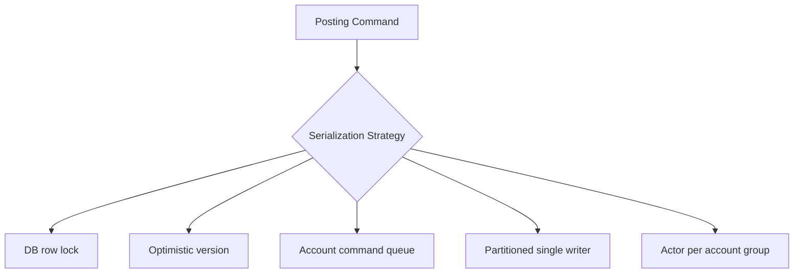
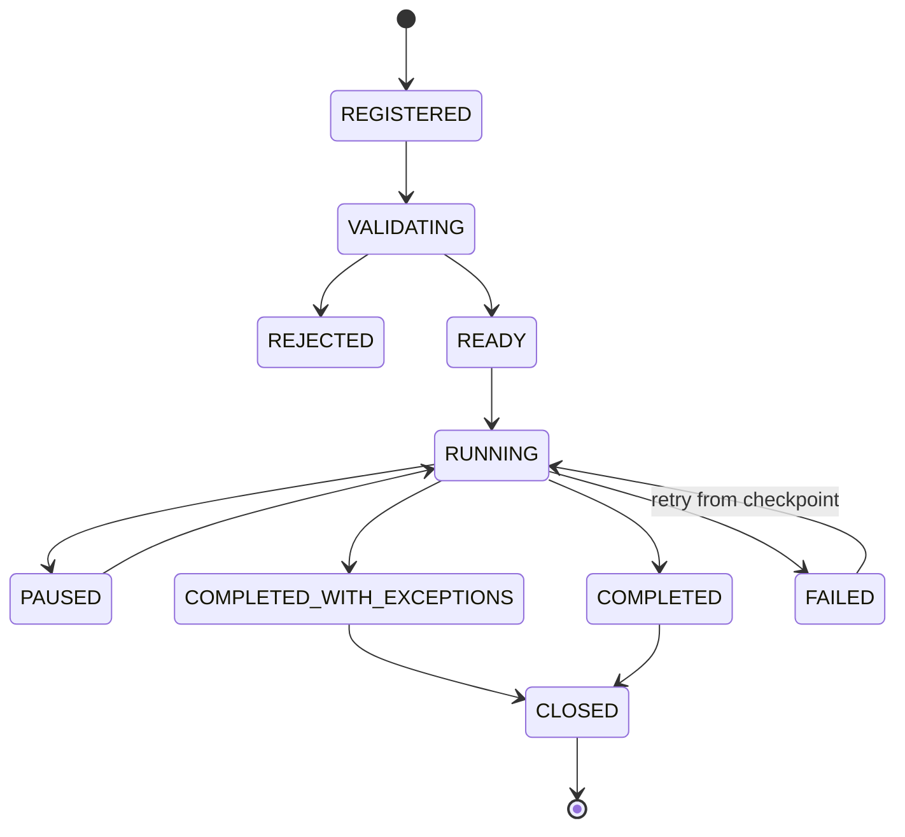
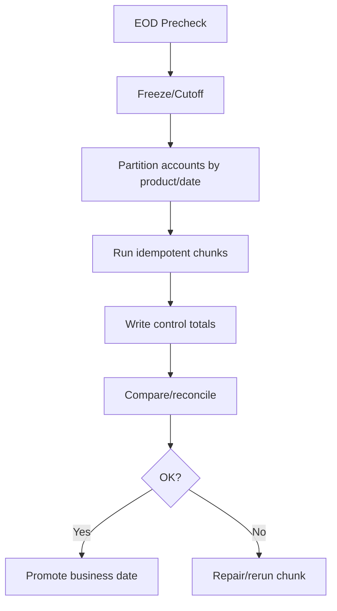
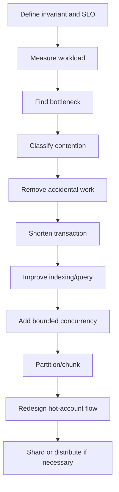

------
title: Learn Java Core Banking System - Part 032
description: Performance, scalability, contention, lock strategy, hot-account handling, batch posting, capacity modeling, JVM profiling, and safe optimization for Java core banking systems.
series: learn-java-core-banking-system
seriesTitle: Learn Java Core Banking System
order: 32
partTitle: Core Banking Performance, Scalability, and Contention Management
tags:
- java
- core-banking
- performance
- scalability
- contention
- locking
- batch-processing
- jfr
- observability
- system-design
date: 2026-06-28
---

# Part 032 — Core Banking Performance, Scalability, and Contention Management

Performance in core banking is not “maximum throughput at any cost”.

The real target is:

> predictable throughput and latency while preserving ledger correctness, idempotency, auditability, and operational recovery.

A system that posts 50,000 transactions per second but occasionally double-debits an account is not high performance. It is a fast liability.

This part focuses on the engineering trade-offs behind high-volume Java core banking systems: contention, locking, account serialization, batch processing, projection lag, database pressure, JVM behavior, and safe capacity planning.

---

## 1. Kaufman Skill Target

The sub-skill in this part is:

> Given a workload and correctness boundary, identify the true bottleneck and choose a scaling strategy that does not break ledger invariants.

After this part, you should be able to:

1. Build a workload model for core banking traffic.
2. Identify contention sources such as hot accounts, global sequences, balance rows, EOD jobs, and projection rebuilds.
3. Choose between database locking, optimistic versioning, account command queues, partitioned single-writer processing, and sharded posting workers.
4. Design batch posting and EOD processing to be restartable and idempotent.
5. Use Java/JVM observability tools such as JFR and OpenTelemetry safely.
6. Define capacity metrics that reveal business risk, not only CPU and memory.

---

## 2. Performance Is a Correctness-Constrained Optimization

In core banking, the order of priority is:

```txt
correctness > durability > auditability > recoverability > predictable latency > raw throughput
```

This does not mean performance is unimportant. It means performance work must preserve invariants.

Bad optimization:

```txt
Remove account row locking to improve TPS.
```

Better optimization:

```txt
Reduce lock hold time by pre-validating outside the transaction, locking accounts in deterministic order, writing minimal rows inside the transaction, and offloading projections to asynchronous workers.
```

The first approach removes safety. The second reduces contention while preserving safety.

---

## 3. Workload Model Before Architecture

A top engineer does not say “we need Kafka” or “we need sharding” before describing workload.

Core workload dimensions:

| Dimension | Questions |
|---|---|
| Transaction mix | Inquiry, transfer, cash withdrawal, fee, accrual, batch, reversal |
| Write ratio | How many operations mutate ledger truth? |
| Hot accounts | Are there merchant, suspense, settlement, GL, payroll, or platform accounts with extreme fan-in? |
| Temporal spikes | Salary day, EOD, campaign, holiday catch-up, migration, payment cutoff |
| Latency SLO | Authorization vs statement projection vs report generation |
| Consistency requirement | Must the response reflect committed ledger state immediately? |
| Batch volume | How many postings per EOD/accrual/fee run? |
| External dependency | Fraud, sanctions, clearing rail, card switch, GL, notification |

Example workload profile:

```yaml
normal_day:
  inquiry_tps: 1200
  posting_tps: 350
  p95_posting_latency_ms: 180
  p99_posting_latency_ms: 650
salary_day:
  inquiry_tps: 4000
  posting_tps: 1800
  hot_accounts:
    - payroll_clearing_account
    - employer_funding_account
  batch_postings: 7000000
  cutoff_pressure: high
```

You cannot solve a workload you have not named.

---

## 4. Latency Budget

A posting API latency budget may look like this:

| Step | Target |
|---|---:|
| Authentication/context already resolved | 5 ms |
| Command normalization | 2 ms |
| Idempotency lookup/reservation | 5 ms |
| Reference/config cache lookup | 2 ms |
| Risk/fraud decision | 20–200 ms depending on flow |
| Database lock wait | 0–50 ms normal, monitored |
| Ledger insert + balance update | 10–40 ms |
| Outbox insert | 1–5 ms |
| Commit | 5–30 ms |
| Response serialization | 2 ms |

The most important budget item is often **lock wait**, not CPU.

If lock wait dominates, adding more application threads may make the system worse.

---

## 5. Throughput Formula: Little's Law Intuition

A useful operational intuition:

```txt
concurrency ≈ throughput × latency
```

If posting throughput is 1,000 TPS and average posting latency is 100 ms:

```txt
concurrency ≈ 1000 × 0.1 = 100 concurrent in-flight postings
```

If latency rises to 1 second under lock contention:

```txt
concurrency ≈ 1000 × 1 = 1000 concurrent in-flight postings
```

That increased concurrency adds memory pressure, connection pool pressure, queue depth, and more lock waiting.

Performance collapse is often nonlinear.

---

## 6. Common Contention Sources

| Source | Symptom | Root cause |
|---|---|---|
| Account balance row | High lock wait | Many postings against same account |
| Settlement account | Hot account | External rail settlement fan-in |
| Suspense account | Operational backlog | Many exceptions posted to same account |
| Global sequence | Insert bottleneck | Single sequence/cache pressure |
| Journal index | Slow inserts | Over-indexed truth table |
| Idempotency table | Hot key or poor index | Client retries or bad key design |
| Projection table | Write amplification | Synchronous read-model updates |
| Reference data | Cache miss storms | Poor effective-date caching |
| EOD job | Batch locks online traffic | Uncontrolled batch concurrency |
| Outbox publisher | Backlog | Downstream/broker slow or failed |

The system should measure each of these explicitly.

---

## 7. Account-Level Serialization

A ledger posting that affects an account must serialize balance-affecting changes for that account.

This can be implemented several ways.



There is no universal best strategy. The right answer depends on workload, operational maturity, database capability, and required latency.

---

## 8. Strategy 1: Database Row Lock

Pattern:

```sql
select *
from account_balance
where account_id = :account_id
for update;
```

Pros:

- simple mental model,
- strong consistency,
- easy to reason about with relational ledger transaction,
- good for moderate contention,
- good audit/recovery behavior.

Cons:

- hot accounts bottleneck,
- lock wait can explode,
- long transactions hurt throughput,
- deadlocks possible for multi-account operations.

Best for:

- initial core banking implementation,
- moderate TPS,
- correctness-first systems,
- small number of affected accounts per transaction.

Optimization:

- keep transaction short,
- lock in deterministic order,
- precompute outside transaction,
- avoid synchronous projection updates,
- avoid external service calls inside transaction.

---

## 9. Strategy 2: Optimistic Versioning

Pattern:

```sql
update account_balance
set ledger_balance_minor = :new_balance,
    version = version + 1,
    updated_at = now()
where account_id = :account_id
  and version = :expected_version;
```

If updated row count is zero, retry.

Pros:

- avoids blocking lock waits for low contention,
- works well when conflicts are rare,
- simple with version column.

Cons:

- bad under hot-account contention,
- retries amplify load,
- careful idempotency required,
- conflict handling must be deterministic.

Best for:

- low-contention accounts,
- read-heavy workloads,
- systems with strong retry discipline.

Avoid for:

- settlement accounts,
- payroll fan-in,
- merchant high-volume accounts,
- batch operations hitting same account repeatedly.

---

## 10. Strategy 3: Account Command Queue

Pattern:

```txt
All commands for account A go to the same ordered queue/partition.
A single worker processes commands for A sequentially.
```

Pros:

- natural serialization,
- fewer DB lock conflicts,
- can smooth bursts,
- backpressure can be explicit.

Cons:

- queue ordering must be carefully designed,
- cross-account transfer requires coordination,
- operational recovery is more complex,
- latency can increase under backlog,
- exactly-once still remains an illusion; idempotency is still needed.

Best for:

- very high write contention,
- account-local operations,
- architecture with strong queue operations maturity.

Important:

> A queue does not remove the need for ledger transaction atomicity. It only controls command ordering.

---

## 11. Strategy 4: Partitioned Single Writer

Pattern:

```txt
partition = hash(account_id) % N
all balance-affecting commands for that account route to that partition writer
```

Pros:

- high throughput with predictable ordering per partition,
- reduced lock contention,
- good for horizontal scaling,
- useful for event-driven internal processing.

Cons:

- transfer between accounts in different partitions is harder,
- partition rebalancing is operationally sensitive,
- hot accounts remain hot,
- writer failure/recovery needs precise replay/checkpoint.

Best for:

- high-volume digital banking,
- wallet-like accounts,
- internal ledger with mature operational controls.

---

## 12. Strategy 5: Dedicated Hot-Account Treatment

Hot accounts are special.

Examples:

- settlement accounts,
- clearing accounts,
- suspense accounts,
- fee income accounts,
- payroll funding accounts,
- merchant acquiring accounts,
- tax withholding accounts.

A naive double-entry transfer posts every customer transaction against the same settlement account and creates a bottleneck.

Possible treatments:

| Treatment | Idea | Trade-off |
|---|---|---|
| Sub-account partitioning | Split hot account into internal buckets | Requires aggregation/control totals |
| Batch netting | Post customer legs individually, net settlement leg periodically | Settlement timing/audit complexity |
| Account-local pending ledger | Accumulate pending movements before GL settlement | Requires clear state machine |
| Dedicated writer | Route hot account operations to specialized worker | Operational specialization |
| Hierarchical ledger | Child accounts roll up to parent control account | More accounting design effort |

Do not hide hot-account contention by weakening correctness. Redesign the accounting flow.

---

## 13. Transfer Between Two Accounts

Transfers are harder than single-account postings because two account balances are involved.

Naive locking:

```java
lock(accountA);
lock(accountB);
```

If another transaction does the reverse:

```java
lock(accountB);
lock(accountA);
```

Deadlock risk increases.

Better:

```java
List<AccountId> accounts = Stream.of(debitAccount, creditAccount)
        .sorted()
        .toList();

balances.lockForUpdate(accounts);
```

Deterministic lock ordering is simple and powerful.

For cross-partition single-writer designs, two-account transfer may require:

- routing to a deterministic coordinator partition,
- two-phase internal reservation,
- ledger-level atomic transaction in database,
- or product constraint that certain operations are batch-settled rather than immediate.

Avoid pretending cross-partition transfers are trivial.

---

## 14. External Calls Inside Posting Transaction

Never call slow or unreliable external systems while holding ledger locks.

Bad:

```txt
begin db transaction
lock account
call fraud service
call notification service
call payment rail
insert posting
commit
```

Better:

```txt
call required pre-decision services before locking
begin db transaction
lock account
validate decision freshness
insert posting
insert outbox
commit
publish after commit
```

Some decisions must happen before posting, such as sanctions/fraud hold. But the database transaction should remain short.

---

## 15. Batch Posting

Batch is not “loop over records”. Batch is an operationally controlled processing model.

A batch posting engine needs:

- batch identity,
- input manifest,
- chunking strategy,
- idempotency per item,
- checkpoint per chunk,
- control totals,
- partial failure handling,
- retry policy,
- restart policy,
- repair queue integration,
- final sign-off.

Example state machine:



---

## 16. Chunking Strategy

Batch chunking choices:

| Strategy | Useful when | Risk |
|---|---|---|
| Fixed size chunks | Uniform records | Hot accounts still cluster |
| Account-hash chunks | Avoid cross-worker account contention | Cross-account transactions hard |
| Product chunks | EOD product runs | Imbalanced chunk sizes |
| Branch/tenant chunks | Operational ownership | Hot branches |
| Amount/risk chunks | Approval/control segmentation | More scheduling complexity |

For balance-affecting postings, chunking must consider account contention.

A batch with 1 million records can still be slow if 300,000 touch the same settlement account.

---

## 17. EOD Performance

EOD workloads include:

- accrual calculation,
- fee generation,
- dormancy marking,
- maturity processing,
- statement snapshot,
- GL extract,
- report generation,
- reconciliation checks,
- archive jobs.

The wrong approach is to run all EOD jobs as giant database scans.

Better approach:



Performance comes from safe decomposition, not one heroic query.

---

## 18. Online vs Batch Isolation

Online posting and EOD batch can fight each other.

Control patterns:

| Pattern | Use |
|---|---|
| Cutoff window | Prevent late transaction ambiguity |
| Business-date routing | New transactions go to next business date |
| Product-level freeze | Freeze specific product during EOD step |
| Account-level work claiming | Avoid two workers processing same account |
| Chunk checkpoint | Restart from safe point |
| Read replica for reporting | Avoid report scans on primary |
| Shadow table generation | Build projections without blocking readers |

Do not let reports or projection rebuilds starve posting transactions.

---

## 19. Database Index Discipline

Ledger tables are write-heavy. Every index has a cost.

Index for actual access paths:

- account activity by account and time,
- journal lookup by transaction id,
- posting lookup by journal id,
- reconciliation lookup by external reference,
- EOD query by business date,
- GL extract by business date and GL account,
- idempotency lookup by key.

Avoid indexing every column because “someone may need it”.

Index bloat can degrade posting throughput. Use read projections for exploratory queries.

---

## 20. Read Scaling

Read traffic often dwarfs write traffic.

Read scaling strategies:

| Use case | Strategy |
|---|---|
| Mobile balance inquiry | Fast account balance table/cache with freshness rules |
| Statement history | Statement projection partitioned by account/date |
| Search transactions | Search/read projection, not ledger truth scan |
| Reporting | Reporting mart/snapshot with lineage |
| Audit query | Ledger truth with indexed references and archive retrieval |
| Dashboard metrics | Aggregated projection |

Do not scale reads by allowing every API to join raw ledger tables arbitrarily.

Create purpose-specific read models.

---

## 21. Cache Strategy

Caching in core banking requires classification.

Safe-ish to cache:

- static reference data,
- effective-dated product config after activation,
- currency metadata,
- branch/holiday calendar,
- routing tables,
- API metadata.

Dangerous to cache casually:

- available balance,
- hold state,
- fraud restriction,
- account status,
- approval authority,
- pricing decision result.

If you cache operational state, define:

- freshness guarantee,
- invalidation trigger,
- fallback source,
- consistency expectation,
- customer impact if stale,
- audit implication.

A stale product description is annoying. A stale available balance can cause financial loss.

---

## 22. Connection Pool Sizing

A larger connection pool is not always better.

If the database can efficiently process 80 concurrent posting transactions, giving the app 500 connections may simply create lock contention and CPU thrash.

Sizing depends on:

- DB CPU and I/O,
- transaction duration,
- lock wait,
- query complexity,
- batch concurrency,
- read/write separation,
- external service latency outside DB transaction.

Measure:

- active connections,
- wait time for connection,
- transaction duration,
- lock wait,
- deadlocks,
- rollback rate,
- slow commits.

The pool should enforce backpressure, not hide overload.

---

## 23. Threading Model in Java

Java gives many concurrency options: platform threads, virtual threads, thread pools, async/reactive frameworks, messaging workers.

For ledger posting, the important point is not which abstraction is fashionable. The important point is whether concurrency is bounded and aligned with database capacity.

Bad:

```java
requests.parallelStream().forEach(postingService::post);
```

Better:

```java
ExecutorService postingExecutor = Executors.newFixedThreadPool(config.postingWorkers());
Semaphore dbPostingPermits = new Semaphore(config.maxConcurrentPostingTransactions());
```

Even with virtual threads, you still need capacity controls. Virtual threads reduce the cost of blocking threads; they do not make database locks disappear.

---

## 24. BigDecimal and Money Performance

Money calculation must be correct first.

However, high-volume interest/fee engines can create allocation pressure if every tiny operation creates many `BigDecimal` objects.

Guidelines:

- Store ledger truth in minor units where suitable.
- Use `BigDecimal` for rate/interest calculations with explicit `MathContext` and rounding.
- Convert to minor units at controlled boundaries.
- Avoid repeated parsing of decimal strings in hot loops.
- Preload product/rate config.
- Benchmark realistic batch calculations.
- Never replace decimal money with `double` for financial truth.

Example:

```java
public record MinorMoney(String currency, long minorUnits) {
    public MinorMoney plus(MinorMoney other) {
        requireSameCurrency(other);
        return new MinorMoney(currency, Math.addExact(minorUnits, other.minorUnits));
    }
}
```

Use `Math.addExact` to detect overflow rather than silently wrapping.

---

## 25. JVM Profiling with JFR

JDK Flight Recorder is built into the HotSpot JVM and provides low-overhead observability/profiling events for Java applications. For core banking, it is valuable because many performance issues are not visible from business metrics alone.

Useful JFR investigations:

- allocation hotspots during interest batch,
- lock contention,
- socket latency,
- database call latency via instrumentation,
- GC pause behavior,
- thread park/block patterns,
- CPU hotspots in pricing rules,
- file I/O during report generation.

Use JFR to answer concrete questions:

> Why did EOD accrual run 3x slower today?

Not:

> Let us collect random profiles forever and never interpret them.

---

## 26. Observability for Performance

OpenTelemetry standardizes telemetry such as traces, metrics, and logs. In core banking performance work, telemetry should connect technical latency to business operations.

Critical metrics:

| Metric | Why it matters |
|---|---|
| posting_latency_p95/p99 | Customer and channel experience |
| lock_wait_ms | Contention indicator |
| idempotency_replay_count | Retry/timeout behavior |
| duplicate_request_rejected_count | Client/partner quality |
| outbox_backlog | Downstream publication risk |
| projection_lag | Read-model freshness |
| eod_chunk_duration | Batch performance |
| eod_rerun_count | Restartability issues |
| reconciliation_break_count | Financial drift |
| hot_account_top_n | Contention discovery |
| deadlock_count | Lock ordering/design problem |
| db_connection_wait_ms | Pool pressure |

Technical metrics without business dimensions are often insufficient.

Recommended dimensions:

- product code,
- transaction type,
- channel,
- business date,
- currency,
- partition/shard,
- account hotness bucket,
- batch id,
- error category.

Avoid high-cardinality raw account IDs in metrics. Use controlled buckets or exemplars/traces.

---

## 27. Backpressure

Backpressure is how a system refuses unsafe load.

Backpressure points:

- API gateway rate limits,
- per-channel quotas,
- per-partner quotas,
- posting worker queue size,
- DB connection pool,
- outbox publisher rate,
- batch scheduler concurrency,
- fraud/AML dependency budget.

A core banking system should degrade deliberately:

| Condition | Safer response |
|---|---|
| DB lock wait too high | Slow/limit non-critical writes |
| Projection lag high | Show stale indicator, keep posting safe |
| Outbox backlog high | Continue ledger if backlog within policy, alert operations |
| Fraud service down | Apply fail-closed/fail-pending policy by transaction class |
| EOD window at risk | Pause lower-priority jobs, escalate operations |

Unbounded queues are hidden outages.

---

## 28. Hot Account Detection

Detect hot accounts continuously.

Example query:

```sql
select account_id,
       count(*) as posting_count,
       sum(amount_minor) as total_amount_minor
from posting_line pl
join journal_entry je on je.journal_id = pl.journal_id
where je.posting_timestamp >= now() - interval '5 minutes'
group by account_id
order by posting_count desc
limit 20;
```

Better production approach:

- maintain rolling metrics by account bucket,
- flag settlement/suspense accounts separately,
- expose top-N internally with privacy controls,
- tie hotness to lock-wait metrics.

Hot accounts are not always errors. They are often accounting design signals.

---

## 29. Load Testing Core Banking

A useful load test must simulate banking realities:

- duplicate requests,
- timeouts with unknown outcome,
- hot accounts,
- two-account transfers,
- mixed read/write traffic,
- EOD overlap,
- outbox publisher slowdown,
- projection lag,
- reversal/adjustment traffic,
- fraud/AML latency,
- database failover scenario,
- batch chunk retry.

Naive load test:

```txt
10,000 users call GET /balance.
```

Better load test:

```txt
60% balance inquiry
20% same-bank transfer
5% external payment initiation
5% retry after timeout
5% fee/accrual batch posting
3% reversal/return
2% teller/manual adjustment with approval
plus one hot settlement account
plus outbox slowdown
```

The goal is not a big TPS number. The goal is to discover the collapse mode.

---

## 30. Capacity Planning

Capacity planning should produce operational thresholds.

Example:

```yaml
posting_service:
  normal_capacity_tps: 1200
  burst_capacity_tps_15min: 2500
  max_safe_db_lock_wait_p99_ms: 100
  max_outbox_backlog_records: 500000
  max_projection_lag_seconds_customer_view: 5
  eod_window_minutes: 120
  batch_safe_parallelism: 32
  hot_account_lock_wait_alert_ms: 250
```

Capacity plan must state:

- what happens when threshold is exceeded,
- who is alerted,
- which traffic is degraded,
- which jobs are paused,
- how correctness is preserved.

A number without an operational response is not a control.

---

## 31. Horizontal Scaling Limits

Adding more application instances helps when bottleneck is app CPU or network handling.

It may not help when bottleneck is:

- single account row lock,
- database write I/O,
- global sequence,
- over-indexed journal table,
- one settlement account,
- fraud service latency,
- broker partition bottleneck,
- EOD database scan.

Scaling app instances under database lock contention can worsen performance by increasing the number of contenders.

Always ask:

> What resource is saturated, and will adding instances reduce or increase contention?

---

## 32. Vertical Scaling Still Matters

In many core banking systems, the relational database remains the correctness center. Vertical scaling may be appropriate for:

- write-heavy ledger commit path,
- high memory for indexes/cache,
- fast storage for journal inserts,
- predictable latency,
- simpler operational model.

Horizontal scaling is not morally superior. It is a trade-off.

For ledger-critical paths, simplicity and predictability are often more valuable than distributed cleverness.

---

## 33. Sharding

Sharding is a serious commitment.

Shard candidates:

- tenant/institution,
- account hash,
- customer segment,
- region,
- product family.

Shard complications:

- cross-shard transfer,
- global customer view,
- GL aggregation,
- reporting and risk aggregation,
- reconciliation,
- migration,
- operational tooling,
- incident response,
- schema changes.

Before sharding, exhaust:

- indexing improvements,
- shorter transactions,
- projection offload,
- batch chunking,
- hot-account redesign,
- partitioning,
- read scaling,
- database tuning,
- archival.

Sharding is often necessary at scale, but it should not be the first answer.

---

## 34. Projection Lag Management

Projection lag is acceptable if managed explicitly.

Projection lag controls:

- lag metrics,
- freshness metadata in API,
- fallback query to ledger truth for critical screens,
- backfill workers,
- replay checkpoints,
- alert thresholds,
- consumer idempotency,
- dead-letter handling.

For customer balance, use stronger source. For statement/activity list, small lag may be acceptable if disclosed or handled gracefully.

Never let projection lag block ledger posting unless the projection is part of the posting invariant.

---

## 35. Safe Performance Optimization Sequence

Follow this sequence:



Do not start at sharding.

---

## 36. Java Implementation Pattern: Bounded Posting Executor

```java
public final class BoundedPostingExecutor {

    private final ExecutorService executor;
    private final Semaphore permits;
    private final PostingService postingService;

    public BoundedPostingExecutor(
            ExecutorService executor,
            int maxConcurrentPostings,
            PostingService postingService
    ) {
        this.executor = executor;
        this.permits = new Semaphore(maxConcurrentPostings);
        this.postingService = postingService;
    }

    public CompletableFuture<PostingResult> submit(PostingCommand command) {
        return CompletableFuture.supplyAsync(() -> {
            boolean acquired = false;
            try {
                acquired = permits.tryAcquire(
                        command.timeoutBudget().toMillis(),
                        TimeUnit.MILLISECONDS
                );
                if (!acquired) {
                    throw new PostingBackpressureException("posting capacity exceeded");
                }
                return postingService.post(command);
            } catch (InterruptedException e) {
                Thread.currentThread().interrupt();
                throw new PostingInterruptedException(e);
            } finally {
                if (acquired) {
                    permits.release();
                }
            }
        }, executor);
    }
}
```

The point is not this exact code. The point is explicit concurrency control.

---

## 37. Java Implementation Pattern: Hot Account Routing

```java
public final class PostingRouter {

    private final HotAccountRegistry hotAccounts;
    private final PostingWorkerPool normalPool;
    private final PostingWorkerPool hotAccountPool;

    public CompletionStage<PostingResult> route(PostingCommand command) {
        if (command.affectedAccounts().stream().anyMatch(hotAccounts::isHot)) {
            return hotAccountPool.submit(command);
        }
        return normalPool.submit(command);
    }
}
```

This is a simplified sketch. In production, routing must preserve ordering, idempotency, and recovery.

Hot account routing should be visible operationally. Hidden routing creates debugging pain.

---

## 38. Deadlock Handling

Deadlocks can still happen.

Rules:

1. Use deterministic lock ordering.
2. Keep transactions short.
3. Avoid external calls inside transaction.
4. Ensure retry is idempotent.
5. Classify deadlock as retryable only if command idempotency is strong.
6. Measure deadlock count by operation type.
7. Investigate recurring deadlocks as design issues, not random noise.

Retry without idempotency can duplicate money movement. Retry with idempotency can recover safely.

---

## 39. Failure During High Load

High load and partial failure interact badly.

Scenario:

```txt
External payment rail slows down.
Outbox backlog increases.
Posting API is still accepting transactions.
Projection lag increases.
Customer retries because status is unclear.
Idempotency table sees replay spikes.
Support opens cases.
EOD window approaches.
```

A mature system has pre-planned controls:

- status inquiry by idempotency key,
- transaction status screen from ledger truth,
- outbox backlog alert,
- retry-after response for non-critical requests,
- partner throttling,
- repair queue for uncertain external states,
- operational dashboard linking backlog to business date/cutoff.

Performance design is incident design.

---

## 40. Performance Review Checklist

Ask these questions before approving a design:

- [ ] What is the expected posting TPS by transaction type?
- [ ] What is the p95/p99 latency target?
- [ ] Which accounts can become hot?
- [ ] How are affected accounts locked or serialized?
- [ ] Are locks acquired in deterministic order?
- [ ] Are external calls outside the DB transaction?
- [ ] Is idempotency persisted before side effects?
- [ ] What is the max safe batch parallelism?
- [ ] How are EOD chunks checkpointed?
- [ ] Which projections are synchronous vs asynchronous?
- [ ] What is the acceptable projection lag?
- [ ] What metrics expose lock wait and hot accounts?
- [ ] What happens under outbox backlog?
- [ ] What happens when DB connection pool is exhausted?
- [ ] Which traffic is degraded first?
- [ ] What is the recovery process after overload?

---

## 41. Practice Drill

Design the scaling plan for this scenario:

> The bank runs payroll for 2 million employees. Every salary credit debits one employer funding account and credits one employee account. Current implementation locks the employer account for every salary posting. Throughput collapses and EOD is delayed.

Analyze:

1. What is the hot account?
2. Which invariant must still hold?
3. Which strategies can reduce contention?
4. What control totals are needed?
5. What happens if a chunk fails halfway?

Possible mature answer:

- The employer funding account is the hot account.
- Total salary credits must equal funding debit plus any fees/taxes according to accounting rules.
- Instead of debiting the employer account per employee, reserve/fund the payroll batch once, post employee credits in chunks against controlled payroll clearing buckets, then reconcile aggregate control totals.
- Each chunk must be idempotent and checkpointed.
- Failed chunks go to repair/retry without reposting successful items.
- GL/control account totals must prove the batch balanced.

This is not merely a performance fix. It is an accounting flow redesign.

---

## 42. Summary

Core banking scalability is primarily about controlling contention.

Key lessons:

- More threads are not a substitute for correct serialization.
- Hot accounts are accounting design signals.
- Database locks are not bad; unmeasured lock contention is bad.
- Optimistic retries fail under heavy contention if not bounded.
- Batch jobs need checkpoint, control totals, and idempotency.
- Projections scale reads but must not become truth.
- JFR and OpenTelemetry help find bottlenecks, but business metrics reveal risk.
- Sharding is powerful, but it multiplies operational complexity.

The top engineer’s instinct is not to make the system “fast” in isolation. It is to make the system **predictably correct under load**.

In the next part, we will study **migration, coexistence, data conversion, and parallel run**: the area where many core banking programs fail not because of code, but because source truth, target truth, reconciliation, and cutover governance were underestimated.

---

## References

- PostgreSQL Documentation, “Transaction Isolation” — https://www.postgresql.org/docs/current/transaction-iso.html
- PostgreSQL Documentation, “Concurrency Control” — https://www.postgresql.org/docs/current/mvcc.html
- OpenTelemetry Documentation — https://opentelemetry.io/docs/
- JDK Flight Recorder Tutorial — https://dev.java/learn/jvm/jfr/
- Oracle Java SE 21 JFR Configurations — https://docs.oracle.com/en/java/javase/21/jfapi/flight-recorder-configurations.html
