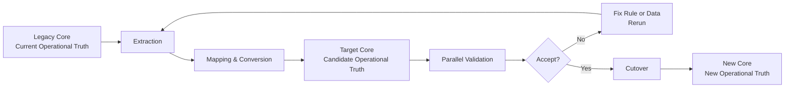
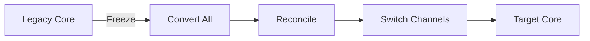
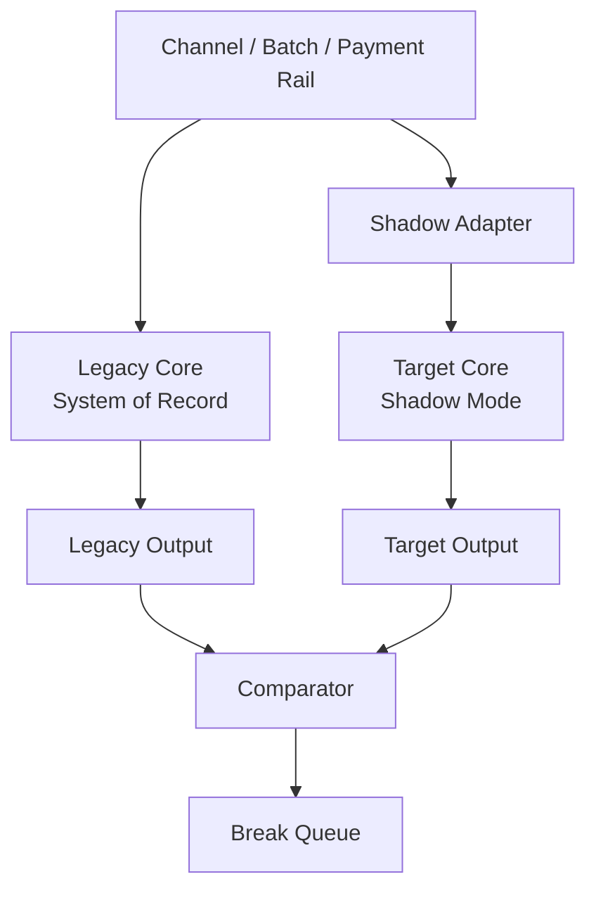
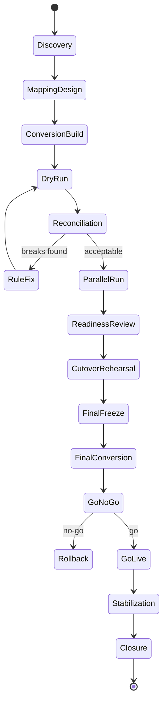
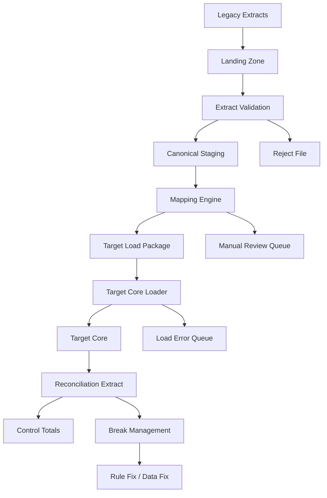
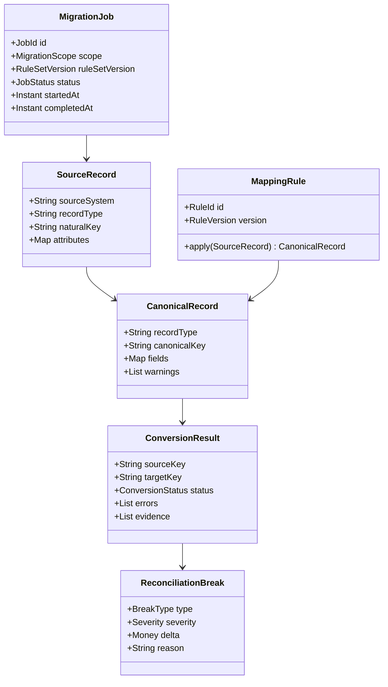
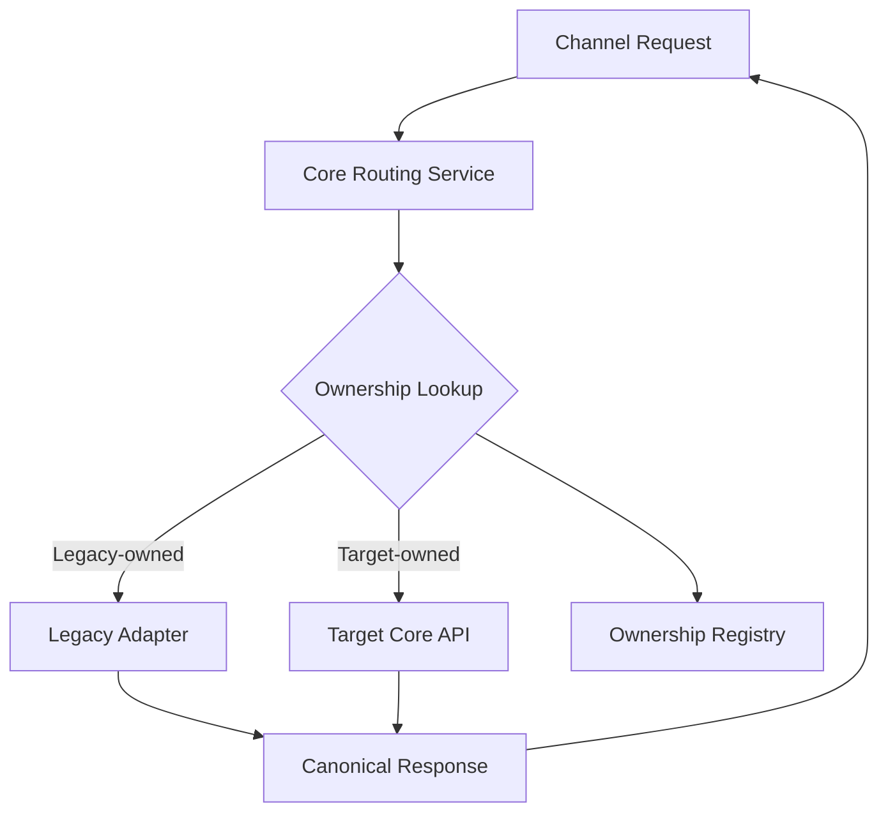
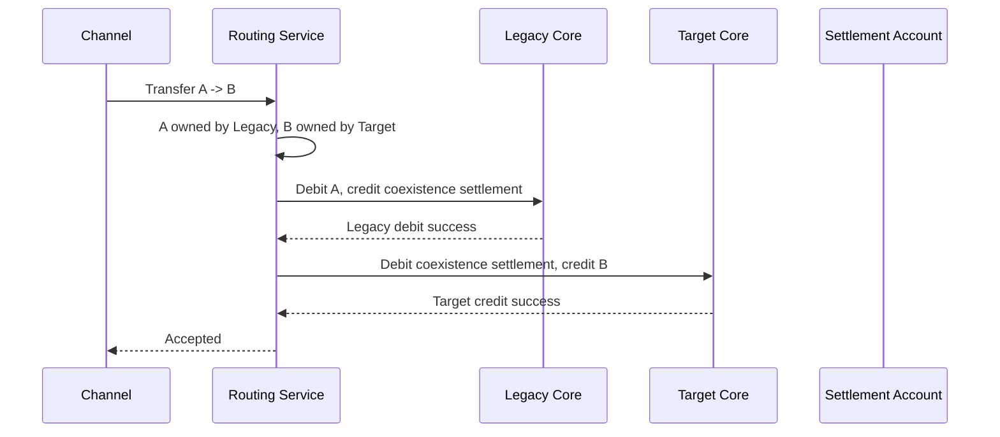
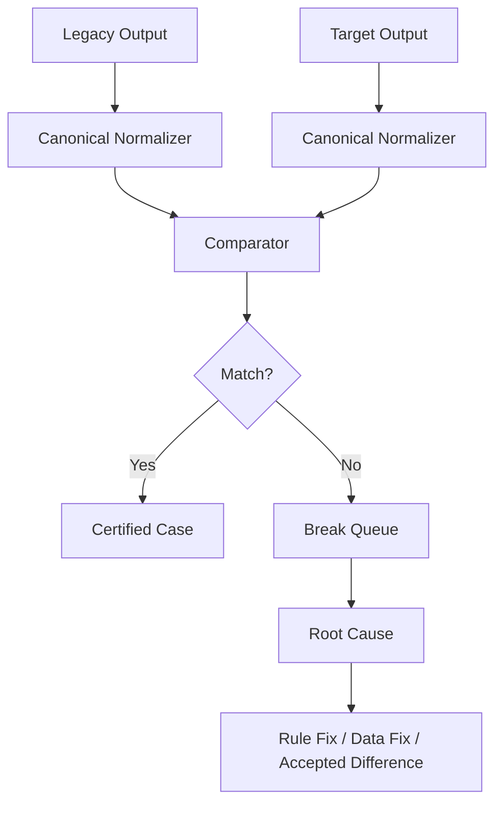
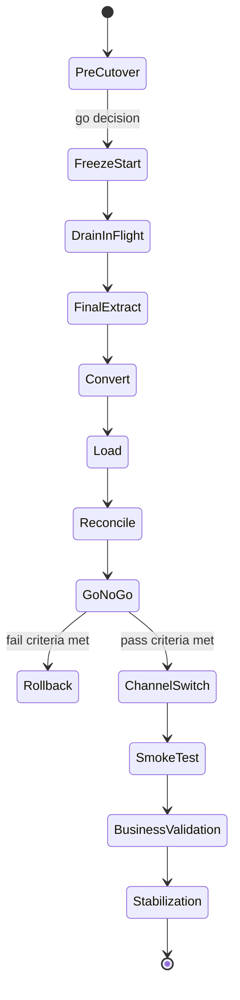

------
title: Learn Java Core Banking System - Part 033
description: Migration, coexistence, data conversion, parallel run, cutover governance, reconciliation, and fallback strategy for Java-based core banking modernization.
series: learn-java-core-banking-system
seriesTitle: Learn Java Core Banking System
order: 33
partTitle: Migration, Coexistence, Data Conversion, and Parallel Run
tags:
- java
- core-banking
- migration
- modernization
- data-conversion
- parallel-run
- cutover
- reconciliation
- banking-architecture
date: 2026-06-28
---

# Part 033 — Migration, Coexistence, Data Conversion, and Parallel Run

Core banking migration is not a normal application migration.

A normal migration asks:

> Can the new system serve the same features?

A core banking migration asks:

> Can the new system preserve customer value, legal obligations, accounting truth, product behavior, operational evidence, and regulatory explainability while the institution keeps running?

That difference changes everything.

A top engineer should not think of migration as a one-time ETL job. In a bank, migration is a controlled risk program. The code matters, but the real system includes mapping rules, reconciliation, sign-off, rollback policy, customer communication, branch operations, regulatory reporting, audit evidence, and post-cutover stabilization.

This part focuses on how to migrate or modernize a Java-based core banking system without destroying ledger truth.

---

## 1. Kaufman Deconstruction

Using the Kaufman learning model, we break the migration skill into sub-skills that can be practiced separately.

| Sub-skill | What you must be able to do |
|---|---|
| Domain inventory | Identify all data domains required to open the new core safely. |
| Source-of-truth analysis | Decide which legacy system owns which fact. |
| Mapping design | Convert legacy concepts into target canonical concepts. |
| Ledger migration | Move balances/history without breaking accounting invariants. |
| Coexistence design | Run old and new systems together for a period. |
| Parallel run | Compare outputs from old and new systems before cutover. |
| Reconciliation | Prove migrated data and financial totals are correct. |
| Cutover governance | Control freeze, switch, fallback, sign-off, and stabilization. |
| Evidence packaging | Produce repeatable proof for audit, operations, and regulators. |

The goal is not to memorize migration patterns. The goal is to develop judgment about **which data can be transformed, which data must be preserved, which data can be summarized, and which data must never be guessed**.

---

## 2. Core Mental Model

A core banking migration is a transition between two operational truths.



The target core is not the truth merely because data was loaded into it. It becomes the truth only after:

1. balances reconcile,
2. product behavior is validated,
3. operational workflows are ready,
4. reporting extracts are verified,
5. exception handling is staffed,
6. cutover is approved,
7. fallback decision is explicit,
8. post-cutover breaks are controlled.

---

## 3. Why Core Banking Migration Fails

Most migration failures are not caused by Java syntax, frameworks, or database drivers. They are caused by weak domain control.

Common failure causes:

| Failure | Root cause |
|---|---|
| Migrated balance does not match legacy | Missing holds, interest accrual, pending transactions, or product-specific adjustment. |
| Customer sees wrong available balance | Ledger balance migrated, but blocked/float/uncleared balance omitted. |
| GL totals do not reconcile | Account-to-GL mapping changed silently or suspense accounts ignored. |
| Product behaves differently after cutover | Product parameters were copied but not behaviorally certified. |
| EOD fails after go-live | Business date, accrual state, maturity state, and batch checkpoint were not migrated. |
| Duplicate transactions appear | Idempotency and natural business keys were not preserved. |
| Old and new systems diverge during coexistence | Bi-directional sync without clear ownership. |
| Rollback becomes impossible | Cutover changed external rails or downstream systems irreversibly. |
| Audit cannot explain numbers | Conversion rule, source snapshot, and reconciliation evidence were not retained. |

A migration plan that says “export CSV, import database, test APIs” is not a core banking migration plan.

---

## 4. Migration Strategy Options

There is no universally best strategy. There is only the strategy that fits risk appetite, product complexity, regulatory tolerance, operational readiness, and integration constraints.

### 4.1 Big Bang

All accounts/products move at one cutover event.



Use when:

- legacy coexistence is impossible,
- product set is small,
- external integrations cannot be split,
- bank accepts concentrated cutover risk,
- rehearsal discipline is extremely strong.

Risks:

- high blast radius,
- rollback may be difficult,
- operations team faces all new workflows at once,
- reconciliation window can exceed business tolerance.

### 4.2 Product-by-Product Migration

Move product families separately: savings first, then current accounts, then term deposits, then loans.

Use when:

- products have clean boundaries,
- channels can route by product,
- GL and reporting can support split-core operation,
- customer experience can tolerate partial migration.

Risks:

- customer can own accounts in both cores,
- internal transfer across cores becomes complex,
- reporting needs aggregation across old and new systems,
- fees/limits may depend on cross-product relationship.

### 4.3 Branch-by-Branch or Segment-by-Segment Migration

Move customers/accounts based on branch, region, segment, or legal entity.

Use when:

- operations are branch-oriented,
- account relationships are mostly local,
- business wants controlled rollout.

Risks:

- customer with accounts across branches creates split ownership,
- centralized channels become routing-heavy,
- enterprise risk/reporting has to aggregate across both cores.

### 4.4 Shadow Ledger / Parallel Posting

The target core receives shadow transactions while legacy remains system of record.



Use when:

- target posting engine must be certified against real traffic,
- bank can afford dual processing infrastructure,
- comparator and break analysis are mature.

Risks:

- target must receive semantically equivalent input,
- legacy behavior may include hidden manual corrections,
- divergence analysis can become overwhelming.

### 4.5 Strangler / Incremental Replacement

Wrap legacy with an anti-corruption layer and gradually move capabilities.

Use when:

- legacy must remain for years,
- API boundary can be stabilized,
- bank wants capability-by-capability modernization.

Risks:

- strangler can become a permanent distributed monolith,
- business ownership can remain unclear,
- data duplication can grow without retirement discipline.

Martin Fowler describes related patterns such as incremental migration and parallel change, where old and new structures coexist temporarily to reduce risk during incompatible changes.

---

## 5. Data Domain Inventory

A core migration must inventory data by domain, not by table.

| Domain | Examples | Migration concern |
|---|---|---|
| Party | customer, legal entity, address, KYC status | Identity matching, duplicates, privacy, source ownership. |
| Account | account number, type, status, branch, currency | Lifecycle, restrictions, closure, dormant state. |
| Agreement | contract, product terms, rate, schedule | Effective-dated behavior, legal trace. |
| Product | product code, parameters, pricing, accounting map | Version compatibility and behavior certification. |
| Ledger | journal, posting line, balance, statement | Accounting invariant and opening position. |
| Holds/Liens | blocked amount, lien reason, expiry | Available balance correctness. |
| Interest | accrued amount, rate basis, last accrual date | EOD continuity and payoff accuracy. |
| Fees/Taxes | unpaid fee, waived fee, tax history | Customer statement and regulatory reporting. |
| Payment | pending instruction, settlement status | In-flight transaction handling. |
| GL Interface | chart mapping, control account, GL batch | Financial statement continuity. |
| Operations | exception cases, approvals, overrides | Workflow continuity and evidence. |
| Audit | actor, timestamp, source, reason | Legal defensibility. |
| Reporting | extracts, risk attributes, regulatory fields | Historical comparability and lineage. |

A table-to-table mapping document is not enough. You need a domain migration catalog that explains **meaning**, **owner**, **quality**, **migration rule**, **reconciliation control**, and **fallback behavior**.

---

## 6. Source-of-Truth Matrix

During migration, the hardest question is often:

> Which system owns this fact right now?

Create a source-of-truth matrix.

| Fact | Before shadow | During shadow | During freeze | After cutover |
|---|---|---|---|---|
| Customer legal name | CIF/CRM | CIF/CRM | Frozen or controlled update | Target party service or CRM |
| Account lifecycle | Legacy core | Legacy core | Frozen except emergency | Target core |
| Ledger balance | Legacy core | Legacy core | Final extracted snapshot | Target ledger |
| Shadow balance | None | Target shadow | Reconciled candidate | Promoted or discarded |
| Product parameter | Legacy product table | Controlled config repo | Frozen version | Target product catalog |
| Interest accrual | Legacy EOD | Legacy EOD + target simulation | Final accrual snapshot | Target EOD |
| Payment status | Legacy core/payment hub | Legacy owns final status | Controlled drain | Target/payment hub |
| GL extract | Legacy core | Legacy + target comparison | Final legacy GL | Target GL interface |

Never let two systems be authoritative for the same financial fact without a deterministic conflict rule.

---

## 7. Migration Lifecycle

A disciplined migration usually follows this lifecycle.



Each state should have entry criteria, exit criteria, evidence, owner, and rollback condition.

---

## 8. Discovery: What to Extract Before Coding

Before writing conversion code, extract domain knowledge.

Ask these questions:

1. Which products exist today?
2. Which products are no longer sold but still active?
3. Which accounts have custom terms?
4. Which manual adjustments exist outside normal workflows?
5. Which balances are derived vs stored?
6. Which pending transactions can change during cutover?
7. Which GL accounts are used for suspense/control/settlement?
8. Which fields are trusted, stale, or manually overridden?
9. Which legacy bugs must be preserved for continuity?
10. Which legacy bugs must be corrected with business approval?

Migration is often where undocumented business rules are discovered.

A good migration team treats legacy data as a forensic artifact, not as clean input.

---

## 9. Mapping Rule Design

A mapping rule is not just a transformation. It is a controlled decision.

A robust rule contains:

| Field | Meaning |
|---|---|
| Rule ID | Stable identifier for traceability. |
| Source field | Legacy field/table/extract. |
| Target field | Target canonical field. |
| Transformation | Deterministic conversion logic. |
| Validation | Rule that must pass after conversion. |
| Exception handling | What happens if input is invalid. |
| Owner | Business/technology owner. |
| Approval | Sign-off status. |
| Effective scope | Product/account/customer subset. |
| Evidence | Sample cases and reconciliation proof. |

Example:

```yaml
ruleId: MIG-ACC-STATUS-004
source: legacy_account.status_code
target: account.lifecycle_state
mapping:
  "A": ACTIVE
  "I": DORMANT
  "C": CLOSED
  "B": BLOCKED
validation:
  - closed accounts must have zero available balance
  - dormant accounts cannot have debit-enabled channel access
exception:
  unknown_code: route_to_manual_review
owner: Core Banking Migration Squad
approvedBy: Deposit Product Owner
```

Rules should be versioned. If a dry run changes a rule, the resulting data set must be traceable to the exact rule version.

---

## 10. Canonical Migration Architecture



Important boundaries:

- **Landing Zone** preserves raw source extracts.
- **Canonical Staging** normalizes legacy formats but does not invent banking truth.
- **Mapping Engine** applies approved transformation rules.
- **Target Load Package** is deterministic and replayable.
- **Target Core Loader** enforces target invariants.
- **Reconciliation Extract** proves the loaded result.

Do not load directly from ad hoc CSV into target production tables. That bypasses invariant enforcement and destroys evidence.

---

## 11. Java Component Model

A migration tool should look more like a controlled processing platform than a script pile.



Example value objects:

```java
public record MigrationRunId(String value) {
    public MigrationRunId {
        if (value == null || value.isBlank()) {
            throw new IllegalArgumentException("migration run id is required");
        }
    }
}

public record SourceKey(
        String sourceSystem,
        String recordType,
        String naturalKey
) {}

public record RuleReference(
        String ruleId,
        int version
) {}

public record ConversionEvidence(
        SourceKey sourceKey,
        String targetKey,
        RuleReference rule,
        String decision,
        String explanation
) {}
```

The goal is not object-model beauty. The goal is repeatability and explanation.

---

## 12. Migration Batch Semantics

A migration batch should be immutable once produced.

```java
public record MigrationBatch(
        MigrationRunId runId,
        String scope,
        int sequenceNumber,
        String sourceSnapshotId,
        String ruleSetVersion,
        String contentHash,
        Instant createdAt
) {}
```

A batch should answer:

- Which source snapshot was used?
- Which mapping rules were used?
- Which records were included?
- Which records were rejected?
- What was the output hash?
- Who approved the batch?
- Which reconciliation report validates it?

Avoid “latest extract” semantics. Use stable snapshot identifiers.

---

## 13. Ledger Migration Strategies

Ledger migration is the center of risk.

### 13.1 Opening Balance Only

Load each account with a starting balance as of cutover.

Pros:

- simpler,
- faster,
- less storage,
- avoids importing dirty legacy history.

Cons:

- historical statement reconstruction remains in legacy/archive,
- regulatory/audit queries may span systems,
- product calculations needing historical average balance need additional snapshots.

Use when:

- historical ledger remains accessible,
- legal archive is accepted,
- new core only needs current position.

### 13.2 Full Transaction History Migration

Import historical transactions into the new ledger.

Pros:

- unified customer history,
- easier statement and inquiry,
- less dependence on legacy archive.

Cons:

- legacy transaction semantics may not match target model,
- old corrections may violate new invariants,
- high volume,
- high reconciliation complexity.

Use only when history quality is high and business value justifies risk.

### 13.3 Synthetic Opening Journal

Create a balanced journal that establishes current position.

Example:

| Account | Debit | Credit |
|---|---:|---:|
| Customer Liability Control | 0 | 1,000,000 |
| Migration Suspense / Opening Equity | 1,000,000 | 0 |

This gives the target ledger a clean accounting start while retaining legacy historical archive externally.

### 13.4 Hybrid Strategy

Use opening balances for most accounts, detailed history for selected products or recent period.

Example:

- migrate last 18 months of statement entries,
- load opening balance before that period,
- retain older archive in immutable inquiry store.

This is often more practical than full history migration.

---

## 14. Balance Migration: More Than One Number

Never migrate only `balance`.

A banking account can have many financial positions.

| Balance concept | Migration requirement |
|---|---|
| Ledger balance | Must match accounting truth as of cutover. |
| Available balance | Must include holds, liens, float, overdraft, restrictions. |
| Accrued interest | Must continue from correct last accrual date. |
| Uncleared funds | Must preserve clearing lifecycle. |
| Blocked amount | Must preserve reason, expiry, actor, legal basis. |
| Minimum balance | Must preserve product rule and customer exception. |
| Overdraft limit | Must preserve approved limit and expiry. |
| Pending fees | Must avoid duplicate charging after go-live. |
| Tax withholding | Must preserve period-to-date reporting state. |

An account can reconcile on ledger balance but still be wrong from customer perspective.

Example:

```text
Legacy ledger balance     = 10,000,000
ATM authorization hold    = 1,500,000
Legal lien                = 2,000,000
Available balance         = 6,500,000
```

If target migrates only `10,000,000`, the customer may withdraw money that should be blocked.

---

## 15. Product Migration

Products are not just labels. They are behavior.

For each product, certify:

| Behavior | Example validation |
|---|---|
| Eligibility | Existing customers remain valid even if new-sale criteria changed. |
| Pricing | Fees/rates match legacy for migrated accounts. |
| Interest | Accrual and capitalization continue from correct state. |
| Statement | Statement cycle and numbering remain correct. |
| Restrictions | Dormant/blocked/legal-hold states behave correctly. |
| Tax | Period-to-date and year-to-date values remain consistent. |
| GL mapping | Accounting events post to correct target accounts. |
| Maturity | Term deposit or loan schedule continues correctly. |

Legacy product behavior often includes exceptions:

- grandfathered rates,
- branch-specific pricing,
- customer-level waivers,
- old products no longer sold,
- manual overrides,
- regulatory remediation rules.

A clean product catalog is not enough. You need migrated agreements to point to the correct product version and exception set.

---

## 16. In-Flight Transaction Handling

Cutover must deal with transactions that started before cutover but complete after cutover.

Examples:

- card authorization not yet settled,
- outgoing payment sent but not acknowledged,
- incoming payment received but not credited,
- cheque deposited but not cleared,
- batch file accepted but not posted,
- EOD accrual generated but GL not extracted,
- fee pending approval,
- dispute/chargeback in progress.

Possible strategies:

| Strategy | Description | Risk |
|---|---|---|
| Drain | Stop intake and let pending items complete before final extract. | Longer freeze window. |
| Migrate pending state | Load in-flight state into target. | Complex mapping. |
| Complete in legacy | Legacy remains responsible for selected pending flows. | Coexistence complexity. |
| Cancel/reissue | Cancel legacy instruction and recreate in target. | Customer/rail impact. |

Do not treat pending transactions as edge cases. They are often the main reason cutover weekends fail.

---

## 17. Coexistence Architecture

If old and new cores coexist, routing must be explicit.



The ownership registry should be controlled and auditable.

Example:

```java
public enum CoreOwner {
    LEGACY,
    TARGET
}

public record AccountOwnership(
        String accountId,
        CoreOwner owner,
        Instant effectiveFrom,
        String migrationRunId,
        String approvedBy
) {}
```

Rules:

- Every account must have one owner for posting.
- Cross-core transfer must have a controlled settlement pattern.
- Reporting must aggregate both owners.
- Customer inquiry must explain split ownership cleanly.
- Ownership changes must be audit events.

---

## 18. Cross-Core Transfer Pattern

During coexistence, internal transfer may cross systems.



The danger is partial success.

Safer approaches:

- use a controlled payment/settlement bridge,
- post to inter-core settlement accounts,
- reconcile inter-core settlement daily,
- design compensation and repair workflow,
- expose pending state to customers when finality is not immediate.

Do not pretend cross-core transfer is an ACID transaction unless both cores are under a single transactional boundary, which is rarely true.

---

## 19. Parallel Run Design

Parallel run compares old and new behavior before target becomes system of record.

### 19.1 What to Compare

| Output | Compare method |
|---|---|
| Account balance | Per-account and aggregate control totals. |
| Available balance | Include holds, liens, overdraft, float. |
| Statement entries | Canonical transaction equivalence. |
| Interest accrual | Per-account daily accrual delta threshold. |
| Fees | Event trigger and amount. |
| GL extract | Account-level and GL-code-level totals. |
| Reports | Row count, totals, sampled detail trace. |
| Payment status | Lifecycle status mapping. |
| Exceptions | Reject/repair cases and reasons. |

### 19.2 Comparator Architecture



The comparator should classify differences:

| Difference type | Meaning |
|---|---|
| Data conversion break | Source data mapped incorrectly. |
| Rule behavior break | Target product logic differs. |
| Accepted legacy bug fix | Difference approved as intentional correction. |
| Timing break | Difference caused by cutoff/date/window. |
| Precision break | Rounding/scale/day-count mismatch. |
| Missing dependency | Reference data or pending state absent. |
| Unknown | Must be investigated before go-live. |

### 19.3 Accepted Difference Register

Not every difference is wrong. Some are intentional corrections.

But every accepted difference must be documented.

```yaml
breakId: PAR-INT-2026-000441
accountId: "***masked***"
domain: INTEREST_ACCRUAL
legacyAmount: 1203.77
targetAmount: 1203.78
delta: 0.01
rootCause: Legacy rounded per segment; target rounds at daily account total.
decision: ACCEPTED_DIFFERENCE
approvedBy: Product Owner + Finance Control
customerImpact: None below disclosure threshold.
regulatoryImpact: None.
evidence: reconciliation-report-2026-06-21.csv
```

---

## 20. Reconciliation Control Totals

A migration without control totals is just hope.

Control totals should exist at multiple levels.

| Level | Example |
|---|---|
| Record count | number of accounts by product/status/currency. |
| Balance total | total ledger balance by product/currency/branch. |
| GL total | total mapped by GL account. |
| Customer count | unique active customers. |
| Restriction count | active holds/liens/blocks. |
| Interest total | accrued interest by product. |
| Fee total | unpaid/pending fees by fee type. |
| Tax total | withholding by period. |
| Exception count | rejected/manual-review records. |

Example reconciliation report:

```text
Scope: Savings Accounts / IDR / Active
Legacy account count:       1,208,003
Target account count:       1,208,003
Legacy ledger total:        4,812,990,120,330
Target ledger total:        4,812,990,120,330
Delta:                      0
Legacy blocked total:       18,120,000,000
Target blocked total:       18,120,000,000
Delta:                      0
Status:                     PASS
```

Control totals must be reproducible from immutable extracts.

---

## 21. Cutover Planning

Cutover is an operational state machine, not a calendar event.



Each transition must have owner and evidence.

### 21.1 Cutover Entry Criteria

- all critical dry-run breaks closed,
- parallel run exit threshold passed,
- target infra capacity certified,
- business users trained,
- repair workbench staffed,
- rollback plan rehearsed,
- customer communication prepared,
- external partners notified,
- regulatory/reporting owners signed off,
- final rule set frozen.

### 21.2 Go/No-Go Criteria

Go-live should not depend on optimism. It should depend on thresholds.

Example:

| Criterion | Threshold |
|---|---|
| Account count reconciliation | 100% for in-scope active accounts. |
| Ledger balance delta | zero by currency/product/control account. |
| Available balance delta | zero except approved difference register. |
| GL extract total | zero delta by GL code. |
| Critical defects | zero open severity-1/severity-2. |
| EOD dry run | pass final rehearsal. |
| Channel smoke test | pass all critical journeys. |
| Fallback readiness | approved and timed. |

---

## 22. Rollback and Fallback

Rollback means restoring the old system of record after failed cutover.

Fallback means switching to a degraded or alternate operating mode.

They are different.

| Concept | Example |
|---|---|
| Rollback | Channels route back to legacy core; target loaded data discarded. |
| Fallback | Branches operate in offline/manual mode while core is repaired. |
| Forward fix | Go-live continues while known issue is corrected with controlled repair. |
| Partial rollback | Selected product/branch remains legacy-owned. |

Rollback is only possible before irreversible external effects occur.

Irreversible effects include:

- outbound payments sent,
- card authorization responses issued,
- customer-visible balance changes consumed,
- GL extracts booked,
- regulatory reports submitted,
- statement cycles generated.

A mature cutover plan defines a **rollback deadline**: the latest point where rollback is still feasible.

---

## 23. Data Quality Gates

Data quality should be enforced before target load.

Example gates:

| Gate | Failure handling |
|---|---|
| Required field missing | reject or manual review. |
| Invalid currency | reject. |
| Unknown product code | manual mapping approval. |
| Negative balance where prohibited | manual investigation. |
| Closed account with active hold | business remediation. |
| Duplicate account number | identity resolution. |
| Last accrual date after cutover date | reject. |
| Unbalanced migrated journal | reject batch. |
| Dormant account with active channel access | remediation. |

Gate failures should create cases, not disappear into logs.

---

## 24. Handling Legacy Data Defects

Legacy defects are inevitable.

Classify them:

| Defect type | Example | Treatment |
|---|---|---|
| Harmless formatting | inconsistent phone format | normalize. |
| Missing non-critical data | missing occupation | migrate with warning. |
| Financial inconsistency | ledger total mismatch | block migration until resolved. |
| Legal uncertainty | missing contract evidence | legal/business review. |
| Product ambiguity | unknown old product code | manual mapping. |
| Historical bug | old incorrect interest calculation | accepted difference or remediation. |

The worst approach is silent correction.

If a financial defect is corrected during migration, the correction itself must be an approved business event with evidence.

---

## 25. Migration Loader Design

The target loader should call domain services or controlled load APIs, not bypass invariants.

Bad:

```sql
INSERT INTO account_balance(account_id, ledger_balance)
VALUES ('A123', 1000000);
```

Better:

```java
public interface MigrationLedgerLoader {
    LoadResult loadOpeningPosition(OpeningPositionPackage pack);
}

public record OpeningPositionPackage(
        String accountId,
        String currency,
        BigDecimal ledgerBalance,
        BigDecimal availableBalance,
        List<HoldSnapshot> holds,
        List<AccrualSnapshot> accruals,
        MigrationEvidence evidence
) {}
```

The loader should validate:

- account exists,
- account state is compatible,
- currency matches,
- holds explain available balance,
- journal is balanced,
- opening position has migration evidence,
- load is idempotent for the same migration run.

---

## 26. Idempotent Loading

Migration reruns are normal. Loaders must be idempotent.

```java
public LoadResult load(MigrationBatch batch) {
    var existing = migrationBatchRepository.findByContentHash(batch.contentHash());

    if (existing.isPresent()) {
        return LoadResult.alreadyLoaded(existing.get().batchId());
    }

    return transactionTemplate.execute(tx -> {
        invariantValidator.validate(batch);
        targetWriter.write(batch);
        migrationBatchRepository.markLoaded(batch);
        return LoadResult.loaded(batch.runId());
    });
}
```

Never depend on “we will only click it once.”

---

## 27. Migration Evidence Pack

Each run should produce an evidence pack.

Minimum content:

- source snapshot identifiers,
- source extract hashes,
- mapping rule set version,
- conversion logs,
- rejected records,
- manual review decisions,
- target load package hash,
- load result,
- reconciliation report,
- accepted difference register,
- sign-off record,
- rollback decision record.

This pack is not bureaucracy. It is how the migration can be defended months or years later.

---

## 28. Observability for Migration

Migration observability should be business-aware.

Metrics:

| Metric | Meaning |
|---|---|
| `migration.records.extracted` | raw source volume. |
| `migration.records.converted` | successfully mapped records. |
| `migration.records.rejected` | failed conversion. |
| `migration.control.balance.delta` | financial mismatch. |
| `migration.breaks.open` | unresolved reconciliation breaks. |
| `migration.load.duration` | loader performance. |
| `migration.batch.idempotent_replay` | rerun behavior. |
| `migration.manual_review.age` | operational backlog. |

Logs must include migration run ID, source snapshot ID, rule version, and target load package ID.

Traces are useful when loading touches multiple services, but the business evidence pack remains the primary proof.

---

## 29. Anti-Patterns

| Anti-pattern | Why it is dangerous |
|---|---|
| Table-copy migration | Copies storage shape, not domain meaning. |
| Last-minute mapping spreadsheet | No versioning, no tests, no traceability. |
| Manual SQL fixes in target | Bypasses invariants and audit. |
| Migrate only ledger balance | Breaks availability, holds, interest, and product continuity. |
| Bi-directional sync without owner | Creates conflicting truths. |
| Ignore small rounding deltas | Small deltas become unreconciled GL noise. |
| No accepted difference register | Nobody knows which mismatches were intentional. |
| Cutover without rollback deadline | Team discovers too late that rollback is impossible. |
| Parallel run without break triage capacity | Differences pile up faster than they can be analyzed. |
| Success defined by “system starts” | Core migration success means financial and operational correctness, not uptime alone. |

---

## 30. Review Checklist

Before approving a migration design, ask:

1. What is the system of record for each financial fact during each phase?
2. Which data is migrated as history, opening position, or archive reference?
3. How are holds, liens, pending items, and accrual states handled?
4. How are product exceptions and grandfathered terms preserved?
5. How does cross-core transfer work during coexistence?
6. What are the reconciliation levels and thresholds?
7. What are the go/no-go criteria?
8. What is the rollback deadline?
9. Which differences are accepted and who approved them?
10. Can the entire migration run be reproduced from immutable inputs?
11. Can audit trace a target field back to source and mapping rule?
12. What customer-visible issues may occur after go-live?
13. What operational workbench handles post-cutover breaks?
14. What is the stabilization command center model?
15. What must be retired after migration to avoid permanent complexity?

---

## 31. Practice Lab

Design a migration plan for this simplified bank:

- 2 million savings accounts,
- 300,000 current accounts,
- 80,000 term deposits,
- 120,000 retail loans,
- one legacy core,
- separate card switch,
- payment hub already ISO 20022-capable,
- GL system remains unchanged,
- target Java core uses relational ledger with append-only journal,
- bank wants product-by-product migration.

Deliverables:

1. source-of-truth matrix,
2. migration domain inventory,
3. ledger migration strategy,
4. in-flight transaction strategy,
5. cross-core transfer design,
6. parallel run comparator design,
7. reconciliation control totals,
8. go/no-go criteria,
9. rollback deadline,
10. evidence pack structure.

---

## 32. Mini ADR

```md
# ADR: Use Opening Balance plus Recent Statement History for Deposit Migration

## Context
The legacy core contains 12 years of transaction history. Older records have inconsistent correction semantics. Business requires customer statement inquiry for the last 24 months in the new channel.

## Decision
Migrate:
- current financial position as balanced opening journal,
- last 24 months of statement entries as inquiry history,
- all older transaction history into immutable archive searchable by account/customer.

## Consequences
Positive:
- target ledger starts from clean opening position,
- customer can view recent history in new channels,
- legacy semantic defects are isolated in archive.

Negative:
- historical reconstruction before 24 months requires archive lookup,
- customer service tools need archive integration,
- regulatory evidence must include archive retention controls.

## Controls
- opening balances reconcile by product/currency/GL code,
- statement history count and totals reconcile for 24-month scope,
- archive extract hashes retained in evidence pack.
```

---

## 33. Key Takeaways

- Core banking migration is a financial control program, not a data-copy exercise.
- Migration success means ledger truth, product behavior, operational continuity, and audit evidence are preserved.
- Source-of-truth ownership must be explicit for every phase.
- Balance migration must include available balance semantics, holds, liens, accruals, and pending items.
- Parallel run is useful only if differences are normalized, classified, triaged, and approved.
- Cutover must have objective go/no-go criteria and a clear rollback deadline.
- Every loaded number must be traceable to source snapshot, mapping rule, load package, and reconciliation report.

---

## References

- FFIEC Architecture, Infrastructure, and Operations booklet: https://ithandbook.ffiec.gov/it-booklets/architecture,-infrastructure,-and-operations.aspx
- OCC Bulletin 2021-30 on FFIEC AIO: https://www.occ.gov/news-issuances/bulletins/2021/bulletin-2021-30.html
- Basel Committee BCBS 239: https://www.bis.org/publ/bcbs239.pdf
- Martin Fowler, Parallel Change: https://martinfowler.com/bliki/ParallelChange.html
- Martin Fowler, Incremental Migration: https://martinfowler.com/bliki/IncrementalMigration.html
- ISO 20022 Message Definitions: https://www.iso20022.org/iso-20022-message-definitions
