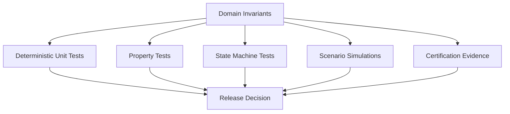
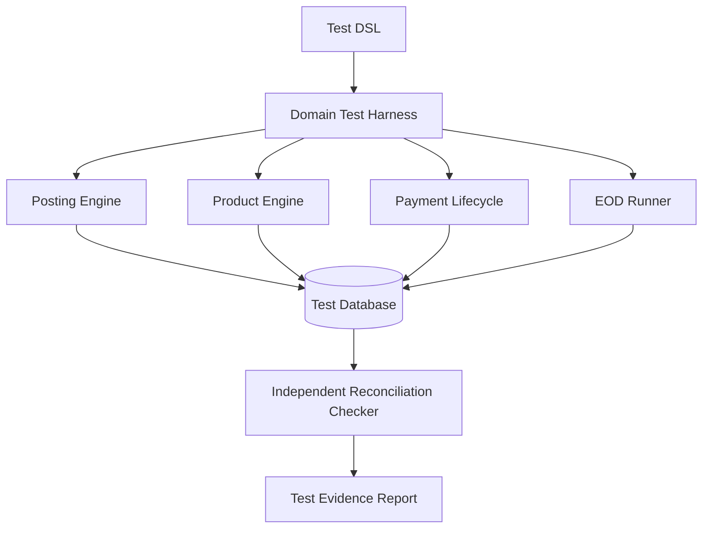
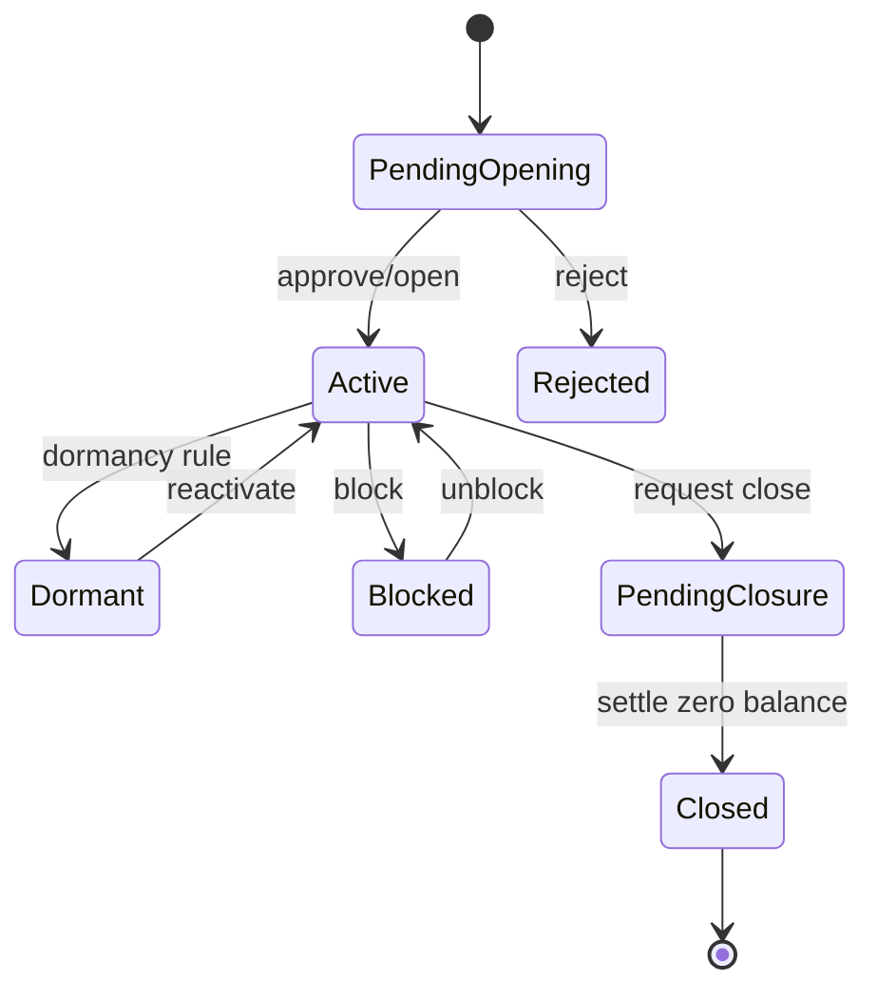

------
title: Learn Java Core Banking System - Part 034
description: Testing, certification, simulation, property-based tests, state-machine tests, reconciliation tests, and release evidence for Java core banking systems.
series: learn-java-core-banking-system
seriesTitle: Learn Java Core Banking System
order: 34
partTitle: Testing, Certification, Simulation, and Ledger Property Tests
tags:
- java
- core-banking
- testing
- property-based-testing
- certification
- simulation
- ledger
- reconciliation
- quality-engineering
- release-readiness
date: 2026-06-28
---

# Part 034 — Testing, Certification, Simulation, and Ledger Property Tests

Core banking testing is not about proving that methods return expected values for a few examples.

It is about proving that the system preserves financial invariants under variation, concurrency, failure, retry, correction, migration, EOD, integration latency, and operational intervention.

A weak test suite asks:

> Does this example pass?

A strong core banking certification suite asks:

> Which invariants must always hold, how can they break, and what evidence proves that they did not break in this release?

This part focuses on testing a Java core banking system as a regulated financial engine.

---

## 1. Kaufman Deconstruction

Break the testing skill into sub-skills:

| Sub-skill | What you must be able to do |
|---|---|
| Invariant discovery | Identify properties that must always hold. |
| Scenario modeling | Encode realistic banking journeys. |
| Property-based testing | Generate many valid and invalid financial cases. |
| State-machine testing | Verify lifecycle transitions across operations. |
| Ledger certification | Prove double-entry, balance, reversal, and snapshot correctness. |
| Batch/EOD simulation | Validate operational runs and reruns. |
| Integration contracts | Verify channel/payment/GL boundaries. |
| Migration certification | Prove converted data is correct and explainable. |
| Evidence packaging | Produce release proof, not just green tests. |

The goal is to move from “test cases” to “testable financial truth”.

---

## 2. Testing Philosophy for Core Banking

A core banking test suite should be built around five layers of confidence.



The most important question is not “what is covered?” but:

> Which failure would cause customer money, accounting totals, legal evidence, or regulatory numbers to be wrong, and do we test against it?

---

## 3. Core Banking Test Taxonomy

| Test type | Purpose | Example |
|---|---|---|
| Unit test | Verify deterministic domain rule. | Fee calculation, state transition, day-count. |
| Property test | Verify invariant across many generated inputs. | Every balanced posting batch sums to zero. |
| State-machine test | Verify lifecycle validity. | Account cannot go from CLOSED to ACTIVE. |
| Contract test | Verify boundary compatibility. | Payment status mapping, API error contract. |
| Integration test | Verify persistence/transaction behavior. | Journal commit and balance snapshot update. |
| EOD simulation | Verify operational batch behavior. | Accrual rerun does not duplicate postings. |
| Reconciliation test | Verify independent totals match. | Journal sum equals balance snapshot. |
| Migration test | Verify converted data and control totals. | Legacy account count and balance totals match. |
| Failure injection test | Verify retry/unknown outcome handling. | DB timeout after commit. |
| Performance certification | Verify service under realistic load. | Hot account and batch throughput thresholds. |
| Audit evidence test | Verify traceability. | Posting has actor/source/reason/correlation. |

A mature system uses all of these, but not all at the same frequency.

---

## 4. What Must Be Tested as Invariants

Examples of invariant families:

### 4.1 Accounting Invariants

- every journal entry is balanced,
- every posting batch has debit/credit equality per currency,
- every posting line maps to a valid ledger account,
- reversal plus original transaction nets to zero,
- GL extract totals match subledger totals,
- suspense balance is explainable by open breaks.

### 4.2 Balance Invariants

- account ledger balance equals sum of committed posting lines plus opening position,
- available balance is derived from ledger balance, holds, liens, float, and overdraft policy,
- blocked amount cannot exceed explainable restrictions unless policy permits,
- closed account cannot accept normal customer postings,
- statement projection can be rebuilt from ledger events.

### 4.3 Temporal Invariants

- posting date is never missing,
- value date follows product and rail rules,
- business date progression is controlled,
- EOD run is idempotent for a business date,
- backdated corrections produce explicit adjustment events,
- rate/product parameter lookup is effective-date aware.

### 4.4 Operational Invariants

- maker cannot approve own maker-checker action,
- every override has reason and authority snapshot,
- repair action does not mutate original event invisibly,
- exception closure requires outcome classification,
- audit trail is append-only.

### 4.5 Integration Invariants

- external message ID maps to exactly one internal intent,
- idempotent retry does not duplicate financial effect,
- unknown outcome is recoverable,
- outbox event is emitted only for committed transaction,
- inbound rail status cannot regress illegally.

---

## 5. Test Architecture



Important idea:

> The checker should not merely call the same production service that produced the data.

If the posting engine produced a wrong balance, and your test validates it using the same posting engine logic, the test may only prove that the bug is consistent.

For ledger certification, build independent checkers that recompute totals from primitive records.

---

## 6. Test DSL for Banking Scenarios

A domain DSL keeps tests readable.

```java
BankScenario scenario = bank()
    .businessDate("2026-06-28")
    .product("SAVINGS_STANDARD", p -> p
        .currency("IDR")
        .minimumBalance("50000")
        .monthlyFee("10000"))
    .customer("C-001", c -> c
        .openSavingsAccount("A-001", "SAVINGS_STANDARD")
        .deposit("A-001", money("IDR", "1000000"))
        .hold("A-001", money("IDR", "200000"), "ATM_AUTH")
        .withdraw("A-001", money("IDR", "700000")));

ScenarioResult result = scenario.run();

assertThat(result.account("A-001").ledgerBalance())
    .isEqualTo(money("IDR", "300000"));
assertThat(result.account("A-001").availableBalance())
    .isEqualTo(money("IDR", "100000"));
```

The DSL should express banking intent, not database mechanics.

---

## 7. Deterministic Clock and Business Calendar

Core banking tests must control time.

Bad:

```java
Instant now = Instant.now();
```

Better:

```java
public interface BusinessClock {
    LocalDate businessDate();
    Instant instant();
}

public final class FixedBusinessClock implements BusinessClock {
    private final LocalDate businessDate;
    private final Instant instant;

    public FixedBusinessClock(LocalDate businessDate, Instant instant) {
        this.businessDate = businessDate;
        this.instant = instant;
    }

    @Override
    public LocalDate businessDate() {
        return businessDate;
    }

    @Override
    public Instant instant() {
        return instant;
    }
}
```

Every test involving value date, posting date, EOD, interest, maturity, dormancy, or cutoff must use controlled time.

---

## 8. Money Test Discipline

Money bugs often hide in scale, rounding, and currency rules.

Test rules:

- do not use `double` for money,
- generate values across minor-unit boundaries,
- test zero, tiny, large, and maximum values,
- test different currencies separately,
- test rounding at rule boundary,
- test sum of rounded components vs rounded sum,
- test negative amount rejection where applicable,
- test currency mismatch rejection.

Example value object:

```java
public record Money(String currency, BigDecimal amount) {
    public Money {
        Objects.requireNonNull(currency);
        Objects.requireNonNull(amount);
        amount = amount.stripTrailingZeros();
    }

    public Money plus(Money other) {
        requireSameCurrency(other);
        return new Money(currency, amount.add(other.amount));
    }

    public Money negate() {
        return new Money(currency, amount.negate());
    }

    private void requireSameCurrency(Money other) {
        if (!currency.equals(other.currency)) {
            throw new IllegalArgumentException("currency mismatch");
        }
    }
}
```

---

## 9. Property-Based Testing

Property-based testing generates many inputs and checks whether a property always holds.

For Java, jqwik is a property-based testing engine on the JUnit platform. The same concept can also be implemented with other JVM testing libraries, but jqwik gives a clean mental model for examples.

Example: balanced journal property.

```java
import net.jqwik.api.*;

class JournalProperties {

    @Property
    void journalMustBalance(@ForAll("balancedJournals") JournalEntry journal) {
        assertThat(journal.totalDebits()).isEqualByComparingTo(journal.totalCredits());
        assertThat(journal.isBalanced()).isTrue();
    }

    @Provide
    Arbitrary<JournalEntry> balancedJournals() {
        Arbitrary<BigDecimal> amount = Arbitraries.bigDecimals()
            .between(BigDecimal.ONE, new BigDecimal("1000000000"))
            .ofScale(2);

        return amount.map(a -> new JournalEntry(List.of(
            PostingLine.debit("CASH", new Money("IDR", a)),
            PostingLine.credit("CUSTOMER_LIABILITY", new Money("IDR", a))
        )));
    }
}
```

Do not generate random garbage only. Generate valid financial structures and then mutate them to test rejection.

---

## 10. Property: Posting Idempotency

A retry must not duplicate financial effect.

```java
@Property
void postingWithSameIdempotencyKeyIsAppliedOnce(
        @ForAll("validTransferCommands") TransferCommand command
) {
    var key = IdempotencyKey.of("test-" + command.commandId());

    var first = postingService.post(command, key);
    var second = postingService.post(command, key);

    assertThat(second.transactionId()).isEqualTo(first.transactionId());

    var lines = journalRepository.findByIdempotencyKey(key);
    assertThat(lines).hasSize(first.journalLines().size());

    independentLedgerChecker.assertNoDuplicateFinancialEffect(key);
}
```

Also test the dangerous case:

```java
@Property
void sameIdempotencyKeyWithDifferentPayloadIsRejected(
        @ForAll("validTransferCommands") TransferCommand first,
        @ForAll("validTransferCommands") TransferCommand second
) {
    Assume.that(!first.equivalentTo(second));

    var key = IdempotencyKey.of("same-key");

    postingService.post(first, key);

    assertThatThrownBy(() -> postingService.post(second, key))
        .isInstanceOf(IdempotencyConflictException.class);
}
```

---

## 11. Property: Reversal Nets to Zero

```java
@Property
void reversalNetsOriginalTransactionToZero(
        @ForAll("postedTransactions") PostedTransaction tx
) {
    var reversal = reversalService.reverse(tx.transactionId(), Reason.of("test"));

    var originalLines = journalRepository.findLines(tx.transactionId());
    var reversalLines = journalRepository.findLines(reversal.transactionId());

    var net = MoneyAggregator.sumByCurrencyAndLedgerAccount(
        concat(originalLines, reversalLines)
    );

    assertThat(net.allAmounts()).allMatch(Money::isZero);
}
```

This property catches many subtle bugs:

- fee not reversed,
- tax not reversed,
- wrong currency,
- wrong GL account,
- partial reversal not represented explicitly,
- reversal posted with new value date incorrectly.

---

## 12. Property: Snapshot Equals Journal

A balance snapshot is a performance optimization. The journal remains the accounting evidence.

```java
@Property
void balanceSnapshotMatchesJournalSum(
        @ForAll("accountActivitySequences") List<AccountCommand> commands
) {
    var account = fixture.openAccount();

    commands.forEach(command -> safelyApply(account, command));

    Money journalBalance = independentLedgerChecker.computeBalanceFromJournal(account.id());
    Money snapshotBalance = balanceRepository.findLedgerBalance(account.id());

    assertThat(snapshotBalance).isEqualTo(journalBalance);
}
```

Run this property with generated deposits, withdrawals, holds, releases, reversals, fees, and rejected commands.

---

## 13. State-Machine Testing: Account Lifecycle

Account lifecycle is not just enum checking. It is a contract.



Properties:

- closed account cannot receive normal debit,
- dormant account cannot use normal channels until reactivated,
- blocked account behavior depends on block reason,
- closure requires zero or settled balance,
- lifecycle transition must produce audit event.

Example:

```java
@Test
void closedAccountRejectsCustomerDebit() {
    var account = fixture.openSavingsAccount();
    accountService.close(account.id(), ClosureReason.CUSTOMER_REQUEST);

    assertThatThrownBy(() -> postingService.withdraw(account.id(), money("IDR", "10000")))
        .isInstanceOf(AccountClosedException.class);
}
```

State-machine tests should generate sequences, not only single transitions.

---

## 14. Stateful Property: Account Operations

```java
@Property
void accountInvariantsHoldAcrossOperationSequences(
        @ForAll("operationSequences") List<AccountOperation> operations
) {
    var account = fixture.openSavingsAccount(money("IDR", "1000000"));

    for (AccountOperation op : operations) {
        try {
            op.apply(accountServices, account.id());
        } catch (BusinessRejection expected) {
            // rejected commands are allowed, but must not corrupt state
        }

        invariantChecker.assertLedgerBalanced();
        invariantChecker.assertSnapshotMatchesJournal(account.id());
        invariantChecker.assertAvailableBalanceDerivation(account.id());
        invariantChecker.assertAuditTrailComplete(account.id());
    }
}
```

This type of test finds bugs that example tests miss because bugs often emerge from sequences:

- hold after closure,
- reversal after statement generation,
- fee after dormancy,
- backdated posting after EOD,
- duplicate retry after partial failure,
- lien release after account restriction change.

---

## 15. EOD/BOD Testing

EOD is a production control process. Test it as a process.

EOD test cases:

| Case | Expected property |
|---|---|
| Normal accrual run | One accrual per eligible account/date. |
| Rerun same date | No duplicate accrual postings. |
| Crash after partial product batch | Restart resumes safely. |
| Account closed before EOD | No normal fee/accrual unless rule permits. |
| Holiday/weekend | Business date rule applied correctly. |
| Rate change effective today | Correct rate segment used. |
| Maturity date today | Term deposit or loan state changes correctly. |
| Failed account | Exception captured; batch continues if policy permits. |
| GL extract after EOD | Control totals reconcile. |

Example:

```java
@Test
void eodRerunDoesNotDuplicateDailyAccrual() {
    var date = LocalDate.parse("2026-06-28");
    var account = fixture.openInterestBearingAccount(money("IDR", "10000000"));

    eodRunner.run(date);
    eodRunner.run(date);

    var accruals = journalRepository.findByAccountAndEventType(
        account.id(), AccountingEventType.INTEREST_ACCRUAL
    );

    assertThat(accruals)
        .extracting(PostingLine::businessDate)
        .containsOnly(date);

    independentLedgerChecker.assertNoDuplicateAccrual(account.id(), date);
}
```

---

## 16. Testing Unknown Outcome

A financial system must handle the case where the operation may have committed but the caller did not receive a response.

Inject failure after commit:

```java
@Test
void retryAfterTimeoutAfterCommitReturnsOriginalResult() {
    var command = fixture.transferCommand("A-1", "A-2", money("IDR", "50000"));
    var key = IdempotencyKey.of("K-123");

    faultInjector.failAfterDatabaseCommitOnce();

    assertThatThrownBy(() -> postingApi.post(command, key))
        .isInstanceOf(SimulatedTimeoutException.class);

    var retry = postingApi.post(command, key);

    assertThat(retry.status()).isEqualTo(TransactionStatus.POSTED);
    independentLedgerChecker.assertFinancialEffectAppliedOnce(key);
}
```

This catches a production-class bug: duplicate posting after client retry.

---

## 17. Reconciliation Tests

Reconciliation tests compare independent views.

Examples:

| Reconciliation | Independent sources |
|---|---|
| Ledger vs snapshot | journal lines vs balance table. |
| Subledger vs GL extract | core posting lines vs GL interface file. |
| Payment rail vs internal payment | inbound/outbound messages vs payment lifecycle. |
| EOD control totals | batch output vs account-level recomputation. |
| Migration totals | legacy extract vs target loaded records. |
| Suspense account | suspense balance vs open breaks. |

Example:

```java
@Test
void glExtractMatchesSubledgerForBusinessDate() {
    var date = LocalDate.parse("2026-06-28");

    scenario()
        .deposit("A-1", money("IDR", "100000"))
        .withdraw("A-2", money("IDR", "25000"))
        .chargeFee("A-3", money("IDR", "5000"))
        .run();

    var subledgerTotals = independentLedgerChecker.sumByGlAccount(date);
    var glExtractTotals = glExtractReader.readTotals(date);

    assertThat(glExtractTotals).isEqualTo(subledgerTotals);
}
```

---

## 18. Contract Tests at Boundaries

Core banking usually has boundaries with:

- channel API,
- teller system,
- mobile/internet banking,
- payment hub,
- card switch,
- fraud/AML/sanctions systems,
- GL system,
- data warehouse,
- regulatory reporting platform.

Contract tests should verify:

- schema compatibility,
- required field semantics,
- idempotency behavior,
- status mapping,
- error contract,
- retry rules,
- correlation IDs,
- privacy/masking expectations.

Example payment status mapping:

| External status | Internal status | Allowed action |
|---|---|---|
| `ACCP` | ACCEPTED_BY_RAIL | wait for settlement. |
| `RJCT` | REJECTED_BY_RAIL | reverse or release hold. |
| `ACSC` | SETTLED | finalize posting. |
| `PDNG` | PENDING_EXTERNAL | monitor or repair after timeout. |

Test illegal regression:

```java
@Test
void settledPaymentCannotRegressToPending() {
    var payment = fixture.settledOutgoingPayment();

    assertThatThrownBy(() -> paymentStatusService.applyExternalStatus(
        payment.id(), ExternalStatus.PDNG
    )).isInstanceOf(IllegalPaymentStatusTransitionException.class);
}
```

---

## 19. Migration Certification Tests

Migration certification combines data tests, behavioral tests, and reconciliation.

| Test | Description |
|---|---|
| Record count reconciliation | Legacy and target counts match by scope. |
| Balance reconciliation | Totals match by product/currency/branch/GL. |
| Account sample replay | Selected accounts replay known scenarios. |
| Product behavior certification | Migrated product terms behave correctly. |
| Interest continuity | Accrual before and after cutover is continuous. |
| Pending transaction continuity | In-flight items resolve correctly. |
| Statement continuity | Customer inquiry shows expected history. |
| Audit lineage | Target fields trace back to source/rule. |

Example migration assertion:

```java
@Test
void migratedSavingsAccountsReconcileByProductCurrencyAndStatus() {
    var legacy = legacyExtractReader.controlTotals("SAVINGS", "IDR", "ACTIVE");
    var target = targetCoreReader.controlTotals("SAVINGS", "IDR", "ACTIVE");

    assertThat(target.accountCount()).isEqualTo(legacy.accountCount());
    assertThat(target.ledgerTotal()).isEqualTo(legacy.ledgerTotal());
    assertThat(target.blockedTotal()).isEqualTo(legacy.blockedTotal());
}
```

---

## 20. Simulation Testing

Simulation tests run realistic time and event sequences.

Example simulation:

```text
Day 1: open account
Day 2: deposit salary
Day 3: card authorization hold
Day 4: ATM withdrawal rejected due to available balance
Day 5: hold released
Day 6: fee charged
Day 7: EOD accrual
Day 8: customer closes account
```

Simulation output should include:

- timeline,
- commands,
- accepted/rejected decisions,
- posting entries,
- balances after each step,
- audit events,
- reconciliation results.

Simulation is especially powerful for:

- product certification,
- regression testing,
- business sign-off,
- migration validation,
- training operations teams.

---

## 21. Golden Master Tests

Golden master tests compare a known output set against new release output.

Use carefully.

Good use:

- statement rendering,
- regulatory extract formatting,
- stable product examples,
- migration sample outputs.

Danger:

- preserving known legacy bugs unintentionally,
- brittle tests that block valid improvements,
- comparing output text instead of domain meaning.

Golden master tests should include an accepted-difference process.

---

## 22. Mutation and Fault Injection

A mature test suite should deliberately break assumptions.

Faults to inject:

| Fault | Expected behavior |
|---|---|
| DB timeout before commit | safe retry. |
| DB timeout after commit | idempotent recovery. |
| Outbox publish failure | event eventually published without duplicate financial effect. |
| Duplicate inbound message | no duplicate posting. |
| External rail timeout | payment enters pending/unknown outcome. |
| EOD worker crash | restart from checkpoint. |
| GL file transfer failure | extract retained and resendable. |
| Clock skew | business date source remains authoritative. |
| Partial migration load | batch fails or resumes deterministically. |

The goal is to test operational truth, not only code branches.

---

## 23. Test Data Strategy

Core banking test data should include:

| Category | Examples |
|---|---|
| Normal | active savings/current/loan accounts. |
| Boundary | zero balance, minimum balance, maximum amount. |
| Restricted | blocked, dormant, lien, legal hold. |
| Temporal | backdated, future-dated, holiday, month-end, leap day. |
| Product | old product, new product, grandfathered terms. |
| Currency | minor-unit variations, multi-currency boundaries. |
| Operational | repair case, override, maker-checker. |
| Migration | dirty legacy records, missing fields, accepted differences. |
| Integration | duplicate message, status regression, unknown outcome. |

Avoid test data that is too clean. Production banking data is messy.

---

## 24. Evidence-Oriented Test Reporting

For core banking, test results should be understandable by engineering, product, finance control, audit, and operations.

A release evidence pack should include:

- release version,
- product configuration version,
- schema migration version,
- invariant test results,
- property test seeds,
- scenario simulation reports,
- EOD test reports,
- reconciliation reports,
- migration certification reports,
- performance certification summary,
- open risk register,
- accepted differences,
- sign-off records.

The test suite should produce machine-readable and human-readable evidence.

---

## 25. Certification Matrix

Example:

| Capability | Required evidence | Owner |
|---|---|---|
| Posting engine | ledger property tests, idempotency tests, reversal tests | Core Engineering |
| Deposit product | scenario simulation, interest/fee tests | Deposit Product Owner |
| Loan product | amortization, delinquency, payoff scenarios | Lending Product Owner |
| Payment integration | contract tests, status lifecycle tests | Payments Engineering |
| EOD/BOD | rerun/restart tests, control totals | Operations |
| GL interface | subledger-to-GL reconciliation | Finance Control |
| Migration | control totals, sample trace, accepted difference register | Migration Lead |
| Audit | evidence completeness test | Risk/Compliance |
| Performance | latency/throughput/contention report | SRE/Platform |

A certification matrix turns testing into release governance.

---

## 26. Release Gate Example

```yaml
release: core-banking-2026.06.28
postingEngine:
  ledgerPropertyTests: pass
  idempotencyTests: pass
  reversalNetZeroTests: pass
productEngine:
  depositScenarios: pass
  loanScenarios: pass
  interestAccrual: pass
operations:
  eodRerun: pass
  eodRestart: pass
  reconciliation: pass
migration:
  recordCountDelta: 0
  ledgerBalanceDelta: 0
  acceptedDifferences: 12
  unapprovedCriticalBreaks: 0
performance:
  p95PostingLatencyMs: 80
  hotAccountPolicy: pass
risk:
  openSeverity1: 0
  openSeverity2: 0
signOff:
  engineering: approved
  product: approved
  financeControl: approved
  operations: approved
```

This is more useful than a generic statement like “all tests passed”.

---

## 27. Common Testing Anti-Patterns

| Anti-pattern | Why it fails |
|---|---|
| Testing only API happy paths | Misses ledger, EOD, repair, and reconciliation failure. |
| Mocking the database for ledger tests | Misses transaction/isolation behavior. |
| Using random data without domain constraints | Generates meaningless failures. |
| No independent ledger checker | Production code can validate its own bug. |
| No retry/unknown-outcome tests | Duplicate posting risk remains hidden. |
| No stateful tests | Sequence bugs remain hidden. |
| No migration certification | Go-live relies on manual confidence. |
| Test suite without business evidence | Engineering passes but audit/operations cannot rely on it. |
| Golden master without accepted difference process | Bugs become frozen as expected output. |
| Performance tests without correctness checks | Fast corruption is still corruption. |

---

## 28. Practical Testing Stack for Java

A practical stack may include:

| Concern | Tooling direction |
|---|---|
| Unit tests | JUnit 5. |
| Assertions | AssertJ or equivalent. |
| Property tests | jqwik or equivalent. |
| Integration database | Testcontainers or controlled test DB. |
| API contract | OpenAPI contract tests or consumer-driven contracts. |
| Migration tests | reproducible extract/load fixtures. |
| Performance | JMH for microbenchmarks; load-testing platform for service-level tests. |
| Observability | OpenTelemetry traces/metrics/log correlation. |
| Evidence | generated reports from test suite and reconciliation jobs. |

Tools are secondary. Invariants are primary.

---

## 29. A Minimal Ledger Certification Suite

If you had to start small, certify these first:

1. balanced journal property,
2. snapshot equals journal property,
3. idempotent posting property,
4. same key different payload rejection,
5. reversal nets to zero,
6. account lifecycle state-machine tests,
7. available balance derivation tests,
8. EOD rerun idempotency,
9. GL extract reconciliation,
10. audit evidence completeness.

This gives a compact but powerful correctness core.

---

## 30. Practice Lab

Build a test harness for a simplified core banking system.

Required features:

- open account,
- deposit,
- withdraw,
- hold funds,
- release hold,
- charge fee,
- reverse transaction,
- run EOD accrual,
- generate GL extract,
- compute balance snapshot.

Write tests:

1. unit tests for fee and available balance,
2. property test for balanced journal,
3. property test for idempotent posting,
4. property test for reversal net-zero,
5. state-machine test for account lifecycle,
6. EOD rerun test,
7. GL reconciliation test,
8. unknown outcome retry test,
9. migration control total test,
10. evidence report generator.

Success criteria:

- all generated cases preserve ledger invariants,
- rejected commands do not mutate state,
- every financial effect has audit evidence,
- reconciliation checker can recompute balances independently.

---

## 31. Mini ADR

```md
# ADR: Use Property-Based Tests for Ledger Certification

## Context
Example-based tests cover known scenarios but do not sufficiently explore combinations of account state, amount, command sequence, idempotency retry, and reversal behavior.

## Decision
Introduce property-based tests for core ledger invariants:
- journal balancing,
- idempotent posting,
- reversal net-zero,
- snapshot equals journal,
- account lifecycle sequence validity.

## Consequences
Positive:
- broader input coverage,
- better discovery of sequence bugs,
- stronger release evidence.

Negative:
- requires domain-aware generators,
- failures must preserve seed/replay information,
- engineers need training to write useful properties.

## Controls
- property test seeds are recorded in CI artifacts,
- generated data respects domain constraints,
- every discovered counterexample becomes regression test.
```

---

## 32. Key Takeaways

- Core banking testing must be invariant-driven, not endpoint-driven.
- Property tests are powerful when generators produce meaningful financial structures.
- State-machine tests catch sequence bugs that example tests miss.
- EOD, migration, reconciliation, and unknown-outcome recovery deserve first-class tests.
- Independent checkers are essential for ledger certification.
- Release readiness should produce evidence that engineering, finance control, operations, and audit can understand.
- Green tests are not enough; the system must prove preservation of financial truth.

---

## References

- JUnit 5 User Guide: https://junit.org/junit5/docs/current/user-guide/
- jqwik property-based testing: https://jqwik.net/
- Testcontainers for Java: https://java.testcontainers.org/
- OpenTelemetry documentation: https://opentelemetry.io/docs/
- Basel Committee BCBS 239: https://www.bis.org/publ/bcbs239.pdf
- FFIEC Architecture, Infrastructure, and Operations booklet: https://ithandbook.ffiec.gov/it-booklets/architecture,-infrastructure,-and-operations.aspx
