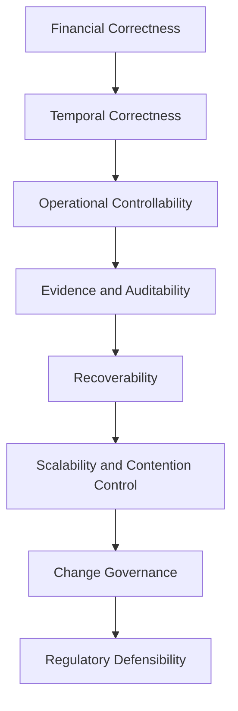
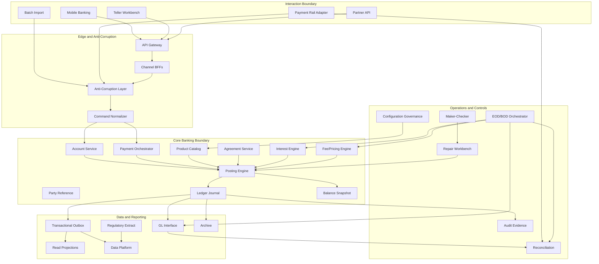
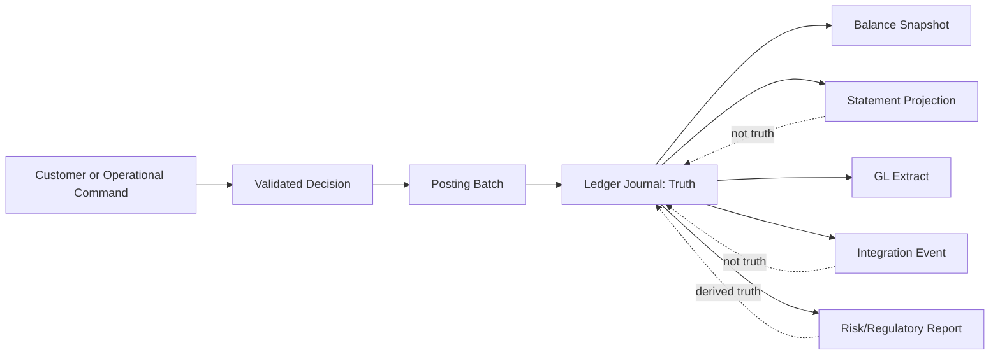
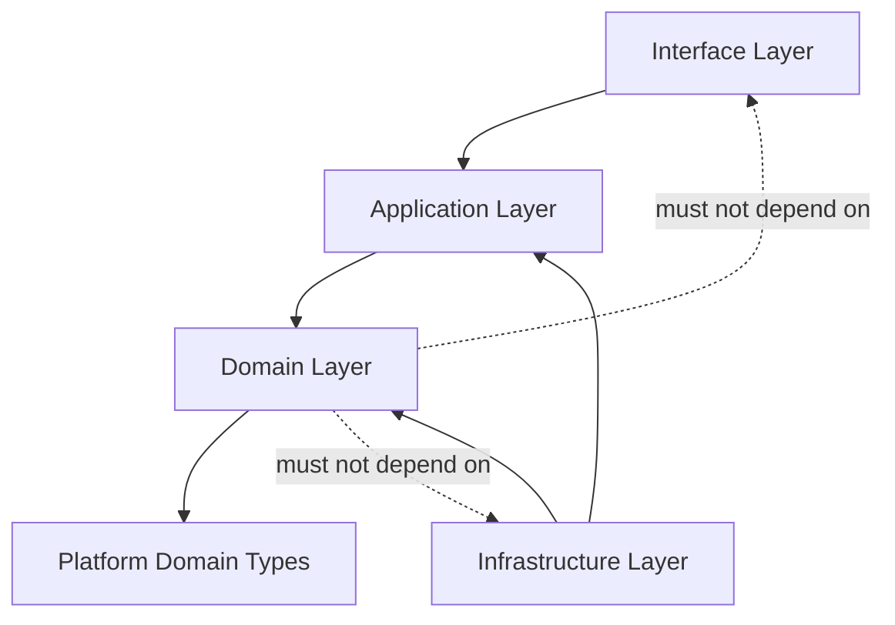
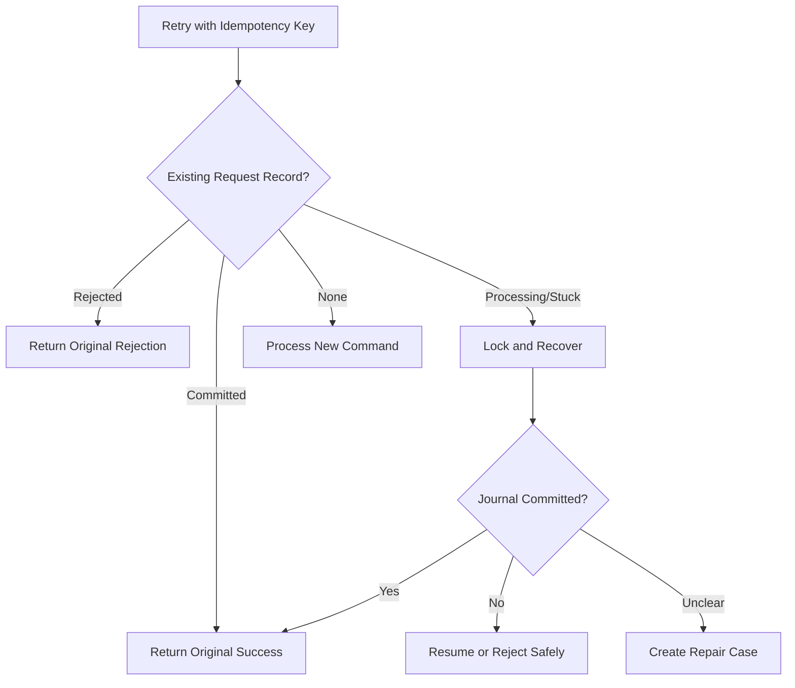
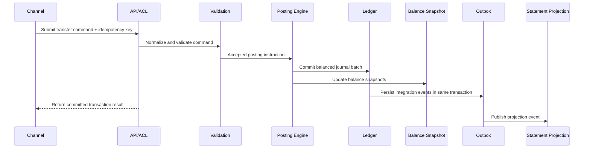
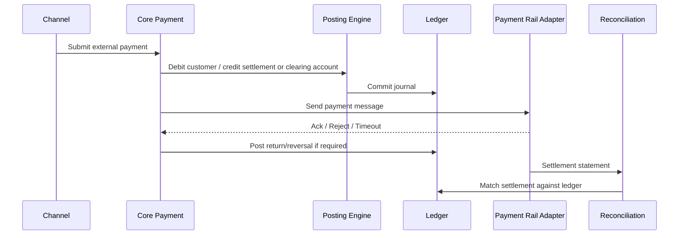
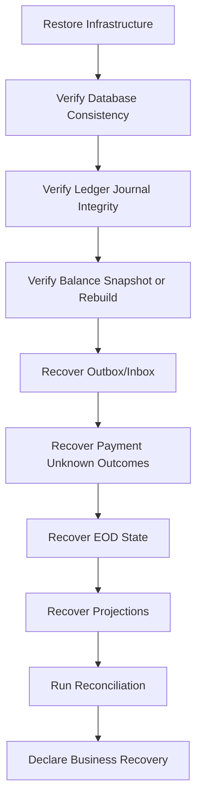
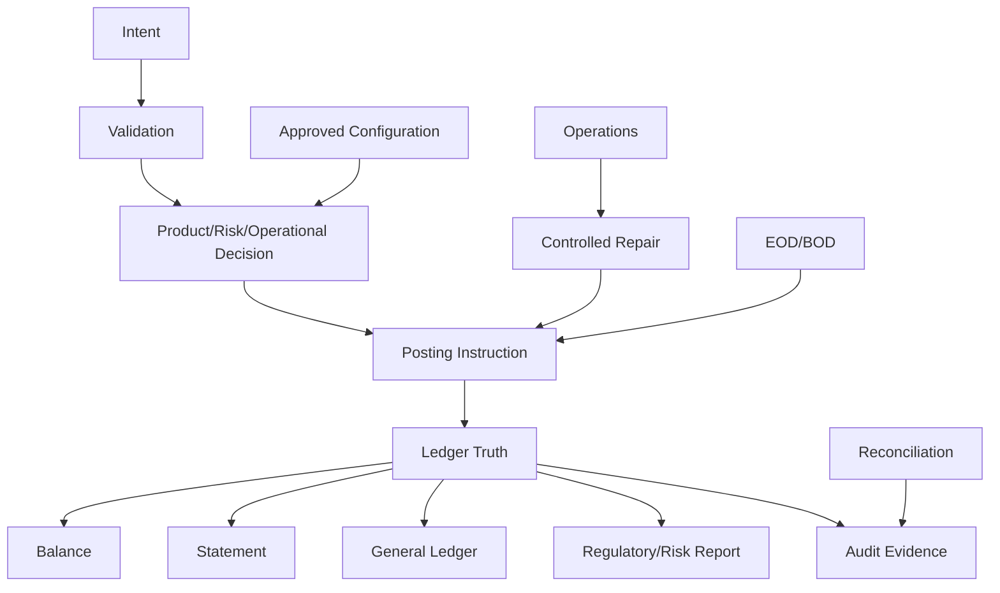

------
title: Learn Java Core Banking System - Part 035
description: Production readiness, reference architecture, operating model, audit evidence, failure playbooks, and top engineer rubric for Java core banking systems.
series: learn-java-core-banking-system
seriesTitle: Learn Java Core Banking System
order: 35
partTitle: Production Readiness, Reference Architecture, and Top Engineer Rubric
tags:
- java
- core-banking
- production-readiness
- reference-architecture
- ledger
- operations
- audit
- observability
- resilience
- architecture
- rubric
date: 2026-06-28
---

# Part 035 — Production Readiness, Reference Architecture, and Top Engineer Rubric

This is the final part of the series.

A core banking system is not production-ready because it compiles, passes API tests, deploys to Kubernetes, and has dashboards.

It is production-ready when the organization can answer these questions under pressure:

1. Did the system preserve financial truth?
2. Can we explain every customer-visible balance?
3. Can we prove that every posting is balanced, authorized, dated, and traceable?
4. Can we recover from known and unknown failures without inventing manual chaos?
5. Can operations, risk, audit, finance, compliance, support, and engineering reason from the same evidence?
6. Can we change the system safely without breaking prior-period history?
7. Can we detect when the system is wrong before customers, regulators, or finance discover it externally?

This part turns the previous 34 parts into a production reference model.

It is not a vendor blueprint. It is a way to reason about whether a Java-based core banking platform is defensible.

---

## 1. Kaufman Deconstruction

Production readiness is too large to learn as one skill. Break it into sub-skills.

| Sub-skill | What you must be able to do |
|---|---|
| Architectural synthesis | Combine ledger, product, payment, data, control, and operations into one coherent design. |
| Readiness gating | Define objective release gates instead of subjective confidence. |
| Failure playbooks | Predefine safe behavior for posting, payment, EOD, reconciliation, migration, and integration failures. |
| Evidence design | Produce audit, reconciliation, and release evidence automatically. |
| Operational ownership | Define who owns what during normal operations and incidents. |
| Runtime observability | Observe business truth, not only CPU, memory, and HTTP latency. |
| Risk-based prioritization | Distinguish catastrophic correctness failures from tolerable projection delays. |
| Evolution planning | Change architecture without corrupting financial history. |
| Engineering rubric | Evaluate whether an engineer can reason beyond framework-level implementation. |

The goal of this final part is not to memorize another checklist.

The goal is to build an internal review instinct:

> What can go wrong, what invariant would detect it, what evidence would prove it, and what operational path would safely resolve it?

---

## 2. The Core Banking Readiness Thesis

A production-grade core banking system must satisfy seven readiness layers.



The order matters.

Do not optimize scalability before correctness.

Do not add event streaming before the ledger truth is clear.

Do not create microservices before the consistency boundary is known.

Do not automate repair before repair semantics are approved.

Do not claim observability if you cannot answer what happened to a specific transaction, account, balance, GL batch, payment rail message, or EOD run.

---

## 3. Reference Architecture Overview

A practical Java core banking architecture should separate:

1. **Interaction boundary** — channels, teller, partner APIs, batch, payment rails.
2. **Decision boundary** — validation, eligibility, pricing, fraud/sanctions decision, approval.
3. **Truth boundary** — ledger journal, account state, balances, immutable evidence.
4. **Operational boundary** — EOD, reconciliation, repair, maker-checker, case management.
5. **Data boundary** — projections, reporting, regulatory extracts, analytics, archival.
6. **Control boundary** — audit, lineage, access control, configuration governance, release evidence.



The architecture is not defined by whether it is a modular monolith or microservices.

It is defined by which components are allowed to change financial truth.

A strong design has a narrow, explicit truth boundary.

---

## 4. Production Readiness Model

### 4.1 Readiness Categories

Use readiness categories that map to real failure consequences.

| Category | Question | Failure consequence |
|---|---|---|
| Ledger correctness | Do all postings preserve money conservation and double-entry balance? | Financial misstatement, customer harm, regulatory breach. |
| Balance correctness | Can every displayed balance be explained from journal truth? | Customer dispute, overdraft error, bad availability decisions. |
| Temporal correctness | Are business date, value date, posting date, and effective date handled consistently? | Wrong interest, wrong fee, wrong statement, wrong reporting period. |
| Product correctness | Are product rules versioned, approved, simulated, and traceable? | Incorrect pricing, unfair treatment, uncontrolled product drift. |
| Payment correctness | Are external statuses, settlement, returns, and unknown outcomes controlled? | Duplicate debit/credit, unreconciled settlement, customer loss. |
| Operational controllability | Can operations safely repair, approve, rerun, and close cases? | Manual chaos, undocumented fixes, unrecoverable exceptions. |
| Reconciliation | Can internal and external truth be matched and explained? | Hidden loss, suspense aging, GL mismatch. |
| Observability | Can support and engineering trace business outcomes end to end? | Slow incidents, incorrect root cause, poor customer response. |
| Recoverability | Can the platform restart, replay, rerun, restore, and reconcile? | Extended outage, data loss, broken EOD. |
| Change governance | Can releases and config changes be approved with evidence? | Production regression, uncontrolled behavior change. |

### 4.2 Readiness Gate Levels

Do not use binary readiness. Use levels.

| Level | Meaning | Release implication |
|---|---|---|
| R0 | Concept only | Not deployable. |
| R1 | Developer verified | Local and unit confidence only. |
| R2 | Integration verified | Inter-service, database, and API contracts verified. |
| R3 | Scenario certified | Banking journeys, EOD, reconciliation, and failure paths verified. |
| R4 | Operationally rehearsed | Ops, support, rollback, repair, monitoring, and incident paths rehearsed. |
| R5 | Audit/regulatory defensible | Evidence, lineage, approvals, controls, and reporting packs reproducible. |

For a core banking release, R3 is the minimum for controlled non-production testing. R4 is the minimum for production pilot. R5 is the target for material financial functionality.

---

## 5. Truth Boundary

The most important production architecture decision is the truth boundary.

A core banking platform usually has many systems that look authoritative:

- channel transaction history,
- payment orchestration status,
- Kafka topics,
- statement projections,
- data warehouse tables,
- GL extracts,
- customer support views,
- fraud case systems,
- reconciliation tools.

But only one layer should be authoritative for financial postings.

In this series, that layer is the ledger journal plus its controlled balance snapshots.



A projection may be stale.

An event may be delayed.

A report may be regenerated.

A payment status may be uncertain.

The journal must remain explainable.

---

## 6. Reference Module Map for Java Implementation

A modular Java implementation can be structured like this.

```txt
core-banking/
  platform/
    common-types/
    money/
    time-calendar/
    idempotency/
    audit-context/
    observability/
  domain/
    party/
    product/
    agreement/
    account/
    ledger/
    posting/
    interest/
    fee/
    payment/
    restrictions/
  application/
    command-handlers/
    workflows/
    validation/
    maker-checker/
    eod/
    reconciliation/
    repair/
  infrastructure/
    persistence/
    outbox/
    messaging/
    payment-adapters/
    gl-adapter/
    reporting-export/
    security/
  interfaces/
    rest-api/
    batch-api/
    teller-api/
    rail-api/
    admin-api/
  tests/
    property-tests/
    state-machine-tests/
    certification-scenarios/
    migration-tests/
```

The names matter less than the dependency direction.



The domain layer should know about money, account, ledger, product, agreement, posting, and time.

It should not know about HTTP, Kafka, JSON, payment rail XML, ORM annotations, or UI forms.

---

## 7. Production Readiness Checklist

### 7.1 Ledger and Posting

| Control | Required evidence |
|---|---|
| Every posting batch balances to zero per currency. | Automated invariant report per release and per EOD. |
| Posting lines are immutable after commit. | Database constraint, append-only policy, audit verification. |
| Reversal creates new entries, not mutation. | Reversal scenario certification. |
| Idempotency key prevents duplicate effect. | Duplicate/retry test evidence. |
| Unknown outcome has deterministic recovery path. | Incident playbook and recovery test. |
| Posting has correlation and causation IDs. | Trace and journal sample proof. |
| Balance snapshot can be regenerated from journal. | Rebuild test and reconciliation report. |
| Ledger and GL handoff have control totals. | GL batch evidence pack. |

### 7.2 Account and Balance

| Control | Required evidence |
|---|---|
| Balance types are explicitly defined. | Balance taxonomy document. |
| Available balance is derived from ledger, holds, restrictions, and policy. | Scenario tests for holds, liens, overdraft, and pending debit. |
| Closed accounts reject financial postings except approved correction flows. | Account lifecycle state-machine tests. |
| Dormant/frozen/restricted states are enforced consistently. | Restriction matrix tests. |
| Statement entries map to journal entries. | Statement-to-ledger reconciliation sample. |

### 7.3 Product and Configuration

| Control | Required evidence |
|---|---|
| Product versions are immutable after approval. | Config governance audit trail. |
| Effective-dated rules are deterministic. | As-of simulation tests. |
| Pricing, fee, tax, and interest rules produce decision trace. | Decision trace sample for each product. |
| Accounting mappings are approved and versioned. | Product-to-GL mapping approval record. |
| Config change has simulation before activation. | Simulation evidence and sign-off. |

### 7.4 Payment and Integration

| Control | Required evidence |
|---|---|
| Internal transfer is atomic across debit and credit legs. | Transfer invariant tests. |
| External payment status is separated from ledger posting truth. | Payment status model and scenario tests. |
| Rail message IDs are stored for correlation. | Message lineage sample. |
| Reject, return, recall, cancellation, and reversal are distinct. | Payment lifecycle state-machine tests. |
| Inbound files/messages are idempotent. | Duplicate inbound replay tests. |
| Settlement accounts reconcile with external statements. | Settlement reconciliation report. |

### 7.5 EOD/BOD and Batch Operations

| Control | Required evidence |
|---|---|
| EOD is stateful, restartable, and rerunnable where safe. | EOD state-machine test. |
| Business date is controlled and visible. | Business date governance evidence. |
| Accrual, fee, maturity, GL extract, and recon steps have control totals. | EOD evidence pack. |
| Failed step does not produce silent partial completion. | Failure injection test. |
| Manual override requires approval and reason. | Maker-checker evidence. |

### 7.6 Reconciliation and Break Management

| Control | Required evidence |
|---|---|
| Reconciliation has defined sources and matching keys. | Recon specification. |
| Breaks have lifecycle, owner, severity, SLA, and aging. | Break dashboard and sample case. |
| Suspense accounts are monitored and aged. | Suspense aging report. |
| Reconciliation corrections use posting/reversal, not data patch. | Repair scenario evidence. |
| Closed recon period requires sign-off. | Period close evidence. |

### 7.7 Audit and Evidence

| Control | Required evidence |
|---|---|
| Every financial command has actor, authority, source, timestamp, and reason where applicable. | Audit event sample. |
| Maker-checker records approval payload hash or equivalent snapshot. | Approval evidence sample. |
| Audit trail is append-only and tamper-evident where required. | Verification job output. |
| Evidence can be exported for a transaction, account, EOD run, GL batch, or repair case. | Evidence pack sample. |
| Retention and legal hold are policy-driven. | Retention policy mapping. |

### 7.8 Observability

| Control | Required evidence |
|---|---|
| Trace includes correlation from channel to posting to outbox to downstream. | Distributed trace sample. |
| Metrics include business SLIs, not only infrastructure metrics. | Dashboard sample. |
| Logs avoid sensitive data and include structured identifiers. | Log review evidence. |
| Alerts map to operational action. | Alert-to-runbook mapping. |
| Reconciliation and EOD expose progress and failure states. | Operational dashboard. |

Business observability should include:

- posting success/failure rate,
- unknown outcome count,
- duplicate request count,
- reversal rate,
- repair queue aging,
- suspense balance aging,
- EOD step duration,
- EOD rerun count,
- unreconciled settlement amount,
- GL batch mismatch amount,
- hot account contention,
- projection lag,
- outbox backlog,
- fraud/sanctions decision latency,
- manual override count,
- product config change count.

---

## 8. Business SLI and SLO Model

Infrastructure SLIs are necessary but insufficient.

A core banking platform needs business SLIs.

| SLI | Example measurement | Why it matters |
|---|---|---|
| Posting acceptance latency | Time from accepted command to committed journal. | Customer experience and channel timeout. |
| Posting correctness | Count of unbalanced posting batches. | Must be zero. |
| Unknown outcome count | Commands with uncertain commit result. | Indicates retry/recovery risk. |
| Reconciliation break aging | Time since unmatched item creation. | Indicates operational risk. |
| EOD completion time | Time from EOD start to close. | Controls operational calendar. |
| Outbox publication lag | Time from journal commit to downstream publication. | Controls projection and integration staleness. |
| GL handoff mismatch | Difference between subledger totals and GL batch totals. | Finance correctness. |
| Repair SLA breach rate | Cases past SLA. | Operational load and customer impact. |
| Product config defect count | Production incidents caused by config. | Governance quality. |
| Balance dispute rate | Customer balance disputes per period. | External correctness signal. |

### 8.1 SLO Classes

Not every SLO has the same severity.

| Class | Example | Target style |
|---|---|---|
| Hard invariant | Unbalanced ledger batch | Exactly zero. |
| Strict operational | EOD completion before BOD opening | Near-zero misses; breach requires incident. |
| Customer experience | Balance inquiry latency | Percentile target. |
| Integration freshness | Projection lag | Time-bound lag target. |
| Operational risk | Suspense aging | Threshold and escalation. |

Hard invariants are not SLOs in the ordinary sense. They are non-negotiable correctness conditions.

---

## 9. Incident Severity Model

A core banking severity model should be based on financial truth and customer impact, not only system availability.

| Severity | Condition | Example |
|---|---|---|
| SEV-0 | Financial truth may be corrupted or cannot be proven. | Unbalanced postings, duplicate debit, journal integrity failure. |
| SEV-1 | Major customer or operational impact with controlled truth. | Payment rail outage, EOD blocked, large reconciliation mismatch. |
| SEV-2 | Degraded functionality or bounded financial risk. | Projection lag, repair queue spike, partner API timeout. |
| SEV-3 | Localized issue with workaround. | Single product config issue before activation, dashboard defect. |
| SEV-4 | Non-production or cosmetic. | Documentation or non-critical UI issue. |

### 9.1 Incident Decision Rule

If the team cannot prove whether financial truth is intact, treat the incident as higher severity.

Do not downgrade based on optimism.

Downgrade only after evidence.

---

## 10. Failure Playbooks

### 10.1 Posting Unknown Outcome

Symptoms:

- client timed out,
- database commit status unknown,
- caller retries,
- channel does not know whether debit happened.

Required behavior:

1. Search by idempotency key.
2. If committed, return original transaction result.
3. If rejected, return original rejection.
4. If no record exists, safely retry command.
5. If partial internal evidence exists, move to repair case.
6. Never infer by balance delta alone without causation evidence.



### 10.2 EOD Failure

Symptoms:

- EOD step fails,
- accrual batch partially processed,
- GL extract not generated,
- business date cannot roll.

Required behavior:

1. Freeze new dependent operations if required.
2. Identify last completed EOD checkpoint.
3. Verify control totals for completed steps.
4. Resume idempotent steps.
5. Rerun reversible steps only through approved rerun mechanism.
6. Generate incident evidence.
7. Do not manually update business date outside controlled workflow.

### 10.3 Reconciliation Break Spike

Symptoms:

- sudden increase in unmatched settlement items,
- GL mismatch,
- suspense balance growth.

Required behavior:

1. Classify by source: internal, rail, GL, Nostro, projection, migration.
2. Identify common correlation: file, batch, product, date, adapter version.
3. Stop automatic correction if root cause unknown.
4. Create break group.
5. Assign owner and SLA.
6. Use posting/reversal/adjustment, not direct patch, for financial correction.
7. Produce break-resolution evidence.

### 10.4 Product Configuration Defect

Symptoms:

- fee charged incorrectly,
- interest accrual wrong after rate table change,
- eligibility rule rejects valid customers.

Required behavior:

1. Disable future activation if not active.
2. If active, freeze affected rule version or move to controlled override.
3. Identify impacted accounts and transactions by effective date.
4. Simulate expected vs actual.
5. Generate correction postings if financial impact exists.
6. Keep original configuration and approval history immutable.
7. Add regression scenario to certification pack.

### 10.5 External Rail Timeout

Symptoms:

- outbound payment submitted,
- acknowledgement not received,
- customer retries,
- rail status unknown.

Required behavior:

1. Do not automatically duplicate external send.
2. Query rail status if supported.
3. Use external message ID and end-to-end ID.
4. Hold internal status as pending/unknown.
5. Release, reject, reverse, or repair only after evidence or approved timeout policy.
6. Reconcile against settlement statement.

---

## 11. Operational Model

Production readiness requires named operational ownership.

| Function | Primary responsibility |
|---|---|
| Core engineering | System correctness, implementation, release quality, technical recovery. |
| Banking operations | EOD/BOD execution, repair, exception handling, reconciliation action. |
| Finance/accounting | GL mapping, financial close, suspense monitoring, accounting approval. |
| Product owner | Product parameter approval, pricing behavior, customer impact. |
| Risk/compliance | Policy checks, reporting expectations, regulatory controls. |
| Security | Access, logging safety, secrets, incident response. |
| SRE/platform | Runtime health, capacity, deployment, infrastructure recovery. |
| Audit/internal control | Evidence review, control effectiveness, auditability. |

### 11.1 RACI Example for Posting Correction

| Activity | Engineering | Ops | Finance | Product | Risk/Compliance | Audit |
|---|---|---|---|---|---|---|
| Detect issue | R | R | C | C | C | I |
| Assess financial impact | C | R | A | C | C | I |
| Approve correction method | C | R | A | C | C | I |
| Execute correction | C | R | C | I | I | I |
| Validate ledger/GL | C | R | A | I | I | I |
| Archive evidence | R | R | C | I | C | C |
| Add regression test | A | C | I | I | I | I |

Legend:

- R = Responsible
- A = Accountable
- C = Consulted
- I = Informed

RACI is only useful if it matches actual authority.

A team that owns the code but cannot approve a financial correction should not be the accountable party for the correction decision.

---

## 12. Audit Pack Model

A production-grade core banking system should be able to generate evidence packs.

### 12.1 Transaction Evidence Pack

For any transaction ID, the system should produce:

- original request envelope,
- channel/source,
- actor/customer/agent,
- authentication and authorization context reference,
- idempotency key,
- validation result,
- approval record if applicable,
- product/rule version used,
- pricing/fee/interest/tax decision trace,
- fraud/sanctions decision reference if applicable,
- accounting event,
- posting batch,
- journal lines,
- balance impact,
- statement entries,
- outbox events,
- downstream messages,
- reversal/correction links,
- audit events,
- trace/log correlation IDs.

### 12.2 Account Evidence Pack

For any account and period:

- account lifecycle history,
- ownership/party relationship history,
- product/agreement versions,
- restrictions/holds/liens,
- opening balance,
- journal entries,
- statement entries,
- balance snapshots,
- interest/fee/tax runs,
- reversals/adjustments,
- closing balance,
- reconciliation status,
- dispute history if applicable.

### 12.3 EOD Evidence Pack

For any EOD run:

- business date,
- run ID,
- initiating actor/system,
- step sequence,
- checkpoint status,
- input counts,
- output counts,
- control totals,
- failed/retried/rerun steps,
- accrual totals,
- fee totals,
- maturity totals,
- GL batch totals,
- reconciliation summary,
- approval/override records,
- final sign-off.

### 12.4 Release Evidence Pack

For any release:

- change summary,
- affected products/modules,
- ADRs,
- migration scripts,
- database schema changes,
- compatibility review,
- certification test results,
- performance test results,
- security/privacy review,
- operational runbook updates,
- rollback plan,
- sign-offs,
- post-release validation checklist.

---

## 13. Architecture Decision Record Template

Use ADRs for decisions that affect correctness, evidence, operations, or reversibility.

```md
# ADR-<number>: <Decision Title>

## Status
Proposed | Accepted | Deprecated | Superseded

## Context
What problem are we solving?
Which business, technical, operational, and regulatory constraints apply?

## Decision
What did we decide?

## Alternatives Considered
- Alternative A
- Alternative B
- Alternative C

## Consequences
Positive consequences:
- ...

Negative consequences:
- ...

Operational consequences:
- ...

Audit/evidence consequences:
- ...

## Invariants Protected
- ...

## Failure Modes
- ...

## Observability Required
- Metrics
- Logs
- Traces
- Reconciliation reports

## Rollback or Exit Strategy
How can this decision be reversed or evolved?

## Approval
Engineering:
Product:
Operations:
Risk/Compliance:
Finance:
```

### 13.1 Example ADR Topic List

A core banking platform should usually have ADRs for:

- ledger storage model,
- posting transaction boundary,
- idempotency model,
- account-level serialization,
- balance snapshot strategy,
- reversal/correction model,
- product configuration governance,
- payment status lifecycle,
- ISO 20022 mapping boundary,
- GL handoff model,
- EOD restart/rerun strategy,
- reconciliation architecture,
- audit trail immutability,
- event publication/outbox model,
- modular monolith vs microservices boundary,
- migration/cutover strategy,
- data retention and archival model.

---

## 14. Reference Runtime Flow

### 14.1 Internal Transfer



Important properties:

- The debit and credit legs are committed together.
- The outbox record is created with the same database transaction as the journal.
- The channel response is based on committed truth, not downstream projection.
- Statement projection may lag without corrupting ledger truth.

### 14.2 External Outgoing Payment



Important properties:

- External rail status is not the same as ledger status.
- Timeout does not imply failure.
- Reconciliation closes the loop.
- Return/reversal must be explicit financial events.

---

## 15. Security, Privacy, and Control Readiness

This series did not repeat the full security track, but core banking production readiness must include security controls as operational reality.

| Area | Readiness question |
|---|---|
| Identity | Can every actor be traced to a verified identity or system principal? |
| Authorization | Are financial actions authorized by role, limit, product, branch, and state? |
| Segregation of duties | Can the same person create and approve a sensitive operation? |
| Secrets | Are keys, credentials, certificates, and rail credentials rotated and monitored? |
| Logging safety | Are account numbers, PII, card data, and sensitive payloads masked or excluded? |
| Least privilege | Can support view evidence without gaining mutation rights? |
| Break-glass | Is emergency access time-bound, approved, monitored, and reviewed? |
| Retention | Are audit and financial records retained according to policy? |
| Non-prod data | Is production data masked/tokenized before lower environment use? |

### 15.1 Access Control Smell

This is a serious design smell:

> “Admin can fix it directly in the database.”

A mature system replaces direct database fixes with controlled operational commands:

- reverse transaction,
- create adjustment,
- release hold,
- repair payment,
- approve override,
- close break,
- rerun EOD step,
- regenerate projection.

The database should not be the user interface for financial correction.

---

## 16. Data and Reporting Readiness

A core banking platform must support reporting without letting reporting mutate truth.

### 16.1 Reporting Layers

| Layer | Purpose | Truth status |
|---|---|---|
| Ledger journal | Authoritative financial postings. | Truth. |
| Balance snapshot | Optimized current/as-of balance. | Derived truth. |
| Statement projection | Customer-facing transaction view. | Derived projection. |
| GL extract | Finance/accounting handoff. | Controlled derived output. |
| Regulatory extract | Risk/compliance reporting feed. | Controlled derived output. |
| Data warehouse | Analytics and historical analysis. | Non-authoritative. |
| Dashboard | Operational visibility. | Non-authoritative. |

### 16.2 Reporting Rule

A report is defensible when it can answer:

1. Which source records were included?
2. Which business date and effective-date rules were used?
3. Which product/config versions were active?
4. Which adjustments were included or excluded?
5. What control totals prove completeness?
6. Can the report be regenerated and produce the same result?
7. Who approved the report or extract?

If a regulatory number cannot be traced back to ledger, reference data, and transformation logic, it is not defensible.

---

## 17. Deployment and Release Readiness

### 17.1 Release Risk Classes

| Class | Example | Required control |
|---|---|---|
| Low | UI label, non-financial dashboard | Normal test and review. |
| Medium | New read API, projection change | Contract tests and fallback. |
| High | Product configuration, payment adapter change | Simulation, approval, recon plan. |
| Critical | Posting engine, ledger schema, balance calculation, EOD | Certification suite, rehearsal, rollback/forward-fix plan, sign-off. |

### 17.2 Deployment Strategy

For core banking, do not blindly copy consumer-internet deployment patterns.

Canary and progressive rollout are useful, but they must respect financial consistency.

| Strategy | Safe for | Dangerous for |
|---|---|---|
| Blue/green | Stateless read APIs, BFFs, projections | Ledger writers without data compatibility. |
| Canary | Channel flows, non-critical partner APIs | Mixed posting semantics for same account/product. |
| Feature flag | Read features, optional workflow | Ledger calculation behavior without effective dating. |
| Shadow mode | Fraud/risk scoring, simulation | Live financial posting unless isolated. |
| Parallel run | Migration, product engine rewrite | If reconciliation is weak. |

### 17.3 Backward Compatibility Rule

A new release must be compatible with:

- existing journal records,
- existing account states,
- existing product versions,
- in-flight payments,
- pending maker-checker approvals,
- open repair cases,
- incomplete EOD runs,
- old outbox events,
- old statement projections,
- old GL batches,
- old reports.

A release that only works for new data is not production-ready.

---

## 18. Disaster Recovery and Recoverability

Disaster recovery for core banking is not only “restore the database”.

You must recover a coherent business state.

### 18.1 Recovery Questions

| Question | Why it matters |
|---|---|
| What was the last committed journal entry? | Defines financial truth. |
| Which outbox events were committed but not published? | Prevents missed downstream updates. |
| Which payment messages were sent but not acknowledged? | Prevents duplicate external instructions. |
| Which EOD step was active? | Prevents partial batch corruption. |
| Which reconciliation files were imported? | Prevents duplicate break creation. |
| Which approvals were pending? | Prevents unauthorized execution. |
| Which projections are stale? | Defines rebuild scope. |

### 18.2 Recovery Order



A platform is not recovered when pods are green.

It is recovered when business truth is verified.

---

## 19. Production Dashboards

### 19.1 Executive Control Dashboard

For leadership and operations:

- business date,
- EOD status,
- posting volume,
- failed posting count,
- payment rail status,
- reconciliation break count,
- suspense balance,
- GL handoff status,
- critical incidents,
- regulatory extract status.

### 19.2 Engineering Dashboard

For engineering and SRE:

- API latency,
- posting latency,
- database lock wait,
- hot account contention,
- outbox lag,
- projection lag,
- consumer lag,
- error rate by command type,
- unknown outcome count,
- connection pool saturation,
- JVM heap/GC/thread metrics,
- queue backlog.

### 19.3 Audit/Control Dashboard

For control functions:

- maker-checker pending approvals,
- emergency access events,
- manual override count,
- repair aging,
- direct database access attempts,
- configuration changes,
- failed audit verification jobs,
- retention policy exceptions,
- evidence export history.

A dashboard without an action path is decoration.

Every alert should map to a runbook.

---

## 20. Top Engineer Rubric

This rubric evaluates capability, not job title.

### 20.1 Level 1 — Framework Implementer

Can implement APIs, entities, repositories, and basic service methods.

Strengths:

- productive in known framework,
- can follow existing patterns,
- can write CRUD and simple business validation.

Gaps:

- treats core banking as normal business app,
- weak understanding of ledger/accounting,
- may mutate records instead of correcting through reversal/adjustment,
- does not reason about reconciliation or audit evidence.

### 20.2 Level 2 — Domain-Aware Engineer

Understands account, transaction, product, posting, balance, and payment lifecycle.

Strengths:

- can model state transitions,
- can explain difference between ledger balance and available balance,
- can implement idempotent commands,
- can write meaningful scenario tests.

Gaps:

- may still under-model operations,
- may not design strong evidence packs,
- may struggle with EOD/reconciliation and migration.

### 20.3 Level 3 — Core Banking Engineer

Can design ledger-safe features and reason about failure paths.

Strengths:

- understands double-entry and journal immutability,
- can design posting engine workflows,
- can reason about value date, posting date, effective date,
- can design reversal/correction flows,
- can integrate payment rails without confusing rail status with ledger truth,
- can design reconciliation controls.

Gaps:

- may need support on enterprise operating model,
- may not yet lead cross-functional readiness reviews.

### 20.4 Level 4 — Production Architect

Can own production readiness for material banking capability.

Strengths:

- designs architecture around invariants,
- defines readiness gates and evidence,
- understands operational control, maker-checker, repair, audit, and reporting,
- can evaluate modular monolith vs microservices trade-offs,
- can reason through DR, migration, EOD, performance, and data lineage,
- can lead incident review without guessing.

Gaps:

- may need broader institutional exposure to regulatory exams, large-scale transformation, or multi-country banking constraints.

### 20.5 Level 5 — Top 1% Banking Systems Engineer

Can design, challenge, evolve, and defend a core banking platform under real institutional constraints.

Capabilities:

- turns vague banking requirements into explicit invariants,
- separates customer intent, product decision, accounting event, posting, ledger, projection, and report,
- challenges unsafe architecture even when it is fashionable,
- understands that auditability is a product feature,
- designs correction paths before production errors occur,
- treats data lineage as part of system design,
- can explain the same incident to engineers, operations, finance, risk, audit, and leadership,
- can lead migration/cutover planning,
- can reason about regulatory defensibility without pretending to be the regulator,
- optimizes performance without weakening correctness,
- designs for change without rewriting history.

The top engineer is not the person who knows the most patterns.

The top engineer is the person who can preserve truth while enabling change.

---

## 21. Design Review Questions

Use these questions in architecture reviews.

### 21.1 Ledger Review

1. What is the authoritative record of financial truth?
2. Can a posting ever be partially committed?
3. How is double-entry enforced?
4. How are reversals linked to originals?
5. Can balances be rebuilt from journal entries?
6. What prevents duplicate effects under retry?
7. What happens if the client times out after commit?
8. What is the process for prior-period correction?

### 21.2 Product Review

1. Where are product rules versioned?
2. Who approves product changes?
3. Can old accounts remain on old terms?
4. Can changes be simulated before activation?
5. Is the decision trace persisted?
6. How are pricing, tax, fee, and interest rules tested?
7. What happens if a product rule is wrong in production?

### 21.3 Payment Review

1. What statuses are internal vs external?
2. What is the settlement account model?
3. How are reject, return, reversal, cancellation, and recall distinct?
4. What prevents duplicate external sends?
5. How is unknown rail outcome recovered?
6. How does reconciliation prove settlement?

### 21.4 Operations Review

1. Can EOD restart from every failure point?
2. What steps are rerunnable and why?
3. What requires maker-checker approval?
4. How are repair cases prioritized and aged?
5. Can operations act without direct DB patching?
6. How is emergency access controlled?

### 21.5 Data and Reporting Review

1. Can every report number be traced to source records?
2. Are reference data versions captured?
3. Are adjustment rules explicit?
4. Can the report be regenerated?
5. Are control totals defined?
6. Who signs off the report?

### 21.6 Production Review

1. What are the hard invariants?
2. Which dashboards prove health?
3. Which alerts map to which runbooks?
4. What is the rollback or forward-fix path?
5. What is the blast radius of failure?
6. What is the recovery order?
7. What evidence exists after incident closure?

---

## 22. Capstone: Design a Mini Core Banking Platform

To test whether you internalized the series, design a mini platform with these capabilities:

1. customer onboarding reference,
2. savings account opening,
3. internal transfer,
4. external outgoing payment placeholder,
5. fee charge,
6. daily interest accrual,
7. account hold,
8. reversal,
9. EOD run,
10. GL extract,
11. reconciliation import,
12. repair case,
13. audit evidence export.

### 22.1 Required Artifacts

Produce:

- domain map,
- bounded context diagram,
- ledger schema,
- posting model,
- account state machine,
- payment state machine,
- EOD state machine,
- reconciliation break lifecycle,
- product configuration model,
- idempotency design,
- audit event model,
- outbox design,
- observability model,
- readiness checklist,
- incident playbooks,
- ADRs.

### 22.2 Capstone Evaluation

Your design passes only if:

- every financial transaction produces balanced postings,
- every balance can be explained,
- every retry is safe,
- every correction is traceable,
- every external payment can be reconciled,
- every EOD step is restartable or explicitly non-rerunnable with control,
- every report has lineage,
- every manual operation has authority and evidence,
- every production alert maps to a runbook.

---

## 23. Common Final Anti-Patterns

### 23.1 CRUD Core Banking

Treating account and transaction tables as simple CRUD entities.

Why it fails:

- history is overwritten,
- audit is weak,
- reversals are unclear,
- balances cannot be explained,
- reconciliation becomes manual.

### 23.2 Event Stream as Ledger

Treating Kafka topics as the authoritative ledger.

Why it fails:

- ordering is partition-dependent,
- compaction/retention can break audit expectations,
- replay semantics become operationally risky,
- database reconciliation is unclear,
- correction semantics are weak.

Event streams are excellent for propagation.

They are not automatically a ledger.

### 23.3 Balance as Truth

Treating current balance as the authoritative source.

Why it fails:

- balance has no explanation without journal,
- corrections are hard,
- disputes cannot be investigated,
- statement and GL cannot be reconciled.

Balance is an optimized derived state.

The journal explains it.

### 23.4 Microservices Before Invariants

Splitting the domain by nouns before understanding transactional consistency.

Why it fails:

- distributed transactions leak into business logic,
- account and ledger updates become inconsistent,
- compensation is invented after incidents,
- debugging requires cross-service archaeology.

Start with consistency boundaries.

Then decide deployment boundaries.

### 23.5 Manual Repair Without Domain Commands

Allowing operations to patch database rows.

Why it fails:

- no consistent validation,
- no approval path,
- no journal semantics,
- no audit explanation,
- no testable repair behavior.

Repair should be a domain workflow.

### 23.6 Reports Without Lineage

Generating regulatory or finance reports from opaque transformed tables.

Why it fails:

- numbers cannot be explained,
- corrections cannot be traced,
- rebuilds produce different values,
- audit becomes spreadsheet archaeology.

Reports need source lineage and reproducible transformation.

---

## 24. Final Mental Model

A core banking platform is a controlled financial truth machine.



The system accepts intent.

It makes decisions.

It posts financial truth.

It derives views.

It reconciles with external truth.

It produces evidence.

It corrects through controlled financial actions.

Everything else is implementation detail.

---

## 25. The Final Top 1% Checklist

You are approaching top-tier capability in this domain if you can do the following without hand-waving:

| Capability | Can you do it? |
|---|---|
| Explain why ledger journal is different from transaction history. |  |
| Design double-entry postings for deposit, loan, fee, interest, payment, reversal, and settlement. |  |
| Model account lifecycle and balance types without contradictions. |  |
| Handle idempotency and unknown outcomes safely. |  |
| Distinguish value date, posting date, effective date, and system timestamp. |  |
| Design product configuration with approval, versioning, simulation, and rollback strategy. |  |
| Design EOD/BOD with restartability and evidence. |  |
| Design reconciliation and break management. |  |
| Separate core banking from fraud/AML/sanctions while preserving decision evidence. |  |
| Integrate ISO 20022/payment rails without leaking external message models into internal ledger. |  |
| Design repair workflows without direct DB patching. |  |
| Produce audit evidence for any transaction/account/EOD/release. |  |
| Reason about modular monolith vs microservices from consistency boundaries. |  |
| Design migration with opening balance, parallel run, reconciliation, and fallback. |  |
| Build property/state-machine/certification tests around invariants. |  |
| Explain production incidents across engineering, operations, finance, risk, audit, and leadership. |  |

---

## 26. Final 20-Hour Practice Plan

After finishing the reading series, spend 20 hours building fluency.

| Time | Practice |
|---|---|
| Hours 1-2 | Draw the domain map and truth boundary from memory. |
| Hours 3-4 | Implement minimal Money, Account, JournalEntry, PostingBatch. |
| Hours 5-6 | Add double-entry validation and idempotency. |
| Hours 7-8 | Add internal transfer and reversal. |
| Hours 9-10 | Add account lifecycle and balance types. |
| Hours 11-12 | Add fee and interest simulation. |
| Hours 13-14 | Add EOD run with checkpoints and control totals. |
| Hours 15-16 | Add reconciliation import and break lifecycle. |
| Hours 17-18 | Add audit evidence export and trace IDs. |
| Hours 19-20 | Run failure scenarios: duplicate request, timeout, partial EOD, wrong config, migration mismatch. |

Do not try to build a full bank.

Build a small system that preserves the same invariants as a bank.

That is how the skill transfers.

---

## 27. Final References

Use these as anchor references for further study:

- FFIEC Architecture, Infrastructure, and Operations booklet context: https://www.occ.gov/news-issuances/bulletins/2021/bulletin-2021-30.html
- Federal Reserve SR 21-11 summary of FFIEC AIO: https://www.federalreserve.gov/supervisionreg/srletters/SR2111.htm
- BCBS 239 Principles for effective risk data aggregation and risk reporting: https://www.bis.org/publ/bcbs239.pdf
- BCBS 239 implementation update, 2026: https://www.bis.org/publ/bcbs_nl36.htm
- NIST Cybersecurity Framework 2.0: https://nvlpubs.nist.gov/nistpubs/CSWP/NIST.CSWP.29.pdf
- OpenTelemetry Signals: https://opentelemetry.io/docs/concepts/signals/
- ISO 20022 Message Definitions: https://www.iso20022.org/iso-20022-message-definitions
- PCI DSS standards overview: https://www.pcisecuritystandards.org/standards/pci-dss/

---

## 28. Series Completion

This is the final part of `learn-java-core-banking-system`.

The series is complete at **35 parts**.

You now have the conceptual map, domain model, ledger model, product engine model, payment/integration model, operational control model, risk/reporting model, architecture model, migration model, testing model, and readiness rubric required to reason about Java core banking systems at an advanced engineering level.

The next step is not more reading.

The next step is building a small but correct core banking simulation and attacking it with failure scenarios.
