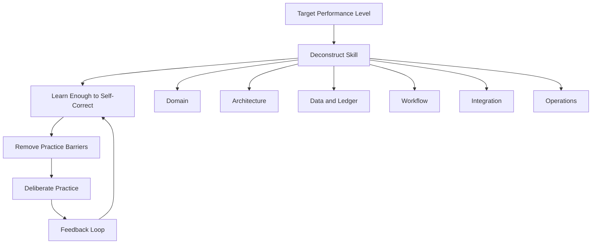
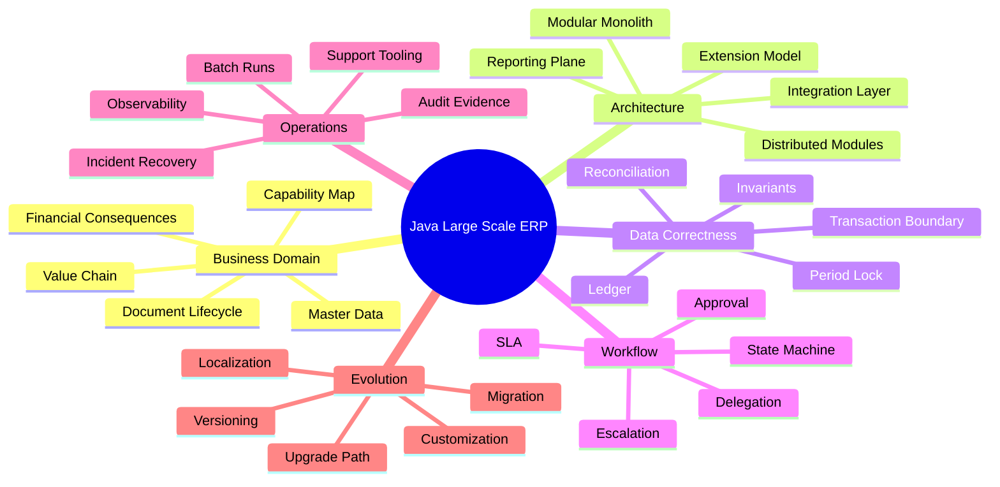
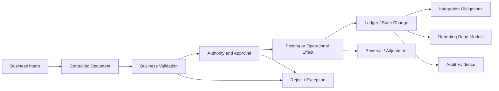
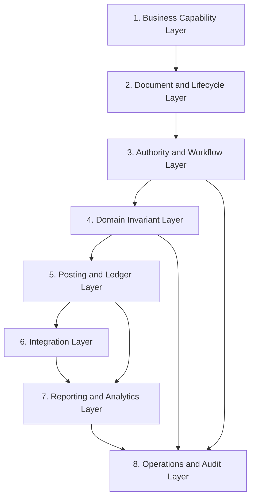
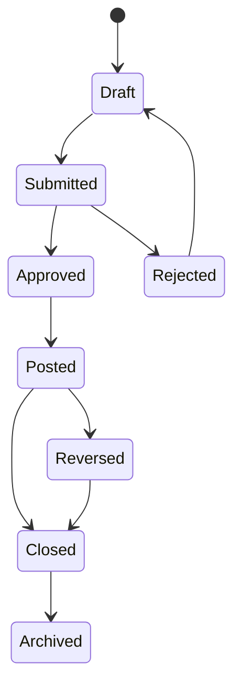
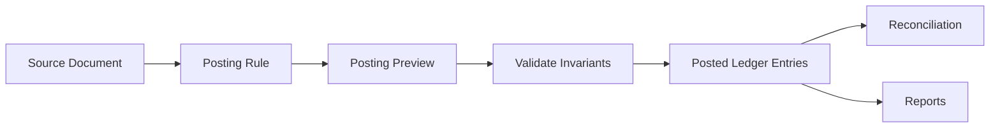
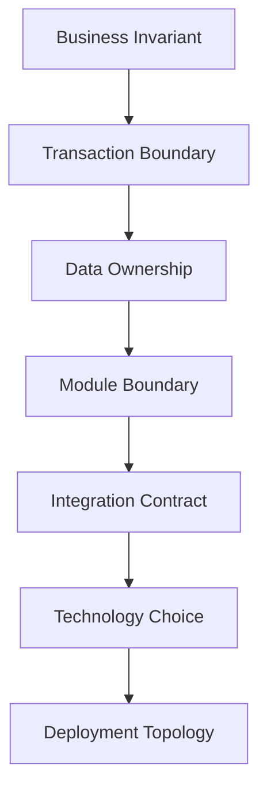
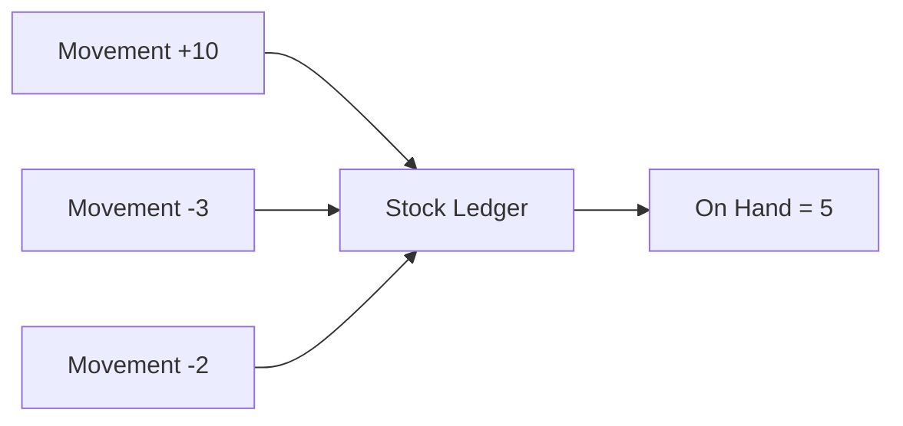
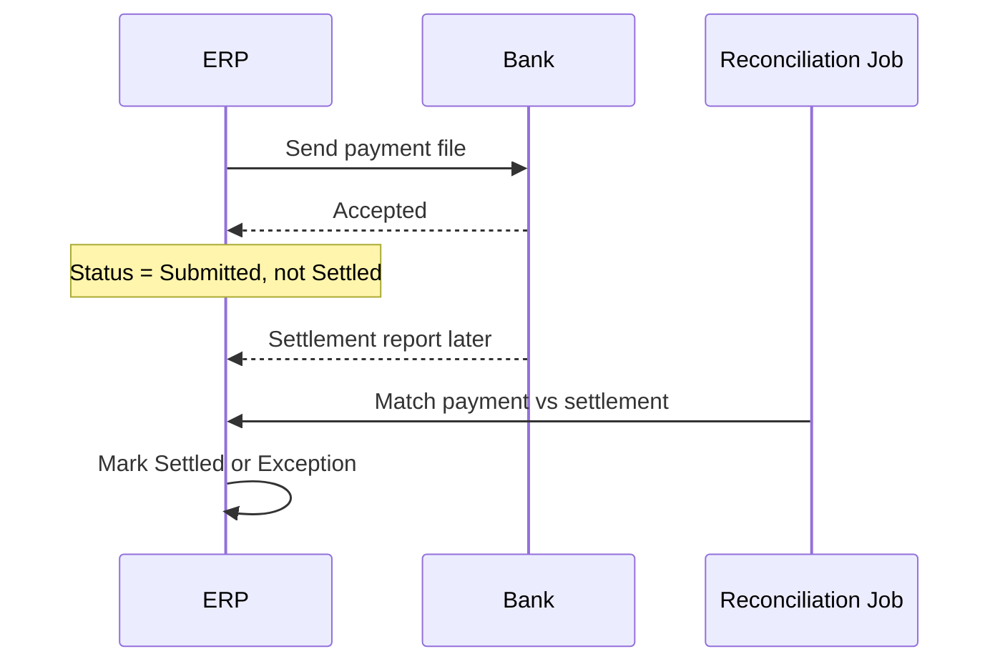
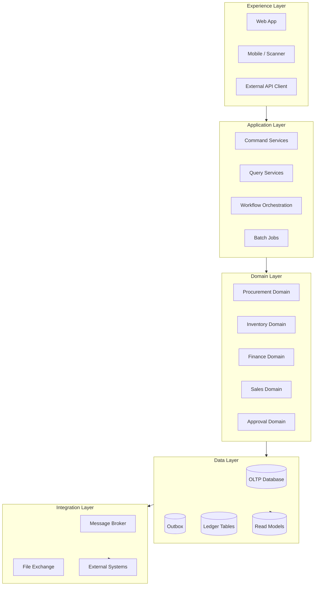

# Part 001 — Kaufman Skill Map and ERP Mental Model

## 1. Target Skill: Apa yang Sebenarnya Kita Latih?

Target seri ini bukan “bisa membuat aplikasi ERP dengan Java”. Target seperti itu terlalu kabur. Target yang lebih berguna untuk engineer senior adalah:

> **Mampu merancang, menilai, membangun, mengoperasikan, dan menyelamatkan sistem ERP berskala besar berbasis Java yang memiliki data finansial/operasional konsisten, dapat diaudit, dapat dikustomisasi, dapat diintegrasikan, dan tetap dapat berevolusi selama bertahun-tahun.**

Dengan target ini, kita tidak belajar ERP sebagai daftar modul vendor. Kita belajar ERP sebagai **sistem pengendali bisnis**. Dalam ERP besar, bug bukan hanya exception di log. Bug bisa berarti:

- saldo ledger tidak seimbang;
- stok fisik tidak cocok dengan stock ledger;
- invoice dibayar dua kali;
- approval bisa dilewati;
- nomor dokumen legal melompat tanpa alasan;
- periode accounting yang sudah dikunci masih bisa berubah;
- audit trail tidak cukup untuk dispute;
- perubahan konfigurasi menghancurkan behavior tenant lain;
- integrasi eksternal mengirim event dobel dan menciptakan financial impact.

Itulah alasan pendekatan seri ini berbeda dari materi Java biasa. Di sini Java adalah medium implementasi, tetapi kemampuan utamanya adalah **domain correctness under scale and change**.

## 2. Kaufman Framing: 20 Jam Bukan Berarti Menguasai ERP

Framework Josh Kaufman dalam *The First 20 Hours* berguna sebagai cara memulai skill kompleks secara efektif. Namun untuk ERP besar, kita perlu menafsirkan “20 hours” secara realistis.

Kita tidak akan menjadi ahli ERP enterprise hanya dalam 20 jam. Yang bisa dicapai dalam 20 jam pertama adalah:

1. mengerti bentuk masalahnya;
2. tahu sub-skill mana yang paling berdampak;
3. punya vocabulary untuk membaca desain ERP;
4. bisa membedakan desain yang defensible vs desain yang rapuh;
5. bisa membuat satu slice kecil ERP yang benar secara invariant, bukan sekadar CRUD.

Kaufman membantu kita menghindari perangkap umum: membaca terlalu banyak teori tanpa praktik, atau langsung coding tanpa tahu invariant bisnis.



Dalam seri ini, setiap part akan mengikuti pola:

- **mental model**: cara melihat domain;
- **core concepts**: istilah dan struktur penting;
- **design model**: bagaimana biasanya direpresentasikan dalam sistem Java;
- **failure modes**: cara desain gagal di dunia nyata;
- **practice**: latihan kecil yang bisa dilakukan untuk internalisasi;
- **review checklist**: pertanyaan untuk design review.

## 3. Mengapa ERP Besar Tidak Bisa Dipahami sebagai CRUD

CRUD melihat sistem sebagai tabel dan form. ERP melihat sistem sebagai **janji bisnis yang meninggalkan jejak finansial, operasional, legal, dan audit**.

Contoh sederhana: `Purchase Order`.

Dalam CRUD, PO adalah record:

```text
purchase_order(id, vendor_id, date, status)
purchase_order_line(id, purchase_order_id, item_id, qty, price)
```

Dalam ERP, PO adalah kontrak operasional yang dapat menghasilkan konsekuensi:

- mengikat vendor;
- menyerap budget;
- membuka expected receipt;
- menjadi referensi goods receipt;
- menjadi referensi vendor invoice;
- masuk ke approval workflow;
- terkena tax rule;
- terkena currency conversion;
- memiliki revision history;
- memengaruhi encumbrance atau commitment accounting;
- menjadi bukti audit pengadaan.

Jadi model mental awal:

> **ERP document is not a row. ERP document is a controlled lifecycle with business invariants, authority rules, accounting consequences, integration obligations, and audit evidence.**

Di Java, konsekuensinya besar. Kita tidak cukup membuat `PurchaseOrderService.save()`. Kita butuh desain yang menjawab:

- kapan PO boleh berubah?
- siapa yang boleh mengubah?
- field mana yang legal berubah setelah approval?
- apakah revisi membuat nomor baru atau versi baru?
- apakah perubahan kuantitas memerlukan reapproval?
- bagaimana jika goods receipt sudah terjadi?
- bagaimana jika vendor invoice sudah matched?
- bagaimana jika periode accounting sudah closed?
- apakah perubahan perlu event keluar?
- apakah event harus idempotent?
- bagaimana audit trail membuktikan perubahan?

## 4. Skill Decomposition untuk Java Large Scale ERP

Kaufman menyarankan skill kompleks dipecah menjadi sub-skill kecil. Untuk ERP, sub-skill yang paling tinggi leverage-nya adalah sebagai berikut.



### 4.1 Domain Skill

Domain skill adalah kemampuan membaca operasi bisnis sebagai aliran dokumen dan konsekuensi.

Engineer top-tier tidak bertanya “tabelnya apa?”, melainkan:

- event bisnis apa yang terjadi?
- siapa aktornya?
- apa bukti legalnya?
- apa konsekuensi finansialnya?
- invariant apa yang tidak boleh dilanggar?
- kapan state boleh berubah?
- apa dampaknya ke module lain?
- apa yang harus bisa direkonsiliasi?

### 4.2 Architecture Skill

ERP besar hampir selalu hidup lama. Maka architecture skill bukan hanya memilih Spring Boot atau Jakarta EE. Pertanyaannya lebih dalam:

- apa yang harus satu transaksi?
- apa yang boleh asynchronous?
- modul mana yang perlu hard boundary?
- data mana yang shared master vs owned aggregate?
- bagaimana extension/customization dilakukan tanpa fork liar?
- bagaimana upgrade dilakukan ketika ada ribuan konfigurasi customer?
- bagaimana reporting tidak membunuh OLTP?
- bagaimana integration failure tidak merusak ledger?

### 4.3 Data Correctness Skill

ERP adalah sistem yang sensitif terhadap data. Data bukan hanya “persisted object”; data adalah bukti.

Kita harus terbiasa berpikir dengan invariant:

```text
Total debit journal = total credit journal
Stock on hand = sum(posted stock ledger movements)
Available stock = on hand - reserved + inbound allocatable
Posted document cannot be edited directly
Closed accounting period cannot receive normal posting
Legal document number must be unique and explainable
Approval decision must be attributable to authorized actor
External command must be idempotent
```

Invariant seperti ini lebih penting dari pattern framework.

### 4.4 Workflow Skill

Workflow ERP bukan sekadar “status”. Workflow adalah representasi kewenangan dan kontrol.

Misalnya invoice approval:

- submitter membuat invoice;
- system validate vendor, PO, GR, tax;
- maker-checker rule menentukan reviewer;
- approval bisa parallel atau sequential;
- escalation terjadi jika SLA lewat;
- delegation berlaku jika approver cuti;
- rejection harus punya reason;
- approved invoice bisa masuk payment proposal;
- posted invoice tidak bisa diedit tanpa reversal;
- semua decision harus terekam.

Ini state machine + authorization + audit + SLA + escalation.

### 4.5 Integration Skill

ERP jarang berdiri sendiri. Ia biasanya terhubung dengan:

- CRM;
- WMS;
- MES;
- bank;
- tax authority;
- payment gateway;
- supplier portal;
- e-commerce;
- data warehouse;
- identity provider;
- document management;
- legacy mainframe;
- regulator reporting system.

Integration skill berarti mampu mendesain sistem yang tidak hancur ketika:

- message dikirim dua kali;
- partner terlambat merespons;
- payload field berubah;
- endpoint down;
- file datang setengah;
- external system mengirim correction;
- timezone/currency/tax interpretation berbeda;
- retry membuat duplicate side effect.

### 4.6 Operations Skill

ERP besar bukan hanya harus benar saat demo. Ia harus bisa dioperasikan saat:

- month-end close;
- fiscal year close;
- audit season;
- peak order season;
- migration cutover;
- integration outage;
- regulatory change;
- corrupted import;
- customer support harus menjelaskan “kenapa saldo berubah”.

Operational excellence dalam ERP berarti system menyediakan **explainability**.

## 5. Mental Model Utama: ERP sebagai Mesin Konsekuensi

Cara paling efektif memahami ERP adalah melihatnya sebagai mesin yang mengubah intent bisnis menjadi konsekuensi terkontrol.



Contoh intent:

- “Saya ingin membeli barang.” → purchase requisition, purchase order.
- “Barang sudah datang.” → goods receipt, stock movement, accrual.
- “Vendor mengirim invoice.” → invoice matching, AP subledger.
- “Saya ingin membayar vendor.” → payment proposal, payment run, bank integration.
- “Barang dijual.” → sales order, shipment, AR invoice, revenue/COGS.

Setiap intent harus masuk ke jalur kontrol.

### 5.1 Intent Tidak Sama dengan Effect

Dalam ERP, user intent tidak boleh langsung menghasilkan effect permanen.

Buruk:

```java
inventory.decrease(itemId, qty);
gl.post(invoiceJournal);
```

Lebih defensible:

```java
var command = new ShipSalesOrderCommand(orderId, shipmentLines, actor, requestId);
var decision = shipmentApplicationService.evaluate(command);

if (decision.isAllowed()) {
    shipmentApplicationService.execute(decision);
}
```

Kenapa?

Karena sebelum effect, sistem perlu menjawab:

- order valid?
- line belum dikirim?
- stok tersedia?
- customer tidak on credit hold?
- period terbuka?
- user punya authority?
- request idempotent?
- shipment akan membuat inventory movement apa?
- journal apa yang akan muncul?
- event apa yang keluar?

### 5.2 Effect Harus Bisa Dijelaskan

ERP system yang matang harus bisa menjawab “mengapa angka ini berubah?”.

Misalnya inventory on hand berubah dari 100 ke 80. Jawaban defensible bukan:

> Ada update tabel inventory.

Jawaban defensible:

> Stock berkurang 20 karena shipment `SHP-2026-000921` diposting pada `2026-06-30 10:42:18`, berasal dari sales order `SO-2026-004822`, dilakukan oleh user `warehouse.supervisor`, melewati validation `STOCK_AVAILABLE`, `PERIOD_OPEN`, `ORDER_APPROVED`, dan menghasilkan stock ledger movement `SL-982001` serta journal `GL-771882` untuk COGS.

Itulah standar mental model ERP.

## 6. ERP Layer Model untuk Engineer Java

Agar tidak tenggelam dalam kompleksitas, gunakan model 8 layer berikut.



### 6.1 Business Capability Layer

Layer ini menjawab: “fungsi bisnis apa yang disediakan?”

Contoh capability:

- procure goods;
- receive goods;
- manage vendor invoice;
- pay vendor;
- manage inventory;
- sell goods;
- ship order;
- invoice customer;
- collect cash;
- post journal;
- close period.

Capability map lebih stabil daripada struktur organisasi. Departemen bisa berubah, tetapi capability `receive goods` tetap ada.

### 6.2 Document and Lifecycle Layer

ERP bekerja lewat dokumen bisnis:

- purchase requisition;
- purchase order;
- goods receipt;
- vendor invoice;
- payment;
- sales order;
- shipment;
- customer invoice;
- journal entry;
- stock adjustment;
- work order.

Setiap dokumen punya lifecycle.



Yang penting bukan hanya state, tetapi **transition rule**.

Contoh:

```text
Draft -> Submitted:
  required fields complete
  document lines valid
  actor is creator or authorized proxy

Submitted -> Approved:
  approval policy satisfied
  actor is eligible approver
  actor is not same as maker where SoD requires separation

Approved -> Posted:
  period open
  referenced documents still valid
  posting preview balanced
  idempotency key not consumed

Posted -> Reversed:
  reversal reason required
  reversal period open
  original document still posted
  no dependent closed process blocks reversal
```

### 6.3 Authority and Workflow Layer

Layer ini menjawab: “siapa boleh membuat keputusan apa?”

Di ERP, authorization biasa tidak cukup. `ROLE_MANAGER` tidak selalu berarti boleh approve semua invoice.

Approval bisa bergantung pada:

- amount;
- currency;
- cost center;
- legal entity;
- vendor risk;
- budget category;
- requester;
- procurement type;
- emergency flag;
- conflict of interest;
- delegation period.

### 6.4 Domain Invariant Layer

Layer ini adalah jantung correctness.

ERP tanpa invariant akan berubah menjadi database besar yang terlihat rapi tapi tidak dipercaya.

Contoh invariant per domain:

| Domain | Invariant |
|---|---|
| General Ledger | Total debit harus sama dengan total credit untuk setiap posted journal. |
| Inventory | Stock ledger movement harus menjelaskan perubahan quantity dan value. |
| Procurement | Invoice matching tidak boleh melebihi PO/GR tolerance tanpa approval. |
| Sales | Shipment tidak boleh melebihi ordered quantity kecuali overdelivery policy aktif. |
| Workflow | Approver yang sama tidak boleh approve dokumen yang ia buat jika SoD melarang. |
| Period Close | Normal posting tidak boleh masuk ke closed period. |
| Audit | Posted document tidak boleh diubah tanpa reversal atau adjustment. |

### 6.5 Posting and Ledger Layer

Ledger bukan hanya untuk accounting. ERP besar sering memiliki beberapa ledger:

- general ledger;
- subledger;
- stock ledger;
- asset ledger;
- tax ledger;
- budget ledger;
- commitment ledger;
- project cost ledger.

Ledger memberi kemampuan:

- traceability;
- reconciliation;
- historical reconstruction;
- auditability;
- reporting consistency.

Model penting:



### 6.6 Integration Layer

Layer ini menangani pertukaran data keluar/masuk ERP.

Dalam ERP besar, integrasi harus dilihat sebagai **contract plus failure handling**, bukan hanya HTTP call atau Kafka event.

Pertanyaan utama:

- siapa pemilik source of truth?
- apakah request command atau notification?
- apakah consumer boleh mengubah data?
- apa idempotency key?
- apa retry policy?
- apa reconciliation report?
- apa manual repair path?
- apa schema evolution policy?

### 6.7 Reporting and Analytics Layer

ERP harus menghasilkan laporan yang dipercaya. Namun report tidak boleh selalu membaca langsung OLTP aggregate.

Jenis laporan:

- operational report: open PO, pending invoice, stock availability;
- financial report: trial balance, income statement, balance sheet;
- compliance report: audit trail, tax report, approval history;
- management report: aging, vendor performance, sales margin;
- exception report: unmatched invoice, negative stock, stuck workflow.

Kita akan membedakan:

- query OLTP langsung;
- materialized read model;
- operational data store;
- data warehouse;
- event-sourced projection;
- lakehouse/analytics plane.

### 6.8 Operations and Audit Layer

Layer ini memastikan ERP bisa dijalankan saat real business pressure.

Kebutuhan umum:

- business logs;
- correlation id;
- posting trace;
- workflow trace;
- integration replay;
- failed job dashboard;
- reconciliation dashboard;
- support console;
- audit export;
- evidence bundle.

## 7. Java Stack Positioning: Framework Bukan Pusat Desain

Java enterprise ecosystem menyediakan banyak pilihan: Spring Boot, Jakarta EE, Hibernate, EclipseLink, batch framework, messaging, workflow engine, rules engine, observability stack, dan sebagainya. Tetapi dalam ERP besar, framework harus mengikuti keputusan domain.

Contoh salah:

> Kita pakai microservices, jadi setiap modul ERP jadi service sendiri.

Contoh lebih matang:

> Kita pisahkan capability berdasarkan transaction boundary, data ownership, team ownership, throughput, regulatory boundary, integration volatility, dan reporting needs. Beberapa capability tetap berada dalam modular monolith karena invariant lintas dokumen harus kuat; capability lain keluar sebagai service karena lifecycle-nya independen.

### 7.1 Decision Order yang Lebih Aman

Urutan pengambilan keputusan sebaiknya:



Bukan:

```text
Technology hype -> service boundary -> data split -> hope consistency works
```

### 7.2 Java sebagai Platform ERP

Java cocok untuk ERP besar karena:

- runtime stabil untuk sistem long-lived;
- type system cukup kuat untuk domain modelling;
- mature ecosystem untuk database, messaging, security, observability, batch, testing;
- JVM performance dan tooling kuat untuk enterprise workloads;
- kompatibel dengan pendekatan modular monolith maupun distributed systems;
- banyak organisasi enterprise sudah punya Java operational capability.

Namun Java juga tidak otomatis menyelamatkan desain buruk. ERP buruk tetap buruk meskipun menggunakan Java modern.

## 8. Core Heuristics: Cara Berpikir Seperti ERP Architect

Berikut heuristics yang akan dipakai berulang sepanjang seri.

### 8.1 Every Business Effect Needs a Source Document

Jangan biarkan perubahan penting terjadi tanpa dokumen sumber.

Buruk:

```text
UPDATE inventory_balance SET qty = qty - 5 WHERE item_id = ?
```

Lebih baik:

```text
Shipment document -> Stock ledger movement -> Inventory balance projection
```

Kenapa? Karena audit dan reconciliation butuh sebab.

### 8.2 Posted Means Immutable, Correction Means New Fact

Dalam ERP, data posted sebaiknya tidak diedit langsung. Koreksi dibuat sebagai fakta baru:

- reversal;
- adjustment;
- credit memo;
- debit memo;
- correction journal;
- stock adjustment;
- reclassification.

Ini menjaga history.

### 8.3 Balance Is a Derived View, Ledger Is the Evidence

Balance bisa disimpan sebagai projection/cache, tetapi ledger adalah bukti.



Jika balance dan ledger tidak cocok, ledger harus menjadi dasar investigasi.

### 8.4 Workflow Is Not Authorization, Authorization Is Not Workflow

Authorization menjawab apakah actor punya hak melakukan action. Workflow menjawab apakah action tersebut berada pada tahap yang benar.

Keduanya harus lolos.

```text
canApprove(actor, document) =
  hasPermission(actor, APPROVE_INVOICE)
  && isEligibleApprover(actor, document.approvalPolicy)
  && document.state == SUBMITTED
  && !violatesSegregationOfDuties(actor, document)
```

### 8.5 Integration Success Is Not Business Success

HTTP 200 dari bank bukan berarti payment settled. Event terkirim ke broker bukan berarti downstream memproses dengan benar.

ERP perlu reconciliation.



### 8.6 Configuration Is Production Code Without Compiler

ERP sering sangat configurable. Tetapi konfigurasi bisa lebih berbahaya dari kode karena:

- berubah saat runtime;
- dibuat oleh non-engineer;
- jarang punya test;
- efeknya lintas modul;
- historinya kadang tidak jelas;
- bisa berlaku berbeda per tenant, legal entity, branch, atau periode.

Karena itu configuration harus diperlakukan sebagai domain artifact:

- versioned;
- effective-dated;
- auditable;
- testable;
- reviewable;
- rollbackable.

## 9. The First 20 Hours Practice Plan untuk Seri Ini

Kita akan menggunakan 20 jam pertama sebagai bootstrap. Jangan mencoba membaca semua topik sebelum praktik. Fokus pada satu slice ERP: **Procure-to-Pay mini flow**.

### 9.1 Target 20 Jam

Setelah 20 jam deliberate practice, target praktis:

- bisa menggambar capability map P2P sederhana;
- bisa memodelkan document lifecycle PR/PO/GR/Invoice;
- bisa menulis invariant utama;
- bisa membedakan command, document, ledger entry, read model;
- bisa membuat pseudo-implementation Java untuk posting yang idempotent;
- bisa menjelaskan failure mode duplicate invoice, over-receipt, closed period, dan approval bypass;
- bisa membuat checklist design review.

### 9.2 Breakdown 20 Jam

| Jam | Fokus | Output |
|---:|---|---|
| 1-2 | ERP mental model | Diagram intent → document → posting → ledger → audit. |
| 3-4 | Capability map | P2P capability map dan boundary awal. |
| 5-6 | Document lifecycle | State machine PO dan vendor invoice. |
| 7-8 | Invariant | Daftar invariant P2P dan GL/subledger. |
| 9-10 | Data model | Model document header/line, ledger entry, audit event. |
| 11-12 | Workflow | Approval rule, SoD, escalation. |
| 13-14 | Posting pipeline | Posting preview, validation, commit, outbox. |
| 15-16 | Integration | Vendor invoice import dan duplicate prevention. |
| 17-18 | Reporting | Open PO, unmatched invoice, AP aging read model. |
| 19-20 | Failure simulation | Closed period, duplicate request, retry, reversal. |

### 9.3 Practice Constraint

Selama latihan awal, hindari membangun UI besar. UI akan menghabiskan energi tanpa memperkuat skill utama. Cukup gunakan:

- Java domain objects;
- service methods;
- in-memory repository atau test database;
- unit test untuk invariant;
- integration test untuk posting/idempotency;
- Mermaid untuk state dan flow.

## 10. Running Example Sepanjang Seri

Agar pembelajaran konsisten, kita akan memakai perusahaan fiktif:

```text
Company: Nusantara Industrial Supply Group
Business: distributor dan light manufacturing spare parts industri
Entities:
  - NIS Holding
  - NIS Manufacturing Indonesia
  - NIS Distribution Indonesia
  - NIS Singapore Trading
Main flows:
  - procure-to-pay
  - order-to-cash
  - inventory and warehouse
  - manufacturing
  - finance close
  - regulatory audit
```

Kenapa contoh ini cocok?

- punya multi-company;
- punya inventory;
- punya manufacturing ringan;
- punya transaksi lintas negara;
- punya tax/currency;
- punya procurement dan sales;
- punya audit requirement;
- cukup kompleks tanpa terlalu vendor-specific.

## 11. Minimal Reference Architecture untuk Belajar

Di awal, kita gunakan reference architecture konseptual berikut.



Catatan penting: diagram ini bukan rekomendasi final untuk semua perusahaan. Ini adalah **learning architecture** agar kita punya bahasa bersama.

## 12. Apa yang Membuat ERP Large Scale?

Sistem ERP menjadi large scale bukan hanya karena jumlah user atau database besar. Ia menjadi large scale karena kombinasi:

1. **scope bisnis luas**: banyak domain dan process;
2. **long-lived data**: data perlu bertahan dan bermakna bertahun-tahun;
3. **regulatory pressure**: audit, tax, financial reporting;
4. **customization pressure**: setiap perusahaan punya aturan berbeda;
5. **integration density**: banyak sistem internal/eksternal;
6. **operational peaks**: month-end, year-end, stock opname, payroll-adjacent cycles;
7. **semantic coupling**: perubahan satu domain memengaruhi domain lain;
8. **organizational complexity**: legal entity, branch, department, cost center;
9. **migration burden**: legacy data dan historical balance;
10. **support burden**: user butuh penjelasan, bukan hanya bugfix.

## 13. Failure Modes yang Harus Selalu Ada di Pikiran

ERP architect yang baik selalu mendesain dengan failure modes.

| Failure Mode | Contoh | Dampak |
|---|---|---|
| Duplicate command | Payment request dikirim ulang | Vendor dibayar dua kali. |
| Missing reversal | Invoice salah diedit langsung | Audit trail rusak. |
| Weak period control | Backdated posting ke closed month | Financial statement berubah. |
| Shared mutable master data | Tax code berubah dan memengaruhi transaksi lama | Historical report salah. |
| Workflow bypass | Admin mengubah status langsung ke approved | SoD dilanggar. |
| Reporting on OLTP blindly | Month-end report lock tabel transaksi | Operasional lambat. |
| Integration without reconciliation | Bank accepted tidak dicocokkan settlement | Payment status palsu. |
| Over-customization | Customer-specific fork di core | Upgrade hampir mustahil. |
| Poor numbering design | Nomor legal gap tanpa reason | Audit dispute. |
| No support tooling | Tim support query DB manual | Risiko data damage. |

## 14. Design Review Lens

Gunakan pertanyaan berikut setiap melihat desain ERP.

### 14.1 Correctness

- Invariant apa yang dijaga?
- Di mana invariant divalidasi?
- Apakah validasi terjadi sebelum effect permanen?
- Apakah ada race condition?
- Apakah correction dilakukan sebagai fakta baru?

### 14.2 Auditability

- Siapa melakukan apa, kapan, dari mana?
- Apa alasan perubahan?
- Apa state sebelum dan sesudah?
- Apakah posted data immutable?
- Apakah audit trail dapat diekspor?

### 14.3 Scalability

- Workload puncaknya apa?
- Apa yang batch vs online?
- Apa query paling mahal?
- Apa lock paling berbahaya?
- Apakah read model diperlukan?

### 14.4 Extensibility

- Bagian mana yang akan berbeda antar customer?
- Apakah extension point eksplisit?
- Apakah custom field punya type, validation, searchability?
- Apakah konfigurasi effective-dated?
- Apakah upgrade path aman?

### 14.5 Operability

- Bagaimana mendeteksi stuck workflow?
- Bagaimana replay integration?
- Bagaimana memperbaiki failed posting?
- Bagaimana menjalankan reconciliation?
- Bagaimana support menjelaskan angka?

### 14.6 Defensibility

- Apakah keputusan sistem bisa dipertanggungjawabkan?
- Apakah approval sesuai policy saat itu?
- Apakah sequence dokumen legal bisa dijelaskan?
- Apakah closed period benar-benar terkunci?
- Apakah data historis tidak berubah diam-diam?

## 15. Latihan Part 001

### Latihan 1 — Ubah CRUD Menjadi ERP Thinking

Ambil entity sederhana: `SalesOrder`.

Tuliskan jawaban untuk:

1. lifecycle state apa saja?
2. action apa yang mengubah state?
3. siapa aktor yang boleh melakukan action?
4. invariant apa yang harus dijaga?
5. ledger apa yang terpengaruh?
6. event keluar apa yang perlu diterbitkan?
7. report apa yang membaca data ini?
8. failure mode apa yang paling mahal?

### Latihan 2 — Tulis 10 Invariant ERP

Minimal mencakup:

- finance;
- inventory;
- procurement;
- sales;
- approval;
- integration;
- audit.

Format:

```text
Invariant:
Why it matters:
Where enforced:
How tested:
Failure mode:
```

### Latihan 3 — Buat Mermaid State Machine

Buat state machine untuk `VendorInvoice`:

- Draft;
- Submitted;
- Matched;
- Approved;
- Posted;
- PaymentScheduled;
- Paid;
- Cancelled;
- Reversed.

Tambahkan transition guard.

## 16. Checklist Part 001

Gunakan checklist ini sebelum lanjut ke Part 002.

- [ ] Saya bisa menjelaskan kenapa ERP bukan CRUD.
- [ ] Saya bisa membedakan intent, document, validation, approval, posting, ledger, audit.
- [ ] Saya bisa menyebutkan minimal 8 layer ERP.
- [ ] Saya bisa menulis invariant double-entry accounting dan stock ledger.
- [ ] Saya bisa menjelaskan kenapa posted document immutable.
- [ ] Saya bisa menjelaskan kenapa workflow bukan sekadar status.
- [ ] Saya bisa menggambar reference architecture sederhana.
- [ ] Saya bisa menyebutkan 5 failure mode ERP yang mahal.
- [ ] Saya punya rencana 20 jam pertama untuk satu slice ERP.

## 17. Key Takeaways

- ERP besar adalah sistem konsekuensi bisnis, bukan kumpulan form CRUD.
- Skill utama bukan hafalan modul, tetapi kemampuan menjaga invariant, lifecycle, authority, ledger, integration, dan audit.
- Java adalah platform implementasi; domain correctness tetap pusat desain.
- Kaufman method membantu memecah skill ERP agar bisa dipraktikkan secara bertahap.
- 20 jam pertama harus dipakai untuk membangun satu vertical slice yang benar, bukan aplikasi besar yang rapuh.

## 18. Source Notes

Sumber berikut dipakai sebagai anchor faktual dan konteks ekosistem, bukan sebagai batas materi:

- Josh Kaufman, *The First 20 Hours: How to Learn Anything... Fast* — kerangka deconstruct skill, learn enough, remove barriers, deliberate practice.
- TEDx Talks, “The first 20 hours — how to learn anything | Josh Kaufman” — ringkasan publik metode belajar Kaufman: <https://www.youtube.com/watch?v=5MgBikgcWnY>
- Oracle Java Downloads — posisi JDK 25 sebagai LTS dan JDK 26 sebagai release terbaru saat materi ini dibuat: <https://www.oracle.com/java/technologies/downloads/>
- Spring Boot System Requirements — baseline Java modern untuk Spring Boot: <https://docs.spring.io/spring-boot/system-requirements.html>
- Jakarta EE Platform 11 Specification — minimum Java SE 17 dan cakupan platform enterprise: <https://jakarta.ee/specifications/platform/11/>
- Apache OFBiz — contoh open-source ERP berbasis Java: <https://ofbiz.apache.org/>

## 19. Status Seri

Part 001 selesai. Seri **belum selesai**. Lanjut ke **Part 002 — Enterprise Value Chain and ERP Boundaries**.
