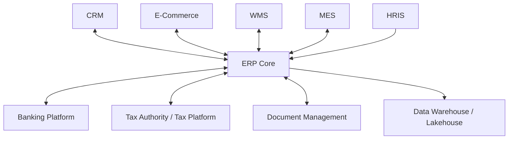
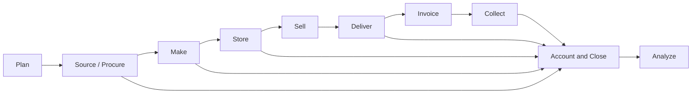
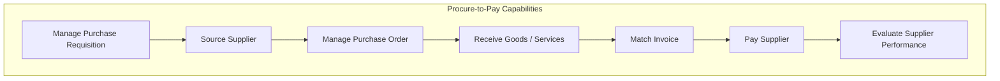
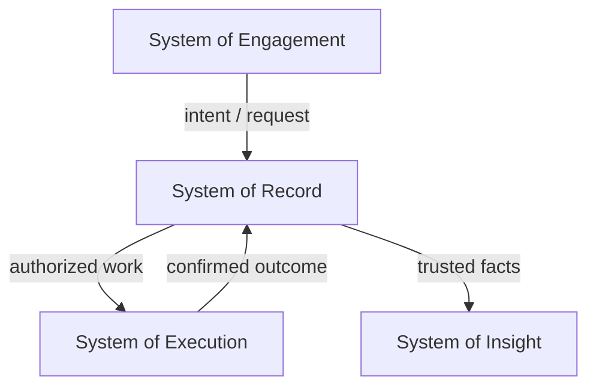
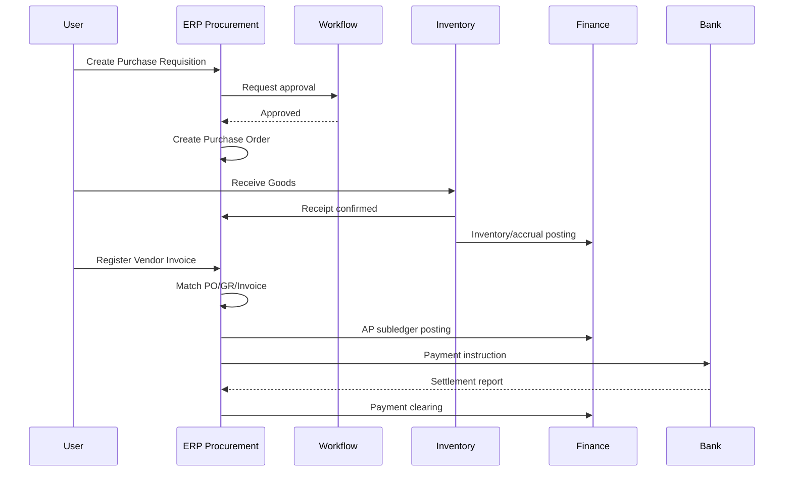
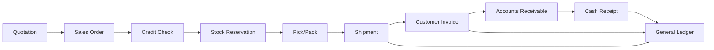
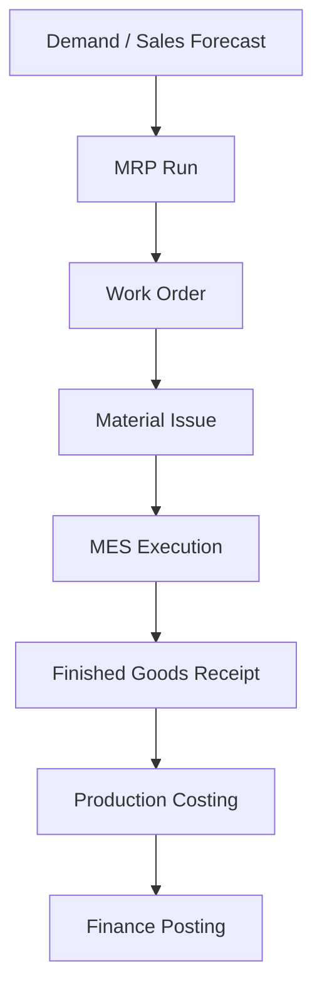
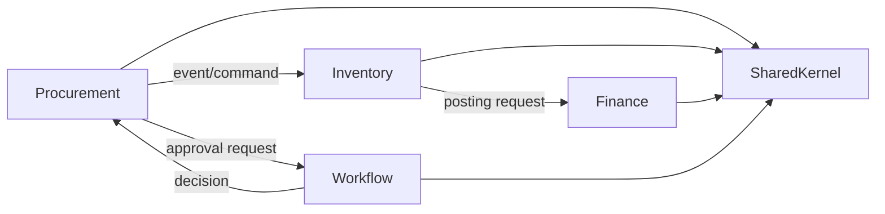

# Part 002 — Enterprise Value Chain and ERP Boundaries

## 1. Tujuan Part Ini

Part 001 membangun mental model: ERP adalah mesin konsekuensi bisnis. Part 002 menjawab pertanyaan berikutnya:

> **Apa saja area bisnis yang biasanya masuk ke ERP, bagaimana aliran nilainya, dan bagaimana menentukan boundary agar sistem tidak berubah menjadi “everything app” yang tidak bisa dikendalikan?**

Ini penting karena banyak kegagalan ERP bukan dimulai dari kode, tetapi dari boundary yang kabur.

Gejala boundary buruk:

- semua modul berbagi tabel master tanpa ownership jelas;
- semua proses dipaksa masuk satu workflow engine generik;
- finance menjadi downstream pasif yang menerima data kotor;
- reporting membaca data operasional langsung tanpa semantic layer;
- customization customer merusak core process;
- integrasi menjadi point-to-point spaghetti;
- satu perubahan kecil di procurement memecahkan inventory, tax, dan GL;
- tim tidak tahu siapa pemilik data `vendor`, `item`, `cost center`, atau `tax code`.

Tujuan part ini adalah membangun peta awal: **value chain → capability → bounded context → system boundary → integration contract**.

## 2. ERP sebagai Operating Backbone

ERP besar adalah operating backbone: sistem yang menyimpan dan mengontrol transaksi inti perusahaan.

Namun ERP bukan satu-satunya sistem enterprise. Biasanya ia hidup bersama:

- CRM untuk customer engagement;
- e-commerce untuk digital storefront;
- WMS untuk warehouse execution detail;
- MES untuk manufacturing execution;
- HRIS untuk people operations;
- payroll untuk compensation;
- banking platform untuk payment;
- tax platform untuk e-invoice/e-faktur/e-reporting;
- data warehouse/lakehouse untuk analytics;
- document management untuk attachment dan legal archive;
- identity provider untuk user lifecycle.

ERP harus menjadi pusat untuk transaksi tertentu, tetapi tidak harus menjadi pusat untuk semua aktivitas.



Boundary yang benar bukan “semua masuk ERP” atau “semua jadi microservice”. Boundary yang benar menjawab:

- siapa system of record?
- siapa system of engagement?
- siapa system of execution?
- siapa system of insight?
- siapa pemilik lifecycle data?
- siapa yang boleh mengubah state?
- siapa yang hanya menerima event?
- apa konsekuensi finansialnya?

## 3. Enterprise Value Chain: Peta Besar

Untuk memahami ERP, mulai dari aliran nilai perusahaan. ERP tidak berdiri berdasarkan tabel; ERP berdiri berdasarkan proses bisnis lintas fungsi.



ERP modern biasanya memotong value chain menjadi beberapa flow besar:

1. **Plan-to-Produce**: demand, supply planning, MRP, work order, production.
2. **Procure-to-Pay**: requisition, purchase order, receipt, invoice, payment.
3. **Order-to-Cash**: sales order, delivery, invoice, receipt.
4. **Record-to-Report**: journal, subledger, reconciliation, close, financial statements.
5. **Inventory-to-Fulfillment**: stock movement, reservation, picking, shipment.
6. **Asset-to-Retire**: acquisition, depreciation, maintenance, disposal.
7. **Project-to-Profit**: project budget, cost capture, billing, revenue/margin.
8. **Service-to-Resolution**: service order, warranty, repair, parts consumption, billing.

Tidak semua perusahaan butuh semua flow. Tetapi ERP besar harus punya cara konsisten untuk menghubungkan flow tersebut.

## 4. Value Chain vs Module: Jangan Mulai dari Nama Modul

Vendor ERP biasanya menjual modul:

- Finance;
- Procurement;
- Sales;
- Inventory;
- Manufacturing;
- Asset;
- Project;
- Service;
- HR;
- Payroll;
- CRM;
- Warehouse.

Namun untuk engineering, module list kurang cukup. Modul memberi label, tetapi tidak selalu menjelaskan dependency dan invariant.

Lebih aman mulai dari **business capability**.

Contoh pada procurement:



Capability map menjawab “apa yang harus bisa dilakukan bisnis”, bukan “class apa yang kita buat”.

## 5. Core ERP Domains

Bagian ini memberi peta domain. Kita belum masuk detail desain masing-masing; detailnya akan muncul di part berikutnya.

### 5.1 Finance and Accounting

Finance adalah pusat kepercayaan ERP. Domain finance biasanya mencakup:

- chart of accounts;
- fiscal calendar;
- accounting period;
- journal entry;
- general ledger;
- subledger integration;
- currency revaluation;
- accrual;
- tax posting;
- bank reconciliation;
- financial close;
- financial statement.

Finance bukan hanya modul laporan. Finance memberi final semantic meaning pada transaksi operasional.

Contoh: goods receipt bukan hanya stok bertambah. Dalam banyak konfigurasi, goods receipt bisa menghasilkan accrual:

```text
Dr Inventory / Expense / GRIR
Cr Goods Receipt / Invoice Receipt Clearing
```

Kemudian vendor invoice akan melakukan matching dan clearing.

Engineering implication:

- setiap operational transaction yang berdampak finansial harus punya posting rule;
- posting rule harus deterministik dan versioned;
- posted journal harus immutable;
- subledger harus bisa direkonsiliasi ke GL;
- period close harus melindungi laporan yang sudah diterbitkan.

### 5.2 Procurement

Procurement mengontrol pembelian barang/jasa.

Main documents:

- purchase requisition;
- request for quotation;
- purchase order;
- goods receipt;
- service entry;
- vendor invoice;
- debit/credit memo;
- payment request.

Critical questions:

- apakah pembelian butuh budget check?
- apakah vendor approved?
- apakah PO wajib sebelum receipt?
- apakah invoice harus match PO dan GR?
- tolerance over-receipt berapa?
- tolerance price variance berapa?
- approval berdasarkan amount atau category?
- apakah emergency procurement boleh bypass step tertentu?

Procurement boundary sering kabur dengan inventory dan finance. Kuncinya:

- procurement owns commercial commitment to vendor;
- inventory owns physical/stock consequence;
- finance owns accounting consequence;
- workflow owns decision control;
- master data owns vendor/item/tax reference lifecycle.

### 5.3 Sales and Distribution

Sales domain mengelola order customer sampai penagihan dan penerimaan.

Main documents:

- quotation;
- sales order;
- delivery order;
- shipment;
- customer invoice;
- credit memo;
- receipt allocation;
- return authorization.

Critical questions:

- kapan stock reserved?
- apakah credit limit dicek saat order atau shipment?
- apakah price locked saat order?
- apakah tax dihitung saat invoice?
- apakah partial shipment diperbolehkan?
- bagaimana backorder dibuat?
- apakah revenue recognized saat shipment atau invoice?
- bagaimana return memengaruhi inventory dan finance?

Sales boundary sering bersinggungan dengan CRM dan e-commerce.

Rule praktis:

- CRM owns lead/opportunity/customer interaction;
- e-commerce owns storefront/cart/session;
- ERP owns accepted commercial order, fulfillment obligation, invoicing, and financial posting.

### 5.4 Inventory and Warehouse

Inventory domain menjawab “apa yang kita punya, di mana, dalam kondisi apa, dan nilainya berapa”.

Core concepts:

- item;
- location;
- warehouse;
- bin;
- lot/batch;
- serial number;
- stock status;
- reservation;
- stock movement;
- stock ledger;
- valuation;
- cycle count;
- stock adjustment.

Warehouse execution bisa menjadi bagian ERP atau sistem terpisah. Perbedaannya:

- ERP inventory fokus pada stock truth, valuation, reservation, posting;
- WMS fokus pada execution detail: picking path, handheld scanner, wave picking, packing station, dock scheduling.

Boundary design:

```mermaid
flowchart LR
    ERPInv[ERP Inventory Truth]
    WMS[Warehouse Execution]
    GL[Finance / GL]

    ERPInv --> WMS: release pick/putaway task
    WMS --> ERPInv: confirm movement
    ERPInv --> GL: post inventory value impact
```

ERP tidak harus mengatur setiap langkah scanner. Tetapi ERP harus mengontrol stock ledger dan financial consequence.

### 5.5 Manufacturing

Manufacturing domain mencakup:

- bill of materials;
- routing;
- work center;
- production order;
- material issue;
- labor/machine capture;
- work in process;
- finished goods receipt;
- scrap/yield;
- production variance;
- standard/actual costing.

Boundary dengan MES:

- ERP owns production plan, order, costing, inventory, financial consequence;
- MES owns shopfloor execution, machine signal, detailed operation tracking.

Untuk large-scale ERP, manufacturing menjadi domain yang sulit karena menggabungkan:

- planning;
- inventory;
- costing;
- capacity;
- quality;
- traceability;
- IoT/MES integration;
- batch/serial recall.

### 5.6 Asset Management

Asset domain mengelola fixed asset dan sometimes maintenance.

Core capability:

- asset acquisition;
- capitalization;
- depreciation;
- transfer;
- impairment;
- maintenance;
- disposal;
- asset physical count;
- asset accounting.

Engineering challenge:

- depreciation schedule harus reproducible;
- capitalization date dan useful life harus auditable;
- disposal menghasilkan gain/loss;
- maintenance cost bisa masuk expense atau capitalized improvement;
- asset transfer bisa lintas cost center/legal entity.

### 5.7 Project Accounting

Project domain mengelola cost, revenue, dan progress berdasarkan project.

Core elements:

- project;
- work breakdown structure;
- budget;
- commitment;
- actual cost;
- time/material capture;
- milestone billing;
- revenue recognition;
- profitability analysis.

Boundary:

- project management tool bisa mengelola task collaboration;
- ERP project accounting mengelola financial truth.

### 5.8 Service Management

Service domain relevan untuk perusahaan yang menjual maintenance/repair/warranty.

Core elements:

- service contract;
- warranty entitlement;
- service order;
- technician assignment;
- parts consumption;
- repair result;
- customer billing;
- claim settlement.

Boundary dengan field service app:

- mobile app owns field interaction;
- ERP owns entitlement, inventory, billing, accounting.

## 6. Cross-Cutting Domains

Cross-cutting domain adalah domain yang tidak berdiri sebagai value chain tunggal, tetapi memengaruhi hampir semua proses.

### 6.1 Master Data

Master data adalah data referensi yang dipakai transaksi.

Contoh:

- company;
- branch;
- cost center;
- profit center;
- chart of accounts;
- customer;
- vendor;
- item;
- warehouse;
- tax code;
- currency;
- unit of measure;
- payment term;
- approval matrix.

Master data sering terlihat sederhana, tetapi justru sumber banyak bug enterprise.

Pertanyaan penting:

- siapa owner master data?
- apakah perubahan berlaku retroaktif?
- apakah perubahan butuh approval?
- apakah record bisa dinonaktifkan?
- apakah transaksi lama menyimpan snapshot?
- apakah ada effective dating?
- apakah tenant/legal entity bisa punya override?

### 6.2 Identity, Access, and Authority

ERP authority bukan hanya login.

Kita perlu model:

- identity;
- role;
- permission;
- data scope;
- approval limit;
- delegation;
- segregation of duties;
- emergency access;
- audit trail.

Misalnya user boleh membuat PO untuk branch A tetapi tidak branch B. User boleh approve sampai 100 juta, tetapi tidak boleh approve request miliknya sendiri.

### 6.3 Workflow and Case Lifecycle

Workflow menjadi cross-cutting karena banyak domain butuh approval:

- purchase requisition;
- vendor onboarding;
- customer credit limit;
- sales discount exception;
- stock adjustment;
- journal entry;
- payment run;
- asset disposal.

Namun hati-hati: workflow engine generik bisa menjadi monster jika semua domain rule dipindahkan ke konfigurasi tanpa type safety dan testability.

Prinsip:

- workflow engine mengelola routing decision;
- domain tetap mengelola invariant;
- approval result tidak boleh menggantikan domain validation.

### 6.4 Tax and Compliance

Tax sering lintas domain:

- purchase tax;
- sales tax;
- withholding tax;
- import duty;
- e-invoice;
- tax reporting;
- exemption;
- jurisdiction;
- tax period.

Tax rule bisa berubah karena regulasi. Karena itu tax engine perlu:

- versioned rule;
- effective date;
- country/localization pack;
- audit explanation;
- override governance.

### 6.5 Reporting and Analytics

Reporting adalah cross-cutting karena semua domain menghasilkan data untuk analisis.

Tetapi tidak semua report punya kebutuhan sama.

| Report Type | Latency | Correctness Need | Typical Source |
|---|---:|---:|---|
| Operational dashboard | seconds-minutes | medium-high | read model/cache |
| Financial statement | period-based | very high | GL/subledger |
| Audit report | on demand | very high | audit log + immutable records |
| BI analytics | hours-days | medium-high | warehouse/lakehouse |
| Exception report | minutes-hours | high | rules + operational read model |

## 7. Boundary Types dalam ERP

Boundary tidak hanya satu jenis. Dalam ERP, kita perlu membedakan beberapa boundary.

### 7.1 Business Capability Boundary

Ini boundary berdasarkan kemampuan bisnis.

Contoh:

```text
Manage Purchase Order
Receive Goods
Match Vendor Invoice
Post Journal
Manage Stock Reservation
```

Capability boundary berguna untuk roadmap, ownership, dan product thinking.

### 7.2 Transaction Boundary

Ini boundary berdasarkan apa yang harus konsisten dalam satu commit.

Contoh:

- posting journal harus atomik dengan status posted document;
- outbox event harus ditulis bersama transaksi sumber;
- stock ledger movement harus atomik dengan inventory document posting;
- approval decision harus atomik dengan workflow state transition.

Transaction boundary sering lebih kecil daripada capability boundary.

### 7.3 Data Ownership Boundary

Ini boundary berdasarkan siapa yang boleh mengubah data.

Contoh:

- Vendor master owned by Supplier Master Data domain;
- Vendor invoice owned by Accounts Payable;
- Payment owned by Treasury/AP Payment;
- Bank statement owned by Bank Reconciliation;
- GL journal owned by Finance.

Read boleh banyak. Write harus jelas.

### 7.4 Deployment Boundary

Ini boundary berdasarkan unit deployment.

Deployment boundary tidak harus sama dengan domain boundary.

Dalam ERP besar, modular monolith sering lebih aman untuk core financial/operational invariant, sementara service terpisah cocok untuk domain dengan lifecycle dan scaling berbeda.

### 7.5 Integration Boundary

Ini boundary kontrak antar sistem.

Pertanyaan:

- sync API atau async event?
- command atau notification?
- siapa mengakui acceptance?
- bagaimana retry?
- bagaimana schema evolution?
- bagaimana reconciliation?
- apa SLA?

### 7.6 Regulatory Boundary

Beberapa data/process punya constraint legal:

- tax invoice sequence;
- electronic invoice submission;
- audit retention;
- privacy data;
- financial statement period;
- country-specific reporting;
- export control;
- public sector procurement rule.

Regulatory boundary bisa memaksa desain berbeda per negara/legal entity.

## 8. System of Record, Engagement, Execution, Insight

Gunakan klasifikasi berikut untuk menentukan peran sistem.



### 8.1 System of Record

System of record menyimpan fakta resmi.

ERP biasanya system of record untuk:

- accepted sales order;
- purchase order;
- posted invoice;
- general ledger;
- stock ledger;
- asset register;
- financial close state.

### 8.2 System of Engagement

System of engagement mengelola interaksi user/customer.

Contoh:

- CRM;
- portal vendor;
- e-commerce;
- mobile sales app.

Sistem ini boleh mengumpulkan intent, tetapi belum tentu menjadi source of truth untuk transaksi final.

### 8.3 System of Execution

System of execution mengelola aktivitas fisik/detail operasional.

Contoh:

- WMS untuk picking/packing;
- MES untuk shopfloor;
- field service mobile app;
- transportation management system.

Execution system mengirim confirmation ke ERP.

### 8.4 System of Insight

System of insight menghasilkan analitik.

Contoh:

- data warehouse;
- lakehouse;
- BI platform;
- forecasting model.

Insight system tidak boleh menjadi tempat memperbaiki fakta transaksi resmi. Koreksi harus kembali ke system of record melalui mekanisme domain.

## 9. Boundary Decision Matrix

Gunakan matrix berikut saat menentukan apakah capability masuk ERP core, extension, atau external system.

| Question | ERP Core | ERP Extension | External System |
|---|---|---|---|
| Apakah berdampak langsung ke GL/subledger? | Biasanya ya | Mungkin | Jarang, kecuali feed ke ERP |
| Apakah butuh audit legal kuat? | Ya | Bisa | Bisa, tetapi perlu evidence bridge |
| Apakah proses sangat customer-specific? | Hindari hardcode | Cocok | Cocok jika non-core |
| Apakah throughput ekstrem dan domain independen? | Mungkin tidak | Mungkin | Cocok |
| Apakah butuh physical execution detail? | Ringkasan saja | Mungkin | Cocok untuk WMS/MES |
| Apakah source of truth transaksi resmi? | Ya | Mungkin | Tidak, kecuali domain tertentu |
| Apakah perubahan sering karena regulasi? | Ya, dengan localization layer | Ya | Bisa |
| Apakah integrasi failure bisa berdampak finansial? | Kontrol di ERP | Kontrol + queue | Reconciliation wajib |

## 10. Example: Boundary untuk Procure-to-Pay

Mari lihat satu flow.



Boundary interpretation:

- Procurement owns PR/PO commercial process.
- Workflow owns approval routing but not procurement invariant.
- Inventory owns goods receipt and stock ledger.
- Finance owns AP subledger, GL, payment accounting.
- Bank owns settlement execution.
- ERP remains responsible for reconciliation and final payment status.

### 10.1 Boundary Smell

Desain berbahaya:

```text
PurchaseOrderService.receiveGoods()
PurchaseOrderService.postInvoice()
PurchaseOrderService.payVendor()
PurchaseOrderService.updateGL()
```

Kenapa buruk?

Karena satu service menjadi pemilik semua domain. Boundary hilang.

Desain lebih baik:

```text
Procurement: PO lifecycle and supplier commitment
Inventory: receipt confirmation and stock movement
Accounts Payable: invoice registration and matching
Finance: subledger and GL posting
Treasury/Payment: payment proposal and settlement
```

Koordinasi dilakukan dengan command/event yang eksplisit, bukan service raksasa.

## 11. Example: Boundary untuk Order-to-Cash



Potential system roles:

- CRM owns lead/opportunity/quote collaboration;
- ERP owns accepted sales order and fulfillment obligation;
- WMS owns pick/pack execution;
- ERP inventory owns stock truth;
- AR owns invoice and receivable;
- Finance owns GL;
- payment gateway/bank owns payment execution;
- ERP owns allocation and reconciliation.

### 11.1 Common Mistake

Mistake:

> E-commerce payment success directly creates paid invoice in ERP.

Lebih aman:

1. e-commerce sends order/payment intent;
2. ERP creates sales order/customer invoice according to policy;
3. payment provider sends settlement notification;
4. ERP reconciles payment against invoice;
5. invoice becomes paid only after matching rule succeeds.

Kenapa? Karena payment authorization, capture, settlement, refund, chargeback, dan bank reconciliation adalah fakta berbeda.

## 12. Example: Boundary untuk Manufacturing



Boundary:

- Planning capability calculates requirement.
- ERP manufacturing owns work order and costing.
- Inventory owns material issue and finished goods receipt.
- MES owns machine/operation detail.
- Finance owns WIP, variance, and inventory value posting.

Large-scale challenge:

- MRP is batch-heavy and can lock large datasets;
- material availability depends on stock, reservations, open PO, open work order;
- cost calculation depends on BOM, routing, labor, overhead, valuation method;
- shopfloor correction must be auditable;
- batch/lot traceability matters for recall.

## 13. The “ERP Core” Rule of Thumb

Sebuah capability cenderung masuk ERP core jika memenuhi beberapa kondisi:

1. menciptakan financial posting;
2. menghasilkan legal/audit document;
3. menjadi source of truth untuk kewajiban bisnis;
4. memengaruhi inventory/asset/ledger;
5. perlu period control;
6. perlu approval defensible;
7. perlu reconciliation;
8. dipakai banyak domain downstream;
9. historinya harus bertahan lama;
10. koreksinya harus melalui reversal/adjustment.

Sebaliknya, capability cenderung cocok di luar ERP core jika:

1. fokus pada user engagement;
2. fokus pada physical execution detail;
3. lifecycle cepat berubah;
4. tidak menjadi official record;
5. membutuhkan scaling profile berbeda;
6. lebih banyak menghasilkan telemetry daripada accounting fact;
7. bisa mengirim confirmed facts ke ERP.

## 14. Boundary Anti-Patterns

### 14.1 Everything Is ERP

Semua kebutuhan dimasukkan ke ERP core.

Dampak:

- core menjadi terlalu besar;
- upgrade sulit;
- customization liar;
- release lambat;
- domain ownership hilang;
- engineer takut mengubah apa pun.

Solusi:

- pisahkan engagement/execution/insight;
- buat extension model;
- tentukan source of truth;
- gunakan integration contract eksplisit.

### 14.2 ERP as Dumb Database

ERP hanya dipakai sebagai database pusat. Sistem eksternal langsung update tabel atau memanggil API low-level.

Dampak:

- invariant bypass;
- audit trail tidak lengkap;
- workflow dilewati;
- ledger tidak sinkron;
- support tidak bisa menjelaskan state.

Solusi:

- semua perubahan state harus lewat command/application service;
- external system hanya mengirim intent atau confirmed event;
- enforce idempotency dan validation;
- expose business API, bukan table API.

### 14.3 Finance as Afterthought

Domain operasional selesai dulu, finance “nanti diposting belakangan”.

Dampak:

- reconciliation sulit;
- financial close kacau;
- subledger tidak cocok dengan GL;
- correction menjadi manual.

Solusi:

- desain posting rule sejak awal;
- definisikan subledger event;
- gunakan posting preview;
- test invariant financial dari awal.

### 14.4 Generic Workflow Eats Domain Logic

Semua rule dimasukkan ke workflow config.

Dampak:

- rule sulit dites;
- behavior tidak type-safe;
- perubahan config berisiko tinggi;
- domain invariant tersembunyi;
- audit explanation lemah.

Solusi:

- workflow mengatur routing;
- domain service mengatur invariant;
- approval policy versioned;
- config punya validation dan simulation.

### 14.5 Reporting Directly on Transaction Tables

Semua report membaca tabel OLTP langsung.

Dampak:

- query berat mengganggu transaksi;
- semantic duplication;
- report berbeda menghasilkan angka berbeda;
- sulit audit.

Solusi:

- gunakan ledger sebagai evidence;
- buat read model/materialized view;
- definisikan metric semantic;
- pisahkan operational report dan analytics.

## 15. Boundary Modelling dengan Java Packages

Pada tahap awal, boundary bisa direpresentasikan dengan package/module structure.

Contoh modular monolith sederhana:

```text
com.nis.erp
  procurement
    application
    domain
    infrastructure
    api
  inventory
    application
    domain
    infrastructure
    api
  finance
    application
    domain
    infrastructure
    api
  workflow
    application
    domain
    infrastructure
    api
  sharedkernel
    money
    time
    identity
    audit
```

Prinsip:

- domain lain tidak boleh langsung mengakses repository internal domain;
- komunikasi antar domain lewat application API atau domain event;
- shared kernel kecil dan stabil;
- jangan taruh semua utility di `common` tanpa ownership;
- enforce dependency direction dengan build rules atau architecture tests.



## 16. Architecture Decision: Modular Monolith Dulu atau Microservices?

Untuk ERP core, modular monolith sering menjadi starting point yang lebih aman karena:

- transaction boundary kuat;
- refactoring lebih mudah;
- data model bisa distabilkan dulu;
- deployment complexity rendah;
- invariant lintas module lebih mudah diuji.

Microservices cocok ketika:

- domain boundary sudah stabil;
- team ownership jelas;
- data ownership jelas;
- consistency model dipahami;
- integration/reconciliation mature;
- observability mature;
- deployment dan incident response siap.

Rule keras:

> Jangan memecah ERP menjadi microservices sebelum tahu invariant mana yang sedang Anda pecahkan.

Jika tidak, Anda hanya memindahkan kompleksitas dari method call ke network, message broker, distributed transaction illusion, dan reconciliation nightmare.

## 17. Boundary Review Checklist

Gunakan checklist ini saat menilai satu capability.

### 17.1 Business Boundary

- [ ] Capability bisnisnya jelas.
- [ ] Input intent dan output fact jelas.
- [ ] Aktor dan authority jelas.
- [ ] Dokumen utama jelas.
- [ ] Lifecycle utama jelas.

### 17.2 Data Boundary

- [ ] System of record jelas.
- [ ] Write owner jelas.
- [ ] Read access tidak berarti write access.
- [ ] Snapshot/historical semantics jelas.
- [ ] Master data dependency jelas.

### 17.3 Financial Boundary

- [ ] Ada/tidaknya financial impact jelas.
- [ ] Posting rule jelas.
- [ ] Subledger dan GL relationship jelas.
- [ ] Period control jelas.
- [ ] Reversal/adjustment path jelas.

### 17.4 Integration Boundary

- [ ] Contract sync/async jelas.
- [ ] Command vs event jelas.
- [ ] Idempotency key jelas.
- [ ] Retry policy jelas.
- [ ] Reconciliation path jelas.
- [ ] Manual repair path jelas.

### 17.5 Operational Boundary

- [ ] Owner support jelas.
- [ ] Error handling jelas.
- [ ] Observability jelas.
- [ ] Stuck state bisa dicari.
- [ ] Audit evidence bisa diekspor.

## 18. Practical Exercise: Boundary Mapping Workshop

Gunakan flow `Purchase Order to Vendor Payment`.

### Step 1 — Tulis Capability

Contoh:

```text
- Manage purchase requisition
- Approve purchase requisition
- Create purchase order
- Receive goods
- Register vendor invoice
- Match invoice
- Approve invoice exception
- Schedule payment
- Execute payment
- Reconcile settlement
```

### Step 2 — Tentukan Owner

Format:

```text
Capability:
Owner domain:
System of record:
Main document:
Financial impact:
Integration dependency:
Audit evidence:
```

### Step 3 — Tandai Boundary Berbahaya

Cari minimal 5 boundary risk:

- procurement mengubah stock langsung;
- inventory membuat journal tanpa finance rule;
- bank accepted dianggap paid;
- invoice match tolerance hardcoded;
- approval matrix tidak versioned;
- PO bisa diedit setelah receipt tanpa revision;
- vendor master berubah retroaktif.

### Step 4 — Gambar Flow

Gunakan Mermaid sequence diagram.

### Step 5 — Tulis Invariant

Minimal:

```text
Vendor invoice cannot be posted if matched quantity exceeds received quantity beyond tolerance.
Payment cannot be marked settled until bank settlement evidence is matched.
Posted AP invoice cannot be edited directly.
PO revision after approval must preserve previous approved version.
Receipt posting must create stock ledger movement.
Financial posting must be balanced.
```

## 19. Mini Java Design Sketch

Berikut sketsa boundary application service. Ini bukan final implementation; tujuannya menunjukkan ownership.

```java
package com.nis.erp.procurement.application;

public final class PurchaseOrderApplicationService {

    private final PurchaseOrderRepository purchaseOrders;
    private final ApprovalPort approvals;
    private final DomainEventPublisher events;

    public SubmitPurchaseOrderResult submit(SubmitPurchaseOrderCommand command) {
        PurchaseOrder po = purchaseOrders.getRequired(command.purchaseOrderId());

        po.assertEditableBy(command.actor());
        po.submit(command.actor(), command.submittedAt());

        ApprovalRequest approvalRequest = po.toApprovalRequest();
        approvals.requestApproval(approvalRequest);

        purchaseOrders.save(po);
        events.publish(po.pullDomainEvents());

        return SubmitPurchaseOrderResult.submitted(po.id());
    }
}
```

Inventory tidak dipanggil di sini karena submit PO belum berarti goods receipt. Finance juga belum diposting jika policy tidak memakai commitment accounting. Boundary tetap bersih.

Contoh receipt ada di inventory domain:

```java
package com.nis.erp.inventory.application;

public final class GoodsReceiptApplicationService {

    private final GoodsReceiptRepository receipts;
    private final StockLedger stockLedger;
    private final FinancePostingPort finance;
    private final IdempotencyService idempotency;

    public GoodsReceiptResult post(PostGoodsReceiptCommand command) {
        return idempotency.execute(command.requestId(), () -> {
            GoodsReceipt receipt = receipts.getRequired(command.receiptId());

            receipt.assertPostable(command.actor());
            StockMovement movement = receipt.toStockMovement();

            stockLedger.append(movement);
            finance.requestPosting(receipt.toPostingRequest());

            receipt.markPosted(command.actor(), command.postedAt());
            receipts.save(receipt);

            return GoodsReceiptResult.posted(receipt.id());
        });
    }
}
```

Finance menerima posting request, tetapi tetap memvalidasi accounting invariant sendiri. Jangan percaya domain upstream secara buta.

## 20. Key Takeaways

- ERP besar harus dipahami lewat value chain, bukan daftar tabel atau nama modul.
- Boundary yang baik membedakan business capability, transaction boundary, data ownership, deployment, integration, dan regulatory constraint.
- ERP core biasanya memegang official record, financial consequence, document lifecycle, period control, dan audit evidence.
- Tidak semua aktivitas enterprise harus masuk ERP core; CRM, WMS, MES, DWH, dan external platforms punya peran berbeda.
- Modular monolith sering lebih aman untuk ERP core sampai boundary dan invariant matang.
- Microservices tanpa data ownership dan reconciliation hanya menciptakan distributed inconsistency.

## 21. Source Notes

Sumber berikut dipakai sebagai anchor faktual dan konteks ekosistem, bukan sebagai batas materi:

- Josh Kaufman, *The First 20 Hours: How to Learn Anything... Fast* — kerangka deconstruct skill, learn enough, remove barriers, deliberate practice.
- Oracle Java Downloads — posisi JDK 25 sebagai LTS dan JDK 26 sebagai release terbaru saat materi ini dibuat: <https://www.oracle.com/java/technologies/downloads/>
- Spring Boot System Requirements — baseline Java modern untuk Spring Boot: <https://docs.spring.io/spring-boot/system-requirements.html>
- Jakarta EE Platform 11 Specification — minimum Java SE 17 dan cakupan platform enterprise: <https://jakarta.ee/specifications/platform/11/>
- Apache OFBiz — contoh open-source ERP berbasis Java: <https://ofbiz.apache.org/>

## 22. Status Seri

Part 002 selesai. Seri **belum selesai**. Lanjut ke **Part 003 — Large Scale ERP Reference Architecture**.
