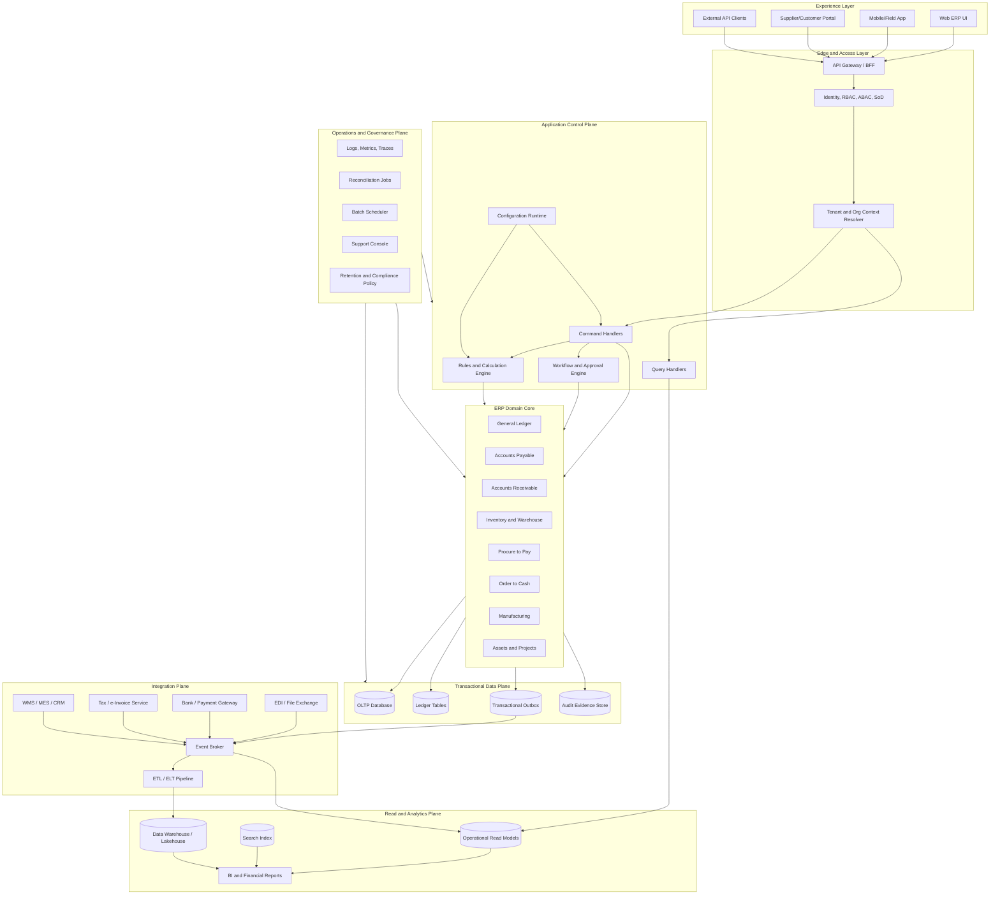
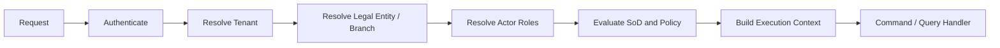
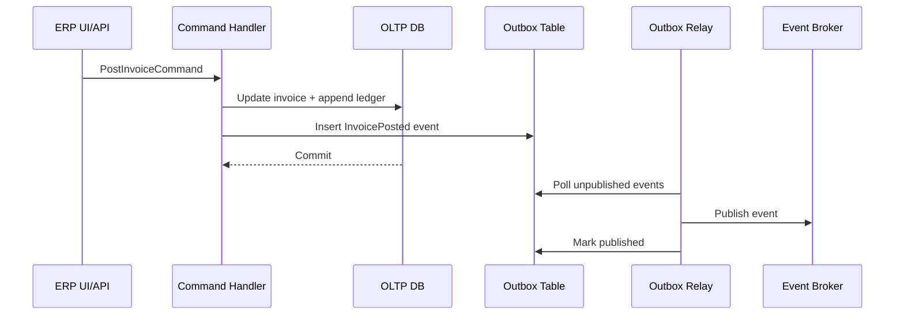
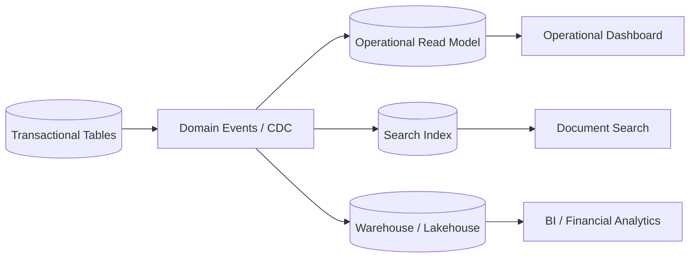
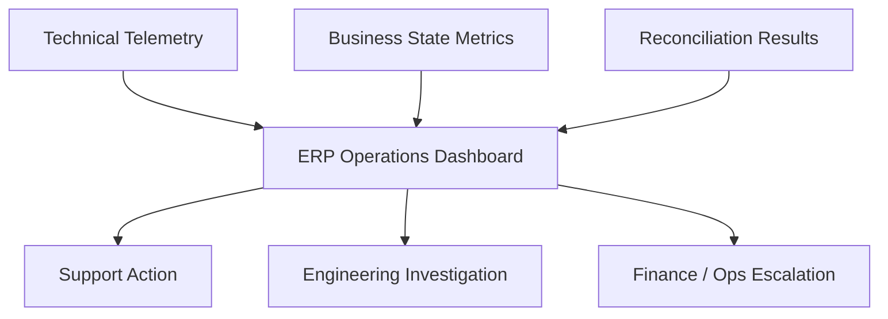
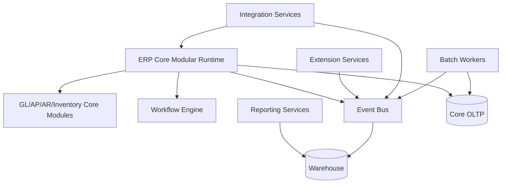
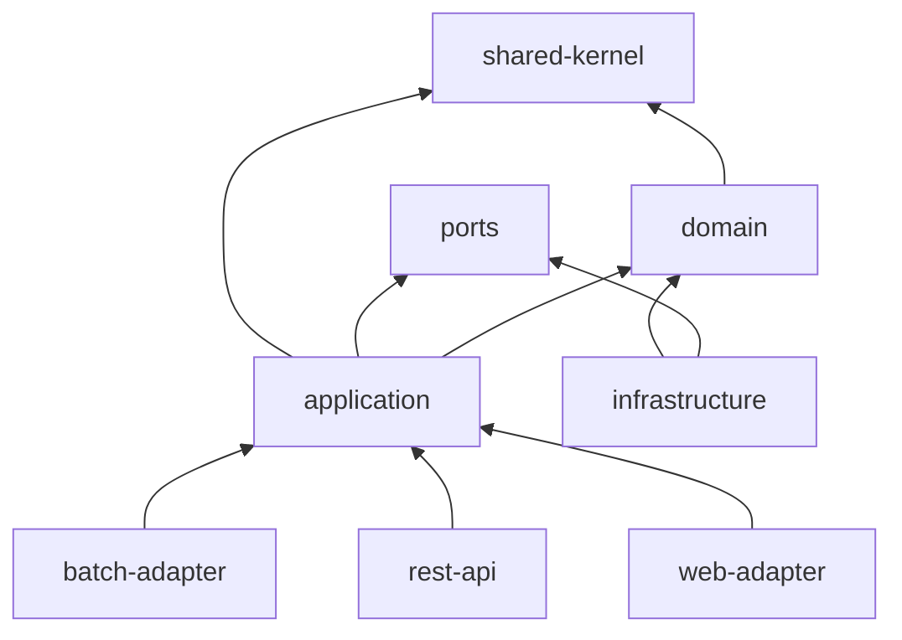

# Part 003 — Large Scale ERP Reference Architecture

## 1. Target Skill Part Ini

Pada part sebelumnya kita memposisikan ERP sebagai **sistem pengendali bisnis**, bukan sekadar aplikasi administrasi. Part ini membawa kita ke pertanyaan arsitektural paling penting:

> **Seperti apa bentuk arsitektur Java ERP berskala besar yang cukup modular untuk berubah, cukup konsisten untuk menjaga data bisnis, cukup terbuka untuk integrasi, dan cukup operasional untuk dipakai bertahun-tahun?**

Target part ini bukan menghafal diagram. Targetnya adalah membentuk kemampuan membaca dan mendesain ERP dari beberapa sudut sekaligus:

- **domain architecture**: capability apa yang dimiliki sistem;
- **application architecture**: bagaimana command, workflow, rule, query, dan integration diatur;
- **data architecture**: siapa pemilik data, siapa boleh menulis, siapa hanya membaca;
- **runtime architecture**: bagaimana sistem dideploy, diskalakan, diamati, dan dipulihkan;
- **governance architecture**: bagaimana audit, security, customization, dan compliance tidak menjadi tambalan belakangan.

Dalam kerangka Kaufman, part ini adalah tahap **deconstruct the skill** di level architecture. Kita memecah ERP menjadi plane dan boundary yang bisa dilatih secara terpisah.

## 2. Prinsip Utama: ERP Tidak Punya Satu Arsitektur Tunggal

ERP besar biasanya tidak murni monolith, tidak murni microservices, dan tidak murni event-driven. Bentuk yang realistis sering berupa kombinasi:

- **modular core** untuk transaksi yang butuh konsistensi tinggi;
- **service-oriented extensions** untuk domain yang berubah cepat atau punya scaling berbeda;
- **event-driven integration** untuk propagasi fakta bisnis;
- **read model/reporting plane** untuk kebutuhan query berat;
- **batch/data pipeline** untuk close period, MRP, aging, reconciliation, dan analytical workload;
- **workflow engine** untuk long-running business process;
- **configuration/customization layer** untuk perbedaan tenant, negara, legal entity, dan proses bisnis.

Arsitektur ERP yang baik tidak memaksakan satu gaya ke semua masalah. Ia memilih bentuk berdasarkan constraint.

### 2.1 Constraint yang Menentukan Bentuk Arsitektur

| Constraint | Dampak Arsitektural |
|---|---|
| Financial correctness | Ledger, posting, period lock, reversal, audit trail harus kuat. |
| Operational consistency | Inventory, fulfillment, procurement, dan production tidak boleh kehilangan fakta transaksional. |
| Long-running workflow | Approval, escalation, delegation, dan SLA membutuhkan state machine eksplisit. |
| Customization pressure | Sistem butuh extension point yang aman, bukan patch langsung ke core. |
| Reporting pressure | OLTP tidak boleh dipaksa menjadi mesin analytics. |
| Integration pressure | API/event/file/EDI/bank/tax integration perlu idempotency dan reconciliation. |
| Regulatory pressure | Data lineage, audit evidence, access control, retention, dan defensibility wajib dari awal. |
| Multi-company rollout | Legal entity, branch, fiscal calendar, currency, language, tax, dan localization perlu model organisasi kuat. |

Arsitektur yang gagal biasanya bukan karena salah memilih framework. Ia gagal karena constraint ini tidak diterjemahkan menjadi boundary teknis.

## 3. Reference Architecture: View Besar

Diagram berikut adalah bentuk referensi yang akan kita pakai sepanjang seri. Ini bukan template vendor. Ini adalah peta mental untuk menempatkan komponen ERP.



Model ini sengaja dipisahkan menjadi beberapa plane. Dalam ERP, pemisahan plane jauh lebih berguna daripada hanya membicarakan layer teknis seperti controller-service-repository.

## 4. Plane 1: Experience Layer

Experience layer adalah semua permukaan interaksi manusia dan sistem eksternal:

- internal ERP web UI;
- mobile app untuk warehouse, field service, approval, receiving, delivery;
- supplier portal;
- customer portal;
- public/private API client;
- admin/support console.

Kesalahan umum adalah membiarkan UI menentukan bentuk domain. Di ERP besar, UI boleh berbeda-beda, tetapi fakta bisnis harus tetap masuk melalui command model yang sama.

### 4.1 Rule Praktis

> **UI boleh punya workflow presentation sendiri, tetapi tidak boleh punya business authority sendiri.**

Contoh buruk:

```text
Button "Approve Invoice" langsung update status invoice menjadi APPROVED.
```

Contoh lebih defensible:

```text
UI mengirim ApproveInvoiceCommand.
Application layer memvalidasi actor, SoD, approval policy, period, amount threshold, dan current state.
Domain menghasilkan InvoiceApproved fact.
Audit evidence ditulis dalam transaksi yang sama.
```

### 4.2 Java Implication

Di Java ERP, experience layer biasanya diterjemahkan sebagai:

- REST controller / GraphQL resolver / server-side UI endpoint;
- DTO khusus UI;
- request validation ringan;
- authorization pre-check;
- mapping ke command/query;
- correlation id dan request context.

Yang tidak boleh berada di layer ini:

- posting ledger;
- perhitungan tax final;
- approval authority final;
- mutation terhadap aggregate tanpa command;
- data access langsung ke tabel core.

## 5. Plane 2: Edge and Access Layer

ERP besar membutuhkan access control yang jauh lebih kaya daripada “user punya role admin”. Banyak bug ERP serius berasal dari access model yang terlalu dangkal.

Layer ini bertanggung jawab atas:

- authentication;
- session/token validation;
- tenant resolution;
- organization context;
- role dan permission;
- attribute-based policy;
- segregation of duties;
- delegated authority;
- data scope;
- approval authority.



### 5.1 Execution Context

ERP command tidak cukup menerima `userId`. Ia butuh konteks yang lebih lengkap:

```java
public record ErpExecutionContext(
    TenantId tenantId,
    UserId actorId,
    LegalEntityId legalEntityId,
    BranchId branchId,
    Set<RoleCode> roles,
    Set<PermissionCode> permissions,
    Set<DataScope> dataScopes,
    Instant requestedAt,
    CorrelationId correlationId
) {}
```

Konteks ini bukan sekadar convenience object. Ia adalah boundary antara sistem keamanan dan domain transaction.

### 5.2 Access Control Sebagai Invariant

Dalam ERP, access control sering menjadi bagian dari invariant bisnis. Contoh:

- user yang membuat purchase order tidak boleh menjadi approver akhir untuk PO yang sama;
- user finance boleh posting invoice tetapi tidak boleh mengubah bank account vendor;
- branch manager hanya boleh approve expense di branch miliknya;
- CFO boleh override credit hold tetapi override harus tercatat sebagai audit evidence.

Artinya, authorization tidak boleh hanya dipasang sebagai annotation generik di controller. Sebagian policy harus dievaluasi dalam command handler atau domain service karena bergantung pada state dokumen.

## 6. Plane 3: Application Control Plane

Application control plane adalah pusat orkestrasi use case. Di sini command, workflow, rules, configuration, dan domain dipertemukan.

Komponen utamanya:

- command handler;
- query handler;
- workflow/application service;
- validation coordinator;
- rule/calculation engine;
- configuration runtime;
- transaction boundary manager;
- event publisher/outbox writer;
- audit evidence writer.

### 6.1 Command vs Query

ERP besar sebaiknya eksplisit membedakan command dan query.

| Jenis | Karakter | Contoh |
|---|---|---|
| Command | Mengubah state bisnis, harus tervalidasi, audited, idempotent bila perlu | `SubmitPurchaseOrder`, `PostInvoice`, `ReverseJournal` |
| Query | Membaca state atau read model, tidak mengubah invariant | `FindOpenInvoices`, `GetInventoryPosition`, `GetApprovalInbox` |

Command harus melewati invariant. Query boleh dioptimalkan dengan read model.

```java
public interface ErpCommandHandler<C extends ErpCommand, R> {
    R handle(C command, ErpExecutionContext context);
}

public record PostVendorInvoiceCommand(
    InvoiceId invoiceId,
    IdempotencyKey idempotencyKey,
    PostingDate postingDate
) implements ErpCommand {}
```

### 6.2 Command Handler Sebagai Use Case Boundary

Contoh bentuk command handler:

```java
@Transactional
public PostingResult handle(PostVendorInvoiceCommand command, ErpExecutionContext ctx) {
    idempotencyGuard.ensureNotProcessed(command.idempotencyKey());

    VendorInvoice invoice = invoiceRepository.getForUpdate(command.invoiceId());
    policy.checkCanPost(invoice, ctx);
    periodPolicy.checkOpen(invoice.legalEntityId(), command.postingDate());

    PostingBatch batch = postingService.createPosting(invoice, command.postingDate(), ctx);
    ledgerRepository.append(batch.entries());

    invoice.markPosted(batch.postingId(), ctx.actorId());
    auditEvidence.record(InvoicePostedEvidence.from(invoice, batch, ctx));
    outbox.add(DomainEventEnvelope.from(new VendorInvoicePosted(invoice.id(), batch.postingId())));

    idempotencyGuard.markProcessed(command.idempotencyKey(), batch.postingId());
    return new PostingResult(batch.postingId());
}
```

Yang penting bukan syntax-nya. Yang penting adalah **urutan tanggung jawab**:

1. deduplicate/idempotency;
2. load state dengan concurrency policy yang benar;
3. access dan business policy;
4. period/accounting constraint;
5. domain calculation/posting;
6. state transition;
7. audit evidence;
8. outbox event;
9. idempotency completion.

## 7. Plane 4: ERP Domain Core

Domain core berisi capability yang membentuk sistem ERP:

- General Ledger;
- Accounts Payable;
- Accounts Receivable;
- Inventory;
- Procurement;
- Sales;
- Manufacturing;
- Assets;
- Projects;
- Tax;
- Pricing;
- Workflow;
- Master Data;
- Organization Model.

Tetapi domain core tidak berarti semua modul harus berada dalam satu database dan satu deployment. Domain core berarti ada area yang memegang business authority.

### 7.1 Authority Lebih Penting dari Tabel

Pertanyaan arsitektural yang benar:

> Siapa yang memiliki authority untuk menyatakan fakta bisnis ini benar?

Contoh:

| Fakta Bisnis | Authority Utama |
|---|---|
| Vendor invoice posted | AP/Subledger + GL posting pipeline |
| Stock decreased karena shipment | Inventory/warehouse ledger |
| Customer credit hold dilepas | AR/Credit control |
| Purchase order approved | Procurement workflow/policy |
| Accounting period closed | Finance period control |
| Tax amount final | Tax calculation authority + localization policy |

Jika ownership authority tidak jelas, sistem akan menciptakan duplikasi logic dan rekonsiliasi manual.

### 7.2 Domain Core Tidak Sama Dengan Shared Kernel Besar

Banyak ERP internal gagal karena membuat paket `core` yang berisi semuanya:

```text
core/
  Customer
  Vendor
  Product
  Invoice
  PurchaseOrder
  SalesOrder
  Ledger
  Approval
  Workflow
  Tax
  Config
```

Ini terlihat rapi, tetapi secara evolusi buruk. Semua modul menjadi saling bergantung. Perubahan kecil di `Product` bisa memicu build dan regression seluruh sistem.

Lebih baik memisahkan authority:

```text
modules/
  organization/
  masterdata/
  finance-gl/
  finance-ap/
  finance-ar/
  inventory/
  procurement/
  sales/
  manufacturing/
  workflow/
  tax/
  integration/
  reporting/
```

Shared kernel harus kecil dan stabil:

```text
shared-kernel/
  TenantId
  LegalEntityId
  Money
  CurrencyCode
  Quantity
  UomCode
  DocumentNumber
  FiscalPeriod
  AuditActor
```

## 8. Plane 5: Transactional Data Plane

Transactional data plane adalah tempat fakta bisnis yang authoritative ditulis. Dalam ERP, ini bukan sekadar “database”. Ini adalah sistem memori legal dan operasional perusahaan.

Komponennya:

- OLTP tables;
- ledger tables;
- document tables;
- state transition history;
- audit evidence store;
- transactional outbox;
- idempotency records;
- import staging;
- reconciliation tables.

### 8.1 Prinsip Data Plane

1. **Write authority harus jelas.**
2. **Ledger harus append-friendly dan dapat direkonsiliasi.**
3. **Audit evidence tidak boleh bergantung pada log aplikasi saja.**
4. **Outbox event harus ikut transaction boundary.**
5. **Read model tidak boleh menjadi sumber kebenaran.**
6. **Correction harus melalui reversal/adjustment, bukan silent update.**

### 8.2 Transactional Outbox

Dalam ERP, event bukan dekorasi. Event sering dipakai untuk menyinkronkan invoice, payment, shipment, stock, dan financial posting. Jika event publish gagal setelah database commit, downstream bisa kehilangan fakta bisnis. Karena itu, transactional outbox menjadi pattern penting.



Outbox tidak membuat sistem “exactly once”. Ia membuat **state change dan event intent** berada dalam satu commit. Downstream tetap harus idempotent.

## 9. Plane 6: Integration Plane

ERP jarang hidup sendiri. Ia berhubungan dengan:

- CRM;
- WMS;
- MES;
- e-commerce;
- bank;
- tax authority;
- payment gateway;
- payroll;
- BI platform;
- supplier/customer EDI;
- document management;
- identity provider.

Integration plane harus mengakui bahwa dunia luar tidak konsisten, tidak selalu online, dan tidak selalu idempotent.

### 9.1 Mode Integrasi

| Mode | Cocok Untuk | Risiko |
|---|---|---|
| Synchronous API | Validasi cepat, lookup, low-latency command | Coupling, timeout, partial failure |
| Async event | Propagasi fakta bisnis, decoupling | Eventual consistency, duplicate, ordering |
| File/EDI | Partner enterprise legacy | Late failure, mapping ambiguity |
| Batch ETL/ELT | Reporting, analytics, migration | Staleness, reconciliation gap |
| Webhook | External notification | Retry semantics tidak seragam |
| Polling | Sistem eksternal tanpa event | Load, delay, duplicate processing |

### 9.2 Rule Praktis Integrasi ERP

> **Tidak ada integrasi ERP yang selesai tanpa idempotency, retry policy, dead-letter handling, dan reconciliation.**

Minimal setiap integration flow punya:

- correlation id;
- external reference id;
- internal document id;
- idempotency key;
- received/sent timestamp;
- payload hash;
- processing status;
- retry count;
- failure reason;
- reconciliation status.

## 10. Plane 7: Read and Analytics Plane

ERP workload berat bukan hanya transaksi. Reporting bisa menjadi beban terbesar:

- trial balance;
- profit and loss;
- balance sheet;
- aging AR/AP;
- inventory valuation;
- stock position;
- MRP projection;
- sales margin;
- tax report;
- audit report;
- close checklist.

Jika semua laporan membaca OLTP langsung dengan join raksasa, sistem transaksi akan melambat dan risk of lock/contention naik.

### 10.1 Pemisahan Read Model



Read model bukan tempat memperbaiki data. Jika read model menemukan anomali, koreksi harus kembali ke authoritative domain melalui command/reconciliation process.

### 10.2 Jenis Read Model

| Read Model | Contoh | Freshness |
|---|---|---|
| Operational | approval inbox, open PO, stock position | near real-time |
| Search | invoice search, customer search, item search | seconds/minutes |
| Financial report | trial balance, aging, close report | controlled batch/near real-time |
| Analytics | margin analysis, spend analysis | batch/warehouse |
| Audit evidence view | who changed what, when, why | strongly traceable |

## 11. Plane 8: Configuration and Extension Plane

ERP besar selalu dikustomisasi. Pertanyaannya bukan apakah customization dibutuhkan. Pertanyaannya:

> **Apakah customization dapat dilakukan tanpa merusak core invariant dan upgrade path?**

Configuration dan extension plane mencakup:

- feature flags;
- tenant/business parameters;
- approval matrix;
- tax localization;
- custom fields;
- custom validations;
- custom workflow steps;
- integration mapping;
- report layout;
- document numbering rules;
- extension events/hooks;
- plugin/module lifecycle.

### 11.1 Config Bukan Sekadar Key-Value

Contoh buruk:

```text
config_key = "allow_negative_stock"
config_value = "true"
```

Contoh lebih defensible:

```java
public record StockPolicy(
    TenantId tenantId,
    LegalEntityId legalEntityId,
    BranchId branchId,
    boolean allowNegativeStock,
    EffectiveDateRange effectiveDateRange,
    PolicyVersion version,
    ApprovalStatus status
) {}
```

Config ERP perlu:

- scope;
- effective dating;
- version;
- approval;
- audit trail;
- validation;
- fallback hierarchy;
- migration semantics.

### 11.2 Extension Safety

Extension point harus diberi batas:

| Extension | Aman Jika | Bahaya Jika |
|---|---|---|
| Custom field | Typed, scoped, indexed bila perlu | Mengubah meaning field core |
| Custom validation | Deterministic, timeout, versioned | Bisa bypass invariant core |
| Workflow hook | Tidak mengubah ledger langsung | Menulis status tanpa state machine |
| Integration mapper | Schema versioned | Mapping diam-diam berubah |
| Script rule | Sandboxed, observable | Tidak ada limit/trace/audit |

## 12. Plane 9: Operations and Governance Plane

ERP yang bagus bukan hanya benar ketika demo. Ia harus bisa dioperasikan saat:

- posting batch gagal di tengah malam;
- invoice tertahan karena workflow stuck;
- period close menghasilkan imbalance;
- integrasi bank mengirim file duplikat;
- MRP run memakan waktu terlalu lama;
- tenant besar menghasilkan report burst;
- auditor meminta bukti perubahan data;
- support perlu menjelaskan kenapa dokumen tidak bisa diposting.

Operations plane mencakup:

- observability teknis;
- observability bisnis;
- batch scheduler;
- reconciliation jobs;
- support console;
- retry dashboard;
- stuck workflow detector;
- data quality monitor;
- audit extraction;
- retention management.

### 12.1 Business Observability

Metric teknis seperti CPU dan latency penting, tetapi tidak cukup. ERP perlu metric bisnis:

- count invoice failed to post;
- aging of approval tasks;
- unmatched goods receipt vs invoice;
- stock ledger imbalance;
- outbox backlog;
- number of documents stuck in submitted state;
- period close checklist completion;
- integration dead-letter count by partner;
- reconciliation difference by account/currency/legal entity.



## 13. Deployment Shapes

Reference architecture bisa diwujudkan dalam beberapa deployment shape. Tidak ada satu jawaban universal.

### 13.1 Modular Monolith

Satu deployable, banyak modul internal dengan boundary kuat.

Cocok ketika:

- tim masih relatif kecil/medium;
- domain masih cepat berubah;
- transaksi lintas modul sangat kuat;
- operational maturity belum cukup untuk banyak service;
- kebutuhan deployment independence belum dominan.

Risiko:

- boundary mudah dilanggar;
- database menjadi shared dumping ground;
- build/test bisa melambat;
- scaling kurang granular.

Struktur contoh:

```text
erp-platform/
  shared-kernel/
  module-organization/
  module-masterdata/
  module-finance-gl/
  module-finance-ap/
  module-procurement/
  module-inventory/
  module-sales/
  module-workflow/
  module-reporting/
  app-runtime/
```

### 13.2 Distributed Modular ERP

Beberapa modul menjadi service terpisah, tetapi boundary tetap berdasarkan capability, bukan berdasarkan tabel atau tim yang kebetulan ada.

Cocok ketika:

- domain tertentu butuh scaling terpisah;
- integrasi eksternal berat;
- tim sudah punya ownership jelas;
- release cadence berbeda;
- failure isolation bernilai tinggi.

Risiko:

- distributed transaction temptation;
- duplicate master data;
- event ordering issue;
- debugging lintas service;
- operational overhead;
- distributed monolith.

### 13.3 Hybrid Shape yang Paling Umum

Untuk ERP besar, bentuk realistis sering seperti ini:



Core transaction tetap dekat dengan database yang konsisten. Extension, integration, reporting, dan batch bisa dipisah jika pressure-nya berbeda.

## 14. Java Stack View

Seri ini tidak akan mengunci pada satu framework, tetapi asumsi praktisnya adalah Java modern dengan salah satu keluarga platform berikut:

- **Spring Boot / Spring Framework** untuk service runtime, web, transaction management, dependency injection, observability, batch, dan integration;
- **Jakarta EE** untuk enterprise standard APIs seperti persistence, REST, messaging, validation, batch, concurrency, dan security;
- **plain Java modules/libraries** untuk domain core yang tidak bergantung langsung pada framework;
- **relational database** sebagai authoritative OLTP store;
- **message broker** untuk event/integration;
- **warehouse/lakehouse/search** untuk read-heavy workload.

Catatan faktual: dokumentasi Spring Boot 4.1 menyatakan minimal Java 17 dan kompatibel sampai Java 26; Jakarta EE Platform 11 juga mensyaratkan Java SE 17 atau lebih tinggi dan menambahkan dukungan seperti Jakarta Data 1.0 serta runtime-aware support untuk virtual threads. Apache OFBiz relevan sebagai referensi open-source karena proyek resminya mendeskripsikannya sebagai ERP berbasis Java dengan entity engine, service engine, dan widget-based UI.

### 14.1 Dependency Direction yang Disarankan



Rule:

- domain tidak bergantung pada Spring/Jakarta;
- application layer boleh memakai transaction boundary framework;
- infrastructure mengimplementasikan port;
- adapter menerjemahkan protokol eksternal ke command/query;
- shared kernel kecil dan stabil.

### 14.2 Package Contoh

```text
com.company.erp
  shared
    money
    time
    tenant
    audit
  finance.gl
    domain
    application
    adapter.persistence
    adapter.rest
    adapter.events
  procurement
    domain
    application
    adapter.persistence
    adapter.rest
    adapter.events
  inventory
    domain
    application
    adapter.persistence
    adapter.rest
    adapter.events
  platform.workflow
  platform.config
  platform.integration
  platform.observability
```

Pemisahan package bukan jaminan boundary. Boundary harus diuji dengan architecture test, dependency rule, ownership rule, dan database write policy.

## 15. Architecture Decision Matrix

Gunakan matrix ini saat memilih bentuk implementasi.

| Keputusan | Pilih A Jika | Pilih B Jika | Warning |
|---|---|---|---|
| Modular monolith vs service | Konsistensi tinggi dan domain belum stabil | Scaling/release/ownership butuh isolasi | Jangan split hanya karena “microservices modern” |
| Shared DB vs database per service | Modul masih satu transactional core | Service benar-benar punya data authority | Shared DB lintas service sering menjadi distributed monolith |
| Sync API vs async event | Butuh jawaban langsung | Fakta bisa diproses eventual | Sync call di tengah transaction ERP berisiko timeout/rollback kompleks |
| Read from OLTP vs read model | Query sederhana dan bounded | Query berat, cross-domain, analytical | Reporting-on-OLTP bisa menghancurkan performa posting |
| Config vs code | Perubahan bisnis rutin dan aman diparameterisasi | Invariant core atau calculation kritis | Over-config menciptakan bahasa ERP liar tanpa governance |
| Workflow engine vs hardcoded state | Approval berubah, long-running, SLA | Lifecycle sederhana dan stabil | Workflow generic tanpa invariant domain bisa membahayakan |

## 16. Failure Modes Arsitektur ERP

### 16.1 God ERP Core

Semua domain masuk ke satu module `core`. Awalnya cepat, lalu semua perubahan menjadi regression besar.

Gejala:

- dependency graph melingkar;
- semua repository bisa diakses dari semua service;
- class `DocumentService` menangani semua jenis dokumen;
- test sulit diisolasi;
- deployment selalu all-or-nothing.

Perbaikan:

- buat capability map;
- pisahkan ownership write model;
- kurangi shared kernel;
- enforce module dependency;
- mulai dari boundary paling berisiko: ledger, inventory, workflow.

### 16.2 Distributed Monolith

Service terpisah secara deployment tetapi saling memanggil sinkron secara rapat dan berbagi skema mental yang sama.

Gejala:

- satu transaction bisnis butuh 5 service sinkron;
- deployment satu service sering menunggu service lain;
- failure satu service menjatuhkan use case utama;
- data ownership tidak jelas;
- event hanya dipakai sebagai notifikasi setelah coupling terjadi.

Perbaikan:

- definisikan authority per capability;
- ubah fakta bisnis menjadi event authoritative;
- gunakan command boundary yang jelas;
- hindari query lintas service untuk decision kritis;
- buat local read model untuk kebutuhan lintas domain.

### 16.3 Reporting-on-OLTP Collapse

Laporan berat membaca tabel transaksi langsung.

Gejala:

- posting invoice lambat saat jam laporan;
- index dibuat khusus report dan memperlambat write;
- query ad-hoc dari BI mengunci tabel besar;
- batch close mengganggu operasional harian.

Perbaikan:

- operational read model;
- warehouse/lakehouse;
- CDC/event projection;
- report snapshot;
- workload isolation.

### 16.4 Extension Tanpa Governance

Customization bisa mengubah apa saja.

Gejala:

- script custom menulis tabel core;
- upgrade gagal karena extension bergantung pada detail internal;
- audit tidak tahu logic mana yang berlaku saat transaksi dibuat;
- tenant A rusak karena perubahan tenant B.

Perbaikan:

- extension sandbox;
- stable extension API;
- versioned config;
- extension approval lifecycle;
- observability per extension;
- prohibition terhadap direct core write.

## 17. Practice: Mendesain One-Slice ERP Architecture

Latihan 90 menit:

1. Pilih satu use case: `PostVendorInvoice`.
2. Gambar plane yang terlibat: UI, access, command, AP, GL, data, outbox, audit, reporting.
3. Tentukan authoritative write model.
4. Tentukan event yang keluar.
5. Tentukan read model yang diperbarui.
6. Tentukan failure mode: duplicate command, period closed, missing vendor account, ledger imbalance, outbox backlog.
7. Tulis minimal 5 invariant.
8. Tulis architecture decision record pendek.

Template ADR:

```mdx
## Decision
Kita mem-post vendor invoice melalui AP command handler yang membuat subledger posting dan GL journal dalam satu transactional boundary.

## Context
Invoice posting harus menjaga double-entry invariant, period lock, audit evidence, dan idempotency.

## Consequences
- AP dan GL harus berada dekat di core transactional runtime.
- Event keluar melalui transactional outbox.
- Reporting membaca projection, bukan tabel posting langsung.
- Integrasi payment memakai event `VendorInvoicePosted`.
```

## 18. Review Checklist

Gunakan checklist ini untuk menilai reference architecture ERP:

- Apakah setiap capability punya owner write authority?
- Apakah command dan query dipisahkan secara eksplisit?
- Apakah ledger dan dokumen legal punya audit trail yang kuat?
- Apakah workflow mengontrol transisi state, bukan sekadar status field?
- Apakah authorization mempertimbangkan tenant, legal entity, branch, role, data scope, dan SoD?
- Apakah integration flow punya idempotency, retry, DLQ, dan reconciliation?
- Apakah reporting berat dipisahkan dari OLTP?
- Apakah extension point aman dari direct write ke core table?
- Apakah config punya versioning, scope, effective date, dan approval?
- Apakah observability mencakup business metrics, bukan hanya latency/CPU?
- Apakah deployment shape dipilih berdasarkan constraint, bukan tren?
- Apakah ada rescue path saat posting, workflow, batch, atau integration gagal?

## 19. Mental Model Akhir

Reference architecture ERP bukan diagram statis. Ia adalah **sistem boundary**.

Boundary yang harus selalu terlihat:

- siapa boleh menulis fakta bisnis;
- siapa boleh membaca dan dari mana;
- transaksi mana harus atomic;
- transaksi mana boleh eventual;
- state mana legal;
- correction mana harus reversal;
- extension mana aman;
- integrasi mana perlu rekonsiliasi;
- laporan mana boleh membaca data real-time dan mana harus membaca snapshot/projection;
- evidence apa yang dibutuhkan ketika transaksi dipertanyakan.

Jika boundary ini tidak eksplisit, ERP akan tetap bisa berjalan, tetapi sulit dipercaya ketika skala, audit, customization, dan integrasi mulai meningkat.

## 20. Source Notes

Beberapa referensi faktual yang relevan untuk konteks arsitektur Java ERP modern:

- Spring Boot System Requirements: `https://docs.spring.io/spring-boot/system-requirements.html`
- Jakarta EE Platform 11: `https://jakarta.ee/specifications/platform/11/`
- Apache OFBiz Project: `https://ofbiz.apache.org/`
- Martin Fowler, Monolith First: `https://martinfowler.com/bliki/MonolithFirst.html`
- Martin Fowler, Microservices: `https://martinfowler.com/articles/microservices.html`

Referensi ini tidak dipakai sebagai template tunggal. Seri ini mengambil prinsip yang stabil: modularity, ownership, integration reliability, transactional correctness, dan evolvability.
