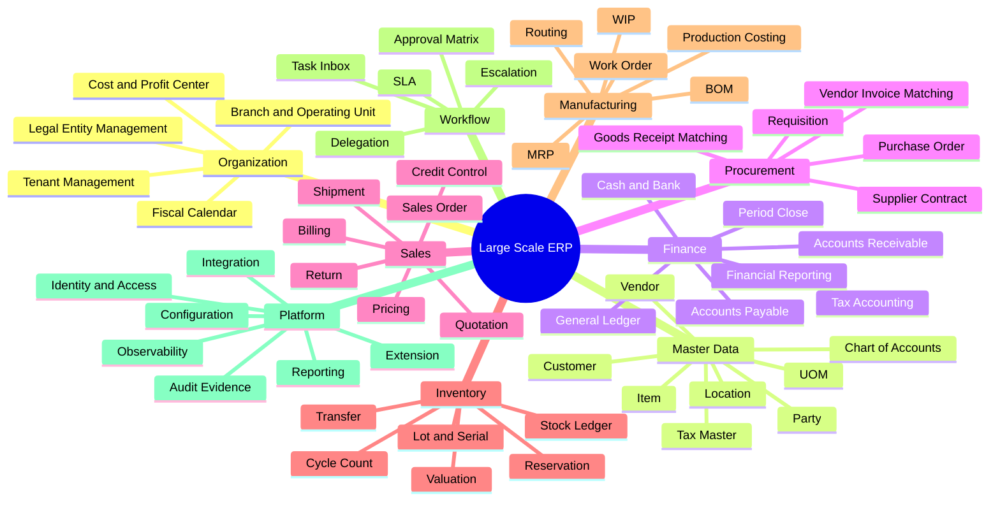
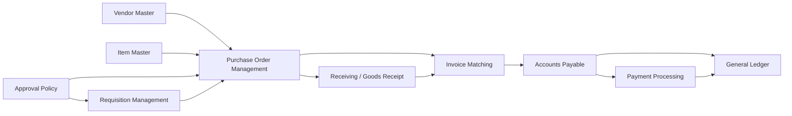
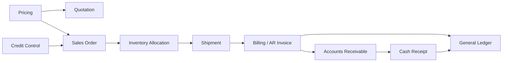
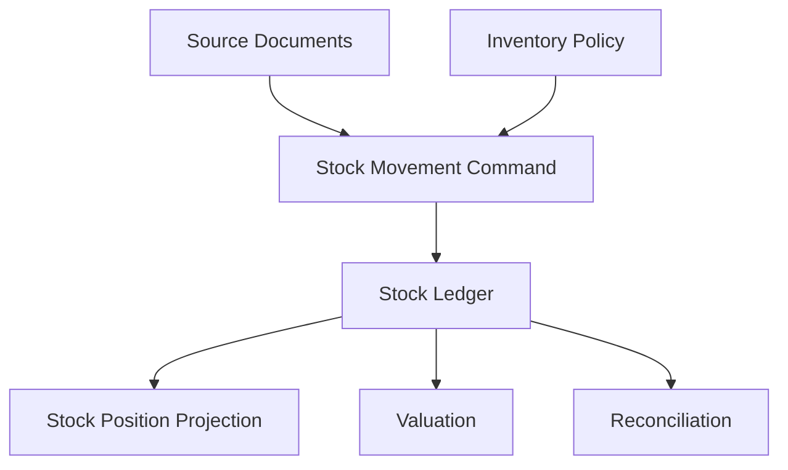
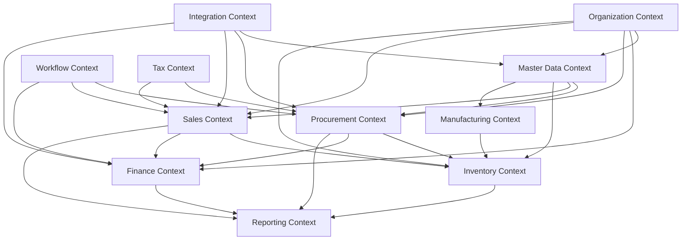
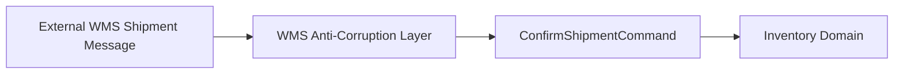

# Part 004 — ERP Domain Decomposition and Capability Map

## 1. Target Skill Part Ini

Part ini menjawab pertanyaan yang lebih sulit daripada “pakai monolith atau microservices?”:

> **Bagaimana kita memecah ERP besar menjadi capability, module, service, data owner, workflow, dan integration boundary yang benar secara bisnis dan tetap bisa berevolusi?**

Ini adalah salah satu skill pembeda engineer top-tier dalam sistem enterprise. Banyak sistem ERP gagal bukan karena Java, database, atau framework. Mereka gagal karena domain dipotong berdasarkan menu UI, struktur organisasi sementara, atau tabel database lama.

Dalam kerangka Kaufman, part ini adalah latihan **deconstruct the skill** paling penting. Kita akan memecah “ERP” menjadi sub-skill yang bisa diamati dan dilatih:

- menemukan business capability;
- menentukan authority owner;
- menemukan transaction boundary;
- membedakan master data, transactional document, ledger, workflow, dan read model;
- membuat context map;
- mendesain integration boundary;
- mendeteksi decomposition anti-pattern.

## 2. Premis Utama: ERP Bukan Daftar Modul

Vendor ERP sering memperlihatkan modul seperti:

- Finance;
- Procurement;
- Sales;
- Inventory;
- Manufacturing;
- Projects;
- Assets;
- HR;
- Reporting.

Daftar seperti itu berguna untuk orientasi, tetapi tidak cukup untuk engineering. Modul vendor terlalu besar dan terlalu kasar. Untuk desain sistem, kita butuh capability yang lebih presisi.

Contoh:

```text
Finance
```

terlalu besar. Di dalamnya ada capability berbeda:

- chart of accounts management;
- fiscal calendar management;
- journal entry;
- posting engine;
- period close;
- accounts payable;
- accounts receivable;
- bank reconciliation;
- tax reporting;
- financial statement generation;
- consolidation;
- approval policy;
- audit extraction.

Masing-masing punya invariant, owner, data model, dan lifecycle berbeda.

## 3. Capability Map: Definisi Praktis

Dalam konteks ERP, **business capability** adalah kemampuan stabil yang dibutuhkan organisasi untuk menjalankan operasi bisnis, terlepas dari struktur tim, UI, atau teknologi.

Capability yang baik biasanya memiliki:

- outcome bisnis yang jelas;
- vocabulary domain yang jelas;
- data authority yang bisa diidentifikasi;
- invariant yang bisa diuji;
- lifecycle/state yang bisa dimodelkan;
- input/output bisnis yang bisa dijelaskan;
- owner operasional atau policy owner;
- integrasi dengan capability lain.

### 3.1 Capability Bukan Use Case Tunggal

`ApprovePurchaseOrder` adalah use case.

`Procurement Approval Management` adalah capability.

`Purchase Order Lifecycle Management` juga capability.

Capability adalah area kemampuan yang stabil. Use case adalah aksi spesifik di dalam capability.

### 3.2 Capability Bukan Tabel

`purchase_order_header` bukan capability.

`Purchase Order Management` adalah capability.

Tabel adalah representasi data. Capability adalah kemampuan bisnis yang memiliki authority.

### 3.3 Capability Bukan Menu UI

Menu `Transactions > Purchasing > Purchase Orders` bukan capability. Menu bisa berubah mengikuti UX, role, atau tenant. Capability harus lebih stabil daripada UI.

## 4. ERP Capability Map Level 1

Berikut peta awal yang akan kita gunakan. Ini bukan final untuk semua perusahaan, tetapi cukup luas untuk sistem ERP besar.



Peta ini membantu kita melihat ERP sebagai jaringan capability, bukan daftar screen.

## 5. Decomposition Lens

Untuk memecah ERP dengan benar, gunakan beberapa lens sekaligus. Satu lens saja hampir selalu menyesatkan.

### 5.1 Value Stream Lens

Value stream melihat aliran bisnis end-to-end:

- procure-to-pay;
- order-to-cash;
- plan-to-produce;
- record-to-report;
- hire-to-retire;
- request-to-service;
- acquire-to-retire asset;
- issue-to-resolution.

Value stream berguna untuk memahami alur, tetapi tidak selalu menjadi boundary module.

Contoh procure-to-pay menyentuh:

- vendor master;
- procurement;
- inventory receiving;
- AP invoice;
- tax;
- payment;
- GL posting;
- approval workflow;
- reporting.

Jika seluruh procure-to-pay dijadikan satu service besar, service itu akan menjadi mini-ERP.

### 5.2 Document Lifecycle Lens

ERP sangat document-centric. Dokumen bisnis punya lifecycle:

- requisition;
- purchase order;
- goods receipt;
- vendor invoice;
- payment;
- sales order;
- shipment;
- customer invoice;
- journal voucher;
- work order;
- stock transfer.

Pertanyaan decomposition:

- dokumen ini dibuat oleh capability mana?
- siapa boleh mengubah statusnya?
- status apa yang legal?
- kapan dokumen menjadi immutable?
- apakah correction harus reversal?
- apakah numbering legal dibutuhkan?
- apakah dokumen menghasilkan ledger entry?

### 5.3 Ledger Lens

Ledger adalah catatan append/reconcilable atas perubahan nilai atau kuantitas. ERP besar biasanya memiliki beberapa ledger:

- general ledger;
- subledger AP;
- subledger AR;
- inventory ledger;
- stock movement ledger;
- asset ledger;
- tax ledger;
- workflow/audit log.

Capability yang memiliki ledger biasanya butuh boundary lebih kuat karena data harus bisa direkonsiliasi.

### 5.4 Invariant Lens

Invariant adalah aturan yang harus selalu benar.

Contoh:

- total debit harus sama dengan total credit;
- invoice tidak boleh diposting ke period tertutup;
- stock reservation tidak boleh melebihi available stock jika negative stock dilarang;
- PO approved tidak boleh diubah tanpa revision;
- user maker tidak boleh menjadi checker akhir untuk dokumen yang sama;
- document number legal tidak boleh dipakai ulang;
- payment tidak boleh dibuat untuk invoice yang belum posted;
- currency conversion harus memakai rate yang berlaku pada tanggal transaksi.

Boundary yang baik membuat invariant mudah dijaga. Boundary yang buruk membuat invariant tersebar.

### 5.5 Authority Lens

Authority lens bertanya:

> Siapa yang berhak menyatakan fakta ini benar?

Contoh:

| Fakta | Authority |
|---|---|
| Vendor aktif untuk transaksi | Vendor Master / Supplier Management |
| PO sudah approved | Procurement Approval Capability |
| Barang sudah diterima | Receiving / Inventory Capability |
| Invoice vendor valid | AP Invoice Matching Capability |
| Journal sudah posted | GL Posting Capability |
| Stock tersedia | Inventory Availability Capability |
| Customer melewati credit limit | AR Credit Control Capability |

Authority harus dipisahkan dari consumer. Sales boleh membaca customer credit status, tetapi authority credit limit ada di AR/Credit Control.

### 5.6 Change Frequency Lens

Capability berubah dengan kecepatan berbeda:

- tax rules bisa sering berubah karena regulasi;
- pricing/promotion bisa sering berubah karena komersial;
- GL posting invariant relatif stabil;
- UI approval inbox bisa berubah karena UX;
- report layout bisa sering berubah;
- master data governance berubah sedang;
- manufacturing planning logic bisa kompleks dan berubah berdasarkan industri.

Capability dengan change frequency tinggi sebaiknya diberi extension/configuration boundary yang baik, bukan dicampur ke core invariant.

### 5.7 Data Gravity Lens

Beberapa data menarik terlalu banyak dependency:

- customer;
- vendor;
- item/product;
- chart of accounts;
- organization;
- currency;
- tax code;
- location.

Data ini sering dipakai lintas domain. Kesalahan umum adalah membuat satu shared master data database yang bisa ditulis semua modul. Lebih baik tentukan owner dan publish reference/read model.

## 6. Capability Card Template

Untuk setiap capability, buat card seperti ini.

```mdx
## Capability: Purchase Order Management

### Purpose
Mengelola lifecycle purchase order dari draft sampai closed/cancelled.

### Business Owner
Procurement Operations.

### Authority
Berwenang menyatakan PO submitted, approved, revised, cancelled, closed.

### Core Documents
- Purchase Order
- Purchase Order Revision
- Purchase Order Line

### Invariants
- Approved PO tidak boleh diubah tanpa revision.
- PO total harus konsisten dengan line total, discount, tax, dan currency.
- PO tidak boleh approved tanpa vendor valid.
- PO amount di atas threshold wajib melewati approval matrix.

### Commands
- CreatePurchaseOrder
- SubmitPurchaseOrder
- ApprovePurchaseOrder
- RevisePurchaseOrder
- CancelPurchaseOrder
- ClosePurchaseOrder

### Events
- PurchaseOrderSubmitted
- PurchaseOrderApproved
- PurchaseOrderRevised
- PurchaseOrderCancelled
- PurchaseOrderClosed

### Depends On
- Vendor Master
- Item Master
- Tax Rules
- Approval Policy
- Organization Model

### Provides To
- Receiving
- AP Invoice Matching
- Commitment Reporting
- Audit
```

Capability card memaksa kita berpikir secara operasional, bukan hanya menggambar kotak.

## 7. Example: Procure-to-Pay Decomposition

Procure-to-pay sering terlihat seperti satu proses, tetapi secara domain perlu dipotong.



### 7.1 Capability Boundaries

| Capability | Authority | Tidak Seharusnya Melakukan |
|---|---|---|
| Requisition | Kebutuhan internal disetujui | Posting invoice atau update stock |
| Purchase Order | Komitmen pembelian ke vendor | Mencatat barang fisik diterima |
| Receiving | Fakta barang/jasa diterima | Menentukan invoice payable final |
| Invoice Matching | Validasi invoice terhadap PO/receipt | Membayar vendor |
| Accounts Payable | Liability, due date, payment proposal | Mengubah PO approved diam-diam |
| Payment Processing | Payment execution and settlement | Mengubah amount invoice posted |
| General Ledger | Financial posting authoritative | Menentukan apakah barang diterima |

### 7.2 Anti-Pattern: P2P Mega-Service

Satu service `ProcureToPayService` menangani semua:

```java
createRequisition();
approveRequisition();
createPurchaseOrder();
approvePurchaseOrder();
receiveGoods();
matchInvoice();
postInvoice();
createPayment();
postJournal();
```

Ini terlihat sederhana, tetapi akan gagal saat:

- receiving butuh mobile/warehouse scaling;
- AP punya approval dan close process sendiri;
- payment butuh bank integration dan reconciliation;
- PO revision punya lifecycle hukum sendiri;
- audit butuh evidence berbeda untuk tiap langkah;
- team ownership berbeda.

Lebih baik orchestration end-to-end berada di workflow/process layer, sementara authority tetap di capability masing-masing.

## 8. Example: Order-to-Cash Decomposition



### 8.1 Boundary Questions

- Apakah pricing final disimpan sebagai snapshot di sales order?
- Siapa boleh override discount?
- Apakah credit check blocking atau warning?
- Apakah allocation mengurangi stock atau hanya reserve?
- Kapan revenue diakui?
- Apakah shipment bisa partial?
- Bagaimana return mempengaruhi inventory dan AR?
- Apakah invoice correction menggunakan credit note?

Jika pertanyaan ini tidak dijawab, sistem akan terlihat jalan pada happy path tetapi rapuh pada dispute, return, partial shipment, dan month-end close.

## 9. Example: Inventory Decomposition

Inventory bukan sekadar tabel `stock_qty`.

Capability inventory dapat dipecah menjadi:

- item-location stock position;
- stock movement ledger;
- reservation/allocation;
- warehouse operation;
- lot/serial tracking;
- valuation;
- cycle count;
- transfer;
- adjustment;
- expiry/quality status;
- inventory reconciliation.



### 9.1 Core Invariant Inventory

- Stock movement harus punya source document atau approved adjustment reason.
- Movement harus append ke stock ledger.
- Stock position projection bisa di-rebuild dari ledger.
- Reservation tidak boleh melewati availability policy.
- Serial number tidak boleh berada di dua lokasi aktif sekaligus.
- Lot expired tidak boleh dialokasikan jika policy melarang.
- Adjustment harus audited dan reason-coded.

Boundary inventory sebaiknya menjaga ledger dan availability, bukan hanya menyediakan CRUD item.

## 10. Context Map ERP

Capability tidak hidup sendiri. Kita perlu context map.



Context map harus menunjukkan dependency direction. Jika semua context saling bergantung dua arah, decomposition belum selesai.

## 11. Data Ownership Matrix

Salah satu output terpenting dari decomposition adalah data ownership matrix.

| Data/Fakta | Owner Write | Consumer | Catatan |
|---|---|---|---|
| Legal Entity | Organization | Semua module | Harus stabil, versioned bila berubah legal. |
| Vendor Profile | Vendor Master | Procurement, AP | AP tidak boleh mengubah identitas vendor langsung. |
| Vendor Bank Account | Vendor Master + Finance Control | AP/Payment | Perubahan harus high-control dan audited. |
| Purchase Order | Procurement | Receiving, AP, Reporting | Approved PO immutable kecuali revision. |
| Goods Receipt | Receiving/Inventory | AP Matching, Inventory, Reporting | Source untuk matching dan stock ledger. |
| Vendor Invoice | AP | GL, Payment, Tax, Reporting | Posted invoice tidak boleh silent update. |
| Journal Entry | GL | Reporting, Audit | Correction via reversal/adjustment. |
| Stock Ledger | Inventory | Sales, Procurement, MRP, Reporting | Projection bisa rebuild dari ledger. |
| Credit Status | AR/Credit Control | Sales | Sales boleh request override, bukan set authority. |
| Tax Determination | Tax Capability | Sales, Procurement, Finance | Versioned by jurisdiction/effective date. |

Matrix ini membantu mencegah shared database chaos.

## 12. Transaction Boundary Discovery

Boundary domain belum cukup. Kita juga harus menemukan boundary transaksi.

Pertanyaan utama:

1. Apa yang harus atomic?
2. Apa yang boleh eventual?
3. Apa yang harus idempotent?
4. Apa yang harus bisa di-retry?
5. Apa yang harus bisa direkonsiliasi?
6. Apa yang harus bisa di-reverse?

### 12.1 Atomic Boundary

Contoh operasi yang biasanya harus atomic:

- posting invoice + ledger entries + audit evidence + outbox intent;
- stock movement + stock ledger append + audit reason;
- document state transition + transition history + notification intent;
- period close status change + close evidence;
- idempotency record + resulting document reference.

### 12.2 Eventual Boundary

Contoh operasi yang bisa eventual:

- update search index;
- update dashboard projection;
- send email notification;
- sync invoice posted event ke external warehouse;
- send customer statement;
- analytics pipeline;
- BI aggregation.

### 12.3 Wrong Boundary Example

Buruk:

```text
POST /receive-goods
  - update goods receipt
  - update stock
  - call AP service synchronously
  - call GL service synchronously
  - call reporting service synchronously
  - send email synchronously
```

Lebih baik:

```text
ReceiveGoodsCommand
  - validate PO and receiving policy
  - create goods receipt
  - append stock movement if applicable
  - write audit evidence
  - write GoodsReceived event to outbox

Async consumers:
  - AP matching projection
  - reporting projection
  - notification
  - warehouse analytics
```

## 13. Decomposition Heuristics

Gunakan heuristik berikut untuk memecah capability.

### 13.1 Split Jika Vocabulary Berbeda

Jika istilah yang sama punya arti berbeda, kemungkinan context berbeda.

Contoh `available`:

- Inventory: available stock = on hand - reserved - blocked.
- Sales: available to promise = availability berdasarkan demand/supply date.
- Finance: available credit = credit limit - exposure.

Jangan paksa semua ke satu model `Availability`.

### 13.2 Split Jika Invariant Berbeda

PO approval invariant berbeda dari invoice posting invariant. Jangan gabungkan hanya karena keduanya punya vendor dan amount.

### 13.3 Split Jika Lifecycle Berbeda

Purchase order bisa revised, partially received, closed. Vendor invoice bisa matched, posted, paid, reversed. Lifecycle berbeda adalah sinyal boundary.

### 13.4 Split Jika Scaling/Workload Berbeda

Receiving mobile workload bisa spike saat warehouse operation. GL period close bisa spike saat month-end. Reporting bisa spike saat manajemen meminta dashboard. Workload berbeda bisa menuntut deployment/read model berbeda.

### 13.5 Split Jika Compliance Control Berbeda

Vendor bank account change butuh kontrol tinggi. Vendor contact update mungkin kontrolnya lebih rendah. Jangan campur data governance berbeda dalam workflow yang sama.

### 13.6 Jangan Split Jika Invariant Membutuhkan Atomicity Kuat

Jika dua konsep harus selalu berubah bersama dalam satu transaksi, jangan buru-buru jadikan service terpisah. Modul internal masih bisa cukup.

## 14. Granularity: Seberapa Kecil Capability?

Capability terlalu besar menyebabkan god module. Capability terlalu kecil menyebabkan chatty architecture.

### 14.1 Terlalu Besar

Gejala:

- satu module punya 100+ aggregate;
- semua use case butuh dependency ke module ini;
- sulit menentukan owner;
- release berisiko tinggi;
- test lambat dan rapuh.

### 14.2 Terlalu Kecil

Gejala:

- satu business transaction butuh terlalu banyak service call;
- data consistency sulit;
- banyak DTO hanya meneruskan data;
- team menghabiskan waktu pada plumbing;
- domain logic tersebar di orchestration layer.

### 14.3 Target Granularity

Capability yang baik cukup besar untuk menjaga invariant, cukup kecil untuk memiliki vocabulary dan owner jelas.

Rule praktis:

> **Jangan pecah berdasarkan entity. Pecah berdasarkan authority + invariant + lifecycle.**

## 15. Capability to Module Mapping

Tidak semua capability harus menjadi service. Capability bisa dipetakan menjadi:

- package;
- module Gradle/Maven;
- deployable service;
- database schema;
- workflow definition;
- extension plugin;
- reporting projection;
- batch job.

### 15.1 Mapping Matrix

| Capability Type | Implementasi Awal | Bisa Berevolusi Menjadi |
|---|---|---|
| Core invariant high consistency | Internal module dalam ERP core | Dedicated service hanya jika boundary matang |
| High-volume read/report | Projection/read model | Reporting service/warehouse |
| External integration | Adapter module | Dedicated integration service |
| Customizable business rule | Rule/config module | Policy service/plugin runtime |
| Long-running approval | Workflow module | Dedicated workflow platform |
| Batch-heavy planning | Batch worker | Separate compute service |

Java implementation harus mengikuti maturity boundary. Jangan menjadikan semua capability microservice dari hari pertama jika transaksi bisnis masih belum stabil.

## 16. Architecture Tests untuk Menjaga Boundary

Boundary yang hanya ada di diagram akan dilanggar. Di Java, kita bisa membuat architecture tests.

Contoh rule konseptual:

```java
// Pseudo-code, bukan fokus library tertentu
architectureRule("finance-gl must not depend on procurement persistence")
    .denyDependency("com.company.erp.finance.gl..", "com.company.erp.procurement.adapter.persistence..");

architectureRule("domain must not depend on framework")
    .denyDependency("..domain..", "org.springframework..")
    .denyDependency("..domain..", "jakarta.persistence..");

architectureRule("modules must access other modules through application API")
    .allowDependency("..procurement.application..", "..inventory.api..")
    .denyDependency("..procurement..", "..inventory.adapter.persistence..");
```

Tujuannya bukan fanatik clean architecture. Tujuannya menjaga agar ERP tetap bisa berubah tanpa semua modul saling mengunci.

## 17. Anti-Corruption Layer

ERP sering harus berintegrasi dengan sistem lama atau vendor eksternal yang modelnya berbeda. Anti-corruption layer menjaga domain core tidak tercemar model eksternal.

Contoh:



Tanpa ACL, domain internal akan mulai memakai istilah vendor eksternal secara langsung. Setelah beberapa tahun, core ERP menjadi gabungan kompromi integrasi.

### 17.1 ACL Responsibilities

- translate external code to internal code;
- validate schema and required fields;
- normalize timezone/currency/UOM;
- resolve external reference;
- enforce idempotency;
- reject ambiguous payload;
- write integration audit;
- emit internal command/event.

## 18. Capability Dependency Smells

### 18.1 Two-Way Write Dependency

Procurement menulis AP invoice, AP menulis PO status. Ini berbahaya.

Solusi: gunakan event dan command authority yang jelas. AP boleh mengonsumsi PO approved/received facts. Procurement boleh mengonsumsi invoice matched/paid facts untuk status display, tetapi tidak menulis AP authority.

### 18.2 Shared Mutable Master Data

Semua module bisa update customer/vendor/item.

Solusi: master data owner, change request, approval, versioned publication.

### 18.3 Generic Document Table

Satu tabel `document` untuk semua jenis dokumen dengan JSON bebas.

Solusi: document abstraction boleh ada untuk numbering/audit/search, tetapi invariant domain harus tetap typed dan explicit.

### 18.4 Status Field Tanpa State Machine

`status = APPROVED` bisa diset dari banyak tempat.

Solusi: command-driven transition, transition history, guard, audit evidence.

### 18.5 Reporting Menjadi Source of Truth

Karena laporan lebih mudah dibaca, tim mulai mengambil keputusan bisnis dari projection yang stale.

Solusi: label freshness, source lineage, reconciliation, dan command hanya boleh memakai authoritative model.

## 19. Method: Membuat Capability Map dalam 7 Langkah

### Langkah 1 — Ambil Value Stream Besar

Contoh:

- procure-to-pay;
- order-to-cash;
- record-to-report;
- plan-to-produce.

Jangan langsung desain tabel.

### Langkah 2 — Daftar Dokumen dan Fakta Bisnis

Contoh P2P:

- requisition submitted;
- PO approved;
- goods received;
- invoice matched;
- invoice posted;
- payment executed;
- journal posted.

### Langkah 3 — Temukan Authority

Untuk setiap fakta, tanyakan siapa owner-nya.

### Langkah 4 — Temukan Invariant

Untuk setiap authority, tulis 5-10 invariant.

### Langkah 5 — Kelompokkan Berdasarkan Vocabulary dan Lifecycle

Jangan grouping berdasarkan screen atau tabel.

### Langkah 6 — Gambar Dependency Direction

Pastikan dependency tidak semua dua arah.

### Langkah 7 — Pilih Implementation Boundary

Putuskan apakah capability menjadi module internal, service, projection, workflow definition, batch worker, atau extension.

## 20. Worked Example: Vendor Invoice Posting Capability

### 20.1 Capability Card

```mdx
## Capability: Vendor Invoice Posting

### Purpose
Mengubah vendor invoice yang valid menjadi liability finansial yang diakui dan dapat dibayar.

### Authority
Accounts Payable dan GL posting pipeline.

### Documents
- Vendor Invoice
- Posting Batch
- Journal Entry

### Invariants
- Invoice harus valid dan matched sesuai policy.
- Posting date harus berada di open fiscal period.
- Debit dan credit harus balance per currency.
- Vendor liability account harus resolvable.
- Posted invoice tidak boleh diubah silent.
- Correction harus reversal/credit note/adjustment.

### Commands
- ValidateVendorInvoice
- MatchVendorInvoice
- PostVendorInvoice
- ReverseVendorInvoicePosting

### Events
- VendorInvoiceValidated
- VendorInvoiceMatched
- VendorInvoicePosted
- VendorInvoicePostingReversed

### Dependencies
- Vendor Master
- Tax Policy
- Chart of Accounts
- Fiscal Period
- Approval Workflow
- Goods Receipt / PO Facts

### Consumers
- Payment Proposal
- GL Reporting
- Tax Reporting
- Vendor Statement
- Audit
```

### 20.2 Boundary Decision

Vendor invoice posting sebaiknya dekat dengan finance core karena:

- double-entry invariant harus kuat;
- period lock harus kuat;
- reversal semantics harus konsisten;
- financial audit membutuhkan trace kuat;
- payment bergantung pada posted liability.

Namun matching terhadap PO/receipt bisa memakai facts/projections dari procurement dan receiving, bukan direct ownership atas tabel PO.

## 21. Decomposition Output yang Harus Dihasilkan

Setelah decomposition, minimal harus ada artefak berikut:

1. capability map level 1-3;
2. capability card untuk core domain;
3. context map dependency;
4. data ownership matrix;
5. transaction boundary map;
6. event map;
7. read model map;
8. workflow map;
9. extension/customization map;
10. risk register decomposition.

Tanpa artefak ini, keputusan arsitektur biasanya hanya opini.

## 22. Practice: Buat Capability Map untuk Inventory

Latihan 120 menit:

1. Ambil domain `Inventory`.
2. Pecah menjadi minimal 8 capability.
3. Untuk setiap capability, tulis:
   - purpose;
   - authority;
   - documents/records;
   - invariants;
   - commands;
   - events;
   - dependencies;
   - consumers.
4. Gambar context map.
5. Tulis data ownership matrix.
6. Tandai capability yang cocok menjadi module internal vs projection vs service.
7. Tulis 5 failure mode jika decomposition salah.

Output akhir tidak perlu sempurna. Tujuan latihan adalah melatih mata untuk melihat authority dan invariant.

## 23. Review Checklist

Gunakan checklist ini saat menilai domain decomposition ERP:

- Apakah capability dipotong berdasarkan authority, invariant, dan lifecycle?
- Apakah ada module yang terlalu besar karena mengikuti nama vendor module?
- Apakah ada service yang terlalu kecil karena mengikuti entity/tabel?
- Apakah setiap fakta bisnis punya owner write authority?
- Apakah master data punya governance dan publication model?
- Apakah transaction boundary atomic dan eventual sudah dipisahkan?
- Apakah workflow hanya orchestration, bukan pemilik semua domain state?
- Apakah read model jelas bukan source of truth?
- Apakah dependency direction masuk akal?
- Apakah ada two-way write dependency?
- Apakah ada shared mutable table lintas module?
- Apakah correction semantics jelas?
- Apakah capability high-compliance dipisahkan dari low-control customization?
- Apakah event yang dipublish adalah fakta bisnis, bukan sekadar technical notification?
- Apakah decomposition bisa dijelaskan ke business stakeholder tanpa istilah teknis berlebihan?

## 24. Mental Model Akhir

Domain decomposition ERP adalah proses menemukan **pusat otoritas bisnis**.

Jangan mulai dari:

- tabel;
- UI menu;
- nama tim;
- framework;
- microservice boundary;
- vendor module;
- endpoint API.

Mulailah dari:

- fakta bisnis apa yang harus benar;
- siapa yang berwenang menyatakan fakta itu;
- lifecycle apa yang membuat fakta itu legal;
- invariant apa yang tidak boleh dilanggar;
- data apa yang harus authoritative;
- event apa yang harus diketahui capability lain;
- correction apa yang legal;
- evidence apa yang dibutuhkan saat dispute.

Jika decomposition menjawab pertanyaan ini, arsitektur Java bisa mengikuti dengan lebih sehat: modular monolith, services, event-driven integration, workflow engine, projection, atau batch worker hanyalah bentuk implementasi dari boundary bisnis yang sudah ditemukan.

## 25. Source Notes

Referensi konseptual yang relevan untuk part ini:

- Martin Fowler, Monolith First: `https://martinfowler.com/bliki/MonolithFirst.html`
- Martin Fowler, Microservices: `https://martinfowler.com/articles/microservices.html`
- Apache OFBiz Project sebagai contoh ERP berbasis Java dengan entity, service, dan business application suite: `https://ofbiz.apache.org/`
- Jakarta EE Platform 11 sebagai platform enterprise Java modern: `https://jakarta.ee/specifications/platform/11/`

Referensi ini digunakan sebagai orientasi faktual dan pembanding. Teknik decomposition di part ini difokuskan pada ERP engineering: authority, invariant, lifecycle, transaction boundary, dan auditability.
