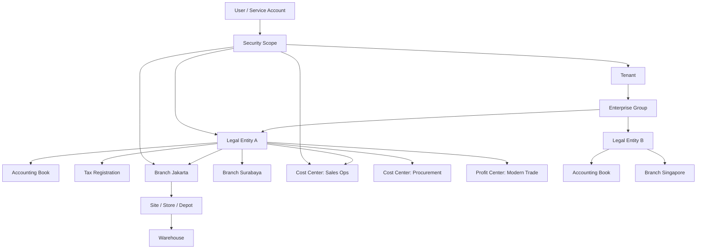
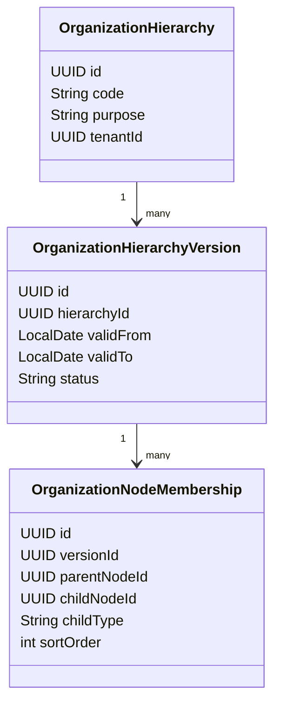
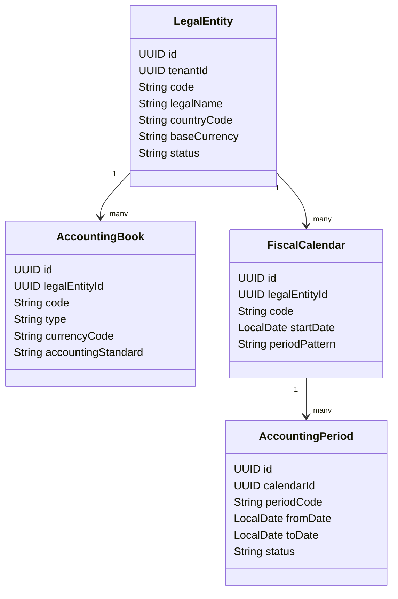
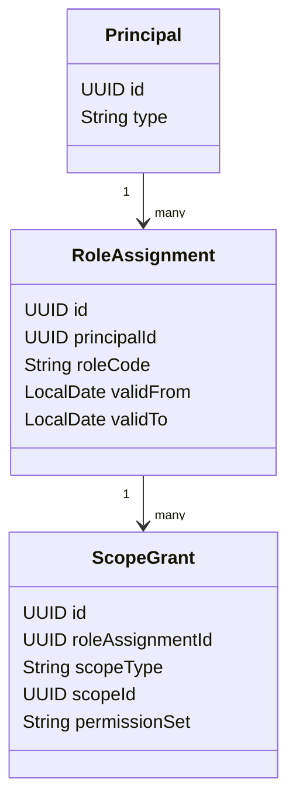
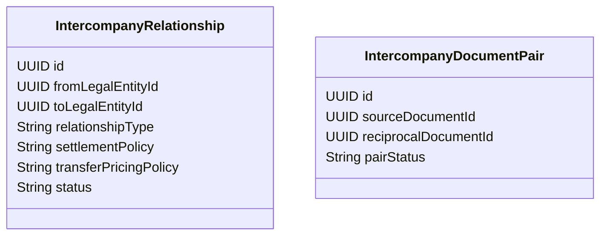

# Part 005 — Organizational Model: Tenant, Company, Branch, Cost Center

## 1. Target Skill Part Ini

Pada ERP besar, model organisasi bukan sekadar tabel `company`, `branch`, atau `department`. Model organisasi adalah **coordinate system** tempat semua transaksi bisnis terjadi.

Invoice tidak hanya punya customer dan amount. Invoice terjadi dalam konteks:

- legal entity yang bertanggung jawab secara hukum;
- branch atau operating unit yang menjalankan aktivitas;
- fiscal calendar dan accounting book yang menentukan posting;
- currency, tax region, dan localization rule;
- cost center atau profit center yang menanggung dampak finansial;
- security scope yang menentukan siapa boleh melihat, mengubah, approve, atau post;
- reporting hierarchy yang menentukan bagaimana angka dikonsolidasikan.

Target part ini adalah membentuk mental model bahwa **ERP transaction is never context-free**.

Dalam kerangka Kaufman, ini adalah tahap **deconstruct the skill** dan **learn enough to self-correct**. Kita memecah organisasi enterprise menjadi primitive yang bisa dimodelkan, lalu membuat tanda bahaya untuk mendeteksi desain yang salah sebelum menjadi technical debt sistemik.

## 2. Kenapa Model Organisasi Sangat Menentukan Kualitas ERP

Banyak ERP internal gagal bukan karena tim tidak bisa membuat modul procurement, sales, inventory, atau finance. Mereka gagal karena semua modul memakai asumsi organisasi yang berbeda.

Contoh kegagalan nyata secara pola:

| Gejala | Akar Masalah |
|---|---|
| User branch A bisa melihat invoice branch B tanpa alasan jelas | Security scope tidak terikat ke organizational scope. |
| Posting GL salah company | Transaksi tidak membawa legal entity secara eksplisit. |
| Report revenue berbeda antara sales dan finance | Reporting hierarchy berbeda dari accounting ownership. |
| Cost center historis berubah dan laporan masa lalu ikut berubah | Hierarchy tidak effective-dated. |
| Intercompany transaction dianggap external sale | Legal entity relation tidak dimodelkan. |
| Tenant customization bocor ke tenant lain | Tenant boundary hanya UI filter, bukan invariant. |
| Closing period gagal karena transaksi lintas branch belum reconcile | Period dan organizational responsibility tidak jelas. |

ERP skala besar membutuhkan model organisasi yang menjadi **shared semantic contract**. Jika contract ini lemah, semua modul akan menambal sendiri.

## 3. Prinsip Utama: Organisasi Adalah Context, Bukan Master Data Biasa

Secara teknis, organisasi memang disimpan sebagai data. Namun secara domain, organisasi bukan master data biasa seperti `payment_term` atau `unit_of_measure`. Ia membentuk ruang validasi untuk transaksi.

Sebuah `PurchaseOrder` tidak cukup valid jika hanya memiliki vendor dan line item. Ia harus valid terhadap context:

```text
PurchaseOrderContext =
  tenant
  legalEntity
  operatingUnit
  branch/site
  procurementOrganization
  costCenter/profitCenter
  fiscalBook
  currencyPolicy
  taxRegion
  approvalScope
  securityScope
```

Setiap context tersebut memengaruhi business rule. Misalnya:

- vendor boleh aktif untuk legal entity tertentu tetapi tidak untuk legal entity lain;
- item boleh dibeli oleh plant tertentu tetapi tidak oleh warehouse lain;
- approval matrix berbeda per company, cost center, amount threshold, dan category;
- tax treatment berbeda berdasarkan legal entity, ship-from, ship-to, dan supplier jurisdiction;
- cost center boleh dipakai hanya pada tanggal tertentu;
- branch mungkin operating secara lokal tetapi posting ke legal entity pusat.

Desain buruk biasanya memperlakukan organisasi sebagai dropdown. Desain baik memperlakukannya sebagai **domain boundary resolver**.

## 4. Kaufman Decomposition: Sub-Skill Model Organisasi ERP

Untuk menguasai topik ini secara efektif, pecah skill menjadi beberapa sub-skill:

| Sub-Skill | Pertanyaan yang Harus Bisa Dijawab |
|---|---|
| Legal structure modelling | Entitas mana yang bertanggung jawab hukum dan accounting? |
| Operating structure modelling | Unit mana yang menjalankan aktivitas bisnis harian? |
| Financial responsibility modelling | Cost/profit ditanggung oleh siapa? |
| Reporting hierarchy modelling | Bagaimana angka dikonsolidasikan tanpa merusak transaksi historis? |
| Security scope modelling | Siapa boleh mengakses data pada scope organisasi apa? |
| Effective dating | Apa yang terjadi jika struktur berubah di tengah tahun? |
| Multi-tenancy | Data siapa benar-benar terisolasi dari siapa? |
| Intercompany modelling | Kapan transaksi internal harus menghasilkan dokumen reciprocal? |
| Context propagation | Bagaimana org context dibawa dari UI sampai database, event, report, dan audit? |

Latihan 20 jam untuk topik ini bukan membuat CRUD `Company`. Latihan yang benar adalah mendesain transaksi yang tetap benar ketika organisasi berubah, data dipartisi, user berganti role, dan laporan historis harus tetap defensible.

## 5. Vocabulary yang Harus Dibedakan

Istilah organisasi sering dipakai tidak konsisten. ERP engineer harus memaksa definisi yang jelas.

### 5.1 Tenant

**Tenant** adalah boundary kepemilikan data dan runtime behavior paling tinggi dalam SaaS atau multi-organization platform.

Tenant bisa berarti:

- satu customer enterprise dalam produk SaaS;
- satu grup perusahaan dalam shared platform;
- satu deployment logical dengan konfigurasi, data, user, dan integration sendiri.

Tenant bukan selalu legal entity. Satu tenant bisa punya banyak legal entity. Satu legal entity biasanya tidak boleh berada di dua tenant berbeda kecuali ada alasan migration atau data sharing yang eksplisit.

Invariant penting:

```text
All tenant-owned records must carry tenant_id directly or be reachable from a tenant-owned root without ambiguity.
```

Anti-pattern:

```text
Use current logged-in user tenant as implicit filter everywhere.
```

Kenapa berbahaya? Karena batch job, integration consumer, reconciliation process, report generator, dan support tool tidak selalu berjalan atas nama user interaktif.

### 5.2 Legal Entity

**Legal entity** adalah organisasi yang memiliki identitas hukum. Ia dapat membuat kontrak, memiliki kewajiban pajak, memiliki accounting book, dan menjadi pihak legal dalam invoice, PO, bank account, payroll, atau statutory report.

Dalam ERP, legal entity biasanya menjadi boundary untuk:

- general ledger;
- tax registration;
- fiscal calendar;
- statutory reporting;
- bank account ownership;
- intercompany transaction;
- audit evidence;
- document numbering legal;
- period close.

Invariant:

```text
Every financially material transaction must resolve to exactly one accountable legal entity before posting.
```

Jika transaksi bisa berdampak ke lebih dari satu legal entity, sistem harus membuat dokumen turunan atau posting reciprocal, bukan menyimpan satu transaksi ambigu.

### 5.3 Company

Dalam banyak ERP, `company` dipakai sebagai sinonim legal entity. Namun di beberapa organisasi, company bisa lebih operasional daripada legal. Karena itu, istilah ini harus diputuskan eksplisit.

Rekomendasi desain:

- gunakan `LegalEntity` untuk makna hukum/accounting;
- gunakan `Company` hanya jika organisasi memang memakainya sebagai istilah bisnis;
- hindari membuat `company_id` di semua tabel tanpa definisi formal.

Jika codebase sudah memakai `company_id`, dokumentasikan apakah ia berarti legal entity, tenant company, operating company, atau reporting company.

### 5.4 Branch

**Branch** adalah unit lokasi/operasional yang biasanya mewakili kantor cabang, store, depot, area, plant, atau site lokal.

Branch dapat memengaruhi:

- sales territory;
- warehouse ownership;
- local approval;
- cash register;
- tax location;
- document sequence;
- operational reporting;
- local inventory responsibility.

Branch tidak selalu legal entity. Cabang bisa menjalankan aktivitas, tetapi invoice tetap diterbitkan atas nama legal entity pusat.

### 5.5 Operating Unit

**Operating unit** adalah unit yang menjalankan proses bisnis tertentu. Ia tidak harus berbasis lokasi.

Contoh:

- procurement organization;
- sales organization;
- manufacturing plant;
- service center;
- shared service center;
- distribution unit.

Operating unit berguna ketika struktur proses tidak sejajar dengan struktur hukum.

Contoh:

```text
Legal Entity: PT Global Retail Indonesia
Branches: Jakarta, Surabaya, Medan
Procurement Operating Unit: National Procurement
Sales Operating Units: Modern Trade, Online, Wholesale
```

Satu procurement unit bisa membeli untuk banyak branch. Satu branch bisa melayani beberapa sales channel.

### 5.6 Cost Center

**Cost center** adalah unit tanggung jawab biaya. Ia penting untuk expense, budget, approval, allocation, dan management accounting.

Cost center biasanya bukan pihak legal. Ia juga bukan lokasi fisik semata.

Invariant:

```text
A cost center used by a financial transaction must be active and valid for the transaction date, legal entity, and accounting dimension policy.
```

### 5.7 Profit Center

**Profit center** adalah unit yang bertanggung jawab atas profit/loss. Dalam beberapa organisasi, profit center bisa berupa product line, region, business unit, atau channel.

Profit center tidak boleh dicampur sembarangan dengan branch. Branch menunjukkan tempat/operasi; profit center menunjukkan accountability terhadap hasil.

### 5.8 Department

Department adalah struktur manajerial. Ia berguna untuk HR-adjacent process, budget, approval, dan responsibility. Namun department sering berubah. Karena itu semua pemakaian department untuk transaksi finansial harus effective-dated.

### 5.9 Location, Site, Warehouse, Plant

Istilah lokasi harus dibedakan:

| Istilah | Makna Domain |
|---|---|
| Location | Alamat/logical place umum. |
| Site | Area operasional, kantor, pabrik, store, depot. |
| Warehouse | Lokasi inventory yang menyimpan stock. |
| Bin | Sub-location di warehouse. |
| Plant | Manufacturing site yang menjalankan produksi. |
| Store | Retail location untuk sales dan inventory. |

Satu branch bisa memiliki beberapa warehouse. Satu plant bisa berada di satu site tetapi melayani beberapa legal entity dalam skenario shared manufacturing.

## 6. Diagram Mental Model



Diagram ini menunjukkan bahwa organisasi bukan satu pohon tunggal. Ada beberapa hierarchy yang saling terkait:

- legal hierarchy;
- operating hierarchy;
- location hierarchy;
- financial dimension hierarchy;
- security scope hierarchy;
- reporting hierarchy.

Kesalahan besar adalah memaksa semuanya menjadi satu kolom `parent_id`.

## 7. Jangan Pakai Satu Organization Tree untuk Semua Hal

Desain paling umum tetapi berbahaya:

```text
organization(id, parent_id, type, name)
```

Model ini tampak fleksibel. Namun dalam ERP besar, fleksibilitas ini sering berubah menjadi ambiguity.

Masalahnya:

1. **Legal hierarchy tidak sama dengan reporting hierarchy.**
2. **Branch hierarchy tidak sama dengan cost center hierarchy.**
3. **Security hierarchy tidak selalu mengikuti organization chart.**
4. **Historical reporting butuh versi hierarchy per tanggal.**
5. **Intercompany relation bukan parent-child.**
6. **Satu node bisa ikut banyak hierarchy.**

Lebih aman memakai pendekatan explicit model:

```text
Tenant
LegalEntity
OperatingUnit
Branch
Site
Warehouse
CostCenter
ProfitCenter
Department
OrganizationHierarchy
OrganizationHierarchyVersion
OrganizationNodeMembership
```

Dengan desain ini, hierarchy menjadi objek domain sendiri, bukan asumsi tersembunyi.

## 8. Effective-Dated Organization Model

Organisasi berubah. Branch pindah wilayah. Cost center digabung. Department dipecah. Legal entity merger. Profit center berubah dari product-based ke channel-based.

ERP harus bisa menjawab dua pertanyaan berbeda:

1. **Apa struktur organisasi saat ini?**
2. **Apa struktur organisasi yang berlaku pada tanggal transaksi?**

Jika sistem hanya menyimpan state terbaru, laporan historis akan berubah ketika organisasi diubah. Itu berbahaya untuk finance, audit, dan regulatory defensibility.

### 8.1 Pola Versioned Hierarchy



Contoh purpose hierarchy:

- `LEGAL_CONSOLIDATION`
- `FINANCIAL_REPORTING`
- `SALES_TERRITORY`
- `PROCUREMENT_APPROVAL`
- `SECURITY_ACCESS`
- `BUDGET_CONTROL`

Satu branch bisa berada di hierarchy berbeda untuk purpose berbeda.

### 8.2 Rule Effective Dating

Invariant penting:

```text
For a given hierarchy purpose and effective date, exactly one active hierarchy version must be resolvable for a tenant/legal entity scope.
```

Jika dua versi aktif overlap, report bisa double count. Jika tidak ada versi aktif, transaksi tidak bisa resolve approval/reporting scope.

### 8.3 Jangan Update Parent Langsung

Anti-pattern:

```sql
update organization set parent_id = :newParent where id = :branchId;
```

Untuk ERP besar, ini menghapus sejarah.

Pola yang lebih baik:

```text
Close old hierarchy version at date D-1.
Create new hierarchy version from date D.
Add membership branch under new parent.
Keep historical transactions referencing original org context and transaction date.
```

## 9. Organization Context Propagation di Java

Setiap command ERP harus membawa organization context eksplisit.

Contoh record Java:

```java
public record OrgContext(
    UUID tenantId,
    UUID legalEntityId,
    UUID operatingUnitId,
    UUID branchId,
    UUID costCenterId,
    UUID profitCenterId,
    LocalDate businessDate,
    String fiscalBookCode,
    String currencyCode
) {
    public OrgContext {
        Objects.requireNonNull(tenantId, "tenantId is required");
        Objects.requireNonNull(legalEntityId, "legalEntityId is required");
        Objects.requireNonNull(businessDate, "businessDate is required");
    }
}
```

Jangan menyembunyikan context di `ThreadLocal` sebagai satu-satunya sumber kebenaran. `ThreadLocal` bisa berguna di boundary tertentu seperti request-scoped logging, tetapi tidak boleh menjadi satu-satunya domain input. Batch, message consumer, scheduler, dan async workflow harus bisa menjalankan command dengan context eksplisit.

Pola command:

```java
public record CreatePurchaseRequisitionCommand(
    OrgContext org,
    UUID requesterId,
    List<RequisitionLineInput> lines,
    String businessJustification
) {}
```

Command handler harus melakukan context validation sebelum mengubah state:

```java
public RequisitionId handle(CreatePurchaseRequisitionCommand command) {
    orgPolicy.assertCanCreateRequisition(command.org(), command.requesterId());
    fiscalPolicy.assertOpenForProcurement(command.org().legalEntityId(), command.org().businessDate());
    costCenterPolicy.assertValid(command.org().costCenterId(), command.org().businessDate());

    var requisition = PurchaseRequisition.create(command.org(), command.requesterId(), command.lines());
    repository.save(requisition);
    outbox.publish(requisition.events());
    return requisition.id();
}
```

## 10. Database Model: Explicit Scope Columns

Dalam ERP, scope kolom bukan sekadar untuk query. Ia adalah enforcement surface.

Contoh tabel transaksi:

```sql
create table purchase_requisition (
    id uuid primary key,
    tenant_id uuid not null,
    legal_entity_id uuid not null,
    operating_unit_id uuid null,
    branch_id uuid null,
    cost_center_id uuid null,
    document_no varchar(64) not null,
    status varchar(32) not null,
    business_date date not null,
    created_by uuid not null,
    created_at timestamp not null,
    version bigint not null,
    unique (tenant_id, legal_entity_id, document_no)
);
```

Kenapa `tenant_id` dan `legal_entity_id` disimpan langsung, bukan join jauh?

Karena:

- query security lebih sederhana;
- partitioning lebih mudah;
- audit lebih eksplisit;
- event payload lebih self-contained;
- data recovery lebih cepat;
- index strategy lebih jelas;
- report filtering tidak bergantung ke join kompleks.

Namun ada trade-off: denormalisasi scope harus dijaga oleh invariant. Jangan izinkan line item memiliki legal entity berbeda dari header kecuali memang document type mendukung multi-entity split.

## 11. Tenant Isolation Pattern

Ada beberapa pola multi-tenancy.

| Pattern | Kelebihan | Risiko |
|---|---|---|
| Shared database, shared schema | Efisien, mudah operational awal | Risiko data leakage jika filter lemah. |
| Shared database, schema per tenant | Isolasi lebih baik | Migration lebih kompleks. |
| Database per tenant | Isolasi kuat, restore per tenant mudah | Operational overhead tinggi. |
| Deployment per tenant | Customization ekstrem, isolasi runtime | Biaya tinggi, upgrade sulit. |

Untuk ERP besar, pola sering hybrid:

- tenant kecil: shared schema;
- tenant besar/regulasi tinggi: dedicated database;
- country-specific heavy customization: dedicated deployment atau module pack;
- reporting/analytics: consolidated lake dengan tenant-level isolation.

Invariant paling penting:

```text
Tenant isolation must be enforced below the UI layer.
```

Minimal enforcement harus ada di:

- API authorization;
- command validation;
- repository query;
- database constraint/index;
- event consumer validation;
- report query;
- admin/support tooling;
- export/import pipeline.

## 12. Legal Entity dan Fiscal Scope

Legal entity biasanya terkait dengan fiscal structure.

Model minimal:



Dalam transaksi finansial, `businessDate` harus resolve ke accounting period. Jika period sudah locked, transaksi tidak boleh diposting kecuali lewat controlled adjustment flow.

## 13. Branch, Site, dan Warehouse Scope

Branch sering menjadi unit operasional. Warehouse menjadi unit inventory. Hubungan mereka tidak selalu satu-ke-satu.

Contoh:

```text
Branch Jakarta
  - Warehouse Jakarta Retail
  - Warehouse Jakarta Online Fulfillment
  - Warehouse Jakarta Damaged Goods

Branch Surabaya
  - Warehouse Surabaya Main
  - Warehouse Surabaya Transit
```

Warehouse punya invariant inventory sendiri:

```text
Stock movement must resolve to a valid warehouse owned by or authorized for the transaction's operating organization.
```

Jika warehouse dipakai lintas legal entity, sistem harus memutuskan apakah:

- stock ownership tetap per legal entity;
- warehouse hanya physical location;
- transfer antar legal entity menghasilkan intercompany document;
- consignment stock dipisahkan.

Jangan menunda keputusan ini. Inventory dan finance akan bertabrakan.

## 14. Cost Center dan Profit Center sebagai Accounting Dimensions

Cost center/profit center sering dipakai sebagai accounting dimension. Jangan jadikan mereka string bebas di line transaksi.

Model minimal:

```sql
create table accounting_dimension_value (
    id uuid primary key,
    tenant_id uuid not null,
    dimension_type varchar(64) not null,
    code varchar(64) not null,
    name varchar(255) not null,
    legal_entity_id uuid null,
    valid_from date not null,
    valid_to date null,
    status varchar(32) not null,
    unique (tenant_id, dimension_type, code, valid_from)
);
```

Untuk transaksi:

```sql
create table journal_line_dimension (
    journal_line_id uuid not null,
    dimension_type varchar(64) not null,
    dimension_value_id uuid not null,
    primary key (journal_line_id, dimension_type)
);
```

Kenapa bukan kolom `cost_center_id`, `profit_center_id`, `project_id`, `channel_id`, `region_id` terus menerus?

Karena accounting dimension bisa berbeda per tenant atau industry. Namun core dimension yang sangat fundamental boleh dibuat eksplisit jika dipakai lintas modul dan memengaruhi authorization.

Trade-off:

- explicit columns lebih mudah query dan enforce;
- generic dimensions lebih fleksibel;
- hybrid sering paling realistis.

## 15. Security Scope: Access Tidak Sama dengan Ownership

User bisa memiliki akses ke data yang bukan miliknya. Service account bisa memproses transaksi lintas branch. Auditor bisa read-only lintas legal entity. Shared service center bisa approve AP invoice untuk beberapa company.

Karena itu, security scope harus dimodelkan sendiri.



Contoh scope type:

- `TENANT`
- `LEGAL_ENTITY`
- `BRANCH`
- `WAREHOUSE`
- `COST_CENTER`
- `PROCUREMENT_ORG`
- `SALES_ORG`
- `REPORTING_HIERARCHY_NODE`

Authorization harus menjawab:

```text
Can principal P perform action A on resource R under organization context C at time T?
```

Bukan hanya:

```text
Does user have ROLE_ADMIN?
```

## 16. Intercompany Relationship

Transaksi antar legal entity dalam satu tenant bukan transaksi biasa.

Contoh:

- Legal Entity A menjual barang ke Legal Entity B;
- shared service center membayar invoice untuk legal entity lain;
- warehouse milik A mengirim stock untuk order B;
- biaya IT pusat dialokasikan ke beberapa entity;
- cash pooling antar entity.

Model minimal:



Invariant:

```text
A transaction that transfers value between legal entities must either be prohibited or produce traceable reciprocal documents/postings.
```

Jangan membuat satu invoice dengan dua legal entity dan berharap report bisa memperbaiki. Finance correctness harus dibangun di posting layer.

## 17. Document Numbering per Organization Scope

Document numbering sering bergantung pada legal entity, branch, document type, fiscal year, dan localization.

Contoh key:

```text
tenant_id + legal_entity_id + branch_id + document_type + fiscal_year
```

Namun untuk beberapa dokumen legal, sequence harus strict dan gap handling harus diaudit. Ini akan dibahas lebih dalam di Part 019. Untuk part ini, poin pentingnya: numbering tidak boleh didesain tanpa organization scope.

Contoh model:

```sql
create table document_sequence_scope (
    id uuid primary key,
    tenant_id uuid not null,
    legal_entity_id uuid not null,
    branch_id uuid null,
    document_type varchar(64) not null,
    fiscal_year int not null,
    next_value bigint not null,
    status varchar(32) not null,
    unique (tenant_id, legal_entity_id, branch_id, document_type, fiscal_year)
);
```

## 18. Context Resolver: Jangan Bebankan UI

UI boleh membantu memilih branch atau company. Tetapi UI tidak boleh menjadi satu-satunya tempat rule organisasi dijalankan.

Gunakan service seperti:

```java
public interface OrganizationContextResolver {
    OrgContext resolveForDocumentCreation(
        PrincipalId principalId,
        DocumentType documentType,
        RequestedOrgScope requestedScope,
        LocalDate businessDate
    );
}
```

Resolver bertugas:

- memastikan principal memiliki akses;
- memilih default legal entity/branch jika valid;
- menolak ambiguity;
- resolve fiscal book;
- resolve currency policy;
- resolve valid cost center/profit center;
- mengembalikan context eksplisit untuk command.

Prinsipnya:

```text
The UI suggests context. The domain validates context. The database stores context.
```

## 19. Event Payload Harus Membawa Organization Context

Event ERP tidak boleh terlalu miskin context.

Anti-pattern:

```json
{
  "eventType": "PurchaseOrderApproved",
  "purchaseOrderId": "..."
}
```

Masalah: consumer harus lookup ke database sumber untuk tahu tenant/legal entity/branch. Ini memperkuat coupling dan memperbesar risiko salah scope.

Lebih baik:

```json
{
  "eventType": "PurchaseOrderApproved",
  "eventId": "...",
  "occurredAt": "2026-06-30T10:15:00Z",
  "tenantId": "...",
  "legalEntityId": "...",
  "branchId": "...",
  "documentId": "...",
  "documentNo": "PO-JKT-2026-000123",
  "businessDate": "2026-06-30",
  "status": "APPROVED"
}
```

Event bukan database dump. Tetapi event harus cukup kaya untuk:

- routing;
- authorization downstream;
- reconciliation;
- observability;
- reporting projection;
- tenant isolation.

## 20. Reporting Hierarchy dan Historical Truth

Reporting hierarchy sering berubah. Namun report historis harus bisa dihitung dengan aturan yang tepat.

Ada dua jenis report:

1. **As-was reporting**: memakai hierarchy yang berlaku pada tanggal transaksi.
2. **As-is reporting**: memakai hierarchy terbaru untuk restatement management view.

ERP harus membedakan keduanya.

Contoh API query:

```text
GET /reports/revenue?period=2026-01&hierarchyMode=AS_WAS
GET /reports/revenue?period=2026-01&hierarchyMode=AS_IS&hierarchyVersion=2026-Q2
```

Jika mode tidak eksplisit, pengguna akan berdebat angka mana yang benar. Keduanya bisa benar untuk tujuan berbeda.

## 21. Invariant Checklist

Gunakan checklist ini saat design review organisasi ERP.

### 21.1 Tenant Invariants

- Semua record tenant-owned memiliki `tenant_id` atau root yang jelas.
- Query repository tidak bisa lupa tenant filter.
- Batch job dan consumer membawa tenant context eksplisit.
- Export/import tidak bisa mencampur tenant.
- Admin tooling memiliki audit dan scope control.

### 21.2 Legal Entity Invariants

- Semua transaksi finansial resolve ke satu legal entity accountable.
- Period, fiscal book, currency, dan tax registration bisa diturunkan dari legal entity.
- Intercompany transaction tidak disamarkan sebagai transaksi internal biasa.
- Legal entity status dicek saat document creation dan posting.

### 21.3 Branch/Operating Unit Invariants

- Branch aktif pada business date.
- Branch valid untuk legal entity atau operating model terkait.
- User/service principal punya scope akses.
- Branch yang dipakai transaksi sesuai document type.

### 21.4 Cost/Profit Center Invariants

- Dimension aktif pada business date.
- Dimension valid untuk legal entity atau shared policy.
- Expense/revenue line wajib memiliki dimension sesuai accounting policy.
- Perubahan hierarchy tidak mengubah fakta historis.

## 22. Failure Modes yang Sering Terjadi

### 22.1 `company_id` Menjadi Kolom Serba Guna

Awalnya `company_id` berarti tenant company. Lalu dipakai sebagai legal entity. Lalu dipakai untuk branch. Lalu dipakai untuk security. Akhirnya tidak ada yang tahu apa maksudnya.

Solusi: buat glossary teknis dan migrasi bertahap ke field eksplisit.

### 22.2 Branch Dipakai Sebagai Legal Entity

Cabang operasional dianggap penerbit invoice. Saat audit pajak, ternyata invoice harus atas nama legal entity pusat.

Solusi: bedakan `issuingLegalEntityId` dan `operatingBranchId`.

### 22.3 Hierarchy Tanpa Effective Date

Cost center dipindah dari Division A ke Division B. Report bulan lalu ikut berubah.

Solusi: versioned hierarchy dan report mode `AS_WAS`/`AS_IS`.

### 22.4 Security Filter Hanya di UI

API masih bisa mengakses data branch lain jika ID ditebak.

Solusi: enforcement di API, service, repository, dan database policy bila tersedia.

### 22.5 Context Hilang di Async Processing

UI membuat transaksi dengan context benar, tetapi posting batch membaca dokumen tanpa context dan memakai default legal entity.

Solusi: simpan org context pada document dan event, bukan hanya request session.

## 23. Practical Design Review Questions

Saat meninjau desain ERP, tanyakan:

1. Apa arti `company` di sistem ini?
2. Apakah setiap transaksi finansial punya legal entity eksplisit?
3. Apakah branch sama dengan location, site, atau operating unit?
4. Bagaimana struktur organisasi berubah tanpa merusak laporan historis?
5. Apakah user access mengikuti legal entity, branch, cost center, atau hierarchy khusus?
6. Bagaimana batch job tahu tenant/legal entity yang sedang diproses?
7. Apakah event membawa organization context yang cukup?
8. Bagaimana intercompany transaction dibuat dan direkonsiliasi?
9. Apakah cost center valid pada tanggal transaksi?
10. Apakah report bisa membedakan as-was dan as-is?

## 24. Mini Case Study

Bayangkan tenant `Nusantara Group` memiliki dua legal entity:

- `PT Nusantara Retail Indonesia`
- `PT Nusantara Distribution Indonesia`

Retail entity menjual ke customer. Distribution entity mengelola warehouse pusat. Store Jakarta milik retail entity meminta barang dari warehouse distribution entity.

Desain naif:

```text
StockTransfer(fromWarehouse, toStore)
```

Desain ini tidak cukup. Karena value berpindah antar legal entity. Sistem harus memutuskan:

- apakah ini intercompany sale;
- apakah retail entity membeli dari distribution entity;
- apakah ada transfer pricing;
- apakah stock ownership berpindah saat issue atau receipt;
- dokumen apa yang dibuat di masing-masing entity;
- bagaimana GL posting dan inventory valuation dilakukan.

Desain lebih defensible:

```text
IntercompanyTransferRequest
  sourceLegalEntity = Distribution
  targetLegalEntity = Retail
  sourceWarehouse = DC Jakarta
  targetStore = Store Jakarta
  transferPricingPolicy = StandardCostPlusMarkup

Generated documents:
  Distribution: Intercompany Sales Shipment + AR Invoice
  Retail: Intercompany Purchase Receipt + AP Invoice
```

Inilah alasan model organisasi harus ada sebelum inventory dan finance detail.

## 25. Practice Drill 20 Jam

Gunakan latihan berikut untuk deliberate practice.

### Jam 1-3: Vocabulary Mapping

Ambil satu organisasi nyata atau fiktif. Buat daftar:

- legal entity;
- branch;
- operating unit;
- cost center;
- profit center;
- warehouse;
- fiscal calendar;
- tax registration.

Tulis definisi masing-masing. Jangan lanjut sebelum definisi tidak overlap.

### Jam 4-6: Context Model

Buat `OrgContext` untuk 5 document type:

- purchase requisition;
- purchase order;
- goods receipt;
- sales invoice;
- journal entry.

Tentukan field wajib dan opsional.

### Jam 7-10: Effective-Dated Hierarchy

Desain hierarchy cost center yang berubah per 1 Juli. Buat query untuk report as-was dan as-is.

### Jam 11-14: Authorization Scope

Desain role:

- branch buyer;
- national procurement manager;
- finance poster;
- auditor;
- shared service AP officer.

Tentukan scope grant masing-masing.

### Jam 15-17: Intercompany Scenario

Modelkan transfer stock antar legal entity. Tentukan dokumen reciprocal dan posting impact.

### Jam 18-20: Failure Simulation

Simulasikan bug:

- tenant filter hilang;
- cost center inactive tetap bisa dipakai;
- branch pindah hierarchy dan report historis berubah;
- event tanpa legal entity masuk ke reporting projection.

Tulis guardrail untuk tiap bug.

## 26. Baeldung-Style Summary

Model organisasi ERP adalah fondasi correctness. Jangan mulai dari CRUD `company`. Mulailah dari pertanyaan: **siapa yang bertanggung jawab secara hukum, siapa yang menjalankan operasi, siapa yang menanggung biaya, siapa yang boleh mengakses, dan struktur apa yang berlaku pada tanggal transaksi?**

Aturan praktis:

- bedakan tenant, legal entity, branch, operating unit, cost center, dan profit center;
- jangan pakai satu tree untuk semua hierarchy;
- gunakan effective dating untuk struktur yang berubah;
- bawa organization context eksplisit dalam command, event, document, report, dan audit;
- enforce tenant/security scope di bawah UI;
- perlakukan intercompany sebagai domain first-class;
- desain reporting dengan mode as-was dan as-is.

Jika model organisasi salah, modul lain akan terlihat berjalan tetapi menghasilkan data yang tidak bisa dipercaya.

## 27. Source Notes

Beberapa standar dan platform reference yang relevan untuk part ini:

- Jakarta EE Platform 11 menetapkan minimum Java SE 17 atau lebih tinggi, relevan jika ERP dibangun di stack Jakarta modern: https://jakarta.ee/specifications/platform/11/
- Spring Boot 4.1 membutuhkan minimal Java 17 dan kompatibel sampai Java 26, relevan untuk baseline runtime Java enterprise modern: https://docs.spring.io/spring-boot/system-requirements.html
- ISO 4217 mengatur kode currency dan dikelola melalui Maintenance Agency, penting untuk reference data currency lintas legal entity: https://www.iso.org/iso-4217-currency-codes.html
- GS1 Identification Keys seperti GLN dan GTIN relevan untuk party, location, product, dan supply-chain identity dalam ERP: https://www.gs1.org/standards/id-keys

